# 三、数值方法

在前一章中，我们回顾了一些用于描述金融衍生品标的资产行为的关键数学模型。 我们特别看到了这些模型是如何根据我们今天掌握的信息来描述这些资产的未来行为的。 这些模型通常用 SDE 和**偏微分方程(PDE)**来表示。

在本章中，我们将以金融衍生品为背景，描述当今金融市场中使用的三种主要数值方法。 它们是将实际数值用于我们在上一章中看到的抽象数学公式的一种方式。 这些数值方法如下：

*   _
*   **二叉树**(**BT**)
*   **有限差分法**(**FDM**)

在本托盒模板的上下文中，本章对应于盒 3-数值方法。 还有第四类较少使用的方法，称为**求积方法**，用于数值积分。 这些都不会在这里讨论。

# 蒙特卡罗模拟法

蒙特卡洛模拟是以摩纳哥公国著名的赌场命名的。 由于其简单性、灵活性和可扩展性，它是业内使用最广泛的金融衍生品定价的数值方法。

该方法的基本思想是构建一个模拟引擎，使我们能够预测基础资产在未来可能演变的许多可能的方式(或轨迹)。 这些轨迹可以被认为是潜在的经济或金融情景。 通过 MC 模拟，我们试图回答这样的问题：“鉴于沃达丰股票今天的观察价格，下个月每天该股票的可能价格是多少？”

由于我们不能确定未来价格的演变，我们的结果需要基于概率，因此，我们需要大量的样本。 使用我们在上一章中看到的随机模型来模拟一种可能的轨迹，通过 MC 模拟，我们将模拟许多可能的轨迹，并针对每一种轨迹，计算如果价格未来遵循该特定路径，合约将获得的回报。 然后，我们将计算所有这些可能的收益，并计算它们的期望值，即平均值或平均值。 这将使我们估计这份合同未来的价值。

MC 模拟允许我们计算金融衍生品的公允价格作为其预期的贴现收益。 这一概念源于公平定价的财务原则，该原则规定，如果我们预期收到的现金流总和与我们预期支付的现金流总和相同，合同应具有的价格。 有关 MC 模拟的更多详细信息，请参阅金融工程中的*蒙特卡罗方法*。

为了直观地了解为什么会出现这种情况，请考虑下面这个简单的例子：

假设您在时间*t=0*购买了一份普通的欧式看涨期权合约。 这份合同到期时给你的回报是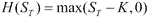*t=T*。 由于标的到期日的价值是不确定的，即*S_T*是一个随机变量，因此收益函数*H(S_T)*也是不确定的。 我们可以写出支付函数的期望值是期望值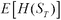。 此外，在欧洲看涨期权合约中，我们今天支付溢价，以便有权在到期时行使或不行使期权*t=T*。 我们今天应该为这份合同支付多少保险费？

正如我们以前说过的，在公允价值设置下，我们预期收到的应该与我们预期支付的相等。 通过将所有这些现金流放在一起(正表示要接收，负表示要支付)，我们可以写成：

*   在*t=0*时支付的金额写为
*   在*t=T*接收的金额记为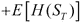

如果我们现在计算这些现金流的现值，我们会得到以下方程式：

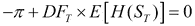

换言之，可以概括为：

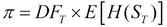

MC 模拟法的目的就是帮助我们计算收益的期望值；一旦你计算了这个期望值，就对这个值进行折现，以获得导数的溢价。

同样的想法可以推广到更复杂的环境，有许多复杂的收益和基础。

## MC 方法的算法

对于欧式衍生品，MC 模拟由以下三个步骤组成：

1.  The first step is to generate trajectories.

    模拟基础从*t=0*到成熟*t=T*的*M*轨迹。 在这一步中，我们使用 SDE 的离散化版本来描述底层的演变。 在我们的例子中，我们使用 GBM 作为 SDE，这将允许我们将股票的价值从当前值*S_0*取到到期值*t=T*。 离散化版本本质上是适用于有限时间步长而不是连续时间步长的近似版本。 具体请参考金融工程中的*蒙特卡罗方法*。 我们将期权合约的有效期离散为*N*步，每个步的大小为*DT*，可以简洁地写成：

    

    在此步骤结束时，我们应该有一个由*S_T*的*M*值组成的向量，如下所示：

    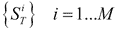

    这些表示在时间*t=T*时底层*S*的值的一组可能的情况。 我们使用 GBM 来生成多个路径，这些路径将用于预测*S_T*的值将在哪里到期。

2.  The next step is to compute the expectation.

    一旦我们有了到期时标的的一组价值，我们现在就需要计算到期时的预期收益。 因此，我们取这些值中的每一个，并按如下方式计算每个值的收益：

    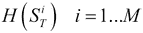

    前面的方程式将给我们一个收益向量。 为了计算预期，我们只需按如下方式取收益的平均值：

    

3.  Now discount the expectation to the present.

    最后一步是将收益从到期到现在的价值贴现。 为此，我们将使用以下公式：

    

    或者，我们也可以使用连续复合，如下所示：

    

    前面的方程式将给出导数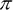的值。 注意，在这种情况下，我们假设利率和股票价格之间没有相关性。 这就是为什么我们可以在前面的方程式中巧妙地区分这两种效应的原因。 如果利率和股票价格是相关的，那么我们就不能将贴现因子和预期分开。 这种无相关性假设是简单定价模型的标准。

## MC 方法示例

考虑一下的例子，我们想要为沃达丰股权(VOD.L)的 6 个月期欧洲看涨期权定价。 沃达丰目前的股权价格为 100.00 GB，波动率为 20%，执行价为 100 GB。 我们假设股票不支付股息。 目前的无风险费率为年利率 5%。 我们如何使用 MC 模拟来解决这个问题？ 我们分以下三个阶段进行：

1.  The first step is to generate trajectories.

    我们应用 GBM 从今天的现货价格*S_0=GB 100.00*模拟 VOD.L 股票的价值。 为简单起见，我们选择将期权寿命从*t=[0，T]*离散化到*N=5*时间步长，并使用 GBM 以离散方式进行*M=5*模拟，如下所示：

    

    因此，五个轨迹如下：

    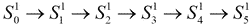

    

    

    

    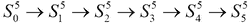

    股票到期日价格如下：

    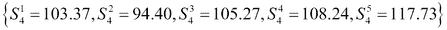

2.  The next step is to compute the expectation.

    对于底层的每个值，我们现在按如下方式计算收益：

    

    我们现在使用收益的具体形式来描述欧式看涨期权，如下所示：

    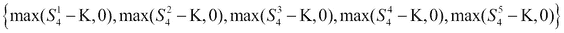

    我们将以下数字应用于前面的方程式，以获得以下结果：

    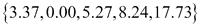

    前面计算的期望值如下：

    

3.  Now discount the expectation to the present.

    现在，我们使用以下连续复数来折现我们在步骤 2 中刚刚计算的预期收益，以确定溢价的价值：

    

    在本例中，我们只对 MC 价格使用了五个场景。 在实践中，需要成百上千个场景才能获得可接受的误差。 显然，您使用的场景越多，近似值就越准确。 给出了 MC 方法的误差界公式，并证明了其收敛速度。 有关更多详细信息，请读者参考金融工程中的*蒙特卡罗方法*。 将五个 MC 场景的所有轨迹放在一起，我们得到如下截图所示的表格。 在这里，我们看到所有的轨迹都从*S0=100*开始，并到达某个最终值*S5*。 对于每个轨迹，我们计算收益*H*，然后将其平均以计算其期望值。 然后对结果进行折现，以获得导数的现值。

    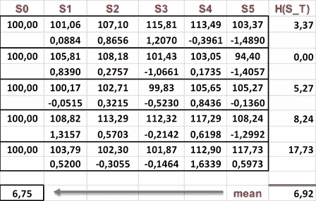

    蒙特卡罗模拟实例

# 二叉树法

**二叉树**(**bt**)可以追溯到(Cox，Ross，and Rubinstein 1979)的工作。 与 MC 方法一样，它们基于股价离散化如何上下跳跃的想法。 与 MC 方法不同的是，BT 不是基于对许多可能路径的模拟，而是基于构建在每个节点处分叉的未来可能价格的单一路径。 这些价格及其相关概率构成了这棵树。 一旦构建了这棵树，就可以确定标的到期时的价格，然后计算到期时的收益，并将其贴现到当前时间，以确定衍生品的溢价。

## BT 方法的算法

BT 法应用于价格衍生品时，包括三个阶段：构建价格树(正向阶段)、计算收益(到期日阶段)和将收益折现到当前时间(向后阶段)。 我们现在将在两步 BT 的简化上下文中解释 BT 方法。 这可以很容易地推广到*N*阶树。

首先，我们假设基础指数只能在下一个时间步长上升或下降。 因此，我们指定向上因子*u*来描述今天的值改变到更高值的程度，指定向下因子*d*来描述今天的值改变到更低值的程度，这样向上的值是*S(T)=us S(0)*，向下的值是*S(T)=dS(0)*。 此外，请参阅“期权定价：简化方法”。 上下值的公式如下所示：

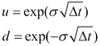

以下是上涨概率的公式：

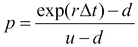

下跌的概率是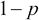。 现在，我们可以分以下三个阶段构建我们的二叉树：

1.  The first phase is the forward phase.

    在这里，我们构建了这棵树。 与 MC 模拟一样，时间从*t=0*到*t=T*以步骤*dt*离散化。 从一个步骤*tp*开始，标的的下一个价格可以上升或下降一个系数*u*或*d*，如以下公式所示：

    

    

    

    因此，树成熟时的值如下所示：

    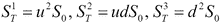

    在一般情况下，我们以类似的方式进行，直到我们到达成熟度*T*，并且我们得到变量*S*的*N+1*值。 我们将借助以下公式计算这些值：

    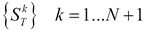

    在我们的例子中，前面的方程式可以总结如下：

    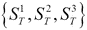

    整个过程如下图所示：

    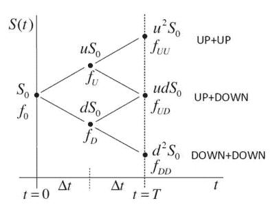

2.  The second phase is the payoff phase.

    在此阶段中，我们使用到期时标的的价值，并对每个标的计算收益的价值，如下所示：

    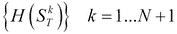

    在我们的情况下，方程式可以总结如下：

    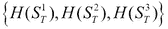

    以下依次是期权到期时的值*T*：

    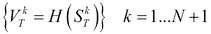

    在我们的例子中，前面的方程式可以总结如下：

    

3.  The third phase is the backward phase.

    在这个最后阶段，我们取到期收益的值，然后以倒退的方式进行。 我们从最后一个节点移动到前一个节点，方法是使用加权概率将期权价值计算为前一个节点的折现预期收益，如下所示：

    

    在我们的例子中，在第二步中，方程式如下所示：

    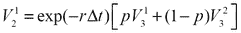

    

    并且，在第一步中，方程式如下所示：

    

    衍生产品的溢价，即期权价格，就是价值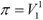。

## BT 方法示例

考虑我们想要为劳斯莱斯股权(RR.L)的 6 个月期欧洲看涨期权定价的例子。 该股目前的股价为 GB 100.00，波动率为每年 30%。 以及一次 90 GB 的罢工。 我们假设股票不支付股息。 目前的无风险费率为年利率 5%。 我们如何使用 BT 来解决这个问题？

首先，我们将期权的有效期分为两步，因此*dt=0.25*。 以下屏幕截图中的表格说明了应用于此问题的三个步骤中每个步骤的数值：

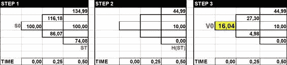

二叉树定价示例。

我们首先计算上行和下行因子以及上行概率*p*。 在数字方面，这些都是使用以下公式计算的：

下面的分别是上升和下降的概率：

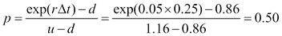

有了所有这些参数，我们现在可以分三个阶段构建树，如下所示：

1.  The first phase is the forward phase.

    我们现在可以构建树的两个级别，如下所示。

    

    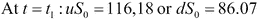

    

    因此，树成熟时的值如下：

    

2.  The second phase is the payoff phase.

    在此阶段，我们使用到期时标的的价值，并按如下方式计算收益的价值：

    

    在我们的例子中，方程式可以总结如下：

    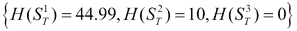

    以下依次是期权到期时的值*T*：

    

    在我们的例子中，前面的方程式可以总结如下：

    

3.  The third phase is the backward phase.

    在这个最后阶段，我们取到期收益的值，然后以倒退的方式进行。 我们从最后一个节点移动到前一个节点，通过使用加权概率计算前一个节点中的期权价值作为折现的预期收益，如下所示：

    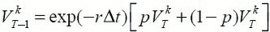

    在我们的例子中，在第二步中，方程式如下所示：

    

    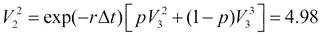

    在第一步中，方程如下：

    

# 有限差分法

有限差分(FD)方法是一种直接专注于微分方程近似解的数值技术。 如 Black and Scholes 1973)所示，对于权益类金融衍生品(或有债权)，问题用**偏微分方程**(**PDE**)表示。

有限差分法的基本思想是对微分方程进行离散化。 该方法将微分方程中的导数转换为近似导数的量或比率。 这些量不再是无穷小的，而是有限的，也就是说，它们的长度是有限的。 这就是有限差这个名称的由来。 有关更多细节，读者可以参考*金融衍生品的数学：学生简介*。

考虑下图，其中连续函数*f(X)*和函数的一阶导数定义如下：

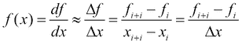

前面的函数也称为**斜率**，它是函数中的增长(或减小)相对于步长*DX*之间的比率。 使用前面的有限差分，我们可以用代数量计算*f(X)*函数的斜率。

在量化金融中，我们遇到了各种各样的偏微分方程。 最重要的是 Black-Scholes PDE，表示如下：

现在我们考虑在*S*和*T*轴上的矩形区域内求解该方程。 在*S*轴上，区域是[a，b]。 在*t*轴上，区域是[0，T]。 这可以数学地写成域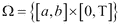。 在欧洲电话的情况下，它有一个最终条件，如下所示：

以下是边界条件：

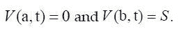

我们不会直接求解 Black-Scholes 偏微分方程(即使用变量*S*和*t*)(Wilmott 等人)。 1995)，我们将提出变量的改变。 这将把原来的偏微分方程组转化为一个等价的偏微分方程组，更容易求解，实际上就是热扩散的经典方程。 变量的变化情况如下：

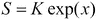

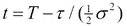

前面的方程将 Black-Scholes 偏微分方程转换为经典的热扩散方程，如下所示：

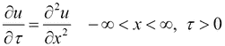

并将个欧洲呼叫收益转换为以下公式：

其中参数*k*是：。

## FDM 算法

将 FDM 应用于前面的 PDE 的需要关于时间的一阶导数和关于*x*的二阶导数，这将导致以下方程：

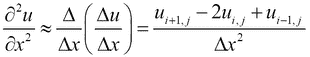

前面的近似可以从泰勒级数展开得到。 见(Wilmott et al.。 1995)，就像我们在上一节中所做的那样。

为了做到这一点，我们需要将函数的域离散为一组离散的节点。 在 BS 方程的情况下，在空间维度中将有*N*除法(或*N+1*)节点，在时间维度中将有*M*除法(或*M+1*)节点。

如果我们现在把以前的近似值放在一起，我们会得到以下公式：

求解前面方程的 LHS 项，我们最终得到以下 PDE 的离散化版本：

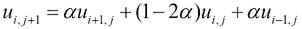

其中，在前面的方程式中。

离散版本的偏微分方程可以在时间上迭代求解，使用**显式**或**向前**有限差分法(FDM)，因为它是期权定价的有限差分技术的最简单实现。 现在，我们准备执行应用 FDM 的下一个阶段，如下所示：

1.  First, discretize the domain.

    使用时间步长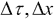在空间和时间维度上执行此步骤。

2.  Now approximate each of the derivatives with finite differences.

    正如我们在上一节中所展示的那样，我们将应用将偏微分方程的连续导数转换为有限近似的原理。 这种有限近似将导致代数方程。 在文献中，这组方程称为**模板**。

3.  Next collocate the stencil to all the nodes of the domain.

    现在，我们将模板应用于域中的所有节点，但表示初始和边界条件的节点除外。 对于这些节点，我们知道该值是先验的，因此不需要计算它。

4.  Iterate the solution in time with the stencil until we cover the full domain.

    在显式 FDM 中，只需推进并计算未知函数*u*的值。 请注意，在其他形式的有限差分(如隐式有限差分)中，我们需要通过矩阵问题来求解方程组。 请参阅(Wilmott 等人)。 1995)，以获取有关隐式方法的更多详细信息。

## FD 方法示例

考虑一下的例子，我们想要为巴克莱股权(BARC.L)的 6 个月期欧式看涨期权定价。 BARC 目前的股价为 75 GB，波动率为每年 30%。 以及 75 GB 的打击。 我们假设股票不支付股息。 目前的无风险费率为年利率 5%。 我们如何使用 FDM 解决这个问题？

我们知道，当股票被用 GBM 建模时，股票金融衍生品满足 Black-Scholes 偏微分方程。 因此，我们求解上一节中描述的热扩散方程。 如前所述，我们应用以下四个阶段来解决 FDM 问题：

1.  First discretize the domain.

    我们将区域划分为*N*空间分割*DS*和*M*时间分割*DT*，从而*N=5*和*M=4*。 我们首先使用时间步长在空间和时间维度上应用这些值。

    因此，我们在时间上获得了以下六个点：

    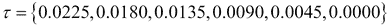

    空间中的五个点如下所示：

    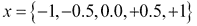

2.  Now approximate each of the derivatives with finite differences as follows.

    

    In the preceding equation, 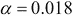.
3.  Collocate the stencil to all the nodes of the domain.

    以下是初始条件：

    

    或者，以下是具有数值的条件：

    

    In the preceding equation, .

    以下是最终边界条件：

    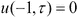和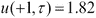。

4.  Iterate the solution in time with the stencil until we cover the full domain.

    以下是内部节点：

    

    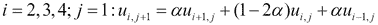

    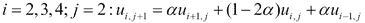

    

我们可以使用变换后的变量(上表)或原始变量(下表)来排列我们算法的数值结果，如下面截图中的表格所示，其中我们可以发现，对于*S=75*和*t=0*，期权价格为*GB 4，20*，其中我们可以发现，对于*S=75*和*t=0*，期权价格为*GB 4，20*：

有限差分定价的例子。

# 摘要

在这一章中，我们回顾了当今用于金融衍生品定价的三种关键数值方法的基础知识。 对于每一个问题，我们都给出了一个算法和一个数值算例。 此外，这些方法的更高级特征可以在(Glasserman 2003)、(Kloeden 和 Plten 1992)和(Wilmott 等人)的优秀教科书中找到。 1995)，如前面讨论的所有章节所述。

并非所有方法都适用于所有情况，就像工具箱中的工具一样。 有些方法对于解决一些具体问题更为有效。 例如，对于二叉树，评估美式期权也很简单，而对于蒙特卡洛，就不那么简单了。 蒙特卡罗在高维问题中的功能更强大，而有限差分法在低维问题中可以有效地使用。