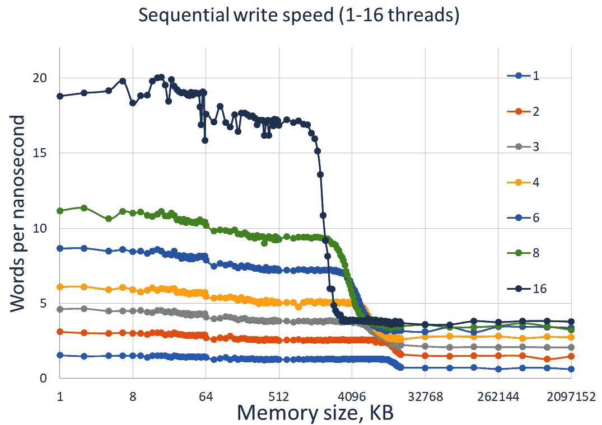
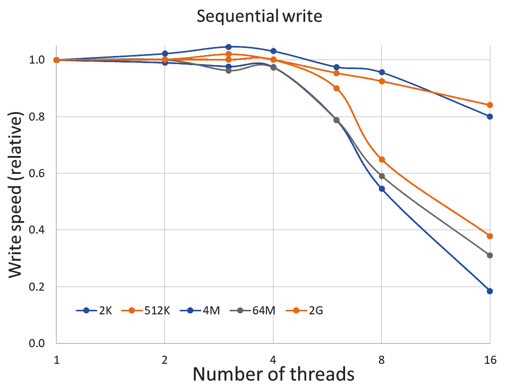
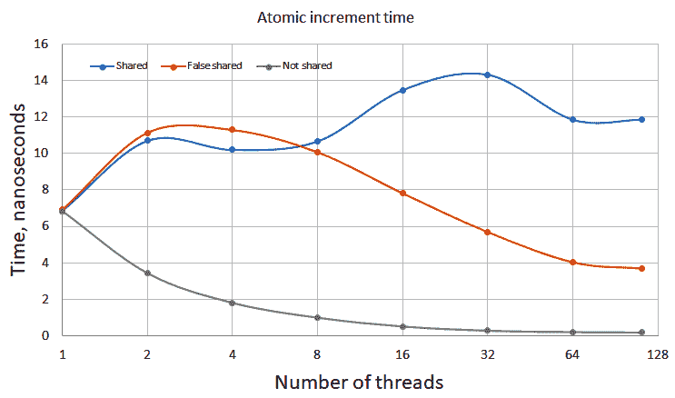
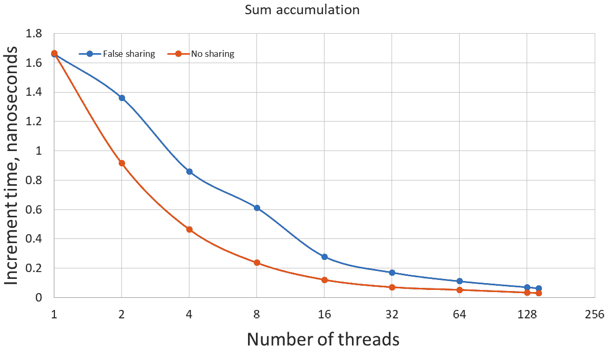
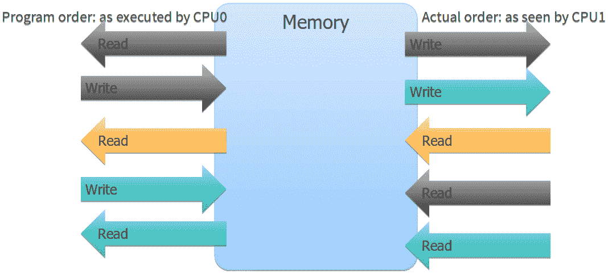
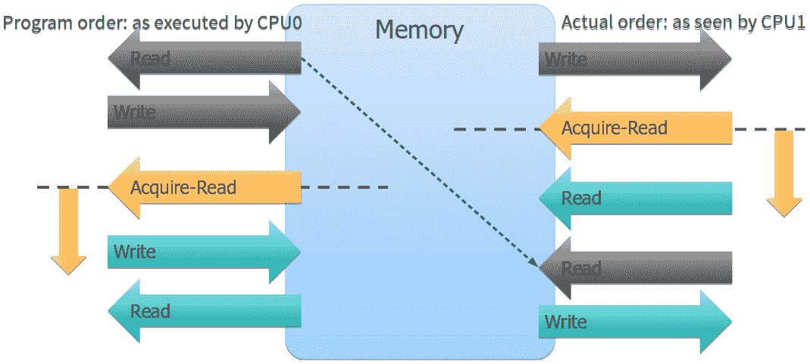
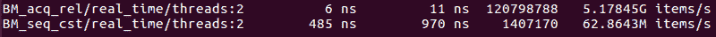

# 五、线程、内存和并发

到目前为止，我们已经研究了单个 CPU 执行一个程序，一个指令序列的性能。在[*第一章*](01.html#_idTextAnchor014)、*性能与并发*介绍中，我们提到这已经不是我们生活的世界了，我们再也没有触及过这个主题。相反，我们研究了在一个 CPU 上运行的单线程程序性能的各个方面。现在，我们已经了解了有关一个线程性能的所有知识，并准备研究并发程序的性能。

在本章中，我们将介绍以下主要主题:

*   线程概述
*   多线程和多核内存访问
*   数据竞争和内存访问同步
*   锁和原子操作
*   记忆模型
*   记忆顺序和记忆障碍

# 技术要求

同样，您将需要一个 C 编译器和一个微基准测试工具，例如我们在上一章中使用的 Google 基准库 (在[https://github.com/google/benchmark](https://github.com/google/benchmark)找到)。

本章的代码可在[https://github.com/PacktPublishing/ 高效程序/tree/master/Chapter05](https://github.com/PacktPublishing/The-Art-of-Writing-Efficient-Programs/tree/master/Chapter05)找到

# 理解线程和并发

当今所有高性能计算机都具有多个 CPU 或多个 CPU 内核 (单个封装中的独立处理器)。即使大多数笔记本电脑也至少有两个 (通常是四个) 内核。正如我们多次说过的，在性能的背景下，效率不会让任何硬件闲置; 如果一个程序只使用计算能力的一小部分，例如许多 CPU 内核中的一个，它就不能高效或高性能。一个程序一次使用多个处理器的方法只有一种: 我们有来运行多个线程或进程。顺便说一句，这并不是为用户利益使用多个处理器的唯一方法: 例如，很少有笔记本电脑用于高性能计算。相反，他们使用多个 cpu 来更好地同时运行不同和独立的程序。这是一个非常好的使用模型，但不是我们在高性能计算环境中感兴趣的模型。HPC 系统通常随时在每台计算机上运行一个程序，在分布式计算的情况下，甚至在许多计算机上运行一个程序。一个程序如何使用许多 cpu？通常，程序运行多个线程。

## 什么是线程？

**线程**是可以独立于其他线程执行的指令序列。多个线程在同一个程序中并发运行。所有线程共享相同的内存，因此，根据定义，同一进程的线程在同一台机器上运行。我们已经提到，HPC 程序也可以由多个进程组成。分布式程序在多台机器上运行，并利用许多单独的进程。分布式计算的主题不在本书的范围之内: 我们正在学习如何最大限度地提高这些过程的性能。

那么，关于多个线程的性能，我们能说些什么呢？首先，只有当系统有足够的资源来同时执行它们时，让多个指令序列同时执行是有益的。否则，操作系统只是在不同的线程之间切换，以允许每个时间片执行。

在单个处理器上，忙于计算的线程提供了处理器所能处理的尽可能多的工作。即使线程没有使用所有计算单元或正在等待内存访问，这也是正确的: 处理器一次只能执行一个指令序列-它有一个程序计数器。现在，如果线程正在等待某些东西 (例如用户输入或网络流量)，则 CPU 处于空闲状态，并且可以执行另一个线程而不会影响第一个线程的性能。同样，操作系统处理线程之间的切换。请注意，在内存上等待在这个意义上不算作等待: 当一个线程在内存上等待时，执行一条指令只需要更长的时间。当一个线程在等待 I/O 时，它必须进行操作系统调用，然后它被操作系统阻止，并且在操作系统唤醒它来处理数据之前根本不执行任何事情。

如果目标是使程序整体效率更高，则所有进行大量计算的线程都需要足够的资源。通常，当我们考虑线程的资源时，我们会想到多个处理器或处理器内核。但是，正如我们将要看到的那样，还有其他方法可以通过并发来提高资源利用率。

## 对称多线程

我们在本书中多次提到，处理器有很多计算硬件，大多数程序很少 (如果有的话) 使用所有硬件: 中的数据依赖关系限制了处理器在任何时候可以进行多少计算。如果处理器有备用的计算单元，它不能同时执行另一个线程来提高效率吗？这就是**对称多线程** (**SMT**)，又称**超线程**背后的思想。

具有 SMT 功能的处理器具有一组寄存器和计算单元，但有两个 (或更多) 程序计数器和它用来维持运行线程状态的任何附加硬件的额外副本 (确切的实现方式因处理器而异)。最终结果是: 单个处理器在操作系统和程序中显示为两个 (通常) 或更多个单独的处理器，每个处理器都能够运行一个线程。实际上，在一个 CPU 上运行的所有线程都在争夺共享的内部资源，例如寄存器。如果每个线程没有充分利用这些共享资源，SMT 可以提供显著的性能提升。换句话说，它通过运行几个这样的线程来补偿一个线程的效率低下。

在实践中，大多数支持 SMT 的处理器可以运行两个线程，并且性能提升差异很大。很少看到 100% 加速 (两个线程都以全速运行)。通常，实际的加速是在 25% 和 50% 之间 (第二个线程有效地以四分之一速度到一半速度运行)，但是有些程序根本没有加速。就本书而言，我们不会以任何特殊方式对待 SMT 线程: 在程序中，SMT 处理器显示为两个处理器，我们所说的关于在单独内核上运行的两个*实际*线程的性能同样适用于恰好在同一内核上运行的两个线程的性能。在一天结束时，您必须测量是否运行比物理核心更多的线程为您的程序提供了任何加速，并在此基础上决定要运行多少线程。

无论是共享整个物理核心还是 SMT 硬件创建的逻辑核心，并发程序的性能在很大程度上取决于线程如何独立工作。这首先是由算法和线程之间的工作划分决定的; 这两个问题都有数百本专门针对它们的书，但不在本书的范围之内。取而代之的是，我们现在关注影响线程交互的基本因素，并确定特定实现的成功或失败。

## 线程和内存

由于在多个计算线程之间对 CPU 进行时间分割没有性能上的好处，因此我们可以假设在本章的其余部分中，我们在每个处理器内核上运行一个 HPC 线程 (或者在 SMT 处理器提供的每个*逻辑内核*上运行一个线程)。只要这些线程不争夺任何资源，它们就完全独立运行，我们享受*完美加速*: 两个线程在中完成的工作量是一个线程完成的两倍。如果可以在两个线程之间以不需要任何交互的方式完美地划分工作，则两个线程将在一半的时间内解决问题。

这种理想的情况确实会发生，但并不经常发生; 更重要的是，如果发生了，你已经准备好从你的程序中获得最佳性能: 你知道如何优化单个线程的性能。

当不同线程完成的工作不是完全独立的，并且线程开始争夺资源时，编写高效并发程序的困难部分就开始了。但是，如果每个线程都充分利用了其 CPU，那么还有什么可以竞争的呢？剩下的是内存，它在所有线程之间共享，因此是一个公共资源。这就是为什么对多线程程序性能的任何探索几乎都只关注线程之间通过内存进行交互所产生的问题的原因。

编写高性能并发程序还有另一个方面，那就是在一起构成程序的线程和进程之间划分工作。但是要了解这一点，您必须找到一本有关并行编程的书。

事实证明，当我们添加并发时，已经是性能的*长极*的内存更是一个问题。虽然硬件强加的基本限制是无法克服的，但大多数程序的性能甚至都没有达到这些限制，而且熟练的程序员还有很大的空间来提高其代码的效率; 本章为读者提供了必要的知识和工具。

让我们首先检查在存在线程的情况下内存系统的性能。我们用与上一章相同的方式，通过测量读取或写入内存的速度，只是现在我们使用多个线程同时读取或写入。我们从开始，每个线程都有自己的内存区域可以访问。我们没有在线程之间共享任何数据，但是我们共享硬件资源，例如内存带宽。

内存基准测试本身与我们之前使用的几乎相同。实际上，基准函数本身是完全相同的。例如，为了基准顺序读取，我们使用此函数:

```cpp
template <class Word>
void BM_read_seq(benchmark::State& state) {
     const size_t size = state.range(0);
     void* memory = ::malloc(size);
     void* const end = static_cast<char*>(memory) + size;
     volatile Word* const p0 = static_cast<Word*>(memory);
     Word* const p1 = static_cast<Word*>(end);
     for (auto _ : state) {
           for (volatile Word* p = p0; p != p1; ) {
                 REPEAT(benchmark::DoNotOptimize(*p++);)
           }
           benchmark::ClobberMemory();
     }
     ::free(memory);
     state.SetBytesProcessed(size*state.iterations());
     state.SetItemsProcessed((p1 - p0)*state.iterations());
}
```

请注意，内存是在基准函数内部分配的。如果从多个线程调用此函数，则每个线程都有自己的内存区域来读取。这正是 Google 基准库在运行多线程基准测试时所做的。要在多个线程上运行基准测试，您只需要使用正确的参数:

```cpp
#define ARGS ->RangeMultiplier(2)->Range(1<<10, 1<<30) \
     ->Threads(1)->Threads(2)
BENCHMARK_TEMPLATE1(BM_read_seq, unsigned long) ARGS;
```

您可以根据需要为不同的线程计数指定多个运行，或者使用`ThreadRange()`参数生成 1、2、4、8、… 线程的范围。您必须决定要使用多少线程; 对于 HPC 基准测试，一般来说，没有理由超过您拥有的 cpu 数量 (考虑到 SMT)。其他内存访问模式 (例如随机访问) 的基准测试也是通过相同的方式完成的; 您已经看到了上一章中的代码。对于写作，我们需要写一些东西; 任何值都可以:

```cpp
     Word fill; ::memset(&fill, 0xab, sizeof(fill));
     for (auto _ : state) {
           for (volatile Word* p = p0; p != p1; ) {
                 REPEAT(benchmark::DoNotOptimize(*p++ = 
                   fill);)
           }
           benchmark::ClobberMemory();
     }
```

现在是时候展示结果了。例如，这里是顺序写入的内存吞吐量:



图 5.1-连续写入 64 位整数的内存吞吐量 (每纳秒字)，作为 1 到 16 个线程的内存范围的函数

总体趋势对我们来说已经很熟悉: 我们看到与缓存大小相对应的速度跳跃。现在我们关注不同线程数的曲线之间的差异。我们得到了 1 到 16 个线程的结果 (用于收集这些测量的机器确实至少有 16 个物理 CPU 内核)。让我们从剧情的左侧开始。这里，速度由 L1 高速缓存 (最多 32 kb) 限制，然后由 L2 高速缓存 (256 KB) 限制。该处理器为每个核心都有单独的 L1 和 L2 缓存，因此，只要数据适合 L2 缓存，线程之间就不应该有任何交互，因为它们不共享任何资源: 每个线程都有自己的缓存。在现实中，这是不完全正确的，有其他 CPU 组件仍然共享，即使内存范围较小，但它几乎是正确的: 2 个线程的吞吐量是 1 个线程的两倍，4 个线程写入内存两倍的速度再次，而 16 个线程几乎比 4 个线程快 4 倍。

当我们超过 L2 缓存的大小并进入 L3 缓存然后进入主内存时，图片会发生急剧变化: 在此系统上，L3 缓存在所有 CPU 内核之间共享。主内存也是共享的，尽管不同的内存库更接近于不同的 cpu (非统一内存架构)。对于 1、2 甚至 4 个线程，吞吐量继续随着线程数的增加而扩展: 主内存似乎具有足够的带宽，最多可容纳 4 个处理器以全速写入其中。然后事情变得更糟: 当我们从 6 个线程到 16 个线程时，吞吐量几乎没有增加。我们已经饱和了内存总线: 它不能更快地写入数据。

如果这还不够糟糕，请考虑这些结果是在撰写本文时在最新硬件上获得的 (2020)。2018 年，作者在他的一个班级中展示的同一张图表如下所示:


图 5.2-较旧 (2018) CPU 的内存吞吐量

这个系统有一个内存总线，只需两个线程就可以完全饱和。让我们看看这个事实对并发程序的性能有什么影响。

## 内存绑定程序和并发

同样的结果可以以不同的方式呈现: 通过绘制每个线程的内存速度与一个线程的线程数相对，我们只关注并发对内存速度的影响:



图 5.3-相对于单个线程的吞吐量的内存吞吐量与线程计数

随着内存速度的归一化，所以它总是 1 的单线程，它更容易看到，对于适合 L1 或 L2 缓存的小数据集，内存每个线程的速度几乎保持不变，即使 16 个线程 (每个线程以其单线程速度的 80% 写入)。但是，一旦我们进入 L3 缓存或超过其大小，速度就会在 4 个线程后下降。从 8 个线程到 16 个线程只能提供最小的改进。系统中没有足够的带宽来足够快地将数据写入内存。

尽管读取内存的带宽通常比写入带宽稍好，但不同内存访问模式的结果看起来相似。

我们可以看到，如果我们的程序在单线程情况下是内存绑定的，那么它的性能受到将数据移入和从主存储器中移出的速度的限制，那么我们可以期望从并发中获得的性能改进有一个相当硬的限制。如果你认为这不适用于你，因为你没有昂贵的 16 核处理器，请记住，更便宜的处理器带有更便宜的内存总线，所以大多数 4 核系统也没有足够的内存带宽供所有内核使用。

对于多线程程序来说，更重要的是避免成为内存绑定。这里有用的实现技术是分裂计算，因此可以在适合 L1 或 L2 缓存的较小数据集上完成更多的工作; 重新排列计算，以便可以用更少的内存访问完成更多的工作，通常以重复一些计算为代价; 优化内存访问模式，使内存按顺序访问而不是随机访问 (即使您可以使两种访问模式都饱和，顺序访问的总带宽要大得多，因此，对于相同的数据量，如果使用随机访问，则程序可能会受到内存限制，如果使用顺序访问，则完全不受内存速度的限制)。如果单独的实现技术是不够的，并且不能产生期望的性能改进，那么下一步就是使算法适应并发编程的现实: 许多问题有多个算法，它们的内存需求不同。单线程程序最快的算法通常可以被另一种更适合并发的算法所超越: 我们在单线程执行速度中损失的东西，我们通过可扩展执行的蛮力来弥补。

到目前为止，我们假设每个线程完全独立于所有其他线程进行自己的工作。由于对有限资源 (例如内存带宽) 的争用，线程之间的唯一交互是间接的。这是最容易编写的一种程序，但是大多数现实生活中的程序都不允许这样的限制。这带来了一系列全新的性能问题，现在是我们了解它们的时候了。

# 了解内存同步的代价

最后一节是关于在同一台机器上运行多个线程，而这些线程之间没有任何交互。如果您可以在线程之间拆分程序所做的工作，以使这种实现成为可能的方式，那么一定要做到这一点。您无法击败这样的*令人尴尬的并行*程序的性能。

通常情况下，线程必须相互交互，因为它们正在为共同的结果贡献工作。这种交互是通过线程通过它们共享的一个资源 (内存) 相互通信而发生的。我们现在必须了解这对性能的影响。

让我们从一个微不足道的例子开始。假设我们要计算许多值的总和。我们有许多数字要补充，但最终只有一个结果。我们有太多的数字要添加，我们想在几个线程之间拆分添加它们的工作。但是只有一个结果值，因此线程必须在添加到此值时相互交互。

我们可以在微观基准中重现此问题:

```cpp
unsigned long x {0};
void BM_incr(benchmark::State& state) {
     for (auto _ : state) {
           benchmark::DoNotOptimize(++ x);
     }
}
BENCHMARK(BM_incr)->Threads(2);
```

为了简单起见，我们总是将结果递增 1 (添加整数的成本不依赖于值，我们不想对不同值的生成进行基准测试，只是加法本身)。由于基准函数是由每个线程调用的，因此在该函数内部声明的任何变量都独立存在于每个线程的堆栈上; 这些变量根本不共享。为了获得两个线程都有助于的共同结果，必须在基准函数之外，在文件范围内声明变量 (通常是坏主意，但在微基准的非常有限的上下文中是必要的和可接受的)。

当然，这个程序有一个比全局变量大得多的问题: 程序是完全错误的，其结果是不确定的。问题是我们有两个线程递增相同的值。递增值是一个 3 步过程: 程序从内存中读取值，在寄存器中递增值，然后将新值写回内存。两个线程完全有可能同时读取相同的值 (0)，在每个处理器 (1) 上分别递增它，然后将其写回去。写第二个的线程只会覆盖第一个线程的结果，经过两个增量，结果是 1 而不是 2。这样的*向同一个内存位置写入的两个线程的竞争*称为**数据竞争**。

既然你明白了为什么这样不受保护的并发访问是一个问题，你也可以忘记它; 相反，遵循这个一般规则: 任何程序都有未定义的结果，如果它从多个线程访问相同的内存位置而没有同步，并且这些访问中的至少一个是写的。这一点非常重要: 您没有必要准确地找出结果不正确必须发生的操作顺序。实际上，这种推理根本没有收获。任何时候你有两个或多个线程访问同一个内存位置，你都有数据竞争，除非你能保证以下两件事之一: 要么所有访问都是只读的，要么所有访问都使用正确的内存同步 (我们还没有了解)。

我们计算总和的问题要求我们将答案写入结果变量，因此访问绝对不是只读的。通常，内存访问的同步由互斥体提供: 对线程之间共享的变量的每次访问都必须由互斥体保护 (当然，它必须是所有线程的相同互斥体)。

```cpp
unsigned long x {0};
std::mutex m;
{ // Concurrent access happens here
     std::lock_guard<std::mutex> guard(m);
     ++ x;
}
```

锁定保护锁定其构造函数中的互斥锁，并在析构函数中解锁。一次只有一个线程可以有锁，因此，增加共享结果变量。其他线程在锁上被阻塞，直到第一个线程释放它。请注意，*所有*访问都必须被锁定，*读取和写入都必须被锁定，只要至少有一个线程在修改变量。*

锁是确保多线程程序正确性的最简单方法，但就性能而言，它们并不是最容易研究的事情。它们是相当复杂的实体，通常涉及系统调用。我们将从同步选项开始，在这种特殊情况下，该选项更易于分析: 原子变量。

C 给了我们一个选项来声明一个变量为原子。这意味着对该变量的所有支持的操作都是作为单个、不可中断的原子事务执行的: 观察该变量的任何其他线程都将在原子操作之前或之后看到其状态，但绝不会在操作的中间。例如，C 中的所有整数原子变量都支持原子增量操作: 如果一个线程正在执行该操作，则在第一个操作完成之前，没有其他线程可以访问该变量。这些操作需要一定的硬件支持: 例如，原子增量是一个特殊的硬件指令，它读取旧值，将其递增，并将新值全部写入为单个硬件操作。

对于我们的例子，原子增量是我们所需要的。必须强调的是，无论我们决定使用哪种同步机制，所有线程都必须使用相同的机制来对特定内存位置进行并发访问。如果我们在一个线程上使用原子操作，则只要所有线程都使用原子操作，它就可以保证没有数据竞争。如果另一个线程使用互斥体或非原子访问，则所有保证都是无效的，并且结果再次未定义。

让我们重写我们的基准来使用 C 原子操作:

```cpp
std::atomic<unsigned long> x(0);
void BM_shared(benchmark::State& state) {
     for (auto _ : state) {
           benchmark::DoNotOptimize(++ x);
     }
}
```

程序现在是正确的: 这里没有数据竞赛。它不一定准确，因为单个增量是一个非常短的时间间隔来测量; 我们真的应该手动或用宏展开循环，并在每个循环迭代中做几个增量 (我们在上一章中已经做到了，所以你可以在那里看到宏)。让我们看看它的表现如何。如果线程之间没有交互，则两个线程将计算一个线程完成任务所需时间的一半的总和:


图 5.4-多线程程序中的原子增量时间

我们对结果进行了归一化，以显示单个增量的平均时间，即计算总和除以加法总数的时间。这个程序的性能非常令人失望: 不仅没有改进，而且实际上，在两个线程上计算总和要比在一个线程上花费更长的时间。

如果我们使用更常规的互斥体，结果会更糟:


图 5.5-带有互斥体的多线程程序中的增量时间

首先，正如我们所预期的那样，即使在一个线程上，锁定互斥体也是相当昂贵的操作: 互斥体保护的增量为 23 纳秒，而原子增量为 7 纳秒。随着线程数的增加，性能下降的速度要快得多。

从这些实验中可以学到一个非常重要的教训。程序中访问共享数据的部分将永远不会扩展。访问共享数据的最佳性能是单线程性能。一旦您有两个或多个线程同时访问相同的数据，性能只会变得更差。当然，如果两个线程在不同的时间访问相同的数据，它们并没有真正相互交互，所以你得到了单线程的性能两次。多线程程序的性能优势来自线程独立执行而无需同步的计算。根据定义，这样的计算是在不共享的数据上完成的 (如果你希望你的程序是正确的，无论如何)。但是为什么对共享数据的并发访问如此昂贵？在下一节中，我们将了解原因。我们还将学到非常重要的一课，即仔细解释测量结果。

# 为什么数据共享很昂贵

正如我们刚刚看到的，共享数据的并发 (同时) 访问是一个真正的性能杀手。从直觉上讲，这是有道理的: 为了避免数据竞争，在任何给定时间，只有一个线程可以对共享数据进行操作。我们可以使用互斥体来完成此操作，或者使用原子操作 (如果有的话)。无论哪种方式，当一个线程增加共享变量时，所有其他线程都必须等待。我们在上一节的测量结果证实了这一点。

但是，在根据观察和实验采取任何行动之前，至关重要的是要准确地了解我们所测量的内容以及可以确定得出的结论。

很容易描述所观察到的内容: 同时从多个线程增加一个共享变量根本不会扩展，实际上，比仅使用一个线程要慢。对于由互斥体保护的原子共享变量和非原子变量都是如此。我们没有尝试测量对非原子变量的无保护访问，因为这样的操作会导致未定义的行为和不正确的结果。我们还知道，对线程特定 (不共享) 的变量的不受保护的访问与线程的数量非常好，至少在我们饱和聚合内存带宽之前 (这只有在我们写入大量数据时才会发生; 对于单个变量，这不是问题)。批判性地分析您的实验结果，而没有不合理的先入之见是一项非常重要的技能，所以让我们再次陈述我们所知道的: 对共享数据的有保护的访问是缓慢的，而对非共享数据的无保护的访问是快速的。如果我们由此得出结论，数据共享会使您的程序变慢，那么我们就假设: **共享数据**是重要的，**受保护的访问**不是。这就引出了你在做性能测量时应该记住的另一个非常重要的一点: 当比较两个版本的程序时，试着一次只改变一件事，并测量结果。

我们缺少的衡量标准是: 对受保护数据的非共享访问。当然，我们真的不需要保护访问只有一个线程访问的数据，但我们试图确切地了解是什么使共享数据访问如此昂贵: 它是共享的事实或它是原子的事实 (或受锁保护)。我们必须一次进行一次更改，因此让我们保持原子访问并删除数据共享。至少有两种简单的方法可以做到这一点。第一个是创建一个原子变量的全局数组，并让每个线程访问自己的数组元素:

```cpp
std::atomic<unsigned long> a[1024];
void BM_false_shared(benchmark::State& state) {
     std::atomic<unsigned long>& x = a[state.thread_index];
     for (auto _ : state) {
           benchmark::DoNotOptimize(++ x);
     }
}
```

Google 基准中的线程索引对于每个线程都是唯一的，数字从 0 开始，并且是紧凑的 (0,1，2…)。另一种简单的方法是在`benchmark`函数中声明变量，如下面的代码所示:

```cpp
void BM_not_shared(benchmark::State& state) {
     std::atomic<unsigned long> x;
     for (auto _ : state) {
           benchmark::DoNotOptimize(++ x);
     }
}
```

现在，我们正在增加与收集图 5.4 的测量值时相同的原子整数，只是它不再在线程之间共享。这将告诉我们是共享还是原子变量使增量变慢。以下是结果:



图 5.6-共享和非共享变量的原子增量时间

**共享**曲线是来自*图 5.4*的曲线，而另外两个则来自没有数据共享的基准。每个线程上带有局部变量的基准被标记为**不共享**，其行为如下: 两个线程上的计算时间比在一个线程上的计算时间的一半，去四个线程再次将时间减少一半，依此类推。请记住，这是一个增量操作的平均时间: 我们做，比方说，总共 100 万增量，测量它所花费的总时间，并除以一百万。由于我们增加的变量在线程之间不共享，我们期望两个线程的运行速度是一个线程的两倍，因此**不共享**结果正是我们所期望的。另一个基准，即我们使用原子变量数组，但每个线程使用自己的数组元素的基准，也没有共享数据。但是，它的表现就像数据在线程之间共享一样，至少对于少数线程而言是这样，因此我们将其称为**错误共享**: 没有什么是真正共享的，但是程序的行为就像它是共享的一样。

这个结果表明，数据共享成本高的原因比我们之前假设的要复杂: 在错误共享的情况下，每个数组元素上只有一个线程在操作，因此它不必等待任何其他线程完成其增量。然而，线程显然彼此等待。为了理解这种异常，我们必须更多地了解缓存的工作方式。

在多核或多处理器系统中，数据在处理器和存储器之间移动的方式如图 5.7 所示。


图 5.7-多核系统中 cpu 和内存之间的数据传输

处理器以单个字节或依赖于变量类型的字来操作数据; 在我们的例子中，`unsigned long`是一个 8 字节的字。原子增量在指定的地址读取单个单词，将其递增，然后将其写回去。但是从哪里读？CPU 只能直接访问 L1 缓存，因此它从那里获取数据。数据如何从主存储器进入缓存？它是通过内存总线复制的，它要宽得多。可以从内存复制到缓存并返回的最小数据量称为**缓存行**。在所有 x86 cpu 上，一条缓存行为 64 字节。当 CPU 需要为原子事务锁定内存位置时，例如原子增量，它可能是在写入单个单词，但它必须锁定整个缓存行: 如果允许两个 CPU 同时将同一缓存行写入内存，其中一个会覆盖另一个。请注意，为简单起见，我们在*图 5.7*中仅显示了一个缓存层次结构，但这没有区别: 数据以缓存行长度的块形式通过所有缓存级别。

现在我们可以解释我们观察到的错误共享: 即使相邻的数组元素在线程之间没有真正共享，它们确实占用了相同的缓存行。当 CPU 在原子增量操作的持续时间内请求对一个数组元素的独占访问时，它会锁定整个缓存行，并阻止任何其他 CPU 访问其中的任何数据。顺便说一句，这解释了为什么*图 5.7*中的错误共享看起来等同于最多 8 个线程的真实数据共享，但对于更多线程却变得更快: 我们正在编写 8 字节的单词，因此其中 8 个单词适合相同的缓存行。如果我们只有 8 个线程 (或更少)，则只有一个线程可以在任何给定时间增加其值，与真正共享相同。但是有了 8 个以上的线程，阵列至少占据了两条缓存线，它们可以被两个相互独立的 cpu 锁定。因此，如果我们在任何时候都有 16 个线程，则有两个线程可以向前移动，每个数组的一半都有一个线程。

另一方面，真正的不共享基准在每个线程的堆栈上分配原子变量。这些是完全独立的内存分配，由许多缓存行分隔。在没有通过内存进行交互的情况下，这些线程完全彼此独立地运行。

我们的分析显示，访问共享数据的高成本的真正原因是必须进行的工作，以保持对缓存行的独占访问，并确保所有 cpu 在其缓存中具有一致的数据: 在一个 CPU 获得独占访问并更新了缓存行中的一位之后，所有其他 CPU 的所有缓存中该行的副本都已过时。在这些其他 cpu 可以访问同一缓存行中的任何数据之前，它们必须从主存储器中获取更新的内容，正如我们所看到的，这需要相对较长的时间。

正如我们所看到的，两个线程是否尝试访问相同的内存位置并不重要，只要它们正在竞争访问相同的缓存行即可。独占缓存行访问是共享变量高成本的根源。

人们可能会想知道，在它们包含的共享数据中是否也会发现锁昂贵的原因 (所有锁都必须有一定数量的共享数据，这是一个线程可以让另一个线程知道锁被拿走的唯一方法)。互斥锁比单原子访问昂贵得多，即使在一个线程上，正如我们在*图 5.4*和*5.5*中看到的那样。我们可以正确地假设，锁定互斥体不仅涉及修改一个原子变量，还涉及更多的工作。但是，当我们有多个线程时，为什么这项工作需要更多时间？是因为数据是共享的，需要对缓存行进行独占访问吗？我们将其作为练习留给读者，以确认确实如此。这个实验的关键是设置锁的错误共享: 锁的数组，使得每个线程操作自己的锁，但他们竞争相同的缓存行 (当然，这样的每个线程锁实际上并不保护任何来自并发访问，但是我们想要的只是锁定和解锁它们所需的时间)。这个实验比你想象的要复杂一些: 标准的 C 互斥体，`std::mutex`，通常相当大，根据操作系统的不同，在 40 到 80 个字节之间。这意味着您甚至无法将其中两个放入同一缓存行。您必须使用较小的锁进行此实验，例如**自旋锁**或**futex**。

我们现在了解为什么同时访问共享数据的成本如此之高。这种理解给了我们两个重要的教训。第一个是在我们尝试创建非共享数据时避免错误的数据共享。意外的*错误共享*怎么会潜入我们的程序？考虑一下我们在本章中研究的简单例子: 同时累加一个和。我们的一些方法比其他方法慢，但它们都非常慢 (比单线程程序慢，或者充其量没有更快)。我们理解访问共享数据是昂贵的。那么，什么更便宜呢？当然，不访问共享数据!或者至少不经常访问它。没有理由让我们访问共享和值，每次我们想给它添加一些东西: 我们可以在本地，在线程上，并将它们添加到共享累加器值一次，最后。代码看起来像这样:

```cpp
// Global (shared) results
std::atomic<unsigned long> sum;
unsigned long local_sum[…];
// Per-thread work is done here
unsigned long& x = local_sum[thread_index];
for (size_t i = 0; i < N; ++ i) ++ x;
sum += x;
```

我们有全局结果`sum`，它在所有线程之间共享，并且必须是原子的 (或受锁保护)。但是在所有工作完成后，每个线程都精确地访问此变量一次。每个线程使用另一个变量来保存部分和，仅在此线程上添加的值 (在我们的平凡情况下为 1 的增量，但是无论添加的值如何，性能都是相同的)。我们可以创建一个大数组来存储这些每个线程的部分和，并给每个线程一个唯一的数组元素来处理。当然，在这个微不足道的例子中，我们可以只使用一个局部变量，但在实际程序中，在工作线程完成后，往往需要保留部分结果，这些结果的最终处理是在其他地方完成的，也许是由另一个线程完成的。为了模拟这种实现，我们使用每个线程变量的数组。请注意，这些变量只是纯整数，而不是原子: 没有对它们的并发访问。不幸的是，在此过程中，我们陷入了错误共享的陷阱: 数组的相邻元素 (通常) 位于同一缓存行上，因此无法同时访问。这反映在我们节目的表现中:



图 5.8-有和没有错误共享的总和

正如您在图 5.8 中看到的，我们的程序扩展非常差，直到我们到达大量线程为止。另一方面，如预期的那样，如果我们通过确保每个线程部分和至少间隔 64 个字节 (或者在我们的情况下简单地使用局部变量) 来消除错误的共享，它可以完美地缩放。虽然当我们使用更多线程时，这两个程序都会变得更快，但不受错误共享负担的实现仍然是大约两倍的速度。

第二课将在后面的章节中变得更加重要: 由于同时访问共享变量相对而言非常昂贵，因此使用较少共享变量的算法或实现通常会更快地执行。

这句话目前可能令人困惑: 根据问题的性质，我们有一些必须共享的数据。我们可以像刚才那样进行优化，并且消除对这些数据的不必要访问。但是一旦完成，剩下的就是我们需要访问的数据，以产生所需的结果。那么，如何有更多或更少的共享变量呢？要理解这一点，我们必须意识到，编写并发程序比保护对所有共享数据的访问要多。

# 学习并发和顺序

正如本章前面提醒读者的那样，在没有访问同步 (互斥或原子访问，通常) 的情况下访问任何共享数据的任何程序都具有未定义的行为，通常称为数据竞争。这似乎很简单，至少在理论上是这样。但是我们的激励例子太简单了: 它只有一个变量在线程之间共享。并发比锁定共享变量更多，正如我们即将看到的。

## 订单的需求

现在考虑这个例子称为**生产者-消费者队列**。让我们说我们有两个线程。第一个线程，生产者，通过构造对象来准备一些数据。第二个线程，即使用者，处理数据 (确实对每个对象起作用)。为简单起见，让我们说，我们有一个很大的内存缓冲区，最初是未初始化的，生产者线程在缓冲区中构造新对象，就像它们是数组元素一样:

```cpp
size_t N;     // Count of initialized objects
T* buffer; // Only [0]…[N-1] are initialized
```

为了生成 (构造) 对象，生产者线程通过在数组的每个元素上放置`new`运算符来调用构造函数，从`N==0`开始:

```cpp
new (buffer + N) T( … arguments … );
```

现在数组元素`buffer[N]`已初始化，并且可用于消费者线程。生产者通过推进计数器`N`发出信号，然后继续初始化下一个对象:

```cpp
++ N;
```

使用者线程不能访问数组元素`buffer[i]`，直到计数器`N`已经递增，所以它大于`i`:

```cpp
for (size_t i = 0; keep_consuming(); ++ i) {
     while (N <= i) {}; // Wait for the i-th element
     consume(buffer[i]);
}
```

为简单起见，让我们忽略内存不足的问题，并假设缓冲区足够大。另外，我们现在不关心终止条件 (消费者 如何知道何时继续消费？)。目前，我们对生产者-消费者握手协议感兴趣: 消费者如何在没有任何种族的情况下访问数据？

一般规则规定，对共享数据的任何访问都必须受到保护。显然，计数器`N`是一个共享变量，因此访问它需要更多的关注:

```cpp
size_t N;     // Count of initialized objects
std::mutex mN;    // Mutex to guard N
… Producer …
{
     std::lock_guard l(mN);
     ++ N;
}
… Consumer … 
{
     size_t n;
     do {
           std::lock_guard l(mN);
           n = N;
     } while (n <= i);
}
```

但这够了吗？仔细看: 我们的程序中有更多共享数据。对象的整个数组`T`在两个线程之间共享: 每个线程需要访问每个元素。但是如果我们需要锁定整个数组，我们不妨回到单线程实现: 两个线程中的一个总是被锁定。根据经验，每个曾经编写过任何多线程代码的程序员都知道，在这种情况下，我们不需要锁定数组，只需要锁定计数器。实际上，锁定计数器的全部意义在于我们不需要以这种方式锁定数组: 数组的任何特定元素都不会同时访问。首先，在计数器递增之前，只有生产者才能访问它。然后，只有在 计数器递增后，消费者才能访问它。这是已知的。但这本书的目的是教你如何理解为什么事情会以这样的方式工作，那么，为什么锁定柜台就足够了？是什么保证事件真正按照我们想象的顺序发生？

顺便说一句，即使这个琐碎的例子也变得不那么琐碎。保护消费者进入柜台的天真方式如下:

```cpp
std::lock_guard l(mN);
while (N <= i) {};
```

这是一个有保证的死锁: 一旦消费者获得了锁，它就会等待元素`i`被初始化后再释放锁。生产者不能取得任何进展，因为它正在等待获取锁，然后才能增加计数器`N`。两个线程现在都在永远等待。很容易注意到，如果我们只使用一个原子变量作为计数器，我们的代码会简单得多:

```cpp
std::atomic<size_t> N;     // Count of initialized objects
… Producer …
{
     ++ N;    // Atomic, no need for locks
}
… Consumer … 
{
     while (N <= i) {};
}
```

现在，消费者对计数器`N`的每次读取都是原子的，但是在两次读取之间，生产者没有被阻止并且可以继续工作。这种实现并发的方法被称为**无锁** (它不使用任何锁)，我们稍后再讨论。目前，重要的问题是: 我们是否仍然可以保证生产者和消费者不能同时访问同一对象`buffer[i]`？

## 记忆顺序和记忆障碍

正如我们已经意识到的那样，能够安全地访问共享变量不足以编写任何非平凡的并发程序。我们还必须能够推理事件发生的顺序。在我们的生产者和消费者示例中，整个程序基于一个假设: 我们可以保证第 N 个数组元素的构造，将计数器递增到 N 1，并且消费者线程对第 N 个元素的访问按该顺序发生。

但是，问题确实比我们意识到我们不仅要处理多个线程，而且要处理多个处理器，这些处理器确实同时执行这些线程。我们必须记住的关键概念是**可见性**。一个线程正在一个 CPU 上执行，并且在 CPU 为变量分配值时正在对内存进行更改。实际上，CPU 只是在改变其缓存的内容; 缓存和内存硬件最终将这些更改传播到主内存或共享的更高级别的缓存中，此时这些更改可能对其他 CPU 可见。我们说 “*may*” 是因为其他 cpu 在它们的缓存中对于相同的变量具有不同的值，并且我们不知道这些差异何时被调和。我们知道，一旦 CPU 开始对原子变量进行操作，在此操作完成之前，没有其他 CPU 可以访问相同的变量，并且一旦此操作完成，所有其他 cpu 都会看到此变量的最新更新值 (但前提是所有 cpu 都将该变量视为原子变量)。我们知道，这同样适用于由锁保护的变量。但是这些保证对于我们的生产者-消费者计划来说还不够: 根据我们到目前为止所知道的，我们不能确定它是正确的。这是因为，到目前为止，我们只关心访问共享变量的一个方面: 这种访问的原子性质或事务性质。我们希望确保整个操作，无论简单还是复杂，都可以作为单个事务执行，而不会被中断。

但是访问共享数据还有另一个方面，即**内存顺序**。就像访问本身的原子性一样，它是使用特定机器指令 (通常是原子指令本身上的属性或标志) 激活的硬件的功能。

记忆顺序有几种形式。限制最少的是放松的记忆顺序。当原子操作以宽松的顺序执行时，我们唯一的保证就是操作本身是原子执行的。这是什么意思？让我们首先考虑正在执行原子操作的 CPU。它运行一个线程，该线程包含其他操作，包括非原子操作和原子操作。其中一些操作修改了内存; 这些操作的结果可以被其他 cpu 看到。其他操作读取内存; 他们观察其他 cpu 执行的操作的结果。运行我们线程的 CPU 按照一定的顺序执行这些操作。可能不是在程序中编写它们的顺序: 编译器和硬件都可以对指令进行重新排序，通常是为了提高性能。但这是一个定义明确的顺序。现在让我们从另一个正在执行不同线程的 CPU 的角度来看它。第二个 CPU 可以看到内存的内容随着第一个 CPU 的工作而变化。但是，它们不一定相对于彼此或我们一直关注的原子操作以相同的顺序看到它们:



图 5.9-具有宽松内存顺序的操作的可见性

这就是我们之前谈到的可见性: 一个 CPU 以一定的顺序执行操作，但是它们的结果以非常不同的顺序对其他 CPU 可见。为了简洁起见，我们通常谈论操作的可见性，并且每次都不会提及*结果*。

如果我们在共享计数器`N`上的操作以宽松的内存顺序执行，我们将陷入严重的麻烦: 使我们的程序正确的唯一方法是锁定它，以便只有一个线程，生产者或消费者，可以在任何时候运行，而且我们没有从并发中获得性能提升。

幸运的是，我们可以使用其他内存顺序保证。最重要的是获取-释放内存顺序。当按此顺序执行原子操作时，我们可以保证访问内存并在原子操作之前执行的任何操作在该线程执行对同一原子变量的原子操作之前对另一个线程可见。同样，在原子操作之后执行的所有操作仅在对同一变量进行原子操作之后才变得可见。同样，请记住，当我们谈论操作的可见性时，我们的意思是它们的结果对于其他 cpu 来说是可以观察到的。这在*图 5.10*中很明显: 在左侧，我们有操作，因为它们是由**CPU0**执行的。在右边，我们有与它们在**CPU1**中看到的相同的操作。特别要注意的是，右边显示的原子操作是*原子写*。但是**CPU1**不执行 atomic write: 它执行一个 atomic read 来查看由**CPU0**执行的 atomic write 的结果。所有其他操作也是如此: 在左侧，该顺序由**CPU0**执行。在右侧，顺序如**CPU1**所示。


图 5.10-具有获取-释放内存顺序的操作的可见性

收购-释放订单保证是一个简短的声明，其中包含许多重要信息，因此让我们详细说明一些不同的要点。首先，顺序是相对于两个线程在同一原子变量上执行的操作定义的。直到两个线程原子访问同一个变量，它们的*时钟*相对于彼此完全是任意的，我们无法推理在其他事情之前或之后发生了什么，这些单词没有任何意义。只有当一个线程已经观察到另一个线程执行的原子操作的结果时，我们才能在之前谈论*，在*之后谈论*。在我们的生产者-消费者示例中，生产者原子地递增计数器`N`。消费者原子读取同一个计数器。如果计数器没有改变，我们对生产者的状态一无所知。但是，如果消费者看到计数器从 N 变为 N 1，并且两个线程都使用获取-释放内存顺序，我们知道，在增加计数器之前由生产者执行的所有操作现在对消费者是可见的。这些操作包括构造现在驻留在数组元素`buffer[N]`中的对象所需的所有工作，因此，使用者可以安全地访问它。*

第二个要点是，访问原子变量时，两个线程都必须使用获取-释放内存顺序。如果生产者使用此顺序来增加计数，但是消费者以宽松的内存顺序读取它，则无法保证任何操作的可见性。

最后一点是，所有的顺序保证都是根据对原子变量的操作在之前的*和*之后的*给出的。同样，在我们的生产者-消费者示例中，我们知道生产者为构造第 n 个对象而执行的操作的结果在消费者看到计数器变化时都是可见的。不能保证这些操作的可见顺序。您可以在*图 5.10*中看到这一点。当然，这对我们来说并不重要: 在物体被建造之前，我们不能触摸它的任何部分，一旦建造完成，我们就不在乎它的顺序。具有内存顺序保证的原子操作充当其他操作无法移动的障碍。你可以想象在*图 5.10*中这样一个障碍，将整个程序分成两个不同的部分: 计数之前发生的一切都增加了，之后发生的一切。因此，谈论诸如内存障碍之类的原子操作通常很方便。*

让我们暂时假设，在我们的程序中，计数器`N`上的所有原子操作都有获取释放障碍。这肯定会保证程序是正确的。但是请注意，获取-释放订单对我们的需求来说是过分的。对于生产者来说，它为我们提供了保证，当消费者看到计数器从 N 变为 N 1 时，在我们将计数增加到 N 1 之前构造的所有对象`buffer[0]`到`buffer[N]`将对消费者可见。我们需要那个保证。但是我们也可以保证，为构造剩余对象而执行的操作 (`buffer[N+1]` 及以后) 都还没有可见。我们不在乎: 消费者在看到计数器的下一个值之前不会访问这些对象。同样，在消费者方面，我们保证在消费者看到计数器更改为 N 1 之后执行的所有操作都将在该原子操作之后发生其影响 (内存访问)。我们需要这样的保证: 我们不希望 CPU 重新排序我们的消费者操作，并在对象`buffer[N]`准备就绪之前执行访问它的一些指令。但是我们也可以保证，在消费者移动到下一个对象之前，消费者完成处理前一个对象 (如`buffer[N-1]`) 的工作并对所有线程可见。同样，我们不需要这种保证: 没有什么取决于它。

拥有比绝对必要的更强有力的保证有什么害处？就正确性而言，没有。但这是一本关于编写快速程序 (也是正确的程序) 的书。为什么订购保证首先是必要的？因为当留给自己的设备时，编译器和处理器几乎可以任意重新排序我们的程序指令。他们为什么要这么做？通常，为了提高性能。因此，按理说，我们对执行重新排序的能力施加的限制越多，对性能的不利影响就越强。因此，总的来说，我们希望使用对程序的正确性有足够限制但没有比这更严格的内存顺序。

为我们提供生产者-消费者计划所需的确切存储顺序如下。在生产者方面，我们需要获取释放内存屏障给出的保证的一半: 在使用屏障进行原子操作之前执行的所有操作必须在其他线程执行相应的原子操作之前对其可见。这就是所谓的释放内存顺序:


图 5.11-释放内存顺序

当**CPU1**看到以释放内存顺序由**CPU0**执行的原子写操作的结果时，保证内存的状态，如**CPU1**所示，已经反映了在此原子操作之前由**CPU0**执行的所有操作。注意，关于原子操作后的**CPU0**执行的操作，我们没有说什么。正如我们在*图 5.11*中看到的，这些操作可以以任何顺序显示。由原子操作创建的记忆屏障仅在一个方向上有效: 在屏障之前执行的任何操作都无法越过它并在屏障之后被看到。但是屏障在另一个方向是可渗透的。因此，释放内存屏障和相应的获取内存屏障有时被称为**半屏障**。

获取内存顺序是我们在消费者方面需要使用的。它保证在屏障之后执行的所有操作对屏障之后的其他线程可见，如*图 5.12*所示:



图 5.12-获取内存顺序

获取和释放内存屏障始终作为一对使用: 如果一个线程 (在我们的情况下是生产者) 使用具有原子操作的释放内存顺序，则另一个线程 (消费者) 必须使用获取内存顺序在相同的原子变量上。为什么我们需要两个障碍？一方面，我们保证生产者在新对象增量之前所做的一切，只要看到这个增量，消费者就可以看到计数。但这还不够，因此，另一方面，我们可以保证消费者为处理这个新对象而执行的操作不能及时向后移动，直到他们可以看到该对象处于未完成状态的障碍物之前的时刻。

现在，我们了解仅在共享数据上进行原子操作是不够的，您可能会问我们的生产者-消费者计划是否确实有效。事实证明，锁定版本和无锁版本都是正确的，即使我们没有明确说明内存顺序。那么，如何在 C++ 中控制内存顺序？

## C 中的内存顺序

首先，让我们回想一下我们的生产者-消费者程序的无锁版本，即带有原子计数器的程序:

```cpp
std::atomic<size_t> N;     // Count of initialized objects
T* buffer; // Only [0]…[N-1] are initialized
… Producer …
{
     new (buffer + N) T( … arguments … );
     ++ N;    // Atomic, no need for locks
}
… Consumer … 
for (size_t i = 0; keep_consuming(); ++ i) {
     while (N <= i) {}; // Atomic read
     consume(buffer[i]);
}
```

计数器`N`是一个原子变量，是由模板`std::atomic`生成的具有类型参数`size_t`的对象。所有原子类型都支持原子读写操作，也就是说，它们可以出现在赋值操作中。另外，整数原子具有原子上定义和实现的规则整数运算，因此`++ N`是原子增量 (并不是所有的运算都定义了，例如没有运算符`*=`)。这些操作都没有明确指定内存顺序，那么我们有什么保证呢？事实证明，默认情况下，我们得到了最强的保证，即每次原子操作的双向内存屏障 (实际保证甚至更严格一点，正如您将在下一节中看到的那样)。这就是为什么我们的程序是正确的。

如果你认为这太过分了，你可以把保证减少到你需要的程度，但是你必须明确。原子操作也可以通过调用`std::atomic`类型的成员函数来执行，这就是您可以指定内存顺序的地方。消费者线程需要一个带有获取屏障的加载操作:

```cpp
while (N.load(std::memory_order_acquire) <= i);
```

生产者线程需要一个带有释放屏障的增量操作 (就像增量运算符一样，成员函数也返回增量完成之前的值):

```cpp
N.fetch_add(1, std::memory_order_release);
```

在我们继续前进之前，我们必须意识到我们已经跳过了优化过程中至关重要的一步。开始上一段的正确方法是，*如果你认为这是过度的，你必须通过性能测量来证明它，只有这样你才能减少保证只是你需要的*。即使使用锁，并发程序也很难编写; 必须证明使用无锁代码，尤其是显式内存顺序。

说到锁，他们给出了什么记忆顺序保证？我们知道任何受锁保护的操作都会被任何其他稍后获取锁的线程看到，但是内存的其余部分呢？使用锁强制执行的内存顺序如*图 5.13*所示:


图 5.13-互斥体的内存顺序保证

互斥子内部至少有两个原子操作。锁定互斥体等同于具有获取内存顺序的读取操作 (这解释了名称: 这是我们在*获取*锁时使用的内存顺序)。该操作创建半屏障在屏障之后可以看到较早执行的任何操作，但是在获取锁定之后执行的任何操作都无法更早地观察到。当我们解锁互斥锁或*释放*锁时，释放内存顺序得到保证。在此屏障之前执行的任何操作都将在屏障之前可见。您可以看到，这对屏障，获取和释放，充当夹在它们之间的代码部分的边界。这被称为关键部分: 在关键部分内执行的任何操作，即在线程持有锁时执行的操作，当它进入关键部分时，将对任何其他线程可见。没有任何操作可以离开关键部分 (更早或更晚变得可见)，但是从外部的其他操作可以进入关键部分。至关重要的是，没有这样的操作可以越过关键部分: 如果外部操作进入关键部分，则无法离开。因此，在其关键部分之前由**CPU0**完成的任何事情，在其关键部分之后由**CPU1**保证可见。

对于我们的生产者-消费者计划，这转化为以下保证:

```cpp
… Producer …
new (buffer + N) T( … arguments … );
{ // Critical section start – acquire lock
     std::lock_guard l(mN);
     ++ N;
} // Critical section end - Release lock
… Consumer … 
{ // Critical section – acquire lock
           std::lock_guard l(mN);
           n = N;
} // Critical section – release lock
consume(buffer[N]);
```

生产者为构造第 n 个对象而执行的所有操作都是在生产者进入关键部分之前完成的。在使用者离开其关键部分并开始消耗第 n 个对象之前，它们将对使用者可见。因此，该程序是正确的。

您刚刚阅读的部分介绍了内存顺序的概念，并通过示例进行了说明。但是，当您尝试在代码中使用这些知识时，您会发现结果 不一致。为了更好地理解性能，你应该从你可以用来同步多线程程序和避免数据竞争的不同方式中期待什么，我们需要用一种更少的手挥动的方式来描述内存顺序和相关概念。

# 内存模型

我们需要一种更加系统和严格的方法来描述线程通过内存的交互，它们对共享数据的使用及其对并发应用的影响。此描述称为内存模型。内存模型描述了线程访问相同内存位置时存在哪些保证和限制。

在 C++ 11 标准之前，c 语言根本没有内存模型 (标准中没有提到单词*线程*)。为什么这是个问题？再考虑一下我们的生产者-消费者的例子 (让我们关注生产者方面):

```cpp
std::mutex mN;
size_t N = 0;
…
new (buffer + N) T( … arguments … );
{ // Critical section start – acquire lock
     std::lock_guard l(mN);
     ++ N;
} // Critical section end - release lock
```

`lock_guard`只是一个围绕互斥锁的 RAII 包装器，所以我们不能忘记解锁它，所以代码归结为:

```cpp
std::mutex mN;
size_t N = 0;
…
new (buffer + N) T( … arguments … );    // N
mN.lock();                        // mN
++ N;                            // N
mN.unlock();                    // mN
```

请注意，此代码的每一行都使用变量`N`或对象`nM`，但它们从未在一次操作中一起使用。从 C 的角度来看，此代码类似于以下内容:

```cpp
size_t n, m;
++ m;
++ n;
```

在这段代码中，操作的顺序并不重要，并且编译器可以自由地重新排序，只要可以观察到的行为不会改变 (可观察到的行为是输入和输出之类的东西，改变内存中的值不是可观察到的行为)。回到我们最初的例子，为什么编译器不重新排序那里的操作？

```cpp
mN.lock();                        // mN
mN.unlock();                    // mN
++ N;                            // N
```

这将是非常糟糕的，然而，在 C 标准 (直到 C 11) 没有阻止编译器这样做。

当然，我们 2011 年用 C 编写多线程程序，那么它们是如何工作的呢？显然，编译器没有做这样的*优化*，但是为什么呢？答案是在内存模型中找到的: 编译器提供了超出 C 标准的某些保证，并提供了特定的内存模型，即使标准不需要。基于 Windows 的编译器遵循 Windows 内存模型，而大多数基于 Unix 和 Linux 的编译器提供了 POSIX 内存模型和相应的保证。

C 11 标准改变了这一点，并给了 C 自己的内存模型。我们在上一节中已经利用了它: 伴随原子操作的内存顺序保证，并且锁是该内存模型的一部分。C 内存模型现在可以保证跨平台的可移植性，这些平台以前根据其内存模型提供了一组不同的保证。此外，C 内存模型提供了一些特定于语言的保证。

我们已经以不同的内存顺序规范的形式看到了这些保证: 放松，获取，释放和获取-释放。C 有一个更严格的内存顺序，称为**顺序一致** (`std::memory_order_seq_cst`)，这是你在没有指定一个的情况下得到的默认顺序: 不仅每个原子操作都有一个双向内存屏障，它指定了这个顺序，但是整个程序满足顺序一致性要求。此要求指出，程序的行为就好像所有处理器执行的所有操作都是按单个全局顺序执行的。此外，此全局顺序具有一个重要属性: 考虑在一个处理器上执行的任何两个操作 A 和 B，以使 A 在 B 之前执行。这两个操作必须以全局顺序出现，并且前面有一个 B。您可以想到这样一个顺序一致的程序: 想象一下每个处理器都有一副卡片，其中卡片是操作。然后，我们将这些牌组滑动在一起而不洗牌; 一副牌的牌在另一副牌的牌之间滑动，但是同一副牌的牌顺序永远不会改变。一副组合纸牌是程序中操作的明显全局顺序。顺序一致性是一种理想的属性，因为它可以更容易地推理并发程序的正确性。然而，它确实往往要付出性能上的代价。我们可以在一个非常简单的基准测试中演示这种成本，该基准测试比较不同的内存顺序:

```cpp
void BM_order(benchmark::State& state) {
     for (auto _ : state) {
           x.store(1, memory_order);
    … unroll the loop 32 times for better accuracy …
           x.store(1, memory_order);
           benchmark::ClobberMemory();
     }
     state.SetItemsProcessed(32*state.iterations());
}
```

我们可以使用不同的内存顺序运行此基准测试。当然，结果将取决于硬件，但以下结果并不少见:



图 5.14-获取-释放与顺序一致性内存顺序的性能

C 内存模型不仅仅是原子操作和内存顺序。例如，当我们之前研究错误共享时，我们假设从多个线程同时访问数组的相邻元素是安全的。这是有道理的: 这些是不同的变量。然而，语言甚至编译器采用的其他限制都不能保证它。在大多数硬件平台上，访问整数数组的相邻元素确实是线程安全的。但是对于较小大小的数据类型 (例如，`bool`的数组) 绝对不是这种情况。许多处理器使用*掩码*整数写入一个字节: 它们加载包含此字节的整个 4 字节字，将该字节更改为新值，然后将该字写回。显然，如果两个处理器同时对共享相同 4 字节字的两个字节执行此操作，则第二次写入将覆盖第一个。C++ 11 内存模型要求，如果没有两个线程访问相同的变量，则写入任何不同的变量 (例如数组元素) 都是线程安全的。在 C++ 11 之前，很容易编写一个程序来证明从两个线程写入两个相邻的`bool`或`char`变量不是线程安全的。我们在本书中没有这个演示的唯一原因是，即使您将标准级别指定为 C 03，今天可用的编译器也不会回到 C 03 行为的这一方面 (这不能保证，编译器可以在 C 03 模式下使用屏蔽写入来写入单个字节，但是大多数编译器使用与 C 11 模式相同的指令)。

最后一个关于 C 内存模型重要性的例子也包含了一个有价值的观察: 语言和编译器并不是定义内存模型的全部。硬件具有内存模型，OS 和运行时环境具有其内存模型，程序运行的硬件/软件系统的每个组件都具有内存模型。整体内存模型，即程序可用的保证和限制的总集合，是所有这些内存模型的叠加。有时您可以利用这一点，例如，在编写特定于处理器的代码时。但是，任何可移植的 C 代码都只能依赖于语言本身的内存模型，而且通常，其他底层内存模型是复杂的。

由于语言和硬件的内存模型不同，出现了两种问题。首先，您的程序中可能存在无法在特定硬件上检测到的错误。考虑一下我们用于生产者-消费者计划的获取-发布协议。如果我们犯了一个错误，在生产者端使用了释放内存顺序，但在消费者端使用了放松的内存顺序 (完全没有障碍)，我们会期望程序间歇性地产生不正确的结果。但是，如果您在 x86 CPU 上运行此程序，则看起来是正确的。这是因为 x86 架构的内存模型使得每个存储都伴随着释放屏障，并且每个负载都具有隐式获取屏障。我们的程序仍然存在错误，如果我们将其移植到基于 ARM 的处理器 (例如 iPad 中的处理器)，它将使我们绊倒。但是在 x86 硬件上找到此错误的唯一方法是借助 GCC 和 Clang 中可用的**线程消毒剂** (**TSAN**) 之类的工具。

第二个问题是第一个问题的反面: 减少对内存顺序的限制并不总是导致更好的性能。正如您可以从刚刚学到的知识中预期的那样，在写操作上从释放到宽松的内存顺序不会对 x86 处理器产生任何好处，因为整体内存模型仍然保证了释放顺序 (理论上，与发行版相比，编译器可能会使用宽松的内存顺序进行更多的优化，但是，大多数编译器根本不会跨原子操作优化代码。

内存模型为讨论程序如何与内存系统交互提供了科学基础和通用语言。内存障碍是程序员在代码中用来控制内存模型功能的实际工具。通常，这些障碍是通过使用锁隐式调用的，但它们始终存在。内存屏障的最佳使用可以使某些高性能并发程序的效率产生很大差异。

# 总结

在本章中，我们了解了 C 内存模型及其对程序员的保证。其结果是对当多个线程通过共享数据进行交互时会发生什么的低级了解。

在多线程程序中，对内存的不同步和无序访问会导致未定义的行为，必须不惜一切代价避免。然而，费用通常是在履约时支付的。虽然我们总是看重一个正确的程序而不是一个不正确但快速的程序，但当涉及到内存同步时，很容易为正确性付出过高的代价。我们已经看到了管理并发内存访问的不同方法，它们的优势和权衡。最简单的选择是锁定对共享数据的所有访问。另一方面，最复杂的实现使用原子操作，并尽可能少地限制内存顺序。

性能的第一条规则在这里是完全有效的: 性能必须是衡量的，而不是猜测的。对于并发程序而言，这一点更为重要，因为由于多种原因，聪明的优化可能无法产生可衡量的结果。另一方面，您始终拥有的一个保证是，带有锁的简单程序更易于编写，并且更有可能是正确的。

有了对影响数据共享性能的基本因素的理解，你可以更好地理解你的测量结果，以及开发一些有意义的时候，甚至尝试优化并发内存访问: 更大的部分你的代码受内存顺序限制，放宽这些限制将提高性能的可能性越大。另外，请记住，某些限制来自硬件本身。

总的来说，这比您在前几章中必须处理的任何内容都要复杂得多 (不足为奇，并发通常很难)。下一章展示了在不放弃性能优势的情况下管理程序中这种复杂性的一些方法。您还将在这里看到您所学知识的实际应用。

# 问题

1.  什么是记忆模型？
2.  为什么对共享数据的访问如此重要？
3.  是什么决定了程序的整体内存模型？
4.  是什么限制了并发的性能提升？