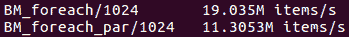
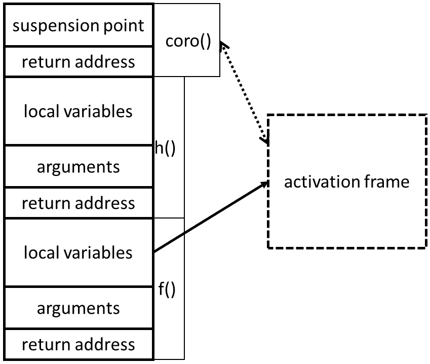

# 八、 C++ 中的并发

本章的目的是描述最近添加到该语言中的并发编程功能: 在 C 17 和 C 20 标准中。虽然现在谈论使用这些功能以获得最佳性能的最佳实践还为时过早，但我们可以描述它们的作用以及编译器支持的当前状态。

在本章中，我们将介绍以下主要主题:

*   在 C++ 11 中引入并发到 c 语言中
*   C 17 中的并行 STL 算法
*   C 20 中的协程序

阅读本章后，您将知道 C 提供的帮助编写并发程序的功能。本章并不意味着是 C 并发功能的全面手册。相反，它是对可用语言设施的概述，这是您可以进一步探索您感兴趣的主题的起点。

# 技术要求

如果要尝试使用最近的 C 版本提供的语言功能，则需要非常现代的编译器。对于某些功能，您可能还需要安装其他工具; 当我们描述特定的语言功能时，我们将指出这一点。本章随附的代码可在[https://github.com/PacktPublishing/ 《高效程序编写艺术》/tree/master/Chapter08](https://github.com/PacktPublishing/The-Art-of-Writing-Efficient-Programs/tree/master/Chapter08)找到。

# C++ 11 中的并发支持

在 C++ 11 之前，C++ 标准没有提到并发。当然，在实践中，程序员用 C++ 长 2011 年编写多线程和分布式程序。使这成为可能的事实是，编译器编写者自愿采用了额外的限制和保证，通常是通过遵守 C 标准 (用于语言) 和另一种标准 (例如 POSIX) 来支持并发。

C 11 通过引入**C 内存模型**改变了这一点。内存模型描述了线程如何通过内存进行交互。C 语言第一次建立了关于并发的坚实基础。但是，由于新的 C 内存模型与大多数编译器编写者已经支持的内存模型非常相似，因此直接的实际影响被静音了。这些模型之间存在一些细微的差异，新标准最终保证了遇到这些黑暗角落的程序的可移植行为。

更直接的实际用途是直接支持多线程的几种语言功能。首先，该标准引入了线程的概念。关于线程行为的保证很少，但是大多数实现只是使用系统线程来支持 C 线程。这在实现的最低级别很好，但对于除了最简单的程序之外的任何程序来说都不够。例如，为程序必须执行的每个独立任务创建新线程的天真尝试几乎可以保证失败: 启动新线程需要时间，并且很少有操作系统可以有效地处理数百万个线程。另一方面，对于实现其线程调度程序的程序员来说，C 线程接口不能提供对线程行为的足够控制 (大多数线程属性是特定于操作系统的)。

接下来，该标准引入了几种同步原语，用于控制对内存的并发访问。该语言提供`std::mutex`，通常使用常规系统互斥体实现: 在 POSIX 平台上，这通常是 POSIX 互斥体。该标准提供互斥体的定时和递归变体 (同样，跟随 POSIX)。为了简化异常处理，应避免直接锁定和解锁互斥体，而采用 RAII 模板`std::lock_guard`。

为了安全地锁定多个互斥锁，没有死锁的风险，该标准提供了`std::lock()`功能 (虽然它保证没有死锁，但它使用的算法是未指定的，并且特定实现的性能差异很大)。另一个常用的同步原语是条件变量`std::condition_variable`，以及各自的等待和信令操作。此功能还非常接近相应的 POSIX 功能。

然后，支持低级原子操作: `std::atomic`，原子操作 (例如比较和交换) 和内存顺序说明符。我们在[*第 5 章*](05.html#_idTextAnchor084)，*线程，内存和并发*，[*第 6 章*](06.html#_idTextAnchor103)中介绍了它们的行为和应用，*并发和性能*，以及[*第 7 章*](07.html#_idTextAnchor117)，*并发的数据结构*。

最后，语言增加了对异步执行的支持: 其中可以使用`std::async`异步调用函数 (可能在另一个线程上)。虽然这可能启用并发编程，但在实践中，此功能对于高性能应用几乎完全无用。大多数实现要么提供非常有限的并行性，要么在其自己的线程上执行每个异步函数调用。大多数操作系统在创建和连接线程方面都有相当高的开销 (我见过的唯一操作系统使并发编程变得简单，就像*为每个任务启动一个线程，如果你需要*，数以百万计的是 AIX，在其他操作系统上，我知道这是混乱的秘诀)。

总的来说，我们可以说，在并发方面，C 11 在概念上是向前迈出的重要一步，但提供了适度的直接实际收益。C 14 的改进集中在其他地方，因此在并发方面没有什么值得注意的改变。接下来，我们将看到 C 17 带来了哪些新的发展。

# C 17 中的并发支持

C 17 带来了它的一项重大进步和对并发相关功能的一些小调整。让我们先快速介绍后者。在 C++ 11 中引入的`std::lock()`函数现在有一个对应的 RAII 对象，`std::scoped_lock`。添加了一个共享互斥体`std::shared_mutex`，也称为 A**读写互斥体** (同样，匹配相应的 POSIX 功能)。只要多个线程不需要对锁定资源的独占访问，此互斥允许它们继续进行。通常，此类线程执行只读操作，而 writer 线程需要独占访问，因此名称为**读写锁**。从理论上讲，这是一个聪明的想法，但是大多数实现都提供了令人沮丧的性能。

值得注意的是一项新功能，它允许可移植地确定 L1 缓存、`std::hardware_destructive_interference_size`和`std::hardware_constructive_interference_size`的缓存行大小。这些常量有助于创建避免错误共享的缓存最佳数据结构。

现在我们来讨论 C 17 中的主要新功能-**并行算法**。现在大家熟悉的 STL 算法都有并行化的版本 (总体而言，该组并行算法常被称为为*并行 STL*)。例如，这里是对`std::for_each`的基本调用:

```cpp
std::vector<double> v;
… add data to v … 
std::for_each(v.begin(), v.end(),[](double& x){ ++ x; });
```

在 C++ 17 中，我们可以要求库在所有可用的处理器上并行进行此计算:

```cpp
std::vector<double> v;
… add data to v … 
std::for_each(std::execution::par,
              v.begin(), v.end(),[](double& x){ ++ x; });
```

STL 算法的并行版本有一个新的第一个参数: 执行策略。请注意，执行策略不是单一类型，而是模板参数。该标准提供了几种执行策略; 我们前面使用的并行策略`std::execution::par`允许算法在多个线程上执行。线程的数量和计算在线程中分区的方式是未指定的，并且取决于实现。顺序策略`std::execution::seq`在单个线程上执行算法，与没有任何策略 (或在 C 17 之前) 的执行方式相同。

还有一个平行的未排序策略，`std::execution::par_unseq`。这两个平行政策之间的区别是微妙的，但理解起来很重要。该标准说，未排序策略允许计算在单个线程中交织，这允许进行其他优化，例如矢量化。但是优化编译器在生成机器代码时可以使用像 AVX 这样的矢量指令，并且在没有源代码 C 代码帮助的情况下完成: 编译器只是找到矢量化的机会，并用矢量指令替换常规的单字指令。那么这里有什么不同呢？

为了理解未排序政策的性质，我们必须考虑一个更复杂的例子。让我们说，而不是简单地对每个元素进行操作，我们想做一些使用共享数据的计算:

```cpp
double much_computing(double x);
std::vector<double> v;
… add data to v … 
double res = 0;
std::mutex res_lock;
std::for_each(std::execution::par, v.begin(), v.end(),
  [&](double& x){ 
    double term = much_computing(x);
    std::lock_guard guard(res_lock);
    res += term;
  });
```

在这里，我们对每个向量元素进行一些计算，然后累加结果之和。计算本身可以并行完成，但是由于所有线程都增加了相同的共享变量`res`，因此必须通过锁来保护累积。由于有了锁，并行执行策略可以安全使用。但是，我们不能在这里使用未排序的策略: 如果同一线程要同时处理多个向量元素 (交错)，则它可能会尝试多次获取同一锁。这是一个有保证的死锁: 如果一个线程持有锁并试图再次锁定它，第二次尝试将阻止，并且线程无法继续到它将解锁锁的点。标准调用代码，例如我们的上一个示例**矢量化-不安全**，并指出此类代码不应与未排序的策略一起使用。

既然我们已经看到了并行算法在理论上是如何工作的，那么在实践中呢？简短的答案是*很好，有一些警告*。继续阅读长版本。

在实践中检查并行算法之前，您必须做一些工作来准备构建的环境。通常，要编译 C 程序，您只需要安装所需的编译器版本，例如 GCC，就可以开始使用了。并行算法并非如此。在编写本书时，安装过程有些繁琐。

GCC 和 Clang 的最新版本包括并行 STL 标头 (在某些安装中，Clang 要求安装 GCC，因为它使用 GCC 提供的并行 STL)。问题出现在较低的级别。两个编译器都使用的运行时线程系统是 Intel**线程构建块** (**TBB**)，它作为一个库，带有自己的标头集。编译器都没有在其安装中包含 TBB。更复杂的是，编译器的每个版本都需要相应的 TBB 版本: 旧版本和更新版本都不起作用 (失败可以在编译和链接时表现出来)。要运行与 TBB 链接的程序，您可能需要将 TBB 库添加到库路径中。

一旦你已经解决了所有这些问题，并配置了编译器和必要的库的工作安装，使用并行算法并不比使用任何 STL 代码难。那么，它的规模有多好？我们可以运行一些基准测试。

让我们从没有任何锁的`std::for_each`开始，并为每个元素进行大量计算 (函数`work()`是昂贵的，确切的操作对于我们当前对缩放的关注并不重要):

```cpp
std::vector<double> v(N);
std::for_each(std::execution::par,
              v.begin(), v.end(),[](double& x){ work(x); });
```

以下是在 2 个线程上运行的顺序版本与并行版本的性能:


图 8.1-2 个 cpu 上的 parallel std::foreach 的基准测试

缩放还不错。请注意，向量大小`N`相当大，为 32k 个元素。对于较大的向量，缩放比例确实有所提高。但是，对于相对较小的数据量，并行算法的性能非常差:



图 8.2-短序列的并行 std::foreach 的基准

对于 1024 元素的向量，并行版本比顺序版本慢。原因是执行策略在每个并行算法的开始处启动所有线程，并在最后加入它们。启动新线程会花费大量时间，因此，当计算不足时，开销会压倒我们从并行性中获得的任何加速。这不是标准强加的要求，而是 GCC 和 Clang 中并行 STL 的当前实现管理其与 TBB 系统的交互的方式。

当然，并行算法提高性能的大小取决于硬件，编译器及其并行实现以及每个元素的计算量。例如，我们可以尝试一个非常简单的每元素计算:

```cpp
std::for_each(std::execution::par,
              v.begin(), v.end(),[](double& x){ ++ x; });
```

现在处理相同的 32k 元素向量没有显示出并行性的好处:


图 8.3-并行标准::foreach 的基准，用于便宜的每元素计算

对于更大的矢量大小，除非内存访问速度限制了单线程和多线程版本的性能 (这是非常受内存限制的计算)，否则并行算法可能会取得成功。

或许更令人印象深刻的是更难以并行化的算法的性能，比如`std::sort`:

```cpp
std::vector<double> v(N);
std::sort(std::execution::par, v.begin(), v.end();
```

这是它的输出:


图 8.4-并行 std::sort 的基准

同样，在并行算法生效之前，我们需要足够大量的数据 (对于 1024 元素，单线程排序更快)。这是一个相当了不起的成就: 排序不是最容易并行化的算法，并且 double (比较和 swap) 上的每个元素计算非常便宜。尽管如此，并行算法显示出非常好的加速比，如果元素比较更昂贵，它会变得更好。

您可能会想知道并行 STL 算法如何与您的线程交互，也就是说，如果您同时在两个线程上运行两个并行算法会发生什么？首先，就像在多个线程上运行的任何代码一样，您必须确保线程安全 (无论使用哪种排序，在同一容器上并行运行两种排序都是一个坏主意)。除此之外，你会发现多个并行算法共存得很好，但是你无法控制作业调度: 它们中的每一个都试图在所有可用的 cpu 上运行，所以它们争夺资源。根据每种算法的扩展程度，您可能会或可能不会通过并行运行几种算法来获得更高的整体性能。

总的来说，我们可以得出结论，当 STL 算法的并行版本在足够大的数据量上运行时，它们会提供非常好的性能，尽管*足够大的*取决于特定的计算。可能需要额外的库来编译和运行使用并行算法的程序，并且配置这些库可能需要一些努力，以及实验。此外，并非所有的 STL 算法都有其并行等效项 (例如，`std::accumulate`没有)。

....

我们现在准备在日历上再翻几页，然后跳到 C 20。

# C 20 中的并发支持

C 20 在现有的并发支持中添加了一些增强功能，但是我们将重点介绍主要的新功能: coroutines。协程序通常是可以中断和恢复的功能。它们在几个主要应用中很有用: 它们可以极大地简化事件驱动程序的编写，它们对于窃取工作的线程池几乎是不可避免的，并且它们使编写异步 I/O 和其他异步代码变得更加容易。

## 协船的基础

协程序有两种样式: **stackful**和**stackless**。Stackful 协程序有时也称为**纤维**; 它们是，类似于在堆栈上分配状态的函数。无堆栈协程序没有对应的堆栈分配，它们的状态存储在堆上。通常，堆叠的协程序更强大，更灵活，但无堆叠的协程序的效率明显更高。

在本书中，我们将关注无堆叠的协程序，因为这是 C 20 所支持的。这是一个非常不寻常的概念，我们需要在展示 C++ 特定的语法和示例之前进行解释。

一个常规的 C 函数总是有一个对应的堆栈框架。只要函数运行，此堆栈框架就会存在，并且存储所有局部变量和其他状态。这里是一个简单的函数`f()`:

```cpp
void f() {
  …
}
```

它有一个相应的堆栈框架。函数`f()`可以调用另一个函数`g()`:

```cpp
void g() {
  …
}
void f() {
  …
  g();
  …
}
```

函数`g()`还具有在函数运行时存在的堆栈框架。

参考下图:


图 8.5-常规函数的堆栈框架

当函数`g()`退出时，其堆栈帧被破坏，并且仅保留函数`f()`的帧。

相反，无堆栈协程的状态不存储在堆栈上，而是存储在堆上: 此分配称为**激活帧**。激活帧与协程句柄相关联，协程句柄是充当智能指针的对象。可以进行函数调用并从中返回，但是只要不破坏句柄，激活帧就会持续存在。

协程序也需要堆栈空间，例如，如果它调用其他函数。这个空间是在调用方的堆栈上分配的。这是它的工作原理 (真正的 C 语法是不同的，所以现在可以将与协程序相关的行视为伪代码):

```cpp
void g() {
  …
}
void coro() { // coroutine
  …
  g();
  …
}
void f() {
  …
  std::coroutine_handle<???> H; // Not the real syntax
  coro();
  …
}
```

对应的内存分配如下图所示:


图 8.6-协程序调用

函数`f()`创建一个协程句柄对象，它拥有激活帧。然后它调用协程序函数`coro()`。在这一点上有一些堆栈分配，特别是协程存储在堆栈上的地址，如果它被挂起，它将返回 (记住协程是可以挂起自己的函数)。协程可以调用另一个函数`g()`，它在栈上分配`g()`的栈帧。此时，协程序不能再暂停自身: 可以仅从协程序函数的顶层暂停。函数`g()`无论谁调用它，都以相同的方式运行，并最终返回，这破坏了它的堆栈框架。协程序现在可以暂停自己，所以让我们假设它可以。

这是 stackful 和 stackless 协程序之间的关键区别: 一个 stackful 协程序可以在任意深度函数调用的任何地方 (T1) 挂起，并将从这一点恢复。但是这种灵活性在内存 (尤其是运行时) 上具有很高的成本: 无堆栈协程序 (具有有限的状态分配) 效率更高。

当协程挂起时，恢复该状态所需的部分将存储在激活帧中。然后销毁协程的堆栈帧，并且控件返回到调用方，以调用协程。如果协程序运行到完成，也会发生同样的情况，但是有一种方法可以让调用者找出协程序是暂停还是完成。

调用方继续其执行，并可能调用其他函数:

```cpp
void h() {
  …
}
void coro() {…} // coroutine
void f() {
  …
  std::coroutine_handle<???> H; // Not the real syntax
  coro();
  h(); // Called after coro() is suspended
  …
}
```

内存分配现在如下所示:


图 8.7-协程序被暂停，执行继续

请注意，没有对应于协程的堆栈帧，只有堆分配的激活帧。只要手柄对象还活着，就可以恢复协程。它不必是调用和恢复协程的函数; 例如，如果我们的函数`h()`可以恢复它，如果它可以访问句柄:

```cpp
void h(H) {
  H.resume(); // Not the real syntax
}
void coro() {…} // coroutine
void f() {
  …
  std::coroutine_handle<???> H; // Not the real syntax
  coro();
  h(H); // Called after coro() is suspended
  …
}
```

协程序从暂停的点恢复。它的状态从激活帧中恢复，任何必要的堆栈分配都将照常发生:



图 8.8-协程序从不同的函数恢复

最终，协程序完成，句柄被销毁; 这将释放与协程序关联的所有内存。

以下是关于 C 20 协程序的重要知识的摘要:

*   协程序是可以使自己挂起的函数。这与操作系统挂起线程不同: 挂起协程是由程序员显式完成的 (协作多任务)。
*   与与堆栈框架相关联的常规函数不同，协程序具有句柄对象。只要手柄还活着，协程序状态就会持续。
*   在协程序被挂起后，控件返回给调用者，调用者继续以与协程序完成相同的方式运行。
*   协程可以从任何位置恢复; 它不必是呼叫者本身。此外，协程甚至可以从不同的线程恢复 (我们将在本节后面看到一个示例)。协程从暂停点恢复，并继续运行*，好像什么都没发生* (但可能在不同的线程上运行)。

现在让我们看看这一切是如何在实 C 中完成的。

## 协程序 C 语法

现在让我们看看 c 语言构造，它用于使用协程进行编程。

首要的业务是获得支持此功能的编译器。GCC 和 Clang 在最新版本中都有协程序支持，但不幸的是，方式不同。对于 GCC，您需要版本 11 或更高版本。对于 Clang，在版本 10 中添加了部分支持，并在以后的版本中进行了改进，尽管它仍然是 “实验性的”。

首先，为了编译协程序代码，您需要在命令行上使用编译器选项 (仅使用`--std=c++ 20`选项启用 C 20 是不够的)。对于 GCC，选项为`–fcoroutines`。对于 Clang，选项为`-stdlib=libc++ -fcoroutines-ts`。最新的 Visual Studio 不需要除`/std:c++ 20`以外的选项。

然后，您需要包括协程序标题。在 GCC 和 Visual Studio 中 (并且根据标准)，标头为`#include <coroutine>`，它声明的所有类都在 namespace`std`中。不幸的是，在 Clang 中，头是`#include <experimental/coroutine>`，命名空间是`std::experimental`。

声明协程没有特殊的语法: 协程在语法上只是常规的 C 函数。使它们成为协程的是使用挂起运算符`co_await`或其变体`co_yield`。但是，在函数主体中调用这些运算符之一是不够的: C 中的协程对其返回类型有严格的要求。标准库在声明这些返回类型以及使用协程所需的其他类方面没有提供任何帮助。该语言仅提供了使用协程进行编程的框架。结果，直接使用 C 20 构造的协程代码非常冗长，重复，并且包含大量的样板代码。实际上，使用协程的每个人都使用几个可用的协程库之一来做到这一点。

对于实际编程，你应该这样做。但是，在本书中，我们向您展示了用*bare*C 编写的示例。我们这样做是因为我们不想把你引向任何特定的图书馆，因为这样做会模糊对真正发生的事情的理解。对协程序的支持是最近的，并且库正在迅速发展; 您选择的库不太可能保持不变。我们希望您了解 C 级别的协程序代码，而不是特定库呈现的抽象级别的协程序代码。然后你应该根据你的需求选择一个库，并使用它的抽象。

对与协程序相关的语法构造的透彻描述将非常不直观: 它是一个框架，而不是库。因此，我们使用示例进行其余的演示。如果您真的想知道协程的所有语法要求，则必须查找最近的出版物 (或阅读标准)。但是这些示例应该使您对协程可以做什么有足够的了解，以便您可以阅读最喜欢的协程库的文档，并在程序中使用它。

## 协程序示例

第一个例子可能是 C 中最常见的使用协程序 (以及标准提供了一些明确设计的语法)。我们将实现一个懒惰的生成器。生成器是生成数据序列的函数; 每次调用生成器时，都会获得序列的新元素。惰性生成器是按需计算元素的生成器，称为。

这里是一个基于 C 20 协程序的惰性生成器:

```cpp
generator<int> coro(){
  for (int i = 0;; ++ i) {
    co_yield i;
  }
}
int main() {
  auto h = coro().h_;
  auto& promise = h.promise();
  for (int i = 0; i < 3; ++ i) {
    std::cout << "counter: " << promise.value_ << 
      std::endl;
    h();
  }
  h.destroy();
}
```

正如承诺的那样，这是非常的低级 C，你很少看到这样的代码，但它允许我们解释所有的步骤。首先，协程序`coro()`看起来像任何其他函数，除了`co_yield`运算符。此运算符挂起协程序，并将值`i`返回给调用方。因为协程序是挂起的，而不是终止的，所以可以多次执行运算符。就像任何其他功能一样，协程序在控件到达闭合支撑时终止; 此时，它无法恢复。可以通过调用 operator`co_return` (不应使用常规的`return`operator) 在任一点退出协程序。

其次，协程的返回类型-`generator`-是我们即将定义的一种特殊类型。它对它有很多要求，这会导致冗长的样板代码 (任何协程库都会为您预定义此类类型)。我们已经可以看到`generator`包含一个嵌套的数据成员`h_`; 这就是协程句柄。这个手柄的创建也创建了激活帧。句柄与`promise`对象相关联; 这与 C 11`std::promise`完全无关。实际上，它根本不是标准类型之一: 我们必须根据标准中列出的一组规则来定义它。在执行结束时，句柄被破坏，这也破坏了协程状态。因此，句柄类似于指针。

最后，句柄是一个可调用的对象。调用它会恢复协程序，该协程序会生成下一个值并立即再次暂停自身，因为`co_yield`运算符在循环中。

通过为协程定义适当的返回类型，所有这些都神奇地将捆绑在一起。就像 STL 算法一样，整个系统受惯例的约束: 在此过程中涉及的所有类型都有期望，如果不满足这些期望，某个地方将无法编译。现在让我们看看`generator`类型:

```cpp
template <typename T> struct generator {
  struct promise_type {
    T value_ = -1;
    generator get_return_object() {
      using handle= std::coroutine_handle<promise_type>;
      return generator{handle::from_promise(*this)};
    }
    std::suspend_never initial_suspend() { return {}; }
    std::suspend_never final_suspend() noexcept { return 
      {}; }
    void unhandled_exception() {}
    std::suspend_always yield_value(T value) {
      value_ = value;
      return {};
    }
  };
  std::coroutine_handle<promise_type> h_;
};
```

首先，不必从模板生成`return`类型。我们可以声明一个整数生成器。通常，它是在生成的序列中的元素类型上参数化的模板。其次，名称*生成器*绝不是特别的: 你可以调用任何你想要的任何类型 (大多数库都提供类似的模板，并将其称为`generator`)。另一方面，嵌套类型`generator::promise_type`*必须将*称为`promise_type`，否则，程序将无法编译。通常，嵌套类型本身被称为其他东西，并且使用类型别名:

```cpp
template <typename T> struct generator {
  struct promise { … };
  using promise_type = promise;
};
```

`promise_type`类型必须是`generator`类的嵌套类型 (或者，通常，协程序返回的任何类型)。但是`promise`类不必是嵌套类: 通常是，但也可以在外部声明。

强制性的是 `promise` 类型的所需成员函数集，包括其签名。请注意，某些成员函数声明为`noexcept`。这也是要求的一部分: 如果您省略此规范，程序将无法编译。当然，任何不需要`noexcept`的函数，如果不抛出，都可以这样声明。

对于不同的生成器，这些所需功能的主体可能更复杂。我们将简要描述他们每个人的工作。

第一个非空函数`get_return_object()`是样板代码的一部分，通常看起来和前面的完全一样; 这个函数从一个句柄构造一个新的生成器，而这个句柄又从一个 promise 对象构造出来。它被编译器调用以获得协程序的结果。

每次调用运算符`co_yield`时，都会调用第二个非空函数`yield_value()`; 它的参数是`co_yield`值。将值存储在 promise 对象中是协程序通常将结果传递给调用者的方式。

编译器第一次遇到`co_yield`时调用`initial_suspend()`函数。在协程序通过`co_return`产生最后一个结果后调用`final_suspend()`函数; 之后不能挂起。如果协程序在没有`co_return`的情况下结束，则调用`return_void()`方法。最后，如果协程序抛出从其主体中转义的异常，则调用`unhandled_exception()`方法。您可以自定义这些方法来特殊处理每种情况，尽管很少使用。

现在我们看到它是如何联系在一起，为我们提供一个懒惰的发电机。首先，创建协程序句柄。在我们的示例中，我们不保留`generator`对象，只保留句柄。这不是必需的: 我们可以保留`generator`对象并破坏其析构函数中的句柄。协程一直运行，直到它命中`co_yield`并暂停自身; 控件由调用方返回，而在 promise 中捕获`co_yield`的返回值。调用程序通过调用句柄来检索此值并恢复协程。协程从暂停的位置开始，一直运行到下一个`co_yield`。

我们的生成器可以永远运行 (或者直到我们在我们的平台上达到最大整数值，无论如何): 序列永远不会结束。如果我们需要一个有限长度的序列，我们可以执行`co_return`或者在序列结束后退出循环。参考以下代码:

```cpp
generator<int> coro(){
  for (int i = 0; i < 10; ++ i) {
    co_yield i;
  }
}
```

现在我们有 10 个元素的序列。在尝试恢复协程序之前，调用者必须检查句柄成员函数`done()`的结果。

我们之前提到过，协程可以从代码中的任何地方恢复 (当然，在它被暂停之后)。它甚至可以从不同的线程恢复。在这种情况下，协程开始在一个线程上执行，被挂起，然后在另一个线程上运行其其余代码。让我们看一个例子:

```cpp
task coro(std::jthread& t) {
  std::cout << "Coroutine started on thread: " <<
    std::this_thread::get_id() << '\n';
  co_await awaitable{t};
  std::cout << "Coroutine resumed on thread: " <<
    std::this_thread::get_id() << '\n';
  std::cout << "Coroutine done on thread: " <<
    std::this_thread::get_id() << '\n';
}
int main() {
  std::cout << "Main thread: " <<
    std::this_thread::get_id() << '\n';
  std::jthread t;
  coro(t);
  std::cout << "Main thread done: " << 
    std::this_thread::get_id() << std::endl;
}
```

首先，让我们得到一个细节: `std::jthread`是一个 C 20 加法，它只是一个可连接的线程-它被连接在对象的析构函数中 (几乎所有使用线程的人都为此编写了一个类，但是现在我们有一个标准的)。现在我们可以转移到重要的部分-协程本身。

首先，让我们看看协程的返回类型:

```cpp
struct task{
  struct promise_type {
    task get_return_object() { return {}; }
    std::suspend_never initial_suspend() { return {}; }
    std::suspend_never final_suspend() noexcept { return 
      {}; }
    void return_void() {}
    void unhandled_exception() {}
  };
};
```

这实际上是协程的最小可能的返回类型: 它包含所有所需的样板，而没有其他内容。具体来说，返回类型是定义嵌套类型`promise_type`的类。该嵌套类型必须定义几个成员函数，如该代码所示。我们前面的示例中的生成器类型具有所有这些以及用于将结果返回给调用者的一些数据。当然，任务也可以根据需要具有内部状态。

上例中的第二个变化是任务暂停的方式: 我们用`co_await`而不是`co_yield`来完成。运算符`co_await`实际上是挂起协程序的最通用方法: 就像`co_yield`一样，它挂起函数并将控件返回给调用者。不同之处在于参数类型: 当`co_yield`返回结果时，`co_await`的参数是一个具有非常通用功能的 awaiter 对象。同样，对该对象的类型有特定要求。如果满足要求，则该类称为`awaitable`，并且此类型的对象是有效的 awaiter (如果不满足，则某个地方将无法编译)。这是我们的`awaitable`:

```cpp
struct awaitable {
  std::jthread& t;
  bool await_ready() { return false; }
  void await_suspend(std::coroutine_handle<> h) {
    std::jthread& out = t;
    out = std::jthread([h] { h.resume(); });
  }
  void await_resume() {}
  ~awaitable() {}
  awaitable(std::jthread& t) : t(t) {}
};
```

`awaitable`的所需接口是我们在这里看到的三种方法。第一个是`await_ready()`: 在协程暂停后调用。如果它返回`true`，则协程的结果已准备就绪，并且实际上没有必要将其挂起。在实践中，它几乎总是返回`false`，这导致协程的挂起: 协程的状态，如局部变量和挂起点，存储在激活帧中，并将控件返回给调用者或恢复器。第二个函数是`await_resume()`，它在协程恢复后继续执行之前被调用。如果它返回结果，即整个`co_await`运算符的结果 (在我们的示例中没有结果)。最有趣的功能是`await_suspend()`。当该协程被挂起时，它会使用当前协程的句柄进行调用，并且可以具有几种不同的返回类型和值。如果它返回`void`，就像在我们的示例中一样，协程将被挂起，并且控件将返回给调用者或恢复器。在我们的示例中，不要被`await_suspend()`的内容所迷惑: 它不会恢复协程。相反，它创建了一个新线程，该线程将执行可调用对象，并且正是该对象恢复了协程。协程可以在`await_suspend()`完成后或仍在运行时恢复: 本示例演示了异步操作协程的使用。

把所有这些放在一起，我们得到这个序列:

1.  主线程调用协程。
2.  协程序由运算符`co_await`挂起。这个过程涉及对 `awaitable` 对象的成员函数的几个调用，其中一个创建了一个新线程，其有效负载恢复协程 (使用移动分配线程对象的游戏已经完成，所以我们删除主程序中的新线程，避免一些讨厌的竞争条件)。
3.  控件返回到协程的调用者，因此主线程继续从协程调用后的行运行。如果它在协程完成之前到达那里，它将阻塞线程对象`t`的析构函数。
4.  协程由新线程恢复，并从 `co_await` 之后的行继续在该线程上执行。由`co_await`构造的`awaitable`对象被销毁。协程运行到最后，都在第二个线程上。到达协程的末尾意味着它已经完成，就像任何其他函数一样。现在可以加入运行协程的线程。如果主线程正在等待线程`t`的析构函数完成，它现在会解除阻塞并加入线程 (如果主线程还没有到达析构函数，它就不会阻塞)。

该序列由我们程序的输出确认:

```cpp
Main thread: 140003570591552
Coroutine started on thread: 140003570591552
Main thread done: 140003570591552
Coroutine resumed on thread: 140003570587392
Coroutine done on thread: 140003570587392
```

如您所见，协程`coro()`首先在一个线程上运行，然后在执行过程中更改为另一个线程。如果它有任何局部变量，它们将通过这个转换被保留。

我们提到`co_await`是暂停协程序的通用运算符。实际上，`co_yield x`运算符等效于`co_await`的特定调用，如下所示:

```cpp
co_await promise.yield_value(x);
```

这里`promise`是与当前协程序句柄关联的`promise_type`对象。单独运算符`co_yield`的原因是，从协程序内部访问自己的 promise 会产生相当冗长的语法，因此标准添加了一个快捷方式。

这些示例演示了 C 中协程的功能。协程被认为是有用的情况是工作窃取 (您已经看到将协程的执行转移到另一个线程是多么容易)，惰性生成器和异步操作 (I/O 和事件处理)。尽管如此，C 协程还没有足够长的时间出现任何模式，所以社区还没有想出使用协程的最佳实践。同样，现在谈论协程的性能还为时过早; 我们必须等待编译器支持的成熟和更大规模的应用的开发。

总的来说，在忽略并发多年之后，C 标准正在迅速赶上，所以让我们总结一下最近的进展。

# 总结

C 11 是该标准的第一个承认线程存在的版本。它为记录 C 程序在并发环境中的行为奠定了基础，并在标准库中提供了一些有用的功能。在此功能中，基本的同步原语和线程本身是最有用的。后续版本以相对较小的增强功能扩展并完成了这些功能。

C 17 带来了并行 STL 形式的重大进步。当然，性能是由实施决定的。只要数据语料库足够大，即使在诸如搜索和分区之类的难以并行化的算法上，观察到的性能也相当不错。但是，如果数据序列太短，则并行算法实际上会降低性能。

C 20 增加了协程序支持。您已经从理论上以及一些基本示例中了解了无堆叠协程序的工作原理。但是，现在谈论使用 C 20 协程序的性能和最佳实践还为时过早。

本章结束了我们对并发的探索。接下来，我们继续学习 c 语言本身的使用如何影响程序的性能。

# 问题

1.  为什么 C++ 11 中奠定的并发编程基础很重要？
2.  我们如何使用并行 STL 算法？
3.  什么是协船？