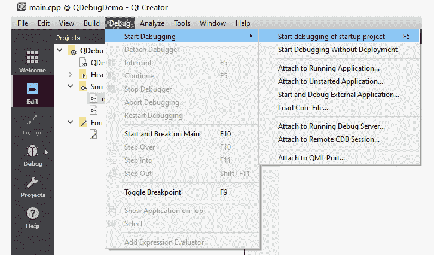
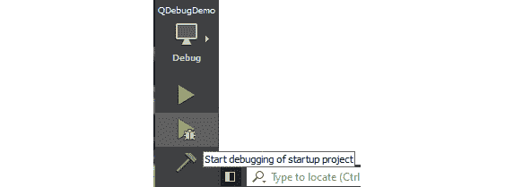
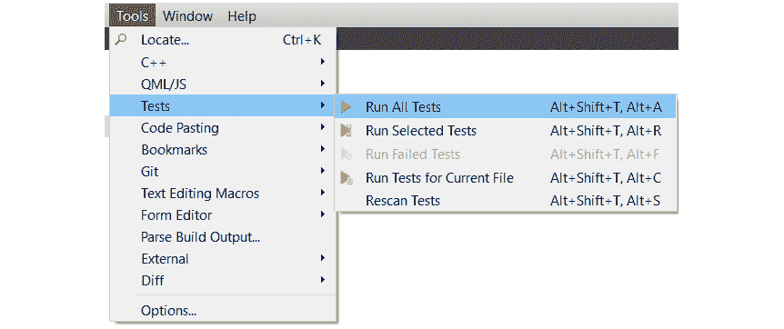
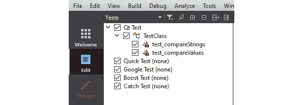
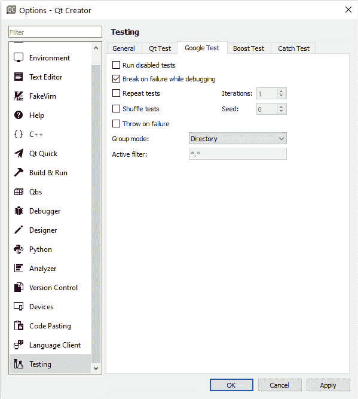
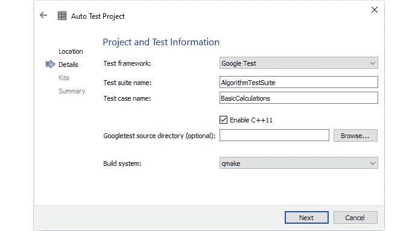
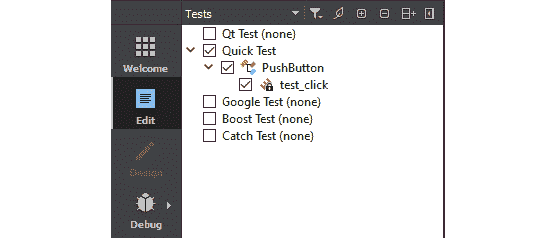
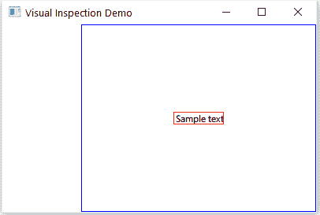

# 九、测试和调试

调试和测试是软件开发的重要组成部分。 在本章中，您将学习如何调试 Qt 项目，了解不同的调试技术，以及 Qt 支持的调试器。 调试是发现错误或不需要的行为的根本原因并解决它的过程。 我们还将讨论使用 Qt 测试框架进行单元测试。 Qt Test 是一个针对基于 Qt 的应用和库的单元测试框架。 它具有大多数单元测试框架提供的所有功能。 此外，它还支持测试**图形用户界面**(**GUI**)。 此模块有助于以方便的方式为基于 Qt 的应用和库编写单元测试。 您还将学习使用不同的 GUI 测试工具测试 GUI 的技术。

具体来说，我们将讨论以下主题：

*   在 Qt 中调试
*   调试策略
*   调试 C++ 应用
*   调试 Qt Quick 应用
*   Qt 中的测试
*   与 Google 的 C++ 测试框架集成
*   测试 Qt 快速应用
*   GUI 测试工具

在本章结束时，您将熟悉 Qt 应用的调试和测试技术。

# 技术要求

本章的技术要求包括在最新版本的桌面平台(如 Windows 10、Ubuntu 20.04 或 MacOS 10.14)上安装 Qt 6.0.0 和 Qt Creator 4.14.0 的最低版本。

本章使用的所有代码都可以从以下 giHub 链接下载：[https://github.com/PacktPublishing/Cross-Platform-Development-with-Qt-6-and-Modern-Cpp/tree/master/Chapter09](https://github.com/PacktPublishing/Cross-Platform-Development-with-Qt-6-and-Modern-Cpp/tree/master/Chapter09)。

重要音符

本章中使用的屏幕截图取自 Windows 平台。 根据您机器上的底层平台，您将看到类似的屏幕。

# 在 Qt 中调试

在软件开发中，经常会出现技术问题。 要解决这些问题，我们必须首先找出并解决所有问题，然后才能向公众发布我们的应用，以保持质量和声誉。 调试是一种定位这些潜在技术问题的技术。

在接下来的几节中，我们将讨论软件工程师为确保软件的稳定性和质量而使用的流行调试技术。

## Qt 支持的调试器

Qt 支持几种不同类型的调试器。 根据项目使用的平台和编译器的不同，您使用的调试器可能会有所不同。 以下是广泛用于 Qt 的调试器列表：

*   **GNU Symbol Debugger**(**gdb**)是 GNU Project 开发的跨平台调试器。
*   **Microsoft Console Debugger**(**CDB**)是 Microsoft for Windows 的调试器。
*   **Low Level Virtual Machine Debugger**(**LLDB**)是 LLVM 开发小组开发的跨平台调试器。
*   **QML/JavaScript 调试器**是 Qt 公司提供的 QML 和 JavaScript 调试器。

如果您在 Windows 上使用 MinGW 编译器，则不需要使用 gdb 进行任何手动设置，因为它通常包含在 Qt 安装中。 如果您使用的是不同的操作系统，如 Linux，则可能需要在将其链接到 Qt Creator 之前手动安装。 Qt Creator 自动检测 gdb 的存在，并将其添加到其调试器列表中。

您还可以使用**Valgrind**来调试您的应用。 您可以通过指定`--vgdb=yes`或`--vgdb=full`来激活 Valgrind`gdbserver`。 您可以指定`--vgdb-error=number`在显示一定数量的错误后激活`gdbserver`。 如果将该值设置为`0`，则`gdbserver`将在初始化时处于活动状态，从而允许您在应用启动之前设置断点。 值得注意的是，`vgdb`包含在**Valgrind**发行版中。 它不需要单独安装。

如果您喜欢的平台是 Windows，您可以在您的机器上安装 CDB。 默认情况下，Visual Studio 的内置调试器将不可用。 因此，在安装 Windows SDK 时，您必须选择 Debug Tools for Windows 作为可选组件，从而单独安装 CDB 调试器。 Qt Creator 通常会识别 CDB 的存在，并将其添加到**选项**下的调试器列表中。

Android 调试比在常规桌面环境中调试更具挑战性。 Android 开发需要不同的包，如 JDK、Android SDK、Android NDK 等。 在桌面平台上，您需要**Android Debug Bridge**(**ADB**)驱动程序才能进行 USB 调试。 您必须启用开发人员模式并接受 Android 设备上的 USB 调试才能继续。

MacOS 和 iOS 上使用的调试器是**LLDB**。 默认情况下，它包含在 Xcode 中。 Qt Creator 将自动检测其存在并将其与套件链接。 如果您熟悉调试器并知道自己在做什么，还可以将非 gdb 调试器添加到您最喜欢的 IDE 中。

调试器插件根据您计算机上可用的内容为每个包确定合适的本机调试器。 您可以通过添加新的调试器来克服此首选项。 您可以在**Options**菜单下的**Kits**设置下的**Debuggers**选项卡中找到可用的调试器，如*图 9.1*所示：


图 9.1-显示 Add 按钮的 Kits Selection(工具包选择)屏幕下的 Debuggers(调试器)选项卡

在**Debuggers**选项卡中，您可以在右侧看到**Add**、**Clone**和**Remove**按钮。 您可以克隆现有的调试器配置，并对其进行修改以满足您的需求。 或者，如果您知道调试器的详细信息和配置，则可以使用**Add**按钮创建新的调试器配置。 您还可以通过单击**删除**按钮来删除有故障或过时的调试器配置。 不要忘记单击**应用**按钮保存您的更改。 请注意，您不能修改自动检测到的调试器配置。

在本节中，我们了解了各种受支持的调试器。 在下一节中，我们将讨论如何调试应用。

# 调试策略

有不同的调试策略可以找到问题的根本原因。 在尝试定位应用中的错误之前，彻底了解程序或库是至关重要的。 如果你不知道自己在做什么，你就找不到错误。 只有对系统及其操作方式有了透彻的了解，才能识别应用中的错误。 以前的经验有助于检测类似类型的错误以及解决错误。 个别专家的知识决定了开发人员定位错误的难易程度。 您可以添加调试打印语句和断点来分析程序流。 您可以进行正向分析或反向分析来跟踪错误的位置。

调试时使用以下步骤查找根本原因并解决问题：

1.  找出问题所在。
2.  找到问题所在。
3.  分析问题。
4.  解决问题。
5.  解决副作用。

不管是哪种编程语言或平台，调试应用时要知道的最重要的事情是代码的哪一部分导致了问题。 您可以通过多种方式找到有缺陷的代码。

如果缺陷是由您的 QA 团队或用户提出的，请询问问题发生的时间。 查看日志文件或任何错误消息。 注释掉可疑的代码部分，然后再次构建并运行应用，看看问题是否仍然存在。 如果问题是可重现的，则在找到导致问题的问题之前，通过打印消息和注释掉代码行来进行向前和向后分析。

您还可以在内置调试器中设置断点，以搜索目标功能中的变量更改。 如果其中一个变量更新为意想不到的值，或者对象指针变成无效指针，那么您可以很容易地识别它。 检查您在安装程序中使用的所有模块，并确保您和您的用户具有相同的应用版本号。 如果您使用的是不同的版本或不同的分支，那么请使用指定的版本标签签出分支，然后调试代码。

在下一节中，我们将讨论如何通过打印调试消息和添加断点来调试 C++ 代码。

# 调试 C++ 应用

可以使用`QDebug`类将变量的值打印到应用输出窗口。 `QDebug`类似于标准库中的`std::cout`，但它的优点是成为 Qt 的一部分，这意味着它支持开箱即用的 Qt 类，并且无需转换即可显示其值。

要启用调试消息，我们必须包括`QDebug`报头，如下所示：

```cpp
#include <QDebug>
```

Qt 提供了几个全局宏，用于生成不同类型的调试消息。 它们可以用于不同的目的，如下所述：

*   `qDebug()`提供自定义调试消息。
*   `qInfo()`提供信息性消息。
*   `qWarning()`报告警告和可恢复的错误。
*   `qCritical()`提供严重错误消息并报告系统错误。
*   `qFatal()`在退出前提供致命错误消息。

您可以使用`qDebug()`查看您的功能是否正常工作。 查找完错误后，删除包含`qDebug()`的代码行，以避免不需要的控制台日志。 让我们通过一个示例来看看如何使用`qDebug()`将变量输出到输出窗格。 创建示例`QWidget`应用并添加函数`setValue(int value)`，然后在函数定义中添加以下代码：

```cpp
int value = 500;
qDebug() << "The value is : " << value;
```

上述代码将在 Qt Creator 底部的输出窗口中显示以下输出：

```cpp
The value is : 500
```

您可以通过查看函数在应用中被使用和调用的次数来判断值是否被另一个函数更改。 如果多次打印调试消息，则会从多个位置调用它。 检查是否向所有调用函数发送了正确的值。 要消除输出控制台窗口中不必要的控制台日志，请在查找完问题后删除包含`qDebug()`的代码行。 或者，您可以实现条件编译。

让我们进一步了解 Qt Creator 中的调试和调试选项：

1.  You can see a **Debug** menu in the menu bar. When you click on it, you will see a context menu with submenus as shown in *Figure 9.2*:

    

    图 9.2Qt 创建器中的←调试菜单

2.  To start debugging, press *F5* or click on the start **Debug** button at the bottom left of Qt Creator as shown here:

    

    图 9.3-Qt Creator 中的开始调试按钮

3.  如果 Qt Creator 以错误消息抱怨调试器，则检查您的项目包是否有调试器。
4.  如果错误仍然存在，请关闭 Qt Creator 并转到您的项目文件夹，您可以在其中删除`.pro.user`文件。
5.  然后在 Qt Creator 中重新加载项目。 您的项目将由 Qt Creator 重新配置，调试模式现在应该可以工作了。

调试应用的一个很好的方法是设置断点：

1.  当您在 Qt Creator 中右键单击脚本的行号时，您将看到一个包含三个选项的弹出式菜单。
2.  您还可以单击行号来添加断点。 单击行号以设置断点。 您将看到行号上出现一个红点。
3.  Next, press the *F5* key on the keyboard or click on the start **Debug** button. Once you run the application in debug mode, you will notice a yellow arrow appearing on top of the first red dot:

    

    图 9.4-Qt Creator 显示调试窗口和断点

4.  调试器在第一个断点处停止。 变量及其含义和类型现在将显示在 Qt Creator 右侧的**Locals**和**Expression**窗口中。
5.  此方法可用于快速检查应用。 要删除断点，只需再次单击红点图标或从右键单击上下文菜单中：


图 9.5-显示断点标记上的右键单击选项的上下文菜单

重要的是要记住，您必须在调试模式下运行您的应用。 这是因为当您在调试模式下编译时，您的应用或库将具有其他调试符号，这些符号允许调试器从二进制文件的源代码访问信息，例如标识符、变量和函数的名称。 这就是应用或库二进制文件在调试模式下编译时文件大小较大的原因。

您可以在以下文档中了解更多功能及其用法：

[https：//doc.qt.io/qt-6/debug.html](https://doc.qt.io/qt-6/debug.html%20)

重要音符

某些防病毒应用阻止调试器检索信息。 Avira 就是这样一种抗病毒药物。 如果在生产 PC 上安装了，则在 Windows 平台上启动调试器可能会失败。

在下一节中，我们将讨论如何调试 Qt Quick 应用并定位 QML 文件内部的问题。

# 调试 Qt Quick 应用

在上一节中，我们讨论了如何调试 C++ 代码。 但是您可能仍然想知道如何调试用 QML 编写的代码。 Qt 还提供了调试 QML 代码的功能。 当您开发 Qt Quick 应用时，有很多选项可以解决问题。 在本节中，我们将讨论与 QML 相关的各种调试技术以及如何使用它们。

就像`QDebug`类一样，有不同的控制台 API 可用于在 QML 中进行调试。 这些建议如下：

*   `Log`：用于打印一般消息。
*   `Assert`：用于验证表达式。
*   `Timer`：用于测量两次调用之间花费的时间。
*   `Trace`：这用于打印 JavaScript 执行的堆栈跟踪。
*   `Count`：此参数用于查找调用函数的次数。
*   `Profile`：这用于分析 QML 和 JavaScript 代码。
*   `Exception`：用于打印错误信息。

ConsoleAPI 提供了几个方便的函数来打印不同类型的调试消息，如`console.log()`、`console.debug()`、`console.info()`、`console.warn()`和`console.error()`。 您可以打印带有参数值的消息，如下所示：

```cpp
console.log("Value is:", value)
```

您还可以通过在`Components.onCompleted:{…}`中添加消息来检查组件的创建：

```cpp
Components.onCompleted: { 
     console.log("Component created") 
}
```

要验证表达式是否为真，可以使用`console.assert()`，例如：

```cpp
console.assert(value == 100, "Reached the maximum limit");
```

您会发现，`console.time()`和`console.timeEnd()`记录了两次呼叫之间花费的时间。 调用阶段的 JavaScript 执行的堆栈跟踪由`console.trace()`打印。 函数名、文件名、行号和列号都包含在堆栈跟踪详细信息中。

`console.count()`返回一段代码的当前执行次数，以及一条消息。 QML 和 JavaScript 评测在您使用`console.profile()`时激活，在调用`console.profileEnd()`时停用。 您可以使用`console.exception()`打印错误消息以及 JavaScript 执行的堆栈跟踪。

您可以按照我们在前面小节中讨论的相同方式添加断点，如下所示：

*   要单步执行堆栈中的代码，请单击工具栏上的**单步执行**按钮或按*F11*。
*   要退出，请按*Shift*+*F11*。 要命中断点，请在方法末尾添加一个断点，然后单击**继续**。
*   打开 QML 调试器控制台输出窗格，在当前上下文中运行 JavaScript 命令。

您可以在运行 Qt Quick 应用时发现问题并观察值。 它将帮助您找到导致意外行为并需要修改的代码部分。

在本节中，我们了解了如何在 QML 环境中进行调试。 在下一节中，我们将讨论 Qt 中的测试框架。

# Qt 测试

**单元测试**是使用自动化工具测试简单应用、类或功能的一种方式。 我们将讨论它是什么，以及为什么我们想要这样做，然后再讨论如何使用 Qt Test 将它合并到我们的方法中。 单元测试是将应用分解成其最小的功能单元，然后在计划框架内根据实际情况测试每个单元的过程。 单元是可以测试的应用中最小的组件。 过程性编程中的单元测试通常关注函数或进程。

面向对象编程中的单元通常是接口、类或单个函数。 单元测试在实现过程的早期识别问题。 这包括程序员实现中的小故障，以及单元规范中的缺陷或不完整部分。 在创建过程中，单元测试是由待测试单元的开发人员开发的简短代码片段。 有许多单元测试工具可以测试您的 C++ 代码。 让我们探索一下 Qt 测试框架的好处和特性。

## Qt 中的单元测试

Qt Test 是一个针对基于 Qt 的应用和库的单元测试平台。 Qt 测试包括传统单元测试应用中存在的所有特性，以及用于测试图形用户界面的插件。 它有助于为基于 Qt 的程序和库编写单元测试。 *图 9.6*显示了**选项**下的**测试**部分：


图 9.6-显示 Qt Creator Options(Qt Creator 选项)菜单下的 Qt Test Preferences(Qt 测试首选项)的屏幕截图

以前，单元测试可能是手动完成的，特别是对于 GUI 测试，但是现在有一个工具允许您编写代码来自动验证代码，这乍一看可能有悖常理，但它可以正常工作。 Qt 测试是基于 Qt 的单元测试专用测试框架。

您必须在项目文件(`.pro`)中添加`testlib`才能使用 Qt 的内置单元测试模块：

```cpp
QT += core testlib
```

接下来，运行`qmake`以添加可用于您的项目的模块。 为了让测试系统找到并实现它，您必须使用`QTest`标头并将测试函数声明为私有插槽。 `QTest`标头包含与 Qt 测试相关的所有函数和语句。 要使用`QTest`功能，只需将以下行添加到 C++ 文件：

```cpp
#include <QTest>
```

您应该为每个可能的场景编写测试用例，然后在每次基线代码更改时运行测试，以确保系统继续按预期运行。 它是一个非常有用的工具，可以确保所做的任何编程更新都不会破坏现有功能。

让我们使用 Qt Creator 的内置向导创建一个简单的测试应用。 从**新建项目**菜单中选择**自动测试项目**，如*图 9.7*所示：


图 9.7-项目向导中的新建自动测试项目选项

一旦测试项目框架生成，您就可以修改生成的文件以满足您的需要。 打开测试项目的`.pro`文件，并添加以下代码行：

```cpp
QT += testlib
QT -= gui
CONFIG += qt console warn_on depend_includepath testcase
CONFIG -= app_bundle
TEMPLATE = app
SOURCES +=  tst_testclass.cpp
```

让我们创建一个名为`TestClass`的 C++ 类。 我们将把我们的测试函数添加到这个类中。 此类必须从`QObject`派生。 让我们来看看`tst_testclass.cpp`：

```cpp
#include <QtTest>
class TestClass : public QObject
{
    Q_OBJECT
public:
    TestClass() {}
    ~TestClass(){}
private slots:
    void initTestCase(){}
    void cleanupTestCase() {}
    void test_compareStrings();
    void test_compareValues();
};
```

在前面的代码中，我们已经声明了两个测试函数来测试样本字符串和值。 您需要使用声明的测试用例的测试场景来实现测试功能。 让我们比较两个字符串并做一个简单的算术运算。 您可以使用`QCOMPARE`和`QVERIFY`等宏来测试值：

```cpp
void TestClass::test_compareStrings()
{
    QString string1 = QLatin1String("Apple");
    QString string2 = QLatin1String("Orange");
    QCOMPARE(string1.localeAwareCompare(string2), 0);
}
void TestClass::test_compareValues()
{
    int a = 10;
    int b = 20;
    int result = a + b;
    QCOMPARE(result,30);
}
```

要执行所有测试用例，您必须在文件底部添加像`QTEST_MAIN()`这样的宏。 `QTEST_MAIN()`宏扩展为运行所有测试函数的简单`main()`方法。 `QTEST_APPLESS_MAIN()`宏对于不使用`QApplication`对象的简单独立非 GUI 测试非常有用。 如果不需要 GUI 但需要事件循环，请使用`QTEST_GUILESS_MAIN()`：

```cpp
QTEST_APPLESS_MAIN(TestClass)
#include "tst_testclass.moc"
```

为了使测试用例成为独立的可执行文件，我们为类添加了`QTEST_APPLESS_MAIN()`宏和`moc`生成的文件。 您可以使用许多其他宏来测试应用。 有关更多信息，请访问以下链接：

[http：//doc.qt.io/qt-6/qtest.html#macros](http://doc.qt.io/qt-6/qtest.html#macros%20)

当您运行前面的示例时，您将看到带有测试结果的输出，如下所示：

```cpp
********* Start testing of TestClass *********
Config: Using QtTest library 6.1.0, Qt 6.1.0 (x86_64-little_endian-llp64 shared (dynamic) release build; by GCC 8.1.0), windows 10
64bit HCBT_CREATEWND event start
PASS   : TestClass::initTestCase()
FAIL!  : TestClass::test_compareStrings() Compared values are not the same
   Actual   (string1.localeAwareCompare(string2)): -1
   Expected (0)                                  : 0
..\TestProject\tst_testclass.cpp(26) : failure location
PASS   : TestClass::test_compareValues()
PASS   : TestClass::cleanupTestCase()
Totals: 3 passed, 1 failed, 0 skipped, 0 blacklisted, 7ms
********* Finished testing of TestClass *********
```

您可以看到一个测试用例失败，因为它不符合测试标准。 类似地，您可以添加更多测试用例并从另一个类获取参数来测试功能。 您还可以在 Qt Creator 菜单栏的**测试**上下文菜单中使用**运行所有测试**选项来运行所有测试，如*图 9.8*所示：



图 9.8-“Tools(工具)”菜单下的“Tests(测试)”选项

您还可以在左侧的项目资源管理器视图中查看所有测试用例。 从项目资源管理器下拉菜单中选择**Tests**。 您可以在此窗口中启用或禁用某些测试用例。 *图 9.9*显示了我们之前编写的两个测试用例。 您还可以看到，我们没有对此测试项目使用其他测试框架：



图 9.9-项目资源管理器下拉菜单中的测试资源管理器选项

您可以使用几个`QTest`方便的函数来模拟 GUI 事件，如键盘或鼠标事件。 让我们用一个简单的代码片段来看看它们的用法：

```cpp
QTest::keyClicks(testLineEdit, "Enter");
QCOMPARE(testLineEdit->text(), QString("Enter"));
```

在前面的代码中，测试代码模拟`lineedit`控件上的键盘文本`Enter`事件，然后验证输入的文本。 您还可以使用`QTest::mouseClick()`模拟鼠标单击事件。 您可以按如下方式使用它：

```cpp
QTest::mouseClick(testPushBtn, Qt::LeftButton);
```

Qt 的测试框架在**测试驱动开发**(**TDD**)中也很有用。 在 TDD 中，您首先编写测试，然后编写实际逻辑。 测试最初将失败，因为没有实现。 然后编写通过测试所需的最少代码，然后再进行下一个测试。 这就是在实现必要功能之前迭代开发功能的方式。

在这一节中，我们学习了如何创建测试用例和模拟 GUI 交互事件。 在下一节中，您将学习如何使用 Google 的 C++ 测试框架。

# 与 Google 的 C++ 测试框架集成

**GoogleTest**是由 Google 开发的测试和模仿框架。 **GoogleMock**项目已经合并到 GoogleTest 中。 GoogleTest 要求编译器至少支持 C++ 11 标准。 它是一个跨平台的测试框架，支持主要的桌面平台，如 Windows、Linux 和 MacOS。 它可以帮助您编写具有模拟等高级功能的更好的 C++ 测试。 您可以将 Qt Test 与 GoogleTest 集成，以充分利用这两个框架。 如果您打算同时使用这两个测试框架特性，那么您应该使用 GoogleTest 作为主要测试框架，并且在测试用例中，您可以使用 Qt Test 的特性。

Qt Creator 内置了对 GoogleTest 的支持。 您可以在**Options**屏幕上的**Testing**部分找到**Google Test**选项卡，并设置全局 GoogleTest 首选项，如*图 9.10*所示：



图 9.10-Options(选项)菜单下 Testing(测试)部分的 Google Test(Google 测试)选项卡

您可以从以下链接下载 GoogleTest 源代码：

[https：//github.com/google/googletest](https://github.com/google/googletest%20)

您可以在以下文档中了解有关功能及其用法的更多信息：

[https：//google.github.io/googletest/primer.html](https://google.github.io/googletest/primer.html%20)

下载源代码后，在创建示例应用之前构建库。 您还可以随测试项目一起构建统一的 GoogleTest 源代码。 生成库后，请按照以下步骤运行 GoogleTest 应用：

1.  要使用 Qt Creator 的内置向导创建一个简单的 GoogleTest 应用，请从**New Project**菜单中选择**Auto Test Project**。 然后按照屏幕进行操作，直到您看到**项目和测试信息**。
2.  On the **Project and Test Information** screen, select **Google Test** for **Test framework**. Then add information for the **Test suite name** and **Test case name** fields as shown in *Figure 9.11*:

    

    图 9.11-项目创建向导中的 Google 测试选项

3.  In the next step, you can fill in the **Googletest source directory** field or you can add it later by editing the `.pro` file.

    

    图 9.12-在项目创建向导中添加 GoogleTest 源目录的选项

4.  单击**下一步**并按照说明生成项目框架。
5.  要使用 GoogleTest，您必须将头文件添加到测试项目中：

    ```cpp
    #include "gtest/gtest.h"
    ```

6.  您可以看到 Main 函数已经由向导创建：

    ```cpp
    #include "tst_calculations.h"
    #include "gtest/gtest.h"
    int main(int argc,char *argv[])
    {
        ::testing::InitGoogleTest(&argc,argv);
        return RUN_ALL_TESTS();
    }
    ```

7.  您可以使用以下语法创建一个简单测试用例：

    ```cpp
    TEST(TestCaseName, TestName) { //test logic }
    ```

8.  GoogleTest also provides macros such as `ASSERT_*` and `EXPECT_*` to check conditions and values:

    ```cpp
    ASSERT_TRUE(condition)
    ASSERT_EQ(expected,actual)
    ASSERT_FLOAT_EQ(expected,actual)
    EXPECT_DOUBLE_EQ (expected, actual)
    ```

    在大多数情况下，在运行多个测试之前执行一些自定义初始化工作是标准的过程。 如果您想评估测试的时间/内存占用，则必须编写一些特定于测试的代码。 测试夹具有助于设置特定的测试要求。 `fixture`类派生自`::testing::Test`类。 请注意，使用的不是`TEST`，而是`TEST_F`宏。 您可以在构造函数或`SetUp()`函数中分配资源和执行初始化。 同样，您可以在析构函数或`TearDown()`函数中解除分配。 文本装置内的测试函数定义如下：

    ```cpp
    TEST_F(TestFixtureName, TestName) { //test logic }
    ```

9.  To create and use a test fixture, create a class derived from the `::testing::Test` class as follows:

    ```cpp
    class PushButtonTests: public ::testing::Test
    {
    protected:
        virtual void SetUp()
        {
            pushButton = new MyPushButton(0);
            pushButton ->setText("My button");
        }
    };
    TEST_F(PushButtonTests, sizeConstraints)
    {
        EXPECT_EQ(40, pushButton->height());
        EXPECT_EQ(200, pushButton->width());
        pushButton->resize(300,300);
        EXPECT_EQ(40, pushButton->height());
        EXPECT_EQ(200, pushButton->width());
    }
    TEST_F(PushButtonTests, enterKeyPressed)
    {
        QSignalSpy spy(pushButton, SIGNAL(clicked()));
        QTest::keyClick(pushButton, Qt::Key_Enter);
        EXPECT_EQ(spy.count(), 1);
    }
    ```

    在前面的代码中，我们在`SetUp()`函数中创建了一个自定义按钮。 然后我们测试了两个测试函数来测试大小和*进入*键处理。

10.  运行前面的测试时，您将在“输出”窗口中看到测试结果。

GoogleTest 在运行时为用`TEST_F()`指定的每个测试构建一个新的测试装置。 它通过调用`SetUp()`函数立即初始化并运行测试。 然后调用`TearDown()`进行清理，并移除测试夹具。 重要的是要注意，同一测试套件中的不同测试可以有不同的测试装置对象。 在构建下一个测试夹具之前，GoogleTest 总是删除前一个夹具。 它不会为多个测试重用测试夹具。 一个测试对夹具所做的任何修改都不会影响其他测试。

我们讨论了如何用一个简单的测试用例创建一个 GoogleTest 项目，以及如何设计一个测试夹具或测试套件。 现在您可以为现有的 C++ 应用创建测试用例了。 GoogleTest 是一个非常成熟的测试框架。 它还集成了早先在 GoogleMock 下提供的模仿机制。 探索不同的特性，并使用测试用例进行实验。

还有一个现成的 GUI 工具，它集成了两个测试框架来测试您的 Qt 应用。 **GTest Runner**是一个基于 Qt 的自动化测试运行器和 GUI，具有适用于 Windows 和 Linux 平台的强大功能。 但是，代码不会主动维护，也不会升级到 Qt 6。您可以通过以下链接了解有关 GTest Runner 功能和用法的更多信息：

[https：//github.com/nholthaus/gtest-runner](https://github.com/nholthaus/gtest-runner%20)

在本节中，您学习了如何一起使用`QTest`和`GoogleTest`。 您已经看到了这两个测试框架的功能。 您可以使用 GoogleTest 框架的 GoogleMock 特性创建模拟对象。 现在，您可以为自定义 C++ 类或自定义小部件编写自己的测试夹具。 在下一节中，我们将讨论 Qt Quick 中的测试。

# 测试 Qt 快速应用

**Qt Quick Test**是为 Qt Quick 应用的单元测试创建的框架。 测试用例是用 JavaScript 编写的，并且使用`TestCase`QML 类型。 名称以`test_`开头的函数被标识为需要执行的测试用例。 测试工具递归地搜索`tst_ *.qml`文件所需的源目录。 您可以将所有测试`.qml`文件保存在一个目录下，并定义`QUICK_TEST_SOURCE_DIR`。 如果未定义，则在测试执行期间将只包括当前目录中可用的`.qml`个文件。 Qt 不能确保 Qt 快速测试模块的二进制兼容性。 您必须使用适当版本的模块。

您必须将`QUICK_TEST_MAIN()`添加到 C++ 文件中才能开始执行测试用例，如下所示：

```cpp
#include <QtQuickTest>
QUICK_TEST_MAIN(testqml)
```

您需要添加`qmltest`模块才能启用 Qt 快速测试。 将以下代码行添加到`.pro`文件：

```cpp
QT += qmltest
TEMPLATE = app
TARGET = tst_calculations
CONFIG += qmltestcase
SOURCES += testqml.cpp
```

让我们看一个基本算术计算的演示，看看该模块是如何工作的。 我们将进行一些加法、减法和乘法等计算，并故意犯一些错误，从而导致测试用例失败：

```cpp
import QtQuick
import QtTest
TestCase {
    name: "Logic Tests"
    function test_addition() {
        compare(4 + 4, 8, "Logic: 4 + 4 = 8")
    }
    function test_subtraction() {
        compare(9 - 5, 4, "Logic: 9 - 5 = 4")
    }
    function test_multiplication() {
        compare(3 * 3, 6, "Logic: 3 * 3 = 6")
    }
}
```

运行前面的示例时，您将看到带有测试结果的输出，如下所示：

```cpp
********* Start testing of testqml *********
Config: Using QtTest library 6.1.0, Qt 6.1.0 (x86_64-little_endian-llp64 shared (dynamic) release build; by GCC 8.1.0), windows 10
PASS   : testqml::Logic Tests::initTestCase()
PASS   : testqml::Logic Tests::test_addition()
FAIL!  : testqml::Logic Tests::test_multiplication()Logic: 3 * 3 = 6
   Actual   (): 9
   Expected (): 6
C:\Qt6Book\Chapter09\QMLTestDemo\tst_calculations.qml(15) : failure location
PASS   : testqml::Logic Tests::test_subtraction()
PASS   : testqml::Logic Tests::cleanupTestCase()
Totals: 4 passed, 1 failed, 0 skipped, 0 blacklisted, 3ms
********* Finished testing of testqml *********
```

请注意，`cleanupTestCase()`是在测试执行完成后立即调用的。 此函数可用于在所有东西被销毁之前进行清理。

您还可以执行数据驱动测试，如下所示：

```cpp
import QtQuick
import QtTest
TestCase {
    name: "DataDrivenTests"
    function test_table_data() {
        return [
            {tag: "10 + 20 = 30", a: 10, b: 20, result: 30         
},
            {tag: "30 + 60 = 90", a: 30, b: 60, result: 90  
},
            {tag: "50 + 50 = 100", a: 50, b: 50, result: 50 
},
        ]
    }
    function test_table(data) {
        compare(data.a + data.b, data.result)
    }
}
```

请注意，表数据可以使用以`_data`结尾的函数名提供给测试。 运行前面的示例时，您将看到带有测试结果的输出，如下所示：

```cpp
********* Start testing of main *********
Config: Using QtTest library 6.1.0, Qt 6.1.0 (x86_64-little_endian-llp64 shared (dynamic) release build; by GCC 8.1.0), windows 10
PASS   : main::DataDrivenTests::initTestCase()
PASS   : main::DataDrivenTests::test_table(10 + 20 = 30)
PASS   : main::DataDrivenTests::test_table(30 + 60 = 90)
FAIL!  : main::DataDrivenTests::test_table(50 + 50 = 100) Compared values are not the same
   Actual   (): 100
   Expected (): 50
C:\Qt6Book\Chapter09\QMLDataDrivenTestDemo\tst_datadriventests.qml(14) : failure location
PASS   : main::DataDrivenTests::cleanupTestCase()
Totals: 4 passed, 1 failed, 0 skipped, 0 blacklisted, 3ms
********* Finished testing of main *********
```

您还可以在 QML 中运行基准测试。 Qt 基准测试框架将多次运行名称以`benchmark_`开头的函数，并记录运行的平均计时值。 它类似于**QTestLib**的 C++ 版本中的`QBENCHMARK`宏。 您可以在测试函数名前加上`benchmark_once_`前缀，以获得`QBENCHMARK_ONCE`宏的效果。 让我们来看看下面的基准测试示例：

```cpp
import QtQuick
import QtTest
TestCase {
    id: testObject
    name: "BenchmarkingMyItem"
    function benchmark_once_create_component() {
        var component = Qt.createComponent("MyItem.qml")
        var testObject = component.createObject(testObject)
        testObject.destroy()
        component.destroy()
    }
}
```

在前面的示例中，我们创建了一个自定义 QML 元素。 我们想测量创建元素所需的时间。 因此，我们编写了前面的基准代码。 正常的基准测试运行多次，并显示操作的持续时间。 在这里，我们已经对创作进行了一次基准测试。 此技术在评估 QML 代码的性能时非常有用。

当您运行前面的示例时，您将看到带有测试结果的输出，如下所示：

```cpp
********* Start testing of testqml *********
Config: Using QtTest library 6.1.0, Qt 6.1.0 (x86_64-little_endian-llp64 shared (dynamic) release build; by GCC 8.1.0), windows 10
PASS   : testqml::BenchmarkingMyItem::initTestCase()
PASS   : testqml::BenchmarkingMyItem::benchmark_once_create_component()
PASS   : testqml::BenchmarkingMyItem::benchmark_once_create_component()
RESULT : testqml::benchmark_once_create_component:
     0 msecs per iteration (total: 0, iterations: 1)
PASS   : testqml::BenchmarkingMyItem::cleanupTestCase()
QWARN  : testqml::UnknownTestFunc() QQmlEngine::setContextForObject(): Object already has a QQmlContext
Totals: 4 passed, 0 failed, 0 skipped, 0 blacklisted, 5ms
********* Finished testing of testqml *********
```

要多次运行基准测试，您可以从测试用例中删除`once`关键字，如下所示：`function benchmark_create_component() {...}`。 您还可以使用`Qt.createQmlObject()`测试动态创建的对象。

还有一个名为**qmlbench**的基准测试工具，用于对 Qt 应用的整体性能进行基准测试。 它是**qt-labs**下提供的功能丰富的基准测试工具。 该工具还有助于测量用户界面的刷新率。 您可以通过以下链接了解有关此工具的更多信息：

[https：//github.com/qt-labs/qmlbench](https://github.com/qt-labs/qmlbench%20)

与 C++ 实现类似，您还可以在 QML 中模拟键盘事件，如`keyPress()`、`keyRelease()`和`keyClick()`。 事件被传递给当前关注的 QML 对象。 让我们来看看下面的例子：

```cpp
import QtQuick
import QtTest
MouseArea {
    width: 100; height: 100
    TestCase {
        name: "TestRightKeyPress"
        when: windowShown
        function test_key_click() {
            keyClick(Qt.Key_Right)
        }
    }
}
```

在前面的示例中，键盘事件是在 QML 查看窗口显示之后发送的。 在此之前尝试传递事件将不会成功。 为了跟踪窗口显示的时间，使用了`when`和`windowShown`属性。

运行前面的示例时，您将看到带有测试结果的输出，如下所示：

```cpp
********* Start testing of testqml *********
Config: Using QtTest library 6.1.0, Qt 6.1.0 (x86_64-little_endian-llp64 shared (dynamic) release build; by GCC 8.1.0), windows 10
PASS   : testqml::TestRightKeyPress::initTestCase()
QWARN  : testqml::TestRightKeyPress::test_key_click() QQmlEngine::setContextForObject(): Object already has a QQmlContext
PASS   : testqml::TestRightKeyPress::test_key_click()
PASS   : testqml::TestRightKeyPress::cleanupTestCase()
Totals: 3 passed, 0 failed, 0 skipped, 0 blacklisted, 25ms
********* Finished testing of testqml *********
```

您可以使用`SignalSpy`观看信号发射。 在下面的示例中，我们使用`SignalSpy`来检测`Button`上的`clicked`信号。 当信号发出时，`clickSpy`计数增加：

```cpp
import QtQuick
import QtQuick.Controls
import QtTest
Button {
    id: pushButton
    SignalSpy {
        id: clickSpy
        target: pushButton
        signalName: "clicked"
    }
    TestCase {
        name: "PushButton"
        function test_click() {
            compare(clickSpy.count, 0)
            pushButton.clicked();
            compare(clickSpy.count, 1)
        }
    }
}
```

运行前面的示例时，您将看到带有测试结果的输出，如下所示：

```cpp
********* Start testing of testqml *********
Config: Using QtTest library 6.1.0, Qt 6.1.0 (x86_64-little_endian-llp64 shared (dynamic) release build; by GCC 8.1.0), windows 10
PASS   : testqml::PushButton::initTestCase()
PASS   : testqml::PushButton::test_click()
PASS   : testqml::PushButton::cleanupTestCase()
Totals: 3 passed, 0 failed, 0 skipped, 0 blacklisted, 5ms
********* Finished testing of testqml *********
```

`QUICK_TEST_MAIN_WITH_SETUP`宏用于在运行任何 QML 测试之前执行 C++ 代码。 此对于设置 QML 引擎上的上下文属性非常有用。 一个测试应用可以包括几个`TestCase`个实例。 应用在运行所有测试用例后终止。 您可以从**Tests**资源管理器启用或禁用测试用例：



图 9.13-测试资源管理器显示带有可用测试用例的快速测试

在本节中，我们讨论了测试 QML 对象的不同测试方法。 在下一节中，我们将熟悉 GUI 测试，并了解一些流行的工具。

# GUI 测试工具

您可以轻松地将一个或多个类作为单元测试进行评估，但我们必须手动编写所有测试用例。 GUI 测试是一项特别具有挑战性的任务。 我们如何在不用 C++ 或 QML 编码的情况下记录用户交互，比如鼠标点击？ 这个问题让开发人员感到困惑。 市场上有很多 GUI 测试工具可以帮助我们做到这一点。 有些很贵，有些是开源的。 我们将在本节中讨论几个这样的工具。

但是，您可能不需要完整的 GUI 测试框架。 有些问题可以通过简单的技巧解决。 例如，在使用 GUI 时，您可能还必须检查不同的属性，例如可视元素的对齐和边界。 最简单的方法之一是添加一个`Rectangle`来检查边界，如下面的代码所示：

```cpp
Rectangle {
    id: container
    anchors {
        left: parent.left
        leftMargin: 100
        right: parent.right
        top: parent.top
        bottom: parent.bottom
    }
    Rectangle {
        anchors.fill : parent
        color: "transparent"
        border.color: "blue"    }
    Text {
        text: " Sample text"
        anchors.centerIn: parent
        Rectangle {
            anchors.fill : parent
            color: "transparent"
            border.color: "red"
        }
    }
}
```

当您运行前面的代码片段时，您将看到带有彩色元素边界的 GUI，如下面的屏幕截图所示：



图 9.14-使用矩形输出 GUI 元素的可视边界

在前面的示例中，您可以看到文本元素位于带有蓝色边框的矩形的中心位置。 如果没有蓝色边框，您可能会纳闷为什么不将其放在 GUI 的中心位置。 您还可以查看每个元素的边界和边距。 当文本元素宽度小于字体宽度时，您将观察到剪裁。 您还可以查看用户界面元素之间是否存在任何重叠区域。 这样，您就可以在不使用`SG_VISUALIZE`环境变量的情况下发现 GUI 的特定元素中的问题。

让我们讨论几个 GUI 测试工具。

## Linux 桌面测试项目(LDTP)

**Linux 桌面测试项目**(**LDTP**)为测试和改进 Linux 桌面平台提供了高质量的测试自动化基础设施和尖端工具。 LDTP 是一个可以在所有平台上运行的 GUI 测试框架。 它使用可访问性库查看应用的用户界面。 该框架还包括用于记录测试用例的工具，具体取决于用户与 GUI 的交互方式。

要单击按钮，请使用以下语法：

```cpp
click('<window name>','<button name>')
```

若要获取给定对象的当前滑块值，请使用以下代码：

```cpp
getslidervalue('<window name>','<slider name>')
```

要将 LDTP 用于您的 GUI 应用，您必须为所有 QML 对象添加一个可访问的名称。 您可以使用对象名称作为可访问的名称，如下所示：

```cpp
Button {
     id: quitButton
     objectName: "quitButton"
     Accessible.name: objectName 
}
```

在前面的代码中，我们向 QML 控件添加了一个可访问的名称，以便 LDTP 工具可以找到此按钮。 LDTP 需要用户界面的窗口名称来定位子控件。 假设窗口名称为**Example**，则要生成单击事件，请在 LDTP 脚本上使用以下命令：

```cpp
>click('Example','quitButton')
```

前面的 LDTP 命令定位`quitButton`并生成按钮单击事件。

您可以通过以下链接了解有关其功能和用途的更多信息：

[https：//ldtp.freedesktop.org/user-doc/](https://ldtp.freedesktop.org/user-doc/%20)

## [#T0]伽玛雷

KDAB 开发了一个名为**GammaRay**的软件自省工具来检查 Qt 应用。 您可以在运行时使用`QObject`自检机制观察和操作应用。 这可以在本地机器和远程嵌入式目标上运行。 它扩展了指令级调试器的功能，同时遵循与底层框架相同的标准。 这对于使用场景图、模型/视图、状态机等框架的复杂项目特别有用。 有几种工具可用于检查对象及其属性。 然而，由于它与 Qt 复杂框架的深度关联，它在其他工具中脱颖而出。

您可以从以下链接下载 GammaRay：

[https：//github.com/KDAB/GammaRay/wiki/Getting-GammaRay](https://github.com/KDAB/GammaRay/wiki/Getting-GammaRay%20)

您可以通过以下链接了解有关其功能和用途的更多信息：

[https：//www.kdab.com/development-resources/qt-tools/gammaray/](https://www.kdab.com/development-resources/qt-tools/gammaray/%20)

## =0_Squish

**Squish**是一款跨平台 GUI 测试自动化工具，适用于桌面、移动、嵌入式和 Web 应用。 您可以为使用 Qt 小部件或 Qt Quick 编写的跨平台应用自动执行 GUI 测试。 世界上数以千计的组织使用 Squish 通过功能回归测试和系统测试来测试他们的 GUI。

您可以通过以下链接了解有关该工具的更多信息：

[https：//www.froglogic.com/squish/](https://www.froglogic.com/squish/%20)

在本节中，我们讨论了各种 GUI 测试工具。 探索它们，并在您的项目中尝试它们。 让我们在本章中总结一下我们所学的内容。

# 摘要

在本章中，我们学习了调试是什么，以及如何使用不同的调试技术来识别 Qt 应用中的技术问题。 除此之外，我们还研究了 Qt 在各种操作系统上支持的各种调试器。 最后，我们了解了如何使用单元测试来简化一些调试措施。 我们讨论了单元测试，您学习了如何使用 Qt 测试框架。 您了解了如何调试 Qt Quick 应用。 我们还讨论了 Qt 支持的各种其他测试框架和工具。 现在您可以为您的自定义类编写单元测试了。 如果有人意外修改了某些特定逻辑，单元测试将失败并自动发出警报。

在[*第 10 章*](10.html#_idTextAnchor240)，*部署 Qt 应用*中，您将了解如何在各种平台上部署 Qt 应用。 它将帮助您为目标平台创建可安装的软件包。