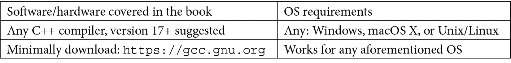

# 零、前言

公司需要利用 C 来提高其速度。但是，面向对象的软件设计导致代码更易于修改和维护。了解如何将 C++ 用作面向对象的语言至关重要。用 C 编程不能保证 OOP-必须了解 OO 概念以及它们如何映射到 c 语言功能以及 OO 编程技术。此外，程序员将希望利用 OOP 以外的其他技能来使代码更通用，更健壮，并采用经过良好测试的创造性解决方案，这些解决方案可以在流行的设计模式中找到。

学习如何将 C 作为面向对象语言的程序员将成为有价值的 C 开发人员。没有 OOP 理解和技能的 C 程序员是其代码将难以维护，修改或其他任何人理解的人。成为 C 语言的 OO 程序员是需要使用这种语言的公司所希望的一项宝贵技能。

本书对基本的 OO 概念进行了逐步的解释，并与代码中的实际示例以及通常的图表相结合，因此您可以真正理解事物的工作方式和原因。自我评估问题可用于测试您的技能。

本书首先提供了必要的技能构建块 (可能不是面向对象的)，这些技能为 OO essentials 的构建提供了必不可少的基础。接下来，将描述 OO 概念，并与语言功能以及编码技术配对，以便您可以了解如何成功地将 C 用作 OOP 语言。此外，还增加了更高级的技能来增加程序员的功能，包括朋友函数/类，运算符重载，模板 (构建更通用的代码)，异常处理 (构建健壮的代码)，STL 基础知识，以及设计模式和习语。

在本书结束时，您将了解基本的和高级的 OO 概念，以及如何在 C 中实现这些概念。您将不仅学习如何使用 C，而且还将学习如何将其用作 OOP 语言。此外，您还将了解制作更健壮和易于维护的代码的方法，以及了解如何将经过良好测试的设计模式作为编程曲目的一部分。

# 这本书是给谁的

本书的目标读者是专业的程序员以及熟练的大学生，他们希望了解如何利用 C 作为面向对象的编程语言来编写健壮，可维护的代码。这本书假设读者是一名程序员，但不是一个一定熟悉 C 的人。早期的章节简洁地回顾了核心语言功能，并作为主要的 OOP 章节，高级功能和设计模式的构建块。

# 这本书涵盖了什么

[*第一章*](01.html#_idTextAnchor018)，*了解基本 C 假设*，对书中假设的基本语言特征进行了简明扼要的回顾，现有程序员可以快速掌握。

[*第 2 章*](02.html#_idTextAnchor066)，*添加语言必需品*，回顾非 OO 的关键 C 构件特性: const 限定符、函数原型 (默认值) 和函数重载。

[*第 3 章*](03.html#_idTextAnchor112)，*间接寻址-指针*，在 C 中回顾指针，包括内存分配/解除分配，指针使用/取消引用，函数参数和 void * 的用法。

[*第 4 章*](04.html#_idTextAnchor169)，*间接寻址-引用*，引入引用作为指针的替代，包括初始化，函数参数/返回值和 const 限定。

[*第五章*](05.html#_idTextAnchor199)，*详细探究类*，介绍了 OOP，首先探讨了封装和信息隐藏的概念，然后详细介绍了类的特征: 成员函数，`this`指针，访问数据成员和成员函数 (`const`，`static`，`inline`) 上的标签和区域，构造函数，析构函数和限定符。

[*第六章*](06.html#_idTextAnchor262)，*用单继承实现层次结构*，使用单继承实现细节泛化和专业化。它涵盖了继承成员，基类构造函数的使用，继承的访问区域，构造/破坏的顺序，以及公共与私有和受保护的基类，以及这如何改变继承的含义。

[*第 7 章*](07.html#_idTextAnchor298)，*通过多态利用动态绑定*，描述了多态的 OO 概念，然后将操作与方法区分开来，并详细介绍了虚拟函数以及方法对操作的运行时绑定 (包括 v 表的工作方式)。

[*第 8 章*](08.html#_idTextAnchor335)，*掌握抽象类*，解释了抽象类的 OO 概念，它们使用纯虚拟函数的实现，接口的 OO 概念以及如何实现它，以及公共继承层次结构中的上下转换。

[*第九章*](09.html#_idTextAnchor361)，*探索多重继承*，详细介绍了如何使用多重继承及其在 OO 设计中的争议。它涵盖了虚拟基类，菱形层次结构，以及何时通过检查鉴别器的 OO 概念来考虑替代设计。

[*第 10 章*](10.html#_idTextAnchor386)，*实现关联，聚合和组合*，描述了关联，聚合和组合的 OO 概念以及如何使用指针，指针集，包含和有时引用来实现每个概念。

[*第 11 章*](11.html#_idTextAnchor417)，*处理异常*，通过考虑多种异常场景，说明如何进行`try`，`throw`，`catch`异常。它还显示了如何扩展异常处理层次结构。

[*第 12 章*](12.html#_idTextAnchor453)，*Friends 和 Operator 重载*，说明了 friend 函数和类的正确使用，并检查运算符重载 (可能使用朋友)，以允许运算符以与标准类型相同的方式处理用户定义的类型。

[*第 13 章*](13.html#_idTextAnchor486)，*使用模板*，详细介绍了模板函数和类，以将某些类型的代码通用为任何数据类型。它还显示了运算符重载如何使所选代码对于任何类型都更加通用，以进一步支持模板的使用。

[*第 14 章*](14.html#_idTextAnchor518)，*了解 STL 基础*，介绍了 C++ 中的标准模板库，并演示了如何使用常用容器，如`list`，`iterator`，`deque`，`stack`，`queue`、`priority_queue`和`map`。此外，还介绍了 STL 算法和函子。

[*第 15 章*](15.html#_idTextAnchor572)，*测试类和组件*，说明了使用规范类形式的 OO 测试方法，测试类的驱动程序，并展示了如何通过继承来测试类相关，使用异常处理的关联和聚合以及测试类。

[*第 16 章*](16.html#_idTextAnchor622)，*使用观察者模式*，对设计模式进行了整体介绍，然后用一个深入的例子说明了模式的组成部分，对观察者模式进行了解释。

[*第 17 章*](17.html#_idTextAnchor649)，*应用工厂模式*，介绍了工厂方法模式，并展示了有无对象工厂的实现。它还将对象工厂与抽象工厂进行了比较。

[*第 18 章*](18.html#_idTextAnchor682)，*应用适配器模式*，研究适配器模式，提供利用继承与关联实现模式的策略和示例。此外，它还将包装器类演示为一个简单的适配器。

[*第 19 章*](19.html#_idTextAnchor718)，*使用单例模式*，用一个复杂的配对类实现详细地研究了单例模式。还介绍了单例注册表。

[*第 20 章*](20.html#_idTextAnchor756)，*使用 pImpl 模式删除实现细节*，描述了 pImpl 模式以减少代码中的编译时间依赖性。使用唯一指针探索了详细的实现。探讨了与模式相关的性能问题。

# 充分利用这本书

假设您有当前可用的 C 编译器。您将想要尝试许多在线代码示例!您可以使用任何 C 编译器; 但是，建议使用版本 17 或更高版本。所介绍的代码将符合 C 20，但在版本 17 中同样适用。最低限度，请从[https://gcc.gnu.org](https://gcc.gnu.org)下载 g。



*请记住，尽管有 C 的 ISO 标准，但某些编译器会有所不同，并对标准进行解释，但差异很小。*

如果您使用的是本书的数字版本，我们建议您自己键入代码或通过 GitHub 存储库访问代码 (下一节提供链接)。这样做将帮助您避免与代码复制和粘贴有关的任何潜在错误。

强烈建议您在阅读本书时尝试编码示例。完成评估将进一步增强您对每个新概念的掌握。

# 下载示例代码文件

您可以从您的帐户下载本书的示例代码文件，网址为[www.packt.com](http://www.packt.com)。如果您在其他地方购买了这本书，则可以访问[www.packtpub.com/support](http://www.packtpub.com/support)并注册以将文件直接通过电子邮件发送给您。

这本书的代码包也托管在 GitHub 上，https://github.com/PacktPublishing/ Demystified-Object-Oriented-Programming-w 暨 CPP。如果代码有更新，它将在现有 GitHub 存储库中更新。

我们还从我们丰富的书籍和视频目录中提供了其他代码包，可在[https://github.com/PacktPublishing/](https://github.com/PacktPublishing/) 获得。看看他们!

# 下载彩色图像

我们还提供了一个 pdf 文件，其中包含本书中使用的屏幕截图/图表的彩色图像。你可以在这里下载:

[https://static.packt-cdn.com/downloads/9781839218835_ColorImages.pdf](https://static.packt-cdn.com/downloads/9781839218835_ColorImages.pdf)

# 代码在行动

请访问以下链接以查看 CiA 视频: [https://bit.ly/2P1UXlI](https://bit.ly/2P1UXlI)

# 使用的约定

本书中使用了许多文本约定。

`Code in text`: 表示文本中的代码字、数据库表名、文件夹名、文件名、文件扩展名、路径名、虚拟 url、用户输入和 Twitter 句柄。这是本书中的一个示例: “回顾我们前面提到的`main()`函数，我们首先使用`list<Humanoid *> allies;`创建一个`STL``list`的`Humanoid`指针。”

代码块或程序段设置如下:

```cpp
char name[10] = "Dorothy"; 
float grades[20];  
grades[0] = 4.0;
```

当我们希望提请您注意代码块的特定部分时，相关行或项目以粗体设置:

```cpp
cout << "Hello " << name << flush;
cout << ". GPA is: " << setprecision(3) << gpa << endl;
```

任何命令行输入或输出都写如下:

```cpp
Ms. Giselle R. LeBrun
Dr. Zack R. Moon
Dr. Gabby A. Doone
```

**粗体**: 表示一个新的术语，一个重要的单词，或者你在屏幕上看到的单词。例如，菜单或对话框中的单词会像这样出现在文本中。这里有一个例子: “pImpl 模式 (**p**ointer to**Impl**ementation idiom) 是一种结构设计模式，它将类的实现与其公共接口分开。”

提示或重要注释

像这样出现。

# 取得联系

我们总是欢迎读者的反馈。

**一般反馈**: 如果您对本书的任何方面有疑问，请在邮件主题中提及书名，并通过[customercare@packtpub.com](mailto:customercare@packtpub.com)向我们发送电子邮件。

**勘误表**: 尽管我们已经尽了一切努力来确保我们内容的准确性，但错误确实会发生。如果您在本书中发现错误，我们将不胜感激。请访问[www.packtpub.com/support/errata](http://www.packtpub.com/support/errata)，选择您的书，点击勘误表提交链接，并输入详细信息。

**盗版**: 如果您在互联网上遇到任何形式的非法复制我们的作品，如果您能提供我们的位置地址或网站名称，我们将不胜感激。请通过[copyright@packt.com](mailto:copyright@packt.com)与我们联系，并提供材料链接。

**如果你有兴趣成为作者**: 如果有一个你有专长的话题，并且你有兴趣写作或投稿，请访问[authors.packtpub.com](http://authors.packtpub.com)。

# 评论

请留下评论。一旦你阅读并使用了这本书，为什么不在你购买它的网站上留下评论呢？然后，潜在的读者可以看到并使用您的公正意见来做出购买决定，我们在 Packt 可以了解您对我们产品的看法，我们的作者可以看到您对他们的书的反馈。谢谢!

有关 Packt 的更多信息，请访问[packt.com](http://packt.com)。