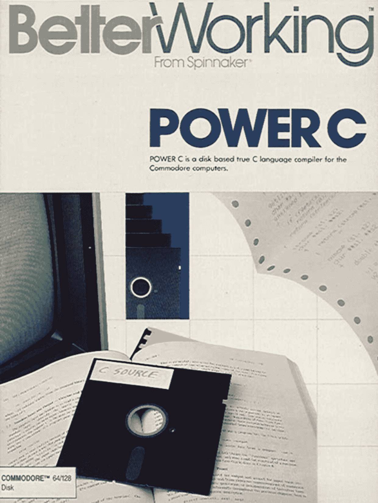

# 二、作为一种嵌入式语言的 C++ 

在资源受限的系统上进行嵌入式开发时，仍然普遍认为仅将 C 和 ASM 视为可行的选择，并伴随着这样的思想，即 C 比 C 具有更大的足迹，或者增加了大量的复杂性。在本章中，我们将详细研究所有这些问题，并考虑 C 作为嵌入式编程语言的优点:

*   C 相对于 C
*   C++ 作为多范式语言的优势
*   与现有 C 和 ASM 的兼容性
*   C 11、C 14 和 C 17 的变化

# C 相对于 C

C 和 C 的血统都可以追溯到 ALGOL 编程语言，该语言的第一个版本 1958 年 (ALGOL 58)，然后是 1960 年和 1968 的更新。ALGOL 引入了命令式编程的概念-一种编程风格，其中语句明确地告诉机器如何对输出和控制流的数据进行更改。

从命令式编程中自然出现的范例是程序的使用。我们将从一个例子开始，介绍术语。程序是子例程和函数的同义词。它们确定语句组并使其独立，从而将这些语句的范围限制在它们所包含的部分的有限范围内，创建层次结构，并因此将这些程序作为新的，更抽象的语句引入。大量使用这种过程编程风格可以在所谓的结构化编程中找到自己的位置，以及循环和分支控制结构。

随着时间的流逝，引入了结构化和模块化编程样式，作为提高应用代码的开发，质量和可维护性的技术。C 语言是一种命令式的结构化编程语言，因为它使用了语句、控制结构和功能。

以 C 中的标准 Hello World 为例:

```cpp
#include <stdio.h> 
int main(void) 
{ 
    printf("hello, world"); 
    return 0; 
} 
```

任何 C (和 C) 应用的入口点是`main()`函数 (过程)。在这个函数的第一个语句行中，我们调用另一个过程 (`printf()`)，它包含自己的语句，并可能以附加函数的形式调用其他语句块。

通过这种方式，我们已经通过实现`main()`逻辑块 (`main()`函数) 来使用过程编程，该逻辑块根据需要进行调用。虽然将只调用一次`main()`函数，但在`printf()`语句中再次找到了过程样式，该语句调用应用中的其他语句，而无需显式复制它们。应用过程编程可以更轻松地维护生成的代码，并创建我们可以在多个应用中使用的代码库，同时仅维护单个代码库。

1979 年，Bjarne Stroustrup 开始了具有类的*C 的工作，为此他采用了 C 的现有编程范例，并添加了其他语言的元素，特别是 Simula (面向对象的编程: 命令式和结构化) 和 ML (通用编程，以模板的形式)。它还将提供**基本组合编程语言** (**BCPL**) 的速度，而不会将开发人员限制在其限制性的低级焦点上。*

生成的多范式语言被重命名为**C**1983 年，同时添加了 C 中没有的附加功能，包括运算符和函数重载、虚拟函数、引用，并开始为此 c 语言开发独立编译器。

C 的基本目标仍然是为现实世界的问题提供切实可行的解决方案。此外，C 一直是更好的 C 的意图，因此得名。Stroustrup 自己定义了许多规则 (如*进化 C 1991-2006*中所述)，这些规则将 C 的发展驱动到今天，包括以下内容:

*   C 的进化必须由实际问题驱动
*   每个功能都必须有一个相当明显的实现
*   C++ 是一种语言，不是一个完整的系统
*   不要试图强迫人们使用特定的编程风格
*   没有隐式违反静态类型系统
*   为用户定义的类型提供与内置类型一样好的支持
*   不给 C 以下的低级语言留下空间 (汇编程序除外)
*   你不使用的东西，你不付钱 (零开销规则)
*   如有疑问，提供手动控制的手段

相对于 C 的差异显然超出了面向对象的编程。尽管人们对 C 只是 C 的一组扩展的印象挥之不去，但它长期以来一直是自己的语言，增加了严格的类型系统 (与当时 C 的弱类型系统相比)，更强大的编程范式以及 C 中找不到的功能。因此，它与 C 的兼容性可以更多地看作是巧合，C 是在正确的时间作为基础的正确语言。

当时 Simula 的问题是它对于一般使用来说太慢了，而 BCPL 的水平也太低了。C 在当时是一种相对较新的语言，在功能和性能之间提供了正确的中间立场。

# C 作为一种嵌入式语言

大约在 1983 年，当 C 刚刚被构想并获得其名称时，面向普通受众以及企业的流行个人计算机系统的规格如下表所示:

| **系统** | **中央处理器** | Ingt0ggggt: Clock speed (MHz) ingitT1 | **RAM (KB)** | **ROM (KB)** | Ingt0gt0gt Storage (KB) orieT1 itsgggt |
| BBC 微 | 6502 (B 6512A) | 2 | 16-128 | 32-128 | 最大 1,280 (ADFS 软盘)最大 20 MB (硬盘) |
| MSX | Zilog Z80 | 3.58 | 8-128 | 32 | 720 (软盘) |
| 准将 64 | 6510 | ~ 1 | 64 | 20 | 1,000 (胶带)170 (软盘) |
| 辛克莱 ZX81 | Zilog Z80 | 3.58 | 1 | 8 | 15 (墨盒) |
| IBM PC | 英特尔 8080 | 4.77 | 16-256 | 8 | 360 (软盘) |

现在将这些计算机系统与最近的 8 位**微控制器** (**MCU**) 进行比较，例如 AVR ATMega 2560，其规格如下:

*   16 mhz 时钟速度
*   8 KB 内存
*   256 KB ROM (程序)
*   4 KB ROM (数据)

ATMega 2560 是 2005 年推出的，是当今更强大的 8 位 mcu 之一。它的功能与 20 世纪 80 年代计算机系统相比具有优势，但最重要的是，MCU 不依赖任何外部存储器组件。

如今，由于改进的硅 ic 制造工艺，MCU 核心时钟速度明显更快，这些工艺还提供了更小的芯片尺寸、高吞吐量，从而降低了成本，此外，20 世纪 80 年代架构通常需要 2 到 5 个时钟周期来检索、解码、执行指令并存储与 AVR 的单周期执行性能相反的结果。

当前的 MCU (静态) RAM 限制主要是由于成本和功率限制，但是对于大多数使用外部 RAM 芯片的 MCU，以及添加低成本的基于闪存或其他大容量存储设备，都可以轻松地规避。

除了内置的基本解释器 (内置的 ROM) 之外，像**Commodore 64** (**C64**) 这样的系统通常用 C 编程。Spinnaker 发布的 Power C 是 Commodore 64 的著名 C 开发环境:



Power C 是针对 C 开发人员的生产力软件品牌之一。它出现在单个双面软盘上，允许您在编辑器中编写 C 代码，然后使用包含的编译器，链接器，头文件和库对其进行编译，以生成系统的可执行文件。

当时存在更多这样的编译器集合，针对各种系统，显示了用于软件开发的丰富生态系统。其中，C 当然是新人。Stroustrup 的*第一版 C 编程语言*仅在 1985 年发布，但最初没有与之相结合的可靠实现。

但是，对 C 的商业支持开始迅速出现，主要的开发环境 (例如 Borland C 1.0) 1987 年发布并更新到 2.0 1991 年。像这样的开发环境特别在 IBM PC 及其无数克隆上使用，这些克隆不存在诸如 BASIC 之类的首选开发语言。

当 C 作为一个非官方的标准 1985 年开始时，它不是 1989 年的，并且在第二版中发布了 C 编程语言作为权威作品，C 达到了大致等于随后由 ISO 工作组标准化为 ISO/IEC 14882:1998 的功能水平，俗称 C 98。仍然可以说，在摩托罗拉 68040 1990 年和英特尔 486DX 1992 年出现之前，C 看到了重大的发展和采用，后者的处理能力超过了 20 MIPS 大关。

既然我们已经考虑了早期的硬件规范以及 C 和当时打算在当时存在的相对有限的系统上使用的 c 语言的发展，那么 C 似乎更有能力在这样的硬件上运行，并扩展到现代微控制器上。但是，似乎也有必要询问自那时以来添加到 C 的复杂性在多大程度上影响了内存或计算性能要求。

# C 语言功能

我们之前研究了对数据和系统状态的更改的显式性质，该更改定义了命令式编程，而不是声明式编程，在循环中操作数据，这样的功能可以被声明为将运算符映射到某些数据，从而阐明了功能，而不是特定的操作顺序。但是，为什么编程语言一定要在命令式和声明式范式之间进行选择？

实际上，C 的主要区别特征之一是它的多范式性质，同时使用了命令式和声明式范式。除了 C 的过程编程之外，还将面向对象，通用和功能编程包含到 C 中，似乎很自然地假设这一切都必须付出代价，无论是在更高的 CPU 使用率方面还是在更多的 RAM 和/或 ROM 消耗。

然而，正如我们在本章前面了解到的，c 语言功能最终是建立在 c 语言上的，因此，相对于在普通 C 中实现类似的构造，应该有很少或没有开销。为了解决这个难题并研究低开销假设的有效性，我们现在将详细研究一些 c 语言功能，以及它们最终是如何实现的，以及它们在二进制和内存大小方面的相应成本。

一些特别关注 C 作为一种低级嵌入式语言的示例是在 Rud Merriam 的 Code Craft 系列中获得许可的，如在 Hackaday 上发布的: [https://hackaday.io/project/ 8238-embedding-c](https://hackaday.io/project/8238-embedding-c)。

# 名称空间

名称空间是一种将其他范围级别引入应用的方法。正如我们在前面关于类的部分所看到的，这些是一个编译器级的概念。

主要用途在于将代码模块化，在类不是最明显的解决方案的情况下，或者您希望使用名称空间将类显式地排序为特定类别的情况下，将其划分为逻辑段。这样，您还可以避免类似命名的类、类型和枚举之间的名称和类型冲突。

# 强类型

类型信息对于测试是否正确访问和解释数据是必要的。C 中相对于 C 的一大特征是包含了一个强类型系统。这意味着编译器执行的许多类型检查要比 C (这是一种弱类型的语言) 所允许的严格得多。

这在查看此合法 C 代码时最为明显，当编译为 C 时会产生错误:

```cpp
void* pointer; 
int* number = pointer; 
```

或者，它们也可以用以下方式编写:

```cpp
int* number = malloc(sizeof(int) * 5); 
```

C 禁止隐式强制转换，要求这些示例编写如下:

```cpp
void* pointer; 
int* number = (int*) pointer; 
```

它们也可以用以下方式编写:

```cpp
int* number = (int*) malloc(sizeof(int) * 5); 
```

当我们明确指定要转换的类型时，我们可以放心，在编译期间，任何类型转换都可以执行我们期望的操作。

同样，如果我们试图从没有这个限定符的引用中分配一个具有`const`限定符的变量，编译器也会抱怨并抛出错误:

```cpp
const int constNumber = 42; 
int number = &constNumber; // Error: invalid initialization of reference. 
```

要解决此问题，您需要显式转换以下转换:

```cpp
const int constNumber = 42; 
int number = const_cast<int&>(constNumber); 
```

执行这样的显式强制转换肯定是可能的，也是有效的。以后使用此参考来修改所谓的恒定值的内容时，也可能会引起巨大的问题和头痛。但是，当您发现自己像前面那样编写代码时，可以合理地假设您已经意识到其中的含义。

这种显式类型的强制执行具有使静态分析比弱类型语言更有用和有效的显着好处。反过来，这有利于运行时的安全，因为任何转换和分配最有可能是安全的，没有意外的副作用。

作为类型系统，主要是编译器的功能，而不是任何类型的运行时代码，将 (可选) 运行时类型信息作为例外。只有在编译时才会注意到在 C 中具有强类型类型系统的开销，因为必须对每个变量分配，操作和转换进行更严格的检查。

# 类型转换

每当将值分配给兼容变量时，就会发生类型转换，该变量与值的类型不完全相同。每当存在用于转换的规则时，可以隐式地进行此转换，否则可以向编译器提供显式提示 (cast)，以调用存在歧义的特定规则。

而 C 仅具有隐式和显式类型转换，C 通过许多基于模板的函数对此进行扩展，从而允许您以多种方式转换常规类型和对象 (类):

*   `dynamic_cast <new_type>` (表达式)
*   `reinterpret_cast <new_type>` (表达式)
*   `static_cast <new_type>` (表达式)
*   `const_cast <new_type>` (表达式)

在这里，`dynamic_cast`保证得到的对象是有效的，依赖于**运行时类型信息** (**RTTI**) (参见后面的部分)。`static_cast`是类似的，但不验证结果对象。

接下来，`reinterpret_cast`可以将任何东西投射到任何东西，甚至是无关的类。这种转换是否有意义留给开发人员，就像常规的显式转换一样。

最后，一个`const_cast`很有趣，因为它可以设置或删除值的`const`状态，当您只需要一个函数的值的非`const`版本时，这可能会很有用。然而，这也规避了类型安全系统，应该非常谨慎地使用。

# 类

**面向对象编程** (**OOP**) 从 Simula 时代开始就存在了，它以慢语言而闻名。这导致 Bjarne Stroustrup 将其 OOP 实现基于快速高效的 C 编程语言。

C++ 使用 C++ 风格的语言构造来实现对象。当我们看一下 C 代码及其对应的 C 代码时，这一点变得显而易见。

当查看 C 类时，我们会看到它的典型结构:

```cpp
namespace had { 
using uint8_t = unsigned char; 
const uint8_t bufferSize = 16;  
    class RingBuffer { 
        uint8_t data[bufferSize]; 
        uint8_t newest_index; 
        uint8_t oldest_index;  
        public: 
        enum BufferStatus { 
            OK, EMPTY, FULL 
        };  
        RingBuffer();  
        BufferStatus bufferWrite(const uint8_t byte); 
        enum BufferStatus bufferRead(uint8_t& byte); 
    }; 
} 
```

这个类也在一个命名空间内 (我们将在后面的章节中详细介绍)，一个重新定义的`unsigned char`类型，一个命名空间-全局变量定义，最后是类定义本身，包括一个私有和公共部分。

这个 C 代码定义了许多不同的作用域，从命名空间开始，到类结束。类本身在其公共，受保护和私有访问级别的意义上添加了作用域。

相同的代码可以在常规 C 中实现如下:

```cpp
typedef unsigned char uint8_t; 
enum BufferStatus {BUFFER_OK, BUFFER_EMPTY, BUFFER_FULL}; 
#define BUFFER_SIZE 16 
struct RingBuffer { 
   uint8_t data[BUFFER_SIZE]; 
   uint8_t newest_index; 
   uint8_t oldest_index; 
};  
void initBuffer(struct RingBuffer* buffer); 
enum BufferStatus bufferWrite(struct RingBuffer* buffer, uint8_t byte); 
enum BufferStatus bufferRead(struct RingBuffer* buffer, uint8_t *byte); 
```

`using`关键字类似于`typedef`，在那里直接映射。我们使用`const`代替`#define`。C 和 C 之间的`enum`本质上是相同的，只是 C 的编译器在用作类型时不需要`enum`的显式标记。当涉及到简化 C 代码时，结构也是如此。

C 类本身在 C 中实现为包含类变量的`struct`。创建类实例时，本质上意味着此`struct`的实例已初始化。然后，在每次调用 C 类的函数时，都会传递一个指向该`struct`实例的指针。

这些基本示例向我们展示的是，与基于 C 的代码相比，我们使用的任何 C 特性都没有运行时开销。命名空间、类访问级别 (公共、私有和受保护) 等仅由编译器用于验证正在编译的代码。

C 代码的一个不错的功能是，尽管性能相同，但它需要的代码更少，同时还允许您定义严格的接口访问级别，并具有在类被破坏时调用的析构函数类方法，从而允许您自动清理分配的资源。

使用 C 类遵循以下模式:

```cpp
had::RingBuffer r_buffer;  
int main() { 
    uint8_t tempCharStorage;     
    // Fill the buffer. 
    for (int i = 0; r_buffer.bufferWrite('A' + i) == 
    had::RingBuffer::OK; i++)    { 
        // 
    } 
    // Read the buffer. 
    while (r_buffer.bufferRead(tempCharStorage) == had::RingBuffer::OK) 
    { 
         // 
    } 
} 
```

这与 C 版本相比是这样的:

```cpp
struct RingBuffer buffer;  
int main() { 
    initBuffer(&buffer); 
    uint8_t tempCharStorage;  
    // Fill the buffer. 
    uint8_t i = 0; 
    for (; bufferWrite(&buffer, 'A' + i) == BUFFER_OK; i++) {          
        // 
    }  
    // Read the buffer. 
    while (bufferRead(&buffer, &tempCharStorage) == BUFFER_OK) { // 
    } 
} 
```

使用 C 类与使用 C 风格的方法并没有太大区别。不必为每个函数调用手动传递分配的`struct`实例，而是调用类方法，这可能是最大的区别。这个实例仍然以`this`指针的形式存在，它指向类实例。

虽然 C 示例在`RingBuffer`类中使用了命名空间和嵌入式枚举，但这些只是可选功能。人们仍然可以使用全局枚举，或者在名称空间的范围内，或者具有许多层的名称空间。这在很大程度上取决于应用的要求。

至于使用类的成本，本节中的示例版本是为上述 Arduino UNO (ATMega328 MCU) 和 ardue (AT91SAM3X8E MCU) 开发板的代码 Craft 系列编译的，为编译后的代码提供了以下文件大小:

|  | **One** | **Two** |  |  |
| **C** | **C** | **C** | **C** |  |
| **全局范围数据** | 614 | 652 | 11,184 | 11,196 |
| **主范围数据** | 664 | 664 | 11,200 | 11,200 |
| **四个实例** | 638 | 676 | 11,224 | 11,228 |

这些代码文件大小的优化设置设置为`-O2`。

在这里，我们可以看到 C 代码与编译后的 C 代码相同，除了当我们执行全局类实例的初始化时，由于添加了为我们执行此初始化的代码，对于 Uno 来说相当于 38 个字节。

由于此代码只有一个实例必须存在，这是一个不变的成本，我们只需要支付一次: 在第一行和最后一行中，我们分别有一个和四个类实例或它们的等价物，但在 Uno 固件中只有一个额外的 38 字节。对于应有的固件，我们可以看到类似的东西，尽管没有明确定义。这种差异可能会受到其他一些设置或优化的影响。

这告诉我们，有时我们不想让编译器为我们初始化一个类，但是如果我们需要最后几个字节的 ROM 或 RAM，我们应该自己做。但是，在大多数情况下，这不是问题。

# 继承

除了允许您将代码组织成对象之外，类还允许类通过使用多态性来充当其他类的模板。在 C 中，我们可以将任意数量的类的属性组合到一个新类中，并为其提供自定义属性和方法。

这是创建**用户自定义类型** (**UDTs**) 的一种非常有效的方法，尤其是当结合运算符重载使用常用运算符为 UDT 定义加法、减法等操作时。

C 中的继承遵循以下模式:

```cpp
class B : public A { // Private members. public: // Additional public members. }; 
```

在这里，我们声明一个类，`B`，它来源于类`A`。这使我们可以在类 B 的实例上使用类 A 中定义的任何公共方法，就好像它们是在后者中定义的一样。

所有这些似乎都很容易理解，即使当我们开始从多个基类派生时，事情可能会变得有些混乱。但是，通过适当的规划和设计，多态性可能是一个非常强大的工具。

不幸的是，这些都没有回答使用多态性给我们的代码增加了多少开销的问题。我们早些时候看到，C 类本身在运行时不会增加任何开销，但是通过从一个或多个基类派生，预期生成的代码会变得更加复杂。

幸运的是，事实并非如此。就像简单的类一样，生成的派生类是类实现基础结构的简单合并。继承过程本身以及随之而来的验证主要是一个编译器时间问题，为开发人员带来了各种好处。

# 虚拟基类

有时，一个基类有一个类方法的实现没有太大意义，但同时我们希望强制任何派生类来实现该方法。这个问题的答案是虚拟方法。

取以下类定义:

```cpp
class A { 
public: 
   virtual bool methodA() = 0; 
   virtual bool methodB() = 0; 
}; 
```

如果我们试图从这个类派生，我们必须实现这两个类方法或得到一个编译器错误。由于基类中的两个方法都是虚拟的，因此整个基类称为虚拟基类。当您希望定义一个可以由一系列不同类实现的接口时，这一点特别有用，但可以保留仅引用一种用户定义类型的便利性。

在内部，像这样的虚拟方法是使用`vtables`来实现的，它是*虚拟表*的缩写。这是一个数据结构，对于每个虚拟方法，都包含指向该方法实现的内存地址 (指针):

```cpp
VirtualClass* → vtable_ptr → vtable[0] → methodA() 
```

我们可以比较这种级别的间接相对于 C 风格的代码和具有直接方法调用的类的性能影响。关于虚拟函数时序的 Code Craft 文章 ([https://hackaday.com/2015/11/13/code-craft-embedding-c-timing-virtual-functions/](https://hackaday.com/2015/11/13/code-craft-embedding-c-timing-virtual-functions/) ) 描述了这样一种方法，并有有趣的发现:

|  | `Uno`] | `Due`] |  |  |
| `Os`] | `O2`] | `Os`] | `O2`] |  |
| **C 函数调用** | 10.4 | 10.2 | 3.7 | 3.6 |
| **C 直接呼叫** | 10.4 | 10.3 | 3.8 | 3.8 |
| **C 虚拟呼叫** | 11.1 | 10.9 | 3.9 | 3.8 |
| **多个 C 调用** | 110.4 | 106.3 | 39.4 | 35.5 |
| **C 函数指针调用** | 105.7 | 102.9 | 38.6 | 34.9 |
| **C 虚拟调用** | 103.2 | 100.4 | 39.5 | 35.2 |

这里列出的所有时间都以微秒为单位。

此测试使用的两个 Arduino 开发板与比较 C 代码和 C 类之间的编译输出大小的开发板相同。使用两种不同的优化级别来比较这样的编译器设置的影响: -Os 以字节为单位优化结果二进制的大小，其中，由于`-O2`设置以比`-O1`优化级别更激进的方式优化速度。

从这些时序中，我们可以肯定地说，虚拟方法引入的间接级别是可测量的，尽管不是戏剧性的，在 Arduino Uno 开发板的 ATMega328 上增加了整整 0.7 微秒，在更快的基于 ARM 的板上增加了大约 0.1 微秒。

即使从绝对的角度来看，虚拟类方法的使用也不会带来足够的性能损失，无法真正重新考虑其使用，除非性能至关重要，这主要是较慢的 mcu 的情况。MCU 的 CPU 越快，其使用的影响就越小。

# 函数内联

C 中的内联关键字是给编译器的一个提示，让它知道我们希望每次调用一个函数，其名称前面有这个关键字，以导致该函数的实现，而不是被复制到调用的位置，从而跳过函数调用的开销。

这是一个编译时优化，它只会将函数实现的大小添加到编译器输出中，对于对内联函数的每个不同调用一次。

# 运行时类型信息

RTTI 的主要目的是允许使用安全的类型转换，就像使用`dynamic_cast<>`运算符一样。由于 RTTI 涉及为每个多态类存储附加信息，因此它具有一定的开销。

这是一个运行时功能，因为名称会显示出来，因此如果您不需要它提供的功能，可以禁用它。禁用 RTTI 是一些嵌入式平台上的常见做法，尤其是很少在低资源平台上使用它，例如 8 位 mcu。

# 异常处理

异常通常在桌面平台上使用，提供了一种为错误条件生成异常的方法，可以在 try/catch 块中捕获和处理。

虽然异常支持本身并不昂贵，但生成的异常相对昂贵，需要大量的 CPU 时间和 RAM 来准备和处理异常。您还必须确保捕获每个异常，否则可能会导致应用在没有明确原因的情况下终止。

异常与正在调用的方法的返回码检查是必须根据具体情况决定的，也可能是个人喜好的问题。它需要一种完全不同的编程风格，这可能并不适合每个人。

# 模板

人们经常认为 C 中的模板非常重，并且使用它们会受到严厉的惩罚。这完全忽略了模板的意义，即模板仅是用作从单个模板自动生成几乎相同的代码的速记方法-因此得名。

这实际上意味着对于我们定义的任何函数或类模板，每次引用模板时，编译器都会生成模板的内联实现。

这是我们在 C**标准模板库** (**STL**) 中常见到的一种模式，顾名思义，大量使用模板。举个例子，像一个不起眼的地图这样的数据结构:

```cpp
std::map<std::string, int> myMap; 
```

这里发生的事情是，编译器采用了`std::map`的单数模板，以及我们在尖锐括号中提供的模板参数，填写模板并在其位置编写内联实现。

实际上，我们得到了相同的实现，就像我们为这两种类型手工编写了整个数据结构实现一样。由于替代方案是为每种可能的内置类型和其他用户定义类型手动编写每个实现，因此使用通用模板可以节省大量时间，而不会牺牲性能。

# 标准模板库

C++ 标准库 (STL) 包含了一个全面的、不断增长的函数、类等集合，允许执行通用任务，而不必依赖外部库。STL 字符串类非常受欢迎，它允许您安全地处理字符串，而不必处理空终止符和任何类似的东西。

大多数嵌入式平台都支持 STL 的全部或至少重要部分，除非对可用 RAM 等进行限制，否则无法实现完整的哈希表和其他复杂的数据结构。许多嵌入式 STL 实现包含针对目标平台的优化，从而最大程度地减少了 RAM 和 CPU 的使用。

# 可维护性

在前面的部分中，我们看到了 C 提供的许多功能，以及在资源有限的平台上使用它们的可行性。使用 C 的一大优势是可以通过使用模板来减少代码大小，以及使用类，名称空间等对代码库进行组织和模块化。

通过努力在代码中采用更模块化的方法，在模块之间具有清晰的接口，在项目之间重用代码变得更加可行。它还通过使特定代码部分的功能更清晰，并为单元和集成测试提供了明确的目标，从而简化了代码的维护。

# 摘要

在本章中，我们讨论了为什么您希望使用 C 进行嵌入式开发的一个大问题。我们看到，由于 C 开发的礼貌，它针对资源受限的平台进行了高度优化，同时提供了大量对项目管理和组织至关重要的功能。

在这一点上，读者应该能够描述 C 的主要特征，并提供每种特征的具体示例。在编写 C 代码时，读者将对特定语言功能的成本有一个清晰的概念，能够基于空间和 RAM 约束来推理为什么一段代码的一种实现优于另一种实现。

在下一章中，我们将介绍基于**单板计算机** (**SBCs**) 和类似系统的嵌入式 Linux 和类似系统的开发过程。