# 七、使用 OpenCV 构建跟踪对象的机器人

在上一章中安装了 OpenCV 之后，现在是时候使用 OpenCV 库执行图像处理操作了。在本章中，我们将介绍以下主题:

*   使用 OpenCV 进行图像处理
*   从 Pi 摄像机观看视频源
*   建造一个跟随物体的机器人

# 技术要求

本章没有新的技术要求，但是您需要以下内容来执行示例:

*   用于检测的红色，绿色或蓝色色球
*   安装在机器人上的 Pi 摄像机和超声波传感器

本章的代码文件可以从[https://github.com/PacktPublishing/ 动手机器人编程与 Cpp/tree/master/Chapter07](https://github.com/PacktPublishing/Hands-On-Robotics-Programming-with-Cpp/tree/master/Chapter07)下载。

# 使用 OpenCV 进行图像处理

在本节中，我们将介绍 OpenCV 库的重要功能。之后，我们将使用 OpenCV 库编写一个简单的 C 程序，并对图像执行不同的图像处理操作。

# OpenCV 中的重要函数

在编写任何 OpenCV 程序之前，重要的是要了解 OpenCV 中的一些主要功能以及这些功能可以为我们提供的输出。让我们先看看函数:

*   **`imread()`**: `imread()`功能用于从 Pi 摄像机或网络摄像头读取图像或视频。在`imread()`函数内部，我们必须提供图像的位置。如果图像和程序文件在同一个文件夹中，我们只需要提供图像的名称。但是，如果图像存储在不同的文件夹中，那么我们需要在`imread`函数内部提供图像的完整路径。我们将`imread()`函数中的图像值存储在矩阵 (`Mat`) 变量中。

如果图像和`.cpp`文件位于同一文件夹中，则代码将如下所示:

```cpp
Mat img = imread("abcd.jpg"); //abcd.jpg is the image name
```

如果图像和`.cpp`文件在不同的文件夹中，代码将如下所示:

```cpp
Mat img = imread("/home/pi/abcd.jpg"); //abcd image is in 
                                      // the Pi folder

```

*   `imshow()`: `imshow()`功能用于显示或查看图像:

```cpp
imshow("Apple Image", img);
```

`imshow()`函数由两个参数组成，如下所示:

`imshow()`函数的输出如下:

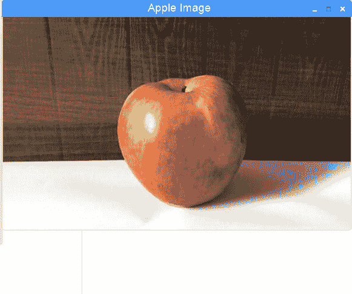

*   `resize()`: `resize()`函数用于调整图像的尺寸。该功能一般用于用户同时处理多个窗口时:

```cpp
resize(img, rzimg, cvSize(400,400));  //new width is 400 
                                     //and height is 400
```

该函数由三个参数组成:

`resize()`函数的输出如下:

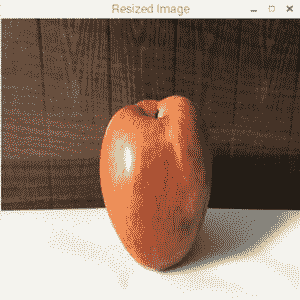

*   `flip()`: 此功能用于水平或垂直或同时翻转图像:

```cpp
flip(img, flipimage, 1)
```

该函数由三个参数组成:

`flip()`函数的输出如下:

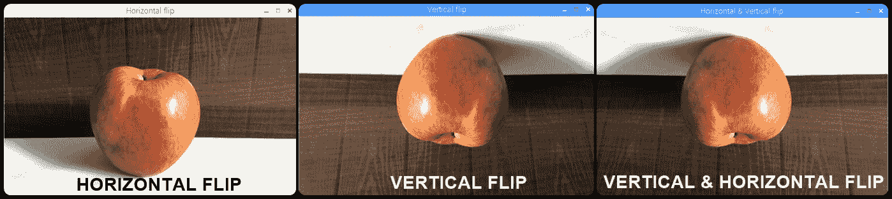

*   `cvtColor()`: 此功能用于将普通的 RGB 颜色图像转换为灰度图像:

```cpp
cvtColor(img, grayimage, COLOR_BGR2GRAY)
```

该函数由三个参数组成:

`cvtColor()`函数的输出如下:


*   `threshold()`: 阈值方法用于分离出代表对象的图像区域。简单来说，阈值用于识别图像中的特定对象。阈值化方法以源图像 (`src`) 、阈值化值和最大阈值 (`255`) 作为输入。它通过将源图像的像素值与阈值进行比较来生成输出图像 (`thresimg`):

```cpp
threshold(src, thresimg, threshold value, max threshold value, threshold type);
```

阈值函数由五个参数组成:

通常，有五种类型的阈值化，如下所示:

例如，在下面的代码中，阈值设置为`85`，最大阈值为`255`，阈值类型是由数字`0`表示的二进制:

```cpp
threshold(src, thresimg,85, 255, 0);
```

因此，如果 Apple 图像源图像上的任何像素的值都大于阈值 (即大于`85`)，则这些像素将在输出图像中变为白色。同样，源图像上的值小于阈值的像素将在输出图像中变黑:

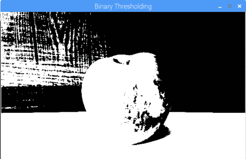

Binary thresholding

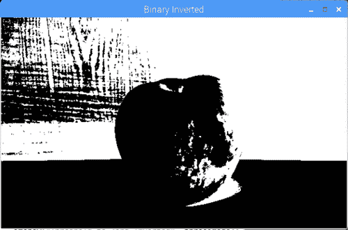

Binary inverted thresholding

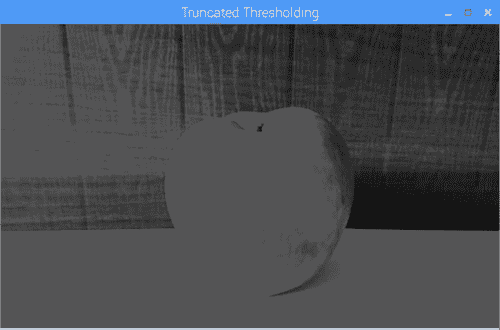

Truncated thresholding


Threshold to zero


Threshold to zero inverted

*   `inRange()`: `inRange()`函数是阈值函数的高级形式。在此函数中，我们必须输入要识别的对象的最小和最大 RGB 颜色值。`inRange()`函数由四个参数组成:
    *   第一个参数 (`img`) 是要被阈值化的图像的变量名。
    *   有两个`Scalar`函数。在第二个参数 (第一个`Scalar`函数) 中，我们必须输入对象的最小 RGB 颜色。
    *   在第三个参数中，这是第二个`Scalar`函数，我们将输入对象的最大 RGB 颜色值。
    *   第四个参数 (`thresImage`) 表示阈值图像的输出:

```cpp
inRange(img, Scalar(min B,min G,min R), Scalar(max B,max G,max R),thresImage)
```

**像矩** -- 像矩的概念借用自**矩**，在力学和统计学中都用来描述一组点的空间分布。在图像处理或计算机视觉中，使用图像矩来找到形状的**质心**，它是形状中所有点的平均平均值。简单来说，一旦我们将任何物体从整个图像中分割出来，图像矩就用来找到它的中心。例如，在我们的案例中，我们可能想要找到苹果的中心。从图像中计算物体中心的**图像矩公式**如下:

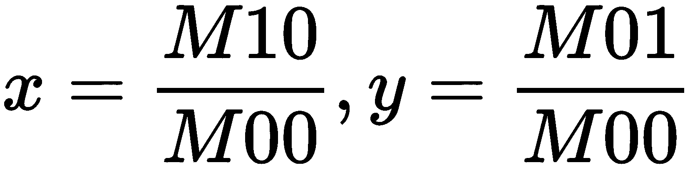

*   `circle`: 顾名思义，这个函数用来画一个圆。它以五个参数作为输入:
    *   第一个参数 (`img`) 是必须在其上绘制圆圈的图像的变量名称。
    *   第二个参数 (`point`) 是圆的中心 (*x*，*y*位置) 点。
    *   第三个参数 (`radius`) 是圆的半径。
    *   第四个参数 (`Scalar(B,G,R)`) 用于对圆进行着色; 我们使用`Scalar()`函数进行此操作。
    *   第五个参数 (`thickness`) 是圆的厚度:

```cpp
circle(img, point, radius, Scalar(B,G,R),thickness);
```

# 使用 OpenCV 进行对象识别

现在我们已经了解了 OpenCV 的重要功能，让我们编写一个程序来检测图像中的彩球。在我们开始之前，我们要做的第一件事就是给球拍一张合适的照片。您可以在此项目中使用任何球，但只需确保球具有单一颜色 (强烈建议使用红色、绿色或蓝色颜色的球)，并且它不是彩色的。我在这个项目中使用绿色球:


# 捕获图像

要捕获球的图像，请将其放在黑暗的表面上。我把我的绿球放在一个手机套上，它是黑色的:

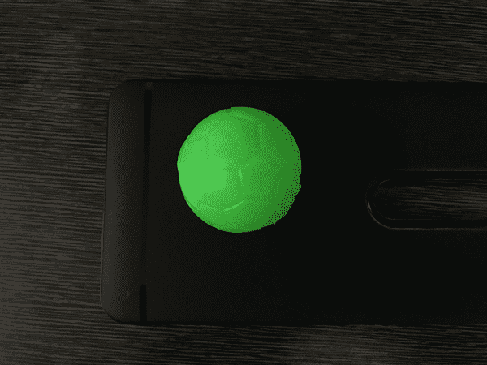

如果您的球是黑色或深色，则可以将球放在浅色的表面上。这是为了确保球的颜色和背景的颜色之间有非常高的对比度，这将有助于我们以后进行阈值化。

捕获图像时，请确保球上没有白色斑点，因为这可能会在阈值处理后引起问题:

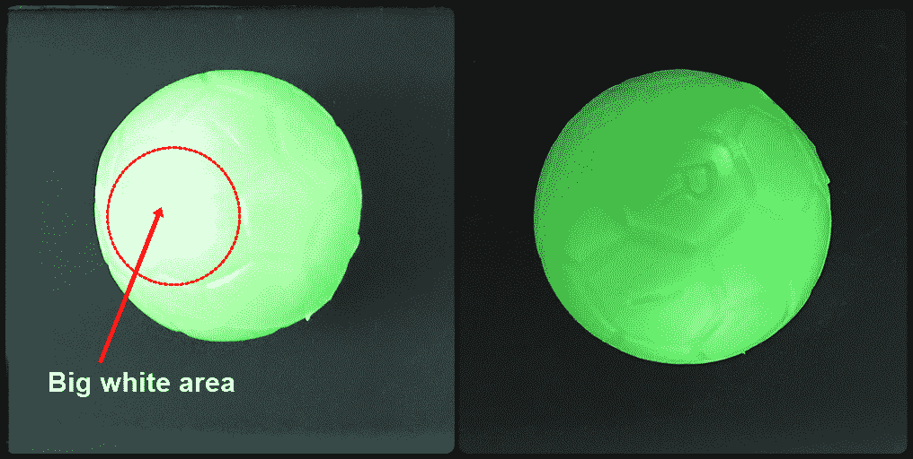

左边的照片有一个大的白色区域，因为太多的照明。在右侧，球正确点亮。

一旦您对捕获的图像感到满意，请将其转移到笔记本电脑上。

# 查找 RGB 像素值

现在，我们将通过使用以下步骤检查球上的不同点来找到球的 RGB 像素值:

1.  打开油漆并打开保存的球图像，如下所示:

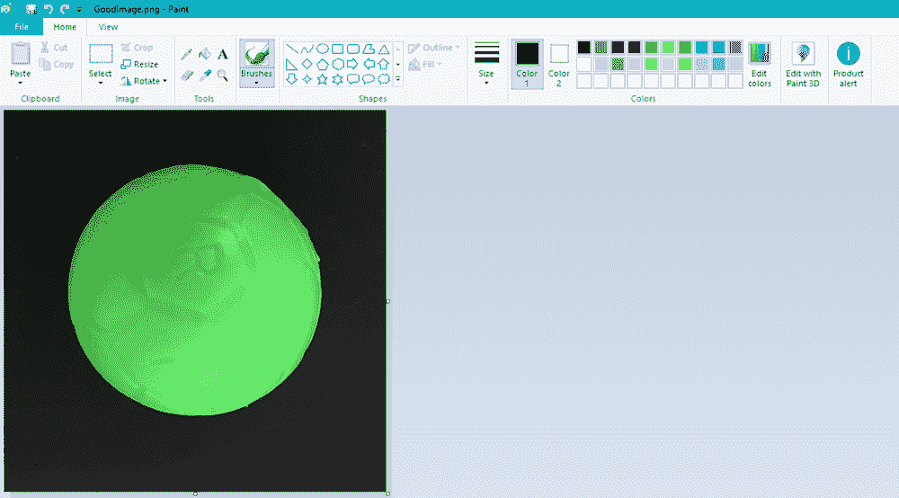

2.  接下来，使用颜色选择器工具，通过单击球上的任何位置来获取颜色的样本:

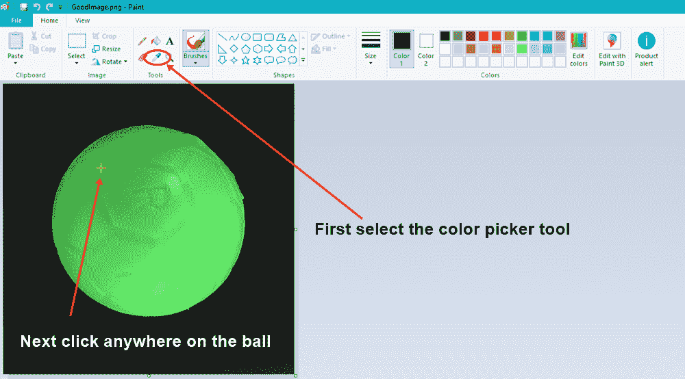

颜色 1 框将显示被点击的颜色的样本。在我的情况下，这是绿色的:

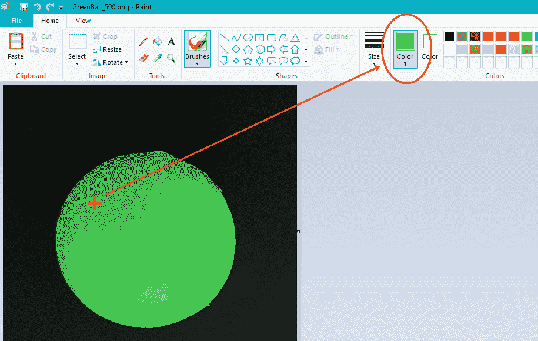

3.  如果单击 “编辑颜色” 选项，您将看到该特定像素的 RGB 颜色值。在我的情况下，绿色像素的 RGB 颜色值是红色: `61`，绿色: `177`和蓝色: `66`。记下这些值并保存以备后用:


4.  现在，再次选择颜色选择器选项，然后单击球的另一个彩色区域，以找出该特定像素的 RGB 颜色值。同样，记下这个值。做同样的事情 13 到 14 次，确保在球上包括最轻和最暗的颜色:


我已经记下了球边缘六个点的 RGB 值，球周围随机位置的四个点，以及颜色为浅绿色或深绿色的六个点。找出 RGB 值后，突出显示最低的红色，绿色和蓝色颜色值以及最高的红色，绿色和蓝色颜色值。我们将在稍后的程序中使用这些值来阈值图像。

5.  您现在需要将此图像传输到您的 RPi。我通过 Google Drive**转移了我的图像。**我这样做是通过将图像上传到 Google 云端硬盘，接下来，在我的 RPi 中打开默认的 Chromium web 浏览器，登录到我的 Gmail 帐户，打开 Google 云端硬盘，然后下载图像。

# 对象检测程序

检测绿球的程序名为`ObjectDetection.cpp`，我已将其保存在`OpenCV_codes`文件夹内。我还将`greenball.png`图像复制到此文件夹中。您可以从 GitHub 存储库的`Chapter07`文件夹下载`ObjectDetection.cpp`程序。所以，检测绿球的程序如下:

```cpp
#include <iostream>
#include<opencv2/opencv.hpp>
#include<opencv2/core/core.hpp>
#include<opencv2/highgui/highgui.hpp>
#include<opencv2/imgproc/imgproc.hpp>

using namespace cv;
using namespace std;

int main()
{

 Mat img, resizeimg,thresimage;
 img = imread("greenball.png");
 imshow("Green Ball Image", img);
 waitKey(0);

 resize(img, resizeimg, cvSize(640, 480));
 imshow("Resized Image", resizeimg);
 waitKey(0);

 inRange(resizeimg, Scalar(39, 140, 34), Scalar(122, 245, 119), thresimage);
 imshow("Thresholded Image", thresimage);
 waitKey(0);

 Moments m = moments(thresimage,true);
 int x,y;
 x = m.m10/m.m00;
 y = m.m01/m.m00;
 Point p(x,y);
 circle(img, p, 5, Scalar(0,0,200), -1);
 imshow("Image with center",img);
 waitKey(0);

 return 0;
}
```

在上面的程序中，我们将导入四个 OpenCV 库，分别是`opencv.hpp`，`core.hpp`，`highgui.hpp`和`imgproc.hpp`。然后，我们声明了作为 OpenCV 库一部分的`cv`命名空间。

以下是前项节目的说明:

1.  在`main`函数中，我们声明了三个矩阵变量，分别称为`img`，`resizeimg`和`thresimage`。
2.  接下来，将通过`imread()`函数读取`greenball.png`文件，并存储在`img`变量中。
3.  `imshow("Green Ball Image", img)`行将在新窗口中显示图像，如下面的屏幕截图所示:

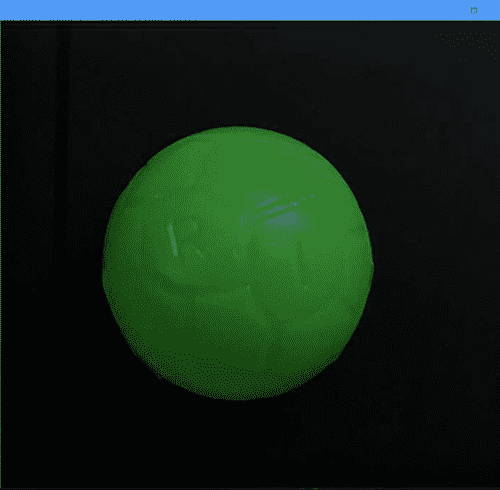

4.  在此之后，`waitKey(0)`功能将等待键盘输入。然后它将执行下一组代码。按下任何键后，将执行用于调整图像大小的下两行代码。

5.  `resize`函数将调整图像的宽度和高度，使图像的新宽度为`640`，高度为`480`:

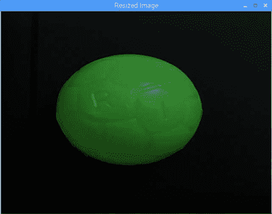

6.  然后使用`inRange`函数执行阈值化操作。在第一个`Scalar`函数中，我输入了球的绿色的最小 RGB 值，在第二个`Scalar`函数中，我输入了最大 RGB 值。阈值图像存储在`thresimage`变量中。

Inside the `Scalar` function, we have to enter the blue value first, followed by green, and then red.

7.  阈值化后，球的颜色将变为白色，图像的剩余部分将变为黑色。球中间的某些部分会出现黑色，这很好。如果大面积在白色内部显示为黑色，则表示阈值未正确进行。在这种情况下，您可以尝试修改`Scalar`函数内部的 RGB 值:


8.  接下来，使用矩，我们找到物体的中心。
9.  在`moments(thresimage,true)`行中，我们提供了`thresimage`变量作为输入。
10.  在接下来的三行代码中，我们找到白色区域的中心，并将该值存储在 point 变量`p`中。

11.  之后，要显示球的中心，我们使用`circle`功能。在 circle 函数中，我们使用`img`变量，因为我们将在原始图像上显示圆点。接下来，点变量`p`告诉函数我们必须在哪里显示点。圆点的宽度设置为`5`，圆点的颜色将为红色，因为我们只填充了`Scalar`函数的最后一个参数，表示红色。如果要设置其他颜色，可以在`Scalar`函数中更改颜色值:


12.  再按一次任意键，最终的`waitKey(0)`功能将关闭除终端窗口之外的所有窗口。要关闭终端窗口，请按*Enter*。

通过前面的程序，我们已经学习了如何调整大小，阈值，并在绿球的图像顶部生成一个点 (红点)。在下一节中，我们将对实时视频提要执行一些图像识别操作。

# OpenCV 摄像机馈送程序

现在，我们将编写一个简单的 C 程序来查看 Pi 相机的相机提要。观看视频的程序如下。该程序名为`Camerafeed.cpp`，您可以从 GitHub 存储库的`Chaper07`文件夹下载:

```cpp
int main()
{
 Mat videoframe;

VideoCapture vid(0);

if (!vid.isOpened())
 {
cout<<"Error opening camera"<<endl;
 return -1;
 }
 for(;;)
 {
 vid.read(videoframe);
 imshow("Frame", videoframe);
 if (waitKey(1) > 0) break;
 }
 return 0;
}
```

OpenCV 库和命名空间声明与以前的程序类似:

1.  首先，在`main`函数中，我们声明一个名为`videoframe`的矩阵变量。
2.  接下来，`VideoCapture`数据类型用于从 Pi 摄像机捕获视频馈送。它有一个名为`vid(0)`的变量。`vid(0)` 变量内的`0`号表示摄像机的索引号。目前，由于我们只有一个摄像机连接到 RPi，因此 Pi 摄像机的索引为`0`。如果将 USB 摄像头连接到 Raspberry Pi，则 USB 摄像头的索引为`1`。通过更改索引号，您可以在 Pi 摄像机和 USB 摄像机之间切换。
3.  接下来，我们指定如果摄像机无法捕获任何视频源，则应调用`!vid.isOpened()`条件。在这种情况下，将在终端中打印`"Error opening camera"`消息。
4.  之后，`vid.read(videoframe)`命令将读取相机提要。
5.  使用`imshow("Video output", videoframe)`行，我们现在可以查看摄像机的提要。
6.  `waitKey`命令将等待键盘输入。一旦你按下任何键，它就会退出代码。

这是您可以使用 Pi 摄像机查看视频提要的方式。

# 建造一个跟随物体的机器人

对图像进行阈值处理并查看 Pi 摄像机的视频提要后，我们将结合这两个程序来创建我们的跟踪对象的机器人程序。

在本节中，我们将编写两个程序。在第一个程序中，我们将球放置在摄像机的前面，并通过在球的中心创建一个点 (使用矩) 来跟踪它。接下来，我们将球**向上**，**向下**，**向左**，**向右**移动，并记下相机上不同位置的点值。

在第二个程序中，我们将使用这些点值作为输入，并使机器人跟随球对象。

# 使用矩跟踪球

在跟随球之前，机器人应该首先能够使用 Pi 摄像机对其进行跟踪。在编写程序之前，让我们看看我们将如何跟踪球。

# 编程逻辑

首先，我们将相机分辨率调整为 640x480，如下所示:


调整宽度和高度大小后，我们将相机屏幕水平分为三个相等的部分:


从 0 到 214 的**x 坐标值**表示左侧部分。从 214 到 428 的**x 坐标值**代表前向截面，而从 428 到 640 的**x 坐标值**代表右截面。我们不需要编写任何特定的程序来将相机屏幕分为这三个不同的部分，我们只需要记住每个部分的最小和最大**x 点值**。

接下来，我们将对球物体进行阈值处理。在此之后，我们将使用矩并在球的中心生成一个点。我们将在控制台中打印点值，并在屏幕的特定部分检查*x*和*y*点值:

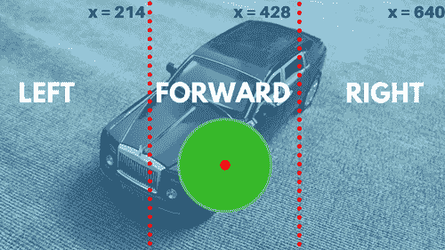

如果球在**向前**段，则**x 坐标值**必须介于**214**和**428**之间。由于我们没有垂直划分屏幕，因此我们不需要考虑*y*值。现在让我们从球追踪程序开始。

# 球跟踪程序

`BallTracing.cpp`程序如下。您可以从 GitHub 存储库的`Chapter07`文件夹下载该程序:

```cpp
int main()
{
  Mat videofeed,resizevideo,thresholdvideo;
  VideoCapture vid(0);
  if (!vid.isOpened())
  {
    return -1;
  } 
  for (;;)
  { 
    vid.read(videofeed);
  resize(videofeed, resizevideo, cvSize(640, 480));
  flip(resizevideo, resizevideo, 1);

  inRange(resizevideo, Scalar(39, 140, 34), Scalar(122, 245, 119), thresholdvideo); 

  Moments m = moments(thresholdvideo,true);
  int x,y;
  x = m.m10/m.m00;
  y = m.m01/m.m00; 
  Point p(x,y);

  circle(resizevideo, p, 10, Scalar(0,0,128), -1);

  imshow("Image with center",resizevideo);
    imshow("Thresolding Video",thresholdvideo);

  cout<<Mat(p)<< endl;

  if (waitKey(33) >= 0) break;
  }
  return 0;
}
```

在`main`函数中，我们有三个矩阵变量，名称分别为`videofeed`，`resizevideo`和`thresholdvideo`。我们还声明了一个名为`vid(0)`的变量，用于捕获视频。

以下步骤详细说明`BallTracing.cpp`程序:

1.  在`for`循环内，`vid.read(videofeed)`代码将读取相机提要。
2.  使用`resize`功能，我们将相机分辨率调整为 640x480。调整大小的视频提要存储在`resizevideo`变量中。
3.  然后，使用`flip`函数，我们水平翻转调整大小的图像。翻转视频的输出再次存储在`resizevideo`变量中。如果我们不水平翻转视频，当您向左移动时，球将看起来好像在右侧移动，反之亦然。如果您将 Pi 相机倒置安装，则需要垂直翻转调整大小的图像。要垂直翻转，请将第三个参数设置为`0`。
4.  接下来，使用`inRange`功能，我们对视频馈送进行阈值处理，以使彩色球从图像的其余部分中脱颖而出。阈值视频输出存储在`thresholdvideo`变量中。
5.  使用`moments`，我们找到存储在点变量`p`中的球的中心。

6.  使用`circle`功能，我们在`resizevideo`进给的球上显示一个红点。
7.  第一个`imshow`功能将显示调整大小 (`resizedvideo`) 视频馈送，而第二个`imshow`功能将显示阈值 (`thresholdvideo`) 视频馈送:


在上面的屏幕截图中，左侧窗口显示了`resizevideo`馈送，我们看到绿色球上的红点。右侧窗口显示阈值视频馈送，其中只有球的区域显示为白色。

8.  最后，`cout<<Mat(p)<<endl;`代码将显示控制台内红点的*x*和*y*点值。当您移动球时，红点也会随之移动，并且红点的*x*和*y*位置将显示在控制台内。

从上面的屏幕截图中，方括号内的值`[298 ; 213]`是点值。因此，在我的情况下，红点的*x*值在 298 到 306 的范围内，*y*值在 216 到 218 的范围内。

# 设置物体跟踪机器人

在追踪球的位置之后，剩下的就是让我们的机器人跟随球。我们将使用*x*和*y*坐标值作为输入。然而，在跟踪球的同时，我们还必须确保机器人离球有合适的距离，这样它就不会与球或拿着球的人碰撞。为此，我们还将超声波传感器连接到我们的机器人上。对于这个项目，我已经将超声波传感器**触发器**引脚连接到**wiringPi 引脚 12**，然后将**回波**引脚通过**分压器电路**连接到**wiringPi 13 号引脚**。

# 跟踪对象的机器人程序

跟踪对象机器人程序基本上是将[第四章](04.html)、*构建避障机器人、*中的避障程序和前面的跟踪球程序结合在一起。该程序称为`ObjectFollowingRobot.cpp`，您可以从 GitHub 存储库的`Chapter07`文件夹下载:

```cpp
int main()
 { 
...
 float distance = (totalTime * 0.034)/2;

 if(distance < 15)
 {
 cout<<"Object close to Robot"<< " " << Mat(p)<< " " <<distance << " cm" << endl;
 stop();
 }

 else{ 
      if(x<20 && y< 20)
      {
      cout<<"Object not found"<< " " << Mat(p)<< " " <<distance << " cm" << endl;
      stop();
      }
      if(x > 20 && x < 170 && y > 20 )
      {
      cout<<"LEFT TURN"<< " " << Mat(p)<< " " <<distance << " cm" << endl;
      left();
      }
      if(x > 170 && x < 470)
      {
      cout<<"FORWARD"<< " " << Mat(p)<< " " <<distance << " cm" << endl;
      forward();
      }
      if(x > 470 && x < 640)
      {
      cout<<"RIGHT TURN"<< " " << Mat(p)<< " " <<distance << " cm" << endl;
      right();
      }

      }
      if (waitKey(33) >= 0) break;
      }
       return 0;
}
```

在`main`函数中，在计算距离，对视频进行阈值化，并将点放在球的中心之后，让我们来看看程序的其余部分:

1.  第一个`if`条件 (`if(distance < 15)`)，将检查机器人是否 15 厘米远离物体。如果距离小于 15 厘米，机器人将停止。前向、左、右和停止函数在`main`函数上方声明。
2.  在`stop()`函数下面，`cout`语句将首先打印消息，`"Object close to Robot"`**。之后，它将打印点 (x，y) 值 (`Mat(p)`)，然后打印`distance`值。在每个`if`条件中，`cout`语句将打印区域 (如`LEFT`、`FORWARD`或`RIGHT`) 、点值和`distance`值。**
3.  如果距离大于 15 厘米，则将执行`else`条件。在`else`条件内，有三个`if`条件可以找到球的位置 (通过使用上面的红点作为参考)。
4.  现在，一旦摄像机被激活，或者当球移出摄像机的视野时，红点 (点) 将重置到**x:0**，**y:0**的位置，位于屏幕的最左上方**。**在`else`块内的第一个`if`条件 **(`if(x<20 && y< 20)`) 将检查红点在*x*和*y*轴上的位置是否小于 20。如果是，机器人将停止。**
***   如果*x*位置在 20 和 170 之间，并且*y*位置大于 20，则红点将位于**左**区域，机器人将转向**左**。*   在这个程序中，我减少了**左**和**右**区域的宽度，并增加了**前**区域的宽度，如下图所示。您可以根据您的要求修改每个区域的宽度:**

 **

7.  如果**x 位置**介于**170**和**470 之间，****红点位于**向前**区域，机器人将向前**向前**移动。**
***   如果**x 位置**介于**470**和**640****之间，****红点在**右**区域，机器人将**右**。****

 ****使用移动电源给机器人通电，使其可以自由移动。接下来，编译程序并在您的 RPi 机器人上构建它。只要球不在机器人前面，红点就会留在屏幕的左上角，机器人就不会移动。如果您在相机前面移动球，并且 15 厘米远离机器人，则机器人将开始跟随球。

当机器人跟随球时，球的颜色会因为外部因素而变化，例如阳光或房间中的光线。如果房间里的光线很低，球对机器人来说会显得有点暗。同样，如果房间里光线过多，球的某些部分也可能会出现白色。这可能会导致阈值无法正常工作，这可能意味着机器人无法顺利跟随球。在这种情况下，您将需要调整 RGB 值。

# 摘要

在本章中，我们研究了 OpenCV 库中的一些重要功能。之后，我们将这些功能进行测试，并从图像中识别出对象。接下来，我们学习了如何从 Pi 相机读取视频提要，如何对彩色球进行阈值设置以及如何在其顶部放置红点。最后，我们使用 Pi 摄像机和超声波传感器来检测球并跟踪它。

在下一章中，我们将通过使用 Haar 级联检测人脸来扩展我们的 OpenCV 知识。之后，我们会认出一个微笑，让机器人跟着脸走。

# 问题

1.  从称为的图像中分离对象的过程是什么？

2.  垂直翻转图像的命令是什么？

3.  如果 x>428 和 y>320，红点将在哪个块？

4.  用于调整相机分辨率大小的命令是什么？

5.  如果物体不在相机前面，那么红点将放在哪里？******