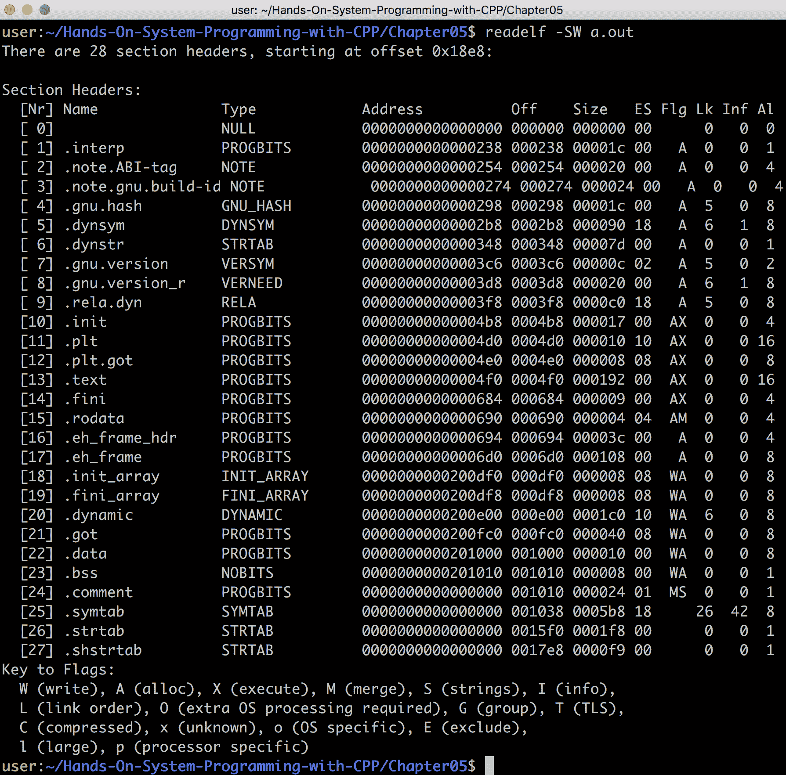
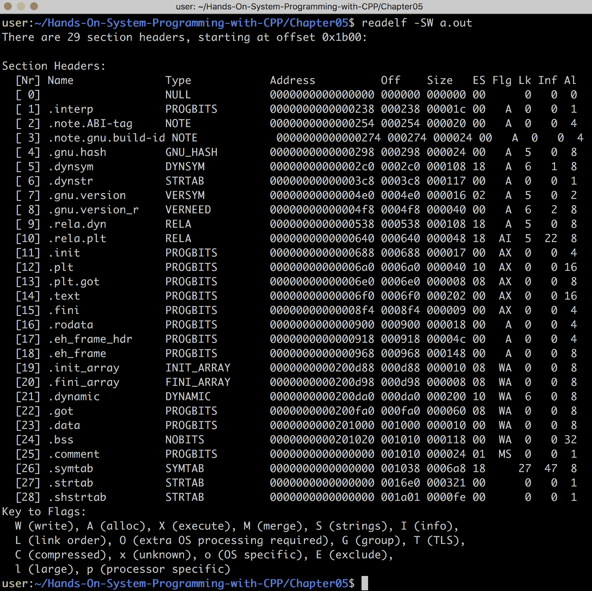
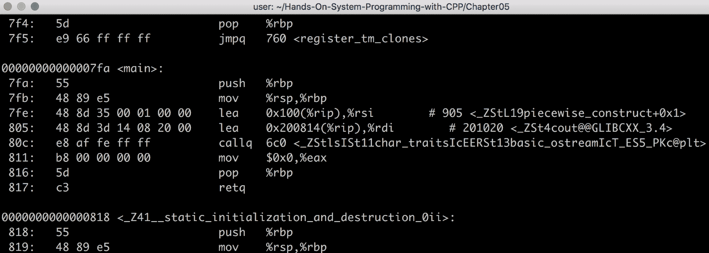

# 五、为 Linux/Unix 系统编程

本章的目标是解释在基于 Linux/Unix 的系统上编程的基础。这将提供一个更完整的图片，说明程序如何在 Unix/Linux 系统上执行，如何编写更高效的代码，以及当出现难以找到的错误时在哪里寻找。

为此，本章首先全面了解 Linux ABI，或者更具体地说，系统 V ABI。在本节中，我们将回顾从寄存器和堆栈布局到 System V 调用约定和 ELF 二进制对象规范的所有内容。

下一节将简要介绍 Linux 文件系统，包括标准布局和权限。然后，我们将全面回顾 Unix 进程以及如何对其进行编程，包括分叉新进程和进程间通信等注意事项。

最后，本章将简要概述基于 Unix 的信号以及如何使用它们 (发送信号和接收信号)。

在本章中，我们将讨论以下内容:

*   Linux ABI
*   Unix 文件系统
*   Unix 进程 api
*   Unix signal APis

# 技术要求

为了遵循本章中的示例，您必须具有以下内容:

*   能够编译和执行 C 17 的基于 Linux 的系统 (例如，Ubuntu 17.10)
*   GCC 7
*   C 让 3.6
*   互联网连接

要下载本章中的所有代码，包括示例和代码片段，请转到以下链接: [https://github.com/PacktPublishing/ 使用 CPP/tree/master/Chapter05](https://github.com/PacktPublishing/Hands-On-System-Programming-with-CPP/tree/master/Chapter05)进行动手系统编程。

# Linux ABI

在本节中，我们将讨论 Linux ABI (实际上称为**System V ABI**)，以及 ELF 标准及其在 Linux/Unix 中的使用。

我们还将深入研究与 ELF 文件相关的一些细节，如何阅读和解释它们，以及 ELF 文件中特定组件的一些含义。

# 系统 V ABI

Unix System V 是 Unix 的第一个可用版本之一，并且多年来在很大程度上定义了 Unix。在引擎盖下，系统 V 利用了系统 V ABI。随着 Linux 和 BSD (类 Unix 操作系统) 的应用越来越广泛，System V 的普及率下降。但是，System V ABI 仍然很受欢迎，因为 Linux 等操作系统为基于 Intel 的 pc 采用了此规范。

在本章中，我们将重点介绍 Linux 操作系统上英特尔平台的 System V ABI。但是，应该注意的是，其他体系结构和操作系统可能使用不同的 ABIs。例如，ARM 有自己的 ABI，它主要基于 System V (奇怪的是，还有 Itanium 64 规范)，但有几个关键区别。

本节的目标是公开单个 Unix ABI 的内部工作原理，如果需要，这反过来应该使学习其他 ABI 变得更容易。

本章讨论的大多数规范都可以在以下链接中找到: [https://refspecs.linuxfoundation.org/](https://refspecs.linuxfoundation.org/) 。

系统 V ABI 定义了程序的大部分低级细节 (这又定义了系统编程的接口)，包括:

*   寄存器布局
*   堆栈框架
*   函数 prologs 和 epilogs
*   调用约定 (即参数传递)
*   异常处理
*   虚拟内存布局
*   调试
*   二进制对象格式 (本例中为 ELF)
*   程序加载和链接

在[第 2 章](02.html)，*学习 C、C 17 和 POSIX 标准*中，我们讨论了程序链接和动态加载的细节，并将整个章节专门介绍了二进制对象格式 (ELF)。

以下是有关 Intel 64 位架构的 System V 规范的其余细节的简要说明。

# 寄存器布局

为了使本主题保持简单，我们将重点介绍 Intel 64 位。可以针对每个 ABI，操作系统和体系结构组合的不同寄存器布局编写整本书。

英特尔 64 位体系结构 (通常称为 AMD64，实际上是 AMD 编写的) 定义了几个寄存器，其中一些在指令集内定义了含义。

指令指针`rip`定义程序在可执行存储器中的当前位置。具体来说，当程序执行时，它从存储在`rip`中的位置执行，并且每次退出指令时，`rip`前进到下一个指令。

堆栈指针和基本指针 (分别为`rsp`和`rbp`) 用于定义堆栈中的当前位置，以及堆栈帧开始的位置 (稍后我们将提供更多信息)。

以下是其余的通用寄存器。这些具有不同的含义，将在本节的其余部分中讨论: `rax`，`rbx`，`rcx`，`rdx`，`rdi`，`rsi`，`r8`，`r9`，`r10`，`r11`，`r12`，`r13`、`r14`和`r15`。

在我们继续之前，应该注意的是，在系统上定义了其他几个寄存器，它们具有非常特定的用途，包括浮点寄存器和宽寄存器 (这些寄存器由旨在加速某些类型的计算的特殊指令使用; 例如，SSE 和 AVX)。这些超出了本讨论的范围。

最后，有些寄存器以字母结尾，而另一些则以数字结尾，因为英特尔 x86 处理器的版本只有基于字母的寄存器，唯一真正的通用寄存器是 AX，BX，CX 和 DX。

当 AMD 引入 64 位时，通用寄存器的数量增加了一倍，并且为了保持简单，寄存器名称被赋予了数字。

# 堆栈框架

堆栈框架用于存储每个函数的返回地址，并存储函数参数和基于堆栈的变量。它是所有程序都大量使用的资源，它采用以下形式:

```cpp
high |----------| <- top of stack
     |          |
     |   Used   |
     |          |
     |----------| <- Current frame (rbp)
     |          | <- Stack pointer (rsp)
     |----------|
     |          |
     |  Unused  |
     |          |
 low |----------|
```

堆栈框架只不过是一个从上到下增长的内存阵列。也就是说，在 Intel PC 上，推送到堆栈*会从堆栈指针中减去*，从堆栈中弹出时*将*添加到堆栈指针-这意味着内存实际上会向下增长 (假设您的观点是内存随着地址的增加而向上增长，如上图所示)。

系统 V ABI 指出堆栈由堆栈*帧*组成。每个帧如下所示:

```cpp
high |----------| 
     |   ....   |
     |----------| 
     |   arg8   | 
     |----------| 
     |   arg7   | 
     |----------| 
     | ret addr | 
     |----------| <- Stack pointer (rbp)
     |          |
 low |----------|
```

每个帧代表一个函数调用，并从调用前六个函数之外的任何参数开始 (前六个参数作为寄存器传递-这将在后面更详细地讨论)。最后，将返回地址推送到堆栈，并调用该函数。

返回地址后的内存属于范围为函数本身的变量。这就是为什么我们调用在函数*中定义的变量基于堆栈的变量*。剩余的堆栈由将来将要调用的函数使用。每次一个函数调用另一个函数时，堆栈都会增长，而每次函数返回时，堆栈都会收缩。

管理堆栈的大小是操作系统的工作，确保它始终具有足够的内存。例如，如果应用试图使用过多的内存，则操作系统将杀死该程序。

最后，应该注意的是，在大多数 CPU 体系结构上，都提供了特殊的指令，这些指令从函数调用返回并自动弹出堆栈的返回地址。在 Intel 的情况下，`call`指令会跳转到一个函数，将当前的`rip`推送到栈中作为返回地址，然后`ret`会从栈中弹出返回地址，跳转弹出的地址。

# 函数 prologs 和 epilogs

每个函数都带有一个堆栈框架，如前所述，该框架存储函数参数，函数变量和返回地址。管理这些资源的代码称为函数的*prolog* (开始) 和*epilog* (结束)。

为了更好地解释这一点，让我们创建一个简单的例子，并检查结果二进制:

```cpp
int test()
{
    int i = 1;
    int j = 2;

    return i + j;
}

int main(void)
{
    test();
}

// > g++ scratchpad.cpp; ./a.out
// 
```

如果我们反汇编得到的二进制，我们得到以下内容:

```cpp
...
00000000000005fa <_Z4testv>:
 push %rbp
 mov %rsp,%rbp
 movl $0x1,-0x8(%rbp)
 movl $0x2,-0x4(%rbp)
 mov -0x8(%rbp),%edx
 mov -0x4(%rbp),%eax
 add %edx,%eax
 pop %rbp
 retq
...
```

在我们的测试函数中，前两个指令是函数的 prolog。prolog 正在推送当前的堆栈框架 (这是上一个函数的堆栈框架)，然后将当前的堆栈指针设置为`rbp`，这反过来又创建了一个新的堆栈框架。

从那里开始，接下来的两个指令将使用堆栈的未使用部分来创建变量`i`和`j`。最后，将生成的基于堆栈的变量加载到寄存器中，并在`rax` (这是为 Intel 定义的大多数 ABIs 的返回寄存器) 中添加并返回结果。

函数的 epilog 是这个例子中的最后两个指令。具体来说，前一个堆栈帧的位置 (在 prolog 中被推送到堆栈) 从堆栈中弹出并存储在`rbp`中，有效地改变到前一个堆栈帧，然后使用`ret`指令返回到上一个函数 (就在函数调用之后)。

敏锐的眼睛可能已经注意到，通过为变量`i`和`j`移动`rsp`，堆栈上没有保留空间。这是因为系统 V ABI 的 64 位版本定义了所谓的**红区**。红色区域仅适用于叶函数 (在我们的例子中，测试函数是叶函数，这意味着它不调用任何其他函数)。

叶函数永远不会进一步增长堆栈，这意味着剩余的堆栈可以被函数使用，而不必推进堆栈指针，因为所有剩余的内存都是公平的游戏。

当系统编程时，如果你在内核中编程，这有时会是一个问题。具体来说，如果中断触发 (使用当前堆栈指针作为其堆栈)，则如果未正确保留堆栈，则可能会发生损坏，因此该中断将损坏叶函数的基于堆栈的变量。

为了克服这个问题，必须使用带有 GCC 的`-mno-red-zone`标志关闭红色区域。例如，如果我们使用此标志编译上一个示例，则会得到以下二进制输出:

```cpp
...
00000000000005fa <_Z4testv>:
 push %rbp
 mov %rsp,%rbp
 sub $0x10,%rsp
 movl $0x1,-0x8(%rbp)
 movl $0x2,-0x4(%rbp)
 mov -0x8(%rbp),%edx
 mov -0x4(%rbp),%eax
 add %edx,%eax
 leaveq
 retq
...
```

如图所示，生成的二进制文件与原始文件非常相似。但是，有两个主要区别。第一个是`sub`指令，该指令用于移动堆栈指针，从而保留堆栈空间，而不是使用红色区域。

第二个区别是使用`leave`指令。这个指令弹出`rbp`就像前面的例子一样，但是也恢复了堆栈指针，这个指针已经被移动来给基于堆栈的变量腾出空间。在本示例中，`leave`和`ret`指令是新的 epilog。

# 呼叫公约

一个调用约定规定哪些寄存器是*volatile*，哪些寄存器是*non-volatile*，哪些寄存器用于参数传递，按哪个顺序，哪个寄存器用于返回函数的结果。

非易失性寄存器是在函数离开之前 (即在其 epilog 中) 恢复到其原始值的寄存器。系统 V ABI 将`rbx`、`rbp`、`r12`、`r13`、`r14`和`r15`定义为非易失性。相比之下，易失性寄存器是被调用函数可以随意更改的寄存器，而不必在返回时恢复其值。

为了演示这一点，让我们看下面的例子:

```cpp
0000000000000630 <__libc_csu_init>:
push %r15
push %r14
mov %rdx,%r15
push %r13
push %r12
```

如前面的示例所示，`__libc_csu_init()`函数 (由`libc`用于初始化) 触摸`r12`、`r13`、`r14`和`r15`。因此，在执行初始化过程之前，它必须将这些寄存器的原始值推送到堆栈。

另外，在这段代码的中间，编译器将`rdx`存储在`r15`中。稍后将显示，编译器正在保留该函数的第三个参数。仅根据此代码，我们就知道此函数至少需要三个参数。

快速的 Google 搜索将显示此功能具有以下签名:

```cpp
__libc_csu_init (int argc, char **argv, char **envp)
```

由于该函数接触了*非易失性*寄存器，因此在离开之前，它必须将这些寄存器恢复到它们的原始值。让我们看一下函数的 epilog:

```cpp
pop %rbx
pop %rbp
pop %r12
pop %r13
pop %r14
pop %r15
retq
```

如前所述，`__libc_csu_init()`函数在离开之前恢复所有非易失性寄存器。这意味着，在函数中间的某个地方，`rbx`也被破坏了 (其原始值被预先推送到堆栈中)。

除了定义易失性和非易失性寄存器之外，System V 的调用约定还定义了哪些寄存器用于传递函数参数。具体来说，寄存器`rdi`、`rsi`、`rdx`、`rcx`、`r8`和`r9`用于传递参数 (按提供的顺序)。

为了演示这一点，让我们看下面的例子:

```cpp
int test(int val1, int val2)
{
    return val1 + val2;
}

int main(void)
{
    auto ret = test(42, 42);
}

// > g++ scratchpad.cpp; ./a.out
//
```

在前面的示例中，我们创建了一个测试函数，该函数采用两个参数，将它们加在一起，然后返回结果。现在让我们看一下 `main()` 函数的结果二进制文件:

```cpp
000000000000060e <main>:
push %rbp
mov %rsp,%rbp
sub $0x10,%rsp
mov $0x2a,%esi
mov $0x2a,%edi
callq 5fa <_Z4testii>
mov %eax,-0x4(%rbp)
mov $0x0,%eax
leaveq
retq
```

`main()`函数做的第一件事是提供它的 prolog (如前几章所述，`main()`函数不是第一个要执行的函数，因此，就像任何其他函数一样，需要 prolog 和 epilog)。

然后，`main()`函数在堆栈上保留空间用于`test()`函数的返回值，并在调用`test()`之前用传递给`test()`的参数填充`esi`和`edi`。

`call`指令，如前所述，将返回地址推到堆栈上，然后跳转到`test()`函数。`test()`函数的结果存储在堆栈上 (如果启用了优化，该操作将被删除)，然后在返回之前将`0`放置在`eax`中。

如我们所见，我们没有提供带有返回值的`main`函数。这是因为，如果没有提供返回值，编译器会自动为我们插入一个返回`0`，这就是我们在这段代码中看到的，因为`rax`是系统 V 的返回寄存器。

现在让我们看一下测试函数二进制:

```cpp
00000000000005fa <_Z4testii>:
push %rbp
mov %rsp,%rbp
mov %edi,-0x4(%rbp)
mov %esi,-0x8(%rbp)
mov -0x4(%rbp),%edx
mov -0x8(%rbp),%eax
add %edx,%eax
pop %rbp
retq
```

`test`函数设置一个 prolog，然后将函数的参数存储在堆栈上 (在打开优化的情况下，该操作将被删除)。然后将堆栈变量放入易失性寄存器 (以防止它们必须保存和恢复)，将寄存器加在一起，结果存储在`eax`中。最后，函数以 epilog 返回。

如前所述，系统 V 的返回寄存器是`rax`，这意味着每个返回值的函数都将使用`rax`执行此操作。要返回多个值，也可以使用`rdx`。例如，请参见以下内容:

```cpp
#include <cstdint>

struct mystruct
{
    uint64_t data1;
    uint64_t data2;
};

mystruct test()
{
    return {1, 2};
}

int main(void)
{
    auto ret = test();
}

// > g++ scratchpad.cpp; ./a.out
//
```

在前面的示例中，我们创建了一个`test`函数，该函数返回具有两个 64 位整数的结构。我们选择两个 64 位整数，因为如果我们使用常规的 int，编译器将尝试将结构的内容存储在单个 64 位寄存器中。

`test()` 函数的结果二进制如下:

```cpp
00000000000005fa <_Z4testv>:
push %rbp
mov %rsp,%rbp
mov $0x1,%eax
mov $0x2,%edx
pop %rbp
retq
```

如前所述，在返回之前，`test`函数将结果存储在`rax`和`rdx`中。如果返回超过 128 位数据，则`main()`函数和`test()`函数都会变得更加复杂。这是因为堆栈空间必须由`main()`函数保留，然后`test()`函数必须利用这个堆栈空间来返回函数的结果。

关于此工作原理的具体细节超出了本书的范围，但是，简而言之，为返回值保留的堆栈空间的地址实际上成为函数的第一个参数，所有这些参数都由系统 V ABI 定义。

应该注意的是，这些示例大量使用以`e`而不是`r`为前缀的寄存器。这是因为`e`表示 32 位寄存器，而`r`表示 64 位寄存器。`e`版本被大量使用的原因是我们利用了基于整数的文字，例如`1`，`2`和`42`。这些都是由 C 和 C 规范 (如前几章所述) 定义的`int`类型，默认情况下，在 Intel 64 位 CPU 上是 32 位值。

# 异常处理和调试

C 异常提供了一种将错误返回给调用堆栈中某个地方的`catch`处理程序的方法。我们将在[第 13 章](13.html)，*有异常的错误处理*中详细介绍 C 异常。

现在，我们将使用以下简单示例:

```cpp
#include <iostream>
#include <exception>

void test(int i)
{
    if (i == 42) {
        throw 42;
    }
}

int main(void)
{
    try {
        test(1);
        std::cout << "attempt #1: passed\n";

        test(21);
        std::cout << "attempt #2: passed\n";
    }
    catch(...) {
        std::cout << "exception catch\n";
    }
}

// > g++ scratchpad.cpp; ./a.out
// attempt #1: passed
// exception catch
```

在前面的示例中，我们创建了一个简单的`test()`函数，该函数接受输入。如果输入等于`42`，我们抛出异常。这将导致函数返回 (并且每个调用函数继续返回)，直到遇到`try`或`catch`块。如果引发异常，则在块的`try`部分中执行的任何代码都将执行块的`catch`部分。

应该注意的是，未考虑或使用被调用函数的返回值。这提供了一种方法，可以在函数的调用堆栈的执行中的任何点抛出错误，并在任何点捕获可能的错误 (很可能是在可以安全地处理错误或可以安全地中止程序时)。

如前面示例所示，第一次尝试执行`test()`函数成功，并且`attempt #1: passed`字符串输出到`stdout`。当函数抛出异常时，第二次尝试执行`test()`函数失败，结果，由于此代码从未执行，所以不会将`attempt #2: passed`字符串输出到`stdout`。相反，执行`catch`块，它处理错误 (通过忽略它)。

异常处理 (和调试) 的细节非常困难 (双关语)，因此本节的目标是解释 System V 规范如何规定与异常 (和调试) 支持相关的 ABI。

我在 CppCon 录制的以下视频中提供了有关 C 异常内部工作的更多详细信息: [https://www.youtube.com/watch？v= uQSQy-7lveQ](https://www.youtube.com/watch?v=uQSQy-7lveQ)。

在本节的末尾，应明确以下内容:

*   C 异常执行成本很高，因此绝不应该用于控制流 (仅用于错误处理)。
*   C 异常会在可执行文件中占用大量空间，如果不使用它们，则应将`-fno-exceptions`标志传递给 GCC，以减小生成代码的整体大小。这也意味着不应使用可能引发异常的图书馆设施。

为了支持前面的示例，堆栈必须是*解绕*。也就是说，要使程序跳转到`catch`块，需要将非易失性寄存器设置为看起来好像首先从未执行过`test()`函数。为此，我们以某种方式，使用编译器提供的一组指令反向执行`test()`函数。

在我们进入这些信息的细节之前，让我们首先看一下与我们前面的例子相关联的汇编代码:

```cpp
0000000000000c11 <main>:
push %rbp
mov %rsp,%rbp
push %rbx
sub $0x8,%rsp
mov $0x1,%edi
callq b9a <test>
...
callq a30 <std::cout>
...
mov $0x0,%eax
jmp c90
...
callq 9f0 <__cxa_begin_catch@plt>
...
callq a70 <_Unwind_Resume@plt>
add $0x8,%rsp     
pop %rbx
pop %rbp
retq
```

为了保持这个容易理解，前面的代码已经简化了。让我们从顶部开始。这个函数做的第一件事是设置函数 prolog (即堆栈框架)，然后在堆栈上保留一些空间。完成此操作后，代码将`0x1`移动到`edi`中，后者将`1`传递给`test()`函数。

接下来，调用`test()`函数。接下来，发生了一些事情 (细节并不重要)，然后调用`std::cout` (试图将`attempt #1: passed`字符串输出到`stdout`)。对于`test(42)`也重复此过程。

下一位代码是`main()`函数变得有趣的地方。`mov $0x0,%eax`将`eax`设置为`0`，我们知道，这是返回寄存器。这段代码为`main()`函数设置了返回值，但有趣的是，下一条指令在`main()`函数中做了一个相对跳转到`c90`，也就是`add $0x8,%rsp`代码。这是函数 epilog 的开始，它清理堆栈并恢复非易失性寄存器。

中间的代码是我们的`catch`块。这是在抛出异常时执行的代码。如果未引发异常，则执行`jmp c90`代码，跳过`catch`块。

`test`函数要简单得多:

```cpp
0000000000000a6a <_Z4testi>:
push %rbp
mov %rsp,%rbp
sub $0x10,%rsp
mov %edi,-0x4(%rbp)
cmpl $0x2a,-0x4(%rbp)
jne a9f
mov $0x4,%edi
callq 8e0 <__cxa_allocate_exception@plt>
...
callq 930 <__cxa_throw@plt>
nop
leaveq
retq
```

在`test`函数中，设置了函数 prolog，并保留了堆栈空间 (如果启用了优化，则可能会删除该空间)。然后将输入与`42`进行比较，如果它们不相等 (如使用`jne`所示)，则函数跳转到 epilog 并返回。如果它们相等，则分配并引发 C 异常。

这里要注意的重要一点是`__cxa_throw()`函数不返回，这意味着函数的 epilog 永远不会执行。这样做的原因是，当抛出异常时，程序员在声明该函数的剩余部分无法执行，相反，`__cxa_throw()`需要跳转到调用堆栈中的`catch`块 (在这种情况下，在`main()`函数中)，或者如果找不到`catch`块，则终止程序。

由于函数的 epilog 从未执行，因此非易失性寄存器需要以某种方式恢复到其原始状态。这将我们带到 DWARF 规范，以及嵌入在应用本身中的`.eh_frame`表。

正如本章后面将展示的那样，大多数基于 Unix 的应用被编译为二进制格式，称为**ELF**。任何使用 C 异常支持编译的 ELF 应用都包含一个特殊的表，称为`.eh_frame`表 (代表异常处理框架)。

例如，如果您在前一个应用上运行`readelf`，您将看到`.eh_frame`表，如下所示:

```cpp
> readelf -SW a.out
There are 31 section headers, starting at offset 0x2d18:

Section Headers:
...
  [18] .eh_frame PROGBITS 0000000000000ca8 000ca8 000190 00 A 0 0 8
...
```

DWARF 规范 (不正式代表任何内容) 提供了调试应用所需的所有信息。当 GCC 启用调试时，应用中会添加几个调试表来辅助 GDB。

矮化规范还用于定义反转堆栈所需的指令; 换句话说，相对于非易失性寄存器的内容反向执行函数。

让我们看一下使用`readelf`的`.eh_frame`表的内容，如下所示:

```cpp
> readelf --debug-dump=frames a.out
...
00000088 000000000000001c 0000005c FDE ...
  DW_CFA_advance_loc: 1 to 0000000000000a6b
  DW_CFA_def_cfa_offset: 16
  DW_CFA_offset: r6 (rbp) at cfa-16
  DW_CFA_advance_loc: 3 to 0000000000000a6e
  DW_CFA_def_cfa_register: r6 (rbp)
  DW_CFA_advance_loc: 51 to 0000000000000aa1
  DW_CFA_def_cfa: r7 (rsp) ofs 8
  DW_CFA_nop
  DW_CFA_nop
  DW_CFA_nop
...
```

可以写一整本书关于这个代码的作用，但是这里的目标是保持这个简单。对于程序中的每个功能 (对于具有大量代码的程序，可能有数十万个功能)，在`.eh_frame`中提供了一个类似于前一个的块。

前面的块 (由使用`objdump`找到的匹配地址定位) 是我们的`test()`函数的**帧描述条目** (**FDE**)。该 FDE 描述了如何使用 DWARF 指令反转堆栈，DWARF 指令是设计为尽可能小的压缩指令 (以减小`.eh_frame`表的大小)。

FDE 根据投掷的位置提供堆栈反转指令。也就是说，当一个函数执行时，它会继续接触堆栈。如果函数中存在多个抛出，则可能在每个抛出之间触摸了更多的堆栈，这意味着需要更多的堆栈反转指令才能正确地将堆栈恢复到正常状态。

一旦函数的堆栈被反转，调用堆栈中的下一个函数就需要反转。此过程继续，直到找到`catch`块为止。问题是，`.eh_frame`表是这些 fde 的列表，这意味着反转堆栈是`O(N^2)`操作。

已经进行了优化，包括使用哈希表，但是仍然有两件事:

*   反转堆栈是一个缓慢的过程。
*   使用 C++ 异常会占用大量空间。这是因为代码中定义的每个函数不仅必须包含该函数的代码，还必须包含一个 FDE，该 FDE 告诉代码在触发异常的情况下如何展开堆栈。

# 虚拟内存布局

虚拟内存布局也由 System V 规范提供。在下一节中，我们将讨论 ELF 格式的细节，它将提供有关虚拟内存布局以及如何更改它的更多信息。

# 可执行和可链接格式 (ELF)

**可执行和可链接格式** (**ELF**) 是大多数基于 Unix 的操作系统 (包括 Linux) 中使用的主要格式。每个 ELF 文件都以十六进制数字`0x7F`开头，并以`ELF`字符串继续。

例如，让我们看下面的程序:

```cpp
int main(void)
{
}

// > g++ scratchpad.cpp; ./a.out
//
```

如果我们查看生成的`a.out`ELF 文件的`hexdump`，我们会看到以下内容:

```cpp
> hexdump -C a.out
00000000 7f 45 4c 46 02 01 01 00 00 00 00 00 00 00 00 00 |.ELF............|
00000010 03 00 3e 00 01 00 00 00 f0 04 00 00 00 00 00 00 |..>.............|
00000020 40 00 00 00 00 00 00 00 e8 18 00 00 00 00 00 00 |@...............|
00000030 00 00 00 00 40 00 38 00 09 00 40 00 1c 00 1b 00 |....@.8...@.....|
```

如图所示，`ELF`字符串是最开始的。

每个 ELF 文件都包含一个 ELF 标头，该标头描述了 ELF 文件本身的一些关键组件。以下可用于查看 ELF 文件的标头:

```cpp
> readelf -hW a.out
ELF Header:
  Magic: 7f 45 4c 46 02 01 01 00 00 00 00 00 00 00 00 00
  Class: ELF64
  Data: 2's complement, little endian
  Version: 1 (current)
  OS/ABI: UNIX - System V
  ABI Version: 0
  Type: DYN (Shared object file)
  Machine: Advanced Micro Devices X86-64
  Version: 0x1
  Entry point address: 0x4f0
  Start of program headers: 64 (bytes into file)
  Start of section headers: 6376 (bytes into file)
  Flags: 0x0
  Size of this header: 64 (bytes)
  Size of program headers: 56 (bytes)
  Number of program headers: 9
  Size of section headers: 64 (bytes)
  Number of section headers: 28
  Section header string table index: 27
```

如图所示，我们编译的 ELF 文件链接到一个 ELF-64 文件，该文件遵循 Unix System V ABI for Intel 64 位。在标题的底部附近，您可能会注意到提到了程序标题和节标题。

每个 ELF 文件都可以根据其段或部分来查看。为了可视化，让我们从两个角度来看一个 ELF 文件，如下所示:

```cpp
   Segments       Sections
|------------| |------------|
|   Header   | |   Header   |
|------------| |------------|
|            | |            |
|            | |------------|
|            | |            |
|            | |            |
|------------| |------------|
|            | |            |
|            | |------------|
|            | |            |
|------------| |------------|
```

如前所述，每个 ELF 文件由部分组成。然后将这些部分分组为段，这些段用于定义需要加载哪些部分以及如何加载 (例如，某些部分需要作为读写加载，其他部分需要作为读执行加载，或者在某些次优情况下，读写执行)。

# 精灵部分

要查看所有部分的列表，请使用以下命令:

```cpp
> readelf -SW a.out
```

这将导致以下输出:



如图所示，即使在一个简单的示例中，也有几个部分。其中一些部分包含在前几章中已经讨论过的信息:

*   `eh_frame/.eh_frame_hdr`: 这些包含用于在处理异常时反转堆栈的 FDE 信息，正如刚才所讨论的。`eh_frame_hdr`部分包含用于提高 C 异常性能的附加信息，包括一个哈希表，该哈希表可用于定位 FDE，而不是循环浏览 FDE 列表 (否则将是`O(n^2)`操作)。
*   `.init_array/.fini_array/.init/.fini`: 这些包含由代码执行的构造函数和析构函数，包括链接到代码的任何库 (如前所述，可能有许多库链接到应用)。还应注意，这些部分包含能够执行运行时重定位的代码，这些代码必须在任何应用的最开始执行，以确保代码正确链接和重定位。
*   `.dynsym`: 其中包含用于动态链接的所有符号。如前所述，如果使用 GCC，则这些符号将全部包含 C 运行时链接名称，而如果使用 G，则它们还将包含被破坏的名称。我们将很快更详细地探讨这一部分。

从`readelf`中各节的输出可以学到很多东西。例如，地址都以`0`开头，而不是更高内存中的某个地址。这意味着应用是在链接期间使用`-pie`标志编译的，这意味着应用是可重定位的。具体来说，**位置独立可执行文件** (**PIE**) (以及 ELF 文件) 包含用于重新定位内存中可执行文件的`.plt`和`.got`部分。

这也可以从包含的`.rela.xxx`部分中看出，其中包含 ELF 加载程序用于重新定位内存中可执行文件的实际重新定位命令。为了证明这个应用是使用`-pie`标志编译的，我们来看一下应用的编译标志:

```cpp
> g++ scratchpad.cpp -v
...
/usr/lib/gcc/x86_64-linux-gnu/7/collect2 -plugin /usr/lib/gcc/x86_64-linux-gnu/7/liblto_plugin.so -plugin-opt=/usr/lib/gcc/x86_64-linux-gnu/7/lto-wrapper -plugin-opt=-fresolution=/tmp/ccmBVeIh.res -plugin-opt=-pass-through=-lgcc_s -plugin-opt=-pass-through=-lgcc -plugin-opt=-pass-through=-lc -plugin-opt=-pass-through=-lgcc_s -plugin-opt=-pass-through=-lgcc --sysroot=/ --build-id --eh-frame-hdr -m elf_x86_64 --hash-style=gnu --as-needed -dynamic-linker /lib64/ld-linux-x86-64.so.2 -pie -z now -z relro /usr/lib/gcc/x86_64-linux-gnu/7/../../../x86_64-linux-gnu/Scrt1.o /usr/lib/gcc/x86_64-linux-gnu/7/../../../x86_64-linux-gnu/crti.o /usr/lib/gcc/x86_64-linux-gnu/7/crtbeginS.o -L/usr/lib/gcc/x86_64-linux-gnu/7 -L/usr/lib/gcc/x86_64-linux-gnu/7/../../../x86_64-linux-gnu -L/usr/lib/gcc/x86_64-linux-gnu/7/../../../../lib -L/lib/x86_64-linux-gnu -L/lib/../lib -L/usr/lib/x86_64-linux-gnu -L/usr/lib/../lib -L/usr/lib/gcc/x86_64-linux-gnu/7/../../.. /tmp/ccZU6K8e.o -lstdc++ -lm -lgcc_s -lgcc -lc -lgcc_s -lgcc /usr/lib/gcc/x86_64-linux-gnu/7/crtendS.o /usr/lib/gcc/x86_64-linux-gnu/7/../../../x86_64-linux-gnu/crtn.o
...
```

如前所述，提供了`-pie`标志。

要注意的另一件事是，这些部分从 address`0`开始并进行，但是在某些时候，地址跳转到`0x200000`并从那里继续。这意味着应用是 2 MB 对齐的，这对于 64 位应用来说是典型的，因为它们有更大的地址空间可以使用。

如将显示的，开始跳转到`0x200000`的点是 ELF 文件中新程序段的开始，并表示正在加载的部分的权限的更改。

还有一些值得注意的部分也应该指出:

*   `.text`: 这包含大部分 (如果不是全部) 与程序相关联的代码。此部分通常位于标记为 read-execute 的段中，理想情况下，不授予写入权限。
*   `.data`: 包含初始化为`0`以外的值的全局变量。如图所示，此部分存在于 ELF 文件本身中，因此，应谨慎使用这些类型的变量，因为它们会增加生成的 ELF 文件的大小 (这会减少应用的加载时间并消耗磁盘上的额外空间)。还应注意，某些编译器会在本节中放置未初始化的变量-因此，如果变量应为`0`，则将其初始化。
*   `.bss`: 本节包含所有应初始化为`0`的全局变量 (假设使用 C 和 C)。该节始终是要加载的最后一节 (也就是说，它是由段标记的最后一节)，并且实际上并不存在于 ELF 文件本身中。相反，当 ELF 文件加载到内存中时，ELF 文件的大小会扩展为包括此部分的总大小，并且额外的内存会由 ELF 加载程序 (或 C 运行时) 初始化为`0`。
*   `.dynstr/.strtab`: 这些表包含用于符号名称 (即变量名称和函数名称) 的字符串。`.dynstr`表包含动态链接时所需的所有字符串，而`.strtab`部分包含程序中的所有符号。这里的关键点是字符串出现两次。在变量或函数前面使用`static`可以防止变量的符号出现在`.dynsym`部分，这又意味着它不会出现在`.dynstr`部分。这样做的缺点是在动态链接期间无法看到该变量，这意味着，如果另一个库尝试在该变量上使用`extern`，它将失败。默认情况下，所有变量和函数都应标记为`static`，除非您希望它们是可外部评估的，从而减少磁盘和内存中文件的总大小。这也加快了链接时间，因为它减小了用于动态链接的`.dynsym`部分的大小。

为了进一步检查字符串如何存储在 ELF 文件中，让我们创建一个简单的示例，其中包含易于查找的字符串，如下所示:

```cpp
#include <iostream>

int main(void)
{
    std::cout << "The answer is: 42\n";
}

// > g++ scratchpad.cpp; ./a.out
// The answer is: 42
```

如前所述，此示例输出`The answer is: 42`到`stdout`。

现在让我们在 ELF 文件本身中查找此字符串，使用以下内容:

```cpp
> hexdump -C a.out | grep "The" -B1 -A1
000008f0 f3 c3 00 00 48 83 ec 08 48 83 c4 08 c3 00 00 00 |....H...H.......|
00000900 01 00 02 00 00 54 68 65 20 61 6e 73 77 65 72 20 |.....The answer |
00000910 69 73 3a 20 34 32 0a 00 01 1b 03 3b 4c 00 00 00 |is: 42.....;L...|
```

如前所述，该字符串存在于我们的程序中，位于`0x905`。现在让我们看看这个应用的 ELF 部分:



如果我们查看部分中的地址，我们可以看到字符串存在于一个名为`.rodata`的部分中，该部分包含*常量*数据。

现在让我们看一下使用`objdump`这个应用的程序集，它在`.text`部分中分解代码，如下所示:



如前所述，在调用`std::cout`之前，代码会使用字符串的地址 (在`0x905`处) 加载`rsi`，这是第二个参数。应该注意的是，与以前一样，此应用是使用`-pie`命令编译的，这意味着应用本身将被重新定位。这最终意味着字符串的地址不会位于`0x905`，而是位于`# + 0x905`。

为了防止需要重定位条目 (即**全局偏移表** (**GOT**) 中的条目)，程序使用指令指针相对偏移。在这种情况下，加载`rsi`的指令在`0x805`，并且使用偏移量`0x100`，这又返回`0x905 + rip`。这意味着，无论应用在内存中的哪个位置加载，代码都可以在不需要重定位条目的情况下定位字符串。

# 精灵片段

如前所述，ELF 段将这些部分分组为可加载的组件，并描述如何以及在何处将 ELF 文件加载到内存中。理想的 ELF 加载程序只需读取 ELF 段即可加载 ELF 文件，并且 (对于可重定位的 ELF 文件) 还必须加载动态部分和重定位部分。

要查看 ELF 的片段，请使用以下代码:


如前所述，简单的示例具有多个程序段。第一段描述了程序头 (它定义了段)，并且在大多数情况下，可以忽略。

第二段告诉 ELF 加载器它期望使用哪个重定位器。具体地，该段中描述的程序用于惰性重定位。动态链接程序时，GOT 和**过程链接表** (**PLT**) 中的符号包含每个符号在内存中的实际地址，代码引用此表中的条目，而不是直接引用一个符号。

这是必要的，因为编译器无法知道另一个库中符号的位置，因此 ELF 加载程序通过加载其他库中存在的符号 (或未标记为静态的符号) 的 GOT 和 PLT 来填充每个符号的位置。

问题是，一个大型程序可能有成百上千个这样的 GOT 或 PLT 条目，因此，加载一个程序可能需要很长时间。使这个问题更加糟糕的是，来自外部库的许多符号可能永远不会被调用，这意味着 ELF 加载器将需要用甚至不需要的符号位置填写 GOT 或 PLT 中的条目。

为了克服这些问题，ELF 加载器以惰性加载器的位置而不是符号本身来加载 GOT 和 PLT。lazy loader (这是您在第二段中看到的程序) 在第一次使用符号后加载符号的位置，从而减少了程序加载时间。

第三段，标记为`LOAD`，告诉 ELF 加载器将 ELF 文件的以下部分加载到内存中。如前面的输出所示，此段包含几个部分，所有部分都标记为 read-execute。例如，本节中存在`.text`节。

ELF 加载程序所要做的就是按照说明，将 ELF 文件中由段标记的部分加载到提供的虚拟地址中 (提供了内存大小)。

第四段与第三段相同，但没有标记读-执行部分，而是标记读-写部分，包括`.data`等部分。

应该注意的是，内存中加载第四段的偏移量增加了`0x200000`。如前所述，这是因为程序对齐了 2 MB。更具体地说，英特尔 64 位 cpu 支持 4 KB、2 MB 和 1 GB 页面。

由于第一个可加载段被标记为 read-execute，第二个可加载段不能与第一个在同一页上 (否则，它也必须被标记为 read-execute)。结果，第二个可加载段被设计为从下一个可用页面开始，在这种情况下，该页面在内存中为 2 MB。这允许操作系统将第一个可加载段标记为 read-execute，将第二个可加载段标记为 read-write，并且 CPU 可以强制执行这些权限。

下一个段定义动态段的位置，该位置由 ELF 加载器用于执行动态重定位。这是必要的，因为可执行文件是使用`-pie`编译的。应该注意的是，ELF 加载器可以扫描 ELF 部分以找到此数据，但是程序段的目标是定义加载 ELF 文件所需的所有信息，而无需扫描部分。可悲的是，在实践中，这并不总是正确的，但理想情况下，情况应该如此。

可以安全地忽略*注释*段。以下段向 ELF 加载器提供异常信息的位置 (如所述); 可执行文件期望的堆栈的权限; 理想情况下，它将始终是读写而不是读写执行，以及只读部分的位置，它可以将其权限更改为只读一次加载。

# Unix 文件系统

包括 Linux 在内的大多数基于 Unix 的操作系统使用的 Unix 文件系统由虚拟文件系统树组成，该虚拟文件系统树是用户和应用的前端。树从根目录 (即`/`) 开始，所有文件、设备和其他资源都位于这个根目录内。

从那里，物理文件系统通常被映射到虚拟文件系统上，从而提供了一种存储和检索文件的机制。应该注意的是，此物理文件系统不必是磁盘。它也可以是 RAM 或其他类型的存储设备。

为了执行此映射，操作系统具有用于指示 OS 执行此映射的机制。在 Linux 上，这是使用`/etc/fstab`完成的，如下所示:

```cpp
> cat /etc/fstab
UUID=... / ext4 ...
UUID=... /boot/efi vfat ...
```

如该示例所示，根文件系统映射到特定的物理设备 (用 UUID 表示)，该设备包含一个`ext4`文件系统。此外，在这个根文件系统中，另一个物理分区被映射到`/boot/efi`，并包含一个 VFAT 文件系统。

这意味着对虚拟文件系统的所有访问都默认为`ext4`分区，而对低于`/boot/efi`的任何内容的访问都被重定向到一个单独的 VFAT 分区，该分区包含特定于 UEFI 的文件 (这是用于编写本书的文本框中使用的特定 BIOS)。

虚拟文件系统中的任何节点都可以重新映射到任何设备或资源。这种设计背后的精彩之处在于，应用不需要关心虚拟文件系统当前映射的是什么类型的设备，只要应用对它试图访问的文件系统部分具有权限，并且具有打开文件并对其进行读写的能力。

例如，让我们看以下内容:

```cpp
> ls /dev/null
/dev/null
```

在大多数基于 Linux 的系统上，存在一个名为`/dev/null`的文件。这个文件实际上并没有映射到真实的文件。相反，虚拟文件系统将此文件映射到设备驱动程序，该驱动程序忽略所有写入，并且在读取时不返回任何内容。例如，请参见以下内容:

```cpp
> echo "Hello World" > /dev/null
> hexdump -n16 /dev/null
<nothing>
```

大多数基于 Linux 的系统还提供了一个`/dev/zero`，读取时返回所有零，如下所示:

```cpp
> hexdump -n16 /dev/zero
0000000 0000 0000 0000 0000 0000 0000 0000 0000
0000010
```

还有`/dev/random`，读取时返回一个随机数，如下所示:

```cpp
> hexdump -n16 /dev/random
0000000 3ed9 25c2 ad88 bf62 d3b3 0f72 b32a 32b3
0000010
```

如前所述，在[第 2 章](02.html)，*学习 C，C 17 和 POSIX 标准*中，POSIX 定义的文件系统的布局如下:

*   `/bin`: 适用于所有用户使用的二进制文件
*   `/boot`: 用于启动操作系统所需的文件
*   `/dev`: 用于物理设备和虚拟设备
*   `/etc`: 用于操作系统所需的配置文件
*   `/home`: 对于用户特定的文件
*   `/lib`: 用于可执行文件所需的库
*   `/mnt`和`/media`: 用作临时挂载点
*   `/sbin`: 用于系统特定的二进制文件
*   `/tmp`: 对于重启时删除的文件
*   `/usr`: 对于上述文件夹的用户特定版本

通常，`/boot`下的文件指向与根分区不同的物理分区，`/dev`文件夹包含映射到设备的文件 (而不是磁盘上存储和检索的文件)，和`/mnt`或`/media`用于挂载 USB 存储设备和 cd-rom 等临时设备。

在某些系统上，可以将`/home`映射到完全独立的硬盘驱动器，从而允许用户完全格式化并重新安装根文件系统 (即重新安装操作系统)，而不会丢失任何个人文件或配置。

Unix 文件系统还维护一整套权限，这些权限定义了允许谁读取、写入和执行文件。请参见以下示例:

```cpp
> ls -al
total 40
drwxrwxr-x 3  user user ... .
drwxrwxr-x 16 user user ... ..
-rwxrwxr-x 1  user user ... a.out
drwxrwxr-x 3  user user ... build
-rw-rw-r-- 1  user user ... CMakeLists.txt
-rw-rw-r-- 1  user user ... scratchpad.cpp
```

文件系统定义文件的所有者、文件的组和其他 (既不是所有者也不是文件组的一部分的用户) 的权限。

前面示例中的第一列定义了文件的权限。`d`定义节点是目录还是文件。三个字符中的第一个定义文件所有者的读/写/执行权限，而第二个定义文件组的权限，最后，第三个定义其他人的权限。

在前面的示例中的第三列定义了所有者的名称，而第二列定义了组的名称 (在大多数情况下，该组也是所有者)。

使用此权限模型，Unix 文件系统可以控制任何给定用户、一组用户和其他所有人对任何文件或目录的访问。

# Unix 进程

基于 Unix 的系统上的进程是由操作系统执行和调度的用户空间应用。在本书中，我们将互换地引用流程和用户空间应用。

如将显示的那样，在任何给定时间运行的大多数基于 Unix 的进程都是其他某些父进程的子进程，并且每个内核在引擎盖下实现的进程都不同，但是所有 Unix 操作系统都提供了用于创建和管理进程的相同基本命令。

在本节中，我们将讨论如何使用常见的 POSIX 接口创建和管理基于 Unix 的进程。

# fork() 函数

在基于 Unix 的系统上，`fork()`函数用于创建进程。`fork()`函数是操作系统提供的一个相对简单的系统调用，它取当前进程，并创建进程的重复子版本。关于父进程和子进程的所有内容都是相同的，包括打开的文件句柄，内存等，主要区别在于子进程具有新的进程 ID。

在[第 12 章](12.html)，*学习编程 POSIX 和 C 线程*中，我们将讨论线程 (比进程更常用于系统编程)。线程和进程都是由操作系统调度的; 线程和进程之间的主要区别在于，子进程和父进程不能访问彼此的内存，而线程可以访问。

即使`fork()`创建具有相同资源和内存布局的新进程，父进程和子进程之间共享的内存也被标记为写时复制。这意味着，当父进程和子进程执行时，任何可能共享的写入内存的尝试都会导致子进程创建自己的内存副本，只有它才能写入。结果，父进程无法看到子进程对内存所做的修改。

这对于线程来说是不正确的，因为线程保持相同的内存布局，并且没有被标记为写时复制。结果，线程能够看到另一个线程 (或父进程) 对内存所做的更改。

让我们看下面的例子:

```cpp
#include <unistd.h>
#include <iostream>

int main(void)
{
    fork();
    std::cout << "Hello World\n";
}

// > g++ scratchpad.cpp; ./a.out
// Hello World
// Hello World
```

在此示例中，我们使用`fork()`系统调用来创建重复的进程。重复，子，进程使用`std::cout`输出`Hello World`到`stdout`。如图所示，此示例的结果是将`Hello World`输出两次。

`fork()`系统调用返回子进程的父进程 ID，子进程`0`返回。如果发生错误，则返回`-1`，并将`errno`设置为相应的错误码。请参见以下示例:

```cpp
#include <unistd.h>
#include <iostream>

int main(void)
{
    if (fork() != 0) {
        std::cout << "Hello\n";
    }
    else {
        std::cout << "World\n";
    }
}

// > g++ scratchpad.cpp; ./a.out
// Hello
// World
```

在此示例中，父进程输出`Hello`，而子进程输出`World`。

要检查如何在父进程和子进程之间处理共享内存，如所描述的，让我们看下面的示例:

```cpp
#include <unistd.h>
#include <iostream>

int data = 0;

int main(void)
{
    if (fork() != 0)
    {
        data = 42;
    }

    std::cout << "The answer is: " << data << '\n';
}

// > g++ scratchpad.cpp; ./a.out
// The answer is: 42
// The answer is: 0
```

在此示例中，我们为父进程和子进程输出`The answer is:`字符串。两个进程都可以访问一个名为`data`的全局变量，该变量被初始化为`0`。不同之处在于，父进程将`data`变量设置为`42`，而子进程不设置。

父进程在操作系统调度子进程之前完成其作业，因此，首先将`The answer is: 42`输出到`stdout`。

一旦子进程有机会执行，它也会输出此字符串，但答案是`0`而不是`42`。这是因为，就孩子而言，数据变量从未设置过。子进程和父进程都可以访问自己的内存 (至少是写入的内存)，因此，在内存中设置了父进程，而不是子进程。

在大多数基于 Unix 的操作系统上，第一个要执行的进程是`init`，它使用`fork()`启动系统上的其余进程。这意味着`init`进程是用户空间应用的根级父级 (有时称为祖父母)。因此，`fork()`系统调用可用于创建复杂的进程树。

请参见以下示例:

```cpp
#include <unistd.h>
#include <iostream>

int main(void)
{
    fork();
    fork();
    std::cout << "Hello World\n";
}

// > g++ scratchpad.cpp; ./a.out
// Hello World
// Hello World
// Hello World
// Hello World
```

在前面的示例中，我们执行了两次`fork()`系统调用，这将生成三个额外的进程。为了理解为什么创建三个进程而不是两个进程，让我们对示例进行简单的修改，以突出显示创建的树结构，如下所示:

```cpp
#include <unistd.h>
#include <iostream>

int main(void)
{
    auto id1 = fork();
    std::cout << "id1: " << id1 << '\n';

    auto id2 = fork();
    std::cout << "id2: " << id2 << '\n';
    std::cout << "-----------\n";
}

// > g++ scratchpad.cpp; ./a.out
// id1: 14181
// id2: 14182
// -----------
// id1: 0
// id2: 14183
// -----------
// id2: 0
// -----------
// id2: 0
// -----------
```

在这个例子中，我们像以前一样执行`fork()`两次，主要区别在于我们为创建的每个进程输出 ID。父进程执行`fork()`，输出 ID，再次执行`fork()`，然后再次输出 ID 再执行。

由于 id 不是`0` (实际上，它们是`14181`和`14182`)，我们知道这是父进程，并且，正如预期的那样，它创建了两个子进程。接下来显示的 id 是`0`和`14183`。这是第一个子进程 (`14181`)，它在父级第一次调用`fork()`时发生。

然后，此子进程继续创建自己的子进程 (其 ID 为`14183`，如上所述)。在执行第二个`fork()`时，父进程和子进程各自创建了一个额外的进程 (`14182`和`14183`)，这两个进程都输出`0`用于`id2`。这说明了最后两个输出。

应该注意的是，这个示例可能需要执行几次才能获得干净的结果，因为每个额外的子进程都会增加一个子进程与其他子进程同时执行的机会，从而破坏输出。由于进程不共享内存，因此在这样的示例中实现同步输出的方法并非易事。

使用`fork()`创建*n* ^ 2 个进程，其中*n*是调用`fork()`的总次数。例如，如果`fork()`被调用三次而不是两次，就像前面的简化示例中那样，我们期望`Hello World`输出八次而不是四次，如下所示:

```cpp
#include <unistd.h>
#include <iostream>

int main(void)
{
    fork();
    fork();
    fork();
    std::cout << "Hello World\n";
}

// > g++ scratchpad.cpp; ./a.out
// Hello World
// Hello World
// Hello World
// Hello World
// Hello World
// Hello World
// Hello World
// Hello World
```

除了显示的过程呈指数级增长之外，某些过程可能会选择创建子级，而其他过程可能不会，从而导致复杂的过程树结构。

请参见以下示例:

```cpp
#include <unistd.h>
#include <iostream>

int main(void)
{
    if (fork() != 0) {
        std::cout << "The\n";
    }
    else {
        if (fork() != 0) {
            std::cout << "answer\n";
        }
        else {
            if (fork() != 0) {
                std::cout << "is\n";
            }
            else {
                std::cout << 42 << '\n';
            }
        }
    }
}

// > g++ scratchpad.cpp; ./a.out
// The
// answer
// is
// 42
```

在此示例中，父进程创建子进程，而每个子进程不执行任何操作。这导致仅由父进程将`The answer is 42`字符串输出到`stdout`。

# wait() 函数

如上所述，每个进程由操作系统以操作系统选择的任何顺序执行。因此，父进程有可能在子进程完成之前完成其执行。在某些操作系统上，这可能会导致损坏，因为某些操作系统要求父进程处于活动状态，以便子进程成功完成。

为了处理这个问题，POSIX 提供了`wait()`函数:

```cpp
#include <unistd.h>
#include <iostream>
#include <sys/wait.h>

int main(void)
{
    if (fork() != 0) {
        std::cout << "parent\n";
        wait(nullptr);
    }
    else {
        std::cout << "child\n";
    }
}

// > g++ scratchpad.cpp; ./a.out
// parent
// child
```

在此示例中，我们创建了一个子进程，该进程将`child`输出到`stdout`。同时，父级将`parent`输出到`stdout`，然后执行`wait()`函数，该函数告诉父级等待子级完成其执行。

我们将`nullptr`传递给`wait()`函数，因为这告诉`wait()`函数我们对错误代码不感兴趣。

`wait()`函数等待*任意*子进程完成。它不会等待*特定*子进程完成。因此，如果创建了多个子进程，则必须多次执行`wait()`。

请参见以下示例:

```cpp
#include <unistd.h>
#include <iostream>
#include <sys/wait.h>

int main(void)
{
    int id;

    auto id1 = fork();
    auto id2 = fork();
    auto id3 = fork();

    while(1)
    {
        id = wait(nullptr);

        if (id == -1)
            break;

        if (id == id1)
            std::cout << "child #1 finished\n";

        if (id == id2)
            std::cout << "child #2 finished\n";

        if (id == id3)
            std::cout << "child #3 finished\n";
    }

    if (id1 != 0 && id2 != 0 && id3 != 0)
        std::cout << "parent done\n";
}

// > g++ scratchpad.cpp; ./a.out
// child #3 finished
// child #3 finished
// child #3 finished
// child #3 finished
// child #2 finished
// child #2 finished
// child #1 finished
// parent done
```

在前面的示例中，我们创建了八个子进程。如前所述，创建的进程总数为 2 ^ (调用`fork`的次数)。但是，在这个例子中，我们有兴趣确保作为根父进程的祖父母是最后一个完成执行的进程。

请记住，当我们像这样调用`fork()`时，第一次调用会创建第一个子。对`fork()`的第二个调用会产生另一个孩子，但是第一个孩子现在变成了被称为`fork()`的父母。当我们第三次调用`fork()`时，也会发生同样的情况 (但更是如此)。祖父母是根父进程。

无论哪个进程是祖父母进程，我们都希望确保所有子进程在父母之前完成。为此，我们记录进程 ID，每次执行`fork()`。对于子进程，此 ID 设置为`0`。

接下来我们要做的是进入一个`while(1)`循环，然后调用`wait()`。一旦子进程完成，`wait()`函数将退出。过程完成后，我们输出哪个子进程退出到`stdout`。如果我们从`wait()`得到的进程 ID 是`-1`，我们知道没有更多子进程存在，我们可以退出`while(1)`循环。

最后，如果没有一个进程 id 等于`0`，我们知道该进程是祖父母，我们在退出时输出只是为了表明它是最后一个退出的进程。

由于`wait()`函数不会返回`0`，我们知道当一个子进程退出时，我们只会输出在我们的`while(1)`循环中退出的子进程。如图所示，我们看到一个带`id1`的孩子退出，两个带`id2`的孩子退出，四个带`id3`的孩子退出。根据我们之前执行的数学运算，这是意料之中的。

还应注意，此示例确保在父级完成之前完成所有子进程。这意味着祖父母必须等待其孩子完成。由于祖父母的子进程也创建了自己的进程，因此祖父母必须首先等待父进程完成，而父进程必须依次等待其子进程完成。

这会导致子过程在父母之前完成的级联效果，一直到祖父母过程最终完成。

最后，还需要注意的是，虽然家长要等孩子完成，但这并不意味着`id3`的孩子都会在`id2`的孩子退出之前全部退出。这是因为子树的一半可以在另一半完成之前或以任何顺序完成而没有问题。因此，有可能得到这样的输出:

```cpp
child #3 finished
child #3 finished
child #3 finished
child #2 finished
child #2 finished
child #3 finished
child #1 finished
parent done
```

在此示例中，最后一个要完成的`child #3`是由祖父母进程最后一次调用`fork()`创建的进程。

# 进程间通信 (IPC)

在前面的一个示例中，我们演示了如何使用`fork()`从父进程创建子进程，如下所示:

```cpp
#include <unistd.h>
#include <iostream>
#include <sys/wait.h>

int main(void)
{
    if (fork() != 0) {
        std::cout << "parent\n";
        wait(nullptr);
    }
    else {
        std::cout << "child\n";
    }
}

// > g++ scratchpad.cpp; ./a.out
// parent
// child
```

在本示例中，我们看到`child`之前的`parent`输出的原因仅仅是操作系统启动子进程所花费的时间比从子进程输出所花费的时间更长。如果父进程需要更长的时间，将首先输出`child`。

请参见以下示例:

```cpp
#include <unistd.h>
#include <iostream>
#include <sys/wait.h>

int main(void)
{
    if (fork() != 0) {
        sleep(1);
        std::cout << "parent\n";
        wait(nullptr);
    }
    else {
        std::cout << "child\n";
    }
}

// > g++ scratchpad.cpp; ./a.out
// child
// parent
```

这与前面的示例相同，只是在父进程中添加了一个`sleep()`命令，该命令告诉操作系统在一秒钟内执行父进程。结果，子进程有足够的时间执行，导致先输出`child`。

为了防止孩子首先执行，我们需要在父和子进程之间设置一个通信通道，以便子进程知道在孩子执行之前等待父进程完成输出到`stdout`。这叫做**同步**。

有关同步，如何处理同步以及同步产生的问题 (例如死锁和竞争条件) 的更多信息，请参阅本章中的*进一步阅读*部分。

在本节中，我们将用于同步父进程和子进程的机制称为**进程间通信** (**IPC**)。在继续之前，应该注意的是，创建多个进程并使用 IPC 进行同步是在操作系统上创建和协调多个任务的一种繁重的方式。除非绝对需要单独的流程，否则更好的方法是使用线程，我们在[第 12 章](12.html)，*学习编程 POSIX 和 C 线程*中详细介绍了这个主题。

在 Unix 系统中可以利用几种不同类型的 IPC。在这里，我们将介绍两种最流行的方法:

*   Unix 管道
*   Unix 共享内存

# Unix 管道

管道是一种将信息从一个进程发送到另一个进程的机制。在最简单的形式中，管道是一个进程可以写入的文件 (在 RAM 中)，另一个进程可以从中读取。文件开始为空，并且在将字节写入管道之前，无法从管道中读取任何字节。

让我们看下面的例子:

```cpp
#include <string.h>
#include <unistd.h>
#include <sys/wait.h>

#include <array>
#include <iostream>
#include <string_view>

class mypipe
{
    std::array<int, 2> m_handles;

public:
    mypipe()
    {
        if (pipe(m_handles.data()) < 0) {
            exit(1);
        }
    }

    ~mypipe()
    {
        close(m_handles.at(0));
        close(m_handles.at(1));
    }

    std::string
    read()
    {
        std::array<char, 256> buf;
        std::size_t bytes = ::read(m_handles.at(0), buf.data(), buf.size());

        if (bytes > 0) {
            return {buf.data(), bytes};
        }

        return {};
    }

    void
    write(const std::string &msg)
    {
        ::write(m_handles.at(1), msg.data(), msg.size());
    }
};

int main(void)
{
    mypipe p;

    if (fork() != 0) {
        sleep(1);
        std::cout << "parent\n";

        p.write("done");
        wait(nullptr);
    }
    else {
        auto msg = p.read();

        std::cout << "child\n";
        std::cout << "msg: " << msg << '\n';
    }
}

// > g++ scratchpad.cpp -std=c++ 17; ./a.out
// parent
// child
// msg: done
```

这个例子与前面的例子类似，增加了一个 Unix 管道。这用于确保即使父级需要一段时间才能执行，父级在子级执行之前输出到`stdout`。为此，我们创建了一个利用**资源获取的类是初始化** (**RAII**) 来封装 Unix 管道，确保正确抽象 C api 的详细信息，并在`mypipe`类失去作用域时关闭为支持 Unix 管道而打开的句柄。

我们在课堂上做的第一件事是打开管道，如下所示:

```cpp
mypipe()
{
    if (pipe(m_handles.data()) < 0) {
        exit(1);
    }
}
```

管道本身是两个文件句柄的数组。第一个句柄用于从管道读取，而第二个句柄用于写入管道。如果发生错误，`pipe()`函数将返回`-1`。

需要注意的是，如果`pipe()`函数成功，结果是两个文件句柄在不再使用时应该关闭。为了支持这一点，我们关闭了在类的析构函数中打开的文件句柄，这样当管道失去作用域时，管道就会关闭，如下所示:

```cpp
~mypipe()
{
    close(m_handles.at(0));
    close(m_handles.at(1));
}
```

然后，我们提供一个`read()`函数如下:

```cpp
std::string
read()
{
    std::array<char, 256> buf;
    std::size_t bytes = ::read(m_handles.at(0), buf.data(), buf.size());

    if (bytes > 0) {
        return {buf.data(), bytes};
    }

    return {};
}
```

`read()`函数创建了一个可以读取到的缓冲区，我们从管道中读取并将结果放置在缓冲区中。请注意，如上所述，我们如何从第一个文件句柄中读取。

需要注意的是，我们在这里利用的`read()`和`write()`函数将在[第 8 章](08.html)，*学习编程文件输入/输出*中详细介绍。目前，重要的是要注意，在这种情况下，`read()`函数是一个阻塞函数，并且在从管道中读取数据之前不会返回。如果发生错误 (例如，管道关闭)，将返回`-1`。

为了解决这个问题，我们只返回从管道读取的数据，如果实际字节被读取; 否则，我们返回一个空字符串，这个类的用户可以使用它来检测错误 (或者我们可以使用 C 异常，如[第 13 章](13.html)，*错误处理 (有异常*)。

最后，我们还在管道中添加了`write()`函数，如下所示:

```cpp
void
write(const std::string &msg)
{
    ::write(m_handles.at(1), msg.data(), msg.size());
}
```

`write()`函数要简单得多，使用`write()`Unix 函数写入管道的写入端。

在父过程中，我们执行以下操作:

```cpp
sleep(1);
std::cout << "parent\n";

p.write("done");
wait(nullptr);
```

我们要做的第一件事是睡一秒钟，这可以确保父母需要很长时间来执行。如果不使用同步，则由于使用此`sleep()`函数，子进程将在父进程之前输出到`stdout`。

接下来我们要做的是输出到`stdout`，然后将`done`消息写入管道。最后，我们等待子进程完成后再退出。

子进程执行以下操作:

```cpp
auto msg = p.read();

std::cout << "child\n";
std::cout << "msg: " << msg << '\n';
```

如上所述，`read()`函数是一个阻塞函数，这意味着它不会返回，直到从文件句柄中读取数据 (或发生错误)。我们假设不会发生错误，并将生成的字符串存储在名为`msg`的变量中。

由于`read()`函数阻塞，子进程将等到父进程输出到`stdout`，然后写入管道。无论父进程在写入管道之前做什么，子进程都将等待。

对`read()`的调用返回后，我们输出到`stdout`*子*和父级发送的消息，然后退出。

使用这个简单的示例，我们能够将信息从一个进程发送到另一个进程。在这种情况下，我们使用此通信来同步父进程和子进程。

# Unix 共享内存

Unix 共享内存是 IPC 的另一种流行形式。与 Unix 管道不同，Unix 共享内存提供了一个缓冲区，两个进程都可以读取和写入。

让我们检查以下示例:

```cpp
#include <string.h>
#include <unistd.h>
#include <sys/shm.h>
#include <sys/wait.h>

#include <iostream>

char *
get_shared_memory()
{
    auto key = ftok("myfile", 42);
    auto shm = shmget(key, 0x1000, 0666 | IPC_CREAT);

    return static_cast<char *>(shmat(shm, nullptr, 0));
}

int main(void)
{
    if (fork() != 0) {
        sleep(1);
        std::cout << "parent\n";

        auto msg = get_shared_memory();
        msg[0] = 42;

        wait(nullptr);
    }
    else {
 auto msg = get_shared_memory();
 while(msg[0] != 42);

 std::cout << "child\n";
    }
}

// > g++ scratchpad.cpp; ./a.out
// parent
// child
```

在上面的示例中，我们创建以下函数，该函数负责打开父进程和子进程之间的共享内存:

```cpp
char *
get_shared_memory()
{
    auto key = ftok("myfile", 42);
    auto shm = shmget(key, 0x1000, 0666 | IPC_CREAT);

    return static_cast<char *>(shmat(shm, nullptr, 0));
}
```

该函数首先创建一个唯一的密钥，该密钥由操作系统用来关联父进程和子进程之间的共享内存。生成此密钥后，将使用`shmget()`打开共享内存。

`0x1000`告诉`shmget()`我们要打开 4 KB 内存，`0666 | IPC_CREATE`告诉`shmget()`我们要打开具有读写权限的内存，如果不存在则创建共享内存文件。

`shmget()`的结果是一个可以被`shmat()`用来返回指向共享内存的指针的句柄。

应该注意的是，更完整的示例将此共享内存包装在一个类中，以便可以使用 RAII 以及利用 GSL 来适当地保护两个进程之间共享的缓冲区。

在父进程中，我们执行以下操作:

```cpp
sleep(1);
std::cout << "parent\n";

auto msg = get_shared_memory();
msg[0] = 42;

wait(nullptr);
```

与前面的示例一样，在输出到`stdout`之前，父级睡眠了一秒钟。接下来，父级获取共享内存区域，并将`42`写入缓冲区。最后，父母等待孩子完成后再退出。

子进程执行以下操作:

```cpp
auto msg = get_shared_memory();
while(msg[0] != 42);

std::cout << "child\n";
```

如图所示，子进程获取共享内存缓冲区，并等待缓冲区具有值`42`。一旦完成，这意味着父进程已完成输出到`stdout`，子进程输出到`stdout`并退出。

# exec() 函数

到目前为止，我们创建的所有子进程都是父进程的副本，具有相同的代码和内存结构。尽管可以做到这一点，但可能性要小得多，因为 POSIX 线程提供了相同的功能，而没有共享内存和 IPC 的问题。POSIX 线程将在[第 12 章](12.html)，*学习编程 POSIX 和 C 线程*中进行更详细的讨论。

相反，对`fork()`的调用之后更有可能是对`exec()`的调用。`exec()`系统调用用于用全新的进程覆盖现有进程。请参见以下示例:

```cpp
#include <unistd.h>
#include <iostream>

int main(void)
{
    execl("/bin/ls", "ls", nullptr);
    std::cout << "Hello World\n";
}

// > g++ scratchpad.cpp; ./a.out
// <output of ls>
```

在前面的示例中，我们调用`execl()`，它是系统调用的`exec()`族的特定版本。`execl()`系统调用对函数执行第一个参数，并将剩余参数作为`argv[]`传递给进程。最后一个参数总是必须是`nullptr`，就像`argv[]`中的最后一个参数总是`nullptr`一样。

对`exec()` (和朋友) 的调用将当前进程替换为正在执行的新进程。结果，不会调用输出`Hello World`到`stdout`的调用。这是因为此调用是`a.out`程序的一部分，而不是`ls`程序，并且由于`exec()`用新的可执行文件替换了当前进程，因此输出永远不会发生。

这就是为什么通常将`fork()`和`exec()`一起调用的原因。对`fork()`的调用将创建一个新进程，而对`exec()`的调用将使用该新进程并将所需程序作为该新进程执行。

这就是`system()`系统调用的工作原理:

```cpp
#include <unistd.h>
#include <iostream>

int main(void)
{
    system("ls");
    std::cout << "Hello World\n";
}

// > g++ scratchpad.cpp; ./a.out
// <output of ls -al>
// Hello World
```

调用`system()`时，运行`ls`可执行文件，`system()`函数等待可执行文件完成。一旦完成，执行将继续，并调用输出`Hello World`到`stdout`。

这是因为`system()`调用分叉一个新进程，并从该新进程运行`exec()`。父进程运行`wait()`，子进程完成后返回。

为了演示这一点，我们可以制作自己版本的系统调用，如下所示:

```cpp
#include <unistd.h>
#include <iostream>
#include <sys/wait.h>

void
mysystem(const char *command)
{
    if (fork() == 0) {
        execlp(command, command, nullptr);
    }
    else {
        wait(nullptr);
    }
}

int main(void)
{
    mysystem("ls");
    std::cout << "Hello World\n";
}

// > g++ scratchpad.cpp; ./a.out
// <output of ls>
// Hello World
```

在`mysystem()`函数中，我们执行`fork()`来创建一个新的子进程，然后执行`execlp()`来执行`ls`。(对`execlp()`的调用将在后面说明。)

父进程调用`wait()`，等待新创建的子进程完成。完成后，对`mysystem()`的调用结束，从而允许`Hello World`的输出执行。

应该注意的是，有一些改进可以使此功能更加完整。实际的`system()`函数将参数传递给`exec()`调用，而我们的版本没有。

`wait()`调用不会检查以确保完成的子进程是分叉的进程。相反，对`wait()`的调用应该循环，直到分叉的子进程实际完成。

要将参数传递给子进程，我们可以使用`execl()`执行以下操作:

```cpp
#include <unistd.h>
#include <iostream>

int main(void)
{
    execl("/bin/ls", "ls", "-al", nullptr);
}

// > g++ scratchpad.cpp; ./a.out
// <output of ls -al>
```

在此示例中，我们执行`/bin/ls`并将`-al`传递给进程。

第二个参数，即`ls`，与`argv[0]`相同，后者始终是进程的名称。就像`argv[argc] == nullptr`一样，我们的最后一个论点是`nullptr`。

如前所述，`exec()`有不同版本。请参见以下示例:

```cpp
#include <unistd.h>
#include <iostream>

int main(void)
{
    const char *envp[] = {"ENV1=1", "ENV2=2", nullptr};
    execle("/bin/ls", "ls", nullptr, envp);
}

// > g++ scratchpad.cpp; ./a.out
// <output of ls>
```

`execle()`版本与`execl()`做同样的事情，但也提供了传入环境变量的能力。在这种情况下，我们向`ls`提供特定于流程的环境变量`ENV1`和`ENV2`。

到目前为止，`execl()`函数已经走了一条通往`ls`的绝对路径。可以使用`PATH`环境变量来定位可执行文件，而不是使用绝对路径，如下所示:

```cpp
#include <unistd.h>
#include <iostream>

int main(void)
{
    execlp("ls", "ls", nullptr);
}

// > g++ scratchpad.cpp; ./a.out
// <output of ls>
```

对`execlp()`的调用使用`PATH`定位`ls`，而不是使用绝对路径。

另外，`exec()`族还提供了使用变量来详细说明`argv[]`参数的能力，而不是直接作为`exec()`的函数参数，如下所示:

```cpp
#include <unistd.h>
#include <iostream>

int main(void)
{
    const char *argv[] = {"ls", nullptr};
    execv("/bin/ls", const_cast<char **>(argv));
}

// > g++ scratchpad.cpp; ./a.out
// <output of ls>
```

如图所示，`execv()`调用允许您将`argv[]`定义为单独的变量。

`execv()`系列调用的一个问题是，`argv[]`技术上是指向 C 风格字符串的指针数组，在 C 中采用`const char *`的形式。但是，调用`execv()`和朋友取`char**`，而不是`const char**`，这意味着需要`const_cast`来转换参数。

`execv()`族还提供了传入环境变量的能力，就像`execl()`一样，如下所示:

```cpp
#include <unistd.h>
#include <iostream>

int main(void)
{
    const char *argv[] = {"ls", nullptr};
    const char *envp[] = {"ENV1=1", "ENV2=2", nullptr};

    execve(
        "/bin/ls",
        const_cast<char **>(argv),
        const_cast<char **>(envp)
    );
}

// > g++ scratchpad.cpp; ./a.out
// <output of ls>
```

在前面的示例中，我们使用`execve()`传递`argv[]`参数和环境变量。

最后，还可以使用路径来定位可执行文件，而不是使用绝对值，如下所示:

```cpp
\#include <unistd.h>
#include <iostream>

int main(void)
{
    const char *argv[] = {"ls", nullptr};
    execvp("ls", const_cast<char **>(argv));
}

// > g++ scratchpad.cpp; ./a.out
// <output of ls>
```

在本示例中，使用`PATH`环境变量来定位`ls`。

# 输出重定向

在本章中，我们概述了编写自己的 shell 所需的所有系统调用。现在，您可以创建自己的进程，加载任意可执行文件，然后等待进程完成。

创建一个完整的外壳仍然需要做一些事情。其中之一是 Unix 信号，不久将讨论; 另一个是捕获子进程的输出。

为此，我们将利用 IPC 的 Unix 管道，并告诉子进程将其输出重定向到该管道，以便父进程可以接收它。

请参见以下示例:

```cpp
#include <string.h>
#include <unistd.h>
#include <sys/wait.h>

#include <array>
#include <iostream>
#include <string_view>

class mypipe
{
    std::array<int, 2> m_handles;

public:
    mypipe()
    {
        if (pipe(m_handles.data()) < 0) {
            exit(1);
        }
    }

    ~mypipe()
    {
        close(m_handles.at(0));
        close(m_handles.at(1));
    }

    std::string
    read()
    {
        std::array<char, 256> buf;
        std::size_t bytes = ::read(m_handles.at(0), buf.data(), buf.size());

        if (bytes > 0) {
            return {buf.data(), bytes};
        }

        return {};
    }

    void
    redirect()
    {
        dup2(m_handles.at(1), STDOUT_FILENO);
        close(m_handles.at(0));
        close(m_handles.at(1));
    }
};

int main(void)
{
    mypipe p;

    if(fork() == 0) {
        p.redirect();
        execlp("ls", "ls", nullptr);
    }
    else {
        wait(nullptr);
        std::cout << p.read() << '\n';
    }
}

// > g++ scratchpad.cpp; ./a.out
// <output of ls>
```

在前面的示例中，我们使用与在上一个示例中创建的 Unix pipe 类相同的类。但是，不同之处在于子进程不会写入 Unix 管道，而是输出到`stdout`。因此，我们需要将`stdout`的输出重定向到我们的 Unix 管道。

为此，我们将`write()`函数替换为`redirect()`，如下所示:

```cpp
void
redirect()
{
    dup2(m_handles.at(1), STDOUT_FILENO);
    close(m_handles.at(0));
    close(m_handles.at(1));
}
```

在这个`redirect()`函数中，我们告诉操作系统将所有写入重定向到我们的管道 (管道的写入侧) 的`stdout`。结果，当子进程写入`stdout`时，写入将重定向到父进程管道的读取侧。

结果，不再需要子进程的管道句柄 (并且在执行子进程之前关闭)。

该示例的其余部分类似于我们对自定义`mysystem()`调用的调用，如下所示:

```cpp
if(fork() == 0) {
    p.redirect();
    execlp("ls", "ls", nullptr);
}
else {
    wait(nullptr);
    std::cout << p.read() << '\n';
}
```

创建了一个子进程。在执行`ls`命令之前，我们重定向子进程的输出。父进程，就像`mysystem()`一样，等待子进程完成，然后读取管道的内容。

要创建自己的完整 shell，需要更多的功能，包括为`stdout`和`stderr`提供对子进程输出的异步访问，在前台和后台执行进程的能力，解析参数等等。但是，这里提供了所需的大部分概念。

在下一节中，我们将讨论 Unix 信号是如何工作的。

# Unix 信号

Unix 信号提供了中断给定进程的能力，并允许孩子接收这种中断并以他们希望的任何方式处理它。

具体地说，Unix 信号为用户提供了处理特定类型的控制流和可能发生的错误的能力，例如试图关闭程序的终端或可能可恢复的分段故障。

请参见以下示例:

```cpp
#include <unistd.h>
#include <iostream>

int main(void)
{
    while(true) {
        std::cout << "Hello World\n";
        sleep(1);
    }
}

// > g++ scratchpad.cpp; ./a.out
// Hello World
// Hello World
// Hello World
// ...
// ^C
```

在前面的示例中，我们创建了一个永远执行的进程，每秒输出`Hello World`。要停止此应用，我们必须使用`CTRL+C`命令，该命令告诉 shell 终止该进程。这是使用 Unix 信号完成的。

我们可以捕获此信号，如下所示:

```cpp
#include <signal.h>
#include <unistd.h>
#include <iostream>

void handler(int sig)
{
    if (sig == SIGINT)
    {
        std::cout << "handler called\n";
    }
}

int main(void)
{
    signal(SIGINT, handler);

    for (auto i = 0; i < 10; i++)
    {
        std::cout << "Hello World\n";
        sleep(1);
    }
}

// > g++ scratchpad.cpp; ./a.out
// Hello World
// Hello World
// ^Chandler called
// Hello World
// ^Chandler called
// Hello World
// ^Chandler called
// Hello World
// ^Chandler called
// Hello World
// Hello World
// Hello World
// Hello World
// Hello World
```

在这个例子中，我们创建一个循环，每秒输出`Hello World`到`stdout`，并且这样做 10 次。然后，我们使用`signal()`函数安装一个信号处理程序。这个信号处理程序告诉操作系统，我们想在任何时候调用`SIGINT`函数。

结果，现在，如果我们使用`CTRL+C`，则调用信号处理程序，并且我们看到`handler called`输出到`stdout`。

应该注意的是，由于我们成功处理了`SIGINT`，因此使用`CTRL+C`不再会杀死该进程，这就是为什么我们使用`for()`循环而不是`while(1)`循环的原因。您也可以使用`CTRL+/`来发送`SIGSTOP`而不是`SIGINT`，这也会杀死前面示例中的应用。

克服这种情况的另一种方法是使用能够停止循环的全局变量，如下所示:

```cpp
#include <signal.h>
#include <unistd.h>
#include <iostream>

auto loop = true;

void handler(int sig)
{
    if (sig == SIGINT)
    {
        std::cout << "handler called\n";
        loop = false;
    }
}

int main(void)
{
    signal(SIGINT, handler);

    while(loop) {
        std::cout << "Hello World\n";
        sleep(1);
    }
}

// > g++ scratchpad.cpp; ./a.out
// Hello World
// Hello World
// ^Chandler called
```

这个例子与我们前面的例子相同，只是我们使用了一个`while()`循环，循环直到`loop`变量是`false`。在我们的信号处理程序中，我们将`loop`变量设置为`true`，这将停止循环。这是有效的，因为信号处理程序不是在与`while()`循环相同的线程中执行的。

理解这一点很重要，因为如果未解决这些类型的问题，则在使用信号处理程序时可能会发生死锁，损坏和竞争条件。有关线程的更多信息，请参见[第 12 章](12.html)，*学习编程 POSIX 和 C 线程*。

最后，在我们总结之前，可以使用`kill()`函数向子进程发送信号，如下所示:

```cpp
#include <signal.h>
#include <unistd.h>
#include <sys/wait.h>

#include <iostream>

void
mysystem(const char *command)
{
    if(auto id = fork(); id > 0) {
        sleep(2);
        kill(id, SIGINT);
    }
    else {
        execlp(command, command, nullptr);
    }
}

int main(void)
{
    mysystem("b.out");
}

// > g++ scratchpad.cpp -std=c++ 17; ./a.out
// 
```

在这个例子中，我们再次创建了我们的`mysystem()`函数调用，但是这一次，在父级中，我们在两秒钟后杀死了子进程，而不是等待它完成。然后，我们编译了我们的`while(1)`示例，并将其重命名为`b.out`。

然后我们执行子进程，它将永远执行，或者直到父进程发送`kill`命令。

# 摘要

在本章中，我们对 Linux (System V) ABI 进行了全面的概述。我们讨论了寄存器和堆栈布局，系统 V 调用约定以及 ELF 规范。

然后，我们回顾了 Unix 文件系统，包括标准文件系统布局和权限。

接下来，我们回顾了如何使用 Unix 进程，包括常见的功能，如`fork()`、`exec()`和`wait()`，以及 IPC。

最后，本章最后简要概述了基于 Unix 的信号以及如何使用它们。

在下一章中，我们将全面介绍使用 C 的控制台输入和输出。

# 问题

1.  英特尔上的 System V 架构 (64 位) 的第一个返回寄存器是什么？
2.  英特尔上的 System V 架构 (64 位) 的第一个参数寄存器是什么？
3.  在 Intel 上推送到堆栈时，是加减堆栈指针？
4.  ELF 中的分段和分段有什么区别？
5.  ELF 文件中的`.eh_frame`部分存储了什么？
6.  `fork()`和`exec()`有什么区别？
7.  创建 Unix 管道时，写文件句柄是哪个文件句柄？第一个，还是第二个？
8.  `wait()`系统调用的返回值是多少？

# 进一步阅读

*   [https://www.packtpub.com/application-development/c-multithreading-cookbook](https://www.packtpub.com/application-development/c-multithreading-cookbook)