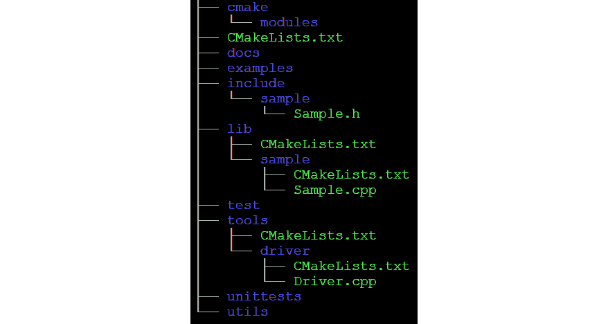
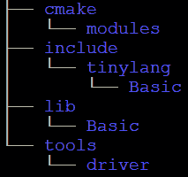

# 二、浏览 LLVM 源代码

LLVM mono 存储库包含`llvm-project`根目录下的所有项目。 所有项目都遵循公共源代码布局。 要有效地使用 LLVM，最好知道哪些是可用的，在哪里可以找到。 在本章中，您将了解以下内容：

*   LLVM Mono 存储库的内容，涵盖最重要的顶级项目
*   LLVM 项目的布局，显示所有项目使用的公共源代码布局
*   如何使用 LLVM 库创建自己的项目，涵盖了在自己的项目中使用 LLVM 的所有方式
*   如何针对不同的 CPU 体系结构，显示交叉编译到另一个系统所需的步骤

# 技术要求

本章的代码文件位于[https://github.com/PacktPublishing/Learn-LLVM-12/tree/master/Chapter02/tinylang](https://github.com/PacktPublishing/Learn-LLVM-12/tree/master/Chapter02/tinylang)

您可以在[https://bit.ly/3nllhED](https://bit.ly/3nllhED)上找到动作视频中的代码。

# LLVM Mono 存储库的内容

在[*第 1 章*](01.html#_idTextAnchor015)，*安装 LLVM*中，您克隆了 LLVM 单一存储库。 该存储库包含个 LLVM 顶级项目。 它们可以分为以下几类：

*   LLVM 核心库和附加组件
*   编译器和工具
*   运行时库

在接下来的几节中，我们将更仔细地了解这些群体。

## LLVM 核心库和附加组件

LLVM 核心库位于`llvm`目录中。 此项目为知名 CPU 提供了一组带有优化器和代码生成的库。 它还提供了基于这些库的工具。 LLVM 静态编译器`llc`将以 LLVM**中间表示**(**IR**)编写的文件作为输入，并将其编译为位码、汇编器输出或二进制目标文件。 像`llvm-objdump`和`llvm-dwarfdump`这样的工具可以检查对象文件，而像`llvm-ar`这样的工具可以让您从一组对象文件创建存档文件。 它还包括帮助开发 LLVM 本身的工具。 例如，`bugpoint`工具帮助查找 LLVM 内崩溃的最小测试用例。 `llvm-mc`是机器码游乐场：这个工具可以组装和拆卸机器指令，还可以输出编码，这对添加新指令非常有帮助。

LLVM 核心库是用 C++ 编写的。 此外，还提供了用于 Go、Ocaml 和 Python 的 C 接口和绑定。

位于`polly`目录中的 Polly 项目为 LLVM 添加了另一组优化。 它基于被称为**多面体模型**的数学表示。 使用这种方法，可以进行复杂的优化，例如针对缓存局部性进行优化的循环。

**MLIR**项目旨在为 LLVM 提供**多层中间表示**。 LLVM IR 已经处于较低级别，在编译器中生成 IR 期间，源语言中的某些信息会丢失。 MLIR 的思想是使 LLVM IR 可扩展，并以特定于域的表示形式捕获该信息。 您可以在`mlir`目录中找到源代码。

## 编译器和工具

名为 clang([LLVM](http://clang.llvm.org/))的完整 C/C++/Objective-C/Object-C++ 编译器是 http://clang.llvm.org/项目的部分。 源位于`clang`目录中。 它提供了一组库，用于词法分析、解析、语义分析以及从 C、C++、Objective-C 和 Objective-C++ 源文件生成 LLVM IR。 小工具`clang`是基于这些库的编译器驱动程序。 另一个有用的工具是`clang-format`，它可以根据用户提供的规则格式化 C/C++ 源文件和源代码片段。

Clang 的目标是兼容 GNU C/C++ 编译器 GCC 和微软 C/C++ 编译器 CL。

C/C++ 的其他工具由同名目录中的`clang-tools-extra`项目提供。 这里最值得注意的是`clang-tidy`，它是 C/C++ 的 Lint 样式检查器。 `clang-tidy`使用 clang 库解析源代码，并通过静态分析检查源代码。 该工具可以捕获比编译器更多的潜在错误，但会牺牲更多的运行时间。

Llgo 是 Go 编程语言的编译器，loc 位于`llgo`目录中。 它是用 GO 编写的，并使用 LLVM 核心库中的 GO 绑定与 LLVM 交互。 Llgo 的目标是与引用编译器(https://golang.org/))兼容，但目前唯一支持的目标是 64 位 x86Linux。 该项目似乎没有得到维护，可能会在将来被移除。

编译器创建的目标文件必须与运行时库链接在一起，以形成可执行文件。 这是位于`lld`目录中的 http://lld.llvm.org/链接器`lld`([LVM](http://lld.llvm.org/))的工作。 链接器支持 ELF、COFF、Mach-O 和 WebAssembly 格式。

没有调试器，任何编译器工具集都不完整！ LLVM 调试器称为`lldb`([http://lldb.llvm.org/](http://lldb.llvm.org/))，位于同名目录中。 该接口类似于 GNU 调试器 gdb，并且该工具开箱即支持 C、C++ 和 Objective-C。 调试器是可扩展的，因此可以很容易地添加对其他编程语言的支持。

## 运行时库

除了编译器之外，完整的编程语言支持还需要运行时库。 所有列出的项目都位于顶层目录中的同名目录中：

*   `compiler-rt`项目提供了独立于编程语言的支持库。 它包括通用函数，例如 32 位 i386 的 64 位除法、各种消毒器、模糊库和性能分析库。
*   `libunwind`库提供了基于 DWARF 标准的堆栈展开帮助器函数。 这通常用于实现 C++ 等语言的异常处理。 该库是用 C 语言编写的，函数没有绑定到特定的异常处理模型。
*   `libcxxabi`库在`libunwind`之上实现 C++ 异常处理，并为其提供标准的 C++ 函数。
*   最后，`libcxx`是 C++ 标准库的实现，包括 ioStreams 和 STL。 此外，`pstl`项目提供了 STL 算法的并行版本。
*   `libclc`是 OpenCL 的运行时库。 OpenCL 是异构并行计算的标准，有助于将计算任务转移到显卡上。
*   `libc`旨在提供一个完整的 C 库。 这个项目仍处于早期阶段。
*   `openmp`项目提供了对 OpenMP API 的支持。 OpenMP 有助于多线程编程，例如，可以根据源代码中的注释并行化循环。

尽管这是一个很长的项目清单，但好消息是，所有项目的结构都是相似的。 我们将在下一节中查看一般目录布局。

# LLVM 项目布局

所有 LLVM 项目都遵循相同的目录布局思想。 为了理解这个概念，让我们将 LLVM 与**GCC**(**GNU 编译器集合**)进行比较。 几十年来，GCC 为您能想象到的几乎所有系统提供了成熟的编译器。 但是，除了编译器之外，没有任何工具可以利用代码。 原因是它不是为重用而设计的。 这与 LLVM 不同。

每个功能都有一个明确定义的 API，并放在自己的库中。 Clang 项目有一个库(以及其他库)，可以将 C/C++ 源文件 lex 为令牌流。 解析器库将该令牌流转换为抽象语法树(也由库支持)。 语义分析、代码生成，甚至编译器驱动程序都以库的形式提供。 众所周知的`clang`工具只是一个链接到这些库的小应用。

的优势是显而易见的：当您想要构建一个需要 C++ 文件的**抽象语法树**(**AST**)的工具时，您可以重用这些库中的功能来构造 AST。 不需要语义分析和代码生成，也不需要链接到这些库。 所有 LLVM 项目(包括核心库)都遵循这一原则！

每个项目都有类似的组织。 因为 CMake 用于生成构建文件，所以每个项目都有一个描述项目构建的`CMakeLists.txt`文件。 如果需要额外的 CMake 模块或支持文件，则它们存储在`cmake`子目录中，模块放在`cmake/modules`中。

库和工具大多是用 C++ 编写的。 源文件放在`lib`目录下，头文件放在`include`目录下。 因为一个项目通常由几个库组成，所以在`lib`目录中每个库都有相应的目录。 如有必要，重复此。 例如，在`llvm/lib`目录内是`Target`目录，它保存特定于目标的降低代码。 除了一些源文件外，每个目标还有子目录，这些子目录再次编译成库。 这些目录中的每个目录都有一个`CMakeLists.txt`文件，该文件描述了如何构建库，以及哪些子目录还包含源代码。

`include`目录有一个附加级别。 为了使包含文件的名称唯一，路径名称包括项目名称，它是`include`下的第一个子目录。 只有在此文件夹中才会重复`lib`目录中的结构。

应用的源代码在`tools`和`utils`目录中。 在`utils`目录中是编译或测试期间使用的内部应用。 它们通常不是用户安装的一部分。 `tools`目录包含面向最终用户的应用。 在这两个目录中，每个应用都有自己的子目录。 与`lib`目录一样，包含 source 的每个子目录都有一个`CMakeLists.txt`文件。

正确的代码生成是编译器的必备条件*。 这只能通过一个好的测试套件来实现。 `unittest`目录包含使用*Google Test*框架的单元测试。 这主要用于无法以其他方式测试的单个功能和独立功能。 在`test`目录中是 LIT 测试。 这些测试使用`llvm-lit`实用程序来执行测试。 `llvm-lit`扫描文件中的 Shell 命令并执行它们。 该文件包含用作测试输入的源代码，例如 LLVM IR。 文件中嵌入了编译它的命令，由`llvm-lit`执行。 然后，通常在`FileCheck`实用程序的帮助下验证此步骤的输出。 该实用程序从一个文件读取 CHECK 语句，并将其与另一个文件进行匹配。 LIT 测试本身位于`test`目录下的子目录中，大致遵循`lib`目录的结构。*

 *文档(通常为作为**reStruredText**)放在`docs`目录中。 如果项目提供了示例，则它们位于`examples`目录中。

根据项目的需要，还可以有其他目录。 最值得注意的是，一些提供运行时库的项目将源代码放在`src`目录中，并将`lib`目录用于库导出定义。 编译器-RT 和 libclc 项目包含依赖于体系结构的代码。 它始终放在以目标体系结构命名的子目录中(例如，`i386`或`ptx`)。

总之，提供示例库并具有驱动程序工具的项目的总体布局如下所示：



图 2.1-常规项目目录布局

我们自己的项目也将遵循这个组织。

# 使用 LLVM 库创建您自己的项目

根据上一节中的信息，您现在可以使用 LLVM 库创建您自己的项目。 以下各节介绍一种名为**Tiny**的小语言。 该项目将被命名为`tinylang`。 这里定义了这样一个项目的结构。 尽管本节中的工具只是一个**Hello，world**应用，但是它的结构包含了真实编译器所需的所有部分。

## 创建目录结构

第一个问题是`tinylang`项目是否应该与 LLVM(如 clang)一起构建，或者它是否应该是一个只使用 LLVM 库的独立项目。 在前一种情况下，还需要决定在哪里创建项目。

让我们首先假设`tinylang`应该与 LLVM 一起构建。 放置项目的位置有不同的选项。 第一个解决方案是在`llvm-projects`目录中为项目创建一个子目录。 该目录中的所有项目都作为构建 LLVM 的一部分进行选择和构建。 在创建并行项目布局之前，这是构建的标准方式，例如，Clang。

第二种选择是将`tinylang`项目放在顶级目录中。 因为它不是正式的 LLVM 项目，所以 CMake 脚本不知道它。 当运行`cmake`时，您需要指定`–DLLVM_ENABLE_PROJECTS=tinylang`以将项目包括在构建中。

第三个选项是将项目目录放在`llvm-project`目录之外的其他位置。 当然，你需要告诉 CMake 这个地点。 例如，如果位置是`/src/tinylang`，则需要指定`–DLLVM_ENABLE_PROJECTS=tinylang –DLLVM_EXTERNAL_TINYLANG_SOURCE_DIR=/src/tinylang`。

如果您希望将项目构建为独立项目，那么它需要找到 LLVM 库。 这是在`CMakeLists.txt`文件中完成的，本节稍后将讨论该文件。

了解了可能的选项后，哪一个是最好的？ 由于 LLVM 源代码树的大小，使您的项目成为 LLVM 源代码树的一部分有点不灵活。 只要您不打算将您的项目添加到顶级项目列表中，我建议您使用单独的目录。 您可以在 GitHub 或类似服务上维护您的项目，而不必担心如何与 LLVM 项目同步。 如前所述，您仍然可以与其他 LLVM 项目一起构建它。

让我们用一个非常简单的库和应用创建一个项目。 第一步是创建目录布局。 选择一个对你方便的地点。 在下面的步骤中，我假设它与您克隆`llvm-project`目录的目录相同。 使用`mkdir`(Unix)或`md`(Windows)创建以下目录：



图 2.2-项目所需的目录

接下来，我们将 Build 描述和源文件放在这些目录中。

## 添加 CMake 文件

您应该认出上一节中的基本结构。 在`tinylang`目录内，通过以下步骤创建名为`CMakeLists.txt`的文件：

1.  该文件首先调用`cmake_minimum_required()`来声明 CMake 所需的最低版本。 版本与[*第 1 章*](01.html#_idTextAnchor015)，*安装 LLVM*：

    ```cpp
    Cmake_minimum_required(VERSION 3.13.4)
    ```

    相同
2.  The next statement is `if()`. If the condition is true, then the project is built standalone, and some additional setup is required. The condition uses two variables, `CMAKE_SOURCE_DIR` and `CMAKE_CURRENT_SOURCE_DIR`. The `CMAKE_SOURCE_DIR` variable is the top-level source directory that is given on the `cmake` command line. As we saw in the discussion about the directory layout, each directory with source files has a `CMakeLists.txt` file. The directory of the `CMakeLists.txt` file that CMake currently processes is recorded in the `CMAKE_CURRENT_SOURCE_DIR` variable. If both variables have the same string value, then the project is built standalone. Otherwise, `CMAKE_SOURCE_DIR` would be the `llvm` directory:

    ```cpp
    if(CMAKE_SOURCE_DIR STREQUAL CMAKE_CURRENT_SOURCE_DIR)
    ```

    独立设置非常简单。 每个 CMake 项目都需要一个名称。 这里，我们将其设置为`Tinylang`：

    ```cpp
      project(Tinylang)
    ```

3.  将搜索 LLVM 包，并将找到的 LLVM 目录添加到 CMake 模块路径：

    ```cpp
      find_package(LLVM REQUIRED HINTS     "${LLVM_CMAKE_PATH}")
      list(APPEND CMAKE_MODULE_PATH ${LLVM_DIR})
    ```

4.  然后，还包括 LLVM 提供的三个附加 CMake 模块。 仅当将 Visual Studio 用作生成编译器并将正确的运行时库设置为再次链接时，才需要第一个。 其他两个模块添加 LLVM 使用的宏，并基于提供的选项配置构建：

    ```cpp
      include(ChooseMSVCCRT)
      include(AddLLVM)
      include(HandleLLVMOptions)
    ```

5.  接下来，将来自 LLVM 的头文件的路径添加到 Include 搜索路径。 添加了两个目录。 添加了 build 目录中的`include`目录，因为自动生成的文件保存在这里。 另一个`include`目录是源目录内的目录：

    ```cpp
      include_directories("${LLVM_BINARY_DIR}/include"                      "${LLVM_INCLUDE_DIR}")
    ```

6.  使用`link_directories()`时，将为链接器添加 LLVM 库的路径：

    ```cpp
      link_directories("${LLVM_LIBRARY_DIR}")
    ```

7.  作为最后一步，设置一个标志来指示项目是独立生成的：

    ```cpp
      set(TINYLANG_BUILT_STANDALONE 1)
    endif()
    ```

8.  现在遵循通用设置。 `cmake/modules`目录被添加到 CMake 模块搜索路径。 这允许我们稍后添加我们自己的 CMake 模块：

    ```cpp
    list(APPEND CMAKE_MODULE_PATH   "${CMAKE_CURRENT_SOURCE_DIR}/cmake/modules")
    ```

9.  接下来，我们检查用户是否正在执行树外构建。 与 LLVM 一样，我们要求用户使用单独的目录来构建项目：

    ```cpp
    if(CMAKE_SOURCE_DIR STREQUAL CMAKE_BINARY_DIR AND NOT     MSVC_IDE)
      message(FATAL_ERROR "In-source builds are not     allowed.")
    endif()
    ```

10.  使用`configure_file()`命令将`tinylang`的版本号写入生成的文件。 版本号取自`TINYLANG_VERSION_STRING`变量。 `configure_file()`命令读取输入文件，用 CMake 变量的当前值替换 CMake 变量，并写入输出文件。 请注意，输入文件是从源目录读取的，并被写入构建目录：

    ```cpp
    set(TINYLANG_VERSION_STRING "0.1")
    configure_file(${CMAKE_CURRENT_SOURCE_DIR}/include/tinylang/Basic/Version.inc.in
      ${CMAKE_CURRENT_BINARY_DIR}/include/tinylang/Basic/Version.inc)
    ```

11.  接下来，还包括另一个 CMake 模块。 `AddTinylang`模块具有一些帮助器功能：

    ```cpp
    include(AddTinylang)
    ```

12.  后面跟着另一个`include_directories()`语句。 这会将我们自己的`include`目录添加到搜索路径的开头。 与独立版本中一样，添加了两个目录：

    ```cpp
    include_directories(BEFORE
      ${CMAKE_CURRENT_BINARY_DIR}/include
      ${CMAKE_CURRENT_SOURCE_DIR}/include
      )
    ```

13.  在文件的末尾，`lib`和`tools`目录被声明为 CMake 查找`CMakeLists.txt`文件的进一步目录。 这是连接目录的基本机制。 此示例应用在`lib`和`tools`目录下只有源文件，因此不需要其他文件。 更复杂的项目将添加更多目录，例如，单元测试：

    ```cpp
    add_subdirectory(lib)
    add_subdirectory(tools)
    ```

这是对您的项目的主要描述。

`AddTinylang.cmake`帮助器模块放置在`cmake/modules`目录中。 它有以下内容：

```cpp
macro(add_tinylang_subdirectory name)
  add_llvm_subdirectory(TINYLANG TOOL ${name})
endmacro()
macro(add_tinylang_library name)
  if(BUILD_SHARED_LIBS)
    set(LIBTYPE SHARED)
  else()
    set(LIBTYPE STATIC)
  endif()
  llvm_add_library(${name} ${LIBTYPE} ${ARGN})
  if(TARGET ${name})
    target_link_libraries(${name} INTERFACE 
      ${LLVM_COMMON_LIBS})
    install(TARGETS ${name}
      COMPONENT ${name}
      LIBRARY DESTINATION lib${LLVM_LIBDIR_SUFFIX}
      ARCHIVE DESTINATION lib${LLVM_LIBDIR_SUFFIX}
      RUNTIME DESTINATION bin)
  else()
    add_custom_target(${name})
  endif()
endmacro()
macro(add_tinylang_executable name)
  add_llvm_executable(${name} ${ARGN} )
endmacro()
macro(add_tinylang_tool name)
  add_tinylang_executable(${name} ${ARGN})
  install(TARGETS ${name}
    RUNTIME DESTINATION bin
    COMPONENT ${name})
endmacro()
```

包含该模块后，可以使用`add_tinylang_subdirectory()`、`add_tinylang_library()`、`add_tinylang_executable()`和`add_tinylang_tool()`功能。 基本上，这些是 LLVM(在`AddLLVM`模块中)提供的等效函数的包装器。 `add_tinylang_subdirectory()`添加要包含在生成中的新源目录。 此外，还添加了一个新的 CMake 选项。 使用此选项，用户可以控制是否应编译目录内容。 在`add_tinylang_library()`中，定义了一个也会安装的库。 `add_tinylang_executable()`定义可执行文件，`add_tinylang_tool()`定义也安装的可执行文件。

在`lib`目录内，即使没有源，也需要`CMakeLists.txt`文件。 它必须包括此项目库的源目录。 打开您最喜欢的文本编辑器，并将以下内容保存到文件中：

```cpp
add_subdirectory(Basic)
```

一个大型项目将创建多个库，源代码将放在`lib`的子目录中。 这些目录中的每一个都必须添加到`CMakeLists.txt`文件中。 我们的小项目只有一个名为`Basic`的库，因此只需要一行。

`Basic`库只有一个源文件`Version.cpp`。 此目录中的`CMakeLists.txt`文件也很简单：

```cpp
add_tinylang_library(tinylangBasic
  Version.cpp
  )
```

定义了一个名为`tinylangBasic`的新库，并将编译后的`Version.cpp`添加到该库中。 LLVM 选项控制这是共享库还是静态库。 默认情况下，将创建静态库。

在`tools`目录中重复相同的步骤。 此文件夹中的`CMakeLists.txt`文件几乎与`lib`目录中的文件一样简单：

```cpp
create_subdirectory_options(TINYLANG TOOL)
add_tinylang_subdirectory(driver)
```

首先，定义一个 CMake 选项来控制是否编译此目录的内容。 然后添加唯一的子目录`driver`，这一次是使用我们自己的模块中的一个函数。 同样，这允许我们控制编译中是否包含此目录。

`driver`目录包含应用`Driver.cpp`的源。 此目录中的`CMakeLists.txt`文件包含编译和链接此应用的所有步骤：

```cpp
set(LLVM_LINK_COMPONENTS
  Support
  )
add_tinylang_tool(tinylang
  Driver.cpp
  )
target_link_libraries(tinylang
  PRIVATE
  tinylangBasic
  )
```

首先，将`LLVM_LINK_COMPONENTS`变量设置为我们需要将工具链接到的 LLVM 组件列表。 LLVM 组件是一个或多个库的集合。 显然，这取决于工具的实现功能。 在这里，我们只需要`Support`组件。

使用`add_tinylang_tool()`定义了一个新的可安装应用。 名称是`tinylang`，唯一的源文件是`Driver.cpp`。 要链接到我们自己的库，我们必须用`target_link_libraries()`指定它们。 在这里，只需要`tinylangBasic`。

现在，CMake 系统所需的文件已经就位。 接下来，我们将添加源文件。

## 添加 C++ 源文件

让我们从`include/tinylang/Basic`目录中的开始。 首先，创建`Version.inc.in`模板文件，该文件保存配置的版本号：

```cpp
#define TINYLANG_VERSION_STRING "@TINYLANG_VERSION_STRING@"
```

`TINYLANG_VERSION_STRING`周围的`@`符号表示这是一个 CMake 变量，应该用其内容替换。

`Version.h`头文件仅声明一个函数来检索版本字符串：

```cpp
#ifndef TINYLANG_BASIC_VERSION_H
#define TINYLANG_BASIC_VERSION_H
#include "tinylang/Basic/Version.inc"
#include <string>
namespace tinylang {
std::string getTinylangVersion();
}
#endif
```

此函数的实现位于`lib/Basic/Version.cpp`文件中。 同样简单的是：

```cpp
#include "tinylang/Basic/Version.h"
std::string tinylang::getTinylangVersion() {
  return TINYLANG_VERSION_STRING;
}
```

和最后，在`tools/driver/Driver.cpp`文件中有应用源：

```cpp
#include "llvm/Support/InitLLVM.h"
#include "llvm/Support/raw_ostream.h"
#include "tinylang/Basic/Version.h"
int main(int argc_, const char **argv_) {
  llvm::InitLLVM X(argc_, argv_);
  llvm::outs() << "Hello, I am Tinylang "               << tinylang::getTinylangVersion()
               << "\n";
}
```

尽管它只是一个友好的工具，但源代码使用的是典型的 LLVM 功能。 `llvm::InitLLVM()`调用执行一些基本的初始化。 在 Windows 上，参数被转换为 Unicode，以便统一处理命令行解析。 在应用崩溃的情况下(希望不太可能)，会安装一个漂亮的打印堆栈跟踪处理程序。 它输出调用层次结构，从发生崩溃的函数开始。 要查看真实函数名而不是十六进制地址，必须存在调试符号。

LLVM 不使用 C++ 标准库的`iostream`类。 它有自己的实现。 `llvm::outs()`是输出流，这里用于向用户发送友好的消息。

## 编译 tinylang 应用

现在，第一个应用的所有文件都已就位，可以编译该应用了。 简单地说，您应该具有以下目录和文件：


图 2.3-tinylang 项目的所有目录和文件

如前所述，构建`tinylang`有几种方法。 以下是如何构建`tinylang`作为 LLVM 的一部分：

1.  使用以下命令切换到构建目录：

    ```cpp
    $ cd build
    ```

2.  Then, run CMake as follows:

    ```cpp
    $ cmake -G Ninja -DCMAKE_BUILD_TYPE=Release \
      -DLLVM_EXTERNAL_PROJECTS=tinylang \
      -DLLVM_EXTERNAL_TINYLANG_SOURCE_DIR=../tinylang \
      -DCMAKE_INSTALL_PREFIX=../llvm-12 \
      ../llvm-project/llvm
    ```

    使用此命令，CMake 为**忍者**(`-G Ninja`)生成构建文件。 构建类型设置为`Release`，从而生成优化的二进制文件(`-DCMAKE_BUILD_TYPE=Release`)。 Tinylang 与 LLVM(`-DLLVM_EXTERNAL_PROJECTS=tinylang`)一起作为外部项目构建，源代码位于与构建目录(`-DLLVM_EXTERNAL_TINYLANG_SOURCE_DIR=../tinylang`)平行的目录中。 还给出了构建二进制文件的目标目录(`-DCMAKE_INSTALL_PREFIX=../llvm-12`)。 作为最后一个参数，指定了 LLVM 项目目录的路径(`../llvm-project/llvm`)。

3.  现在，构建并安装所有内容：

    ```cpp
    $ ninja
    $ ninja install
    ```

4.  在构建和安装之后，`../llvm-12`目录包含 LLVM 和`tinylang`二进制文件。 请检查您是否可以运行应用：

    ```cpp
    $ ../llvm-12/bin/tinylang
    ```

5.  You should see the friendly message. Please also check that the Basic library was installed:

    ```cpp
    $ ls ../llvm-12/lib/libtinylang*
    ```

    这将显示存在一个`libtinylangBasic.a`文件。

当您密切跟踪 LLVM 开发，并且希望尽快了解 API 更改时，与 LLVM 一起构建非常有用。 在[*第 1 章*](01.html#_idTextAnchor015)，*安装 LLVM*中，我们签出了 LLVM 的一个特定版本。 因此，我们没有看到 LLVM 源文件有任何变化。

在此场景中，构建一次 LLVM 并使用编译后的 LLVM 版本将`tinylang`编译为独立项目是有意义的。 以下是如何做到这一点：

1.  Start again with entering the `build` directory:

    ```cpp
    $ cd build
    ```

    这次，CMake 仅用于构建 LLVM：

    ```cpp
    $ cmake -G Ninja -DCMAKE_BUILD_TYPE=Release \
      -DCMAKE_INSTALL_PREFIX=../llvm-12 \
      ../llvm-project/llvm
    ```

2.  将 this 与前面的 CMake 命令进行比较：缺少引用`tinylang`的参数；其他所有内容都是相同的。
3.  使用忍者构建并安装 LLVM：

    ```cpp
    $ ninja
    $ ninja install
    ```

4.  现在，您在`llvm-12`目录中安装了 LLVM。 接下来，将构建`tinylang`项目。 因为它是一个独立的构建，所以需要一个新的`build`目录。 如下所示保留 LLVM 构建目录：

    ```cpp
    $ cd ..
    ```

5.  Now create a new `build-tinylang` directory. On Unix, you use the following command:

    ```cpp
    $ mkdir build-tinylang
    ```

    在 Windows 上，您可以使用以下命令：

    ```cpp
    $ md build-tinylang
    ```

6.  在任一操作系统上使用以下命令输入新目录：

    ```cpp
    $ cd build-tinylang
    ```

7.  现在运行 CMake 为`tinylang`创建构建文件。 唯一的特点是如何发现 LLVM，因为 CMake 不知道我们安装 LLVM 的位置。 解决方案是使用`LLVM_DIR`变量指定从 LLVM 到`LLVMConfig.cmake`文件的路径。 命令如下：

    ```cpp
    $ cmake -G Ninja -DCMAKE_BUILD_TYPE=Release \
      -DLLVM_DIR=../llvm-12/lib/cmake/llvm \
      -DCMAKE_INSTALL_PREFIX=../tinylang ../tinylang/
    ```

8.  安装目录现在也是独立的。 像往常一样，使用以下命令构建和安装：

    ```cpp
    $ ninja
    $ ninja install
    ```

9.  命令完成后，您应该运行`../tinylang/bin/tinylang`应用以检查应用是否正常工作。

### 包含 LLVM 的另一种方式

如果不想为您的项目使用 CMake，那么您需要找出包含文件和库在哪里、要链接到哪些库、使用了哪种构建模式等等。 此信息由`llvm-config`工具提供，该工具位于 LLVM 安装的`bin`目录中。 假设该目录包含在您的 shell 搜索路径中，您可以运行`$ llvm-config`来查看所有选项。

例如，要使 LLVM 库链接到`support`组件(在前面的示例中使用)，可以运行以下命令：

```cpp
$ llvm-config –libs support
```

输出的一行包含库名称，包括编译器的链接选项，例如`-lLLVMSupport –lLLVMDemangle`。 显然，该工具可以很容易地与您选择的构建系统集成。

有了本节所示的项目布局，您就拥有了一个可针对大型项目(如编译器)进行扩展的结构。 下一节将奠定另一个基础：如何针对不同的目标体系结构进行交叉编译。

# 瞄准不同的 CPU 架构

如今，许多小型计算机(如 Raspberry Pi)都在使用中，资源有限。 在这样的计算机上运行编译器通常是不可能的，或者需要太多的运行时间。 因此，对编译器的一个常见要求是为不同的 CPU 体系结构生成代码。 创建可执行文件的整个过程称为交叉编译。 在前一节中，您创建了一个基于 LLVM 库的小型示例应用。 现在，我们将获取此应用，并针对不同的目标对其进行编译。

交叉编译涉及两个系统：编译器在宿主系统上运行，并为目标系统生成代码。 为了表示系统，使用了所谓的**三元组**。 这是一个配置字符串，通常由 CPU 体系结构、供应商和操作系统组成。 通常会添加更多关于环境的信息。 例如，三元组`x86_64-pc-win32`用于在 64 位 X86 CPU 上运行的 Windows 系统。 CPU 架构是`x86_64`，`pc`是通用供应商，`win32`是操作系统。 各部分之间用连字符连接。 在 ARMv8CPU 上运行的 Linux 系统使用`aarch64-unknown-linux-gnu`作为三元组。 `aarch64`是 CPU 架构。 操作系统为`linux`，运行`gnu`环境。 基于 Linux 的系统没有真正的供应商，所以这部分是`unknown`。 对于特定目的来说，不为人所知或不重要的部分通常会被省略：三元组`aarch64-linux-gnu`描述的是同一个 Linux 系统。

假设您的开发机器在 X86 64 位 CPU 上运行 Linux，并且您希望交叉编译到运行 Linux 的 ARMv8CPU 系统。 主机三元组为`x86_64-linux-gnu`，目标三元组为`aarch64-linux-gnu`。 不同的制度有不同的特点。 您的应用必须以可移植的方式编写，否则失败会让您大吃一惊。 常见的陷阱如下：

*   **字节顺序**：多字节值存储在内存中的顺序可以不同。
*   **指针大小**：指针的大小随 CPU 架构的不同而不同(通常为 16、32 或 64 位)。 C 类型`int`可能不够大，无法容纳指针。
*   **类型差异**：数据类型通常与硬件密切相关。 类型`long double`可以使用 64 位(ARM)、80 位(X86)或 128 位(ARMv8)。 PowerPC 系统可以对`long double`使用双双算法，这通过使用两个 64 位`double`值的组合来提供更高的精度。

如果您不注意这些要点，那么即使您的应用在您的主机系统上完美运行，它也可能在目标平台上表现出令人惊讶的行为或崩溃。 LLVM 库在不同的平台上进行了测试，还包含针对上述问题的便携解决方案。

要进行交叉编译，您需要以下工具：

*   为目标生成代码的编译器
*   能够为目标生成二进制文件的链接器
*   目标的头文件和库

Ubuntu 和 Debian 发行版都有支持交叉编译的包。 在下面的设置中，我们将利用这一点。 `gcc`和`g++ `编译器、`ld`链接器和库可以作为生成 ARMv8 代码和可执行文件的预编译二进制文件使用。 要安装所有这些软件包，请键入以下命令：

```cpp
$ sudo apt install gcc-8-aarch64-linux-gnu \
  g++-8-aarch64-linux-gnu binutils-aarch64-linux-gnu \
  libstdc++-8-dev-arm64-cross
```

新文件安装在`/usr/aarch64-linux-gnu`下。 目录此目录是目标系统的(逻辑)根目录。 它包含通常的`bin`、`lib`和`include`目录。 交叉编译器(`aarch64-linux-gnu-gcc-8`和`aarch64-linux-gnu-g++-8`)知道该目录。

在其他系统上交叉编译

如果您的发行版没有附带所需的工具链，那么您可以从源代码构建它。 GCC 和 g++ 编译器必须配置为为目标系统生成代码，而 binutils 工具需要为目标系统处理文件。 此外，需要使用此工具链编译 C 和 C++ 库。 步骤因使用的操作系统以及主机和目标体系结构而异。 在网络上，如果您搜索`gcc cross-compile <architecture>`，您可以找到说明。

做好准备后，您几乎已经准备好交叉编译样例应用(包括 LLVM 库)，除了有一个小细节。 LLVM 在构建期间使用**tablegen 工具**。 在交叉编译期间，将针对目标体系结构编译所有内容，包括此工具。 您可以在[*第 1 章*](01.html#_idTextAnchor015)、*安装 LLVM*时使用`llvm-tblgen`，也可以只编译此工具。 假设您位于包含 GitHub 存储库克隆的目录中，请键入以下内容：

```cpp
$ mkdir build-host
$ cd build-host
$ cmake -G Ninja \
  -DLLVM_TARGETS_TO_BUILD="X86" \
  -DLLVM_ENABLE_ASSERTIONS=ON \
  -DCMAKE_BUILD_TYPE=Release \
  ../llvm-project/llvm
$ ninja llvm-tblgen
$ cd ..
```

现在应该熟悉这些步骤了。 创建并输入构建目录。 CMake 命令仅为 X86 目标创建 LLVM 构建文件。 为了节省空间和时间，进行了发布构建，但启用了断言来捕获可能的错误。 只有`llvm-tblgen`工具是用忍者编译的。

有了手头的`llvm-tblgen`工具，您现在就可以开始交叉编译了。 CMake 命令行非常长，因此您可能希望将命令存储在脚本文件中。 与以前版本的不同之处在于，必须提供更多信息：

```cpp
$ mkdir build-target
$ cd build-target
$ cmake -G Ninja \
  -DCMAKE_CROSSCOMPILING=True \
  -DLLVM_TABLEGEN=../build-host/bin/llvm-tblgen \
  -DLLVM_DEFAULT_TARGET_TRIPLE=aarch64-linux-gnu \
  -DLLVM_TARGET_ARCH=AArch64 \
  -DLLVM_TARGETS_TO_BUILD=AArch64 \
  -DLLVM_ENABLE_ASSERTIONS=ON \
  -DLLVM_EXTERNAL_PROJECTS=tinylang \
  -DLLVM_EXTERNAL_TINYLANG_SOURCE_DIR=../tinylang \
  -DCMAKE_INSTALL_PREFIX=../target-tinylang \
  -DCMAKE_BUILD_TYPE=Release \
  -DCMAKE_C_COMPILER=aarch64-linux-gnu-gcc-8 \
  -DCMAKE_CXX_COMPILER=aarch64-linux-gnu-g++-8 \
  ../llvm-project/llvm
$ ninja
```

同样，您需要创建一个 build 目录并输入它。 一些 CMake 参数以前没有使用过，需要一些解释：

*   `CMAKE_CROSSCOMPILING`设置为`ON`告诉 CMake 我们正在交叉编译。
*   `LLVM_TABLEGEN`指定要使用的`llvm-tblgen`工具的路径。 这是以前版本中的版本。
*   `LLVM_DEFAULT_TARGET_TRIPLE`是目标体系结构的三元组。
*   `LLVM_TARGET_ARCH`用于**实时**(**JIT**)代码生成。 它默认为主机的体系结构。 对于交叉编译，必须将其设置为目标体系结构。
*   `LLVM_TARGETS_TO_BUILD`是 LLVM 应包含代码生成器的目标列表。 该列表至少应该包括目标架构。
*   `CMAKE_C_COMPILER`和`CMAKE_CXX_COMPILER`指定用于构建的 C 和 C++ 编译器。 交叉编译器的二进制文件以目标三元组为前缀，CMake 不会自动找到它们。

使用其他参数，将请求启用断言的发布构建，并将我们的 tinylang 应用构建为 LLVM 的一部分(如上一节所示)。 编译过程完成后，您可以使用`file`命令检查是否真正为 ARMv8 创建了二进制文件。 运行`$ file bin/tinylang`并检查输出是否表明它是用于 ARM aarch64 体系结构的 ELF 64 位对象。

使用 clang 进行交叉编译

由于 LLVM 为不同的架构生成代码，因此使用 clang 进行交叉编译似乎是显而易见的。 这里的障碍是 LLVM 没有提供所有必需的部分；例如，缺少 C 库。 因此，您必须混合使用 LLVM 和 GNU 工具，因此您需要告诉 CMake 更多关于您正在使用的环境的信息。 至少，您需要为 clang 和 clang++ 指定以下选项：`--target=<target-triple>`(启用不同目标的代码生成)、`--sysroot=<path>`(目标根目录的路径；请参阅前面的内容)、`I`(头文件的搜索路径)和`–L`(搜索库的路径)。 在 CMake 运行期间，会编译一个小应用，如果您的设置有问题，CMake 会发出警告。 这一步足以检查您是否有工作环境。 常见问题包括拾取错误的头文件、由于不同的库名而导致的链接失败以及错误的搜索路径。

交叉编译令人惊讶地复杂。 按照本节的说明，您将能够为您选择的目标体系结构交叉编译您的应用。

# 摘要

在本章中，您了解了作为 LLVM 存储库一部分的项目以及使用的通用布局。 您为自己的小型应用复制了这种结构，为更复杂的应用奠定了基础。 作为编译器构建的最高原则，您还学习了如何为另一个目标体系结构交叉编译您的应用。

在下一章中，将概述示例语言`tinylang`。 您将了解编译器必须完成的任务以及 LLVM 库支持在哪里可用。*