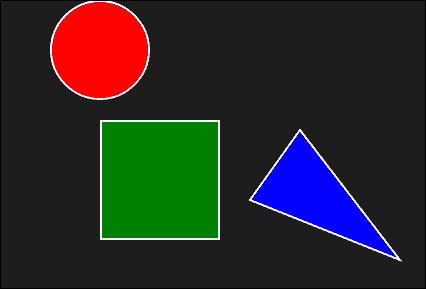
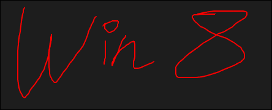
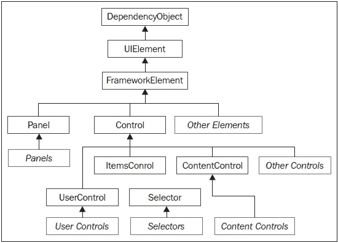
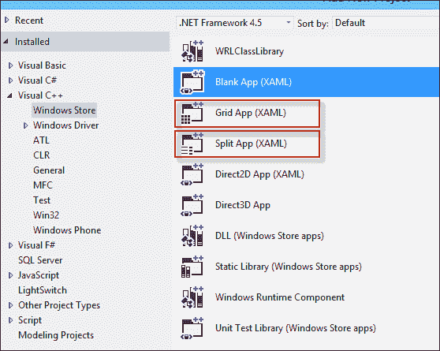
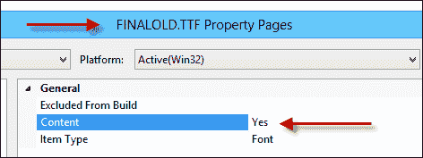
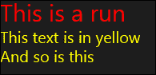
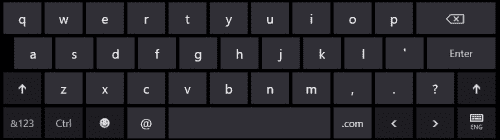
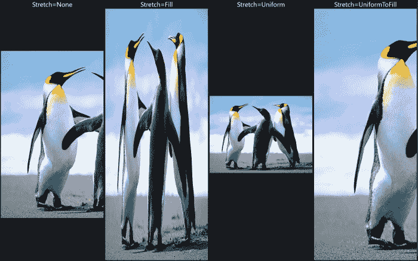

# 四、布局、元素和控件

上一章讨论了 XAML，这是一种用于创建对象和设置其属性的中立语言。 但 XAML 只是一个工具-内容才是重要的。 构建一个有效的用户界面至少需要选择最佳的元素和控件来实现可用性和所需的用户体验。

在本章中，我们将看一看 WinRT 布局系统，并讨论构成大多数用户界面的主要元素和控件。

# 介绍布局

布局是面对用户交互或内容更改时元素放置及其大小和位置变化的过程。 在 Win32/MFC 世界中，布局大多非常简单和有限。 控件是使用与窗口左上点的距离放置的，并且它们的大小是明确指定的。 此模型的灵活性非常有限；如果控件的内容发生更改(例如，变得更大)，控件就不能自动补偿。 其他类似的更改对 UI 布局没有影响。

另一方面，WinRT 提供了基于一组布局面板的更为灵活的模型，这些面板提供了不同的元素布局方式。 通过以各种方式组合这些面板，可以创建复杂且自适应的布局。

布局是一个分两步进行的过程。 首先，布局容器询问其每个子级所需的大小。 在第二步中，它使用任何适用的逻辑(对于该面板类型)来确定每个子元素的位置和大小，并将每个子元素放置在该矩形区域中。

每个元素向其父元素指示其大小要求。 下图总结了与这些要求相关的最重要属性：


以下是这些重要属性的快速细分：

*   `Width`/`Height`-相关元素的宽度和高度。 这通常不会设置(unset value 是 XAML 中的默认值-`"Auto"`；稍后会详细介绍)，这意味着元素希望尽可能大。 不过，如果需要，可以设置这些设置。 使用`FrameworkElement::ActualWidth`和`ActualHeight`只读属性可以获得元素的实际(呈现的)宽度和高度。
*   `MinWidth`/`MaxWidth`/`MinHeight`/`MaxHeight`-元素大小的最小值和最大值(图中未显示)。 最小值的默认值为`0`，最大值的默认值为无穷大。
*   `Margin`-元素周围的“呼吸空间”。 它的类型为`Thickness`，它有四个字段(`Left`、`Top`、`Right`和`Bottom`)，用于确定元素周围的空间量。 它可以在 XAML 中使用四个值(左、上、右、下)、两个值(第一个是左和右、第二个是上和下)或单个数字(在所有四个方向上的距离相同)来指定。
*   `Padding`-与`Margin`相同，但确定元素外缘与其内容(如果有)之间的间距。 它的类型也是`Thickness`，并由`Control`基类和其他一些特殊元素(如`Border`和`TextBlock`)定义。
*   `HorizontalAlignment`/`VerticalAlignment`-指定如果有额外空间，如何将元素与其父元素对齐。 可能的值是`Left`、`Center`、`Right`和`Stretch`(对于`HorizontalAlignment`)和`Top`、`Center`、`Bottom`和`Stretch`(对于`VerticalAlignment`)。
*   `HorizontalContentAlignment`/`VerticalContentAlignment`(图中未显示)-与`Horizontal`/`VerticalAlignment`相同的概念，只是元素的`Content`(如果有)。
*   `FlowDirection`-是否可以使用将布局方向从默认(`LeftToRight`)切换到`RightToLeft`，适用于从右到左的语言，如希伯来语或阿拉伯语。 这有效地将每个“左”字变成了“右字”字，反之亦然。

布局面板收集到每个子元素所需的大小后(通过对每个子元素调用`UIElement::Measure`)，它进入布局排列的第二阶段。 在此阶段，面板根据元素的所需大小(`UIElement::DesiredSize`只读属性)和适用于该面板的任何算法计算其子元素的最终位置和大小，并通过调用`UIElement::Arrange`通知每个元素生成的矩形。 此过程可以递归进行，因为元素本身可以是布局面板，依此类推。 其结果被称为视觉树。

### 备注

感兴趣的读者可能想知道如何在代码中为`Width`指定`"Auto"`XAML 值，因为这是一个`double`值。 这是通过包括`<limits>`，然后使用表达式`std::numeric_limits<double>::quiet_NaN()`来实现的。 同样，要指定一个无限值，请使用`std::numeric_limits<double>::infinity()`。

# 布局面板

所有布局面板必须派生自`Windows::UI::Xaml::Controls::Panel`类，而该类本身派生自`FrameworkElement`。 主要增加的`Panel`是`Children`属性(也是它的`ContentProperty`以简化 XAML 创作)，它是实现`IVector<UIElement>`接口的元素的集合。 通过使用`Children`属性，可以在`Panel`中动态添加或删除元素。 WinRT 提供了一组特定的面板，每个面板都有自己的布局逻辑，为创建布局提供了灵活性。 在接下来的几节中，我们将看看一些内置的布局面板。

### 备注

除非另有说明，否则假定所有面板类以及后面描述的元素和控件都存在于`Windows::UI::Xaml::Controls`命名空间中。

## 堆叠面板

`StackPanel`是最简单的布局面板之一。 它根据`Orientation`属性(`Vertical`是默认值)在*堆栈*中一个接一个地水平或垂直地布局其子级。

当用于垂直布局时，每个元素都会获得它想要的高度和所有可用宽度，反之亦然。 下面是包含一些元素的`StackPanel`示例：

```cpp
<StackPanel Orientation="Horizontal" >
    <TextBlock Text="Name:" FontSize="30" Margin="0,0,10,0"/>
    <TextBox Width="130" FontSize="30"/>
</StackPanel>
```

下面是它在运行时的外观(在输入一些文本之后)：


`StackPanel`对于小型布局任务非常有用，它是其他更复杂布局面板的一部分。

## 栅格

`Grid`由于其灵活性，可能是最有用的布局面板。 它创建了类似表格的单元格布局。 元素可以占用单个或多个单元格，并且单元格大小可自定义。 我们已经使用`Grid`从上一章创建了计算器布局。 下面是另一个`Grid`示例(包装在一个`Border`元素中)，这是一个登录页面的一段标记：

```cpp
<Border HorizontalAlignment="Center" VerticalAlignment="Center"
    BorderThickness="1" BorderBrush="Blue" Padding="10">
    <Grid>
        <Grid.RowDefinitions>
            <RowDefinition Height="Auto" />
            <RowDefinition Height="Auto" />
            <RowDefinition Height="Auto" />
            <RowDefinition Height="Auto" />
        </Grid.RowDefinitions>
        <Grid.ColumnDefinitions>
            <ColumnDefinition />
            <ColumnDefinition />
        </Grid.ColumnDefinitions>
        <TextBlock Text="Enter credentials:" Grid.ColumnSpan="2"
            TextAlignment="Center" FontSize="40" Margin="20"/>
        <TextBlock Text="Username:" TextAlignment="Right"
            Margin="10" Grid.Row="1" FontSize="40"
            VerticalAlignment="Bottom"/>
        <TextBox HorizontalAlignment="Left" Width="250"
            Grid.Row="1" Grid.Column="1" Margin="10" 
            FontSize="30" />
        <TextBlock Text="Password:" TextAlignment="Right"
            Margin="10" Grid.Row="2" FontSize="40"
            VerticalAlignment="Bottom" />
        <PasswordBox HorizontalAlignment="Left" Width="250"
            Grid.Row="2" Grid.Column="1" Margin="10" 
            FontSize="30" />
        <Button Content="Login" HorizontalAlignment="Stretch"
            Grid.Row="3" FontSize="30" Margin="10,30,10,10"
            Background="Green" />
        <Button Content="Cancel" HorizontalAlignment="Center" 
            Grid.Row="3" Grid.Column="1" FontSize="30" 
            Margin="10,30,10,10" Background="Red" />
    </Grid>
</Border>
```

它是这样看待运行时的：


行数和列数不是由简单属性指定的。 相反，它是使用`RowDefinition`对象(用于行)和`ColumnDefinition`对象(用于列)指定的。 原因与可以按行和/或列指定的大小和行为有关。

`RowDefinition`具有`Height`属性，而`ColumnDefintion`具有`Width`属性。 两者都属于`GridLength`类型。 设置`GridLength`有三个选项：

*   特定长度
*   基于星星的(相对)因子(这是默认值，因子等于 1)
*   自动长度

将`Height`(属于`RowDefintion`)或`Width`(属于`ColumnDefinition`)设置为特定数字会使该行/列具有特定的大小。 在代码中，它等同于`ref new GridLength(len)`。

将`Height`或`Width`设置为`"Auto"`(在 XAML 中)会使行/列的高度/宽度与该行/列中放置的最高/最宽元素所需的高度/宽度一样高/宽。 在代码中，它等同于静态属性`GridLength::Auto`。

最后一个选项(这是默认选项)是在 XAML 中将`Height`/`Width`设置为`n*`，其中*n*是一个数字(如果省略，则为`1`)。 这将建立与具有“星形”长度的其他行/列的关系。 例如，下面是三行 a`Grid`：

```cpp
<RowDefinition Height="2*" />
<RowDefinition />
<RowDefinition Height="3*" />
```

这意味着第一行的高度是第二行的两倍(`Height="*"`)。 最后一行比第二行高 3 倍，比第一行高 1.5 倍。 即使由于布局更改而动态调整`Grid`的大小，这些关系也会保持不变。

### 备注

“星号”因子的值不必是整数；它也可以是浮点值。 重要的是比率，而不是实际数字。

使用附加的`Grid.Row`和`Grid.Column`属性将元素放置在特定的网格单元格中(这两个属性都默认为零，表示第一行和第一列)。

默认情况下，元素占用一个单元格。 这可以通过使用`Grid.RowSpan`和`Grid.ColumnSpan`属性进行更改(这是为上一个 XAML 中的第一个`TextBlock`设置的)。

### 提示

可以使用较大的数字指定`ColumnSpan`或`RowSpan`，以确保一个元素将占据给定方向上的所有单元格。 `Grid`将自动使用实际行/列计数。

## 画布

`Canvas`模拟经典的 Win32/MFC 布局-精确定位。 如果需要精确坐标，例如图形、动画、图形游戏和其他复杂图形，这种类型的布局非常有用。 `Canvas`是最快的布局面板，只是因为它几乎不做布局(实际上几乎什么都不做)。

下面是`Canvas`托管一些形状的示例：

```cpp
<Canvas x:Name="_canvas" >
    <Ellipse Stroke="White" StrokeThickness="2" Fill="Red" 
        Width="100" Height="100" Canvas.Left="50"/>
    <Rectangle Stroke="White" StrokeThickness="2" Fill="Green" 
        Canvas.Left="100" Canvas.Top="120" Width="120" 
        Height="120"/>
    <Polygon Points="0,0 150,60 50,-70" Canvas.Left="250" 
        Canvas.Top="200" Fill="Blue" Stroke="White" 
        StrokeThickness="2" />
</Canvas>
```

输出如下所示：



放置坐标是使用附加的`Canvas.Left`和`Canvas.Top`属性设置的(这两个属性都默认为零，表示`Canvas`的左上角)。 `Canvas`定义的唯一另一个附加的属性是`ZIndex`。 这指定了在`Canvas`中呈现元素的相对顺序，其中较大的值将元素放在顶部。 默认情况下，稍后在 XAML 中定义的元素在 Z 顺序中较高。

作为一个更复杂的示例，假设我们希望允许用户使用鼠标或手指在`Canvas`周围拖动形状。 首先，我们将添加用于按下、释放和移动指针的事件处理程序：

```cpp
<Canvas x:Name="_canvas" PointerPressed="OnPointerPressed" PointerReleased="OnPointerReleased" PointerMoved="OnPointerMoved">
```

### 备注

“指针”的概念取代了 Win32/MFC/WPF/Silverlight 中熟悉的“鼠标”事件名称；指针是通用的，表示任何指向设备，无论是鼠标、指示笔还是手指。

与指针相关的事件使用冒泡策略，这意味着对元素(如使用的形状)的任何按下都将首先在该形状上引发`PointerPressed`，如果未处理(如本例所示)，则会冒泡到其父对象(`Canvas`)，在那里它将得到处理。

可以这样处理`PointerPressed`事件：

```cpp
void MainPage::OnPointerPressed(Platform::Object^ sender,
   PointerRoutedEventArgs^ e) {
  _element = (FrameworkElement^)e->OriginalSource;
  if(_element == _canvas) return;
  _lastPoint = e->GetCurrentPoint(_canvas)->Position;
  _lastPoint.X -= (float)Canvas::GetLeft(_element);
  _lastPoint.Y -= (float)Canvas::GetTop(_element);
  _canvas->CapturePointer(e->Pointer);
  e->Handled = true;
  _isMoving = true;
}
```

由于此事件在`Canvas`上触发，即使原始元素是其中一个`Canvas`的子元素，我们如何访问该子元素呢？ 发送者参数是发送事件的实际对象-在本例中为`Canvas`。 子元素由`PointerRoutedEventArgs::OriginalSource`属性(继承自`RoutedEventArgs`)指示。 首先，检查指针是否实际按在`Canvas`本身上。 如果是，则该方法立即返回。

### 备注

使用前面的`Canvas`，这种情况永远不会发生。 原因是，`Canvas`(或该问题的任何其他`Panel`)的缺省`Background`是`nullptr`，因此没有事件可以在其上注册-它们会传播到其父对象。 如果需要`Canvas`本身的事件，`Background`必须是某个非`nullptr``Brush`；如果要显示父母的背景`Brush`，使用`ref new SolidColorBrush(Colors::Transparent)`就足够了。

接下来，分两步提取印刷机的位置，第一步使用`PointerRoutedEventArgs::GetCurrentPointer()`(这是一个`PointerPoint`对象)，第二步使用`PointerPoint::Position`属性(类型为`Windows::Foundation::Point`)。 然后将该点调整为按压点到元素左上角位置的偏移量，这有助于使后面的移动更准确。

捕获指针(`UIElement::CapturePointer`)可确保`Canvas`继续接收与指针相关的事件，无论指针位于何处。 将`PointerRoutedEventArgs::Handled`设置为`true`可以防止进一步冒泡(因为这里没有必要)，并且从现在开始应该出现一个指示移动的标志，直到释放的指针被设置(另一个私有成员变量)。

### 备注

指针捕获在概念上类似于其他 UI 技术(Win32/MFC/WPF/Silverlight)中存在的鼠标捕获。

当指针移动时，只要指针尚未释放，相关元素也需要移动：

```cpp
void MainPage::OnPointerMoved(Platform::Object^ sender,
   PointerRoutedEventArgs^ e) {
  if(_isMoving) {
    auto pos = e->GetCurrentPoint(_canvas)->Position;
    Canvas::SetLeft(_element, pos.X - _lastPoint.X);
    Canvas::SetTop(_element, pos.Y - _lastPoint.Y);
    e->Handled = true;
  }
}
```

这里的主要思想是通过设置附加的`Canvas`属性`Canvas.Left`和`Canvas.Top`(使用静态的`Canvas::SetLeft`和`Canvas::SetTop`方法)来移动元素。

当指针最终释放时，我们只需要做一些清理工作：

```cpp
void MainPage::OnPointerReleased(Platform::Object^ sender,
   PointerRoutedEventArgs^ e) {
  _isMoving = false;
  _canvas->ReleasePointerCapture(e->Pointer);
  e->Handled = true;
}
```

完整的代码位于名为`CanvasDemo`的项目中，该项目是本章可下载代码的一部分。

### 备注

与指针相关的方法看起来可能比需要的复杂，但事实并非如此。 由于触摸输入通常是多点触摸，如果两个手指同时按住两个不同的元素，试图移动它们，会发生什么情况？ 可能会触发多个`PointerPressed`事件，应该有一种方法来区分一个手指和另一个手指。 前面的代码是在假设一次只使用一个手指的情况下实现的。

### 将子项动态添加到面板

可以通过编程方式操作`Panel::Children`属性(对于任何`Panel`类型)。 例如，使用`Canvas`作为绘图图面，我们可以使用前面的指针事件添加相互连接的`Line`元素来创建绘图。 当指针移动时(按下后)，可以使用如下代码添加`Line`个对象：

```cpp
void MainPage::OnPointerMoved(Object^ sender, 
   PointerRoutedEventArgs^ e) {
  if(_isDrawing) {
    auto pt = e->GetCurrentPoint(_canvas);
    auto line = ref new Line();
    line->X1 = _lastPoint->Position.X;
    line->Y1 = _lastPoint->Position.Y;
    line->X2 = pt->Position.X;
    line->Y2 = pt->Position.Y;
    line->StrokeThickness = 2;
    line->Stroke = _paintBrush;
    _canvas->Children->Append(line);
    _lastPoint = pt;
  }
}
```

将构造一个`Line`对象，并根据需要设置其属性，最后将其添加到`Canvas`的`Children`集合中。 如果没有这最后一步，`Line`对象就不会附加到任何东西上，当它的引用超出作用域时就会消失。 `_paintBrush`是由宿主页面(未显示)维护的`Brush`字段。

完整的源代码位于名为`SimpleDraw`的项目中，该项目是本章可下载代码的一部分。 以下是使用此应用完成的示例绘图：



## VariableSizedWrapGrid

`StackPanel`、`Grid`和`Canvas`是相当简单的；它们与 WPF 或 Silverlight 中的对应对象没有太大区别。 WinRT 有一些更有趣的面板，从`VariableSizedWrapGrid`开始。

顾名思义，它本质上是一个网格，项目按行或列排列(取决于`Orientation`属性)。 当空间耗尽时，或者如果行/列中的项目数达到由`MaximumRowsOrColumns`属性设置的限制，则布局将在下一行/列继续。

`VariableSizedWrapGrid`的最后一个特点是，它具有两个附加属性`RowSpan`和`ColumnSpan`，可以将项的大小更改为占据多个单元格。 下面是一个包含一组`Rectangle`元素的示例`VariableSizedWrapGrid`：

```cpp
<Grid Background=
    "{StaticResource ApplicationPageBackgroundThemeBrush}">
    <Grid.Resources>
        <Style TargetType="Rectangle">
            <Setter Property="Stroke" Value="White" />
            <Setter Property="StrokeThickness" Value="2" />
            <Setter Property="Margin" Value="8" />
            <Setter Property="Width" Value="100" />
            <Setter Property="Height" Value="100" />
            <Setter Property="Fill" Value="Red" />
        </Style>
    </Grid.Resources>
    <VariableSizedWrapGrid x:Name="_grid"     
        Orientation="Horizontal" 
        MaximumRowsOrColumns="6">
        <Rectangle />
        <Rectangle Fill="Yellow" />
        <Rectangle Fill="Purple"/>
        <Rectangle />
        <Rectangle Fill="Blue" VariableSizedWrapGrid.RowSpan="2" 
           Height="200"/>
        <Rectangle />
        <Rectangle Fill="Brown"/>
        <Rectangle VariableSizedWrapGrid.ColumnSpan="2" 
           Width="200" Fill="Aqua"/>
        <Rectangle Fill="LightBlue"/>
        <Rectangle Fill="Green"/>
        <Rectangle VariableSizedWrapGrid.ColumnSpan="2"
           VariableSizedWrapGrid.RowSpan="2" Width="150" 
           Height="150" Fill="BlueViolet"/>
        <Rectangle Fill="AntiqueWhite"/>
        <Rectangle Fill="Azure"/>
        <Rectangle />
        <Rectangle Fill="BlanchedAlmond"/>
        <Rectangle Fill="Orange"/>
        <Rectangle Fill="Crimson"/>
        <Rectangle Fill="DarkGoldenrod"/>
    </VariableSizedWrapGrid>
</Grid>
```

这是结果：


## 面板虚拟化

前面讨论的所有面板在添加后都会立即创建其子元素。 对于大多数情况，这是可以接受的。 但是，如果项目计数非常高(数百或更多)，面板的性能可能会降低，因为需要创建和管理许多元素，在创建时占用内存并浪费 CPU 周期，或者在布局发生更改时。 虚拟化面板不会预先为其持有的项目创建所有元素；相反，它只创建当前可见的实际元素。 如果用户滚动查看更多数据，则会根据需要创建元素。 滚动出视图的元素可能会被销毁。 此方案节省了内存和 CPU 时间(在创建时)。

`VirtualizingPanel`类是 WinRT 中所有虚拟化面板实现的抽象基类。 `VirtualizingPanel`的进一步细化是`OrientedVirtualizingPanel`，表示面板具有固有方向。 WinRT 提供了三个虚拟化面板，我们稍后会看到。

所有虚拟化面板都有一个更有趣的特性，它们只能用于定制用于基于`ItemsControl`的控件的面板(通常带有数据绑定)；它们不能像使用普通面板一样使用-通过在其中放置项(以 XAML 或编程方式)。 对`ItemsControl`及其衍生工具的全面讨论留到本章的后面部分；现在我们将快速了解一下现有的虚拟化面板的工作方式；我们将在稍后讨论`ItemsControl`时查看用法示例。

### 虚拟面板

最容易理解的虚拟化面板是`VirtualizingStackPanel`。 它的作用类似于常规的`StackPanel`，但它虚拟化了当前不可见的元素。

`WrapGrid`类似于`VariableSizedWrapGrid`，但没有“可变”部分(它没有可以更改单个元素大小的附加属性)。 它在`GridView`中用作默认面板(`GridView`是从`ItemsControl`派生的众多类型之一)。 可以使用`Orientation`、`ItemHeight`、`ItemWidth`和`MaximumRowsOrColumns`等属性对其进行自定义，这些属性大多是不言而喻的。

`CarouselControl`类似于`VirtualizingStackPanel`，增加了在到达最后一项时滚动到第一项的功能。 它被用作`ComboBox`的默认面板，事实上，它不能被其他控件使用，这使得它通常非常无用。

# 使用元素和控件

在实践中，“元素”和“控件”之间的区别并不那么重要，但理解这一区别是很有用的。

**元素**从`FrameworkElement`(直接或间接)派生，而不是从`Control`派生。 它们有一些外观，并提供了一些功能，这些功能主要是通过更改属性来定制的。 例如，`Ellipse`是一个元素。 没有办法改变`Ellipse`的基本外观(例如，将`Ellipse`变成矩形也是不合逻辑的)。 它仍然可以使用`Stroke`、`StrokeThickness`、`Fill`和`Stretch`等属性以某些方式进行自定义。

另一方面，在和上，**控件**(直接或间接)派生自`Control`类。 `Control`添加了一系列属性，其中最重要的是`Template`属性。 这允许在不影响其行为的情况下完全更改控件的外观。 此外，所有这些都可以单独使用 XAML 实现，无需代码或任何类派生。 我们将在[第 6 章](06.html "Chapter 6. Components, Templates, and Custom Elements")、*组件、模板和自定义元素*中讨论控件模板。

下面的类图显示了 WinRT 中与个基本元素相关的一些类：



在接下来的几节中，我们将回顾各种元素和控件组(基于派生和用法类别)，研究它们的主要功能和用法。 在每组中，我们将查看一些更有用或更独特的控件。 这些部分绝不是完整的(也并非有意如此)；可以在官方 MSDN 文档和示例中找到更多信息。

## 内容控件

内容控件从`ContentControl`类(本身从`Control`派生)派生。 `ContentControl`添加了两个重要的属性：`Content`(也包括它的`ContentProperty`属性，这使得在 XAML 中设置它变得很容易)和`ContentTemplate`。 `ContentControl`的一个简单示例是`Button`：

```cpp
<Button Content="Login" FontSize="30" />
```

这个`Content`属性看起来像一个字符串，但实际上它的类型是`Platform::Object^`，这意味着它可以是任何东西。

### 备注

使用`Platform::Object`指定“任何东西”似乎有些奇怪；毕竟，WinRT 是基于 COM 的，所以这背后一定有一个接口。 实际上，`Platform::Object`是`IInspectable`接口指针的预计替代。

从`ContentControl`派生的类型使用以下规则呈现其`Content`：

*   如果它是字符串，则`TextBlock`被呈现，并将其`Text`设置为字符串值。
*   如果它派生自`UIElement`，则按原样呈现。
*   否则(`Content`不是从`UIElement`派生的，也不是字符串)，如果`ContentTemplate`是`nullptr`，则内容被呈现为`TextBlock`，其`Text`被设置为`Content`的字符串表示。 否则，将使用提供的`DataTemplate`进行渲染。

上述规则适用于从`ContentControl`派生的任何类型。 在上一个按钮的情况下，使用第一个规则，因为`Button`的`Content`是字符串**Login**。 下面是一个使用第二条规则的示例：

```cpp
<Button>
    <StackPanel Orientation="Horizontal">
        <Image Source="img/upload.png" Stretch="None" />
        <TextBlock Text="Upload" FontSize="35"
            VerticalAlignment="Center" Margin="10,0,0,0" />
    </StackPanel>
</Button>
```

结果按钮如下所示：


结果控件仍然是一个按钮，但是它的`Content`被设置为从`UIElement`派生的类型(在本例中是`StackPanel`)。

第三条规则是最有趣的。 假设我们有一个简单的数据对象实现，如下所示：

```cpp
namespace ContentControlsDemo {
  public ref class Book sealed {
  public:
    property Platform::String^ BookName;
    property Platform::String^ AuthorName;
    property double Price;
  };
}
```

给定此实现后，让我们在 XAML 中创建一个`Book`实例作为资源：

```cpp
<Page.Resources>
    <local:Book x:Key="book1" BookName="Windows Internals"
       AuthorName="Mark Russinovich" Price="50.0" />
</Page.Resources>
```

### 备注

要使此编译没有错误，必须将`#include "book.h"`添加到`MainPage.xaml.h`。 其原因将在下一章中阐明。

现在，我们可以将派生自`ContentControl`(如`Button`)的类型的`Content`设置为该`Book`对象：

```cpp
<Button Content="{StaticResource book1}" FontSize="30"/>
```

运行该应用将显示以下结果：


结果仅仅是类的完全限定类型名(包括命名空间)；情况并不总是如此，它取决于相关控件的默认控件模板。 无论如何，很明显这通常不是我们想要的。 要获得对象的自定义呈现，需要插入到`ContentTemplate`属性中的`DataTemplate`。

下面是一个示例，它创建了一个`DataTemplate`，以在有问题的`Button`中使用：

```cpp
<Button Margin="12" Content="{StaticResource book1}" >
    <Button.ContentTemplate>
        <DataTemplate>
            <Grid>
                <Grid.RowDefinitions>
                    <RowDefinition Height="Auto" />
                    <RowDefinition Height="Auto" />
                </Grid.RowDefinitions>
                <Grid.ColumnDefinitions>
                    <ColumnDefinition />
                    <ColumnDefinition Width="15" />
                    <ColumnDefinition Width="Auto" />
                </Grid.ColumnDefinitions>
                <TextBlock FontSize="35" Foreground="Yellow"
                    Text="{Binding BookName}" />
                <TextBlock Grid.Row="1" FontSize="25"
                    Foreground="Orange" 
                    Text="{Binding AuthorName}" />
                <TextBlock FontSize="40" Grid.Column="2"
                    Grid.RowSpan="2" TextAlignment="Center"
                    VerticalAlignment="Center">
                <Span FontSize="25">Just</Span><LineBreak />
                <Span FontSize="40">$</Span>
                <Run Text="{Binding Price}" FontSize="40" />
                </TextBlock>
            </Grid>
        </DataTemplate>
    </Button.ContentTemplate>
</Button>
```

这里有几点需要注意：

*   `DataTemplate`可以包含单个元素(在本例中通常是`Panel`-`Grid`)，并且可以构建任何所需的 UI。
*   使用实际内容的属性是通过带有属性名称的数据绑定表达式(用`{Binding}`标记扩展表示的)来完成的。 数据绑定的完整处理将在下一章中找到。
*   要使属性与数据对象(在本例中为`Book`)一起工作，类(`Book`)必须使用`Bindable`属性进行修饰，如下所示：

    ```cpp
    [Windows::UI::Xaml::Data::Bindable]
    public ref class Book sealed {
    ```

结果如下所示：


数据模板是可视化数据对象的强大工具；我们稍后会遇到更多这样的工具。 现在，重要的是要认识到，从`ContentControl`派生的每个类型都具有定制能力。

在接下来的几节中，我们将讨论一些常见的`ContentControl`派生类型。

### 按钮

正如我们已经看到的，经典的`Button`控件是 a`ContentControl`，这意味着它可以包含任何内容，但仍然像按钮一样工作。 `Button`的大部分功能都派生自其抽象基类`ButtonBase`。 `ButtonBase`声明无处不在的`Click`事件，以及其他一些有用的属性：

*   `ClickMode`-表示什么构成“单击”：`Release`、`Press`或`Hover`。 当然，这主要适用于鼠标。
*   `Command`-指示单击按钮时调用哪个命令(如果有)(命令将在下一章讨论)。
*   `CommandParameter`-与调用的命令一起发送的可选参数。

Button 派生自`ButtonBase`，在成员方面没有添加任何内容，除了是具体的，而不是抽象的。

另一个`ButtonBase`导数是`HyperlinkButton`。 默认情况下，它呈现为 Web 超链接，并添加`NavigationUri`属性以自动导航到指定的 URI；通常不处理`Click`事件。

`RepeatButton`(在`Windows::UI::Xaml::Controls::Primitives`名称空间中)是另一个`ButtonBase`派生的。 只要按下按钮，它就会引发`Click`事件；可以使用`Delay`(第一个`Click`事件)和`Interval`(`Click`事件引发的周期)属性指定`Click`事件的速率。

### 备注

`RepeatButton`本身用处不大；它主要用作其他更复杂控件的构建块。 将控件放在`Primitives`子命名空间中可以提示这一点。 例如，`RepeatButton`由`ScrollBar`的几个部分组成(本身在`Primitives`名称空间中)。

另外两个有用的按钮控件是`CheckBox`和`RadioButton`。 两者都源于共同的碱基`ToggleButton`。 `ToggleButton`定义`IsChecked`属性，该属性可以有三个值(`true`、`false`或`nullptr`)。 后者表示一种不确定状态，由`CheckBox`支持(但不受`RadioButton`支持)。 `ToggleButton`还声明了`IsThreeState`属性，以指示是否应该允许第三种状态。 最后，它定义了三个事件：`Checked`、`Unchecked`和`Indeterminate`。

`CheckBox`除了变得具体之外，没有给`ToggleButton`增加任何东西。 `RadioButton`只添加一个属性`GroupName`(字符串)。 这允许将`RadioButton`控件分组用作排除组。 默认情况下，同一直接父级下的所有`RadioButton`控件成为一个组(该组中一次只有一个控件的`IsChecked`属性可以设置为`true`)。 如果指定了`GroupName`，则具有相同`GroupName`的所有`RadioButtons`被视为一个组。

下面是一个使用`CheckBox`和`RadioButton`控件的简单示例：

```cpp
<StackPanel>
    <TextBlock Text="What kind of tea would you like?"
       FontSize="25" Margin="4,12"/>
    <RadioButton Content="Earl Grey" IsChecked="True" Margin="4" 
       FontSize="20" />
    <RadioButton Content="Mint" Margin="4" FontSize="20"/>
    <RadioButton Content="Chinese Green" Margin="4" 
       FontSize="20"/>
    <RadioButton Content="Japanese Green" Margin="4" 
       FontSize="20"/>

    <TextBlock Text="Select tea supplements:" FontSize="25" 
       Margin="4,20,4,4" />
    <CheckBox Content="Sugar" Margin="4" FontSize="20" />
    <CheckBox Content="Milk" Margin="4" FontSize="20" />
    <CheckBox Content="Lemon" Margin="4" FontSize="20" />
</StackPanel>
```

在部分选择之后，结果显示如下所示：


### ScrollViewer

`ScrollViewer`是一个内容控件，它承载单个子级(其`Content`属性，就像任何其他`ContentControl`一样)，并使用一对`ScrollBar`控件来支持滚动。 最重要的属性是`VerticalScrollBarVisibility`和`HorizontalScrollBarVisibility`，它们指示滚动的工作方式以及滚动条自身显示的方式。 有四个选项(`ScrollBarVisibility`枚举)：

*   `Visible`-滚动条始终可见。 如果内容不需要滚动，则禁用滚动条。
*   `Auto`-如果需要，滚动条会出现，如果不需要，滚动条会消失。
*   `Hidden`-不显示滚动条，但仍可以使用键盘、触摸或编程进行滚动。
*   `Disabled`-滚动条隐藏，不能滚动。 `ScrollViewer`不会给内容(在该维度)提供更多的空间。

默认的值为`VerticalScrollBarVisibility`的`Visible`和`HorizontalScrollBarVisibility`的`Disabled`。

`ScrollViewer`的另一个有用功能是它可以通过缩放/收缩触摸手势来放大或缩小`Content`。 这是通过`ZoomMode`属性(`Enabled`或`Disabled`)控制的。

`HorizontalScrollBarVisibility`、`VerticalScrollBarVisibility`和`ZoomMode`属性也公开为附加属性，因此它们与内部使用`ScrollViewer`的其他控件(如`ListBox`或`GridView`)相关。 下面是一个简单的示例，它更改了水平滚动条在`ListBox`中的显示方式：

```cpp
<ListBox ScrollViewer.HorizontalScrollBarVisibility="Hidden">
```

### 要注意的其他内容控件

以下是 WinRT 中其他一些`ContentControl`派生类型的简要说明。

#### AppBar

`AppBar`是用于应用栏的`ContentControl`，如果用户从底部(或顶部)滑动或右键单击鼠标，通常会出现在底部(有时在顶部)。 它通常拥有一个水平`StackPanel`，带有用于各种选项的按钮。 以下是任何 Windows 8 安装都可以使用的天气应用的一个示例：


#### 框架

`Frame`是用于在从`Page`派生的控件之间导航的`ContentControl`。 调用具有`Page`类型的`Navigate`方法“导航”到该页面，方法是创建一个实例并调用一些虚拟方法：旧页面(如果有)上的`OnNavigatedFrom`和新页面上的`OnNavigatedTo`。 默认情况下，应用向导在`App::OnLaunched`方法(`Lanuched`事件的事件处理程序)中创建`Frame`对象，然后使用以下代码快速导航到`MainPage`：

```cpp
rootFrame->Navigate(TypeName(MainPage::typeid), args->Arguments)
```

`Navigate`的第二个参数是`OnNavigatedTo`覆盖(在`NavigationEventArgs::Parameter`中)中提供的可选上下文参数。

`Frame`对象维护一个页面的后栈，可以使用`GoBack`和`GoForward`等方法导航这些页面。 `CanGoBack`和`CanGoForward`只读属性有助于维护用于导航目的的按钮的状态。

导航到以前访问过的页面可以创建这些页面的新实例或重用实例。 `CacheSize`属性允许设置导航期间保留在内存中的最大缓存页数。 要为特定的`Page`实例启用任何类型的缓存，其`Page::NavigationCacheMode`属性必须设置为`Enabled`或`Required`(`Disabled`为默认值)。 `Enabled`使用缓存，而`Required`始终在内存中维护页面状态(`Required`设置不计入`Frame::CacheSize`值)。

#### SelectorItem

`SelectorItem`是可在`ItemsControl`控件中选择的项的抽象基类(有关`ItemsControl`的说明，请参阅下一节)。 它只添加了一个属性：`IsSelected`。 派生类型是其各自基于集合的控件中的项的容器：`ListBoxItem`(在`ListBox`中)、`GridViewItem`(在`GridView`中)、`ListViewItem`(在`ListView`中)，依此类推。

## 基于集合的控件

以下节讨论了包含多个数据项的控件。 这些都派生自提供所有派生类型的基本结构的`ItemsControl`类。

`Items`只读属性是此`ItemsControl`(类型为`ItemCollection`，也是其`ContentProperty`)中承载的对象的集合。 可以使用`Append`和`Insert`方法添加对象，使用`Remove`和`RemoveAt`方法删除对象(任何类型的对象都可以是`ItemsControl`的一部分)。 尽管这听起来很吸引人，但这并不是使用`ItemsControl`或其派生类型的典型方式；通常，对象集合设置为`ItemsSource`属性(通常使用数据绑定表达式)，并在后台自动使用`Items`属性填充控件。 我们将在[第 5 章](05.html "Chapter 5. Data Binding")、*数据绑定*中看到这一点。

`ItemsPanel`属性允许更改托管特定`ItemsControl`中的项的默认`Panel`。 例如，`ListView`使用垂直`VirtualizingStackPanel`作为其默认值`Panel`。 可以将其更改为`WrapGrid`，并在`ListView`元素中包含以下 XAML 代码片段：

```cpp
<ListView.ItemsPanel>
    <ItemsPanelTemplate>
        <WrapGrid Orientation="Horizontal"/>
    </ItemsPanelTemplate>
</ListView.ItemsPanel>
```

可以将`ItemTemplate`属性设置为`DataTemplate`，以此作为显示属于集合一部分的对象的一种方式。 `ItemTemplate`的目的和规则与`ContentControl::ContentTemplate`相同，但适用于`ItemsControl`中的每个对象。 我们将在下一章中看到`ItemTemplate`用法的示例。

`DisplayMemberPath`是一个`String`属性，如果`ItemTemplate`是`nullptr`，则可以使用它来显示此`ItemsControl`中对象的某些属性(或子属性)。 例如，假设我们使用以下`Book`类(前面定义)：

```cpp
[Bindable]
public ref class Book sealed {
public:
  property Platform::String^ BookName;
  property Platform::String^ AuthorName;
  property double Price;
  };
```

创建这样的`Book`对象数组并将其放入`ItemsControl::ItemsSource`属性中(或通过`Items->Append`方法调用手动添加它们)，默认情况下会显示`Book`类型名称(假设没有设置`ItemTemplate`)。 将`DisplayMemberPath`设置为`"BookName"`将显示`ItemsControl`内的每个对象的`BookName`。

`ItemContainerStyle`属性可用于在此`ItemsControl`的特定容器项上放置`Style`。 例如，`ListView`设置其`ItemContainerStyle`属性会影响`ListViewItem`控件，每个控件都持有有问题的数据对象(基于内容的通常规则)。

我们将在下一章中看到`ItemsControl`的更多性质。 以下各节简要讨论从`ItemsControl`派生的一些常见类型。 从技术上讲，只有一个这样的类：`Selector`，它添加了带有`SelectedItem`(实际数据对象)和`SelectedIndex`(整数索引)属性的选择概念。 `SelectedValue`属性根据`SelectedValuePath`属性指示所选项目的“值”。 例如，如前所述，如果控件包含`Book`对象，而`SelectedValuePath`为`"BookName"`，则`SelectedValue`将包含`SelectedItem`的实际图书名称(包含整个`Book`对象)。

`Selector`还定义了选定项更改时触发的单个事件`SelectionChanged`。

### 列表框和组合框

`ListBox`和`ComboBox`是经典 Windows 控件的 WinRT 版本。 `ListBox`显示对象集合(默认情况下是垂直的)，必要时会显示滚动条。 `ListBox`还添加了具有`SelectedItems`属性和`SelectionMode`属性(`Single`，`Multiple`-每次单击/触摸选择/取消选择项目，按住*Shift*选择多个连续对象，按*Ctrl*选择不相邻的组)的多个选定项目的概念。

`ComboBox`仅显示从下拉列表中选择的一个项目。 在商店应用中不鼓励使用这两个控件，因为它们的触摸行为不如预期的好，而且它们没有有趣的视觉过渡，这使得它们有点乏味；也就是说，它们有时可能仍然有用，特别是没有类似选择的`ComboBox`。

### ListView 和 GridView

`ListView`和`GridView`都是从`ListViewBase`派生的(派生自`Selector`)，它们是托管多个项的首选控件。 `ListView`和`GridView`不向`ListViewBase`添加-它们只是对其`ItemsPanel`属性和其他一些调整有不同的默认值。

它们都是为触摸输入、过渡动画等而设计的；它们都是展示对象集合的主力。 事实上，Visual Studio 有一些项目模板可以构建示例`ListView`和`GridView`控件来帮助开发人员入门：



### 翻转视图

`FlipView`控件不会向`Selector`添加任何内容，但具有某种独特的外观，一次只显示一个(选定的)项(类似于`ComboBox`)，但允许通过向左或向右滑动或单击其两侧的两个箭头在项之间“翻转”。 经典的例子是浏览图像对象：


## 基于文本的元素

文本是任何用户界面的全部重要部分。 当然，WinRT 提供了几个以文本为主要视觉外观的元素和控件。 对于文本，通常涉及与字体相关的属性。 这些措施包括：

*   `FontSize`-文本大小(`double`值)。
*   `FontFamily`-字体系列名称(如“Arial”或“Verdana”)。 这可以包括备用字体系列(以逗号分隔)，以防该特定字体不可用。
*   `FontStretch`-表示字体的拉伸特征，如`Condensed`、`Normal`(默认值)、`ExtraCondensed`、`Expanded`等。
*   `FontWeight`-表示字体粗细，如`Bold`、`ExtraBold`、`Medium`、`Thin`等(均取自`FontWeights`类的静态属性)。
*   `FontStyle`-`Normal`、`Oblique`或`Italic`之一。

所有与字体相关的属性都有一个值得注意的属性，即它们为作为相关元素的子元素存在的所有元素(直接或间接)设置“默认”字体。 这意味着在`Page`对象上设置与字体相关的属性可以有效地为页面中的所有元素设置默认字体(除了两个例外：由控件模板显式设置的字体属性和由特定元素设置的本地字体属性；两者都会覆盖默认字体设置)。

大多数文本元素共有的另一个属性是`Foreground`。 这将设置绘制实际文本的`Brush`。 有几种`Brush`类型，`SolidColorBrush`是最简单的，但也有其他类型，如`LinearGradientBrush`和`TileBrush`。

大多数文本相关元素共有的其他文本相关属性包括`TextAlignment`(`Left`、`Right`、`Center`、`Justify`)、`TextTrimming`(`None`和`WordEllipsis`)和`TextWrapping`(`NoWrap`和`Wrap`)，所有这些都非常不言自明。

### 使用自定义字体

自定义字体可以与 WinRT 一起使用。 这涉及到向项目添加字体文件(扩展名为`.TTF`)，并确保其在 Visual Studio 中的**Content**属性设置为**Yes**：



现在所需要的就是使用具有特殊值的`FontFamily`属性，该属性由字体 URI(文件名及其所在的任何逻辑文件夹)、散列(#)和字体名称本身组成，在 Windows 中双击字体文件时可以看到这些内容。 下面是使用标准字体和自定义字体的两行代码示例：

```cpp
<StackPanel>
    <TextBlock Text="This text is in a built in font"
        FontFamily="Arial" FontSize="30" Margin="20"/>
    <TextBlock Text="This text is in old Star Trek style" 
       FontFamily="Finalold.ttf#Final Frontier Old Style" 
       FontSize="30" Margin="20" />
</StackPanel>
```

结果如下所示：


以下部分讨论一些常见的与文本相关的元素和控件。

### 文本块

`TextBlock`可能是最有用的文本相关元素。 它显示用户无法交互更改的文本(只可能进行程序性更改)。 这对于显示用户不应编辑的静态文本非常有用。

### 备注

虽然不能在`TextBlock`中编辑文本，但如果`IsTextSelectionEnabled`为`true`，用户仍然可以选择它(甚至可以按*Ctrl*+*C*进行复制)。 如果是，则可以使用其他属性，即`SelectedText`、`SelectionStart`和`SelectionEnd`(后者返回`TextPointer`个对象)。

使用`TextBlock`的最直接方法是设置`Text`属性(a`String`)和与字体相关的属性(如果需要)。 作为`Text`的替代方案，`TextBlock`支持名为 inline 的对象集合(通过`Inlines`属性，对于 XAML 而言，这也是它的`ContentProperty`)，它允许构建更复杂的`TextBlock`，但仍然只使用一个元素(`TextBlock`)。

内联包括(所有派生自`Inline`)`Span`、`Run`、`LineBreak`和`InlineUIContainer`(都在`Windows::UI::Xaml::Documents`名称空间中)。 `Span`是包含更多内联的容器，这些内联具有由`Span`设置的相同属性。 `Run`具有`Text`属性，并添加了一个`FlowDirection`。 `LineBreak`就是这样。 `InlineUIContainter`不能在`TextBlock`中使用，只能在`RichTextBlock`中使用(稍后讨论)。

下面是一个示例`TextBlock`：

```cpp
<TextBlock>
    <Run FontSize="30" Foreground="Red" Text="This is a run" />
    <LineBreak />
    <Span Foreground="Yellow" FontSize="20">
        <Run Text="This text is in yellow" />
        <LineBreak />
        <Run Text="And so is this" />
    </Span>
</TextBlock>
```

结果如下所示：



### 备注

如果`Text`属性与内联一起使用，则`Text`获胜，并且不显示内联。

### 文本框

`TextBox`是经典文本输入控件，提供了此类控件的所有预期功能。 常见属性包括(除字体属性和本节开头讨论的其他属性外)：

*   `Text`-用户显示或编辑的实际文本。
*   `MaxLength`-允许用户输入的最大字符长度(以编程方式操作`TextBox`中的`Text`时不使用此设置)。
*   `SelectedText`、`SelectedLength`、`SelectionStart`、`SelectionEnd`-选择相关属性(不言而喻)。
*   `IsReadOnly`-指示文本是否可实际编辑(默认值为`false`)。
*   `AcceptsReturn`-如果为`true`，则表示多行`TextBox`(默认值为`false`)。
*   `InputScope` – indicates what kind of virtual keyboard should pop up on a touch-based device that is not using a physical keyboard. This can help with text entering. Values (from the `InputScopeNameValue` enumeration) include: `Url`, `Number`, `EmailSmtpAddress` (e-mail address), and others. Here is a keyboard screenshot for `InputScope` of `Number`:

    

这是`Url`的`InputScope`的键盘：


此命令适用于`EmailSmtpAddress`的`InputScope`：



`TextBox`定义了几个事件，`TextChanged`是最有用的。

### PasswordBox

`PasswordBox`用于输入密码(这并不奇怪)。 文本显示为单个重复字符，可以使用`PasswordChar`属性进行更改(默认为显示为圆圈的`'*'`)。 `Password`属性是实际密码，通常在代码中读取。

`PasswordBox`的一个很好的功能是“显示”按钮，它可以在按下按钮时显示实际密码，这对于确保输入的密码是预期的很有用；可以通过将`IsPasswordRevealButtonEnabled`设置为`false`来关闭该功能。

### RichTextBlock 和 RichEditBox

与“穷”版本相比，`TextBlock`和`TextBox`的“富”版本提供了更丰富的格式化功能。 例如，可以将与字体相关的属性设置为控件内的任何文本。

对于`RichTextBlock`，控件的实际内容在块对象(`Blocks`属性)的集合中，只有一个派生类型-`Paragraph`。 `Paragraph`有自己的格式化属性，可以承载`Inline`对象(类似于`TextBlock`)；`RichTextBlock`支持`InlineUIContainer`内联，从而能够将元素(如图像或任何其他内容)作为文本的一部分进行嵌入。

`RichEditBox`允许提供更丰富的编辑功能，可以嵌入*丰富的*内容，例如超链接。 `Document`属性(类型为`ITextDocument`)提供了进入`RichEditBox`后面的对象模型的网关。 此对象模型支持以文本和富文本(RTF)格式保存和加载文档、多重做/重做功能以及其他功能。

## 图像

可以使用`Image`元素显示图像。 `Source`属性指示应该显示的内容。 最简单的可能性是将图像作为内容添加到项目中：

```cpp
<Image Source="penguins.jpg" />
```

`Source`属性的类型为`ImageSource`；此标记之所以起作用，是因为存在将相对 URI 转换为从`ImageSource`派生的类型的类型转换器。

最简单的派生类型是`BitmapImage`(实际上派生自`ImageSource`的`BitmapSource`)。 可以从 URI(具有`UriSource`属性)初始化`BitmapImage`，这正是前面 XAML 中使用的类型转换器所发生的情况。

更有趣的类型是`WriteableBitmap`(也是从`BitmapSource`派生的)，它提供了动态更改位图位的能力。

要创建`WriteableBitmap`，我们需要以像素为单位指定其尺寸，如以下代码所示：

```cpp
_bitmap = ref new WriteableBitmap(600, 600);
```

`_bitmap`是`WriteableBitmap`引用。 接下来，我们将其设置为`Image`元素的`Source`属性：

```cpp
_image->Source = _bitmap;
```

要访问实际的 BITS，我们需要使用带有 WRL 的本机接口。 首先，两条`includes`和一条 Using 语句：

```cpp
#include <robuffer.h>
#include <wrl.h>

using namespace Microsoft::WRL;
```

`robuffer.h`定义`IBufferByteAccess`接口，与`WriteableBitmap::PixelBuffer`属性一起使用，如下所示：

```cpp
ComPtr<IUnknown> buffer((IUnknown*)_bitmap->PixelBuffer);
ComPtr<IBufferByteAccess> byteBuffer;
buffer.As(&byteBuffer);
byte* bits;
byteBuffer->Buffer(&bits);
```

最后，可以使用位。 下面是一个简单的示例，它使用随机颜色绘制位图中的第一条线：

```cpp
RGBQUAD* bits2 = (RGBQUAD*)bits;
RGBQUAD color = { 
   ::rand() & 0xff, ::rand() & 0xff, ::rand() & 0xff 
};
for(int x = 0; x < 600; x++)
  bits2[x] = color;
_bitmap->Invalidate();
```

调用`WriteableBitmap::Invalidate`是必要的，确保重新绘制位图，从而更新连接的`Image`元素。

### 拉伸属性

`Image::Stretch`属性设置`ImageSource`在给定`Image`元素大小的情况下拉伸的方式。 下面是`Stretch`属性如何影响显示的图像：



使用`Stretch=None`时，图像以其原始大小显示。 在显示的图像中，企鹅被剪裁，因为图像太大，放不下。 `Uniform`和`UniformToFill`保持纵横比(原始图像宽度除以高度)，而`Fill`只是拉伸图像以填充`Image`的可用空间。 `UniformToFill`如果可用空间的纵横比与原始空间不同，则可能会剪切内容。

### 备注

不要将`Image`与`ImageSource`混淆。 `Image`是一个元素，因此可以放置在可视化树中的某个位置。 `ImageSource`是实际数据，`Image`元素只是以某种方式显示图像数据。 原始图像数据(`ImageSource`)不变。

## 语义缩放控件

`SemanticZoom`控件本身应该有一节，因为它非常独特。 它将两个视图合并到一个控件中，一个作为“缩小”视图，另一个作为“放大”视图。 `SemanticZoom`背后的思想是两个相关的视图-一个更一般(缩小)，另一个更具体(放大)。 典型的例子是开始屏幕。 使用收缩/缩放触摸手势(或按住*Ctrl*并滚动鼠标滚轮)可以在两个视图之间切换。 以下是放大后的视图：


这是缩小的视图：


`ZoomedInView`和`ZoomedOutView`属性保存视图-通常是`ListView`或`GridView`，但从技术上讲实现`ISemanticZoomInformation`接口的任何东西。

`SemanticZoom`是以易于访问和直观的方式处理主要/详细场景的有效方法。

# 摘要

构建一个有效且令人上瘾的用户界面本身就是一门艺术，超出了本书的范围。 与 Windows 应用商店应用相关的现代设计指南相对较新，但很多信息都可以在网络、微软网站和其他网站上找到。

本章的目标是向 C++ 开发人员介绍 UI 环境，使其成为一个更舒适的区域。 即使 C++ 开发人员最终会更关注应用逻辑、基础设施和其他低级活动，理解用户体验和用户界面的情况仍然是有用的。

在下一章中，我们将通过数据绑定将用户界面和数据联系起来，以创建健壮且可伸缩的应用，至少在 UI 和数据方面是这样。