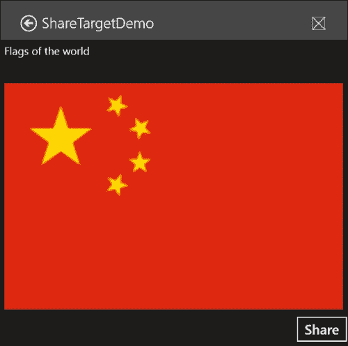
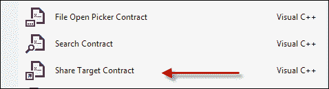
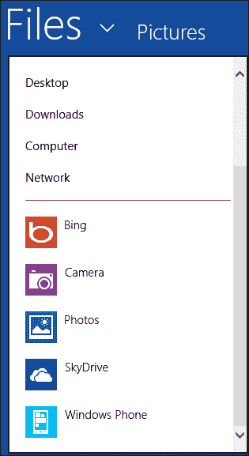
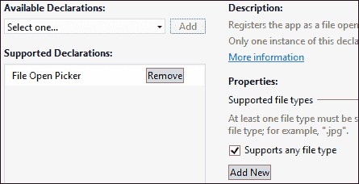
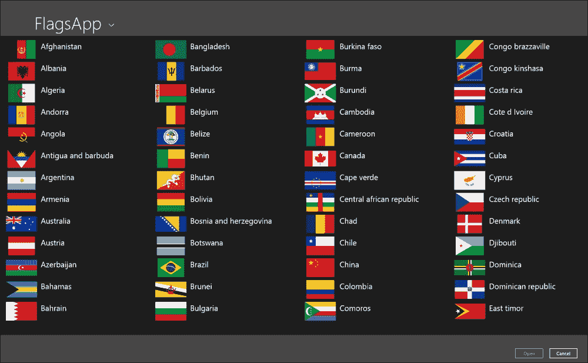

# 八、契约和扩展

Windows 应用商店应用在称为**AppContainer**的紧密沙箱中运行。 此容器不允许应用与计算机上的其他应用直接通信(如 Win32 内核对象句柄和共享内存)。 这在某种程度上是有道理的，因为应用不能对其从应用商店安装的计算环境做出任何假设，除了应用所请求的 CPU 架构和功能。 例如，没有办法确定某个应用是否存在，即使有办法，也没有好的方法确保它可以与这个应用对话。

取而代之的是，Windows 定义了一套应用到应用通信的契约。 这类契约允许应用实现某些功能，而无需知道其他应用将使用它。 这些契约定义得很好，在操作系统的帮助下建立必要的连接，它们允许应用间接通信。 在本章中，我们将研究一些常见的契约。

应用还可以向操作系统提供的某些功能提供“插件”。 这些“插件”被称为扩展，我们将看看其中之一，设置扩展。

# 功能

Windows 应用商店应用不能与其他应用直接通信，但系统本身怎么办？ 文件、文件夹或设备怎么办？ 事实证明，在默认情况下，这些也是受限制的，并且必须在应用安装时由用户授予权限。

应用必须声明 Windows 定义的所有预期系统使用情况，这是用户必须同意的。 这些是**功能**，是应用清单的一部分。 Visual Studio 在其清单视图中提供了功能的图形视图，我们已经在前面的章节中使用过该视图：


该图显示了当前支持的所有功能。 默认情况下，只启用了一项功能：发出出站网络呼叫的功能。

访问用户的“我的”库(文档、图片、视频和音乐)必须明确请求，否则访问时将抛出“拒绝访问”异常；文档库还要求应用指定它接受的文件类型。

设备访问自然是一个问题，表现为**麦克风**、**网络摄像头**、**位置**和**接近**等功能。

请注意，没有任何功能可以授予应用对 Windows 系统文件夹(如`Program Files`、`System32`等)的访问权限；这完全超出了 Windows 应用商店应用的范围--应该如此。 任何应用都不应该需要如此高的特权访问权限。

# 契约

契约是 Windows 为应用到应用通信定义的；它是应用之间的一种协议，由操作系统调解，允许应用间接通信。 让我们来看看两个常见的契约示例。

## 股份契约

**共享契约**在作为**共享源**(有东西要共享)的应用和作为**共享目标**应用(想要对共享数据做一些事情)的应用之间操作。 应用可以是共享源、共享目标或两者兼而有之。

分享通常是通过使用分享魔咒来发起的。 当从共享源应用激活时，Windows 会提供一个可能的目标应用列表-实现共享目标协定并接受至少一个源提供的数据类型的所有已安装应用。 让我们看看如何创建一个共享源和一个共享目标。

### 共享源

成为共享源比成为共享目标更容易。 共享源需要通知 Windows 它可以提供的任何潜在数据。 共享所需的大部分工作驻留在`Windows::ApplicationMode::DataTransfer`名称空间中。

应用或主页初始化时，共享源必须注册`DataTransferManager::DataRequested`事件，代码如下：

```cpp
DataTransferManager::GetForCurrentView()->DataRequested += 
   ref new TypedEventHandler<DataTransferManager^, 
   DataRequestedEventArgs^>( this, &MainPage::OnDataRequested);
```

代码将`OnDataRequested`私有方法注册为处理程序，该处理程序由管理共享操作的共享代理 Windows 组件调用。 调用该方法时，应用需要提供数据。 这是一款显示世界国旗的简单应用：


此应用希望共享选定的国旗图像和一些文本，即选定国家的名称。 `OnDataRequested`方法实现如下：

```cpp
void MainPage::OnDataRequested(DataTransferManager^ dtm, 
   DataRequestedEventArgs^ e) {
  int index = _gridFlags->SelectedIndex;
  if(index < 0) return;

  auto data = e->Request->Data;
  auto flag = (CountryInfo^)_gridFlags->SelectedItem;

  data->SetText(ref new String(L"Flag of ") + flag->CountryName);
  auto bitmap = RandomAccessStreamReference::CreateFromUri(
      flag->FlagUri);
  data->SetBitmap(bitmap);
  data->Properties->Title = "Flags of the world";
  data->Properties->Thumbnail = bitmap;
}
```

该方法做的第一件事是检查是否选择了任何标志(`_gridFlags`是保存所有标志的`GridView`)。 如果没有选择任何内容，则方法简单地退出。 如果用户在未选择任何内容的情况下尝试共享，Windows 会显示一条消息，**当前没有要共享的内容**。

### 备注

可以设置另一个文本行，以向用户指明共享不可用的确切原因。 下面是一个例子：

```cpp
if(index < 0) {
   e->Request->FailWithDisplayText(   
     "Please select a flag to share.");
   return;
}
```

`DataRequestedEventArgs`只有一个属性(`Request`，类型为`DataRequest`)，它有一个`Data`属性(一个`DataPackage`对象)，用于填充共享数据。 在前面的代码片段中，字符串是用`DataPackage::SetText`方法设置的。 接下来，使用`DataPackage::SetBitmap`设置图像(使用 helper`RandomAccessStreamReference`类)。

包还包含一系列可以设置的属性，其中`Title`是唯一必需的属性。 该示例将缩略图设置为相同的标志图像。

其他格式也可以被`DataPackage`接受，方法有`SetHtmlFormat`、`SetUri`、`SetRtf`和`SetStorageItems`(文件/文件夹共享)。

### 备注

另一种方法`SetDataProvider`允许应用注册一个委派，该委派将在实际需要数据时(而不是在此之前)被查询。 如果获取数据的成本很高，这可能会很有用，并且应该只在实际需要时才这样做；此外，它还提供了一种共享自定义数据的方法。

一旦方法完成，数据就可供共享目标使用。

### 备注

`DataRequest`有一个`GetDeferral`方法，它允许应用进行异步调用，而不需要共享代理在方法返回时考虑数据就绪(类似于我们在后台任务中看到的机制)。 调用`DataRequestDeferral::Complete`表示要共享的数据的实际就绪状态。

### 共享目标

成为共享目标比成为共享源更难。 其中一个原因是，当请求共享时，共享目标应用可能没有运行。 这意味着系统必须事先知道哪些应用能够成为共享目标，以及这些应用可以接收什么类型的数据。

成为共享目标的第一步是在应用清单中声明应用实际上是共享目标，并指定它愿意接受的数据类型。 以下是清单的屏幕截图，显示了一个愿意接收位图的应用：


共享目标应用必须至少支持一种数据格式(本例中为**位图**)或至少一种文件类型(如`.doc`)。

以下是选择标志时此应用在共享窗格中的显示方式：


名为**ShareTargetDemo**的应用是本章可下载代码的一部分，它是图片库的一个简单图像查看器。

一旦用户选择了我们的应用，如果还没有在内存中，它就会被激活(执行)。 系统调用虚拟方法`Application::OnShareTargetActivated`。 此方法指示应用正作为共享目标被激活，并且必须做出适当响应。

具体地说，应用必须为共享窗格提供一些用户界面，指示使用哪些数据，并提供一些按钮控件以允许用户实际确认共享。

下面是一个简单的共享页面 UI，它允许使用一些文本标签、一个图像和一个**共享**按钮：

```cpp
<StackPanel>
    <TextBlock Text="{Binding Text}" FontSize="20" Margin="10"/>
    <TextBlock Text="{Binding Description}" FontSize="15" 
          TextWrapping="Wrap" Margin="4" />
    <Image Margin="10" Source="{Binding Source}" />
    <Button Content="Share" FontSize="25" HorizontalAlignment="Right" 
          Click="OnShare"/>
</StackPanel>
```

绑定期望使用相关的`ViewModel`，其定义如下：

```cpp
[Windows::UI::Xaml::Data::BindableAttribute]
public ref class ShareViewModel sealed {
public:
  property Platform::String^ Text;
  property Windows::UI::Xaml::Media::ImageSource^ Source;
  property Platform::String^ Description;
};
```

在这种情况下，目标应用愿意接受图像。 `Image`元素将显示要接受的图像预览。 一旦用户点击**Share**按钮，则执行共享操作，并且认为整个共享操作完成。

`Application::OnShareTargetActivated`覆盖负责激活共享页面 UI：

```cpp
void App::OnShareTargetActivated(ShareTargetActivatedEventArgs^ e) {
  auto page = ref new SharePage();
  page->Activate(e);
}
```

`SharePage`是保存先前定义的共享 UI 的类。 `Activate`方法是应用定义的方法，它应该提取共享信息并适当地初始化 UI：

```cpp
void SharePage::Activate(ShareTargetActivatedEventArgs^ e) {
  _operation = e->ShareOperation;
  auto data = _operation->Data;
  auto share = ref new ShareViewModel();
  share->Text = data->Properties->Title;
  share->Description = data->Properties->Description;
  auto ref = data->Properties->Thumbnail;
  if(ref != nullptr) {
    create_task(ref->OpenReadAsync()).then(
         [share, this](IRandomAccessStream^ stm) {
      auto bmp = ref new BitmapImage();
      bmp->SetSource(stm);
      share->Source = bmp;
      DataContext = nullptr;
    // INotifyPropertyChanged is not implemented
      DataContext = share;
    });
  }
  DataContext = share;
  Window::Current->Content = this;
  Window::Current->Activate();
}
```

要做的第一件事是保存操作对象，以便在单击**Share**按钮时使用(`_operation`是位于 `Windows::ApplicationModel::DataTransfer::ShareTarget`名称空间中的`ShareOperation`类型的字段)。 共享数据本身在`ShareOperation::Data`属性中(一个`DataPackageView`对象，类似于共享源端的`DataPackage`对象，但它是该数据的只读视图)。

接下来，从数据对象中提取所需的信息，并将其放入`ShareViewModel`实例中。 如果提供了缩略图，则通过打开`RandomAccessStreamReference`对象并使用`BitmapImage`加载图像，然后将其放入`ShareViewModel`使用的`ImageSource`来提取缩略图。

最后，将`DataContext`设置为`ShareViewModel`实例，并在实际激活之前将页面设置为当前窗口内容。 下面是当共享源是 FLAGS 应用时的情况(在共享之前选择了中国的 FLAGS)：



现在，用户可以与共享窗格交互。 如果关闭，如果目标应用在共享激活之前没有运行，则不会发生任何操作，并且目标应用将被终止。 另一方面，如果用户决定进行实际的共享(通过单击**Share**按钮)，则应用需要执行适用于这种情况的任何操作。 例如，内置的 Mail 应用显示一个新的电子邮件 UI，它将共享数据(通常是文本)添加到可以发送的空电子邮件中。

我们的共享目标应用希望为当前用户将提供的图像保存到图片库。 下面是此应用的**Share**按钮的`Click`处理程序：

```cpp
void SharePage::OnShare(Object^ sender, RoutedEventArgs^ e) {
  if(_operation->Data->Contains(StandardDataFormats::Bitmap)) {
    auto op = _operation;
    create_task(_operation->Data->GetBitmapAsync()).then(
            [op](RandomAccessStreamReference^ sref) {
      return sref->OpenReadAsync();
    }).then([op](IRandomAccessStream^ stm) {
      return BitmapDecoder::CreateAsync(stm);
    }).then([op](BitmapDecoder^ decoder) {
  create_task(KnownFolders::PicturesLibrary->CreateFileAsync(
"SharedImage.jpg", CreationCollisionOption::GenerateUniqueName))
  .then([decoder](StorageFile^ file) {
    return file->OpenAsync(
             FileAccessMode::ReadWrite);}).then(
             [decoder](IRandomAccessStream^ stm) {
    return BitmapEncoder::CreateForTranscodingAsync(
             stm, decoder);
    }).then([](BitmapEncoder^ encoder) {
      return encoder->FlushAsync();
    }).then([op]() {
      op->ReportCompleted();
    });
     });
  }
}
```

代码可能看起来很复杂，因为它试图将提供的图像保存到一个文件中，而且因为大多数操作是异步的，所以涉及几个任务以确保操作以正确的顺序执行。 以下是已执行操作的简要介绍：

*   进行检查以确保数据包确实包括位图；在这种情况下这有点多余，因为应用已经在清单中指出位图是唯一受支持的数据。 不过，此检查在更复杂的情况下可能会有用。
*   位图是使用`DataPackageView::GetBitmapAsync`提取的，返回一个`RandomAccessStreamReference`对象。
*   `RandomAccessStreamReference::OpenReadAsync` is called to get the image data as an `IRandomAccessStream` object. This object is used to instantiate a `BitmapDecoder` object that is capable of decoding the image bits, by calling the static factory method `BitmapDecoder::CreateAsync`.

    ### 备注

    `BitmapDecoder`和`BitmapEncoder`类型位于`Windows::Graphics::Imaging`命名空间中。 创建`BitmapDecoder`的工厂方法会自动识别存储的位图格式。

*   获得结果解码器后，将在图片库中创建名为`SharedImage.jpg`的新文件(`KnownFolders::PicturesLibrary`返回`StorageFolder`)。 则打开该文件以进行读/写访问。
*   基于解码器信息(`BitmapEncoder::CreateForTranscodingAsync`)创建`BitmapEncoder`，并且通过调用`BitmapEncoder::FlushAsync`来完成图像保存。
*   最后要做的事情(对于任何共享操作)是通过调用`ShareOperation::ReportComplete`向系统指示操作已完成。

### 共享文件

文本、URL 和图像并不是应用可以共享的唯一内容。 通过从源共享应用调用`DataPackage::SetStorageItems`，也可以共享文件。 这些存储项目实际上可以是文件或文件夹(基于`IStorageItem`接口)。

在共享目标端，可以使用`DataPackageView::GetStorageItemsAsync`方法获得存储项，该方法返回`IStorageItem`个对象的只读集合(`IVectorView`)。 然后，该应用可以以适合该应用的任何方式访问这些文件/文件夹。

### 共享页面 UI 生成

Visual Studio 为共享目标操作提供默认页面模板：



这将添加用于共享的默认 UI，包括用于数据绑定的默认`ViewModel`。

### 备注

如果应用项目是使用“Blank App”模板创建的，Visual Studio 将添加一些存在于其他项目模板(如`SuspensionManager`、`LayoutAwarePage`等)中的帮助器类，因为它创建的共享页面派生自`LayoutAwarePage`。

## FileOpenPicker 契约

`FileOpenPicker`类用于从文件系统中挑选文件-这非常明显；不太明显的是，同样的`FileOpenPicker`类可以用于从支持`FileOpenPicker`协定的任何应用获取文件。 当应用调用`FileOpenPicker::PickSingleFileAsync`或`PickMultipleFilesAsync`时，启动运行图像`PickerHost.exe`的宿主进程，其中创建了`FileOpenPicker`。 除了文件夹和文件列表外，我们还可以看到应用：



列出的应用(**Bing**、**Camera**等)正在实现`FileOpenPicker`约定，因此可以联系它们来取回文件。 例如，SkyDrive 允许浏览用户的文件并选择要下载的一个或多个文件。 相机应用提供了一个用户界面，该用户界面允许在设备中连接或嵌入某些相机的情况下在此时此地拍摄照片，并将结果图像文件返回给调用应用。

### 实施 FileOpenPicker 契约

实现`FileOpenPicker`约定的第一步是在应用清单中声明这一点。 这是必需的，因为在从其他应用打开`FileOpenPicker`时，实现应用可能没有运行：



从图中可以看出，该应用可以支持任何文件类型或一组预定义的文件类型，如`.jpg`、`.doc`等。 这将根据调用应用使用`FileOpenPicker::FileTypeFilter`属性指定的文件类型，将被视为候选的应用限制在`FileOpenPicker`中列出。

如果用户实际选择了`FileOpenPicker`内的应用，则启动该应用(如果它尚未运行)，并调用`Application::OnFileOpenPickerActivated`虚拟方法。 这个想法类似于我们在本章前面讨论的共享目标场景。

`FileOpenPicker`窗口由应用名称(可由应用自定义)的页眉和带有**Open**和**Cancel**按钮的页脚组成。 中间部分是应用的特定选择 UI 所在的位置。

下面的示例使 Flags 应用成为`FileOpenPicker`提供程序。 这款应用应该提供旗帜的视图，允许在请求图像时进行选择。 旗帜选择的用户界面构建如下：

```cpp
<GridView ItemsSource="{Binding}" SelectionMode="Single" 
  x:Name="_gridFlags" Margin="10" 
     SelectionChanged="OnFlagSelected">
    <GridView.ItemTemplate>
        <DataTemplate>
            <Grid>
                <Grid.ColumnDefinitions>
                    <ColumnDefinition />
                    <ColumnDefinition Width="350" />
                </Grid.ColumnDefinitions>
                <Image Margin="10,0" Height="60" Width="100">
                    <Image.Source>
                        <BitmapImage UriSource="{Binding FlagUri}" />
                    </Image.Source>
                </Image>
                <TextBlock Text="{Binding CountryName}" FontSize="25" 
                Grid.Column="1" Margin="2" />
            </Grid>
        </DataTemplate>
    </GridView.ItemTemplate>
</GridView>
```

`GridView`托管标志集合，绑定到类型为`CountryInfo`的对象集合，定义如下：

```cpp
[Windows::UI::Xaml::Data::BindableAttribute]
public ref class CountryInfo sealed {
public:
  property Platform::String^ CountryName;
  property Windows::Foundation::Uri^ FlagUri;
};
```

`GridView`的`DataTemplate`使用这两个属性来显示国旗的图像及其对应的国家名称。

处理`GridView`事件`SelectionChanged`以提供`FileOpenPicker`文件以选择或取消选择。 在此之前，我们需要实现`Application::OnFileOpenPickerActivated`方法：

```cpp
void App::OnFileOpenPickerActivated(
   FileOpenPickerActivatedEventArgs^ e) {
  auto picker = ref new FileOpenPickerPage();
  picker->Activate(e);
}
```

代码只是实例化我们的自定义`FileOpenPickerPage`类，并调用该页面上名为`Activate`的特定于应用的方法，传递系统提供的激活信息。

前面的`Activate`方法作用很小：

```cpp
void FileOpenPickerPage::Activate(
   FileOpenPickerActivatedEventArgs^ e) {
  _filePickerArgs = e;
  OnNavigatedTo(nullptr);
  Window::Current->Content = this;
  Window::Current->Activate();
}
```

`FileOpenPickerActivatedEventArgs`保存在`_filePickerArgs`字段中，供以后实际选择或取消选择标志时使用。 对`OnNavigatedTo`的调用设置所有标志数据，新页面成为`Window`的内容并被激活。

`OnNavigatedTo`执行以下操作：

```cpp
void FileOpenPickerPage::OnNavigatedTo(NavigationEventArgs^ e) {
  auto countries = ref new Vector<CountryInfo^>;

  create_task(Package::Current
      ->InstalledLocation->GetFolderAsync("Assets\\Flags")).then(
   [](StorageFolder^ folder) {
    return folder->GetFilesAsync(
             CommonFileQuery::DefaultQuery);
  }).then([this, countries](IVectorView<StorageFile^>^ files) {
    std::for_each(begin(files), end(files), 
                               [countries](StorageFile^ file) {
      auto info = ref new CountryInfo;
      info->FlagUri = ref new Uri(
               L"ms-appx:///img/Flags/" + file->Name);
      info->CountryName = MainPage::FlagUriToName(
               file->Name->Data());
      countries->Append(info);
    });
    DataContext = countries;
  });
}
```

从应用安装位置(`ms-appx:`方案)检索标志的图像文件，并通过帮助器方法`FlagUriToName`(未示出)从图像`Uri`中提取国家名称；更新国家集合，最后将`DataContext`设置为该集合。

部署应用(使用完整版本或通过在 Visual Studio 菜单中选择**Build**|**Deploy Solution**)之后，我们可以通过启动另一个应用(如[第 1 章](01.html "Chapter 1. Introduction to Windows 8 Apps")，*Windows 8 应用简介*中演示的简单图像查看器)来执行基本的选取器测试。 单击**打开图像**按钮时，标志应用将显示在选取器的自定义应用中：


如果选择了 FLAGS 应用，则会显示以下内容：



此时，选择任何标志都不起作用-**打开**按钮保持禁用状态。 我们需要告诉`FileOpenPicker`选择了一个文件。 这由`GridView`的`SelectionChanged`事件处理：

```cpp
void FileOpenPickerPage::OnFlagSelected(Object^ sender, 
   SelectionChangedEventArgs^ e) {
  if(_gridFlags->SelectedIndex < 0 && _currentFile != nullptr) {
     _filePickerArgs->FileOpenPickerUI->RemoveFile(
        _currentFile);
     _currentFile = nullptr;
  }
  else {
     auto flag = (CountryInfo^)_gridFlags->SelectedItem;
     create_task(StorageFile::GetFileFromApplicationUriAsync(
         flag->FlagUri)).then([this, flag](
         StorageFile^ file) {
        AddFileResult result = 
_filePickerArgs->FileOpenPickerUI->AddFile(
         _currentFile = flag->CountryName, file);
       // can check result of adding the file
     });
  }
}
```

该类使用`_currentFile`字段跟踪当前选择的文件。 如果在`GridView`中没有选择，并且先前选择了一个文件，则调用`FileOpenPickerUI::RemoveFile`方法以指示应从选择中删除该文件；如果这是最后选择的文件，则`FileOpenPicker`禁用**打开**按钮。

如果选择了标志(`GridView::SelectedIndex`为零或更大)，则通过调用静态`StorageFile::GetFileFromApplicationUriAsync`方法获得该标志图像的文件，并将其传递到`FileOpenPickerUI::AddFile`。 结果(`AddFileResult`枚举)指示此操作是否成功。 如果打开`FileOpenPicker`时没有考虑到该文件类型，则此操作可能会失败。 例如，在未指定 GIF 文件扩展名的图像查看器中，添加操作将失败，因为所有标志图像都是 GIF 格式。

### 备注

这里提供的简单代码有点太简单了。 有一件事没有处理，那就是多项选择。 `GridView`被配置为仅使用单选，但这实际上应该根据`FileOpenPicker`的打开方式进行配置。 此信息在`FileOpenPickerUI::SelectionMode`属性(`Single`或`Multiple`)中可用。

如果按预期使用，`SelectionChanged`事件处理程序应使用`SelectionChangedEventArgs`对象的`AddedItems`和`RemovedItems`属性来管理选择和取消选择。

请注意，与共享目标一样，Visual Studio 为`FileOpenPicker`约定提供了一个页面模板。

## 调试契约

调试协定乍看起来可能很困难，因为应用当时可能没有运行，因此设置断点不会自动将 Visual Studio 的调试器附加到启动的实例。 这可以通过以下两种方法之一轻松处理：

*   从文件选取器中选择特定应用后，附加 Visual Studio 调试器。 这足以在选择或取消选择时命中断点。
*   像往常一样使用调试器运行应用，然后导航到另一个显示文件选取器的应用。 如果选择了该应用，任何断点都会照常命中。

# 扩展

扩展是应用和操作系统之间的一种契约。 扩展的实现类似于契约，通过覆盖某些方法并提供操作系统期望的某些功能来实现。 让我们来看一个例子。

### 备注

契约和扩展之间的区别在实践中并不重要。 它们都有一个重要的共同点：实现一些由 Windows 定义的功能，无论是应用到应用的通信，还是应用到 Windows 的通信。

## 设置扩展

“设置”咒语打开一个“设置”窗格；其下部显示标准的 Windows 自定义选项，如**音量**、**亮度**、**电源**等。 应用可以使用设置窗格的顶部添加特定于应用的设置。

### 备注

虽然“设置”是一份契约，而不是扩展，但我觉得它是一个扩展，因为它不涉及另一款应用--只涉及用户。

例如，我们将向 Flags 应用添加设置扩展名，以允许用户查看三种不同大小的标志。 首先要做的是向系统表明应用有兴趣支持设置扩展：

```cpp
SettingsPane::GetForCurrentView()->CommandsRequested += 
   ref new TypedEventHandler<SettingsPane^, 
   SettingsPaneCommandsRequestedEventArgs^>(
      this, &MainPage::OnCommandRequested);
```

此调用注册`SettingsPane::CommandRequested`事件，该事件在用户打开设置窗格且应用处于前台时引发。

当事件被激发时，我们可以添加要在设置窗格中显示的命令，如下所示：

```cpp
void MainPage::OnCommandRequested(SettingsPane^ pane, 
SettingsPaneCommandsRequestedEventArgs^ e) {
  auto commands = e->Request->ApplicationCommands;
  commands->Append(
      ref new SettingsCommand("small", "Small Flag Size", 
      ref new UICommandInvokedHandler(
      this, &MainPage::OnFlagSize)));
  commands->Append(
      ref new SettingsCommand("medium", "Medium Flag Size", 
      ref new UICommandInvokedHandler(
       this, &MainPage::OnFlagSize)));
  commands->Append(
      ref new SettingsCommand("large", "Large Flag Size", 
      ref new UICommandInvokedHandler(
         this, &MainPage::OnFlagSize)));
}
```

`SettingsCommand`构造函数接受特定于应用的命令 ID，该 ID 可用于消除通用处理程序中的命令的歧义。 第二个参数是要显示的文本，第三个参数是命令的处理程序。 在此示例中，所有命令都由相同的方法处理：

```cpp
void MainPage::OnFlagSize(IUICommand^ command) {
  auto id = safe_cast<String^>(command->Id);
  if(id == "small") {
    ImageWidth = 60; ImageHeight = 40;
  }
  else if(id == "medium") {
    ImageWidth = 100; ImageHeight = 60;
  }
  else {
    ImageWidth = 150; ImageHeight = 100;
  }
}
```

提供的`IUICommand`接口(在`Windows::UI::Popups`名称空间中)实际上是一个`SettingsCommand`对象，它是当前唯一实现该接口的类。 它包含命令的属性(`Id`、`Label`和`Invoked`-按该顺序是`SettingsCommand`的确切参数)。

`ImageWidth`和`ImageHeight`是绑定到驱动标志图像外观的`DataTemplate`的属性。 这是从 Flags 应用打开设置窗格时的外观：


### 备注

**权限**命令由系统提供，它列出了应用所需的功能(如互联网连接、网络摄像头、图片库等)。

# 其他契约和扩展

此处未显示的其他一些契约和扩展包括：

*   文件保存选取器-类似于文件打开选取器，但用于保存操作
*   搜索-为应用提供参与搜索的方式，提供用户可用于激活应用的结果
*   缓存文件更新程序-，用于跟踪文件更改(例如，SkyDrive 使用)
*   自动播放-允许在新设备插入计算机时列出应用
*   文件激活-允许应用注册为处理文件类型
*   游戏资源管理器-允许应用注册为游戏，为游戏考虑家庭安全功能提供了一条途径

# 摘要

契约和扩展为应用提供了更好地与 Windows 和其他应用集成的方法；例如，用户可以使用共享魅力来共享数据，而不管是哪种应用。 契约和扩展提供了用户体验的一致性，而不仅仅是编程模型。 这使得这个应用更有用；看起来似乎在这个应用上倾注了很多心思和心思。 一般来说，这会使应用更容易被使用--这是构建应用时的一个非常重要的目标。

在下一章(也是最后一章)中，我们将快速了解应用部署和 Windows 应用商店。