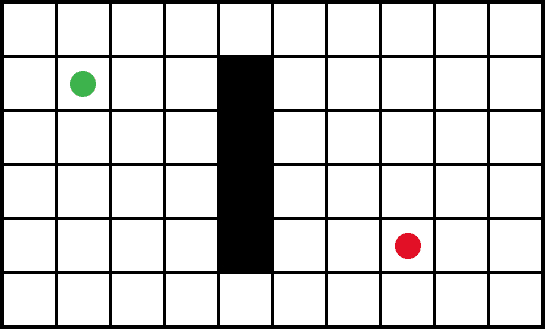
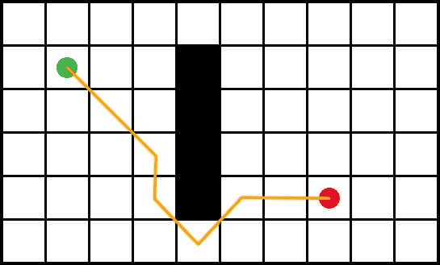
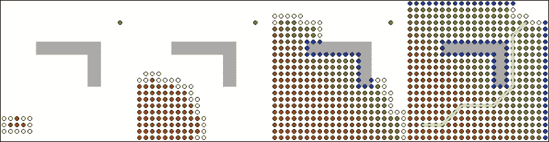
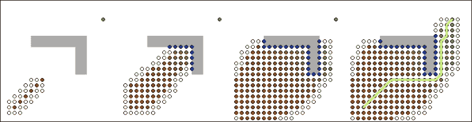
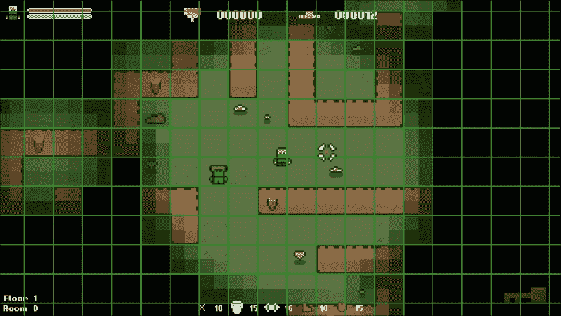
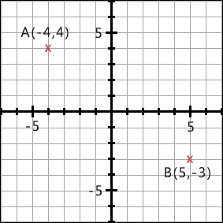
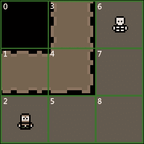
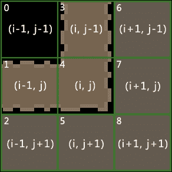
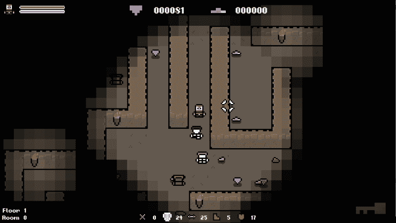
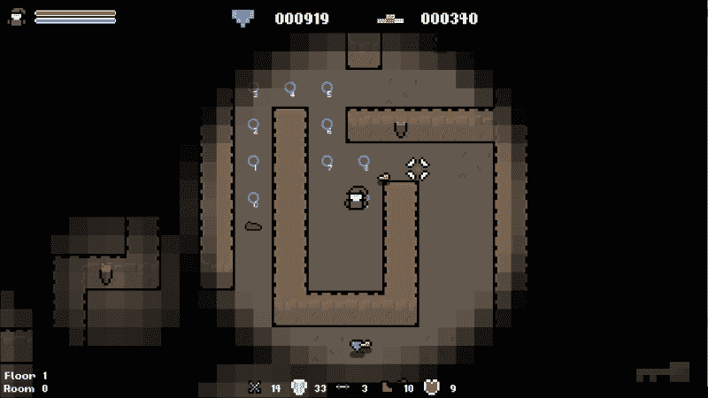

# 八、程序化的行为和机制

到目前为止，我们努力的重点一直是程序上创造资源。让我们利用所学到的知识进行扩展，并在程序上创建行为和游戏机制。而*程序化游戏行为*的创造可能听起来很奇特，你在玩的每一款游戏中都会碰到它; **人工智能** (**AI**)。游戏中的 AI 正在根据当前因素计算运行时的行为。这绝对算作程序生成!以前，在谈到大型主题时，我曾评论过，整本书都可以专门讨论这个主题。嗯，有了人工智能，你需要整个图书馆。对于我们的项目，我们将研究寻路; 允许敌人在我们的关卡中智能地追逐玩家。

我们将关注的另一个方面是机制的程序生成，特别是独特游戏目标的生成。可以应用此功能的一个很好的例子是游戏任务。您遇到过多少次这样的任务: *杀死该动物的 X 并将其毛皮带给我 Y？*大概一千左右吧!我们可以使用程序生成在这里添加一些变体。我们可以为地下城的每个房间/楼层生成不那么静态的随机目标。

在本章中，我们将介绍以下主题:

*   A * 寻路算法
*   生成独特的游戏任务

# 探路导论

我们将从解决最大的工作开始: 实现寻路算法，以便敌人可以在地图上智能地移动。在我们这样做之前，让我们来看看寻路算法作为一个整体，它们是做什么的，以及它们是如何做到的!这种情况将帮助您使前面的任务更加清晰，并向您展示我们拥有的丰富的选择。

## 什么是寻路算法？

**寻路算法**是一种计算从一个位置到另一个位置的最佳路径的算法。一个好的算法将考虑地形和其他几个因素，以确保运动是智能的，并且不会导致任何怪异的行为。还记得您上次玩游戏时，NPC 一直走进墙吗？这就是寻路错误产生的怪异行为。每次敌人绕着一个物体跑，让你进入游戏，这是这样一个算法的结果，他们是必不可少的创造一个具有挑战性的游戏，感觉很自然。

例如，在下图中，绿色圆圈是必须获得红色圆圈的 NPC:



在这个例子中，NPC 不能直接走向目标点，因为它会被困在墙上。相反，我们需要考虑墙壁并在其周围移动，如下图所示:



你可以看到这里的 NPC 智能地避开了墙，同时仍然尽可能高效地达到目标。这是寻路的本质，也是我们将在本章第一部分在游戏中实现的内容。让我们看看箭头后面发生了什么。

## Dijkstra 算法

与一样，有许多方法可以实现寻路，并且可以使用许多通用算法来实现。不同的算法具有不同的特性，尽管它们的成品可能看起来相似，但它们以不同的方式实现。游戏中最常见的寻路算法是**A *** ，是 Dijkstra 算法的扩展。

Dijkstra 的算法是由 Edsger Dijkstra 1959 年创建的。它是一种最佳优先搜索算法，也就是说，它首先以最小的值访问节点，以努力产生尽可能短的路径。从它的起点开始，它会辐射出去，依次检查每个节点，直到找到目标。正如您可以想象的那样，这既昂贵又可能需要很长时间才能找到端节点。

下图显示了如何找到最终节点，Dijkstra 的算法必须搜索大多数可用节点:



### A * 算法

A * 是 Dijkstra 算法的扩展。其目的是通过引入启发式方法来帮助指导搜索，从而减少查找端节点所需的时间。**启发式** (或启发式技术) 只是一种使用实用方法来解决问题的方法，该方法并不完美，但已足够。例如，试错是一种基本的启发式方法。虽然它并不完美，但您可以使用反复试验来解决问题。

就 A * 而言，我们的启发式方法考虑了已经走过的距离，以引导搜索到端节点。再看看前面显示 Dijkstra 算法的图。现在，请查看下图中由 * 解决的相同寻路问题:



很明显，A * 实现倾向于目标位置，因此很快找到了目标节点。另外，请查看每个算法必须查看多少个节点才能找到目标。Dijkstra 的算法实际上访问了每个节点，而在 A * 中，由于启发式，访问的节点明显减少了。

# A * 的细分

在之前，我们开始对自己的 A * 实现进行编码，将算法分解为其关键区域并对每个区域进行孤立的查看将对我们有好处。

## 将一个级别表示为节点

也许当我们看 A * 时，最重要的理解领域是算法将如何看待我们的水平。当我们看到图块时，寻路算法只看到节点。在这种情况下，节点仅表示实体可以在级别内移动到的有效位置。

节点的定义方式因游戏而异。例如，在我们的游戏中，关卡已经被描述为 2D 瓷砖阵列。因此，该网格中的每个图块将充当节点。但是，在 3D 游戏中，我们没有此网格，因此使用导航网格来创建可以表示为节点的曲面。

### 提示

Valve 在他们的开发者维基页面上有一篇关于导航网格的很棒的文章。因此，如果您想了解有关此主题的更多信息，请前往[https://developer.valvesoftware.com/wiki/ Navigation_Meshes](https://developer.valvesoftware.com/wiki/Navigation_Meshes)。

下图显示了如何将级别拆分为其核心的 2D 图块阵列。这些图块中的每一个都将用作 a * 算法中的节点。作为玩家移动到的有效位置的瓷砖 (地砖) 以绿色标记，而应避免的瓷砖 (墙壁，障碍物等) 以橙色标记。

生成的绿色是算法将尝试找到路径的节点的有效区域。



## 打开和关闭列表

确定节点后，它们将存储到以下两个列表中:

*   **打开列表**: 这个列表包含所有正在等待成为算法主题的节点。当我们进入一些代码时，这将更有意义，但是算法一次在一个节点上运行，打开列表就是这个的队列。
*   **关闭列表**: 此列表仅包含已通过算法的所有节点。将节点添加到此列表后，将忽略该节点，直到算法完成为止。

## H、G 和 F 成本

当阅读关于 A * 寻路算法时，你会遇到 3 个字母: H，G 和 F。这些是算法中的关键值，但它们不是很描述性。因此，让我们花点时间来看看每个值是什么，以及它在计算路径中所起的作用。

### H 值

H 值，通常称为启发式，是从当前位置到达目标节点的估计成本。级别中的每个节点都有一个 H 值，该值在寻路算法开始时计算，然后在以后的计算中使用。此值有助于引导搜索朝向目标节点，而不是在所有方向上均等地展开。这个值的计算方法取决于具体的实现方式，但一种常见的方法称为**曼哈顿距离**。我们将很快报道这到底是什么。

### G 值

G 值为从起始节点到此节点的当前移动成本。计算的方式再次是特定于实现的。但是，与 H 值一样，我们将使用的一种常见方法是曼哈顿距离。随着算法的迭代，每次在两个节点之间建立链接时，到目前为止，该单个移动的移动成本都会添加到整个路径的移动成本中。这样，随着路径的构建，每个节点都知道整个路径之前的时间。

### f 值

F 值只是 H 和 G 值的总和。该值用于确定算法下一步使用哪个节点。该值越低，估计的完整路径越低。因此，该算法对这些节点进行优先级排序。这种行为使 Dijkstra 的算法，因此 A * 成为最佳优先搜索算法。

## 曼哈顿距离

寻路算法的核心在于计算两点之间的距离。如前所述，这到底是如何实现特定的，但有一种常见且便宜的方法称为曼哈顿距离 (也称为出租车几何)，这就是我们将使用的方法。

正式定义为通过取笛卡尔坐标的绝对差之和计算的两点之间的距离。

这真是一口，但实际上很简单。笛卡尔坐标只是表达相对于两个固定垂直轴的位置的一种方式 (即使这看起来不熟悉，我们在学校都已经介绍过了)，绝对只是意味着我们忽略了数字的符号。

以看下图:



我们在图上有两个点: **A(-4,4)** 和**B(5，-3)** 。以下伪代码计算两者之间的曼哈顿距离:

```cpp
// Calculate the absolute difference in X.
diffX = abs(-4 – 5) = 9;

// Calculate the absolute difference in Y.
diffY = abs(4 - -3) = 7;

// Add them to get the Manhattan distance.
manhattenDistance = 9 + 7 = 16;
```

就这么简单!

## 育儿节点

寻路的另一个关键方面是育儿节点的概念。A * 通过建立一个节点链来工作。一旦找到目标节点，我们就通过这条链进行工作以获得最终路径。当识别出两个节点之间的最短路径时，节点 A 将被分配为节点 B 的父节点。

例如，下面的屏幕截图显示了骨架敌人找到了通往玩家的有效路径的情况:


让我们想象一下在两个节点之间找到路径的情况。例如，节点**6**和**7**之间的路径。然后，将第一个节点设置为第二个节点的父节点，在这种情况下，将节点**6**设置为节点**7**的父节点。这样，每个节点都知道它来自哪里。当算法找到目标节点时 (在我们的示例中，它是节点**2**)，我们可以使用此父级层次结构从目标节点到开始节点，从而为我们提供最终的最短路径。在这种情况下，骨架和玩家之间的最短路径是**6**、**7**、**5**、**2**。

## 伪算法

为了总结算法的分解，我们来看一个伪实现:

1.  如果可能的话，预先计算 H 值。
2.  将开始节点添加到打开列表中。
3.  在打开列表中找到 f 值最低的节点。
4.  从打开列表中删除该节点，并将其添加到关闭列表中。
5.  对于所有相邻节点，执行以下步骤:
    *   如果节点是目标节点，则将其父节点设置为当前节点并存储最终路径。
    *   如果节点在关闭列表中，请忽略它并转到步骤 3。
    *   如果节点不在关闭列表和打开列表中，则将其父节点设置为当前节点，并计算其 G 和 f 值。
    *   如果节点不在关闭列表中，但在打开列表中，请检查其与当前节点之间的路径是否比其当前路径更快。

这是对 a * 算法的简化。希望这种细分为其中一些步骤提供了背景。让我们把它编码起来!

# 编码 A * 寻路算法

随着对 A * 基础知识的理解，让我们开始在我们的游戏中实现它。这将允许敌人跟随我们的玩家，无论其拓扑结构如何。

对于像这样的复杂算法，对正在发生的事情进行可视化表示确实很有帮助。在任何合适的地方，我们将使用以下示例查看正在发生的事情的视觉表示:



## 图块数据类型

让我们从开始快速查看`Level.h`中定义的`Tile`结构。正如我们所看到的，一个节点包含相当多的值。在实现中，将充当节点的是级别图块。因此，节点所需的所有信息都以其类型定义:

```cpp
// The level tile/node type.
struct Tile {
    TILE type;          // The type of tile this is.
    int columnIndex;    // The column index of the tile.
    int rowIndex;       // The row index of the tile.
    sf::Sprite sprite;  // The tile sprite.
    int H;              // Heuristic / movement cost to goal.
    int G;              // Movement cost. (Total of entire path).
    int F;              // Estimated cost for full path. (G + H).
    Tile* parentNode;   // Node to reach this node.
};
```

在本章的其余部分，节点与图块同义。所以不要担心它们是否可以互换使用。但是，请记住，并非在每个 A * 实现中都如此，因为您用作节点的内容将取决于游戏。

## 创建支持功能

在我们实现算法本身之前，我们需要创建算法需要的一些支持函数和变量。请注意，这些是特定于实现的，不是 a * 算法的一部分。

### 级别类

我们需要做一些基础工作的第一类是`Level`类。我们将需要一个函数来重置节点/图块中的所有变量，因为我们需要在每次运行算法时都将这些值重置回其默认值。

在`Level.h`中添加以下函数声明:

```cpp
public:
/**
* Resets the A* data of all level tiles.
*/
void ResetNodes();
```

另外，在`Level.cpp`中添加以下定义:

```cpp
// Resets the A* data of all tiles.
void Level::ResetNodes()
{
    for (int i = 0; i < GRID_WIDTH; ++ i)
    {
        for (int j = 0; j < GRID_HEIGHT; ++ j)
        {
            m_grid[i][j].parentNode = nullptr;
            m_grid[i][j].H = 0;
            m_grid[i][j].G = 0;
            m_grid[i][j].F = 0;
        }
    }
}
```

您可以看到，我们在这里所做的一切是迭代水平网格中的每个图块，并重置我们将在 A * 计算中使用的所有变量。

### 敌人阶级

接下来，我们需要创建一个函数，该函数将在`Enemy`类中运行算法。在`Enemy.h`中添加以下函数声明:

```cpp
public:
/**
* Recalculates the target position of the enemy.
*/
void UpdatePathfinding(Level& level, sf::Vector2fplayerPosition);
```

您可以看到此功能引用了级别，主要玩家位置，并且是公开的。我们需要函数是公开的，这样我们就可以从主游戏类中调用它。这是为了提高效率，以后为什么会变得更清楚。我们将传递对关卡对象的引用，因为敌人将需要访问关卡信息，并且需要玩家位置来计算目标位置。

我们还需要在`Enemy.h`中添加以下变量:

```cpp
private:
/**
* The target positions of the enemy.
*/
std::vector<sf::Vector2f> m_targetPositions;

/**
* The current target of the enemy.
*/
sf::Vector2f m_currentTarget;
```

完成此工作后，我们可以在`Enemy.cpp`中添加`Enemy::UpdatePathFinding`的空函数定义:

```cpp
// Updates the target position of the enemy.
void Enemy::UpdatePathfinding(Level& level, sf::Vector2f playerPosition)
{
    // . . .
```

从这一点开始的所有代码都将附加到此函数中。有很多!

## 变量声明

函数中的第一个步骤将是我们将使用的所有变量的声明:

```cpp
    // Create all variables.
    std::vector<Tile*> openList;
    std::vector<Tile*> closedList;
    std::vector<Tile*> pathList;
    std::vector<Tile*>::iterator position;
    Tile* currentNode;
```

`openList`和`closedList`变量用于管理节点。`openList`变量中的节点正在等待检查，`closedList`变量中的节点已经被检查，从现在开始应该忽略。当我们在实现中遇到它们时，将详细解释这一点。`pathList`变量将所有节点存储在最终路径中。

位置变量是一个迭代器，它将用于从我们的向量中查找和删除值。最后，`currentNode`变量用于跟踪我们当前正在使用的节点。

下一步是重置所有节点。每次运行函数时，我们都需要节点具有默认值。为了实现这一点，我们将调用我们刚刚创建的`Level::ResetNodes`函数，如下所示:

```cpp
// Reset all nodes.
level.ResetNodes();
```

设置的最后一步将是确定开始和结束节点，标记我们正在寻找的路径的开始和结束。开始节点将是敌人的位置。结束节点，也就是我们的目标，是玩家的位置:

```cpp
// Store the start and goal nodes.
Tile* startNode = level.GetTile(m_position);
Tile* goalNode = level.GetTile(playerPosition);
```

`Level::GetTile`函数返回给定位置的图块，因此我们可以使用它来获取节点。一旦我们确定了这些，我们将执行快速检查，以确保它们不是相同的节点。如果它们是，它们之间没有有效的路径，我们可以简单地清除当前路径并退出函数，如下所示:

```cpp
// Check we have a valid path to find. If not we can just end the function as there's no path to find.
if (startNode == goalNode)
{
    // Clear the vector of target positions.
    m_targetPositions.clear();

    // Exit the function.
    return;
}
```

在这一点上，我们已经声明了我们将使用的所有变量，将所有节点重置为它们的默认值，并确定我们正在使用有效路径。是时候跳入算法的大部分了!

## 预先计算 H 值

我们的 A * 算法实现中的下一步是计算级别中每个节点的 H 值。请记住，H 值是从开始节点到目标节点的路径的估计成本。

我们将使用曼哈顿距离。因此，对于关卡中的每个图块，我们需要计算到目标节点的距离，如下所示:

```cpp
// Pre-compute our H cost (estimated cost to goal) for each node.
for (int i = 0; i < level.GetSize().x; ++ i)
{
    for (int j = 0; j < level.GetSize().y; ++ j)
    {
        int rowOffset, heightOffset;
        Tile* node = level.GetTile(i, j);

        heightOffset = abs(node->rowIndex - goalNode->rowIndex);
        rowOffset = abs(node->columnIndex - goalNode-> columnIndex);

        node->H = heightOffset + rowOffset;
    }
}
```

## 定义主循环

我们现在要定义算法实际发生的主循环，但是在这样做之前，我们需要快速将开始节点添加到开放节点列表中，如下所示:

```cpp
// Add the start node to the open list.
openList.push_back(startNode);
```

打开列表是算法留下要检查的所有节点的列表。虽然此列表中有值，但算法应该运行。因此，我们将定义此行为来创建主循环，如下所示:

```cpp
// While we have values to check in the open list.
while (!openList.empty())
{
```

算法的下一步是决定我们下一步要对哪个节点进行操作。您可能还记得 f 值用于此目的。打开列表包含所有等待检查的节点。所以我们需要迭代这个向量，找到 F (完整路径的估计成本) 值最低的节点:

```cpp
// Find the node in the open list with the lowest F value and mark it as current.
int lowestF = INT_MAX;

for (Tile* tile : openList)
{
    if (tile->F < lowestF)
    {
        lowestF = tile->F;
        currentNode = tile;
    }
}
```

这段代码非常简单。我们最初将`lowestF`设置为`INT_MAX`，这是一个包含`int`最大值的宏，因为我们可以确定没有 f 值会接近该值。当我们识别出 f 值较小的节点时，我们会更新`lowestF`值，并将该节点标记为需要在 next 上操作的节点。

一旦我们确定了 f 值最低的节点，我们将其从`openList`中删除，并将其添加到`closedList`向量中，以确保我们不再在同一节点上操作，如下所示:

```cpp
// Remove the current node from the open list and add it to the closed list.
position = std::find(openList.begin(), openList.end(), currentNode);
if (position != openList.end())
    openList.erase(position);

closedList.push_back(currentNode);
```

这就是迭代器变量发挥作用的地方。迭代器只是一个对象，具有遍历一系列元素的能力。要从向量中删除项目，我们调用`std::find()`，传递向量的开始、结束和我们要查找的值。如果找到该值，则`std::find()`将返回该元素的迭代器。如果找不到该值，它将返回一个引用虚数元素的迭代器，该迭代器将跟随向量中的最后一个元素。然后，我们在`openList`中调用擦除，传递这个迭代器值以获取正确的元素。

## 查找相邻节点

现在选择下一个节点并将其分配给`currentNode`变量，是时候识别所有相邻节点了。这是另一个将根据每个特定实现而有所不同的领域。

在我们的例子中，该级别被定义为 2D 网格。因此，我们很容易获得周围的节点:



从上面的图中可以看到，列和行的索引 (`i`和`j`) 在中间的磁贴周围的范围是从-1 到 1。我们可以用它来获取我们周围要检查的节点。我们只对有效的楼层节点感兴趣，所以当我们获取它们时，我们可以执行这些检查。

让我们在函数中实现这个，如下所示:

```cpp
// Find all valid adjacent nodes.
std::vector<Tile*> adjacentTiles;

Tile* node;

// Top.
node = level.GetTile(currentNode->columnIndex, currentNode-> rowIndex - 1);
if ((node != nullptr) && (level.IsFloor(*node)))
{
    adjacentTiles.push_back(level.GetTile(currentNode-> columnIndex, currentNode->rowIndex - 1));
}

// Right.
node = level.GetTile(currentNode->columnIndex + 1, currentNode-> rowIndex);
if ((node != nullptr) && (level.IsFloor(*node)))
{
    adjacentTiles.push_back(level.GetTile(currentNode->columnIndex + 1, currentNode->rowIndex));
}

// Bottom.
node = level.GetTile(currentNode->columnIndex, currentNode-> rowIndex + 1);
if ((node != nullptr) && (level.IsFloor(*node)))
{
    adjacentTiles.push_back(level.GetTile(currentNode-> columnIndex, currentNode->rowIndex + 1));
}

// Left.
node = level.GetTile(currentNode->columnIndex - 1, currentNode-> rowIndex);
if ((node != nullptr) && (level.IsFloor(*node)))
{
    adjacentTiles.push_back(level.GetTile(currentNode->columnIndex - 1, currentNode->rowIndex));
}
```

在这段代码中，我们得到了我们周围的 4 个节点，确保它们都是有效的，并且是地砖。只有这样，它们才被添加到需要检查的相邻节点列表中。确定了这些之后，我们现在需要在每个节点上循环。一个`for`循环将允许我们这样做:

```cpp
// For all adjacent nodes.
for (Tile* node : adjacentTiles)
{
```

当我们到达目标节点时，算法结束。因此，每次选择相邻节点时，我们都可以检查是否这样做。将目标节点存储在变量中，这是一个简单的检查:

```cpp
// If the node is our goal node.
if (node == goalNode)
{
```

由于我们通过最低的 f 值选择节点，因此第一次到达目标节点时，我们知道我们将走了最短的路径。在继续查找此路径之前，我们首先需要将目标节点的父节点作为当前节点:

```cpp
// Parent the goal node to current.
node->parentNode = currentNode;
```

接下来，我们必须构造一个从开始节点到目标节点组成路径的所有节点的列表。没有设置的方法来做到这一点，但我们将使用`while`语句。当节点具有父节点时，将节点添加到列表中，然后将节点设置为其父节点。让我们为此添加代码:

```cpp
// Store the current path.
while (node->parentNode != nullptr)
{
    pathList.push_back(node);
    node = node->parentNode;
}
```

通过这种方式，我们构建了从目标节点到开始节点的完整路径。请注意，结果路径是向后的，但我们稍后会解决这个问题!

现在，最后一步是退出主循环。我们目前嵌套在一个`while`循环和一个`for`循环中。要退出，我们需要清空打开列表并调用`break`。`break`组件将我们踢出`for`循环，并且打开列表现在为空，我们也退出`while`循环:

```cpp
    // Empty the open list and break out of our for loop.
    openList.clear();
    break;
}
else
{
```

现在完成了，我们找到了目标节点，存储了从开始到目标的节点路径，并退出了主循环。这都是找到目标节点的结果。我们现在需要把注意力转向没有找到目标节点的情况。

## 计算 G 和 F 成本

如果一个节点在关闭列表中，那么它已经成为算法的主题。检查了所有相邻节点，并计算了它们的 G 和 f 值。如果是这种情况，我们可以简单地忽略节点:

```cpp
// If the node is not in the closed list.
position = std::find(closedList.begin(), closedList.end(), node);
if (position == closedList.end())
{
```

在确保节点不在关闭列表中之后，我们接下来检查打开列表:

```cpp
// If the node is not in the open list.
position = std::find(openList.begin(), openList.end(), node);
if (position == openList.end())
{
```

与以前的检查不同，如果我们的节点在打开列表中，我们不会忽略它。如果节点不在打开列表中，那么这是算法第一次遇到它。如果是这种情况，我们需要执行以下操作:

1.  将节点添加到打开列表中。
2.  将`parent`设置为`currentNode` (这是检查 f 值时的最后一个节点)。
3.  计算其 G 值。
4.  计算其 f 值。

我们将从将其添加到打开列表并设置其父节点开始; 这些是快速简单的任务:

```cpp
// Add the node to the open list.
openList.push_back(node);

// Set the parent of the node to the current node.
node->parentNode = currentNode;
```

### 计算 G 和 F 成本

您可能还记得 G 成本是从开始节点到此节点的移动总成本。在我们的网格中，我们可以在所有四个方向上移动，我们不对角移动，因此每次移动都需要`10`。该值特定于实现，而不是算法。这是两个节点之间移动的成本，而`10`只是一个很好的值。

### 提示

我们使用对角线并不是为了更简单的演示。本章末尾的练习之一是添加对角线运动，我强烈建议您尝试一下!

由于我们知道节点之间的移动成本是`10`，所以我们现在需要将`currenNode`的 G 成本加到它上面，得出最终的值。`currentNode`的 G 成本是该路径远的成本，因此将最后的移动成本添加到其中，可以使新节点获得从起始节点到自身的路径的总成本:

```cpp
// Calculate G (total movement cost so far) cost.
node->G = currentNode->G + 10;
```

最后，我们需要计算节点的 F 成本，它只是它的 G 和 H 成本之和。我们刚刚计算了 G 成本，并在算法开始时预先计算了 H 成本。所需要的只是一个简单的补充:

```cpp
// Calculate the F (total movement cost + heuristic) cost.
node->F = node->G + node->H;
```

## 检查上级路径

算法的最后一步是我们检查节点是否已经在打开列表中的条件，它是。如果是这种情况，我们已经生成了它的 G 和 f 值。然而，我们现在需要检查它们是否是最低可能的值。

在下图中，节点**7**是节点**8**的父节点，节点**8**是节点**5**的父节点:


这导致节点**7**-**8**-**5**的移动成本为`30`。但是，这不是最短的路径。假设我们允许对角线移动，从**7**到**5**的移动成本为`14`。如果我们从路径上删除**8**，则总移动成本为`24`，低于其当前值 30。在这种情况下，我们将 7 作为**5**的父级，而不是**8**。由于我们不使用对角线运动，因此除非您自己添加，否则此确切示例将不适用。

但是，希望它表明我们正在寻找更好的路径，如下图所示:


我们可以在这里看到，节点**5**的移动成本较低，并且与**7**为基础。这创建了一条比前一条更短的对角线路径。

让我们在函数中附加一些代码以包含此行为:

```cpp
}
else
{
    // Check if this path is quicker that the other.
    int tempG = currentNode->G + 10;

    // Check if tempG is faster than the other. I.e, whether it's faster to go A->C->B that A->C.
    if (tempG < node->G)
    {
        // Re-parent node to this one.
        node->parentNode = currentNode;
    }
}}}}}
```

## 创建最终路径

A * 实现的最后部分是将节点列表变成敌人可以遵循的有效路径。在为 A * 实现做准备的工作中，我们在`Enemy`类中添加了以下变量:

```cpp
/**
* The target positions of the enemy.
*/
std::vector<sf::Vector2f> m_targetPositions;
```

这个向量将保存一个目标位置列表，我们将从最终路径中的节点获得这些位置。但是，在这样做之前，我们需要确保将其清除。这样做是为了每次运行寻路算法时，玩家都有一组新的坐标要移动到。让我们清除向量。同样，此代码仅附加到`Enemy::UpdatePathFinding`函数中，如下所示:

```cpp
// Clear the vector of target positions.
m_targetPositions.clear();
```

现在，要将图块转换为目标位置，我们将遍历最终节点的向量，获取其实际位置，并将其添加到`m_targetPositions`向量中，如下所示:

```cpp
// Store the node locations as the enemies target locations.
for (Tile* tile : pathList)
{
    m_targetPositions.push_back(level.GetActualTileLocation(tile-> columnIndex, tile->rowIndex));
}
```

还有一件我们需要做的最后一件事，这很容易被忽视。当我们找到目标节点并创建最终路径列表时，我们将它们从目标节点存储回开始节点。这意味着最终路径是向后的。`Enemy::UpdatePathFinding`函数的最后一步是反转`m_targetPositions`向量来修正这个，并添加最后的闭括号:

```cpp
// Store the node locations as the enemies target locations.
for (Tile* tile : pathList)
{
    m_targetPositions.push_back(level.GetActualTileLocation(tile-> columnIndex, tile->rowIndex));
}

// Reverse the target position as we read them from goal to origin and we need them the other way around.
std::reverse(m_targetPositions.begin(), m_targetPositions.end());

```

就这样!我们结束了。A * 算法完成。基础敌人类具有一个功能，该功能将创建目标位置向量，并以最快的路径将敌人带到玩家。下一步是使敌人能够走这条路!

### 提示

如果您想进一步探索寻路，请前往[https://qiao.github.io/PathFinding.js/visual/](https://qiao.github.io/PathFinding.js/visual/) 。这是一个奇妙的应用，可视化了一系列流行的寻路算法。

# 在游戏中实现 A *

现在，我们有了可以计算最短路径的函数，我们需要将这种行为纳入游戏。

## 使敌人能够走一条路

我们现在需要让敌人跟随寻路算法生成的目标位置向量。我们需要敌人不断地遵循这条道路，所以我们将覆盖其基本类别的`Update`函数，因为它在每个游戏的滴答声中被称为。这样做的代码相当简单; 如果向量中有一个位置，以固定的速度向它移动。当到达位置时，我们只需将其从向量中删除。当向量为空时，我们知道敌人已经达到了目标。

我们将从将函数声明添加到`Enemy.h`开始:

```cpp
public:
/**
 * Overrides the default Update function in Enemy
 */
void Update(float timeDelta) override;
```

现在我们可以添加代码来遵循路径。就像我们刚才说的，如果目标位置的向量中有一个值，以固定的速度向它移动。我们通过创建和归一化运动矢量来做到这一点。

### 提示

我们不会涵盖这个运动背后的数学。因此，如果您想了解更多信息，请查看[http://www.fundza.com/vectors/normalize/](http://www.fundza.com/vectors/normalize/) 的概述。

以下代码用于移动向量的创建和归一化:

```cpp
// Updates the enemy.
void Enemy::Update(float timeDelta)
{
    // Move towards current target location.
    if (!m_targetPositions.empty())
    {
        sf::Vector2f targetLocation = m_targetPositions.front();
        m_velocity = sf::Vector2f(targetLocation.x - m_position.x, targetLocation.y - m_position.y);

        if (abs(m_velocity.x) < 10.f && abs(m_velocity.y) < 10.f)
        {
            m_targetPositions.erase(m_targetPositions.begin());
        }
        else
        {
            float length = sqrt(m_velocity.x * m_velocity.x + m_velocity.y * m_velocity.y);
            m_velocity.x /= length;
            m_velocity.y /= length;

            m_position.x += m_velocity.x * (m_speed * timeDelta);
            m_position.y += m_velocity.y * (m_speed * timeDelta);

            m_sprite.setPosition(m_position);
        }
    }

    // Call character update.
    Entity::Update(timeDelta);
}
```

你还可以看到，在函数的最后我们调用`Entity::Update`。动画代码就在这个函数里。我们需要确保它仍然被调用!

## 调用寻路行为

将寻路纳入游戏的最后步骤是当我们想要生成一条新路径时调用`Enemy::UpdatePathFinding`函数。敌人会随着每次游戏更新而更新，但是我们不想经常更新路径。

尽管 A * 是一种有效的算法，但我们仍然希望尽可能少地调用它。只有当玩家移动到新的图块时，路径才会改变，所以在这种情况发生之前没有更新寻路的意义。为了实现这一目标，我们需要能够分辨出播放器在上次更新期间处于哪个瓦片上，以及播放器在此更新中处于哪个瓦片上。让我们将以下变量添加到`Game.h`，并确保在类初始化程序中给它一个默认值:

```cpp
/**
 * The last tile that the player was on.
 */
Tile* m_playerPreviousTile;
```

在`Game::Update`功能中，我们现在可以检查玩家是否已经移动到图块，如果是这种情况，请调用级别中所有敌人的`Enemy::UpdatePathFinding`功能，如下所示:

```cpp
// Check if the player has moved grid square.
Tile* playerCurrentTile = m_level.GetTile(playerPosition);

if (m_playerPreviousTile != playerCurrentTile)
{
    // Store the new tile.
    m_playerPreviousTile = playerCurrentTile;

    // Update path finding for all enemies if within range of the player.
    for (const auto& enemy : m_enemies)
    {
        if (DistanceBetweenPoints(enemy->GetPosition(), playerPosition) < 300.f)
            enemy->UpdatePathfinding(m_level, playerPosition);
    }
}
```

就这样!我们现在可以测试游戏了。我们应该看到敌人在我们周围的水平，而不是像静止的物体一样站立，如下面的屏幕截图所示:



## 查看我们的路径

我们有代码在工作，这很好，但是让我们添加一些调试代码，这样我们就可以看到敌人正在生成的路径。我不会详细介绍此代码，因为它只是为了演示的目的。它基本上只是在目标位置矢量的每个点绘制一个精灵。

在`Enemy.h`中，我们将声明以下变量和函数:

```cpp
public:
/**
 * Override the default draw function.
 */
void Draw(sf::RenderWindow& window, float timeDelta) override;

private:
/**
 * Debug sprite for path
 */
sf::Sprite m_pathSprite;

/**
 * Debug font for the path
 */
sf::Font m_font;

/**
 * Debug text for the path
 */
sf::Text m_text;
```

在`Enemy::Enemy`中，我们将设置调试精灵和字体，如下所示:

```cpp
// Set the sprite.
int textureID = TextureManager::AddTexture("../resources/spr_path.png");
m_pathSprite.setTexture(TextureManager::GetTexture(textureID));

// Set the sprite origin.
sf::Vector2u spriteSize = m_pathSprite.getTexture()->getSize();
m_pathSprite.setOrigin(sf::Vector2f(static_cast<float>(spriteSize.x / 2), static_cast<float>(spriteSize.y / 2)));

// Set the font.
m_font.loadFromFile("../resources/fonts/04B_03__.TTF");

// Set the text.
m_text.setFont(m_font);
m_text.setCharacterSize(12);
```

另外，我们将为新的 draw 函数添加一个名为`Enemy::Draw`的正文:

```cpp
// Override the default draw function.
void Enemy::Draw(sf::RenderWindow& window, float timeDelta)
{
    Object::Draw(window, timeDelta);

    // DEBUG Draw the current path
    for (int i = 0; i < m_targetPositions.size(); i++)
    {
        // draw the path sprite
        m_pathSprite.setPosition(m_targetPositions[i]);
        window.draw(m_pathSprite);

        // set the path index
        std::ostringstream ss;
        ss << i;
        std::string str(ss.str());
        m_text.setString(str);
        m_text.setPosition(m_targetPositions[i]);
        window.draw(m_text);
    }
}
```

这个代码将向我们展示敌人的 A * 算法找到的路径，帮助我们可视化 A * 算法在做什么。让我们运行游戏并看看。请记住，完成后需要删除此调试代码，因为它将对性能产生影响。下面的屏幕截图显示了我们敌人的路径:



# 程序生成的级别目标

我们将在本章中构建的最终系统是一个将生成随机水平目标的系统。在每个级别中，我们必须找到钥匙，找到出口，并杀死所有妨碍我们的敌人。让我们通过添加玩家也可以完成的随机目标来添加更多的游戏玩法和挑战。每次进入关卡时，我们都有可能为玩家提供一个可选任务，如果完成，将产生随机奖励。

## 变量和函数声明

创建这个系统的第一个步骤是声明我们需要的变量和函数。我们将在自己的函数中封装行为以生成目标。对于初学者，我们需要在`Game.h`中声明以下`private`函数:

```cpp
private:
/**
 * Generates a level goal.
 */
void GenerateLevelGoal();
```

考虑到我们想要生成的目标类型 (杀死敌人，收集黄金和收集宝石)，我们需要变量来保持这些值。让我们在`Game.h`中同时声明以下`private`变量:

```cpp
private:
/**
 * The value of gold remaining for the current goal.
 */
int m_goldGoal;

/**
 * The value of gems remaining for the current goal.
 */
int m_gemGoal;

/**
 * The number of kills remaining for the current goal.
 */
int m_killGoal;
```

最后，我们将希望能够判断我们是否有积极的目标，并将目标绘制到屏幕上。我们将声明一个布尔值来跟踪我们是否有一个目标，以及一个字符串对象来存储当前目标的描述:

```cpp
/**
 * A string describing the current level goal.
 */
sf::String m_goalString;

/**
 * A boolean denoting if a goal is currently active.
 */
bool m_activeGoal;
```

## 生成随机目标

现在我们可以生成随机目标。我们有三种类型可用，即黄金、宝石和敌人。因此，首先，我们需要选择要创建的目标。

让我们通过添加以下代码在`Game.cpp`中给`Game::GenerateLevelGoal`一个 body:

```cpp
// Generates a random level goal.
void Game::GenerateLevelGoal()
{
    std::ostringstream ss;

    // Reset our goal variables.
    m_killGoal = 0;
    m_goldGoal = 0;
    m_gemGoal = 0;

    // Choose which type of goal is to be generated.
    int goalType = rand() % 3;

    switch (goalType)
    {
        case 0:    // Kill X Enemies
        break;

        case 1:    // Collect X Gold
        break;

        case 2:    // Collect X Gems
        break;
    }
}
```

我们首先定义一个稍后将使用的 stream 对象，然后将目标变量重置为`0`。这样做是为了确保每次调用此函数时目标都重新开始。然后，我们在`0`和`2`之间生成一个数字，并在`switch`语句中使用它。

对于每种情况，我们都需要生成一个随机数作为目标值，并将其设置为适当的变量。我们还需要构造一个描述目标的字符串，并将其存储在`m_goalString`变量中，如下所示:

```cpp
switch (goalType)
{
case 0:        // Kill X Enemies
    m_killGoal = rand() % 6 + 5;

    // Create the string describing the goal.
    ss << "Current Goal: Kill " << m_killGoal << " enemies" << "!" << std::endl;
    break;

case 1:        // Collect X Gold
    m_goldGoal = rand() % 51 + 50;

    // Create the string describing the goal.
    ss << "Current Goal: Collect " << m_goldGoal << " gold" << "!" << std::endl;
    break;

case 2:        // Collect X Gems
    m_gemGoal = rand() % 6 + 5;

    // Create the string describing the goal.
    ss << "Current Goal: Collect " << m_gemGoal << " gems" << "!" << std::endl;
    break;
}

// Store our string.
m_goalString = ss.str();
```

有了这个完成，我们的目标就基本上创造了。我们现在需要通过将变量`m_activeGoal`设置为`true`来激活目标:

```cpp
    // Set the goal as active.
    m_activeGoal = true;
}
```

完整的函数看起来像这样:

```cpp
// Generates a random level goal.
void Game::GenerateLevelGoal()
{
    std::ostringstream ss;

    // Choose which type of goal is to be generated.
    int goalType = rand() % 3;

    switch (goalType)
    {
    case 0:        // Kill X Enemies
        m_killGoal = rand() % 6 + 5;

        // Create the string describing the goal.
        ss << "Current Goal: Kill " << m_killGoal << " enemies" << "!" << std::endl;
        break;

    case 1:        // Collect X Gold
        m_goldGoal = rand() % 51 + 50;

        // Create the string describing the goal.
        ss << "Current Goal: Collect " << m_goldGoal << " gold" << "!" << std::endl;
        break;

    case 2:        // Collect X Gems
        m_gemGoal = rand() % 6 + 5;

        // Create the string describing the goal.
        ss << "Current Goal: Collect " << m_gemGoal << " gems" << "!" << std::endl;
        break;
    }

// Store our string.
m_goalString = ss.str();

    // Set the goal as active.
    m_activeGoal = true;
}
```

当我们把注意力转向关卡时，我们将在下一章中正确地连接这个函数，但是现在，我们可以通过在`Game::Game`中调用它来测试它。添加以下调试代码，以便我们可以测试该功能:

```cpp
// DEBUG: Generate a level goal.
GenerateLevelGoal();
```

## 检查一个目标是否完成

我们现在可以在函数的调用下生成一个随机级别的目标。现在，我们需要将游戏玩法纳入这些目标，以便我们可以判断其中一个目标何时完成。每当我们处理与目标相关的动作时，我们都需要检查我们是否有积极的目标并做出相应的反应。

从击杀计数开始，当我们确定敌人已经被击杀时，我们检查我们是否有活动目标，如果是这种情况，我们递减`m_killGoal`变量，如下所示:

```cpp
// If the enemy is dead remove it.
if (enemy.IsDead())
{
    enemyIterator = m_enemies.erase(enemyIterator);

    // If we have an active goal decrement killGoal.
 if (m_activeGoal)
 {
 --m_killGoal;
 }
}
```

其他级别的目标也采取同样的方法。在目标拾取代码中，当我们拾取黄金或宝石时，我们将检查我们是否有一个活动级别的目标，如果这是的情况，我们递减适当的值，如下所示:

```cpp
switch (m_items[i]->GetType())
{
case GAME_OBJECT::GOLD:
{
    // cast the item to a gold type
    Gold& gold = dynamic_cast<Gold&>(*m_items[i]);

    . . .

    // Check if we have an active level goal.
 if (m_activeGoal)
 {
 m_goldGoal -= gold.GetGoldValue();
 }
}
break;

case GAME_OBJECT::GEM:
{
    // cast the item to a gem type
    Gem& gem = dynamic_cast<Gem&>(*m_items[i]);

    . . .

    // Check if we have an active level goal.
 if (m_activeGoal)
    {
 --m_gemGoal;
    }
}
break;

. . .
```

完成此操作后，游戏中的动作现在已连接到目标计数器。接下来，我们需要实际检查我们是否实现了目标。我们将把这段代码放在`Game::Update`的末尾，这样我们就可以确保所有其他操作都已执行。

检查我们是否实现了目标很简单。首先，我们检查我们是否有积极的目标。然后，我们检查所有计数器变量是否小于或等于`0`。如果这是的情况，那么我们知道我们已经将适当的计数器减至`0`。通过这种方法，其他值将下降到负值，但我们不会收集足够的战利品，这将是一个问题。让我们在`Game::Update`的末尾添加这个代码:

```cpp
// Check if we have completed an active goal.
if (m_activeGoal)
{
    if ((m_gemGoal <= 0) &&
        (m_goldGoal <= 0) &&
        (m_killGoal <= 0))
    {
        m_scoreTotal += std::rand() % 1001 + 1000;
        m_activeGoal = false;
    }
}
```

有了这个完成，大多数目标系统就建立了。你可以看到，如果我们确定一个目标是活动的，并且所有计数器都是 0 或更低，我们奖励玩家。我们还将`m_activeGoal`变量设置为`false`，以表明目标已经实现。

## 在屏幕上绘制目标

现在的最后步骤是在屏幕上绘制我们的目标!我们有一个`bool`变量，表示当我们有一个活动目标时，当我们生成该目标时，我们将其描述符存储在字符串变量中。绘制它就像调用`Game::DrawText`并传递描述一样简单，但是只有当`m_activeGoal`变量为`true`时，我们才会这样做。

是时候通过在`Game::Draw`中添加以下内容来完成此系统了:

```cpp
// Draw the level goal if active.
if (m_activeGoal)
{
    DrawString(m_goalString, sf::Vector2f(m_window.getSize().x / 2, m_window.getSize().y - 75), 30);
}
```

现在，如果你运行游戏，你会看到每次都显示一个独特的目标:


我们可以在这里称之为一天，但我们可以做得更好!由于定义级别目标的字符串只存储一次，所以当我们创建它时，它不会在我们努力实现它时自行更新。让我们解决这个问题!如果我们跳回`Game::Update`并找到我们检查是否达到目标的位置，我们可以在此处进行一些修改以实现此目的。

目前，我们检查我们是否实现了主动目标，但只有在实现了目标的情况下，我们才会做一些事情。这是我们更新字符串的机会。我们要做的就是确定设置了哪种类型的目标，我们可以通过检查目标变量的值来完成，并以与在`Game::GenerateLevelGoal`中相同的方式重建字符串:

```cpp
// Check if we have completed an active goal.
if (m_activeGoal)
{
    if ((m_gemGoal <= 0) &&
        (m_goldGoal <= 0) &&
        (m_killGoal <= 0))
    {
        m_scoreTotal += std::rand() % 1001 + 1000;
        m_activeGoal = false;
    }
    else
    {
        std::ostringstream ss;

        if (m_goldGoal > 0)
            ss << "Current Goal: Collect " << m_goldGoal << " gold" << "!" << std::endl;
        else if (m_gemGoal > 0)
            ss << "Current Goal: Collect " << m_gemGoal << " gem" << "!" << std::endl;
        else if (m_killGoal > 0)
            ss << "Current Goal: Kill " << m_killGoal << " enemies" << "!" << std::endl;

        m_goalString = ss.str();
    }
}
```

现在，当我们有一个活动目标时，屏幕上的字符串会随着我们的努力而更新!

# 练习

为了帮助你测试你对本章内容的了解，这里有一些你应该做的练习。对于本书的其余部分来说，它们不是必须的，但是对它们进行研究将帮助您评估所涵盖材料中的优势和劣势:

1.  在计算寻路时，我们目前不允许对角线移动。更新算法，以便现在允许这样做。为了让你开始，在计算 G 成本时，你需要确定我们是斜向移动还是直线移动。
2.  目前，敌人将在整个关卡中追逐我们。修改功能，使敌人只有在一定距离内才会追逐玩家。
3.  目前，我们的敌人以固定的速度移动，并且不考虑我们在前一章中生成的速度变量。在游戏中加入速度变量，以便敌人以正确的速度移动。

# 总结

在本章中，我们将努力扩展到程序行为和机制，而不是仅仅资源。具体来说，我们实现了一个 * 寻路算法，为敌人提供了一些智力和围绕我们的水平的自然运动，并创建了随机水平目标。希望这很好地证明了程序生成不仅限于资源; 它可以用于游戏的各个方面。

在下一章中，我们将实现 roguelike 游戏最具标志性的功能: 程序生成的关卡。到目前为止，我们一直在使用相同的固定级别，因此是时候开始按程序生成它们了!我们还将在级别之间创建一些差异，并实现我们刚刚创建的目标生成器!