# 九、用户界面——UI 和 UMG

在本章中，我们将介绍以下主题:

*   使用画布绘图
*   将 Slate 小部件添加到屏幕
*   为用户界面创建屏幕尺寸感知缩放
*   在游戏中显示和隐藏一张 UMG 元素
*   将函数调用附加到 Slate 事件
*   使用具有虚幻运动图形的数据绑定
*   用样式控制小部件外观
*   创建自定义`SWidget`/`UWidget`

# 简介

向玩家显示反馈是游戏设计中最重要的元素之一，这通常会在游戏中涉及某种 HUD 或至少菜单。

在以前的虚幻版本中，有简单的 HUD 支持，它允许您在屏幕上绘制简单的形状和文本。但是，它在美学方面受到一定的限制，因此，诸如**Scaleform**之类的解决方案在解决这些限制方面变得很普遍。Scaleform 利用 Adobe 的 Flash 文件格式来存储矢量图像和 UI 脚本。对于开发人员来说，这并非没有自己的缺点，尤其是成本-它是需要 (有时是昂贵的) 许可证的第三方产品。

结果，Epic 为虚幻 4 编辑器和游戏内 UI 框架开发了 Slate。Slate 是小部件 (UI 元素) 的集合，也是一个允许编辑器跨平台界面的框架。它也可以在游戏中用于绘制菜单和 hud 的小部件，例如滑块和按钮。

Slate 使用声明性语法来允许用户界面元素在本机 C 中的层次结构中的 xml 样式表示。它通过大量使用宏和运算符重载来实现这一目标。

也就是说，并不是每个人都想让他们的程序员设计游戏的 HUD。在虚幻 3 中使用 Scaleform 的一个显著优势是能够使用 Flash 可视化编辑器开发游戏 UIs 的视觉外观，因此视觉设计师不需要学习编程语言。然后，程序员可以分别插入逻辑和数据。例如，这与**Windows Presentation Framework** (**WPF**) 所支持的范例相同。

以类似的方式，虚幻提供**虚幻运动图形** (**UMG**)。UMG 是用于 Slate 小部件的可视化编辑器，可让您在视觉上设置样式，布局和动画用户界面。UI 小部件 (或控件，如果您来自 Win32 背景) 可以由蓝图代码 (写在 UMG 窗口的图形视图中) 或 C 控制其属性。本章主要涉及显示 UI 元素，创建小部件层次结构以及创建可以在 UMG 中进行样式化和使用的 base`SWidget`类。

# 使用画布绘图

**画布**是在虚幻 3 中实现的简单 HUD 的延续。虽然它在运输游戏中不太常用，主要被 Slate/UMG 取代，但使用起来很简单，尤其是当你想在屏幕上绘制文本或形状时。Canvas 绘图仍被用于调试和性能分析的控制台命令 (如`stat game`和其他`stat`命令) 广泛使用。请参阅[第 8 章](08.html#318PC1-c0ca69a0411046888a488e5085138121 "Chapter 8\. Integrating C++ and the Unreal Editor")，*集成 C 和虚幻编辑器，*创建自己的控制台命令的配方。

## 怎么做...

1.  打开您的`<Module>.build.cs`文件，然后取消注释/添加以下行:

    ```cpp
    PrivateDependencyModuleNames.AddRange(new string[] { "Slate", "SlateCore" });
    ```

2.  使用编辑器类向导创建一个名为`CustomHUDGameMode`的新`GameMode`。如果需要进行此操作，请参阅[第 4 章](04.html#1KEEU1-c0ca69a0411046888a488e5085138121 "Chapter 4\. Actors and Components")，*演员和组件，*。
3.  向类添加一个构造函数:

    ```cpp
    ACustomHUDGameMode();
    ```

4.  在构造函数实现中添加以下内容:

    ```cpp
    ACustomHUDGameMode::ACustomHUDGameMode()
    :AGameMode()
    {
      HUDClass = ACustomHUD::StaticClass();
    }
    ```

5.  再次使用向导创建一个名为`CustomHUD`的新 HUD 子类。
6.  将`override`关键字添加到以下函数中:

    ```cpp
    public:
    virtual void DrawHUD() override;
    ```

7.  现在实现功能:

    ```cpp
    voidACustomHUD::DrawHUD()
    {
      Super::DrawHUD();
      Canvas->DrawText(GEngine->GetSmallFont(), TEXT("Test string to be printed to screen"), 10, 10);
      FCanvasBoxItemProgressBar(FVector2D(5, 25), FVector2D(100, 5));
      Canvas->DrawItem(ProgressBar);
      DrawRect(FLinearColor::Blue, 5, 25, 100, 5);
    }
    ```

8.  **编译**你的代码，并启动编辑器。
9.  Within the editor, open the **World Settings** panel from the **Settings** drop-down menu:

    

10.  In the **World Settings** dialog, select `CustomHUDGameMode` from the list under **GameMode Override**:

    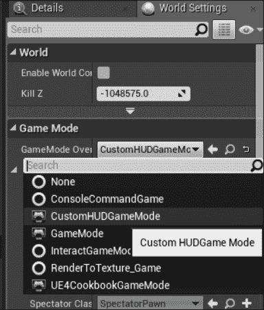

11.  Play and verify that your custom HUD is drawing to the screen:

    

## 它是如何工作的...

1.  这里的所有 UI 配方都将使用 Slate 进行绘制，因此我们需要在模块和 Slate 框架之间添加一个依赖关系，以便我们可以访问该模块中声明的类。
2.  放置游戏 HUD 的自定义画布绘制调用的最佳位置是在`AHUD`的子类中。
3.  但是，为了告诉引擎使用我们的自定义子类，我们需要创建一个新的`GameMode`，并指定我们的自定义类的类型。
4.  在我们自定义游戏模式的构造函数中，我们将新 HUD 类型的`UClass`分配给`HUDClass`变量。这个`UClass`在每个玩家控制器生成时被传递到它们，然后控制器负责它创建的`AHUD`实例。
5.  随着我们的自定义`GameMode`加载我们的自定义 HUD，我们需要实际创建所述自定义 HUD 类。
6.  `AHUD`定义了一个名为`DrawHUD()`的虚拟函数，它在每一帧中被调用，以允许我们将元素绘制到屏幕上。
7.  结果，我们覆盖该函数，并在实现中执行绘制。
8.  使用的第一种方法如下:

    ```cpp
    floatDrawText(constUFont* InFont, constFString&InText, float X, float Y, float XScale = 1.f, float YScale = 1.f, constFFontRenderInfo&RenderInfo = FFontRenderInfo());
    ```

9.  `DrawText`需要一个字体来绘制。引擎代码中`stat`和其他 HUD 绘图命令使用的默认字体实际上存储在`GEngine`类中，可以通过`GetSmallFont`函数访问，该函数返回`UFont`的一个实例作为指针。
10.  我们使用的其余参数是应渲染的实际文本，以及应绘制文本的像素偏移量。
11.  `DrawText`是一个允许您直接传入要显示的数据的函数。
12.  通用`DrawItem`函数是一个访问者实现，它允许您创建一个对象，该对象封装有关要绘制的对象的信息，并在多个绘制调用中重用该对象。
13.  在这个配方中，我们创建了一个可以用来表示进度条的元素。我们将所需的有关盒子宽度和高度的信息封装到一个`FCanvasBoxItem`中，然后将其传递给画布上的`DrawItem`函数。
14.  我们绘制的第三项是一个填充的矩形。此函数使用 HUD 类中定义的便利方法，而不是画布本身。填充的矩形与我们的`FCanvasBox`放置在同一位置，以便它可以表示进度条内的当前值。

# 将 Slate 小部件添加到屏幕

以前的配方使用`FCanvas`API 绘制到屏幕上。但是，`FCanvas`受到许多限制，例如，动画难以实现，并且在屏幕上绘制图形涉及创建纹理或材质。`FCanvas`也不以小部件或窗口控件的方式实现任何东西，使得数据输入或其他形式的用户输入比它需要的更复杂。此配方将向您展示如何开始使用 Slate 在屏幕上创建 HUD 元素，它提供了许多内置控件。

## 准备就绪

如果您还没有这样做，请将`Slate`和`SlateCore`添加到模块的依赖项中 (有关如何执行此操作，请参阅使用 Canvas 的配方*绘图)。*

## 怎么做...

1.  创建一个新的`PlayerController`子类，即`ACustomHUDPlayerController`。
2.  重写新子类中的`BeginPlay``virtual`方法:

    ```cpp
    public:
    virtual void BeginPlay() override;
    ```

3.  在子类的实现中添加以下代码用于已覆盖的`BeginPlay()`:

    ```cpp
    void ACustomHUDPlayerController::BeginPlay()
    {
      Super::BeginPlay();
      TSharedRef<SVerticalBox> widget = SNew(SVerticalBox)
      + SVerticalBox::Slot()
      .HAlign(HAlign_Center)
      .VAlign(VAlign_Center)
      [
        SNew(SButton)
        .Content()
        [
          SNew(STextBlock)
          .Text(FText::FromString(TEXT("Test button")))
        ]
      ];
      GEngine->GameViewport->AddViewportWidgetForPlayer(GetLocalPlayer(),widget, 1);
    }
    ```

4.  如果您现在尝试编译，则会收到一些有关未定义类的错误。这个是因为我们需要包含它们的头:

    ```cpp
    #include "SlateBasics.h"
    #include "SButton.h"
    #include "STextBlock.h"
    ```

5.  创建一个名为`SlateHUDGameMode`的新`GameMode`:
6.  在游戏模式内添加一个构造函数:

    ```cpp
    ASlateHUDGameMode();
    ```

7.  用以下代码实现构造函数:

    ```cpp
    ASlateHUDGameMode::ASlateHUDGameMode()
    :Super()
    {
      PlayerControllerClass = ACustomHUDPlayerController::StaticClass();
    }
    ```

8.  在实现文件中添加以下包含:

    ```cpp
    #include "CustomHudPlayerController.h"
    ```

9.  将包含添加到实现文件后，编译您的游戏。
10.  Within the Editor, open **World Settings** from the toolbar:

    

11.  Inside **World Settings**, override the level's Game Mode to be our `SlateHUDGameMode`.

    

12.  Play the level, and see your new UI displayed on the screen:

    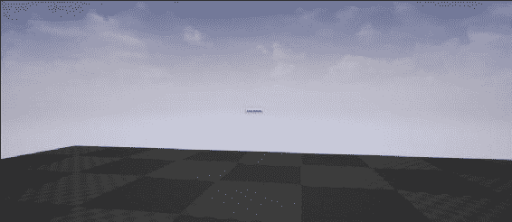

## 它是如何工作的...

1.  为了让我们在代码中引用 Slate 类或函数，我们的模块必须与`Slate`和`SlateCore`模块链接，因此我们将它们添加到模块依赖项中。
2.  我们需要在游戏运行时加载的一个类中实例化我们的 UI，所以对于这个食谱，我们使用我们的自定义`PlayerController`，在`BeginPlay`函数中，作为创建我们的 UI 的地方。
3.  在`BeginPlay`实现中，我们使用`SNew`函数创建了一个新的`SVerticalBox`。我们将小部件的插槽添加到我们的盒子中，并将该插槽设置为水平和垂直居中。
4.  在我们使用方括号访问的插槽中，我们创建了一个按钮，其中包含`Textblock`。
5.  在`Textblock`中，我们将`Text`属性设置为字符串文字值。
6.  随着现在创建的 UI，我们调用`AddViewportWidgetForPlayer`在本地播放器的屏幕上显示这个小部件。
7.  随着我们的自定义`PlayerController`准备就绪，我们现在需要创建一个自定义`GameMode`来指定它应该使用我们的新`PlayerController`。
8.  在游戏开始时加载自定义`PlayerController`，当调用`BeginPlay`时，将显示我们的 UI。
9.  在这个屏幕尺寸下，UI 非常小。有关如何根据游戏窗口的分辨率适当缩放它的信息，请参阅下一个食谱。

# 为用户界面创建屏幕尺寸感知缩放

如果你有遵循上一个配方，你会注意到，当你在编辑器中使用**播放时，加载的按钮异常小。**

这样做的原因是 UI 缩放，该系统允许您根据屏幕大小缩放用户界面。用户界面元素以像素表示，通常以绝对值表示 (按钮应为 10 像素高)。

这样做的问题是，如果您使用更高分辨率的面板，则 10 个像素可能会小得多，因为每个像素的尺寸都较小。

## 准备就绪

虚幻中的 UI 缩放系统允许您控制一个全局缩放修改器，该修改器将根据屏幕分辨率缩放屏幕上的所有控件。给定前面的示例，您可能希望调整按钮的大小，以便在较小的屏幕上查看 UI 时，其表观大小保持不变。此配方显示了两种不同的更改缩放速率的方法。

## 怎么做...

1.  创建自定义的`PlayerController`子类。称之为`ScalingUIPlayerController`。
2.  在类内部，覆盖`BeginPlay`:

    ```cpp
    virtual void BeginPlay() override;
    ```

3.  在该函数的实现中添加以下代码:

    ```cpp
    Super::BeginPlay();
    TSharedRef<SVerticalBox> widget = SNew(SVerticalBox)
    + SVerticalBox::Slot()
    .HAlign(HAlign_Center)
    .VAlign(VAlign_Center)
    [
      SNew(SButton)
      .Content()
      [
        SNew(STextBlock)
        .Text(FText::FromString(TEXT("Test button")))
      ]
    ];
    GEngine->GameViewport->AddViewportWidgetForPlayer(GetLocalPlayer(), widget, 1);
    ```

4.  创建一个名为`ScalingUIGameMode`的新的`GameMode`子类，并给它一个默认的构造函数:

    ```cpp
    ScalingUIGameMode();
    ```

5.  在默认构造函数中，将默认播放器控制器类设置为`ScalingUIPlayerController`:

    ```cpp
    AScalingUIGameMode::AScalingUIGameMode()
    :AGameMode()
    {
      PlayerControllerClass = ACustomHUDPlayerController::StaticClass();
    }
    ```

6.  This should give you a user interface like the one from the previous recipe. Note that the UI is very tiny if you use Play In Editor:

    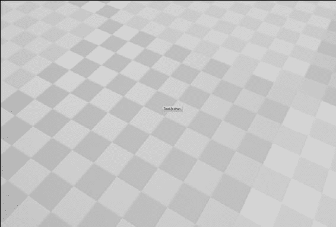

7.  要改变 UI 向下或向上的比例，我们需要改变缩放曲线。我们可以通过两种不同的方法来做到这一点。

### 编辑器内方法

1.  Launch Unreal, then open the **Project Settings** dialog through the **Edit** menu:

    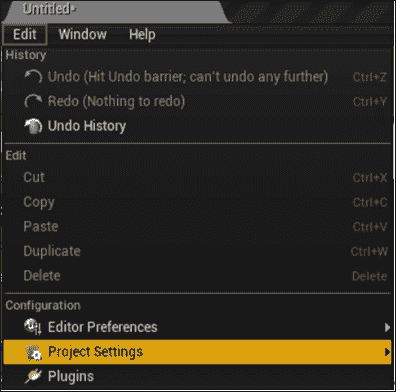

2.  Under the **User Interface** section, there is a curve that can be used to alter the UI scaling factor based on the short dimension of your screen:

    

3.  在图表上的第二个点或关键点上单击。
4.  Change its output value to 1.

    

### 配置文件方法

1.  Browse to your project directory, and look inside the `Config` folder:

    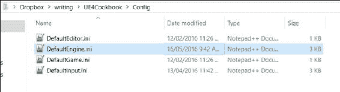

2.  在您选择的文本编辑器中打开`DefaultEngine.ini`。
3.  找到的`[/Script/Engine.UserInterfaceSettings]`部分:

    ```cpp
    [/Script/Engine.UserInterfaceSettings]
    RenderFocusRule=NavigationOnly
    DefaultCursor=None
    TextEditBeamCursor=None
    CrosshairsCursor=None
    GrabHandCursor=None
    GrabHandClosedCursor=None
    SlashedCircleCursor=None
    ApplicationScale=1.000000
    UIScaleRule=ShortestSide
    CustomScalingRuleClass=None
    UIScaleCurve=(EditorCurveData=(PreInfinityExtrap=RCCE_Constant,PostInfinityExtrap=RCCE_Constant,Keys=((Time=480.000000,Value=0.444000),(Time=720.000000,Value=1.000000),(Time=1080.000000,Value=1.000000),(Time=8640.000000,Value=8.000000)),DefaultValue=340282346638528859811704183484516925440.000000),ExternalCurve=None)
    ```

4.  在该部分中查找一个名为`UIScaleCurve`的键。
5.  在该键的值中，您会注意到一些`(Time=x,Value=y)`对。编辑第二对，使其`Time`值为`720.000000`，`Value`为`1.000000`。
6.  如果打开编辑器，请重新启动它。
7.  Start the Play In Editor preview to confirm that your UI now remains readable at the **PIE** screen's resolution (assuming you are using a 1080p monitor so that the PIE window is running at 720p or thereabouts):

    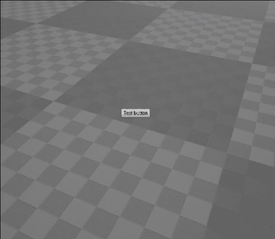

8.  如果您使用**新编辑器窗口**预览游戏，您还可以查看缩放的工作原理。
9.  为此，请单击工具栏上**Play**右侧的箭头。
10.  选择**新编辑器窗口**。
11.  在此窗口中，您可以使用控制台命令`r.setreswidthxheight`来更改分辨率，并观察由此产生的更改。

## 它是如何工作的...

1.  像往常一样，当我们想要使用自定义`PlayerController`时，我们需要一个自定义`GameMode`来指定要使用哪个`PlayerController`。
2.  我们同时创建一个自定义的`PlayerController`和`GameMode`，并在`PlayerController`的`BeginPlay`方法中放置一些`Slate`代码，以便绘制一些 UI 元素。
3.  由于主游戏视口通常在虚幻编辑器中很小，因此 UI 最初以缩小的方式显示。
4.  这是为了让游戏用户界面在较小分辨率的显示器上占据更少的空间，但可能会有副作用，如果窗口没有被拉伸以适应全屏，文本就很难阅读。
5.  虚幻存储应该在会话之间持续存在的配置数据，但不一定硬编码到配置文件内部的可执行文件中。
6.  Config 文件使用 Windows 软件常用的`.ini`文件格式的扩展版本。
7.  Config 文件使用以下语法存储数据:

    ```cpp
    [Section Name]
    Key=Value
    ```

8.  虚幻有一个`UserInterfaceSettings`类，上面有一个名为`UIScaleCurve`的属性。
9.  该`UPROPERTY`被标记为 config，因此虚幻将该值序列化到`.ini`文件。
10.  因此，它将`UIScale`数据存储在`Engine.UserInterfaceSettings`部分的`DefaultEngine.ini`文件中。
11.  数据使用文本格式存储，其中包含关键点列表。编辑`Time`、`Value`对改变或添加新的关键点到曲线。
12.  **项目设置**对话框是一个简单的前端，可以直接自己编辑`.ini`文件，对于设计人员来说，这是一种直观的编辑曲线的方法。但是，通过文本存储数据，程序员可以潜在地开发修改属性 (例如`UIScale`) 的构建工具，而不必重新编译他们的游戏。
13.  `Time`指的是输入值。在这种情况下，输入值是屏幕的较窄尺寸 (通常是高度)。
14.  `Value`是当屏幕的窄维度大约是`Time`字段中值的高度时，应用到 UI 的通用缩放因子。
15.  因此，要将 UI 设置为在 1280x720 分辨率下保持正常大小，请将时间/输入因子设置为 720，并将比例因子设置为 1。

## 另见

*   有关配置文件的更多信息，您可以参考 UE4 文档

# 在游戏中显示和隐藏一张 UMG 元素

所以我们已经讨论了如何在视口中添加一个小部件，这意味着它将在播放器的屏幕上呈现。

然而，如果我们想让 UI 元素根据其他因素切换，比如接近某些演员，或者玩家按住键，或者如果我们想要一个在指定时间后消失的 UI，该怎么办？

## 怎么做...

1.  创建一个名为`ToggleHUDGameMode`的新的`GameMode`类。
2.  覆盖`BeginPlay`和`EndPlay`。
3.  在`UPROPERTY`以下添加:

    ```cpp
    UPROPERTY()
    FTimerHandle HUDToggleTimer;
    ```

4.  最后添加此成员变量:

    ```cpp
    TSharedPtr<SVerticalBox> widget;
    ```

5.  在方法主体中使用以下代码实现`BeginPlay`:

    ```cpp
    void AToggleHUDGameMode::BeginPlay()
    {
      Super::BeginPlay();
      widget = SNew(SVerticalBox)
      + SVerticalBox::Slot()
      .HAlign(HAlign_Center)
      .VAlign(VAlign_Center)
      [
        SNew(SButton)
        .Content()
        [
          SNew(STextBlock)
          .Text(FText::FromString(TEXT("Test button")))
        ]
      ];
      GEngine->GameViewport->AddViewportWidgetForPlayer(GetWorld()->GetFirstLocalPlayerFromController(), widget.ToSharedRef(), 1);

      GetWorld()->GetTimerManager().SetTimer(HUDToggleTimer, FTimerDelegate::CreateLambda
      ([this] 
      {
        if (this->widget->GetVisibility().IsVisible())
        {
          this->widget->SetVisibility(EVisibility::Hidden);
        }
        else
        {
          this->widget->SetVisibility(EVisibility::Visible);
        }
      }), 5, true);
    }
    ```

6.  实施`EndPlay`:

    ```cpp
    void AToggleHUDGameMode::EndPlay(constEEndPlayReason::Type EndPlayReason)
    {
      Super::EndPlay(EndPlayReason);
      GetWorld->GetTimerManager().ClearTimer(HUDToggleTimer);
    }
    ```

7.  **编译**你的代码，并启动编辑器。
8.  Within the Editor, open **World Settings** from the toolbar:

    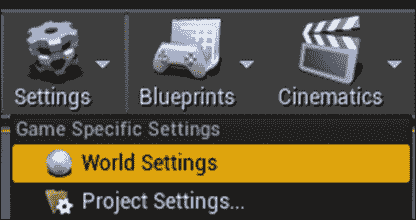

9.  Inside **World Settings**, override the level's **Game Mode** to be our `AToggleHUDGameMode`:

    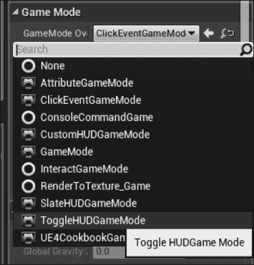

10.  播放关卡，并验证 UI 是否每 5 秒切换一次其可见性。

## 它是如何工作的...

与本章中的大多数其他食谱一样，为了方便起见，我们使用自定义`GameMode`类在播放器的视口上显示我们的单人用户界面:

1.  我们覆盖`BeginPlay`和`EndPlay`，这样我们就可以正确地处理计时器，这将为我们打开和关闭我们的 UI。
2.  为了做到这一点，我们需要将对计时器的引用存储为`UPROPERTY`，以确保它不会被垃圾收集。
3.  在`BeginPlay`内，我们使用`SNew`宏创建一个新的`VerticalBox`，并在其第一个插槽中放置一个按钮。
4.  按钮有`Content`，它可以是一些其他的小部件来在其中托管，如`SImage`或`STextBlock`。
5.  在这种情况下，我们在`Content`槽中放置一个`STextBlock`。文本块的内容是不相关的，只要它们足够长，我们能够正确地看到我们的按钮。
6.  初始化小部件层次结构后，我们将根小部件添加到播放器的视口中，以便它们可以看到它。
7.  现在，我们设置了一个计时器来切换小部件的可见性。我们正在使用计时器来简化此配方，而不是必须实现用户输入和输入绑定，但原理是相同的。
8.  为此，我们获得了对游戏世界及其相关计时器管理器的引用。
9.  有了计时器管理器，我们可以创建一个新的计时器。
10.  但是，我们需要实际指定计时器到期时要运行的代码。一种简单的方法是将`lambda`功能用于切换 hud 功能。
11.  Lambdas 是匿名函数。把它们想象成文字函数。
12.  要将`lambda`函数链接到计时器，我们需要创建一个`timer`委托。
13.  `FTimerDelegate::CreateLambda`函数旨在将`lambda`函数转换为委托，计时器可以在指定的时间间隔调用该委托。
14.  `lambda`需要从其包含对象 (我们的`GameMode`) 访问`this`指针，以便它可以更改我们创建的小部件实例的属性。
15.  为了给它所需的访问权限，我们用`[]`运算符开始我们的`lambda`声明，它将应该捕获到`lambda`中的变量包含在其中，并在其中访问。
16.  然后，花括号以与普通函数声明相同的方式包围函数体。
17.  在函数内部，我们检查我们的小部件是否可见。如果它是可见的，那么我们使用`SWidget::SetVisibility`隐藏它。
18.  如果小部件不可见，那么我们使用相同的函数调用将其打开。
19.  在调用`SetTimer`的其余部分中，我们指定调用计时器的间隔 (以秒为单位)，并将计时器设置为循环。
20.  我们需要注意的一件事是，我们的对象在两次计时器调用之间被破坏的可能性，如果引用我们的对象悬空，可能会导致崩溃。
21.  为了解决此问题，我们需要删除计时器。
22.  鉴于我们在`BeginPlay`期间设置了计时器，在`EndPlay`期间清除计时器是有意义的。
23.  每当`GameMode`结束播放或被破坏时，将调用`EndPlay`，因此我们可以安全地取消计时器在其实现过程中。
24.  将`GameMode`设置为默认游戏模式，在游戏开始时创建 UI，并且计时器委托每 5 秒执行一次，以在`true`和`false`之间切换小部件的可见性。
25.  当你关闭游戏时，`EndPlay`清除计时器参考，避免任何问题。

# 将函数调用附加到 Slate 事件

虽然创建按钮是所有的好，很好，目前，你添加到播放器的屏幕上的任何 UI 元素只是坐在那里，没有任何事情发生，即使用户点击它。我们目前没有任何附加到 Slate 元素的事件处理程序，因此诸如鼠标单击之类的事件实际上不会导致任何事情发生。

## 准备就绪

此配方向您展示了如何将函数附加到这些事件，以便我们可以在它们发生时运行自定义代码。

## 怎么做...

1.  创建一个名为`AClickEventGameMode`的新的`GameMode`子类。
2.  将以下`private`成员添加到类中:

    ```cpp
    private:
    TSharedPtr<SVerticalBox> Widget;
    TSharedPtr<STextBlock> ButtonLabel;
    ```

3.  添加以下`public`函数，注意`BeginPlay()`的覆盖:

    ```cpp
    public:
    virtual void BeginPlay() override;
    FReplyButtonClicked();
    ```

4.  在`.cpp`文件中，添加`BeginPlay`:

    ```cpp
    void AClickEventGameMode::BeginPlay()
    {
      Super::BeginPlay();
      Widget = SNew(SVerticalBox)
      + SVerticalBox::Slot()
      .HAlign(HAlign_Center)
      .VAlign(VAlign_Center)
      [
        SNew(SButton)
        .OnClicked(FOnClicked::CreateUObject(this, &AClickEventGameMode::ButtonClicked))
        .Content()
        [
          SAssignNew(ButtonLabel, STextBlock)
          .Text(FText::FromString(TEXT("Click me!")))
        ]
      ];
      GEngine->GameViewport->AddViewportWidgetForPlayer(GetWorld()->GetFirstLocalPlayerFromController(), Widget.ToSharedRef(), 1);
      GetWorld()->GetFirstPlayerController()->bShowMouseCursor = true;
      GEngine->GetFirstLocalPlayerController(GetWorld())->
      SetInputMode(FInputModeUIOnly().SetLockMouseToViewport(false).SetWidgetToFocus(Widget));
    }
    ```

    的实现
5.  还要为`ButtonClicked()`添加一个实现:

    ```cpp
    FReplyAClickEventGameMode::ButtonClicked()
    {
      ButtonLabel->SetText(FString(TEXT("Clicked!")));
      returnFReply::Handled();
    }
    ```

6.  **编译**你的代码，并启动编辑器。
7.  将**世界设置**中的游戏模式改写为`AClickEventGameMode`:
8.  在编辑器中预览，并验证 UI 是否显示从**更改的按钮，单击我!**到**点击!**当您使用鼠标光标单击它时。

## 它是如何工作的...

1.  与本章中的大多数食谱一样，我们使用`GameMode`来创建和显示我们的 UI，以最大程度地减少与您需要创建的食谱无关的类的数量。
2.  在我们的新游戏模式中，我们需要保留对我们创建的 Slate 小部件的引用，以便我们可以在创建它们后与它们进行交互。
3.  因此，我们在我们的`GameMode`中创建了两个共享指针作为成员数据-一个指向我们 UI 的整体父或根小部件，另一个指向我们按钮上的标签，因为我们将在运行时更改标签文本。
4.  我们覆盖`BeginPlay`，因为它是在游戏开始后创建我们的用户界面的方便的地方，我们将能够获得对我们玩家控制器的有效引用。
5.  我们还创建了一个名为`ButtonClicked`的函数。它返回`FReply`，一个`struct`指示事件是否已处理。`ButtonClicked`的函数签名由`FOnClicked`的签名决定，这是我们稍后将使用的委托。
6.  在我们实现的`BeginPlay`中，我们做的第一件事是调用我们正在重写的实现，以确保类被适当初始化。
7.  然后，像往常一样，我们使用我们的`SNew`函数来创建`VerticalBox`，并在其中添加一个居中的插槽。
8.  我们在该插槽中创建一个新的`Button`，并向按钮包含的`OnClicked`属性添加一个值。
9.  `OnClicked`是委托属性。这意味着，在某个事件发生的任何时候，`Button`都会广播`OnClicked`委托 (顾名思义，在这个例子中，当点击按钮时)。
10.  要订阅或监听委托，并被通知它引用的事件，我们需要为属性分配一个委托实例。
11.  We do that using the standard delegate functions such as `CreateUObject`, `CreateStatic`, or `CreateLambda`. Any of those will work—we can bind `UObject` member functions, static functions, lambdas, and other functions.

    ### 注意

    检查[第 5 章](05.html#22O7C1-c0ca69a0411046888a488e5085138121 "Chapter 5\. Handling Events and Delegates")，*处理事件和委托，*以了解有关委托的更多信息，以了解我们可以绑定到委托的其他类型的函数。

12.  `CreateUObject`期望有一个指向类实例的指针，以及一个指向该类中定义的要调用的成员函数的指针。
13.  函数必须具有可转换为委托签名的签名:

    ```cpp
    /** The delegate to execute when the button is clicked */
    FOnClickedOnClicked;
    ```

14.  从这里可以看出，`OnClicked`委托类型是`FOnClicked`-这就是为什么我们声明的`ButtonClicked`函数具有与`FOnClicked`相同的签名。
15.  通过传入指向此的指针以及指向要调用的函数的指针，当单击按钮时，引擎将在此特定对象实例上调用该函数。
16.  设置委托后，我们使用`Content()`函数，该函数返回对按钮应包含的任何内容的单个插槽的引用。
17.  然后，我们使用`SAssignNew`创建按钮的标签，使用`TextBlock`小部件。
18.  `SAssignNew`很重要，因为它允许我们使用 Slate 的声明式语法，并分配变量以指向层次结构中的特定子小部件。
19.  `SAssignNew`第一个参数是我们要存储小部件的变量，第二个参数是该小部件的类型。
20.  现在将`ButtonLabel`指向我们的按钮的`TextBlock`，我们可以将其`Text`属性设置为静态字符串。
21.  最后，我们使用`AddViewportWidgetForPlayer`将小部件添加到播放器的视口，作为参数，它期望`LocalPlayer`将小部件添加到小部件本身，以及一个深度值 (前面的值更高)。
22.  为了获得`LocalPlayer`实例，我们假设我们在没有分屏的情况下运行，因此，第一个玩家控制器将是唯一的一个，即玩家的控制器。`GetFirstLocalPlayerFromController`函数是一个方便函数，它简单地获取第一个播放器控制器，并返回其本地播放器对象。
23.  我们还需要聚焦小部件，以便玩家可以单击它，并显示一个光标，以便玩家知道他们的鼠标在屏幕上的位置。
24.  从上一步中我们知道，我们可以假设第一个本地播放器控制器是我们感兴趣的控制器，因此我们可以访问它并将其`ShowMouseCursor`变量更改为`true`。这将导致光标在屏幕上呈现。
25.  `SetInputMode`允许我们专注于一个小部件，以便玩家可以在其他与 UI 相关的功能 (例如将鼠标锁定到游戏的视口) 中与它进行交互。
26.  它使用一个`FInputMode`对象作为它的唯一参数，我们可以使用`builder`模式来构造我们希望包含的特定元素。
27.  `FInputModeUIOnly`类是一个`FInputMode`子类，它指定我们希望将所有输入事件重定向到 UI 层，而不是播放器控制器和其他输入处理。
28.  `builder`模式允许我们链接方法调用，以自定义我们的对象实例，然后将其作为参数发送到函数中。
29.  我们用`SetWidgetToFocus(Widget)`链接`SetLockMouseToViewport(false)`来指定玩家的鼠标可以离开游戏屏幕的边界，这将我们的顶级小部件指定为游戏应该引导玩家输入的小部件。
30.  最后，我们有了我们的事件处理程序`ButtonClicked`的实际实现。
31.  当由于我们的按钮被点击而运行该功能时，我们会更改按钮的标签以表明它已被点击。
32.  然后，我们需要向调用者返回一个`FReply`的实例，以让 UI 框架知道该事件已被处理，并且不继续传播该事件备份小部件层次结构。
33.  `FReply::Handled()`返回`FReply`设置以向框架指示这一点。
34.  我们可以使用`FReply::Unhandled()`，但这会告诉框架，click 事件实际上并不是我们感兴趣的事件，它应该寻找可能对事件感兴趣的其他对象。

# 使用数据绑定与虚幻运动图形

到目前为止，我们一直在为 UI 小部件的属性分配静态值。但是，如果我们希望对小部件内容或边框颜色等参数更具动感，该怎么办？我们可以使用一种称为数据绑定的原理来动态链接 UI 的属性与更广泛的程序中的变量。

例如，虚幻使用属性系统允许我们将属性的值绑定到函数的返回值。这意味着根据我们的意愿，更改这些变量将自动导致 UI 更改。

## 怎么做...

1.  创建一个名为`AAtributeGameMode`的新的`GameMode`子类。
2.  将以下`private`成员添加到类:

    ```cpp
    private:
    TSharedPtr<SVerticalBox> Widget;
    ```

3.  添加以下`public`函数，注意`BeginPlay()`的覆盖:

    ```cpp
    public:
    virtual void BeginPlay() override;
    FTextGetButtonLabel() const ;
    ```

4.  在`.cpp`文件中添加`BeginPlay`的实现:

    ```cpp
    voidAClickEventGameMode::BeginPlay()
    {
      Super::BeginPlay();
      Widget = SNew(SVerticalBox)
      + SVerticalBox::Slot()
      .HAlign(HAlign_Center)
      .VAlign(VAlign_Center)
      [
        SNew(SButton)
        .Content()
        [
          SNew(STextBlock)
          .Text( TAttribute<FText>::Create(TAttribute<FText>::FGetter::CreateUObject(this, &AAttributeGameMode::GetButtonLabel)))
        ]
      ];
      GEngine->GameViewport->AddViewportWidgetForPlayer(GetWorld()->GetFirstLocalPlayerFromController(), Widget.ToSharedRef(), 1);
    }
    ```

5.  另外，为`GetButtonLabel()`添加一个实现:

    ```cpp
    FTextAAttributeGameMode::GetButtonLabel() const
    {
      FVectorActorLocation = GetWorld()->GetFirstPlayerController()->GetPawn()->GetActorLocation();
      returnFText::FromString(FString::Printf(TEXT("%f, %f, %f"), ActorLocation.X, ActorLocation.Y, ActorLocation.Z));
    }
    ```

6.  **编译**您的代码，并启动编辑器。
7.  将**世界设置**中的游戏模式改写为`AAtributeGameMode`。
8.  请注意，在编辑器中的播放会话中，用户界面按钮上的值会随着播放器在场景中移动而变化。

## 它是如何工作的...

1.  就像本章中几乎所有其他食谱一样，我们需要做的第一件事是创建一个游戏模式，作为我们 UI 的方便主机。我们以与其他食谱相同的方式创建 UI，方法是将`Slate`代码放在我们游戏模式的`BeginPlay()`方法中。
2.  此食谱的有趣功能涉及我们如何设置按钮标签文本的值:

    ```cpp
    .Text( TAttribute<FText>::Create(TAttribute<FText>::FGetter::CreateUObject(this, &AAttributeGameMode::GetButtonLabel)))
    ```

3.  前面的语法异常冗长，但是实际上它的作用相对简单。我们将某些内容分配给`Text`属性，该属性的类型为`FText`。我们可以为这个属性分配`TAttribute<FText>`，每当 UI 想要确保`Text`的值是最新的时候，就会调用`TAttribute Get()`方法。
4.  要创建`TAttribute`，我们需要调用静态`TAttribute<VariableType>::Create()`方法。
5.  此函数期望有一些描述的委托。根据传递给`TAttribute::Create`的委托类型，`TAttribute::Get()`调用不同类型的函数来检索实际值。
6.  In the code for this recipe, we invoke a member function of `UObject`. This means we know we will be calling the `CreateUObject` function on some delegate type.

    ### 注意

    我们可以使用`CreateLambda`、`CreateStatic`或`CreateRaw`分别在 raw C 类上调用`lambda`、`static`或`member`函数。这将为我们提供属性的当前值。

7.  但是我们想要创建一个实例的委托类型是什么？因为我们在属性将与之关联的实际变量类型上模板化`TAttribute`类，所以我们需要一个也在变量类型上模板化的委托作为其返回值。
8.  也就是说，如果我们有`TAttribute<FText>`，连接到它的委托需要返回`FText`。
9.  我们在`TAttribute`内有以下代码:

    ```cpp
    template<typenameObjectType>
    classTAttribute
    {
      public:
      /**
       * Attribute 'getter' delegate
       *
       * ObjectTypeGetValue() const
       *
       * @return The attribute's value
       */
      DECLARE_DELEGATE_RetVal(ObjectType, FGetter);
      (…)
    }
    ```

10.  `FGetter`委托类型是在`TAttribute`类内部声明的，因此它的返回值可以在`TAttribute`模板的`ObjectType`参数上模板化。
11.  这意味着`TAttribute<Typename>::FGetter`自动定义一个具有正确返回类型`Typename`的委托。
12.  因此，我们需要为`TAttribute<FText>::FGetter`创建一个类型和签名的`UObject`绑定委托。
13.  一旦有了该委托，我们就可以在委托上调用`TAttribute::Create`，将委托的返回值链接到我们的`TextBlock`成员变量`Text`。
14.  通过我们的 UI 定义以及在`Text`属性、`TAttribute<FText>`和返回`FText`的委托之间的绑定，我们现在可以将 UI 添加到播放器的屏幕上，使其可见。
15.  每一帧，游戏引擎都会检查所有属性，以查看它们是否链接到`TAttributes`。
16.  如果存在连接，则调用`TAttribute``Get()`函数，调用委托，并返回委托的返回值，以便 Slate 可以将其存储在小部件的相应成员变量中。
17.  对于我们的演示过程，`GetButtonLabel`检索游戏世界中第一个玩家棋子的位置。
18.  然后，我们使用`FString::Printf`将位置数据格式化为人类可读的字符串，并将其包装在`FText`中，以便可以将其存储为`TextBlock`文本值。

# 用样式控制小部件外观

到目前为止，在这一章中，我们一直在创建使用默认视觉表示的 UI 元素。此食谱向您展示了如何在 C 中创建一种样式，该样式可以用作整个项目的常见外观。

## 怎么做...

1.  在您的项目中创建一个新的类头。命名文件`"CookbookStyle.h"`。
2.  在文件中添加以下代码:

    ```cpp
    #pragma once
    #include "SlateBasics.h"
    #include "SlateExtras.h"
    classFCookbookStyle
    {
      public:
      static void Initialize();
      static void Shutdown();
      static void ReloadTextures();
      staticconstISlateStyle& Get();
      staticFNameGetStyleSetName();
      private:
      staticTSharedRef<class FSlateStyleSet> Create();
      private:
      staticTSharedPtr<class FSlateStyleSet>CookbookStyleInstance;
    };
    ```

3.  为该类创建相应的实现 cpp 文件，并在其中添加以下代码:

    ```cpp
    #include "UE4Cookbook.h"
    #include "CookbookStyle.h"
    #include "SlateGameResources.h"
    TSharedPtr<FSlateStyleSet>FCookbookStyle::CookbookStyleInstance = NULL;
    voidFCookbookStyle::Initialize()
    {
      if (!CookbookStyleInstance.IsValid())
      {
        CookbookStyleInstance = Create();
        FSlateStyleRegistry::RegisterSlateStyle(*CookbookStyleInstance);
      }
    }

    voidFCookbookStyle::Shutdown()
    {
      FSlateStyleRegistry::UnRegisterSlateStyle(*CookbookStyleInstance);
      ensure(CookbookStyleInstance.IsUnique());
      CookbookStyleInstance.Reset();
    }
    FNameFCookbookStyle::GetStyleSetName()
    {
      staticFNameStyleSetName(TEXT("CookbookStyle"));
      returnStyleSetName;
    }
    #define IMAGE_BRUSH(RelativePath, ... ) FSlateImageBrush( FPaths::GameContentDir() / "Slate"/ RelativePath + TEXT(".png"), __VA_ARGS__ )
    #define BOX_BRUSH(RelativePath, ... ) FSlateBoxBrush( FPaths::GameContentDir() / "Slate"/ RelativePath + TEXT(".png"), __VA_ARGS__ )
    #define BORDER_BRUSH(RelativePath, ... ) FSlateBorderBrush( FPaths::GameContentDir() / "Slate"/ RelativePath + TEXT(".png"), __VA_ARGS__ )
    #define TTF_FONT(RelativePath, ... ) FSlateFontInfo( FPaths::GameContentDir() / "Slate"/ RelativePath + TEXT(".ttf"), __VA_ARGS__ )
    #define OTF_FONT(RelativePath, ... ) FSlateFontInfo( FPaths::GameContentDir() / "Slate"/ RelativePath + TEXT(".otf"), __VA_ARGS__ )

    TSharedRef<FSlateStyleSet>FCookbookStyle::Create()
    {
      TSharedRef<FSlateStyleSet>StyleRef = FSlateGameResources::New(FCookbookStyle::GetStyleSetName(), "/Game/Slate", "/Game/Slate");
      FSlateStyleSet& Style = StyleRef.Get();
      Style.Set("NormalButtonBrush", 
      FButtonStyle().
      SetNormal(BOX_BRUSH("Button", FVector2D(54,54),FMargin(14.0f/54.0f))));
      Style.Set("NormalButtonText",
      FTextBlockStyle(FTextBlockStyle::GetDefault())
      .SetColorAndOpacity(FSlateColor(FLinearColor(1,1,1,1))));
      returnStyleRef;
    }
    #undef IMAGE_BRUSH
    #undef BOX_BRUSH
    #undef BORDER_BRUSH
    #undef TTF_FONT
    #undef OTF_FONT

    voidFCookbookStyle::ReloadTextures()
    {
      FSlateApplication::Get().GetRenderer()->ReloadTextureResources();
    }
    constISlateStyle&FCookbookStyle::Get()
    {
      return *CookbookStyleInstance;
    }
    ```

4.  创建一个新游戏模式子类，`StyledHUDGameMode`，并在其声明中添加以下代码:

    ```cpp
    #pragma once
    #include "GameFramework/GameMode.h"
    #include "StyledHUDGameMode.generated.h"
    /**
     * 
     */
    UCLASS()
    class UE4COOKBOOK_API AStyledHUDGameMode : public AGameMode
    {
      GENERATED_BODY()
      TSharedPtr<SVerticalBox> Widget;
      public:
      virtual void BeginPlay() override;
    };
    ```

5.  同样，实施`GameMode`:

    ```cpp
    #include "UE4Cookbook.h"
    #include "CookbookStyle.h"
    #include "StyledHUDGameMode.h"
    voidAStyledHUDGameMode::BeginPlay()
    {
      Super::BeginPlay();
      Widget = SNew(SVerticalBox)
      + SVerticalBox::Slot()
      .HAlign(HAlign_Center)
      .VAlign(VAlign_Center)
      [
        SNew(SButton)
        .ButtonStyle(FCookbookStyle::Get(), "NormalButtonBrush")
        .ContentPadding(FMargin(16))
        .Content()
        [
          SNew(STextBlock)
          .TextStyle(FCookbookStyle::Get(), "NormalButtonText")
          .Text(FText::FromString("Styled Button"))
        ]
      ];
      GEngine->GameViewport->AddViewportWidgetForPlayer(GetWorld()->GetFirstLocalPlayerFromController(), Widget.ToSharedRef(), 1);
    }
    ```

6.  Lastly, create a 54x54 pixel png file with a border around it for our button. Save it to the `Content` | `Slate` folder with the name `Button.png`:

    

    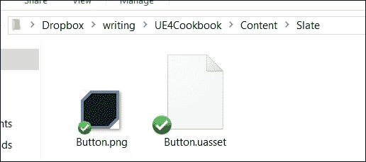

7.  最后，我们需要将我们游戏的模块设置为在加载时正确初始化样式。在你的游戏模块的实现文件中，确保它看起来像这样:

    ```cpp
    class UE4CookbookGameModule : public FDefaultGameModuleImpl
    {
      virtual void StartupModule() override
      {
        FCookbookStyle::Initialize();
      };
      virtual void ShutdownModule() override
      {
        FCookbookStyle::Shutdown();
      };
    };
    ```

8.  **编译**代码，并将您的游戏模式覆盖设置为新的游戏模式，就像我们在本章其他食谱中所做的那样。
9.  When you play the game, you will see that your custom border is around the button, and the text is white rather than black.

    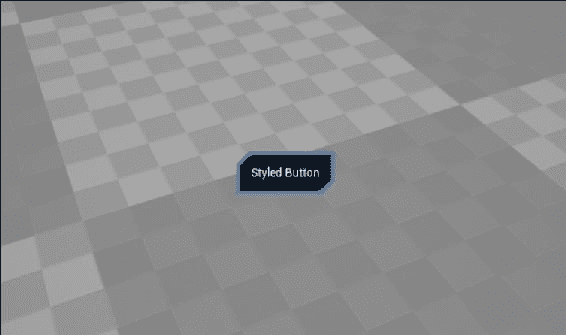

## 它是如何工作的...

1.  为了使我们创建可以在多个 Slate 小部件之间共享的样式，我们需要创建一个对象来包含样式并将其保留在作用域中。
2.  Epic 为此提供了`FSlateStyleSet`类。`FSlateStyleSet`包含许多样式，我们可以在 Slate 的声明性语法中对皮肤小部件进行访问。
3.  但是，将我们的`StyleSet`对象的多个副本分散在程序中是低效的。我们真的只需要其中一个物体。
4.  因为`FSlateStyleSet`本身不是一个单例，即只能有一个实例的对象，所以我们需要创建一个类来管理我们的`StyleSet`对象并确保我们只有单个实例。
5.  这就是我们拥有`FCookbookStyle`类的原因。
6.  它包含一个`Initialize()`函数，我们将在模块的启动代码中调用该函数。
7.  在`Initialize()`函数中，我们检查是否有`StyleSet`的实例。
8.  如果我们没有有效的实例，则调用 private`Create()`函数实例化一个。
9.  然后，我们在`FSlateStyleRegistry`类中注册样式。
10.  当我们的模块卸载时，我们将需要反转此注册过程，然后擦除指针，使其不会悬挂。
11.  我们现在有一个类的实例，在模块初始化期间通过调用`Create()`创建。
12.  您会注意到`Create`被许多形式相似的宏包装。
13.  这些宏在函数之前定义，在函数之后未定义。
14.  这些宏使我们更容易简化`Create`函数中所需的代码，无需为我们的样式可能想要使用的所有图像资源指定路径和扩展。
15.  在`Create`函数中，我们使用函数`FSlateGameResources::New()`创建一个新的`FSlateStyleSet`对象。
16.  `New()`需要样式的名称，以及我们要在此样式集中搜索的文件夹路径。
17.  这允许我们声明指向不同目录的多个样式集，但对图像使用相同的名称。它还允许我们仅通过切换到其他基本目录之一中的样式集来对整个 UI 进行外观或重新样式设置。
18.  `New()`返回一个共享引用对象，因此我们使用`Get()`函数检索实际的`FStyleSet`实例。
19.  有了这个参考，我们可以创建我们希望这个集合包含的样式。
20.  要将样式添加到集合中，我们使用`Set()`方法。
21.  Set 期望样式的名称，然后是样式对象。
22.  可以使用`builder`模式自定义样式对象。
23.  我们首先添加一种名为`"NormalButtonBrush"`的样式。名称可以是任意的。
24.  因为我们想使用这种样式来更改按钮的外观，所以第二个参数需要使用`FButtonStyle`。
25.  为了根据我们的要求自定义样式，我们使用 Slate builder 语法，链接我们需要在样式上设置属性的任何方法调用。
26.  对于此集合中的第一种样式，我们只需在未单击按钮或处于非默认状态时更改按钮的视觉外观。
27.  这意味着我们要更改按钮处于正常状态时使用的画笔，因此我们使用的功能是`SetNormal()`。
28.  Using the `BOX_BRUSH` macro, we tell Slate that we want to use `Button.png`, which is an image of 54x54 pixel size, and that we want to keep the 14 pixels in each corner unstretched for the purposes of nine-slice scaling.

    ### 提示

    有关九片缩放功能的更直观说明，请查看引擎源中的`SlateBoxBrush.h`。

29.  对于我们样式集中的第二个样式，我们创建一个名为`"NormalButtonText"`的样式。对于这种样式，我们不想更改样式中的默认值。我们只想更改一个属性。
30.  因此，我们访问默认文本样式，并使用复制构造函数对其进行克隆。
31.  使用默认样式的新副本，然后将文本的颜色更改为白色，首先创建 R = 1 G = 1 B = 1 a = 1 的线性颜色，然后将其转换为 Slate 颜色对象。
32.  使用我们的样式集配置了我们的两个新样式，然后我们可以将其返回到调用函数，即`Initialize`。
33.  `Initialize`存储我们的样式集引用，并消除了我们创建更多实例的需要。
34.  我们的 style container 类还有一个`Get()`函数，用于检索实际的`StyleSet`，以便在 Slate 中使用。
35.  因为在模块启动时已经调用了`Initialize()`，所以`Get()`只是返回在该函数中创建的`StyleSet`实例。
36.  在游戏模块中，我们添加了实际调用`Initialize`和`Shutdown`的代码。这样可以确保在加载模块时，我们始终可以有效地引用 Slate 样式。
37.  与往常一样，我们创建一个游戏模式作为 UI 的主机，并覆盖`BeginPlay`，以便在游戏开始时可以创建 UI。
38.  创建 UI 的语法与我们在以前的食谱中使用的语法完全相同-使用`SNew`创建`VerticalBox`，然后使用 Slate 的声明式语法用其他小部件填充该框。
39.  注意以下两行很重要:

    ```cpp
    .ButtonStyle(FCookbookStyle::Get(), "NormalButtonBrush")
    .TextStyle(FCookbookStyle::Get(), "NormalButtonText")
    ```

40.  前面的几行是我们的按钮的声明式语法的一部分，也是它的标签的文本。
41.  当我们使用`<Class>Style()`方法设置小部件的样式时，我们传入两个参数。
42.  第一个参数是我们实际的样式集，使用`FCookbookStyle::Get()`检索，第二个是字符串参数，带有我们要使用的样式的名称。
43.  通过这些微小的更改，我们覆盖小部件的样式以使用我们的自定义样式，这样当我们将小部件添加到播放器的视口时，它们就会显示我们的自定义。

# 创建自定义的 widget/UWidget

到目前为止，这一章中的食谱已经向您展示了如何使用现有的原始小部件创建 UIs。

有时，对于开发人员来说，使用组合将许多 UI 元素收集在一起是很方便的，例如，定义一个按钮类，该按钮类自动具有`TextBlock`作为标签，而不是在每次声明时手动指定层次结构。

此外，如果您在 C 中手动指定层次结构，而不是声明由子小部件组成的复合对象，则将无法使用 UMG 将这些小部件实例化为一组。

## 准备就绪

此配方向您展示如何创建包含一组小部件的复合`SWidget`，并向这些子小部件的控制元素公开新属性。它还将向您展示如何创建`UWidget`包装器，该包装器将向 UMG 公开新的复合`SWidget`类，供设计人员使用。

## 怎么做...

1.  我们需要将 UMG 模块添加到模块的依赖项中。
2.  打开`<YourModule>.build.cs`，然后将 UMG 添加到以下内容:

    ```cpp
    PrivateDependencyModuleNames.AddRange(new string[] { "Slate", "SlateCore", "UMG" });
    ```

3.  创建一个名为`CustomButton`的新类，并在其声明中添加以下代码:

    ```cpp
    #pragma once
    #include "SCompoundWidget.h"
    class UE4COOKBOOK_API SCustomButton : public SCompoundWidget
    {
      SLATE_BEGIN_ARGS(SCustomButton)
      : _Label(TEXT("Default Value"))
      , _ButtonClicked()
      {}
      SLATE_ATTRIBUTE(FString, Label)
      SLATE_EVENT(FOnClicked, ButtonClicked)
      SLATE_END_ARGS()
      public:
      void Construct(constFArguments&InArgs);
      TAttribute<FString> Label;
      FOnClickedButtonClicked;
    };
    ```

4.  在相应的 cpp 文件中使用以下内容实现类:

    ```cpp
    #include "UE4Cookbook.h"
    #include "CustomButton.h"
    voidSCustomButton::Construct(constFArguments&InArgs)
    {
      Label = InArgs._Label;
      ButtonClicked = InArgs._ButtonClicked;
      ChildSlot.VAlign(VAlign_Center)
      .HAlign(HAlign_Center)
      [SNew(SButton)
      .OnClicked(ButtonClicked)
      .Content()
      [
      SNew(STextBlock)
      .Text_Lambda([this] {return FText::FromString(Label.Get()); })
      ]
      ];
    }
    ```

5.  创建一个二等，这次基于`UWidget`，称为`UCustomButtonWidget`。
6.  添加以下内容包括:

    ```cpp
    #include "Components/Widget.h"
    #include "CustomButton.h"
    #include "SlateDelegates.h"
    ```

7.  在班级声明前声明下列委托:

    ```cpp
    DECLARE_DYNAMIC_DELEGATE_RetVal(FString, FGetString);
    DECLARE_DYNAMIC_MULTICAST_DELEGATE(FButtonClicked);
    ```

8.  添加以下受保护成员:

    ```cpp
    protected:
    TSharedPtr<SCustomButton>MyButton;
    virtualTSharedRef<SWidget>RebuildWidget() override;
    ```

9.  同时加入以下公众成员:

    ```cpp
    public:
    UCustomButtonWidget();
    UPROPERTY(BlueprintAssignable)
    FButtonClickedButtonClicked;
    FReplyOnButtonClicked();
    UPROPERTY(BlueprintReadWrite, EditAnywhere)
    FString Label;
    UPROPERTY()
    FGetStringLabelDelegate;
    virtual void SynchronizeProperties() override;
    ```

10.  现在为`UCustomButtonWidget`创建实现:

    ```cpp
    #include "UE4Cookbook.h"
    #include "CustomButtonWidget.h"
    TSharedRef<SWidget>UCustomButtonWidget::RebuildWidget()
    {
      MyButton = SNew(SCustomButton)
      .ButtonClicked(BIND_UOBJECT_DELEGATE(FOnClicked, OnButtonClicked));
      returnMyButton.ToSharedRef();
    }
    UCustomButtonWidget::UCustomButtonWidget()
    :Label(TEXT("Default Value"))
    {
    }

    FReplyUCustomButtonWidget::OnButtonClicked()
    {
      ButtonClicked.Broadcast();
      returnFReply::Handled();
    }
    voidUCustomButtonWidget::SynchronizeProperties()
    {
      Super::SynchronizeProperties();
      TAttribute<FString>LabelBinding = OPTIONAL_BINDING(FString, Label);
      MyButton->Label = LabelBinding;
    }
    ```

11.  Create a new Widget Blueprint by right-clicking on the **Content Browser**, selecting **User Interface**, and then **Widget Blueprint**:

    

12.  双击打开您的新**小部件蓝图**。
13.  Find the **Custom Button Widget** in the Widget Palette:

    

14.  将它的一个实例拖出到主区域。
15.  With the instance selected, change the **Label** property in the **Details** panel:

    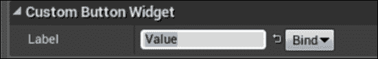

16.  Verify that your button has changed its label.

    

17.  现在，我们将创建一个绑定，以演示我们可以将任意蓝图函数链接到小部件上的 label 属性，从而驱动小部件的 textblock 标签。
18.  Click on **Bind** to the right of the **Label** property, and select **Create Binding**:

    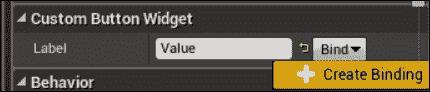

19.  Within the graph that is now displayed, place a **Get Game Time in Seconds** node:

    

20.  Link the return value from the Get Game Time node to the **Return Value** pin in the function:

    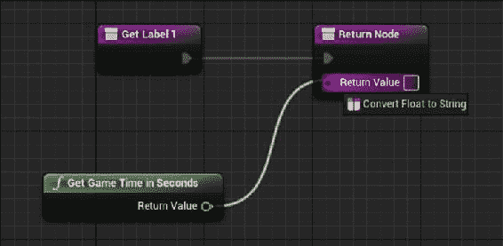

21.  A convert float to string node will be automatically inserted for you:

    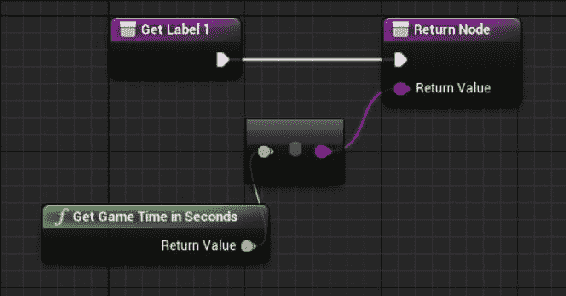

22.  Next, open the **Level Blueprints** by clicking on the **Blueprints** button on the taskbar, then selecting **Open Level Blueprint**:

    

23.  Place a construct widget node into the graph:

    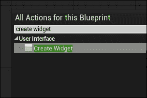

24.  Select the class of widget to spawn as the new Widget Blueprint that we created a moment ago within the editor:

    

25.  Click and drag away from the **Owning Player** pin on the create widget node, and place a **Get Player Controller** node:

    

26.  Likewise, drag away from the return value of the create widget node, and place a **Add to Viewport** node.

    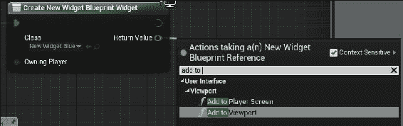

27.  Lastly, link the `BeginPlay` node to the execution pin on the create widget node.

    

28.  Preview your game, and verify that the widget we've displayed onscreen is our new custom button with its label bound to the number of seconds that have elapsed since the game started:

    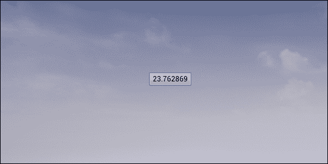

## 它是如何工作的...

1.  为了使用`UWidget`类，我们的模块需要将 UMG 模块作为其依赖项之一，因为`UWidget`是在 UMG 模块内部定义的。
2.  但是，我们需要创建的第一个类是我们实际的`SWidget`类。
3.  因为我们想将两个小部件聚合在一起成一个复合结构，所以我们将新的小部件创建为`CompoundWidget`子类。
4.  `CompoundWidget`允许您将 widget 层次结构封装为 widget 本身。
5.  在类内部，我们使用`SLATE_BEGIN_ARGS`和`SLATE_END_ARGS`宏在新的`SWidget`上声明一个称为`FArguments`的内部`struct`。
6.  在`SLATE_BEGIN_ARGS`和`SLATE_END_ARGS`中，使用`SLATE_ATTRIBUTE`和`SLATE_EVENT`宏。
7.  `SLATE_ATTRIBUTE`为我们给它的类型创建`TAttribute`。
8.  在这个类中，我们声明`TAttribute`称为`_Label`，更具体地说是`TAttribute<FString>`。
9.  `SLATE_EVENT`允许我们创建成员委托，当小部件内部发生某些事情时，我们可以广播这些成员委托。
10.  在`SCustomButton`中，我们声明一个签名为`FOnClicked`的委托，称为`ButtonClicked`。
11.  `SLATE_ARGUMENT`是另一个宏，未在此配方中使用，它会创建一个内部变量，其中包含您提供的类型和名称，并在变量名称的开头附加下划线。
12.  `Construct()`是小部件实例化时实现自初始化的函数。
13.  您会注意到我们还自己创建了一个`TAttribute`和一个`FOnClicked`实例，没有下划线。这些是我们对象的实际属性，我们前面声明的参数将被复制到这些属性中。
14.  在`Construct`的实现中，我们检索在`FArgumentsstruct`中传递给我们的参数，并将它们存储在此实例的实际成员变量中。
15.  我们根据传入的内容分配`Label`和`ButtonClicked`，然后我们实际上创建了我们的小部件层次结构。
16.  为此，我们使用与通常相同的语法，需要注意一点，即使用`Text_Lambda`设置内部文本块的文本值。
17.  我们使用`lambda`函数使用`Get()`检索我们的`Label``TAttribute`的值，然后将其转换为`FText`，并将其存储为文本块的`Text`属性。
18.  现在我们已经声明了我们的`SWidget`，我们需要创建一个包装器`UWidget`对象，该对象将此小部件暴露给 UMG 系统，以便设计人员可以在**所见即所得的**编辑器中使用该小部件。
19.  这个类将被称为`UCustomButtonWidget`，它继承自`UWidget`而不是`SWidget`。
20.  `UWidget`对象需要对其拥有的实际`SWidget`的引用，因此我们在类中放置一个受保护的成员，该成员将其存储为共享指针。
21.  声明了一个构造函数，可以在蓝图中设置的`ButtonClicked`委托也是如此。我们还镜像一个标记为`BlueprintReadWrite`的`Label`属性，以便可以在 UMG 编辑器中进行设置。
22.  因为我们希望能够将按钮的标签绑定到委托，所以我们添加了成员变量的最后一个，即返回`String`的委托。
23.  `SynchronizeProperties`函数将已在我们的`UWidget`类中镜像的属性应用于与我们链接的`SWidget`。
24.  `RebuildWidget`重建这个`UWidget`关联的本机小部件。它使用`SNew`构造我们的`SCustomButton`小部件的实例，并使用 Slate 声明式语法将 UWidget 的`OnButtonClicked`方法绑定到本机小部件内部的`ButtonClicked`委托。
25.  这意味着当单击本机小部件时，将通过调用`OnButtonClicked`来通知`UWidget`。
26.  `OnButtonClicked`通过 UWidget 的`ButtonClicked`委托从本机按钮重新广播单击的事件。
27.  这意味着 UObjects 和 UMG 系统可以被通知按钮被点击，而无需引用本机按钮小部件本身。我们可以绑定到`UCustomButtonWidget::ButtonClicked`来通知它。
28.  `OnButtonClicked`然后返回`FReply::Handled()`表示事件不需要进一步传播。
29.  在`SynchronizeProperties`内部，我们调用父方法以确保父中的任何属性也正确同步。
30.  我们使用`OPTIONAL_BINDING`宏将我们的`UWidget`类中的`LabelDelegate`委托链接到`TAttribute`，并依次链接到本机按钮的标签。需要注意的是，根据宏的第二个参数，`OPTIONAL_BINDING`宏期望调用委托`NameDelegate`。
31.  `OPTIONAL_BINDING`允许通过 UMG 进行的绑定重写该值，但前提是 UMG 绑定有效。
32.  这意味着当`UWidget`被告知更新自身时，例如，由于用户在 UMG 内的**Details**面板中自定义一个值，如果需要，它将重新创建本机`SWidget`，然后通过`SynchronizeProperties`复制在 Blueprint/UMG 中设置的值，以便一切继续按预期工作。