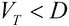
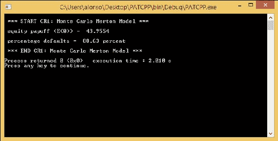
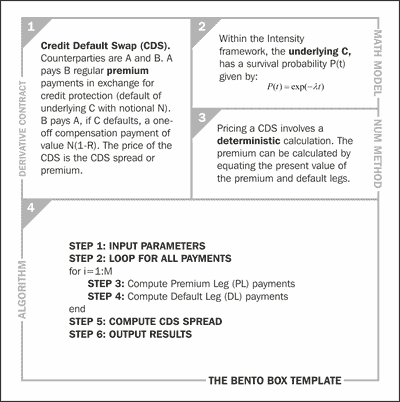
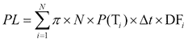
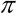
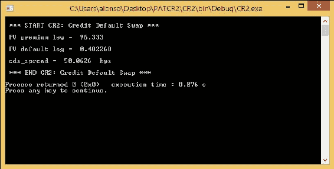

# 七、使用 C++ 开发信用衍生品

在这最后一章中，我们重点介绍了 C++ 语言在信用衍生品定价中的应用。 我们考虑两个例子：使用 Merton 模型为可违约公司的股本加上公司的违约概率定价(基本例子)和**信用违约互换**(**CDS**)的定价(高级例子)。 第一个例子是基于信用风险的结构性方法，第二个例子是基于强度方法。 我们为这两个示例提供了完整的工作 C++ 实现。 在随附的图书网站中可以找到一个更简单的 C 实现(没有 OO 特性)。

# 基本示例-破产(CR1)

在这个例子中，我们将使用(Merton 1974)模型研究公司的违约(破产)。 欲知详情，请参阅《关于公司债定价：利率的风险结构》。 在这个模型中，企业的动态用**几何布朗运动**(**GBM**)来描述。 假设公司的资本结构非常简单：公司的资产(*V*)完全由股权(*E*)和债务(*D*)组成。 对于给定的期限*T*，如果公司在到期时的资产*V(T)*小于公司当时必须支付的债务价值(*D*)，就会发生违约。

在此背景下，我们可以利用蒙特卡罗模拟来研究企业的违约概率。 通过生成一系列可能的公司发展轨迹，并计算公司满足违约条件的次数，我们可以估计公司破产的可能性。

然后，我们的目标是计算*V(T)*小于债务价值(*D*)的次数，并将其用作**违约概率**(**PD**)的估计。 除了使用相同的蒙特卡罗计算外，我们还可以估计公司在*time=0*时的权益价值。

现在，我们从左上角开始，顺时针方向完成便当盒子中的内容。 首先，我们填写破产分析的所有数据，特别是违约情况，在我们的案例中如下所示：



其次，我们应该选择底层的数学模型，在 Merton 模型的情况下是 GBM。 第三，我们选择了数值方法，在这种情况下，我们选择了蒙特卡罗模拟。 第四，我们构建了将这些计算组合成一系列计算步骤的算法，这将作为我们在 C++ 中实现它的蓝图。

算法显示在用于破产的便当盒子模板的方框 4 中。 该算法的 C++ 实现如代码片段 1 所示。该算法由七个步骤组成，从输入参数(**步骤 1**)到溢价值的输出(**步骤 6**)。

蒙特卡罗模拟需要一个随机数生成器才能运行，因此重用了`random.cpp`文件(在[第 4 章](4.html#QMFO2-f9cfc61bea324a5db85ec5ea1673cdfd "Chapter 4. Equity Derivatives in C++")，*C++*中的*权益衍生品中进行了研究)。*

我们考虑这样一个例子：一家公司的资本结构由公司总资产*t=0*，*V(0)=1 亿*欧元和一笔面值为*D=7000 万欧元的零息债券组成。 该公司资产的波动率假设为 20%。 期限是四年。 无风险利率是年利率 5%。*

如下图所示运行 C++ 代码片段，通过 500 个步骤和 10,000 个模拟，我们估计四年内违约的概率为 88.63%，权益价值为*E(0)=4395 万欧元：*


商号破产用便当盒模板(CR1)

即将发布的代码片段实现了来自 Bento Box 模板的算法。

**代码 21-cr1_main.cpp(使用 Merton 模式破产)**

以下是`CR1_main.cpp`文件的代码片段：

```cpp
// CR2_main.cpp

// It requires CR2_source.cpp
#include "CR2.h"

#include <iostream>

using namespace std;

int main()
{
  cout << "\n *** START CR2: Credit Default Swap *** \n";

  // STEP 1: INPUT PARAMETERS

  auto T = 1.0; // maturity
  auto N = 4; // number of payments per year
  auto notional = 100.0; // notional
  auto r = 0.05; // risk free interest rate
  auto h = 0.01; // hazard rate
  auto rr = 0.50; // recovery rate

  // Construct a CR2 object from the input parameters:

  CR2 cr2(T, N, notional, r, h, rr);

  // Obtain the value of premium from member function "get_premium()":

  auto cr2_results = cr2.get_pv_premium_and_default_legs_and_cds_spread();

  // STEP 6: OUTPUT RESULTS

  cout << "\n PV premium leg =  "
    << cr2_results.pv_premium_leg << "\n";

  cout << "\n PV default leg =  "
    << cr2_results.pv_default_leg << " \n";

  cout << "\n cds_spread =  "
    << cr2_results.cds_spread_in_bps << "  bps \n";

  cout << "\n *** END CR2: Credit Default Swap *** \n";

  return 0;
}
```

**代码 22-cr1_source e.cpp(使用 Merton 模式破产)**

以下是`CR1_source.cpp`文件的代码片段：

```cpp
// CR2_source.cpp

#include "CR2.H"
#include <vector>
#include <cmath>

using namespace std;

CR2_results CR2::find_pv_premium_and_default_legs_and_cds_spread() const
{
  auto pv_premium_leg = 0.0; // sum premium leg
  auto pv_default_leg = 0.0; // sum default leg
  auto t = 0.0; // current time
  auto cds_spread = 0.0;
  auto array_size = static_cast<int>(N*T + 1);
  vector <double> DF(array_size);
  vector <double> P(array_size);
  P[0] = 1.0;
  auto dt = T / N;

  // STEP 2: LOOP FOR ALL PAYMENTS
  for (int j = 1; j < array_size; j++)
  {
    t = j*dt;
    DF[j] = exp(-r*t);
    P[j] = exp(-h*t);

    // STEP 3: COMPUTE PREMIUM PAYMENTS
    pv_premium_leg = pv_premium_leg + DF[j] * notional*dt*P[j];

    // STEP 4: COMPUTE DEFAULT PAYMENTS
    pv_default_leg = pv_default_leg + DF[j] * (1.0 - rr)*notional*(P[j - 1] - P[j]);
  }

  // STEP 5: COMPUTE CDS SPREAD
  cds_spread = pv_default_leg / pv_premium_leg;

  // Composing the CR2_results class:
  CR2_results results;
  results.pv_premium_leg = pv_premium_leg;
  results.pv_default_leg = pv_default_leg;
  results.cds_spread_in_bps = cds_spread * 10000;
  return results;
}
```

### 提示

关于代码段 23`CR1.h`，请参考代码包中的代码。

要计算个基本示例(CR1)，您需要编译并运行代码片段 21、22、23、4 和 5(包括头部和随机函数)；之后，您应该会获得以下屏幕截图：



公司破产(CR1)结果屏幕截图

# 高级示例-CDS(CR2)

在第二个例子中，我们考虑 CDS 的定价。 CDS 的以下便当盒模板中显示了该方法的详细信息：



CDS 便当盒模板(CR2)

CDS 是 A 和 B 两个对手方之间的一种金融合同，其中一方向另一方支付，以购买针对标的 C 可能违约的信用保护。

在结构上，CDS 类似于普通的普通 IRS，因为它由各方之间的现金流交换组成。 在期限为五年的典型 CDS 中，交易对手 A 按约定的名义定期向 B 支付一系列保费。 只要底层 C“存活”(也就是说，默认情况下不会发生)，就会支付这些款项。

交易对手 B 在标的 C 违约时向 A 支付一笔或有付款。支付的金额等于名义金额减去回收率。 用数学术语来说，它可以表示为：


与在 IRS 中一样，合同的“价格”是通过计算每个分支的现值(称为**Premium Leg**(**PL**)的预期保费支付和称为**Default Leg**(**DL**)的预期违约支付的总和来获得的。 在数学术语中，PL 和 DL 表示如下：




在前述公式中，*P(T)*是时间*t*的生存概率，*N*是概念概率，*R*是回收率，以及*DF(T)*是时间*t*的折扣率。 为了公平定价，这两条腿必须相等，有了这一点，我们就可以确定支付的溢价的公允价值(也称为 CDS 价差)。 这个价差的价值，用希腊字母表示，被认为是 CDS 合约的价格，用数学术语来说，它可以表示如下：


我们在 CDS 的 Bento Box 模板中提供的定价算法试图根据前面的公式计算保费。

如我们所见，这个计算是确定性的，因此不需要蒙特卡罗模拟。 本文所描述的信用模型是基于“信用风险下的金融证券衍生产品定价”的“强度模型”的一个例子。

代码片段 2 说明了这种定价在 C++ 中的实现。

我们将考虑这样的示例：合同期限为一年，季度付款(即每年四次付款)，名义=1 亿美元，无风险费率=5%pa，潜在危险率=1%pa，回收率=50%。 对于这些投入，CDS 利差为 50.0626 个基点。

在下图中，我们发现 Bento Box 框架适用于 CDS 问题：


CDS 便当盒模板(CR2)

即将发布的代码片段实现了来自 Bento Box 模板的算法。

**代码 24-cr2_main.cpp(CDS)**

以下是`CR2_main.cpp`文件的代码片段：

```cpp
// CR2_main.cpp

// It requires CR2_source.cpp
#include "CR2.h"
#include <iostream>

using namespace std;

int main()
{
  cout << "\n *** START CR2: Credit Default Swap *** \n";

  // STEP 1: INPUT PARAMETERS
  auto T = 1.0; // maturity
  auto N = 4; // number of payments per year
  auto notional = 100.0; // notional
  auto r = 0.05; // risk free interest rate
  auto h = 0.01; // hazard rate
  auto rr = 0.50; // recovery rate

  // Construct a CR2 object from the input parameters:
  CR2 cr2(T, N, notional, r, h, rr);

  // Obtain the value of premium from member function "get_premium()":

  auto cr2_results = cr2.get_pv_premium_and_default_legs_and_cds_spread();

  // STEP 6: OUTPUT RESULTS
  cout << "\n PV premium leg =  "
    << cr2_results.pv_premium_leg << "\n";

  cout << "\n PV default leg =  "
    << cr2_results.pv_default_leg << " \n";

  cout << "\n cds_spread =  "
    << cr2_results.cds_spread_in_bps << "  bps \n";

  cout << "\n *** END CR2: Credit Default Swap *** \n";

  return 0;
}
```

**代码 25-cr2_source e.cpp(Cds)**

以下是`CR2_source.cpp`文件的代码片段：

```cpp
// CR2_source.cpp

#include "CR2.H"
#include <vector>
#include <cmath>

using namespace std;

CR2_results CR2::find_pv_premium_and_default_legs_and_cds_spread() const
{
  auto pv_premium_leg = 0.0; // sum premium leg
  auto pv_default_leg = 0.0; // sum default leg
  auto t = 0.0; // current time
  auto cds_spread = 0.0;
  auto array_size = static_cast<int>(N*T + 1);
  vector <double> DF(array_size);
  vector <double> P(array_size);

  P[0] = 1.0;

  auto dt = T / N;

  // STEP 2: LOOP FOR ALL PAYMENTS
  for (int j = 1; j < array_size; j++)
  {
    t = j*dt;
    DF[j] = exp(-r*t);
    P[j] = exp(-h*t);

    // STEP 3: COMPUTE PREMIUM PAYMENTS
    pv_premium_leg = pv_premium_leg + DF[j] * notional*dt*P[j];

    // STEP 4: COMPUTE DEFAULT PAYMENTS
    pv_default_leg = pv_default_leg + DF[j] * (1.0 - rr)*notional*(P[j - 1] - P[j]);
  }

  // STEP 5: COMPUTE CDS SPREAD
  cds_spread = pv_default_leg / pv_premium_leg;

  // Composing the CR2_results class:
  CR2_results results;
  results.pv_premium_leg = pv_premium_leg;
  results.pv_default_leg = pv_default_leg;
  results.cds_spread_in_bps = cds_spread * 10000;
  return results;
}
```

### 提示

关于代码片段 26`CR2.h`，请参考代码包中的代码。

要计算高级示例(CR2)，您必须编译并运行代码片段 24、25 和 26；之后，您应该会获得以下屏幕截图：



带结果的 CD(CR2)屏幕截图

# 摘要

在本章中，我们解决了信用衍生品的两个定价问题。 我们已经看到了一个基本示例(使用结构模型)和一个更高级的示例(使用强度模型)。 有许多可能的变化和更复杂的合约，但这两个家族是主要的家族，将让你对如何在这一迷人的资产类别中前进有所了解。 我们对用 C++ 实现不同类型的金融衍生品的示例的调查到此结束。