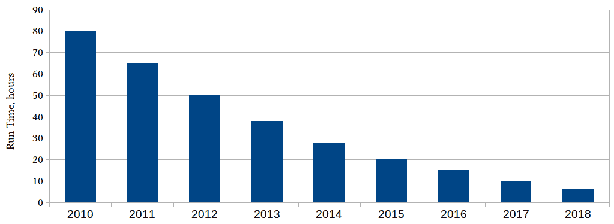
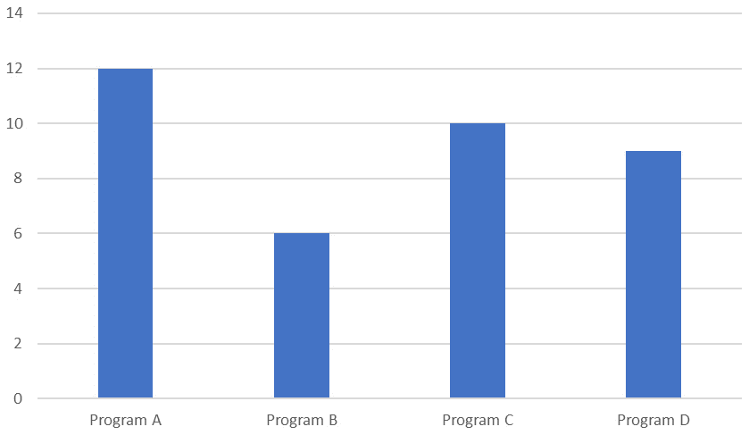

# 一、性能和并发性介绍

动机是学习的关键因素；因此，您必须理解为什么在计算技术取得了所有进步的情况下，程序员仍然需要努力从代码中获得足够的性能，以及为什么成功需要深入理解计算硬件、编程语言和编译器功能。本章的目的是解释为什么这种理解在今天仍然是必要的。

本章讨论了我们关心程序性能的原因，特别是良好性能不会*只是发生*的原因。我们将了解为什么，为了获得最佳性能，有时甚至是足够的性能，理解影响性能的不同因素以及程序特定行为的原因（无论是快速执行还是缓慢）非常重要。

在本章中，我们将介绍以下主要主题：

*   为什么性能很重要
*   为什么性能需要程序员的关注
*   我们所说的性能是什么意思？
*   如何评估性能
*   学习高性能

# 为什么要关注性能？

在计算的早期，编程是很困难的。处理器速度慢，内存有限，编译器很原始，如果不付出很大努力，什么也做不到。程序员必须知道 CPU 的体系结构、内存的布局，当编译器不剪切它时，关键代码必须用汇编语言编写。

然后情况好转了。处理器一年比一年快，过去一个巨大硬盘的容量变成了一台普通 PC 机的主内存大小，编译器编写者学会了一些使程序更快的技巧。程序员可以花更多的时间实际解决问题。这反映在编程语言和设计风格上：在高级语言和不断发展的设计和编程实践之间，程序员的注意力从*他们想在代码中说什么*转移到*他们想怎么说。*

以前的常识，比如 CPU 有多少个寄存器，它们的名字是什么，变成了深奥、神秘的事情。一个“大型代码库”曾经是一个需要双手来提升卡片组的库；现在，版本控制系统的容量被消耗殆尽。几乎不需要为特定的处理器或内存系统编写专门的代码，可移植代码成为标准。

至于汇编器，实际上很难超越编译器生成的代码，这是大多数程序员无法完成的任务。对于许多应用程序，以及编写它们的应用程序，都有“足够的性能”，程序员的其他方面变得更加重要（需要明确的是，程序员可以专注于代码的可读性，而不必担心添加具有有意义名称的函数是否会使程序速度慢得令人无法接受，这是一件好事）。

然后，相当突然地，“表演自理”的免费午餐结束了。不断增长的计算能力似乎势不可挡的进步刚刚…停止了。

图 1.1–绘制 35 年微处理器发展的图表（参考 https://github.com/karlrupp/microprocessor-trend-data 和 https://github.com/karlrupp/microprocessor-trend-data/blob/master/LICENSE.txt)

大约在 2005 年，单个 CPU 的计算能力达到饱和。在很大程度上，这与 CPU 频率直接相关，CPU 频率也停止增长。频率反过来又受到几个因素的限制，其中一个因素是功耗（如果频率趋势保持不变，那么今天的 CPU 每平方毫米的功耗将超过将火箭送入太空的大型喷气发动机）。

从前面的数字可以明显看出，并不是所有的进步都在 2005 年停滞：封装在单个芯片中的晶体管数量一直在增长。那么，如果不加快芯片的速度，他们在做什么呢？答案是双重的，底部曲线揭示了其中的一部分：设计师们没有将单处理器变大，而是将多个处理器内核放在同一个芯片上。当然，所有这些核心的计算能力随着核心数量的增加而增加，但前提是程序员知道如何使用它们。“伟大晶体管之谜”的第二部分（所有晶体管都到哪里去了？）是它们对处理器功能进行了各种非常高级的增强，这些增强可以用来提高性能，但同样，只有在程序员努力使用它们的情况下。

我们刚刚看到的处理器进程的变化通常被认为是并发编程进入主流的原因。但变化甚至比这更深刻。在本书中，您将了解为了获得最佳性能，程序员如何再次需要了解处理器和内存体系结构及其交互的复杂性。出色的性能不再“只是发生”。与此同时，我们在编写清楚地表达需要做什么，而不是如何做的代码方面所取得的进展是不可倒退的。我们仍然希望编写可读和可维护的代码，并且（*和*不是*而是*）我们希望它也是高效的。

可以肯定的是，对于许多应用程序来说，现代 CPU 中仍然有足够的性能，但性能比过去得到了更多的关注，很大程度上是因为我们刚才讨论的 CPU 开发的变化，以及因为我们希望在不一定能够获得最佳计算资源的更多应用程序中进行更多计算（例如，今天的便携式医疗设备可能有一个完整的神经网络）。

幸运的是，我们不必在黑暗的储藏室里挖掘成堆腐烂的穿孔卡片，从而重新发现一些*丢失的表演艺术*。在任何时候，仍然存在困难的问题，对于许多程序员来说，*永远没有足够的计算能力*这句话是正确的。随着计算能力呈指数级增长，对它的需求也随之增长。*极限表演*的艺术在少数几个需要它的领域保持着活力。在这一点上，一个这样的领域的例子可能具有启发性和启发性。

# 为什么性能很重要

为了找到这样一个专注于性能的领域的例子，让我们来研究使计算本身成为可能的计算的演变，这就是用于设计计算机本身的**电子设计自动化**（**EDA**工具。

如果我们在 2010 年进行了设计、模拟或验证特定微芯片的计算，并从那时起每年运行相同的工作负载，我们会看到如下情况：

图 1.2–多年来特定 EDA 计算的处理时间（小时）

2010 年用 80 小时计算的时间在 2018 年不到 10 小时（今天甚至更少）。改进来自哪里？同时有几个来源：部分原因是计算机变得更快，但软件也变得更高效，发明了更好的算法，优化编译器变得更有效。

不幸的是，我们并没有在 2021 年生产 2010 版的微芯片：随着计算机的功能越来越强大，生产更新更好的芯片变得越来越困难，这是理所当然的。那么，更有趣的问题是，每年为我们当年制造的新微芯片做同样的工作需要多长时间：

图 1.3——每年最新微芯片特定设计步骤的运行时间（小时）

每年进行的实际计算不尽相同，但它们具有相同的用途，例如，*验证芯片性能是否符合我们每年制造的最新和最大芯片的预期*。从这张图表中我们可以看出，当前一代最强大的处理器，运行着最好的可用工具，每年都要花费几乎相同的时间来设计和建模下一代处理器。我们正在坚持自己的立场，但我们没有取得任何进展。

但事实比这更糟，上面的图表并没有显示一切。诚然，从 2010 年到 2018 年，当年生产的最大处理器可以在一夜之间（大约 12 小时）使用配备去年生产的最大处理器的计算机进行验证。但我们忘了问*这些处理器有多少？*好吧，下面是全部真相：

图 1.4–上图，注有每次计算的 CPU 计数

每一年，最强大的计算机，配备了数量不断增长的最新、最强大的处理器，运行着最新的软件版本（经过优化以利用越来越多的处理器并更高效地使用每一个处理器），都要做下一年最强大的计算机所需的工作，每年，这项任务在几乎不可能完成的边缘得到平衡。我们没有从这一优势上跌落主要是硬件和软件工程师的成就，因为前者提供了不断增长的计算能力，而后者以最大的效率使用它。这本书将帮助你学习后者的技能。

我们现在明白了这本书主题的重要性。在我们深入研究细节之前，先做一个高层次的概述；可以说，对勘探活动将展开的地区地图的审查。

# 什么是性能？

我们已经讨论了程序的性能；我们提到了高性能软件。但是我们说这话是什么意思？直觉上，我们理解高性能的程序比性能差的程序快，但这并不意味着速度快的程序总是具有*良好*性能（两个程序的性能都可能较差）。

我们也提到了高效的项目，但是效率和高性能是一样的吗？虽然效率与性能相关，但并不完全相同。效率是指以最佳方式使用资源，而不是浪费资源。高效的程序充分利用了计算硬件。

一方面，一个高效的程序不会让可用资源闲置：如果您有一个需要执行的计算，而处理器什么也不做，那么该处理器应该执行等待执行的代码。这个想法更深入：处理器中有许多计算资源，一个高效的程序试图同时利用尽可能多的这些资源。另一方面，高效的程序不会浪费资源做不必要的工作：它不会执行不需要做的计算，不会浪费内存来存储永远不会使用的数据，如果不需要数据，也不会通过网络发送数据，等等。简而言之，一个高效的程序不会让可用的硬件闲置，也不会做任何不需要做的工作。

另一方面，性能总是与某些指标相关。最常见的是“速度”，即程序的速度。定义这个指标的更严格的方法是吞吐量，它是程序在给定时间内进行的计算量。通常用于相同目的的反向度量是周转时间或计算特定结果所需的时间。然而，这并不是性能的唯一可能定义。

## 作为吞吐量的性能

让我们考虑使用不同实现的四个程序来计算相同的最终结果。以下是所有四个程序的运行时间（单位是相对的；实际数字并不重要，因为我们对相对性能感兴趣）：

图 1.5–同一算法的四种不同实现的运行时间（相对单位）

显然，程序 B 具有最高的性能：它比其他三个程序完成得更早，用最慢的程序计算相同结果所用时间的一半。在许多情况下，这将是我们选择最佳实现所需的全部数据。

但问题的背景很重要，我们忽略了该程序是在电池供电的设备（如手机）上运行的，功耗也很重要。

## 作为功耗的性能

以下是计算过程中所有四个程序消耗的功率：

图 1.6–同一算法的四种不同实现的功耗（相对单位）

尽管需要更长的时间才能得到结果，但程序 C 总体上使用的功耗更低。那么，哪个程序的性能最好？

同样，这是一个不了解全部上下文的技巧性问题。该程序不仅在移动设备上运行，而且执行实时计算：它用于音频处理。这应该会让实时更快地返回结果，对吗？不完全是。

## 实时应用的性能

一个实时程序必须随时跟上它正在处理的事件。尤其是音频处理器必须跟上语音。如果这个程序处理音频的速度比一个人说话的速度快十倍，那对我们没有好处，我们不妨把注意力转向功耗。

另一方面，如果程序偶尔落后，一些声音甚至单词将被删除。这表明，实时性或速度在一定程度上很重要，但必须以可预测的方式交付。

当然，这也有一个性能指标：延迟尾部。在我们的例子中，延迟是数据准备就绪（语音记录）和处理完成之间的延迟。我们前面看到的吞吐量指标反映了处理声音的平均时间：如果我们对着手机讲话一小时，音频处理器需要多长时间来完成所有需要的计算？但在这种情况下，真正重要的是每个声音的每一个小计算都是按时完成的。

在较低的级别上，计算速度会波动：有时计算完成得更快，有时需要更长的时间。只要平均速度可以接受，重要的是罕见的长时间延迟。

延迟尾部度量计算为延迟的特定百分位，例如，在第 95 个百分位：如果*t*是第 95 个百分位延迟，则所有计算的 95%花费的时间少于*t*。度量本身是第 95 百分位时间*t*与平均计算时间*t*0 的比率（通常也用百分比表示，因此第 95 百分位的 30%延迟意味着*t*比*t*0 大 30%：

图 1.7–同一算法的四种不同实现的 95%延迟（百分比）

我们现在看到，**程序 B**计算结果的速度平均比任何其他实现都要快，它也提供了最不可预测的运行时结果，而**程序 D**以前从未脱颖而出，它的计算速度非常快，几乎与完成给定计算所需的时间相同，每一次。正如我们已经观察到的，程序 D 的功耗也最差。不幸的是，这并不少见，因为使程序更节能的技术在本质上是概率性的：它们在大多数情况下加快了计算速度，但并非每次都如此。

那么，哪个节目最好？当然，答案取决于应用程序，即使如此，也可能并不明显。

## 取决于上下文的性能

如果这是在大型数据中心运行的模拟软件，需要几天的计算时间，那么吞吐量将是最大的。在电池供电的设备上，功耗通常是最重要的。在更复杂的环境中，例如我们的实时音频处理器，它是多种因素的组合。当然，平均运行时间很重要，但只有在它变得“足够快”之前。如果演讲者没有注意到延迟，那么让它更快就没有回报了。延迟尾很重要：用户讨厌不时从对话中删除一个单词。一旦延迟足够好，通话质量会受到其他因素的限制，进一步提高通话质量就没有什么好处；我们最好在这一点上节约能源。

我们现在了解到，与效率不同，性能总是根据特定的指标来定义的，这些指标取决于应用程序和我们正在解决的问题，对于某些指标，当其他指标出现时，存在“足够好”的情况。效率反映了计算资源的利用率，是实现良好性能的方法之一，可能是最常见的方法，但不是唯一的方法。

# 评估、评估和预测性能

正如我们刚才看到的，度量的概念是性能概念的基础。对于度量，总是隐含着测量的可能性和必要性：如果我们说“我们有一个度量”，这意味着我们有一种量化和测量某物的方法，找到度量值的唯一方法就是测量它。

衡量性能的重要性怎么强调都不为过。人们常说，表演的第一定律是永远不要猜测表演。本书的下一章将专门介绍性能度量、度量工具、如何使用它们以及如何解释结果。

不幸的是，对性能的猜测太普遍了。类似于“避免使用 C++ 中的虚拟函数，它们很慢”之类的过于笼统的陈述，“这样的语句的问题不在于它们是不精确的，也就是说，它们不引用一个虚拟函数比虚拟的慢多少的度量。作为读者的练习，这里有几个答案可供选择，都是量化的：

*   虚拟函数的速度要慢 100%
*   一个虚拟函数大约慢 15-20%
*   虚函数的速度慢得可以忽略不计
*   虚拟函数的速度要快 10-20%
*   虚拟函数的速度要慢 100 倍

哪个是正确答案？如果您选择了这些答案中的任何一个，恭喜您：您选择了正确答案。这是正确的，每个答案在某些情况下是正确的，并且在特定的上下文中（要知道为什么，你必须等到第 9 章，第三章第 3 章，第 4 章，第 5 章：高性能 C++ +T6）。

不幸的是，通过接受这样一个事实，即对性能的直觉或猜测几乎是不可能的，我们有可能陷入另一个陷阱：将其作为编写低效代码“待稍后优化”的借口，因为*我们不猜测性能*。虽然这是事实，但后一条格言可能走得太远，就像流行格言*不要过早优化*。

性能不能在以后添加到程序中，因此在初始设计和开发过程中不应事后考虑。与其他设计目标一样，性能考虑因素和目标在设计阶段也占有一席之地。在这些早期与性能相关的目标和从不猜测性能的规则之间存在着一定的紧张关系。我们必须找到正确的折衷方案，描述我们在设计阶段真正想要实现的性能的一个好方法是：虽然几乎不可能提前预测最佳优化，但可以确定会使后续优化非常困难甚至不可行的设计决策。

在以后的程序开发过程中也是如此：花很长时间优化一个函数是愚蠢的，因为该函数最终每天调用一次，只需一秒钟。另一方面，首先将此代码封装到函数中是非常明智的，因此，如果使用模式随着程序的发展而变化，则可以在不重写程序其余部分的情况下对其进行优化。

描述*不要过早优化*规则局限性的另一种方式是通过说*是来限定它，但也不要故意悲观*。认识到两者之间的差异需要了解良好的设计实践以及对高性能编程的不同方面的理解。

那么，作为一名开发人员/程序员，为了精通开发高性能应用程序，您需要学习和理解什么？在下一节中，我们将从这些目标的简短列表开始，然后再详细讨论每一个目标。

# 学习高性能

是什么使程序具有高性能？我们可以说“效率”，但是，首先，这并不总是正确的（尽管经常是这样），其次，它只是回避了一个问题，因为下一个显而易见的问题是，好吧，是什么让程序高效？为了编写高效或高性能的程序，我们需要学习什么？让我们大致列出所需的技能和知识：

*   选择正确的算法
*   有效利用 CPU资源
*   有效地使用内存
*   避免不必要的计算
*   有效地使用并发和多线程
*   有效使用编程语言，避免低效
*   衡量性能和解释结果

实现高性能的最重要因素是选择一个好的算法。不能通过优化实现来“修复”一个糟糕的算法。然而，这也是本书范围之外的一个因素。算法是特定于问题的，这不是一本关于算法的书。你必须自己做研究，为你面临的问题找到最好的解决方案。

另一方面，实现高性能的方法和技术在很大程度上与问题无关。当然，它们确实取决于性能指标：例如，实时系统的优化是一个具有许多特殊问题的高度特定领域。在本书中，我们主要关注高性能计算意义上的性能指标：尽可能快地进行大量计算。

为了在这一探索中取得成功，我们必须学会尽可能多地使用可用的计算硬件。这个目标有一个空间和时间的组成部分：在空间方面，我们谈论的是利用处理器中大量的晶体管。处理器正在变得越来越大，甚至更快。添加的区域用于什么？据推测，它增加了一些我们可以使用的新计算能力。就时间而言，我们的意思是我们每次都应该使用尽可能多的硬件。无论哪种方式，如果计算资源闲置，它们对我们都没有用处，因此我们的目标是避免这种情况。同时，忙碌的工作并没有回报，我们想避免做任何我们不需要做的事情。这并不像听起来那么明显；有很多微妙的方式，你的程序可以做你不需要的计算。

在本书中，我们将从单个处理器开始，学习如何有效地使用其计算资源。然后我们将扩展我们的视野，不仅包括处理器，还包括它的内存。然后，我们自然会考虑同时使用多个处理器。

但是，高效地使用硬件只是高性能程序的必要品质之一：高效地完成本来可以避免的工作对我们没有好处。不需要创建不必要的工作的关键是有效地使用编程语言，在我们的例子中，C++（我们所了解的硬件的大部分可以应用于任何语言，但是一些语言优化技术对 C++ 非常具体）。此外，编译器介于我们编写的语言和使用的硬件之间，因此我们必须学习如何使用编译器生成最高效的代码。

最后，量化我们刚刚列出的任何目标的成功程度的唯一方法是测量它：我们使用了多少 CPU 资源？我们花了多少时间等待记忆？通过添加另一个线程可以获得什么样的性能增益？等等获得良好的定量性能数据并不容易；它需要对测量工具有透彻的了解。解释结果往往更加困难。

你可以从这本书中学习这些技巧。我们将学习硬件体系结构，以及一些编程语言特性背后隐藏的内容，以及如何以编译器的方式查看代码。这些技能很重要，但更重要的是要理解为什么事情会这样。计算硬件经常变化，语言不断发展，新的编译器优化算法被发明。因此，这些领域的特定知识的有效期都相当短。但是，如果您不仅了解使用特定处理器或编译器的最佳方式，而且还了解我们获得这些知识的方式，那么您将做好充分准备，重复这一发现过程，并因此继续学习。

# 总结

在这一介绍性章节中，我们讨论了为什么尽管现代计算机的原始计算能力迅速发展，但人们对软件性能和效率的兴趣却在上升。具体来说，我们已经了解了为什么，为了理解限制性能的因素以及如何克服这些因素，我们需要回到计算的基本要素上来，理解计算机和程序如何在低水平上工作：理解硬件并有效地使用它，理解并发性，理解 C++ 语言特性和编译器优化，以及它们对性能的影响。

这种低级知识必然非常详细和具体，但我们有一个解决方案：当我们了解处理器或编译器的具体事实时，我们也将了解得出这些结论的过程。因此，在最深层次上，这本书是关于学习如何学习的。

我们进一步理解，如果不定义衡量性能的指标，性能的概念就毫无意义。根据特定指标评估性能的需要意味着任何性能工作都是由数据和度量驱动的。事实上，下一章将致力于衡量性能。

# 问题

1.  为什么在处理能力不断提高的情况下，程序性能仍然很重要？
2.  为什么理解软件性能需要低水平的计算硬件和编程语言知识？
3.  性能和效率之间的区别是什么？
4.  为什么必须根据特定指标定义性能？
5.  我们如何判断特定指标的性能相关目标是否实现？