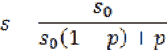
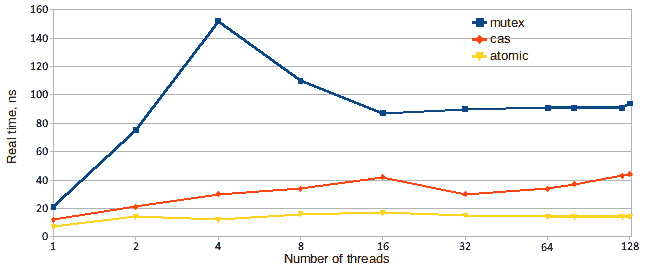
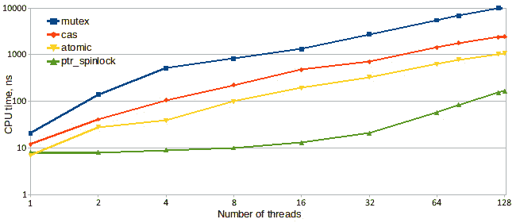
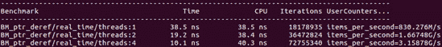
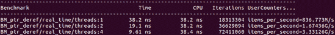
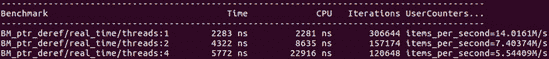
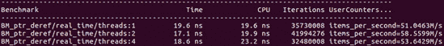

# *第六章*: 并发和性能

在上一章中，我们了解了影响并发程序性能的基本因素。现在是时候将这些知识付诸实践，并学习开发用于线程安全程序的高性能并发算法和数据结构。

一方面，要充分利用并发性，就必须对问题和解决方案策略有一个高层次的看法: 数据组织，工作分区，有时甚至是什么构成解决方案的定义是关键影响程序性能的选择。另一方面，正如我们在上一章中看到的那样，性能受到缓存中数据的排列等低级因素的极大影响，即使是最好的设计也会因为糟糕的实现而毁于一旦。这些低级细节通常很难分析，很难用代码表达，并且需要非常仔细的编码。这不是你想在程序中分散的那种代码，所以对棘手的代码进行封装是必要的。我们将不得不考虑一下封装这种复杂性的最佳方法。

在本章中，我们将介绍以下主要主题:

*   高效并发
*   锁的使用、锁的陷阱以及无锁编程的介绍
*   线程安全计数器和累加器
*   线程安全智能指针

# 技术要求

同样，您将需要一个 C 编译器和一个微基准测试工具，例如我们在上一章中使用的 Google 基准库 (在[https://github.com/google/benchmark](https://github.com/google/benchmark)找到)。本章随附的代码可在[https://github.com/PacktPublishing/ 《高效程序编写艺术》/tree/master/Chapter06](https://github.com/PacktPublishing/The-Art-of-Writing-Efficient-Programs/tree/master/Chapter06)找到。

# 有效使用并发需要什么？

从根本上讲，使用并发来提高性能非常简单: 您确实需要做两件事。第一个是要有足够的工作让并发线程和进程这样做，所以他们在任何时候都很忙。第二个是减少共享数据的使用，因为正如我们在上一章中看到的那样，同时访问共享变量非常昂贵。其余的只是实施的问题。

不幸的是，实现往往相当困难，并且当期望的性能增益更大并且当硬件变得更强大时，难度增加。这是由于 Amdahl 定律，这是每个使用并发程序的程序员都听说过的，但并不是每个人都了解其含义的全部。

法律本身就足够简单了。它指出，对于具有并行 (可扩展) 部分和单线程部分的程序，最大可能加速*s*如下:



这里，是程序并行部分的加速，是程序并行部分的分数。现在考虑一下在大型多处理器系统上运行的程序的后果: 如果我们有 256 个处理器，并且除了只有 256 的运行时间之外能够充分利用它们，则该程序的总加速被限制为 128，也就是说，它被切成两半。换句话说，如果只有 1/256 的程序是单线程或在锁下执行的，那么无论我们如何优化程序的其余部分，该 256 处理器系统都将永远不会超过其总容量的 50%。

这就是为什么在开发并发程序时，设计，实现和优化的重点应该是使剩余的单线程计算并发，并减少程序花费在访问共享数据上的时间。

第一个目标是使计算并发，首先是算法的选择，但是许多设计决策会影响结果，因此我们应该更多地了解它。第二个是降低数据共享的成本，是上一章主题的延续: 当所有线程都在等待访问某个共享变量或锁 (本身也是共享变量) 时，该程序实际上是单线程的，只有当前正在运行的具有访问权限的线程。这就是为什么全局锁和全局共享数据对性能特别不利的原因。但是，即使在几个线程之间共享的数据也会限制这些线程的性能，如果并发访问的话。

正如我们前面几次提到的，从根本上说，数据共享的需求是由问题本身的性质驱动的。任何特定问题的数据共享量都会受到算法，数据结构的选择和其他设计决策以及实现的极大影响。某些数据共享是实现的产物或选择数据结构的结果，但是其他共享数据是该问题所固有的。如果我们需要对满足某个属性的数据元素进行计数，那么在一天结束时，只有一个计数，并且所有线程都必须将其更新为共享变量。然而，实际发生多少共享以及对总程序加速的影响在很大程度上取决于实现。

在本章中，我们将遵循两条轨道: 首先，鉴于一定数量的数据共享是不可避免的，我们将着眼于使这一过程更加高效。然后，我们将考虑设计和实现技术，这些技术可用于减少对数据共享的需求或等待访问此数据所花费的时间。我们从第一个问题开始，高效的数据共享。

# 锁、替代方案及其性能

一旦我们接受了一些数据共享将会发生，我们也必须接受对共享数据的并发访问同步的需要。请记住，在没有这种同步的情况下对相同数据的任何并发访问都会导致数据竞争和未定义的行为。

保护共享数据的最常见方法是使用互斥锁:

```cpp
std::mutex m;
size_t count;// Guarded by m
… on the threads … 
{
  std::lock_guard l(m);
  ++count;
}
```

在这里，我们利用`std::lock_guard`的 C 17 模板类型扣除; 在 C 14 中，我们必须指定模板类型参数。

使用 mutexes通常是相当简单的: 任何访问共享数据的代码都应该在关键部分内，也就是说，夹在锁定和解锁互斥锁的调用之间。mutex 实现带有正确的内存障碍，以确保关键部分中的代码不能被硬件或编译器移动到外部 (编译器通常根本不会在锁定操作中移动代码，但是，从理论上讲，他们可以做这样的优化，只要他们尊重内存屏障语义)。

在这一点上，通常被问到的问题是，“这个互斥体有多贵？”但是，这个问题并没有很好的定义: 对于特定的硬件和给定的 mutex 实现，我们当然可以以纳秒为单位给出绝对答案，但是这个值意味着什么？当然，它比没有互斥体要贵，但是如果没有互斥体，该程序将是不正确的 (并且有更简单的方法可以使不正确的程序非常快)。因此，“昂贵” 只能在与替代方案的比较中定义，这自然会导致一个问题，替代方案是什么？

最明显的替代方案是使计数原子:

```cpp
std::atomic<size_t> count;
… on the threads … 
++count;
```

我们还必须考虑我们真正需要与计数操作相关联的内存顺序。如果计数后来被用来索引到数组中，我们可能需要释放获取顺序。但是如果它只是一个计数，我们只是想计数一些事件并报告数字，我们不需要任何内存顺序限制:

```cpp
std::atomic<size_t> count;
… on the threads … 
count.fetch_add(1, std::memory_order_relaxed);
```

我们是否真的遇到障碍取决于硬件: 在 X86 上，原子增量指令具有 “内置” 的双向内存屏障，并且请求放松的内存顺序不会使其更快。尽管如此，重要的是要指定代码真正需要的需求，无论是可移植性还是清晰度: 请记住，您的真正受众不是必须解析代码的编译器，而是其他需要稍后阅读的程序员。

具有原子增量的程序没有锁，也不需要任何锁。但是，它依赖于特定的硬件功能: 处理器具有原子增量指令。这种指令的集合相当小。如果我们需要一个没有原子指令的操作，我们会怎么做？我们不必走很远的例子: 在 C 中，没有原子乘法 (我不知道任何硬件有这样的能力; 当然，它在 X86 或 ARM 或任何其他常见的 CPU 架构上找不到)。

幸运的是，有一种 “通用” 原子操作可以用来构建，具有不同程度的难度，任何读-修改-写操作。此操作称为**比较和交换**，或者在 C 中称为`compare_exchange`。它需要两个参数: 第一个是原子变量的期望当前值，第二个是期望的新值。如果实际的当前值与预期的不匹配，则什么也不会发生，原子变量没有变化。但是，如果当前值确实与预期值匹配，则将所需值写入原子变量。C`compare_exchange`操作返回 true 或 false 以指示写入是否发生 (如果发生，则为 true)。如果变量与预期值不匹配，则在第一个参数中返回实际值。通过比较和交换，我们可以通过以下方式实现我们的原子增量操作:

```cpp
std::atomic<size_t> count;
… on the threads … 
size_t c = count.load(std::memory_order_relaxed);
while (!count.compare_exchange_strong(c, c + 1,
     std::memory_order_relaxed, std::memory_order_relaxed)) {}
```

几个注意事项是按顺序排列的: 首先，C 中操作的实际名称是`compare_exchange_strong.`还有`compare_exchange_weak`; 区别在于，即使当前和预期值匹配时，弱版有时也可以返回 false (在 X86 上，它没有任何区别，但是在某些平台上，弱版本可以导致更快的整体操作)。其次，该操作不需要一个，而是两个内存顺序参数: 第二个参数在比较失败时适用 (因此，它只是操作的比较部分的内存顺序)。当比较成功并且写入发生时，第一个适用。

让我们分析一下这个实现是如何工作的。首先，我们原子读取计数的当前值，`c`。递增的值当然是`c + 1`，但是我们不能只将它分配给计数，因为在我们读取它之后，但是在更新它之前，另一个线程可能会增加计数。所以我们必须做一个条件写: 如果计数的当前值仍然是`c`，则将其替换为所需的值`c + 1`。否则，请使用新的当前值更新`c` (`compare_exchange_strong`为我们完成此操作)，然后重试。只有当我们最终捕捉到原子变量在我们上次读取它的时间和我们试图更新它的时间之间没有改变的时刻时，循环才会退出。当然，当我们进行原子增量操作时，没有理由执行任何操作来增加计数。但是这种方法可以推广到任何计算: 代替`c + 1`，我们可以使用任何其他表达式，并且程序将以相同的方式工作。

虽然所有三个版本的代码都执行相同的操作，增加计数，但它们之间存在根本差异，我们必须更详细地探讨。

## 基于锁、无锁和无等待的程序

带有互斥锁的第一个版本是最简单的理解: 一个线程可以随时保持锁，因此线程可以增加计数，而无需任何进一步的预防措施。一旦释放锁，另一个线程就可以获取它并增加计数，依此类推。在任何时候，最多有一个线程可以握住锁并取得任何进展; 所有需要访问的剩余线程都在等待锁。但是，即使是有锁的线程也不能保证继续前进，一般来说: 如果它需要访问另一个共享变量，然后才能完成其工作，它可能正在等待该锁，该锁由其他线程持有。这是常见的基于锁的程序，通常不是最快的，而是最容易理解和推理的。

第二个程序提出了一个非常不同的场景: 到达原子增量操作的任何线程都不会延迟地执行它。当然，硬件本身必须锁定对共享数据的访问，以确保操作的原子性 (正如我们在上一章中看到的那样，这是通过一次将对整个缓存行的独占访问权限授予一个处理器来完成的)。从程序员的角度来看，这种独占访问表现为执行原子操作所需时间的增加。但是，在代码本身中，没有任何等待，没有尝试和重试。这种程序被称为**免等待**。在一个无等待程序中，所有线程都在不断进步，即执行操作 (尽管如果线程之间存在对同一共享变量的访问的严重争用，则某些操作可能需要更长的时间)。无等待实现通常仅对于非常简单的操作 (例如增加计数) 是可能的，但是无论何时可用，它通常甚至比基于锁的实现更简单。

理解最后一个程序的行为需要更多的努力。没有锁; 但是，有一个循环重复了未知的次数。在这方面，实现类似于锁: 任何等待锁的线程也被卡在类似的循环中，试图并未能获取锁。但是，有一个关键的区别: 在基于锁的程序中，当一个线程无法获取锁并且必须重试时，我们可以推断出其他线程具有锁。我们不能确定该线程是否会很快释放锁，或者它实际上正在朝着完成其工作并释放其持有的锁的方向取得任何进展 (例如，它可能正在等待用户输入东西)。在基于比较和交换的程序中，我们的线程无法更新共享计数的唯一方法是因为其他一些线程首先更新了它。因此，我们知道，在所有试图同时增加计数的线程中，至少有一个总是成功的。这种程序被称为**无锁**。

我们刚刚看到了三种主要类型的并发程序的示例:

*   在一个无等待程序中，每个线程都在执行它需要的操作，并且总是朝着最终目标前进; 没有等待访问，也不需要重做任何工作。
*   在无锁程序中，多个线程可能正在尝试更新相同的共享值，但其中只有一个会成功。其余的将不得不放弃他们已经根据原始值完成的工作，读取更新后的值，然后再次进行计算。但是，始终保证至少有一个线程可以提交其工作，而不必重做; 因此，整个程序始终在进步，尽管不一定是全速前进。
*   最后，在基于锁的程序中，一个线程持有该锁，该锁使其可以访问共享数据。不过，仅仅因为它持有锁并不意味着它正在对这些数据做任何事情。因此，当并发访问发生时，最多有一个线程正在取得进展，但即使这样也不能保证。

从理论上讲，这三个程序之间的区别很明显。但是，我敢打赌，每个读者都想知道同一个问题的答案: 哪个更快？我们可以在 Google 基准测试中运行每个版本的代码。例如，这里是基于锁的版本:

```cpp
std::mutex m;
size_t count = 0; 
void BM_lock(benchmark::State& state) {
  if (state.thread_index == 0) count = 0;
  for (auto _ : state) {
    std::lock_guard l(m);
    ++count;
  }   
}
BENCHMARK(BM_lock)->Threads(2)->UseRealTime();
```

必须在线程之间共享的变量在全局作用域处声明。初始设置 (如果有的话) 可以限制为一个线程。其他基准也是相似的; 只有测量的代码会改变。这是结果:



图 6.1-共享计数增量的性能: 基于互斥锁，无锁 (比较和交换或 CAS) 和无等待 (原子)

唯一可能出乎意料的结果就是基于锁的版本的性能有多糟糕。然而，这是一个数据点，而不是整个故事。特别是，虽然所有互斥锁都是锁，但并非所有锁都是互斥锁。我们可以尝试提出更有效的锁实现 (至少，更有效地满足我们的需求)。

## 针对不同问题的不同锁

我们刚刚看到，一个标准 C 互斥体在用于保护对共享变量的访问时，表现非常差，特别是当有许多线程试图同时修改这个变量时 (如果所有线程都在读取变量，我们根本不需要保护它; 并发只读访问不会导致任何数据竞赛)。但是锁是由于其实现而效率低下，还是锁的性质固有的问题？根据我们在上一章中学到的知识，我们可以期望任何锁的效率都比原子递增计数器低一些，这仅仅是因为基于锁的方案使用两个共享变量，即锁和计数，而对于原子计数器，只有一个共享变量。但是，操作系统提供的互斥体对于锁定非常短的操作 (例如我们的计数增量) 通常不是特别有效。

对于这种情况，最简单，最有效的锁之一是基本的旋转锁。自旋锁的想法是这样的: 锁本身只是一个可以有两个值的标志，比方说 0 和 1。如果标志的值为 0，则锁不会被锁定。任何看到此值的线程都可以将标志设置为 1 并继续进行; 当然，读取标志并将其设置为 1 的整个操作必须是单个原子操作。任何看到值为 1 的线程都必须等到值变回 0 以指示锁可用。最后，当将标志从 0 更改为 1 的线程准备释放锁时，它将值更改回 0。

实现此锁的代码如下所示:

```cpp
class Spinlock {
  public:
  void lock() {
    while (flag_.exchange(1, std::memory_order_acquire)) {}
  }
  void unlock() { flag_.store(0, std::memory_order_release); }
  private:
  std::atomic<unsigned int> flag_;
};
```

我们只显示代码片段中的锁定和解锁函数; 该类还需要默认构造函数 (原子整数在其自己的默认构造函数中初始化为 0)，以及使其不可复制的声明。

请注意，锁定标志不使用条件交换: 我们总是在标志中写入 1。它起作用的原因是，如果标志的原始值为 0，则 exchange 操作将其设置为 1 并返回 0 (循环结束)，这就是我们想要的。但是，如果原始值为 1，则将其替换为 1，即根本不会改变。

另外，请注意两个记忆屏障: 锁定伴随着获取屏障，而解锁是通过释放屏障完成的。这些障碍共同界定了关键部分，并确保在对`lock()`和`unlock()`的调用之间编写的任何代码都留在那里。

您可能希望看到此锁与标准互斥锁的比较基准，但我们不打算展示它: 此旋转锁的性能非常糟糕。为了使它有用，它需要几个优化。

首先，请注意，如果标志的值为 1，我们实际上不需要将其替换为 1，我们可以只管它。为什么这很重要？交换是读-修改-写操作。即使它将旧值更改为相同的值，它也需要对包含该标志的缓存行进行独占访问。我们不需要独家访问就可以阅读国旗。这在以下场景中很重要: 锁被锁定，有锁的线程没有改变它 (它正忙于工作)，但是所有其他线程都在检查锁并等待值更改为 0。如果他们不尝试写入标志，缓存行不需要在不同的 cpu 之间弹跳: 他们都在他们的缓存中有相同的内存副本，并且这个副本是当前的，不需要在任何地方发送任何数据。只有当其中一个线程实际更改值时，硬件才需要将内存的新内容发送到所有 cpu。下面是我们刚才描述的优化，在代码中完成:

```cpp
class Spinlock {
  void lock() {
    while (flag_.load(std::memory_order_relaxed) ||
           flag_.exchange(1, std::memory_order_acquire)) {}
  }
}
```

这里的优化是，我们首先读取标志，直到看到 0，然后我们将其与 1 交换。如果另一个线程首先获得锁定，则在我们进行检查的时间和进行交换的时间之间，该值可能已更改为 1。另外，请注意，在预检查标志时，我们根本不关心内存屏障，因为最终的最终检查始终使用交换及其内存屏障进行。

即使进行了这种优化，锁的性能也很差。原因与操作系统倾向于确定线程优先级的方式有关。一般来说，一个正在进行繁重计算的线程将获得更多的 CPU 时间，前提是它正在做一些有用的事情。不幸的是，在我们的案例中，最重要的计算线程是在等待更改标志时锤击标志的线程。这可能会导致一种不希望的情况，即一个线程试图获取锁并分配给它的 CPU，而另一个线程想要释放锁，但在一段时间内没有安排执行。解决方案是等待线程在几次尝试后放弃 CPU，因此其他一些线程可以运行，并希望完成其工作并释放锁。

线程有几种方法可以释放 CPU 上的控件; 大多数是通过系统函数调用来完成的。没有通用的最佳方法。实验上，在 Linux 上，通过调用`nanosleep()`在很短的时间 (1 纳秒) 内调用睡眠似乎能产生最好的结果，通常比调用`sched_yield()`更好，这是另一种系统函数来产生CPU 访问。与硬件指令相比，所有系统调用都很昂贵，因此您不想太频繁地调用它们。当我们尝试多次获取锁，然后将 CPU 屈服于另一个线程，然后重试时，可以达到最佳平衡:

```cpp
class Spinlock {
  void lock() {
    for (int i=0; flag_.load(std::memory_order_relaxed) ||
       flag_.exchange(1, std::memory_order_acquire); ++i) {
      if (i == 8) {
        lock_sleep();
        i = 0;
      }
    }
  }
  void lock_sleep() {
    static const timespec ns = { 0, 1 }; // 1 nanosecond
    nanosleep(&ns, NULL);
  }
}
```

在释放 CPU 之前尝试获取锁的最佳次数将取决于硬件和线程数，但是通常，8 到 16 之间的值可以很好地工作。

现在我们已经为第二轮基准做好了准备，结果如下:


图 6.2-共享计数增量的性能: 基于 spinlock 的，无锁 (比较和交换或 CAS) 和无等待 (原子)

spinlock 的表现非常出色: 它的表现远远超过了比较和交换的实现，并给等待操作带来了激烈的竞争。

这些结果给我们留下了两个问题: 第一，为什么所有的锁都不使用自旋锁，如果他们是这么快？其次，如果自旋锁如此出色 (当然，除了实现锁之外)，为什么我们甚至需要原子操作？

第一个问题的答案归结为本节的标题: 针对不同问题的不同锁。spinlock 的缺点是等待线程连续使用 CPU 或 “忙于等待”。另一方面，在系统互斥体上等待的线程大部分是空闲的 (休眠的)。忙碌的等待是很好的，如果你需要等待几个周期，增量操作的持续时间: 它比让线程进入睡眠状态要快得多。另一方面，如果锁定的计算由多个指令组成，则在旋转锁上等待的线程会浪费大量 CPU 时间，并剥夺其他工作线程对其所需硬件资源的访问权限。总的来说，通常选择 C 互斥体 (`std::mutex`) 或 OS 互斥体来平衡: 锁定单个指令的效率有些低，锁定一个需要几十纳秒的计算就可以了，而且，如果我们需要长时间保持锁，它就胜过了替代方案 (这里是相对的，处理器速度很快，因此 1 毫秒非常长)。现在，我们在这里写极端性能 (以及实现它的极端努力)，所以大多数 HPC 程序员要么实现自己的快速锁来保护短计算，要么使用提供它们的库。

第二个问题，“锁还有其他缺点吗？” 带我们进入下一节。

## 基于锁和无锁，真正的区别是什么？

当对话转向无锁编程的优点时，第一个参数通常是 “它更快”。正如我们刚刚看到的，这不一定是正确的: 如果针对特定任务进行了优化，锁实现可以非常有效。但是，还有其他缺点，这些缺点是基于锁的方法所固有的，并且不依赖于实现。

第一个也是最臭名昭著的是可怕的僵局的可能性。当程序使用几个锁时，就会发生死锁，比方说 lock1 和 lock2。线程 A 有 lock1，需要获取 lock2。线程 B 已经有 lock2，需要获取 lock1。两个线程都无法继续进行，并且两个线程都将永远等待，因为唯一可以释放他们需要的锁的线程本身就被锁阻塞了。

如果同时获取两个锁，则如果始终以相同的顺序获取锁，则可以避免死锁; C 为此目的具有效用函数`std::lock()`。但是，通常不能同时获取锁: 当线程 A 获取的 lock1 时，没有办法知道我们也需要 lock2，因为该信息本身隐藏在由 lock1 保护的数据中。当我们讨论并发数据结构时，我们将在下一章的后面看到示例。

如果我们不能可靠地获取多个锁，也许解决方案是尝试获取它们，那么，如果我们不能全部获取它们，请释放我们已经持有的锁，以便其他线程可以获取它们？在我们的示例中，线程 A 持有 lock1，它也会尝试获取 lock2，但不会阻塞: 大多数锁都有一个`try_lock()`调用，要么获取锁，要么返回 false。在后一种情况下，线程 A 释放 lock1 并尝试再次锁定它们。这可能会起作用，尤其是在一个简单的测试中。但是它有自己的危险: livelock，当两个线程不断地相互传递锁时: 线程 a 有 lock1，但没有 lock2，线程 B 有 lock2，放弃它，得到 lock1，现在它不能得到 lock2，因为线程 A 有它。最终，有用于获取多个锁的算法可以保证成功。不幸的是，在实践中，从现在到最终可能会经过很长一段时间。这些算法也相当复杂。

处理多个锁的基本问题是互斥锁不可组合: 没有好的方法可以将两个或多个锁组合为一个。

即使没有 livelock 和死锁的危险，基于锁的程序也会遇到其他问题。其中一个比较常见的，一个很难诊断的，叫做**convoying**。它可以发生在多个锁或只有一个锁。Convoying 看起来像这样: 假设我们有一个受锁保护的计算。线程 A 当前拥有锁，并且正在对共享数据进行工作; 其他线程正在等待完成其工作。但是，这项工作不是一次性的: 每个线程都有许多任务要做，并且每个任务的一部分需要独占访问共享数据。线程 A 完成一项任务，释放锁，然后在下一个任务中进行压缩，直到到达需要再次锁定的地步。锁被释放了，任何其他线程都可以得到它，但是他们仍然在醒来，而线程 A 在 CPU 上是 “热的”。因此，线程 A 再次获得锁定仅仅是因为竞争还没有准备好。线程的任务像车队中的卡车一样匆忙执行，而在其他线程上却一无所获。

锁的另一个问题是它们不尊重任何优先级的概念: 当前持有锁的低优先级线程将抢占需要相同锁的任何高优先级线程。因此，高优先级线程必须等待低优先级线程确定的时间，这种情况似乎与高优先级的概念完全不一致。由于这个原因，这种情况有时被称为**优先级反转**。

现在我们知道锁的问题不仅限于性能，让我们看看无锁程序在同样的复杂性方面会如何发展。首先，在无锁程序中，至少保证一个线程不会被阻塞: 在最坏的情况下，当所有线程同时到达**比较和交换** (**CAS**) 操作时，并具有相同的期望的原子变量当前值，其中之一可以保证看到预期值 (因为它可以更改的唯一方法是通过成功的 CAS 操作)。所有剩余的线程都必须丢弃其计算结果，重新加载原子变量并重复计算，但是在 CAS 上成功的一个线程可以移至下一个任务。这防止了死锁的可能性。没有僵局和避免僵局的尝试，我们也不需要担心活锁。由于所有线程都在忙于计算朝向原子操作的方式 (例如 CAS)，因此高优先级线程更有可能首先到达那里并提交其结果，而低优先级线程更有可能使 CAS 失败并必须重做其工作。同样，提交结果的单个成功不会使 “获胜” 线程相对于所有其他线程具有任何优势: 任何准备先尝试执行 CAS 的线程都是成功的线程。这自然消除了交通。

那么，无锁编程有什么不喜欢的呢？只有两个缺点，但它们是主要缺点。首先是其优势的另一面: 正如我们所说，即使失败的 CAS 尝试的线程也保持忙碌。这解决了优先级问题，但代价很高: 在高争用的情况下，浪费了大量的 CPU 时间来完成工作，只是为了重做。更糟糕的是，这些争夺对单个原子变量的访问的线程正在从同时进行一些不相关计算的其他线程中夺走 CPU 资源。

第二个缺点是完全不同的性质。虽然大多数并发程序不容易编写或理解，但无锁程序很难正确设计和实现。基于锁的程序只需要保证构成单个逻辑事务的任何操作集都是在锁下执行的。当存在多个逻辑事务，使得一些 (但不是全部) 共享数据对于几个不同的事务是共有的时，它会变得更加困难。这就是我们如何解决多个锁的问题。尽管如此，关于基于锁的程序的正确性的推理并不是那么困难: 如果我在你的代码中看到一块共享数据，你必须告诉我哪个锁保护这些数据，并证明没有线程可以访问这些数据而不首先获取这个锁。如果不是这样，你有一个数据竞赛，即使你还没有找到它。如果满足这些要求，则您没有数据竞赛 (尽管您可能存在死锁和其他问题)。

另一方面，无锁程序具有几乎无限种的数据同步方案。由于没有线程会暂停，因此我们必须说服自己，无论线程执行原子操作的顺序如何，结果都是正确的。此外，如果没有明确定义的关键部分的好处，我们就必须担心内存顺序和程序中所有数据的可见性，而不仅仅是原子变量。我们必须问自己，有没有什么方法可以让一个线程改变数据，而另一个线程可以看到它的旧版本，因为内存顺序要求不够严格？

复杂性问题的通常解决方案是模块化和封装。我们将困难的代码收集到模块中，每个模块都有一个定义明确的接口以及一组明确的要求和保证。对实现各种并发算法的模块给予了很多关注。本书将您带入一个不同的方向: 本章的其余部分专门讨论并发数据结构。

# 并发编程的构建块

通常，开发并发程序相当困难。有几个因素会让它变得更加困难: 例如，编写并发程序要困难得多，这些程序也需要正确和高效 (换句话说，所有这些程序)。具有许多互斥体的复杂程序或无锁程序仍然更难。

正如上一节的结论所说，管理这种复杂性的唯一希望是将其合并到代码或模块的小的，定义明确的部分中。只要接口和要求明确，这些模块的客户端就不需要知道实现是无锁还是基于锁。它确实会影响性能，因此在优化之前，模块对于特定需求可能太慢，但是我们根据需要进行这些优化，并且它们仅限于特定模块。

在本章中，我们将重点介绍为并发编程实现数据结构的模块。为什么是数据结构而不是算法？首先，有更多关于并发算法的文献。其次，大多数程序员处理算法的时间要容易得多: 代码被剖析，有一个函数需要过长的时间，我们找到了一种不同的方法来实现算法，并在性能图表上移动到下一个高点。然后你得到一个程序，没有一个计算需要很大一部分时间，但是你仍然有一种感觉，它没有应该的那么快。我们以前说过，但它需要重复: 当你没有热代码时，你可能有热数据。

数据结构在并发程序中起着更重要的作用，因为它们决定了算法可以依赖的保证以及限制是什么。哪些并发操作可以在相同的数据上安全地完成？不同线程看到的数据视图有多一致？如果我们没有这些问题的答案，我们就不能写太多代码，答案是由我们对数据结构的选择决定的。

同时，设计决策 (例如接口和模块边界的选择) 会严重影响我们在编写并发程序时可以做出的选择。并发不能作为事后考虑添加到设计中; 设计必须从一开始就牢记并发，尤其是数据的组织。

我们通过定义一些基本术语和概念开始探索并发数据结构。

## 并发数据结构的基础知识

使用多个线程的并发程序需要线程安全的数据结构。这似乎很明显。但是什么是线程安全，什么使数据结构线程安全？乍一看，这似乎很简单: 如果一个数据结构可以被多个线程同时使用，而没有任何数据竞争 (线程之间共享)，那么它是线程安全的。

然而，这个定义被证明过于简单:

*   它将木板提高得非常高-例如，没有一个 STL 容器被认为是线程安全的。
*   它具有很高的性能成本。
*   这通常是不必要的，成本也是如此。
*   最重要的是，在许多情况下，它将完全无用。

让我们一次解决这些问题。为什么即使在多线程程序中，线程安全的数据结构也是不必要的？一种微不足道的可能性是，它用于程序的单线程部分。我们努力尽量减少这些部分，因为它们对整个运行时的有害影响 (还记得 Amdahl 定律吗？)，但大多数程序都有一些，我们让这样的代码更快的方法之一是不支付不必要的开销。不需要线程安全的更常见的情况是，即使在多线程程序中，一个对象也仅由一个线程使用。这是非常常见且非常可取的: 正如我们多次说过的，共享数据是并发程序中效率低下的主要来源，因此我们尝试在每个线程上独立完成尽可能多的工作，仅使用本地对象和数据。

但是，即使每个对象从未在线程之间共享，我们是否可以确定一个类或数据结构在多线程程序中使用是安全的？不一定: 仅仅因为我们在接口级别看不到任何共享，并不意味着在实现级别上没有任何共享。多个对象可能在内部共享相同的数据: 静态成员和内存分配器只是其中的一些可能性 (我们倾向于认为所有需要内存的对象都是通过调用`malloc()`获得的，而`malloc()`是线程安全的，但是一个类也可以实现自己的分配器)。

另一方面，只要没有一个线程修改对象，许多数据结构在多线程代码中使用都是完全安全的。虽然这似乎很明显，但我们必须再次考虑实现: 接口可能是只读的，但实现仍可能修改对象。如果您认为这是一种奇特的可能性，请考虑标准 C 共享指针`std::shared_ptr`: 当您复制共享指针时，复制的对象不会被修改，至少不会被明显修改 (它通过`const`引用传递给新指针的构造函数)。同时，您知道对象中的引用计数必须递增，这意味着复制对象已更改 (共享指针在这种情况下是线程安全的，但这不是偶然发生的，也不是免费的，有性能成本)。

最重要的是，我们需要一个更细致的线程安全定义。不幸的是，这个非常常见的概念没有通用的词汇，但是有几个流行的版本。线程安全的最高级别通常是称为**强线程安全保证**，它意味着以下内容: 提供此保证的对象可以由多个线程并发使用，而不会导致数据竞争或其他未定义的行为 (特别是，保留任何类不变量)。下一级被称为**弱线程安全保证**。它意味着，首先，一个提供保证的对象可以一次被多个线程访问，只要所有线程都限于只读访问 (调用类的`const`成员函数)，其次，任何对对象具有独占访问权限的线程都可以对其执行任何其他有效的操作，无论其他线程同时在做什么。不提供任何此类保证的对象根本无法在多线程程序中使用: 即使对象本身不共享，其实现内部的某些内容也容易受到其他线程的修改。

在本书中，我们将使用强弱线程安全保证的语言。提供强大保证的类有时被称为简单地称为**线程安全**。如果该类仅提供弱保证，则称为**线程兼容**。大多数STL 容器提供了这样的保证: 如果一个容器是一个线程的本地容器，您可以以任何其他有效的方式使用它，但是如果一个容器对象是共享的，您只能调用`const`成员函数。最后，根本不提供任何保证的类是，称为**线程敌对**，并且通常根本不能在多线程程序中使用。

在实践中，我们经常会遇到强保证和弱保证的混合: 接口的一个子集提供了强保证，但它的其余部分仅提供了弱保证。

那么，为什么我们不尝试设计每个具有强大线程安全保证的对象呢？我们已经提到的第一个原因: 通常会有性能开销，保证通常是不必要的，因为对象不是在线程之间共享的，并且编写高效程序的关键是没有做任何可以避免的工作。更有趣的反对意见是我们前面提到的，顺便说一句: 即使在对象以需要线程安全的方式共享的情况下，强大的线程安全保证也可能是无用的。考虑这个问题: 你需要开发一个游戏，玩家招募军队并进行战斗。军队中所有单位的名称都存储在一个容器中，让我们说一个字符串列表。另一个容器存储每个单元的当前强度。在战役期间，部队一直被杀死或招募，并且游戏引擎是多线程的，需要高效地管理一支庞大的军队。虽然 STL 容器仅提供弱线程安全保证，但我们假设我们有一个强线程安全的容器库。不难看出，这还不够: 添加一个单元需要将其名称插入一个容器中，并将其初始强度插入另一个容器中。这两种操作本身都是线程安全的。一个线程创建一个新的单元，并将其插入到第一个容器中。在该线程还可以添加其强度值之前，另一个线程看到了新单元，需要查找其强度，但是第二个容器中还没有任何内容。问题是线程安全保证提供了错误的级别: 从应用程序的角度来看，创建一个新的单元是一个事务，所有游戏引擎线程应该能够在添加单元之前或之后看到数据库，但不能处于中间状态。例如，我们可以通过使用互斥锁来实现: 它将在添加单元之前被锁定，并且仅在两个容器都已更新之后才被解锁。但是，在这种情况下，我们不在乎单个容器提供的线程安全保证，只要对这些对象的所有访问都由互斥体保护即可。显然，我们需要的是一个单元数据库，它本身提供所需的线程安全保证，例如，通过使用互斥体。这个数据库可以在内部使用几个容器对象，并且数据库的实现可能需要也可能不需要来自这些容器的任何线程安全保证，但是这对于数据库的客户端来说应该是不可见的 (具有线程安全的容器可以使实现更容易，或者不需要)。

这使我们得出一个非常重要的结论: 螺纹安全始于设计阶段。必须明智地选择程序使用的数据结构和接口，因此它们代表了适当的抽象级别和线程交互发生级别的正确事务。

考虑到这一点，本章的其余部分应该从两个方面来看: 一方面，我们展示了如何设计和实现一些基本的线程安全数据结构，这些结构可以用作程序中需要的更复杂 (和无限变化) 的构建块。另一方面，我们还展示了构建线程安全类的基本技术，这些类可用于设计这些更复杂的数据结构。

## 计数器和累加器

最简单的线程安全对象之一是不起眼的计数器或其更通用的形式，即累加器。计数器只是计算任何线程上可能发生的一些事件。所有线程可能都需要增加计数器或访问当前值，因此存在竞争条件的可能性。

为了有价值，我们需要强大的线程安全保证: 弱保证是微不足道的; 阅读没有人在改变的值总是线程安全的。我们已经看到了实现的可用选项: 某种锁，原子操作 (当一个可用) 或无锁 CAS 循环。

锁的性能随实现方式而变化，但通常首选旋转锁。没有立即访问计数器的线程的等待时间将非常短。因此，招致将线程置于睡眠状态并稍后唤醒它的成本是没有意义的。另一方面，由于繁忙的等待 (轮询自旋锁) 而浪费的 CPU 时间量将是微不足道的，很可能只是一些指令。

原子指令提供了良好的性能，但操作的选择相当有限: 在 C 中，您可以原子地添加到整数，但不能例如乘以整数。对于基本计数器来说，这已经足够了，但是对于更通用的累加器来说可能是不够的 (累加操作不必限于总和)。但是，如果可用，则无法击败原子操作的简单性。

CAS 循环可用于实现任何累加器，而与我们需要使用的操作无关。但是，在大多数现代硬件上，它不是最快的选择，并且被旋转锁 (请参见*图 6.2*) 所超越。

spinlock可以针对用于访问单个变量或单个对象的情况进一步优化。我们可以使锁本身成为对它所保护的对象的唯一引用，而不是通用标志。原子变量将是指针，而不是整数，但除此之外，锁定机制保持不变。`lock()`函数是非标准的，因为它将指针返回到计数器:

```cpp
template <typename T>
class PtrSpinlock {
  public:
  explicit PtrSpinlock(T* p) : p_(p) {}
  T* lock() {
    while (!(saved_p_ = 
      p_.exchange(nullptr, std::memory_order_acquire))) {}
  }
  void unlock() { 
    p_.store(saved_p_, std::memory_order_release); 
  }
  private:
  std::atomic<T*> p_;
  T* saved_p_ = nullptr;
};
```

与较早的spinlock 的实现相比，原子变量的含义是 “反转:” 如果原子变量`p_`不为 null，则该锁可用，否则取。我们为 spinlock 所做的所有优化在这里也适用，并且看起来完全一样，因此我们不会重复它们。另外，要完成，该类需要一组已删除的复制操作 (锁是不可复制的)。如果需要转移锁的能力和将锁释放到另一个物体的责任，则它可以是可移动的。如果锁还拥有它所指向的对象，则析构函数应将其删除 (这将 spinlock 的功能和单个类中的唯一指针结合在一起)。

指针 spinlock的一个明显优点是，只要它提供了访问受保护对象的唯一方法，就不可能意外创建竞争条件并在没有锁的情况下访问共享数据。第二个优点是，该锁的性能通常比常规的旋转锁略好。自旋锁是否也优于原子操作也取决于硬件。相同的基准在不同的处理器上产生非常不同的结果:


图 6.3-共享计数增量的性能: 不同硬件系统 (a) 和 (b) 的常规 spinlock，指针 spinlock，无锁 (比较和交换或 CAS) 和无等待 (原子)

通常，较新的处理器可以更好地处理锁定和忙碌等待，并且spinlock 更有可能在最新硬件上提供更好的性能 (在*图 6.3*中，system*b*使用的是比 system*a*落后一代的 Intel X86 cpu。

执行操作所需的平均时间 (或其倒数，吞吐量) 是我们在大多数 HPC 系统中主要关注的指标。但是，这并不是用于衡量并发程序性能的唯一可能指标。例如，如果程序在移动设备上运行，则功耗可能具有更大的重要性。所有线程使用的总 CPU 时间是平均功耗的合理代理。我们用来测量计数器增量的平均实时时间的基准也可以用来测量 CPU 时间:



图 6.4-线程安全计数器的不同实现使用的平均 CPU 时间

这里的坏消息是，无论实现方式如何，多个线程一次访问共享数据的成本都会随着线程的数量呈指数增长，至少当我们有很多线程时 (注意，图 6.4 中的*y*轴刻度是对数的)。但是，在实现之间效率差异很大，并且至少对于最有效的实现而言，直到至少八个线程才真正开始指数增长。请注意，结果会因硬件系统而异，因此必须在考虑目标平台的情况下进行选择，并且仅在完成测量后才能进行选择。

无论选择哪种实现，线程安全的累加器或计数器都不应公开它，而应将其封装在类中。一个原因是为类的客户端提供稳定的接口，同时保留优化实现的自由。

第二个原因更微妙，它与柜台提供的确切保证有关。到目前为止，我们一直专注于计数器值本身，确保它被所有线程修改和访问而没有任何竞争。这是否足够取决于我们如何使用计数器。如果我们想要的只是对一些事件进行计数，而没有其他事情取决于计数器的值，那么我们只关心值本身是正确的。另一方面，如果我们计算的是数组中元素的数量，那么我们正在处理数据依赖关系。假设我们有一个很大的预分配数组 (或者一个容器，它可以在不干扰其中已经存在的元素的情况下增长)，并且所有线程都在计算要插入到这个数组中的新元素。计数器会计算计算并插入到数组中的元素数量，其他线程可以使用。换句话说，如果线程从计数器中读取值`N`，则必须确保数组的第一个`N`元素可以安全读取 (这意味着没有其他线程在修改它们)。但是阵列本身既不是原子的，也没有锁保护。可以肯定的是，我们可以通过锁来保护对整个数组的访问，但这可能会杀死程序的性能: 如果数组中已经有许多元素，但只有一个线程可以随时读取它们，程序也可能是单线程的。另一方面，我们知道，任何恒定的，不可变的数据是安全的从多个线程读取没有任何锁。我们只需要知道不可变数据和不断变化的数据之间的边界在哪里，这正是计数器应该提供的。这里的关键问题是内存可见性: 我们需要保证在计数器的值从`N-1`更改为`N`之前，对数组的第一个`N`元素的任何更改对所有线程都是可见的。

我们在上一章讨论记忆模型时研究了记忆可见性。当时，这似乎在很大程度上是理论上的问题，但现在不是了。从上一章中，我们知道我们控制可见性的方式是通过限制内存顺序或使用内存障碍 (两种不同的方式来谈论同一件事)。在多线程程序中，计数和索引之间的关键区别在于索引提供了额外的保证: 如果将索引从`N-1`递增到`N`的线程在将索引递增之前已经完成了数组元素`N`的初始化，然后，任何其他读取索引并获得`N` (或更大) 值的线程都保证至少看到`N`完全初始化并且可以安全地读取数组中的元素 (当然，假设没有其他线程写入这些元素)。这是一个不平凡的保证，不要轻易解雇它: 多个线程正在访问内存中的同一位置 (数组元素`N`) *没有任何锁定*，其中一个线程是*将*写入此位置，然而，访问是安全的，没有数据竞赛。如果我们不能使用共享索引来安排这个保证，我们将不得不锁定对数组的所有访问，并且只有一个线程能够随时读取它。相反，我们可以使用这个原子索引类:

```cpp
class AtomicIndex {
  std::atomic<unsigned long> c_;
  public:
  unsigned long incr() noexcept {
    return 1 + c_.fetch_add(1, std::memory_order_release); 
  }
  unsigned long get() const noexcept { 
    return c_.load(std::memory_order_acquire);
  }
};
```

计数时的索引之间的唯一区别在于内存可见性保证; 计数没有提供:

```cpp
class AtomicCount {
  std::atomic<unsigned long> c_;
  public:
  unsigned long incr() noexcept {
    return 1 + c_.fetch_add(1, std::memory_order_relaxed); 
  }
  unsigned long get() const noexcept { 
    return c_.load(std::memory_order_relaxed);
  }
};
```

当然，应该为每个类记录线程安全和内存可见性保证。两者之间是否存在性能差异取决于硬件。在 X86 CPU 上，没有任何东西，因为无论我们是否请求，用于原子增量和原子读取的硬件指令都具有 “类似索引” 的内存障碍。在 ARM cpu 上，放松 (或无障碍) 的内存操作明显更快。但是，无论性能如何，清晰度和意图都很重要，并且不应忘记: 如果程序员使用索引类，该索引类明确提供了内存顺序保证，但未对其进行任何索引，每个读者都会想知道发生了什么，以及使用这些保证的代码中微妙而隐藏的位置在哪里。通过使用具有正确文档保证集的接口，您可以向读者传达编写此代码时的意图。

现在让我们回到本节中可能是主要的 “隐藏” 成就。我们了解了线程安全计数器，但是在此过程中，我们想出了一种算法，似乎违反了编写多线程代码的第一条规则: 任何时候两个或多个线程访问相同的内存位置，并且这些线程中的至少一个正在编写，所有访问必须被锁定 (或原子)。我们没有锁定共享数组，我们允许任意数据在其元素 (所以它可能不是原子的)，我们得到了它!事实证明，我们用来避免数据竞争的方法几乎是所有专门为并发设计的数据结构的基石，现在我们将花时间更好地理解和概括它。

## 发布协议

我们试图解决的一般问题是数据结构设计中一个非常常见的问题，扩展到并发程序的开发: 一个线程正在创建新数据，程序的其余部分必须能够在准备就绪时看到这些数据，但不能在此之前。前一个线程通常称为 writer 线程或 producer 线程。所有其他线程都是阅读器或消费者线程。

最明显的解决方案是使用锁并遵循避免数据竞争到字母的规则。如果多个线程 (检查) 必须访问相同的内存位置 (检查)，并且至少有一个线程正在该位置写入 (在我们的情况下恰好是一个线程-检查)，那么所有线程必须在访问此内存位置之前获取一个锁进行读取或写入。这个解决方案的缺点是性能: 在生产者完成很长时间后，不再发生写入，所有的消费者线程都在同时读取数据时相互锁定。现在，只读访问根本不需要任何锁定，但问题是，我们需要在程序中有一个保证的点，这样所有的写入都在这个点之前发生，所有的读取都在这个点之后发生。然后我们可以说，所有消费者线程都在只读环境中运行，不需要任何锁定。挑战是要保证读写之间的界限: 请记住，除非我们进行某种同步，否则不能保证内存可见性: 仅仅因为编写者已经完成了对内存的修改并不意味着读者会看到该内存的最终状态。这些锁包括适当的内存屏障，正如我们前面所看到的; 它们与关键部分接壤，并确保在关键部分之后执行的任何操作都将看到关键部分之前或期间发生的对内存的所有更改。但是现在我们希望在没有锁的情况下获得相同的保证。

此问题的无锁解决方案依赖于在生产者和消费者线程之间传递信息的非常特定的协议:

*   生产者线程在其他线程无法访问的内存中准备数据。它可能是生产者线程分配的内存，也可能是预分配的内存，但重要的一点是生产者是唯一对该内存有有效引用的线程，并且有效引用不与其他线程共享 (可能有其他线程访问此内存的方法，但这将是程序中的一个错误，类似于索引数组越界)。由于只有一个线程访问新数据，因此不需要同步。就其他线程而言，数据根本不存在。
*   所有使用者线程必须使用单个共享指针来访问数据，我们将其称为根指针，并且该指针最初为 null。在生产者线程构造数据时，它保持为 null。同样，从消费者线程的角度来看，目前没有数据。更一般地，“指针” 不需要是实际的指针: 任何种类的句柄或引用都可以被使用，只要它给出对存储器位置的访问并且可以被设置为预定的无效值即可。例如，如果所有新对象都是在预先分配的数组中创建的，则 “指针” 实际上可以是数组的索引，无效值可以是大于或等于数组大小的任何值。
*   该协议的关键是，消费者访问数据的唯一方法是通过根指针，并且在生产者准备好揭示或发布数据之前，该指针保持为空。发布数据的行为非常简单: 生产者必须原子地将数据的正确内存位置存储在根指针中，并且这种变化必须伴随着释放内存屏障。
*   消费者线程可以随时自动查询根指针。如果查询返回 null，那么就没有数据 (就消费者而言)，消费者线程应该等待，或者理想情况下，做一些其他工作。如果查询返回非空值，则数据已准备就绪，生产者将不再更改它。查询必须使用获取内存屏障来完成，该存储屏障与生产者侧的释放屏障相结合，保证当观察到指针值的变化时，新数据是可见的。

这个过程有时被称为**发布协议**，因为它允许生产者线程以一种保证没有数据竞争的方式发布信息供其他线程使用。正如我们所说，只要可以原子更改此句柄，就可以使用任何允许访问内存的句柄来实现发布协议。当然，指针是最常见的句柄，其次是数组索引。

正在发布的数据可以是简单的，也可以是复杂的; 没关系。它甚至不必是单个对象或单个内存位置: 根指针指向的对象本身可以包含指向更多数据的指针。发布协议的关键要素如下:

*   所有消费者都通过一个根指针访问一组特定的数据。获得对数据的访问的唯一方法是读取根指针的非 null 值。
*   生产者可以用它想要的任何方式准备数据，但是根指针保持为空: 生产者有自己的对这个线程本地数据的引用。
*   当生产者想要发布数据时，它将根指针原子地设置为正确的地址，并带有释放屏障。数据发布后，制作人无法更改 (其他人也无法更改)。
*   消费者线程必须原子读取根指针，并带有获取障碍。如果读取非 null 值，则可以读取通过根指针可访问的数据。

当然，用于实现发布协议的原子读写不应分散在整个代码中。我们应该实现一个发布指针类来封装这个功能。在下一节中，我们将看到此类的简单版本。

## 并发编程的智能指针

并发 (线程安全) 数据结构的挑战是如何以保持某些线程安全保证的方式添加，删除和更改数据。发布协议为我们提供了一种向所有线程发布新数据的方法，通常是向任何此类数据结构添加新数据的第一步。因此，我们将学习的第一类是封装此协议的指针也就不足为奇了。

### 发布指针

这是一个基本的发布指针，它还包括唯一或拥有指针的功能 (因此我们可以将其称为线程安全的唯一指针):

```cpp
template <typename T>
class ts_unique_ptr {
  public:
  ts_unique_ptr() = default;
  explicit ts_unique_ptr(T* p) : p_(p) {}
  ts_unique_ptr(const ts_unique_ptr&) = delete;
  ts_unique_ptr& operator=(const ts_unique_ptr&) = delete;
  ~ts_unique_ptr() {
    delete p_.load(std::memory_order_relaxed);
  }
  void publish(T* p) noexcept {
    p_.store(p, std::memory_order_release);
  }
  const T* get() const noexcept {
    return p_.load(std::memory_order_acquire);
  }
  const T& operator*() const noexcept { return *this->get(); }
  ts_unique_ptr& operator=(T* p) noexcept {
    this->publish(p); return *this;
  }
  private:
  std::atomic<T*> p_ { nullptr };
};
```

当然，这是一个非常的基本设计; 一个完整的实现应该支持一个自定义删除器，一个移动构造函数和赋值运算符，可能还有一些更多的功能，类似于`std::unique_ptr`。顺便说一句，标准不保证访问存储在`std::unique_ptr`对象中的指针值是原子的，也不保证使用必要的内存屏障，因此不能使用标准的唯一指针来实现发布协议。

到目前为止，读者应该清楚我们的线程安全唯一指针提供了什么: 关键功能是`publish()`和`get()`，它们实现了发布协议。请注意，`publish()`方法不会删除旧数据; 假设生产者线程仅在空指针上调用`publish()`一次。我们可以为此添加一个断言，在调试版本中这样做可能是一个好主意，但我们也关心性能。说到性能，基准测试表明，我们的发布指针的单线程取消引用与原始指针或`std::unique_ptr`的时间相同。基准并不复杂:

```cpp
struct A { … arbitrary object for testing … };
ts_unique_ptr<A> p(new A(…));
void BM_ptr_deref(benchmark::State& state) {
  A x;
  for (auto _ : state) {
    benchmark::DoNotOptimize(x = *p);
  }
  state.SetItemsProcessed(state.iterations());
}
BENCHMARK(BM_ptr_deref)->Threads(1)->UseRealTime();
… repeat for desired number of threads … 
BENCHMARK_MAIN();
```

运行此基准测试使我们了解了无锁发布指针的取消引用的速度有多快:



图 6.5-发布指针 (消费者线程) 的性能

结果应该是与取消引用一个原始指针相比，我们可以也可以在多个线程上这样做:



图 6.6-原始指针的性能，与图 6.5 进行比较

演出数字非常接近。我们也可以比较发布的速度，但是，通常，消费者方面更重要: 每个对象只发布一次，但随后访问了很多次。

同样重要的是要了解发布指针没有做什么。首先，指针的构造没有线程安全性。我们假设生产者和消费者线程都共享对已经构建的指针的访问，该指针被初始化为 null。指针是谁构造和初始化的？通常，在任何数据结构中，都有一个根指针，通过它可以访问整个数据结构; 它是由构建初始数据结构的任何线程初始化的。然后有一些指针用作某些数据元素的根，它们本身包含在另一个数据元素中。现在，想象一个简单的单链表，其中每个列表元素的 “下一个” 指针是下一个元素的根，而列表的头是整个列表的根。产生列表元素的线程必须将 “next” 指针初始化为 null。然后，另一个制作人可以添加一个新元素并发布它。请注意，这偏离了一般规则，即数据一旦发布，就是不可变的。这是可以的，但是，因为对线程安全的唯一指针的所有更改都是原子的。一种或另一种方式，至关重要的是，没有线程可以访问指针，而它正在被构造 (这是一个非常常见的限制，大多数构造不是线程安全的，甚至他们的线程安全的问题是不适定的，因为对象不存在直到它被构造，所以不能给出任何保证)。

我们的指针不做的下一件事是: 它不为多个生产者线程提供任何同步。如果两个线程试图通过同一个指针发布它们的新数据元素，则结果是未定义的，并且存在数据竞争 (一些消费者线程将看到一组数据，而其他线程将看到不同的数据)。如果有多个生产者线程在特定数据结构上运行，则它们必须使用另一种机制进行同步。

最后，虽然我们的指针实现了线程安全的发布协议，但它对安全地 “取消发布” 和删除数据没有任何作用。它是一个拥有的指针，所以当它被删除时，它指向的数据也是如此。但是，任何使用者线程都可以使用其先前获取的值访问数据，即使在删除指针之后也是如此。数据所有权和生存期的问题必须以其他方式处理。理想情况下，我们将在程序中有一个点，即整个数据结构或它的某个子集不再需要; 没有消费者线程应该尝试访问这些数据，甚至保留任何指向它的指针。在这一点上，根指针和通过它可以访问的任何东西都可以安全地删除。在执行中安排这样一个点完全是另一回事。它通常由整体算法控制。

有时我们需要一个指针，它以线程安全的方式管理数据的创建和删除。在这种情况下，我们需要一个线程安全的共享指针。

### 原子共享指针

如果我们不能保证在程序中有一个已知的点可以安全地删除数据，我们必须跟踪有多少个消费者线程持有有效的数据指针。如果我们想删除这些数据，我们必须等到整个程序中只有一个指向它的指针; 然后，删除数据和指针本身是安全的 (或者至少将其重置为 null)。这是一个共享指针的典型工作，它做引用计数: 它计算程序中仍然有多少指向同一对象的指针; 数据被最后一个这样的指针删除。

在谈论线程安全共享指针时，准确了解指针需要哪些保证至关重要。C 标准共享指针，`std::shared_ptr`，通常被称为线程安全。具体来说，它提供了以下保证: 如果多个线程在所有指向同一对象的不同共享指针上进行操作，那么即使两个线程导致计数器同时更改，引用计数器上的操作也是线程安全的。例如，如果一个线程正在复制其共享指针，而另一个线程正在删除其共享指针，并且在这些操作开始之前引用计数为`N`，则计数器将上升到`N+1`，然后返回`N` (或先向下，然后向上，取决于实际的执行顺序)，并且最终将具有相同的值`N`。中间值可以是`N+1`或`N-1`，但没有数据竞争，行为定义良好，包括最终状态。此保证意味着参考计数器上的操作是原子的; 实际上，参考计数器是原子整数，并且实现使用`fetch_add()`原子递增或递减它。

只要没有两个线程共享对同一共享指针的访问，此保证就适用。如何获得每个线程自己的共享指针是一个单独的问题: 由于指向同一对象的所有共享指针必须从第一个这样的指针创建，这些指针必须在某个时间点从一个线程传递到另一个线程。为简单起见，让我们暂时假设创建共享指针副本的代码受互斥体保护。如果两个线程访问相同的共享指针，则所有赌注都关闭。例如，如果一个线程试图复制共享指针，而另一个线程同时重置它，则结果是未定义的。特别是，不能使用标准共享指针来实现发布协议。但是，一旦共享指针的副本已分发到所有线程 (可能处于锁定状态)，共享所有权将被维护，并且以线程安全的方式处理对象的删除。一旦指向该对象的最后一个共享指针被删除，该对象将被删除。请注意，由于我们同意每个特定的共享指针永远不会由多个线程处理，因此这是完全安全的。如果在程序执行过程中，只有一个共享指针拥有我们的对象的时候到了，那么也只有一个线程可以访问这个对象。其他线程不能复制这个指针 (我们不让两个线程共享同一个指针对象)，也没有任何其他方法来获得指向同一个对象的指针，因此删除将有效地进行单线程。

这一切都很好，但是如果我们不能保证两个线程不会尝试访问同一个共享指针呢？这种访问的第一个例子是我们的发布协议: 消费者线程正在读取指针的值，而生产者线程可能正在更改它。我们需要共享指针本身上的操作是原子的。在 C 20 中，我们可以做到这一点: 它让我们写`std::atomic<std::shared_ptr<T>>`。请注意，早期的提案以一个新类为特色，即`std::atomic_shared_ptr<T>`。最后，这不是选择的道路。

如果您没有符合 C 20 的编译器和相应的标准库，或者无法在代码中使用 C 20，您仍然可以在`std::shared_ptr`上进行原子操作，但必须显式执行。为了使用所有线程之间共享的指针`p_`发布对象，生产者线程必须这样做:

```cpp
std::shared_ptr<T> p_;
T* data = new T;
… finish initializing the data …
std::atomic_store_explicit(
    &p_, std::shared_ptr<T>(data), std::memory_order_release);
```

另一方面，要获取指针，消费者线程必须这样做:

```cpp
std::shared_ptr<T> p_;
const T* data = std::atomic_load_explicit(
    &p_, std::memory_order_acquire).get();
```

与 C 20 原子共享指针相比，这种方法的主要缺点是无法防止意外的非原子访问。程序员要记住始终使用原子函数对共享指针进行操作。

应该注意的是，虽然方便，但`std::shared_ptr`并不是一个特别有效的指针，原子访问使它更慢。我们可以比较使用上一节中的线程安全发布指针发布对象的速度与具有显式原子访问的共享指针的速度:



图 6.7-原子共享发布指针 (消费者线程) 的性能

同样，应该将这些数字与图 6.5 中的数字进行比较: 在一个线程上发布指针的速度是 60 倍，并且优势随着线程数量的增加而增加。当然，共享指针的全部意义在于它提供了共享资源所有权，因此自然需要更多的时间来完成更多的工作。比较的重点是显示这种共享所有权的成本: 如果你能避免它，你的程序会效率高得多。

即使您需要共享所有权 (并且有一些并发数据结构，没有它真的很难设计)，通常，如果您设计自己的引用计数指针，功能有限，实现最佳，您可以做得更好。一种非常常见的方法是使用侵入式引用计数。**侵入式共享指针**在其指向的对象中存储其引用计数。当为特定对象 (例如我们特定数据结构中的列表节点) 设计时，该对象的设计考虑了共享所有权，并包含一个引用计数器。否则，我们可以对几乎任何类型使用包装器类，并使用参考计数器对其进行扩充:

```cpp
template <typename T> struct Wrapper {
  T object;
  Wrapper(… arguments …) : object(…) {}
  ~Wrapper() = default;
  Wrapper (const Wrapper&) = delete;
  Wrapper& operator=(const Wrapper&) = delete;
  std::atomic<size_t> ref_cnt_ = 0;
  void AddRef() {
    ref_cnt_.fetch_add(1, std::memory_order_acq_rel);
  }
  bool DelRef() { return
    ref_cnt_.fetch_sub(1, std::memory_order_acq_rel) == 1;
  }
};
```

减少引用计数时，重要的是要知道它何时达到 0 (或在减少之前为 1): 共享指针必须删除对象。

即使是最简单的原子共享指针的实现也相当冗长; 在本章的示例代码中可以找到一个非常初级的例子。同样，此示例仅包含指针正确执行多个任务 (例如，发布对象和由多个线程同时访问同一指针) 所需的最低限度。该示例的目的是使其更容易理解实现这种指针的基本要素 (即使这样，代码也长达几页)。

除了使用侵入性引用计数器外，特定于应用程序的共享指针还可以放弃`std::shared_ptr`的其他功能。例如，许多应用程序不需要弱指针，但是即使从未使用过，也存在支持它的开销。一个极简的参考计数指针可以比标准指针效率高几倍:



图 6.8-自定义原子共享发布指针 (消费者线程) 的性能

对于指针的分配和重新分配，两个指针的原子交换以及指针上的其他原子操作，它同样更有效。即使这个共享指针仍然比唯一指针的效率低得多，因此，如果您可以显式管理数据所有权，而无需引用计数，请执行此操作。

我们现在拥有几乎任何数据结构的两个关键构建块: 我们可以添加新数据并发布 (将其显示给其他线程)，并且我们可以跟踪所有权，甚至跨线程 (尽管这是有代价的)。

# 总结

在本章中，我们了解了任何并发程序的基本构建块的性能。对共享数据的所有访问都必须受到保护或同步，但是在实现这种同步时，有很多选择。虽然互斥锁是最常用和最简单的替代方案，但我们已经了解了其他几个性能更好的选项: 自旋锁及其变体，以及无锁同步。

高效并发程序的关键是使尽可能多的数据位于一个线程的本地，并最大程度地减少对共享数据的操作。针对每个问题的特定需求通常决定了无法完全消除此类操作，因此本章的重点是使并发数据访问更加高效。

我们研究了如何计算或累积跨多个线程的结果，同样有和没有锁。了解数据依赖问题使我们发现了发布协议及其在多个线程安全智能指针中的实现，适用于不同的应用程序。

我们现在已经做好了充分的准备，将我们的研究提升到一个新的水平，并以更复杂的线程安全数据结构的形式将这些构建块放在一起。在下一章中，您将学习如何使用这些技术为并发程序设计实用的数据结构。

# 问题

1.  基于锁、无锁和无等待程序的定义属性是什么？
2.  如果一个算法是无等待的，这是否意味着它将完美地缩放？
3.  促使我们寻找替代品的锁有什么缺点？
4.  共享计数器和共享索引到数组或另一个容器之间有什么区别？
5.  发布协议的主要优势是什么？