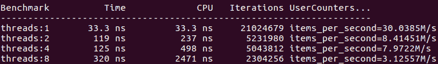
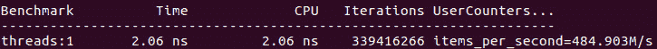
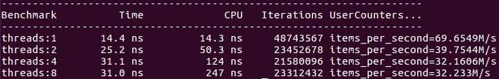
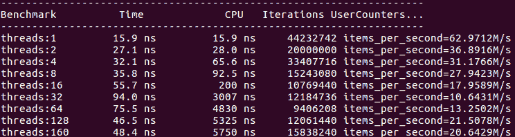
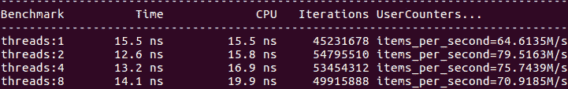
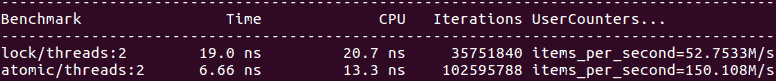
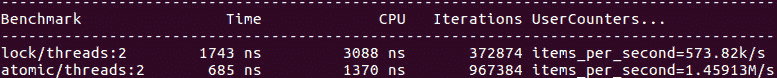
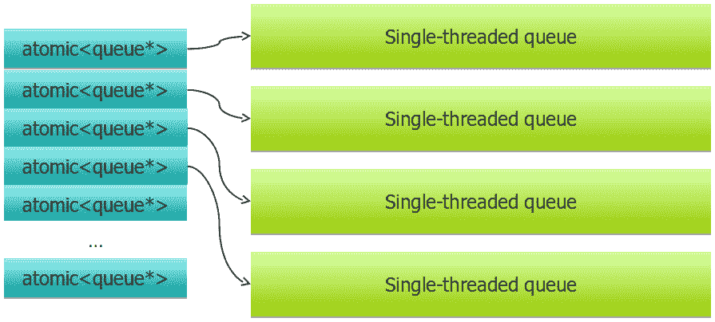
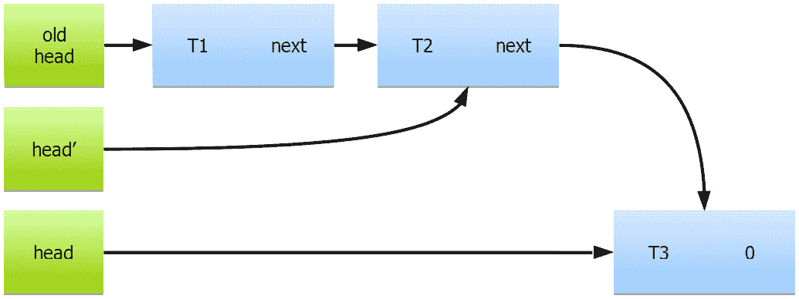

# 七、并发的数据结构

在上一章中，我们详细探讨了可用于确保并发程序正确性的同步原语。我们还研究了这些程序的最简单但有用的构建块: **线程安全计数器**和**指针**。

在本章中，我们将继续研究并发程序的数据结构。本章的目的有两个方面: 一方面，您将学习如何设计几种基本数据结构的线程安全变体。另一方面，我们将指出一些一般原则和观察，这些原则和观察对于设计您自己的数据结构以用于并发程序以及评估组织和存储数据的最佳方法非常重要。

在本章中，我们将介绍以下主要主题:

*   了解线程安全的数据结构，包括顺序容器、堆栈和队列、基于节点的容器和列表
*   提高并发、性能和订单保证
*   设计线程安全数据结构的建议

# 技术要求

同样，您将需要一个 C 编译器和一个微基准测试工具，例如我们在上一章中使用的 Google 基准库 (在[https://github.com/google/benchmark](https://github.com/google/benchmark)找到)。本章随附的代码可在[https://github.com/PacktPublishing/ 《高效程序编写艺术》/tree/master/Chapter07](https://github.com/PacktPublishing/The-Art-of-Writing-Efficient-Programs/tree/master/Chapter07)找到。

# 什么是线程安全数据结构？

在我们开始学习线程安全的数据结构之前，我们必须知道它们是什么。如果这看起来像一个简单的问题-*数据结构，可以被多个线程使用一次*-你没有给这个问题足够的思考。每当您开始设计新的数据结构或在并发程序中使用的算法时，问这个问题的重要性我都不为过。如果这句话让你保持警惕，让你暂停一下，这是有充分理由的: 我刚刚暗示了*线程安全数据结构*没有适合每个需求和每个应用的单一定义。事实确实如此，这是非常重要的一点。

## 最好的螺纹安全性

让我们从一些应该显而易见但在实践中经常被遗忘的事情开始: 为高性能设计的一个非常普遍的原则是，*做零工作总是比做一些工作快*。对于当前的主题，可以将此一般原则缩小到*您是否需要此数据结构的任何线程安全性？*确保线程安全，无论采取何种形式，都意味着计算机需要完成一些工作。问问你自己，*我真的需要它吗？我可以安排计算，以便每个线程都有自己的数据集进行操作吗？*

一个简单的示例是我们在上一章中使用的线程安全计数器。如果您需要所有线程始终查看计数器的当前值，那么这是正确的解决方案。但是，假设我们所需要的只是计算在多个线程上发生的一些事件，例如在线程之间划分的大量数据中搜索某些内容。线程不需要知道计数的当前值即可进行搜索。当然，它需要知道计数的最新值来增加它，但这是真的，只有当我们尝试增加所有线程的单个共享计数，像这样:

```cpp
std::atomic<unsigned long> count;
  …
for ( … counting loop … ) { // On each thread
  … search … 
  if (… found …)
    count.fetch_add(1, std::memory_order_relaxed));
}
```

计数本身的表现是令人沮丧的，这可以从我们只计数的基准中看出 (没有*搜索* ):


图 7.1-如果计数是共享的，则对多个线程的计数不会缩放

计数的缩放实际上是负的: 尽管我们尽了最大努力在最小的内存顺序要求下使用无等待计数，但在两个线程上达到相同的计数值要比在一个线程上花费更长的时间。当然，如果搜索与计数相比非常长，那么计数的性能是无关紧要的 (但是搜索代码本身可能会呈现对全局数据或每个线程副本进行某些工作的相同选择，因此请考虑这是一个有益的示例)。

假设我们只关心计算结束时的计数值，当然，更好的解决方案是在每个线程上保持局部计数并仅增加一次共享计数:

```cpp
unsigned long count;
std::mutex M; // Guards count
  …
// On each thread
unsigned long local_count = 0;
for ( … counting loop … ) {
  … search … 
  if (… found …) ++ local_count;
}
std::lock_guard<std::mutex> L(M);
count += local_count;
```

为了突出显示共享计数增量现在有多不重要，我们将使用基本互斥锁; 通常，锁是更安全的选择，因为它更容易理解 (因此，更难制造错误)，尽管在计数的情况下，原子整数实际上会产生更简单的代码。

如果每个线程在到达终点之前将本地计数增加很多次，并且必须增加共享计数，则缩放接近完美:


图 7.2-多线程计数与每个线程计数完美缩放

因此，最好的线程安全性是由您不从多个线程访问数据结构这一事实所保证的。通常，这种安排是以一些开销为代价的: 例如，每个线程都维护一个容器或内存分配器，其大小反复增长和收缩。如果在程序结束之前不将内存释放到主分配器，则可以避免任何锁定。代价将是一个线程上未使用的内存不可用于其他线程，因此总内存使用量将是所有线程的峰值使用量的总和，即使这些峰值使用时刻发生在不同的时间。这是否可以接受取决于问题和实现的细节: 这是你必须为每个程序考虑的事情。

你可以说，当涉及到线程安全时，这整个部分都是一个解决方案。从某种角度来看，它是，但是在实践中经常发生，以至于在不需要的地方使用共享数据结构，并且性能增益可能如此显着，以至于需要提出这一点。现在是时候转到*真正的*线程安全，其中必须在线程之间共享数据结构。

## 真正的螺纹安全

让我们假设我们确实需要同时从多个线程访问特定的数据结构。现在我们必须谈谈线程安全。但是仍然没有足够的信息来确定这个*线程安全*是什么意思。我们已经在上一章中讨论了强弱线程安全保证。我们将在本章中看到，即使分区是不够的，但它使我们走上了正确的道路: 而不是谈论一般的*线程安全*，我们应该描述数据结构提供的关于并发访问的一组保证。

正如我们所看到的，较弱的 (但通常很容易提供) 保证是，只要保持不变，多个线程就可以读取相同的数据结构。最有力的保证是，显然，任何操作都可以在任何时间由任意数量的线程完成，并且数据结构保持在定义良好的状态。这种保证往往既昂贵又没有必要。您的程序可能需要数据结构支持的一些但不是所有操作的这样的保证。可能存在其他简化，例如一次访问数据结构的线程数量可能会受到限制。

通常，您希望提供尽可能少的保证，以使您的程序正确，而不是更多: 额外的线程安全功能通常非常昂贵，即使不使用它们也会产生开销。

考虑到这一点，让我们开始探索具体的数据结构，看看提供不同级别的线程安全保证需要什么。

# 线程安全堆栈

从并发性的角度来看，最简单的数据结构之一是**堆栈**。堆栈上的所有操作都处理顶部元素，因此 (至少在概念上) 存在一个需要防止种族的位置。

C 标准库为我们提供了`std::stack`容器，因此它是一个很好的起点。包括堆栈在内的所有 C 容器都提供了弱的线程安全保证: 只读容器可以被许多线程安全访问。换句话说，任何数量的线程都可以同时调用任何`const`方法，只要没有线程调用任何非`const`方法。虽然这听起来很容易，几乎是简单的，但这里有一个微妙的观点: 在对象的最后修改和被认为是只读的程序部分之间，必须有某种同步事件伴随着记忆障碍。换句话说，在所有线程执行内存屏障之前，写访问并没有真正完成*: 编写器必须至少发布，而所有读者必须获取。任何更强的屏障也将起作用，锁也将起作用，但是每个线程都必须采取此步骤。*

 *## 螺纹安全接口设计

现在，如果至少有一个线程正在修改堆栈，并且我们需要更强大的保证，该怎么办？提供一个最直接的方法是用互斥体保护类的每个成员函数。这可以在应用级别完成，但是这种实现不会强制执行线程安全性，因此容易出错。也很难调试和分析，因为锁与容器没有关联。

一个更好的选择是用我们自己的*包装*堆栈类，就像这样:

```cpp
template <typename T> class mt_stack {
  std::stack<T> s_;
  std::mutex l_;
  public:
  mt_stack() = default;
  void push(const T& v) {
    std::lock_guard g(l_);
    s_.push(v);
  }
  …
};
```

请注意，我们可以使用继承而不是封装。这样做会更容易编写`mt_stack`的构造函数: 我们只需要一个`using`语句。但是，使用公共继承会暴露基类`std::stack`的每个成员函数，因此，如果我们忘记包装其中一个，则代码将编译，但将直接调用不受保护的成员函数。私有 (或受保护) 继承可以避免此问题，但会带来其他危险。一些构造函数需要重新实现: 例如，移动构造函数需要锁定正在移动的堆栈，因此无论如何它都需要一个自定义实现。如果没有包装器，其他几个构造函数将很危险，因为它们会读取或修改其参数。总的来说，如果我们必须编写我们想要提供的每个构造函数，它会更安全。这与 C 的非常普遍的规则是一致的; *更喜欢组合而不是继承*。

我们的线程安全或多线程堆栈 (这就是*mt*所代表的) 现在具有*推送*功能，并且可以接收数据。我们只需要界面的另一半，即*pop*。我们当然可以遵循前面的示例，并包装`pop()`方法，但这还不够: STL 堆栈使用三个独立的成员函数从堆栈中删除元素。`pop()`删除了 top 元素，但什么也不返回，所以如果你想知道堆栈的顶部是什么，你必须首先调用`top()`。如果堆栈为空，则调用是未定义的行为，因此您必须首先调用`empty()`并检查结果。好的，我们可以包装所有三种方法，但这根本没有给我们任何东西。在下面的代码中，假设堆栈的所有成员函数都由锁保护:

```cpp
mt_stack<int> s;
  … push some data on the stack … 
int x = 0;
if (!s.empty()) {
  x = s.top();
  s.pop();
}
```

每个成员函数都是完全线程安全的，并且在多线程上下文中完全无用: 堆栈可能是非空的时刻-我们碰巧调用`s.empty()`的时刻-但在下一次变为空，在我们调用`s.top()`之前，因为另一个线程可以同时删除顶部元素。

这很可能是整本书中最重要的一课: *为了提供可用的线程安全功能，必须在考虑线程安全的情况下选择接口*。更一般地，不可能在现有设计的基础上添加*螺纹安全。相反，设计必须考虑到线程安全。原因是这样的: 您可能会选择在设计中提供某些在并发程序中无法维护的保证和不变量。例如，`std::stack`提供了一个保证，如果您调用`empty()`并且它返回`false`，只要您在这两次调用之间不对堆栈做任何其他操作，就可以安全地调用`top()`。在多线程程序中没有实际有用的方法来维护此保证。*

幸运的是，由于无论如何我们都在编写自己的包装类，因此我们不受限制地使用包装类的接口。那么，我们应该怎么做呢？显然，整个*pop*操作应该是单个成员函数: 它应该从堆栈中删除顶部元素并将其返回给调用者。一个复杂的问题是当堆栈为空时该怎么做。我们这里有多种选择。我们可以返回一对值和一个布尔标志，该标志指示堆栈是否为空 (在这种情况下，该值必须是默认构造的)。我们可以单独返回布尔值，并通过引用传递值 (如果堆栈为空，它保持不变)。在 C++ 17 中，自然的解决方案是返回`std::optional`，如下面的代码所示。它非常适合持有可能不存在的价值的工作:

```cpp
template <typename T> class mt_stack {
  std::stack<T> s_;
  std::mutex l_;
  public:
  std::optional<T> pop() {
    std::lock_guard g(l_);
    if (s_.empty()) {
      return std::optional<T>(std::nullopt);
    } else {
      std::optional<T> res(std::move(s_.top()));
      s_.pop();
      return res;
    }
  }
};
```

如您所见，从堆栈中弹出元素的整个操作现在都受到锁的保护。这个接口的关键属性是它是事务性的: 每个成员函数将对象从一个已知状态带到另一个已知状态。

如果对象必须过渡到一些没有充分定义的中间状态，例如调用`empty()`之后但调用`pop()`之前的状态，那么这些状态必须对调用方隐藏。相反，调用者会呈现一个原子事务: 要么返回顶部元素，要么通知调用者没有一个元素。这确保了程序的正确性; 现在，我们可以看看性能。

## 互斥锁保护数据结构的性能

我们的堆栈性能如何？鉴于每个操作都是从头到尾锁定的，我们不应该期望对堆栈成员函数的调用完全可以扩展。充其量，所有线程都将串行执行其堆栈操作，但是，实际上，我们应该期望从锁定中获得一些开销。如果我们将多线程堆栈的性能与单个线程上的`std::stack`的性能进行比较，则可以在基准测试中测量此开销。

为了简化基准测试，您可以选择在`std::stack`周围实现一个单线程非阻塞包装器，该包装器呈现与我们的`mt_stack`相同的接口。请注意，您不能仅通过推动堆栈来进行基准测试: 您的基准测试可能会耗尽内存。同样，您不能可靠地对 pop 操作进行基准测试，除非您想测量从空堆栈中弹出的成本。如果基准测试运行的时间足够长，则必须将 push 和 pop 结合起来。最简单的基准可能是这样的:

```cpp
mt_stack<int> s;
void BM_stack(benchmark::State& state) {
  const size_t N = state.range(0);
  for (auto _ : state) {
    for (size_t i = 0; i < N; ++ i) s.push(i);
    for (size_t i = 0; i < N; ++ i) 
      benchmark::DoNotOptimize(s.pop());
  }
  state.SetItemsProcessed(state.iterations()*N);
}
```

运行多线程时，有可能在堆栈为空时发生一些`pop()`操作。这对于您正在为其设计堆栈的应用可能是现实的。而且，由于基准仅为我们提供了实际应用中数据结构性能的近似值，因此可能并不重要。为了更准确的测量，您可能必须模拟应用产生的真实的推送和弹出操作顺序。无论如何，结果应该是这样的:



图 7.3-互斥锁堆栈的性能

请注意，这里的 “item” 是一个推送，然后是一个 pop，因此 “items per secons” 的值显示我们每秒可以通过堆栈发送多少个数据元素。为了进行比较，没有任何锁的相同堆栈在单个线程上的执行速度要快 10 倍以上:



图 7.4-std::stack 的性能 (与图 7.3 比较)

正如我们所看到的，使用互斥体的堆栈的最简单实现性能相当差。但是，您不应该急于找到或设计一些聪明的线程安全堆栈，至少现在还没有。你应该问的第一个问题是，*有关系吗？*应用如何处理堆栈上的数据？比方说，如果每个数据元素都是一个需要几秒钟的模拟参数，那么堆栈的速度可能并不重要。另一方面，如果堆栈是某些实时事务处理系统的核心，则其速度很可能是整个系统性能的关键。

顺便说一句，对于任何其他数据结构 (例如 list，deque，queue 和 tree)，结果可能是相似的，其中单个操作比互斥锁上的操作快得多。但是在我们尝试提高性能之前，我们必须确切地考虑我们的应用需要什么样的性能。

## 不同用途的性能要求

在本章的其余部分，让我们假设数据结构的性能在应用中很重要。现在，我们可以看到最快的堆栈实现了吗？再说一次，还没有。我们还需要考虑使用模型; 换句话说，我们用堆栈做什么，什么需要快。

例如，正如我们刚刚看到的那样，mutex 保护堆栈性能不佳的关键原因是它的速度本质上受到 mutex 本身的限制。对堆栈操作进行基准测试几乎与对互斥锁和解锁进行基准测试相同。提高性能的一种方法是改进互斥体的实现或使用另一种同步方案。另一种方法是减少互斥体的使用; 这种方式需要我们重新设计客户端代码。

例如，通常，调用方具有必须推送到堆栈的多个项目。类似地，调用者可能能够一次从堆栈中弹出几个元素并对其进行处理。在这种情况下，我们可以使用数组或另一个容器来实现批处理推送或批处理弹出，以一次将多个元素复制到堆栈中并从堆栈中复制。由于锁定的开销很大，因此我们可以预期，例如，通过一个锁定/解锁操作推动堆栈上的 1,024 元素比在单独的锁定下推动每个元素更快。实际上，基准测试表明情况确实如此:


图 7.5-批处理堆栈操作的性能 (每个锁 1,024 个元素)

我们应该非常清楚这种技术做什么和不完成什么: 如果关键部分比锁定操作本身快得多，它就会减少锁定的开销。它不会使锁定的操作缩放。此外，通过延长关键部分，我们强制线程在锁上等待更长的时间。如果所有线程大多都试图访问堆栈，这很好 (这就是基准测试变得更快的原因)。但是，如果在我们的应用中，线程大部分都在进行其他计算，并且只是偶尔访问堆栈，那么更长的等待时间可能会降低整体性能。为了明确回答批量推送和批量弹出是否有益，我们必须在更现实的背景下对它们进行分析。

在其他情况下，搜索更有限的、特定于应用的解决方案可以产生远远高于一般解决方案的任何改进实现的性能增益。例如，这种情况在某些应用中很常见: 单个线程将堆栈上的大量数据提前推送，然后多个线程将数据从堆栈中删除并进行处理，并可能将更多数据推送到堆栈中。在这种情况下，我们可以实现解锁的推送，仅在单线程上下文中用于前期推送。虽然调用者的责任是永远不要在多线程上下文中使用此方法，但解锁的堆栈比锁定的堆栈快得多，因此可能值得复杂性。

更复杂的数据结构提供了多种使用模型，但即使是堆栈也可以被更多的简单的 push 和 pop 使用。我们也可以在不删除它的情况下查看顶部元素。`std::stack`提供了`top()`成员函数，但是，再一次，它不是事务性的，所以我们必须创建我们自己的。它与 transactional`pop()`函数非常相似，只是没有移除 top 元素:

```cpp
template <typename T> class mt_stack {
  std::stack<T> s_;
  mutable std::mutex l_;
  public:
  std::optional<T> top() const {
    std::lock_guard g(l_);
    if (s_.empty()) {
      return std::optional<T>(std::nullopt);
    } else {
      std::optional<T> res(s_.top());
      return res;
    }
  }
};
```

请注意，为了允许仅查找函数`top()`被声明`const`，我们必须将互斥体声明为`mutable`。这样做应该谨慎: 多线程程序的约定是，在 STL 之后，只要不调用非`const`成员函数，所有`const`成员函数都可以在多个线程上安全调用。这通常意味着`const`方法不会修改对象，它们是真正的只读。可变数据成员违反了这一假设。至少，它们不应该表示对象的逻辑状态: 它们只是实现细节。然后，在修改它们时，应注意避免任何种族条件。互斥体满足这两个要求。

现在我们可以考虑不同的使用模式。在某些应用中，数据被推送到堆栈上并从中弹出。在其他情况下，在每次推动和弹出之间可能需要多次检查顶部堆栈元素。让我们先关注后一种情况。再次检查`top()`方法的代码。这里有一个明显的低效率: 由于锁定，任何时刻只有一个线程可以读取堆栈的顶部元素。但是读取顶部元素是一种非修改 (只读) 操作。如果所有线程都这样做，并且没有线程尝试同时修改堆栈，则我们根本不需要锁，并且`top()`操作将完美扩展。相反，它具有类似于`pop()`方法的性能。

我们不能在`top()`中省略锁的原因是我们不能确定另一个线程没有同时调用`push()`或`pop()`。但是即使那样，我们也不需要将两个呼叫锁定在彼此之间。他们可以同时进行。只有修改堆栈的操作才需要锁定。有一种类型的锁提供了这样的功能; 它是最常被称为**读写锁**。任意数量的线程都可以使用读取锁，并且这些线程不会互相阻碍。但是，只有在没有其他线程持有读锁的情况下，写锁才能仅由一个线程采用。在 C 中，术语不同 (但功能完全相同): 读取器线程使用共享锁 (同一互斥体上的任意数量的共享锁可以同时存在)，但是编写器线程需要唯一的锁 (在给定的互斥体上只有一个这样的锁可以存在)。如果另一个线程已经拥有唯一锁，则尝试使用共享锁将阻止; 同样，如果另一个线程在同一互斥锁上拥有任何锁，则尝试使用唯一锁将阻止。使用共享互斥锁，我们可以用我们需要的锁来实现堆栈; `top()`方法使用共享锁，因此任意数量的线程都可以同时执行它，但是`push()`和`pop()`方法需要唯一的锁:

```cpp
template <typename T> class rw_stack {
  std::stack<T> s_;
  mutable std::shared_mutex l_;
  public:
  void push(const T& v) {
    std::unique_lock g(l_);
    s_.push(v);
  }
  std::optional<T> pop() {
    std::unique_lock g(l_);
    if (s_.empty()) {
      return std::optional<T>(std::nullopt);
    } else {
      std::optional<T> res(std::move(s_.top()));
      s_.pop();
      return res;
    }
  }
  std::optional<T> top() const {
    std::shared_lock g(l_);
    if (s_.empty()) {
      return std::optional<T>(std::nullopt);
    } else {
      std::optional<T> res(s_.top());
      return res;
    }
  }
};
```

不幸的是，我们的基准测试表明，对`top()`的调用本身的性能即使使用读写锁也无法扩展:


图 7.6-具有 std::shared_mutex 的堆栈的性能; 只读操作

更糟糕的是，与常规互斥锁相比，需要唯一锁的操作的性能下降得更大:


图 7.7-std::shared_mutex 的堆栈性能; 写操作

将*图 7.6*和*7.7*与*图 7.4*中的早期测量结果进行比较，我们可以看到，读写锁根本没有给我们任何改进。这个结论远非通用: 不同互斥体的性能取决于实现和硬件。但是，通常，更复杂的锁 (例如共享互斥锁) 将比简单的锁具有更多的开销。他们的目标应用是不同的: 如果关键部分本身花费了更长的时间 (例如，毫秒而不是微秒)，并且大多数线程执行只读代码，那么不将只读线程彼此锁定将有很大的价值，几微秒的开销就不那么明显了。

较长的关键部分观察非常重要: 如果我们的堆栈元素要大得多并且复制非常昂贵，那么与复制大型对象的成本相比，锁的性能将不那么重要，并且我们将开始看到缩放。但是，假设我们的总体目标是使程序快速，而不是展示可扩展的堆栈实现，我们将通过完全消除昂贵的复制并使用指针堆栈来优化整个应用。

尽管我们在读写锁方面遭受了挫折，但我们在实现更高效的想法上走上了正确的道路。但是在设计一个之前，我们必须更详细地了解每个堆栈操作的确切作用以及我们必须防范的每个步骤中可能存在的数据竞争。

## 详细介绍堆栈性能

当我们试图提高线程安全堆栈 (或任何其他数据结构) 的性能超越简单的锁保护实现时，我们必须首先详细了解每个操作中涉及的步骤，以及它们如何与在不同线程上执行的其他操作交互。本节的主要价值不是更快的堆栈，而是这种分析: 事实证明，这些低级步骤对于许多数据结构都是通用的。让我们从推送操作开始。大多数堆栈实现都是在一些类似数组的容器之上构建的，所以让我们将堆栈的顶部视为一个连续的内存块:


图 7.8-用于推动操作的堆栈顶部

堆栈上有`N`元素，因此元素计数也是下一个元素将去的第一个空闲插槽的索引。推送操作必须将顶部索引 (也是元素计数) 从`N`递增到`N+1`以保留其插槽，然后在插槽`N`中构建新的元素。请注意，这个顶部索引是数据结构中执行推送的线程可以相互交互的唯一部分: 只要索引增量操作是线程安全的，只有一个线程可以看到索引的每个值。执行推送的第一个线程将顶部索引前进到`N+1`并保留第`N`个插槽，下一个线程将索引递增到`N+2`并保留`N+1`的 st 插槽，依此类推。这里的关键点是，插槽本身没有竞争: 只有一个线程可以获得一个特定的插槽，因此它可以在那里构造对象，而没有另一个线程干扰它的任何危险。

这为推送操作提出了一个非常简单的同步方案: 我们所需要的只是顶部索引的单个原子值:

```cpp
std::atomic<size_t> top_;
```

推送操作原子地增加此索引，然后在索引的旧值索引的数组插槽中构造新元素:

```cpp
const size_t top = top_.fetch_add(1);
new (&data[top]) Element(… constructor arguments … );
```

同样，无需保护构建步骤不受其他线程的影响。原子索引都是我们需要使推送操作线程安全。顺便说一句，如果我们使用数组作为堆栈内存，这是正确的。如果我们使用一个容器，比如`std::deque`，我们不能简单地在它的内存上构造一个新的元素: 我们必须调用`push_back`来更新容器的大小，即使 deque 不需要分配更多的内存，这个调用也不是线程安全的。出于这个原因，超越基本锁的数据结构实现通常也必须管理自己的内存。说到内存，到目前为止，我们已经假设数组有空间添加更多元素，并且我们不会耗尽内存。让我们暂时坚持这个假设。

到目前为止，我们所拥有的是一种在特定情况下实现线程安全推送操作的非常有效的方法: 多个线程可能正在将数据推送到堆栈上，但是在完成所有推送操作之前，没有人会读取它。

同样的想法是可行的，如果我们有一个堆栈的元素已经推送到它，我们需要弹出它们 (不再添加新的元素)。*图 7.8*也适用于这种情况: 线程原子递减顶部计数，然后将顶部元素返回给调用者:

```cpp
const size_t top = top_.fetch_sub(1);
return std::move(data[top]);
```

原子减量保证只有一个线程可以访问作为顶部元素的每个数组插槽。当然，这仅在堆栈不为空的情况下有效。我们可以将顶部元素索引从无符号更改为有符号整数; 然后，当索引变为负数时，我们将知道堆栈为空。

同样，这是在非常特殊的条件下实现线程安全的 pop 操作的一种非常有效的方法: 堆栈已经被填充，并且没有添加新的元素。在这种情况下，我们还知道堆栈上有多少个元素，因此很容易避免尝试弹出空堆栈。

在某些特定的应用中，这可能具有一定的价值: 如果堆栈首先由多个线程填充而没有任何持久性有机污染物，并且在程序中有一个明确定义的点，它从添加数据切换到删除数据，那么我们就有了一个很好的解决方案针对问题的每一半。但是让我们继续一个更普遍的案例。

不幸的是，当涉及到从堆栈中读取时，我们非常高效的推送操作毫无帮助。让我们再次考虑如何实现弹出顶部元素的操作。我们有顶部索引，但它告诉我们的是当前正在构建多少个元素; 它没有说明最后一个元素的位置，其构建完成 (*图 7.9*中的元素`N-3` ):


图 7.9-push 和 pop 操作的堆栈顶部

当然，执行推送的线程以及因此的构造知道何时完成。也许我们需要的是另一个计数，显示有多少元素被完全构建。唉，要是这么简单就好了。在*图 7.9*中，假设线程 A 正在构造元素`N-2`，线程 B 正在构造元素`N-1`。显然，线程 A 是第一个递增顶部索引的。但这并不意味着它也将是第一个完成推送的人。B 螺纹可以先完成施工。现在，堆栈上最后一个构造的元素具有索引`N-1`，因此我们可以将*构造的计数*推进到`N-1` (请注意，我们*跳过*元素`N-2`，仍在建设中)。现在我们想弹出顶部元素; 没问题，元素`N-1`已准备就绪，我们可以将其返回给调用者并将其从堆栈中删除; *构造的计数*现在递减为`N-2`。接下来我们应该弹出哪个元素？元素`N-2`还没有准备好，但是我们的堆栈中没有任何东西警告我们。对于完成的*元素，我们只有一个计数，它的值是`N-1`。现在我们有了在堆栈上构造新元素的线程和试图弹出它的线程之间的数据竞赛。*

即使没有这场比赛，还有另一个问题: 我们只是弹出了元素`N-1`，这在当时是正确的做法。但是当这种情况发生时，在线程 C 上请求了一个推送。应该使用哪个插槽？如果我们使用 slot`N-1`，我们有可能覆盖线程 A 当前正在访问的相同元素。如果我们使用 slot`N`，那么，一旦完成所有操作，我们在数组中有一个*孔*: 顶部的元素是`N`，但下一个不是`N-1`: 它已经弹出了，我们必须跳过它。这个数据结构中没有任何内容告诉我们必须这样做。

我们可以保持跟踪哪些元素是*真实*，哪些元素是*孔*，但这变得越来越复杂 (以线程安全的方式进行操作将需要额外的同步，这将降低性能)。此外，留下许多阵列插槽未使用会浪费内存。我们可以尝试将*孔*重新用于在堆栈上推送的新元素，但是此时，元素不再连续存储，原子顶部计数不再起作用，并且整个结构开始类似于列表。顺便说一句，如果您认为列表将是实现线程安全堆栈的好方法，请等到您在本章后面看到实现线程安全列表需要什么。

在设计的这一点上，我们必须暂停深入研究实现细节，并再次回顾解决问题的更一般的方法。我们必须做两个步骤: 概括我们对堆栈实现细节的更深入理解得出的结论，并做一些性能估计，以大致了解哪些解决方案可能带来性能改进。我们将从后者开始。

## 同步方案的性能估计

我们的第一次尝试一个非常简单的堆栈实现没有锁，产生了一些有趣的解决方案的特殊情况，但没有一般的解决方案。在我们花更多的时间构建一个复杂的设计之前，我们应该尝试估计它比简单的基于锁的设计更有效率的可能性。

当然，这看起来像是循环推理: 为了估计性能，我们必须首先有一些东西来估计。但是，我们不希望在没有至少一些保证的情况下进行复杂的设计，这些保证需要进行性能评估。

幸运的是，我们可以回到我们之前学到的一般观察: 并发数据结构的性能很大程度上取决于有多少共享变量被并发访问。让我们假设我们可以想出一个聪明的方法，用一个原子计数器来实现堆栈。可以合理地假设，每次推送和弹出都必须对该计数器进行至少一个原子增量或减量 (除非我们正在进行批处理操作，但我们已经知道它们的速度更快)。如果我们做一个将单线程堆栈上的 push 和 pop 与共享原子计数器上的原子操作相结合的基准测试，我们可以得到一个合理的性能估计。没有同步进行，所以我们必须为每个线程使用单独的堆栈，以避免竞争条件:

```cpp
std::atomic<size_t> n;
void BM_stack0_inc(benchmark::State& state) {
  st_stack<int> s0;
  const size_t N = state.range(0);
  for (auto _ : state) {
    for (size_t i = 0; i < N; ++ i) {
      n.fetch_add(1, std::memory_order_release);
      s0.push(i);
    }
    for (size_t i = 0; i < N; ++ i) {
      n.fetch_sub(1, std::memory_order_acquire);
      benchmark::DoNotOptimize(s0.pop());
    }
  }
  state.SetItemsProcessed(state.iterations()*N);
}
```

在这里，`st_stack`是一个堆栈包装器，它提供了与我们基于锁的`mt_stack`相同的接口，但没有任何锁。真正的实现将会慢一些，因为堆栈顶部也在线程之间共享，但这将从上面给我们一个估计: 实际上线程安全的任何实现都不太可能超越这个人为基准。我们将结果与什么进行比较？*中的基于锁的堆栈的基准图 7.3*示出了基于锁的堆栈的性能，即在一个线程上的每秒 30M push/pop 操作和在 8 个线程上的 3.1M 之间。我们还知道，没有任何锁的堆栈的基准性能约为每秒 485M 操作 (*图 7.4*)。在同一台机器上，我们对单个原子计数器的性能估计得出以下结果:



图 7.10-具有单个原子计数器的假设堆栈的性能估计

结果似乎是一个混合的袋子: 即使在最佳条件下，我们的堆栈也不会扩展。同样，这主要是因为我们正在测试一堆小元素; 如果元素很大且复制成本很高，我们将看到扩展，因为多个线程可以同时复制数据。但是较早的观察结果是: 如果复制数据变得如此昂贵，以至于我们需要许多线程来完成它，那么我们最好使用一堆指针，而根本不复制任何数据。

另一方面，原子计数器比基于互斥体的堆栈快得多。当然，这是从上面估计的，但它表明无锁堆栈有一些可能性。但是，基于锁的堆栈也是如此: 当我们需要锁定非常短的关键部分时，有比`std::mutex`更有效的锁。当我们实现自旋锁时，我们已经在[*第 6 章*](06.html#_idTextAnchor103)，*并发和性能*中看到了一个这样的锁。如果我们在基于锁的堆栈中使用这个自旋锁，那么，而不是*图 7.2*，我们得到这些结果:


图 7.11-基于 spinlock 的堆栈的性能

将此结果与*进行比较图 7.10*描绘了一个非常令人沮丧的画面: 我们不会提出可以胜过简单的 spinlock 的无锁设计。在某些情况下，自旋锁可以胜过原子增量的原因与该特定硬件上不同原子指令的相对性能有关。我们不应该过多地阅读它。

我们可以尝试使用原子交换或比较交换而不是原子增量来进行相同的估计。当您了解有关设计线程安全数据结构的更多信息时，您将了解哪种同步协议可能有用，以及应将哪些操作纳入估算。另外，如果您使用特定的硬件，则应运行简单的基准测试，以确定哪些操作在其上更有效。到目前为止，所有结果都是在 X86-based 硬件上获得的。如果我们在专门为 HPC 应用设计的基于 ARM 的大型服务器上运行相同的估计，我们会得到非常不同的结果。基于锁的堆栈的基准可得出以下结果:


图 7.12-ARM HPC 系统上基于锁的堆栈的性能

ARM 系统通常比 X86 系统具有更多的内核数量，而单个内核的性能则较低。该特定系统在两个物理处理器上具有 160 核心，并且当程序运行在两个 cpu 上时，锁的性能显著下降。应该使用比较和交换指令而不是原子增量来估算无锁堆栈性能的上限 (后者在这些处理器上效率特别低)。



图 7.13-具有单个 CAS 操作的假设堆栈的性能估计 (ARM 处理器)

根据图 7.13 中的估计，对于大量线程，我们有可能提出比简单的基于锁的堆栈更好的方法。我们将继续努力开发无锁堆栈。这有两个原因: 首先，这种努力最终会在一些硬件上有所回报。其次，此设计的基本元素将在稍后的许多其他数据结构中看到，并且堆栈为我们提供了一个简单的测试用例来了解它们。

## 无锁堆栈

既然我们已经决定尝试并超越一个简单的基于锁的实现，我们需要来考虑我们从自己的 push 和 pop 操作探索中学到的教训。每个操作本身都非常简单，但是两者的相互作用是造成复杂性的原因。这是一种非常常见的情况: 正确地同步在多个线程上运行的生产者和消费者操作比仅处理生产者或仅处理消费者要困难得多。在设计自己的数据结构时，请记住这一点: 如果您的应用允许对您需要支持的操作进行任何形式的限制，例如生产者和消费者在时间上是分开的，或者存在单个生产者 (或消费者) 线程，您几乎可以肯定可以为这些有限的操作设计更快的数据结构。

假设我们需要一个完全通用的堆栈，可以通过一个非常简单的示例来理解生产者-消费者交互问题的实质。同样，我们假设堆栈是在数组或类似数组的容器之上实现的，并且元素是连续存储的。假设我们当前在堆栈上有`N`元素。生产者线程 P 正在执行推送操作，消费者线程 C 正在同时执行 pop 操作。结果应该是什么？虽然试图想出一个无等待的设计是很诱人的 (就像我们只为消费者或只有生产者做的那样)，任何允许两个线程进行而无需等待的设计都将打破我们关于如何存储元素的基本假设: 线程 C 必须等待线程 P 完成推送或返回当前 top 元素`N`。同样，线程 P 必须等待线程 C 完成或在插槽`N+1`中构造一个新元素。如果两个线程都没有等待，则结果是数组中的*孔*: 最后一个元素具有索引`N+1`，但是插槽中没有任何存储`N`，因此当我们从堆栈中弹出数据时，我们必须以某种方式跳过它。

看起来像我们必须放弃无等待堆栈实现的想法，并使其中一个线程等待另一个线程完成其操作。当顶部索引为零并且消费者线程试图进一步递减它时，我们还必须处理空堆栈的可能性。当顶部索引指向最后一个元素并且生产者线程需要另一个插槽时，类似的问题发生在数组的上限。

这两个问题都需要有界原子增量操作: 执行增量 (或递减)，除非该值等于指定的边界。在 C 中 (或在当今可用的任何主流硬件上) 没有现成的原子操作，但是我们可以使用**比较和交换** (**CAS**) 实现它，如下所示:

```cpp
std::atomic<int> n_ = 0;
int bounded_fetch_add(int dn, int maxn) {
  int n = n_.load(std::memory_order_relaxed);
  do {
    if (n + dn >= maxn || n + dn < 0) return -1;
  } while (!n_.compare_exchange_weak(n, n + dn,
           std::memory_order_release,
           std::memory_order_relaxed));
  return n;
}
```

这是如何使用 CAS 操作来实现复杂的无锁原子操作的典型示例:

1.  读取变量的当前值。
2.  检查必要条件。在我们的情况下，我们验证增量不会为我们提供指定边界`[0, maxn)`之外的值。如果有界增量失败，我们通过返回`-1`将其信号通知给调用者 (这是一个任意选择; 通常，对于越界情况，有一个特定的操作要执行)。
3.  如果当前值仍然等于我们之前阅读的值，则原子地将该值替换为所需的结果。
4.  如果*步骤 3*失败，则当前值已更新，请再次检查，并重复*步骤 3*和*4*，直到成功。

虽然这似乎是一种锁，但有一个根本的区别: CAS 比较可能在一个线程上失败的唯一方法是，如果它在另一个线程上成功 (并且原子变量被递增)，所以任何时候都有共享资源的争用，至少有一个线程可以保证向前进展。

还有一个更重要的观察结果，它通常使可伸缩的实现和效率很低的实现之间的所有区别。如所写，CAS 循环对大多数现代操作系统的调度算法非常不利: 循环失败的线程也会消耗更多的 CPU 时间，并且会被赋予更高的优先级。这与我们想要的完全相反: 我们希望当前正在做有用工作的线程运行得更快。解决方案是让线程在几次失败的 CAS 尝试后产生调度程序。这是通过依赖于 OS 的系统调用来完成的，但是 C 通过调用`std::this_thread::yield()`具有独立于系统的 API。在 Linux 上，通常可以通过调用`nanosleep()`函数在循环的每几次迭代中休眠最短的时间 (1 纳秒) 来获得更好的性能:

```cpp
  int i = 0;
  while ( … ) {
    if (++ i == 8) {
      static constexpr timespec ns = { 0, 1 };
      i = 0;
      nanosleep(&ns, NULL);
    }
  }
```

可以使用相同的方法来实现更复杂的原子事务，例如堆栈推送和 pop 操作。但是首先，我们必须弄清楚需要什么原子变量。对于生产者线程，我们需要数组中第一个空闲插槽的索引。对于消费者线程，我们需要最后一个完全构造的元素的索引。这是我们需要的关于堆栈当前状态的所有信息，假设我们不允许数组中的 “*孔*”:


图 7.14-无锁堆栈: `c_`是最后一个完全构造的元素的索引，`p_`是数组中第一个空闲插槽的索引

首先，如果两个索引当前不相等，则 push 和 pop 都无法进行: 不同的计数意味着正在构建新元素或正在复制当前的顶部元素。在此状态下的任何堆栈修改都可能导致在数组中创建*孔*。

如果两个指数相等，那么我们可以继续。要进行推送，我们需要原子地递增生产者指数`p_` (以阵列的当前容量为界)。然后，我们可以在刚刚保留的插槽中构造新元素 (由`p_`的旧值索引)。然后，我们增加 consumer index`c_`以指示新元素可用于 consumer 线程。请注意，即使在构建完成之前，另一个生产者线程也可以抓住下一个插槽，但是我们必须等到所有新元素都被构建后才能允许任何消费者线程弹出元素。这样的实现是可能的，但是它更复杂，并且它倾向于支持当前执行的操作: 如果当前正在进行推送，则 pop 必须等待，但是另一个推送可以毫不延迟地进行。结果很可能是在所有消费者线程都在等待时执行的推送操作的*群* (如果一个 pop 操作正在进行，效果是相似的; 它有利于另一个 pop)。

pop 的实现方式类似，只有我们先递减 consumer index`c_`以保留顶部插槽，然后在对象从堆栈中复制或移动后递减`p_`。

我们还需要学习一个技巧，那就是如何原子地操纵这两个计数。例如，我们之前说过，一个线程必须等待两个索引相等。如何实现这一目标？如果我们以原子方式读取一个索引，然后以原子方式读取另一个索引，那么自阅读以来，第一个索引可能会发生变化。我们必须在单个原子操作中读取两个索引。对于索引上的其他操作也是如此。C 允许我们声明一个由两个整数组成的原子结构; 但是，我们必须小心: 很少有硬件平台有一个*双 CAS*指令，它可以原子地对两个长整数进行操作，即使这样，它通常也非常慢。更好的解决方案是将两个值都打包到一个 64 位字中 (在 64 位处理器上)。诸如加载或比较交换之类的硬件原子指令并不真正关心您将如何解释它们读取或写入的数据: 它们只是复制和比较 64 位单词。您以后可以将这些位视为长或双精度或一对 ints (原子增量当然是不同的，这就是为什么您不能在双精度值上使用它的原因)。

现在，剩下的就是将前面的算法转换成代码:

```cpp
template <typename T> class mt_stack {
  std::deque<T> s_;
  int cap_ = 0;
  struct counts_t {
    int p_ = 0; // Producer index
    int c_ = 0; // Consumer index
    bool equal(std::atomic<counts_t>& n) {
      if (p_ == c_) return true;
      *this = n.load(std::memory_order_relaxed);
      return false;
    }
  };
  mutable std::atomic<counts_t> n_;
  public:
  mt_stack(size_t n = 100000000) : s_(n), cap_(n) {}
  void push(const T& v);
  std::optional<T> pop();
};
```

这两个索引是打包成 64 位原子值的 32 位整数。方法`equal()`可能看起来很奇怪，但它的目的会在一瞬间变得明显。如果两个索引相等，则返回 true; 否则，它将从指定的原子变量更新存储的索引值。这遵循我们之前看到的 CAS 模式: 如果不满足所需条件，请再次读取原子变量。

注意，我们不能再在 STL 栈之上构建我们的线程安全栈: 容器本身是线程之间共享的，即使容器没有增长，其上的`push()`和`pop()`操作也不是没有锁定的线程安全。为简单起见，在我们的示例中，我们使用了一个 deque，该 deque 初始化为具有足够多的默认构造元素的*。只要我们不调用任何容器成员函数，我们就可以独立地从不同线程对容器的不同元素进行操作。请记住，这只是避免同时处理内存管理和线程安全的捷径: 在任何实际实现中，您都不希望默认-预先构造所有元素 (并且元素类型甚至可能没有默认构造函数)。通常，高性能并发软件系统无论如何都有自己的自定义内存分配器。否则，您也可以使用与堆栈元素类型相同大小和对齐方式的虚拟类型的 STL 容器，但是使用简单的构造函数和析构函数 (实现足够简单，留给读者练习)。*

推送操作实现了我们前面讨论的算法: 等待指数变得相等，提前生产者指数`p_`，构造新对象，完成后提前消费者指数`c_`:

```cpp
void push(const T& v) {
  counts_t n = n_.load(std::memory_order_relaxed);
  if (n.p_ == cap_) abort();
  while (!n.equal(n_) || 
    !n_.compare_exchange_weak(n, {n.p_ + 1, n.c_},
      std::memory_order_acquire,
      std::memory_order_relaxed)) {
    if (n.p_ == cap_) { … allocate more memory … }
  };
  ++ n.p_;
  new (&s_[n.p_]) T(v);
  assert(n_.compare_exchange_strong(n, {n.p_, n.c_ + 1},
    std::memory_order_release, std::memory_order_relaxed);
}
```

最后一个 CAS 操作应该永远不会失败，除非我们的代码中有一个 bug: 一旦调用线程成功推进`p_`，任何其他线程都不能改变任何一个值，直到同一个线程 advanced`c_`匹配 (正如我们已经讨论过的，这里面有一个低效率，但是修复它是以更高的复杂性为代价的)。另外，请注意，为简洁起见，我们在循环中省略了对`nanosleep()`或`yield()`的调用，但在任何实际实现中都是必不可少的。

pop 操作是类似的，只是它首先递减消费者索引`c_`，然后，当它从堆栈中删除顶部元素时，递减`p_`以匹配`c_`:

```cpp
std::optional<T> pop() {
  counts_t n = n_.load(std::memory_order_relaxed);
  if (n.c_ == 0) return std::optional<T>(std::nullopt);
  while (!n.equal(n_) || 
    !n_.compare_exchange_weak(n, {n.p_, n.c_ - 1},
      std::memory_order_acquire,
      std::memory_order_relaxed)) {
    if (n.c_ == 0) return std::optional<T>(std::nullopt);
  };
  --n.cc_;
  std::optional<T> res(std::move(s_[n.p_]));
  s_[n.pc_].~T();
  assert(n_.compare_exchange_strong(n, {n.p_ - 1, n.c_},
    std::memory_order_release, std::memory_order_relaxed)); 
  return res;
}
```

同样，如果程序正确，则最后一次比较和交换不应失败。

无锁堆栈是最简单的无锁数据结构之一，它已经相当复杂。验证我们的实现是否正确所需的测试并不简单: 除了所有单线程单元测试之外，我们还必须验证没有竞争条件。最近的 GCC 和 CLANG 编译器中提供的**线程消毒剂** (**TSAN**) 等消毒剂工具使此任务变得更加容易。这些消毒剂的优点是它们检测潜在的数据竞争，而不仅仅是测试期间实际发生的数据竞争 (在一个小测试中，观察到两个线程同时错误地访问同一内存的机会相当渺茫)。

经过我们的所有努力，无锁堆栈的性能如何？正如预期的那样，在 X86 处理器上，它的表现并不优于基于 spinlock 的版本:


图 7.15-X86 CPU 上的无锁堆栈的性能 (与图 7.11 比较)

为了进行比较，自旋锁保护的堆栈可以在同一台计算机上每秒执行约 70m 的操作。这与我们在上一节的性能估计之后的预期是一致的。然而，同样的估计表明，无锁堆栈在 ARM 处理器上可能更优越。基准确认我们的努力没有浪费:


图 7.16-ARM CPU 上的无锁堆栈的性能 (与图 7.12 比较)

虽然基于锁的堆栈的单线程性能优越，但如果线程数量很大，则无锁堆栈的速度要快得多。如果基准包括很大一部分`top()`调用 (也就是说，许多线程在一个线程弹出它之前读取顶部元素)，或者如果生产者和消费者线程是不同的 (一些线程只调用`push()`，而其他线程只调用`pop()`)。

为了结束本节，我们探讨了线程安全堆栈数据结构的不同实现。为了理解线程安全需要什么，我们必须分别分析每个操作，以及多个并发操作的交互。以下是我们学到的教训:

*   通过良好的锁实现，受锁保护的堆栈可提供合理的性能，并且比其他方法简单得多。
*   应该利用有关数据结构使用限制的任何特定于应用的知识来廉价地获得性能。这不是开发通用解决方案的地方，恰恰相反: 实现尽可能少的功能，并尝试从限制中获得性能优势。
*   通用的无锁实现是可能的，但是即使对于像堆栈一样简单的数据结构，它也是非常复杂的。有时，这种复杂性甚至可能是合理的。

到目前为止，我们已经避开了内存管理的问题: 它隐藏在模糊的*后面，当堆栈耗尽容量时，分配更多的内存*。我们需要稍后再讨论。但是首先，让我们探索更多不同的数据结构。

# 线程安全队列

我们要考虑的下一个数据结构是队列。它又是一个非常简单的数据结构，从概念上讲是一个可以从两端访问的数组: 将数据添加到数组的末尾，并从数组的开头删除。在实现时，队列和堆栈之间有一些非常重要的区别。也有很多相似之处，我们将经常参考上一节。

就像堆栈一样，STL 有一个队列容器，`std::queue`，它在并发时也有完全相同的问题: 删除元素的接口不是事务性的，它需要三个独立的成员函数调用。如果我们想使用具有锁的`std::queue`来创建线程安全队列，我们将不得不像使用堆栈一样包装它:

```cpp
template <typename T> class mt_queue {
  std::queue<T> s_;
  mutable spinlock l_;
  public:
  void push(const T& v) {
    std::lock_guard g(l_);
    s_.push(v);
  }
  std::optional<T> pop() {
    std::lock_guard g(l_);
    if (s_.empty()) {
      return std::optional<T>(std::nullopt);
    } else {
      std::optional<T> res(std::move(s_.front()));
      s_.pop();
      return res;
    }
  }
};
```

我们决定立即使用自旋锁 (一个简单的基准测试可以确认它比互斥锁更快)。如果需要，可以类似于`pop()`方法来实现`front()`方法，而不需要移除前元素。基本基准再次测量了将元素推送到队列并将其弹出所需的时间。使用与上一节相同的 X86 机器，我们可以获得以下数字:



图 7.17-自旋锁保护的 std:: 队列的性能

为了比较，在相同的硬件上，没有任何锁的`std::queue`每秒提供大约 280M 个项目 (一个*项目*是一个推送和一个弹出，所以我们测量我们每秒可以通过队列发送多少个元素)。到目前为止，图片与我们之前看到的堆栈非常相似。为了比锁保护版本做得更好，我们必须尝试提出一个无锁实现。

## 无锁队列

在我们深入设计无锁队列之前，重要的是要对每个事务进行详细的分析，就像我们对堆栈所做的那样。同样，我们将假设队列构建在数组或类似数组的容器的顶部 (并且我们将推迟有关数组已满时会发生什么的问题)。将元素推到队列上看起来就像它对堆栈一样:


图 7.18-将元素添加到队列的后面 (生产者的视图)

我们所需要的只是数组中第一个空槽的索引。但是，从队列中删除元素与堆栈上的相同操作完全不同。您可以在*图 7.19*中看到 (与*图 7.9*比较):


图 7.19-从队列的前面删除元素 (消费者的视图)

元素从队列的前面删除，所以我们需要尚未删除的第一个元素的索引 (队列的当前前面)，并且该索引也是高级的。

现在我们来了解队列和堆栈之间的关键区别: 在堆栈中，生产者和消费者都在同一位置上运行: 堆栈的顶部。我们已经看到了这样做的后果: 一旦生产者开始在堆栈顶部构建一个新元素，消费者就必须等待它完成。pop 操作不能返回最后构造的元素，而不会在数组中留下*孔*，并且在构造完成之前不能返回正在构造的元素。

队列的情况非常不同。只要队列不是空的，生产者和消费者根本就不会互动。推送操作不需要知道前面的索引是什么，并且 pop 操作不关心后面的索引在哪里，只要它在前面的某个地方。生产者和消费者不竞争对相同内存位置的访问。

每当我们有几种不同的方式来访问数据结构，并且它们 (大部分) 不相互交互时，一般建议是首先考虑将这些角色分配给不同线程的场景。进一步的简化可以从每种线程的情况开始; 在我们的情况下，这意味着一个生产者线程和一个消费者线程。

由于只有生产者需要访问返回索引，并且只有一个生产者线程，因此我们甚至不需要该索引的原子整数。同样，前索引只是一个正则整数。两个线程相互交互的唯一时间是队列变为空时。为此，我们需要一个原子变量: 队列的大小。生产者在第一个空槽中构造新元素，并推进后退索引 (以任何顺序，只有一个生产者线程)。然后，它增加队列的大小，以反映这样一个事实，即队列现在有更多的元素准备从它。

消费者必须以相反的顺序操作: 首先，检查大小以确保队列不为空。然后，消费者可以从队列中取出第一个元素并推进前索引。当然，不能保证在检查它的时间和访问前元素的时间之间大小不会改变。但是它不会引起任何问题: 只有一个消费者线程，生产者线程只能增加大小。

在探索堆栈时，我们推迟了向阵列添加更多内存的问题，并假设我们以某种方式知道堆栈的最大容量，并且不会超过它 (如果超过该容量，我们也可以使推送操作失败)。对于队列，同样的假设是不够的: 当元素被添加并从队列中移除时，前面和后面的索引都前进，最终将到达数组的末尾。当然，在这一点上，我们有数组的第一个元素未使用，所以最简单的解决方案是将数组视为循环缓冲区，并对数组索引使用模算术:

```cpp
template <typename T> class pc_queue {
  public:
  explicit pc_queue(size_t capacity) : 
    capacity_(capacity),
    data_(static_cast<T*>(::malloc(sizeof(T)*capacity_))) {}
  ~pc_queue() { ::free(data_); }
  bool push(const T& v) {
    if (size_.load(std::memory_order_relaxed) >= capacity_)
      return false;
    new (data_ + (back_ % capacity_)) T(v);
    ++ back_;
    size_.fetch_add(1, std::memory_order_release);
    return true;
  }
  std::optional<T> pop() {
    if (size_.load(std::memory_order_acquire) == 0) {
      return std::optional<T>(std::nullopt);
    } else {
      std::optional<T> res(
        std::move(data_[front_ % capacity_]));
      data_[front_ % capacity_].~T();
      ++ front_;
      size_.fetch_sub(1, std::memory_order_relaxed);
      return res;
    }
  }
  private:
  const size_t capacity_;
  T* const data_;
  size_t front_ = 0;
  size_t back_ = 0;
  std::atomic<size_t> size_;
};
```

这个队列需要一个特殊的基准，因为我们在其设计上接受的约束: 一个生产者线程和一个消费者线程:

```cpp
pc_queue<size_t> q(1UL<<20);
void BM_queue_prod_cons(benchmark::State& state) {
  const bool producer = state.thread_index & 1;
  const size_t N = state.range(0);
  for (auto _ : state) {
    if (producer) {
      for (size_t i = 0; i < N; ++ i) q.push(i);
    } else {
      for (size_t i = 0; i < N; ++ i) 
        benchmark::DoNotOptimize(q.pop());
    }
  }
  state.SetItemsProcessed(state.iterations()*N);
}
BENCHMARK(BM_queue_prod_cons)->Arg(1)->Threads(2)
  ->UseRealTime();
BENCHMARK_MAIN();
```

为了进行比较，我们应该在相同的条件下对锁保护队列进行基准测试 (锁的性能通常对线程之间的争用的确切性质敏感)。在同一台 X86 机器上，两个队列执行的吞吐量大致为每秒 100M 整数元素。一般来说，在 ARM 处理器上，锁相对更昂贵，我们的队列也不例外:



图 7.20-ARM 上基于锁的整数队列与无锁队列的性能

但是，即使在 X86 上，我们的分析也尚未完成。在上一节中，我们提到，如果堆栈元素很大，则复制它们比线程同步 (锁定或原子操作) 花费的时间相对更长。我们不能充分利用它，因为大多数时候，一个线程仍然需要等待另一个线程完成复制，所以建议了另一种选择: 一堆指针，实际数据存储在其他地方。缺点是我们需要另一个线程安全的容器来存储这些数据 (尽管通常情况下，程序无论如何都需要将其存储在某个地方)。对于队列来说，这仍然是一个可行的建议，但是现在我们有了另一种选择。正如我们已经提到的，队列中的生产者和消费者线程不会相互等待: 它们的交互在检查大小后结束。按理说，如果数据元素很大，则无锁队列将具有优势，因为两个线程都可以同时复制数据，并且线程之间存在争用，或者两个线程竞争访问相同内存位置 (锁或原子值) 的时间要短得多。要做这样的基准测试，我们只需要创建一个大型对象的队列，比如里面有一个大数组的结构。正如预期的那样，即使在 X86 硬件上，无锁队列现在的性能也更快:



图 7.21-X86 上大型元素的基于锁的队列与无锁的队列的性能

即使有我们施加的限制，这是一个非常有用的数据结构: 这个队列可以用于在生产者和消费者线程之间传输数据，当我们知道我们可以排队的元素数量的上限，或者可以处理生产者在推送更多数据之前必须等待的情况。队列非常高效; 对于某些应用而言，更重要的是它具有非常低且可预测的延迟: 队列本身不仅是无锁的，而且是无等待的。除非队列已满，否则一个线程永远不必等待另一个线程。顺便说一句，如果消费者必须对它从队列中获取的每个数据元素进行某些处理，并开始落后直到队列填满，一种常见的方法是让生产者处理它不能排队的元素。这用于延迟生产者线程，直到消费者可以赶上 (这种方法不适合每个应用，因为它可以处理数据的顺序，但很多时候，它的工作)。

对于许多生产者或消费者线程的情况，我们队列的概括将使实现更加复杂。即使我们将前后索引设为原子，基于原子大小的简单无等待算法也不再起作用: 如果多个消费者线程读取大小的非零值，则不再足以使所有线程继续进行。有了多个消费者，在它被一个线程检查并发现非零之后，大小可以减小并变为零 (这只是意味着其他线程在第一个线程测试了大小之后弹出了所有剩余的元素，但在它试图访问队列的前面之前)。

一种通用的解决方案是使用我们用于堆栈的相同技术: 将前后索引打包到一个 64 位原子字中，并使用比较和交换原子方式访问它们。实现与堆栈类似; 理解上一节代码的读者已经做好了充分的准备来实现这个队列。还有其他无锁队列解决方案可以在文献中找到; 本章应该给你足够的背景知识来理解、比较和基准测试这些实现。

正确实现复杂的无锁数据结构是一个耗时的项目，需要技巧和注意力。在实现完成之前有一些性能估计是很好的，这样我们就可以知道这项努力是否有可能得到回报。我们已经看到了一种对尚未存在的代码进行基准测试的方法: 一种模拟基准，它将对非线程安全数据结构 (每个线程本地) 的操作与对共享变量 (锁或原子数据) 的操作相结合。目标是想出一个可以基准计算的等效代码片段; 它永远不会是完美的，但是如果我们有一个包含三个原子变量的无锁队列和每个原子变量的比较和交换操作的想法，而且我们发现，估计的基准比自旋锁保护的队列慢几倍，实现真实队列的工作不太可能获得回报。

对部分实现的代码进行基准测试的第二种方法是构造基准测试，以避免我们尚未实现的某些角落情况。例如，如果您希望队列大部分时间都不为空，并且您的初始实现不处理空队列的情况，则应该对该实现进行基准测试并限制基准测试，以便队列永远不会为空。这个基准将告诉你你是否在正确的轨道上: 它将显示在非空队列的典型情况下你可以期望的性能。当堆栈或队列内存不足时，我们实际上已经采取了这种方法。我们只是假设它不会经常发生，并构建了基准来避免这种情况。

还有另一种类型的并发数据结构实现通常可以非常有效。接下来我们将学习这项技术。

## 非顺序一致的数据结构

让我们先重温一下简单的问题，*什么是队列？*当然，我们知道什么是队列: 它是一个数据结构，这样首先添加的元素也会被首先检索。从概念上讲，在许多实现中，这通过将元素添加到基础数组的顺序来保证: 我们有一个排队元素的数组，新条目被添加到前面，而最老的条目则从后面读取。

但是，让我们仔细检查一下此定义是否仍然适用于并发队列。从队列中读取元素时执行的代码如下所示:

```cpp
T pop() {
  T return_value;
  return_value = data[back];
  --back;
  return return_value;
}
```

返回值可能包装在`std::optional`中，也可能通过引用传递; 没关系。点是，从队列中读取值，后退索引递减，控件返回给调用方。在多线程程序中，线程可以在任何时刻被抢占。如果我们有两个线程 A 和 B，并且线程 A 从队列中读取最旧的元素，则完全有可能是线程 B 首先完成对`pop()`的执行，将其值返回给调用者。因此，如果我们按顺序将两个元素 X 和 Y 排队，并让多个线程将它们出队并打印它们的值，则程序会打印 Y，然后打印 X。当多个线程将元素推送到队列时，可能会发生相同类型的重新排序。最终结果是，即使队列本身保持严格的顺序 (如果要暂停程序并检查内存中的数组，则元素的顺序正确)，程序其余部分观察到的出队元素的顺序不能保证完全是它们入队的顺序。

当然，顺序也不是完全随机的: 即使在并发程序中，堆栈看起来也与队列非常不同。从队列中检索到的数据的顺序大约是添加值的顺序; 显著的重排是罕见的 (它们发生在一个线程，由于某种原因，延迟了相当长的时间)。

还有一个非常重要的属性，仍然由我们的队列保留: **顺序一致性**。顺序一致的程序产生的输出与程序的输出相同，在该程序中，所有线程的操作一次执行一个 (没有任何并发)，并且任何特定线程执行的操作的顺序都不会更改。换句话说，等效程序采用所有线程执行的操作序列并交织它们，但不会重新洗牌。

顺序一致性是一种方便的属性: 分析此类程序的行为要容易得多。例如，在队列的情况下，我们保证如果两个元素 X 和 Y 被线程 A 排队，X 先排队，然后是 Y，并且它们碰巧都被线程 B 排队，它们将以正确的顺序出来。另一方面，我们可以争辩说，在实践中，这并不重要: 这两个元素可能被两个不同的线程出队，在这种情况下，它们可以以任何顺序出现，所以程序必须能够处理它。

如果我们愿意放弃顺序一致性，这为设计并发数据结构开辟了一种全新的方法。让我们在队列的例子中探索它。基本思想是这样的: 我们可以有几个单线程子队列，而不是单个队列线程安全队列。每个线程必须原子地获得这些子队列之一的独占所有权。实现这一点的最简单方法是使用指向子队列的原子指针数组，如*图 7.22*所示。为了获得所有权，同时防止任何其他线程访问队列，我们自动将子队列指针与 null 交换。



图 7.22-基于通过原子指针访问的数组子队列的非顺序一致队列

需要访问队列的线程必须首先获取子队列。我们可以从指针数组的任何元素开始; 如果它为 null，则该子队列当前很忙，我们尝试下一个元素，依此类推，直到保留一个子队列。此时，只有一个线程在子队列上运行，因此不需要线程安全 (子队列甚至可以是`std::queue`)。完成操作 (push 或 pop) 后，线程通过原子地将子队列指针写回数组，将子队列的所有权返回给队列。

推送操作必须继续尝试保留子队列，直到找到一个 (或者，我们可以允许在尝试一定次数后推送失败，并向调用者发出队列太忙的信号)。pop 操作可能会保留一个子队列，只是为了发现它是空的。在这种情况下，它必须尝试从另一个子队列弹出 (如果队列为空，我们可以保留队列中元素的原子计数以优化快速返回)。

当然，pop 可能会在一个线程上失败，并报告队列为空，而实际上，它不是，因为另一个线程已将新数据推送到队列中。但是任何并发队列都可能发生这种情况: 一个线程检查队列大小，发现队列为空，但是在将控件返回给调用方之前，队列变为非空。同样，顺序一致性对多个线程可以观察到哪种不一致进行了一些限制，而我们的非顺序一致队列则使传出元素的顺序更加不确定。尽管如此，该顺序仍维持*平均为*。

这并不是每个问题都正确的数据结构，但是当*大部分时间都类似于队列*的顺序可以接受时，它可以带来显著的性能改进，尤其是在具有多个线程的系统中。在运行许多线程的大型 X86 服务器上观察非顺序一致队列的缩放:


图 7.23-非顺序一致队列的性能

在这个基准测试中，所有线程都同时进行 push 和 pop 操作，并且元素相当大 (复制每个元素需要复制 1KB 的数据)。为了进行比较，自旋锁保护的`std::queue`在单个线程上提供相同的性能 (每秒约 170k 个元素)，但根本不缩放 (整个操作被锁定)，对于最大线程数，性能缓慢下降 (由于锁定的开销) 到每秒约 130k 个元素。

当然，如果您愿意为了性能而接受非顺序一致程序的混乱，那么许多其他数据结构也可以从这种方法中受益。

当涉及到并发顺序容器 (如堆栈和队列) 时，我们需要涵盖的最后一个主题是如何处理它们需要更多内存时的情况。

## 并发数据结构的内存管理

到目前为止，我们坚持在内存管理问题上回击，并假设数据结构的初始内存分配就足够了，至少对于无锁的数据结构来说是足够的。 不会使整个操作成为单线程。我们在整章中看到的锁保护和非顺序一致的数据结构没有这个问题: 在锁或排他所有权下，只有一个线程在特定的数据结构上运行，所以内存是按照通常的方式分配的。

对于无锁数据结构，内存分配是一个重大挑战。通常是相对较长的操作，尤其是如果必须将数据复制到新位置时。即使多个线程可能检测到数据结构耗尽了内存，通常只有一个线程可以添加新的内存 (也很难使该部分多线程)，其余线程必须等待。这个问题没有很好的通用解决方案，但是我们将提出一些建议。

首先，最好的选择是完全避免问题。在许多情况下，当需要无锁数据结构时，可以估计其最大容量并预先分配内存。例如，我们可能知道要排队的数据元素的总数。或者，有可能将问题推回到调用方: 而不是添加内存，我们可以告诉调用方数据结构容量不足; 在某些问题中，这可能是无锁数据结构性能的可接受的权衡。

如果需要添加内存，则非常希望添加内存不需要复制整个现有数据结构。这意味着我们不能简单地分配更多的内存并将所有内容复制到新位置。相反，我们必须将数据存储在固定大小的内存块中，就像`std::deque`那样。当需要更多内存时，会分配另一个块，通常会有几个指针需要更改，但不会复制任何数据。

在进行内存分配的所有情况下，这必须是不常见的事件。如果不是这样，那么我们几乎可以肯定的是，使用由锁或临时独占所有权保护的单线程数据结构会更好。这个罕见事件的性能并不重要，我们可以简单地锁定整个数据结构，让一个线程进行内存分配和所有必要的更新。关键要求是使公共执行路径 (我们不需要更多内存的路径) 尽可能快。

的想法非常简单: 我们当然不希望每次都获取每个线程上的内存锁，这会序列化整个程序。我们也不需要这样做: 大多数时候，我们没有记忆不足，也不需要这个锁。因此，我们将检查原子标志。仅当当前正在进行内存分配时，才会设置该标志，并且所有线程都必须等待:

```cpp
std::atomic<int> wait; // 1 if managing memory
if (wait == 1) {
  … wait for memory allocation to complete …
}
if ( … out of memory … ) {
  wait = 1;
  … allocate more memory …
  wait = 0;
}
… do the operation normally … 
```

这里的问题是，在其中一个线程设置等待标志之前，多个线程可能同时检测到内存不足的情况; 然后，它们都会尝试向数据结构添加更多的内存。这通常会创建一个竞争 (重新分配底层存储很少是线程安全的)。但是，有一个简单的解决方案称为**双重检查锁定**。它同时使用互斥锁 (或另一个锁) 和原子标志。如果没有设置标志，一切都很好，我们可以照常进行。如果设置了标志，我们必须获取锁并再次检查该标志:

```cpp
std::atomic<int> wait;  // 1 if managing memory
std::mutex lock;
while (wait == 1) {};  // Memory allocation in progress
if ( … out of memory … ) {
  std::lock_guard g(lock);
  if (… out of memory …) { // We got here first!
   wait = 1;
    … allocate more memory …
   wait = 0;
  }
}
… do the operation normally … 
```

第一次，我们检查内存不足的情况，没有任何锁定。它很快，而且在大多数情况下，我们并没有失去记忆。第二次，我们在锁下检查它，在那里我们可以保证一次只有一个线程在执行。多个线程可能会检测到我们的内存不足; 但是，第一个获得锁定的是处理这种情况的线程。所有剩余的线程等待锁定; 当他们获得锁时，他们进行第二次检查 (因此，双重检查锁定)，并发现我们不再没有内存。

这种方法可以推广到处理很少发生的任何特殊情况，但是比代码的其余部分更难以无锁的方式实现。在某些情况下，它甚至可能对诸如空队列之类的情况有用: 正如我们所看到的，如果两组线程永远不必相互交互，则多个生产者或多个消费者的处理将需要一个简单的原子递增索引。如果在特定的应用中，我们保证队列很少 (如果有的话) 变成空的，我们可以支持非空队列非常快速 (无等待) 的实现，但如果队列可能是空的，则返回全局锁。

我们现在已经足够详细地介绍了顺序数据结构。接下来是研究节点数据结构的时候了。

# 线程安全列表

到目前为止，在我们研究的顺序数据结构中，数据存储在一个数组 (或者至少是由内存块组成的概念数组) 中。现在我们将考虑一种非常不同的数据结构类型，其中数据通过指针链接在一起。最简单的例子是一个列表，其中每个元素是单独分配的，但是我们在这里学习的所有内容都适用于其他节点容器，例如树，图形或任何其他数据结构，其中每个元素是单独分配的，并且数据通过指针链接在一起。

为简单起见，我们将考虑一个单独的链表; 在 STL 中，它可以作为`std::forward_list`获得:


图 7.24-带有迭代器的单链接列表

因为每个元素都是单独分配的，所以它也可以单独释放。通常，轻量级分配器用于这些数据结构，其中存储器以大块的形式分配，这些大块被划分为节点大小的片段。当节点被释放时，内存不会返回到操作系统，而是被放在下一个分配请求的空闲列表中。就我们的目的而言，内存是直接从 OS 分配还是由专门的分配器处理 (尽管后者通常效率更高) 在很大程度上是无关紧要的。

列表迭代器在并发程序中提出了另一个挑战。正如我们在*图 7.24*中看到的，这些迭代器可以指向列表中的任何位置。如果一个元素从列表中删除，我们预计它的内存最终会变得可用于构造和插入另一个元素 (如果我们不这样做，并保留所有内存直到整个列表被删除，重复添加和删除几个元素会浪费大量内存)。但是，如果有迭代器指向列表节点，我们将无法删除它。在单线程程序中也是如此，但是在并发程序中管理通常要困难得多。由于多个线程可能与迭代器一起工作，因此我们通常无法通过没有迭代器指向我们要删除的元素的操作的执行流程来保证。在这种情况下，我们需要迭代器来延长它们指向的列表节点的生命周期。当然，这对于参考计数的智能指针 (例如`std::shared_ptr`) 来说是一项工作。从现在开始，我们假设列表中的所有指针 (将节点链接在一起的指针和迭代器内部的指针) 都是智能指针 (`std::shared_ptr`或具有更强线程安全保证的类似指针)。

就像我们对顺序数据结构所做的那样，我们对线程安全数据结构的第一次尝试应该是锁保护的实现。一般来说，在你知道你需要一个无锁数据结构之前，你不应该设计一个无锁数据结构: 开发无锁代码可能是*酷*，但试图在其中找到错误绝对不是。

就像我们之前做的那样，我们必须重新设计接口的一部分，因此所有操作都是事务性的: 例如，无论列表是否为空，`pop_front()`都应该起作用。然后我们可以用锁保护所有的行动。对于诸如`push_front()`和`pop_front()`之类的操作，我们可以期待与我们之前观察到的堆栈或队列相似的性能。但是这份清单提出了我们到目前为止不必面对的其他挑战。

首先，该列表支持在任意位置插入; 在`std::forward_list`的情况下，在迭代器指向的元素之后插入新元素是`insert_after()`。如果我们同时在两个线程上插入两个元素，我们希望插入同时进行，除非两个位置彼此靠近并影响同一列表节点。但是我们不能用一个锁来保护整个列表。

如果我们考虑长时间运行的操作，例如在列表中搜索具有所需值 (或满足某些其他条件) 的元素，则情况甚至更糟。我们必须为整个搜索操作锁定列表，因此在遍历列表时不需要向列表添加或删除元素。当然，如果我们经常搜索，列表不是正确的数据结构，但是树和其他节点数据结构也有同样的问题: 如果我们需要遍历数据结构的大部分，则在整个操作的持续时间内保持锁，阻止所有其他线程访问甚至与我们当前正在运行的节点无关的节点。

当然，如果您从未遇到过这些问题，那么这些问题就不是您关心的问题: 如果仅从前端和后端访问您的列表，那么锁定保护列表可能就足够了。正如我们多次看到的，当涉及到设计并发数据结构时，不必要的一般性是你的敌人。只建造你需要的东西。

然而，大多数时候，节点数据结构不仅仅是从末端访问，或者在树或图的情况下，实际上没有任何*末端*。如果程序花费大部分时间在此数据结构上操作，则锁定整个数据结构以使其一次只能由一个线程访问是不可接受的。您可能考虑的下一个想法是分别锁定每个节点; 在列表的情况下，我们可以为每个节点添加一个旋转锁，如果需要更改节点，则可以锁定该节点。不幸的是，这种方法遇到了所有基于锁的解决方案的祸根: 死锁。任何需要在多个节点上操作的线程都必须获取多个锁。假设线程 A 持有节点 1 上的锁，现在它需要在节点 2 之后插入一个新节点，所以它也试图获得该锁。同时，线程 B 持有节点 2 上的锁，并且它希望擦除节点 1 之后的节点，因此它试图获取该锁。两个线程现在将永远等待。这个问题是不可避免的，有这么多的锁可以以任意的顺序获取，除非我们对线程如何访问列表实施非常严格的限制 (在任何时候只保存一个锁)，然后我们运行 livelocks 的风险，因为许多线程不断释放和重新获取锁。

如果我们确实需要同时访问的列表或其他节点数据结构，则必须提出无锁实现。正如我们已经看到的，无锁代码不容易编写，甚至更难正确编写。通常，更好的选择是提出一种不同的算法，该算法不需要线程安全的节点数据结构。通常，这可以通过将全局数据结构的部分复制到特定于线程的数据结构中，然后由单个线程访问该数据结构来完成; 在计算结束时，将所有线程的片段再次放在一起。有时，更容易对数据结构进行分区，这样就不会同时访问节点 (例如，可以对图进行分区并在一个线程上处理每个子图，然后处理边界节点)。但是，如果您确实需要线程安全的节点数据结构，则下一节将解释挑战，并为您提供一些实现选项。

## 无锁列表

**无锁列表**或任何其他节点容器背后的基本思想非常简单，并且基于使用比较和交换来操纵指向节点的指针。让我们从更简单的操作开始: 插入。我们将描述列表头部的插入，但是任何其他节点之后的插入的工作方式相同。


图 7.25-在单链表的头部插入新节点

假设我们要在*图 7.25a*所示的列表的头部插入一个新节点。第一步是读取当前头指针，即指向第一个节点的指针。然后我们创建具有所需值的新节点; 它的下一个指针与当前头指针相同，因此该节点链接到当前第一个节点之前的列表中 (*图 7.25b*)。此时，新节点还不能被任何其他线程访问，因此可以同时访问数据结构。最后，我们执行 CAS: 如果当前头指针仍然不变，我们将其原子替换为新节点的指针 (*图 7.25c*)。如果头指针不再具有我们第一次读取它时的值，我们将读取新值，将其写入新节点的下一个指针，然后再次尝试原子 CAS。

这是一个简单可靠的算法。这是我们在上一章中看到的发布协议的概括: 新数据是在线程上创建的，而无需考虑线程安全性，因为其他线程尚无法访问它。作为最终操作，线程通过原子地更改根指针来发布数据，从该根指针可以访问所有数据 (在我们的例子中是列表的头部)。如果我们在另一个节点之后插入新节点，我们将自动更改该节点的下一个指针。唯一的区别是，多个线程可能试图同时发布新数据; 为了避免数据竞争，我们必须使用比较和交换。

现在，让我们考虑相反的操作，擦除列表的前节点。这也分为三个步骤:


图 7.26-单链列表头部的无锁移除

首先，我们读取 head 指针，使用它访问列表的第一个节点，并读取其下一个指针 (*图 7.26a*)。然后我们原子地将下一个指针的值写入头指针 (*图 7.26b*)，但前提是头指针没有改变 (CAS)。此时，以前的第一个节点不能被任何其他线程访问，但是我们的线程仍然具有 head 指针的原始值，并且可以使用它来删除我们删除的节点 (*图 7.26c*)。这再次简单可靠。但是，当我们尝试将这两个操作结合起来时，麻烦就出现了。

让我们假设两个线程同时在列表上运行。线程 A 试图删除列表的第一个节点。第一步是读取头指针和下一个节点的指针; 这个指针即将成为列表的新头，但是比较和交换还没有发生。目前，head 是不变的，新 head 是一个值 head'，只存在于线程 a 的某些局部变量中。这个时刻在*图 7.27a*中捕捉到:


图 7.27-单链列表头部的无锁插入和移除

就在这时，线程 B 成功移除了列表的第一个节点。然后它也删除下一个节点，使列表处于图 7.27b 所示的状态 (线程 A 没有任何更多的进展)。然后，线程 B 在列表的头部插入一个新节点 (*图 7.27c* ); 但是，由于两个已删除节点的内存被释放，因此节点 T4 的新分配将重新使用旧分配，因此，节点 T4 被分配在与原始节点 T1 曾经具有的相同地址处。只要删除节点的内存可用于新的分配，就很容易发生这种情况; 实际上，大多数内存分配器都希望返回最近释放的内存，前提是它在 CPU 的缓存中仍然是*热*。

现在，线程 A 终于再次运行了，它将要做的操作是比较和交换: 如果自上次线程 A 读取它以来，头指针没有改变，则新的头变成`head'`。不幸的是，头指针的值仍然是相同的，就线程 A 可以看到 (它无法观察到更改的整个历史)。CAS 操作成功，新的头指针现在指向节点 T2 过去所在的未使用的内存，而节点 T4 不再可访问 (*图 7.27d*)。整个列表已损坏。

这种故障机制在无锁数据结构中非常常见，以至于它有一个名称: **a-B-A 问题**。**A**和**B**这里指的是内存位置: 问题是数据结构中的某些指针将其值从 A 更改为 B，然后又更改回 A。另一个线程只观察初始值和最终值，并且根本看不到任何变化; 比较和交换操作成功，并且执行采用程序员假设数据结构不变的路径。不幸的是，这个假设是不正确的: 数据结构可能几乎是任意改变的，除了观察到的指针的值被恢复到曾经的值。

问题的根源在于，如果内存被释放和重新分配，指针或内存中的地址，则不要唯一地标识存储在该地址的数据。这个问题有多种解决方案，但它们都通过不同的方式完成了同样的事情: 你必须确保一旦你读取了最终将被比较和交换使用的指针，在完成比较和交换 (成功或其他方式) 之前，无法释放该地址处的内存。如果未释放内存，则无法在同一地址进行另一次分配，并且您可以避免 A-B-A 问题。注意*不解除分配内存*与*不删除节点*不相同: 您当然可以从数据结构的其余部分 (删除节点) 使节点不可访问，您甚至可以为节点中存储的数据调用析构函数; 您只是无法释放节点占用的内存。

有很多方法可以通过延迟内存释放来解决 A-B-A 问题。如果可能的话，特定于应用的选项通常是最简单的。如果您知道该算法不会在数据结构的生命周期内删除许多节点，则可以简单地将所有删除的节点保留在延迟解除分配列表中，以便在删除整个数据结构时删除。这种方法的更一般的版本可以描述为应用驱动的垃圾收集: 所有释放的内存首先进入*垃圾*列表。垃圾内存会定期返回到主内存分配器，但是在此垃圾回收期间，对数据结构的所有操作都将暂停: 正在进行的操作必须在收集开始之前完成，并且所有新操作都将被阻止，直到收集完成为止。这样可以确保没有比较和交换操作可以跨越垃圾收集的时间间隔，因此，任何操作都不会遇到回收的内存。流行且通常非常有效的**RCU** (**read-copy-update**) 技术也是这种方法的一种变体。另一种常见的方法是使用危险指针。

在本书中，我们将介绍另一种采用原子共享指针的方法 (`std::shared_ptr`本身不是原子的，但标准包括对共享指针进行原子操作的必要功能，或者你可以为这个特定的应用编写自己的，并使其更快)。让我们重新审视*图 7.27b*，但现在让所有指针都是原子共享指针。只要至少有一个这样的指向节点的指针，就不能释放该节点。在相同的事件序列中，线程 A 仍然具有指向原始节点 T1 的旧头指针，以及指向节点 t2 的预期新头指针`head'`。



图 7.28-带有共享指针的单链接列表的头部的无锁插入和移除

线程 B 已从列表中删除了两个节点 (*图 7.28*)，但内存尚未释放。新节点 T4 被分配在一些其他地址，不同于所有当前分配的节点的地址。因此，当线程 A 恢复执行时，它将发现新的列表头与旧的头值不同; 比较和交换将失败，线程 A 将再次尝试该操作。此时，它将重新读取头指针 (并获取节点 T3 的地址)。头部指针的旧值现在消失了; 由于它是指向节点 T1 的最后一个共享指针，因此该节点没有更多引用，因此被删除。类似地，一旦共享指针`head'`被重置为其新的预期值 (节点 T3 的下一个指针)，节点 T2 就被删除。节点 T1 和 T2 都没有指向它们的共享指针，因此最终将其删除。

当然，这需要注意前面的插入。为了允许在任何地方插入和移除，我们必须将指向节点的所有指针变成共享指针。这包括所有节点的*下一个*指针以及隐藏在列表迭代器中的节点的指针。这样的设计还有另一个主要优点: 它解决了与插入和删除同时发生的列表遍历 (例如搜索操作) 的问题。

如果在存在指向此列表的迭代器 (*图 7.29*) 时删除了列表节点，则该节点将保持分配状态，并且迭代器有效。即使我们删除下一个节点 (T3)，它也不会被释放，因为有一个共享指针指向它 (节点 T2 的*下一个*指针)。迭代器可以遍历整个列表。


图 7.29-具有原子共享指针的无锁列表的线程安全遍历

当然，这种遍历可能包括不再在列表中的节点，也就是说，从列表的头部不再可达。这就是并发数据结构的本质: 没有有意义的方法来谈论列表的*当前内容*: 知道列表内容的唯一方法是从头到最后一个节点迭代，但是，当迭代器到达列表末尾时，以前的节点可能已经更改，并且遍历的结果不再是*当前*。这种思维方式需要一些时间来适应。

我们不会显示无锁列表与锁保护列表的任何基准，因为这些基准必须特定于应用。如果仅对列表 (`push_front()`和`pop_front()`) 的头部的插入和删除进行基准测试，则 spinlock 保护列表将更快 (原子共享指针并不便宜)。另一方面，如果您对同时插入和搜索进行基准测试，则可以根据需要使无锁列表更快: 遍历 1M 个元素的列表，其中锁定保护列表会在整个时间内锁定，而无锁列表可以在每个线程上同时进行迭代，以及插入和删除。不管原子指针有多慢，如果你只是让它足够长，无锁列表会更快。这不是一个无缘无故的观察: 你的应用可能需要做的操作将需要锁定列表很长时间，除非你可以以某种方式以避免死锁的方式对列表进行分区。如果这是你需要做的，无锁列表是迄今为止最快的。另一方面，如果您需要迭代仅几个元素，并且永远不要同时在许多不同的位置，那么锁定保护列表就可以了。

我们列出的 A-B-A 问题和解决方案不仅适用于列表，还适用于所有节点数据结构: 双链列表、树和图。在由多个指针链接的数据结构中，您可能会遇到其他问题。首先，即使所有指针都是原子的，一个接一个地改变两个原子指针也不是原子操作。这导致数据结构中的暂时不一致: 例如，您可能期望从节点到下一个节点再回到上一个节点将使您回到原始节点。在并发的情况下，这并不总是正确的: 如果在此位置插入或删除了节点，则其中一个指针可能会在另一个指针之前更新。第二个问题特定于共享指针或使用引用计数的任何其他实现: 如果数据结构具有指针循环，则即使没有更多的外部引用，循环中的节点也不会被删除。最简单的例子是双链列表，其中两个相邻节点总是有指向彼此的指针。我们在单线程程序中解决这个问题的方法是使用弱指针 (在双链接列表中，所有*下一个*指针都可以共享，而所有*上一个*指针都将是弱的)。对于并发程序，这并不能很好地工作: 重点是延迟内存的释放，直到没有更多的引用为止，而弱指针不会这样做。对于这些情况，额外的垃圾回收可能是必要的: 在最后一个指向节点的外部指针被删除后，我们必须遍历链接的节点并检查是否有任何外部指针指向它们 (我们可以通过检查引用计数来做到这一点)。列出带有的片段，不能安全地删除任何外部指针。对于这样的数据结构，可以首选替代方法，例如危险指针或显式垃圾集合。读者应参考有关无锁编程的专门出版物，以获取有关这些方法的更多信息。

结束了我们对用于并发编程的高性能数据结构的探索。现在让我们总结一下我们学到的东西。

# 总结

本章最重要的教训是，*为并发设计数据结构很难，你应该抓住一切机会简化它*。可以使用对数据结构使用的特定于应用的限制，以使它们更简单，更快。

您必须做出的第一个决定是代码的哪些部分需要线程安全，哪些不需要。通常，最好的解决方案是给每个线程自己的数据来处理: 单个线程使用的任何数据根本不需要线程安全问题。当这不是一个选项时，请寻找其他特定于应用的限制: 您是否有多个线程修改特定的数据结构？如果只有一个编写器线程，则实现通常会更简单。您可以利用任何特定于应用的保证吗？您知道数据结构的最大大小吗？您是否需要从数据结构中删除数据并同时添加数据，或者您可以及时分离这些操作？是否有一些数据结构不变的定义明确的时期？如果是这样，则不需要任何同步即可读取它们。这些和许多其他特定于应用的限制可用于大大提高数据结构的性能。

第二个重要的决定是: 您将支持对数据结构进行哪些操作？重述最后一段的另一种方法是 “实现最小必要接口”。您实现的任何接口都必须是事务性的: 对于数据结构的任何状态，每个操作都必须具有定义良好的行为。只有当数据结构处于某种状态时才有效的任何操作都不能在并发程序中安全地调用，除非调用者使用客户端锁定将多个操作组合成一个事务 (在这种情况下，这些操作可能首先应该是一个操作)。

本章还教授了几种实现不同类型数据结构的方法，以及估计和评估其性能的方法。最终，只有在实际应用的背景下并使用实际数据才能获得准确的性能测量。但是，有用的近似基准可以在开发和评估潜在替代品时节省大量时间。

本章结束了我们对并发的探索。接下来，我们继续学习 c 语言本身的使用如何影响程序的性能。

# 问题

1.  为线程安全而设计的数据结构接口的最关键特征是什么？
2.  为什么功能有限的数据结构通常比其通用变体更有效？
3.  无锁数据结构总是比基于锁的数据结构快吗？
4.  在并发应用中管理内存有哪些挑战？
5.  什么是 A-B-A 问题？。*