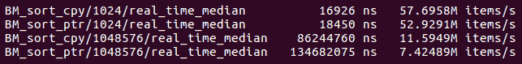
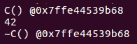
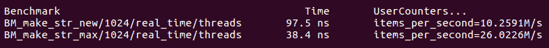
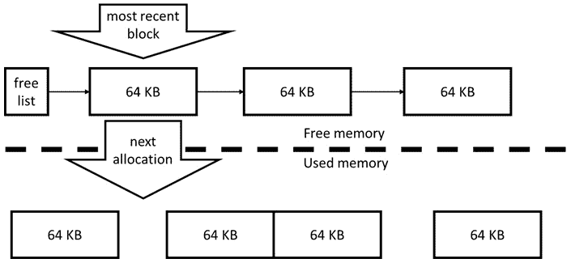

# 九、高性能 C++

在本章中，我们将重点从硬件资源的最佳使用切换到特定编程语言的最佳应用。虽然到目前为止我们所学到的所有内容都可以直接应用于任何语言的任何程序，但本章涉及 C 的特性和特质。您将了解 c 语言的哪些功能可能会导致性能问题，以及如何避免这些问题。

在本章中，我们将介绍以下主要主题:

*   C 语言的效率和开销
*   学会注意到 c 语言结构使用中可能的低效
*   避免效率低下的 C 代码
*   优化内存访问和条件操作

# 技术要求

同样，您将需要一个 C 编译器和一个微基准测试工具，例如我们在上一章中使用的**Google 基准**库 (在[https://github.com/google/benchmark](https://github.com/google/benchmark)找到)。

本章随附的代码可在[https://github.com/PacktPublishing/ 《高效程序编写艺术》/tree/master/Chapter09](https://github.com/PacktPublishing/The-Art-of-Writing-Efficient-Programs/tree/master/Chapter09)找到。

您还需要一种方法来检查编译器生成的汇编代码: 许多开发环境都可以选择显示汇编; GCC 和 Clang 可以写出汇编而不是目标代码; 调试器和其他工具可以从目标代码生成汇编 (反汇编)。使用哪种工具取决于个人喜好。

# 编程语言的效率是多少？

程序员经常谈论一种语言是否有效。尤其是 C，它的发展目标是明确的效率，同时在某些圈子里也享有低效的声誉。这怎么可能？

*效率*在不同的语境下或对不同的人来说可能意味着不同的事物。例如:

*   C 设计遵循**零开销**的原则: 在少数例外情况下，您不会为您不使用的任何功能支付任何运行时费用，因为它存在于语言中。从这个意义上说，它是一种语言所能发挥的效率。
*   你显然必须为你使用的语言功能付费，至少如果它们转化为一些运行时的工作。C 非常适合不需要任何运行时代码来完成编译期间可以完成的工作 (尽管编译器和标准库的实现在效率上有所不同)。高效的语言不会给执行请求的工作必须生成的代码增加任何开销，同样，C 在这里是相当好的，我们接下来将讨论一个主要的警告。
*   如果以上是正确的，那么 C 是如何从持有此观点的人那里获得*低效*的标签的？现在我们来看看另一个关于效率的观点: 用这种语言编写高效代码有多容易？或者，做一些看似自然但实际上是解决问题非常低效的方法有多容易？一个密切相关的问题是我们在最后一段中提到的问题: C 在完全按照您的要求进行操作时非常有效。但是用语言准确地表达你想要的东西并不总是容易的，而且，同样，编写代码的自然方式有时会强加额外的要求或约束，而这些要求或约束是程序员不想要的，也可能没有意识到的。这些约束有运行时成本。

从语言设计者的角度来看，最后一个问题不是语言效率低下: 你要求机器做 X 和 Y，做 X 和 Y 要花费时间，我们没有做任何超出你要求我们做的事情。但是从程序员的角度来看，如果程序员只想做 X 而不关心 Y，这是一种低效的语言。

本章的目标是帮助您编写代码，清楚地表达您希望机器执行的操作。目的是双重的: 你可能会认为你的主要*受众*是编译器: 通过精确描述你想要什么和编译器可以自由改变什么，你给编译器自由生成更高效的代码。但是对于您的程序的读者也可以这样说: 他们只能推断出您在代码中表达的内容，而不是您打算表达的内容。如果它改变了其行为的某些方面，那么优化您的代码是否安全？这种行为是故意的还是可以改变的实施的意外？再次提醒我们，编程主要是与同行进行交流的一种方式，只有这样才能与机器进行交流。

我们将从似乎容易避免的更简单的低效率开始，但是即使在掌握了该语言其他方面的程序员的代码中，它们也会出现。

# 不必要的复制

不必要的对象复制很可能是*C 无效率 #1*。主要原因是这很容易做到，很难注意到。考虑以下代码:

```cpp
std::vector<int> v = make_v(… some args …);
do_work(v);
```

这个程序里做了多少份矢量`v`？答案取决于函数`make_v()`和`do_work()`以及编译器优化的细节。这个小例子涵盖了我们现在将讨论的几种语言微妙之处。

## 复制和参数传递

我们将从第二个函数`do_work()`开始。这里重要的是声明: 如果函数通过引用 `const` 或不接受参数，则不复制。

```cpp
void do_work(std::vector<int>& vr) {
  … vr is a reference to v …
}
```

如果函数使用传递值，则必须进行复制:

```cpp
void do_work(std::vector<int> vc) {
  … vc is a copy of v …
}
```

如果向量很大，则复制向量是一项昂贵的操作: 必须复制向量中的所有数据。这是一个昂贵的函数调用。如果作品本身不需要向量的副本，那么它的效率也非常低。例如，如果我们只需要计算向量中所有元素的总和 (或其他函数)，则不需要副本。虽然乍一看，通话本身并没有告诉我们是否复制，这似乎是不可取的，但它应该是这样的。进行复制的决策属于函数的实现者，只有在考虑需求和算法的选择后才能做出。对于前面提到的累加所有元素之和的问题，正确的决定显然是通过 (`const`) 引用传递向量如下:

```cpp
void do_work(const std::vector<int>& v) {
  int sum = 0;
  for (int x: v) sum += x;
  … use sum … 
}
```

在这种情况下，使用传递值是如此明显的低效率，它可能被认为是一个错误，但它发生的次数比你想象的要多。特别是，它发生在模板代码中，其中作者仅考虑了较小的轻量级数据类型，但最终代码的使用范围比预期的要广。

另一方面，如果我们需要创建参数的副本作为满足函数要求的一部分，那么使用参数传递就像任何方法一样好:

```cpp
void do_work(std::vector<int> v) {
  for (int& x : v) x = std::min(x, 255);
  … do computations on the new values …
}
```

在这里，我们需要在进一步处理数据之前对其应用所谓的夹紧环。假设我们多次读取受限制的值，每次访问调用`std::min()`可能比创建结果的缓存副本效率低。我们也可以做一个明确的副本，它可能稍微更有效，但这种优化不应该任由猜测; 它只能通过一个基准来明确回答。

C 11 引入**移动语义**作为部分答案到不必要的复制。在我们的例子中，我们观察到，如果函数参数是一个 r 值，我们可以以任何我们想要的方式使用它，包括改变它 (调用方在调用完成后无法访问对象)。利用移动语义的通常方法是用 r 值参考版本重载函数:

```cpp
void do_work(std::vector<int>&& v) {
  … can alter v data … 
}
```

但是，如果对象本身已启用 “移动” 功能，则我们的简单传递值版本将在新的光线中发光。参考以下代码:

```cpp
void do_work(std::vector<int> v) {
  … use v destructively … 
}
std::vector<int> v1(…);
do_work(v1);                 // Local copy is made
do_work(std::vector<int>(…));    // R-value
```

第一次调用`do_work()`使用 l 值参数，因此在函数内部进行本地复制 (参数按值传递!)。第二个调用使用 r 值或未命名的临时调用。由于向量具有移动构造函数，函数参数被移动 (而不是复制!) 到其参数中，并且移动向量非常快。现在，通过函数的单个实现，没有任何重载，我们可以有效地处理 r 值和 l 值参数。

现在我们已经看到了两个极端的例子。在第一种情况下，不需要参数的副本，创建一个参数纯粹是低效的。在第二种情况下，复制是合理的实施方式。正如我们即将看到的那样，并非每种情况都属于这些极端之一。

## 复制作为一种实现技术

还有中间的地，其中选择的实现需要一个参数的副本，但实现本身不是最佳的。作为示例，考虑以下需要按排序顺序打印向量的函数:

```cpp
void print_sorted(std::vector<int> v) {
  std::sort(v.begin(), v.end());
  for (int x: v) std::cout << x << “\n”;
}
```

对于整数向量，这可能是最好的方法。我们对容器本身进行分类并按顺序打印。因为我们不应该修改原始容器，所以我们需要一个副本，同样，利用编译器来制作一个也没有错。

但是如果向量的元素不是整数而是一些大对象呢？在这种情况下，复制向量需要大量的内存，而排序则需要花费大量的时间来复制大对象。在这种情况下，更好的实现可能是在不移动原始对象的情况下创建和排序指针向量:

```cpp
template <typename T>
void print_sorted(const std::vector<T>& v) {
  std::vector<const T*> vp; vp.reserve(v.size());
  for (const T& x: v) vp.push_back(&x);
  std::sort(vp.begin(), vp.end(), 
     [](const T* a, const T* b) { return *a < *b;});
  for (const T* x: vp) std::cout << *x << “\n”;
}
```

由于我们现在已经学会了永远不要猜测性能，因此直觉需要通过基准来确认。由于排序已经排序的向量不需要任何复制，因此我们希望为基准的每次迭代提供一个新的，未排序的向量，如下所示:

```cpp
void BM_sort(benchmark::State& state) {
   const size_t N = state.range(0);
   std::vector<int> v0(N); for (int& x: v0) x = rand();
   std::vector<int> v(N);
   for (auto _ : state) {
         v = v0;
         print_sorted(v);
   }
   state.SetItemsProcessed(state.iterations()*N);
 }
```

当然，我们应该禁用实际打印，因为我们对基准 I/O 不感兴趣。另一方面，我们应该在不进行排序的情况下对向量进行基准复制，以便我们知道在设置测试时花费了测量时间的哪一部分。

基准测试确认，对于整数，复制整个向量并对副本进行排序会更快:



图 9.1-排序整数向量的基准，复制与指针间接

请注意，如果向量很小，并且所有数据都适合低级缓存，则无论哪种方式，处理都非常快，并且速度差异很小。如果对象很大且复制昂贵，则间接变得相对更有效:


图 9.2-排序大对象向量的基准，复制与指针间接

当复制对象是实现的必要时，还有另一种特殊情况; 我们接下来将考虑它。

## 复制到存储数据

在 C 中，我们可以遇到另一种特殊的数据复制情况。它最经常发生在类构造函数中，其中对象必须存储数据的副本，因此必须创建寿命超过构造函数调用寿命的长期副本。考虑这个例子:

```cpp
class C {
  std::vector<int> v_;
  C(std::vector<int> ??? v) { … v_ is a copy of v … }
};
```

这里的目的是复制一份。效率低下是制作多个中间副本或制作不必要的副本。完成此操作的标准方法是通过`const`引用对象并在类内部复制:

```cpp
class C {
  std::vector<int> v_;
  C(const std::vector<int>& v) : v_(v) { … }
};
```

如果构造函数的参数是 l 值，则这是尽可能有效的。但是，如果参数是 r 值 (临时)，我们希望将其移动到类中，并且完全不复制。这需要构造函数的重载:

```cpp
class C {
  std::vector<int> v_;
  C(std::vector<int>&& v) : v_(std::move(v)) { … }
};
```

缺点是需要编写两个构造函数，但是如果构造函数需要几个参数，并且每个参数都需要复制或移动，则会变得更糟。遵循此模式，我们将需要 6 个构造函数重载来处理 3 个参数。

另一种方法是按值传递所有参数，并从参数中传递*移动*，检查以下代码:

```cpp
class C {
  std::vector<int> v_;
  C(std::vector<int> v) : v_(std::move(v)) 
  { … do not use v here!!! … }
};
```

非常重要的是要记住，参数`v`现在是一个 x 值 (处于移动状态的对象)，并且不应在构造函数的主体中使用它。如果参数是 l 值，则复制以构造参数`v`，然后移入类。如果参数是 r 值，则将其移动到参数`v`中，然后再次移动到类中。如果物体移动便宜，这种模式效果很好。但是，如果对象的移动成本很高，或者根本没有移动构造函数 (因此它们被复制了)，我们最终会做两个副本而不是一个副本。

到目前为止，我们一直专注于将数据输入函数和对象的问题。但是，当我们需要返回结果时，也会发生复制。那里的考虑完全不同，需要单独研究。

## 复制返回值

我们在本节最开始的示例包括两种复制。特别是，这一行:

```cpp
std::vector<int> v = make_v(… some args …);
```

它意味着生成的向量`v`是从另一个向量 (函数`make_v`返回的向量) 创建的:

```cpp
std::vector<int> make_v(… some args …) {
  std::vector<int> vtmp;
  … add data to vtmp …
  return vtmp;
}
```

从理论上讲，这里可以进行多个复制: 将局部变量`vtmp`复制到函数`make_v`的 (未命名) 返回值中，然后将其复制到最终结果`v`中。实际上，这是不会发生的。首先，将`make_v`的未命名的临时返回值移动 (而不是复制) 到`v`中。但是，最有可能的是，即使是这种情况也不会发生。如果您使用自己的类而不是`std::vector`尝试此代码，您将看到既不使用副本也不使用移动构造函数:

```cpp
class C {
  int i_ = 0;
  public:
  explicit C(int i) : i_(i) { 
   std::cout << “C() @” << this << std::endl;
  }
  C(const C& c) : i_(c.i_) {
     std::cout << “C(const C&) @” << this << std::endl;
  }
  C(C&& c) : i_(c.i_) {
     std::cout << “C(C&&) @” << this << std::endl;
  }
  ~C() { cout << “~C() @” << this << endl; }
  friend std::ostream& operator<<( std::ostream& out,
                                  const C& c) {
     out << c.i_; return out;
  }
 };  
 C makeC(int i) { C ctmp(i); return ctmp; }
 int main() {
   C c = makeC(42);
   cout << c << endl;
}
```

这个程序打印类似以下内容 (在大多数编译器上，必须打开一定级别的优化):



图 9.3-按值返回对象的程序的输出

如您所见，只有一个对象被构造和破坏。这是编译器优化的结果。这里使用的具体优化称为**返回值优化** (**RVO**)。优化本身非常简单: 编译器认识到所涉及的三个对象-局部变量`ctmp`，未命名的临时返回值和最终结果`c`-都是相同的类型。此外，我们编写的任何代码都不可能同时观察其中的任何两个变量。因此，在不改变任何可观察到的行为的情况下，编译器可以对所有三个变量使用相同的内存位置。在调用函数之前，编译器需要分配将构造最终结果`c`的内存。这个内存的地址由编译器传递到函数中，在这里用来在同一位置构造局部变量`ctmp`。结果，当函数`makeC`结束时，根本没有什么可返回的: 结果已经在应有的位置。简而言之，这是 RVO。

虽然 RVO 看起来很简单，但它有几个微妙之处。

首先，请记住这是一个优化。这意味着编译器通常不必这样做 (如果您没有，则需要更好的编译器)。但是，它是一种非常特殊的优化。一般来说，编译器可以对你的程序做任何它想做的事情，只要它不改变可观察的行为。可观察的行为包括输入和输出以及访问易失性存储器。但是，这种优化导致了可观察到的变化: 复制构造函数和匹配的析构函数的预期输出无处可见。事实上，这是一个例外，否则铁定的规则: *允许编译器消除调用复制或移动构造函数和相应的析构函数，即使这些函数有副作用，包括可观察的行为*。此例外不仅限于 RVO。这意味着，在一般情况下，你不能指望复制和移动构造函数被调用，仅仅因为你写了一些代码，出现在做一个复制。这个被称为**复制 elision** (或**move elision**，用于移动构造函数)。

其次，请记住 (再次) 这是一个优化。代码必须先编译，然后才能进行优化。如果您的对象没有任何复制或移动构造函数，则此代码将不会编译，并且我们将永远不会进入优化步骤，该步骤将删除对这些构造函数的所有调用。这很容易看到，如果我们删除所有的复制和移动构造函数在我们的例子:

```cpp
class C {
  …
  C(const C& c) = delete;
  C(C&& c) = delete;
};  
```

编译现在将失败。确切的错误消息取决于编译器和 C 标准级别; 在 C 17 中，它将看起来像这样:


图 9.4-使用 C 17 或 C 20 的 Clang 的编译输出

有一种特殊情况，即使删除了复制和移动操作，我们的程序也会编译。让我们稍微改变一下`makeC`函数:

```cpp
C makeC(int i) { return C(i); }
```

C 11 或 C 14 中没有任何变化; 但是，在 C 17 及更高版本中，此代码编译良好。请注意与以前的版本略有不同: 返回的对象曾经是一个 l 值，它有一个名称。现在它是一个 r 值，一个未命名的临时值。这个使一切不同: 虽然命名为 RVO (**NRVO**) 的**仍然是优化，但自 C 17 起，未命名的 RVO 是强制性的，不再被认为是复制省略。相反，标准规定首先不要求复制或移动。**

最后，您可能会想知道函数是否必须内联，以便编译器在编译函数本身时知道返回值在哪里。通过简单的测试，您可以说服自己，事实并非如此: 即使函数`makeC`位于单独的编译单元中，RVO 仍然会发生。因此，编译器必须在调用点将结果的地址发送到函数。如果您根本不从函数返回结果，而是将引用作为附加参数传递给结果，您可以自己做类似的事情。当然，必须首先构造该对象，而编译器生成的优化不需要额外的构造函数调用。

您可能会发现建议不要依赖 RVO，而是强制执行返回值的移动:

```cpp
C makeC(int i) { C c(i); return std::move(c); }
```

该论点认为，如果 RVO 没有发生，您的程序将承担复制操作的性能损失，而移动操作无论如何都是便宜的。然而，这种说法是错误的。要了解原因，请仔细查看*图 9.4*中的错误消息: 编译器抱怨即使`ctmp`是 l 值并且应该复制，也会删除 move 构造函数。这不是编译器错误，而是反映了标准要求的行为: 在返回值优化是可能的，但编译器决定不这样做的上下文中，编译器必须首先尝试找到一个`move`构造函数来返回结果。如果找不到`move`构造函数，则执行第二次查找; 这次，编译器正在寻找复制构造函数。在这两种情况下，编译器实际上都在执行重载解析，因为可以有很多副本或`move`构造函数。因此，没有理由写一个明确的举动: 编译器将为我们做一个。但是有什么害处呢？危害在于使用显式移动会禁用 RVO; 你已经要求移动，所以你会得到一个。虽然搬家可能需要很少的工作，但 RVO 根本就没有工作，而且没有任何工作总是比某些工作更快。

如果我们删除`move`构造函数，但不删除复制构造函数，会发生什么？在两个构造函数都被删除的情况下，编译仍然失败。这也是语言的一个微妙之处: 声明已删除的成员函数与不声明任何成员函数不同。如果编译器对一个`move`构造函数执行重载解析，它会找到一个，即使这个构造函数被删除了。编译失败，因为重载解决方案选择了删除的函数作为最佳 (或唯一) 重载。如果要强制使用复制构造函数 (当然是以科学的名义)，则完全不必声明任何`move`构造函数。

到现在为止，您必须看到意外复制对象并破坏程序性能的危险，这些危险隐藏在代码的每个黑暗角落后面。你能做些什么来避免无意复制？稍后我们会有一些建议，但首先，让我们回到我们已经简单使用过的一种方法: 指针的使用。

## 使用指针避免复制

在传递对象时避免复制对象的一种方法是传递指针。如果我们不必管理对象的生命周期，这是最简单的。如果函数需要访问对象但不需要删除它，则通过引用或原始指针传递对象是最好的方法 (在这种情况下，引用实际上只是一个不能为 null 的指针)。

同样，我们可以使用指针从函数返回对象，但这需要更多的注意。首先，必须在堆上分配对象。您绝不能返回指针或对局部变量的引用。参考以下代码:

```cpp
C& makeC(int i) { C c(i); return c; } // Never do this!
```

其次，现在调用方负责删除对象，因此您函数的每个调用方都必须知道对象是如何构造的 (运算符`new`不是构造对象的唯一方法，只是最常见的一种)。这里最好的解决方案是返回一个智能指针:

```cpp
std::unique_ptr<C> makeC(int i) {
  return std::make_unique<C>(i);
}
```

请注意，即使调用者可能使用共享指针来管理对象的生命周期，这样的工厂函数也应该返回唯一指针: 从唯一指针移动到共享指针既容易又便宜。

说到共享指针，它们通常用于传递生命周期由智能指针管理的对象。除非意图也是传递对象的所有权，否则这又是不必要和低效复制的一个例子。复制共享指针并不便宜。那么，如果我们有一个由共享指针管理的对象和一个需要在这个对象上操作而不拥有它所有权的函数，我们该怎么办？我们使用原始指针:

```cpp
void do_work1(C* c);
void do_work2(const C* c);
std::shared_ptr<C> p { new C(…) };
do_work1(&*p);
do_work2(&*p);
```

函数`do_work1()`和`do_work2()`的声明告诉我们程序员的意图: 两个函数都在不删除对象的情况下操作对象。第一个函数修改对象; 第二个不修改。这两个函数都希望在没有对象的情况下被调用，并将处理这种特殊情况 (否则，参数将通过引用传递)。

同样，只要在其他地方管理对象的生存期，就可以创建原始指针的容器。如果您希望容器管理其元素的生命周期，但不想将对象存储在容器中，则由唯一指针组成的容器可以完成这项工作。

现在是时候制定一些通用指南了，这些指南将帮助您避免不必要的复制及其可能导致的低效率。

## 如何避免不必要的复制

为了减少偶然的、无意的复制，你可以做的最重要的事情是确保你所有的数据类型都是可移动的，如果移动可以比复制更便宜地实现。如果您有容器库或其他可重用代码，请确保它也启用了移动。

下一个建议有些阻碍，但它可以为您节省大量的调试时间: 如果您的类型复制成本很高，请使它们不可复制。将复制和分配操作声明为已删除。如果类支持快速移动，请提供移动操作。当然，这将防止任何有意或无意的复制。希望有意复制是罕见的，您可以实现一个特殊的成员函数，如`clone()`，它将创建对象的副本。至少这样，所有的复制都是显式的，并且在你的代码中是可见的。如果该类既不可复制也不可移动，则将无法将其与 STL 容器一起使用; 但是，唯一指针的容器是一个不错的选择。

向函数传递参数时，尽可能使用引用或指针。如果函数需要复制参数，请考虑按值传递并从参数移动。请记住，这仅适用于启用移动的类型，请参阅第一个指南。

我们所说的关于传递函数参数的所有内容也可以应用于临时局部变量 (毕竟，函数参数基本上是函数范围内的临时局部变量)。除非您需要副本，否则这些应该是参考。这不适用于内置类型，如整数或指针: 它们的复制比间接访问便宜。在模板代码中，您没有知道类型是大还是小的奢侈，因此使用引用并依靠编译器优化来避免对内置类型的不必要的间接访问。

当从函数返回值时，你的第一个偏好应该是依赖 RVO 和复制 elision。只有当您发现编译器不执行此优化并且在您的特定情况下很重要时，才应考虑替代方案。这些替代方案是: 使用带有输出参数的函数，以及使用在动态分配的内存中构造结果并返回拥有智能指针 (如`std::unique_ptr`) 的工厂函数。

最后，请查看您的算法和实现，并注意不必要的复制: 请记住，恶意复制对性能的影响与无意复制一样。

我们完成了 C 程序中效率的第一个祸根，即对象的免费复制。紧随其后的是内存管理不善。

# 低效内存管理

C 中的内存管理主题可以自己完成一本书。有几十篇甚至数百篇专门讨论 STL 分配器问题的论文。在本章中，我们将重点介绍几个最容易影响性能的问题。有些有简单的解决方案; 对于其他人，我们将描述问题并概述可能的解决方案。

有两种类型的内存相关的问题，你可能会在性能的上下文中遇到。第一个是使用过多的内存: 您的程序要么内存不足，要么不符合内存使用要求。当您的程序成为内存绑定时，会出现第二个问题: 它的性能受到内存访问速度的限制。通常，在这些情况下，程序的运行时与它使用多少内存直接相关，减少内存使用也会使程序运行更快。

本节介绍的材料主要对处理内存绑定程序或频繁和/或大量分配内存的程序的程序员有用。我们从内存分配本身的性能影响开始。

## 不必要的内存分配

与内存使用相关的最常见的性能问题之一是不必要的内存分配。这里有一个很常见的问题，用 C 类伪代码描述:

```cpp
for ( … many iterations … ) {
  T* buffer = allocate(… size …);
  do_work(buffer); // Computations use memory
  deallocate(buffer);
}
```

编写良好的程序将使用 RAII 类来管理 deallocations，但是为了清楚起见，我们希望明确分配和 deallocations。分配通常隐藏在管理自己内存的对象 (例如 STL 容器) 中。这样的程序将大部分时间花在内存分配和释放功能 (如`malloc()`和`free()`) 上的情况并不少见。

我们可以在一个非常简单的基准上看到对性能的影响:

```cpp
void BM_make_str_new(benchmark::State & state) {
    const size_t NMax = state.range(0);
    for (auto _: state) {
        const size_t N = (random_number() % NMax) + 1;
        char * buf = new char[N];
        memset(buf, 0xab, N);
        delete[] buf;
    }
    state.SetItemsProcessed(state.iterations());
}
```

这里的*工作*通过初始化一个字符串来表示，`random_number()`函数返回随机整数值 (可能只是`rand()`，但是，如果我们预先计算并存储随机数以避免对随机数生成器进行基准测试，则基准测试是*更干净*。您可能还需要欺骗编译器，使其不优化结果: 如果通常的`benchmark::DoNotOptimize()`不够，您可能必须插入一个打印语句，条件是永远不会发生 (但编译器不知道它)，如`rand() < 0`。

我们从基准中获得的数字本身是没有意义的: 我们需要将它们与某些东西进行比较。在我们的例子中，基线很容易弄清楚: 我们必须做同样的工作，但没有分配。这可以通过将分配和释放移出循环来完成，因为我们知道最大内存大小:

```cpp
  char * buf = new char[NMax];
  for (auto _: state) {
      …}
  delete[] buf;
```

您将在这样的基准测试中观察到的性能差异在很大程度上取决于操作系统和系统库，但是您可能会看到这样的东西 (我们使用了最大 1 KB 的随机大小的字符串):



图 9.5-分配-释放模式的性能影响

应该注意的是，微基准中的内存分配通常比在内存分配模式复杂得多的大型程序的上下文中更有效，因此频繁分配和解除分配的实际效果可能更大。即使在我们的小型基准测试中，每次分配内存的实现也以 40% 分配最大可能内存量的版本的速度运行。

当然，当我们在计算过程中需要的最大内存量是预先知道的，预先分配它并重新使用它从一个迭代到下一个迭代是一个简单的解决方案。此解决方案也推广到许多容器: 对于矢量或 deque，我们可以在迭代开始之前保留内存，并利用调整容器大小不会缩小其容量这一事实的。

当我们事先不知道最大内存大小时，解决方案只会稍微复杂一些。这种情况可以使用仅增长缓冲区来处理。这里是一个简单的缓冲区，可以生长，但永远不会收缩:

```cpp
class Buffer {
  size_t size_;
  std::unique_ptr<char[]> buf_;
  public:
  explicit Buffer(size_t N) : size_(N), buf_(
    new char[N]) {}
  void resize(size_t N) { 
     if (N <= size_) return;
     char* new_buf = new char[N];
     memcpy(new_buf, get(), size_);
     buf_.reset(new_buf);
     size_ = N;
  }
  char* get() { return &buf_[0]; }
};
```

同样，此代码对于演示和探索很有用。在实际程序中，您可能会使用 STL 容器或您自己的库类，但是它们都应该具有增加内存容量的功能。我们可以通过微不足道地修改我们的基准来比较此仅增长缓冲区与固定大小的预分配缓冲区的性能:

```cpp
void BM_make_str_buf(benchmark::State& state) {
  const size_t NMax = state.range(0);
  Buffer buf(1);
  for (auto _ : state) {
     const size_t N = (random_number() % NMax) + 1;     
     buf.resize(N);
     memset(buf.get(), 0xab, N);
  }
  state.SetItemsProcessed(state.iterations());
}
```

同样，在一个真实的程序中，您可能会通过更智能的内存增长策略获得更好的结果 (增长比要求的要多一些，所以您不必经常增长内存-大多数 STL 容器采用这种策略的某种形式)。但是，对于我们的演示，我们希望使事情尽可能简单。在同一台机器上，基准测试的结果如下:


图 9.6-仅增长缓冲区的性能 (与图 9.5 进行比较)

仅增长缓冲区比固定大小的缓冲区慢，但比每次分配和释放内存要快得多。同样，更好的增长政策将使此缓冲区更快，接近固定大小缓冲区的速度。

这不是整个故事: 在多线程程序中，良好的内存管理的重要性甚至更大，因为对系统内存分配器的调用无法很好地扩展，并且可能涉及全局锁定。使用 8 个线程在同一台机器上运行我们的基准测试会产生以下结果:


图 9.7-多线程程序中分配-释放模式的性能影响

在这里，频繁分配的惩罚甚至更大 (仅增长缓冲区也显示了剩余分配的成本，并且将真正受益于更明智的增长政策)。

底线是: 尽可能少地与操作系统交互。如果您有一个循环，需要在每次迭代中分配和释放内存，请在循环之前分配一次。如果分配的大小相同，或者您预先知道最大分配大小，请对该大小进行一次分配并保留 (当然，如果您使用多个缓冲区或容器，则不应尝试将它们插入单个分配中，而是预先分配每个)。如果您不知道最大大小，请使用可以增长的数据结构，但在工作完成之前不要收缩或释放内存。

避免与 OS 交互的建议在多线程程序中尤为重要，我们现在将对并发程序中内存的使用进行一些更一般性的评论。

## 并发程序中的内存管理

操作系统提供的内存分配器是一种平衡许多需求的解决方案: 在给定的机器上，只有一个操作系统，但有许多不同的程序具有自己独特的需求和内存使用模式。开发人员非常努力地使它在任何合理的用例中都不会失败。另一方面，它很少是任何用例的最佳解决方案。通常，这已经足够好了，尤其是如果您遵循经常请求内存的建议。

内存分配在并发程序中变得更加低效。主要原因是任何内存分配器都必须维护一个相当复杂的内部数据结构来跟踪已分配和释放的内存。在高性能分配器中，内存被细分为多个领域，以将大小相似的分配分组在一起。这以复杂性为代价提高了性能。结果是，如果多个线程同时分配和释放内存，则必须通过锁来保护内部数据的这种管理。这是一个全局锁，一个用于整个程序，如果经常调用分配器，它可以限制整个程序的缩放。

解决此问题的最常见方法是使用带有线程本地缓存的分配器，例如流行的`malloc()`替换库 TCMalloc。这些分配器为每个线程保留一定量的内存: 当一个线程需要分配内存时，首先从线程本地内存领域获取内存。这不需要锁，因为只有一个线程与该竞技场交互。只有当竞技场为空时，分配器才必须从所有线程之间共享的内存中获得锁并分配。同样，当线程释放内存时，它将被添加到线程特定的竞技场，同样没有任何锁定。

线程本地缓存并非没有问题。

首先，他们倾向于总体上使用更多的内存: 如果一个线程释放了大量的内存，而另一个线程分配了大量的内存，最近释放的内存不会变得对另一个线程可用 (它是释放它的线程的本地)。因此分配了更多的内存，而未使用的内存可用于其他线程。为了限制这种内存浪费，分配器通常不允许每个线程的竞技场增长超过某个预定义的限制。一旦达到限制，线程本地内存将返回到所有线程之间共享的主竞技场 (此操作需要锁定)。

第二个问题是，如果每个分配都由一个线程拥有，那么这些分配器工作得很好，也就是说，同一线程在每个地址分配和释放内存。如果一个线程分配了一些内存，但另一个线程必须解除分配，这个*跨线程*解除分配是困难的，因为内存必须从一个线程的线程本地场转移到另一个线程 (或共享场)。一个简单的基准测试表明，使用标准分配器 (如`malloc()`或 TCMalloc) 的跨线程解除分配的性能至少比线程拥有的内存差一个数量级。对于使用线程本地缓存的任何分配器，这很可能是正确的，因此应尽可能避免线程之间的内存传输。

到目前为止，我们正在谈论将内存从一个线程传输到另一个线程，以实现释放它。简单地使用由另一个线程分配的内存呢？这种内存访问的性能在很大程度上取决于硬件功能。对于一个 cpu 很少的简单系统，这可能不是问题。但是较大的系统具有多个内存库，并且 CPU 和内存之间的连接 不是对称的: 每个内存库都更接近一个 CPU。这就是所谓的**非均匀内存架构** (**NUMA**)。NUMA 的性能影响差异很大，从*无关紧要*到*两倍于*。有一些方法可以调整 NUMA 内存系统的性能，以及使程序内存管理对 NUMA 细节敏感，但请注意，您可能会将性能调整到特定的机器: 关于 NUMA 系统的性能通常很少。

我们现在回到更有效地使用内存的问题，因为它对并发和串行程序的性能都有普遍帮助。

## 避免内存碎片

困扰许多程序的一个问题是与内存分配系统的低效交互。让我们说程序需要分配 1 KB 的内存。该内存块是从某个较大的内存领域中切出的，标记为分配器使用，然后将地址返回给调用者。接下来会有更多的内存分配，所以我们的 1 KB 块之后的内存现在也被使用了。然后程序返回第一次分配，并立即要求 2 KB 的内存。有一个 1 KB 的免费块，但它还不足以满足这个新请求。在其他地方可能还有另一个 1 KB 的块，但是只要这两个块彼此不相邻，它们对于 2 KB 分配的目的就没有用:


图 9.8-内存碎片: 存在 2 KB 的可用内存，但对于单个 2 KB 分配没有用

这种情况被称为**内存碎片**: 系统有由程序返回的空闲内存，而是必须使用新的内存来服务下一次分配，因为程序释放的内存被碎片成小块。在极端情况下，这种碎片会导致程序在系统的整体内存容量耗尽之前很久就耗尽内存 (作者看到的最坏情况是一个程序在分配了总可用内存的 1/6 后耗尽内存)。有些内存分配器可以比标准的`malloc()`更好地抵抗碎片，但是对于快速流过内存的程序，可能需要采取更极端的措施。

一种这样的措施是块分配器。这个想法是所有内存都分配在固定大小的块中，例如 64 KB。您不应该一次从 OS 分配这个大小的单个块，而是分配较大的固定大小块 (例如 8 MB)，并将它们细分为较小的块 (在我们的示例中为 64 KB)。处理这些请求的内存分配器是程序中的主要分配器，直接与`malloc()`交互。因为它只分配一个大小的块，所以它可以非常简单，我们可以专注于最有效的实现 (并发程序的线程本地缓存，实时系统的低延迟，等等)。当然，您不想在代码中到处处理这些 64 KB 的块。这是二级分配器的工作，如下所示*图 9.9*:


图 9.9-固定大小的块分配

您可以有一个分配器，该分配器将 64 KB 块进一步细分为较小的分配。特别有效的是一个统一分配器 (一个大小的分配器): 例如，如果你想为单个 64 位整数分配内存，你可以这样做没有任何内存开销 (相比之下，`malloc()`通常需要至少 16 字节的开销每次分配)。您还可以拥有在 64 KB 块中分配内存并使用它来存储元素的容器。您将不会使用向量，因为它们需要单个大的、连续的分配。你在这里想要的类似数组的容器是在固定大小的块中分配内存的 deque。当然，你也可以有节点容器。如果 STL 分配器接口足以满足您的需求，则可以使用 STL 容器; 否则，您可能需要编写自己的容器库。

固定大小的块分配的主要优点是它不会遭受碎片化: 来自`malloc()`的所有分配都具有相同的大小，来自主分配器的所有分配也是如此。每当内存块返回给分配器时，它都可以重复使用以满足下一次对内存的请求。参考下图:



图 9.10-固定大小的分配器中的内存重用

该先进先出属性也是一个优势: 最后的 64 KB 内存块很可能来自最近使用的内存，并且在缓存中仍然很热。重用该块立即改善了内存引用的局部性，因此可以更有效地利用缓存。分配器以简单的空闲列表 (*图 9.10*) 来管理返回给它的块。这些空闲列表可以每个线程维护以避免锁定，尽管它们可能需要定期重新平衡以避免一个线程积累了许多空闲块而另一个线程正在分配新内存的情况。

当然，将我们的 64 KB 块细分成较小大小的分配器仍然容易受到碎片的影响，除非它们也是统一 (固定大小) 的分配器。但是，如果它必须处理较小的内存范围 (一个块) 和很少的不同大小，则更容易编写自碎片分配器。

很可能整个程序受到使用块内存分配的决定的影响。例如，分配大量的小数据结构，使得每个小数据结构使用 64 kb 块的一小部分，而剩余的数据结构则变得非常昂贵。另一方面，本身是较小数据结构 (容器) 的集合的数据结构使得它将许多较小的对象打包到一个块中变得更容易写入。甚至可以编写压缩的容器，压缩每个块以长期保存数据，然后一次解压缩一个块以进行访问。

块大小本身也不是一成不变的。一些应用程序将更高效的较小的块，如果一个块被部分地闲置，则更少的内存被浪费。其他人可以从需要较少分配的较大块中受益。

关于特定应用程序分配器的文献非常广泛。例如，平板分配器是我们刚刚看到的块分配器的概括。他们有效地管理多个分配大小。还有许多其他类型的自定义内存分配器，它们中的大多数都可以在 C 程序中使用。使用适合特定应用的分配器通常会带来显着的性能改进，通常以严重限制程序员在数据结构实现中的自由度为代价。

效率低下的下一个常见原因是更微妙，更难处理。

# 条件执行的优化

在不必要的计算和内存的低效使用之后，下一个*最简单的*编写低效代码的方法可能是无法很好地流水线的代码。我们在[*第三章*](03.html#_idTextAnchor047)，*CPU 架构、资源和性能含义*中看到了CPU 流水线的重要性。我们在那里还了解到，流水线最坏的破坏者通常是有条件的操作，尤其是硬件分支预测器无法猜测的操作。

不幸的是，优化条件代码以实现更好的流水线化是最难的 C 优化之一。仅当探查器显示分支预测不佳时才应进行。然而，请注意，错误预测的分支的数量不必很大才能被认为是 “差的”: 一个好的程序通常具有少于 0.1% 的错误预测的分支。1% 的误判率相当大。如果不检查编译器输出 (机器代码)，也很难预测源代码优化的效果。

如果探查器显示预测不佳的条件操作，则下一步是确定哪个条件被错误预测。我们已经在[*第三章*](03.html#_idTextAnchor047)、*CPU 架构、资源和性能含义*中看到了一些例子。例如，这段代码:

```cpp
if (a[i] || b[i] || c[i]) { … do something … }
```

即使总体结果是可预测的，也可能产生一个或多个预测不良的分支。这与 C 中布尔逻辑的定义有关: 运算符`||`和`&&`是*短路*: 表达式从左到右求值，直到结果变为已知。例如，如果`a[i]`为`true`，则代码不得访问数组元素`b[i]`和`c[i]`。有时，这是必要的: 实现的逻辑可能是这些元素不存在的。但是通常，布尔表达式会无缘无故地引入不必要的分支。前面的`if()`语句需要 3 个条件操作。另一方面，这种说法:

```cpp
if (a[i] + b[i] + c[i]) { … do something … }
```

如果值`a`，`b`和`c`是非负的，但需要一个条件操作，则等效于最后一个。同样，这不是您应该先发制人地进行的优化，除非您有可以确认其需求的测量结果。

这里是另一个例子。考虑以下功能:

```cpp
void f2(bool b, unsigned long x, unsigned long& s) {
  if (b) s += x;
}
```

如果`b`的值是不可预测的，则效率非常低。更好的性能只是一个简单的改变:

```cpp
void f2(bool b, unsigned long x, unsigned long& s) {
  s += b*x;
}
```

可以通过原始的，有条件的实现与无分支的实现的简单基准来确认此改进:

```cpp
BM_conditional   176.304M items/s
BM_branchless     498.89M items/s
```

如您所见，无分支实现速度几乎快 3 倍。

重要的是不要过度使用这种类型的优化。由于以下几个原因，它必须始终由测量驱动:

*   分支预测器非常复杂，我们对它们可以处理和不能处理的直觉几乎总是错误的。
*   编译器优化通常可以显着改变代码，因此，如果不测量或检查机器代码，即使我们对分支存在的期望也可能是错误的。
*   即使分支被错误预测，性能影响也可能会有所不同，因此如果没有测量就无法确定。

例如，手动优化这个非常常见的代码几乎从来没有用处:

```cpp
int f(int x) { return (x > 0) ? x : 0; }
```

它看起来像条件代码，如果`x`的符号是随机的，则预测是不可能的。但是，在这里，探查器很可能不会显示大量错误预测的分支。原因是大多数编译器不会使用条件跳转来实现这一行。在 x86 上，一些编译器将使用 CMOVE 指令，该指令执行*条件移动*: 它将值从两个源寄存器之一移动到目标，具体取决于条件。这条指令的*条件*性质是良性的: 记住条件代码的问题是 CPU 事先不知道下一步要执行哪条指令。使用条件移动实现，指令序列是完全线性的，并且它们的顺序是预先确定的，因此没有什么可猜测的。

另一个不太可能从无分支优化中受益的常见示例是条件函数调用:

```cpp
if (condition) f1(… args …) else f2(… args …);
```

使用函数指针数组可以实现无分支实现:

```cpp
using func_ptr = int(*)(… params …);
static const func_ptr f[2] = { &f1, &f2 };
(*f[condition])(… args …);
```

如果函数最初是内联的，则用间接函数调用替换它们是性能杀手。如果不是，这种变化可能几乎没有任何作用: 跳转到另一个函数，其地址在编译过程中未知，其效果与错误预测的分支非常相似，因此此代码导致 CPU 以任何一种方式刷新管道。

最重要的是，优化分支预测是非常先进的步骤。结果可能是惊人的改进，也可能是惊人的失败 (或者只是浪费了一些时间)，因此在每一步都要以性能测量为指导，这一点很重要。

现在，我们已经了解了很多关于 C 程序中潜在的低效率的以及改进它们的方法。最后，我们给出了一些优化代码的总体指南。

# 总结

在本章中，我们从语言的角度介绍了 C 效率的两个大领域中的第一个: 避免低效的语言构造，这归结为不做不必要的工作。我们研究过的许多优化技术与我们之前研究过的材料相吻合，例如访问内存的效率以及避免并发程序中的错误共享。

每个程序员面临的最大困境是，应该预先投入多少工作来编写有效的代码，以及应该留给增量优化的内容。让我们首先说高性能始于设计阶段: 设计不锁定性能差和低效实现的体系结构和接口是开发高性能软件的最重要努力。

除此之外，应该区分**过早优化**和**不必要的悲观化**。创建临时变量以避免混叠还为时过早，除非您有性能测量数据显示您正在优化的函数对整个执行时间有很大贡献 (或者除非它提高了可读性，这是另一回事)。按值传递大向量，直到探查器告诉你改变它只是无缘无故地让你的代码变慢，所以应该从一开始就避免。

两者之间的界线并不总是清晰的，因此您必须权衡几个因素。您必须考虑更改对程序的影响: 它是使代码更难阅读，更复杂还是更难测试？通常，您不希望为了性能而冒更多错误的风险，除非测量结果告诉您必须这样做。另一方面，有时更易读或更直接的代码也是更有效的代码，那么优化不能被认为是过早的。

C 效率的第二个主要领域与帮助编译器生成更有效的代码有关。我们将在下一章介绍这一点。

# 问题

1.  什么时候按价值传递大对象是可以接受的？
2.  当使用资源拥有的智能指针时，我们应该如何调用对对象进行操作的函数？
3.  什么是返回值优化，在哪里使用？
4.  为什么低效的内存管理不仅影响内存消耗，还影响运行时？
5.  A-B-A 问题是什么？