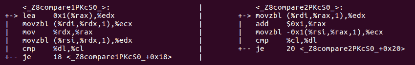
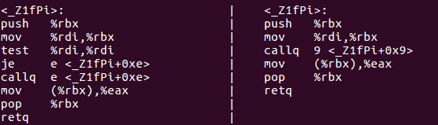
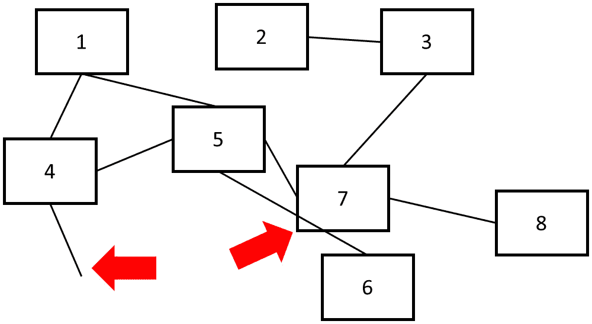

# 十一、未定义的行为和性能

本章有双重重点。一方面，它解释了程序员在试图从代码中榨取最大性能时经常忽略的各种未定义行为的危险。另一方面，它解释了如何利用未定义的行为来提高性能，以及如何正确指定和记录此类情况。总的来说，与通常的 “*任何事情都可能发生相比，本章提供了一种有点不寻常但更相关的方式来理解未定义行为的问题。*

在本章中，我们将介绍以下主题:

*   理解未定义的行为及其存在的原因
*   理解真相与关于未定义行为的神话
*   哪些未定义的行为是危险的，必须避免
*   如何利用未定义的行为
*   学习未定义的行为与效率之间的联系以及如何利用它

您将学习在 (别人的) 代码中遇到未定义的行为时识别它，并了解未定义的行为与性能之间的关系。本章还教您如何通过故意允许，记录它并在其周围放置保护措施来使用未定义的行为。

# 技术要求

和以前一样，您将需要一个 C 编译器。在本章中，我们使用 GCC 和 Clang，但是任何现代编译器都可以。本章随附的代码可在[https://github.com/PacktPublishing/ 高效程序/tree/master/Chapter11](https://github.com/PacktPublishing/The-Art-of-Writing-Efficient-Programs/tree/master/Chapter11)找到。您还将需要一种方法来检查编译器生成的汇编代码。许多开发环境都有显示汇编代码的选项，GCC 和 Clang 可以写出汇编代码而不是目标代码，调试器和其他工具可以从目标代码生成汇编代码 (反汇编它); 你使用哪个工具是个人喜好的问题。

# 什么是未定义行为？

**未定义行为** (**UB**) 的概念笼罩在神秘之中，并为未开始的人提供神秘的警告。Usenet 组`comp.std.c`警告， *“当编译器遇到 (未定义的构造) 时，它使恶魔从你的鼻子里飞出是合法的。”在类似的背景下，发射核导弹和绝育你的猫 (即使你没有猫) 也被提及。本章的切向目标之一是揭开 UB 的神秘面纱: 虽然最终目标是解释 UB 和性能之间的关系，并展示如何利用 UB，但在我们能够理性地讨论这个概念之前，我们不能这样做。*

首先，在 C (或任何其他编程语言) 的上下文中，什么是 UB？在标准中有特定的地方使用了*行为未定义的*或*程序是畸形的*。该标准进一步说，如果行为是未定义的，标准*对结果没有要求*。相应的情况称为 UB。例如，参考以下代码:

```cpp
int f(int k) {
  return k + 10;
}
```

标准表示，如果加法导致整数溢出 (即，如果`k`大于`INT_MAX-10`)，则前面代码的结果是未定义的。

当提到 UB 时，讨论倾向于走向两个极端之一。我们刚刚看到的第一个。夸大的语言可能是出于对 UB 危险的警告，但也是理性解释的障碍。你的鼻子在编译器的愤怒中是相当安全的，你的猫也是如此。最终，编译器将从您的程序中生成一些代码，您将运行此代码。它不会给您的计算机任何超能力: 该程序所做的任何事情，您都可以有意地完成，例如，通过在汇编程序中手工编写相同的指令序列。如果你没有办法执行导致发射核导弹的机器指令，你的编译器将无法做到这一点，UB 或没有 UB (当然，如果你正在编程导弹发射控制器，这是一个完全不同的游戏)。底线是，当你的程序的行为是未定义的，根据标准，编译器可以生成你不期望的代码，但是这个代码不能做任何你不能做的事情。

虽然夸大 UB 的危险是没有帮助的，但另一方面，有一种倾向，以*理由*关于 UB，这也是一种不幸的做法。例如，考虑以下代码:

```cpp
int k = 3;
k = k++ + k;
```

虽然 C 标准已经逐渐收紧了执行这种表达的规则，但这个特定表达的结果在 C 17 中仍然没有定义。许多程序员低估了这种情况的危险。他们说， *“编译器要么先评估 k，要么先评估 k。”为了解释为什么这是错误的和危险的，我们必须先在标准中分裂一些头发。*

C 标准有三个相关且经常混淆的行为类别: **实现定义的**、**未指定的**和**未定义的**。实现定义的**行为的确切规范必须由实现提供。这不是可选的: 符合标准的实现必须通过定义实现定义的语言构造的行为来增强标准。**未指定的**行为是类似的，只是实施没有义务记录行为: 该标准通常提供一系列可能的结果，并且实施可以指定自己的可能结果，而无需指定将要发生的结果。最后，对于**未定义的**行为，该标准对*整个程序*的行为没有任何要求。仔细考虑这句话的措辞是至关重要的: 标准没有说评估表达式`k++ + k`的几种替代方法之一必须发生 (那将是未指定的行为，这不是标准所说的)。该标准说，整个程序是病态的，对其结果没有任何限制 (但在你恐慌和担心你的鼻子之前，请记住，结果被限制在一些可执行代码)。**

通常会提出一个反论点，说明编译器在使用 UB 编译行时所做的任何事情，它仍然必须以标准规定的方式处理其余的代码，因此 (该论点) 损害仅限于该特定行的可能结果之一。就像重要的是不要夸大危险一样，重要的是要理解为什么这个论点是错误的。编译器是在假设程序定义良好的前提下编写的，在这种情况下并且仅在这种情况下才需要产生正确的结果。对于如果违反假设会发生什么，没有先入之见。描述这种情况的一种方法是说不需要编译器纵容 UB。让我们回到我们的第一个例子:

```cpp
int f(int k) {
  return k + 10;
}
```

由于程序对于足够大的`k`会导致整数溢出，因此允许编译器假设这永远不会发生。如果真的发生了呢？好吧，如果你自己编译这个函数 (在一个单独的编译单元中)，编译器会生成一些代码，为所有`k <= INT_MAX-10`产生正确的结果。如果你的编译器和链接器中没有完整的程序转换，那么同样的代码将*可能*执行较大的`k`，结果将是你的硬件在这种情况下做的任何事情。编译器可以插入检查`k`，但它可能不会 (有一些编译器选项，它可能，虽然)。

如果函数是更大的编译单元的一部分怎么办？这就是事情变得有趣的地方: 编译器现在知道`f()`函数的输入参数受到限制。这些知识可以用于优化。例如，参考以下代码:

```cpp
int g(int k) {
  if (k > INT_MAX-5) cout << "Large k" << endl;
  return f(k);
}
```

如果`f()`函数的定义对编译器是可见的，那么编译器就可以推断出打印输出永远不会发生: 如果`k`足够大，可以打印这个程序，那么整个程序是不正规的，标准不要求它打印任何东西。如果`k`的值在定义的行为范围内，则程序将永远不会打印任何内容。无论哪种方式，根据标准，不打印任何东西都是有效的结果。请注意，仅仅因为您的编译器当前没有进行此优化，这并不意味着它永远不会进行: 这种类型的优化在较新的编译器中变得越来越激进。

那么我们的第二个例子呢？对于任何值`k`，表达式`k++ + k`的结果始终未定义。编译器可以用它做什么？同样，请记住: 编译器不需要 condone UB。这个程序可以保持良好定义的唯一方法是，如果这一行永远不会执行。允许编译器假设是这种情况，然后向后推理: 包含此代码的函数永远不会被调用，发生该代码的任何必要条件都必须为 true，依此类推，直到可能的结论整个程序将永远不会被执行。

如果你认为*真正的编译器不会做这种事情*，我有一个惊喜给你:

```cpp
int i = 1;
int main() {
   cout << "Before" << endl;
   while (i) {}
   cout << "After" << endl;
}
```

这个程序的自然期望是打印`Before`并永远悬挂。当使用 GCC (版本 9，优化 O3) 编译时，这正是它所做的。当用 Clang (版本 13，也是 O3) 编译时，它会打印`Before`，然后`After`，然后立即终止，没有任何错误 (它不会崩溃，它只是退出)。这两种结果都是有效的，因为遇到无限循环的程序的结果是不确定的 (除非满足某些条件，否则这里都不适用)。

前面的示例对于理解为什么我们拥有 UB 非常有启发性。在下一节中，我们将揭开面纱并解释 UB 的原因。

# 为什么有未定义的行为？

从最后一节中出现的显而易见的问题是，为什么标准根本没有 UB？为什么它没有指定每种情况的结果？承认 C 在具有非常不同属性的各种硬件上使用的现实的一个稍微微妙的问题是: 为什么标准不落在实现定义的行为上，而不是让它未定义？

上一节的最后一个例子为我们提供了一个完美的演示工具，说明 UB 存在的基本原理。声明是无限循环是 UB; 另一种说法是，标准不需要进入无限循环的程序的特定结果 (标准比这更细微，并且某些形式的无限循环会导致程序挂起，但这些细节目前并不重要)。要了解规则为何存在，请考虑以下代码:

```cpp
size_t n1 = 0, n2 = 0;
void f(size_t n) {
  for (size_t j = 0; j != n; j += 2) ++ n1; 
  for (size_t j = 0; j != n; j += 2) ++ n2;
}
```

循环是相同的，所以我们要支付循环的开销 (循环变量的增量和比较) 两次。编译器显然应该通过将循环折叠在一起来进行以下优化:

```cpp
void f(size_t n) {
  for (size_t j = 0; j != n; j += 2) ++ n1, ++ n2;
}
```

但是请注意，只有当第一个循环终止时，此转换才有效; 否则，计数`n2`根本不应该递增。在编译过程中不可能知道循环是否终止-这取决于`n`的值。如果`n`是奇数，则循环将永远运行 (与有符号整数溢出不同，将无符号类型`size_t`递增超过其最大值是很好的定义的，并且该值将滚回零)。通常，编译器不可能证明特定循环最终终止 (这是一个已知的 NP 完全问题)。决定假设每个循环最终都会终止，并允许原本无效的优化。由于这些优化可以使具有无限循环的程序无效，因此此类循环被视为 UB，这意味着编译器不必保留具有无限循环的程序的行为。

为了避免过度简化这个问题，我们必须提到，并非 C 标准中定义的所有类型的 UB 背后都有类似的推理。引入了一些 UB，因为必须在不同类型的硬件上支持该语言，并且其中一些情况今天可以被认为是过时的。由于这是一本关于性能的书，我们将重点介绍 UB 的示例，这些示例出于效率的原因而存在，或者可以用于改进某些优化。

在下一节中，我们将看到更多有关编译器如何使用 UB 来发挥其 (和您的) 优势的示例。

# 未定义行为和 C 优化

我们有刚刚看到上一节中的一个例子，通过假设程序中的每个循环最终终止，编译器能够优化某些循环和包含这些循环的代码。优化器使用的基本逻辑总是相同的: 首先，我们假设程序没有表现出 UB。然后，我们推导出必须成立的条件，才能使这个假设成立，并假设这些条件确实总是成立的。最后，在这种假设下有效的任何优化都可以进行。如果违反了假设，则优化器生成的代码将执行*的操作*，但是我们无法知道它将是什么 (除了已经提到的限制之外，它仍然是执行某些指令序列的同一台计算机)。

标准中记录的几乎所有 UB 案例都可以转换为可能的优化示例 (特定编译器是否利用这一点是另一回事)。我们现在将看到更多的例子。

正如我们已经提到的，溢出有符号整数的结果是不确定的。允许编译器假设这种情况永远不会发生，并且将有符号整数递增正数总是会导致更大的整数。编译器实际上是否执行此优化？让我们来看看。比较这两个函数，`f()`和`g()`:

```cpp
bool f(int i) { return i + 1 > i; }
bool g(int i) { return true; }
```

在定义良好的行为范围内，这些功能是相同的。我们可以尝试对它们进行基准测试，以确定编译器是否优化了`f()`中的整个表达式，但是，正如我们在上一章中看到的那样，有一种更可靠的方法。如果两个函数都生成相同的机器代码，那么它们肯定是相同的。


图 11.1-GCC9 为 f() (左) 和 g() (右) 函数生成的 x86 程序集输出

在*图 11.1*中，我们可以看到，打开优化后，GCC 确实为两个函数生成了相同的代码 (Clang 也是如此)。程序集中显示的函数的名称是所谓的 “变形名称”: 由于 C 允许具有不同参数列表的函数具有相同的名称，因此它必须为每个 (例如) 函数生成唯一的名称。它通过将所有参数的类型编码为目标代码中实际使用的名称来实现。

如果要验证此代码确实没有任何`?:`运算符的跟踪，最简单的方法是将`f()`函数与使用无符号整数进行相同计算的函数进行比较。参考以下代码:

```cpp
bool f(int i) { return i + 1 > i; }
bool h(unsigned int i) { return i + 1 > i; }
```

无符号整数的溢出是明确定义的，通常情况下，`i + 1`总是大于`i`是不正确的。


图 11.2-GCC9 为 f() (左) 和 h() (右) 函数生成的 X86 程序集输出

`h()`函数产生不同的代码，你可以猜测，即使你在 X86 汇编中不流畅，`cmp`指令也会进行比较。在左侧，函数`f()`将恒定值`0x1` (对于布尔值，也称为`true`) 加载到用于返回结果的寄存器 EAX 中。

此示例还演示了尝试推理 UB 或将其视为实现定义的危险: 如果您要说程序将对整数进行*某种加法*，并且如果溢出，则特定的硬件将执行任何操作，你会大错特错。编译器可以 (有些) 生成完全没有增量指令的代码。

现在，我们终于有了足够的知识来充分阐明本书开始时，在[*第 2 章*](02.html#_idTextAnchor026)，*性能测量*中一直种下种子的奥秘。在那一章中，我们观察到同一功能的两个几乎相同的实现之间存在意外的性能差异。函数的工作是比较两个字符串，逐个字符，如果第一个字符串在字典上更大，则返回`true`。这是我们最紧凑的实现:

```cpp
bool compare1(const char* s1, const char* s2) {
  if (s1 == s2) return false;
  for (unsigned int i1 = 0, i2 = 0;; ++ i1, ++ i2) {
    if (s1[i1] != s2[i2]) return s1[i1] > s2[i2];
  }
}
```

这个函数被用来对字符串进行排序，所以基准测量了对特定输入字符串集进行排序的时间:


图 11.3-使用 compare1() 函数进行字符串比较的排序基准

比较实现尽可能紧凑; 这段代码中没有什么不必要的。然而，令人惊讶的结果是，这是该代码性能最差的版本之一。表现最好的版本几乎相同:

```cpp
 bool compare2(const char* s1, const char* s2) {
  if (s1 == s2) return false;
  for (int i1 = 0, i2 = 0;; ++ i1, ++ i2) {
    if (s1[i1] != s2[i2]) return s1[i1] > s2[i2];
  }
}
```

唯一的区别是循环变量的类型: `compare1()`中的`unsigned int`与`compare2()`中的`int`。由于指数从不为负，这应该没有任何区别，但确实如此:


图 11.4-使用 compare2() 函数进行字符串比较的排序基准

这种显著的性能差异的原因再次与 UB 有关。要了解发生了什么，我们将不得不再次检查汇编代码。*图 11.5*显示了由 GCC 为两个函数生成的代码 (仅显示了最相关的部分，即字符串比较循环):



图 11.5-为 compare1() (左) 和 compare2() (右) 函数生成的 X86 程序集

代码看起来非常相似，但有一个例外: 在右侧 (`compare2()`)，您可以看到`add`指令，该指令用于将循环索引增加 1 (编译器通过将两个循环变量替换为一个来优化代码)。在左侧，没有任何东西看起来像加法或增量。取而代之的是`lea`指令，它代表 Load 和 Extend Address，但在这里用于将索引变量递增 1 (同样的优化完成; 只有一个循环变量)。

有了你到目前为止学到的一切，你应该能够猜测为什么编译器必须生成不同的代码: 虽然程序员期望索引永远不会溢出，但编译器通常不能做出这个假设。请注意，两个版本都使用 32 位整数，但代码是为 64 位机器生成的。如果 32 位有符号的`int`溢出，则结果是未定义的，因此在这种情况下，编译器确实假设溢出永远不会发生。如果操作没有溢出，则`add`指令会产生正确的结果。对于`unsigned int`，编译器必须允许溢出的可能性: 递增`UINT_MAX`应该给出 0。事实证明，x86-64 上的`add`指令没有这些语义。相反，它将结果扩展为 64 位整数。X86 上 32 位无符号整数算术的最佳选择是`lea`指令; 它可以完成工作，但速度要慢得多。

此示例演示了如何通过从程序定义良好且 UB 永远不会发生的假设向后推理，编译器可以实现非常有效的优化，最终使整个排序操作速度提高了几倍。

现在，我们已经了解了代码中发生的事情，我们可以解释其他几个版本的代码的行为。首先，使用 64 位整数 (有符号或无符号) 会给我们带来与 32 位有符号整数相同的快速性能: 在所有情况下，编译器都会使用`add` (对于 64 位无符号值，它确实具有正确的溢出语义)。其次，如果使用了最大索引或字符串长度，则编译器将推断出索引不能溢出:

```cpp
bool compare1(const char* s1, const char* s2,
              unsigned int len) {
  if (s1 == s2) return false;
  for (unsigned int i1 = 0, i2 = 0; i1 < len; ++ i1, ++ i2) {
    if (s1[i1] != s2[i2]) return s1[i1] > s2[i2];
  }
  return false;
}
```

与长度的不必要的比较使这个版本比最佳变体稍慢。避免意外遇到此问题的最可靠方法是始终使用有符号的循环变量或使用硬件本机大小的无符号整数 (因此，除非您确实需要，否则请避免在 64 位处理器上进行`unsigned int`数学运算)。

我们可以使用标准中描述为未定义行为的几乎任何其他情况来构造类似的演示 (尽管不能保证特定的编译器会利用可能的优化)。这里还有一个使用指针取消引用的例子:

```cpp
int f(int* p) {
    ++(*p);
    return p ? *p : 0; // Optimized to: return *p
}
```

这是一种非常常见的情况的简化，在这种情况下，程序员已经对指针进行了编码检查以防止出现空指针，但并没有在任何地方都这样做。如果输入参数是空指针，则第二行 (增量) 为 UB。这意味着整个程序的行为是未定义的，因此编译器可以假设它永远不会发生。对汇编代码的检查表明，实际上，第三行中的比较被消除了:


图 11.6-X86 为 f() 函数生成的程序集，带有 (左) 和不带有 (右) 的？: 运算符

如果我们首先进行指针检查，也会发生同样的情况:

```cpp
int f(int* p) {
    if (p) ++(*p);
    return *p;
}
```

同样，对汇编代码的检查将显示指针比较已消除，即使到此为止的程序行为已定义良好。推理相同: 如果指针`p`不为 null，则比较是多余的，可以省略。如果`p`为 null，则程序的行为是未定义的，这意味着编译器可以做任何它想做的事情，而它想要的是省略比较。最终结果是，无论`p`是否为 null，都可以消除比较。

在上一章中，当我们研究编译器优化时，我们花了大量的时间来分析哪些优化是可能的，因为编译器可以证明它们是安全的。我们将重新审视这个问题，因为首先，它对于理解编译器优化是绝对必要的，其次，它与 UB 有联系。我们刚刚看到，当编译器从特定语句中推导一些信息时 (例如从`return`语句中推导的`p is non-null`)，该知识不仅用于优化后面的代码，还用于优化前面的代码。传播此类知识的限制源于编译器可以确定地证明的其他内容。为了演示，我们稍微修改一下前面的例子:

```cpp
extern void g();
int f(int* p) {
    if (p) g();
    return *p;
}
```

在这种情况下，编译器不会消除指针检查，这可以在产生的汇编代码中看到:



图 11.7-X86 为带有 (左) 和不带有 (右) 指针检查的 f() 函数生成的程序集

`test`指令会与 null (零) 进行比较，然后是条件跳转-这就是`if`语句在汇编中的样子。

为什么编译器没有优化掉检查？要回答这个问题，您必须弄清楚在什么条件下，这种优化会改变程序的*定义良好的*行为。

需要以下两件事才能使优化无效:

*   首先，`g()`函数必须知道指针`p`是否为 null。这是可能的: 例如，`p`也可以由`f()`的调用者存储在全局变量中。
*   其次，如果`p`为 null，则不得执行`return`语句。这也是可能的: 如果`p`为 null，则`g()`可能会引发异常。

对于与 UB 密切相关的 C 优化的最后一个示例，我们将看一些非常不同的东西: `const`关键字对优化的影响。同样，这个将告诉我们为什么编译器不能像优化成功的优化那样优化某些代码。我们将从前面看到的代码片段开始:

```cpp
bool f(int x) { return x + 1 > x; }
```

正如我们所看到的，优化编译器将从该函数中删除所有代码，并将其替换为`return true`。现在我们将使函数做更多的工作:

```cpp
void g(int y);
bool f(int x) {
  int y = x + 1;
  g(y);
  return y > x;
}
```

当然，同样的优化是可能的，因为代码可以重写如下:

```cpp
void g(int y);
bool f(int x) {
  g(x + 1);
  return x + 1 > x;
}
```

必须调用`g()`，但函数仍然返回`true`: 如果不陷入未定义的行为，比较不能产生其他任何东西。同样，大多数编译器将进行此优化。我们可以通过将原始代码生成的程序集与完全手动优化的代码生成的程序集进行比较来确认这一点:

```cpp
void g(int y);
bool f(int x) {
  g(x + 1);
  return true;
}
```

唯一的原因优化是可能的，因为`g()`函数不改变其参数。在相同的代码中，如果`g()`通过引用获取参数，则不再可能进行优化:

```cpp
void g(int& y);
bool f(int x) {
  int y = x + 1;
  g(y);
  return y > x;
}
```

现在，`g()`函数可以更改`y`的值，因此每次都必须进行比较。如果函数`g()`的意图不是改变它的参数，我们当然可以按值传递它们 (正如我们已经看到的那样)。另一种选择是传递`const`引用; 虽然对于小类型 (例如整数) 没有理由这样做，但模板代码通常会生成此类函数。在这种情况下，我们的代码看起来像这样:

```cpp
void g(const int& y);
bool f(int x) {
    int y = x + 1;
    g(y);
    return y > x;
}
```

对汇编程序的快速检查表明，`return`语句没有优化: 它仍然进行比较。当然，一个特定的编译器不做某个优化的事实证明了什么: 没有一个优化器是完美的。但是在这种情况下，这是有原因的。尽管代码说了什么，但 C 标准不能保证`g()`函数不会改变其参数!这是一个完全符合标准的实现，阐明了问题:

```cpp
void g(const int& y) { ++ const_cast<int&>(y); }
bool f(int x) {
    int y = x + 1;
    g(y);
    return y > x;
}
```

是的，允许一个函数抛弃`const`。结果定义良好，并在标准中指定 (这并不能使它成为*好的*代码，只是一个有效的代码)。但是，有一个例外: 从创建时声明为`const`的对象中抛弃`const`是 UB。为了说明这一点，这是明确定义的 (但不明智的):

```cpp
int x = 0;
const int& y = x;
const_cast<int&>(y) = 1;
```

这是 UB:

```cpp
const int x = 0;
const int& y = x;
const_cast<int&>(y) = 1;
```

我们可以尝试通过将中间变量`y`声明为`const`来利用这一点:

```cpp
void g(const int& y);
bool f(int x) {
    const int y = x + 1;
    g(y);
    return y > x;
}
```

现在编译器可以假设函数总是返回`true`: 唯一的改变方法就是调用 UB，而编译器不需要 condone UB。在撰写本书的时，我们还不知道有任何编译器实际进行了此优化。

考虑到这一点，关于使用`const`来促进优化，可以推荐什么？

*   如果值未更改，则将其声明为`const`。虽然正确性是主要的好处，但这确实可以实现一些优化，特别是当编译器可以通过在编译时评估表达式来传播`const`时。
*   对于优化而言，如果在编译时已知该值，则声明它`constexpr`。
*   通过`const`传递参数对函数的引用几乎没有任何优化，因为编译器必须假设函数可能会抛弃`const` (如果函数是内联的，编译器确切地知道发生了什么，但是参数如何声明并不重要)。另一方面，这是您可以将`const`对象传递给函数的唯一方法，所以是的，只要有可能，就声明引用为`const` (更重要的结果是意图的清晰度)。
*   对于小类型，传递值可以比传递引用更有效 (这不适用于内联函数)。这很难与模板生成的通用函数协调 (不要假设模板总是内联的; 大型模板函数通常不是)。有一些方法可以强制为特定类型传递值，但它们会使您的模板代码变得更加麻烦。永远不要从编写这样的代码开始; 只有当测量结果表明，对于一段特定的代码，努力是合理的，才这样做。

我们已经详细探讨了中 UB 是如何影响 C 代码的优化的。现在是时候扭转局面，学习如何在自己的程序中利用 UB。

# 使用未定义的行为进行高效设计

在本节中，我们将讨论 UB，而不是因为它是标准指定的，适用于 C，而是因为它是由你，程序员指定的，适用于你的软件。要到达那里，首先从不同的角度考虑 UB 是有帮助的。

到目前为止，我们看到的所有 UB 示例都可以分为两种。第一类是代码如`++ k + k`。这些都是错误，因为这样的代码根本没有定义的行为。第二种是代码，例如`k + 1`，其中`k`是有符号整数。这个代码无处不在，大多数时候，它工作得很好。除了变量的某些值外，它的行为定义良好。

换句话说，代码具有隐含的前提条件: 只要满足这些前提条件，程序就表现良好。请注意，在程序的较大上下文中，这些先决条件可能是隐含的，也可能不是隐含的: 程序可以验证输入或中间结果，并防止会导致 UB 的值。无论哪种方式，程序员都定义了与用户的契约: 如果输入遵守某些限制，则保证结果正确; 换句话说，程序的行为方式定义良好。

当违反限制时会发生什么？

有以下两种可能性:

*   首先，程序可能会检测到输入不合约并处理错误。此行为仍然定义良好，并且是规范的一部分。
*   其次，程序可能无法检测到合同被违反并按照通常的方式进行。由于合同对于保证正确的结果至关重要，因此该计划现在在未知领域运行，并且通常无法预测将要发生的事情。

我们刚刚描述了 UB。

现在我们了解了 UB 只是在指定合同之外运行的程序的行为，让我们考虑一下它如何应用于我们的软件。

大多数足够复杂的程序都有输入的先决条件，即与用户的合同。有人可能会争辩说，应该始终检查这些先决条件并报告任何错误。然而，这可能是一个非常昂贵的要求。再次，让我们考虑一个例子。

我们想编写一个程序，扫描在一张纸上绘制的图像 (或蚀刻在印刷的电路板上)，并将其转换为图形数据结构。程序的输入可能是这样的:


图 11.8-图形绘制是图形构造程序的输入

该程序获取图像，识别矩形，从每个创建图形节点，识别线，为每个行找出它连接的两个矩形，并在图形中创建相应的边。

假设我们有一个图像采集和分析库，它为我们提供了一组具有所有坐标的形状 (矩形和线)。我们现在要做的就是弄清楚哪些线连接哪些矩形。我们拥有所有的坐标，所以从现在开始它是纯粹的几何形状。表示该图的最简单方法之一是作为边表。我们可以为表使用任何容器 (例如向量)，如果我们为每个节点分配一个唯一的数字 ID，则边只是一对数字。我们可以使用任意数量的计算几何算法来检测线和矩形之间的交点，并逐条地构造此表 (以及图本身)。

听起来很简单，而且我们对数据的自然表示相当紧凑且易于使用。不幸的是，我们与用户也有一个隐含的契约: 我们要求每条线正好相交两个矩形 (同样，矩形彼此不相交，而是一次一个烂摊子)。



图 11.9-图形识别程序的输入无效

在*图 11 中。9*，我们看到一个违反合同的输入示例: 其中一条线连接了三个矩形，而另一条线仅接触了一个。正如我们前面讨论的，我们有两种选择: 我们可以检测并报告输入错误，或者我们可以忽略它们。第一个选项使我们的程序健壮，但会带来显著的性能损失: 我们的原始程序可能会在找到第二个这样的矩形后停止寻找连接到给定边缘的矩形，从那时起就忽略边缘。从这种优化中获得的收益是相当大的: 对于一个看起来像*图 11.8*的图形 (但要大得多)，它可能会将运行时间缩短一半。如果输入最终是正确的，则强制执行输入验证会浪费大量时间，并使具有其他方法来确保输入有效的用户感到沮丧。不验证输入会导致 UB: 如果我们有一条连接三个矩形的线，该算法将在找到前两个以任何顺序处理它们后停止 (并且此顺序可能取决于数据，因此，关于这种情况，您真正可以说的是，将在所涉及的两个节点之间创建一条边)。

如果性能差异是微不足道的 (或整体运行时间是如此之短，加倍没关系)，最好的解决方案将是明确的: 验证输入。但是在这种情况和许多其他情况下，验证很容易就像找到解决方案一样昂贵。在这种情况下应该做些什么？

首先，我们必须清楚我们强加给用户的合同。我们应该明确规定和记录什么构成有效输入。之后，性能关键程序的最佳实践是提供最佳性能。更广泛的合同 (施加较少限制的合同) 总是比狭义合同更好，因此，如果存在一些我们可以轻松地检测和处理的无效输入，并且开销很小，则应该这样做。除此之外，我们所能做的就是记录程序行为未定义时的条件，就像在 C 标准中一样。

我们可以做一些额外的努力: 我们可以为用户提供输入验证工具，无论是作为程序中的可选步骤还是作为单独的软件。运行它需要时间，但是如果用户从主程序中得到奇怪的结果，他们可以检查以确保输入有效。这比简单地描述行为未定义时非常可取 (但是，在某些情况下，这种验证过于昂贵而无法实用)。

如果 C 编译器开发人员为我们，程序员做了同样的额外努力，并给了我们一个可选的工具来检测我们的代码中的 UB，这不是很好吗？事实证明，开发人员也这么认为: 如今，许多编译器都可以选择启用 UB 消毒剂 (通常称为**UBSan**)。这就是它的工作原理。让我们从一些可以导致 UB 的代码开始:

```cpp
int g(int k) {
    return k + 10;
}
```

编写一个用足够大的参数 (大于`INT_MAX-10`) 调用此函数的程序，并在启用 UBSan 的情况下对其进行编译。对于 Clang 或 GCC，选项为`-fsanitize=undefined`。下面是一个例子:

```cpp
clang++ --std=c++ 17 –O3 –fsanitize=undefined ub.C
```

运行该程序，您将看到以下内容:

```cpp
ub.C:10:20: runtime error: signed integer overflow: 
        2147483645 + 10 cannot be represented in type 'int'
```

就像在我们的图形示例中一样，UB 检测需要花费时间，并且会使程序变慢，因此这是您在测试和调试中应该做的事情。让 sanitized 运行你的常规回归测试的一部分，并认真对待报告的错误: 仅仅因为你的程序今天产生了正确的结果并不意味着下一个编译器不会生成一些非常不同的代码并改变结果。

我们已经了解了关于 UB 的，为什么它有时是必要的邪恶，以及如何利用它来提高性能。在你翻页之前，让我们回顾一下我们学到的东西。

# 总结

我们有一整章专门讨论 UB 在 C 和一般程序中的主题。为什么？因为这个主题与表演有着千丝万缕的联系。

首先，了解当程序接收到指定程序行为的合同之外的输入时，会发生 UB。此外，该规范还说，不需要该程序来检测此类输入并发出诊断。对于 C 标准定义的 UB 和您自己程序的 UB 都是如此。

其次，规范 (或标准) 没有涵盖所有可能的输入并定义结果的原因主要与性能有关: 当可靠地产生特定结果非常昂贵时，通常会引入 UB。对于 C 中的 UB，处理器和内存体系结构的多样性也导致难以统一处理的情况。如果没有可行的方法来保证特定的结果，标准将使结果不确定。

最后，不需要程序至少检测 (如果不处理) 无效输入的原因是，这种检测也可能非常昂贵: 有时确认输入有效比计算结果花费更长的时间。

在设计软件时，您应该牢记这些考虑因素: 总是希望有一个广泛的合同来定义任何或几乎任何输入的结果。但是这样做会给仅提供典型或 “正常” 输入的用户带来性能开销。当在用户想要执行的任务的更快执行和用户不想首先解决的任务的可靠执行之间提供选择时，大多数用户将选择性能。作为折衷方案，您可以为用户提供一种验证输入的方法; 如果此验证成本很高，则应该是可选的。

当涉及到由 C 标准布局的 UB 时，桌子被翻转，你就是用户。必须了解，如果一个程序包含带有 UB 的代码，则整个程序定义不正确，而不仅仅是所讨论的一行。这是因为编译器可以假设 UB 永远不会在运行时发生，并从中向后推理以对代码进行相应的优化。现代编译器都在某种程度上做到了这一点，未来的编译器只会更加积极地进行演绎。

最后，许多编译器开发人员还提供了验证工具，可以在运行时检测未定义的行为-UB sanitizers。就像您自己的程序输入的验证器一样，这些工具需要时间才能运行，这就是为什么消毒剂是可选工具的原因。您应该在软件测试和开发过程中利用它。

我们几乎在这本书的结尾; 在下一章，也就是最后一章，我们将回顾我们学到的一切，着眼于设计软件的意义和教训。

# 问题

1.  什么是未定义的行为？
2.  为什么我们不能为程序可能遇到的任何情况定义结果？
3.  如果我将标准标签编写为 UB 的代码，测试结果，并验证代码是否有效，我就可以了，对吗？
4.  为什么我要故意设计一个记录了未定义行为的程序？