# 第三章。应用程序调试与代码:: 块

调试是任何应用程序开发中的必不可少的步骤。它也是 IDE 的重要组成部分，代码:: 块也不例外。它提供了大量的功能，使应用程序调试更容易。

在本章中，我们将学习使用 Code::Blocks 进行应用调试。我们将从一个简单的应用程序开始，以显示 Code::Blocks 的各种功能。

# 代码调试简介::Blocks

Code::Blocks 支持两个调试器:

*   **GNU 调试器**或者，通常称为**GDB**
*   微软**控制台调试器**或**CDB**

代码::Blocks installer将 GDB与 GCC 编译器捆绑在一起。CDB可以下载并安装 Windows**软件开发工具包** (**SDK**) 一起安装。

### 注意

Windows SDK是微软为 Microsoft Windows 平台提供的工具集合。它由编译器、头、库、调试器、示例、文档和开发应用程序所需的工具组成。NET 框架。

CDB 可以从以下链接下载并安装:

[http://msdn.microsoft.com/en-us/library/windows/hardware/gg463009.aspx](http://msdn.microsoft.com/en-us/library/windows/hardware/gg463009.aspx)

在本章中，我们的重点将放在 GDB 上。调试器相关功能可通过代码:: 块中的**调试**菜单获得，如下面的屏幕截图所示。还提供了调试器工具栏，以更快地访问常用功能。


我们可以通过导航到**调试** | **调试窗口**菜单选项来访问多个调试器相关窗口。下面的屏幕截图显示了可用的菜单选项。


我们可以从**调试** | **信息**获取更多关于运行进程的信息，然后点击相应的菜单选项。以下屏幕截图显示了可用的菜单选项:


可以通过导航到**设置** | **调试器**菜单选项来访问调试器设置。下面的屏幕截图显示了调试器设置对话框:

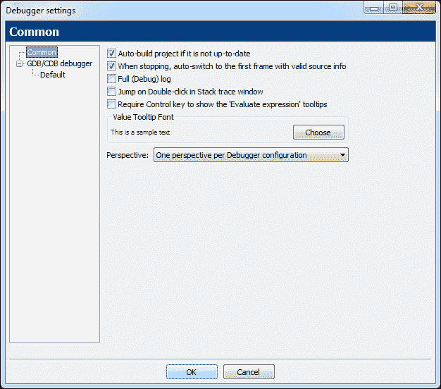

在左侧的树中选择**默认**，将提供更多与调试器相关的选项，如下面的屏幕截图所示:


在上一个屏幕截图中显示的光标选项下选择**评估表达式。每当光标在变量上移动时，此选项将提供一个包含详细信息的工具提示。**

# 首次应用调试

让我们创建一个新的控制台项目`App7`，并用以下代码替换`main.cpp`文件中的代码:

```cpp
#include <iostream>

int main() {
    const double pi = 3.1415926535897932384626433832795;
    double radius   = 20.0;
    double perimeter= 0.0;
    perimeter = 2 * pi * radius;
    std::cout << "Perimeter = " << perimeter << std::endl;
    return 0;
}
```

确保在编译器工具栏中选择**调试**目标，然后单击编译按钮进行编译。`App7`将编译调试。

在我们要求 GDB 调试之前，我们必须为它创建断点。在编辑器窗口中输入代码后，代码:: 块将看起来类似于以下屏幕截图。

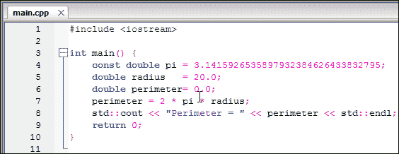

要设置断点，请将光标移至编辑器窗口的左侧，旁边是指示的行号。现在，光标将变为向右倾斜的光标。暂停鼠标并单击鼠标左键。断点将在那里设置，并由红色圆圈表示。下面的屏幕截图显示在行号`4`设置了一个断点。


接下来，请遵循相同的方法，并在行号 5、6 和 9 处创建断点。编辑器窗口现在看起来类似于以下屏幕截图:


现在所有断点都在编辑器窗口中直观指示。

现在，我们可以通过单击调试器工具栏中的**调试/继续**按钮来开始调试。或者，可以使用*F8*键开始调试。可能会出现以下窗口:


这突出显示了代码:: 块的默认布局已更改，因为**调试器日志**窗口已收到焦点 (请参阅前面的屏幕截图)。选择**别再烦我了!**复选框，然后单击**否**按钮停止它。它不会再出现了。现在让我们看看整个 IDE。

在下面的屏幕截图中，执行已在行号`4`处停止，并且光标已更改为黄色三角形。这表明调试器已在该位置停止执行。当我们继续调试时，调试器日志窗口也将更新。

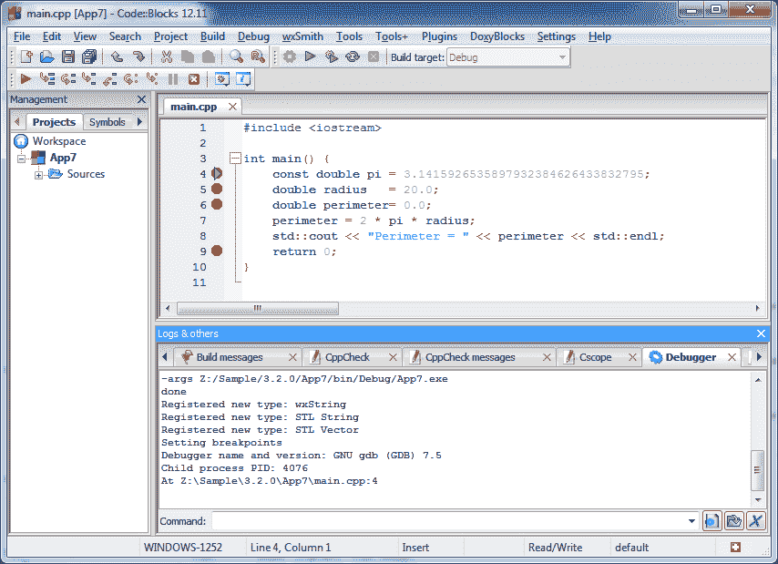

在继续进行调试之前，我们先看看 debugger 与 Code::Blocks 相关的功能。可以通过导航到**调试** | **调试窗口** | **CPU 寄存器**菜单选项来检查**CPU 寄存器**。寄存器是嵌入在处理器硬件中的微小但高速的缓冲区。


现在导航到**调试** | **调试窗口** | **反汇编**菜单选项; 这可用于显示当前 C 代码的汇编语言表示。以下屏幕截图显示了**反汇编**窗口，还指示了执行已停止的位置。点击**混合模式**复选框会叠加 C 代码和相应的汇编语言代码:


这种风格的汇编语言在&T 样式时被称为**。我们可以通过导航到**设置** | **调试器** | **GDB/调试器** | **默认**菜单选项，在反汇编对话框中切换到**Intel**样式汇编语言然后在**中选择**英特尔**选项，选择反汇编口味** (仅限 GDB) 组合框。现在关闭之前打开的反汇编对话框，然后重新打开。现在，它将显示英特尔风格的反汇编，如下面的屏幕截图所示。请注意，选择 AT&T 或 Intel 风格取决于开发人员的喜好。它对调试过程没有影响。**

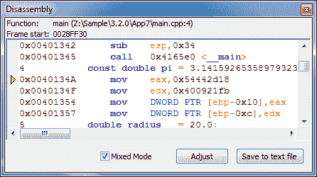

可以通过导航到**调试** | **调试窗口** | **运行线程**菜单选项来检查当前正在运行的线程。这个应用程序是单线程的，因此在下面的屏幕截图中，我们发现只有一个线程正在运行:

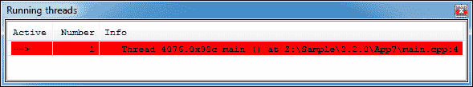

可以通过导航到**调试** | **信息** | **当前堆栈帧**菜单选项来检查堆栈帧。调用栈是存储当前运行函数信息的数据结构。以下截图显示了当前进程的堆栈帧信息:


### 注意

调用堆栈是一种数据结构，它基于 (**后进先出**) 的原理工作，并存储有关活动子程序或程序的信息。堆栈框架是调用堆栈的一部分，它存储单个子程序或函数的信息 (局部变量、返回地址和函数参数)。

每当一个应用程序在 Windows 平台上运行时，将多个**动态链接库** (**DLL**) 或动态库加载到内存中。DLL 提供其他应用程序可访问的功能，而无需在使用它的应用程序内部包含功能代码的副本。可以通过导航到**调试** | **信息** | **加载的库**菜单选项来检查加载的库。

下面的屏幕截图显示了我们的应用程序的加载库:


DLL 名称旁边的星号指示是否可以调试它们的源。我们发现它们都不允许调试。

现在，在介绍了几个与调试器相关的窗口之后，我们将继续进行调试。我们还将学习在变量上设置手表。点击**继续**按钮，调试器将在行号`5`处停止。在编辑器窗口中右键单击`radius`变量，然后选择观看 “半径” 菜单选项。

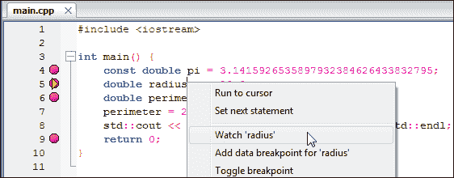

这将在变量`radius`上创建一个手表。手表可以定义为调试器在执行应用程序期间跟踪变量的指令。现在将打开一个监视变量的单独窗口，如下面的屏幕截图所示。手表窗口也可以通过**调试** | **调试窗口** | **手表**菜单选项打开:

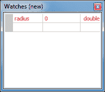

如果我们再次单击**继续**按钮，则应用程序的执行将前进到下一行。这将更新我们应用程序中`radius`变量的内容。监视窗口还将更新其内容，显示 radius 变量的当前值，如下面的屏幕截图所示:


在这一步，我们将了解另一种类型的断点，称为**数据断点**。右键单击下面屏幕截图中显示的编辑器窗口中的`radius`变量，然后单击**为 “半径”** 菜单选项添加数据断点:


选择**Break on read 或 write**选项，如以下屏幕截图所示，然后单击**OK**按钮。通过这样做，我们指示 GDB 每当读取或写入`radius`变量时暂停执行。

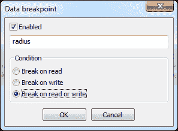

现在将创建数据断点。但是，数据断点不会在编辑器窗口中直观显示。可以通过导航到**调试** | **调试窗口** | **断点**菜单选项，从**断点**窗口进行验证。以下屏幕截图中的最后一行显示已设置数据断点。


单击调试器工具栏中的**继续**按钮或按*F8*键，执行将继续。由于我们在上一步中设置的数据断点，它现在将在第`7`行停止。这一行正在读取变量`radius`，并且`gdb`已停止执行，因为已满足数据断点条件。


单击**继续**按钮继续执行 app，随后它将在`9`行号停止。如果我们继续点击**continue**按钮应用程序，由于我们之前设置的数据断点，执行将停止几次。这是正常的，为了立即停止执行，请单击调试器工具栏中的**停止**按钮，或按*Shift**F8*键停止执行。

这就完成了我们对代码:: 块的应用程序调试的介绍。

# 多个应用程序调试

现实生活中的项目规模很大，可能由几个子项目组成。IDE 必须允许调试跨多个项目的大型应用程序。使用代码:: 块我们可以很容易地做到这一点。

要学习多个应用程序调试，我们将创建两个项目-第一个项目是一个 DLL 项目，第二个是一个控制台项目，依赖于第一个 DLL 项目。然后将两个项目保存在名为`App8`的同一个工作区下。

转到**文件** | **新** | **项目** | **动态链接库**菜单选项，创建 DLL 项目。命名此项目`libobject`。现在重命名`libobject`项目文件。我们将把`main.h`文件重命名为`dllmain.h`，把`main.cpp`重命名为`dllmain.cpp`文件。为此，请关闭所有打开的编辑器文件，然后右键单击项目树中的文件名，如下面的屏幕截图所示:


在以下屏幕截图中显示的对话框中输入新文件名:

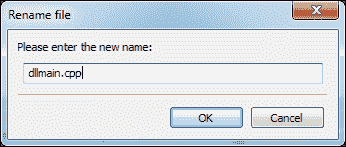

这样可以避免文件名的歧义。现在用以下代码替换`dllmain.h`文件中的代码。

```cpp
#ifndef __DLLMAIN_H__
#define __DLLMAIN_H__

/*  To use this exported function of dll, include this header
 *  in your project.
 */

#ifdef BUILD_DLL
    #define DLL_IMP_EXPORT __declspec(dllexport)
#else
    #define DLL_IMP_EXPORT __declspec(dllimport)
#endif

#ifdef __cplusplus
extern "C"
{
#endif
    void DLL_IMP_EXPORT SayHello(void);
#ifdef __cplusplus
}
#endif

class base {
public:
    void Set(int width, int height) {
        m_width  = width;
        m_height = height;
    }
    virtual int Area() = 0;
protected:
    int m_width, m_height;
};

class DLL_IMP_EXPORT Rectangle : public base {
public:
    int Area();
};

class DLL_IMP_EXPORT Triangle : public base {
public:
    int Area();
};

#endif // __DLLMAIN_H__
```

Windows 上的 DLL 需要特殊修饰才能从动态链接库导出。此装饰声明在导出和导入时会发生变化。装饰`__declspec(dllexport)`用于从 DLL 导出函数，`__declspec(dllimport)`用于从另一个 DLL 导入函数。装饰指示链接器导出或导入带有或不带有名称的变量/函数/对象名称。预处理器定义`DLL_IMP_EXPORT`用于指示编译器是否正在导出或导入函数或类。

C 允许函数/方法重载。它是通过在生成的代码中引入名称管理来实现的。名称修改是一个过程，其中根据函数参数，返回类型和其他参数将函数名称转换为唯一名称。名称 mangling 依赖于编译器，因此编写的任何 DLL 都是 C 不能直接与另一个编译器一起使用。

C 默认为所有函数引入名称管理。我们可以使用`extern "C"`关键字停止名称修改，并使用它来停止导出的`SayHello()`函数的名称修改。通过停止名称修改，我们可以使用一个用 C 编写的 DLL，并用一个编译器编译，以便与另一个编译器一起使用。

我们定义了一个类`base`，这个`base`类有一个成员函数`Set()`，它设置了两个内部变量。有一个名为`Area()`的纯虚函数，必须重新定义派生类。**纯虚函数**是基类中尚未实现的函数。如果在任何应用程序中调用纯虚拟函数，则可能导致崩溃。

但是，这个`base`类没有用`DLL_IMP_EXPORT`装饰。这意味着它不会在 DLL 中导出，并且没有外部应用程序可以使用此类。

为了使用`base`类的特性，我们将创建两个派生类。类`Rectangle`和`Triangle`，这些都是从`base`类公开派生的。我们在这里使用了类的继承。这些类用装饰`DLL_IMP_EXPORT`声明。因此，这两个类将在生成的 DLL 中导出。

现在用以下代码替换`libobject`项目的`dllmain.cpp`文件中的代码:

```cpp
#include <windows.h>
#include <iostream>

#include "dllmain.h"

void SayHello(void) {
    std::cout << "Hello World!" << std::endl;
}

int Rectangle::Area() {
    return (m_width * m_height);
}

int Triangle::Area() {
    return (m_width * m_height / 2);
}

extern "C" DLL_IMP_EXPORT BOOL APIENTRY DllMain(HINSTANCE hinstDLL, DWORD fdwReason, LPVOID lpvReserved) {
    switch (fdwReason) {
        case DLL_PROCESS_ATTACH: // attach to process
            // return FALSE to fail DLL load
            break;
        case DLL_PROCESS_DETACH: // detach from process
            break;
        case DLL_THREAD_ATTACH: // attach to thread
            break;
        case DLL_THREAD_DETACH: // detach from thread
            break;
    }
    return TRUE; // successful
}
```

`dllmain.cpp`文件中的代码主要定义公开导出函数的所有代码。有一个`DllMain()`函数。它可以用于对 DLL 进行任何初始化或去初始化。

接下来创建一个名为`App8`的控制台应用。现在将工作区重命名为`App8`，并将工作区保存为`App8`。这个控制台应用程序将使用`libobject.dll`中定义的函数。用以下代码替换`App8`的`main.cpp`文件中的代码:

```cpp
#include <iostream>

#include "dllmain.h"

int main() {
    Rectangle rect;
    rect.Set(10, 20);
    Triangle  trigl;
    trigl.Set(5, 6);
    std::cout << "Rectangle(10, 20).Area() = " << rect.Area() << std::endl;
    std::cout << "Triangle(5, 6).Area() = " << trigl.Area() << std::endl;
    return 0;
}
```

接下来，我们有准备我们的`App8`项目来使用这个 DLL。为此，请转到**项目** | **构建选项**菜单选项。在项目树中选择`App8`，然后单击**搜索目录**选项卡。然后将`..\libobject`目录添加到**编译器**选项卡中的列表中。这指示编译器在该目录中搜索头文件:


我们还需要将链接器指向我们保留了`libobject.dll`文件的导入库的目录。为此，请选择**调试**目标，然后单击**搜索目录**选项卡。然后单击**链接器**选项卡，并将`..\libobject\bin\Debug`文件夹添加到列表中:


我们必须指示链接器查找在`libobject.dll`文件中找到的符号的引用。为此，单击**链接器设置**选项卡，并将`libobject.a`添加到**链接库**列表中。


我们将在这一步设置项目依赖关系。转到**项目** | **属性…** 菜单选项，然后单击**项目依赖项…** 按钮。单击`libobject`，然后单击**关闭**按钮。最后点击**确定**按钮关闭**项目/目标**选项窗口。这完成了`App8`控制台应用程序的准备。

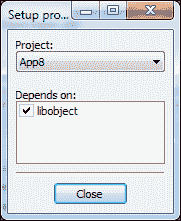

现在转到**构建** | **构建工作区**菜单选项。这将首先构建`libobject`项目，随后将编译`App8`。

为了学习调试多个项目，我们将在以下行号上设置断点:

*   `dllmain.cpp`文件中的第 11、15、19 行，`libobject`项目
*   `main.cpp`文件中的行号 7、9、10、12，`App8`项目

可以从以下屏幕截图中显示的**断点**窗口中验证断点:

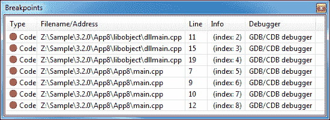

请注意，dll 不能作为独立进程运行，需要主机应用程序将其加载到内存中。为了调试 DLL，我们必须调试加载并运行它的主机应用程序。或者，我们可以通过导航到**项目** | **设置程序参数...** 菜单选项来指定用于调试的主机应用程序 (在本例中为`App8.exe`)。

我们将使用第一种方法，让我们的主机应用程序加载`libobject.dll`，然后使用它来调试`libobject.dll`和`App8.exe`文件。确保在项目树中激活`App8`项目，然后单击调试器工具栏中的调试/继续按钮:

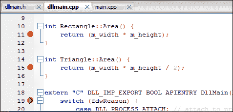

在上面的屏幕截图中，执行已在`dllmain.cpp`文件的行号`19`处停止。每当导出`DllMain()`时，它就成为在加载/卸载任何 DLL 期间要调用的第一个函数。因此，执行在那里停止。

以下屏幕截图中的 “加载库” 窗口确认已将`libobject.dll`加载到内存中，并且可以调试此库:

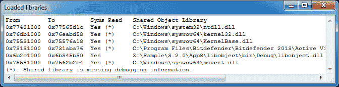

点击**继续**按钮继续。现在，执行将在`main.cpp`文件的行号`7`处暂停。

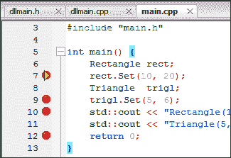

点击**继续**按钮两次。执行将在`main.cpp`文件的行号`10`处停止，如下面的屏幕截图所示:

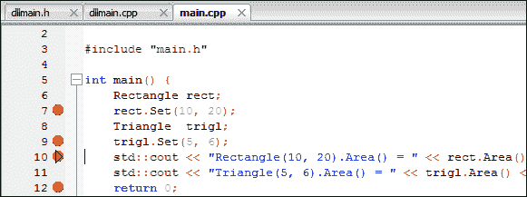

再次点击**继续**按钮，执行将在`dllmain.cpp`文件的行号`11`处停止。

Debugger 现在正在调试`libobject`项目的源文件，这是一个单独的项目。如果游标为悬停`m_height`变量调试器将评估该变量并显示其值。


很明显，我们可以同时调试 DLL 项目和控制台应用程序项目。较大的项目可以使用类似的方法进行调试。通过此示例，我们结束了多个应用程序调试会话。点击**停止**按钮停止调试。

# 总结

在本章中，我们学习了使用 GNU GDB 调试器进行代码:: 块的应用程序调试。我们学习了 Code::Blocks 提供的各种调试相关工具。随后，我们学习了调试单个和多个应用程序。

在下一章中，我们将讨论 Windows 的应用程序开发。