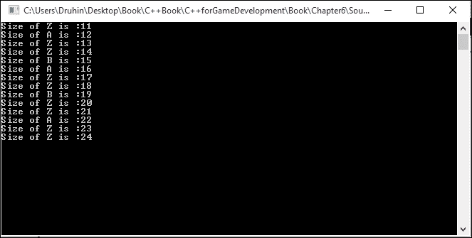
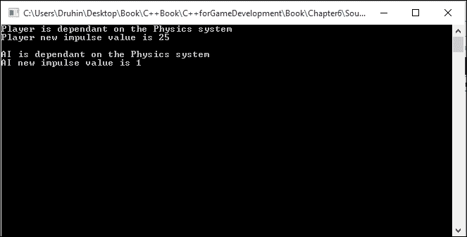

# 第六章游戏开发设计模式

本章将介绍以下食谱：

*   使用单例设计模式
*   使用工厂方法
*   使用抽象工厂方法
*   使用观察者模式
*   使用飞量级图案
*   使用策略模式
*   使用命令设计模式
*   使用设计模式创建高级游戏

# 简介

让我们考虑一下我们面临的某个问题。 过了一段时间，我们找到了解决这个问题的办法。 现在，如果问题再次出现，或者类似的模式再次出现，我们将知道如何应用解决前一个问题的相同原则来解决问题。 设计模式与此类似。 文档中已经记录了 23 个这样的解决方案，它们为处理与文档中的模式相似的问题提供了微妙的解决方案。 作者将他们描述为*四人帮*。 它们不是完整的解决方案，而是可以应用于类似情况的模板或框架。 然而，设计模式的最大缺点之一是，如果没有正确地应用它们，它们可能会被证明是灾难性的。 设计模式可以分为结构型、行为型或创建型。 我们将只看其中的几个，它们经常在游戏开发中使用。

# 使用单例设计模式

单例设计模式是游戏中最常用的设计模式。 不幸的是，它也是游戏中使用最多、应用最不正确的设计模式。 单例设计模式有几个优点，我们将对此进行讨论。 然而，它也带来了很多严重的后果。

## 做好准备

要完成本食谱，您需要一台运行 Windows 的计算机。 您还需要在 Windows 计算机上安装 Visual Studio 的工作副本。 不需要其他前提条件。

## How to Do It…

在本食谱中，我们将看到创建单例设计模式是多么容易。 我们还将看到此设计模式的常见陷阱：

1.  打开 Visual Studio。
2.  创建一个新的 C++ 项目。
3.  选择 Win32 控制台应用程序。
4.  添加名为`Source.cpp`的源文件。
5.  向其中添加以下代码行：

    ```cpp
    #include <iostream>
    #include <conio.h>

    using namespace std;

    class PhysicsManager
    {
    private:
      static bool bCheckFlag;
      static PhysicsManager *s_singleInstance;
      PhysicsManager()
      {
        //private constructor
      }
    public:
      static PhysicsManager* getInstance();
      void GetCurrentGravity()const;

      ~PhysicsManager()
      {
        bCheckFlag = false;
      }
    };

    bool PhysicsManager::bCheckFlag = false;

    PhysicsManager* PhysicsManager::s_singleInstance = NULL;

    PhysicsManager* PhysicsManager::getInstance()
    {
      if (!bCheckFlag)
      {
        s_singleInstance = new PhysicsManager();
        bCheckFlag = true;
        return s_singleInstance;
      }
      else
      {
        return s_singleInstance;
      }
    }

    void PhysicsManager::GetCurrentGravity() const
    {
      //Some calculations for finding the current gravity
      //Probably a base variable which constantly gets updated with value
      //based on the environment
      cout << "Current gravity of the system is: " <<9.8<< endl;
    }

    int main()
    {
      PhysicsManager *sc1, *sc2;
      sc1 = PhysicsManager::getInstance();
      sc1->GetCurrentGravity();
      sc2 = PhysicsManager::getInstance();
      sc2->GetCurrentGravity();

      _getch();
      return 0;
    }
    ```

## …的工作原理

开发人员想要使用单例类的主要原因是当他们想要仅限制类的一个实例时。 在我们的示例中，我们选择了`PhysicsManager`类。 我们将构造函数设为私有的，然后分配一个静态函数来获取类实例的句柄，从而获得类的方法。 我们还使用布尔值检查是否已创建实例。 如果是，则不分配新实例。 如果不是，我们分配一个新实例并调用相应的方法。

尽管看起来很聪明，但这种设计模式有很多缺陷，因此在游戏设计中应该尽量避免。 首先，它是一个全局变量。 这本身就是不好的。 全局变量保存在全局池中，可以从任何位置访问。 其次，这个会鼓励不好的耦合，这可能会出现在代码中。 第三，它不是同时友好的。 假设有多个线程，每个线程都可以访问这个全局变量。 这是导致灾难的秘诀，因为僵局将会发生。 最后，新程序员最常犯的错误之一就是为所有事情创建管理器，然后让管理器成为单身。 事实是，通过有效地使用 OOP 和引用，我们可以在不创建管理器的情况下逃脱。

前面的代码显示了初始化单例的惰性值，因此可以改进。 然而，这个配方中描述的所有基本问题仍然存在。

# 使用工厂方法

工厂本质上是一个仓库，用于创建其他类型的对象。 在工厂方法设计模式中，创建新类型的对象(如敌人或建筑物)是从接口开始的，子类决定需要实例化哪个类。 这也是游戏中常用的模式，非常有用。

## 做好准备

您需要在 Windows 计算机上安装 Visual Studio 的工作副本。

## How to Do It…

在本食谱中，我们将了解编写工厂方法设计模式是多么容易：

1.  打开 Visual Studio。
2.  创建一个新的 C++ 项目。
3.  选择 Win32 控制台应用程序。
4.  添加名为`Source.cpp`的源文件。
5.  向其添加行代码：

    ```cpp
    #include <iostream>
    #include <conio.h>
    #include <vector>

    using namespace std;

    class IBuilding
    {
    public:
      virtual void TotalHealth() = 0;
    };

    class Barracks : public IBuilding
    {
    public:
      void TotalHealth()
      {
        cout << "Health of Barrack is :" << 100;
      }
    };
    class Temple : public IBuilding
    {
    public:
      void TotalHealth()
      {
        cout << "Health of Temple is :" << 75;
      }
    };
    class Farmhouse : public IBuilding
    {
    public:
      void TotalHealth()
      {
        cout << "Health of Farmhouse is :" << 50;
      }
    };

    int main()
    {
      vector<IBuilding*> BuildingTypes;
      int choice;

      cout << "Specify the different building types in your village" << endl;
      while (true)
      {

        cout << "Barracks(1) Temple(2) Farmhouse(3) Go(0): ";
        cin >> choice;
        if (choice == 0)
          break;
        else if (choice == 1)
          BuildingTypes.push_back(new Barracks);
        else if (choice == 2)
          BuildingTypes.push_back(new Temple);
        else
          BuildingTypes.push_back(new Farmhouse);
      }
      cout << endl;
      cout << "There are total " << BuildingTypes.size() << " buildings" << endl;
      for (int i = 0; i < BuildingTypes.size(); i++)
      {
        BuildingTypes[i]->TotalHealth();
        cout << endl;
      }

      for (int i = 0; i < BuildingTypes.size(); i++)
        delete BuildingTypes[i];

      _getch();
    }
    ```

## …的工作原理

在本例中，我们创建了一个`Building`接口，该接口具有针对`TotalHealth`的纯虚拟函数。 这意味着所有派生类都必须重写此函数。 因此，我们可以保证我们所有的建筑物都会拥有这一物业。 我们可以根据游戏的性质和的设计，通过拥有更多的属性来不断地增加这个结构，比如生命值、总存储容量、村民的生产率等等。 派生类有自己的`TotalHealth`实现。 它们的命名也是为了反映它们所属的建筑类型。 此设计模式的最大优点是，我们在客户端需要的所有内容都是对基本接口的引用。 之后，我们可以在运行时创建所需的建筑类型。 我们将这些建筑类型存储在向量列表中，最后使用循环来显示内容。 因为我们有引用`IBuilding*`，所以我们可以在运行时分配任何我们想要的新派生类。 不需要为所有派生类(如`Temple*`等)创建引用。 下面的屏幕截图显示了我们可能为用户定义的村庄获得的输出：


# 使用抽象工厂方法

抽象工厂是创造性设计模式的一部分。 这是创建对象的最佳方式之一，也是游戏中常见的重复设计模式。 它就像一个工厂的工厂。 它使用接口创建工厂。 工厂负责创建对象，而不指定其类类型。 工厂基于工厂方法设计模式生成这些对象。 然而，一些人认为抽象工厂方法也可以使用原型设计模式来实现。

## 做好准备

您需要在 Windows 计算机上安装 Visual Studio 的工作副本。

## How to Do It…

在本食谱中，我们将了解实现抽象工厂模式是多么容易：

1.  打开 Visual Studio。
2.  创建一个新的 C++ 项目。
3.  选择 Win32 控制台应用程序。
4.  添加名为`Source.cpp`的源文件。
5.  向其添加行代码：

    ```cpp
    #include <iostream>
    #include <conio.h>
    #include <string>

    using namespace std;

    //IFast interface
    class IFast
    {
    public:
      virtual std::string Name() = 0;
    };

    //ISlow interface
    class ISlow
    {
    public:
      virtual std::string Name() = 0;
    };
    class Rapter : public ISlow
    {
    public:
      std::string Name()
      {
        return "Rapter";
      }
    };

    class Cocumbi : public IFast
    {
    public:
      std::string Name()
      {
        return "Cocumbi";
      }
    };
       . . . . .// Similar classes can be written here
    class AEnemyFactory
    {
    public:
      enum Enemy_Factories
      {
        Land,
        Air,
        Water
      };

      virtual IFast* GetFast() = 0;
      virtual ISlow* GetSlow() = 0;

      static AEnemyFactory* CreateFactory(Enemy_Factories factory);
    };

    class LandFactory : public AEnemyFactory
    {
    public:
      IFast* GetFast()
      {
        return new Cocumbi();
      }

      ISlow* GetSlow()
      {
        return new Marzel();
      }
    };

    class AirFactory : public AEnemyFactory
    {
    public:
      IFast* GetFast()
      {
        return new Zybgry();
      }

      ISlow* GetSlow()
      {
        return new Bungindi();
      }
    };

    class WaterFactory : public AEnemyFactory
    {
    public:
      IFast* GetFast()
      {
        return new Manama();
      }

      ISlow* GetSlow()
      {
        return new Pokili();
      }
    };

    //CPP File
    AEnemyFactory* AEnemyFactory::CreateFactory(Enemy_Factories factory)
    {
      if (factory == Enemy_Factories::Land)
      {
        return new LandFactory();
      }
      else if (factory == Enemy_Factories::Air)
      {
        return new AirFactory();
      }
      else if (factory == Enemy_Factories::Water)
      {
        return new WaterFactory();
      }
    }

    int main(int argc, char* argv[])
    {
      AEnemyFactory *factory = AEnemyFactory::CreateFactory
        (AEnemyFactory::Enemy_Factories::Land);

      cout << "Slow enemy of Land: " << factory->GetSlow()->Name() << "\n";
      delete factory->GetSlow();
      cout << "Fast enemy of Land: " << factory->GetFast()->Name() << "\n";
      delete factory->GetFast();
      delete factory;
      getchar();

      factory = AEnemyFactory::CreateFactory(AEnemyFactory::Enemy_Factories::Air);
      cout << "Slow enemy of Air: " << factory->GetSlow()->Name() << "\n";
      delete factory->GetSlow();
      cout << "Fast enemy of Air: " << factory->GetFast()->Name() << "\n";
      delete factory->GetFast();
      delete factory;
      getchar();

      factory = AEnemyFactory::CreateFactory(AEnemyFactory::Enemy_Factories::Water);
      cout << "Slow enemy of Water: " << factory->GetSlow()->Name() << "\n";
      delete factory->GetSlow();
      cout << "Fast enemy of Water: " << factory->GetFast()->Name() << "\n";
      delete factory->GetFast();
      getchar();

      return 0;
    }
    ```

## …的工作原理

在本例中，我们创建了两个接口，即`IFast`和`ISlow`。 在那之后，我们创造了几个敌人，并决定他们是快还是慢。 最后，我们创建了一个具有两个虚函数的抽象类来获取快敌人和慢敌人。 这意味着所有派生类必须覆盖这些函数并拥有它们自己的实现。 因此，实际上我们已经创建了一个由家工厂组成的工厂。 我们从抽象类创建的陆地、空中和水上敌人工厂都引用了慢速和快速两个接口。 因此，土地、水和空气本身也是工厂。

因此，在客户端，我们可以请求一个快速的陆上敌人或一个缓慢的水上敌人，我们可以得到适当的敌人显示给我们。 如下面的屏幕截图所示，我们可以获得如下所示的输出：


# 使用观察者模式

观察者设计模式在游戏中并不常用，但游戏开发人员应该更多地使用它，因为它是处理通知的一种非常聪明的方式。 在观察者设计模式中，组件与其他组件保持一对多关系。 这意味着当主组件更改时，所有从属组件也会更新。 想象一下一个物理系统。 我们希望`enemy1`和`enemy2`在物理系统更新后立即更新，因此我们应该使用此模式。

## 做好准备

对于本食谱，您需要一台装有 Visual Studio 工作副本的 Windows 计算机。

## How to Do It…

在本食谱中，我们将了解实现观察者模式是多么容易：

1.  打开 Visual Studio。
2.  创建一个新的 C++ 项目。
3.  选择 Win32 Windows 应用程序。
4.  添加名为`Source.cpp`的源文件。
5.  向其添加行代码：

    ```cpp
    #include <iostream>
    #include <vector>
    #include <conio.h>

    using namespace std;

    class PhysicsSystem {

      vector < class Observer * > views;
      int value;
    public:
      void attach(Observer *obs) {
        views.push_back(obs);
      }
      void setVal(int val) {
        value = val;
        notify();
      }
      int getVal() {
        return value;
      }
      void notify();
    };

    class Observer {

      PhysicsSystem *_attribute;
      int iScalarMultiplier;
    public:
      Observer(PhysicsSystem *attribute, int value)
      {
        If(attribute)
    {

    _attribute = attribute;
    }
        iScalarMultiplier = value;

        _attribute->attach(this);
      }
      virtual void update() = 0;
    protected:
      PhysicsSystem *getPhysicsSystem() {
        return _attribute;
      }
      int getvalue()
      {
        return iScalarMultiplier;
      }
    };

    void PhysicsSystem::notify() {

      for (int i = 0; i < views.size(); i++)
        views[i]->update();
    }

    class PlayerObserver : public Observer {
    public:
      PlayerObserver(PhysicsSystem *attribute, int value) : Observer(attribute, value){}
      void update() {

        int v = getPhysicsSystem()->getVal(), d = getvalue();
        cout << "Player is dependent on the Physics system" << endl;
        cout << "Player new impulse value is " << v / d << endl << endl;
      }
    };

    class AIObserver : public Observer {
    public:
      AIObserver(PhysicsSystem *attribute, int value) : Observer(attribute, value){}
      void update() {
        int v = getPhysicsSystem()->getVal(), d = getvalue();
        cout << "AI is dependent on the Physics system" << endl;
        cout << "AI new impulse value is " << v % d << endl << endl;
      }
    };

    int main() {
      PhysicsSystem subj;

      PlayerObserver valueObs1(&subj, 4);
      AIObserver attributeObs3(&subj, 3);
      subj.setVal(100);

      _getch();
    }
    ```

## …的工作原理

在本例中，我们创建了一个不断更新其值的物理系统。 依赖于物理系统的其他组件必须将其自身附加到物理系统，以便在物理系统更新时立即通知它们。

我们创建的物理系统包含一个矢量列表，其中包含从该系统观察到的所有组件。 除了之外，它还包含获取当前值或为其设置值的方法。 它还包含一种方法，用于在物理系统中的值发生更改时通知所有依赖组件。 `Observer`类包含对物理系统的引用，以及用于更新的纯虚函数，派生类必须重写这些函数。 `PlayerObserver`和`AIObserver`类可以从这个类派生，并根据物理系统中的变化拥有自己的脉冲实现。 人工智能和玩家系统都将不断收到来自物理系统的更新，除非它们脱离物理系统。

这是一个非常有用的模式，在游戏中有大量的实现。 下面的屏幕截图显示了典型的输出：



# 使用飞量级图案

当我们想要减少用于创建对象的内存量时，主要使用 flyweight设计模式。 当我们想要进行数百次或数千次的创作时，通常会使用这种模式。 森林结构的游戏通常使用这种设计模式。 此设计模式属于结构设计类别。 在此模式中，对象(比方说树对象)分为两部分，一部分依赖于对象的状态，另一部分独立。 独立部分存储在 flyweight 对象中，而从属部分由客户端处理，并在调用时发送到 flyweight 对象。

## 做好准备

对于本食谱，您需要一台装有 Visual Studio 工作副本的 Windows 计算机。

## How to Do It…

在本食谱中，我们将了解实现 flyweight 模式是多么容易：

1.  打开 Visual Studio。
2.  创建一个新的 C++ 项目。
3.  选择 Win32 控制台应用程序。
4.  添加名为`Source.cpp`的源文件。
5.  向其中添加以下代码行：

    ```cpp
    #include <iostream>
    #include <string>
    #include <map>
    #include <conio.h>

    using namespace std;

    class TreeType
    {
    public:
      virtual void Display(int size) = 0;

    protected:
      //Some Model we need to assign. For relevance we are substituting this with a character symbol
      char symbol_;
      int width_;
      int height_;
      float color_;

      int Size_;
    };

    class TreeTypeA : public TreeType
    {
    public:
      TreeTypeA()
      {
        symbol_ = 'A';
        width_ = 94;
        height_ = 135;
        color_ = 0;

        Size_ = 0;
      }
      void Display(int size)
      {
        Size_ = size;
        cout << "Size of " << symbol_ << " is :" << Size_ << endl;
      }
    };

    class TreeTypeB : public TreeType
    {
    public:
      TreeTypeB()
      {
        symbol_ = 'B';
        width_ = 70;
        height_ = 25;
        color_ = 0;

        Size_ = 0;
      }
      void Display(int size)
      {
        Size_ = size;
        cout << "Size of " << symbol_ << " is :" << Size_ << endl;
      }
    };

    class TreeTypeZ : public TreeType
    {
    public:
      TreeTypeZ()
      {
        symbol_ = 'Z';
        width_ = 20;
        height_ = 40;
        color_ = 1;

        Size_ = 0;
      }
      void Display(int size)
      {
        Size_ = size;
        cout <<"Size of " << symbol_ << " is :" << Size_ << endl;
      }
    };

    // The 'FlyweightFactory' class
    class TreeTypeFactory
    {
    public:
      virtual ~TreeTypeFactory()
      {
        while (!TreeTypes_.empty())
        {
          map<char, TreeType*>::iterator it = TreeTypes_.begin();
          delete it->second;
          TreeTypes_.erase(it);
        }
      }
      TreeType* GetTreeType(char key)
      {
        TreeType* TreeType = NULL;
        if (TreeTypes_.find(key) != TreeTypes_.end())
        {
          TreeType = TreeTypes_[key];
        }
        else
        {
          switch (key)
          {
          case 'A':
            TreeType = new TreeTypeA();
            break;
          case 'B':
            TreeType = new TreeTypeB();
            break;
            //…
          case 'Z':
            TreeType = new TreeTypeZ();
            break;
          default:
            cout << "Not Implemented" << endl;
            throw("Not Implemented");
          }
          TreeTypes_[key] = TreeType;
        }
        return TreeType;
      }
    private:
      map<char, TreeType*> TreeTypes_;
    };

    //The Main method
    int main()
    {
      string forestType = "ZAZZBAZZBZZAZZ";
      const char* chars = forestType.c_str();

      TreeTypeFactory* factory = new TreeTypeFactory;

      // extrinsic state
      int size = 10;

      // For each TreeType use a flyweight object
      for (size_t i = 0; i < forestType.length(); i++)
      {
        size++ ;
        TreeType* TreeType = factory->GetTreeType(chars[i]);
        TreeType->Display(size);
      }

      //Clean memory
      delete factory;

      _getch();
      return 0;
    }
    ```

## …的工作原理

在本例中，我们创建了一个林。 应用了 flyweight 模式的基本原理，其中一部分结构在所有树之间共享，一部分由客户端指定。 在本例中，除了大小(可以是任何值，仅选择大小作为示例)，其他所有属性都被选择为共享属性。 我们创建一个包含所有属性的树型接口。 然后，我们有了属性被覆盖的派生类和设置`size`属性的方法。 我们可以有多棵这样的树。 一般来说，树的种类越多，森林看起来就越详细。 假设我们有 10 种不同类型的树，因此我们需要有 10 种不同的类，这些类派生自接口，并且有一种方法可以根据客户端大小分配`size`属性。

最后，我们有树工厂，它在运行时分配每棵树。 我们创建一个对接口的引用，就像我们对任何工厂模式所做的那样。 但是，我们不是直接实例化新对象，而是首先检查映射以查看树的属性是否已经存在。 如果它们不是，我们将分配一个新对象并将属性推送到贴图。 因此，下次请求与已分配的树结构类似的树结构时，我们可以共享映射中的属性。 最后，从客户端创建一个森林类型文档，并将其提供给工厂，工厂使用文档中列出的树为我们生成森林。 因为大多数属性都是共享的，所以内存占用非常低。 下面的屏幕截图向我们展示了森林是如何创建的：


# 使用策略模式

策略设计模式是一种非常聪明的代码设计方式。 在游戏中，这主要用于 AI 组件。 在这个模式中，我们定义了大量的算法，并且所有算法都来自一个公共的接口签名。 然后，在运行时，我们可以更改算法的客户端。 因此，这些算法实际上是独立于客户端的。

## 做好准备

要完成本食谱，您需要一台运行 Windows 的计算机。 您还需要在 Windows 计算机上安装 Visual Studio 的工作副本。 不需要其他前提条件。

## How to Do It…

在本食谱中，我们将了解实现策略模式是多么容易：

1.  打开 Visual Studio。
2.  创建一个新的 C++ 项目。
3.  选择 Win32 控制台应用程序。
4.  添加`Source.cpp`文件。
5.  向其中添加以下代码行：

    ```cpp
    #include <iostream>
    #include <conio.h>

    using namespace std;

    class SpecialPower
    {
    public:
      virtual void power() = 0;
    };

    class Fire : public SpecialPower
    {
    public:
      void power()
      {
        cout << "My power is fire" << endl;
      }
    };

    class Invisibility : public SpecialPower
    {
    public:
      void power()
      {
        cout << "My power is invisibility" << endl;
      }
    };

    class FlyBehaviour
    {
    public:
      virtual void fly() = 0; 
    };

    class FlyWithWings : public FlyBehaviour
    {
    public:
      void fly()
      {
        cout << "I can fly" << endl;
      }
    };

    class FlyNoWay : public FlyBehaviour
    {
    public:
      void fly()
      {
        cout << "I can't fly!" << endl;
      }
    };

    class FlyWithRocket : public FlyBehaviour
    {
    public:
      void fly()
      {
        cout << "I have a jetpack" << endl;
      }
    };

    class Enemy
    {

    public:

      SpecialPower *specialPower;
      FlyBehaviour   *flyBehaviour;

      void performPower()
      {
        specialPower->power();
      }

      void setSpecialPower(SpecialPower *qb)
      {
        cout << "Changing special power..." << endl;
        specialPower = qb;
      }

      void performFly()
      {
        flyBehaviour->fly();
      }

      void setFlyBehaviour(FlyBehaviour *fb)
      {
        cout << "Changing fly behaviour..." << endl;
        flyBehaviour = fb;
      }

      void floatAround()
      {
        cout << "I can float." << endl;
      }

      virtual void display() = 0; // Make this an abstract class by having a pure virtual function

    };

    class Dragon : public Enemy
    {
    public:
      Dragon()
      {
        specialPower = new Fire();
        flyBehaviour = new FlyWithWings();
      }

      void display()
      {
        cout << "I'm a dragon" << endl;
      }

    };

    class Soldier : public Enemy
    {
    public:
      Soldier()
      {
        specialPower = new Invisibility();
        flyBehaviour = new FlyNoWay();
      }

      void display()
      {
        cout << "I'm a soldier" << endl;
      }
    };

    int main()
    {
      Enemy *dragon = new Dragon();
      dragon->display();
      dragon->floatAround();
      dragon->performFly();
      dragon->performPower();

      cout << endl << endl;

      Enemy *soldier = new Soldier();
      soldier->display();
      soldier->floatAround();
      soldier->performFly();
      soldier->setFlyBehaviour(new FlyWithRocket);
      soldier->performFly();
      soldier->performPower();
      soldier->setSpecialPower(new Fire);
      soldier->performPower();

      _getch();
      return 0;
    }
    ```

## …的工作原理

在本例中，我们为敌人可能拥有的不同属性创建了不同的接口。 因此，因为我们知道特异能是每个敌人类型都会拥有的属性，所以我们创建了一个名为`SpecialPower`和的接口，然后从它派生出两个名为`Fire`和`Invisibility`的类。 我们可以添加任意多的特殊功能，我们只需要创建一个新的类并从特殊的电源接口派生。 同样，所有敌人类型都应该有飞行的属性。 它们要么飞，要么不飞，或者在喷气背包的帮助下飞行。

因此，我们创建了一个`FlyBehaviour`接口，并从中派生出不同的飞行类型类。 之后，我们为敌人类型创建了一个抽象类，其中包含两个接口作为引用。 因此，任何派生类都可以决定它需要什么飞行类型和什么特殊功能。 这也给了我们在运行时改变特殊异能和飞行能力的灵活性。 下面的屏幕截图显示了此设计模式的一个简短示例：


# 使用命令设计模式

COMMAND设计模式通常涉及将命令封装为对象。 这在游戏网络中非常常用，在游戏中，玩家的移动以对象的形式发送，这些对象作为命令运行。 在命令设计模式中，要记住的四个要点是客户端、调用者、接收者和命令。 命令对象知道接收器对象。 接收器在收到命令后执行该工作。 调用者执行该命令，而不知道是谁发送了该命令。 客户端控制调用器，并决定在哪个阶段执行哪些命令。

## 做好准备

对于本食谱，您需要一台装有 Visual Studio 工作副本的 Windows 计算机。

## How to Do It…

在本食谱中，我们将了解实现命令模式是多么容易：

1.  打开 Visual Studio。
2.  创建新的 C++ 项目控制台应用程序。
3.  添加以下代码行：

    ```cpp
    #include <iostream>
    #include <conio.h>

    using namespace std;
    class NetworkProtocolCommand
    {
    public:
      virtual void PerformAction() = 0;
    };
    class ServerReceiver
    {
    public:
      void Action()
      {
        cout << "Network Protocol Command received" <<endl;

      }
    };
    class ClientInvoker
    {
      NetworkProtocolCommand *m_NetworkProtocolCommand;

    public:
      ClientInvoker(NetworkProtocolCommand *cmd = 0) : m_NetworkProtocolCommand(cmd)
      {
      }

      void SetCommad(NetworkProtocolCommand *cmd)
      {
        m_NetworkProtocolCommand = cmd;
      }

      void Invoke()
      {
        if (0 != m_NetworkProtocolCommand)
        {
          m_NetworkProtocolCommand->PerformAction();
        }
      }
    };

    class MyNetworkProtocolCommand : public NetworkProtocolCommand
    {
      ServerReceiver *m_ServerReceiver;

    public:
      MyNetworkProtocolCommand(ServerReceiver *rcv = 0) : m_ServerReceiver(rcv)
      {
      }

      void SetServerReceiver(ServerReceiver *rcv)
      {
        m_ServerReceiver = rcv;
      }

      virtual void PerformAction()
      {
        if (0 != m_ServerReceiver)
        {
          m_ServerReceiver->Action();
        }
      }
    };

    int main()
    {
      ServerReceiver r;
      MyNetworkProtocolCommand cmd(&r);
      ClientInvoker caller(&cmd);
      caller.Invoke();

      _getch();
      return 0;
    }
    ```

## …的工作原理

正如我们在这个示例中看到的，我们已经设置了一个接口来通过 network protocol 命令发送信息。 从该接口，我们可以派生多个子实例以在客户端使用。 然后，我们需要创建一个服务器接收器，它将接收从客户端发送的命令。 我们还需要创建一个客户端调用器，它将调用该命令。 此类中还应提供对 network protocol 命令的引用。 最后，在客户端，我们需要创建服务器的一个实例，并将该实例附加到我们创建的 network protocol 命令的子对象。 然后，我们使用客户端调用器调用该命令，并通过网络协议命令将其发送到接收器。 这确保保持抽象，并通过分组发送整个消息。 以下屏幕截图显示了该过程的一部分：



# 使用设计模式创建高级游戏

在理解了基本的设计模式之后，将它们结合起来创建一个好的游戏是很重要的。 需要多年的实践才能最终理解什么样的架构适合游戏结构。 通常，我们必须结合使用几个设计模式，才能得出可以应用于游戏的干净代码。 工厂模式可能是您最常用的设计模式，但这纯粹是我经验中的轶事参考。

## 做好准备

对于本食谱，您需要一台装有 Visual Studio 工作副本的 Windows 计算机。

## How to Do It…

在这个食谱中，我们将了解组合设计模式来创建游戏是多么容易：

1.  发帖主题：Re：Колибри0.7.0
2.  创建新的 C++ 项目控制台应用程序。
3.  添加以下代码行：

    ```cpp
    #ifndef _ISPEED_H
    #define _SPEED_H

    class ISpeed
    {
      public:
        virtual void speed() = 0;

    };

    #end
    #ifndef _ISPECIALPOWER
    #define _ISPECIALPOWER
    class ISpecialPower
    {
    public:
      virtual void power() = 0;
    };
    #endif

    #ifndef _IENEMY_H
    #define _IENEMY_H

    #include "ISpecialPower.h"
    #include "ISpeed.h"

    class IEnemy
    {

    public:

      ISpecialPower *specialPower;
      ISpeed   *speed;

      void performPower()
      {
        specialPower->power();
      }

      void setSpecialPower(ISpecialPower *qb)
      {

      }

    };
    #endif
    #include <iostream>
    #include "ISpeed.h"

    #pragma once
    class HighSpeed :public ISpeed
    {
    public:
      HighSpeed();
      ~HighSpeed();
    };

    #include "IEnemy.h"

    class Invisibility;
    class HighSpeed;

    class Soldier : public IEnemy
    {
    public:
      Soldier()
      {

      }

    };
    ```

## …的工作原理

前面的代码只是代码的一小部分。 让我们假设我们需要制作一款游戏，其中有不同等级的敌人，有不同类型的异能，以及一些特殊的助推或加电。 解决这个问题的一种方法是将所有的能力和特殊的 Boost 看作是从接口派生的单个类。 因此，我们需要为 SPEED 创建一个接口，该接口可以从`HighSpeed`类派生，依此类推。 类似地，我们可以创建一个`SpecialPower`接口，它可以由`Fire`类派生，依此类推。 我们需要为角色可以拥有的所有属性组创建接口。 最后，我们需要为由`Soldier`、`Archer`和`Grenadier`类派生的字符(`IEnemy`)创建一个接口，依此类推。 `IEnemy`接口还应该包含对所有其他接口的引用，如`ISpecialPower`和`ISpeed`。 通过这种方式，`IEnemy`的子班可以决定他们想要的功率和速度。 这类似于策略设计模式。 如果我们想把敌人分为陆敌和空敌，我们可以进一步完善这个结构。 在这种情况下，我们可以为`IType`创建一个接口，并从它派生`Land`和`Air`类，或者我们可以创建一个工厂，根据客户端请求的类型为我们创建敌方类型。 创建的每个敌方类型也将是从`IEnemy`派生的类，因此它还将具有对以前接口的引用。 随着游戏复杂性的增加，我们可以添加更多的设计模式来帮助我们。