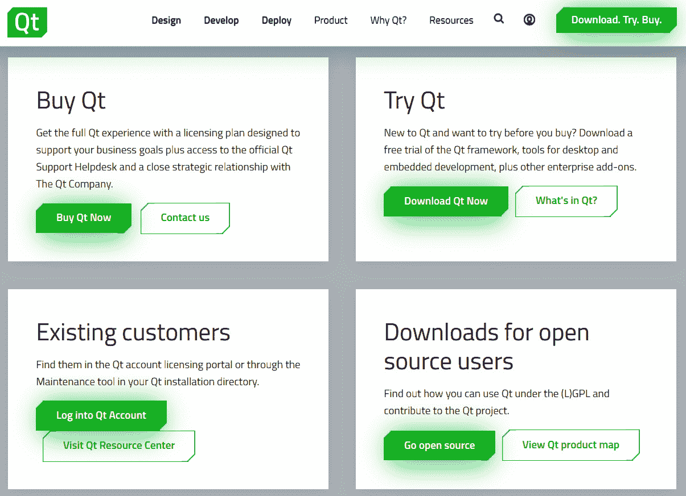
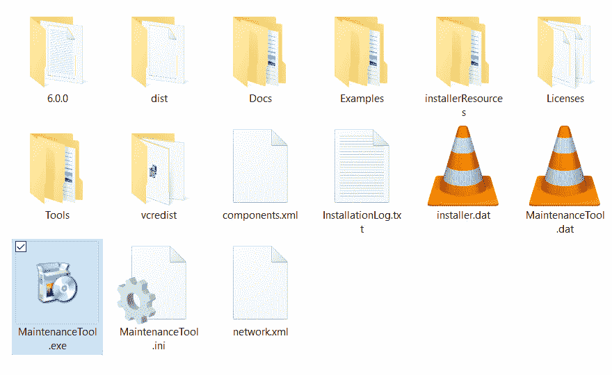
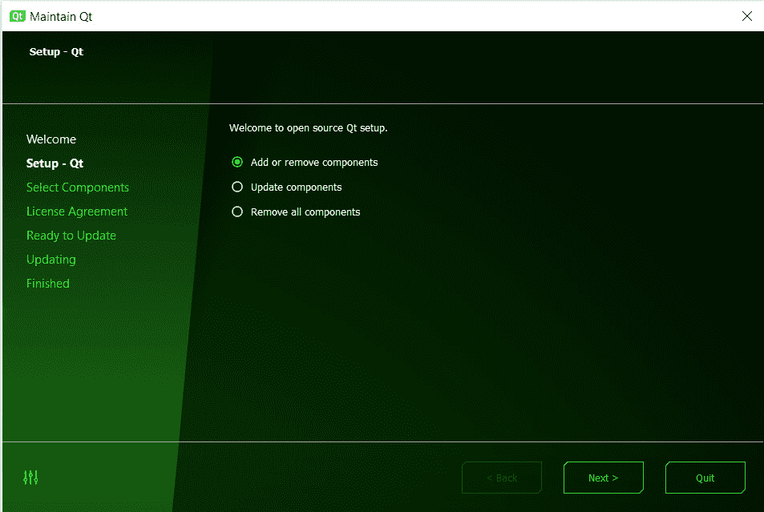
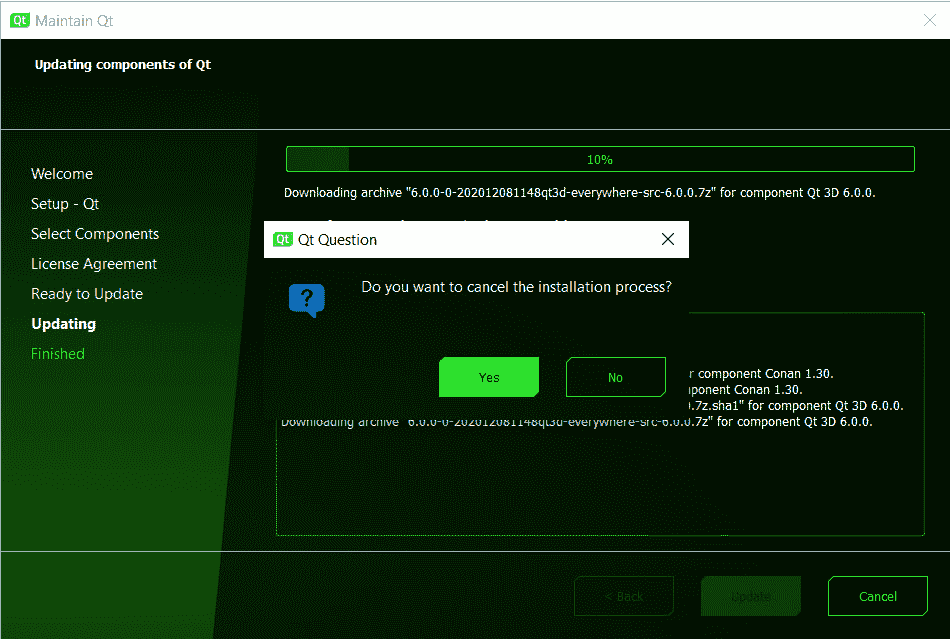
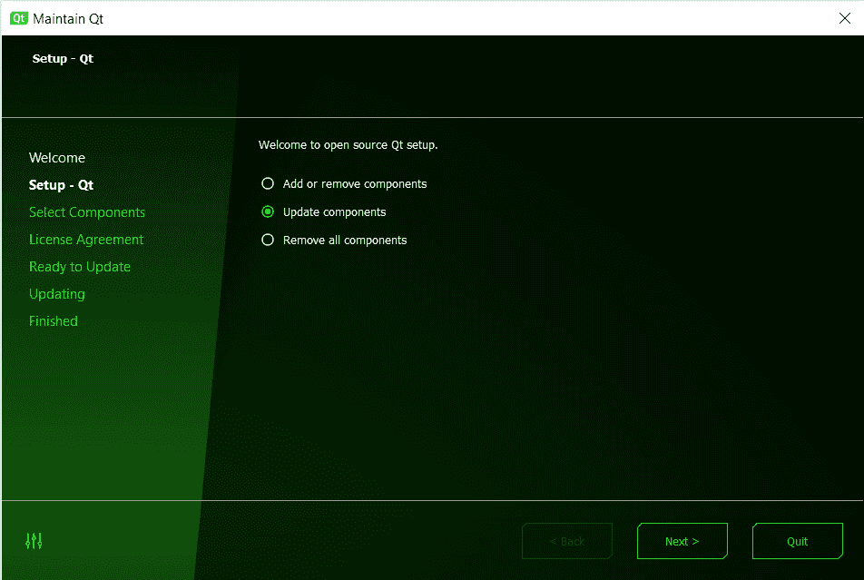
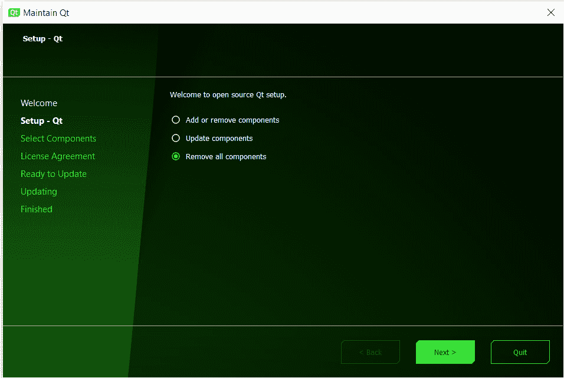

# 一、Qt 6 简介

**Qt**(发音为*cut*，而不是*que-tee*)是一个跨平台应用开发框架，旨在为桌面、嵌入式和移动平台创建具有统一**用户界面**(**UI**)的优秀软件应用。 它为开发人员提供了一套出色的工具来设计和构建优秀的应用，而无需担心平台依赖性。 在本章中，您将了解该框架的基础知识、它的历史，以及如何在不同的平台上安装 Qt。 您将了解什么是 Qt 以及为什么使用它是有益的。 在本章结束时，您将能够在您选择的平台上安装 Qt 并开始使用。

在本章中，我们将介绍以下主要主题：

*   Qt 简介
*   使用 Qt 的原因
*   下载并安装 Qt
*   从源代码构建 Qt 6

# 技术要求

要开始使用，您应该有一台运行 Windows、Linux 或 MacOS 的台式机或笔记本电脑。 请使用更新的 Windows 10 或 Ubuntu 20.04**长期支持**(**LTS**)。 或者，使用最新版本的 MacOS(比 MacOS 10.14 更新)，如 MacOS Catalina。

要使您的**集成开发环境**(**IDE**)平稳运行，您的系统应至少配备英特尔酷睿 i5 处理器以及至少 4**GB**(**GB**)的**随机存取存储器**(**RAM**)。

您需要活动的 Internet 连接才能下载和安装 Qt。 作为先决条件，您还应该熟悉 C++，因为 Qt 需要 C++ 编程知识。

# Qt 简介

Qt 是一个跨平台的软件开发框架，适用于桌面、嵌入式和移动平台。 它遵循减少*代码、创建更多代码并随处部署的理念。* 支持 Windows、Linux、MacOS、VxWorks、QNX、Android、iOS 等平台。 软件还支持恩智浦、瑞萨和意法半导体在裸机或 FreeRTOS 上运行的多个**微控制器单元**(**MCU**)。

Qt 诞生的初衷是试图提供一个统一的**图形用户界面**(**GUI**)，在不同的平台上具有相同的外观、感觉和功能。 Qt 通过提供一个只需编写一次代码的框架来实现这一点，并确保它可以在其他平台上运行，只需极少的修改或无需修改。 它不是一种编程语言，而是一个用 C++ 编写的框架。 Qt 框架和工具在开源和商业许可下是双重许可的。

Qt 使用模块化方法将相关功能组合在一起。 Qt Essentials是所有平台上 Qt 的基础。 这些模块是通用的，对于大多数基于 Qt 的应用都很有用。 基本模块可供开源使用。 Qt Essentials 模块的示例有 Qt Core、Qt GUI、Qt QML、Qt 小部件等。 还有一些特殊用途的附加模块，它们提供特定的功能并附带一定的许可义务。 附加模块的示例有 Qt 3D、Qt 蓝牙、Qt 图表、Qt 数据可视化等。 除此之外，还有一些增值模块，如 Qt Automotive Suite、用于设备创建的 Qt 和用于 MCU 的 Qt，以及商业许可下提供的其他模块。

要了解有关不同Qt 模块的更多信息，请访问[https://doc.qt.io/qt-6/qtmodules.html](https://doc.qt.io/qt-6/qtmodules.html)。

Qt于 1995 年发布供公众使用。 从那时起，有了许多改进和重大变化。 Qt 6 是 Qt 的新主版。 它的主要目标是为 2020 年及以后的需求做好准备，移除过时的模块，并使其更易于维护。 有了这个关注点，Qt6 中的架构变化可能会打破与早期版本的向后兼容性。

Qt 6 中的一些基本修改概述如下：

*   强类型简介
*   JavaScript 作为**Qt 建模语言**(**QML**)的可选功能
*   删除 QML 版本控制
*   消除 QObject 和 QML 之间的重复数据结构
*   避免创建运行时数据结构
*   将 QML 编译为高效的 C++ 和本机代码
*   支持隐藏实现详细信息
*   更好地集成工具

现在我们已经介绍了基础知识，让我们看看使用 Qt…的主要原因

# 使用 Qt 的原因

Qt 是一个模块化的、跨平台的应用开发框架。 对 Qt 最大的误解是很多人认为它是一个 GUI 框架。 然而，Qt 不仅仅是一个 GUI 框架。 它不仅包括一个 GUI 模块，还包括一组模块，使应用开发更快、更容易在各种平台上扩展。 使用 Qt 的最大好处是它能够为各种平台提供可移植性。 以下是开发人员使用 Qt 的一些优势：

*   您可以使用 Qt 为您的客户创造令人难以置信的用户体验，提升您的公司品牌。
*   跨平台开发既省时又省钱。 您可以使用相同的代码库瞄准多个平台。
*   Qt 以使 C++ 变得容易和可访问而闻名。 有了 Qt，开发人员可以轻松地创建具有流畅 UI 的高性能、可伸缩的应用。
*   由于采用了开源模式，该框架是面向未来的，同时还拥有一个强大的生态系统。
*   它还支持不同的编程语言，是一个非常灵活和可靠的框架。 因此，像 Adobe、微软、三星、AMD、惠普、飞利浦和MathWorks 这样的大公司都在他们的应用中使用 Qt。 许多开源项目，如 VLC(以前称为 VideoLAN Client)、**Open Broadaster Software**(**OBS**)和 WPS Office(其中**WPS**代表**Writer、Presentation 和 Spreadsheet**)也是基于 Qt 构建的。

Qt 的核心值概述如下：

*   跨平台特性
*   高度可扩展
*   非常容易使用
*   内置世界一流的**应用编程接口**(**API**)、工具和文档
*   可维护性、稳定性和兼容性
*   一个庞大的用户社区

无论您是业余爱好者、学生，还是在公司工作，Qt 都提供了极大的灵活性，可以根据您的需要使用它的模块。 许多大学都把 Qt 作为他们的课程之一。 因此，Qt 是程序员开始构建具有现成功能的新应用的绝佳选择。 让我们从下载 Qt6 并在您的机器上安装开始。

# 下载安装 Qt

在您的系统上安装 Qt 框架和工具有不同的方式。 您可以从 Qt 网站下载在线或离线安装程序，也可以自己构建源包。 Qt 建议首次安装时使用在线安装程序，以后修改安装时使用**Qt 维护工具**。

安装程序允许您下载并安装以下组件：

*   Qt 文库
*   Qt Creator IDE
*   文档和示例
*   Qt 源代码
*   附加模块

在线安装程序允许您根据选择的许可证选择 Qt、工具和附加模块的开源或商业版本进行安装。 在线安装程序不包含Qt 组件，但它是一个下载所有相关文件的下载客户端。 下载完成后即可安装。 您需要 Qt 帐户才能下载和安装 Qt。 商业 Qt 的评估版本为您提供免费试用期访问，包括所有商业包和官方 Qt 支持。 安装程序要求您使用您的 Qt 帐户登录。 如果您没有 Qt 帐户，您可以在安装过程中注册。 安装程序从 Qt 服务器获取附加到帐户的许可证，并根据您的许可证列出模块。 如果您不熟悉 Qt，那么我们建议您从开源版本开始。

脱机安装程序是特定于平台的包，其中包括与平台相关的所有 Qt 模块和加载项。 由于官方政策的变化，从 Qt 5.15 开始，开源离线安装程序不再可用。 如果您拥有商业许可证，则可以在安装过程中提供凭据。 您可以在您的**Qt 帐户**门户中找到您的许可证密钥。

您可以从以下链接下载它们：

*   **开源**：[https://www.qt.io/download-open-source](https://www.qt.io/download-open-source)
*   **商业版**：[https：//www.qt.io/download](https://www.qt.io/download)
*   **Offline**: [https://www.qt.io/offline-installers](https://www.qt.io/offline-installers)

    重要音符

    Qt 公司为用户提供双重许可选项。 作为初学者，您可以开始使用开源许可证来探索 Qt。 如果您为一家公司工作，请与您的经理或**信息技术**(**IT**)或法律团队讨论，以获得商业许可证或了解法律义务。 您可以在[https://www.qt.io/licensing/](https://www.qt.io/licensing/)了解有关 Qt 许可的更多信息。

## 下载 Qt

让我们从将 Qt 下载到您的机器开始，如下所示：

1.  要开始，请访问[https://www.qt.io/download](https://www.qt.io/download)下载页面。
2.  单击**下载。 试一试。 购买****。 右上角的**按钮。 您将在此处看到不同的下载选项。
3.  如果您想尝试商业版本，请点击**Try Qt**部分。 如果您已经拥有 Qt 帐户，则可以登录到**Existing Customers**部分下的帐户。
4.  Considering that you are new to Qt, we will begin with the open source version. Click on the **Go open source** button, as shown in the following screenshot:

    

    图 1.1-Qt 网站下载选项

5.  在下一个屏幕上，您将看到**Download the Qt Online Installer**按钮。 单击它以进入下载链接。
6.  The web page will automatically detect the underlying platform details from the browser and will show you the **Download** button. You can also select your intended installer by choosing the other options: you can select **32-bit** or **64-bit** or download for a different platform.

    单击下载选项后，您将看到**谢谢**页面。 在此阶段，您可以在`download`文件夹中找到安装程序。

接下来，让我们从 Windows 平台上的安装过程开始。

## 在 Windows 上安装 Qt

现在，让我们开始在 Windows 上安装！ 按照以下步骤进行：

1.  您将在下载文件夹中找到名为`qt-unified-windows-x86-%VERSION%-online.exe`的文件。 双击可执行文件，您将看到**欢迎**屏幕。
2.  Click the **Next** button, and a credentials screen will appear, asking you to log in with your Qt account. If you don't have one, then you can sign up on the same page, as shown in the following screenshot:

    

    图 1.2-安装程序的登录屏幕

3.  在下一个屏幕中，您将看到开源使用义务协议。 如果您使用商业许可证进行安装，则不会出现此屏幕。 点击第一个复选框，说明**我已经阅读并批准了使用开源 Qt 的义务**，并确认您没有将 Qt 用于商业目的。 请务必阅读协议中提到的条款和条件！ 然后，点击**下一步**按钮。
4.  下一个屏幕将为您提供与在 Qt Creator 中跟踪和共享假名数据相关的选项。 您可以根据自己的喜好允许或禁用这些选项。 然后，点击**下一步**按钮进入下一屏幕。
5.  在下一个屏幕中，您可以指定安装路径。 您可以继续使用默认路径，或者如果默认驱动器上没有足够的空间，也可以将其更改为任何其他路径。 您还可以通过选中底部的复选框选项来选择是否要将常见文件类型与 Qt Creator 相关联。 单击**下一步**按钮。
6.  Next, you will be presented with a list where you can select the version(s) of Qt you need to install on your system. You may simply proceed with the default options. If you don't need some of the components, then you can unselect them to reduce the size of the download. You can update the Qt components using the **Maintenance Tool** anytime later. To complete the installation process, click on the **Next** button. The component selection screen can be seen here:

    

    图 1.3-安装程序的组件选择屏幕

7.  在下一个屏幕中，您将看到许可协议。 单击第一个单选按钮，显示**我已阅读并同意许可协议**中包含的条款。 同样，请确保您阅读了许可协议中提到的条款和条件，然后单击**Next**按钮。
8.  在下一个屏幕上，您可以在 Windows 上创建**开始**菜单快捷方式。 此屏幕将不适用于其他平台。 完成此操作后，单击**Next**按钮。
9.  现在，Qt就可以安装到您的系统中了。 确保具有正常的互联网连接和数据平衡。 单击**安装**按钮开始安装。 下载过程需要时间，具体取决于您的网速。 下载所需文件后，安装程序将自动将其安装在先前选择的路径中。
10.  完成安装后，安装程序将为**维护工具**创建条目，这将帮助您稍后更改库。 单击**下一步**按钮移动到安装程序的最后一个屏幕。
11.  要完成安装过程，请单击**Finish**按钮。 如果您选中了**启动 Qt Creator**复选框，则将启动 Qt Creator。 我们将在下一章更详细地讨论这一点。 现在，Qt 就可以在您的 Windows 计算机上使用了。 单击**完成**按钮退出向导。

## 在 Linux 上安装 Qt

现在，让我们在 Linux 的最新**LTS 版本(如Ubuntu 20.04、CentOS 8.1 或 openSUSE 15.1)上安装Qt 框架。 我们将关注最流行的 Linux 发行版 Ubuntu。 您可以按照前面提到的相同步骤从 Qt 网站下载在线安装程序。**

在 Ubuntu 上，您将获得一个安装程序文件，如`qt-unified-linux-x64-%VERSION%-online.run`，其中`%VERSION%`是最新版本-例如：`qt-unified-linux-x86-4.0.1-1-online.run`。

1.  在执行下载的文件之前，您可能必须授予其写入权限。 为此，请打开终端并运行以下命令：

    ```cpp
    $ chmod +x qt-unified-linux-x64-%VERSION%-online.run
    ```

2.  您可以通过双击下载的安装程序文件开始安装过程。 安装需要超级用户访问权限。 在安装过程中，您可能需要在授权对话框中添加密码。 您也可以从终端运行安装程序，如下所示：

    ```cpp
    $ ./qt-unified-linux-x64-%VERSION%-online.run
    ```

3.  您将看到与 Windows 平台显示的屏幕相似的屏幕。 除了特定于**操作系统**(**OS**)的标题栏更改之外，所有屏幕在安装 Ubuntu 或类似 Linux 版本时都保持不变。

在写这本书的时候，Qt6 还没有可用的 Ubuntu 或 Debian 包，因为各自的维护者已经下台了。 因此，您可能无法从终端获得 Qt6 包。

## 在 MacOS 上安装 Qt

如果您是MacOS 用户，则也可以使用与针对早期平台讨论的相同的方式进行安装。 您可以按照前面提到的相同步骤从 Qt 网站下载在线安装程序。

您将获得一个安装程序文件，如`qt-unified-mac-x64-%VERSION%-online.dmg`，其中`%VERSION%`是最新版本(如`qt-unified-mac-x64-4.0.1-1-online.dmg`)。

Qt 依赖于 Xcode。 要在你的 Mac 上安装 Qt，你需要在你的机器上安装 Xcode，否则它将拒绝安装。 如果你是一名苹果开发者，那么你的 Mac 电脑可能安装了 Xcode。 如果您的计算机上没有安装 Xcode，那么您可以继续安装 Xcode 的**命令行工具**，而不是安装 Xcode。 这将节省您计算机上的时间和存储空间：

1.  要开始，请在终端上键入以下命令：

    ```cpp
    $ xcode-select --install 
    ```

2.  如果终端显示以下输出，则系统已准备好执行下一步：

    ```cpp
    xcode-select: error: command line tools are already installed, use
    "Software Update" to install updates
    ```

3.  下一步是安装 Qt 框架。 双击安装程序文件，启动安装界面。
4.  如果安装程序仍然抱怨 Xcode 未安装，则继续单击**确定**，直到消息永久消失。 记住安装路径。 安装完成后，您就可以在计算机上使用 Qt 了。

有关适用于 MacOS 的 Qt 的更多说明，请访问以下链接：

[https：//doc.qt.io/qt-6/macos.html](https://doc.qt.io/qt-6/macos.html)

## 更新或删除 Qt

一旦安装了 Qt，您就可以使用安装目录下的**维护工具**修改组件，包括更新、添加和删除组件。 所有桌面平台的目录结构都保持相同。 安装目录包含文件夹和文件，如以下屏幕截图所示(在 Windows 上)：



图 1.4-已安装文件夹内的维护工具

让我们从维护流程开始！ 您可以使用**维护工具**添加、删除和更新模块。 请按以下步骤进行操作：

1.  Click on the `MaintenanceTool.exe` executable to launch the maintenance interface. Click on the **Next** button, and a credentials screen will appear, asking you to log in with your Qt account. The login details will be prefilled from your last login session. You can click **Next** to add or update components or select the **Uninstall only** checkbox to remove Qt from your system. The following screenshot shows what the credentials screen looks like:

    

    图 1.5-维护工具的欢迎屏幕

2.  Once you are logged in, the tool will present you with options to add or remove or update the components, as shown in the following screenshot. Click on the **Next** button to proceed further:

    

    图 1.6-维护工具的设置屏幕

3.  On the next screen, you can select new components from the latest releases or the archived version. You can click on the **Filter** button to filter versions as per your requirement. You can also add new platform-specific components such as Android from the component list. If the component is existing and you uncheck it, then it will be removed from your desktop during the update. Once you have selected the components, click on the **Next** button. The following screenshot shows what the component selection screen looks like:

    

    图 1.7-组件选择屏幕

4.  You will then come across the update screen. This screen will tell you how much storage space is required for the installation. If you are running out of storage space, then you may go back and remove some existing components. Click on the **Update** button to begin the process, as illustrated in the following screenshot:

    

    图 1.8-维护工具的 Ready to Update(准备更新)屏幕

5.  You can abort the update installation process by clicking on the **Cancel** button. Qt will warn you and ask you for confirmation before aborting the installation process, as illustrated in the following screenshot. Once the process is aborted, click on the **Next** button to exit the wizard:

    

    图 1.9←Cancel(取消)对话框

6.  Launch the **Maintenance Tool** again to update existing components from the latest releases. You can click on the **Quit** button to exit the **Maintenance Tool**. Please wait while the installer fetches the meta-information from the remote repository. Click on the **Next** button to see the available components. The update option is illustrated in the following screenshot:

    

    图 1.10-维护工具中的更新选项

7.  Next, you can select which components to update from the checkboxes. You can choose to update all or you can update selectively. The installer will show how much storage space will be required for the update, as illustrated in the following screenshot. You can click **Next** to go to the update screen and begin the update. Then, on the next screen, click on the **Update** button to download the update packages:

    

    图 1.11-可供更新的组件

8.  Once the installation is finished, the installer makes entries for the Maintenance Tool, which will help you make changes to the libraries later. This is illustrated in the following screenshot. Click on the **Next** button to move to the last screen of the installer:

    

    图 1.12-维护工具中的更新完成屏幕

9.  在最后一个屏幕中，您将看到**重新启动**和**完成**按钮。 单击**Finish**按钮以退出 Qt 向导。
10.  同样，您可以重新启动或启动**维护工具**，然后选择**Remove All Components**单选按钮。 点击**下一步**按钮开始卸载过程，如下图所示：



图 1.13-维护工具中的移除选项

请注意，单击**卸载**按钮后，所有 Qt 组件都将从您的系统中删除；如果您想要再次使用它们，则必须重新安装 Qt。 如果您不想从系统中删除 Qt 组件，请单击**取消**上的，如下面的屏幕截图所示。 如果您打算删除现有版本并使用较新版本的 Qt，则选择**Add or Remove Components**选项，如前所述。 这将删除较旧的 Qt 模块并释放磁盘空间：


图 1.14-维护工具中的卸载屏幕

在本节中，我们了解了如何通过维护工具修改现有的 Qt 安装。 现在，让我们学习如何从源代码构建和安装 Qt。

# 从源头构建 Qt 6

如果您想自己构建框架和工具，或者尝试使用最新的未发布代码，那么您可以**从源代码**构建 Qt。 如果您打算从源代码开发特定的 Qt 版本，那么您可以从官方发布链接下载 Qt6 源代码，如下所示：[https://download.qt.io/official_releases/qt/6.0/](https://download.qt.io/official_releases/qt/6.0/)。

如果您是商业客户，则可以从您的 Qt 帐户门户下载**源包**。 特定于平台的构建说明将在接下来的小节中讨论。

您也可以从 GitHub 存储库克隆，然后签出所需的分支。 在撰写本书时，Qt6 分支仍在 Qt5 超级模块内部。 您可以通过以下链接克隆存储库：`git://code.qt.io/qt/qt5.git`。

为了便于维护，将来可能会将`qt5.git`存储库重命名为`qt.git`。 请参照`QTQAINFRA-4200`QT 票。 关于如何从 Git 构建 Qt 的详细说明可以在以下链接中找到：[https://wiki.qt.io/Building_Qt_6_from_Git](https://wiki.qt.io/Building_Qt_6_from_Git)。

确保您的计算机上安装了最新版本的 Git、Perl 和 Python。 在继续下一节中的特定于平台的指令之前，请确保有一个正在运行的 C++ 编译器。

## 在 Windows 上从源安装 Qt

要从源代码在 Windows 上安装 Qt 6，请执行以下后续步骤：

1.  首先，从 Git 或前面提到的开源下载链接下载源代码。 您将获得一个压缩文件`qt-everywhere-src--%VERSION%.zip`，其中`%VERSION%`是最新版本(如`qt-everywhere-src-6.0.3.zip`)。 请注意，像`-everywhere-src-`这样的后缀可能会在将来被删除。
2.  下载源代码存档后，将其解压缩到所需的目录-例如，`C:\Qt6\src`。
3.  在下一步中，使用支持的编译器和所需的构建工具配置构建环境。
4.  然后，将`CMake`、`ninja`、`Perl`和`Python`的安装目录分别添加到您的`PATH`环境变量中。
5.  下一步是构建 Qt 库。 要为您的计算机类型配置 Qt 库，请运行源目录中的`configure.bat`脚本。
6.  在此步骤中，通过在命令提示符下键入以下命令来构建 Qt：

    ```cpp
    >cmake --build . –parallel
    ```

7.  接下来，在命令提示符下输入以下命令以在您的计算机上安装 Qt：

    ```cpp
    >cmake --install .
    ```

您的Windows 计算机现在已准备好使用 Qt。

要了解有关配置选项的更多信息，请访问以下链接：

[https：//doc.qt.io/qt-6/configure-options.html](https://doc.qt.io/qt-6/configure-options.html)

详细的构建说明可在以下链接中找到：

[https：//doc.qt.io/qt-6/windows-building.html](https://doc.qt.io/qt-6/windows-building.html)

## 在 Linux 上从源安装 Qt

要在Linux 发行版上构建源包，请在您的终端上运行以下指令集：

1.  首先，从 Git 或前面提到的开源下载链接下载源代码。 您将获得一个压缩文件`qt-everywhere-src--%VERSION%.tar.xz`，其中`%VERSION%`是最新版本(如`qt-everywhere-src-6.0.3.tar.xz`)。 请注意，像`-everywhere-src-`这样的后缀可能会在将来被删除。
2.  下载源归档文件后，解压缩该归档文件并将其解压缩到所需的目录-例如，`/qt6`，如以下代码片段所示：

    ```cpp
    $ cd /qt6
    $ tar xvf qt-everywhere-opensource-src-%VERSION%.tar.xz 
    $ cd /qt6/qt-everywhere-opensource-src-%VERSION%
    ```

3.  要为您的计算机配置 Qt 库，请运行源目录中的`./configure`脚本，如以下代码片段所示：

    ```cpp
    $ ./configure
    ```

4.  要创建库并编译所有示例、工具和教程，请键入以下命令：

    ```cpp
    $ cmake --build . --parallel
    $ cmake --install .
    ```

5.  The next step is to set the environment variables. In `.profile` (if your shell is `bash`, `ksh`, `zsh`, or `sh`), add the following lines of code:

    ```cpp
    PATH=/usr/local/Qt-%VERSION%/bin:$PATH
    export PATH
    ```

    在`.login`中(如果您的 shell 是`csh`或`tcsh`)，添加以下代码行：

    ```cpp
    setenv PATH /usr/local/Qt-%VERSION%/bin:$PATH
    ```

如果您使用不同的 shell，请相应地修改您的环境变量。 Qt 现在可以在您的 Linux 机器上使用了。

有关 Linux/X11 的详细构建说明，请访问以下链接：

[https：//doc.qt.io/qt-6/linux-building.html](https://doc.qt.io/qt-6/linux-building.html)

## 在 MacOS 上从源安装 Qt

Qt 对**Xcode**有依赖关系。 要在 Mac 上安装 Qt，您的计算机上需要安装Xcode。 如果您的计算机上没有安装 Xcode，则可以继续安装 Xcode 的**命令行工具**：

1.  要开始，请在终端上键入以下命令：

    ```cpp
    $ xcode-select --install 
    ```

2.  如果终端显示以下输出，则系统已准备好执行下一步：

    ```cpp
    xcode-select: error: command line tools are already installed, use
    "Software Update" to install updates
    ```

3.  要构建源包，请在您的终端上运行以下指令集：

    ```cpp
    $ cd /qt6
    $ tar xvf qt-everywhere-opensource-src-%VERSION%.tar 
    $ cd /qt6/qt-everywhere-opensource-src-%VERSION%
    ```

4.  要为您的 Mac 配置Qt 库，请运行源目录中的`./configure`脚本，如以下代码片段所示：

    ```cpp
    $ ./configure 
    ```

5.  要创建库，请运行`make`命令，如下所示：

    ```cpp
    $ make
    ```

6.  如果`-prefix`在 build 目录之外，则键入以下行以安装库：

    ```cpp
    $ sudo make -j1 install
    ```

7.  The next step is to set the environment variables. In `.profile` (if your shell is `bash`), add the following lines of code:

    ```cpp
    PATH=/usr/local/Qt-%VERSION%/bin:$PATH
    export PATH
    ```

    在`.login`中(如果您的 shell 是`csh`或`tcsh`)，添加以下代码行：

    ```cpp
    setenv PATH /usr/local/Qt-%VERSION%/bin:$PATH
    ```

您的机器现在可以进行 Qt 编程了。

可在此处找到 MacOS 的详细构建说明：

[https：//doc.qt.io/qt-6/macos-building.html](https://doc.qt.io/qt-6/macos-building.html)

在本节中，我们学习了如何在您最喜欢的平台上从源代码安装 Qt。 现在，让我们来总结一下我们所学的内容。

# 摘要

本章解释了 Qt 框架的基础知识以及它可以用来做什么。 在这里，我们讨论了使用 Qt 的历史、不同的模块和优点。 我们还了解了具有许可义务的不同安装方法，给出了 Qt 在不同桌面平台上的逐步安装过程。 现在，您的机器已经准备好探索 Qt 了。

在下一章中，我们将讨论 Qt Creator IDE。 您将了解 IDE 的 UI、不同的配置以及如何将其用于 Qt 项目。