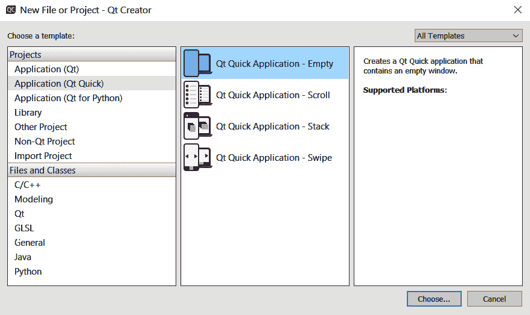
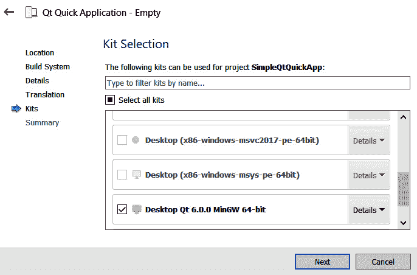
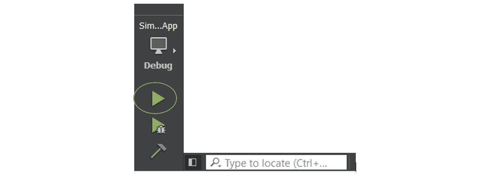
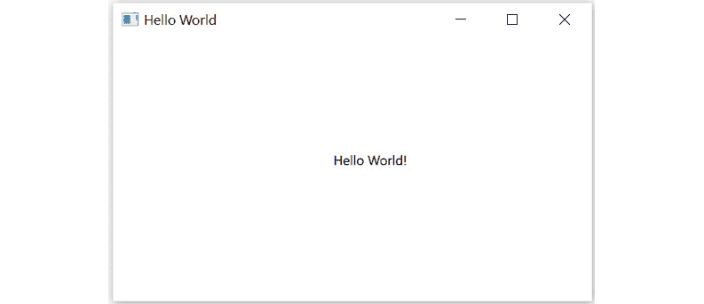
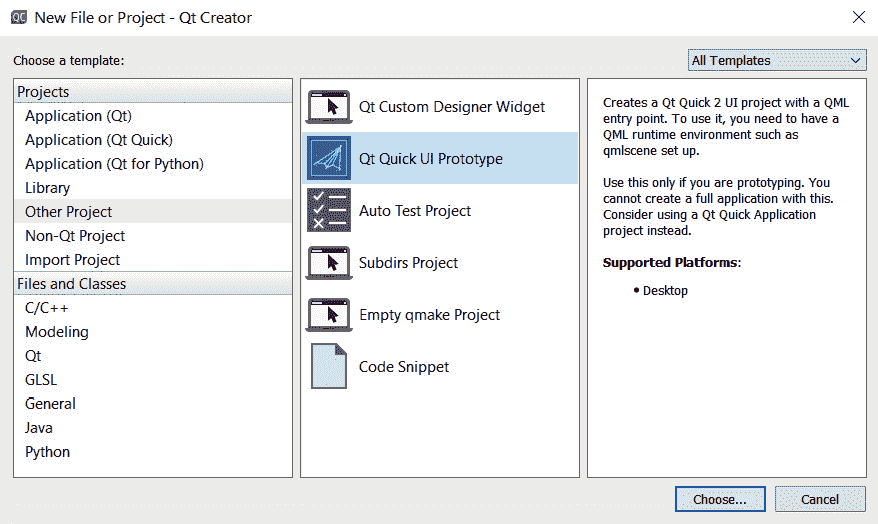
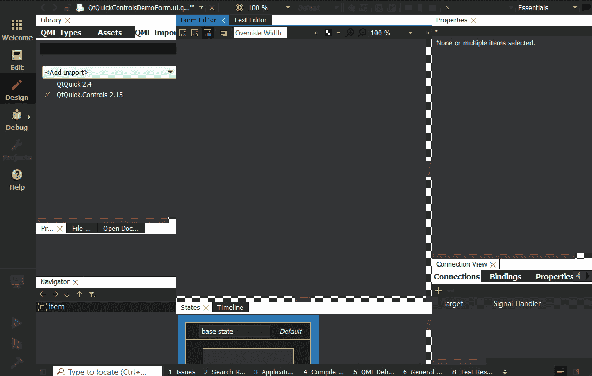
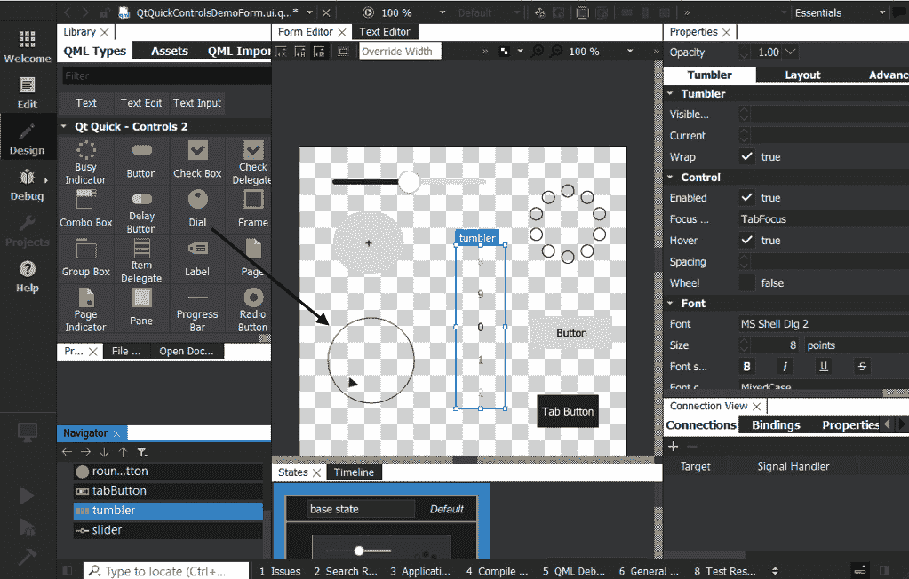
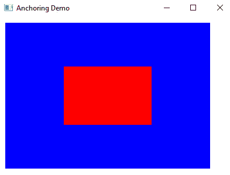

# 四、Qt Quick 和 QML

Qt 由两个不同的模块组成，用于开发**图形用户界面**(**GUI**)应用。 第一种方法是使用 Qt 小部件和 C++，我们在上一章中已经了解到这一点。 第二种方法是使用 Qt 快速控件和**Qt 建模语言**(**QML**)，我们将在本章中介绍。

在本章中，您将学习如何使用 Qt 快速控件和 QML 脚本语言。 您将学习如何使用 Qt Quick Layout 和定位器，以及如何制作响应迅速的 GUI 应用。 您将学习如何将后端 C++ 代码与前端 QML 集成。 您将学习 Qt Quick 和 QML 的基础知识，以及如何开发触摸友好和面向视觉的 Qt 应用。 您还将了解鼠标和触摸事件，以及如何开发触摸感知应用。

在本章中，我们将介绍以下主要主题：

*   QML 和 Qt 快速入门
*   了解 Qt 快速控件
*   创建一个简单的 Qt Quick 应用
*   使用 Qt Quick Designer 设计**用户界面**(**UI**)
*   QML 中的定位器和布局
*   QML 与 C++ 的集成
*   将 QML 与**JavaScript**(**JS**)集成
*   处理鼠标和触摸事件

在本章结束时，您将了解 QML 的基础知识、与 C++ 的集成，以及如何创建自己的 Fluid UI。

# 技术要求

本章的技术要求包括在 Windows 10、Ubuntu 20.04 或 MacOS 10.14 等最新桌面平台上安装 Qt 6.0.0 和 Qt Creator 4.14.0 的最低版本。

本章使用的所有代码都可以从以下 giHub 链接下载：[https://github.com/PacktPublishing/Cross-Platform-Development-with-Qt-6-and-Modern-Cpp/tree/master/Chapter04](https://github.com/PacktPublishing/Cross-Platform-Development-with-Qt-6-and-Modern-Cpp/tree/master/Chapter04)。

重要音符

本章中使用的屏幕截图取自 Windows 平台。 根据计算机中的底层平台，您将看到类似的屏幕。

# QML 和 Qt 快速入门

QML 是一种 UI 标记语言。 它是一种声明性语言，是 Qt 框架的一部分。 它可以构建流畅、触控友好的用户界面，并随着触摸屏移动设备的发展而出现。 它是为高度动态而创建的，开发人员可以通过最少的代码轻松创建流畅的 UI。 Qt QML 模块实现了QML 架构，并提供了开发应用的框架。 它定义和实现了语言和基础设施，并提供了**应用编程接口**(**API**)来集成QML 语言与 JS 和 C++。

Qt Quick 为 QML 提供了一个类型和功能库。 它包括交互类型、视觉类型、动画、模型、视图和图形效果。 它用于移动应用，在移动应用中，触摸输入、流畅的动画和用户体验至关重要。 Qt QML 模块为 QML 应用提供了语言和基础设施，而 Qt Quick 模块提供了许多可视化元素、动画和更多模块来开发面向触摸和视觉吸引力的应用。 您可以使用 QML 和 Qt Quick 控件，而不是使用 Qt 小部件进行 UI 设计。 Qt Quick 支持多种平台，如 Windows、Linux、Mac、iOS 和 Android。 您可以用 C++ 创建自定义类，并将其移植到 Qt Quick 以扩展其功能。 此外，该语言还提供了与 C++ 和 JS 的平滑集成。

## 了解 QML 类型系统

让我们熟悉一下的**QML 类型系统**和各种 QML 类型。 QML 文件中的类型可以来自各种来源。 下面概述了 QML 文件中使用的不同类型：

*   QML 原生提供的基本类型，如`int`、`bool`、`real`和`list`
*   JS 类型，如`var`、`Date`和`Array`
*   QML 对象类型，如`Item`、`Rectangle`、`Image`和`Component`
*   QML 模块(如`BackendLogic`)通过 C++ 注册的类型
*   作为 QML 文件提供的类型，如`MyPushButton`

基本类型可以包含简单的值，如`int`或`bool`类型。 除了原生基本类型之外，Qt Quick 模块还提供了其他基本类型。 QML 引擎还支持 JS 对象和数组。 任何标准 JS 类型都可以使用泛型`var`类型创建和存储。 请注意，`variant`类型已过时，仅支持较旧的应用。 QML 对象类型是可以从中创建 QML 对象的类型。 可以通过创建定义类型的`.qml`文件来定义自定义 QML 对象类型。 QML 对象类型可以具有属性、方法、信号等。

要在 QML 文件中使用基本的 QML 类型，请使用以下代码行导入`QtQml`模块：`import QtQml`

`Item`是 Qt Quick 中所有视觉元素的基本类型。 Qt Quick 中的所有可视项目都继承自`Item`，它是一个透明的可视元素，可以用作容器。 Qt Quick 提供了`Rectangle`作为绘制矩形的可视类型，并提供了`Image`类型来显示图像。 `Item`提供可视元素的通用属性集。 我们将在整本书中探索这些类型的用法。

您可以通过以下链接了解有关 QML 类型的更多信息：

[https：//doc.qt.io/qt-6/qmltypes.html](https://doc.qt.io/qt-6/qmltypes.html)

在本节中，我们学习了 QML 和 Qt Quick 的基础知识。 在下一节中，我们将讨论 Qt 快速控件。

# 了解 Qt 快速控件

**Qt Quick Controls**提供了一组个 UI 元素，可用于使用 Qt Quick 构建流畅的 UI。 为了避免**小部件**的歧义，我们将使用术语**控件**来表示 UI 元素。 **Qt Quick Controls 1**最初设计用于支持桌面平台。 随着移动设备和嵌入式系统的发展，该模块需要进行更改以满足性能预期。 因此，**Qt Quick Controls 2**应运而生，它进一步增强了对移动平台的支持。 Qt Quick Controls%1 从 Qt 5.11 起已弃用，并已从 Qt 6.0 中删除。 Qt Quick Controls 2 现在简称为 Qt Quick Controls。

可以使用`.qml`文件中的以下`import`语句将 QML 类型导入到您的应用中：

`import QtQuick.Controls`

重要音符

在 Qt6 中，QML 导入和版本控制系统有一些变化。 版本号一直是可选的。 如果在未指定版本号的情况下导入模块，则会自动导入模块的最新版本。 如果您导入的模块仅具有主版本号，则该模块将使用指定的主要版本和最新的次要版本导入。 Qt6 引入了**自动导入**功能，即写成`import <module> auto`。 这可确保导入的模块和导入的模块具有相同的版本号。

在 Qt 6 中对 Qt 快速控件的更改可在以下链接中找到：

[https：//doc.qt.io/qt-6/qtquickcontrols-changes-qt6.html](https://doc.qt.io/qt-6/qtquickcontrols-changes-qt6.html)

Qt 快速控件提供了用于创建 UI 的 QML 类型。 这里给出了Qt 快速控件的示例：

*   `ApplicationWindow`：带有样式的顶级窗口，支持页眉和页脚
*   `BusyIndicator`：指示后台活动-例如，在加载内容时
*   `Button`：可点击以执行命令或回答问题的按钮
*   `CheckBox`：可切换开或关的复选按钮
*   `ComboBox`：选择选项的组合按钮和弹出式列表
*   `Dial`：旋转以设定值的圆形刻度盘
*   `Dialog`：带有标准按钮和标题的弹出对话框
*   `Label`：使用继承字体设置样式的文本标签
*   `Popup`：类似弹出式 UI 控件的基本类型
*   `ProgressBar`：表示操作进度
*   `RadioButton`：可打开或关闭的独占单选按钮
*   `ScrollBar`：垂直或水平互动滚动条
*   `ScrollView`：可滚动视图
*   `Slider`：用于通过沿轨迹滑动手柄来选择值
*   `SpinBox`：允许用户从一组预设值中进行选择
*   `Switch`：可以打开或关闭的按钮
*   `TextArea`：多行文本输入区
*   `TextField`：单行文本输入字段
*   `ToolTip`：为任何控件提供工具提示
*   `Tumbler`：可以选择的项目的可旋转滚轮

要配置 Qt Quick Controls 模块以使用 qmake 进行构建，请将以下行添加到项目的`.pro`文件中：

`QT += quickcontrols2`

在本节中，我们了解了 Qt Quick 提供的不同类型的 UI 元素。 在下一节中，我们将讨论 Qt Quick 提供的不同样式以及如何应用它们。

## 设置 Qt 快速控件的样式

Qt 快速控件附带一组标准样式。 下面列出了它们：

*   **基本**
*   **融合**
*   *T0**想象一下元 T1**
*   **材料**
*   **通用**

在 Qt 快速控件中应用样式有两种方法，如下所示：

*   编译时间
*   运行时

您可以通过导入相应的样式模块来应用编译时样式，如下所示：

`import QtQuick.Controls.Universal`

您可以使用以下方法之一应用运行时样式：


图 4.1-运行时应用样式的不同方式

在本节中，我们了解了 Qt Quick 中的可用样式。 在下一节中，我们将创建第一个 Qt Quick GUI 应用。

# 创建一个简单的 Qt Quick 应用

让我们使用 Qt6 创建我们的第一个 Qt Quick 应用。Hello World 程序是一个非常简单的程序，它显示`Hello World!`。 该项目使用最少也是最基本的代码。 对于此项目，我们将使用由 Qt Creator 创建的**项目框架**。 那么，让我们开始吧！ 请按以下步骤进行操作：

1.  To create a new Qt Quick application, click on the **File menu** option on the menu bar or hit *Ctrl* + *N*. Alternatively, you can also click on the **New Project** button located on the welcome screen. Then, a window will pop up for you to choose a project template. Select **Qt Quick Application - Empty** and click the **Choose...** button, as shown in the following screenshot:

    

    图 4.2-新建 Qt 快速应用向导

2.  In the next step, you will be asked to choose a project name and a project location. You can navigate to the desired project location by clicking the **Browse…** button. Let's name our sample project `SimpleQtQuickApp`. Then, click on the **Next** button to proceed to the next screen, as shown in the following screenshot:

    

    图 4.3-项目位置选择屏幕

3.  In the next step, you can select a kit from a set of kits to build and run your project. To build and run a project, at least one kit must be active and selectable. Select the default **Desktop Qt 6.0.0 MinGW 64-bit**kit. Click on the **Next** button to proceed to the next screen. This can be seen in the following screenshot:

    

    图 4.4-套件选择屏幕

4.  The next step is to add your Qt Quick project to the installed **version control system** (**VCS**). You may skip version control for this project. Click on the **Finish** button to create a project with the generated files, as shown in the following screenshot:

    

    图 4.5-项目管理屏幕

5.  Once a project has been created, Qt Creator will automatically open up a file from your project, called `main.qml`. You will see a type of script that is very different from your usual C/C++ projects, as shown in the following screenshot:

    

    图 4.6-代码编辑器屏幕显示 main.qml 文件

    QML 运行时是用 C++ 在`QtQml`模块中实现的。 它包含一个负责执行 QML 的 QML 引擎。 它还包含 QML 元素可以访问的上下文和属性。 Qt 提供了用于实例化 QML 组件的`QQmlEngine`类。 您还可以使用`QQmlApplicationEngine`类以一种方便的方式使用单个 QML 文件加载应用，如下所示：

    ```cpp
    #include <QGuiApplication>
    #include <QQmlApplicationEngine>
    int main(int argc, char *argv[])
    {
        QGuiApplication app(argc, argv);
        QQmlApplicationEngine engine;
        const QUrl url(QStringLiteral("qrc:/main.qml"));
        engine.load(url);
        return app.exec();
    }
    ```

    您还可以使用`QQuickView`类，它为显示 Qt Quick UI 提供了一个窗口。 这种方法有点陈旧。 通过 QML，`QQmlApplicationEngine`具有方便的中心应用功能，而`QQuickView`通常由 C++ 控制。 下面的代码片段显示了如何使用`QQuickView`加载`.qml`文件：

    ```cpp
    #include <QGuiApplication>
    #include <QQuickView>
    int main(int argc, char *argv[])
    {
        QGuiApplication app(argc, argv);
        QQuickView view;
        view.setResizeMode(
            QQuickView::SizeRootObjectToView);
        view.setSource(QUrl("qrc:/main.qml"));
        view.show();
        return app.exec();
    }
    ```

    `QQuickView`不支持将`Window`用作根项目。 如果您想从 QML 创建根窗口，那么选择`QQmlApplicationEngine`。 使用`QQuickView`时，您可以直接使用任何 Qt Quick 元素，如以下代码片段所示：

    ```cpp
    import QtQuick
    Item  {
        width: 400
        height: 400
        Text {
              anchors.centerIn: parent
              text: "Hello World!"
        }
    }
    ```

6.  Next, you can build and run the Qt Quick project by clicking on the green arrow button located at the bottom-left corner of the **integrated development environment** (**IDE**), as shown in the following screenshot:

    

    图 4.7-Qt Creator 中的构建和运行选项

7.  现在，点击**Run**按钮构建并运行应用。 很快，您将看到一个带有**Hello World！**的 UI，如以下屏幕截图所示：



图 4.8-Hello World UI 的输出

您可以在 Windows 上从命令行运行该应用，如下所示：

```cpp
>SimpleQtQuickApp.exe
```

您还可以在 Linux 发行版上从命令行运行该应用，如下所示：

```cpp
$./SimpleQtQuickApp
```

在命令行模式下，如果在应用路径中找不到库，可能会看到几个错误对话框。 您可以将 Qt 库和插件文件复制到该二进制文件夹来解决该问题。 为了避免这些问题，我们将坚持使用 Qt Creator 来构建和运行我们的示例程序。 您可以转到项目界面并根据您的喜好选择一个工具包，从而在不同的工具包之间进行切换。 请记住，您需要在更改`.pro`文件后运行`qmake`。 如果您正在使用命令行，则继续执行以下命令：

```cpp
>qmake
>make
```

您还可以使用 QML 入口点创建一个 Qt Quick2UI 项目，而无需使用任何 C++ 代码。 要使用它，您需要设置一个 QML 运行时环境，比如`qmlscene`。 Qt Creator 使用`.qmlproject`处理仅限 QML 的项目：

1.  To create a Qt Quick 2 UI project, select **Qt Quick 2 UI Prototype** from the new project template screen, as shown in the following screenshot:

    

    图 4.9-Qt Quick UI Prototype 向导

2.  继续单击**下一步**按钮，查看**项目详细信息**、**套件选择**和**项目管理**屏幕。 这些屏幕与前面讨论的 Qt 快速应用项目相同。 单击**Finish**按钮以创建具有骨架的项目。 现在，看看`QtQuickUIPrototype.qmlproject`和`QtQuickUIPrototype.qml`Qt Creator 生成的文件的内容。
3.  Let's modify the contents of `QtQuickUIPrototype.qml` to add a `Text` element and display `Hello World!`, as illustrated in the following screenshot:

    

    图 4.10-Qt Quick UI 原型项目示例内容

4.  现在，点击**Run**按钮构建并运行应用。 很快，您将看到一个带有**Hello World！**的 UI。

您还可以从命令行运行该应用，如下所示：

```cpp
>qmlscene QtQuickUIPrototype.qml
```

您可能需要在命令行中提到`qmlscene`和`qml`文件路径。 仅当您正在制作原型时才使用此选项。 您不能使用此命令创建完整的应用。 对于完整的应用，请考虑使用 Qt Quick 应用项目。

在本节中，我们学习了如何使用 Qt Quick 模块创建一个简单的 GUI。 在下一节中，我们将学习如何使用 Qt Quick Designer UI 设计自定义 UI。

# 使用 Qt Quick Designer 设计 UI

在本节中，您将学习如何使用 Qt Quick Designer 设计您的 UI。 与 Qt 小部件中的`.ui`文件类似，您还可以在 QML 中创建一个 UI 文件。 该文件的文件扩展名为`.ui.qml`。 QML 文件有两种类型：一种扩展名为`.qml`，另一种扩展名为`.ui.qml`。 QML 引擎将其视为标准的`.qml`文件，但禁止其中的逻辑实现。 它为多个`.qml`文件创建可重用 UI 定义。 通过 UI 定义和逻辑实现的分离，增强了 QML 代码的可维护性。

在开始学习如何设计我们自己的 UI 之前，让我们先熟悉一下 Qt Quick Designer 的界面。 下面的屏幕截图显示了 Qt 快速设计器的不同部分。 在设计我们的 UI 时，我们将逐步了解这些部分：


图 4.11-Qt Quick Designer 用户界面的部分

Qt Quick Designer 的 UI由以下主要部分组成：

*   **Navigator**：它以树形结构列出当前 QML 文件中的项目。 它类似于我们在上一章中了解到的 Qt 设计器中的**对象运算符**窗口。
*   **控件库**：此窗口显示 QML 中所有可用的 Qt 快速控件。 您可以将控件拖放到画布窗口以修改您的 UI。
*   **Resources**：这将在列表中显示所有资源，然后可用于 UI 设计。
*   **Import Browser**：**Import Browser**便于将不同的 QML 模块导入到当前 QML 文件中，为您的 QML 项目添加新功能。 您还可以创建自己的自定义 QML 模块并从此处导入。
*   **文本编辑器**：它有六个工具按钮，每个按钮用于特定的操作，如复制和粘贴。
*   **属性编辑器**：类似于 Qt 设计器的属性编辑器。 Qt 快速设计器中的**属性**部分显示选定项的属性。 也可以在**文本编辑器**中更改项目的属性。
*   **表单编辑器**：**表单编辑器**是一个画布，您可以在其中为 Qt Quick 应用设计 UI。
*   **状态编辑器**：此窗口列出 QML 项目中的不同状态，并描述 UI 定义及其行为。
*   **连接编辑器**：此部分类似于 Qt Designer 中的**信号/插槽编辑器**。 在这里，您可以定义 QML 组件的信号和槽机制。

您现在已经熟悉了 Qt 快速设计器 UI。 让我们创建一个Qt Quick UI 文件并探索 Qt Quick 控件，如下所示：

1.  To create a Qt Quick UI, select **QtQuick UI File** from the **New File** template screen, as shown in the following screenshot. Proceed through the next screens to create a Qt Quick form with a .`ui.qml` file extension. By default, Qt Creator will open up Qt Quick Designer. You can switch to code-editing mode by clicking the **Edit** button on the left-side panel:

    

    图 4.12-Qt 快速 UI 文件向导

2.  Let's add a few QML elements to the **Form Editor** by grabbing a control by a mouse press and dropping it onto the canvas area by a mouse release, as shown in the following screenshot. This action is known as **drag and drop** (**DnD**). You can find several basic QML types, such as `Item`, `Rectangle`, `Image`, `Text`, and so on. `Item` is a transparent UI element that can be used as a container:

    

    图 4.13-显示基本 QML 类型的 Qt 快速设计器

3.  By default, the library contains only a few basic QML types. You can import Qt Quick modules to Qt Quick Designer through the QML **Import Browser**. Let's import any of the `QtQuick.Controls` packages, as shown in the next screenshot:

    

    图 4.14-显示 QML 模块导入选项的 Qt 快速设计器

4.  导入模块后，您可以在库中看到带有**Qt Quick-Controls 2**的部分，如以下屏幕截图所示：



图 4.15-显示 Qt 快速控件的 Qt 快速设计器

在本节中，我们熟悉了 Qt Quick Designer 的界面。 在下一节中，您将了解不同的定位器和布局。

# QML 中的定位器和布局

在 QML 中定位项目有种不同的方式。 可以通过提及*x*和*y*坐标或使用锚点、定位器或布局来手动定位控件。 让我们讨论一下如何通过上述方法定位控件。

## 手动定位

通过设置控件相应的*x*和*y*属性，可以将控件定位在特定的*x*和*y*坐标处。 根据可视的坐标系规则，这将使控件相对于其父控件的左上角定位。

下面的代码片段显示如何将`Rectangle`项放置在位置(`50,50`)：

```cpp
import QtQuick
Rectangle {
    // Manually positioned at 50,50
    x: 50 // x position
    y: 50 // y position
    width: 100; height: 80
    color: "blue"
}
```

运行前面的代码时，您将看到在(`50,50`)位置创建了一个蓝色矩形。 更改`x`和`y`值，您将看到相对于左上角位置是如何变化的。 Qt 允许您在由分号分隔的一行中编写多个属性。 您可以在同一行中写入`x`和`y`位置，并用分号分隔。

在本节中，您学习了如何通过指定可视化项的坐标来定位它。 在下一节中，我们将讨论锚的使用。

## 用锚定位

Qt Quick提供了一种将一个控件锚定到另一个控件的方法。 每个项目有七条不可见锚线：`left`、`right`、`top`、`bottom`、`baseline`、`horizontalCenter`和`verticalCenter`。 您可以为每一面设置边距或不同的边距。 如果特定项目有多个锚点，则可以对它们进行分组。

让我们来看一下下面的示例：

```cpp
import QtQuick
import QtQuick.Window
Window {
    width: 400; height: 400
    visible: true
    title: qsTr("Anchoring Demo")
    Rectangle {
        id: blueRect
        anchors {
            left: parent.left; leftMargin:10
            right: parent.right; rightMargin: 40
            top: parent.top; topMargin: 50
            bottom: parent.bottom; bottomMargin: 100
        }
        color: "blue"
        Rectangle {
            id: redRect
            anchors.centerIn: blueRect
            color:"red"
            width: 150; height: 100
        }
    }
}
```

如果运行此示例，您将在输出窗口中看到一个蓝色矩形内有一个红色矩形，该矩形具有不同的边距，如下所示：



图 4.16-将控件锚定在窗口内

在本节中，您学习了如何使用锚点定位可视项目。 在下一节中，我们将讨论定位器的使用。

## 定位器

**定位器**是容器，它管理声明性 UI 中视觉元素的位置。 定位器的行为类似于**Qt 小部件**中的布局管理器。

Qt Quick 元素的基本集合中提供了一组标准的定位器。 它们概述如下：

*   **列**将其子级定位在列中。
*   **行**将其子项放置在一行中。
*   **网格**将其子项定位在网格中。
*   **flow**将其子项定位为页面上的单词。

让我们来看看如何在 Qt Quick Designer 中使用它们。 首先，创建三个具有不同颜色的**矩形**项，然后将它们放置在**Row**元素中，如以下屏幕截图所示：


图 4.17-行定位器内部的矩形

您还可以编写代码在定位器中定位控件。 如果您使用 Qt 快速设计器，Qt Creator 会自动生成代码。 可以通过**表单编辑器**旁边的**文本编辑器**选项卡查看和修改生成的代码。 代码如以下代码片断所示：

```cpp
Row {
    id: row     
    Rectangle {
        id: yellowRect
        width: 150; height: 100
        color: "yellow"
        border.color: "black"
    }
    Rectangle {
        id: redRect
        width: 150; height: 100
        color: "red"
        border.color: "black"
    }
    Rectangle {
        id: greenRect
        width: 150; height: 100
        color: "green"
        border.color: "black"
    }
}
```

在本节中，我们了解了不同的定位器。 在下一节中，我们将讨论中继器和型号以及定位器的使用。

## 中继器

**中继器**使用提供的模型创建多个可视元素，以及来自模板的元素以与定位器一起使用，并使用来自模型的数据。 中继器放置在定位器内，并创建遵循定义的定位器排列的视觉元素。 当有许多类似的物品时，带有中继器的定位器在按规则布局排列时会更容易维护。

让我们使用`Repeater`创建位于一行中的五个矩形，如下所示：

```cpp
import QtQuick
import QtQuick.Window
Window {
    width: 400; height: 200
    visible: true
    title: qsTr("Repeater Demo")
    Row {
        anchors.centerIn: parent
        spacing: 10
        Repeater {
            model: 5
            Rectangle {
                width: 60; height: 40
                border{ width: 1; color: "black";}
                color: "green"
            }
        }
    }
}
```

运行前面的示例时，您将看到五个矩形排成一行，如下所示：


图 4.18-行定位器内部的矩形

在本节中，我们了解了如何将中继器与定位器配合使用。 在下一节中，我们将研究 Qt 快速布局。

Qt Quick Layout 是一组QML 类型，可用于在 UI 中排列视觉元素。 Qt Quick Layout 可以调整其子项的大小，因此它们用于可调整大小的 UI。 定位器和布局之间的基本区别在于，布局可以在调整窗口大小时调整其子窗口的大小。

可以使用以下`import`语句将 Qt 快速版面导入到 QML 文件中：

`import QtQuick.Layouts`

QML 中有五种不同的类型的布局，如下所示：

*   `RowLayout`：这会将元素排成一行。 它类似于`GridLayout`，但只有一行。
*   `ColumnLayout`：这会在列中排列元素。 它类似于`GridLayout`，但只有一列。
*   `GridLayout`：这允许在网格中动态排列元素。
*   `Layout`：这为推送到`ColumnLayout`、`RowLayout`或`GridLayout`布局类型上的项提供附加属性。
*   `StackLayout`：这会以类似堆栈的方式排列元素，一次只有一个元素可见。

让我们看一下下面的`RowLayout`示例：

```cpp
import QtQuick
import QtQuick.Window
import QtQuick.Layouts
Window {
    width: 640; height: 480
    visible: true
    title: qsTr("Layout Demo")
    RowLayout {
        id: layout
        anchors.fill: parent
        spacing: 6
        Rectangle {
            color: 'yellow'
            Layout.fillWidth: true
            Layout.minimumWidth: 50
            Layout.preferredWidth: 150
            Layout.maximumWidth: 200
            Layout.minimumHeight: 100
            Layout.margins: 10
        }
        Rectangle {
            color: 'red'
            Layout.fillWidth: true
            Layout.minimumWidth: 50
            Layout.preferredWidth: 100
            Layout.preferredHeight: 80
            Layout.margins: 10
        }
    }
}
```

请注意，`Row`类型是定位器，而`RowLayout`类型是布局。 像往常一样，什么时候使用它们主要取决于你的目标。 让我们进入下一节，看看如何将 QML 与 C++ 集成。

# QML 与 C++ 的集成

QML 应用通常需要在 C++ 中处理更高级的性能密集型任务。 要做到这一点，最常见、最快捷的方法是将 C++ 类公开给 QML 运行时，前提是 C++ 实现派生自`QObject`。

QML 可以很容易地与 C++ 代码集成。 可以从 C++ 加载和操作 QML 对象。 QML 与 Qt 的元对象系统的集成允许从 QML 调用 C++ 功能。 这有助于构建混合使用 C++、QML 和 JS 的混合应用。 要向 QML 公开 C++ 数据或属性或方法，应该从`QObject`类派生。 这是可能的，因为所有 QML 对象类型都是使用`QObject`派生类实现的，从而允许QML 引擎通过 Qt 元对象系统加载和检查对象。

您可以通过以下方式将 QML 与 C++ 集成：

*   利用上下文属性将 C++ 对象嵌入到 QML 中
*   向 QML 引擎注册类型
*   创建 QML 扩展插件

在接下来的几节中，让我们逐一讨论每种方法。

重要音符

要快速确定哪种集成方法适合您的项目，请查看位于以下链接的 Qt 文档中所示的流程图：

[https：//doc.qt.io/qt-6/qtqml-cppintegration-overview.html](https://doc.qt.io/qt-6/qtqml-cppintegration-overview.html)

## 将 C++ 对象嵌入到具有上下文属性的 QML 中

您可以使用上下文属性将 C++ 对象公开到 QML 环境中。 上下文属性适用于简单的应用。 它们会将您的对象导出为全局对象。 上下文在被 QML 引擎实例化之后向 QML 环境公开。

让我们看一下下面的示例，其中我们已经将`radius`导出到 QML 环境。 您还可以用类似的方式导出 C++ 模型：

```cpp
#include <QGuiApplication>
#include <QQmlApplicationEngine>
#include <QQmlContext>
int main(int argc, char *argv[])
{
    QGuiApplication app(argc, argv);
    QQmlApplicationEngine engine;
    engine.rootContext()->setContextProperty("radius", 50);
    const QUrl url(QStringLiteral("qrc:/main.qml"));
    engine.load(url);
    return app.exec();
}
```

您可以直接在 QML 文件中使用导出值，如下所示：

```cpp
import QtQuick
import QtQuick.Window
Window {
    width: 640; height: 480
    visible: true
    title: qsTr("QML CPP integration")
    Text {
        anchors.centerIn: parent
        text: "C++ Context Property Value: "+ radius
    }
}
```

您还可以注册 C++ 类并在 QML 环境中实例化它。 让我们在下一节中学习如何实现这一点。

## 向 QML 引擎注册 C++ 类

注册 QML 类型允许开发人员从 QML 环境控制 C++ 对象的生命周期。 这不能通过 Context属性实现，也不会填充全局名称空间。 尽管如此，所有类型都需要首先注册，因此，所有库都需要在应用启动时链接，这在大多数情况下都不是问题。

这些方法可以是公共槽，也可以是标记有`Q_INVOKABLE`的公共方法。 现在，让我们将 C++ 类导入到 QML 文件中。 看一下下面的 C++ 类：

```cpp
#ifndef BACKENDLOGIC_H
#define BACKENDLOGIC_H
#include <QObject>
class BackendLogic : public QObject
{
    Q_OBJECT
public:
    explicit BackendLogic(QObject *parent = nullptr) { 
             Q_UNUSED(parent);}
    Q_INVOKABLE int getData() {return mValue; }
private:
    int mValue = 100;
};
#endif // BACKENDLOGIC_H
```

您需要使用`qmlRegisterType()`将`main.cpp`文件中的 C++ 类注册为模块，如下所示：

```cpp
qmlRegisterType<BackendLogic>("backend.logic", 1, 0,"BackendLogic");
```

任何`Qobject`派生的 C++ 类都可以注册为 QML 对象类型。 一旦类注册到 QML 类型系统，就可以像使用任何其他 QML 类型一样使用该类。 现在，C++ 类已经准备好在`.qml`文件中实例化了。 您必须导入模块并创建一个对象，如以下代码片段所示：

```cpp
import QtQuick
import QtQuick.Window
import backend.logic
Window {
    width: 640; height: 480
    visible: true
    title: qsTr("QML CPP integration")
    BackendLogic {
        id: backend
    }
    Text {
        anchors.centerIn: parent
        text: "From Backend Logic : "+ backend.getData()
    }
}
```

当您运行前面的程序时，您可以看到该程序正在从后端 C++ 类获取数据并将其显示在 UI 中。

您还可以使用`qmlRegisterSingletonType()`将 C++ 类公开为 QML 单例。 通过使用 QML 单例，可以防止全局命名空间中出现重复对象。 我们跳过这一部分，因为它需要了解设计模式。 有关详细文档，请访问以下链接：

[https：//doc.qt.io/qt-6/qqmlengine.html#qmlRegisterSingletonType](https://doc.qt.io/qt-6/qqmlengine.html#qmlRegisterSingletonType%20)

在 Qt6 中，可以通过使用`QML_ELEMENT`宏来实现 C++ 集成。 此宏将封闭类型声明为在 QML 中可用，并使用其类或命名空间名称作为 QML 元素名称。 要在 C++ 头文件中使用此宏，必须将`qml.h`头文件包含为`#include <QtQml>`。

让我们来看看下面的例子：

```cpp
#ifndef USINGELEMENT_H
#define USINGELEMENT_H
#include <QObject>
#include <QtQml>
class UsingElements : public QObject
{
    Q_OBJECT
    QML_ELEMENT
public:
    explicit UsingElements(QObject *parent = nullptr) { 
              Q_UNUSED(parent);}
    Q_INVOKABLE int readValue() {return mValue; }
private:
    int mValue = 500;
};
#endif // USINGELEMENT_H
```

在`.pro`文件中，您必须将`qmltypes`选项添加到`CONFIG`变量中，并且要提到`QML_IMPORT_NAME`和`QML_IMPORT_MAJOR_VERSION`，如以下代码片段所示：

```cpp
CONFIG += qmltypes
QML_IMPORT_NAME = backend.element
QML_IMPORT_MAJOR_VERSION = 1
```

现在，您的 C++ 类已经准备好在`.qml`文件中实例化了。 您必须导入模块并创建一个对象，如以下代码片段所示：

```cpp
import QtQuick
import QtQuick.Window
import backend.element
Window {
    width: 640; height: 480
    visible: true
    title: qsTr("QML CPP integration")
    UsingElements {
        id: backendElement
    }
    Text {
        anchors.centerIn: parent
        text: "From Backend Element : "+ 
              backendElement.readValue()
    }
}
```

在本节中，您了解了如何将 C++ 类导出到QML 环境中，并从 QML 访问其函数。 在本例中，只有在调用该方法时才检索数据。 您还可以通过添加带有`NOTIFY`信号的`Q_PROPERTY()`宏，在 C++ 中更改数据时得到通知。 在使用之前，您需要了解信号和插槽机制。 因此，我们将跳过这一部分，在[*第 6 章*](06.html#_idTextAnchor123)、*信号和插槽*中进一步讨论。 在下一节中，我们将讨论如何创建 QML 扩展插件。

## 创建 QML 扩展插件

QML 扩展插件提供了与 C++ 集成的最灵活方式。 它允许您在第一个 QML 文件调用导入标识符时加载的插件中注册类型。 您可以跨项目使用插件，这在构建复杂项目时非常方便。

Qt Creator 有一个创建**Qt Quick 2 QML 扩展插件**的向导。 选择一个模板，如下面的屏幕截图所示，然后继续下面的屏幕。 该向导将为**QML 扩展插件**项目创建一个基本框架。 插件类必须从`QqmlExtensionPlugin`派生，并且应该实现`registerTypes()`函数。 需要使用`Q_PLUGIN_METADATA`宏将插件标识为 QML 扩展插件：


图 4.19-Qt Quick 2 QML 扩展插件向导

本节是高级 QT 主题。 您需要深入了解 Qt 才能创建您自己的 QML 扩展插件。 如果您是初学者，您可以跳过本部分，但您可以在以下链接的 Qt 文档中了解有关QML 扩展插件的更多信息：

[https：//doc.qt.io/qt-6/qtqml-modules-cppplugins.html](https://doc.qt.io/qt-6/qtqml-modules-cppplugins.html)

让我们继续下一节，了解如何在 C++ 类中调用 QML 方法。

## 调用 C++ 类内部的 QML 方法

所有 QML 方法都向元对象系统公开，并且可以使用`QMetaObject::invokeMethod()`从 C++ 调用。 您可以指定参数的类型和冒号字符后的返回值，如下面的代码片段所示。 例如，当您希望将具有特定签名的 C++ 中的信号连接到 QML 定义的方法时，这会很有用。 如果省略类型，C++ 签名将使用`QVariant`。

让我们看一个使用`QMetaObject::invokeMethod()`调用 QML 方法的应用。

在 QML 文件中，我们添加一个名为`qmlMethod()`的方法，如下所示：

```cpp
import QtQuick
Item {
    function qmlMethod(msg: string) : string {
        console.log("Received message:", msg)
        return "Success"
    }
    Component.onCompleted: {
        console.log("Component created successfully.")
    }
}
```

在`main.cpp`文件中，按照以下代码片段调用`QMetaObject::invokeMethod()`：

```cpp
#include <QGuiApplication>
#include <QQmlApplicationEngine>
#include <QQmlComponent>
int main(int argc, char *argv[])
{
    QGuiApplication app(argc, argv);
    QQmlApplicationEngine engine;
    QQmlComponent component(&engine, 
                            "qrc:/CustomItem.qml");
    QObject *myObject = component.create();
    QString retValue = "";
    QString msg = "Message from C++";
    QMetaObject::invokeMethod(myObject, "qmlMethod",
                              Q_RETURN_ARG(QString, 
                              retValue),
                              Q_ARG(QString, msg));
    qDebug() << "QML method returned:" << retValue;
    delete myObject;
    return app.exec();
}
```

请注意，必须指定参数和返回类型。 基本类型和对象类型都可以作为类型名称。 如果 QML 类型系统中没有提到该类型，则在调用`QMetaObject::invokeMethod`时必须将`QVariant`声明为具有`Q_RETURN_ARG()`和`Q_ARG()`的类型。 或者，如果您不需要任何返回值，也可以只使用两个参数调用`invokeMethod()`，如下所示：

`QMetaObject::invokeMethod(myObject, "qmlMethod");`

在本节中，您学习了从 QML 方法接收数据。 在下一节中，您将学习如何在 C++ 中访问 QML 对象指针。

## 向 C++ 公开 QML 对象指针

有时，您可能希望通过 C++ 修改 QML 对象的属性，例如修改控件的文本、更改控件的可见性或更改自定义属性。 QML 引擎允许您将 QML 对象注册为 C++ 类型，这会自动公开 QML 对象的属性。

让我们看一下下面的示例，在该示例中，我们已经将一个 QML 对象导出到 C++ 环境：

```cpp
#ifndef CUSTOMOBJECT_H
#define CUSTOMOBJECT_H
#include <QObject>
#include <QVariant>
class CustomObject : public QObject
{
    Q_OBJECT
public:
    explicit CustomObject(QObject *parent = nullptr);
    Q_INVOKABLE void setObject(QObject* object)
    {
        object->setProperty("text", QVariant("Clicked!"));
    }
};
#endif // CUSTOMOBJECT_H
```

在 QML 文件中，您需要创建`C++ `类的实例并调用`C++ `方法。 正如您在下面的代码片段中看到的那样，该属性是在`C++ `类内部操作的：

```cpp
import QtQuick
import QtQuick.Window
import QtQuick.Controls
import MyCustomObject
Window {
    width: 640; height: 480;
    visible: true
    title: qsTr("QML Object in C++")
    CustomObject{
        id: customObject
    }
    Button {
        id: button
        anchors.centerIn: parent
        text: qsTr("Click Me!")
        onClicked: {
            customObject.setObject(button);
        }
    }
}
```

重要音符

Qt QML 模块提供了几个用于注册不可实例化类型的宏。 `QML_ANONYMOUS`注册不可实例化且无法从 QML 引用的 C++ 类型。 `QML_INTERFACE`注册现有的 Qt 接口类型。 该类型不能从 QML 实例化，并且不能用它声明 QML 属性。 `QML_UNCREATABLE`注册一个命名的 C++ 类型，该类型不可实例化，但应可识别为 QML 类型系统的类型。 `QML_SINGLETON`注册可以从 QML 导入的单例类型。

祝贺你!。 您已经了解了如何集成 QML 和 C++。 在下一节中，我们将讨论如何将 JS 与 QML 一起使用。

# QML 与 JS 的集成

QML 与 JS 有很好的集成，并使用**JavaScript 对象符号**(**JSON**)-**，类似于语法**，允许将表达式和方法定义为 JS 函数。 它还允许开发人员导入 JS 文件并使用现有功能。 QML 引擎提供的 JS 环境与 Web 浏览器提供的 JS 环境相比有一些限制。 Qt Quick 应用的逻辑可以在 JS 中定义。 JS 代码可以内联写在 QML 文件中，也可以写在单独的 JS 文件中。

让我们看看如何在 QML 文档中使用内联 JS。 下面的示例演示了`btnClicked()`内联 JS 函数。 单击`Button`控件时将调用该方法：

```cpp
import QtQuick
import QtQuick.Window
import QtQuick.Controls
Window {
    width: 640; height: 480;
    visible: true
    title: qsTr("QML JS integration")
    function btnClicked(controlName) {
        controlName.text = "JS called!"
    }
    Column  {
        anchors.centerIn: parent
        Button {
            text:"Call JS!"
            onClicked: btnClicked(displayText)
        }
        Text {
            id: displayText
        }
    }
}
```

前面的示例展示了如何将 JS 代码与 QML 集成。 我们使用了`btnClicked()`内联 JS 函数。 当您运行应用时，您将收到一条消息，提示**JS 已调用！**。

如果您的逻辑非常长，或者在多个 QML 文档中有用处，那么可以使用单独的 JS 文件。 您可以按如下方式导入 JS 文件：

`import "<JavaScriptFile>" as <Identifier>`

例如，您可以运行以下代码行：

`import "constants.js" as Constants`

在前面的示例中，我们将`constants.js`导入到 QML 环境中。 `Constants`是我们的 JS 文件的标识符。

您还可以创建一个共享的 JS 库。 您只需在 JS 文件的开头包含以下代码行：

`.pragma library`

重要音符

如果脚本是单个表达式，则建议将其内联编写。 如果脚本只有几行长，则使用块。 如果脚本超过几行，或者不同的对象需要该脚本，则创建一个函数并根据需要调用它。 对于长脚本，创建一个 JS 文件并将其导入到 QML 文件中。 避免使用`Qt.include()`，因为它已被弃用，并将从未来的 Qt 版本中删除。

要了解更多关于在 QML 中导入 JS 的信息，请阅读以下文档：

[https：//doc.qt.io/qt-6/qtqml-javascript-imports.html](https://doc.qt.io/qt-6/qtqml-javascript-imports.html)

在本节中，您了解了如何将 JS 与 QML 集成。 在下一节中，我们将讨论如何在 QML 中导入目录。

## 在 QML 中导入目录

您可以在另一个 QML 文件中直接导入包含 QML 文件的本地目录，而无需添加资源。 您可以使用目录的绝对或相对文件系统路径来完成此操作，从而为将 QML 类型安排为文件系统上的可重用目录提供了一种方便的方法。

目录导入的常见形式如下所示：

`import "<DirectoryPath>" [as <Qualifier>]`

例如，如果您的目录名是`customqmlelements`，则可以按如下方式导入：

`import "../customqmlelements"`

还可以将目录作为限定的本地命名空间导入，如以下代码片段所示：

`import "../customqmlelements" as CustomQMLElements`

您还可以从资源路径导入文件，如下所示：

`import "qrc:/qml/customqmlelements"`

您还可以从远程服务器导入 QML 文件的目录。 有两种不同类型的`qmldir`文件：QML 目录列表文件和 QML 模块定义文件。 这里，我们讨论`qmldir`QML 目录列表文件的使用。 可以使用远程位置的**统一资源定位符**(**URL**)导入目录。 请注意，通过网络导入时，只有`qmldir`文件中指定的 QML 和 JS 文件可以访问。 为了避免恶意代码，您必须小心处理网络文件。

以下文档提供了有关`qmldir`QML 目录列表文件的详细信息：

[https：//doc.qt.io/qt-6/qtqml-syntax-directoryimports.html](https://doc.qt.io/qt-6/qtqml-syntax-directoryimports.html)

您可以通过以下链接了解有关不同类型的`qmldir`文件的更多信息：

[https：//doc.qt.io/qt-6/qtqml-modules-qmldir.html](https://doc.qt.io/qt-6/qtqml-modules-qmldir.html)

在本节中，您学习了如何在 QML 中导入目录。 在下一节中，我们将讨论如何在 QML 中处理鼠标和触摸事件。

# 处理鼠标和触摸事件

QML 通过允许 QML 应用处理鼠标和触摸事件的输入处理程序为鼠标和触摸事件提供出色的支持。 QML 类型(如`MouseArea`、`MultiPointTouchArea`和`TapHandler`)用于检测鼠标和触摸事件。 在下一节中，我们将来看看这些 QML 类型。

## 鼠标区域

`MouseArea`是不可见项目，它与可见项目(如`Item`或`Rectangle`一起使用，以便为该项目提供鼠标和触摸处理事件。 `MouseArea`接收`Item`定义区域内的鼠标事件。 您可以通过使用`anchors.fill`属性将`MouseArea`锚定到其父区域来定义此区域。 如果将 Visible 属性设置为`false`，则鼠标区域对鼠标事件变得透明。

让我们看看如何在下面的示例中使用`MouseArea`：

```cpp
import QtQuick
import QtQuick.Window
Window {
    width: 640; height: 480
    visible: true
    title: qsTr("Mouse Area Demo")
    Rectangle {
        anchors.centerIn: parent
        width: 100; height: 100
        color: "green"
        MouseArea {
            anchors.fill: parent
            onClicked: { parent.color = 'red' }
        }
    }
}
```

在前面的示例中，您可以看到只有`rectangle`区域接收到鼠标事件。 Windows 的其他部分没有获得鼠标事件。 您可以根据鼠标事件执行相应的操作。 `MouseArea`还提供方便的信号，为我们提供有关鼠标事件(如鼠标悬停、鼠标按下、按住、鼠标退出和鼠标释放事件)的信息。 编写相应的信号处理程序，并使用`entered()`、`exited()`、`pressed()`和`released()`信号进行实验。 您还可以检测到按下了哪个鼠标按钮，并执行相应的操作。

## 多点触控区域

`MultiPointTouchArea`QML 类型允许处理多点触摸屏中的多个触摸点。 就像`MouseArea`一样，`MultiPointTouchArea`是一个看不见的东西。 您可以跟踪多个触摸点并相应地处理手势。 当它被禁用时，触摸区域对触摸和鼠标事件都变得透明。 在`MultiPointTouchArea`类型中，鼠标事件作为单个触摸点处理。 可以将`mouseEnabled`属性设置为`false`以停止处理鼠标事件。

让我们看一下下面的示例，其中我们有两个矩形跟在我们的触摸点后面：

```cpp
import QtQuick
import QtQuick.Window
Window {
    width: 640; height: 480
    visible: true
    title: qsTr("Multitouch Example")
    MultiPointTouchArea {
        anchors.fill: parent
        touchPoints: [
            TouchPoint { id: tp1 },
            TouchPoint { id: tp2 }
        ]
    }
    Rectangle {
        width: 100; height: 100
        color: "blue"
        x: tp1.x; y: tp1.y
    }
    Rectangle {
        width: 100; height: 100
        color: "red"
        x: tp2.x; y: tp2.y
    }
}
```

在`MultiPointTouchArea`类型中，`TouchPoint`定义触摸点。 它包含有关触点的详细信息，如压力、当前位置和区域。 现在，在您的移动设备上运行该应用并进行验证！

在本节中，您了解了如何使用`MouseArea`和`MultiPointTouchArea`处理鼠标和触摸事件。 让我们在下一节中了解`TapHandler`。

## TapHandler

`TapHandler`是处理鼠标上的单击事件和触摸屏上的点击事件的处理程序。 您可以使用`TapHandler`来响应点击和触摸手势，并且它允许您同时处理多个嵌套项中的事件。 有效轻击手势的识别取决于`gesturePolicy`。 `gesturePolicy`的默认值为`TapHandler.DragThreshold`，其事件点不得显著移动。 如果`gesturePolicy`设置为`TapHandler.WithinBounds`，则`TapHandler`对新闻事件进行独占抓取，但在事件点离开父项目边界后立即释放抓取。 类似地，如果将`gesturePolicy`设置为`TapHandler.ReleaseWithinBounds`，则`TapHandler`独占抓取压力机，并将其保留到释放，以便检测此手势。

让我们创建一个可以识别不同的鼠标按键事件和手写笔轻击的`TapHandler`类型，如下所示：

```cpp
import QtQuick
import QtQuick.Window
Window {
    width: 640; height: 480
    visible: true
    title: qsTr("Hello World")
    Item {
        anchors.fill:parent
        TapHandler {
            acceptedButtons: Qt.LeftButton
            onTapped: console.log("Left Button Clicked!")
        }
        TapHandler {
            acceptedButtons: Qt.MiddleButton
            onTapped: console.log("Middle Button Clicked!")
        }
        TapHandler {
            acceptedButtons: Qt.RightButton
            onTapped: console.log("Right Button Clicked!")
        }
        TapHandler {
             acceptedDevices: PointerDevice.Stylus
             onTapped: console.log("Stylus Tap!")
         }
    }
}
```

您可以使用**输入处理程序**来处理触摸事件和手势，以替代`MouseArea`。 输入处理程序使复杂触摸交互的形成变得更简单，这是使用`MouseArea`或`TouchArea`都难以实现的。

Qt 提供了一些现成的控件来处理一般手势，如捏、轻弹和轻扫。 `PinchArea`是一种方便的QML 类型，可以处理简单的捏手势。 它是一种不可见的物品，与另一个可见物品一起使用。 `Flickable`是另一种方便的 QML 类型，它为轻击手势提供了一个界面。 浏览相关文档和示例以了解有关这些 QML 元素的更多信息。

让我们看看下一节中的`SwipeView`。

## SwipeView

**滑动**是触摸式设备中另一个常见的手势。 您可以使用`SwipeView`侧向滑动来导航页面。 它使用基于滑动的导航模型，并提供了一种简化的水平分页滚动方式。 您可以在底部添加页面指示器，以显示当前活动页面。

让我们看一个简单的例子，如下所示：

```cpp
import QtQuick
import QtQuick.Window
import QtQuick.Controls
Window {
    width: 640; height: 480
    visible: true
    title: qsTr("Swipe Demo")
    SwipeView {
        id: swipeView
        currentIndex: 0
        anchors.fill: parent
        Rectangle { id: page1; color: "red" }
        Rectangle { id: page2; color: "green"}
        Rectangle { id: page3; color: "blue" }   
    }     
    PageIndicator {
        id: pageIndicator
        count: swipeView.count
        currentIndex: swipeView.currentIndex
        anchors {
            bottom: swipeView.bottom
            horizontalCenter: parent.horizontalCenter
        }
    }
}
```

如您所见，我们只需将子项添加到`SwipeView`即可。 您可以将`SwipeView`当前索引设置为`PageIndicator`当前索引。 `SwipeView`是导航模型之一，也包括`StackView`和`Drawer`。 您可以探索这些 QML 类型来体验移动设备上的手势。

在本节中，您了解了如何使用各种 QML 类型来处理鼠标、触摸和手势事件。 接下来，我们将总结一下我们在本章中学到的内容。

# 摘要

本章解释了 Qt Quick 模块的基本原理以及如何创建自定义 UI。 您学习了如何使用 Qt Quick Designer 设计和构建 GUI，并了解了 Qt Quick 控件，以及如何构建自定义 Qt Quick 应用。 您还学习了如何将 QML 与 C++ 和 JS 集成。 现在，您应该了解 Qt 小部件和 Qt Quick 之间的异同，并能够为您的项目选择最合适的框架。 在本章中，我们了解了 Qt Quick 以及如何使用 QML 创建应用。 您还学习了如何将 QML 与 JS 集成，并了解了鼠标和触摸事件。

在下一章中，我们将讨论使用 Qt Creator 进行跨平台开发。 您将学习在 Windows、Linux、Android 和 MacOS**操作系统**(**OS**)上配置和构建应用。 我们将学习如何将我们的 Qt 应用移植到不同的平台，而不会遇到太多挑战。 我们走吧!