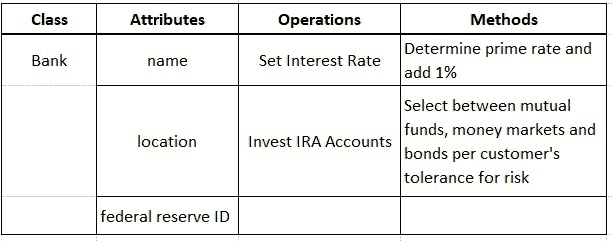

# *第五章*: 详细探究类

本章将开始我们在 C++ 中追求**面向对象编程** (**OOP**)。我们将首先介绍**面向对象** (**OO**) 概念，然后进一步了解如何在 C++ 中实现这些概念。很多时候，实现 OOP 的想法会通过*直接语言支持*来完成，比如本章的功能。但是，有时我们会利用各种编程技术来实现面向对象的概念。这些技术将在后面的章节中看到。在所有情况下，重要的是要了解面向对象的概念以及这些概念如何与经过深思熟虑的设计相关联，然后清楚地了解如何使用健壮的代码来实现这些设计。

本章将详细介绍 C 类的用法。微妙的特征和细微差别超出了基础。本章的目标是让您了解 OO 概念，并让您开始从面向对象编程的角度进行思考。拥抱核心 OO 理想，例如封装和信息隐藏，将使您可以编写更易于维护的代码，并使您可以更轻松地修改他人的代码。

在本章中，我们将介绍以下主要主题:

*   定义面向对象的术语和概念 -- 对象、类、实例、封装和信息隐藏
*   应用类和成员函数基础
*   检查成员函数内部; “this” 指针
*   使用访问标签和访问区域
*   了解构造函数-默认、重载、复制和转换构造函数
*   理解析构函数及其正确用法
*   将限定符应用于数据成员和成员函数-内联、const 和静态

在本章结束时，您将了解适用于类的核心面向对象术语，以及关键的 OO 思想 (例如封装和信息隐藏) 将如何导致更易于维护的软件。

您还将欣赏 C 如何提供内置语言功能来支持面向对象的编程。您将精通成员函数的使用，并将通过`this`指针了解它们的底层实现。您将了解如何正确使用访问标签和访问区域来促进封装和信息隐藏。

您将了解如何使用构造函数来初始化对象，以及从基本到典型 (重载) 到复制构造函数，甚至转换构造函数的多种构造函数。同样，您将了解如何在对象存在之前正确使用析构函数。

您还将了解如何将限定符 (例如 const，static 和 inline) 应用于成员函数以支持面向对象的概念或效率。同样，您将了解如何将限定符 (例如 const 和 static) 应用于数据成员，以额外支持 OO 理想。

C++ 可以作为面向对象的编程语言，但它不是自动的。为此，您必须了解 OO 概念，意识形态和语言功能，这些功能将使您能够支持这项工作。让我们通过了解面向对象的 C OO 程序 (C 类) 中的核心和必不可少的构建块和语言功能，开始编写更易于修改和维护的代码的追求。

# 技术要求

完整程序示例的在线代码可以在以下 GitHub URL 上找到: [https://github.com/PacktPublishing/ Demystified-Object-Oriented-Programming-带有-CPP/blob/master/Chapter05](https://github.com/PacktPublishing/Demystified-Object-Oriented-Programming-with-CPP/tree/master/Chapter05)。每个完整的程序示例都可以在 GitHub 存储库中找到相应的章节标题 (子目录) 下的文件，该文件与章节编号相对应，然后是破折号，然后是手头章节中的示例编号。例如，本章中的第一个完整程序可以在上述 GitHub 目录下的一个名为`Chp5-Ex1.cpp`的文件中的子目录`Chapter05`中找到。

本章的中央情报局视频可以在: [https://bit.ly/2OQgiz9](https://bit.ly/2OQgiz9)观看。

# 介绍面向对象的术语和概念

在本节中，我们将介绍核心面向对象的概念以及伴随这些关键思想的适用术语。尽管在本章中会出现新的术语，但我们将从必要的术语开始理解，以开始我们在本节中的旅程。

面向对象的系统本质上更容易维护，因为可以快速进行对用户定义类型的升级和修改，并且由于封装和信息隐藏而不会影响整个系统。

让我们从基本的面向对象术语开始。

## 理解面向对象的术语

我们将从面向对象的基本术语开始，然后随着我们引入新概念，我们将术语扩展到包含 C 特定术语。

术语对象、类和实例都是我们可以开始定义的重要和相关的术语。**对象**体现了特征和行为的有意义的分组。对象可以被操纵，并且可以接收行为的动作或后果。对象可能会经历转换，并且会随时间反复变化。对象可以与其他对象交互。

有时，术语 “对象” 可用于描述类似项目分组的蓝图。术语**类**可以与对象的这种用法互换使用。术语对象也可以 (并且更经常地) 用于描述这样的分组中的特定项目。术语**实例**可以与对象的这种含义互换使用。使用的上下文通常会清楚地说明应用术语*对象*的含义。为避免潜在的混淆，术语*类*和*实例*最好为 used。

让我们考虑一些例子，使用前面提到的术语:


对象也有组件。类的特征称为属性。类的行为称为操作**。行为或操作的具体实施称为或其**方法**。换句话说，方法是操作的实现方式，或者是定义函数的代码主体，而操作是函数的原型或使用协议。**

让我们考虑一些高级示例，使用前面提到的 terms:



类的每个实例很可能具有其属性的不同值。例如:


现在我们已经有了基本的 OO 术语，让我们继续讨论与本章相关的重要的面向对象概念。

## 理解面向对象的 concepts

与本章相关的关键面向对象概念是*封装*和*信息隐藏*。将这些相互关联的想法纳入您的设计将为编写更容易修改和维护的程序提供基础。

对这些属性进行操作的有意义的特征 (属性) 和行为 (操作) 的分组，捆绑在单个单元中，称为**封装**。在 C 中，我们通常将这些项目组合在一个类中。每个类实例的接口是通过对与每个类相关的行为进行建模的操作来实现的。这些操作还可以通过更改对象的属性值来修改对象的内部状态。隐藏类中的属性并提供用于操作这些细节的界面，使我们探索了信息隐藏的支持性概念。

**信息隐藏**是指将执行操作的细节抽象为类方法的过程。也就是说，用户只需要了解要使用的操作及其总体目的; 实现细节隐藏在方法 (函数 '的主体) 内。以这种方式，更改基础实现 (方法) 不会更改操作的界面。信息隐藏还可以指保持类属性的基础实现隐藏。当我们引入接入区域时，我们将进一步探讨这一点。信息隐藏是实现类的适当封装的一种手段。正确封装的类将启用适当的类抽象，从而支持 OO 设计。

面向对象的系统本质上更容易维护，因为类允许快速进行升级和修改，而不会因封装和信息隐藏而对整个系统造成影响。

# 了解类和成员函数基础知识

C**类**是 C 中的基本构建块，它允许程序员指定用户定义的类型，封装相关的数据和行为。C 类定义将包含属性、操作，有时还包含方法。C 类支持封装。

创建一个类类型的变量是已知的作为**实例化**。类中的属性在 C 中称为**数据成员**。类中的操作是在 C 中称为**成员函数**的，用于行为建模。用 OO 术语来说，一个操作意味着一个函数的签名，或者它的原型 (声明)，而该方法意味着它的底层实现或者函数的主体 (定义)。在某些 OO 语言中，术语*方法*更宽松地用于暗示操作或其方法，基于使用上下文。在 C 中，术语*数据成员*和*成员函数*是最常用的。

成员函数的原型必须放在类定义中。大多数情况下，成员函数定义放在类定义之外。然后使用范围解析运算符`::`将给定的成员函数定义与它作为成员的类相关联。点`.`或箭头`->`表示法用于访问所有类成员，包括成员函数，具体取决于我们是通过实例还是通过指向实例的指针访问成员。

C 结构也可以用来封装数据及其相关行为。A C`struct`可以做 a C`class`可以做的任何事情; 实际上，`class`在 C 中是用`struct`来实现的。尽管结构和类的行为可能相同 (默认可见性除外)，但类更经常用于对对象进行建模，对对象类型之间的关系进行建模以及实现面向对象的系统。

让我们看一个简单的示例，其中我们实例化了一个`class`和一个`struct`，每个都有成员函数，以便彼此进行比较。我们将把这个例子分成几个部分。完整的程序示例可以在 GitHub 存储库中找到:

[https://github.com/PacktPublishing/Demystified-Object-Oriented-Programming-with-CPP/blob/master/Chapter05/Chp5-Ex1.cpp](https://github.com/PacktPublishing/Demystified-Object-Oriented-Programming-with-CPP/blob/master/Chapter05/Chp5-Ex1.cpp)

```cpp
#include <iostream>
#include <cstring>
using namespace std;
struct student
{
    char name[20];
    float gpa;
    void Initialize(const char *, float);  // fn. prototype
    void Print();
};
class University
{
public:
    char name[30];
    int numStudents;
    void Initialize(const char *, int);   // fn. prototype
    void Print();
};
```

在前面的示例中，我们首先使用`struct`定义`student`类型，使用`class`定义`University`类型。请注意，按照惯例，使用结构创建的用户定义类型不大写，但是使用类创建的用户定义类型以大写字母开头。还要注意，`class`定义要求标签`public:`朝向的定义开头。我们将在本章的后面探讨这个标签的使用; 但是，现在已经出现了`public`标签，因此这个`class`将具有与`struct`相同的成员默认可见性。

在`class`和`struct`定义中，注意`Initialize()`和`Print()`的函数原型。我们将使用范围解析运算符`::`将这些原型与下一个程序段中的成员函数定义联系起来。

让我们检查各种成员函数定义:

```cpp
void student::Initialize(const char *n, float avg)
{ 
    strcpy(name, n);
    gpa = avg;
}
void student::Print()
{ 
    cout << name << " GPA: " << gpa << endl;
}
void University::Initialize(const char *n, int num)
{ 
    strcpy(name, n);
    numStudents = num;
} 
void University::Print()
{ 
    cout << name << " Enrollment: " << numStudents << endl;
}
```

现在，让我们回顾一下每个用户定义类型的各种成员函数定义。`void student::Initialize(const char *, float)`、`void student::Print()`、`void University::Initialize(const char *, int)`和`void University::Print()`的定义在上述片段中连续出现。请注意，范围解析运算符`::`如何允许我们将相关函数定义绑定回其成员的`class`或`struct`。

此外，请注意，在每个`Initialize()`成员函数中，输入参数用作加载特定类类型的特定实例的相关数据成员的值。例如，在`void University::Initialize(const char *n, int num)`的函数定义中，输入参数`num`用于为特定的`University`实例初始化`numStudents`。

注

作用域解析运算符`::`将成员函数定义与它们是其成员的类 (或结构) 相关联。

让我们看看如何通过考虑这个例子中的`main()`来调用成员函数:

```cpp
int main()
{ 
    student s1;  // instantiate a student (struct instance)
    s1.Initialize("Gabby Doone", 4.0);
    s1.Print();
    University u1;  // instantiate a University (class)
    u1.Initialize("GWU", 25600);
    u1.Print();
    University *u2;         // pointer declaration
    u2 = new University();  // instantiation with new()
    u2->Initialize("UMD", 40500);  
    u2->Print();  // or alternatively: (*u2).Print();
    delete u2;  
    return 0;
}
```

在这里，在`main()`中，我们简单地定义一个类型为`student`的变量`s1`和一个类型为`University`的变量`u1`。用面向对象的术语来说，最好说`s1`是`student`的实例，`u1`是`University`的实例。当对象的内存可用时，就会发生实例化。因此，使用`University *u2;`声明指针变量`u2`不会实例化`University`; 它只是声明指向未来可能实例的指针。相反，在下面的行`u2 = new University();`中，我们在分配内存时实例化`University`。

对于每个实例，我们通过调用各自的`Initialize()`成员函数 (例如`s1.Initialize("Gabby Doone", 4.0);`或`u1.Initialize("UMD", 4500);`) 来初始化其数据成员。然后，我们通过每个实例调用`Print()`，例如`u2->Print();`。回想一下，`u2->Print();`也可以写成`(*u2).Print();`，这更容易让我们记住这里的实例是`*u2`，而`u2`是指向该实例的指针。

注意，当我们通过`s1`调用`Initialize()`时，我们调用`student::Initialize()`，因为`s1`的类型是`student`，我们在这个函数的主体中初始化`s1`的数据成员。同样，当我们通过`u1`或`*u2`调用`Print()`时，我们调用`University::Print()`，因为`u1`和`*u2`是`University`类型，我们随后打印出特定大学的数据成员。

由于实例`u1`是动态分配在堆上的，我们负责在`main()`的末尾使用`delete()`释放其内存。

伴随此 program 的输出如下:

```cpp
Gabby Doone GPA: 4.4
GWU Enrollment: 25600
UMD Enrollment: 40500
```

现在，我们正在使用它们的关联成员函数定义创建类定义，了解开发人员通常如何在文件中组织其代码非常重要。大多数情况下，一个类将被分解为一个头 (`.h`) 文件，其中将包含类定义，以及一个源代码 (`.cpp`) 文件，其中将`#include`头文件，然后跟随成员函数定义本身。例如，一个名为`University`的类将具有一个`University.h`头文件和一个`University.cpp`源代码文件。

现在，通过检查`this`指针，让我们继续理解成员函数如何工作的细节。

# 检查成员函数内部; “this” 指针

到目前为止，我们已经注意到成员函数是通过对象调用的。我们已经注意到，在的范围内，一个成员函数，它是调用该函数的特定对象的数据成员 (以及其他成员函数) (除了任何输入参数之外)。唉，这是如何工作的，为什么？

事实证明，大多数情况下，成员函数是通过对象调用的。每当以这种方式调用成员函数时，该成员函数都会收到指向调用该函数的实例的指针。然后，将指向调用该函数的对象的指针作为函数的隐式第一个参数传递为。这个指针的名字是**这个**。

尽管在每个这样的成员函数的定义中可以明确地引用`this`指针，但通常不是。即使没有显式使用，函数作用域中使用的数据成员也属于`this`，这是指向调用函数的对象的指针。

让我们看一个完整的程序示例。尽管该示例分为多个部分，但完整的程序可以在以下位置找到:

[https://github.com/PacktPublishing/Demystified-Object-Oriented-Programming-with-CPP/blob/master/Chapter05/Chp5-Ex2.cpp](https://github.com/PacktPublishing/Demystified-Object-Oriented-Programming-with-CPP/blob/master/Chapter05/Chp5-Ex2.cpp)

```cpp
#include <iostream>
#include <cstring>
using namespace std;
class Student
{
public:  // for now, let's put everything public access region
    char *firstName;  // data members
    char *lastName;
    char middleInitial;
    float gpa;
    char *currentCourse;
    // member function prototypes
    void Initialize(const char *, const char *, char, 
                    float, const char *);
    void Print();
};
```

在程序的第一段中，我们定义了具有各种数据成员的类`Student`，以及两个成员函数原型。现在，我们将所有内容都放在`public`访问区域中。

现在，让我们检查一下`void Student::Initialize()`和`void Student::Print()`的成员函数定义。我们还将检查这些函数中的每一个在内部看起来是什么样子，以 C:

```cpp
// Member function definition
void Student::Initialize(const char *fn, const char *ln, 
                       char mi, float gpa, const char *course)
{
    firstName = new char [strlen(fn) + 1];
    strcpy(firstName, fn);
    lastName = new char [strlen(ln) + 1];
    strcpy(lastName, ln);
    this->middleInitial = mi;  // optional use of 'this'
    this->gpa = gpa;  // required, explicit use of 'this'
    currentCourse = new char [strlen(course) + 1];
    strcpy(currentCourse, course);
}
// It is as if Student::Initialize() is written as:
// void 
// Student_Initialize_constchar*_constchar*_float_constchar*
//     (Student *const this, const char *fn, const char *ln,
//      char mi, float avg, char *course) 
// {
//    this->firstName = new char [strlen(fn) + 1];
//    strcpy(this->firstName, fn);
//    this->lastName = new char [strlen(ln) + 1];
//    strcpy(this->lastName, ln);
//    this->middleInitial = mi;
//    this->gpa = avg;
//    this->currentCourse = new char [strlen(course) + 1];
//    strcpy(this->currentCourse, course);
// }
// Member function definition
void Student::Print()
{
   cout << firstName << " ";
   cout << middleInitial << ". ";
   cout << lastName << " has a gpa of: ";
   cout << gpa << " and is enrolled in: ";
   cout << currentCourse << endl;
}
// It is as if Student::Print() is written as:
// void Student_Print(Student *const this)
// {
//    cout << this->firstName << " ";
//    cout << this->middleInitial << ". " 
//    cout << this->lastName << " has a gpa of: ";
//    cout << this->gpa << " and is enrolled in: ";
//    cout << this->currentCourse << endl;
// }
```

首先，我们看到`void Student::Initialize()`的成员函数定义，它需要各种参数。请注意，在此函数的主体中，我们为数据成员`firstName`分配内存以使其具有足够的字符来保存输入参数`fn`所需的内容 (加上终止空字符的一个)。然后，我们将从输入参数`fn`到数据成员`firstName`的字符串`strcpy()`。我们使用输入参数`ln`对数据成员`lastName`执行相同的操作。我们类似地使用各种输入参数来初始化将调用此函数的特定对象的各种数据成员。

另外，请在`void Student::Initialize()`中注意分配`this->middleInitial = mi;`。在这里，我们有一个可选的显式使用`this`指针。在这种情况下，没有必要或习惯将`middleInitial`与`this`进行限定，但我们可以选择这样做。但是，在赋值`this->gpa = gpa;`中，需要使用`this`。为什么？请注意，输入参数名为`gpa`，数据成员也是`gpa`。简单地分配`gpa = gpa;`会将`gpa`的最本地版本 (输入参数) 设置为自身，并且不会影响数据成员。在这里，将`gpa`与`this`在赋值的左侧消除歧义，表示将`this`指向的数据成员`gpa`设置为输入参数`gpa`的值。另一种解决方案是对数据成员与输入参数使用不同的名称，例如将形式参数列表中的`gpa`重命名为`avg` (我们将在此代码的更高版本中执行此操作)。

现在，请注意`void Student::Initialize()`的注释版本，该版本在`void Student::Initialize()`的使用版本下方。在这里，我们可以看到大多数成员函数是如何在内部表示的。首先，请注意，函数的名称为*名称已被损坏*，以包含其参数的数据类型。这在内部是函数的表示方式，因此允许函数重载 (即，两个看似相同名称的函数; 在内部，每个函数都有一个唯一的名称)。接下来，请注意，在输入参数中，还有一个额外的第一个输入参数。此附加 (隐藏) 输入参数的名称为`this`，定义为`Student *const this`。

现在，在`void Student::Initialize()`的内化函数视图的主体中，请注意每个数据成员的名称前面都有`this`。实际上，我们正在访问由`this`指向的对象的数据成员。`this`在哪里定义？Recall，`this`是该函数的隐式第一个输入参数，并且是指向调用该函数的对象的常量指针。

同样，我们可以查看`void Student::Print()`的成员函数定义。在此函数中，每个数据成员都使用`cout`和插入运算符`<<`整齐地打印出来。但是，请注意此函数定义下面的注释掉的内部版本`void Student::Print()`。同样，`this`实际上是`Student *const`类型的隐式输入参数。此外，每个数据成员使用之前都会通过`this`指针进行访问，例如`this->gpa`。同样，我们可以清楚地看到，特定实例的成员是在成员函数的范围内访问的; 这些成员是通过`this`指针隐式访问的。

最后，请注意，在成员函数的主体中允许显式使用`this`。我们几乎总是可以在使用数据成员或成员函数之前，在成员函数的主体中访问，显式使用`this`。在本章的后面，我们将看到一个相反的情况 (使用静态方法)。另外，在本书的后面，我们将看到在这种情况下，必须使用`this`来实现更多的中级 OO 概念。

尽管如此，让我们通过检查`main()`来完成这个程序示例:

```cpp
int main()
{
    Student s1;   // instance
    Student *s2 = new Student; // ptr to an instance
    s1.Initialize("Mary", "Jacobs", 'I', 3.9, "C++");
    s2->Initialize("Sam", "Nelson", 'B', 3.2, "C++");
    s1.Print();
    s2->Print(); // or use (*s2).Print();
    delete s1.firstName;  // delete dynamically allocated
    delete s1.lastName;   // data members
    delete s1.currentCourse;
    delete s2->firstName;
    delete s2->lastName;
    delete s2->currentCourse;
    delete s2;    // delete dynamically allocated instance
    return 0;
}
```

在本程序的最后一段中，我们在`main()`中两次实例化`Student`。`Student``s1`是一个实例，而`s2`是指向`Student`的指针。接下来，我们使用`.`或`->`表示法通过每个相关实例调用各种成员函数。

注意，当`s1`调用`Initialize()`时，`this`指针 (在成员函数的作用域中) 将指向`s1`。就好像`&s1`作为第一个参数传递给这个函数。同样，当`*s2`调用`Initialize`时，`this`指针将指向`s2`; 就好像`s2` (已经是指针) 作为隐式的第一个参数传递给这个函数。

在每个实例调用`Print()`以显示每个`Student`的数据成员后，请注意，我们释放了各种级别的动态分配的内存。我们从为每个实例动态分配的数据成员开始，使用`delete()`释放每个这样的成员。然后，因为`s2`是指向我们动态分配的实例的指针，所以我们还必须记住释放包含实例本身的堆内存。我们再次使用`delete s2;`这样做。

以下是完整程序示例的输出:

```cpp
Mary I. Jacobs has a gpa of: 3.9 and is enrolled in: C++
Sam B. Nelson has a gpa of: 3.2 and is enrolled in: C++
```

现在，让我们通过检查访问标签和区域来补充我们对类和信息隐藏的理解。

# 使用访问标签和访问区域

标签可以被引入到类 (或结构) 定义中，以控制类 (或结构) 成员的访问或可见性。通过在我们的应用中控制来自各个范围的成员的直接访问，我们可以支持封装和信息隐藏。也就是说，我们可以坚持我们类的用户使用我们选择的函数和我们选择的协议，以我们程序员找到合理和可接受的方式来操纵类中的数据和其他成员函数。此外，我们可以通过仅向用户通告给定类的所需公共接口来隐藏类的实现细节。

数据成员或成员函数，统称为**成员**，可以单独标记，也可以组合成访问区域。可以指定的三个标签或**访问区域**如下所示:

*   **私有**: 数据这个访问区域中的成员和成员函数只能在类的范围内访问。类的作用域包括该类的成员函数。
*   **受保护的**: 在引入继承之前，行为像`private`一样。当引入继承时，`protected`将提供一种允许在派生类范围内访问的机制。
*   **public**: Data members and member functions in this access region are accessible from any scope in the program.

    提醒

    数据成员和成员函数几乎总是通过实例访问。你会问，*我的实例在什么范围？*和*我可以从这个特定范围访问特定成员吗？*

程序员所要求的尽可能多的成员可以在给定的标签或**访问区域**下分组。如果在类定义中省略访问标签，则默认成员访问权限为`private`。如果在结构定义中省略访问标签，则默认成员访问为`public`。当明确引入访问标签，而不是依赖于默认可见性时，`class`和`struct`是相同的。尽管如此，在面向对象的编程中，我们倾向于将类用于用户定义的类型。

让我们研究一个示例来说明访问区域。尽管此示例将分为几个部分，但将显示完整的示例，并且也可以在 GitHub 存储库中找到:

[https://github.com/PacktPublishing/Demystified-Object-Oriented-Programming-with-CPP/blob/master/Chapter05/Chp5-Ex3.cpp](https://github.com/PacktPublishing/Demystified-Object-Oriented-Programming-with-CPP/blob/master/Chapter05/Chp5-Ex3.cpp)

```cpp
#include <iostream>
#include <cstring>
using namespace std;
class Student
{
// private members are accessible only within the scope of
// the class (e.g. within member functions or friends) 
private: 
    char *firstName;   // data members
    char *lastName;
    char middleInitial;
    float gpa;
    char *currentCourse;
    char *studentId;  
public:   // public members are accessible from any scope
    // member function prototypes
    void Initialize();  
    void Initialize(const char *, const char *, char, float, 
                    const char *, const char *);
    void CleanUp();
    void Print();
};
```

在这个例子中，我们首先定义`Student`类。请注意，我们在类定义的顶部附近添加了一个`private`访问区域，并将所有数据成员放置在该区域内。这个位置将确保这些数据成员只能在这个类的范围内被直接访问和修改，这意味着这个类的成员函数 (和朋友，我们将在后面看到)。通过仅将数据成员的访问限制为其自己的类的成员函数，可以确保对这些数据成员的安全处理; 仅允许通过预期的和安全的函数进行访问，而类设计者已经介绍了这些函数。

接下来，请注意，在成员函数的原型之前的类定义中已添加了标签`public`。这意味着这些功能可以在我们程序的任何范围内访问。当然，我们通常需要通过一个实例访问这些功能。但是当实例访问这些公共成员函数时，实例可以在`main()`或任何其他函数的范围内 (甚至在另一个类的成员函数的范围内)。这就是所谓的类 '`public`接口。

接入区域支持封装和信息隐藏

一个很好的经验法则是将您的数据成员放置在私有访问区域中，然后使用公共成员函数为他们指定一个安全、适当的公共接口。通过这样做，对数据成员的唯一访问方式是通过类设计者编写的成员函数，这些函数已经过良好的测试。使用此策略，也可以更改类的基础实现，而不会导致对公共接口的任何调用发生变化。这种做法支持封装和信息隐藏。

让我们继续看一下程序中的各种成员函数定义:

```cpp
void Student::Initialize()
{
    firstName = lastName = 0;  // NULL pointer
    middleInitial = '\0';      // null character
    gpa = 0.0;
    currentCourse = studentId = 0;
}
// Overloaded member function definition
void Student::Initialize(const char *fn, const char *ln, 
      char mi, float avg, const char *course, const char *id) 
{
    firstName = new char [strlen(fn) + 1];
    strcpy(firstName, fn);
    lastName = new char [strlen(ln) + 1];
    strcpy(lastName, ln);
    middleInitial = mi; 
    gpa = avg;   
    currentCourse = new char [strlen(course) + 1];
    strcpy(currentCourse, course);
    studentId = new char [strlen(id) + 1];
    strcpy (studentId, id); 
}
// Member function definition
void Student::CleanUp()
{
    delete firstName;
    delete lastName;
    delete currentCourse;
    delete studentId;
}
// Member function definition
void Student::Print()
{
    cout << firstName << " " << middleInitial << ". ";
    cout << lastName << " with id: " << studentId;
    cout << " has gpa: " << gpa << " and enrolled in: ";
    cout << currentCourse << endl;
}
```

在这里，我们定义了在类定义中原型的各种成员函数。请注意使用范围解析运算符`::`将类名与成员函数名绑定。在内部，这两个标识符是将*名称混合在一起的*，以提供唯一的内部函数名称。请注意，`void Student::Initialize()`函数已被重载; 一个版本只是将所有数据成员初始化为某种形式的 null 或零，而重载版本使用输入参数来初始化各个数据成员。

现在，让我们继续检查下面一段代码中的`main()`函数:

```cpp
int main()
{
    Student s1;
    // Initialize() is public; accessible from any scope
    s1.Initialize("Ming", "Li", 'I', 3.9, "C++", "178GW"); 
    s1.Print();  // Print() is public, accessible from main() 
    // Error! firstName is private; not accessible in main()
    // cout << s1.firstName << endl;  
    // CleanUp() is public, accessible from any scope
    s1.CleanUp(); 
    return 0;
}
```

在前面提到的`main()`函数中，我们首先用声明`Student s1;`实例化一个`Student`。接下来，`s1`调用`Initialize()`函数，签名与提供的参数匹配。由于此成员函数位于`public`访问区域中，因此可以在我们程序的任何范围 (包括`main()`) 中访问它。同样，`s1`调用`Print()`，也是`public`。这些函数在`Student`类的公共接口中，代表了一些操作任何给定`Student`实例的核心功能。

接下来，在注释掉的代码行中，注意`s1`尝试直接使用`s1.firstName`访问`firstName`。因为`firstName`是`private`，这个数据成员只能在它自己的类的范围内访问，这意味着它的类的成员函数 (和后来的朋友)。`main()`函数不是`Student`的成员函数，因此`s1`可能无法访问`main()`的作用域中的`firstName`，即它自己的类之外的作用域。

最后，我们调用`s1.CleanUp();`，这也是有效的，因为`CleanUp()`是`public`，因此可以从任何作用域 (包括`main()`) 访问。

此完整示例的输出是:

```cpp
Ming I. Li with id: 178GW has gpa: 3.9 and is enrolled in: C++
```

现在我们了解了访问区域是如何工作的，让我们通过研究一个称为构造函数的概念以及 C 中可用的各种类型的构造函数来前进。

# 理解构造函数

您是否注意到本章中的程序示例为每个`class`或`struct`具有`Initialize()`成员函数有多方便？当然，希望为给定实例初始化所有数据成员。更重要的是，确保任何实例的数据成员都具有 bonized 值是至关重要的，因为我们知道 C 不会为内存提供*clean*或*zero-out*。访问未初始化的数据成员，并将其值当作是骨化的，这是一个潜在的陷阱，等待粗心的程序员。

每次实例化一个类时，单独初始化每个数据成员可能是繁琐的工作。如果我们只是忽略设定一个值呢？如果值是`private`，因此不能直接访问该怎么办？我们已经看到，`Initialize()`函数是有益的，因为一旦写入，它提供了一种方法来为给定实例设置所有数据成员。唯一的缺点是程序员现在必须记住在应用中的每个实例上调用`Initialize()`。相反，如果有一种方法可以确保每次实例化一个类时都调用`Initialize()`函数，该怎么办？如果我们可以重载各种版本来初始化实例，并且可以根据当时可用的数据调用适当的版本，该怎么办？这个前提是 C++ 中构造函数的基础。该语言提供了一系列重载的初始化函数，一旦实例的内存可用，这些函数将自动调用。

让我们通过检查 C 构造函数来看看这一族初始化成员函数。

## 应用构造函数基础和重载构造函数

**构造函数**是一个成员函数，在实例的内存可用后自动调用。构造函数用于初始化构成新实例化对象的数据成员。构造函数将具有与它所属的类或结构相同的名称。构造函数可能是重载的，这使得`class` (或`struct`) 能够定义用于初始化对象的多个方法。可能未指定构造函数的返回类型。

如果您的`class`或`struct`不包含构造函数，将在`public`访问区域中为您创建一个构造函数，没有参数。这被称为默认构造函数。在幕后，每次实例化对象时，编译器都会修补构造函数调用。实例化没有构造函数的类时，默认构造函数会在实例化后立即作为函数调用进行修补。这个系统提供的成员函数将有一个空的主体 (方法)，它将链接到你的程序，以便任何编译器添加，隐式，调用这个函数时实例化可以发生没有链接器错误。通常，程序员将编写自己的默认 (无参数) 构造函数; 也就是说，用于无参数的默认实例化方法。

除了他们自己的无参数默认构造函数之外，大多数程序员至少提供一个构造函数。回想一下，构造函数可能会重载。重要的是要注意，如果您自己提供任何构造函数，那么您将不会收到系统提供的无参数默认构造函数，并且随后使用这样的 instantiation 接口将导致编译器错误。

提醒

构造函数与类具有相同的名称。您可能无法指定它们的返回类型。它们可能会超载。如果您没有在类中提供任何构造函数 (或实例化手段)，则编译器仅创建一个公共的默认 (无参数) 构造函数。

让我们介绍一个简单的例子来理解构造函数基础:

[https://github.com/PacktPublishing/Demystified-Object-Oriented-Programming-with-CPP/blob/master/Chapter05/Chp5-Ex4.cpp](https://github.com/PacktPublishing/Demystified-Object-Oriented-Programming-with-CPP/blob/master/Chapter05/Chp5-Ex4.cpp)

```cpp
#include <iostream>
#include <cstring>
using namespace std;
class University
{
private:
    char name[30];
    int numStudents;
public: 
    // constructor prototypes
    University(); // default constructor
    University(const char *, int);
    void Print();
};
University::University()
{
    name[0] = '\0';
    numStudents = 0;
}
University::University(const char * n, int num)
{
    strcpy(name, n);
    numStudents = num;
}
void University::Print()
{
    cout << "University: " << name;
    cout << " Enrollment: " << numStudents << endl;
}
int main()
{
    University u1; // Implicit call to default constructor
    University u2("University of Delaware", 23800);
    u1.Print();
    u2.Print();
    return 0;
}
```

在前面的程序段中，我们首先定义`class University`; 数据成员是`private`，三个成员函数是`public`。请注意，原型的前两个成员函数是构造函数。两者都与类具有相同的名称; 都没有指定其返回类型。这两个构造函数是重载的，因为每个构造函数都有不同的签名。

接下来，请注意定义了三个成员函数。请注意在每个成员函数名称之前使用范围解析运算符`::`，在它们的每个定义中。每个构造函数都提供了不同的初始化实例的方法。`void University::Print()` 成员函数仅提供了一种为我们的示例提供简单输出的方法。

现在，在`main()`中，让我们创建两个`University`的实例。第一行代码`University u1;`实例化一个`University`，然后隐式调用默认构造函数来初始化数据成员。在下一行代码`University u2("University of Delaware", 23800);`中，我们实例化第二个`University`。一旦该实例的内存在`main()`中的堆栈上可用，将隐式调用与所提供参数的签名相匹配的构造函数，即`University::University(const char *, int)`，以初始化实例。

我们可以看到，根据我们如何实例化一个对象，我们可以指定我们希望代表调用哪个构造函数来执行初始化。

此示例的输出为:

```cpp
University: Enrollment: 0
University: University of Delaware Enrollment: 23800
```

接下来，让我们通过检查复制构造函数来补充构造函数的知识。

## 创建复制构造函数

**复制构造函数**是一种专用构造函数，每当需要复制对象时，就会调用它。可以在构建另一个对象期间调用复制构造函数。当对象通过输入参数按值传递给函数或从函数按值返回时，也可以调用它们。

通常，制作对象的副本并稍微修改副本要比从头开始构造具有其各个属性的新对象更容易。如果程序员需要在应用的生命周期中经历过许多更改的对象的副本，则尤其如此。可能无法回忆起可能已应用于所讨论的对象以创建副本的各种转换的顺序。相反，拥有复制对象的手段是可取的，而且可能是至关重要的。

复制构造函数的签名是`ClassName::ClassName(const ClassName &);`。请注意，单个对象被显式地作为参数传递，并且该参数将是对常量对象的引用。与大多数成员函数一样，复制构造函数将接收到该函数的隐式参数，即`this`指针。复制构造函数定义的目的是复制显式参数以初始化`this`所指向的对象。

如果没有由`class` (或`struct`) 设计器实现的复制构造函数，将为您 (在`public`访问区域中) 提供一个执行浅成员式复制的构造函数。如果您的类中有指针的数据成员，这可能不是您想要的。相反，最好的办法是自己编写一个复制构造函数，并编写它来为作为指针的数据成员执行深度复制 (必要时分配内存)。

如果程序员希望在构造过程中不允许复制，则可以在复制构造函数的原型中使用关键字`delete`，如下所示:

```cpp
    // disallow copying during construction
    Student(const Student &) = delete;   // prototype
```

或者，如果程序员希望禁止对象复制，则可以在`private`访问区域中对复制构造函数进行原型设计。在这种情况下，编译器将链接默认的 copy构造函数 (执行浅复制)，但它将被视为私有。因此，将禁止使用类范围之外的复制构造函数的实例化。自从`=delete`出现以来，这种技术的使用频率较低; 但是，它可能会在现有代码中看到，因此理解起来很有用。

让我们检查一个复制构造函数，从类定义开始。尽管该程序以多个片段呈现，但完整的程序示例可以在 GitHub 存储库中找到:

[https://github.com/PacktPublishing/Demystified-Object-Oriented-Programming-with-CPP/blob/master/Chapter05/Chp5-Ex5.cpp](https://github.com/PacktPublishing/Demystified-Object-Oriented-Programming-with-CPP/blob/master/Chapter05/Chp5-Ex5.cpp)

```cpp
#include <iostream>  
#include <cstring>    
using namespace std;
class Student
{
private: 
    // data members
    char *firstName;
    char *lastName;
    char middleInitial;
    float gpa;
    char *currentCourse;  
public:
    // member function prototypes
    Student();  // default constructor
    Student(const char *, const char *, char, float, 
            const char *); 
    Student(const Student &);  // copy constructor prototype
    void CleanUp();
    void Print();
};
```

在这个节目段中，我们从定义`class Student`开始。请注意`private`数据成员和`public`成员函数原型的常规分类，包括默认构造函数和重载构造函数。还要注意复制构造函数`Student(const Student &);`的原型。

接下来，让我们看一下成员函数定义，并继续执行以下程序:

```cpp
// default constructor
Student::Student()
{
    firstName = lastName = 0;  // NULL pointer
    middleInitial = '\0';
    gpa = 0.0;
    currentCourse = 0;
}
// Alternate constructor member function definition
Student::Student(const char *fn, const char *ln, char mi, 
                 float avg, const char *course)
{
    firstName = new char [strlen(fn) + 1];
    strcpy(firstName, fn);
    lastName = new char [strlen(ln) + 1];
    strcpy(lastName, ln);
    middleInitial = mi;
    gpa = avg;
    currentCourse = new char [strlen(course) + 1];
    strcpy(currentCourse, course);
}
// Copy constructor definition – implement a deep copy
Student::Student(const Student &s)
{
    // allocate necessary memory for destination string
    firstName = new char [strlen(s.firstName) + 1];
    // then copy source to destination string
    strcpy(firstName, s.firstName);
    lastName = new char [strlen(s.lastName) + 1];
    // data members which are not pointers do not need their
    // space allocated for deep copy, such as is done above
    strcpy(lastName, s.lastName);
    middleInitial = s.middleInitial;
    gpa = s.gpa;
    // allocate destination string space, then copy contents
    currentCourse = new char [strlen(s.currentCourse) + 1];
    strcpy(currentCourse, s.currentCourse);
}
// Member function definition
void Student::CleanUp()
{
    delete firstName;
    delete lastName;
    delete currentCourse;
}

// Member function definition
void Student::Print()
{
    cout << firstName << " " << middleInitial << ". ";
    cout << lastName << " has a gpa of: " << gpa;
    cout << " and is enrolled in: " << currentCourse << endl;
}
```

在前面提到的代码片段中，我们有各种各样的成员函数定义。最值得注意的是，让我们考虑复制构造函数定义，它是签名为`Student::Student(const Student &s)`的成员函数。

请注意，输入参数`s`是对`Student` (即`const`) 的引用。这意味着我们将从中复制的源对象可能不会被修改。我们将要复制到的目标对象将是`this`指针指向的对象。

当我们仔细浏览复制构造函数时，请注意，我们会根据需要依次为属于`this`所指向对象的任何指针数据成员分配空间。分配的空间与 `s` 所指的数据成员所需的大小相同。然后，我们仔细地从源数据成员复制到目标数据成员。我们精心确保在源对象的目标对象中精确复制。

请注意，我们正在目标对象中制作*深度复制*。也就是说，我们不是简单地将`s.firstName`中包含的指针复制到`this->firstName`中，而是为`this->firstName`分配空间，然后在源数据上复制。相反，浅拷贝的结果将是每个对象中的指针数据成员将共享相同的取消引用的内存 (即每个指针指向的内存)。这很可能不是你想要的副本。还请记住，系统提供的副本构造函数的默认行为是提供从源到目标对象的浅副本。

现在，让我们看一下我们的`main()`函数，看看可以调用复制构造函数的各种方式:

```cpp
int main()
{ 
    // instantiate two Students
    Student s1("Zachary", "Moon", 'R', 3.7, "C++");
    Student s2("Gabrielle", "Doone", 'A', 3.7, "C++");
   // These initializations implicitly invoke copy constructor
    Student s3(s1);  
    Student s4 = s2;
    strcpy(s3.firstName, "Zack");// alter each object slightly
    strcpy(s4.firstName, "Gabby"); 
    // This sequence does not invoke copy constructor 
    // This is instead an assignment.
    // Student s5("Giselle", "LeBrun", 'A', 3.1, "C++);
    // Student s6;
    // s6 = s5;  // this is an assignment, not initialization
    S1.Print();   // print each instance
    S3.Print();
    s2.Print();
    s4.Print();
    s1.CleanUp();  // Since some data members are pointers,
    s2.CleanUp(); // let's call a function to delete() them
    s3.CleanUp();
    s4.CleanUp();
    return 0;
}
```

在`main()`中，我们声明两个实例为`Student`、`s1`和`s2`，并且每个实例都使用与`Student::Student(const char *, const char *, char, float, const char *);`的签名匹配的构造函数进行初始化。请注意，实例化中使用的签名是我们选择应该隐式调用哪个构造函数的方式。

接下来，我们实例化`s3`，并将具有`Student s3(s1);`的对象`s1`作为参数传递给它的构造函数。在这里，`s1`的类型为`Student`，因此此实例化将匹配接受对`Student` (复制构造函数) 的引用的构造函数。一旦在复制构造函数中，我们知道我们将制作一个深度复制的`s1`来初始化新实例化的对象`s3`，它将由复制构造函数方法的作用域中的`this`指针指向。

此外，我们使用以下代码行`Student s4 = s2;`实例化`s4`。在这里，由于这行代码是初始化 (即，在同一语句中同时声明了`s4`并给出了一个值)，因此也将调用复制构造函数。副本的源对象将是`s2`，目标对象将是`s4`。请注意，然后我们通过修改它们的数据成员，稍微修改每个副本 (`s3`和`s4`)。

接下来，在代码的注释部分中，我们实例化了两个类型为`Student`，`s5`和`s6`的对象。然后，我们尝试用`s5 = s6;`将一个分配给另一个。虽然这看起来类似于`s4`和`s2`之间的初始化，但事实并非如此。行`s5 = s6;`是一个赋值。每个对象以前都存在。因此，此代码段不调用复制构造函数。尽管如此，此代码是合法的，并且具有与赋值运算符相似的含义。当我们在[*第 12 章*](12.html#_idTextAnchor453)，*运算符重载和朋友*中讨论运算符重载时，我们将在本书后面研究这些细节。

然后我们打印出对象`s1`、`s2`、`s3`和`s4`。然后我们在这四个对象的每一个上调用`Cleanup()`。为什么？每个对象都包含作为指针的数据成员，因此在这些外部堆栈对象超出范围之前，删除每个实例 (即选定的指针数据成员) 中包含的堆内存是合适的。

以下是伴随完整程序示例的e 输出:

```cpp
Zachary R. Moon has a gpa of: 3.7 and is enrolled in: C++
Zack R. Moon has a gpa of: 3.7 and is enrolled in: C++
Gabrielle A. Doone has a gpa of: 3.7 and is enrolled in: C++
Gabby A. Doone has a gpa of: 3.7 and is enrolled in: C++
```

此示例的输出显示每个原始`Student`实例，并与其副本配对。请注意，每个副本都与原始副本略有修改 (`firstName`有所不同)。

相关主题

有趣的是，赋值运算符与复制构造函数有许多相似之处，因为它可以允许将数据从源复制到目标实例。但是，对于新对象的初始化，将隐式调用复制构造函数，而在两个现有对象之间执行赋值时，将调用赋值运算符。尽管如此，每种方法看起来都非常相似!我们将在[*第 12 章*](12.html#_idTextAnchor453)，*朋友和*中检查重载赋值运算符以自定义其行为以执行深度赋值 (很像深度副本)。

现在我们对复制构造函数有了深入的了解，让我们看一下最后一种构造函数，即转换构造函数。

## 创建转换构造函数

可以从一种用户定义的类型到另一种类型，或者从标准类型到用户定义的类型进行类型转换。转换构造函数是一种允许这种转换发生的语言机制。

**转换构造函数**是一个构造函数，它接受一个标准或用户定义类型的显式参数，并对该对象应用合理的转换或转换以初始化要实例化的对象。

让我们看一个说明这个想法的示例。尽管该示例将分为几个部分并缩写，但完整的程序可以在 GitHub 存储库中找到:

[https://github.com/PacktPublishing/Demystified-Object-Oriented-Programming-with-CPP/blob/master/Chapter05/Chp5-Ex6.cpp](https://github.com/PacktPublishing/Demystified-Object-Oriented-Programming-with-CPP/blob/master/Chapter05/Chp5-Ex6.cpp)

```cpp
#include <iostream>   
#include <cstring>   
using namespace std;
class Student;  // forward declaration of Student class
class Employee
{
private:
    char firstName[20];
    char lastName[20];
    float salary;
public:
    Employee();
    Employee(const char *, const char *, float);
    Employee(Student &);  // conversion constructor
    void Print();
};
class Student
{
private: // data members
    char *firstName;
    char *lastName;
    char middleInitial;
    float gpa;
    char *currentCourse;
public:
    // constructor prototypes
    Student();  // default constructor
    Student(const char *, const char *, char, float, 
            const char *);
    Student(const Student &);  // copy constructor
    void Print();
    void CleanUp();
    float GetGpa(); // access function for private data member
    const char *GetFirstName();
    const char *GetLastName();
};
```

在前面的程序段中，我们首先包含一个对`class Student;`的转发声明 -- 这个声明允许我们在其定义之前引用`Student`类型。然后我们定义`class Employee`。请注意，这个类包括几个`public`数据成员和三个构造函数原型 -- 一个默认的、替代的和转换的构造函数。作为附带说明，请注意，尚未指定 copy 构造函数。这意味着编译器将提供默认 (浅) 复制构造函数。在这种情况下，由于没有指针数据成员，所以浅拷贝是可以接受的。

尽管如此，让我们继续检查转换构造函数原型。请注意，在原型中，此构造函数采用单个参数。参数是`Student &`，这就是为什么我们需要`Student`的 forward 声明。优选地，我们可以使用`const Student &`作为参数类型，但是我们需要了解 const 成员函数 (本章后面的部分)。将进行的类型转换将是将`Student`转换为新构建的`Employee`。这将是我们的工作，提供一个有意义的转换来完成这在转换构造函数的定义，我们将很快看到。

接下来，我们定义我们的`Student`类，这与我们在前面的示例中看到的大致相同。

现在，让我们继续这个示例，在下面的代码段中查看`Employee`和`Student`的成员函数定义，以及我们的`main()`函数。为了节省空间，将省略选定的成员函数定义; 但是，在线代码将显示整个程序。

继续前进，我们的 `Employee` 和 `Student` 的成员函数如下:

```cpp
Employee::Employee()  // default constructor
{
    firstName[0] = lastName[0] = '\0';  // null character
    salary = 0.0;
}
// alternate constructor
Employee::Employee(const char *fn, const char *ln, 
                   float money)
{
    strcpy(firstName, fn);
    strcpy(lastName, ln);
    salary = money;
}
// conversion constructor – argument is a Student not Employee
Employee::Employee(Student &s)
{
    strcpy(firstName, s.GetFirstName());
    strcpy(lastName, s.GetLastName());
    if (s.GetGpa() >= 4.0)
        salary = 75000;
    else if (s.GetGpa() >= 3.0)
        salary = 60000;
    else
        salary = 50000; 
}
void Employee::Print()
{
    cout << firstName << " " << lastName << " " << salary;
    cout << endl;
}
// Definitions for Student's default, alternate, copy
// constructors, Print()and CleanUp() have been omitted 
// for space, but are same as the prior Student example.
float Student::GetGpa()
{
    return gpa;
}
const char *Student::GetFirstName()
{
    return firstName;
}
const char *Student::GetLastName()
{
    return lastName;
}
```

在前面的代码段中，我们注意到`Employee`的几个构造函数定义。我们有一个默认的、备用的和转换的构造函数。

检查`Employee`转换构造函数的定义，注意源对象的形式参数为`s`，类型为`Student`。目标对象将是正在构建的`Employee`，它将由`this`指针指向。在此函数的正文中，我们仔细地将`firstName`和`lastName`从`Student &s`复制到新实例化的`Employee`中。请注意，我们使用了访问函数`const char *Student::GetFirstName()`和`const char *Student::GetLastName()` (通过`Student`的实例)，因为这些数据成员是`private`。

让我们继续转换构造函数。提供从一种类型到另一种类型的有意义的转换是我们的工作。在这项工作中，我们尝试根据源`Student`对象的`gpa`为`Employee`建立初始工资。因为`gpa`是`private`，所以使用访问函数`Student::GetGpa()`来检索此值 (通过源`Student`)。请注意，由于`Employee`没有任何动态分配的数据成员，因此我们不需要分配内存来协助此功能主体中的深度复制。

为了节省空间，省略了`Student`默认、备用和复制构造函数的成员函数定义，以及`void Student::Print()`和`void Student::CleanUp()`成员函数的定义。但是，它们与前面说明`Student`类的完整程序示例相同。

请注意，已添加了`Student`中`private`数据成员的访问函数，例如`float Student::GetGpa()`，以提供对这些数据成员的安全访问。请注意，从堆栈上的`float Student::GetGpa()`返回的值是`gpa`数据成员的副本。原始的`gpa`不用担心使用此功能会被破坏。成员函数`const char *Student::GetFirstName()`和`const char *Student::GetLastName()`也是如此，它们各自返回一个`const char *`，确保返回的数据不会被破坏。

让我们通过检查我们的`main()`函数来完成我们的程序:

```cpp
int main()
{
    Student s1("Giselle", "LeBrun", 'A', 3.5, "C++");
    Employee e1(s1);  // conversion constructor
    e1.Print();
    s1.CleanUp();  // CleanUp() will delete() s1's dynamically
    return 0;      // allocated data members
}
```

在我们的`main()`函数中，我们实例化了一个`Student`，即`s1`，它是用匹配的构造函数隐式初始化的。然后，我们使用调用`Employee e1(s1);`中的转换构造函数实例化一个`Employee`，`e1`。乍一看，我们似乎正在使用`Employee`复制构造函数。但是，仔细观察，我们注意到实际参数`s1`的类型是`Student`，而不是`Employee`。因此，我们使用`Student s1`作为初始化`Employee e1`的基础。请注意，在这种转换中，不会损害或更改`Student`、`s1`。因此，最好将源对象定义为形式参数列表中的`const Student &`; 一旦我们理解了 const 成员函数，然后在转换构造函数的主体中使用 const 成员函数，我们就可以这样做。

为了结束这个程序，我们使用`Employee::Print()`打印出`Employee`，这使我们能够可视化我们申请的`Student`到`Employee`的转换。

以下是伴随我们的示例的输出:

```cpp
Giselle LeBrun 60000
```

在我们继续前进之前，有一个关于转换构造函数的最后一个微妙的细节非常重要。

重要说明

任何使用单个参数的构造函数都被视为转换构造函数，它可以潜在地用于将参数类型转换为其所属类的对象类型。例如，如果您在`Student`类中有一个仅使用 float 的构造函数，则不仅可以以上面的示例中所示的方式使用此构造函数，但是，在需要提供类型为 float 的参数的地方 (例如函数调用)。这可能不是你想要的，这就是为什么这个有趣的功能被召唤出来的原因。如果您不希望发生隐式转换，则可以通过在其原型的开头声明具有`explicit`关键字的构造函数来禁用此行为。

现在，我们已经了解了 C 中的基本，替代，复制和转换构造函数，让我们继续前进并探索构造函数的互补成员函数 C 析构函数。

# 理解析构函数

你能回忆一下类构造函数如何方便地为我们提供了一种初始化新实例化对象的方法吗？构造函数不必记住为给定类型的每个实例调用`Initialize()`方法，而是允许自动初始化。构造中使用的签名有助于指定应使用一系列构造函数中的哪一个。

物体清理怎么样？许多类包含动态分配的数据成员，这些成员通常在构造函数中分配。当程序员使用实例时，不应该释放包含这些数据成员的内存吗？当然可以。我们已经为几个示例程序编写了一个`CleanUp()`成员函数。我们记得打电话给`CleanUp()`。方便地，类似于构造函数，C 具有自动内置功能以用作清理功能。这个函数被称为析构函数。

让我们看一下析构函数，以了解它的正确用法。

## 应用析构函数基础知识和正确使用

**析构函数**是一个成员函数，其目的是放弃对象在存在期间可能获得的资源。当类或结构实例时，会自动调用析构函数:

*   超出范围 (这适用于非指针变量)
*   使用 delete (用于指向对象的指针) 显式释放

析构函数应该 (通常) 清理构造函数分配的任何内存。析构函数的名称是一个`~`字符，后跟`class`名称。析构函数将没有参数; 因此，它不能重载。最后，可能未指定析构函数的返回类型。类和结构都可能有析构函数。

除了释放构造函数可能已分配的内存之外，析构函数还可以用于执行实例的其他寿命终止任务，例如将值记录到数据库。更复杂的任务可能包括通知类数据成员 (其内存未释放) 指向的对象，即手头的对象将结束。如果链接对象包含指向终止对象的指针，则这可能很重要。我们将在后面的书中看到这方面的例子，在[*第 10 章*](10.html#_idTextAnchor386)，*实现关联、聚合和组合*。

如果您没有提供析构函数，则编译器将创建并链接在具有空主体的`public`析构函数中。这是必要的，因为在本地实例从堆栈中弹出的点之前，以及在将`delete()`应用于动态分配的实例之前，会自动修补析构函数调用。编译器在这个调用中总是打补丁更容易，而不是不断地查看你的类是否有析构函数。一个好的经验法则是始终自己提供一个类析构函数。

有一些潜在的陷阱。例如，如果您忘记删除动态分配的实例，则不会为您修补析构函数调用。C 是一种语言，它给你做 (或不做) 任何事情的灵活性和能力。如果您不使用给定的标识符删除内存 (可能有两个指针引用相同的内存)，请记住以后再通过另一个标识符删除它。

还有最后一个项目值得一提。虽然你可以明确地调用析构函数，但你很少需要这样做。在上述情况下，析构函数调用由编译器代表您隐式修补。只有在极少数高级编程情况下，您才需要自己显式调用析构函数。

让我们看一个简单的例子，说明一个类析构函数，它将被分成三段。它的完整示例可以在这里列出的 GitHub 存储库中看到:

[https://github.com/PacktPublishing/Demystified-Object-Oriented-Programming-with-CPP/blob/master/Chapter05/Chp5-Ex7.cpp](https://github.com/PacktPublishing/Demystified-Object-Oriented-Programming-with-CPP/blob/master/Chapter05/Chp5-Ex7.cpp)

```cpp
#include <iostream>  
#include <cstring> 
using namespace std;
class University
{
private:
    char *name;
    int numStudents;
public: 
    // constructor prototypes
    University(); // default constructor
    University(const char *, int);  // alternate constructor
    University(const University &);  // copy constructor
    ~University();  // destructor prototype
    void Print();
};
```

在前面的代码段中，我们首先定义`class University`。请注意用数据成员填充的`private`访问区域和`public`接口，其中包括默认、备用和复制构造函数以及析构函数和`Print()`方法的原型。

接下来，让我们看一下各种成员函数定义:

```cpp
University::University()  // default constructor
{
    name = 0;  // NULL pointer
    numStudents = 0;
}
University::University(const char * n, int num) 
{
    name = new char [strlen(n) + 1];
    strcpy(name, n);
    numStudents = num;
}
University::University(const University &u) // copy const
{
    name = new char [strlen(u.name) + 1];  // deep copy
    strcpy(name, u.name);
    numStudents = u.numStudents;
}
University::~University()  // destructor definition
{
    delete name;
    cout << "Destructor called " << this << endl;
}
void University::Print()
{
    cout << "University: " << name;
    cout << " Enrollment: " << numStudents << endl;
}
```

在前面提到的代码片段中，我们看到了我们现在习惯看到的各种重载构造函数，加上`void University::Print()`。新增的是析构函数定义。

请注意，析构函数`University::~University()`不接受参数; 它可能不会重载。析构函数只是释放可能已在任何构造函数中分配的内存。请注意，我们简单地`delete name;`，无论`name`指向有效地址还是包含空指针，这都将起作用 (是的，将 delete 应用于空指针是可以的)。我们在析构函数中额外打印`this`指针，只是为了好玩，这样我们就可以看到正在接近不存在的实例的地址。

接下来，让我们看一下`main()`，看看何时可以调用析构函数:

```cpp
int main()
{
    University u1("Temple University", 39500);
    University *u2 = new University("Boston U", 32500);
    u1.Print();
    u2->Print();
    delete u2;   // destructor will be called before delete()
                 // destructor for u1 will be called before
    return 0;    // program completes 
}
```

在这里，我们实例化两个`University`实例; `u1`是一个实例，`u2`指向一个实例。我们知道，当它的内存变得可用时，`u2`是实例化的，并且一旦内存变得可用，可应用的构造函数将被调用。接下来，我们调用`University::Print()`两个实例都有一些输出。

最后，在`main()`末尾，我们删除`u2`以将此内存返回到堆管理工具。在调用`delete()`之前，C 将在对`u2`指向的对象的析构函数的调用中打补丁。好像在`delete u2;`之前已经修补了一个秘密函数调用`u2->~University();` (请注意，这是自动完成的; 您也不需要这样做)。对析构函数的隐式调用将删除可能已经为类中的任何数据成员分配的内存。现在已经完成了`u2`的内存释放。

实例`u1`怎么样？它的析构函数会被调用吗？是; `u1`是一个堆栈实例。就在它的内存在`main()`中弹出堆栈之前，编译器将在对其析构函数的调用中进行修补，就好像调用`u1.~University();`是代表您添加的 (同样，不需要自己这样做)。例如`u1`，析构函数还将为可能已分配的数据成员释放任何内存。同样，现在已经完成了`u1`的内存释放。

请注意，在每次析构函数调用中，我们都打印了一条消息来说明何时调用析构函数，并且还打印出了`this`到所有的内存地址，以便可视化每个特定实例，因为它被析构。

以下是伴随我们完整程序示例的输出:

```cpp
University: Temple University Enrollment: 39500
University: Boston U Enrollment: 32500
Destructor called 0x10d1958
Destructor called 0x60fe74
```

通过这个例子，我们现在已经检查了析构函数，它是类构造函数系列的补充。让我们继续讨论与类有关的另一组有用的主题: 数据成员和成员函数的各种关键字资格。

# 对数据成员和成员函数应用限定符

在本节的中，我们将研究可以添加到数据成员和成员函数的限定符。各种限定符-`inline`、`const`和`static`-可以支持程序效率，帮助保持私有数据成员的安全，支持封装和信息隐藏，还可以用于实现各种面向对象的概念。

让我们开始了解各种类型的会员资格。

## 添加内联函数以提高潜在效率

想象一下，在你的程序中，由各种实例重复调用的一组短成员函数。作为面向对象的程序员，您喜欢使用`public`成员函数来提供对`private`数据的安全和受控访问。但是，对于非常短的函数，您担心效率，即重复调用一个小函数的开销。当然，仅粘贴包含该函数的两行或三行代码会更有效。然而，你拒绝，因为这可能意味着提供`public`访问其他隐藏的类信息，如数据成员，你犹豫不决。一个`inline`函数可以解决这个难题，让你拥有一个成员函数的安全性来访问和操作你的私人数据，然而执行几行代码的效率却没有函数调用的开销。

**内联**函数是一个函数，其调用被替换为函数本身的主体。内联函数可以帮助消除与调用非常小的函数相关的开销。

为什么调用函数会有开销？当一个函数被调用时，输入参数 (包括`this`) 被推到堆栈上，为函数的返回值保留空间 (尽管有时会使用寄存器)，移动到另一段代码需要在寄存器中存储信息才能跳转到该部分代码，等等。用内联函数替换非常小的函数体可以增加程序效率。

内联函数可以由以下任一方式指定:

*   将函数定义放在类定义里面
*   在 (典型的) 函数定义中，将关键字`inline`放在返回类型之前，在类定义之外找到。

在上述两种方式之一中指定一个函数为`inline`仅仅是请求编译器考虑将函数体替换为其函数调用。不能保证这种替代。编译器什么时候可能没有真正内联给定的函数？如果函数是递归的，则不能将其设为`inline`。同样，如果一个函数很长，编译器也不会内联该函数。另外，如果函数调用与运行时确定的特定实现动态绑定 (虚拟函数)，则无法进行`inline`。

应该在头文件中声明一个`inline`函数定义，并带有相应的类定义。这将允许在需要时正确地重新扩展对功能的任何修订。

让我们看看使用`inline`函数的示例。该程序将被分成两段，并带有一些著名的功能 removed。但是，完整的程序可能会在 GitHub 存储库中看到:

[https://github.com/PacktPublishing/Demystified-Object-Oriented-Programming-with-CPP/blob/master/Chapter05/Chp5-Ex8.cpp](https://github.com/PacktPublishing/Demystified-Object-Oriented-Programming-with-CPP/blob/master/Chapter05/Chp5-Ex8.cpp)

```cpp
#include <iostream>  
#include <cstring> 
using namespace std;
class Student
{
private: 
    // data members
    char *firstName;
    char *lastName;
    char middleInitial;
    float gpa;
    char *currentCourse;
public:
    // member function prototypes
    Student();  // default constructor
    Student(const char *, const char *, char, float, 
            const char *); 
    Student(const Student &);  // copy constructor
    ~Student();  // destructor
    void Print();
    // inline function definitions
    const char *GetFirstName() { return firstName; }  
    const char *GetLastName() { return lastName; }    
    char GetMiddleInitial() { return middleInitial; }
    float GetGpa() { return gpa; }
    const char *GetCurrentCourse() { return currentCourse; }
    // prototype only, see inline function definition below
    void SetCurrentCourse(const char *);
};
inline void Student::SetCurrentCourse(const char *c)
{
    delete currentCourse;  
    currentCourse = new char [strlen(c) + 1];
    strcpy(currentCourse, c); 
}
```

在前面的程序片段中，让我们从类定义开始。请注意，在类定义本身中添加了几个访问函数定义，即`GetFirstName()`、`GetLastName()`等函数。仔细看; 这些函数实际上是在类定义内定义的。例如，`float GetGpa() { return gpa; }`不仅仅是原型，而是全功能定义。由于在类定义中的函数位置，诸如此类的函数被视为`inline`。

这些小的功能提供了对私有数据成员的安全访问。通知`const char *GetFirstName()`，例如。该函数返回一个指向`firstName`的指针，该指针以`char *`的形式存储在类中。但是因为这个函数的返回值是`const char *`，这意味着任何调用这个函数的人都必须将返回值视为`const char *`，这意味着将其视为不可修改。如果此函数的返回值存储在变量中，则该变量也必须定义为`const char *`。通过将此指针向上投射到具有返回值的自身不可修改的版本，我们增加了这样的规定，即没有人可以使用`private`数据成员 (这是一个指针)，然后更改其值。

现在请注意，在类定义的末尾，我们有一个`void SetCurrentCourse(const char *);`的原型。然后，在这个类定义之外，我们将看到这个成员函数的定义。注意此函数定义的`void`返回类型之前的关键字`inline`。这里必须显式使用关键字，因为函数是在类定义之外定义的。请记住，对于方法的`inline`指定的任何一种样式，`inline`规范只是对编译器的请求，以使函数体替换为函数调用。

让我们通过检查我们程序的其余部分来继续这个例子:

```cpp
// Definitions for default, alternate, copy constructor,
// and Print() have been omitted for space,
// but are same as last example for class Student
// the destructor is shown because we have not yet seen
// an example destructor for the Student class
Student::~Student()
{
    delete firstName;
    delete lastName;
    delete currentCourse;
}
int main()
{
    Student s1("Jo", "Muritz", 'Z', 4.0, "C++"); 
    cout << s1.GetFirstName() << " " << s1.GetLastName();
    cout << " Enrolled in: " << s1.GetCurrentCourse() << endl;
    s1.SetCurrentCourse("Advanced C++ Programming"); 
    cout << s1.GetFirstName() << " " << s1.GetLastName();
    cout << " New course: " << s1.GetCurrentCourse() << endl;
    return 0;
}
```

请注意，在我们程序示例的其余部分中，省略了几个成员函数定义。这些函数的主体与前面完整说明`Student`类的示例相同，也可以在线查看。

让我们专注于我们的`main()`函数。在这里，我们实例化一个`Student`，即`s1`。然后我们通过`s1`调用几个`inline`函数调用，比如`s1.GetFirstName();`。因为`Student::GetFirstName()`是内联的，就好像我们直接访问数据成员`firstName`一样，因为这个函数的主体只有一个`return firstName;`语句。我们有使用函数访问`private`数据成员的安全性 (这意味着没有人可以在类的范围之外修改这个数据成员)，但是一个`inline`函数的代码扩展速度可以消除函数调用的开销。

在整个`main()`中，我们以相同的方式对`inline`函数进行了其他几个调用，包括`s1.SetCurrentCourse();`。现在，我们具有封装访问的安全性，可以使用小型`inline`功能直接访问数据成员。

以下是我们完整的程序示例中的输出:

```cpp
Jo Muritz Enrolled in: C++
Jo Muritz New course: Advanced C++ Programming
```

现在，让我们继续研究可以添加到类成员中的另一个限定符，即`const`限定符。

## 添加 const 数据成员和成员初始化列表

在本书的前面，我们已经看到了如何对变量进行常数限定以及这样做的含义。简单回顾一下，在变量中添加`const`限定符的含义是，在声明变量时必须对其进行初始化，并且其值可能永远不会被修改。我们之前也看到了如何在指针中添加`const`限定，这样我们就可以限定所指向的数据，指针本身，或者两者兼而有之。现在让我们研究一下向类中的数据成员添加`const`限定符意味着什么，并了解初始化这些数据成员必须使用的特定语言机制。

永远不应被修改的数据成员应被限定为`const`。**const 数据成员**是一个只能初始化的，并且永远不会分配新值。与`const`变量一样，*从未修改*意味着数据成员不能使用其自身的标识符进行修改。然后，我们的工作是确保我们不初始化指向`const`对象的指针的数据成员，而这些对象没有被标记为`const` (以免我们提供后门来更改我们的私有数据)。

请记住，在 C 中，程序员总是可以将 const-ness 从指针变量中分离出来。不是他们应该的。尽管如此，我们将采用安全措施来确保通过使用访问区域和访问功能的适当返回值，我们不会轻易为我们的`private`数据成员提供可修改的访问。

**成员初始化列表**必须在构造函数中使用来初始化任何常量或引用的数据成员。成员初始化列表提供了一种机制来初始化分配中可能永远不是 l 值的数据成员。成员初始化列表也可以用于初始化非 const 数据成员。出于性能原因，成员初始化列表通常是初始化任何数据成员 (const 或非 const) 的首选方法。

成员初始化列表可能会出现在任何构造函数中，为了表示此列表，只需在形式参数列表后面放置一个`:`，后面是一个以逗号分隔的数据成员列表，并在括号中与每个数据成员的初始值配对。例如，这里我们使用成员初始化列表来设置两个数据成员，`studentId`和`gpa`:

```cpp
Student::Student(): studentId(0), gpa(0.0)
{
   firstName = lastName = 0;  // NULL pointer
   middleInitial = '\0';
   currentCourse = 0;
}
```

有趣的是，引用必须使用成员初始化列表，因为引用被实现为常量指针。也就是说，指针本身指向特定的其他对象，并且可能不会指向其他地方。该对象的值可能会更改，但引用始终引用特定对象，即初始化对象的对象。

将`const`限定与指针使用可能很难确定哪些场景需要使用此列表进行初始化，哪些不需要。例如，指向常量对象的指针不需要使用成员初始化列表进行初始化。指针可以指向任何对象，但是一旦它指向，它可能不会更改引用的值。但是，必须使用成员初始化列表初始化常量指针，因为指针本身已固定到特定地址。

让我们看一下`const`数据成员，以及如何在完整程序示例中使用成员初始化列表来初始化其值。我们还将看到如何使用此列表来初始化非 const 数据成员。尽管此示例是分段的，未完整显示，但可以在 GitHub 存储库中找到完整的程序:

[https://github.com/PacktPublishing/Demystified-Object-Oriented-Programming-with-CPP/blob/master/Chapter05/Chp5-Ex9.cpp](https://github.com/PacktPublishing/Demystified-Object-Oriented-Programming-with-CPP/blob/master/Chapter05/Chp5-Ex9.cpp)

```cpp
#include <iostream>  
#include <cstring> 
using namespace std;
class Student
{
private: 
    // data members
    char *firstName;
    char *lastName;
    char middleInitial;
    float gpa;
    char *currentCourse;
    const int studentId;   // constant data member
public:
    // member function prototypes
    Student();  // default constructor
    Student(const char *, const char *, char, float, 
            const char *, int); 
    Student(const Student &);  // copy constructor
    ~Student();  // destructor
    void Print();
    const char *GetFirstName() { return firstName; }  
    const char *GetLastName() { return lastName; }    
    char GetMiddleInitial() { return middleInitial; }
    float GetGpa() { return gpa; }
    const char *GetCurrentCourse() { return currentCourse; }
    void SetCurrentCourse(const char *);  // prototype only
};
```

在上述`Student`类中，请注意，我们已经在类定义中添加了一个数据成员`const int studentId;`。此数据成员将需要使用成员初始化列表来初始化每个构造函数中的此常量数据成员。

让我们来看看中的如何使用成员初始化列表将与构造函数一起工作:

```cpp
// Usual definitions for the destructor, Print(), and 
// SetCurrentCourse() have been omitted to save space.
Student::Student(): studentId(0), gpa(0.0) // mbr. Init. list
{
   firstName = lastName = 0;  // NULL pointer
   middleInitial = '\0';
   currentCourse = 0;
}
Student::Student(const char *fn, const char *ln, char mi,
         float avg, const char *course, int id): 
         studentId (id), gpa (avg), middleInitial(mi)
{
   firstName = new char [strlen(fn) + 1];
   strcpy(firstName, fn);
   lastName = new char [strlen(ln) + 1];
   strcpy(lastName, ln);
   currentCourse = new char [strlen(course) + 1];
   strcpy(currentCourse, course);
}
Student::Student(const Student &s): studentId (s.studentId)
{
   firstName = new char [strlen(s.firstName) + 1];
   strcpy(firstName, s.firstName);
   lastName = new char [strlen(s.lastName) + 1];
   strcpy(lastName, s.lastName);
   middleInitial = s.middleInitial;
   gpa = s.gpa;
   currentCourse = new char [strlen(s.currentCourse) + 1];
   strcpy(currentCourse, s.currentCourse);
}
int main()
{ 
    Student s1("Renee", "Alexander", 'Z', 3.7, "C++", 1290);
    cout << s1.GetFirstName() << " " << s1.GetLastName();
    cout << " has gpa of: " << s1.GetGpa() << endl;
    return 0;
}
```

在上面的代码片段中，我们看到了三个`Student`构造函数。请注意，在三个构造函数的形式参数列表之后，由`:`指定的各种成员初始化列表。

每个构造函数将使用成员初始化列表来设置数据成员的值为`const`，例如`studentId`。此外，成员初始化列表可以用作初始化任何其他数据成员的简单方法。我们可以看到成员初始化列表用于简单地设置非 const 数据成员的示例，方法是在默认或备用构造函数中查看成员初始化列表，例如`Student::Student() : studentId(0), gpa(0.0)`。在本考试ple 中，`gpa`不是`const`，因此其在成员初始化列表中的使用是可选的。

以下是 t他输出以伴随我们的完整程序示例:

```cpp
Renee Alexander has gpa of: 3.7
```

接下来，让我们继续前进，为成员函数添加`const`限定符。

## 使用 const 成员函数

我们已经看到常数限定符现在在数据中使用得相当详尽。它也可以与成员函数结合使用。C 提供了一种语言机制，以确保所选函数不会修改数据; 该机制是应用于成员函数的`const`限定符。

**const 成员函数**是成员函数，它指定 (并强制) 该方法只能对调用该函数的对象执行只读活动。

常量成员函数意味着不能修改`this`的任何部分。但是，由于 C 允许进行类型转换，因此可以将`this`强制转换为其非 const 对应物，然后更改数据成员。但是，如果类设计器确实希望能够修改数据成员，那么他们根本不会将成员函数标记为`const`。

程序中声明的常量实例只能调用`const`成员函数。否则可以直接修改这些对象。

要将成员函数标记为`const`，应在函数原型和函数定义中的参数列表后面指定关键字`const`。

让我们看一个例子。它将被分成两个部分，省略 some 部分; 但是，完整的示例可以在 GitHub 存储库中看到:

[https://github.com/PacktPublishing/Demystified-Object-Oriented-Programming-with-CPP/blob/master/Chapter05/Chp5-Ex10.cpp](https://github.com/PacktPublishing/Demystified-Object-Oriented-Programming-with-CPP/blob/master/Chapter05/Chp5-Ex10.cpp)

```cpp
#include <iostream>  
#include <cstring> 
using namespace std;
class Student
{
private: 
    // data members
    char *firstName;
    char *lastName;
    char middleInitial;
    float gpa;
    char *currentCourse;
    const int studentId;   // constant data member
public:
    // member function prototypes
    Student();  // default constructor
    Student(char *, char *, char, float, char *, int); 
    Student(const Student &);  // copy constructor
    ~Student();  // destructor
    void Print() const;
    const char *GetFirstName() const { return firstName; }  
    const char *GetLastName() const { return lastName; }    
    char GetMiddleInitial() const { return middleInitial; }
    float GetGpa() const { return gpa; }
    const char *GetCurrentCourse() const
        { return currentCourse; }
    int GetStudentId() const { return studentId; }
    void SetCurrentCourse(const char *);  // prototype only
};
```

在前面的程序片段中，我们看到了`Student`的类定义，这对我们来说是非常熟悉的。但是，请注意，我们已将`const`限定符添加到大多数访问成员函数中，即仅提供对数据的只读访问的方法中。

例如，让我们考虑`float GetGpa() const { return gpa; }`。参数列表后面的`const`关键字表示这是一个常量成员函数。请注意，此函数不会修改`this`指向的任何数据成员。它不能这样做，因为它被标记为`const`成员函数。

现在，让我们继续这个例子的其余部分:

```cpp
// Definitions for the constructors, destructor, and 
// SetCurrentCourse() have been omitted to save space.
// Student::Print() has been revised, so it is shown below:
void Student::Print() const
{
    cout << firstName << " " << middleInitial << ". ";
    cout << lastName << " with id: " << studentId;
    cout << " and gpa: " << gpa << " is enrolled in: ";
    cout << currentCourse << endl;
}
int main()
{
    Student s1("Zack", "Moon", 'R', 3.75, "C++", 1378); 
    cout << s1.GetFirstName() << " " << s1.GetLastName();
    cout << " Enrolled in " << s1.GetCurrentCourse() << endl;
    s1.SetCurrentCourse("Advanced C++ Programming");  
    cout << s1.GetFirstName() << " " << s1.GetLastName();
    cout << " New course: " << s1.GetCurrentCourse() << endl;
    const Student s2("Gabby", "Doone", 'A', 4.0, "C++", 2239);
    s2.Print();
    // Not allowed, s2 is const
    // s2.SetCurrentCourse("Advanced C++ Programming");  
    return 0;
}
```

在此程序的其余部分中，请注意，我们再次选择不包含我们已经熟悉的成员函数的定义，例如构造函数，析构函数和`void Student::SetCurrentCourse()`。

相反，让我们把注意力集中在带有签名`void Student::Print() const`的成员函数上。这里，参数列表后面的`const`关键字表示在这个函数的作用域中不能改变`this`所指向的数据成员。没有一个。同样，在`void Student::Print()`内调用的任何成员函数也必须是`const`成员函数。否则，他们可以修改`this`。

继续检查我们的`main()`函数，我们实例化了一个`Student`，即`s1`。这个`Student`调用几个成员函数，包括一些是`const`。`Student s1`然后使用`Student::SetCurrentCourse()`更改其当前课程，然后打印此课程的新值。

接下来，我们实例化另一个`Student`，`s2`，它被限定为`const`。请注意，一旦这个学生被实例化，唯一可以应用于`s2`的成员函数就是那些被标记为`const`的成员函数。否则，实例可能会被修改。然后，我们使用`Student::Print();`打印出`s2`的数据，这是一个`const`成员函数。

您是否注意到注释掉的代码行: `s2.SetCurrentCourse("Advanced C++ Programming");`？这一行是非法的，不会编译，因为`SetCurrentCourse()`不是常量成员函数，因此通过常量实例调用是非法的，例如`s2`。

让我们看一下完整程序示例的输出:

```cpp
Zack Moon Enrolled in C++
Zack Moon New course: Advanced C++ Programming
Gabby A. Doone with id: 2239 and gpa: 3.9 is enrolled in: C++
```

现在，我们已经充分探讨了`const`成员函数，让我们继续到本章的最后一节，深入研究`static`数据成员和`static`成员函数。

## 利用静态数据成员和静态成员函数

现在我们已经使用 C 类来定义和实例化对象，让我们通过探索类属性的思想来补充我们对面向对象概念的知识。要由特定类的所有实例共享的数据成员称为**类属性**。

通常，给定类的每个实例对其每个数据成员都有不同的值。但是，有时，对于给定类的所有实例共享一个数据成员 (包含单个值) 可能很有用。类属性的面向对象概念可以使用**静态数据成员**在 C 中建模。

`static`数据成员本身被建模为外部 (全局) 变量，其作用域使用*名称 mangling*绑定到所讨论的类。因此，每个静态数据成员的范围可以限于所讨论的类。

要对`static`数据成员进行建模，在类之外的外部变量定义必须遵循类定义中的`static`数据成员规范。此*类成员*的存储由外部变量 (其基础实现) 获得。

**静态成员函数**是一个，它封装对类或结构中的`static`数据成员的访问。`static`成员函数不接收`this`指针; 因此，它只能操作`static`数据成员和其他外部 (全局) 变量。

要表示`static`成员函数，必须仅在成员函数原型中，在函数的返回类型前面指定关键字`static`。关键字`static`不得出现在成员函数定义中。如果在函数定义中出现关键字`static`，则在 C 编程意义上，该函数将另外为`static`; 也就是说，该函数的范围将限于定义它的文件。

让我们看一下`static`数据成员和成员函数用法的示例。下面的示例将被分成几段; 但是，它将出现而没有任何省略或缩写的功能，因为它是本章中的最后一个示例。它也可以在 GitHub 存储库中找到完整的:

[https://github.com/PacktPublishing/Demystified-Object-Oriented-Programming-with-CPP/blob/master/Chapter05/Chp5-Ex11.cpp](https://github.com/PacktPublishing/Demystified-Object-Oriented-Programming-with-CPP/blob/master/Chapter05/Chp5-Ex11.cpp)

```cpp
#include <iostream>  
#include <cstring> 
using namespace std;
class Student
{
private: 
    // data members
    char *firstName;
    char *lastName;
    char middleInitial;
    float gpa;
    char *currentCourse;
    const char *studentId;  // pointer to constant string
    static int numStudents; // static data member
public:
    // member function prototypes
    Student();  // default constructor
    Student(const char *, const char *, char, float, 
            const char *, const char *); 
    Student(const Student &);  // copy constructor
    ~Student();  // destructor
    void Print() const;
    const char *GetFirstName() const { return firstName; }  
    const char *GetLastName() const { return lastName; } 
    char GetMiddleInitial() const { return middleInitial; }
    float GetGpa() const { return gpa; }
    const char *GetCurrentCourse() const 
        { return currentCourse; }
    const char *GetStudentId() const { return studentId; }
    void SetCurrentCourse(const char *);
    static int GetNumberStudents(); // static member function 
};
// definition for static data member 
// (which is implemented as an external variable)
int Student::numStudents = 0;  // notice initial value of 0
// Definition for static member function
inline int Student::GetNumberStudents()
{
    return numStudents;
}
inline void Student::SetCurrentCourse(const char *c) 
{
    delete currentCourse;  
    currentCourse = new char [strlen(c) + 1];
    strcpy(currentCourse, c); 
}
```

在包含完整示例的第一段代码中，我们有`Student`类定义。在`private`访问区域中，我们添加了一个数据成员`static int numStudents;`，以对类属性的面向对象概念进行建模，该数据成员将由该类的所有实例共享。

接下来，在此类定义的结尾处注意，我们添加了一个`static`成员函数`static int GetNumberStudents();`，以提供对`private`数据成员`numStudents`的封装访问。注意关键字`static`仅在原型中添加。如果我们在类定义之外浏览以找到`int Student::GetNumberStudents()`的成员函数定义，我们会注意到在该函数本身的定义中没有使用`static`关键字。此成员函数的主体仅返回共享的`numStudents`，即静态数据成员。

另外请注意，类定义下面是支持静态数据成员实现的外部变量定义: `int Student::numStudents = 0;`。请注意，使用`::` (作用域解析运算符) 将类名与标识符`numStudents`相关联。尽管此数据成员被实现为外部变量，并且由于该数据成员被标记为`private`，因此只能由`Student`类中的成员函数访问。将`static`数据成员作为外部变量的实现帮助我们了解此共享数据的内存来自何处; 它不是类的任何实例的一部分，而是作为一个单独的实体存储在全局命名空间中。还要注意，声明`int Student::numStudents = 0;`将此共享变量初始化为零。

顺便说一句，请注意，在我们的`Student`类的新版本中，数据成员`studentId`已从`const int`更改为`const char *studentId;`。请记住，这意味着`studentId`是指向常量字符串的指针，而不是常量指针。因为指针本身的内存不是`const`，所以这个数据成员不需要使用成员初始化列表进行初始化，但是需要一些特殊的处理。

让我们继续查看包含此类的其他成员函数:

```cpp
Student::Student(): studentId (0) // default constructor
{
    firstName = lastName = 0;  // NULL pointer
    middleInitial = '\0';
    gpa = 0.0;
    currentCourse = 0;
    numStudents++ ;       // increment static counter
}
// Alternate constructor member function definition
Student::Student(const char *fn, const char *ln, char mi, 
          float avg, const char *course, const char *id) 
{
    firstName = new char [strlen(fn) + 1];
    strcpy(firstName, fn);
    lastName = new char [strlen(ln) + 1];
    strcpy(lastName, ln);
    middleInitial = mi;
    gpa = avg;
    currentCourse = new char [strlen(course) + 1];
    strcpy(currentCourse, course);
    char *temp = new char [strlen(id) + 1];
    strcpy (temp, id);  // studentId can't be an lvaue,  
    studentId = temp;   // but temp can!
    numStudents++ ;      // increment static counter
}
Student::Student(const Student &s)   // copy constructor 
{
    firstName = new char [strlen(s.firstName) + 1];
    strcpy(firstName, s.firstName);
    lastName = new char [strlen(s.lastName) + 1];
    strcpy(lastName, s.lastName);
    middleInitial = s.middleInitial;
    gpa = s.gpa;
    currentCourse = new char [strlen(s.currentCourse) + 1];
    strcpy(currentCourse, s.currentCourse);
    char *temp = new char [strlen(s.studentId) + 1];
    strcpy (temp, s.studentId); //studentId can't be an lvaue, 
    studentId = temp;           // but temp can!
    numStudents++ ;    // increment static counter
}

Student::~Student()    // destructor definition
{
    delete firstName;
    delete lastName;
    delete currentCourse;
    delete (char *) studentId; // cast is necessary for delete
    numStudents--;   // decrement static counter
}
void Student::Print() const
{
   cout << firstName << " " << middleInitial << ". ";
   cout << lastName << " with id: " << studentId;
   cout << " and gpa: " << gpa << " and is enrolled in: ";
   cout << currentCourse << endl;
}
```

在前面的成员函数的程序部分中，大多数成员函数看起来就像我们已经习惯看到的那样，但是有一些细微的差异。

与我们的`static`数据成员相关的一个区别是`numStudents`在每个构造函数中递增，而在析构函数中递减。由于这个`static`数据成员是`class Student`的所有实例共享的，因此每次实例化一个新的`Student`时，计数器就会增加，当`Student`的一个实例不再存在并且隐式调用它的析构函数时，计数器将被递减以反映这种实例的删除。这样，`numStudents`将准确反映我们的应用中存在多少`Student`实例。

这部分代码还有一些其他有趣的细节需要注意，与`static`数据成员和成员函数无关。例如，在我们的类定义中，我们将`studentId`从`const int`更改为`const char *`。这意味着指向的数据是恒定的，而不是指针本身，因此我们不需要使用成员初始化列表来初始化这个数据成员。

尽管如此，在默认构造函数中，我们选择使用成员初始化列表将`studentId`初始化为`0`，这意味着一个空指针。回想一下，我们可能会对任何数据成员使用成员初始化列表，但是我们必须使用它来初始化`const`数据成员。也就是说，如果`const`部分等同于分配给实例的内存。由于实例中为数据成员`studentId`分配的内存是一个指针，而这个数据成员的指针部分不是`const` (只是指向的数据)，因此我们不需要为这个数据成员使用成员初始化列表。我们只是选择。

但是，由于`studentId`是`const char *`，这意味着标识符`studentId`可能不作为 l 值，或者位于赋值的左侧。在备用和复制构造函数中，我们希望初始化`studentId`，并且需要使用`studentId`作为 l 值的能力。但是我们不能。我们通过声明一个辅助变量`char *temp;`并将其分配为包含加载所需数据所需的内存量来规避这一难题。然后我们将所需的数据加载到`temp`中，最后我们将`studentId`指向`temp`，为`studentId`建立一个值。当我们离开每个构造函数时，本地指针`temp`会从堆栈中弹出; 但是，内存现在被`studentId`捕获并视为`const`。

最后，在析构函数中，请注意，为了删除与`const char *studentid`相关联的内存，我们需要将`studentId`类型转换为非常量`char *`，因为运算符`delete()`期望指针不是常量限定的。

现在我们已经完成了查看成员函数中的新细节，让我们继续检查这个程序示例的最后部分:

```cpp
int main()
{
    Student s1("Nick", "Cole", 'S', 3.65, "C++", "112HAV"); 
    Student s2("Alex", "Tost", 'A', 3.78, "C++", "674HOP"); 
    cout << s1.GetFirstName() << " " << s1.GetLastName();
    cout << " Enrolled in " << s1.GetCurrentCourse() << endl;
    cout << s2.GetFirstName() << " " << s2.GetLastName();
    cout << " Enrolled in " << s2.GetCurrentCourse() << endl;

    // call a static member function in the preferred manner
    cout << "There are " << Student::GetNumberStudents(); 
    cout << " students" << endl;
    // Though not preferable, we could also use:
    // cout << "There are " << s1.GetNumberStudents(); 
    // cout << " students" << endl;
    return 0;
}
```

在我们程序的`main()`函数中，我们首先实例化两个`Students`，`s1`和`s2`。当每个实例都使用构造函数初始化时，共享数据成员值`numStudents`将递增，以反映我们应用中的学生人数。请注意，保存此共享数据成员的内存的外部变量`Student::numStudents`在程序使用我们代码中的前面语句启动时已初始化为`0`。

在我们为每个`Student`打印出一些详细信息之后，然后使用`static`访问功能 `Student::GetNumStudents()`打印出`static`数据成员`numStudents`。调用此函数的首选方式是`Student::GetNumStudents();`。因为`numStudents`是`private`，所以只有`Student`类的方法可以访问此数据成员。现在，我们使用`static`成员函数提供了对`static`数据成员的安全封装访问。

有趣的是，请记住，`static`成员函数没有收到`this`指针，因此它们可能操纵的唯一数据将是类中的`static`数据 (或其他外部变量)。同样，它们可能调用的唯一其他函数将是同一类中的其他`static`成员函数或外部非成员函数。

同样有趣的是，我们似乎可以通过任何实例调用`Student::GetNumStudents()`，例如`s1.GetNumStudents();`，正如我们在代码的注释部分中看到的那样。尽管我们似乎正在通过实例调用成员函数，但该函数不会收到`this`指针。相反，编译器重新解释了看似通过实例的调用，并将调用替换为对内部的*name-mangled*函数的调用。从编程的角度来看，使用第一个调用方法调用`static`成员函数是更清楚的，而不是似乎通过一个永远不会传递给函数本身的实例。

最后，这是我们完整程序示例的输出:

```cpp
Nick Cole Enrolled in C++
Alex Tost Enrolled in C++
There are 2 students
```

现在我们已经回顾了本章的最后一个例子，现在是时候回顾一下我们学到的一切了。

# 总结

在本章中，我们开始了面向对象编程的旅程。我们已经学习了许多面向对象的概念和术语，并且已经看到了 C 如何具有直接的语言支持来实现这些概念。我们已经看到 C 类如何支持封装和信息隐藏，以及如何实现支持这些理想的设计可以导致更易于修改和维护的代码。

我们有详细的类基础知识，包括成员函数。通过检查成员函数内部，我们已经深入到成员函数中，包括了解`this`指针是什么，以及它是如何工作的-包括隐式接收`this`指针的成员函数的底层实现。

我们已经探索了访问标签和访问区域。通过将我们的数据成员分组在`private`访问区域中，并提供一组`public`成员函数来操纵这些数据成员，我们发现我们可以提供一种安全、良好控制且经过良好测试的方法来操纵每个类的范围内的数据。我们已经看到，对类进行更改可以仅限于成员函数本身。类的用户不需要知道数据成员的底层表示-这些细节是隐藏的，可以根据需要进行更改，而不会在应用的其他地方引起一波更改。

通过检查默认的，典型的 (重载) 构造函数，复制构造函数甚至转换构造函数，我们已经深入探索了构造函数的许多方面。我们已经被介绍到析构函数，并了解它的正确用法。

我们通过对数据成员和成员函数使用各种限定符，为我们的类增加了额外的风味，例如为了提高效率，为了保护数据并确保函数也会，为了确保数据的安全，为了确保数据的安全，为了更好地使用数据成员，为了对类属性的 OO 概念进行建模，和`static`方法为这些`static`数据成员提供安全接口。

通过沉浸在面向对象的编程中，我们获得了与 C 类相关的全面技能。凭借一套全面的技能和在我们各自的腰带下使用类的经验，以及对面向对象编程的欣赏，我们现在可以继续推进[*第 6 章*](06.html#_idTextAnchor262)，*实现单一继承的层次结构*，了解如何增加相关类的层次结构。让我们继续前进!

# 问题

1.  Create a C++ program to encapsulate a `Student`. You may use portions of your previous exercises. Try to do this yourself, rather than relying on any online code. You will need this class as a basis to move forward with future examples; now is a good time to try each feature on your own. Specifically:

    a.创建或修改您以前的`Student`类以完全封装学生。确保包括动态分配的几个数据成员。提供几个重载的构造函数，以提供一种方法来初始化您的类。请确保包含一个复制构造函数。另外，包括一个析构函数以释放任何动态分配的数据成员。

    b.向您的类添加各种访问函数，以安全访问您的类中的数据成员。确定您将为哪些数据成员提供`GetDataMember()`接口，以及这些数据成员中的任何一个在使用`SetDataMember()`接口构建后是否应该能够重置。根据需要对这些方法应用`const`和`inline`限定符。

    c.确保为数据成员使用适当的访问区域-`private`，并可能为某些辅助成员函数分解更大的任务。在上述访问功能之外，根据需要添加`public`成员功能。

    d.在您的类中包含至少一个`const`数据成员，并利用成员初始化列表来设置该成员。添加至少一个`static`数据成员和一个`static`成员函数。

    e.使用每个构造函数签名 (包括复制构造函数) 实例化`Student`。使用`new()`制作多个动态分配的实例。当你完成这些实例时，请确保`delete()`每个实例 (这样它们的析构函数将被调用)。