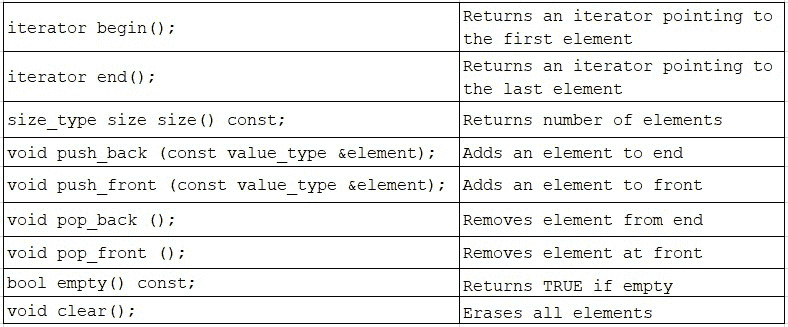
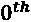
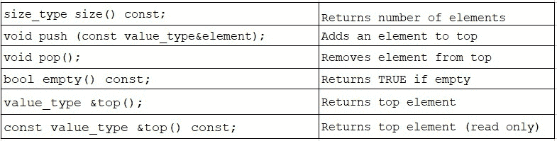
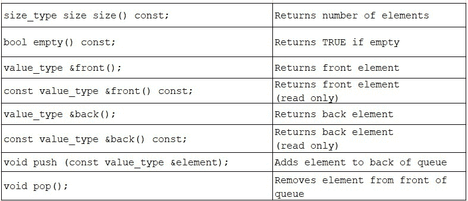
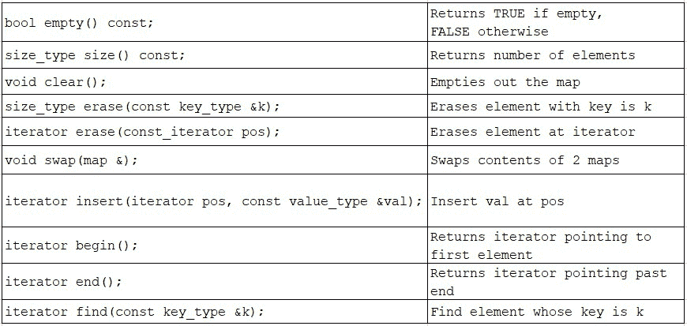

# *第 14 章*: 了解 STL 基础知识

本章将继续我们的追求，通过深入研究已经完全集成到该语言的通用用法中的核心 C 库，使您的 C 编程库超越 OOP 概念。我们将通过检查该库的一个子集来探索 C++ 中的**标准模板库** (**STL**)，该库代表了可以简化我们的编程并使我们的代码更容易被无疑熟悉 STL 的其他人理解的通用实用程序。

在本章中，我们将介绍以下主要主题:

*   在 C 中调查 STL 的内容和目的
*   了解如何使用基本 STL 容器: 使用函子的`list`、`iterator`、`vector`、`deque`、`stack`、`queue`、`priority_queue`、`map`和`map`
*   定制 STL 容器

在本章结束时，您将能够利用核心 STL 类来增强您的编程技能。因为您已经了解了构建库的基本 c 语言和 OOP 功能，所以您将看到您现在可以导航和理解几乎任何 C 类库，包括 STL。通过熟悉 STL，您将能够显着增强编程功能，并成为更精明和有价值的程序员。

让我们通过检查一个非常大量使用的类库 STL 来增加我们的 C 工具包。

# 技术要求

完整程序示例的在线代码可以在以下 GitHub URL 上找到: [https://github.com/PacktPublishing/ Demystified-Object-Oriented-Programming-带有-CPP/blob/master/Chapter14](https://github.com/PacktPublishing/Demystified-Object-Oriented-Programming-with-CPP/blob/master/Chapter14)。每个完整的程序示例都可以在 GitHub 存储库中找到相应的章节标题 (子目录) 下的文件，该文件与章节编号相对应，然后是破折号，然后是手头章节中的示例编号。例如，本章中的第一个完整程序可以在上述 GitHub 目录下的一个名为`Chp14-Ex1.cpp`的文件中的子目录`Chapter14`中找到。

本章的中央情报局视频可以在: [https://bit.ly/3ch15A5](https://bit.ly/3ch15A5)观看。

# 测量 STL 的内容和目的

C 中的**标准模板库**是扩展 c 语言的标准类和实用程序的库。STL 的使用是如此普遍，以至于 STL 似乎是语言本身的一部分; 它是 C 的重要组成部分。C 中的 STL 包含四个关键组件，包括库: **容器**，**迭代器**，**函数**和**算法**。

STL 在提供一组编程标准方面还影响了 C 标准库; 这两个库实际上共享共同的功能和组件，最著名的是容器和迭代器。我们已经使用了标准库中的组件，即 iostreams 的`<iostream>`，异常处理的`<exception>`，运算符的`new()`和`delete()`。在本章中，我们将探讨 C++ 中 STL 和标准库之间的许多重叠组件。

STL 具有整行的**容器**类。这些类封装了传统的数据结构，以允许将相似的项目收集在一起并统一处理。有几类容器类-顺序，关联和 unordered。让我们总结一下这些分类，并提供每个分类的几个例子:

*   **顺序容器**: 实现可以顺序访问的封装数据结构，如 STL`list`、`queue`或`stack`。有趣的是，`queue`和`stack`可以被认为是一个定制的，或者一个更基本的容器的自适应接口，比如`list`。尽管如此，a`queue`和`stack`仍然提供对其元素的顺序访问。
*   **关联容器**: 实现排序、封装的数据结构，可以快速搜索到元素，如 STL`set`或`map`。
*   **无序容器**: 实现无序、封装的可以合理快速搜索的数据结构，如 STL`unordered_set`或`unordered_map`。

为了使这些容器类潜在地用于任何数据类型 (并保留强类型检查)，使用模板来抽象和通用所收集项目的数据类型。实际上，我们已经在[*第 13 章*](13.html#_idTextAnchor486)，*使用模板*构建了自己的容器类，包括`LinkList`和`Array`，所以我们已经对模板化的容器类有了基本的了解!

此外，STL 还提供了完整的**迭代器**，使我们能够*遍历*或遍历容器。迭代器会跟踪我们的当前位置，而不会破坏对象集合的内容或顺序。我们将看到迭代器如何允许我们在 STL 中更安全地处理容器类。

STL 还包含大量有用的**算法**。示例包括排序，计算集合中可能满足条件的元素的数量，搜索元素内的特定元素或子序列，或以多种方式复制元素。算法的其他示例包括修改对象序列 (替换，交换和删除值)，将集合划分为范围或将集合合并在一起。此外，STL 还包含许多其他有用的算法和实用程序。

最后，STL 包括功能。实际上，说 STL 包括**函子**或**函数对象**会更正确。函子是围绕重载`operator()` (函数调用运算符) 的能力构建的，通过这样做，我们可以通过函数指针实现参数化的灵活性。尽管这不是我们将立即 (或经常) 使用的 STL 的基本功能，但我们将在本章中看到一个小的，简单的 functor 示例，以及 STL 容器类，在即将到来的章节中*使用 functor*检查 STL 映射。

在本章中，我们将重点介绍 STL 的容器类部分。尽管我们不会检查 STL 中的每个 STL 容器类，但我们将回顾这些类的健康分类。我们会注意到，其中一些容器类类似于我们在本书前几章中一起构建的类。顺便说一句，在本书的增量章节进行过程中，我们还建立了 c 语言和 OOP 技能，这是解码 C 类库 (例如 STL) 所必需的。

让我们继续看一下选择性的 STL 类，并在解释每个类时测试我们的 C 知识。

# 了解如何使用必要的 STL 容器

在本节中，我们将测试我们的 C 技能，解码各种 STL 容器类。我们将看到，我们从核心 C 语法到 OOP 技能所掌握的语言特性使我们能够轻松地解释我们现在将要研究的 STL 的各个组件。最值得注意的是，我们将使用模板的知识!例如，我们对封装和继承的了解将指导我们了解如何在 STL 类中使用各种方法。但是，我们会注意到，虚拟函数和抽象类在 STL 中极为罕见。在 STL 中获得新类能力的最佳方法是接受详细说明每个类的文档。有了 C 的知识，我们可以轻松地浏览给定的类来解码如何成功使用它。

C STL 中的容器类通过封装实现这些更高级概念的数据结构来实现各种**抽象数据类型** (**ADTs**)。我们将检查核心 STL 容器: `list`、`iterator`、`vector`、`deque`、`stack`、`queue`、`priority_queue`和`map`。

让我们开始研究如何利用一个非常基本的 STL 容器，`list`。

## 使用 STL 列表

STL`list`类封装了实现链表所必需的数据结构。我们可以说`list`实现了链表的抽象数据类型。回想一下，我们通过在[*第 6 章*](06.html#_idTextAnchor262)，*用继承*实现层次结构，创建了自己的链表。STL`list`允许元素的轻松插入、删除和排序。不支持对单个元素的直接访问 (称为*随机访问*)。相反，必须反复遍历链接列表中的先前项目，直到到达所需项目为止。`list`是顺序容器的一个很好的例子。

STL`list`类具有各种各样的成员函数; 我们将从这个例子中了解一些流行的方法开始，以熟悉基本的 STL container 类的用法。

现在，让我们看一下我们如何利用STL`list`类。可以在我们的 GitHub 中找到此示例，作为具有必要的类定义的完整工作程序，如下所示:

[https://github.com/PacktPublishing/Demystified-Object-Oriented-Programming-with-CPP/blob/master/Chapter14/Chp14-Ex1.cpp](https://github.com/PacktPublishing/Demystified-Object-Oriented-Programming-with-CPP/blob/master/Chapter14/Chp14-Ex1.cpp)

```cpp
#include <list>
int main()
{   
    list<Student> studentBody;   // create a list
    Student s1("Jul", "Li", 'M', "Ms.", 3.8, "C++", "117PSU");
    Student *s2 = new Student("Deb", "King", 'H', "Dr.", 3.8,
                              "C++", "544UD");
    // Add Students to the studentBody list. 
    studentBody.push_back(s1);
    studentBody.push_back(*s2);
    // The next 3 instances are anonymous objects in main()
    studentBody.push_back(Student("Hana", "Sato", 'U', "Dr.",
                                   3.8, "C++", "178PSU"));
    studentBody.push_back(Student("Sara", "Kato", 'B', "Dr.",
                                  3.9, "C++", "272PSU"));
    studentBody.push_back(Student("Giselle", "LeBrun", 'R',
                                 "Ms.", 3.4, "C++", "299TU"));
    while (!studentBody.empty())
    {
       studentBody.front().Print();
       studentBody.pop_front();
    }
    delete s2;  // delete any heap instances
    return 0;
}
```

让我们来看看前面提到的程序段，在那里我们创建和利用了一个 STL`list`。首先，我们`#include <list>`包含相应的 STL 头文件。现在，在`main()`中，我们可以使用`list<Student> studentBody;`实例化列表。我们的列表将包含`Student`实例。然后，我们使用 `new()` 在堆栈上创建`Student s1`，在堆上创建`Student *s2`。

接下来，我们使用`list::push_back()`将`s1`和`*s2`都添加到列表中。请注意，我们正在将对象传递给`push_back()`。当我们将`Student`实例添加到`studentBody`列表时，该列表将在内部制作对象的副本，并且当这些对象不再是列表的成员时，将正确清理这些对象。我们需要记住，如果我们的任何实例已经分配到堆上，例如`*s2`，当我们在`main()`末尾处理完该实例时，我们必须删除该实例的副本。展望`main()`的结尾，我们可以看到我们适当的`delete s2;`。

接下来，我们在名单上再增加三个学生。这些`Student`实例没有本地标识符。这些学生在对`push_back()`的调用中被实例化，例如`studentBody.push_back(Student("Hana", "Sato", 'U', "Dr.", 3.8, "C++", "178PSU"));`。在这里，我们实例化一个*匿名 (堆栈) 对象*，一旦对`push_back()`的调用结束，它将正确地从堆栈中弹出并被破坏。请记住，`push_back()`还将为这些实例在`list`内的预期寿命创建自己的本地副本。

现在，在`while`循环中，我们反复检查列表是否为`empty()`，如果不是，我们检查`front()`项并调用我们的`Student::Print()`方法。然后，我们使用`pop_front()`从列表中删除该项。

让我们看一下该程序的输出:

```cpp
Ms. Jul M. Li with id: 117PSU GPA:  3.8 Course: C++
Dr. Deb H. King with id: 544UD GPA:  3.8 Course: C++
Dr. Hana U. Sato with id: 178PSU GPA:  3.8 Course: C++
Dr. Sara B. Kato with id: 272PSU GPA:  3.9 Course: C++
Ms. Giselle R. LeBrun with id: 299TU GPA:  3.4 Course: C++
```

现在我们已经破译了一个简单的 STL`list`类，让我们继续理解一个`iterator`的概念，来补充一个容器，比如我们的`list`。

## 使用 STL 迭代器

通常，我们需要一种非破坏性的方式来迭代对象集合。例如，在给定容器中保持第一个、最后一个和当前位置是很重要的，尤其是当集合可能被多个方法、类或线程访问时。使用**迭代器**，STL 提供了遍历任何容器类的通用方法。

使用迭代器有一定的好处。类可以创建一个指向集合中的第一个成员的`iterator`。然后可以将迭代器移动到集合的后续下一个成员。迭代器可以提供对`iterator`指向的元素的访问。

总体而言，容器的状态信息可以通过`iterator`来维护。迭代器通过将状态信息从容器中抽象出来，而是抽象到迭代器类中，为交错访问提供了一种安全的方法。

我们可以把一个**迭代器**看作是两个或两个以上的人在引用的书中的书签。第一个人按顺序阅读这本书，将书签整齐地留在他们希望继续阅读的地方。当他们走开时，另一个人会查找书中的重要项目，然后将书签移至书中的另一个位置以保存自己的位置。当第一个人返回时，他们发现自己失去了当前位置，并且不在他们期望的位置。每个用户都应该有自己的书签或迭代器。类比是，迭代器允许对可能由应用内的多个组件处理的资源进行安全的交织访问。如果没有`iterator`，您可能会在其他用户不知情的情况下无意中修改容器。

让我们看一下如何 利用 STL `iterator`。这个例子可以作为一个完整的程序在我们的 GitHub 中找到，如下所示:

[https://github.com/PacktPublishing/Demystified-Object-Oriented-Programming-with-CPP/blob/master/Chapter14/Chp14-Ex2.cpp](https://github.com/PacktPublishing/Demystified-Object-Oriented-Programming-with-CPP/blob/master/Chapter14/Chp14-Ex2.cpp)

```cpp
#include <list>
#include <iterator>
bool operator<(const Student &s1, const Student &s2)
{   // overloaded operator< -- required to use list::sort()
    return (s1.GetGpa() < s2.GetGpa());
}
int main()
{
    list<Student> studentBody;  
    Student s1("Jul", "Li", 'M', "Ms.", 3.8, "C++", "117PSU");
    // Add Students to the studentBody list.
    studentBody.push_back(s1);
    // The next Student instances are anonymous objects
    studentBody.push_back(Student("Hana", "Sato", 'U', "Dr.",
                                   3.8, "C++", "178PSU"));
    studentBody.push_back(Student("Sara", "Kato", 'B', "Dr.",
                                   3.9, "C++", "272PSU"));
    studentBody.push_back(Student("Giselle", "LeBrun", 'R',
                                 "Ms.", 3.4, "C++", "299TU"));
    studentBody.sort();  // sort() will rely on operator< 
    // Create a list iterator; set to first item in the list
    list <Student>::iterator listIter = studentBody.begin();
    while (listIter != studentBody.end())
    {
        Student &temp = *listIter;
        temp.Print();
        listIter++ ;
    }
    return 0;
}
```

让我们看一下我们之前定义的代码段。在这里，我们包含 STL 中的`<list>`和`<iterator>`标头。与我们之前的`main()`函数一样，我们使用`list<Student> studentbody;`实例化一个可以包含`Student`实例的`list`。然后，我们实例化几个`Student`实例，并使用`push_back()`将它们添加到列表中。再次注意，有几个`Student`实例是*匿名对象*，在`main()`中没有本地标识符。当`push_back()`完成时，这些实例将从堆栈中弹出。这没问题，因为`push_back()`将为列表创建本地副本。

现在，我们可以使用`studentBody.sort();`对列表进行排序。需要注意的是，这种`list`方法要求我们重载`operator<`，以提供两个`Student`实例之间的比较方法。幸运的是，我们有!我们选择通过比较`gpa`来实现`operator<`，但它也可以使用`studentId`进行比较。

现在我们有了一个`list`，我们可以创建一个`iterator`并建立它来引用`list`的第一项。我们通过声明`list <Student>::iterator listIter = studentBody.begin();`来做到这一点。在建立了`iterator`后，我们可以使用它来安全地从`list`开始 (初始化时) 循环到`end()`。我们用`Student &temp = *listIter;`将一个局部引用变量`temp`分配给循环迭代的当前第一个元素。然后，我们使用`temp.Print();`打印这个实例，然后我们使用`listIter++ ;`在e 元素上增加迭代器。

让我们看一下该程序的排序输出 (按`gpa`排序):

```cpp
MS. Giselle R. LeBrun with id: 299TU GPA:  3.4 Course: C++
Ms. Jul M. Li with id: 117PSU GPA:  3.8 Course: C++
Dr. Hana U. Sato with id: 178PSU GPA:  3.8 Course: C++
Dr. Sara B. Kato with id: 272PSU GPA:  3.9 Course: C++
```

现在我们已经看到了一个正在运行的`iterator`类，让我们从`vector`开始研究各种其他 STL 容器类。

## 使用 STL 向量

STL`vector`类实现了动态数组的抽象数据类型。回想一下，我们通过在[*第 13 章*](13.html#_idTextAnchor486)，*使用模板*中创建一个`Array`类，从而制作了自己的动态数组。但是，STL 版本将更加广泛。

`vector` (动态或可调整大小的数组) 将根据需要扩展，以容纳超出其初始大小的其他元素。类`vector`允许通过重载`operator[]`直接 (即*随机存取*) 元素。`vector`允许通过直接访问在恒定时间内访问元素。不必遍历所有先前的元素即可访问特定索引的元素。

但是，在`vector`中间添加元素非常耗时。也就是说，添加到除`vector`结尾以外的任何地方都需要经过插入点的所有元素进行内部改组; 它也可能需要对`vector`进行内部调整。

显然，相比之下，a`list`和 a`vector`有不同的优点和缺点。每个都适合数据集合的不同要求。我们可以选择最适合我们需求的。

让我们看一下常见的`vector`成员函数的分类。这是远没有一个完整的列表:


STL`vector`另外有一个重载的`operator=` (赋值用源向量替换目标向量) 、`operator==` (向量的比较，元素的比较) 和`operator[]` (返回对请求位置的引用，即可写内存)。

让我们看一下如何利用 STL`vector`类及其一些基本操作。这个例子可以作为一个完整的工作程序在我们的 GitHub 中找到，如下所示:

[https://github.com/PacktPublishing/Demystified-Object-Oriented-Programming-with-CPP/blob/master/Chapter14/Chp14-Ex3.cpp](https://github.com/PacktPublishing/Demystified-Object-Oriented-Programming-with-CPP/blob/master/Chapter14/Chp14-Ex3.cpp):

```cpp
#include <vector>
int main()
{
    vector<Student> studentBody1, studentBody2; // two vectors
    // add 3 Students, which are anonymous objects, to vect 1 
    studentBody1.push_back(Student("Hana", "Sato", 'U', "Dr.",
                                    3.8, "C++", "178PSU"));
    studentBody1.push_back(Student("Sara", "Kato", 'B', "Dr.",
                                    3.9, "C++", "272PSU"));
    studentBody1.push_back(Student("Giselle", "LeBrun", 'R',
                                 "Ms.", 3.4, "C++", "299TU"));
    for (int i = 0; i < studentBody1.size(); i++)   
        studentBody1[i].Print();   // print vector1's contents
    studentBody2 = studentBody1;   // assign one to another
    if (studentBody1 == studentBody2)
        cout << "Vectors are the same" << endl;
    for (auto iter = studentBody2.begin(); // print vector2
              iter != studentBody2.end(); iter++)
        (*iter).Print();
    if (!studentBody1.empty())   // clear first vector 
        studentBody1.clear();
    return 0;
}
```

在前面列出的代码段中，我们`#include <vector>`包含相应的 STL 头文件。现在，在`main()`中，我们可以使用`vector<Student> studentBody1, studentBody2;`实例化两个向量。然后，我们可以使用`vector::push_back()`方法在我们的第一个`vector`中连续添加几个`Student`实例。再次注意，`Student`实例是`main()`中的*匿名对象*。也就是说，没有引用它们的本地标识符-它们仅被创建为放置在我们的`vector`中，它在插入时会生成每个实例的本地副本。一旦我们在我们的`vector`中有了元素，我们就循环浏览我们的第一个`vector`，使用`studentBody1[i].Print();`打印每个`Student`。

接下来，我们通过使用`studentBody1 = studentBody2;`将一个`vector`分配给另一个`vector`来演示的重载赋值运算符。在这里，我们在作业中从右向左进行深度复制。然后，我们可以使用条件语句中的重载比较运算符测试两个向量是否相等。即`if (studentBody1 == studentBody2)`。然后，我们使用用`auto iter = studentBody2.begin();`指定的迭代器在`for`循环中打印出第二个向量的内容。`auto`关键字允许迭代器的类型由其初始用法确定。最后，我们浏览我们的第一个`vector`，测试它是否是`empty()`，然后使用`studentBody1.clear();`逐个清除一个元素。我们现在已经看到了`vector`方法及其功能的样本。

让我们看一下该程序的输出:

```cpp
Dr. Hana U. Sato with id: 178PSU GPA:  3.8 Course: C++
Dr. Sara B. Kato with id: 272PSU GPA:  3.9 Course: C++
Ms. Giselle R. LeBrun with id: 299TU GPA:  3.4 Course: C++
Vectors are the same
Dr. Hana U. Sato with id: 178PSU GPA:  3.8 Course: C++
Dr. Sara B. Kato with id: 272PSU GPA:  3.9 Course: C++
Ms. Giselle R. LeBrun with id: 299TU GPA:  3.4 Course: C++
```

接下来，让我们研究 STL`deque`类，以进一步了解 STL 容器。

## 使用 STL deque

STL`deque`类 (发音为*deck*) 实现了双端队列的抽象数据类型。这个 ADT扩展了队列先进先出的概念。相反，`deque`允许更大的灵活性。在`deque`的两端添加元素很快。在`deque`中间添加元素非常耗时。`deque`是一个连续的容器，尽管比我们的`list`更灵活。

你可能会想象一个`deque`是一个`queue`的特化; 它不是。相反，灵活的`deque`类将作为实现其他容器类的基础，我们将很快看到。在这些情况下，私有继承将允许我们隐藏`deque`作为一个底层实现 (具有庞大的功能)，用于更严格的、专门的类。

让我们看一下常见的`deque`成员函数的分类。这远不是一个完整的列表:



]

STL`deque`另外有一个重载的`operator=` (将源分配给目标 deque) 和`operator[]` (返回对请求的位置可写内存的引用)。

让我们看一下如何利用 STL`deque`类。这个例子可以作为一个完整的工作程序在我们的 GitHub 中找到，如下所示:

[https://github.com/PacktPublishing/Demystified-Object-Oriented-Programming-with-CPP/blob/master/Chapter14/Chp14-Ex4.cpp](https://github.com/PacktPublishing/Demystified-Object-Oriented-Programming-with-CPP/blob/master/Chapter14/Chp14-Ex4.cpp)

```cpp
include <deque>   
int main()
{
    deque<Student> studentBody;   // create a deque
    Student s1("Tim", "Lim", 'O', "Mr.", 3.2, "C++", "111UD");
    // the remainder of the Students are anonymous objects
    studentBody.push_back(Student("Hana", "Sato", 'U', "Dr.",
                          3.8, "C++", "178PSU"));
    studentBody.push_back(Student("Sara", "Kato", 'B', "Dr.",
                          3.9, "C++", "272PSU"));
    studentBody.push_front(Student("Giselle", "LeBrun", 'R',
                                "Ms.", 3.4, "C++", "299TU"));
    // insert one past the beginning
    studentBody.insert(studentBody.begin() + 1, Student
       ("Anne", "Brennan", 'B', "Ms.", 3.9, "C++", "299CU"));
    studentBody[0] = s1;  // replace  element; 
                          // no bounds checking!
    while (studentBody.empty() == false)
    {
        studentBody.front().Print();
        studentBody.pop_front();
    }
    return 0;
}
```

在前面列出的代码段中，我们`#include <deque>`包含相应的 STL 头文件。现在，在`main()`中，我们可以使用`deque<Student> studentBody;`实例化一个`deque`来包含`Student`实例。然后，我们调用`deque::push_back()`或`deque::push_front()`将几个`Student`实例 (一些匿名对象) 添加到我们的`deque`中。我们掌握了这一切!现在，我们用`studentBody.insert(studentBody.begin() + 1, Student("Anne", "Brennan", 'B', "Ms.", 3.9, "C++", "299CU"));`在甲板前面插入一个`Student`。

接下来，我们利用重载`operator[]`使用`studentBody[0] = s1;`在我们的`deque`中插入`Student`。请注意，`operator[]`不对我们的`deque`做任何边界检查!在此语句中，我们将`Student``s1`插入到`deque`中的位置，而不是曾经占据该位置的`Student`。一个更安全的选择是使用`deque::at()`方法，该方法将包含边界检查。关于上述分配，我们还希望确保`operator=`对于`Person`和`Student`都已被重载，因为每个类都动态分配了数据成员。

现在，我们循环直到我们的`deque`是`empty()`，使用`studentBody.front().Print();`提取并打印 deque 的正面`element`。每次迭代时，我们还使用`studentBody.pop_front();`从我们的`deque`弹出前面的项目。

让我们看一下该程序的输出:

```cpp
Mr. Tim O. Lim with id: 111UD GPA:  3.2 Course: C++
Ms. Anne B. Brennan with id: 299CU GPA:  3.9 Course: C++
Dr. Hana U. Sato with id: 178PSU GPA:  3.8 Course: C++
Dr. Sara B. Kato with id: 272PSU GPA:  3.9 Course: C++
```

现在我们对`deque`有了感觉，接下来让我们研究一下 STL`stack`类。

## 使用 STL 堆栈

STL`stack`类实现堆栈的抽象数据类型。堆栈ADT 支持**后进先出** (**后进先出**) 顺序，用于成员的插入和移除。对于 ADT 的形式，STL`stack`包括一个不宣传其基础实现的公共接口。毕竟，`stack`可能会改变其实现; ADT 的使用不应以任何方式依赖于其基础实现。STL`stack`被认为是基本顺序容器的自适应接口。

回想一下，我们在[*第 6 章*](06.html#_idTextAnchor262)，*使用`LinkedList`的私有基类实现了具有继承*的层次结构。STL 版本将更加广泛; 有趣的是，它是使用`deque`作为其底层的私有基类来实现的。将`deque`作为 STL`stack`的私有基类，隐藏了`deque`更通用的底层功能; 仅使用适用的方法来实现堆栈的公共接口。此外，由于实现方式是隐藏的，因此可以在以后使用另一个容器类来实现`stack`，而不会影响其用法。

让我们看一下常见的`stack`成员函数的分类。这远不是一个完整的列表。需要注意的是，`stack`的公共接口远小于其私有基类`deque`的公共接口:



STL`stack`另外还有一个重载的`operator=` (源到目标栈的分配)，`operator==`和`operator!=` (两个栈的相等/不等式)，以及`operator<`、`operator>`、`operator<=`和`operator >=` (栈的比较)。

让我们看一下如何利用 STL`stack`类。这个示例可以作为一个完整的工作程序在我们的 GitHub 中找到，如下所示:

[https://github.com/PacktPublishing/Demystified-Object-Oriented-Programming-with-CPP/blob/master/Chapter14/Chp14-Ex5.cpp](https://github.com/PacktPublishing/Demystified-Object-Oriented-Programming-with-CPP/blob/master/Chapter14/Chp14-Ex5.cpp)

```cpp
include <stack>   // template class preamble
int main()
{
    stack<Student> studentBody;   // create a stack
    // add Students to the stack (anonymous objects)
    studentBody.push(Student("Hana", "Sato", 'U', "Dr.", 3.8,
                             "C++", "178PSU"));
    studentBody.push(Student("Sara", "Kato", 'B', "Dr.", 3.9,
                             "C++", "272PSU"));
    studentBody.push(Student("Giselle", "LeBrun", 'R', "Ms.",
                              3.4, "C++", "299TU"));
    while (!studentBody.empty())
    {
        studentBody.top().Print();
        studentBody.pop();
    }
    return 0;
}
```

在上述代码段中，我们`#include <stack>`包含相应的 STL 头文件。现在，在`main()`中，我们可以使用`stack<Student> studentBody;`实例化一个`stack`来包含`Student`实例。然后，我们调用`stack::push()`将几个`Student`实例添加到我们的`stack`中。请注意，我们使用的是传统的`push()`方法，它有助于堆栈的 ADT。

然后，我们通过我们的`stack`循环，而它不是`empty()`。我们的目标是使用`studentBody.top().Print();`访问和打印顶部元素。然后，我们使用`studentBody.pop();`将顶部元素从堆栈中整齐地弹出。

让我们看一下该程序的输出:

```cpp
Ms. Giselle R. LeBrun with id: 299TU GPA:  3.4 Course: C++
Dr. Sara B. Kato with id: 272PSU GPA:  3.9 Course: C++
Dr. Hana U. Sato with id: 178PSU GPA:  3.8 Course: C++
```

接下来，让我们研究一下 STL`queue`类，以进一步增加我们的 STL 容器库。

## 使用 STL 队列

STL`queue`类实现队列的 ADT。作为刻板的队列类，STL 的`queue`支持**FIFO** (**先进先出**) 成员的插入和移除顺序。

回想一下，我们在[*第 6 章*](06.html#_idTextAnchor262)*中制作了自己的`Queue`clas，通过继承实现层次结构*; 我们使用私有继承从`LinkedList`类中导出了我们的`Queue`。STL 版本将更加广泛; STL`queue`使用`deque`作为其底层实现 (也使用私有继承) 来实现。请记住，由于实现方式是用私有继承隐藏的，因此可以在以后使用另一种数据类型来实现`queue`，而不会影响其公共接口。STL`queue`是基本顺序容器的自适应接口的另一个示例。

让我们看一下常见的`queue`成员函数的分类。这远不是一个完整的列表。需要注意的是，`queue`的公共接口远小于其私有基类`deque`的公共接口:



STL`queue`另外还有一个重载的`operator=` (源到目标队列的分配)，`operator==`和`operator!=` (两个队列的相等/不等式)，以及`operator<`、`operator>`、`operator<=`和`operator >=` (队列的比较)。

让我们看一下如何利用 STL`queue`类。这个例子可以作为一个完整的工作程序在我们的 GitHub 中找到，如下所示:

[https://github.com/PacktPublishing/Demystified-Object-Oriented-Programming-with-CPP/blob/master/Chapter14/Chp14-Ex6.cpp](https://github.com/PacktPublishing/Demystified-Object-Oriented-Programming-with-CPP/blob/master/Chapter14/Chp14-Ex6.cpp)

```cpp
#include <queue>   
int main()
{
    queue<Student> studentBody;  // create a queue
    // add Students to the queue (anonymous objects)
    studentBody.push(Student("Hana", "Sato", 'U', "Dr.", 3.8,
                             "C++", "178PSU"));
    studentBody.push(Student("Sara", "Kato", 'B', "Dr.", 3.9,
                             "C++", "272PSU"));
    studentBody.push(Student("Giselle", "LeBrun", 'R', "Ms.",
                             3.4, "C++", "299TU"));
    while (!studentBody.empty())
    {
        studentBody.front().Print();
        studentBody.pop();
    }
    return 0;
}
```

在前面的代码段中，我们首先要包含相应的 STL 头文件。现在，在`main()`中，我们可以使用`queue<Student> studentBody;`实例化一个`queue`来包含`Student`实例。然后，我们调用`queue::push()`将几个`Student`实例添加到我们的`queue`中。回想一下，使用队列 ADT，`push()`意味着我们在队列的末尾添加了一个元素; 一些程序员更喜欢术语*enqueue*来描述此操作; 但是，STL 选择了将此操作命名为`push()`。使用队列 ADT，`pop()`将从队列的前面删除一个项目。一个更好的术语是*出队*; 然而，这不是 STL 选择的。我们可以适应。

然后，我们循环浏览我们的`queue`，而它不是`empty()`。我们的目标是使用`studentBody.front().Print();`访问和打印正面元素。然后，我们使用`studentBody.pop();`将我们的前元素从`queue`上整齐地弹出。我们的工作完成了。

让我们看一下该程序的输出:

```cpp
Dr. Hana U. Sato with id: 178PSU GPA:  3.8 Course: C++
Dr. Sara B. Kato with id: 272PSU GPA:  3.9 Course: C++
Ms. Giselle R. LeBrun with id: 299TU GPA:  3.4 Course: C++
```

现在我们已经尝试了`queue`，让我们研究一下 STL`priority_queue`类。

## 使用 STL 优先级队列

STL`priority_queue`类实现了优先级队列的抽象数据类型。优先级队列 ADT支持成员插入和移除的修改 FIFO 顺序，使得元素为*加权*。前面的元素是最大值 (由重载的`operator<`确定)，其余元素从下一个最大到最小依次跟随。STL`priority_queue`被认为是顺序容器的自适应接口。

回想一下，我们在[*第 6 章*](06.html#_idTextAnchor262)中实现了自己的`PriorityQueue`类，*实现了带有继承*的层次结构。我们使用公共继承来允许我们的`PriorityQueue`专门化我们的`Queue`类，添加额外的方法来支持优先级 (加权) 入队方案。隐藏了`Queue`的底层实现 (带有私有基类`LinkedList`)。通过使用公共继承，我们允许我们的`PriorityQueue`能够通过向上广播被概括为`Queue` (一旦我们在[*第 7 章*](07.html#_idTextAnchor298)中了解了多态性和虚函数，*通过多态性利用动态结合*)。我们做了一个可接受的设计选择: *PriorityQueue 是-A* (专门化) *Queue*，有时可能会以其更一般的形式处理。我们还记得，无论是`Queue`还是`PriorityQueue`都不能被忽视为其基本实现的`LinkedList`，因为`Queue`是从`LinkedList`私下派生的; 我们不能被忽视超过非公共继承边界。

相反，使用 STL`vector`作为其基础实现来实现`priority_queue`的 STL 版本。回想一下，因为实现手段是隐藏的，所以可以在以后使用另一种数据类型来实现`priority_queue`，而不会影响其公共接口。

STL`priority_queue`允许对顶部元素进行检查，但不能进行修改。STL`priority_queue`不允许插入其元素。也就是说，元素只能被添加，导致从大到小的顺序。因此，可以检查顶部元件，并且可以移除顶部元件。

让我们看一下常见的`priority_queue`成员函数的分类。这不是一个完整的列表。需要注意的是，`priority_queue`的公共接口远小于其私有基类`vector`的公共接口:


与先前检查过的容器类不同，STL`priority_queue`不会重载运算符，包括`operator=`，`operator==`和`operator<`。

`priority_queue`最有趣的方法是`void emplace(args);`。这个是允许优先级入队机制将项目添加到这个 ADT 的成员函数。我们还注意到，必须使用`top()`来返回顶部元素 (与`front()`，这是`queue`所利用的)。但话又说回来，STL`priority_queue`不是使用`queue`实现的。为了利用`priority_queue`，我们`#include <queue>`，就像我们对`queue`一样。

由于`priority_queue`的用法与`queue`非常相似，因此我们将在本章末尾的问题集中，在编程方面进一步探讨它。

现在，我们已经看到了 STL (包括自适应接口) 中许多顺序容器类型的示例，接下来让我们研究 STL`map`类，一个关联 container。

## 检查 STL 地图

STL`map`类实现哈希表的抽象数据类型。类`map`允许使用**键**或索引快速存储和检索哈希表或映射中的元素。**键**可以是数值或任何其他数据类型。只有一个键可以与单个值元素相关联。但是，如果需要与单个密钥关联多个数据，则可以使用 STL 容器`multimap`。

哈希表 (映射) 对于数据的存储和查找是快速的。性能是保证的*O(log(n))* 。STL`map`被认为是关联容器，因为它将键与值相关联以快速检索值。

让我们看一下常见的`map`成员函数的分类。这不是一个完整的列表:



STL`map`另外具有重载运算符`operator==` (映射的比较，元素的元素)，实现为全局函数。STL`map`也有重载`operator[]` (返回与作为索引的键关联的 map 元素的引用; 这是可写内存)。

让我们看一下如何利用 STL`map`类。这个例子可以在我们的 GitHub 中找到，作为一个完整的工作程序，如下所示:

[https://github.com/PacktPublishing/Demystified-Object-Oriented-Programming-with-CPP/blob/master/Chapter14/Chp14-Ex7.cpp](https://github.com/PacktPublishing/Demystified-Object-Oriented-Programming-with-CPP/blob/master/Chapter14/Chp14-Ex7.cpp)

```cpp
#include <map>
bool operator<(const Student &s1, const Student &s2)
{   // We need to overload operator< to compare Students
    return (s1.GetGpa() < s2.GetGpa());
}
int main()
{
    Student s1("Hana", "Lo", 'U', "Dr.", 3.8, "C++", "178UD");
    Student s2("Ali", "Li", 'B', "Dr.", 3.9, "C++", "272UD");
    Student s3("Rui", "Qi", 'R', "Ms.", 3.4, "C++", "299TU");
    Student s4("Jiang", "Wu", 'C', "Ms.", 3.8, "C++","887TU");
    // Create map and map iterator, of Students w char * keys
    map<const char *, Student> studentBody;
    map<const char *, Student>::iterator mapIter;
    // create three pairings of ids to Students
    pair<const char *, Student> studentPair1
                                (s1.GetStudentId(), s1);
    pair<const char *, Student> studentPair2
                                (s2.GetStudentId(), s2);
    pair<const char *, Student> studentPair3
                                (s3.GetStudentId(), s3);
    studentBody.insert(studentPair1);  // insert 3 pairs
    studentBody.insert(studentPair2);
    studentBody.insert(studentPair3);
    // insert using virtual indices per map
    studentBody[s4.GetStudentId()] = s4; 

    mapIter = studentBody.begin();
    while (mapIter != studentBody.end())
    {   
        // set temp to current item in map iterator
        pair<const char *, Student> temp = *mapIter;
        Student &tempS = temp.second;  // get 2nd item in pair 
        // access using mapIter
        cout << temp.first << " "<<temp.second.GetFirstName();  
        // or access using temporary Student, tempS  
        cout << " " << tempS.GetLastName() << endl;
        mapIter++ ;
    }
    return 0;
}
```

让我们检查一下前面的代码段。同样，我们将适用的头文件包含在`#include <map>`中。接下来，我们实例化四个`Student`实例。我们将制作一个哈希表 (`map`) 的`Student`实例由一个键 (即它们的`studentId`) 索引。接下来，我们声明一个`map`来保存带有`map<const char *, Student> studentBody;`的`Student`实例集合。在这里，我们指出键和元素之间的关联将在`const char *`和`Student`之间。然后，我们用`map<const char *, Student>::iterator mapIter;`声明一个映射迭代器，使用相同的数据类型。

现在，我们创建三个`pair`实例，使用声明`pair<const char *, Student> studentPair1 (s1.GetStudentId(), s1);`将每个`Student`与其密钥 (即与各自的`studentId`) 之间的分组关联。这可能看起来令人困惑，但让我们把这个声明分解成它的组成部分。这里，实例的数据类型是`pair<const char *, Student>`，变量名是`studentPair1`，`(s1.GetStudentId(), s1)`是传递给特定`pair`实例的构造函数的参数。

现在，我们简单地将三个`pair`实例插入到`map`中。此插入的示例是`studentBody.insert(studentPair1);`。然后，我们使用`map`的重载`operator[]`在`map`中插入第四个`Student`，`s4`，并带有以下语句: `studentBody[s4.GetStudentId()] = s4;`。请注意，`studentId`用作`operator[]`中的索引值; 该值将成为哈希表中`Student`的键值。

最后，我们将映射迭代器建立到`map`的开头，然后在`map`不在`end()`处处理`map`。在循环中，我们将变量`temp`设置为地图前面的`pair`，由地图迭代器指示。我们还将`tempS`设置为对`map`中的`Student`的临时引用，由`temp.second`表示 (当前`pair`中的第二个值由地图迭代器管理)。现在，我们可以使用`temp.first` (当前`pair`中的第一项) 打印出每个`Student`实例的`studentId` (密钥)。在相同的语句中，我们可以使用`temp.second.GetFirstName()`打印出每个`Student`实例的`firstName` (因为与密钥对应的`Student`是当前`pair`中的第二项)。同样，我们也可以使用`tempS.GetLastName()`来打印一个学生的`lastName`，因为`tempS`以前是在每次循环迭代开始时将初始化为当前`pair`中的第二个元素。

让我们看一下该程序的输出:

```cpp
299TU Rui Qi
178UD Hana Lo
272UD Ali Li
887TU Jiang Wu
```

接下来，让我们看一下带有 STL`map`的替代方案，它将向我们介绍 STL`functor`的概念。

## 使用函子检查 STL 映射

像许多 STL 类一样，STL`map`类具有很大的灵活性。在我们过去的`map`示例中，我们假设在我们的`Student`类中存在用于比较的方法。毕竟，我们有两个`Student`实例的`operator<`过载。然而，如果我们不能修改一个没有提供这个重载运算符的类，并且我们也选择不重载`operator<`作为外部函数，会发生什么？

幸运的是，当实例化`map`或映射迭代器时，我们可能会为模板类型扩展指定第三种数据类型。此附加数据类型将是类的特定类型，称为函子。**函子**是一个对象，可以将其视为函数或函数指针。我们将创建一个类 (或结构) 来表示我们的函子类型，并且在该类 (或结构) 中，我们必须重载`operator()`。在过载的`operator()`内，我们将为所讨论的对象提供一种比较方法。函子本质上是通过重载`operator()`来模拟封装函数指针。

让我们看一下我们如何利用一个简单的函子将我们的`map`示例修改为。这个例子可以作为一个完整的工作程序在我们的 GitHub 中找到，如下所示:

[https://github.com/PacktPublishing/Demystified-Object-Oriented-Programming-with-CPP/blob/master/Chapter14/Chp14-Ex8.cpp](https://github.com/PacktPublishing/Demystified-Object-Oriented-Programming-with-CPP/blob/master/Chapter14/Chp14-Ex8.cpp)

```cpp
#include <map>
struct comparison   // This struct represents a 'functor'
{                   // that is, a 'function object'
    bool operator() (const char *key1, const char *key2) const
    {   
        int ans = strcmp(key1, key2);
        if (ans >= 0) return true;  // return a boolean
        else return false;  
    }
    comparison() {}  // empty constructor and destructor
    ~comparison() {}
};
int main()
{
    Student s1("Hana", "Sato", 'U', "Dr.", 3.8, "C++", 
               "178PSU");
    Student s2("Sara", "Kato", 'B', "Dr.", 3.9, "C++",
               "272PSU");
    Student s3("Jill", "Long", 'R', "Dr.", 3.7, "C++",
               "234PSU");
    // Now, map is maintained in sorted order per 'comparison'
    // functor using operator()
    map<const char *, Student, comparison> studentBody;
    map<const char *, Student, comparison>::iterator mapIter;
    // The remainder of the program is similar to prior
}   // map program. See online code for complete example.
```

在前面提到的代码片段中，我们首先介绍一种用户定义类型的`comparison`。这可以是`class`或`struct`。在这个结构定义中，我们重载了函数调用运算符 (`operator()`)，并为`Student`实例提供了两个`const char *`键之间的比较方法。此比较将允许`Student`实例按比较函子确定的顺序插入。

现在，当我们实例化我们的`map`和映射迭代器时，我们将`comparison`类型 (函子) 指定为模板类型扩展的第三个参数。整洁地嵌入在这种类型中的是重载函数调用运算符`operator()`，它将提供我们需要的比较。剩下的代码将类似于我们的原始地图程序。

当然，除了我们在这里看到的容器类`map`之外，函子还可以以其他更高级的方式使用。尽管如此，您现在对函子如何应用于 STL 有所了解。

现在我们已经看到了如何利用各种 STL 容器类，让我们考虑为什么我们可能想要定制一个 STL 类，以及如何做到这一点。

# 自定义 STL 容器

C 中的大多数类都可以以某种方式定制，包括 STL 中的类。但是，我们必须了解 STL 中做出的设计决策，这些决策将限制我们自定义这些组件的方式。因为 STL 容器类故意不包括虚拟析构函数或其他虚拟函数，所以我们不应该通过公共继承使用专业化来扩展这些类。请注意，C 不会阻止我们，但是我们从[*第 7 章*](07.html#_idTextAnchor298)，*通过多态性*使用动态绑定，我们永远不应该覆盖非虚函数。STL 选择不包括虚拟析构函数和其他虚拟函数，以允许这些类的进一步专业化，这是很久以前在制作 STL 容器时做出的可靠设计选择。

但是，我们可以使用私有或受保护的继承，或者包含或关联的概念来使用 STL 容器类作为构建块，也就是说，隐藏新类的基础实现，其中 STL 为新类提供了坚实的，但隐藏的实现。我们将简单地为新类提供自己的公共接口，并在引擎盖下，将工作委托给我们的基础实现 (无论是私有或受保护的基类，还是包含或关联的对象)。

在扩展任何模板类 (包括 STL 中使用私有或受保护的基类) 时，必须格外小心和谨慎。此警告也将适用于包含或关联到其他模板类。在创建具有特定类型的模板类的实例之前，一般不会编译 (或语法检查) 模板类。这意味着，只有在创建特定类型的实例时，才能对创建的任何派生类或包装类进行全面测试。

需要为新类放置适当的重载运算符，以便这些运算符将自动使用自定义类型。请记住，某些运算符函数 (例如`operator=`) 不是从 base 继承到派生类的，需要与每个新类一起编写。这是适当的，因为派生类可能要完成的工作比在`operator=`的广义版本中发现的要多。请记住，如果您无法修改需要选定重载运算符的类定义，则必须将该运算符函数实现为外部函数。

除了自定义容器之外，我们还可以选择基于 STL 中现有算法来增强算法。在这种情况下，我们将使用许多 STL 函数之一作为新算法的基础实现nation 的一部分。

从现有库中定制类在编程中通常会出现。例如，考虑我们如何扩展标准库`exception`类以在[*第 11 章*](11.html#_idTextAnchor417)，*处理异常*中创建自定义异常 (尽管该场景使用了公共继承，这将不适用于自定义 STL 类)。请记住，STL 提供了非常完整的容器类。您很少会发现需要增加 STL 类-也许只有在非常特定于域的类需求下。尽管如此，您现在知道自定义 STL 类所涉及的注意事项。请记住，在增加班级时，必须始终使用谨慎和谨慎。现在，我们可以看到需要对我们创建的任何类进行适当的 OO 组件测试。

我们现在已经考虑了如何在我们的程序中潜在地定制 STL 容器类和算法。我们还看到了相当多的 STL 容器类示例。现在让我们简要回顾一下这些概念，然后再进入下一章。

# 总结

在本章中，我们将 C 知识扩展到 OOP 语言功能之外，以熟悉 C 标准模板库。由于该库在 C 中非常常用，因此我们必须了解它所包含的类的范围和广度。现在，我们准备在代码中利用这些有用的，经过良好测试的类。

我们已经看了很多 STL 示例; 通过检查选择性的 STL 类，我们应该感到有能力自己理解 STL 的其余部分 (或任何 C 库)。

我们已经看到了如何使用通用和必不可少的 STL 类，例如`list`，`iterator`，`vector`，`deque`，`stack`，`queue`，`priority_queue`和`map`。我们还看到了如何将函子与容器类结合使用。我们已经被提醒，我们现在有可能定制任何类的工具，甚至那些来自类库，如 STL (通过私有或受保护的继承) 或与包含或关联。

通过检查选定的 STL 类，我们还发现我们具有了解 STL 剩余深度和广度的技能，以及解码我们可以使用的许多其他类库。当我们浏览每个成员函数的原型时，我们注意到关键语言概念，例如使用`const`，或者方法返回对表示可写内存的对象的引用。每个原型都揭示了使用新类的机制。我们的编程努力已经走了这么远，这是非常令人兴奋的!

现在，我们通过浏览 C 中的STL，为我们的 C 曲目添加了其他有用的功能。使用 STL (封装传统数据结构) 将确保我们的代码可以被其他毫无疑问也在使用 STL 的程序员容易理解。这些通用容器和实用程序依赖经过良好测试的 STL，可确保我们的代码保持无错误。

我们现在准备继续推进[*第 15 章*](15.html#_idTextAnchor572)，*测试类和组件*。我们希望通过有用的 OO 组件测试技能来补充我们的 C 编程技能。测试技能将帮助我们了解我们是否以稳健的方式创建、扩展或增强了课程。这些技能将使我们成为更好的程序员。让我们继续前进!

# 问题

1.  Replace your template `Array` class from your exercise from [*Chapter 13*](13.html#_idTextAnchor486), *Working with Templates*, with an STL `vector`. Create a `vector` of `Student` instances. Use `vector` operations to insert, retrieve, print, compare, and remove objects from the vector. Alternatively, utilize an STL `list`. Use this opportunity to utilize the STL documentation to navigate the full set of operations available for these classes.

    a.考虑哪些操作员 (如果有的话) 将需要过载。考虑您是否需要`iterator`来提供对您的收藏的安全交错访问。

    b.创建第二个`Students`的`vector`。将一个分配给另一个。打印两个`vectors`。

2.  修改本章中的`map`，根据`lastName`而不是`studentId`为`Student`实例的哈希表 (map) 编制索引。
3.  修改本章中的`queue`示例，改为使用`priority_queue`。请务必使用优先入队机制`priority_queue::emplace()`将元素添加到`priority_queue`中。您还需要使用`top()`而不是`front()`。注意，`priority_queue`可以在`<queue>`头文件中找到。
4.  使用`sort()`试用 STL 算法。请务必`#include <algorithm>`。对整数数组进行排序。请记住，许多容器都内置了排序机制，但是本机集合类型 (例如语言提供的数组) 不会 (这就是为什么您应该使用基本的整数数组)。