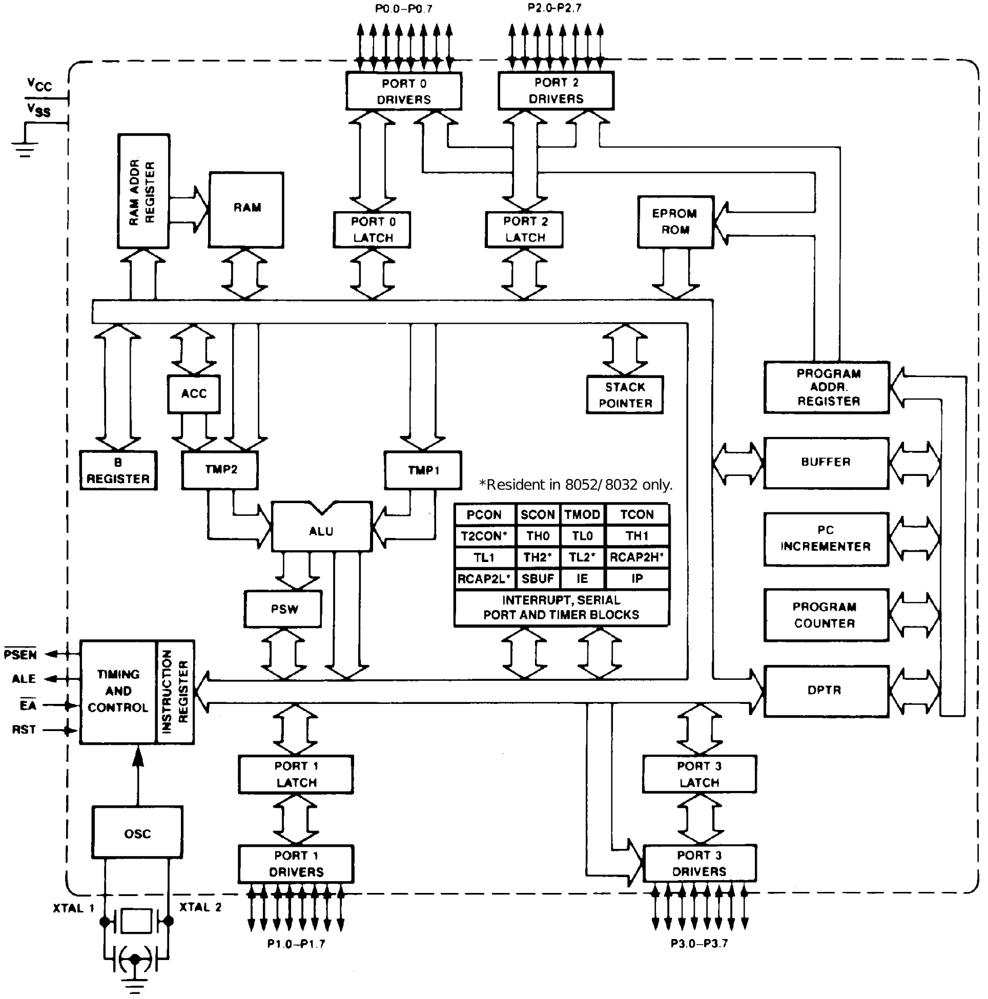
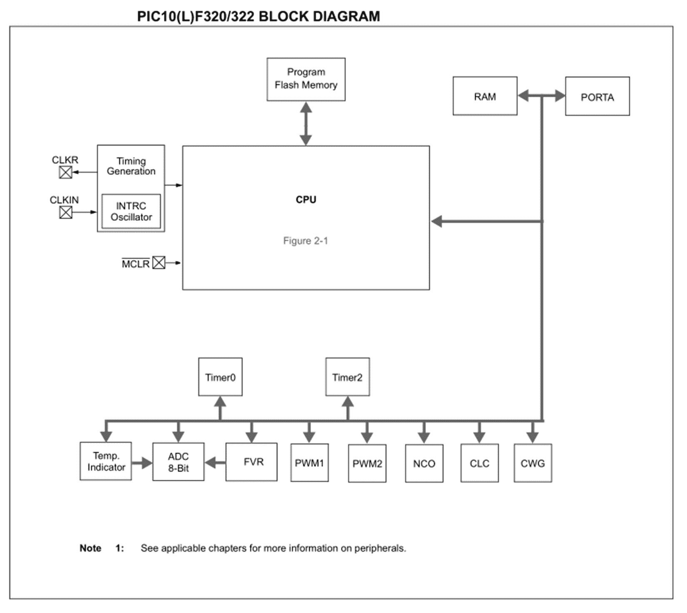
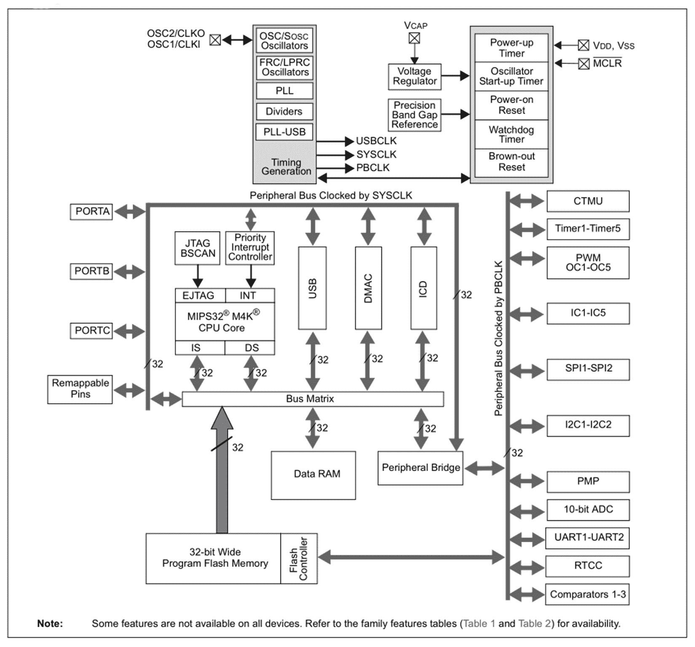
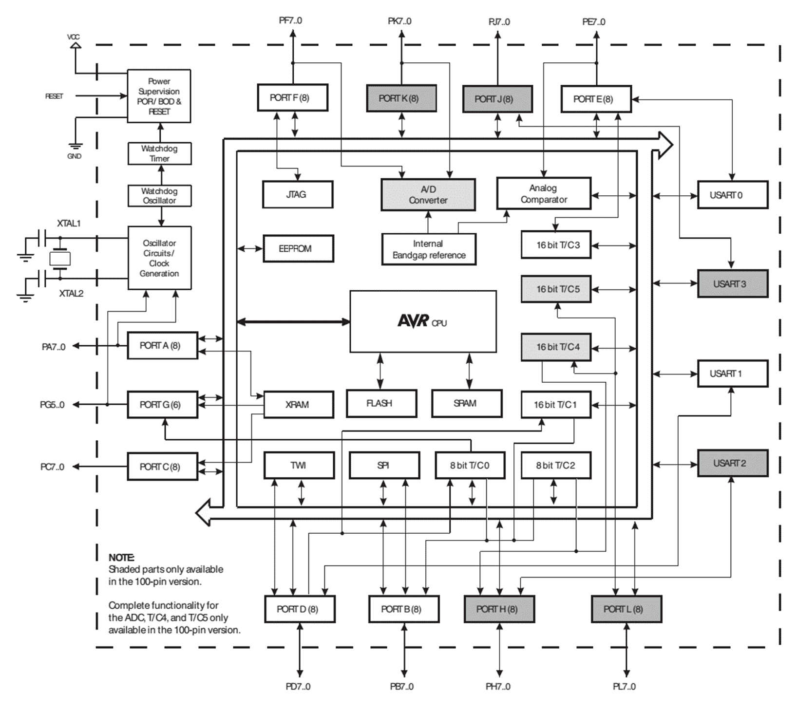

# 什么是嵌入式系统？

本质上，一个*嵌入式系统*的*嵌入式*部分是指被嵌入到一个更大的系统中的状态。已经嵌入的系统是某种描述的计算机系统，它在整个系统中具有一个或多个非常特定的功能，而不是通用的组件。这种较大的系统本质上可以是数字的、机械的或模拟的，而附加的集成数字电路与来自和到接口、传感器和存储器的数据紧密交互，以实现实际的系统功能。

在本章中，我们将介绍以下主题:

*   不同类别的嵌入式平台
*   每个类别的示例
*   每个类别的发展挑战

# 嵌入式系统的许多面孔

当今设备中的每个计算机化功能都是使用一个或多个微处理器实现的，这意味着通常包含在单个**集成电路** (**IC**) 中的计算机处理器 (中央处理器或 CPU)。微处理器至少包括**算术逻辑单元** (**ALU**) 和控制电路，但逻辑上还包括寄存器，以及**输入/输出** (**I/O**) 组，除了通常针对特定产品类别 (可穿戴设备，低功耗传感器，混合信号，...) 或市场 (消费者，医疗，汽车，...) 量身定制的更高级功能。

在历史的这一点上，几乎所有的微处理器都可以在嵌入式系统中找到。即使人们可能拥有计算机，笔记本电脑和智能手机，甚至可能拥有平板电脑，但给定家庭中嵌入式微处理器的数量却远远落后于通用微处理器的数量。

即使在笔记本电脑或 PC 中，除了其通用 CPU 之外，还有许多嵌入式微处理器。这些微处理器具有处理键盘或鼠标输入，处理触摸屏输入，将数据流转换为以太网包或创建视频或音频输出等任务。

在较旧的系统 (例如 Commodore 64) 中，可以看到具有 cpuic，声音 IC，视频 IC 等的相同模式。尽管 CPU 运行应用程序开发人员编写的任何代码，但系统中的其他芯片具有非常特定的用途，甚至是用于软盘或硬盘驱动器的控制器 IC。

在通用计算机之外，我们发现嵌入式微处理器无处不在，通常以进一步集成的 mcu 的形式出现。除了更高级别的功能和传感器信息的处理外，它们还控制厨房设备，洗衣机和我们汽车的发动机。

虽然第一个微波是模拟设备，使用机械计时器和可变电阻器来设置功率水平和持续时间，但今天的微波至少包含一个微控制器，该微控制器负责处理用户输入，驱动某种类型的显示器并配置微波的系统。根据所选配置的复杂性，显示器本身可以具有自己的微控制器。

也许更令人兴奋的是，嵌入式系统还提供监控、自动化和故障安全功能，使飞机保持飞行，确保导弹和太空火箭按预期运行，并在医学和机器人等领域实现不断增长的可能性。飞机的航空电子设备不断监视来自众多传感器的无数参数，在其三重冗余配置上运行相同的代码以检测任何可能的故障。

微小而强大的微处理器能够快速分析化学物质和 DNA 或 RNA 链，而这些链以前会占用设备。随着技术的进步，嵌入式系统已经变得足够小，可以通过人体发送以监视其健康状况。

在地球之外，火星、月球和小行星上的太空探测器和漫游者每天都在履行无数的职责，同样是在经过良好测试的嵌入式系统的礼貌下。由于以阿波罗制导计算机的形式出现了嵌入式系统的第一个主要示例，因此登月任务本身得以实现。这个 1966 时代的嵌入式系统由充满三输入 NOR 逻辑门的线绕板组成，其目的是处理导航，制导和控制土星 V 火箭发射的指令舱和登月舱的明确目的。

嵌入式系统的无处不在和多功能性使其成为现代生活中不可分割的一部分。

对于嵌入式系统，通常将它们区分为以下类别:

*   Ingt0gt0gg'Microcontrollers inglditititsblditgecrpdgt lb0itsblgggt (bctbtpdittbtbtbtbtbtbt0gldgggt)
*   **片上系统** (**SoC**)，常作为**单板计算机** (**SBC**)

# 微控制器

嵌入式系统领域创新的驱动因素之一是成本，因为它们通常是大批量，廉价的消费品。为此，它有助于将整个微处理器、存储器、存储和输入/输出外围设备放在一个芯片上，简化了实施工作，减少了 PCB 的空间，所有这些都具有更快、更简单的设计和生产更高的额外好处。这导致了在 20 世纪 70 年代期间开发了**微控制器** (**MCUs**): 可以以最小的成本添加到新设计中的单片机系统。

随着 20 世纪 90 年代初中 mcu 引入**电可擦可编程只读存储器** (**EEPROM**)，首先，可以反复重写 MCU 的程序内存，而不必通过 MCU 包装中的特殊石英窗口使用紫外线擦除内存内容。这使得原型制作更加容易，成本进一步降低，就开发和小批量生产而言，电路编程更加容易。

因此，许多以前由复杂的机械和模拟机构 (如电梯和温度控制器) 控制的系统现在包含一个或多个 mcu，其处理相同的功能，同时降低成本并提高可靠性。通过在软件中处理功能，开发人员还可以自由添加高级功能，例如复杂的预设程序 (用于洗衣机，微波炉等) 以及简单到复杂的显示器，以向用户提供反馈。

# TMS 1000

第一个商用 MCU 是德州仪器的 TMS 1000，这是一个通用的 4 位单芯片系统。它最初是 1974 年出售的。原始模型具有 1 KB 的 ROM，64x4 位的 RAM 和 23 个 I/O 引脚。它们可以以 100 至 400 KHz 的速度计时，每个指令在六个时钟周期中执行。

后来的型号将增加 ROM 和 RAM 的大小，尽管基本设计在停止生产 1981 年之前基本保持不变:

MCU 芯片的尺寸约为 5x5 毫米，足够小以适合 DIP 封装。这种类型的 MCU 使用掩模可编程 ROM，这意味着您无法获得空白的 TMS 1000 芯片并对其进行编程。相反，您必须将调试的程序发送到德州仪器 (ti)，以使用光刻掩模对其进行物理生产，从而为每个位产生一个金属桥。

作为一个相当原始的设计 (相对于后来的 mcu)，它缺乏堆栈和中断，有一组 43 指令和两个通用寄存器，使其与英特尔 4004 CPU 非常相似。一些型号有特殊的外围设备，用于驱动**真空荧光显示器** (**VFD**)，并用于连续读取输入，以通过键盘处理用户输入，而不会中断主程序。它的基本引脚排列如下:

显然，引脚功能早于我们今天知道的**通用输入/输出** (**GPIO**) 引脚-**K**引脚只能用于输入，输出引脚表示为**O**，控制引脚表示为**R**。**OSC**引脚将连接到外部振荡器电路。与离散逻辑 ic 非常相似，**Init**引脚用于在上电时初始化芯片，并且必须保持高电平至少六个周期，而最近的 mcu 集成了上电复位 (POR) 和复位引脚，最多需要一个分立的电阻器和电容器。

根据最初的德州仪器 (Texas Instruments) 新闻稿 1974 年，如果您大量购买这些微控制器*，只需 3 美元或更少。它们将用于流行的玩具，例如 Speak 和 Spell，但也几乎可以用于其他任何地方，包括家用电器，汽车和科学设备。到 20 世纪 80 年代初停止生产时，已经售出了数百万美元。*

 *同样有趣的是，虽然一次性可编程低成本微控制器的价格下降了很多，但产品类别却坚持不懈-例如，Padauk PMS150C 现在可以以 0.03 美元的价格购买，同时提供 8 位架构，它的 1k 字 ROM 和 64 字节 RAM 听起来很熟悉。

# 英特尔 MCS-48

英特尔对德州仪器成功的 TMS 1000 MCU 的回应是 MCS-48 系列，8048，8035 和 8748 是 1976 年发布的首批型号。该 8048 具有 1 KB 的 ROM 和 64 字节的 RAM。它是一个 8 位设计，采用哈佛架构 (分割代码/数据存储器)，引入了 8 位的本机字大小和中断支持 (两个单级)，并与 8080/8085 外设兼容，使其成为高度通用的 MCU。如今，较宽的 ALU 和寄存器字大小的优势仍然可以感知到，例如，在 8 位 MCU 上顺序执行 32 位加法，作为一系列带进位的 8 位加法。

该 MCS-48 具有超过 96 条指令的功能，其中大多数指令的长度为单个字节，并且允许除了内部存储器之外还添加外部存储器。在社区的努力中，有关 MCS-48 家庭的可用信息已在[https://devsaurus.github.io/mcs-48/mcs-48.pdf](https://devsaurus.github.io/mcs-48/mcs-48.pdf)中汇编并发布。

在这里，我们考虑 MCS-48 功能框图的简单性，并将其与后继者进行如下比较:

即使对于 TMS 1000 后仅几年引入的设计，MCU 设计的快速发展也是显而易见的。由于 MCU 设计与当时流行的 CPU 设计一起发展，包括 6502，其 16 位版本以及最终将成为 M68K 处理器系列的产品，因此有许多相似之处。

由于其灵活的设计，它一直流行并投入生产，直到 20 世纪 90 年代，直到 MCS-51 (8051) 系列逐渐取代它。有关 8051 的更多详细信息，请参见下一节。

该 MCS-48 在最初的 IBM PC 的键盘中用作其控制器。它还与 80286 和 80386 一起使用，以在前者的情况下执行 A20 线门控和复位功能。后来的 pc 会将这些功能集成到超级 I/O 设备中。

该 MCS-48 的其他显着用途包括 Magnavox Odyssey 视频游戏机以及一系列 Korg 和 Roland 模拟合成器。虽然 MCS-48 系列可以选择屏蔽 ROM (最多 2 KB)，但 87P50 使用外部 ROM 模块进行编程，而 8748 和 8749 具有高达 2 KB 的 EPROM，这允许 MCU 的内部编程被重复更改。

与独立的 EPROM 模块一样，这需要封装包含一个融合的石英窗口，该窗口允许紫外光到达 MCU 芯片，如以下带有 EPROM 的 8749 MCU 的照片 (由 Konstantin Lanzet，CC by-SA 3.0):

EPROM 单元中存储的将位定义为写入位的电荷在强紫外线照射下 20-30 分钟内消散。在几周的时间里，在阳光直射的情况下也可以实现同样的目标。擦除周期通常意味着移除封装并将其放入光紧擦除设备中。在此之后，EPROM 可以重新编程。EPROM 的指定数据保留在 85 °C 下约为 10-20 年，并且由于降解随温度呈指数加速，因此在室温下 100 年或更长时间的陈述并不罕见 (27C512A: 200 年)。

由于创建石英窗口并将其集成到封装中的费用，一次性可编程的 EPROM 被使用了一段时间，这允许对 EPROM 进行简单的编程，但将编程的裸片安装在不透明的封装中，因此无法再重新编程。最终，EEPROMs 在 20 世纪 80 年代初中可用，几乎完全取代了 EPROMs。Eeprom 在保留存储数据时开始出现问题之前，可以重写大约一百万次。它们的数据保留性能与 EPROMs 相似。

# 英特尔 MCS-51

从 Cypress CY7C68013A (USB 外围控制器) 到 Ti CC2541 (蓝牙 SoC) 的最新芯片具有商品 8051 内核，这表明英特尔 MCS-51 系列设计至今仍很受欢迎。尽管英特尔在 2007 年 3 月份停止生产这一系列 mcu，但其他制造商也有大量衍生的 mcu。它最初是在 20 世纪 80 年代中引入的，它是像 8048 一样的 8 位 MCU，但在其功能集上进行了大量扩展。

英特尔 80xxAH 数据表中描述的功能框图如下所示:

它与今天仍在生产的 Atmel (现为微芯片) AT89S51 非常相似。

数据表通常在*功能*列表中处理大小和性能指标，如下 AT89S51 所示:

*   4k 字节的**系统内可编程** (**ISP**) 闪存
    -耐久性: 10,000 写入/擦除周期 (为 EEPROM 1,000,000)
*   4.0 V 至 5.5 V 工作范围
*   全静态操作: 0Hz 至 444 MHz (为 12 MHz)
*   三级程序记忆锁
*   128x8 位内部 RAM
*   32 条可编程输入/输出线路

但随后该列表还包含现代核心，外围设备，低功耗和可用性功能:

*   两个 16 位定时器/计数器
*   六个中断源
*   全双工 UART 串行通道
*   低功耗空闲和断电模式
*   中断从断电模式恢复
*   看门狗计时器
*   双数据指针
*   断电标志
*   快速编程时间
*   灵活的 ISP 编程，字节和页面模式

在过去的几十年中，8051 架构的唯一重大变化涉及从原始的**n 型金属氧化物半导体** (**NMOS**) 晶体管技术迁移到**互补 MOS** (**CMOS**) -通常表示为 80C51-最近增加了 USB，i2C，和 SPI 接口，以及自本世纪初以来无处不在的高级电源管理和调试接口。Atmel 应用程序注释 3487A 并未对字母 S 给出简洁的解释，但是可能会因此突出显示当时的新在线串行编程 (ISP)。

AT89S51 的引脚排列图记录了 SPI 引脚 (MOSI，MISO，SCK):

除了独立的 MCU 之外，8051 内核还集成到较大的系统中，在该系统中，低功耗，基本 MCU 专用于各种，低速，实时或高 I/O 计数任务。从 Ti CC2541 (蓝牙低功耗 SoC) 到赛普拉斯 CY7C68013A (FX2LP) 等广泛的芯片™USB 外围控制器) 强调了 8051 架构到今天的实用性和相关性。

在**现场可编程门阵列** (**FPGA**) 或**专用集成电路** (**ASIC**) 开发中，8051 型处理器也普遍部署为软核，在那里，它们被改编并添加到 VHDL 和 Verilog HDL 项目中，以处理更适合顺序执行的任务，而不需要紧张的时间或大带宽。最后但并非最不重要的一点是，软内核的魅力在于能够使用功能齐全的开发和调试工具，同时保持与其余硬件设计的紧密集成。仅由软核运行的几百字节程序代码的等效项很可能是大型状态机，内存，计数器和类似 ALU 的逻辑，所有这些都提出了一个问题，即哪个实现更易于验证和维护。

# 图片

Mcu 的 PIC 家族最初是由 General Instrument 1976 年引入的，使用了新的 CP1600 16 位 CPU。该 CPU 几乎与指令集的 PDP-11 系列处理器兼容。

1987 年，通用仪器公司剥离了其微电子部门，创建了 Microchip Technology，该公司成为一家独立的公司 1989 年。微芯片技术至今产生新的 PIC 设计。随着 PIC 内核和外围设备的发展，片上存储器技术的发展导致引入了用于导通时间可编程的光密封封装 EPROM，以及随后的用于电路内重新编程功能的 EEPROM。像大多数 mcu 一样，PIC mcu 具有哈佛架构。如今，PIC 设计的范围从 8 位到 32 位，具有广泛的功能。这些是 PIC 家族作为写这本书的时间:

| **家庭** | **pins** | **记忆** | **详情** |
| PIC10 | 6-8 | 384-896 字节 ROM，64-512 字节 RAM
 | 8 位，8-16 MHz，修改哈佛 |
| PIC12 | 8 | 2-16 KB ROM，256 字节 RAM | 8 位，16 MHz，修改哈佛 |
| PIC16 | 8-64 | 3.5-56 KB ROM，1-4 KB RAM
 | 8 位修改哈佛 |
| PIC17 | 40-68 | 4-16 KB ROM，232-454 字节 RAM | 尽管存在第三方克隆，但 PIC18 取代了 8 位 444 MHz。 |
| PIC18 | 28-100 | 16-128 KB ROM，3,728-4,096 字节 RAM
 | 8 位修改哈佛 |
| PIC24 (dsPIC) | 14-144 | 64-1,024kb 只读存储器，8-16 KB 内存 | 16 位元，DsPIC (dsPIC33) mcu 内置了数字信号处理 (DSP) 外设。 |
| PIC32MX | 64-100 | 32-512 KB ROM，8-32 KB RAM | 具有 MIPS16e 模式的 32 位，200 MHz MIPS M4K，2007 年发布。 |
| PIC32MZ ECPIC32MZ EFPIC32MZ DA | 64-288 | 512-2,048 KB ROM，256-640 KB 静态 RAM (32 MB DDR2 DRAM) | 具有图形核心的 32 位 MIPS ISA (2013)，PIC32MZ DA 版本 (2017)。核心速度为 200 MHz (EC，DA) 和 252 MHz (EF)。 |
| PIC32MM 毫米 | 20-64 | 16-256 KB RAM，4-32 KB RAM | 32 位微 mips，25 MHz，针对低成本和低功耗进行了优化。 |
| PIC32MK | 64-100 | 512-1,024 KB ROM，128-256 KB RAM | 32 位，120 MHz，MIPS ISA，2017 年引入变体。针对工业控制和其他形式的深度集成应用。 |

PIC32 系列很有趣，因为它们基于 MIPS 处理器核心，并使用此**指令集架构** (**ISA**)，而不是所有其他 PIC mcu 使用的 PIC ISA。他们共享的处理器核心设计是 M4K，这是来自 MIPS 技术的 32 位 MIPS32 核心。在这些族之间，从各自的数据表中查看框图时，很容易发现差异。

微控制器 PIC 系列几十年的发展也许最好以功能框图的形式变得有形，所以我们从 PIC10 开始:

这些是非常小的 mcu，几乎没有任何围绕处理器内核的外围设备在这里没有更紧密地定义-引用的表只提到内存布局。I/O 端口非常小，我们今天知道的 I2C 和 UART 接口不是作为外围逻辑实现的。为了选择下一个控制器的示例，PIC16F84 数据表在处理器架构方面非常详细，并显示了更多的上电和复位电路已添加，同时还扩展了 GPIO 并添加了 EEPROM，以实现易于集成的非易失性存储。仍然没有独立的串行外围设备。

接下来，我们将看一下 PIC18:

PIC18 系列是最新的 8 位 PIC 架构，mcu 涵盖了广泛的应用。与 PIC10，PIC12 和 PIC16 系列相比，它具有更多的 I/O 选项，同时还提供了 ROM 和 RAM 方面的更多选项，并且现在为 USART 提供了用于 4 线 SPI 的同步串行端口。还要注意，端口现在具有备用引脚功能，并且为简单起见，未显示从外围设备到引脚的路由以及相应的配置寄存器。

接下来，让我们观察 PIC24 功能框图中从核心到端口和外围功能的焦点转移:

该图与 PIC10 的图相似，CPU 相对于 MCU 的其余部分抽象为单个块。每个`PORT`块都是一组 I/O 引脚，我们的空间不足，无法显示所有可能的引脚功能。

每个 I/O 引脚可以具有固定功能 (与外围模块链接)，也可以具有可分配的功能 (硬件级重路由，或在软件中完成)。通常，MCU 越复杂，I/O 引脚就越有可能是通用的而不是固定功能。

最后，我们看一下 PIC32:

此框图适用于 PIC32MX1XX/2XX 系列中的 PIC32MX 设备。它通常以 50 MHz 的频率计时。

PIC32 体系结构的一个有趣的特性是，它通过使程序指令和数据在系统总线矩阵上传播，有效地将哈佛体系结构 M4K MIPS CPU 转变为更类似于 John von Neumann 的体系结构。请注意，PIC10 图中专用于单个处理器寄存器的空间现在随便描绘了一个复杂的数字或混合信号外设，或者强大的 JTAG 电路内编程和调试接口。

# AVR

AVR 架构是由挪威理工学院的两名学生开发的，原始的 AVR MCU 是在 Nordic VLSI (现为 Nordic Semiconductor) 开发的。它最初被称为 μ risc，可以在该技术出售给 Atmel 之前获得许可。第一款 Atmel AVR MCU 1997 年发布。

今天，我们可以回顾大量的 8 位 AVR 家族:

| **家庭** | **pins** | **记忆** | **详情** |
| ATtiny | 6-32 | 0.5-16KB ROM
0-2 KB RAM | 1.6-20 MHz。紧凑、节能的 mcu，外围设备有限。 |
| ATmega | 32-100 | 4-256 KB ROM
0.5-32 KB RAM |  |
| ATxmega | 44-100 | 16-384 KB ROM，
1-32 KB RAM | 32 MHz，最大的 AVR mcu，具有广泛的外围设备和性能增强功能，例如 DMA。 |

过去也有 32 位 AVR32 架构，但它被 Atmel 弃用，因为它改为 ARM 32 位架构 (SAM)。有关 SAM 的详细信息，请参见*基于 ARM 的 MCU*部分。更多详细信息见相应的[产品选型指南](http://ww1.microchip.com/downloads/en/DeviceDoc/Atmel-45154-Product-Selection-Guide_Brochure.pdf)。

此外，Atmel 曾经有所谓的**现场可编程系统级集成电路** (**FPSLIC**) mcu: 混合 AVR/FPGA 系统。这些基本上允许您将自己的外围设备和功能添加到 AVR MCU 的硬件中。

让我们看看阿蒂尼家族。这是 mcu 的 ATtiny212/412 系列的框图:

这一系列的 ATtiny mcu 可以运行高达 20 MHz，具有高达 4 KB 的闪存 ROM 和 256 字节的 SRAM，以及高达 128 字节的 EEPROM，所有这些都在 8 针封装中。尽管体积很小，但它具有大量的外围设备，可以将其路由到任何受支持的引脚:

与流行的 ATmega2560 和相关的 mcu 形成对比，它们具有以下特性:

| **设备** | **flash (kb)** | **EEPROM (KB)** | **RAM (KB)** | **通用 I/O 引脚** | **16 位 PWM 通道** | **UART** | **ADC 通道** |
| ATmega640 | 64 | 4 | 8 | 86 | 12 | 4 | 16 |
| ATmega1280 | 128 | 4 | 8 | 86 | 12 | 4 | 16 |
| ATmega1281 | 128 | 4 | 8 | 54 | 6 | 2 | 8 |
| ATmega2560 | 256 | 4 | 8 | 86 | 12 | 4 | 16 |
| ATmega2561 | 256 | 4 | 8 | 54 | 6 | 2 | 8 |

随着 GPIO 引脚数十个，框图相应地更加复杂，I/O 引脚的端口块更多:

在这里，所有传入和传出箭头都表示单个引脚或引脚块，其中大多数是通用的。由于引脚数量众多，因此对物理芯片使用内联封装格式 (DIP，SOIC 等) 已不再实用。

对于 ATmega640、1280 和 2560，使用 100 引脚 TQFP 封装，此处的每个引脚的功能如数据表所示:

ATxmega 系列与 ATmega 非常相似，具有相似的引脚排列，主要使用架构更改和优化，更多的 ROM 和 RAM 以及外围设备选项来区分自己。

是否选择 ATtiny，ATmega 或 ATxmega MCU 首先取决于您对项目的要求，特别是所需的输入和输出，外围设备的类型 (串行，SPI，I2C，CAN 等)，以及运行此代码所需的代码和 RAM 的大小。

# M68k 和 Z80-based

Zilog Z80 8 位处理器是与 Intel 8080 兼容的处理器，在 20 世纪 80 年代期间与其他微处理器竞争，为家用计算机和游戏系统 (包括 Nintendo Game Boy，Sega Master System，Sinclair ZX80/ZX81/Spectrum，MSX 和 Tandy TRS-80。

Zilog 推出了基于 Z80 微处理器 1994 年的 MCU (Z380)，多年来进行了各种更新，包括 Z8，eZ80 等。Z80 克隆也相当普遍。

另一个流行的 20 世纪 80 年代时代的微处理器是摩托罗拉 68k (或 68000)。它的 ALU 和外部数据总线为 16 位，但具有 32 位寄存器和 32 位内部数据总线。1979 年推出后，其架构至今仍在使用，飞思卡尔半导体 (现为恩智浦) 生产了许多 68k 微处理器。

摩托罗拉推出了许多基于 68k 架构的 mcu，包括 MC68320 通信控制器 1989 年。当前基于 68k 的 MCU 设计包括 ColdFire，这是一个完全 32 位的设计。

# ARM Cortex-M

32 位 MCU 的一种非常常见的类型是 ARM Cortex-M 系列。它包括 M0，M0，M1，M3，M4，M7，M23 和 M33，其中许多具有**浮点单元** (**FPU**) 选项，以提高浮点性能。

它们不仅用作独立的 mcu，还通常集成到**片上系统** (**SoC**) 设备中，以提供特定的功能，例如触摸屏，传感器或电源管理功能。由于 Arm Holdings 自己不制造任何 mcu，因此许多第三方制造商已对设计进行了许可，有时会进行自己的修改和改进。

以下是这些 mcu 的简要概述:

| **核心** | **公布** | **架构** | **instruction set** |
| M0 | 2009 | Armv6-M | 拇指-1，一些拇指-2。 |
| M0 | 2012 | Armv6-M | 拇指-1，一些拇指-2。 |
| M1 | 2007 | Armv6-M | 拇指-1，一些拇指-2。 |
| M3 | 2004 | Armv7-M | Thumb-1, Thumb-2. |
| M4 | 2010 | Armv7-M | 拇指 1，拇指 2，可选 FPU。 |
| M7 | 2014 | Armv7E-M | Thumb-1，Thumb-2，可选 FPU。 |
| M23 | 2016 | Armv8-M | 拇指-1，一些拇指-2。 |
| M33 | 2016 | Armv8-M | 拇指 1，拇指-2，可选 FPU。 |

**Thumb**指令集是紧凑的，16 位长度的指令，使其非常适合嵌入式，资源受限的系统。其他 ARM 微处理器家族除了 32 位指令集外，也可以支持这个 Thumb 指令集。

# H8 (SuperH)

H8 系列 mcu 通常用于 8 位，16 位和 32 位变体。最初是由日立公司在 20 世纪 90 年代初中创建的，直到几年前，瑞萨科技仍在创造新设计，尽管后者建议新设计使用 RX (32 位) 或 RL78 (16 位) 系列。H8 MCU 的一个显著用途是在 Lego Mindstorms RCX 控制器中，它使用 H8/300 MCU。

# ESP8266/ESP32

ESP 系列是由 Espressif 系统生产的 32 位 mcu，具有集成的 wi-fi (两者) 和蓝牙 (ESP32) 功能。

ESP8266 首次出现在 2014 年，当时它是由第三方制造商 Ai-Thinker 以模块 (ESP-01) 的形式出售的，该模块可以由另一个 MCU 或基于微处理器的系统使用以提供 wi-fi 功能。ESP-01 模块包含用于此目的的固件，这允许使用 Hayes 风格的调制解调器命令对模块进行寻址。

其系统规格如下:

*   Tensilica Xtensa Diamond Standard L106 microprocessor (32-bit)
*   80-160 MHz CPU 速度
*   用户应用程序可用的 RAM 少于 50 KB (已加载 wi-fi 堆栈)
*   外部 SPI ROM (512 KB 至 16 MB)
*   Wi-fi 支持 802.11 b/g/n

由于发现 ESP-01 模块上的 32 位 MCU 的能力远远超过分配给它的简单调制解调器任务，因此它很快就被用于更通用的任务，并具有一系列升级的 ESP8266 模块 (具有集成的 EEPROM 芯片) 以及分线板。在后者中，NodeMCU 风格的板已经变得非常流行，尽管许多其他第三方制造商已经制造了自己的突破性板，这些板提供了不同的外形尺寸和功能。

ESP8266EX 的基本框图如下所示:

在 ESP8266 取得巨大成功之后，Espressif Systems 开发了 ESP32，该设备使用了升级的双核 CPU 以及其他更改。它的框图看起来像这样:

其规格如下:

*   Xtensa 32-bit LX6 (dual-core) microprocessor
*   160-240 MHz CPU 速度
*   520 KB 的 SRAM
*   Wi-fi 支持 802.11 b/g/n
*   蓝牙 4.2 版和 BLE (低能耗)

ESP8266 和 ESP32 通常作为完整模块出售，MCU，外部 ROM 模块和 wi-fi 天线集成在板上或带有外部天线选项:

金属屏蔽可以覆盖电路板有助于保护电路板免受电磁干扰，有利于其 wi-fi (和蓝牙，在 ESP32 的情况下) 收发器，但整个设计需要固定天线和几何形状的 FCC 认证和以后用作批准的模块。连接增益较高的外部天线可能会违反当地法规。它附带的 FCC ID 有助于获得包含此类模块的产品批准用于商业化。

# 其他

除了先前列出的 mcu 之外，还有许多具有不同架构的制造商提供的各种 mcu。有些，例如 Parallax 的 Propeller MCU 及其多核体系结构，是相当独特的，而大多数只是通过许多外围设备，RAM 以及内部或外部 ROM 来实现通常的单核 CPU 体系结构。

除了物理芯片之外，Altera (现为 Intel)，Lattice Semiconductor 和 Xilinx 还提供所谓的软内核，这些软内核是 mcu，旨在作为独立组件或作为 FPGA 上更大设计的一部分在 FPGA 上运行。这些也可以被 C/C++ 编译器瞄准。

# 挑战

Mcu 的主要开发挑战在于可用资源相对有限。尤其是对于小的、低引脚数的 mcu，您必须很好地了解一段特定代码占用了多少资源 (CPU 周期、RAM 和 ROM)，以及添加特定功能是否现实。

这也意味着为特定项目选择合适的 MCU 需要技术知识和经验。前者需要选择适合任务的 MCU; 后者对于最佳 MCU 非常有帮助，并有助于缩短做出选择所需的时间。

# 片上系统/单板计算机

**片上系统** (**SoCs**) 与 mcu 相似，但通过具有一定程度的集成而与那些类型的嵌入式系统区分开来，同时仍然需要许多外部组件才能起作用。它们通常是单板实现的一部分 (**单板计算机** (**SBC** ))，包括 PC/104 标准，以及最近的形式因素，如树莓派和衍生板:

该图使用自[https://xdevs.com/article/ rpi3_oc/](https://xdevs.com/article/rpi3_oc/) 。它清楚地显示了 SBC (在本例中为 Raspberry Pi 3) 的布局。BCM2837 是基于 ARM 的 SoC，提供 CPU 内核和基本外围设备 (主要分为标头部分)。所有 RAM 都位于外部模块中，以太网和 wi-fi 外围设备也是如此。ROM 以 SD (Flash) 卡的形式提供，该卡还提供存储。

尽管 MIPS 也很常见，但大多数 soc 都是基于 ARM 的 (Cortex-A 家族)。Sbc 通常用于工业环境。

其他实例是批量生产的板，例如用于智能手机的板，它们没有形成预定义的外形尺寸，但仍遵循具有 SoC 和外部 RAM、ROM 和存储器以及各种外围设备的相同模式。这与上一节的 mcu 相反，除了少数需要外部 ROM 的 mcu 之外，mcu 始终能够自行运行。

# 挑战

与 mcu 相比，soc 的开发挑战往往不那么严峻。其中一些是在水平上，有一个接口，你甚至可以直接在设备上开发，甚至在设备上进行编译周期，而不必在 PC 上进行交叉编译和复制二进制文件。这也有助于运行完整的操作系统，而不是为裸硬件开发。

明显的缺点是，随着功能的增加，复杂性也随之增加，由此带来的复杂性，例如必须处理用户帐户、设置权限、管理设备驱动程序等。

# 摘要

在本章中，我们深入了解了嵌入式系统的构成。我们学习了如何区分各种类型的嵌入式系统，以及如何确定为项目选择合适的 MCU 或 SoC 的基础知识。

在本章之后，读者应该可以通过 mcu 和 soc 的数据表来阅读，解释两者之间的差异，并确定给定项目所需的内容。

下一章将探讨为什么 C 是嵌入式系统编程的非常合适的选择。*