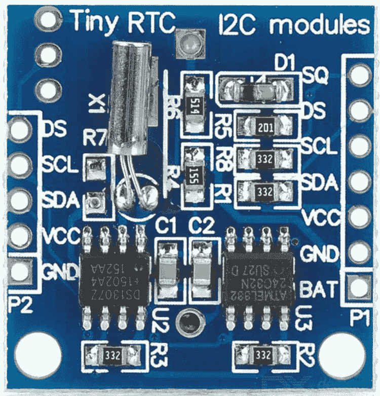
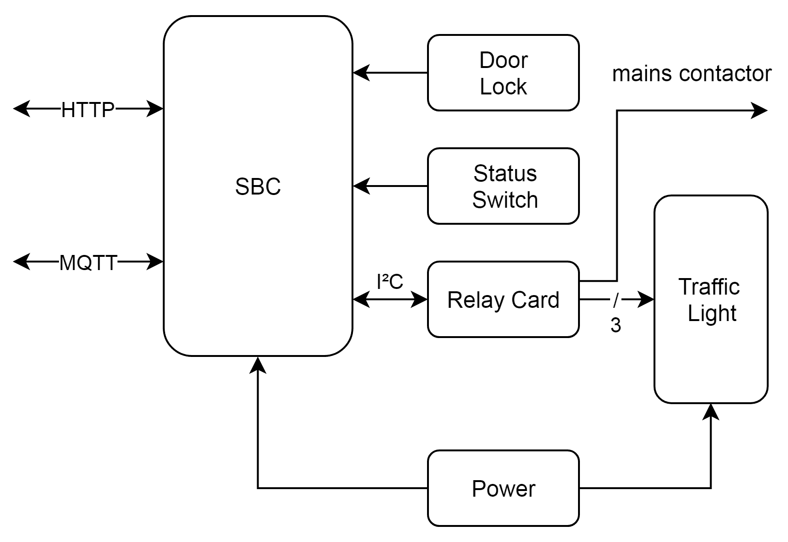
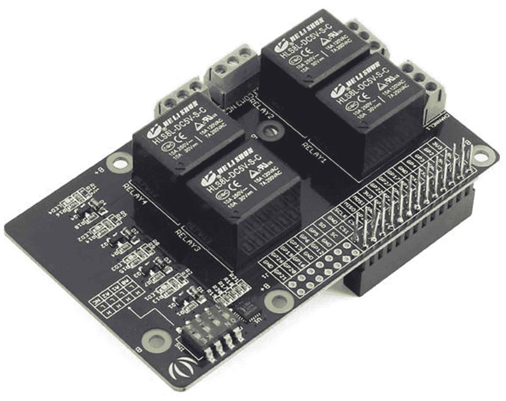
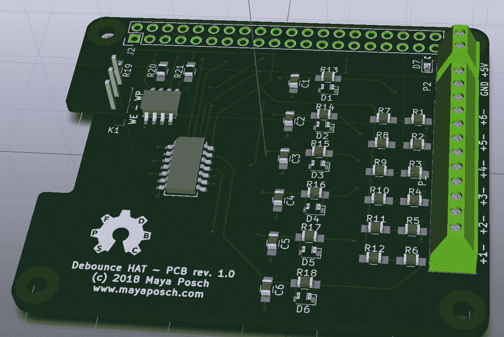
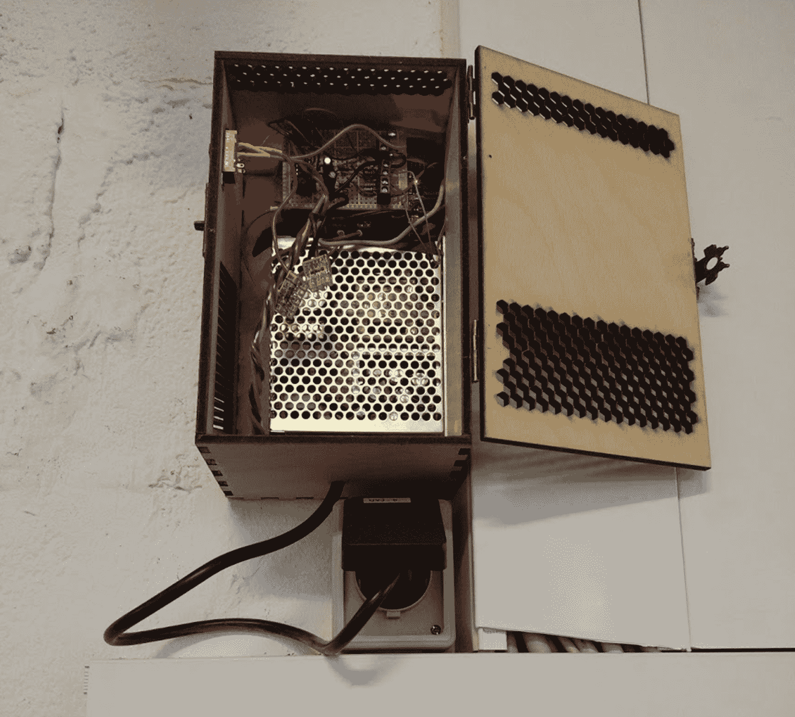
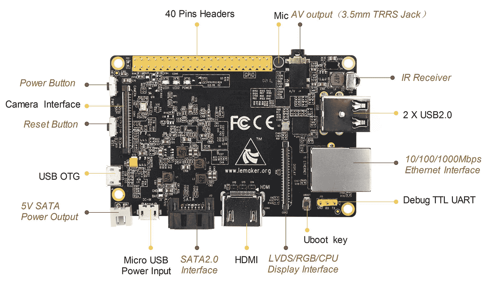

# 为嵌入式 Linux 和类似系统开发

如今，基于 SoC 的小型系统无处不在，从智能手机，视频游戏机和智能电视机到汽车和飞机上的信息娱乐系统。依赖于此类系统的消费类设备极为普遍。

除消费类设备外，它们还被发现是工业和建筑级控制器系统的一部分，在该系统中，它们监视设备，响应输入并执行整个传感器和执行器网络的计划任务。与 mcu 相比，soc 没有资源限制，通常运行完整的**操作系统** (**OS**)，例如 Linux 派生的 OS，VxWorks 或 QNX。

在本章中，我们将介绍以下主题:

*   如何开发基于 OS 的嵌入式系统的驱动程序
*   集成外围设备的方法
*   如何处理和实现实时性能要求
*   认识和处理资源限制

# 嵌入式操作系统

当您直接为系统的硬件编写应用时，通常将 OS 与嵌入式系统一起使用，这是不现实的建议。OS 向应用提供的是许多 api，这些 api 抽象掉了使用该硬件实现的硬件和功能，例如网络通信或视频输出。

这里的权衡是在便利性以及代码大小和复杂性之间进行的。

裸机实现理想地仅实现其所需的功能，而操作系统随附任务计划程序以及正在运行的应用可能不需要的功能。因此，重要的是要知道何时使用操作系统，而不是直接为硬件开发，了解两者所带来的复杂性。

使用操作系统的充分理由是，如果您必须能够同时运行不同的任务 (多任务或多线程)。从头开始实施自己的调度程序通常不值得付出努力。需要运行非固定数量的应用，并能够随意删除和添加它们，通过使用操作系统也变得非常容易。

最后，当您可以访问操作系统和易于访问的驱动程序以及与它们相关的 api 时，可以使诸如高级图形输出、图形加速 (例如 OpenGL) 、触摸屏和高级网络功能 (例如，SSH 和加密) 等功能更容易实现。

常用的嵌入式操作系统包括以下几种:

| **名称** | **供应商** | **许可证** | **平台** | **详情** |
| 拉斯宾 | 基于社区的 | 主要是 GPL，类似 | 手臂 (覆盆子皮) | 基于 Debian Linux 的操作系统 |
| 阿姆比亚人 | 基于社区的 | GPLv2 | 臂 (各种板) | 基于 Debian Linux 的操作系统 |
| 安卓 | 谷歌 | GPLv2，阿帕奇 | 手臂，x86，x86_64 | 基于 Linux 的 |
| VxWorks | 风河 (英特尔) | 专有 | ARM，x86，MIPS，PowerPC，SH-4 | RTOS，单片内核 |
| QNX | 黑莓 | 专有 | ARMv7、ARMv8、x86 | RTOS, microkernel |
| 视窗物联网 | 微软 | 专有 | 手臂，x86 | 以前称为 Windows Embedded |
| NetBSD | NetBSD 基金会 | 2-条款 BSD | ARM、68k、MIPS、PowerPC、SPARC、risc-v、x86 等 | 大多数基于 BSD 的便携式操作系统 |

所有这些操作系统的共同点是，它们处理基本功能，如内存和任务管理，同时使用编程接口 (api) 提供对硬件和操作系统功能的访问。

在本章中，我们将特别关注基于 SoC 和 SBC 的系统，这反映在前面的操作系统列表中。这些操作系统中的每一个都旨在在具有至少几兆字节 RAM 且存储空间从兆字节到千兆字节的系统上使用。

如果目标 SoC 或 SBC 尚未成为现有 Linux 发行版的目标，或者希望对系统进行大量定制，则可以使用 Yocto 项目中的工具 ([http://www.yoctoproject.org/](http://www.yoctoproject.org/) )。

基于 Linux 的嵌入式操作系统非常普遍，其中 Android 是一个众所周知的例子。它主要用于智能手机，平板电脑和类似设备，这些设备严重依赖图形用户交互，同时依赖于 Android 应用基础架构和相关 api。由于这种专业化水平，它不太适合其他用例。

Raspbian 基于非常常见的 Debian Linux 发行版，针对的基本上只是 sbc 的 Raspberry Pi 系列。Armbian 类似，但涵盖的 sbc 范围更广。这两个都是社区的努力。这类似于 Debian 项目，也可以直接用于嵌入式系统。Raspbian，Armbian 和其他类似项目的主要优点是它们提供了现成的图像以与目标 SBC 一起使用。

与基于 Linux 的操作系统一样，NetBSD 具有开源的优势，这意味着您可以完全访问源代码，并且可以大量自定义操作系统的任何方面，包括对自定义硬件的支持。NetBSD 和类似的基于 BSD 的操作系统的一大优势是，该操作系统是由单个代码库构建的，并由一组开发人员管理。这通常简化了嵌入式项目的开发和维护。

BSD 许可证 (三个或两个条款) 为商业项目提供了主要好处，因为此许可证仅要求一个提供归属，而不是要求制造商根据要求提供 OS 的完整源代码。如果对源代码进行某些修改，添加想要保持封闭源代码的代码模块，这可能非常相关。

例如，最近的 PlayStation 游戏机使用 FreeBSD 的修改版，从而使 Sony 可以对硬件及其用作游戏机的操作系统进行大量优化，而无需将此代码与其他操作系统的源代码一起发布。

还存在专有选项，例如 BlackBerry (QNX) 和 Microsoft (Windows IoT，以前是 Windows Embedded，以前是 Windows CE) 的产品。这些往往需要每个设备的许可费，并且需要制造商的协助才能进行任何定制。

# 实时 os

实时操作系统 (RTOS) 的基本要求是它可以保证任务将在一定的时间跨度内执行和完成。这允许人们将它们用于实时应用，在这些应用中，同一任务的一批执行时间之间的可变性 (抖动) 是不可接受的。

由此，我们可以得出硬和软实时操作系统之间的基本区别: 在低抖动的情况下，操作系统是硬实时的，因为它可以保证给定的任务将始终以几乎相同的延迟执行。在较高的抖动下，操作系统通常可以但不总是以相同的延迟执行任务。

在这两个类别中，我们可以再次区分事件驱动调度程序和分时调度程序。前者根据优先级 (优先级调度) 切换任务，而后者使用计时器定期切换任务。哪种设计更好取决于人们使用该系统的目的。

与事件驱动的调度程序相比，时间共享的主要内容是，由于它也为较低优先级的任务提供了更多的 CPU 时间，因此它可以使多任务系统看起来运行得更加流畅。

通常，仅当您的项目要求必须能够保证可以在严格定义的时间窗口内处理输入时，才会使用 RTOS。对于诸如机器人技术和工业应用之类的应用，至关重要的是每次都在完全相同的时间范围内执行动作，而未能做到这一点会导致生产线或劣质产品的中断。

对于我们将在本章后面介绍的示例项目，我们不使用 RTOS，而是使用常规的基于 Linux 的 OS，因为不存在硬时序要求。使用 RTOS 会带来不必要的负担，并可能增加复杂性和成本。

考虑 RTOS 的一种方法是直接为硬件 (裸机) 编程的实时性，而不必放弃使用成熟操作系统的所有便利。

# 自定义外围设备和驱动程序

外围设备被定义为向计算机系统添加 I/O 或其他功能的辅助设备。这可以是从 I2C、SPI 或 sd 卡控制器到音频或图形设备的任何东西。其中大多数是物理 SoC 的一部分，其他则是通过 SoC 向外界公开的接口添加的。外部外围设备的示例是 RAM (通过 RAM 控制器) 和**实时时钟** (**RTC**)。

当使用更便宜的 sbc (例如 Raspberry Pi，Orange Pi 和无数类似的系统) 时，可能会遇到的一个问题是，它们通常缺少 RTC，这意味着当它们关闭电源时，它们不再跟踪时间。这背后的想法通常是那些板卡无论如何都会连接到 internet，因此 OS 可以使用在线时间服务 (**网络时间协议**，或**NTP**) 来同步系统时间，从而节省板卡空间。

在没有 internet 连接可用的情况下，或者在线时间同步之前的延迟不可接受的情况下，或者任何其他原因，都可能最终使用 SBC。在这种情况下，可能需要将 RTC 外围设备添加到板上，并配置操作系统以使用它。

# 添加 RTC

人们可以廉价地将 RTCs 作为现成的模块，通常基于 DS1307 芯片。这是一个 5v 模块，通过 I2C 总线连接到 SBC (或 MCU):



这个图像是一个小的 DS1307-based RTC 模块。可以看到，它具有 RTC 芯片，晶体和 MCU。这些中的最后一个用于与主机系统通信，无论它是基于 SoC 还是基于 MCU 的板。所需要的只是提供所需的电压 (和电流) 的能力，RTC 模块与 I2C 总线一起运行。

将 RTC 模块连接到 SBC 板后，下一个目标是让操作系统也使用它。为此，我们必须确保已加载 I2C 内核模块，以便我们可以使用 I2C 设备。

Sbc 的 Linux 发行版 (例如 Raspbian 和 Armbian) 通常带有许多 RTC 模块的驱动程序。这使我们能够相对快速地设置 RTC 模块并将其与 OS 集成。对于我们前面看过的模块，我们需要 I2C 和 DS1307 内核模块。对于第一代 Raspberry Pi SBC 上的 Raspbian OS，这些模块将被称为`i2c-dev`、`2cbcm2708`和`rtc-ds1307`。

首先，您必须启用这些模块，以便在系统启动时加载它们。对于 Raspbian Linux，可以编辑`/etc/modules`文件，以及可用于该平台的其他配置工具。重新启动后，我们应该能够使用 I2C 扫描仪工具在 I2C 总线上检测 RTC 设备。

随着 RTC 设备的工作，我们可以删除 Raspbian 上的假 hwclock 包。这是一个伪造 RTC 的简单模块，但仅在系统关闭之前将当前时间存储在文件中，以便在下次启动时，由于从存储的日期和时间恢复，文件系统的日期和类似日期将是一致的，如果没有任何新文件，则会突然创建比现有文件更旧的。

相反，我们将使用 hwclock 实用程序，它将使用任何真实的 RTC 与之同步系统时间。这需要修改操作系统的启动方式，RTC 模块的位置以以下形式作为引导参数传递:

```cpp
rtc.i2c=ds1307,1,0x68
```

这将初始化 I2C 总线上的 RTC (`/dev/rtc0`) 设备，地址为 0x68。

# 自定义驱动程序

驱动程序 (内核模块) 与操作系统内核的确切格式和集成对于每个操作系统都不同，因此在这里不可能完全涵盖。然而，我们将看看我们之前使用的 RTC 模块的驱动程序是如何为 Linux 实现的。

此外，我们将在本章后面的 club room 监控示例中介绍如何从用户空间使用 I2C 外设。使用基于用户空间的驱动程序 (库) 通常是将其作为内核模块实现的一个很好的替代方案。

RTC 功能已集成到 linux 内核中，其代码在`/drivers/rtc`文件夹中找到 (在 GitHub 上，在[https://github.com/torvalds/linux/tree/master/drivers/rtc](https://github.com/torvalds/linux/tree/master/drivers/rtc))。

`rtc-ds1307.c`文件包含两个我们需要读取和设置 RTC 的函数，分别是: `ds1307_get_time()`和`ds1307_set_time()`。这些功能的基本功能与我们将在本章后面的 club room 监控示例中使用的功能非常相似，在该示例中，我们只是将 I2C 设备支持集成到我们的应用中。

从用户空间与 I2C，SPI 和其他此类外围设备进行通信的主要优势在于，我们不受 OS 内核支持的编译环境的限制。以 linux 内核为例，它大部分是用 C 编写的，带有一些汇编。它的 api 是 C 风格的 api，因此我们必须使用明显的 C 风格的编码方法来编写我们的内核模块。

显然，这将否定尝试在 C 中编写这些模块的大多数优点，更不用说重点了。当将我们的模块代码移动到用户空间并将其用作应用的一部分或共享库时，我们没有这样的限制，可以自由使用任何和所有 C 概念和功能。

为了完整起见，linux 内核模块的基本模板如下所示:

```cpp
#include <linux/module.h>       // Needed by all modules 
#include <linux/kernel.h>       // Needed for KERN_INFO 

int init_module() { 
        printk(KERN_INFO "Hello world.n"); 

        return 0; 
} 

void cleanup_module() { 
        printk(KERN_INFO "Goodbye world.n"); 
} 
```

这是必要的 Hello World 示例，用 C 风格编写。

在考虑基于内核和用户空间的驱动程序模块时，最后要考虑的是上下文切换。从效率的角度来看，内核模块更快，延迟更低，因为 CPU 不必从用户切换到内核空间上下文和返回重复与设备通信，并将消息从设备传递回与设备通信的代码。

对于高带宽设备 (例如存储和捕获)，这可能会使运行平稳的系统与严重滞后并难以执行其任务的系统有所不同。

但是，当考虑本章中的俱乐部室监控示例及其偶尔使用 I2C 设备时，应该很明显，内核模块将是严重的过度杀伤，而没有任何明显的好处。

# 资源限制

尽管 sbc 和 soc 往往相当强大，但它们仍然不能直接与现代桌面系统或服务器相提并论。它们在 RAM、存储大小和缺乏扩展选项方面有不同的限制。

由于 (永久安装的) RAM 数量变化很大，您必须考虑一个人希望在系统上运行的应用的内存需求，甚至在考虑相对缓慢的 CPU 性能之前。

由于 sbc 往往没有任何或大量的具有高耐久率的存储 (这意味着可以经常写入而无需考虑有限的写入周期)，因此它们通常没有交换空间并将所有内容保留在可用的 RAM 中。如果没有 swap 的回退，任何内存泄漏和过多的内存使用都会迅速导致系统无法正常运行或不断重新启动。

尽管 SBC 上的 CPU 性能多年来对于常用的模型已显着提高，但通常还是建议使用交叉编译器在快速桌面系统或服务器上为 SBC 生成代码。

有关开发问题和解决方案的更多内容将在[第 6 章](06.html)，*测试基于 OS 的应用*和[附录](12.html)，*最佳实践*中介绍。

# 示例-俱乐部房间监控

在本节中，我们将研究基于 SBC 的解决方案的实际实现，该解决方案为俱乐部会议室执行以下功能:

*   监控俱乐部门锁的状态
*   监控俱乐部状态开关
*   通过 MQTT 发送状态更改通知
*   为当前俱乐部状态提供 REST API
*   控制状态灯
*   控制俱乐部房间的电源

这里的基本用例是，我们有一个俱乐部房间，我们希望能够监控其锁的状态，并在俱乐部内部有一个开关来调节俱乐部中的非永久性电源插座是否通电。将俱乐部状态开关转到上的*将为这些插座供电。我们还希望通过 MQTT 发出通知，以便俱乐部房间或其他地方的其他设备可以更新其状态。*

MQTT 是一种简单的二进制发布/订阅协议，位于 TCP/IP 之上。它提供了轻量级的通信协议，适用于资源受限的应用，例如传感器网络。每个 MQTT 客户端与一个中心服务器通信: MQTT 代理。

# 硬件

`clubstatus`系统的框图如下所示:



对于 SBC 平台，我们使用 Raspberry Pi，可以使用 Raspberry Pi B 模型或 B 系列的较新成员，例如 Raspberry Pi 3 模型 B:


我们在 SBC 系统中寻找的主要功能是以太网连接，当然还有与 Raspberry Pi 兼容的**通用输入/输出** (**GPIO**) 头。

有了这个板，我们将在 μ sd 卡上使用标准的 Raspbian 操作系统安装。除此之外不需要特殊配置。选择 B 型号或类似型号的主要原因是它们具有标准的安装孔图案。

# 继电器

为了控制房间中的状态灯和非永久性电源插座，我们使用多个继电器，在本例中为四个继电器:

| 【T0 �� Relay 【T1 �� | **函数** |
| 0 | 非永久性插座的电源状态 |
| 1 | 绿色状态灯 |
| 2 | 黄色状态灯 |
| 3 | 红色状态灯 |

这里的想法是，电源状态继电器连接到一个开关，该开关控制电源到当俱乐部状态关闭时不供电的插座。状态指示灯指示当前俱乐部状态。下一节将详细介绍这一概念的实现。

为了简化设计，我们将使用包含四个继电器的现成继电器板，这些继电器由连接到 Raspberry Pi SBC 的 I2C 总线的 NXP PCAL9535A I/O 端口芯片 (GPIO 扩展器) 驱动:



这个特殊的板是 Seeed 工作室覆盆子皮中继板 1.0 版: [http://wiki.seeedstudio.com/覆盆子皮 _ 继电器 _ 板 1.0 版/](http://wiki.seeedstudio.com/Raspberry_Pi_Relay_Board_v1.0/)。它提供了我们需要的四个继电器，允许我们开关灯和开关高达 30 VDC (直流电) 或 250 VAC (交流电)。这允许人们连接几乎任何类型的照明和进一步的继电器和亲属。

与 SBC 的连接是通过使用其 GPIO 标头将中继板堆叠在 SBC 顶部来实现的，这使我们可以在中继板顶部添加更多的板。这使我们能够将去抖动功能添加到系统中，如接线图所示。

# 去抖动

去 bounce 板具有开关信号去 bouncing 的要求，并为 Raspberry Pi 板提供电源。机械开关去抖动背后的理论和原因是这些开关提供的信号不干净，这意味着它们不会立即从打开切换到关闭。在金属触点的弹性导致它们再次打开并在这两种状态之间快速移动之前，它们将短暂关闭 (进行接触)，然后最终稳定到其最终位置，如下图所示，连接到一个简单的开关:


此属性的结果是，到达 SBC 的 GPIO 引脚的信号将快速变化数毫秒 (或更糟)。因此，基于这些开关输入变化执行任何类型的动作将导致巨大的问题，因为人们不能容易地区分期望的开关变化和在该变化期间开关触点的快速弹跳。

可以在硬件或软件上对交换机进行去抖动。后一种解决方案涉及当开关的状态第一次改变时启动计时器。这背后的假设是，在一定时间 (以毫秒为单位) 到期后，开关处于稳定状态，可以安全地读出。这种方法的缺点在于，它通过占用一个或多个计时器或暂停程序的执行而给系统带来额外的负担。同样，在交换机的输入上使用中断需要在计时器运行时禁用中断，从而进一步增加了代码的复杂性。

可以使用分立组件或使用 SR 锁存器 (由两个 NAND 门组成) 来完成硬件中的拆解。对于此应用，我们将使用以下电路，该电路与最常用的 SPST (单刀，单掷) 类型的开关配合得很好:


该电路背后的概念是，当开关断开时，电容器通过 R1 (和 D1) 充电，导致反相施密特触发电路 (U1) 上的输入高电平，导致连接到 U1 输出的 SBC 的 GPIO 引脚读取低电平。当开关闭合时，电容器通过 r2 放电到地。

充电和放电都将花费一定的时间，这增加了在 u1 的输入上注册更改之前的延迟。充电和放电速率由 R1 和 R2 的值确定，其公式如下:

*   充电: 
*   放电: 

这里，*V(t)* 是时间*t* (以秒为单位) 的电压。*V<sub>S</sub>*是源电压，*t*是施加源电压后的时间，以秒为单位。R 是以欧姆为单位的电路电阻，C 是以法拉为单位的电容。最后，*e*是一个数值为 2.71828 (约) 的数学常数，也称为欧拉数。

对于电容器的充电和放电，使用 RC 时间常数 tau (τ)，其定义如下:


这定义了电容器充电到 63.2% (1τ)，然后是 86% (2τ) 所花费的时间。电容器从完全充电的 1τ 放电将使其电荷减少到 37%，并且在 2τ 之后 13.5%。这里注意到的一件事是电容器永远不会充满电或放电; 充电或放电的过程只会减慢到几乎无法察觉的程度。

使用我们用于去抖动电路的值，我们得到以下充电时间常数:


放电时间如下:


这分别对应于 51 和 22 微秒。

像任何施密特触发器一样，它具有所谓的滞后现象，这意味着它具有双重阈值。这有效地在上方和下方的输出响应中添加了一个死区，该死区的输出不会改变:


施密特触发器的滞后通常用于通过设置显式触发电平来消除传入信号中的噪声。即使我们已经使用的 RC 电路实际上应该滤除所有噪声，但添加施密特触发器可以增加更多的保险，而不会产生任何负面影响。

When available, it is also possible to use the hysteresis functionality of an SBC's GPIO pins. For this project and the chosen debounce circuit, we also want the inverting property of the chip so that we get the expected high/low response for the connected switch instead of having to invert the meaning in software.

# 脱脱帽

使用上一节中的信息和去抖动电路，组装了一个原型板:


该原型为项目所需的两个交换机实现了两个去抖动通道。它还增加了一个螺钉端子，用于将 SBC 电源连接连接到。这使人们可以通过 5v 接头引脚为 SBC 供电，而不必使用 Raspberry Pi 的 micro-USB 连接器。出于集成目的，通常将电线直接从电源插入螺丝端子或类似物比在微型 USB 插头上固定更容易。

当然，按照树莓派基金会的规则，这个原型不是一个合适的帽子。这些需要以下功能:

*   它具有有效的 EEPROM，其中包含供应商信息，GPIO 映射和连接到 Raspberry Pi SBC 上的`ID_SC`和`ID_SD`I2C 总线引脚的设备信息
*   它具有现代的 40 针 (母) GPIO 连接器，还将帽子与 SBC 的间距至少为 8 毫米
*   它遵循机械规范
*   如果通过 5v 引脚向 SBC 供电，则 HAT 必须能够连续提供至少 1.3 安培

随着所需的 I2C EEPROM (CAT24C32) 和其他功能的添加，我们可以看到使用反相十六进制施密特触发器 IC (40106) 提供的六通道的完整版本:



此 KiCad 项目的文件可以在作者的 GitHub 帐户中找到，地址为[https://github.com/MayaPosch/DebounceHat](https://github.com/MayaPosch/DebounceHat)。通过扩展的通道数量，将另外的开关、继电器和其他元件集成到系统中是相对容易的，可能通过输出高/低信号的各种传感器来监视诸如窗口之类的东西。

# 动力

对于我们的项目，Raspberry Pi 板所需的电压为 5V，而通过继电器打开和关闭的灯则需要第二电压。我们选择的电源必须能够为 SBC 和灯提供足够的电源。对于前者，1-2 A 就足够了，后者取决于所使用的灯及其功率要求。

# 实施

监控服务将被实现为基本的`systemd`服务，这意味着它将在系统启动时由操作系统启动，并且可以使用所有常规的 systemd 工具来监控和重新启动服务。

我们将有以下依赖项:

*   POCO
*   WiringPi
*   libmosquittopp (和 libmosquitto)

libmosquitto 依赖 ([https://mosquitto.org/man/ libmosquitto-3.html](https://mosquitto.org/man/libmosquitto-3.html)) 用于添加 MQTT 支持。libmosquittopp 依赖关系是围绕基于 C 的 API 的包装器，以提供基于类的接口，这使得集成到 C 项目变得更加容易。

POCO 框架 ([https://pocoproject.org/](https://pocoproject.org/) ) 是一组高度可移植的 C api，它提供从网络相关功能 (包括 HTTP) 到所有常见的低级功能的所有内容。在此项目中，将使用其 HTTP 服务器以及对处理配置文件的支持。

最后，WiringPi ([http://wiringpi.com/](http://wiringpi.com/) ) 是事实上的标准头，用于访问和使用 Raspberry Pi 和兼容系统上的 GPIO 头功能。它实现了与 I2C 设备和 UARTs 通信的 api，并使用 PWM 和数字引脚。在这个项目中，它允许我们与中继板和去抖动板进行通信。

The current version of this code can also be found at the author's GitHub account: [https://github.com/MayaPosch/ClubStatusService](https://github.com/MayaPosch/ClubStatusService).

我们将从主文件开始:

```cpp
#include "listener.h"

 #include <iostream>
 #include <string>

 using namespace std;

 #include <Poco/Util/IniFileConfiguration.h>
 #include <Poco/AutoPtr.h>
 #include <Poco/Net/HTTPServer.h>

 using namespace Poco::Util;
 using namespace Poco;
 using namespace Poco::Net;

 #include "httprequestfactory.h"
 #include "club.h"
```

在这里，我们包括一些基本的 STL 功能，以及来自 POCO 的 HTTP 服务器和`ini`文件支持。侦听器头是针对我们的 MQTT 类，其中`httprequestfactory`和 club 头分别是针对 HTTP 服务器和主监控逻辑:

```cpp
int main(int argc, char* argv[]) {
          Club::log(LOG_INFO, "Starting ClubStatus server...");
          int rc;
          mosqpp::lib_init();

          Club::log(LOG_INFO, "Initialised C++ Mosquitto library.");

          string configFile;
          if (argc > 1) { configFile = argv[1]; }
          else { configFile = "config.ini"; }

          AutoPtr<IniFileConfiguration> config;
          try {
                config = new IniFileConfiguration(configFile);
          }
          catch (Poco::IOException &e) {
                Club::log(LOG_FATAL, "Main: I/O exception when opening configuration file: " + configFile + ". Aborting...");
                return 1;
          }

          string mqtt_host = config->getString("MQTT.host", "localhost");
          int mqtt_port = config->getInt("MQTT.port", 1883);
          string mqtt_user = config->getString("MQTT.user", "");
          string mqtt_pass = config->getString("MQTT.pass", "");
          string mqtt_topic = config->getString("MQTT.clubStatusTopic",    "/public/clubstatus");
          bool relayactive = config->getBool("Relay.active", true);
          uint8_t relayaddress = config->getInt("Relay.address", 0x20);
```

在本节中，如果命令行参数中未指定任何内容，我们将初始化 MQTT 库 (libmosquittopp)，并尝试使用默认路径和名称打开配置文件。

POCO 的`IniFileConfiguration`类用于打开和读取配置文件，如果找不到或打开，则引发异常。POCO 的`AutoPtr`相当于 C++ 11 的`unique_ptr`，让我们可以创建一个新的基于堆的实例，而不必担心以后会处理它。

接下来，我们读出我们对 MQTT 和中继板功能感兴趣的值，并在有意义的地方指定默认值:

```cpp
Listener listener("ClubStatus", mqtt_host, mqtt_port, mqtt_user, mqtt_pass);

    Club::log(LOG_INFO, "Created listener, entering loop...");

    UInt16 port = config->getInt("HTTP.port", 80);
    HTTPServerParams* params = new HTTPServerParams;
    params->setMaxQueued(100);
    params->setMaxThreads(10);
    HTTPServer httpd(new RequestHandlerFactory, port, params);
    try {
          httpd.start();
    }
    catch (Poco::IOException &e) {
          Club::log(LOG_FATAL, "I/O Exception on HTTP server: port already in use?");
          return 1;
    }
    catch (...) {
          Club::log(LOG_FATAL, "Exception thrown for HTTP server start. Aborting.");
          return 1;
    }
```

在本节中，我们启动 MQTT 类，为其提供连接到 MQTT broker 所需的参数。接下来，读取 HTTP 服务器的配置详情，并创建一个新的`HTTPServer`实例。

服务器实例配置有提供的端口和允许 HTTP 服务器使用的最大线程数以及它可以保留的最大排队连接的一些限制。这些参数可用于优化系统性能，并将此类代码放入资源较少的系统中。

新的客户端连接由自定义`RequestHandlerFactory`类处理，我们将在后面介绍:

```cpp

             Club::mqtt = &listener;
             Club::start(relayactive, relayaddress, mqtt_topic);

             while(1) {
                   rc = listener.loop();
                   if (rc){
                         Club::log(LOG_ERROR, "Disconnected. Trying to 
                         reconnect...");
                         listener.reconnect();
                   }
             }

             mosqpp::lib_cleanup();
             httpd.stop();
             Club::stop();

             return 0;
 }
```

最后，我们将对创建的侦听器实例的引用分配给静态`Club`类的`mqtt`成员。这将允许稍后更容易使用`Listener`对象，正如我们将看到的那样。

通过在`Club`上调用`start()`，将处理连接硬件的监视和配置，并且我们在主要功能中完成了这一方面。

最后，我们为 MQTT 类输入一个循环，确保它保持连接到 MQTT 代理。离开循环后，我们将清理资源并停止 HTTP 服务器和其他服务器。但是，由于我们在这里处于无限循环中，因此此实现将无法实现此代码。

Since this implementation would be run as a service that runs 24/7, a way to terminate the service cleanly is not an absolute requirement. A relatively easy way to do this would be to add a signal handler that would interrupt the loop once triggered. For simplicity's sake, this has been left out of this project.

# 监听器

`Listener`类的类声明如下所示:

```cpp
class Listener : public mosqpp::mosquittopp {
          //

 public:
          Listener(string clientId, string host, int port, string user, string pass);
          ~Listener();

          void on_connect(int rc);
          void on_message(const struct mosquitto_message* message);
          void on_subscribe(int mid, int qos_count, const int* granted_qos);

          void sendMessage(string topic, string& message);
          void sendMessage(string& topic, char* message, int msgLength);
 };
```

此类提供了一个简单的 API 来连接到 MQTT 代理并向所述代理发送消息。我们继承了`mosquittopp`类，重新实现了许多回调方法来处理连接新收到的消息和已完成的 MQTT topic 订阅的事件。

接下来，让我们看一下实现:

```cpp
#include "listener.h"

 #include <iostream>

 using namespace std;
 Listener::Listener(string clientId, string host, int port, string user, string pass) : mosquittopp(clientId.c_str()) {
          int keepalive = 60;
          username_pw_set(user.c_str(), pass.c_str());
          connect(host.c_str(), port, keepalive);
 }

 Listener::~Listener() {
          //
 }
```

在构造函数中，我们使用 mosquittopp 类的构造函数分配唯一的 MQTT 客户端标识字符串。我们使用 60 秒的 “保持活动” 设置的默认值，这意味着我们将保持与 MQTT 代理的连接打开而无需任何一方发送控制或其他消息的时间。

设置用户名和密码后，我们连接到 MQTT 代理:

```cpp
void Listener::on_connect(int rc) {
    cout << "Connected. Subscribing to topics...n";

          if (rc == 0) {
                // Subscribe to desired topics.
                string topic = "/club/status";
                subscribe(0, topic.c_str(), 1);
          }
          else {
                cerr << "Connection failed. Aborting subscribing.n";
          }
 }
```

每当尝试与 MQTT 代理进行连接时，都会调用此回调函数。我们检查`rc`的值，如果该值为零-表示成功-我们开始订阅任何所需的主题。在这里，我们只订阅一个主题: /club/status。如果其他任何 MQTT 客户端向该主题发送消息，我们将在以下回调函数中收到该消息:

```cpp

 void Listener::on_message(const struct mosquitto_message* message) {
          string topic = message->topic;
          string payload = string((const char*) message->payload, message->payloadlen);

          if (topic == "/club/status") {
                string topic = "/club/status/response";
                char payload[] = { 0x01 }; 
                publish(0, topic.c_str(), 1, payload, 1); // QoS 1\.   
          }     
 }
```

在这个回调函数中，我们收到一个带有 MQTT 主题和有效负载的结构。然后，我们将主题与我们订阅的主题字符串进行比较，在本例中，主题字符串只是/club/status 主题。收到此主题的消息后，我们将发布带有主题和有效负载的新 MQTT 消息。最后一个参数是**服务质量** (**QoS**) 值，在这种情况下，设置为*至少传递一次*标志。这保证了至少一个其他 MQTT 客户端将收到我们的消息。

MQTT 有效负载始终是二进制的，即本示例中的`1`。为了使它反映俱乐部房间 (打开或关闭) 的状态，我们必须整合静态`Club`类的响应，我们将在下一节中讨论。

首先，我们看一下`Listener`类的其余函数:

```cpp
 void Listener::on_subscribe(int mid, int qos_count, const int* granted_qos) {
          // 
 }

 void Listener::sendMessage(string topic, string &message) {
          publish(0, topic.c_str(), message.length(), message.c_str(), true);
 }

 void Listener::sendMessage(string &topic, char* message, int msgLength) {
          publish(0, topic.c_str(), msgLength, message, true);
 }
```

新订阅的回调函数在此处为空，但可用于添加日志记录或此类功能。此外，我们有一个重载的`sendMessage()`函数，它允许应用的其他部分也发布 MQTT 消息。

拥有这两个不同功能的主要原因是，有时使用`char*`数组来发送更容易，例如，一个 8 位整数的数组作为二进制协议的一部分，而其他时候 STL 字符串更方便。这样，我们就可以两全其美，而不必在我们希望在代码中的任何地方发送 MQTT 消息时转换一个或另一个。

`publish()`的第一个参数是消息 ID，它是我们可以为自己分配的自定义整数。在这里，我们把它留在零。我们还使用*retain*标志 (最后一个参数)，将其设置为 true。这意味着，每当新的 MQTT 客户端订阅我们在其上发布保留消息的主题时，该客户端将始终收到在该特定主题上发布的最后一条消息。

由于我们将在 MQTT 主题上发布俱乐部房间的状态，因此希望 MQTT 经纪人保留最后的状态消息，以便使用此信息的任何客户端在连接到经纪人时立即收到当前状态，而不必等待下一次状态更新。

# 俱乐部

俱乐部标题声明构成项目核心的类，并负责处理来自交换机的输入，控制继电器并更新俱乐部房间的状态:

```cpp
#include <wiringPi.h>
 #include <wiringPiI2C.h>
```

在这个头文件中首先要注意的是包含他们将基本的 WiringPi GPIO 功能添加到我们的代码中，以及用于 I2C 使用的功能。对于其他需要此类功能的项目，可以进一步包括 SPI，UART (串行)，软件 PWM，Raspberry Pi (Broadcom SoC) 特定功能，以及其他:

```cpp
enum Log_level {
    LOG_FATAL = 1,
    LOG_ERROR = 2,
    LOG_WARNING = 3,
    LOG_INFO = 4,
    LOG_DEBUG = 5
 };
```

我们定义了不同的日志级别，我们将用作`enum`:

```cpp
 class Listener;
```

我们转发声明`Listener`类，因为我们将在这些类的实现中使用它，但不想包含它的整个头:

```cpp
class ClubUpdater : public Runnable {
          TimerCallback<ClubUpdater>* cb;
          uint8_t regDir0;
          uint8_t regOut0;
          int i2cHandle;
          Timer* timer;
          Mutex mutex;
          Mutex timerMutex;
          Condition timerCnd;
          bool powerTimerActive;
          bool powerTimerStarted;

 public:
          void run();
          void updateStatus();
          void writeRelayOutputs();
          void setPowerState(Timer &t);
 };
```

`ClubUpdater`类负责配置 I2C-based GPIO 扩展器，该扩展器控制继电器，以及处理对俱乐部状态的任何更新。来自 POCO 框架的`Timer`实例用于向电源状态继电器添加延迟，正如我们在查看实现时将看到的那样。

该类继承自 POCO`Runnable`类，这是 POCO`Thread`类所期望的基类，它是围绕本机线程的包装。

两个`uint8_t`成员变量镜像 I2C GPIO 扩展器设备上的两个寄存器，使我们能够设置设备上输出引脚的方向和值，从而有效地控制所连接的继电器:

```cpp
class Club {
          static Thread updateThread;
          static ClubUpdater updater;

          static void lockISRCallback();
          static void statusISRCallback();

 public:
          static bool clubOff;
          static bool clubLocked;
          static bool powerOn;
          static Listener* mqtt;
          static bool relayActive;
          static uint8_t relayAddress;
          static string mqttTopic;      // Topic we publish status updates on.

          static Condition clubCnd;
          static Mutex clubCndMutex;
          static Mutex logMutex;
          static bool clubChanged ;
          static bool running;
          static bool clubIsClosed;
          static bool firstRun;
          static bool lockChanged;
          static bool statusChanged;
          static bool previousLockValue;
          static bool previousStatusValue;

          static bool start(bool relayactive, uint8_t relayaddress, string topic);
          static void stop();
          static void setRelay();
          static void log(Log_level level, string msg);
 };
```

`Club`类可以被视为系统的输入侧，设置和处理 isr (中断处理程序)，以及充当与俱乐部状态有关的所有变量 (例如锁定开关的状态) 的中央 (静态) 类，状态开关和电源系统的状态 (球杆打开或关闭)。

该类是完全静态的，以便程序的不同部分可以自由使用它来查询房间状态。

继续前进，这是实现:

```cpp
#include "club.h"

 #include <iostream>

 using namespace std;

 #include <Poco/NumberFormatter.h>

 using namespace Poco;

 #include "listener.h"
```

在这里，我们包含`Listener`标头，以便我们可以使用它。我们还包括 POCO`NumberFormatter`类，以允许我们为日志目的格式化整数值:

```cpp
 #define REG_INPUT_PORT0              0x00
 #define REG_INPUT_PORT1              0x01
 #define REG_OUTPUT_PORT0             0x02
 #define REG_OUTPUT_PORT1             0x03
 #define REG_POL_INV_PORT0            0x04
 #define REG_POL_INV_PORT1            0x05
 #define REG_CONF_PORT0               0x06
 #define REG_CONG_PORT1               0x07
 #define REG_OUT_DRV_STRENGTH_PORT0_L 0x40
 #define REG_OUT_DRV_STRENGTH_PORT0_H 0x41
 #define REG_OUT_DRV_STRENGTH_PORT1_L 0x42
 #define REG_OUT_DRV_STRENGTH_PORT1_H 0x43
 #define REG_INPUT_LATCH_PORT0        0x44
 #define REG_INPUT_LATCH_PORT1        0x45
 #define REG_PUD_EN_PORT0             0x46
 #define REG_PUD_EN_PORT1             0x47
 #define REG_PUD_SEL_PORT0            0x48
 #define REG_PUD_SEL_PORT1            0x49
 #define REG_INT_MASK_PORT0           0x4A
 #define REG_INT_MASK_PORT1           0x4B
 #define REG_INT_STATUS_PORT0         0x4C
 #define REG_INT_STATUS_PORT1         0x4D
 #define REG_OUTPUT_PORT_CONF         0x4F
```

接下来，我们定义目标 GPIO 扩展器设备 NXP PCAL9535A 的所有寄存器。即使我们只使用其中两个寄存器，通常也可以添加完整列表以简化以后的代码扩展。也可以使用单独的标头，以允许人们轻松使用不同的 GPIO 扩展器，而无需对代码或任何代码进行重大更改:

```cpp
 #define RELAY_POWER 0
 #define RELAY_GREEN 1
 #define RELAY_YELLOW 2
 #define RELAY_RED 3
```

在这里，我们定义哪个功能连接到哪个继电器，对应于 GPIO 扩展器芯片的特定输出引脚。由于我们有四个继电器，因此使用了四个引脚。这些连接到芯片上八个引脚的第一排 (总共两个)。

当然，重要的是，这些定义与物理上连接到这些继电器的内容相匹配。根据用例，也可以使其可配置:

```cpp
bool Club::clubOff;
 bool Club::clubLocked;
 bool Club::powerOn;
 Thread Club::updateThread;
 ClubUpdater Club::updater;
 bool Club::relayActive;
 uint8_t Club::relayAddress;
 string Club::mqttTopic;
 Listener* Club::mqtt = 0;

 Condition Club::clubCnd;
 Mutex Club::clubCndMutex;
 Mutex Club::logMutex;
 bool Club::clubChanged = false;
 bool Club::running = false;
 bool Club::clubIsClosed = true;
 bool Club::firstRun = true;
 bool Club::lockChanged = false;
 bool Club::statusChanged = false;
 bool Club::previousLockValue = false;
 bool Club::previousStatusValue = false;
```

由于`Club`是一个完全静态的类，我们在进入`ClubUpdater`类的实现之前初始化它的所有成员变量:

```cpp
void ClubUpdater::run() {
    regDir0 = 0x00;
    regOut0 = 0x00;
    Club::powerOn = false;
    powerTimerActive = false;
    powerTimerStarted = false;
    cb = new TimerCallback<ClubUpdater>(*this, &ClubUpdater::setPowerState);
    timer = new Timer(10 * 1000, 0);
```

当我们启动这个类的实例时，它的`run()`函数被调用。在这里，我们设置了一些默认值。方向和输出寄存器变量最初设置为零。俱乐部房间电源状态设置为 false，与电源定时器相关的布尔值设置为 false，因为电源定时器尚未激活。该计时器用于在打开或关闭电源之前设置延迟，稍后我们将更详细地看到。

默认情况下，此计时器的延迟为十秒。当然，这也可以是可配置的:

```cpp
if (Club::relayActive) {
    Club::log(LOG_INFO, "ClubUpdater: Starting i2c relay device.");
    i2cHandle = wiringPiI2CSetup(Club::relayAddress);
    if (i2cHandle == -1) {
        Club::log(LOG_FATAL, string("ClubUpdater: error starting          
        i2c relay device."));
        return;
    }

    wiringPiI2CWriteReg8(i2cHandle, REG_CONF_PORT0, 0x00);
    wiringPiI2CWriteReg8(i2cHandle, REG_OUTPUT_PORT0, 0x00);

    Club::log(LOG_INFO, "ClubUpdater: Finished configuring the i2c 
    relay device's registers.");
}
```

接下来，我们设置 I2C GPIO 扩展器。这需要 I2C 设备地址，我们将其传递给前面的`Club`类。此设置功能的作用是确保在 I2C 总线上的该地址处有一个活动的 I2C 设备。在此之后，它应该准备好与之交流。也可以通过将 relayActive 变量设置为 false 来跳过此步骤。这是通过在配置文件中设置适当的值来完成的，这在没有 I2C 总线或连接的设备的系统上运行集成测试时很有用。

设置完成后，我们为第一行编写方向和输出寄存器的初始值。两者都使用空字节写入，因此它们控制的所有八个引脚都设置为输出模式和二进制零 (低) 状态。这样，连接到前四个引脚的所有继电器最初都断开:

```cpp
          updateStatus();

          Club::log(LOG_INFO, "ClubUpdater: Initial status update complete.");
          Club::log(LOG_INFO, "ClubUpdater: Entering waiting condition.");

          while (Club::running) {
                Club::clubCndMutex.lock();
                if (!Club::clubCnd.tryWait(Club::clubCndMutex, 60 * 1000)) {.
                      Club::clubCndMutex.unlock();
                      if (!Club::clubChanged) { continue; }
                }
                else {
                      Club::clubCndMutex.unlock();
                }

                updateStatus();
          }
 }
```

完成这些配置步骤后，我们使用与输入更改后也将调用的相同功能，运行俱乐部房间状态的第一次更新。这导致检查所有输入并将输出设置为相应的状态。

最后，我们进入等待循环。此循环由`Club::running`布尔变量控制，允许我们通过信号处理程序或类似的方式来突破它。实际的等待是使用条件变量执行的，我们在这里等待，直到在一分钟的等待中出现暂停 (之后，我们在快速检查后返回等待)，或者，我们将通过稍后为输入设置的中断之一发出信号。

继续，我们看一下用于更新输出状态的函数:

```cpp
void ClubUpdater::updateStatus() {
    Club::clubChanged = false;

    if (Club::lockChanged) {
          string state = (Club::clubLocked) ? "locked" : "unlocked";
          Club::log(LOG_INFO, string("ClubUpdater: lock status changed to ") + state);
          Club::lockChanged = false;

          if (Club::clubLocked == Club::previousLockValue) {
                Club::log(LOG_WARNING, string("ClubUpdater: lock interrupt triggered, but value hasn't changed. Aborting."));
                return;
          }

          Club::previousLockValue = Club::clubLocked;
    }
    else if (Club::statusChanged) {           
          string state = (Club::clubOff) ? "off" : "on";
          Club::log(LOG_INFO, string("ClubUpdater: status switch status changed to ") + state);
          Club::statusChanged = false;

          if (Club::clubOff == Club::previousStatusValue) {
                Club::log(LOG_WARNING, string("ClubUpdater: status interrupt triggered, but value hasn't changed. Aborting."));
                return;
          }

          Club::previousStatusValue = Club::clubOff;
    }
    else if (Club::firstRun) {
          Club::log(LOG_INFO, string("ClubUpdater: starting initial update run."));
          Club::firstRun = false;
    }
    else {
          Club::log(LOG_ERROR, string("ClubUpdater: update triggered, but no change detected. Aborting."));
          return;
    }
```

当我们进入此更新函数时，我们要做的第一件事是确保将`Club::clubChanged`布尔值设置为 false，以便可以由其中一个中断处理程序再次设置。

之后，我们检查输入的确切变化。如果触发了锁定开关，则其布尔变量将已设置为 true，或者状态开关的变量可能已被触发。如果是这种情况，我们将重置变量，并将新读取的值与该输入的最后一个已知值进行比较。

作为健全性检查，如果值未更改，我们将忽略触发。如果由于噪声而触发了中断，例如当开关的信号线在电源线附近运行时，可能会发生这种情况。后者的任何波动都会引起前者的激增，从而触发 GPIO 引脚的中断。这是处理非理想物理世界的现实的一个明显例子，也是硬件和软件在如何影响系统可靠性方面的重要性的展示。

除了此检查之外，我们还使用中央记录器记录事件，并更新缓冲的输入值以在下一次运行中使用。

if/else 语句中的最后两种情况涉及初始运行以及默认处理程序。当我们最初按照前面看到的方式运行此功能时，不会触发任何中断，因此显然我们必须为状态和锁定开关在前两个中添加第三种情况:

```cpp
    if (Club::clubIsClosed && !Club::clubOff) {
          Club::clubIsClosed = false;

          Club::log(LOG_INFO, string("ClubUpdater: Opening club."));

          Club::powerOn = true;
          try {
                if (!powerTimerStarted) {
                      timer->start(*cb);
                      powerTimerStarted = true;
                }
                else { 
                      timer->stop();
                      timer->start(*cb);
                }
          }
          catch (Poco::IllegalStateException &e) {
                Club::log(LOG_ERROR, "ClubUpdater: IllegalStateException on timer start: " + e.message());
                return;
          }
          catch (...) {
                Club::log(LOG_ERROR, "ClubUpdater: Unknown exception on timer start.");
                return;
          }

          powerTimerActive = true;

          Club::log(LOG_INFO, "ClubUpdater: Started power timer...");

          char msg = { '1' };
          Club::mqtt->sendMessage(Club::mqttTopic, &msg, 1);

          Club::log(LOG_DEBUG, "ClubUpdater: Sent MQTT message.");
    }
    else if (!Club::clubIsClosed && Club::clubOff) {
          Club::clubIsClosed = true;

          Club::log(LOG_INFO, string("ClubUpdater: Closing club."));

          Club::powerOn = false;

          try {
                if (!powerTimerStarted) {
                      timer->start(*cb);
                      powerTimerStarted = true;
                }
                else { 
                      timer->stop();
                      timer->start(*cb);
                }
          }
          catch (Poco::IllegalStateException &e) {
                Club::log(LOG_ERROR, "ClubUpdater: IllegalStateException on timer start: " + e.message());
                return;
          }
          catch (...) {
                Club::log(LOG_ERROR, "ClubUpdater: Unknown exception on timer start.");
                return;
          }

          powerTimerActive = true;

          Club::log(LOG_INFO, "ClubUpdater: Started power timer...");

          char msg = { '0' };
          Club::mqtt->sendMessage(Club::mqttTopic, &msg, 1);

          Club::log(LOG_DEBUG, "ClubUpdater: Sent MQTT message.");
    }
```

接下来，我们检查是否必须将俱乐部房间的状态从关闭更改为打开，或者反过来。这是通过检查俱乐部状态 (`Club::clubOff`) 布尔值是否相对于存储最后已知状态的`Club::clubIsClosed`布尔值发生了变化来确定的。

本质上，如果状态开关从打开更改为关闭或相反，则将检测到这一点，并开始对新状态的更改。这意味着将启动电源计时器，该计时器将在预设延迟后打开或关闭俱乐部房间中的非永久性电源。

POCO`Timer`类要求我们先停止计时器，如果它之前已经启动。这需要我们增加一张支票。

此外，我们还使用对 MQTT 客户端类的引用向 MQTT 代理发送具有更新的 club room 状态的消息，此处为 ASCII 1 或 0。此消息可用于触发其他系统，该系统可以更新俱乐部会议室的在线状态，或用于更具创造性的用途。

当然，可以使消息的确切有效负载可配置。

在下一节中，我们将考虑到房间的电源状态，更新状态灯上的颜色。为此，我们使用下表:

| **Color** | Ingt0gt0gg'status switch byetT1 | **lock switch** | **Power Status** |
| 绿色 | 上 | 解锁 | 上 |
| 黄色 | 关 | 解锁 | 关 |
| 红色 | 关 | 锁定 | 关 |
| 黄色和红色 | 上 | 锁定 | 上 |

这里是实现:

```cpp

    if (Club::clubOff) {
          Club::log(LOG_INFO, string("ClubUpdater: New lights, clubstatus off."));

          mutex.lock();
          string state = (Club::powerOn) ? "on" : "off";
          if (powerTimerActive) {
                Club::log(LOG_DEBUG, string("ClubUpdater: Power timer active, inverting power state from: ") + state);
                regOut0 = !Club::powerOn;
          }
          else {
                Club::log(LOG_DEBUG, string("ClubUpdater: Power timer not active, using current power state: ") + state);
                regOut0 = Club::powerOn; 
          }

          if (Club::clubLocked) {
                Club::log(LOG_INFO, string("ClubUpdater: Red on."));
                regOut0 |= (1UL << RELAY_RED); 
          } 
          else {
                Club::log(LOG_INFO, string("ClubUpdater: Yellow on."));
                regOut0 |= (1UL << RELAY_YELLOW);
          } 

          Club::log(LOG_DEBUG, "ClubUpdater: Changing output register to: 0x" + NumberFormatter::formatHex(regOut0));

          writeRelayOutputs();
          mutex.unlock();
    }
```

我们首先检查俱乐部房间功率的状态，它告诉我们输出寄存器的第一位要使用什么值。如果电源计时器处于活动状态，我们必须反转电源状态，因为我们要写入当前电源状态，而不是存储在电源状态布尔中的未来状态。

如果俱乐部室的状态开关处于 off 位置，则锁定开关的状态决定最终颜色。在俱乐部房间锁定的情况下，我们触发红色继电器，否则我们触发黄色继电器。后者将指示中间状态，即俱乐部房间已关闭但尚未锁定。

这里使用互斥体是为了确保 I2C 设备的输出寄存器的写入-以及更新本地寄存器变量-以同步方式完成:

```cpp
    else { 
                Club::log(LOG_INFO, string("ClubUpdater: New lights, clubstatus on."));

                mutex.lock();
                string state = (Club::powerOn) ? "on" : "off";
                if (powerTimerActive) {
                      Club::log(LOG_DEBUG, string("ClubUpdater: Power timer active,    inverting power state from: ") + state);
                      regOut0 = !Club::powerOn; // Take the inverse of what the timer    callback will set.
                }
                else {
                      Club::log(LOG_DEBUG, string("ClubUpdater: Power timer not active,    using current power state: ") + state);
                      regOut0 = Club::powerOn; // Use the current power state value.
                }

                if (Club::clubLocked) {
                      Club::log(LOG_INFO, string("ClubUpdater: Yellow & Red on."));
                      regOut0 |= (1UL << RELAY_YELLOW);
                      regOut0 |= (1UL << RELAY_RED);
                }
                else {
                      Club::log(LOG_INFO, string("ClubUpdater: Green on."));
                      regOut0 |= (1UL << RELAY_GREEN);
                }

                Club::log(LOG_DEBUG, "ClubUpdater: Changing output register to: 0x" +    NumberFormatter::formatHex(regOut0));

                writeRelayOutputs();
                mutex.unlock();
          }
 }
```

如果俱乐部室的状态开关设置为 on，我们将获得另外两个颜色选项，其中绿色是通常的颜色选项，这将使俱乐部室解锁并启用状态开关。但是，如果打开后者但房间已锁定，我们将得到黄色和红色。

完成输出寄存器的新内容后，我们始终使用`writeRelayOutputs()`功能将我们的本地版本写入远程设备，从而触发新的中继状态:

```cpp
void ClubUpdater::writeRelayOutputs() {
    wiringPiI2CWriteReg8(i2cHandle, REG_OUTPUT_PORT0, regOut0);

    Club::log(LOG_DEBUG, "ClubUpdater: Finished writing relay outputs with: 0x" 
                + NumberFormatter::formatHex(regOut0));
 }
```

这个功能非常简单，并且使用 WiringPi 的 I2C API 将单个 8 位值写入所连接设备的输出寄存器。我们还在此处记录书面值:

```cpp
   void ClubUpdater::setPowerState(Timer &t) {
          Club::log(LOG_INFO, string("ClubUpdater: setPowerState called."));

          mutex.lock();
          if (Club::powerOn) { regOut0 |= (1UL << RELAY_POWER); }
          else { regOut0 &= ~(1UL << RELAY_POWER); }

          Club::log(LOG_DEBUG, "ClubUpdater: Writing relay with: 0x" +    NumberFormatter::formatHex(regOut0));

          writeRelayOutputs();

          powerTimerActive = false;
          mutex.unlock();
 }
```

在此函数中，我们将俱乐部房间功率状态设置为其布尔变量包含的任何值。我们使用与更新俱乐部房间状态颜色时使用的互斥体相同的互斥体。但是，我们不会在此处从头开始创建输出寄存器的内容，而是选择切换其变量中的第一位。

切换此位后，我们像往常一样写入远程设备，这将导致俱乐部室中的电源切换状态。

接下来，我们看一下静态`Club`类，从我们调用的第一个函数开始初始化它:

```cpp
bool Club::start(bool relayactive, uint8_t relayaddress, string topic) {
          Club::log(LOG_INFO, "Club: starting up...");

          relayActive = relayactive;
          relayAddress = relayaddress;
          mqttTopic = topic;

          wiringPiSetup();

          Club::log(LOG_INFO,  "Club: Finished wiringPi setup.");

          pinMode(0, INPUT);
          pinMode(7, INPUT);
          pullUpDnControl(0, PUD_DOWN);
          pullUpDnControl(7, PUD_DOWN);
          clubLocked = digitalRead(0);
          clubOff = !digitalRead(7);

          previousLockValue = clubLocked;
          previousStatusValue = clubOff;

          Club::log(LOG_INFO, "Club: Finished configuring pins.");

          wiringPiISR(0, INT_EDGE_BOTH, &lockISRCallback);
          wiringPiISR(7, INT_EDGE_BOTH, &statusISRCallback);

          Club::log(LOG_INFO, "Club: Configured interrupts.");

          running = true;
          updateThread.start(updater);

          Club::log(LOG_INFO, "Club: Started update thread.");

          return true;
 }
```

有了这个功能，我们启动了整个俱乐部监控系统，就像我们前面在应用入口点看到的那样。它接受一些参数，允许我们打开或关闭继电器功能，继电器的 I2C 地址 (如果使用继电器)，以及发布俱乐部房间状态更改的 MQTT 主题。

使用这些参数设置成员变量的值后，我们初始化 WiringPi 框架。WiringPi 提供了许多不同的初始化功能，它们在访问 GPIO 引脚的方式上基本上有所不同。

我们在这里使用的`wiringPiSetup()`功能通常是最方便使用的功能，因为它将使用映射到基础 Broadcom SoC 引脚的虚拟引脚编号。WiringPi 编号的主要优点是，它在 Raspberry Pi sbc 的不同版本之间保持恒定。

通过使用 Broadcom (BCM) 编号或 SBC 电路板上标题中的引脚的物理位置，我们可能会在电路板修订之间发生这种变化，但是 WiringPi 编号方案可以弥补这一点。

为了我们的目的，我们在 SBC 上使用以下引脚:

|  | **lock switch** | Ingt0gt0gg'status switch byetT1 |
| BCM | 17 | 4 |
| 物理位置 | 11 | 7 |
| WiringPi | 0 | 7 |

初始化 WiringPi 库后，我们设置所需的引脚模式，使我们的两个引脚都输入。然后，我们对每个引脚启用下拉。这在 SoC 中启用了内置的下拉电阻，该电阻将始终尝试将输入信号拉低 (参考接地)。是否需要为输入 (或输出) 引脚启用下拉或上拉电阻器取决于情况，尤其是所连接的电路。

重要的是要查看连接电路的行为; 如果连接的电路倾向于 “浮动” 在线路上的值，这将导致输入引脚上的不良行为，并且该值随机变化。通过将线拉低或拉高，我们可以确定在引脚上读取的不仅仅是噪音。

在每个引脚上设置了模式后，我们第一次读出了它们上的值，这使我们可以立即使用当前值从`ClubUpdater`类运行 update 函数。但是，在执行此操作之前，我们首先为两个引脚注册中断方法。

中断处理程序只不过是在指定引脚上发生指定事件时调用的回调。WiringPi ISR 函数接受 pin 号，事件类型以及对我们希望使用的处理程序函数的引用。对于我们在这里选择的事件类型，每当输入引脚上的值从高到低或相反时，我们都会触发中断处理程序。这意味着当所连接的开关从 on 到 off，或从 off 到 on 时，它将被触发。

最后，我们通过使用`ClubUpdater`类实例启动了更新线程，并将其推送到自己的线程中:

```cpp
void Club::stop() {
          running = false;
 }
```

调用此函数将允许`ClubUpdater`的`run()`函数中的循环结束，这将终止其运行的线程，从而使应用的其余部分也可以安全地关闭:

```cpp
void Club::lockISRCallback() {
          clubLocked = digitalRead(0);
          lockChanged = true;

          clubChanged = true;
          clubCnd.signal();
 }

 void Club::statusISRCallback() {
          clubOff = !digitalRead(7);
          statusChanged = true;

          clubChanged = true;
          clubCnd.signal();
 }
```

我们的两个中断处理程序都很简单。当操作系统接收到中断时，它会触发相应的处理程序，这导致它们读取输入引脚的当前值，并根据需要反转该值。将`statusChanged`或`lockChanged`变量设置为 true，以指示更新函数触发了哪些中断。

在通知条件变量之前，我们对`clubChanged`布尔变量执行相同的操作，其中`ClubUpdate`的`run`循环正在等待。

该类的最后一部分是日志功能:

```cpp
void Club::log(Log_level level, string msg) {
    logMutex.lock();
    switch (level) {
          case LOG_FATAL: {
                cerr << "FATAL:t" << msg << endl;
                string message = string("ClubStatus FATAL: ") + msg;
                if (mqtt) {
                      mqtt->sendMessage("/log/fatal", message);
                }

                break;
          }
          case LOG_ERROR: {
                cerr << "ERROR:t" << msg << endl;
                string message = string("ClubStatus ERROR: ") + msg;
                if (mqtt) {
                      mqtt->sendMessage("/log/error", message);
                }

                break;
          }
          case LOG_WARNING: {
                cerr << "WARNING:t" << msg << endl;
                string message = string("ClubStatus WARNING: ") + msg;
                if (mqtt) {
                      mqtt->sendMessage("/log/warning", message);
                }

                break;
          }
          case LOG_INFO: {
                cout << "INFO: t" << msg << endl;
                string message = string("ClubStatus INFO: ") + msg;
                if (mqtt) {
                      mqtt->sendMessage("/log/info", message);
                }

                break;
          }
          case LOG_DEBUG: {
                cout << "DEBUG:t" << msg << endl;
                string message = string("ClubStatus DEBUG: ") + msg;
                if (mqtt) {
                      mqtt->sendMessage("/log/debug", message);
                }

                break;
          }
          default:
                break;
    }

    logMutex.unlock();
 }
```

我们在这里使用另一个互斥体来同步系统日志 (或控制台) 中的日志输出，并防止在应用的不同部分同时调用此函数时并发访问 MQTT 类。稍后我们将看到，此日志记录功能也用于其他类。

有了这个日志功能，我们可以在本地 (系统日志) 和远程使用 MQTT 进行日志记录。

# HTTP request handler

每当 POCO 的 HTTP 服务器收到新的客户端连接时，它就会使用我们的`RequestHandlerFactory`类的新实例来获取特定请求的处理程序。因为它是这样一个简单的类，它完全实现在头:

```cpp
#include <Poco/Net/HTTPRequestHandlerFactory.h>
 #include <Poco/Net/HTTPServerRequest.h>

 using namespace Poco::Net;

 #include "statushandler.h"
 #include "datahandler.h"

 class RequestHandlerFactory: public HTTPRequestHandlerFactory { 
 public:
          RequestHandlerFactory() {}
          HTTPRequestHandler* createRequestHandler(const HTTPServerRequest& request) {
                if (request.getURI().compare(0, 12, "/clubstatus/") == 0) { 
                     return new StatusHandler(); 
               }
                else { return new DataHandler(); }
          }
 };
```

我们的类除了比较 HTTP 服务器提供的 URL 来确定要实例化和返回的处理程序类型之外，没有做更多的事情。在这里，我们可以看到，如果 URL 字符串以`/clubstatus`开头，则返回状态处理程序，该处理程序实现了 REST API。

默认处理程序是一个简单的文件服务器，它试图将请求解释为文件名，我们稍后会看到。

# 状态处理程序

这个处理程序实现了一个简单的 REST API，返回一个包含当前俱乐部状态的 JSON 结构。这可以被外部应用用来显示系统上的实时信息，这对于仪表板或网站很有用。

由于其简单性，该类也在其标头中完全实现:

```cpp
#include <Poco/Net/HTTPRequestHandler.h>
 #include <Poco/Net/HTTPServerResponse.h>
 #include <Poco/Net/HTTPServerRequest.h>
 #include <Poco/URI.h>

 using namespace Poco;
 using namespace Poco::Net;

 #include "club.h"

 class StatusHandler: public HTTPRequestHandler { 
 public: 
          void handleRequest(HTTPServerRequest& request, HTTPServerResponse& response)  {         
                Club::log(LOG_INFO, "StatusHandler: Request from " +                                                     request.clientAddress().toString());

                URI uri(request.getURI());
                vector<string> parts;
                uri.getPathSegments(parts);

                response.setContentType("application/json");
                response.setChunkedTransferEncoding(true); 

                if (parts.size() == 1) {
                      ostream& ostr = response.send();
                      ostr << "{ "clubstatus": " << !Club::clubOff << ",";
                      ostr << ""lock": " << Club::clubLocked << ",";
                      ostr << ""power": " << Club::powerOn << "";
                      ostr << "}";
                }
                else {
                      response.setStatus(HTTPResponse::HTTP_BAD_REQUEST);
                      ostream& ostr = response.send();
                      ostr << "{ "error": "Invalid request." }";
                }
          }
 };
```

我们在此处使用`Club`类中的中央记录器功能来注册传入请求的详细信息。在这里，我们只记录客户端的 ip 地址，但是可以使用 POCO`HTTPServerRequest`类的 API 来请求更详细的信息。

接下来，从请求中获取 URI，我们将 URL 的路径部分拆分为向量实例。在响应对象上设置内容类型和传输编码设置后，我们检查是否确实获得了预期的 REST API 调用，此时我们组成了 JSON 字符串，从`Club`类中获取 club room 状态信息，并返回。

在 JSON 对象中，我们通常包含有关俱乐部房间状态的信息，将其布尔变量以及锁的状态和电源状态反转，并带有 1，分别表示锁已关闭或电源已打开。

如果 URL 路径有更多的段，它将是一个无法识别的 API 调用，这将导致我们返回 HTTP 400 (错误请求) 错误。

# 数据处理器

只要请求处理程序工厂识别不到 REST API 调用，就会调用数据处理程序。它试图找到指定的文件，从磁盘读取它，并将其与正确的 HTTP 头一起返回。此类也在其标头中实现:

```cpp
#include <Poco/Net/HTTPRequestHandler.h>
 #include <Poco/Net/HTTPServerResponse.h>
 #include <Poco/Net/HTTPServerRequest.h>
 #include <Poco/URI.h>
 #include <Poco/File.h>

 using namespace Poco::Net;
 using namespace Poco;

 class DataHandler: public HTTPRequestHandler { 
 public: 
    void handleRequest(HTTPServerRequest& request, HTTPServerResponse& response) {
          Club::log(LOG_INFO, "DataHandler: Request from " + request.clientAddress().toString());

          // Get the path and check for any endpoints to filter on.
          URI uri(request.getURI());
          string path = uri.getPath();

          string fileroot = "htdocs";
          if (path.empty() || path == "/") { path = "/index.html"; }

          File file(fileroot + path);

          Club::log(LOG_INFO, "DataHandler: Request for " + file.path());
```

我们在此假设可以在运行此服务的文件夹的子文件夹中找到要提供的任何文件。从请求 URL 中获取文件名 (和路径)。如果路径为空，我们将为其分配一个默认的索引文件以代替:

```cpp
          if (!file.exists() || file.isDirectory()) {
                response.setStatus(HTTPResponse::HTTP_NOT_FOUND);
                ostream& ostr = response.send();
                ostr << "File Not Found.";
                return;
          }

          string::size_type idx = path.rfind('.');
          string ext = "";
          if (idx != std::string::npos) {
                ext = path.substr(idx + 1);
          }

          string mime = "text/plain";
          if (ext == "html") { mime = "text/html"; }
          if (ext == "css") { mime = "text/css"; }
          else if (ext == "js") { mime = "application/javascript"; }
          else if (ext == "zip") { mime = "application/zip"; }
          else if (ext == "json") { mime = "application/json"; }
          else if (ext == "png") { mime = "img/png"; }
          else if (ext == "jpeg" || ext == "jpg") { mime = "img/jpeg"; }
          else if (ext == "gif") { mime = "img/gif"; }
          else if (ext == "svg") { mime = "img/svg"; }
```

我们首先检查生成的文件路径是否有效，并且它是常规文件，而不是目录。如果此检查失败，我们返回一个 HTTP 404 文件未找到错误。

通过此检查后，我们尝试从文件路径获取文件扩展名，以尝试确定文件的特定 MIME 类型。如果失败，我们将使用默认的 MIME 类型作为纯文本:

```cpp
                try {
                      response.sendFile(file.path(), mime);
                }
                catch (FileNotFoundException &e) {
                      Club::log(LOG_ERROR, "DataHandler: File not found exception    triggered...");
                      cerr << e.displayText() << endl;

                      response.setStatus(HTTPResponse::HTTP_NOT_FOUND);
                      ostream& ostr = response.send();
                      ostr << "File Not Found.";
                      return;
                }
                catch (OpenFileException &e) {
                      Club::log(LOG_ERROR, "DataHandler: Open file exception triggered: " +    e.displayText());

                      response.setStatus(HTTPResponse::HTTP_INTERNAL_SERVER_ERROR);
                      ostream& ostr = response.send();
                      ostr << "Internal Server Error. Couldn't open file.";
                      return;
                }
          }
 };
```

作为最后一步，我们使用响应对象的`sendFile()`方法将文件以及我们之前确定的 MIME 类型发送到客户端。

我们还处理这种方法可以抛出的两个异常。当由于某种原因找不到文件时，会发生第一个。这导致我们返回另一个 HTTP 404 错误。

如果由于某种原因无法打开文件，我们将返回一个 HTTP 500 内部服务器错误，以及来自异常的文本。

# 服务配置

使用 Raspbian Linux 发行版 for Raspberry Pi sbc，系统服务通常使用`systemd`进行管理。这使用一个简单的配置文件，我们的俱乐部监控服务使用如下所示:

```cpp
[Unit] 
Description=ClubStatus monitoring & control 

[Service] 
ExecStart=/home/user/clubstatus/clubstatus /home/user/clubstatus/config.ini 
User=user 
WorkingDirectory=/home/user/clubstatus 
Restart=always 
RestartSec=5 

[Install] 
WantedBy=multi-user.target 
```

此服务配置指定服务的名称，服务从 “`user`” 用户帐户的文件夹启动，服务的配置文件在同一文件夹中找到。我们为服务设置了工作目录，如果服务由于任何原因失败，也可以在五秒钟后自动重新启动服务。

最后，服务将在系统启动到用户可以登录系统的程度后启动。这样，我们确信网络和其他功能已经开始。如果启动系统服务太早，则可能由于尚未初始化的功能而导致功能缺失而失败。

接下来，这里是 ini 文件配置文件:

```cpp
[MQTT]
 ; URL and port of the MQTT server.
 host = localhost
 port = 1883

 ; Authentication
 user = user
 pass = password

 ; The topic status on which changes will be published.
 clubStatusTopic = /my/topic

 [HTTP]
 port = 8080

 [Relay]
 ; Whether an i2c relay board is connected. 0 (false) or 1 (true).
 active = 0
 ; i2c address, in decimal or hexadecimal.
 address = 0x20
```

配置文件分为 MQTT、HTTP 和 Relay 三个部分，每个部分都包含相关变量。

对于 MQTT，我们有连接到 MQTT 代理的预期选项，包括基于密码的身份验证。我们还在此处指定有关将发布哪些俱乐部状态更新的主题。

HTTP 部分仅包含我们将要侦听的端口，默认情况下服务器会侦听所有接口。如有必要，可以通过在启动 HTTP 服务器之前使此属性可配置来使网络接口也可用。

最后，继电器部分允许我们打开或关闭继电器板功能，以及配置 I2C 设备地址 (如果我们使用此功能)。

# 权限

由于 GPIO 和 I2C 都被视为常见的 Linux 设备，因此它们具有自己的权限集。假设希望避免以 root 用户身份运行该服务，则需要在`gpio`和`i2c`用户组中添加一个运行该服务的帐户:

```cpp
    sudo usermod -a -G gpio user
    sudo usermod -a -G i2c user
```

之后，我们需要重新启动系统 (或注销并再次登录) 以使更改生效。我们现在应该能够毫无问题地运行该服务。

# 最终结果

随着应用和`systemd`服务配置并安装在目标 SBC 上，它将自动启动并自行配置。要完成该系统，您可以将其与合适的电源一起安装到外壳中，您可以在其中运行来自交换机的信号线，网络电缆等。

该系统的一个实现安装在德国卡尔斯鲁厄的 Entropia hackerspace。此设置使用俱乐部门外的真实交通灯 (合法获得)，带有 12 伏 led 灯作为状态指示。SBC，继电板，去抖动板和电源 (5v 和 12v MeanWell 工业 PSU) 都集成在一个激光切割的木制外壳中:



但是，您可以随意集成组件。这里要考虑的主要问题是，电子设备都受到安全保护，免受伤害和意外接触，因为继电器板可能会切换电源电压，以及电源的电源电压线。

# 示例-基本媒体播放器

基于 SBC 的嵌入式系统的另一个基本示例是媒体播放器。这可能涉及音频和视听 (AV) 媒体格式。用于播放具有常规键盘和鼠标输入的媒体的基于 SBC 的系统与基于嵌入式 SBC 的媒体播放器之间的区别在于，在后者的情况下，该系统只能用于该目的，软件和用户界面 (物理和软件) 都针对媒体播放器的使用进行了优化。

为此，必须开发基于软件的前端以及可以控制媒体播放器的物理接口外围设备。这可能很简单，就像一系列连接到 GPIO 引脚的开关一样简单，并带有常规的 HDMI 显示屏用于输出。或者，可以使用触摸屏，尽管这将需要更复杂的驱动程序设置。

由于我们的媒体播放器系统将媒体文件存储在本地，因此我们希望使用支持 sd 卡以外的外部存储的 SBC。某些 sbc 带有 SATA 连接，使我们可以连接容量远远超过 sd 卡的硬盘驱动器 (HDD)。即使我们坚持使用紧凑的 2.5 “hdd，其大小与许多流行的 sbc 大致相同，我们也可以轻松，相当便宜地获得价值多 tb 的存储空间。

除了存储要求之外，我们还需要数字视频输出，并且我们希望将 GPIO 或 USB 端用于用户界面按钮。

非常适合此目的的板是 LeMaker Banana Pro，它具有 H3 ARM SoC，硬件 SATA 和千兆以太网支持，以及具有 4k 视频解码支持的全尺寸 HDMI 输出:



在完成了在 SBC 上安装 Armbian 或类似操作系统的基础知识后，我们可以在系统上设置一个媒体播放器应用，让它与操作系统一起启动，并将其配置为加载播放列表并收听多个 GPIO 引脚上的事件。这些 GPIO 引脚将连接到多个控制开关，使我们能够滚动播放列表以及开始，暂停和停止播放列表项。

其他交互方法也是可能的，例如红外或基于无线电的遥控器，每种方法都有各自的优点和缺点。

我们将在以下章节中努力创建此媒体播放器系统，并将其转变为信息娱乐系统:

*   [第六章](06.html)，*测试基于操作系统的应用*
*   [第 8 章](05.html)，*示例-基于 Linux 的信息娱乐系统*
*   [第 11 章](03.html)，*用 Qt*开发嵌入式系统

# 摘要

在本章中，我们研究了基于 OS 的嵌入式系统，探索了我们可以使用的许多操作系统，其中最显着的差异，尤其是实时操作系统。我们还看到了如何将 RTC 外设集成到基于 SBC 的 Linux 系统中，并探索了基于用户空间和内核空间的驱动程序模块及其优缺点。

与本章中的示例项目一起，读者现在应该对如何将一组需求转换为功能正常的基于 OS 的嵌入式系统有了很好的了解。读者将知道如何添加外部外围设备并从 OS 使用它们。

在下一章中，我们将研究开发资源受限的嵌入式系统，包括 8 位 mcu 及其较大的兄弟。