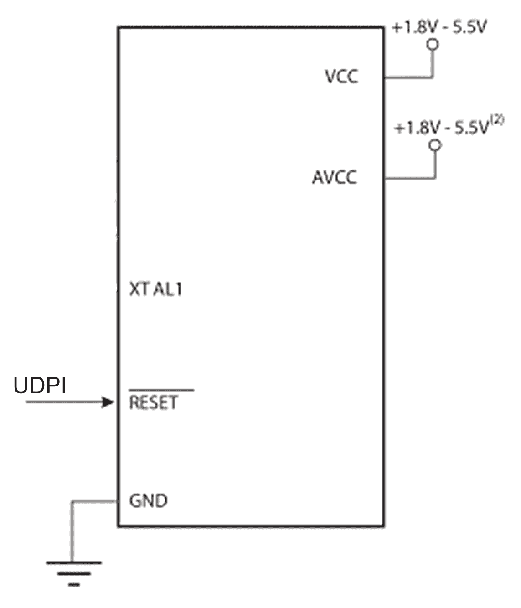
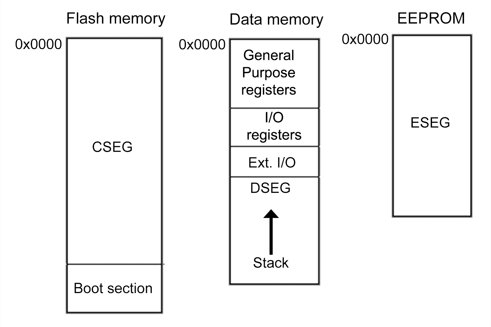
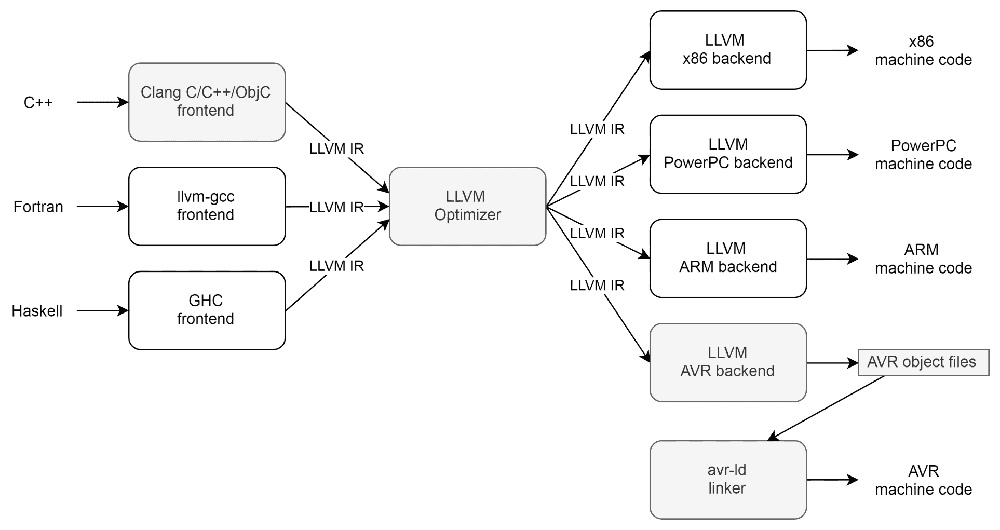

# 四、资源受限的嵌入式系统

使用较小的嵌入式系统 (例如微控制器 (MCU)) 意味着具有少量的 RAM，CPU 功率和存储。本章考虑了当前可用的 mcu 和**片上系统** (**SoC**) 解决方案，规划和有效利用有限资源。我们将考虑以下几个方面

*   为项目选择合适的 MCU
*   并发和内存管理
*   添加传感器、执行器和网络访问
*   裸机开发与实时 os

# 小型系统的大局

当第一次面对一个需要使用至少一种 MCU 的新项目时，这似乎是一项艰巨的任务。正如我们在[第 1 章](01.html)中看到的，*什么是嵌入式系统？*，有大量的 mcu 可供选择，即使我们只限于最近发布的 mcu。

从询问一个人需要多少位开始似乎很明显，例如在 8 位，16 位和 32 位 mcu 之间进行选择，或者像时钟速度这样容易量化的东西，但是这些指标有时会产生误导，并且通常无法很好地缩小产品选择范围。事实证明，父类是足够的 I/O 和集成的外围设备的可用性，以使硬件以精益和可靠的方式实现，以及根据设计时所面临的要求量身定制的处理能力，并预计将在整个产品生命周期中出现。

所以更详细地说，我们需要回答这样的问题:

*   **外设**: 需要哪些外设与系统的其余部分交互？
*   **CPU**: 运行应用代码需要什么级别的 CPU 功率？
*   **浮点**: 我们需要硬件浮点支持吗？
*   **ROM**: 我们需要多少 ROM 来存储代码？
*   **RAM**: 运行代码需要多少 RAM？
*   **电力和热**: 电力和热限制是什么？

每个 MCU 系列都有自己的优势和劣势，尽管选择一个 MCU 系列而不是另一个开发工具的质量是最重要的因素之一。对于业余爱好和其他非商业项目，人们将主要考虑社区的实力和可用的免费开发工具，而在商业项目的背景下，人们还将考虑 MCU 制造商和可能的第三方所期望的支持。

嵌入式开发的一个关键方面是系统内编程和调试。由于编程和调试是交织在一起的，我们稍后将查看相应的接口选项，以便能够确定满足我们的要求和约束的内容。

流行且强大的调试接口已成为底层联合测试动作组 (JTAG) IEEE 标准 1149.1 的同义词，并且易于被经常标记为 TDI，TDO，TCK，TMS 和 TRST 的信号识别，定义了恰当命名的测试动作端口 (TAP)。此后，较大的标准已扩展到 1149.8，并且并非所有版本都适用于数字逻辑，因此我们将范围限制为 1149.1，并在 1149.7 中描述了减少的引脚数版本。目前，我们只要求至少支持功能齐全的 JTAG，SWD 和 UPDI 接口之一。

调试基于 MCU 的系统以及使用命令行工具和 ide 的片上调试，我们将在[第 7 章](07.html)，*测试资源有限平台*中进行深入研究。

最后，如果我们要在几年的活跃生产阶段生产包含所选 MCU 的产品，那么至少在这段时间内确保 MCU 的可用性 (或兼容的替代品) 至关重要。信誉良好的制造商提供产品生命周期信息，作为其供应链管理的一部分，提前 1 至 2 年发送停产通知，并建议终身购买。

对于许多应用而言，很难忽略廉价，功能强大且易于使用的 Arduino 兼容板的广泛可用性，尤其是围绕 mcu 的 AVR 系列设计的流行板。其中，ATmega mcu-mega168/328，特别是 mega1280/2560 变体-为高级功能和输入、控制和遥测数据处理提供了大量的处理能力、ROM 和 RAM，以及差异化但丰富的外围设备和 GPIO。

所有这些方面都使原型制作非常简单，甚至在承诺使用更低规格和 (希望) 更好的 BOM 成本的更确定的变体之前。作为一个例子，ATmega2560 “MEGA” 板如下所示，我们将在本章后面更详细地介绍其他板，因为我们将通过一些有关如何为 AVR 平台开发的示例进行工作。


通常，人们会选择一些可能适用于该项目的 MCU，获得开发板，将它们连接到其余的预计系统组件 (通常在他们自己的开发或分接板上)，并开始为 MCU 开发软件，这将使一切一起工作。

随着系统中越来越多的部分最终确定，开发板和面包板组件的数量将会减少，直到达到开始对最终的**印刷电路板** (**PCB T3】) 布局进行工作的程度。这也将经历多次迭代，随着问题的解决，最后一刻的功能被添加，系统作为一个整体被测试和优化。**

这样的系统中的 mcu 与硬件在物理级别上工作，因此，通常仅由于软件如此依赖硬件功能而需要同时指定硬件和软件。在行业中遇到的一个常见主题是硬件模块化，既可以是具有最小的附加复杂性的小型附加 pcb，也可以是将传感器或通信接口添加到诸如温度控制器和变频驱动器之类的设备上，或者可以是完整的 DIN 导轨模块连接到公共串行总线。

# 示例-激光切割机的机器控制器

切割各种材料的最快，最准确的方法之一是使用高功率激光器。随着二氧化碳 (CO<sub>2</sub>) 的价格多年来急剧下降，这导致了价格合理 (便宜) 的激光切割机的广泛使用，如下图所示:


虽然从可用性和安全的角度来看，完全有可能只使用基本外壳和步进运动控制板来操作激光切割机，而步进运动控制板可以使头部穿过机器床，但这是不可取的。尽管如此，人们可以在线购买的许多廉价激光切割机都没有任何安全或可用性功能。

# 功能规范

为了完成产品，我们需要添加一个控制系统，该系统使用传感器和执行器来监控和控制机器的状态，确保其始终处于安全状态，并在必要时关闭激光束。这意味着保护对以下三个部分的访问:


切割光束通常由 1964 年发明的一种气体激光器 CO<sub>2</sub>激光器产生。施加高电压会导致电流流动，从而激发构成增益介质的孔中的气体分子，最终导致形成**长波长红外** (**LWIR**) 或 ir-c 的相干光束，波长为 9.4 或 10.6 微米的光。

LWIR 的一个特点是它被大量材料强烈吸收，因此它可以用于雕刻，切割甚至在组织上进行手术，因为生物组织中的水可以有效地吸收激光束。这也很明显，为什么即使短暂的皮肤暴露在 CO<sub>2</sub>激光束中也是极其危险的。

为了实现安全操作，必须通过在正常操作期间锁定外壳、停用激光电源、以及当任何联锁被打开或任何其他安全条件不再满足时关闭光束快门或优选地这些措施的组合来抑制暴露于激光。

例如，必须遵守温度限制: 大多数 CO<sub>2</sub>激光器由水冷气体放电管组成，在出现冷却故障时会迅速破裂或弯曲。更重要的是，切割过程会产生刺激性或有毒的烟雾，需要不断从外壳中清除，以免污染光学器件并在打开盖子时退出环境。

这些要求使得我们必须监控冷却水流量和温度、排气的空气流量以及排气过滤器上方的空气流阻 (质量流的压降)。

最后，我们还希望方便使用激光切割机，避免必须 “自带设备” 以机器特定的方式处理设计，然后将其转换并通过 USB 上传到步进运动控制器板。相反，我们希望从 sd 卡或 USB 记忆棒加载设计项目，并使用简单的 LCD 和按钮来设置选项。

# 设计要求

考虑到较早的要求，我们可以制定控制系统所需的功能列表:

*   操作员安全:
    *   检修面板上的互锁开关 (在面板关闭的情况下关闭)
    *   锁定机构 (机械锁定检修面板; 冗余)
    *   紧急停止

*   激光冷却:
    *   泵继电器
    *   水箱内温度传感器 (制冷量、入口温度)
    *   气门冷却排气上的温度传感器 (罩温度)
    *   流量传感器 (水流速度; 冗余)
*   排气:
    *   风扇继电器
    *   空气滤清器状态 (压差传感器)
    *   风扇速度 (RPM)
*   Laser Modules:
    *   激光功率继电器
    *   光束快门 (冗余)
*   用户界面
    *   警报指示器:
        *   面板互锁
        *   空气过滤器状况
        *   风扇状态
        *   泵状态
        *   水温
    *   指示灯用于:
        *   待机
        *   开始
        *   操作
        *   紧急停止
        *   冷静下来
*   通讯:
    *   带步进板的通用串行总线通信
    *   运动控制: 生成步进电机指令
    *   从 sd 卡/u 盘读取文件
    *   通过以太网/wi-fi 接受文件
    *   识别用户的 NFC 阅读器

# 与实施相关的选择

正如本章开头所指出的，中端 mcu 目前能够提供满足大多数 (如果不是全部) 设计要求的资源。因此，一个棘手的问题是我们将把钱花在什么上: 硬件组件还是软件开发？除了不可强性之外，我们现在将仔细研究三种候选解决方案:

*   单个中档 AVR MCU 板 (ATmega2560)
*   高端 Cortex-M3 MCU 板 (SAM3X8E)
*   串联中端 MCU 板和带操作系统的 SBC

我们非常接近用一个 Arduino Mega (ATmega2560) 来满足设计要求，因为前五个部分对 CPU 速度的要求很小，根据我们将要使用的确切传感器或最多使用外围接口 (例如，用于 MEMS 压力传感器)，只有许多数字输入和输出引脚以及一些模拟引脚。

挑战从上一个功能列表中的通信下的运动控制功能开始，我们突然不得不将一个**矢量图形文件** ( **.svg**) 转换为一系列步进命令。这是数据传输，文件解析，路径生成以及在机器人世界中称为逆运动学的复合问题。USB 通信对于我们的 8 位 MCU 也可能存在问题，主要是因为峰值处理器负载与 USB 端点通信或 UART RX 缓冲区寄存器处理的超时相吻合。

关键是知道何时换档。运动控制对时间至关重要，因为它与物理世界的惯性息息相关。此外，我们还受到控制器的处理和带宽资源的限制，以进行控制和数据传输，缓冲，并最终实现处理和输出本身。作为一般模式，更有能力的内部或外部外围设备可以通过处理事件和内存事务本身来放松时序要求，从而减少上下文切换和处理开销。以下是这些注意事项的不完整列表:

*   简单的 UART 需要在 RX 完成 (RXC) 时收集每个字节。如 DOR 标志所示，否则将导致数据丢失。一些控制器 (例如 ATmega8u2 通过 ATmega32u4) 通过 RTS/CTS 线路提供本机硬件流控制，这可以防止 usb-uart 转换器 (例如 PL2303 和 FT232) 发送，从而迫使它们进行缓冲，直到再次方便地清空 UDR 为止。

*   MAX3421 等专用 USB 主机外围设备通过 SPI 连接，有效地消除了大容量存储集成的 USB 时序要求。
*   除了 UART 之外，由于层堆栈的复杂性，网络通信外围设备固有地缓冲在软件中。对于以太网，W5500 是一个有吸引力的解决方案。
*   有时添加另一个较小的 MCU 是有意义的，该 MCU 独立处理 I/O 和模式生成，同时实现我们选择的接口-例如串行或并行。一些 Arduino 板已经采用了用于 USB 串行转换的 ATmega16u2。

NFC 读取器功能要求要求**近场通信** (**NFC**，RFID 的一个子集)，以防止未经授权使用激光切割机，这将增加最大的负担。不是由于与 NFC 读取器本身的通信，而是由于代码大小和 CPU 要求的增加，以根据所选择的安全级别来处理带有证书的加密。我们还需要一个安全的地方来存储通常会提高 MCU 规格的证书。

现在，我们正在考虑更高级的选择。更简单的 ATmega2560 仍然非常适合其大量的 GPIO，并且可以通过 SPI 读取 sd 卡以及与外部集成以太网芯片进行通信。但是，如果要尝试的话，运动控制和 NFC 读取器功能列表中的计算或内存密集型任务可能会使 MCU 负担过重，或导致复杂的 “优化” 解决方案，其可维护性较差。

将 MCU 升级到 arduo 开发板上的 ARM Cortex-M3，可能会解决所有这些瓶颈。它将保留我们在 ATmega2560 上习惯的大量 GPIO，同时显着提高 CPU 性能。可以在 MCU 上生成步进驱动模式，MCU 也具有本机 USB 支持以及其他高级外围设备 (USART，SPI 和 I2C 以及 HSMCI，它们也具有 DMA)。

可以通过 UART，SPI 或 I2C 连接基本的 NFC 标签读取器，并且此设计选择将导致系统如图所示:


涉及 SBC 的第三实施例将再次利用 ATmega2560 并添加运行 OS 的低功率 SBC。此 SBC 将处理任何 CPU 密集型任务，以太网和 wi-fi 连接，USB (主机) 任务等。它将通过 UART 与 ATmega 端通信，可能在板之间添加数字隔离器或电平转换器以容纳 3.3V (SBC) 和 5V TTL (Atmega) 逻辑电平。

选择 SBC MCU 解决方案将大大改变软件挑战，但只会在硬件方面稍微重组我们的系统。这将看起来如下:


与大多数开发过程一样，只有很少的绝对答案，并且许多解决方案在功率使用，复杂性和维护需求之间进行权衡之后，将功能需求传递为影响最终设计选择的*足够好*。

在该特定示例中，可以选择高端单板或双板解决方案，并且很可能需要相同的工作量来满足要求。主要区别之一是基于操作系统的解决方案增加了执行频繁操作系统更新的需求，因为它是运行成熟操作系统的网络连接系统，而嵌入式以太网控制器具有卸载的硬连线 tcp/ip 堆栈和内存往往更健壮和经过验证。

Cortex-M3-based 选项 (或更快的 Cortex-M4) 将只包含我们自己的代码，因此不太可能有任何容易针对的常见安全问题。我们不会摆脱维护，但我们的代码将足够小，可以完整地验证和阅读，唯一令人失望的是，Arduino 应有的设计未能打破 RMII 连接外部以太网 PHY 的引脚，阻碍使用其内部以太网 MAC。

通过我们在本章开始时汇总的清单，但是这次考虑到 ATmega2560 SBC 和应用，可以为我们提供以下职责分配:

*   **外设**: MCU 端主要需要 GPIO，一些模拟 (ADC) 输入，以太网，USB，以及 SPI 和/或 I2C。
*   **CPU**: 所要求的 MCU 性能是时间关键但次要的，除了当我们需要将矢量路径元素处理成步进指令时。只要可以将足够多的命令排队以执行 MCU 侧，并且避免时间紧迫的交互，SBC 侧就可以很复杂。
*   **浮点**: 如果我们有硬件浮点支持，MCU 上的步进指令转换算法执行速度会大大加快。所涉及的长度和时间尺度可能使定点算法可行，从而放宽了这一要求。
*   **ROM**: 整个 MCU 代码可能适合几千字节，因为它不是很复杂。仅通过调用高级库来提供所需的功能，SBC 代码就会变大几个数量级，但这将被类似规模的大容量存储和处理功能所抵消。
*   **RAM**: MCU 上几 KB 的 SRAM 就足够了。步进指令转换算法可能需要进行修改，以适应其缓冲和处理数据要求的 SRAM 限制。在最坏的情况下，缓冲区可以缩小。
*   **功率和热**: 根据激光切割机系统的功率需求和冷却系统，我们没有明显的功率或热限制。包含控制系统的部分还容纳了主电源，并且已经配备了大小合适的冷却风扇。

在这一点上，重要的是要注意，尽管我们意识到手头任务的复杂性和要求足以得出结论，导致我们选择硬件组件，但如何详细实现它们的方面仍然留给软件开发人员。

例如，我们可以定义自己的数据结构和格式，并自己实现特定于机器的路径生成和运动控制，或者采用几十年来在数控应用中已经建立的 (RS-274) G 代码中间格式，这很适合生成运动控制命令。G 代码，并且在 diy 硬件社区中也得到了广泛的接受，尤其是 FDM 3D 打印。

基于 G 代码的运动控制的一个值得注意的成熟开源实现是 GRBL，介绍为:

Grbl is a free, open source, high performance software for controlling the motion of machines that move, that make things, or that make things move, and will run on a straight Arduino. If the maker movement was an industry, Grbl would be the industry standard.
--https://github.com/gnea/grbl

最有可能的是，我们将不得不添加停止和紧急停止功能，以应对不同的安全检查违规行为。虽然温度偏移或过滤器堵塞最好只是停止激光切割机并允许在解决问题的情况下恢复工作，但通过打开外壳而跳闸的联锁必须导致激光立即关闭，即使没有完成路径段和运动的最后命令。

模块化运动控制任务并为其生成 G 代码的选择不仅具有经过验证的实现的可用性，还使我们能够轻松添加可用性功能，例如手动控制设置和校准以及使用先前生成的可测试性，机器方面的人类可读代码，就像检查我们的文件解释和路径生成算法的输出一样。

随着需求列表、初始设计的完成以及对我们将如何实现目标的加深理解，下一步将是获得具有所选 MCU 和/或 SoC 的开发板 (或多个板)，与任何外围设备一起使用，以便可以开始开发固件和集成系统。

虽然本例中描述的机器控制系统的全面实施超出了本书的范围，但在本章的剩余时间和[第 6 章](06.html)中将努力深入了解单片机和 SBC 目标品种的开发，*测试基于操作系统的应用*，[第 8 章](08.html)，*示例-基于 Linux 的信息娱乐*系统，以及[第 11 章](11.html)，*为混合 SoC/FPGA 系统开发*，分别。

# 嵌入式 ide 和框架

虽然 soc 的应用开发往往与桌面和服务器环境非常相似，但正如我们在上一章中看到的那样，MCU 开发需要对正在开发的硬件有更深入的了解，有时甚至需要在特定寄存器中设置确切的位。

有一些框架试图抽象出特定 MCU 系列的这些细节，以便人们可以为通用 API 开发，而不必担心它是如何在特定 MCU 上实现的。其中，Arduino 框架是工业应用之外最著名的，尽管也有许多经过生产使用认证的商业框架。

诸如 AVR 和 SAM mcu 的**高级软件框架** (**ASF**) 等框架可以与多种 ide 一起使用，包括 Atmel Studio，Keil µ vision 和 IAR 嵌入式工作台。

以下是流行的嵌入式 ide 的非详尽列表:

| **名称** | **公司** | **许可证** | **平台** | **注释** |
| Atmel 工作室 | 微芯片 | 专有 | AVR, SAM (ARM Cortex-M). | 最初由 Atmel 开发，然后被 Microchip 收购。 |
| Μ vision | Wedge (ARM) | 专有 | ARM Cortex-M, 166, 8051, 251. | **单片机开发工具包** (**MDK**) 工具链的一部分。 |
| 嵌入式工作台 | IAR | 专有 | 手臂皮质-M、8051、MSP430、AVR、Coldfire、STM8、H8、SuperH 等。 | 每个 MCU 架构的独立 IDE。 |
| MPLAB X | 微芯片 | 专有 | 图片，AVR。 | 使用基于 Java 的 NetBeans IDE 作为基础。 |
| 阿杜诺 | 阿杜诺 | GPLv2 | 一些 AVR 和 SAM MCUs (可扩展)。 | 基于 Java 的 IDE。只支持自己的 C 方言语言。 |

IDE 的主要目标是将整个工作流集成到一个应用中，从编写初始代码到使用编译后的代码对 MCU 内存进行编程，并在应用在平台上运行时进行调试。

但是，是否使用完整的 IDE 是一个优先事项。尽管编写了诸如 ASF 之类的框架以与 ide 深度集成，但在使用基本编辑器和命令行中的工具时，所有基本功能仍然存在。

流行的 Arduino 框架的主要优点之一是，它或多或少地标准化了各种 MCU 外围设备的 API，以及在不断增长的 MCU 体系结构中支持的其他功能。加上该框架的开源性质，它成为新项目的有吸引力的目标。这在原型设计方面特别有吸引力，这要归功于为此 API 编写的大量库和驱动程序。

不幸的是，尽管 Arduino IDE 的核心库广泛使用了 C，但不幸的是，它纯粹专注于 C 编程语言的精简方言。这仍然使我们能够将库集成到我们自己的嵌入式 C 项目中，正如我们将在本章后面看到的那样。

# 编程 mcu

在我们为目标 MCU 编译了代码之后，在执行和调试之前，需要将二进制映像写入控制器存储器。在本节中，我们将探讨实现这一目标的各种方式。如今，只有工厂端编程是通过测试插座完成的，或者更好的是在将已知的良好管芯键合到引线框并封装之前在晶圆级别完成的。表面安装部件已经排除了轻松移除 MCU 进行 (重复) 编程的可能性。

存在许多 (通常是特定于供应商的) 用于电路内编程的选项，以它们使用的外围设备和它们影响的存储器为特征。

因此，通常需要使用外部编程适配器对原始 MCU 进行编程。这些通常通过设置 MCU 的引脚来工作，使其进入编程模式，之后 MCU 接受包含新 ROM 映像的数据流。

通常使用的另一种选择是将引导加载程序添加到 ROM 的第一部分，这允许 MCU 自行编程。这是通过让引导加载程序在启动时检查它是否应该切换到编程模式或继续加载实际程序来工作的，该程序放在引导加载程序部分之后。

# 内存编程和设备调试

外部编程适配器通常使用专用接口和相关协议，从而允许对目标设备进行编程和调试。可以对 MCU 进行编程的协议包括以下内容:

| **名称** | **pins** | **特点** | **说明** |
| **SPI (ISP)** | **4** ] | 程序 | **串行外设接口** (**SPI**)，与较旧的 AVR mcu 一起使用以访问其串行编程器模式 (**在线串行编程** (**ISP**)。 |
| Ingt0gt0ggg.jtg.bl.T1 | **5** ] | 程序
调试
边界 | 专用的行业标准片上接口，用于编程和调试支持。在 AVR ATxmega 设备上支持。 |
| **UPDI** | **1** ] | 程序
调试 | 与较新的 AVR mcu (包括 ATtiny 设备) 一起使用的**统一编程和调试接口** (**UDPI**)。这是一个单线接口，是 ATxmega 设备上两线 PDI 的后继产品。 |
| �� T0 “HVPP/�� T1“**hvsp** | **17/**]**5** ] | program | 高压并行编程/高压串行编程。AVR 编程模式在复位引脚上使用 12V，并直接访问 8 个引脚。忽略任何内部保险丝设置或其他配置选项。主要用于工厂内编程和恢复。 |
| **TPI** | **3** ] | ]program | 微型编程接口，与一些 ATtiny AVR 设备一起使用。这些设备还缺少用于 HVPP 或 HVSP 的引脚数。 |
| **社署** | **3** ] | ]program
debug
boundary | 串行线调试。类似于具有两行的减少引脚数的 JTAG，但使用 ARM 调试接口功能，允许连接的调试器成为可访问 MCU 的内存和外围设备的总线主控器。 |

ARM mcu 通常提供 JTAG 作为其编程和调试的主要手段。在 8 位 mcu 上，JTAG 远不那么常见，这主要是由于其需求的复杂性。

除高压编程模式外，AVR mcu 还倾向于通过 SPI 提供系统内编程 (ISP)。进入编程模式要求在编程和验证期间将复位引脚保持在较低位置，并在编程周期结束时释放并选通。

One requirement for ISP is that the relevant (SPIEN fuse bit) in the MCU is set to enable the in-system programming interface. Without this bit set, the device won’t respond on the SPI lines. Without JTAG available and enabled via the JTAGEN fuse bit, only HVPP or HVSP are available to recover and reprogram the chip. In the latter case, the unusual set of pins and the 12V supply voltage do not necessarily integrate well into the board circuitry.

大多数串行编程接口所需的物理连接相当简单，即使 MCU 已经集成到电路中，如下图所示:


在这里，如果存在内部振荡器，则外部振荡器是可选的。**PDI**、**PDO**和**SCK**线对应各自的 SPI 线。在编程期间，复位线保持活动状态 (低)。以这种方式连接到 MCU 后，我们可以自由写入其闪存，EEPROM 和配置保险丝。

在较新的 AVR 设备上，我们发现了**统一编程和调试接口** (**UPDI**)，它仅使用一根导线 (除了电源线和地线) 连接到目标 MCU，以提供编程和调试支持。

这个接口将前面的连接图简化为如下:



这与 ATxmega (启用时) 上的 JTAG (IEEE 1149.1) 相比具有优势，如下所示:


在 ATxmega 上实现的引入引脚数 JTAG 标准 (IEEE 1149) 仅需要一个时钟 TCKC，一个数据线 TMSC，并且被恰当地称为紧凑型 JTAG。在这些接口中，UPDI 仍然需要与目标设备的连接最少。除此之外，两者都支持 AVR mcu 的类似功能。

对于使用 JTAG 进行编程和调试的其他系统，不存在标准连接。每个制造商都使用自己的首选连接器，范围从 2x5 针 (Altera，AVR) 到 2x10 针 (ARM)，或单个 8 针连接器 (晶格)。

由于 JTAG 更多地是一种协议标准，而不是物理规范，因此应参考目标平台的文档以获取具体细节。

# 引导加载器

引导加载程序已作为一个小型额外应用引入，该应用使用现有接口 (例如，UART 或以太网) 来提供自编程功能。在 AVR 上，可以在其闪存中保留 256 字节至 4 KB 的引导加载程序部分。该代码可以执行任意数量的用户定义任务，从与远程系统建立串行链路到使用 PXE 从以太网上的远程映像启动。

在其核心，AVR 引导加载程序与任何其他 AVR 应用没有什么不同，除了在编译它时添加一个额外的链接器标志来设置引导加载程序的起始字节地址:

```cpp
--section-start=.text=0x1800 
```

将此地址替换为您正在使用的特定 MCU 的类似地址 (对于 AVR，具体取决于 BOOTSZ 标志集和所使用的控制器，请参见数据表关于引导大小配置: 引导重置地址，例如，引导重置地址为 0xC00 以字表示，并且节开始以字节为单位定义)。这确保了引导加载程序代码将被写入到 MCU 的 ROM 中的正确位置。将引导加载程序代码写入 ROM 几乎总是通过 ISP 完成。

AVR mcu 将 flash ROM 分为两部分: **无读时写** (**NRWW**) (对于大多数，如果不是全部应用内存空间) 和**边读边写** (**RWW**) 部分。简而言之，这意味着可以安全地擦除和重写 RWW 部分，而不会影响 CPU 的操作。这就是引导加载程序驻留在 NRWW 部分中的原因，也是引导加载程序本身更新不容易的原因。

另一个重要的细节是，引导加载程序也不能更新在 MCU 中设置各种标志的保险丝。要改变这些，必须对设备进行外部编程。

在使用引导加载程序对 MCU 进行编程之后，通常会在 MCU 中设置标志，以使处理器知道已安装了引导加载程序。在 AVR 的情况下，这些标志是 BOOTSZ 和 BOOTRST。

# 内存管理

微控制器的存储和存储系统由多个组件组成。有一段**只读存储器** (**ROM**)，在芯片编程时只写入一次，但正常情况下不能被 MCU 本身改变，正如我们在上一节中看到的。

MCU 还可以具有 EEPROM 或等效形式的一些持久性存储。最后，还有 CPU 寄存器和**随机存取存储器** (**RAM**)。这导致以下示例性内存布局:



Mcu 通常使用修改后的 Harvard 体系结构 (在某些体系结构级别上拆分程序和数据存储器，通常使用数据总线)。例如，使用 AVR 架构，程序存储器可以在 ROM 中找到，对于 ATmega2560，它使用自己的总线与 CPU 核心连接，正如在该 MCU 的框图中可以看到的那样，我们在[第 1 章](01.html)，*看了哪些是嵌入式系统？*

具有用于这些存储器空间的单独总线的主要优点是，可以分别寻址它们中的每一个，这可以更好地利用 8 位处理器可用的有限寻址空间 (1 和 2 字节宽的地址)。它还允许在 CPU 忙于其他内存空间时并发访问，从而进一步优化可用资源。

对于 SRAM 中的数据存储器，我们可以随意使用它。在这里，我们至少需要一个堆栈才能运行程序。根据 MCU 中剩余的 SRAM，我们还可以添加一个堆。但是，仅使用堆栈和静态分配的内存就可以实现中等复杂性的应用，而不涉及产生具有堆分配的代码的高级语言功能。

# 堆栈和堆

是否需要初始化正在编程的 MCU 上的堆栈取决于一个人希望去的低级。当使用 C-运行时 (在 AVR: `avr-libc`上)，运行时将通过让链接器将裸代码放入 init 部分来处理初始化堆栈和其他细节，例如由以下方式指定:

```cpp
__attribute__ ((naked, used, section (".init3")))
```

在执行我们自己的任何应用代码之前。

AVR 上的标准 RAM 布局是从 RAM 开头的`.data`变量开始，然后是`.bss`。堆栈从 RAM 的相对位置开始，朝着开始增长。在`.bss`部分的末端和堆栈的末端之间将留有空间，如下所示:


由于堆栈的增长取决于正在运行的应用中函数调用的深度，因此很难说有多少可用空间。一些 mcu 也允许使用外部 RAM，这将是堆的可能位置，如下所示:


AVR Libc 库实现了一个针对 AVR 体系结构优化的`malloc()`内存分配器例程。使用它，一个人也可以实现自己的`new`和`delete`功能 -- 如果一个人愿意的话 -- 因为 AVR 工具链也没有实现。

为了将外部存储器与 AVR MCU 一起用于堆存储，必须确保外部存储器已被初始化，此后地址空间变为可用的`malloc()`。堆空间的开始和结束在此由这些全局变量定义:

```cpp
char * __malloc_heap_start 
char * __malloc_heap_end 
```

AVR 文档对调整堆有以下建议:

If the heap is going to be moved to external RAM, `__malloc_heap_end` must be adjusted accordingly. This can either be done at runtime, by writing directly to this variable, or it can be done automatically at link-time, by adjusting the value of the symbol `__heap_end`.

# 中断，ESP8266 IRAM_ATTR

在台式机或服务器上，整个应用二进制文件将被加载到 RAM 中。在 mcu 上，尽管通常会在 ROM 中保留尽可能多的程序指令，直到需要它们为止。这意味着我们的大多数应用的指令不能立即执行，但首先必须从 ROM 中获取，然后我们的 MCU 的 CPU 才能通过指令总线获取它们以执行。

在 AVR 上，每个可能的中断都定义在一个向量表中，该向量表存储在 ROM 中。这为每个中断类型或用户定义的版本提供了默认处理程序。要标记中断例程，要么使用`__attribute__((signal))`属性，要么使用`ISR()`宏:

```cpp
#include <avr/interrupt.h> 

ISR(ADC_vect) { 
         // user code 
} 
```

这个宏处理注册中断的细节。只需指定名称并为中断处理程序定义一个函数即可。然后，这将通过中断向量表被调用。

使用 ESP8266 (及其后继产品 ESP32)，我们可以使用特殊属性`IRAM_ATTR`标记中断处理程序函数。与 AVR 不同，ESP8266 MCU 没有内置 ROM，而是必须使用其 SPI 外围设备将任何指令加载到 RAM 中，这显然是相当缓慢的。

将此属性与中断处理程序一起使用的示例如下:

```cpp
void IRAM_ATTR MotionModule::interruptHandler() {
          int val = digitalRead(pin);
          if (val == HIGH) { motion = true; }
          else { motion = false; }
 }
```

在这里，我们有一个中断处理程序，它连接到来自运动检测器的信号，并连接到输入引脚。与任何编写良好的中断处理程序一样，它非常简单，并且意味着在返回到应用的正常流程之前可以快速执行。

在 ROM 中使用此处理程序将意味着该例程不会立即响应运动传感器的输出变化。更糟糕的是，它将导致处理程序需要更长的时间才能完成，这将因此延迟应用代码的其余部分的执行。

通过用`IRAM_ATTR`标记它，我们可以避免这个问题，因为整个处理程序将在需要时已经在 RAM 中，而不是整个系统停止，因为它等待 SPI 总线返回请求的数据，然后才能继续。

Note that, tempting as it may seem, this kind of attribute should be used sparingly, as most MCUs have much more ROM than RAM. In the case of ESP8266, there are 64kB RAM for code execution complemented by possibly megabytes of external Flash ROM.

编译我们的代码时，编译器会将标有此属性的指令放入一个特殊的部分，以便 MCU 知道将其加载到 RAM 中。

# 并发

除了少数例外，mcu 是单核系统。多任务处理不是通常要做的事情; 相反，有一个带有计时器和中断的执行线程，添加了异步操作方法。

原子操作通常由编译器支持，AVR 也不例外。在以下情况下可以看到对指令原子块的需求。请记住，尽管存在一些异常 (MOVW 复制寄存器对并通过 X，Y，Z 指针进行间接寻址)，但 8 位体系结构上的指令通常仅影响 8 位值。

*   16 位变量在 main 函数中按字节读取，并在 ISR 中更新。
*   读取，修改 32 位变量，然后将其存储回 main function 或 ISR 中，而其他例程可以尝试访问它。
*   代码块的执行是时间紧迫的 (bitbanging I/O，禁用 JTAG)。

AVR libc 文档中给出了第一种情况的基本示例:

```cpp
#include <cinttypes> 
#include <avr/interrupt.h> 
#include <avr/io.h> 
#include <util/atomic.h> 

volatile uint16_t ctr; 

ISR(TIMER1_OVF_vect) { 
   ctr--; 
} 

int main() { 
         ctr = 0x200; 
         start_timer(); 
         sei(); 
         uint16_t ctr_copy; 
         do { 
               ATOMIC_BLOCK(ATOMIC_FORCEON) 
               { 
                     ctr_copy = ctr; 
               } 
         } 
         while (ctr_copy != 0); 

         return 0; 
} 
```

在此代码中，中断处理程序中正在更改 16 位整数，而主例程正在将其值复制到局部变量中。我们调用`sei()` (设置全局中断标志) 来确保中断寄存器处于已知状态。`volatile`关键字提示编译器，该变量及其访问方式不应以任何方式进行优化。

因为我们包含了 AVR 原子头，所以我们可以使用`ATOMIC_BLOCK`宏以及`ATOMIC_FORCEON`宏。这样做是创建一个代码部分，该代码部分保证可以自动执行，而不会受到中断处理程序等的任何干扰。我们传递给`ATOMIC_BLOCK`的参数强制全局中断状态标志进入启用状态。

由于我们在启动原子块之前将此标志设置为相同的状态，因此我们不需要保存此标志的先前值，从而节省了资源。

如前所述，mcu 往往是单核系统，具有有限的多任务和多线程功能。对于适当的多线程和多任务处理，将需要进行上下文切换，从而不仅保存正在运行的任务的堆栈指针，而且还保存所有寄存器和相关的状态。

这意味着虽然有可能在单个 MCU 上运行多个线程和任务，但在 8 位 MCU (例如 AVR 和 PIC (8 位范围)) 的情况下，这种努力很可能不值得，并且需要大量的劳动。

在更强大的 mcu 上 (如 ESP8255 和 ARM Cortex-M)，可以运行**实时操作系统** (**RTOSes**)，它完全实现了这样的上下文切换，而不必做所有繁重的工作。我们将在本章后面介绍 RTOSes。

# 使用 Nodate 开发 AVR

Microchip 为 AVR 开发提供了 GCC 工具链的二进制版本。在撰写本文时，avr-gcc 的最新版本是 3.6.1，包含 GCC 版本 5.4.0。这意味着对 C 14 的完全支持和对 C 17 的有限支持。

使用这个工具链非常容易。可以简单地从 Microchip 网站下载它，将其提取到合适的文件夹中，然后将包含 GCC 可执行文件的文件夹添加到系统路径中。在这之后，它可以用来编译 AVR 应用。某些平台还将通过软件包管理器提供 AVR 工具链，这使该过程更加容易。

安装此 GCC 工具链后可能会注意到的一件事是，没有可用的 C STL。结果，仅限于 GCC 支持的 c 语言功能。正如微芯片 AVR 常见问题解答所指出的:

*   显然，与 C 相关的标准函数、类和模板类都不可用。
*   新运算符和删除运算符未实现; 尝试使用它们将导致链接器抱怨未定义的外部引用。(这可能是固定的。)
*   提供的一些 include 文件不是 C 安全的，也就是说，它们需要包装到`extern"C" { . . . }`中。(这当然也可以解决。)
*   不支持例外。由于默认情况下在 C 前端启用了异常，因此需要在编译器选项中使用`-fno-exceptions`将其明确关闭。如果失败，链接器将抱怨对`__gxx_personality_sj0`的未定义外部引用。

由于缺少包含 STL 功能的 Libstdc 实现，我们只能通过使用第三方实现来添加此类功能。其中包括基本上提供完整 STL 的版本，以及不遵循标准 STL API 的轻量级重新实现。后者的一个例子是 Arduino AVR 核心，它提供了诸如 String 和 Vector 之类的类，这些类与它们的 STL 等效类相似，尽管有一些限制和差异。

微芯片 AVR GCC 工具链的一个即将到来的替代方案是 LLVM，这是一个编译器框架，最近添加了对 AVR 的实验支持，并且在将来的某个时候应该允许为 AVR mcu 生产二进制文件，同时通过其 Clang 前端提供完整的 STL 功能 (C/C 支持)。



认为这是 LLVM 开发的抽象快照-同时说明了 LLVM 的一般概念及其对中间表示的强调。

Unfortunately the PIC range of MCUs, despite also being owned by Microchip and resembling AVR in many ways, does at this point not have a C++ compiler available for it from Microchip until one moves up to the PIC32 (MIPS-based) range of MCUs.

# 输入日期

在这一点上，您可以选择使用我们在本章之前讨论过的 ide 之一，但是对于 AVR 开发本身而言，这几乎没有教育意义。因此，我们将研究为 ATmega2560 板开发的简单应用，该板使用 Arduino AVR 内核的修改版本，称为 Nodate ([https://github.com/MayaPosch/Nodate](https://github.com/MayaPosch/Nodate))。此框架对原始核心进行了重组，以允许将其用作常规 C 库，而不是仅与 Arduino C 方言解析器和前端一起使用。

安装 Nodate 非常容易: 只需下载到系统上的合适位置，并将`NODATE_HOME`系统变量指向 Nodate 安装的根文件夹。在此之后，我们可以将其中一个示例应用作为新项目的基础。

# 示例-CMOS 集成电路测试仪

在这里，我们将看一个功能更全面的示例项目，实现一个用于 5v 逻辑芯片的**集成电路** (**IC**) 测试仪。除了用 GPIO 引脚探测芯片外，该项目还通过 SPI 从 sd 卡读取芯片说明和测试程序 (以逻辑表的形式)。用户控件以基于串行的命令行界面的形式添加。

首先，我们查看此 Nodate 项目的`Makefile`，如项目的根目录中所示:

```cpp
ARCH ?= avr

 # Board preset.
 BOARD ?= arduino_mega_2560

 # Set the name of the output (ELF & Hex) file.
 OUTPUT := sdinfo

 # Add files to include for compilation to these variables.
 APP_CPP_FILES = $(wildcard src/*.cpp)
 APP_C_FILES = $(wildcard src/*.c)

 #
 # --- End of user-editable variables --- #
 #

 # Nodate includes. Requires that the NODATE_HOME environment variable has been set.
 APPFOLDER=$(CURDIR)
 export

 all:
    $(MAKE) -C $(NODATE_HOME)

 flash:
    $(MAKE) -C $(NODATE_HOME) flash

 clean:
    $(MAKE) -C $(NODATE_HOME) clean
```

我们指定的第一项是我们所针对的体系结构，因为 Nodate 也可以用于针对其他 MCU 类型。在这里，我们指定 AVR 作为架构。

接下来，我们使用 Arduino Mega 2560 开发板的预设。在 Nodate 内部，我们有许多这样的预设，它们定义了有关电路板的许多细节。对于 Arduino Mega 2560，我们得到以下预设:

```cpp
MCU := atmega2560 
PROGRAMMER := wiring 
VARIANT := mega # "Arduino Mega" board type
```

如果没有定义板预设，则必须在项目的 Makefile 中定义这些变量，并为每个变量选择一个现有值，每个变量都定义为 Nodate AVR 子文件夹中的自己的 Makefile。或者，可以将自己的 MCU，编程器和 (pin) 变体文件添加到 Nodate，以及新的电路板预设，然后使用它。

随着 makefile 完成，是时候实现主要功能了:

```cpp
#include <wiring.h>
 #include <SPI.h>
 #include <SD.h>

 #include "serialcomm.h"
```

接线头提供对所有 GPIO 相关功能的访问。此外，我们还包括 SPI 总线，sd 卡读卡器设备的标头以及包装串行接口的自定义类，稍后我们将详细介绍:

```cpp
int main () {
    init();
    initVariant();

    Serial.begin(9600);

    SPI.begin();
```

进入主函数后，我们通过调用`init()`初始化 GPIO 功能。下一次调用将加载我们针对的特定板的引脚配置 (顶部或板预设 Makefile 中的`VARIANT`变量)。

之后，我们以 9,600 波特的速度启动第一个串行端口，然后是 SPI 总线，最后输出欢迎消息，如下所示:

```cpp
   Serial.println("Initializing SD card...");

    if (!SD.begin(53)) {
          Serial.println("Initialization failed!");
          while (1);
    }

    Serial.println("initialization done.");

    Serial.println("Commands: index, chip");
    Serial.print("> ");
```

此时，预计将在 Mega 板上附加一张 sd 卡，其中包含我们可以测试的可用芯片列表。这里，引脚 53 是硬件 SPI 芯片选择引脚，其方便地位于板上的其余 SPI 引脚旁边。

假设电路板已正确连接，并且可以毫无问题地读取卡，则在控制台屏幕上会显示命令行提示:

```cpp
          while (1) {
                String cmd;
                while (!SerialComm::readLine(cmd)) { }

                if (cmd == "index") { readIndex(); }
                else if (cmd == "chip") { readChipConfig(); }
                else { Serial.println("Unknown command.");      }

                Serial.print("> ");
          }

          return 0;
 }
```

此循环只是等待输入到达串行输入，然后它将尝试执行接收到的命令。我们从串行输入中读取的函数是阻塞的，只有当它收到换行符 (用户按下*输入*)，或者它的内部缓冲区大小被超过而没有收到换行符时才返回。在后一种情况下，我们只需取消输入，然后尝试再次从串行输入中读取。这就结束了`main()`的实现。

现在让我们看一下`SerialComm`类的标题:

```cpp
#include <HardwareSerial.h>      // UART.

 static const int CHARBUFFERSIZE 64

 class SerialComm {
          static char charbuff[CHARBUFFERSIZE];

 public:
          static bool readLine(String &str);
 };
```

我们包括硬件串行连接支持的标头。这使我们可以访问潜在的 UART 外围设备。类本身是纯静态的，定义字符缓冲区的最大大小，以及从串行输入中读取一行的函数。

接下来是它的实现:

```cpp
#include "serialcomm.h"

 char SerialComm::charbuff[CHARBUFFERSIZE];

 bool SerialComm::readLine(String &str) {
          int index = 0;

          while (1) {
                while (Serial.available() == 0) { }

                char rc = Serial.read();
                Serial.print(rc);

                if (rc == '\n') {
                      charbuff[index] = 0;
                      str = charbuff;
                      return true;
                }

                if (rc >= 0x20 || rc == ' ') {
                      charbuff[index++ ] = rc;
                      if (index > CHARBUFFERSIZE) {
                            return false;
                      }
                }
          }

          return false;
 }
```

在`while`循环中，我们首先进入一个循环，该循环在串行输入缓冲区中没有要读取的字符时运行。这使其成为阻塞读取。

由于我们希望能够看到我们正在输入的内容，因此在下一节中，我们将回响已阅读的任何字符。之后，我们检查是否收到换行符。如果这样做，我们将在本地缓冲区中添加一个终止的空字节，并将其读取到我们被提供的引用的字符串实例中，然后返回 true。

在这里可以实现的一种可能的改进是 backspace 功能，其中用户可以通过使用 backspace 键删除读取缓冲区中的字符。为此，必须为 backspace 控制字符 (ASCII 0x8) 添加一个案例，该案例将从缓冲区中删除最后一个字符，并且还可以选择让远程终端删除其最后一个可见字符。

由于还没有找到换行符，我们继续下一节。在这里，我们检查是否收到了被视为 ASCII 0x20 的有效字符或空格。如果这样做了，我们将继续将新字符添加到缓冲区中，并最终检查是否已到达读取缓冲区的末尾。如果没有，则返回 false 以指示缓冲区已满，但未找到换行符。

接下来分别是`index`和`chip`命令的处理函数`readIndex()`和`readChipConfig()`:

```cpp
void readIndex() {
          File sdFile = SD.open("chips.idx");
          if (!sdFile) {
                Serial.println("Failed to open IC index file.");
                Serial.println("Please check SD card and try again.");
                while(1);
          }

          Serial.println("Available chips:");
          while (sdFile.available()) {
                Serial.write(sdFile.read());
          }

          sdFile.close();
 }
```

此函数大量使用 Arduino sd 卡库中的`SD`和关联的`File`类。本质上，我们打开 sd 卡上的 chips 索引文件，确保获得有效的文件句柄，然后继续读取并打印文件中的每一行。该文件是一个简单的基于行的文本文件，每行有一个芯片名称。

在处理程序代码的末尾，我们完成了从 SD 的读取，并且可以使用`sdFile.close()`关闭文件句柄。这同样适用于稍微冗长的即将实施的`readChipHandler()`。

# 用法

例如，当我们使用连接的简单 HEF4001 IC (4000 CMOS 系列四路 2 输入或门) 运行测试时，我们必须向 sd 卡添加一个文件，其中包含该 IC 的测试描述和控制数据。这里显示了`4001.ic`测试文件，因为它有助于遵循解析它并执行相应测试的代码。

```cpp
HEF4001B
Quad 2-input NOR gate.
A1-A2: 22-27, Vss: GND, 3A-4B: 28-33, Vdd: 5V
22:0,23:0=24:1
22:0,23:1=24:0
22:1,23:0=24:0
22:1,23:1=24:0
26:0,27:0=25:1
26:0,27:1=25:0
26:1,27:0=25:0
26:1,27:1=25:0
28:0,29:0=30:1
28:0,29:1=30:0
28:1,29:0=30:0
28:1,29:1=30:0
33:0,32:0=31:1
33:0,32:1=31:0
33:1,32:0=31:0
33:1,32:1=31:0
```

前三行是我们前面看到的逐字打印的，其余行指定了各个测试方案。这些测试是行，并使用以下格式:

```cpp
<pin>:<value>,[..,]<pin>:<value>=<pin>:<value>
```

我们将此文件与更新的`index.idx`文件 (在新行上包含 “4001” 条目) 一起写入 sd 卡。为了支持更多的 ic，我们只需用它们各自的测试序列重复这个模式，并在索引文件中列出它们。最后是芯片配置的处理程序，它也启动测试过程:

```cpp
 void readChipConfig() {
          Serial.println("Chip name?");
          Serial.print("> ");
          String chip;
          while (!SerialComm::readLine(chip)) { }
```

我们首先向用户询问 IC 的名称，如前面通过`index`命令打印出来的:

```cpp
          File sdFile = SD.open(chip + ".ic");      
          if (!sdFile) {
                Serial.println("Failed to open IC file.");
                Serial.println("Please check SD card and try again.");
                return;
          }

          String name = sdFile.readStringUntil('\n');
          String desc = sdFile.readStringUntil('\n');
```

我们尝试打开带有 IC 详细信息的文件，继续读取文件内容，从我们正在测试的 IC 的名称和描述开始:

```cpp
          Serial.println("Found IC:");
          Serial.println("Name: " + name);
          Serial.println("Description: " + desc);   

          String pins = sdFile.readStringUntil('\n');
          Serial.println(pins);
```

显示此 IC 的名称和说明后，我们读出了包含有关如何将 IC 连接到 Mega 板标头的说明的行:

```cpp

          Serial.println("Type 'start' and press <enter> to start test.");
          Serial.print("> ");
          String conf;
          while (!SerialComm::readLine(conf)) { }
          if (conf != "start") {
                Serial.println("Aborting test.");
                return;
          }
```

在这里，我们要求用户确认是否开始测试 IC。超出`start`的任何命令都将中止测试并返回中央命令循环。

收到`start`作为命令后，测试开始:

```cpp
          int result_pin, result_val;
          while (sdFile.available()) {
                // Read line, format:
                // <pin>:<value>, [..,]<pin>:<value>=<pin>:<value>
                pins = sdFile.readStringUntil('=');
                result_pin = sdFile.readStringUntil(':').toInt();
                result_val = sdFile.readStringUntil('\n').toInt();
                Serial.print("Result pin: ");
                Serial.print(result_pin);
                Serial.print(", expecting: ");
                Serial.println(result_val);
                Serial.print("\n");

                pinMode(result_pin, INPUT);
```

作为第一步，我们读出 IC 文件中的下一行，其中应包含第一个测试。第一部分包含输入引脚设置，等号之后的部分包含 IC 的输出引脚及其对此测试的期望值。

我们打印出结果引脚连接到的板标题号和期望值。接下来，我们将结果引脚设置为输入引脚，以便在测试完成后将其读出:

```cpp
                int pin;
                bool val;
                int idx = 0;
                unsigned int pos = 0;
                while ((idx = pins.indexOf(':', pos)) > 0) {
                      int pin = pins.substring(pos, idx).toInt();
                      pos = idx + 1; // Move to character beyond the double colon.

                      bool val = false
                      if ((idx = pins.indexOf(",", pos)) > 0) {
                            val = pins.substring(pos, idx).toInt();
                            pos = idx + 1;
                      }
                      else {
                            val = pins.substring(pos).toInt();
                      }

                      Serial.print("Setting pin ");
                      Serial.print(pin);
                      Serial.print(" to ");
                      Serial.println(val);
                      Serial.print("\n");
                      pinMode(pin, OUTPUT);
                      digitalWrite(pin, val);
                }
```

对于实际测试，我们使用从文件中读出的第一个字符串进行此测试，对其进行解析以获取输入引脚的值。对于每个 pin，我们首先获取其编号，然后获取值 (`0`或`1`)。

我们将这些引脚号和值回显到串行输出，然后将这些引脚的引脚模式设置为输出模式，然后将测试值写入每个引脚，如下所示:

```cpp

                delay(10);

                int res_val = digitalRead(result_pin);
                if (res_val != result_val) {
                      Serial.print("Error: got value ");
                      Serial.print(res_val);
                      Serial.println(" on the output.");
                      Serial.print("\n");
                }
                else {
                      Serial.println("Pass.");
                }
          }     

          sdFile.close();
 }
```

离开内部循环后，将设置所有输入值。我们只需要短暂等待，以确保 IC 有时间确定其新的输出值，然后再尝试读出其输出引脚上的结果值。

IC 验证是对结果引脚的简单读取，之后我们将收到的值与预期值进行比较。然后将此比较的结果打印到串行输出。

测试完成后，我们关闭 IC 文件并返回中央命令循环以等待下一个指令。

将程序闪烁到 Mega 板并在其串行端口上与之连接后，我们得到以下结果:

```cpp
    Initializing SD card...
    initialization done.
    Commands: index, chip
    > index  
```

启动后，我们收到消息，发现 sd 卡并成功初始化。我们现在可以从 sd 卡中读取。我们还可以看到可用的命令。

接下来，我们指定`index`命令来获得我们可以测试的可用 ic 的概述:

```cpp
    Available chips:
    4001
    > chip
    Chip name?
    > 4001
    Found IC:
    Name: HEF4001B
    Description: Quad 2-input NOR gate.
    A1-A2: 22-27, Vss: GND, 3A-4B: 28-33, Vdd: 5V
    Type 'start' and press <enter> to start test.
    > start  
```

只有一个 IC 可供测试，我们指定`chip`命令进入 IC 输入菜单，然后进入 IC 的说明符。

这将加载我们放在 sd 卡上的文件，并打印前三行。然后，它等待给我们时间来连接芯片，按照其数据表提供的 Mega 板上的标题号和 IC 的引脚名称。

在检查我们没有交叉电线后，我们键入`start`并确认。这开始测试:

```cpp
    Result pin: 24, expecting: 1
    Setting pin 22 to 0
    Setting pin 23 to 0
    Pass.
    Result pin: 24, expecting: 0
    Setting pin 22 to 0
    Setting pin 23 to 1
    Pass.
    Result pin: 24, expecting: 0
    Setting pin 22 to 1
    Setting pin 23 to 0
    [...]
    Result pin: 31, expecting: 0
    Setting pin 33 to 1
    Setting pin 32 to 0
    Pass.
    Result pin: 31, expecting: 0
    Setting pin 33 to 1
    Setting pin 32 to 1
    Pass.
    >  
```

对于芯片中四个相同的 OR 门中的每一个，我们都运行相同的真值表，测试每个输入组合。这个特定的 IC 以优异的成绩通过，可以安全地用于项目中。

这种测试装置将可用于测试任何类型的 5v 级 IC，包括 74 和 4000 逻辑芯片。还可以调整设计以使用 PWM，ADC 和其他引脚来测试在其输入和输出中不是严格数字的 ic。

# 使用 Sming 开发 ESP8266

对于 ESP8266-based 开发，除了基于裸机和 RTOS 的 SDK 之外，其创建者 (Espressif) 没有任何官方开发工具。然后，包括 Arduino 在内的开源项目提供了一个对开发人员更友好的框架来开发应用。ESP8266 上 Arduino 的 C 替代方案是 Sming ([https://github.com/SmingHub/Sming](https://github.com/SmingHub/Sming))，这是一个 Arduino 兼容的框架，类似于我们在上一节中介绍的 Nodate for AVR。

在下一章 ([第 5 章](05.html)，*示例-使用 wi-fi 的土壤湿度监测仪*) 中，我们将深入了解在 esp8266 上使用此框架进行开发。

# ARM 单片机开发

为 ARM MCU 平台开发与为 AVR MCU 开发没有明显不同，只是 C 得到了更好的支持，并且存在多种工具链可供选择，正如我们在本章开始时看到的，只有流行的 ide 列表。Cortex-M 的可用 RTOSes 列表也比 AVR 或 ESP8266 大得多。

使用包括 GCC 和 LLVM 在内的免费和开源编译器来针对各种 ARM MCU 架构 (基于 Cortex-M 的和类似的)，为 ARM MCU 开发提供了很大的自由度，以及轻松访问完整的 C STL (尽管可能要推迟出现异常)。

在为 Cortex-M mcu 进行裸机开发时，可能必须添加此链接器标志以提供操作系统通常提供的某些功能的基本存根:

```cpp
-specs=nosys.specs 
```

使 ARM mcu 不那么吸引人的一件事是，标准的板和 mcu 要少得多，例如 Arduino 板形式的 AVR 所看到的。尽管 Arduino 基金会在某一时刻使 Arduino Due 板基于 SAM3X8E Cortex-M3 MCU，但该板使用与 ATmega2560-based Arduino Mega 板相同的外形尺寸和大致相同的引脚布局 (仅基于 3.3V I/O 而不是 5V)。

由于这种设计选择，MCU 的许多功能都没有被打破，除非使用烙铁和细线非常方便，否则它是无法访问的。此功能包括以太网连接，数十个 GPIO (数字) 引脚等。Arduino Mega (ATmega2560) 板也会出现同样缺乏打破所有引脚的情况，但是在这个 Cortex-M MCU 上，它变得更加引人注目。

这样做的结果是，作为开发和原型板，没有任何明显的通用选择。人们可能会倾向于只使用相对便宜和丰富的原型板，就像意法半导体公司为其基于 Cortex-M 的 mcu 系列提供的那样。

# RTOS usage

由于普通 MCU 上可用的资源有限，并且在其上运行的应用中通常相当直接的过程循环，因此很难在这些 MCU 上使用 RTOS。直到必须进行复杂的资源和任务管理时，使用 RTOS 以节省开发时间才变得有吸引力。

因此，使用 RTOS 的好处主要在于防止人们不得不重新发明轮子。然而，这是必须根据具体情况决定的事情。对于大多数项目来说，必须将 RTOS 集成到开发工具链中，这比不现实的想法更有可能增加工作量，而不是减轻工作量。

例如，对于试图在不同的通信和存储接口以及用户接口之间平衡 CPU 时间和系统资源的项目，使用 RTOS 可能很有意义。

正如我们在本章中看到的那样，很多嵌入式开发都使用一个简单的循环 (超级循环) 以及许多中断来处理实时任务。在中断函数和超循环之间共享数据时，开发人员有责任确保安全完成。

在这里，RTOS 将提供调度程序，甚至可以运行相互隔离的任务 (进程) (特别是在具有**内存管理单元** (**MMU**) 的 mcu 上)。在多核 MCU 上，RTOS 可以轻松地有效利用所有内核，而无需自己进行调度。

与所有事物一样，使用 RTOS 不仅仅是优点的集合。即使忽略 ROM 和 RAM 空间需求的增加，这可能是由于将 RTOS 添加到一个人的项目中而导致的，它也将从根本上改变一些系统交互，并且可能 (矛盾地) 导致中断延迟增加。

这就是为什么，尽管名称中有*实时*，但要获得比使用简单的执行循环和少量中断更多的实时性是非常困难的。因此，RTOS 的好处绝对是无法做出全面声明的东西，特别是当裸机编程的支持库或框架 (例如本章中提到的 Arduino 兼容的库) 已经可用来使原型制作和开发生产时，就像将许多现有库捆绑在一起一样简单。

# 摘要

在本章中，我们将研究如何为新项目选择合适的 MCU，以及如何在项目中添加外围设备并处理以太网和串行接口要求。我们考虑了如何在各种 mcu 中布置内存以及如何处理堆栈和堆。最后，我们看了一个 AVR 项目示例，如何为其他 MCU 架构进行开发以及是否使用 RTOS。

在这一点上，读者有望根据一组项目需求，争论为什么他们会选择一个 MCU 而不是另一个 MCU。他们应该能够使用 UART 和其他外围设备实现简单的项目，并了解适当的内存管理以及中断的使用。

在下一章中，我们将以嵌入式项目的形式很好地研究如何为 ESP8266 开发，该项目将跟踪土壤水分水平并在需要时控制浇水泵。