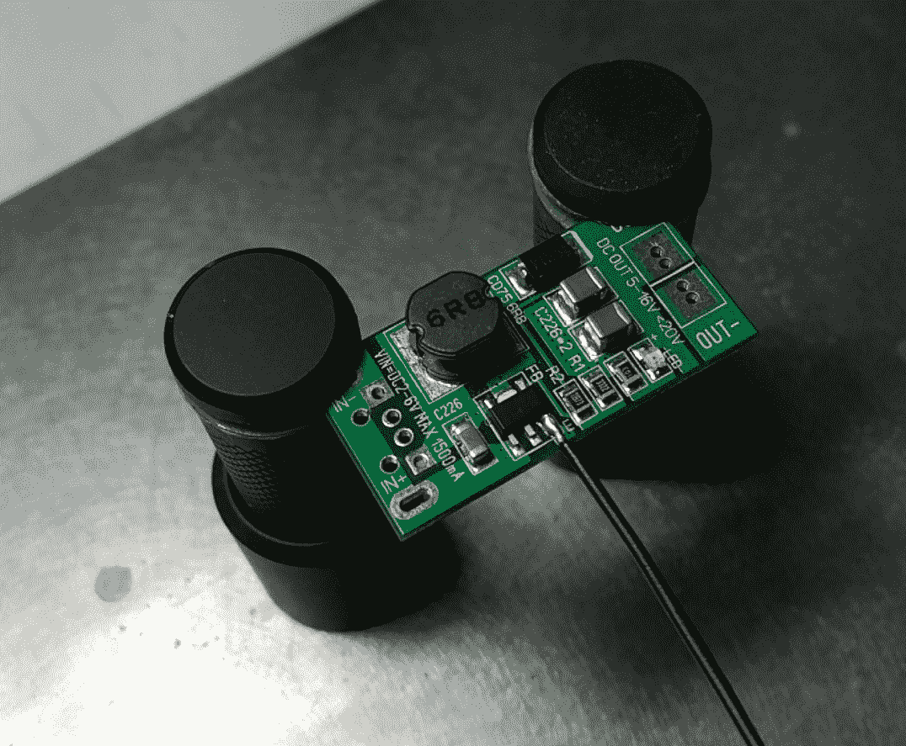

# 示例-带有 wi-fi 的土壤湿度监测器

保持室内植物存活是一项不小的壮举。本章中的示例项目将向您展示如何创建具有 Wi-Fi 功能的土壤湿度监测器，该监测器具有泵或类似设备的执行器选项，例如阀门和重力供水水箱。使用内置的 web 服务器，我们将能够使用其基于浏览器的 UI 来监视工厂运行状况和控制系统功能，或者使用其基于 HTTP 的 REST API 将其集成到更大的系统中。

本章涉及的主题如下:

*   Programming to ESP8266 microcontroller
*   将传感器和执行器连接到 ESP8266
*   在此平台上实现 HTTP 服务器
*   开发用于监视和控制的基于 web 的 UI
*   将项目整合到一个更大的网络中

# 保持植物快乐

为了让植物存活，你需要一些东西:

*   营养素
*   光
*   水

其中，前两个通常由营养丰富的土壤处理，并分别将植物放在光线充足的地方。满足这两点后保持植物存活的主要问题通常是第三点，因为这必须每天处理。

在这里，这不仅是保持水加满的简单问题，而且不要停留在土壤有足够水但没有太多水的范围内。土壤中水分过多会影响植物通过根部吸收的氧气量。结果，土壤中的水分过多，植物会枯萎而死亡。

另一方面，水太少意味着植物无法吸收足够的水来补偿通过其叶子蒸发的水，也无法将养分带入其根部。在这种情况下，植物也会枯萎死亡。

当手动给植物浇水时，我们倾向于用手指粗略估计植物何时可能需要更多的水，以及对表层土壤湿度的表面测试。这几乎没有告诉我们植物根部周围实际存在多少水，远低于土壤上层。

为了更精确地测量土壤的湿度，我们可以使用多种方法:

| Ingt0ggt0gt0btb0etaysblb0lb0etoeeeeoeoeoeoeoeoeoeoeoeoeoeeoeoeoeoeoeoeoeoeoeoeoeoeoeoeoeeoeoeoeoeoeeeeeoeoeoeeeoeoeoeeeoeoeeeeeoeeeee | **原则** | **注释** |
| 石膏砌块 | 阻力- | 水被石膏吸收，溶解了一部分，这使得电流在两个电极之间流动。电阻值表示土壤水分张力。 |
| Tensiometer | 真空 | 空心管的一端有一个真空计，另一端有一个多孔尖端，允许水自由进出。土壤从管中吸出的水会增加真空传感器的读数，这表明植物很难从土壤中提取水分 (水分张力)。 |
| Capacitance probe | **频域反射法** (**FDR**) | 使用振荡器电路中两个金属电极 (在土壤中) 之间的介电常数来测量由于湿度水平的变化而引起的该常数的变化。指示水分含量。 |
| 微波传感器 | **时域反射测量** (**TDR**) | 测量微波信号传播到平行探针末端并返回所需的时间，这取决于土壤的介电常数。测量水分含量。 |
| 探针 | 射频振幅阻抗 | 在包围土壤圆柱体的四个探针之间发送 100 MHz 正弦波无线电信号。正弦波阻抗的变化用于计算土壤中的水。 |
| 电阻探头 | 阻力 | 这类似于石膏块，只是电极。因此，这仅测量水分的存在 (及其电导率)，而不是土壤水分的张力。 |

所有这些传感器类型都有自己的缺点。在石膏块和张力计的情况下，需要大量的维护，因为前者依赖于剩余的石膏足以溶解而不会偏离校准，而在后一种情况下，必须保持气密密封，以免空气进入管中。此密封件中的任何间隙都会立即使真空传感器无用。

另一个重要的问题是成本。虽然基于 FDR 和 TDR 的探针可能相当准确，但它们也往往非常昂贵。这通常会导致只想尝试土壤湿度传感器的人选择基于电阻或电容的传感器。在这里，前一种传感器类型的主要缺点在一个月或更短的使用时间内变得明显: 腐蚀。

将两个电极悬浮在含有离子的溶液中，并将电流施加到其中一个电极上，简单的化学反应会导致其中一个电极迅速腐蚀 (失去材料)，直到其不再起作用。这也会用金属分子污染土壤。在单个电极上使用**交流电** (**AC**) 代替直流电可以在一定程度上降低腐蚀作用，但仍然是一个问题。

在便宜且仍然准确的土壤湿度传感器中，只有电容探头会打勾所有盒子。它的精度足以进行合理的测量和比较 (校准后)，不受土壤中水分的影响，也不会以任何方式影响土壤。

要真正将水输送到工厂，我们需要有一种方法来获得适量的水。在这里，主要是系统的规模决定了输水的选择。为了给整个田地浇水，我们可以使用基于叶轮的泵，每分钟能够输送许多升水。

对于单个工厂，我们最多需要能够以每分钟几百毫升的速度交付。在这里，诸如蠕动泵之类的东西将非常理想。这是一种泵，你也将在实验室和医疗应用中使用，你必须提供少量的流体高精度。

# 我们的解决方案

为了使事情变得简单，我们将只建造可以照顾单个工厂的东西。这将为我们在放置方面提供最大的灵活性，因为我们在每个工厂旁边只有一个系统，无论它是在窗台、桌子上还是在某个地方的露台上。

除了测量土壤湿度水平外，我们还希望系统能够以设定的触发水平自动为植物浇水，并使我们能够监视此过程。这需要某种网络访问，最好是无线的，这样我们就不必比电源连接器更多地运行电缆。

这使得 ESP8266 单片机非常有吸引力，NodeMCU 开发板是开发和调试系统的一个有吸引力的目标。我们会在上面连接一个土壤湿度传感器和一个蠕动泵。

通过使用 web 浏览器连接到 ESP8266 系统的 ip 地址，我们将看到系统的当前状态，土壤湿度水平以及可选的更多。配置系统和更多的工作将通过常用的紧凑二进制 MQTT 协议完成，系统还将发布当前系统状态，以便我们可以将其读取到数据库中以进行显示和分析。

这样，我们以后还可以编写一个后端服务，将许多这样的节点组合成一个具有中央控制和管理的连贯系统。这是我们实际上将在[第 9 章](09.html)，*示例-建筑物监视和控制*中详细介绍的内容。

# 硬件

我们理想的解决方案将拥有最准确的传感器，而不会破坏银行。这意味着我们几乎必须使用电容传感器，正如我们在本章前面看到的那样。这些传感器可以作为电容式土壤湿度传感器获得，只需花费几欧元或几美元，即可用于基于简单的 555 计时器 IC 设计，例如:


您只需将它们粘贴到土壤中，直到电路开始的位置，然后将其与电源以及连接到 MCU 的模数转换器。

人们可以购买的大多数蠕动泵都需要 12V。这意味着我们需要要么拥有可以同时提供 5v 和 12v 的电源，要么使用所谓的升压转换器将 5v 转换为 12V。无论哪种方式，我们还需要某种方法来打开或关闭泵。使用 boost 转换器，我们可以使用其*enable*引脚使用 MCU 上的 GPIO 引脚打开或关闭其输出。

对于原型制作，我们可以使用使用 ME2149 升压开关稳压器的这些常见的 5v 至 12v 升压转换器模块之一:


这些没有以任何方式断开启用引脚，但是我们可以轻松地将导线焊接到所讨论的引脚上:



然后，该升压转换器模块的输出连接到蠕动泵:


在这里，我们需要获得一些直径合适的管道，以将其连接到储水器和植物。泵本身将向任一方向旋转。由于它基本上由内部管道部分上的一组辊组成，它们以一种方式将液体推入内部，因此泵的任一侧都可以是输入或输出。

Be sure to test the flow direction beforehand with two containers and some water, and mark the direction on the pump casing, along with the positive and negative terminal connections used.

除了这些组件之外，我们还希望连接一个 RGB LED，用于一些信号和仅用于外观。为此，我们将使用**APA102**RGB LED 模块，该模块通过 SPI 总线连接到 ESP8266:


我们可以使用单个电源，该电源可以为 1A 或更高的电压提供 5V，并且每次激活泵时，都可以应对升压转换器的突然功率消耗。

整个系统看起来像这样:


# 固件

对于这个项目，我们将为我们将在[第 9 章](09.html)，*示例-建筑物监视和控制*中使用的相同固件实现模块。因此，本章将仅涵盖此植物浇水模块独有的部分。

在开始使用固件本身之前，我们首先必须设置开发环境。这涉及到安装 ESP8266 SDK 和 Sming 框架。

# 设置 Sming

基于 Sming 的 ESP8266 开发环境可以在 Linux、Windows 和 macOS 上使用。您希望最好使用 Sming 的开发分支，但是，在 Linux (或在 Linux VM 或 Windows 10 的**Windows 子系统 for Linux** (**WSL**) 中使用它是最简单的方法，并且绝对推荐。在 Linux 上，建议在`/opt`文件夹中安装，以与 Sming 快速入门指南保持一致。

本 Linux 快速入门指南可在 Linux-快速入门 https://github.com/SmingHub/Sming/wiki/ [找到。](https://github.com/SmingHub/Sming/wiki/Linux-Quickstart)

在 Linux 上，我们可以使用 ESP8266 的开放 SDK，该 SDK 采用官方的 Espressif (非 RTOS) SDK，并将其可以使用的所有非开放组件替换为开源替代方案。这可以使用以下代码安装:

```cpp
    git clone --recursive https://github.com/pfalcon/esp-open-sdk.git
    cd esp-open-sdk
    make VENDOR_SDK=1.5.4 STANDALONE=y  
```

这将获取开放 SDK 的当前源代码并进行编译，目标是官方 SDK 的版本 1.5.4。虽然 SDK 的 2.0 版本已经存在，但 Sming 框架中的一些兼容性问题仍然存在。使用 1.5.4 版本在使用经过良好测试的代码时提供了几乎相同的体验。这当然会随着时间的推移而改变，因此请务必查看官方 Sming 文档以获取更新的说明。

`STANDALONE`选项意味着 SDK 将被构建为 SDK 和工具链的独立安装，没有进一步的依赖关系。这是与 Sming 一起使用的所需选项。

安装`Sming`就像这样简单:

```cpp
    git clone https://github.com/SmingHub/Sming.git
    cd Sming
    make  
```

这将构建 Sming 框架。如果要在其`Libraries`文件夹中将新库添加到 Sming，则必须再次执行最后一步，以构建和安装新的 Sming 共享库实例。

For this project, copy the folders in the `libs` folder of the software project for this chapter to the `Sming/Sming/Libraries` folder prior to compiling Sming, or the project code will not compile.

我们还可以使用 SSL 支持编译 Sming。这就需要我们用`ENABLE_SSL=1`参数来编译它来使。这将在整个 Sming 库编译时启用基于 axTLS 的加密支持。

完成这些步骤后，我们只需要安装`esptool.py`和`esptool2`。在`/opt`文件夹中，执行以下命令以获取 esptool:

```cpp
    wget https://github.com/themadinventor/esptool/archive/master.zip
    unzip master.zip
    mv esptool-master esp-open-sdk/esptool  
```

`Esptool.py`是一个 Python 脚本，它允许我们与作为每个 ESP8266 模块的一部分的 SPI ROM 进行通信。这是我们用代码刷新 MCU ROM 的方式。该工具由 Sming 自动使用:

```cpp
    cd  $ESP_HOME
    git clone https://github.com/raburton/esptool2
    cd esptool2
    make  
```

`esptool2`实用程序是官方 SDK 中的一组脚本的替代方案，该脚本将链接器输出转换为我们可以写入 esp8266 的 ROM 格式。当我们编译应用程序时，它是由 Sming 调用的。

最后，假设我们在`/opt`下安装了 SDK 和 Sming，我们可以在系统`PATH`变量中添加以下全局变量和加法:

```cpp
    export ESP_HOME=/opt/esp-open-sdk
    export SMING_HOME=/opt/Sming/Sming
    export PATH=$PATH:$ESP_HOME/esptool2
    export PATH=$PATH:$ESP_HOME/xtensa-lx106-elf/bin  
```

最后一行将工具链的二进制文件添加到路径中，这是我们在调试 ESP8266 应用程序时需要的，如[第 7 章](07.html)，*测试资源受限平台*中所示。此时，我们可以使用 Sming 进行开发并创建可以写入 MCU 的 ROM 映像。

# 工厂模块代码

在本节中，我们将查看该项目的基本源代码，从核心模块`OtaCore`开始，继续到所有固件模块都注册的`BaseModule`类。最后，我们看一下`PlantModule`类本身，它包含了我们在本章中讨论的项目需求的业务逻辑。

还要注意的是，对于此项目，我们在项目 Makefile 中启用了 rBoot bootmanager 和 rBoot Big Flash 选项。这样做是在我们的 ESP8266 模块 (所有 ESP-12E/F 模块) 上可用的 4 MB ROM 中创建四个 1 mb 块，其中两个用于固件映像，其余两个用于文件存储 (使用 SPIFFS 文件系统)。

然后将 rBoot 引导加载程序写入 ROM 的开头，以便在每次引导时首先加载它。在固件插槽中，在任何给定时间只有一个是活动的。此设置的一个方便的功能是，它允许我们通过将新的固件映像写入非活动固件插槽，更改活动插槽并重新启动 MCU，轻松执行**无线** (**OTA**) 更新。如果 rBoot 无法从新的固件映像启动，它将退回到另一个固件插槽上，这是我们从中执行 OTA 更新的已知工作固件。

# Makefile-user.mk

在`project`文件夹的根目录中，我们找到了这个 Makefile。它包含许多我们可能要设置以适合我们目的的设置:

| **名称** | **说明** |
| `COM_PORT`] | 如果我们始终将电路板连接到同一串行端口，则可以在此处对其进行硬编码，以节省自己的打字时间。 |
| `SPI_MODE`] | 这将设置在将固件映像闪烁到 SPI ROM 时使用的 SPI 模式。只有两条数据线 (`SD_D0`，`D1`) 或四条 (`SD_D0-3`)。并非所有 SPI rom 都连接了所有四条数据线。`qio`模式更快，但`dio`应该始终有效。 |
| `RBOOT_ENABLED`] | 当设置为 1 时，这将启用 rBoot 引导加载程序支持。我们希望启用此功能。 |
| `RBOOT_BIG_FLASH`] | 有 4 MB 的 ROM 可用，我们希望使用所有这些。也启用此功能。 |
| `RBOOT_TWO_ROMS`] | 如果我们希望在单个 1 MB ROM 芯片中放置两个固件映像，则可以使用此选项。这适用于某些 ESP8266 模块和衍生物。 |
| `SPI_SIZE`] | 在这里，我们设置 SPI ROM 芯片的尺寸，对于该项目，该尺寸应为 4M。 |
| `SPIFF_FILES`] | 包含将被写入 MCU 的 SPIFFS ROM 映像上的文件的文件夹的位置。 |
| `SPIFFS_SIZE`] | 要创建的 SPIFFS ROM 图像的大小。在这里，64 KB 是标准的，但是如果需要，在启用`RBOOT_BIG_FLASH`选项的情况下使用 4 MB ROM 时，我们最多可以使用 1 MB。 |
| `WIFI_SSID`] | 我们希望连接到的 wi-fi 网络的 SSID。 |
| `WIFI_PWD`] | Wi-fi 网络的密码。 |
| `MQTT_HOST`] | 要使用的 MQTT 服务器 (broker) 的 URL 或 ip 地址。 |
| `ENABLE_SSL`] | 使用编译到 Sming 中的 SSL 支持启用此功能，以使固件使用与 MQTT 代理的 TLS 加密连接。 |
| `MQTT_PORT`] | MQTT 经纪人的端口。这取决于是否启用 SSL。 |
| `USE_MQTT_PASSWORD`] | 如果您希望使用用户名和密码连接到 MQTT 代理，请设置为 true。 |
| `MQTT_USERNAME`] | MQTT broker 用户名 (如果需要)。 |
| `MQTT_PWD`] | MQTT 代理密码 (如果需要)。 |
| `MQTT_PREFIX`] | 如有必要，您可以选择在固件使用的每个 MQTT 主题前面添加前缀。如果不留空，它必须以斜线结尾。 |
| `OTA_URL`] | 每当请求 OTA 更新时，固件将使用的硬编码 URL。 |

其中，wi-fi、MQTT 和 OTA 设置是必不可少的，因为它们将允许应用程序连接到网络和 MQTT 代理，以及接收固件更新，而无需通过其串行接口刷新 MCU。

# 主要

主源文件和它的应用程序入口点是相当顺利的:

```cpp
#include "ota_core.h"
void onInit() {
    // 
}
void init() {
         OtaCore::init(onInit);
 }
```

对于包含主要应用程序逻辑的`OtaCore`类，如果我们希望在核心类完成网络、MQTT 和其他功能的设置后执行任何进一步的逻辑，我们只会调用它的静态初始化函数，同时提供回调函数。

# OtaCore

在此类中，我们除了为日志记录和 MQTT 功能提供实用程序功能外，还为特定功能模块设置了所有基本网络功能。此类还包含用于通过 MQTT 接收的命令的主命令处理器:

```cpp
#include <user_config.h>
#include <SmingCore/SmingCore.h>
```

这两个包括使用 Sming 框架。包含 SDK (`user_config.h`) 和 Sming (`SmingCore.h`) 的主标头。这也定义了一些预处理器语句，比如使用开源的**轻量级 IP 栈** (**LWIP**) 以及处理官方 SDK 中的一些问题。

同样值得注意的是`esp_cplusplus.h`标题，它是以这种方式间接包含的。它的源文件实现了`new`和`delete`函数，以及一些类相关功能的处理程序，例如使用虚拟类时的`vtables`。这样可以与 STL 兼容:

```cpp
enum {
          LOG_ERROR = 0,
          LOG_WARNING,
          LOG_INFO,
          LOG_DEBUG,
          LOG_TRACE,
          LOG_XTRACE
 };

 enum ESP8266_pins {
          ESP8266_gpio00 = 0x00001,     // Flash
          ESP8266_gpio01 = 0x00002,     // TXD 0
          ESP8266_gpio02 = 0x00004,     // TXD 1
          ESP8266_gpio03 = 0x00008,     // RXD 0
          ESP8266_gpio04 = 0x00010,     // 
          ESP8266_gpio05 = 0x00020,     // 
          ESP8266_gpio09 = 0x00040,     // SDD2 (QDIO Flash)
          ESP8266_gpio10 = 0x00080,     // SDD3 (QDIO Flash)
          ESP8266_gpio12 = 0x00100,     // HMISO (SDO)
          ESP8266_gpio13 = 0x00200,     // HMOSI (SDI)
          ESP8266_gpio14 = 0x00400,     // SCK
          ESP8266_gpio15 = 0x00800,     // HCS
          ESP8266_gpio16 = 0x01000,     // User, Wake
          ESP8266_mosi = 0x02000,
          ESP8266_miso = 0x04000,
          ESP8266_sclk = 0x08000,
          ESP8266_cs = 0x10000
 };
```

这两个枚举定义了日志记录级别，以及我们可能要使用的 ESP8266 的各个 GPIO 和其他引脚。ESP8266 引脚枚举的值对应于位掩码中的位置:

```cpp
#define SCL_PIN 5
#define SDA_PIN 4
```

在这里，我们定义 I2C 总线的固定引脚。它们对应于 GPIO 4 和 5，也称为 NodeMCU 板上的**D1**和**D2**。预定义这些引脚的主要原因是它们是 esp8266 上为数不多的*安全*引脚中的两个。

ESP8266 的许多引脚在启动期间会在沉降之前改变电平，这可能会导致任何连接的外围设备出现不必要的行为。

```cpp
typedef void (*topicCallback)(String);
typedef void (*onInitCallback)();
```

我们定义了两个函数指针，一个供特征模块在希望注册 MQTT 主题时使用，以及一个回调函数。另一个是我们在 main 函数中看到的回调。

```cpp

class OtaCore {
         static Timer procTimer;
         static rBootHttpUpdate* otaUpdater;
         static MqttClient* mqtt;
         static String MAC;
         static HashMap<String, topicCallback>* topicCallbacks;
         static HardwareSerial Serial1;
         static String location;
         static String version;
         static int sclPin;
         static int sdaPin;
         static bool i2c_active;
         static bool spi_active;
         static uint32 esp8266_pins;

         static void otaUpdate();
         static void otaUpdate_CallBack(rBootHttpUpdate& update, bool result);
         static void startMqttClient();
         static void checkMQTTDisconnect(TcpClient& client, bool flag);
         static void connectOk(IPAddress ip, IPAddress mask, IPAddress gateway);
         static void connectFail(String ssid, uint8_t ssidLength, uint8_t *bssid,    uint8_t reason);
         static void onMqttReceived(String topic, String message);
         static void updateModules(uint32 input);
         static bool mapGpioToBit(int pin, ESP8266_pins &addr);

public:
         static bool init(onInitCallback cb);
         static bool registerTopic(String topic, topicCallback cb);
         static bool deregisterTopic(String topic);
         static bool publish(String topic, String message, int qos = 1);
         static void log(int level, String msg);
         static String getMAC() { return OtaCore::MAC; }
         static String getLocation() { return OtaCore::location; }
         static bool starti2c();
         static bool startSPI();
         static bool claimPin(ESP8266_pins pin);
         static bool claimPin(int pin);
         static bool releasePin(ESP8266_pins pin);
         static bool releasePin(int pin);
};
```

类声明本身很好地概述了该类提供的功能。我们注意到的第一件事是，它是完全静态的。这样可以确保在固件启动时立即初始化该类的功能，并且可以全局访问该类，而不必担心特定的实例。

我们还可以看到`uint32`类型的第一次使用，它与其他整数类型一起被定义为类似于`cstdint`标头中的那些类型。

继续前进，这是实现:

```cpp
#include <ota_core.h>

#include "base_module.h"

#define SPI_SCLK 14
#define SPI_MOSI 13
#define SPI_MISO 12
#define SPI_CS 15

Timer OtaCore::procTimer;
rBootHttpUpdate* OtaCore::otaUpdater = 0;
MqttClient* OtaCore::mqtt = 0;
String OtaCore::MAC;
HashMap<String, topicCallback>* OtaCore::topicCallbacks = new HashMap<String, topicCallback>();
HardwareSerial OtaCore::Serial1(UART_ID_1); // UART 0 is 'Serial'.
String OtaCore::location;
String OtaCore::version = VERSION;
int OtaCore::sclPin = SCL_PIN; // default.
int OtaCore::sdaPin = SDA_PIN; // default.
bool OtaCore::i2c_active = false;
bool OtaCore::spi_active = false;
uint32 OtaCore::esp8266_pins = 0x0;
```

我们在这里包含了`BaseModule`类的头，这样我们就可以在完成基本功能设置后，稍后调用它自己的初始化函数。这里还初始化了静态类成员，并在相关的地方分配了许多默认值。

值得注意的是，除了默认的串行对象实例之外，还初始化了第二个串行接口对象。这些对应于 esp8266 上的第一个 (UART0，串行) 和第二个 (UART1，串行 1) UART。

对于旧版本的 Sming，与 SPIFFS 相关的文件函数在二进制数据方面遇到了麻烦 (由于内部假定为 null 终止的字符串)，这就是为什么添加了以下替代函数的原因。它们的命名是从原来的函数名稍微倒过来的版本，以防止命名冲突。

由于存储在 SPIFFS 上的 TLS 证书和其他二进制数据文件必须能够被写入和读取，固件才能正常运行，这是一个必要的妥协。

```cpp
String getFileContent(const String fileName) {
         file_t file = fileOpen(fileName.c_str(), eFO_ReadOnly);

         fileSeek(file, 0, eSO_FileEnd);
         int size = fileTell(file);
         if (size <= 0)    {
                fileClose(file);
                return "";
         }

         fileSeek(file, 0, eSO_FileStart);
         char* buffer = new char[size + 1];
         buffer[size] = 0;
         fileRead(file, buffer, size);
         fileClose(file);
         String res(buffer, size);
         delete[] buffer;
         return res;
}
```

该函数将指定文件的全部内容读取到返回的`String`实例中。

```cpp
void setFileContent(const String &fileName, const String &content) {
          file_t file = fileOpen(fileName.c_str(),                                                   eFO_CreateNewAlways | eFO_WriteOnly);
          fileWrite(file, content.c_str(), content.length());
          fileClose(file);
 }
```

该函数将文件中的现有内容替换为提供的`String`实例中的新数据。

```cpp
bool readIntoFileBuffer(const String filename, char* &buffer, unsigned int &size) {
         file_t file = fileOpen(filename.c_str(), eFO_ReadOnly);

         fileSeek(file, 0, eSO_FileEnd);
         size = fileTell(file);
         if (size == 0)    {
                fileClose(file);
                return true;
         }

         fileSeek(file, 0, eSO_FileStart);
         buffer = new char[size + 1];
         buffer[size] = 0;
         fileRead(file, buffer, size);
         fileClose(file);
         return true;
}
```

这个函数类似于`getFileContent()`，但是返回一个简单的字符缓冲区，而不是一个`String`实例。它主要用于读取证书数据，这些数据被传递到基于 C 的 TLS 库 (称为 axTLS) 中，在转换为`String`实例的情况下，涉及复制会很浪费，尤其是在证书大小可能只有几 KB 的情况下。

接下来是该类的初始化函数:

```cpp
bool OtaCore::init(onInitCallback cb) {
         Serial.begin(9600);

         Serial1.begin(SERIAL_BAUD_RATE); 
         Serial1.systemDebugOutput(true);
```

我们首先初始化 NodeMCU 中的两个 uart (串行接口)。尽管 ESP8266 中正式有两个 uart，但第二个仅由 TX 输出线 (默认为 GPIO 2) 组成。因此，我们希望为需要完整串行线的应用程序 (例如某些传感器) 保持第一个 UART 免费。

因此，第一个 UART (`Serial`) 被初始化，以便我们以后可以将其与功能模块一起使用，而第二个 UART (`Serial1`) 被初始化为默认的 115,200 波特率，以及系统的调试输出 (WiFi/IP 堆栈，等等) 也被定向到这个串行输出。因此，第二个串行接口将仅用于记录输出。

```cpp
         BaseModule::init(); 
```

接下来，也初始化`BaseModule`静态类。这会导致在此固件中激活的所有功能模块都被注册，从而允许它们稍后被激活。

```cpp
         int slot = rboot_get_current_rom();
         u32_t offset;
         if (slot == 0) { offset = 0x100000; }
         else { offset = 0x300000; }
         spiffs_mount_manual(offset, 65536);
```

在使用 rBoot 引导加载程序时自动安装 SPIFFS 文件系统不适用于 Sming 的较旧版本，这就是为什么我们在此处手动进行操作的原因。为此，我们从 rBoot 中获取当前固件插槽，使用该插槽，我们可以在 ROM 中第二兆字节或第四兆字节的开始处选择适当的偏移量。

在确定偏移量后，我们将 SPIFFS 手动安装功能与我们的偏移量和 SPIFFS 部分的尺寸一起使用。我们现在能够读写我们的存储。

```cpp

          Serial1.printf("\r\nSDK: v%s\r\n", system_get_sdk_version());
     Serial1.printf("Free Heap: %d\r\n", system_get_free_heap_size());
     Serial1.printf("CPU Frequency: %d MHz\r\n", system_get_cpu_freq());
     Serial1.printf("System Chip ID: %x\r\n", system_get_chip_id());
     Serial1.printf("SPI Flash ID: %x\r\n", spi_flash_get_id());
```

接下来，我们将一些系统详细信息打印到串行调试输出中。这包括我们编译的 ESP8266 SDK 版本，当前的自由堆大小，CPU 频率，MCU ID (32 位 ID) 和 SPI ROM 芯片的 ID。

```cpp
         mqtt = new MqttClient(MQTT_HOST, MQTT_PORT, onMqttReceived);
```

我们在堆上创建一个新的 MQTT 客户端，提供当我们收到新消息时将调用的回调。MQTT 代理主机和端口由预处理器从我们在项目的用户 Makefile 中添加的详细信息中填写。

```cpp

         Serial1.printf("\r\nCurrently running rom %d.\r\n", slot);

         WifiStation.enable(true);
         WifiStation.config(WIFI_SSID, WIFI_PWD);
         WifiStation.connect();
         WifiAccessPoint.enable(false);

        WifiEvents.onStationGotIP(OtaCore::connectOk);
        WifiEvents.onStationDisconnect(OtaCore::connectFail);

          (*cb)();
}
```

作为初始化的最后步骤，我们输出当前运行的固件插槽，然后启用 wi-fi 客户端，同时禁用**无线接入点** (**WAP**) 功能。WiFi 客户端被告知使用我们先前在 Makefile 中指定的凭据连接到 WiFi SSID。

最后，在调用作为参数提供的回调函数之前，我们为成功的 WiFi 连接和失败的连接尝试定义了处理程序。

固件 OTA 更新后，将调用以下回调函数:

```cpp

void OtaCore::otaUpdate_CallBack(rBootHttpUpdate& update, bool result) {
         OtaCore::log(LOG_INFO, "In OTA callback...");
         if (result == true) { // success
               uint8 slot = rboot_get_current_rom();
               if (slot == 0) { slot = 1; } else { slot = 0; }

               Serial1.printf("Firmware updated, rebooting to ROM slot %d...\r\n",                                                                                                                        slot);
               OtaCore::log(LOG_INFO, "Firmware updated, restarting...");
               rboot_set_current_rom(slot);
               System.restart();
         } 
         else {
               OtaCore::log(LOG_ERROR, "Firmware update failed.");
         }
}
```

在此回调中，如果 OTA 更新成功，我们将更改活动 ROM 插槽，然后重新启动系统。否则，我们只是记录错误，而不会重新启动。

接下来是几个与 MQTT 相关的函数:

```cpp
bool OtaCore::registerTopic(String topic, topicCallback cb) {
         OtaCore::mqtt->subscribe(topic);
         (*topicCallbacks)[topic] = cb;
         return true;
}

bool OtaCore::deregisterTopic(String topic) {
         OtaCore::mqtt->unsubscribe(topic);
         if (topicCallbacks->contains(topic)) {
               topicCallbacks->remove(topic);
         }

         return true;
}
```

这两个功能允许功能模块分别注册和注销 MQTT 主题以及回调。通过订阅或取消订阅请求调用 MQTT broker，并相应地更新`HashMap`实例:

```cpp
bool OtaCore::publish(String topic, String message, int qos /* = 1 */) {
         OtaCore::mqtt->publishWithQoS(topic, message, qos);
         return true;
}
```

任何功能模块都可以使用此功能在任何主题上发布 MQTT 消息。**服务质量** (**QoS**) 参数决定发布模式。默认情况下，消息以*retain*模式发布，这意味着经纪人将为特定主题保留最后发布的消息。

OTA 更新功能的入口点可以在以下函数中找到:

```cpp
void OtaCore::otaUpdate() {
         OtaCore::log(LOG_INFO, "Updating firmware from URL: " + String(OTA_URL));

         if (otaUpdater) { delete otaUpdater; }
         otaUpdater = new rBootHttpUpdate();

         rboot_config bootconf = rboot_get_config();
         uint8 slot = bootconf.current_rom;
         if (slot == 0) { slot = 1; } else { slot = 0; }

         otaUpdater->addItem(bootconf.roms[slot], OTA_URL + MAC);

         otaUpdater->setCallback(OtaCore::otaUpdate_CallBack);
         otaUpdater->start();
}
```

对于 OTA 更新，我们需要创建一个干净的`rBootHttpUpdate`实例。然后，我们需要使用当前固件插槽的详细信息来配置此实例，为此，我们从 rBoot 获得配置，并获得当前固件插槽号。我们用来将其他固件插槽的编号提供给 OTA 更新器。

在这里，我们仅将其配置为更新固件插槽，但也可以通过这种方式更新其他固件插槽的 SPIFFS 部分。固件将从我们之前设置的固定 URL 通过 HTTP 获取。ESP8266 的 MAC 地址作为唯一的查询字符串参数附加到它的末尾，以便更新服务器知道哪个固件映像适合该系统。

在设置了我们前面看过的`callback`函数之后，我们开始更新:

```cpp
void OtaCore::checkMQTTDisconnect(TcpClient& client, bool flag) {
         if (flag == true) { Serial1.println("MQTT Broker disconnected."); }
         else { 
               String tHost = MQTT_HOST;
               Serial1.println("MQTT Broker " + tHost + " unreachable."); }

         procTimer.initializeMs(2 * 1000, OtaCore::startMqttClient).start();
}
```

在这里，我们定义了 MQTT 断开处理程序。每当与 MQTT 代理的连接失败时，就会调用它，以便我们可以在两秒钟的延迟后尝试重新连接。

如果我们以前连接过，则 flag 参数设置为 true，如果初始 MQTT broker 连接失败 (无网络访问、地址错误等)，则设置为 false。

接下来是配置和启动 MQTT 客户端的功能:

```cpp
void OtaCore::startMqttClient() {
         procTimer.stop();
         if (!mqtt->setWill("last/will",                                 "The connection from this device is lost:(",    1, true)) {
               debugf("Unable to set the last will and testament. Most probably there is not enough memory on the device.");
         }
```

如果 procTimer 计时器正在运行，我们会停止它，以防我们被重新连接计时器调用。接下来，我们为该设备设置**last will and teste** (**LWT**)，它允许我们设置 MQTT broker 在失去与客户端 (us) 的连接时将发布的消息。

接下来，我们定义三个不同的执行路径，其中只有一个将被编译，这取决于我们是使用 TLS (SSL)，用户名/密码登录，还是匿名访问:

```cpp
#ifdef ENABLE_SSL
         mqtt->connect(MAC, MQTT_USERNAME, MQTT_PWD, true);
         mqtt->addSslOptions(SSL_SERVER_VERIFY_LATER);

       Serial1.printf("Free Heap: %d\r\n", system_get_free_heap_size());

         if (!fileExist("esp8266.client.crt.binary")) {
               Serial1.println("SSL CRT file is missing: esp8266.client.crt.binary.");
               return;
         }
         else if (!fileExist("esp8266.client.key.binary")) {
               Serial1.println("SSL key file is missing: esp8266.client.key.binary.");
               return;
         }

         unsigned int crtLength, keyLength;
         char* crtFile;
         char* keyFile;
         readIntoFileBuffer("esp8266.client.crt.binary", crtFile, crtLength);
         readIntoFileBuffer("esp8266.client.key.binary", keyFile, keyLength);

         Serial1.printf("keyLength: %d, crtLength: %d.\n", keyLength, crtLength);
         Serial1.printf("Free Heap: %d\r\n", system_get_free_heap_size());

         if (crtLength < 1 || keyLength < 1) {
               Serial1.println("Failed to open certificate and/or key file.");
               return;
         }

         mqtt->setSslClientKeyCert((const uint8_t*) keyFile, keyLength,
                                                (const uint8_t*) crtFile, crtLength, 0, true);
         delete[] keyFile;
         delete[] crtFile;

    Serial1.printf("Free Heap: %d\r\n", system_get_free_heap_size());
```

如果我们使用的是 TLS 证书，我们将使用我们的`MAC`作为客户端标识符与 MQTT 代理建立连接，然后为连接启用 SSL 选项。可用堆空间被打印到串行日志记录输出中，用于调试目的。通常，在这一点上，我们应该剩下大约 25 KB 的 RAM，这足以将证书和密钥保存在内存中，以及 TLS 握手的 RX 和 TX 缓冲区，如果后者在 SSL 端点上配置为使用 SSL 片段大小选项的可接受大小。我们将在[第 9 章](09.html)，*示例 -- 建筑管理与控制*中对此进行更详细的介绍。

接下来，我们从 SPIFFS 读取 DER 编码 (二进制) 证书和密钥文件。这些文件有一个固定的名称。对于每个文件，我们打印出文件大小以及当前的空闲堆大小。如果任一文件大小为零字节，我们认为读取尝试失败，并中止连接尝试。

否则，我们将密钥和证书数据与 MQTT 连接一起使用，这将导致成功握手并与 MQTT 代理建立加密连接。

删除密钥和证书文件数据后，我们打印出空闲堆大小，以允许我们检查清理是否成功:

```cpp
#elif defined USE_MQTT_PASSWORD
          mqtt->connect(MAC, MQTT_USERNAME, MQTT_PWD);
```

当使用 MQTT 用户名和密码登录代理时，我们只需要在 MQTT 客户端实例上调用上一个函数，提供我们的 MAC 作为客户端标识符以及用户名和密码:

```cpp
#else
         mqtt->connect(MAC);
#endif
```

为了匿名连接，我们与经纪人建立了一个连接，并通过我们的`MAC`作为客户端标识符:

```cpp
         mqtt->setCompleteDelegate(checkMQTTDisconnect);

         mqtt->subscribe(MQTT_PREFIX"upgrade");
         mqtt->subscribe(MQTT_PREFIX"presence/tell");
         mqtt->subscribe(MQTT_PREFIX"presence/ping");
         mqtt->subscribe(MQTT_PREFIX"presence/restart/#");
         mqtt->subscribe(MQTT_PREFIX"cc/" + MAC);

         delay(100);

         mqtt->publish(MQTT_PREFIX"cc/config", MAC);
}
```

在这里，我们首先设置 MQTT 断开处理程序。然后，我们订阅了许多我们希望回应的主题。这些都与此固件的管理功能有关，从而允许通过 MQTT 查询和配置系统。

订阅后，我们简短地 (100 毫秒) 等待给经纪人一些时间来处理这些订阅，然后我们发布在中央通知主题上，使用我们的`MAC`让任何感兴趣的客户端和服务器知道这个系统刚刚上线。

接下来是 WiFi 连接处理程序:

```cpp
void OtaCore::connectOk(IPAddress ip, IPAddress mask, IPAddress gateway) {
          Serial1.println("I'm CONNECTED. IP: " + ip.toString());

          MAC = WifiStation.getMAC();
          Serial1.printf("MAC: %s.\n", MAC.c_str());

          if (fileExist("location.txt")) {
                location = getFileContent("location.txt");
          }
          else {
                location = MAC;
          }

          if (fileExist("config.txt")) {
                String configStr = getFileContent("config.txt");
                uint32 config;
                configStr.getBytes((unsigned char*) &config, sizeof(uint32), 0);
                updateModules(config);
          }

          startMqttClient();
 }
```

当我们使用提供的凭据成功连接到配置的 WiFi 网络时，将调用此处理程序。连接后，我们将我们的`MAC`的副本保存在内存中作为我们的唯一 ID。

此固件还支持将用户定义的字符串指定为我们的位置或类似的标识符。如果之前已经定义了一个，我们从 SPIFFS 加载并使用它; 否则，我们的位置字符串只是`MAC`。

同样，如果存在，我们将从 SPIFFS 加载定义特征模块配置的 32 位位掩码。如果不是，则最初将所有功能模块停用。否则，我们将读取位掩码并将其传递给`updateModules()`函数，以便激活相关模块:

```cpp
void OtaCore::connectFail(String ssid, uint8_t ssidLength, 
                                                   uint8_t* bssid, uint8_t reason) {
          Serial1.println("I'm NOT CONNECTED. Need help :(");
          debugf("Disconnected from %s. Reason: %d", ssid.c_str(), reason);

          WDT.alive();

          WifiEvents.onStationGotIP(OtaCore::connectOk);
          WifiEvents.onStationDisconnect(OtaCore::connectFail);
 }
```

如果连接到 wi-fi 网络失败，我们记录此事实，然后告诉 MCU 的看门狗计时器我们仍然活着，以防止在尝试再次连接之前进行软重启。

这完成了所有的初始化函数。接下来是正常活动期间使用的函数，从 MQTT 消息处理程序开始:

```cpp
void OtaCore::onMqttReceived(String topic, String message) {
         Serial1.print(topic);
         Serial1.print(":\n");
         Serial1.println(message);

         log(LOG_DEBUG, topic + " - " + message);

         if (topic == MQTT_PREFIX"upgrade" && message == MAC) {
                otaUpdate();
         }
         else if (topic == MQTT_PREFIX"presence/tell") {
                mqtt->publish(MQTT_PREFIX"presence/response", MAC);
         }
         else if (topic == MQTT_PREFIX"presence/ping") {
               mqtt->publish(MQTT_PREFIX"presence/pong", MAC);
         }
         else if (topic == MQTT_PREFIX"presence/restart" && message == MAC) {
               System.restart();
         }
         else if (topic == MQTT_PREFIX"presence/restart/all") {
               System.restart();
         }
```

我们在最初创建 MQTT 客户端实例时注册了这个回调。每当我们订阅的主题在代理上收到新消息时，都会通知我们，并且此回调会收到包含该主题的字符串和包含实际消息 (有效负载) 的另一个字符串。

我们可以将主题与我们注册的主题进行比较，并执行所需的操作，无论是执行 OTA 更新 (如果它指定了我们的`MAC`)，还是通过返回带有我们的`MAC`的 pong 响应来响应 ping 请求，还是重新启动系统。

下一个主题是更通用的维护主题，允许配置活动功能模块，设置位置字符串并请求系统的当前状态。有效负载格式由命令字符串后跟分号，然后是有效负载字符串组成:

```cpp
   else if (topic == MQTT_PREFIX"cc/" + MAC) {
          int chAt = message.indexOf(';');
          String cmd = message.substring(0, chAt);
          ++chAt;

          String msg(((char*) &message[chAt]), (message.length() - chAt));

          log(LOG_DEBUG, msg);

          Serial1.printf("Command: %s, Message: ", cmd.c_str());
          Serial1.println(msg);
```

我们首先使用简单的查找和子字符串方法从有效负载字符串中提取命令。然后，我们读入剩余的有效负载字符串，注意将其作为二进制字符串读入。为此，我们使用剩余字符串的长度作为开始位置，即分号之后的字符。

在这一点上，我们已经提取了命令和有效负载，可以看到我们必须做什么:

```cpp

         if (cmd == "mod") {
               if (msg.length() != 4) {
                     Serial1.printf("Payload size wasn't 4 bytes: %d\n", msg.length());
                     return; 
               }

               uint32 input;
               msg.getBytes((unsigned char*) &input, sizeof(uint32), 0);
               String byteStr;
               byteStr = "Received new configuration: ";
               byteStr += input;
               log(LOG_DEBUG, byteStr);
               updateModules(input);               
          }
```

此命令设置哪些功能模块应该处于活动状态。它的有效负载应该是一个无符号的 32 位整数，形成一个位掩码，我们检查它以确保我们已经接收到正好四个字节。

在位掩码中，每个位都与一个模块匹配，此时模块如下:

| **Bit position** | **值** |
| 0x01 | THPModule |
| 0x02 | 二氧化碳模块 |
| 0x04 | 侏罗纪 |
| 0x08 | JuraTermModule |
| 0x10 | 运动模块 |
| 0x20 | Pwm Modules |
| 0x40 | IOModules |
| 0x80 | 开关模块 |
| 0x100 | 植物模块 |

其中，CO2、Jura 和 JuraTerm 模块是互斥的，因为它们都使用第一个 UART (`Serial`)。如果在位掩码中仍指定了其中的两个或多个，则将仅启用第一个模块，而其他模块将被忽略。我们将在[第 9 章](09.html)，*示例-建筑管理与控制*中更详细地了解这些其他功能模块。

获得新的配置位掩码后，我们将其发送到`updateModules()`函数:

```cpp
        else if (cmd == "loc") {
               if (msg.length() < 1) { return; }
               if (location != msg) {
                     location = msg;
                     fileSetContent("location.txt", location);
               }
         }
```

使用此命令，我们设置新的位置字符串 (如果它与当前字符串不同)，还将其保存到 SPIFFS 中的位置文件中，以在重新启动时将其保留:

```cpp
         else if (cmd == "mod_active") {
               uint32 active_mods = BaseModule::activeMods();
               if (active_mods == 0) {
                     mqtt->publish(MQTT_PREFIX"cc/response", MAC + ";0");
                     return;
               }

               mqtt->publish(MQTT_PREFIX"cc/response", MAC + ";"                                                         + String((const char*) &active_mods, 4));
         }
         else if (cmd == "version") {
               mqtt->publish(MQTT_PREFIX"cc/response", MAC + ";" + version);
         }
         else if (cmd == "upgrade") {
               otaUpdate();
         }
   }
```

本节中的最后三个命令返回活动功能模块的当前位掩码，固件版本，并触发 OTA 升级:

```cpp
         else {
               if (topicCallbacks->contains(topic)) {
                     (*((*topicCallbacks)[topic]))(message);
                }
         }
}
```

`if...else`块中的最后一个条目查看该主题是否可能在我们的功能模块回调列表中找到。如果找到，则使用 MQTT 消息字符串调用回调。

自然，这意味着只有一个功能模块可以将自己注册到特定主题。由于每个模块都倾向于在自己的 MQTT 子主题下操作以隔离消息流，因此这通常不是问题:

```cpp
void OtaCore::updateModules(uint32 input) {
         Serial1.printf("Input: %x, Active: %x.\n", input, BaseModule::activeMods());

         BaseModule::newConfig(input);

         if (BaseModule::activeMods() != input) {
               String content(((char*) &input), 4);
               setFileContent("config.txt", content);
         }
}
```

这个函数非常简单。它主要用作`BaseModule`类的传递，但它也确保我们将配置文件保持在 SPIFFS 中是最新的，并在更改时将新的位掩码写入其中。

我们绝对必须防止对 SPIFFs 进行不必要的写入，因为底层闪存存储具有有限的写入周期。限制写入周期可以大大延长硬件的使用寿命，并减少整体系统负载:

```cpp
bool OtaCore::mapGpioToBit(int pin, ESP8266_pins &addr) {
          switch (pin) {
                case 0:
                      addr = ESP8266_gpio00;
                      break;
                case 1:
                      addr = ESP8266_gpio01;
                      break;
                case 2:
                      addr = ESP8266_gpio02;
                      break;
                case 3:
                      addr = ESP8266_gpio03;
                      break;
                case 4:
                      addr = ESP8266_gpio04;
                      break;
                case 5:
                      addr = ESP8266_gpio05;
                      break;
                case 9:
                      addr = ESP8266_gpio09;
                      break;
                case 10:
                      addr = ESP8266_gpio10;
                      break;
                case 12:
                      addr = ESP8266_gpio12;
                      break;
                case 13:
                      addr = ESP8266_gpio13;
                      break;
                case 14:
                      addr = ESP8266_gpio14;
                      break;
                case 15:
                      addr = ESP8266_gpio15;
                      break;
                case 16:
                      addr = ESP8266_gpio16;
                      break;
                default:
                      log(LOG_ERROR, "Invalid pin number specified: " + String(pin));
                      return false;
          };

          return true;
 }
```

此函数将给定的 GPIO 引脚编号映射到其在内部位掩码中的位置。它使用我们为该类的头文件查看的枚举。通过此映射，我们可以仅使用单个 uint32 值设置 ESP8266 模块的 GPIO 引脚的已使用/未使用状态:

```cpp
void OtaCore::log(int level, String msg) {
         String out(lvl);
         out += " - " + msg;

         Serial1.println(out);
         mqtt->publish(MQTT_PREFIX"log/all", OtaCore::MAC + ";" + out);
}
```

在日志记录方法中，我们将日志级别附加到消息字符串中，然后再将其写入串行输出，并将其发布到 MQTT 上。在这里，我们发布了一个主题，但是作为改进，您可以根据指定的级别登录其他主题。

这里的意义很大程度上取决于您设置了什么样的后端来监听和处理运行此固件的 ESP8266 系统的日志记录输出:

```cpp
bool OtaCore::starti2c() {
         if (i2c_active) { return true; }

         if (!claimPin(sdaPin)) { return false; }
         if (!claimPin(sclPin)) { return false; }

         Wire.pins(sdaPin, sclPin);
         pinMode(sclPin, OUTPUT);
         for (int i = 0; i < 8; ++i) {
               digitalWrite(sclPin, HIGH);
               delayMicroseconds(3);
               digitalWrite(sclPin, LOW);
               delayMicroseconds(3);
         }

         pinMode(sclPin, INPUT);

         Wire.begin();
         i2c_active = true;
}
```

如果尚未启动 I2C 总线，此功能将启动它。它尝试注册希望用于 I2C 总线的引脚。如果这些可用，它将时钟线 (SCL) 设置为输出模式，并首先将其脉冲八次，以解冻总线上的任何 I2C 设备。

像他一样对时钟线进行脉冲处理后，我们在引脚上启动 I2C 总线，并记下该总线的活动状态。

Frozen I2C devices can occur if the MCU power cycles when the I2C devices do not, and remain in an indeterminate state. With this pulsing, we make sure that the system won't end up in a non-functional state, requiring manual intervention:

```cpp
bool OtaCore::startSPI() {
    if (spi_active) { return true; }

    if (!claimPin(SPI_SCLK)) { return false; }
    if (!claimPin(SPI_MOSI)) { return false; }
    if (!claimPin(SPI_MISO)) { return false; }
    if (!claimPin(SPI_CS)) { return false; }

    SPI.begin();
    spi_active = true;
 }
```

启动 SPI 总线类似于盯着 I2C 总线，除了没有类似的恢复机制:

```cpp
bool OtaCore::claimPin(int pin) {
          ESP8266_pins addr;
          if (!mapGpioToBit(pin, addr)) { return false; }

          return claimPin(addr);
    }

    bool OtaCore::claimPin(ESP8266_pins pin) {
          if (esp8266_pins & pin) {
                log(LOG_ERROR, "Attempting to claim an already claimed pin: "                                                                                                      + String(pin));
                log(LOG_DEBUG, String("Current claimed pins: ") + String(esp8266_pins));
                return false;
          }

          log(LOG_INFO, "Claiming pin position: " + String(pin));

          esp8266_pins |= pin;

          log(LOG_DEBUG, String("Claimed pin configuration: ") + String(esp8266_pins));

          return true;
 }
```

此重载功能用于在功能模块启动之前注册 GPIO 引脚，以确保没有两个模块尝试同时使用相同的引脚。一个版本接受一个 pin 号 (GPIO)，并使用我们前面看过的映射函数，在将其传递给另一个版本的函数之前，获取`esp8266_pins`位掩码中的位地址。

在该函数中，引脚枚举用于进行按位 `AND` 比较。如果尚未设置该位，则将其切换并返回 true。否则，该函数返回 false，并且调用模块知道它无法继续进行初始化:

```cpp
bool OtaCore::releasePin(int pin) {
          ESP8266_pins addr;
          if (!mapGpioToBit(pin, addr)) { return false; }

          return releasePin(addr);
    }

    bool OtaCore::releasePin(ESP8266_pins pin) {
          if (!(esp8266_pins & pin)) {
                log(LOG_ERROR, "Attempting to release a pin which has not been set: "                                                                                                      + String(pin));
                return false;
          }

          esp8266_pins &= ~pin;

          log(LOG_INFO, "Released pin position: " + String(pin));
          log(LOG_DEBUG, String("Claimed pin configuration: ") + String(esp8266_pins));

          return true;
 }
```

此过载功能可在功能模块关闭时释放引脚，其工作方式类似。一个使用映射函数来获取位地址，另一个执行按位`AND`操作来检查引脚是否已被设置，如果已设置，则使用按位`OR`赋值运算符将其切换到 off 位置。

# 基本模块

此类包含用于注册和跟踪哪些功能模块当前处于活动状态或处于非活动状态的逻辑。它的头文件如下所示:

```cpp
#include "ota_core.h"

enum ModuleIndex {
   MOD_IDX_TEMPERATURE_HUMIDITY = 0,
   MOD_IDX_CO2,
   MOD_IDX_JURA,
   MOD_IDX_JURATERM,
   MOD_IDX_MOTION,
   MOD_IDX_PWM,
   MOD_IDX_IO,
   MOD_IDX_SWITCH,
   MOD_IDX_PLANT
};

typedef bool (*modStart)();
typedef bool (*modShutdown)();
```

包含`OtaCore`标头是为了允许我们使用日志记录功能。除此之外，我们还创建了另一个枚举，它将特定特征模块映射到特征模块 bitmask (`active_mods`) 中的特定位。

最后，定义了函数指针，分别用于启动和关闭功能模块。这些将由功能模块在注册自己时定义:

```cpp
#include "thp_module.h"
#include "jura_module.h"
#include "juraterm_module.h"
#include "co2_module.h"
#include "motion_module.h"
#include "pwm_module.h"
#include "io_module.h"
#include "switch_module.h"
#include "plant_module.h"
```

这些是写入时该固件当前存在的功能模块。因为我们只需要这个项目的工厂模块，我们可以注释掉其他模块的所有头文件，以及它们在这个类的初始化函数中的初始化。

除了我们无法启用这些模块之外，这不会以任何方式影响生成的固件映像，因为它们不存在。

最后，这里是类声明本身:

```cpp
class BaseModule {   
         struct SubModule {
               modStart start;
               modShutdown shutdown;
               ModuleIndex index;
               uint32 bitmask;
               bool started;
         };

         static SubModule modules[32];
         static uint32 active_mods;
         static bool initialized;
         static uint8 modcount;

public:
         static void init();
         static bool registerModule(ModuleIndex index, modStart start,                                                                                    modShutdown shutdown);
```

```cpp

         static bool newConfig(uint32 config);
         static uint32 activeMods() { return active_mods; }
};
```

每个功能模块内部都由一个`SubModule`实例表示，我们可以在类定义中看到其详细信息:

```cpp
#include "base_module.h"

BaseModule::SubModule BaseModule::modules[32];
uint32 BaseModule::active_mods = 0x0;
bool BaseModule::initialized = false;
uint8 BaseModule::modcount = 0;
```

由于这是一个静态类，我们首先初始化它的类变量。我们有一个数组，可以容纳 32 个`SubModule`实例，以适应完整的位掩码。除此之外，没有模块是活动的，所以一切都初始化为零和 false:

```cpp
void BaseModule::init() {
    CO2Module::initialize();
    IOModule::initialize();
    JuraModule::initialize();
    JuraTermModule::initialize();
    MotionModule::initialize();
    PlantModule::initialize();
    PwmModule::initialize();
    SwitchModule::initialize();
    THPModule::initialize();
}
```

当我们在`OtaCore`中调用这个函数时，我们也触发了这里定义的特征模块的注册。通过有选择地删除或注释掉此功能中的模块，我们可以将其从最终固件映像中删除。那些在这里被调用的模块将调用以下函数来注册自己:

```cpp
bool BaseModule::registerModule(ModuleIndex index, modStart start, modShutdown shutdown) {
         if (!initialized) {
               for (uint8 i = 0; i < 32; i++) {
                     modules[i].start = 0;
                     modules[i].shutdown = 0;
                     modules[i].index = index;
                     modules[i].bitmask = (1 << i);
                     modules[i].started = false;
               }

               initialized = true;
         }

         if (modules[index].start) {
               return false;
         }

         modules[index].start = start;
         modules[index].shutdown = shutdown;
         ++modcount;

         return true;
}
```

调用此函数的第一个功能模块将触发`SubModule`数组的初始化，将其所有值设置为中性设置，同时还为数组中的此位置创建了位掩码，这使我们可以更新`active_mods`位掩码，稍后我们将看到。

初始化数组后，我们检查数组中的此位置是否已经为其注册了模块。如果有，我们返回 false。否则，我们注册模块的功能指针以启动和关闭，并在返回 true 之前增加活动模块计数:

```cpp
bool BaseModule::newConfig(uint32 config) {
    OtaCore::log(LOG_DEBUG, String("Mod count: ") + String(modcount));
    uint32 new_config = config ^ active_mods;
    if (new_config == 0x0) {
        OtaCore::log(LOG_INFO, "New configuration was 0x0\. No 
        change.");
        return true; 
    }
    OtaCore::log(LOG_INFO, "New configuration: " + new_config);
    for (uint8 i = 0; i < 32; ++i) {
        if (new_config & (1 << i)) {
            OtaCore::log(LOG_DEBUG, String("Toggling module: ") + 
            String(i));
            if (modules[i].started) { 
                if ((modules[i]).shutdown()) { 
                    modules[i].started = false; 
                    active_mods ^= modules[i].bitmask;
                }
                else { 
                    OtaCore::log(LOG_ERROR, "Failed to shutdown 
                    module.");
                    return false; 
                }
            }
            else { 
                if ((modules[i].start) && (modules[i]).start()) { 
                    modules[i].started = true;
                    active_mods |= modules[i].bitmask;
                }
                else { 
                    OtaCore::log(LOG_ERROR, "Failed to start module.");
                    return false;
                }
            }
        }
    }
    return true;
 }
```

此函数的输入参数是我们从`OtaCore`中的 MQTT 有效负载中提取的位掩码。在这里，我们使用与活动模块位掩码的逐位 XOR 比较来获得新的位掩码，以指示要进行的任何更改。如果结果为零，我们知道它们是相同的，我们可以返回而无需采取进一步措施。

我们由此获得的`uint32`位掩码指示应该打开或关闭哪些模块。为此，我们检查掩码的每一位。如果它是一个`1` (并且运算符返回一个不为零的值)，我们检查数组中该位置的模块是否存在并且已经启动。

如果模块已启动，我们尝试将其关闭。如果模块的 shutdown() 函数成功 (返回 true)，我们将切换`active_mods`位掩码中的位以更新其状态。同样，如果模块尚未启动，模块已在该位置注册，我们尝试启动它，如果成功，更新活动模块。

我们检查是否已注册了启动函数回调，以确保我们不会意外调用未正确注册的模块并使系统崩溃。

# 植物模块

在这一点上，我们已经详细了解了底层的支持代码，这些代码使编写新模块时的生活变得容易，因为我们不必自己做所有的整理工作。我们唯一还没有看到的是一个实际的模块，或者与本章项目直接相关的代码。

在本节中，我们将看拼图的最后一部分，即`PlantModule`本身:

```cpp
#include "base_module.h"
#include <Libraries/APA102/apa102.h>

#define PLANT_GPIO_PIN 5
#define NUM_APA102 1

class PlantModule {
         static int pin;
         static Timer timer;
         static uint16 humidityTrigger;
         static String publishTopic;
         static HttpServer server;
         static APA102* LED;

         static void onRequest(HttpRequest& request, HttpResponse& response);

public:
         static bool initialize();
         static bool start();
         static bool shutdown();
         static void readSensor();
         static void commandCallback(String message);
};
```

在此类声明中值得注意的是包含了 APA102 库标头。这是一个简单的库，使我们能够通过 SPI 总线将颜色和亮度数据写入 APA102 RGB (全光谱) led。

我们还定义了我们希望用来触发蠕动泵 (GPIO 5) 的引脚以及所连接的 APA102 LED 模块的数量 (1)。如果你愿意，你可以串联添加多个 APA102 发光二极管，只需更新定义以匹配计数。

接下来是类实现:

```cpp
#include "plant_module.h"

int PlantModule::pin = PLANT_GPIO_PIN;
Timer PlantModule::timer;
uint16 PlantModule::humidityTrigger = 530;
String PlantModule::publishTopic;
HttpServer PlantModule::server;
APA102* PlantModule::LED = 0;

enum {
         PLANT_SOIL_MOISTURE = 0x01,
         PLANT_SET_TRIGGER = 0x02,
         PLANT_TRIGGER = 0x04
};
```

在本节中，我们初始化静态类成员，设置 GPIO 引脚并定义应触发泵的初始传感器值。应更新此触发值以匹配您自己的传感器校准结果。

最后，我们定义一个枚举，其中包含可以通过 MQTT 发送给该模块的可能命令:

```cpp
bool PlantModule::initialize() {
          BaseModule::registerModule(MOD_IDX_PLANT, PlantModule::start,                                                                                                                 PlantModule::shutdown);
}
```

这是启动时调用的初始化函数`BaseModule`。正如我们所看到的，它导致此模块用预设值注册自己，包括其启动和关闭回调:

```cpp
bool PlantModule::start() {
         OtaCore::log(LOG_INFO, "Plant Module starting...");

         if (!OtaCore::claimPin(pin)) { return false; }

         publishTopic = MQTT_PREFIX + "plant/response/" + OtaCore::getLocation();
         OtaCore::registerTopic(MQTT_PREFIX + String("plants/") +                                                             OtaCore::getLocation(), PlantModule::commandCallback);

         pinMode(pin, OUTPUT);

         server.listen(80);
         server.setDefaultHandler(PlantModule::onRequest);

         LED = new APA102(NUM_APA102);
         LED->setBrightness(15);
         LED->clear();
         LED->setAllPixel(0, 255, 0);
         LED->show();

         timer.initializeMs(60000, PlantModule::readSensor).start();
         return true;
}
```

当该模块启动时，我们尝试声明我们希望用于触发泵的引脚，以及为 MQTT 主题注册回调，以便我们可以使用命令处理程序回调接受命令。这里还定义了处理命令后我们将对其进行响应的主题。

设置输出引脚模式，然后在端口 80 上启动 HTTP 服务器，为客户端请求注册基本处理程序。接下来，我们创建一个新的`APA102`类实例，并使用它使连接的 LED 在大约一半的全亮度下显示绿色。

最后，我们启动一个计时器，该计时器将每分钟触发连接的土壤传感器的读数:

```cpp
bool PlantModule::shutdown() {
         if (!OtaCore::releasePin(pin)) { return false; }

         server.shutdown();

         if (LED) {
               delete LED;
               LED = 0;
         }

         OtaCore::deregisterTopic(MQTT_PREFIX + String("plants/") +                                                                                            OtaCore::getLocation());

         timer.stop();
         return true;
}
```

关闭此模块时，我们释放之前注册的 pin，停止 web 服务器，删除 RGB LED 类实例 (检查是否有必要删除它)，取消注册我们的 MQTT 主题，最后停止传感器计时器。

```cpp

void PlantModule::commandCallback(String message) {
         OtaCore::log(LOG_DEBUG, "Plant command: " + message);

         if (message.length() < 1) { return; }
         int index = 0;
         uint8 cmd = *((uint8*) &message[index++]);

         if (cmd == PLANT_SOIL_MOISTURE) {
               readSensor();
         }
         else if (cmd == PLANT_SET_TRIGGER) {               
                if (message.length() != 3) { return; }
               uint16 payload = *((uint16*) &message[index]);
               index += 2;

               humidityTrigger = payload;
         }
         else if (cmd == PLANT_TRIGGER) {
               OtaCore::publish(publishTopic, OtaCore::getLocation() + ";" 
                                                                + String(((char*) &humidityTrigger), 2));
         }
}
```

每当在我们注册的 MQTT 主题上发布消息时，都会调用此回调。在我们的消息中，我们希望找到一个定义命令的单个字节 (uint8) 值，最多八个不同的命令。对于这个模块，我们前面定义了三个命令。

这些命令定义如下:

| **命令** | **意思** | **有效载荷** | **返回值** |
| 0x01 | 获取土壤水分 | - | 0xXXXX |
| 0x02 | Trigger level set | uint16 (新触发级别) | - |
| 0x04 | 获取触发级别 | - | 0xXXXX |

在这里，每个命令都返回请求的值 (如果适用)。

在检查我们得到的消息字符串中至少有一个字节之后，我们提取第一个字节并尝试将其解释为命令。如果我们要设置一个新的触发点，在确保我们有一个正确格式的消息之后，我们还从消息中提取新值作为 uint16。

最后，这是我们在这个项目中一直在努力的所有魔术发生的功能:

```cpp
void PlantModule::readSensor() {
    int16_t val = 0;
    val = analogRead(A0); // calls system_adc_read().

    String response = OtaCore::getLocation() + ";" + val;
    OtaCore::publish(MQTT_PREFIX"nsa/plant/moisture_raw", response);
```

作为第一步，我们从 ESP8266 的模拟输入中读出当前传感器值，并为此将其发布在 MQTT 主题上:

```cpp
        if (val >= humidityTrigger) {
               digitalWrite(pin, HIGH);

               LED->setBrightness(31);
               LED->setAllPixel(0, 0, 255);
               LED->show();

               for (int i = 0; i < 10; ++i) {
                     LED->directWrite(0, 0, 255, 25);
                     delay(200);
                     LED->directWrite(0, 0, 255, 18);
                     delay(200);
                     LED->directWrite(0, 0, 255, 12);
                     delay(200);
                     LED->directWrite(0, 0, 255, 5);
                     delay(200);
                     LED->directWrite(0, 0, 255, 31);
                     delay(200);
               }

               digitalWrite(pin, LOW);
         }
}
```

在用土壤湿度传感器校准一个原型的过程中，发现完全干燥的传感器 (保持在空气中) 的值约为 766，而将相同的传感器浸没在水中的值 379。由此，我们可以推断出 60% 的水分含量应该大致在 533 的读数附近，这与我们在静态初始化步骤中设置的初始值相匹配。理想的触发点和目标土壤水分水平当然取决于土壤类型和特定植物。

达到此触发电平后，我们将连接到升压转换器的启用引脚的输出引脚设置为高，从而使其打开其输出，从而启动泵。我们希望让它泵送大约十秒钟。

在这段时间里，我们将 LED 颜色设置为蓝色，然后在每一秒中，我们将其亮度从 100% 降低到几乎关闭，然后再次恢复到全亮度，从而产生脉动效果。

之后，我们将输出引脚设置回低，这将禁用泵，并等待下一个土壤湿度传感器读数:

```cpp
void PlantModule::onRequest(HttpRequest& request, HttpResponse& response) {
         TemplateFileStream* tmpl = new TemplateFileStream("index.html");
         TemplateVariables& vars = tmpl->variables();
         int16_t val = analogRead(A0);
         int8_t perc = 100 - ((val - 379) / 3.87);
         vars["raw_value"] = String(val);
         vars["percentage"] = String(perc);

         response.sendTemplate(tmpl);
}
```

最后，我们在这里看到我们的 web 服务器的请求处理程序。它的作用是从 SPIFFS 的模板文件中读取 (在下一节中详细介绍)，获取此模板文件中的变量列表，然后继续读取当前传感器值。

使用此值，它可以计算当前的土壤湿度百分比，并使用原始数字和计算数字在返回模板之前填充模板中的两个变量。

# Index.html

要与 PlantModule 的 web 服务器一起使用，我们必须将以下模板文件添加到 SPIFFS 中:

```cpp
<!DOCTYPE html>
<html>
<head>
         <title>Plant soil moisture readings</title>
   </head>
   <body>
         Current value: {raw_value}<br>
         Percentage: {percentage}%
</body>
</html>
```

# 编译和闪烁

完成应用程序的代码后，我们可以在项目的根文件夹中使用单个命令对其进行编译:

```cpp
make  
```

完成此操作后，我们可以在`out`文件夹中找到包含 ROM 映像的二进制文件。由于我们同时使用 rBoot bootloader 和 SPIFFs，因此我们在`firmware`文件夹中总共获得了三个 ROM 映像。

在这一点上，我们可以以 NodeMCU 板或许多替代方案之一的形式连接 ESP8266 模块，并注意它将连接到的串行端口。在 Windows 上，这将类似于`COM3`; 在 Linux 上，USB 到串行适配器通常注册为`/dev/ttyUSB0`或类似的。

除非我们在用户 Makefile 中指定了串行端口 (`COM_PORT`)，否则当我们闪烁到 ESP8266 模块时，我们必须显式指定它:

```cpp
    make flash COM_PORT=/dev/ttyUSB0  
```

执行此命令后，我们应该看到`esptool.py`实用程序的输出，因为它连接到 ESP8266 的 ROM 并开始向它写入 ROM 映像。

完成此操作后，MCU 将重新启动，它将直接启动到新的固件映像中，在那里它将等待我们的命令来配置它。

# 首次配置

如本章前面所述，此固件旨在通过 MQTT 进行配置和维护。这要求 MQTT 经纪人可用。MQTT 经纪人，如蚊子 ([http://mosquitto.org/](http://mosquitto.org/) ) 很受欢迎。由于它是一个轻量级的服务器，它可以安装在桌面系统、小型 SBC、虚拟机内部等等。

除了代理和运行固件的 ESP8266 之外，我们还需要自己的客户端
与固件进行交互。由于我们使用二进制协议，因此我们的选择在某种程度上是有限的，因为大多数常见的 MQTT 桌面客户端都采用基于文本的消息。一种可以用来发布二进制消息的
方法是使用蚊子附带的
MQTT 发布客户端，并使用**echo**命令行工具的十六进制输入将
二进制数据作为流发送给它，由客户端工具

正因为如此，本书的作者开发了一个新的 MQTT 桌面客户端 (基于 C 和 Qt)，它是围绕 MQTT 上二进制协议的使用和调试而设计的: [https://github.com/MayaPosch/MQTTCute](https://github.com/MayaPosch/MQTTCute)。

随着 place-ESP8266 中的所有三个组件运行项目，MQTT 代理和桌面客户端-我们可以组装整个工厂监控和浇水系统，并向它发送启用工厂模块的命令。

在监视 cc/config 主题以获取消息时，我们应该看到 ESP8266 通过发布其`MAC`来报告其存在。我们也可以通过将 USB 到 TTL 串行适配器连接到串行日志输出引脚 (NodeMCU 上的`D4`) 来获得这一点。通过查看串行控制台上的输出，我们将看到系统的 ip 地址和`MAC`。

当我们编写一个格式为`cc/<MAC>`的新主题时，我们可以将命令发布到固件，例如:

```cpp
    log;plant001  
```

这会将系统的位置名称设置为`plant001`。

当使用 MQTTCute 客户端时，我们可以使用 echo 风格的二进制输入，使用十六进制输入，来激活 plant 模块:

```cpp
mod;\x00\x01\x00\x00  
```

这将向固件发送`mod`命令以及值为 0x100 的位掩码。之后，应激活并运行工厂模块。由于我们将同时保留位置字符串和配置，因此除非我们进行 OTA 更新，否则我们不必再重复此步骤，此时新固件将具有空的 SPIFFS 文件系统，除非我们在 ROM 上的两个 SPIFFS 插槽上闪烁相同的 SPIFFS 映像。

Here, we could expand the OTA code to also download a SPIFFS ROM image in addition to the firmware one, though this might add the complication of possibly overwriting the existing SPIFFS files.

在这一点上，我们应该有一个有效的工厂监控和浇水系统。

# 使用系统

我们可以通过订阅`nsa/plant/moisture_raw`主题来使用测量值并将其存储在数据库中。可以通过向`plant/<location string>`主题发送新命令来调整触发点。

可以通过获取 ip 地址来访问设备上的 web 服务器，我们可以通过查看串行控制台上的输出 (如上一节所述) 或通过查看路由器中的活动 ip 地址来找到该 ip 地址。

通过在浏览器中打开此 ip 地址，我们应该会看到用当前值填充的 HTML 模板。

# 更进一步

您还需要有以下考虑:

*   此时，您可以通过实施植物浇水曲线来增加干旱期或针对某些土壤类型进行调整来进一步完善系统。您可以添加新的 RGB 发光二极管模式，以充分利用可用的颜色选择。
*   整个硬件可以内置在外壳中，以使其融合到背景中，或者使其更可见。
*   可以扩展 web 界面，以允许从浏览器控制触发点等，而不必使用 MQTT 客户端。
*   除了湿度传感器之外，您还可以添加亮度传感器，温度传感器等，以测量影响植物健康的更多方面。
*   对于奖励积分，您可以自动向植物施用 (液体) 肥料。

# 并发症

ESP8266 的 ADC 可能会遇到的一个复杂问题是，在 NodeMCU 板上，ADC 引脚旁边的第一个保留 (RSV) 引脚直接连接到 ESP8266 模块的 ADC 输入。这可能会导致静电放电 ESD 暴露问题。本质上是将高电压但低电流放电到 MCU 中。在此 RSV 引脚上增加一个小电容器接地可以帮助降低这种风险。

该系统显然无法帮助的一件事是保持植物无虫。这意味着尽管浇水可能是自动的，但这并不意味着您可以忽略植物。定期检查工厂是否有任何问题，以及系统是否有可能发展的任何问题 (断开的管道，由于猫而倒下的东西，等等) 仍然是一项重要的任务。

# 摘要

在本章中，我们研究了如何采取一个简单的 ESP8266-based 项目，从理论和简单的需求到具有多功能固件和输入和输出选项集合的功能设计，使用这些选项，我们可以确保连接的工厂获得适量的水，以保持健康。我们还看到了如何为 esp8266 设置开发环境。

读者现在应该能够为 ESP8266 创建项目，使用新固件对 MCU 进行编程，并对该开发平台的优势和局限性有扎实的了解。

在下一章中，我们将研究如何测试为 soc 和其他大型嵌入式平台编写的嵌入式软件。