# Implement blink with wiringpi

设置 Raspberry Pi 之后，现在是时候将不同的电子组件连接到它并使用 C 编程语言对其进行编程了。要使用 C，我们首先必须下载并安装一个名为**wiringPi**的库。

在本章中，我们将介绍以下主题:

*   在树莓派内部安装`wiringPi`库
*   Making an LED blink
*   智能灯-使用数字传感器
*   Pulse Width Modulation using softpwm

# 技术要求

本章的硬件要求如下:

*   1 LED (any color)
*   1 **LDR** ( **light dependent resistor** ) sensor module
*   覆盆子皮 3B
*   5-6 母对母连接线

本章的代码文件可以从[https://github.com/PacktPublishing/ 动手机器人编程与 Cpp/tree/master/Chapter02](https://github.com/PacktPublishing/Hands-On-Robotics-Programming-with-Cpp/tree/master/Chapter02)下载。

# 在树莓 Pi 中安装 wiringPi 库

wiringPi 是一个基于 pin 的 GPIO 访问库，它是用 C 编写的。使用此库，您可以使用 C/C++ 编程控制 Raspberry Pi。`wiringPi`库很容易设置。安装后，Raspberry Pi GPIO 引脚将具有 wiringPi 引脚编号。让我们看一下如何下载和安装 wiringPi:

1.  首先，通过从任务栏中单击其图标来打开终端窗口:


2.  在安装`wiringPi`库之前，我们首先需要通过检查更新来验证我们的 Raspberry Pi 是最新的。如果您的 Raspberry Pi 未更新，则在安装`wiringPi`库时可能会遇到错误。要更新树莓派，请键入以下命令:

```cpp
$ sudo apt-get update 
```

上述命令的输出可以如下所示:

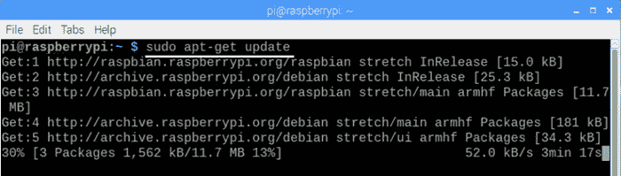

Depending on your internet speed, it will take around 10-15 minutes for the updates to download and install. Make sure that you place your Raspberry Pi near your Wi-Fi router.

3.  更新后，输入以下命令以升级 Raspberry Pi:

```cpp
$ sudo apt-get upgrade
```

升级时，您可能会收到一条消息，要求您下载特定组件。键入`Y`，然后按*输入*。升级大约需要 30-40 分钟才能完成。升级完成后，您将看到以下消息:

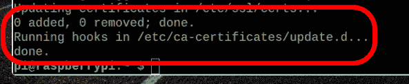

4.  更新 Raspberry Pi 后，您需要在 Raspberry Pi 中下载并`install git-core`。要安装 Git，请键入以下命令:

```cpp
$ sudo apt-get install git-core
```


5.  之后，要从`git`下载`wiringPi`库，请键入以下命令:

```cpp
git clone git://git.drogon.net/wiringPi
```

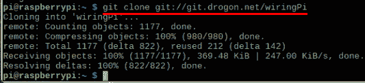

6.  现在，如果您单击文件管理器选项并单击`pi`文件夹，您应该会看到`wiringPi`文件夹:


7.  接下来，将目录更改为`wiringPi`，以便将 wiringPi 文件下载并安装在该特定文件夹中。更改目录的命令是`cd`:

```cpp
$ cd ~/wiringPi (The ~ symbol is above the Tab key and it points to pi directory)
```

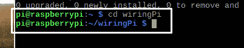

您现在应该看到指向`wiringPi`文件夹的目录。

8.  接下来，要从其`origin`目录中获取 Git 文件，请键入以下命令:

```cpp
$ git pull origin
```

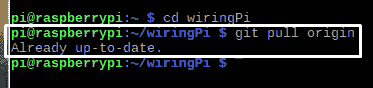

9.  最后，要构建文件，请键入以下命令:

```cpp
$ ./build 
```


完成所有操作后，您将看到一条`All done`消息:

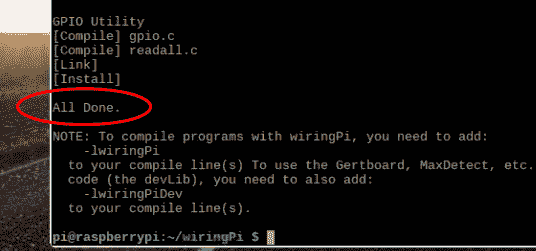

现在我们已经安装了 wiringPi 库，我们可以继续前进并了解 RPi 上的 wiringPi 引脚配置。

# Accessing Raspberry Pi GPIO pins via wiringPi

由于我们已经安装了 wiringPi，因此现在可以查看 wiringPi 引脚编号，如下面的屏幕截图所示:


`Physical`列表示从`1-40`开始的 Raspberry Pi 编号。在`Physical`列的两侧，您将看到 wiringPi (`wPi`) 列。从`Physical`列指向`wPi`的箭头表示 Raspberry Pi 的特定物理引脚的 wiringPi 引脚编号。

看看下面的例子:

*   物理引脚编号 3 的 wiringPi 引脚编号为 8
*   物理引脚编号 5 的 wiringPi 引脚编号为 9
*   物理引脚编号 8 的 wiringPi 引脚编号为 15
*   物理引脚编号 11 的 wiringPi 引脚编号为 0
*   物理引脚编号 40 的 wiringPi 引脚编号为 29

通过查阅此表，您可以找出剩余的物理引脚中的哪些对应于 wiringPi 引脚。

wiringPi pin numbers from **17-20** do not exist. After **wPi pin 16**, we skip straight to **wPi pin 21**.

为了更好地了解 wiringPi 引脚和物理引脚之间的关系，可以参考下图:

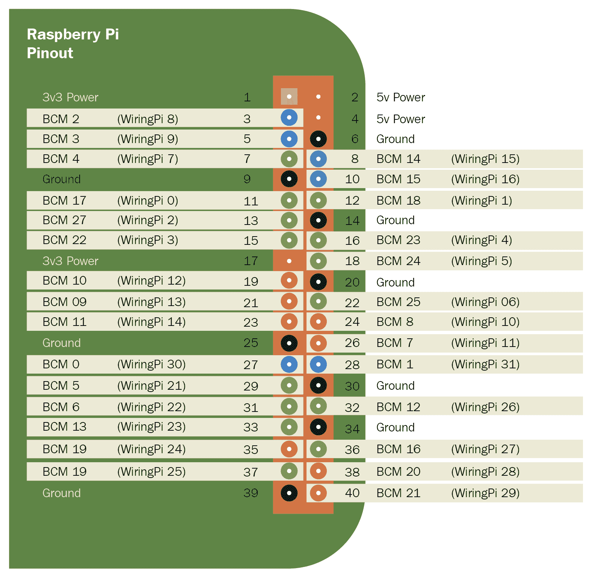

wiringPi 引脚编号是您在编程时需要记住的。我们总共可以使用**28**wiringPi 引脚进行编程。除了这些，我们还有以下引脚，这些引脚可用于提供电源，并且可用作接地引脚:

*   物理 pin 码**6 T1】、**9**、**14**、**20**、**25**、**30**、**34**，**39**是接地引脚**
*   物理引脚号**2**和**4**提供 5v 电源
*   物理引脚号**1**和**17**提供 3.3V 电源

让我们继续为 Raspberry Pi 编写我们的第一个 C 程序。

# Making an LED blink

我们要创建的第一个项目是使 LED 闪烁。对于此项目，我们需要以下硬件组件:

*   覆盆子皮
*   1 个发光二极管
*   两条母对母电线

# 接线连接

将发光二极管连接到覆盆子皮很简单。然而，在这样做之前，让我们仔细看看发光二极管的引脚:

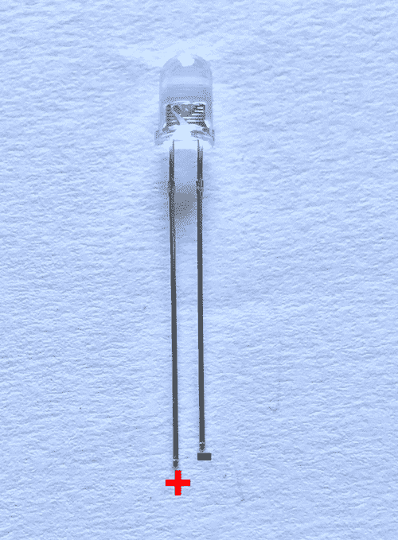

LED 包含一个正引脚和一个负引脚。长引脚是正引脚，您可以将其连接到 Raspberry Pi 的任何数据引脚。短引脚是负引脚，可以连接到 Raspberry Pi 的接地引脚。

让我们把它连接起来。首先，将 LED 的负引脚连接到 Raspberry Pi 的接地引脚 (物理引脚号**6**)。接下来，将 LED 的正极引脚连接到 wiringPi 引脚号**15**:

**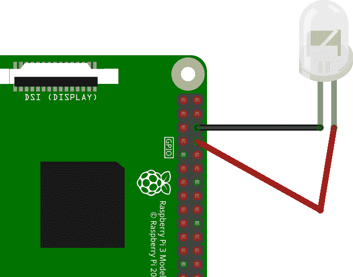 **

现在，我们已经将 LED 连接到 Raspberry Pi，让我们编写一个程序来使 LED 闪烁。

# 闪烁程序

为了编写我们的第一个 C 程序，我们将使用 Geany 程序员的编辑器。要打开 Geany，请单击**树莓图标**，转到编程，然后选择**Geany 程序员的编辑器**:

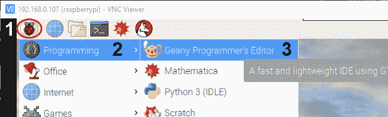

打开 Geany 后，您将看到一个未保存的文件，名为`Untitled`。我们需要做的第一件事是保存文件。单击文件 | 另存为，并将此文件命名为`Blink.cpp`。

在此文件中，编写以下代码以使 LED 闪烁。您可以从 GitHub 存储库的`Chapter02`文件夹下载`Blink.cpp`程序:

```cpp
#include <iostream>
#include <wiringPi.h>

int main(void)
{
wiringPiSetup();
pinMode(15,OUTPUT);

 for(;;)
 {
digitalWrite(15,HIGH);
delay(1000);
digitalWrite(15,LOW);
delay(1000);
 }
return 0;
 }
```

如果你以前做过 Arduino 编程，你可能已经了解了这段代码的 90%。这是因为 wiringPi 允许我们以 Arduino 格式编写 C++ 程序:

1.  在上面的代码中，我们首先导入`iostream`和`wiringPi`库。
2.  接下来，我们有一个 main 函数，叫做`int main`***。***由于这个函数没有任何参数，我们在圆括号内写一个`void`语句。
3.  之后，`wiringPisetup()`函数将初始化`wiringPi`。它假定此程序将使用 wiringPi 编号方案。
4.  接下来，使用`pinMode(15, OUTPUT)`命令，我们将 wiringPi 引脚号`15`设置为`OUTPUT`引脚。这是我们连接到 LED 正极引脚的引脚。
5.  之后，我们有一个无限的`for`循环。其中编写的代码将无限运行，除非我们从编码编辑器手动停止它。
6.  使用`digitalWrite(15,HIGH)`命令，我们在 LED 上写入`HIGH`信号，这意味着 LED 将打开。代替`HIGH`，我们也可以把数字`1`。
7.  之后，使用`delay(1000)`命令，我们确保 LED 仅在上**一秒钟。**

8.  接下来，使用`digitalWrite(15,LOW)`命令，我们在 LED 上写入`LOW`信号。这意味着发光二极管将关闭 一秒钟。
9.  由于此代码位于 for 循环内，因此 LED 将继续打开和**关闭**，直到我们指示它为止。

# 将代码上传到树莓派

由于我们使用的是 wiringPi 编号约定，因此我们将在 Build 命令中添加`-lwiringPi`命令，以便成功编译并构建具有`wiringPi`库的 C 程序。要打开生成命令，请单击生成 | 设置生成命令。在 “编译” 和 “构建” 按钮旁边的命令框中，在末尾添加`-lwiringPi`，然后单击 “确定”:


接下来，要编译代码，请单击**编译按钮** (棕色图标)。最后，要将代码上传到 Raspberry Pi，请按**构建按钮** (飞机图标):


编译图标将检查代码中的错误。如果没有，请单击构建图标以测试闪烁的输出。构建代码后，构建图标将变成红色圆圈。点击红色圆圈停止程序。

# 智能灯-与数字传感器一起工作

在为 Raspberry Pi 编写了第一个 C/C 程序之后，我们现在可以编写一个程序，该程序将从 LDR 传感器获取输入并打开或关闭 LED。对于此项目，您将需要以下硬件组件:

*   1 LDR sensor modules
*   1 个发光二极管
*   覆盆子皮
*   5 母对母连接线

首先，让我们来探讨一下 LDR 传感器是如何工作的。

# LDR 传感器及其工作方式

LDR 传感器是由可变电阻器组成的模拟输入传感器，其电阻根据落在其表面上的光量而变化。当房间里没有光时，LDR 传感器的电阻很高 (高达 1 M ohm)，在有光的情况下，LDR 传感器的电阻很低。LDR 传感器由两个引脚组成。这些引脚没有正负极性。我们可以将任何引脚用作数据或接地引脚，因此，LDR 传感器有时被称为特殊类型的电阻器。下图显示了 LDR 传感器的图像:


由于 LDR 是模拟传感器，因此我们无法将其直接连接到 RPi，因为它不包含**模数转换器** (**ADC**) 电路。因此，RPi 无法从 LDR 传感器读取传入的模拟数据。因此，我们将使用 LDR 数字传感器模块代替 LDR 传感器，该模块将向 RPi 提供数字数据:


LDR 传感器模块将从 LDR 传感器读取传入的模拟数据，并提供高或低形式的数字数据作为输出。LDR 传感器模块由 3 个引脚组成: **D0** (**数据输出**)，接地和 Vcc。D0 将提供数字数据作为输出，进一步作为输入提供给 RPi 引脚。D0 引脚在弱光下会很高，在有光的情况下会很低。传感器模块还由电位计传感器组成，该电位计传感器可用于改变 LDR 传感器的电阻。

在路灯中可以看到 LDR 传感器模块的实际用途，该模块在白天自动关闭，在夜间自动打开。我们将要编写的智能灯程序有点类似于这个应用，但是我们将使用发光二极管来保持简单，而不是路灯。

现在我们已经了解了 LDR 传感器的基本工作方式，接下来让我们将 LDR 传感器模块连接到 Raspberry Pi。

# 接线连接

通过接线连接，我们可以将 LDR 传感器模块和 LED 连接到 RPi:


接线连接如下:

*   RPi 的 wiringPi 引脚 8 连接到 LDR 传感器模块的 D0 引脚
*   RPi 的物理引脚 2 连接到 LDR 传感器模块的 Vcc 引脚
*   RPi 的物理引脚 6 连接到 LDR 传感器模块的 Gnd 引脚
*   wiringPi 引脚 0 连接到 LED 的正极引脚
*   物理引脚 14 连接到 LED 的负引脚

现在我们已经将 LDR 传感器模块和 LED 连接到 RPi，让我们编写程序，通过从 LDR 传感器获取输入来打开/关闭 LED。

# 智能灯程序

在此 smart light 程序中，我们将首先从 LDR 传感器读取输入，并根据输入值，打开或关闭 LED。用于智能灯的程序描述如下。您可以从本书的 GitHub 存储库的`Chapter02`文件夹中下载`SmartLight.cpp`程序:

```cpp
#include <iostream>
#include <wiringPi.h>

int main(void)
{

wiringPiSetup();

pinMode(0,OUTPUT); 
pinMode(8,INPUT); 

for(;;)
{
int ldrstate = digitalRead(8); 
if(ldrstate == HIGH) 
{
digitalWrite(0,HIGH); 
}
else
{
digitalWrite(0,LOW); 
}
 }
return 0;
 }
```

前面程序的解释如下:

*   在`main`功能内，我们将 wiringPi 引脚 8 设置为输入引脚，将 wiringPi 引脚 0 设置为输出引脚。
*   接下来，在`for`循环中，使用`digitalRead(8)`功能，我们从 LDR 传感器的数字引脚 (D0) 读取传入的数字数据，并将其存储在`ldrstate`变量中。从 LDR 传感器，我们将接收高 (1) 数据或低 (0) 数据。`ldrstate`变量在没有光的时候会高，在有光的时候会低。
*   接下来，我们将使用`if...else`条件检查`ldrstate`变量内的数据是高还是低。
*   使用`if(ldrstate == HIGH)`，我们正在比较`ldrstate`变量内的数据是否高。如果是高，我们正在使用`digitalWrite(0,HIGH)`打开 LED。
*   如果`ldrstate`为低，则将执行`else`条件，并且通过使用`digitalWrite(0,LOW)`，我们将关闭 LED。接下来，您可以单击编译按钮来编译代码，然后通过单击生成按钮对其进行测试。

现在我们了解了 SmartLight 程序，我们将探索**脉宽调制** (**PWM**) 的概念，并使用称为 softPWM 的库来改变 LED 的亮度。

# Pulse Width Modulation using softpwm

PWM 是一种强大的技术，可用于控制传递到 led 和电动机等电子组件的功率。使用 PWM，我们可以执行诸如控制 LED 亮度或降低电动机速度之类的操作。在本节中，我们将首先了解脉宽调制的工作方式，然后我们将编写一个简单的脉宽调制程序来逐步提高发光二极管的亮度。

# PWM 是如何工作的

在上一个`Blink.cpp`程序中，我们将来自 RPi 的数字信号应用于 LED。数字信号要么具有高状态，要么具有低状态。在高状态下，Raspberry Pi 引脚产生 3.3V 的电压，而在低状态下，引脚产生 0V 的电压。因此，在 3.3V 时，LED 以全亮度打开，在 0V 时，LED 关闭:

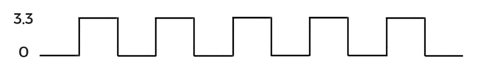

要降低 LED 的亮度，我们需要降低电压。为了降低电压，我们使用 PWM。在 PWM 中，具有一个完整重复的单个波称为周期，而周期完成本身所花费的时间称为周期。在下图中，红线代表一个完整的循环。完成该周期所需的时间称为周期:


信号保持较高的持续时间称为占空比，如下图所示:


占空比用百分比格式表示，占空比的计算公式如下:

*占空比 = (高信号持续时间/总时间) X 100*

在上图中，信号保持高电平 7 毫秒，单个周期的总时间段为 10 毫秒:


占空比 = 70% 或 0.7

因此，占空比是 0.7 或 70% 的。接下来，要找到新的电压值，我们需要将占空比与最大电压值相乘，即 3.3V:

*Vout = Dity cycle X Vmax*

*Vout = 0.7X3.3*

*Vout = 2.31V*

在 70% 的占空比下，提供给 LED 的电压将为 2.31V，并且 LED 的亮度将略微降低。

现在，如果我们将占空比降低到 40%，则提供给 LED 的电压将为 1.32V，如下图所示:

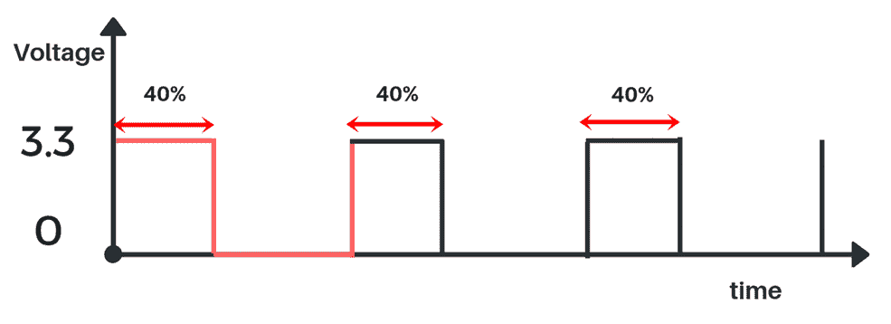

现在我们已经了解了如何使用 PWM 来降低 RPi 数据引脚处的电压，让我们来看看 softPWM 库，使用哪些数据引脚可以用作 PWM 引脚。

# 软脉宽调制库

wiringPi 由一个 softPWM 库组成，使用它我们可以从 RPi 的任何数据引脚获得 PWM 信号输出。softPWM 库包含两个主要功能: `softPwmCreate`和`softPwmWrite`。这两个功能的工作原理如下:

```cpp
softPwmCreate(pin number, initial duty cycle value, max duty cycle value);
```

`softPwmCreate`功能用于创建 PWM 引脚。它由三个主要参数组成:

*   `pin number`: 引脚编号表示我们要设置为 PWM 引脚的 wiringPi 引脚。
*   `initial duty cycle value`: 在初始占空比值中，我们必须提供占空比的最小值。初始占空比值理想地设置为`0`。
*   `max duty cycle value`: 在最大占空比值中，我们必须提供占空比的最大值。此值必须设置为`100`:

```cpp
softPwmWrite(pin number, duty cycle value);
```

`softPwmWrite`功能用于在输出设备 (例如，LED) 上写入 PWM 数据。它由两个参数组成:

*   `pin number`: 引脚编号表示我们必须在其上写入 PWM 数据的 wiringPi 引脚。
*   `duty cycle value`: 在此参数中，我们必须提供占空比值。占空比值必须在初始占空比值和最大占空比值之间，即在 0 到 100 的范围内。

现在，我们了解了 softPWM 库中的两个功能，我们将编写一个简单的 C 程序，以使 LED 以不同的强度闪烁。

# 使用 softPWM 库使发光二极管闪烁

对于使用 softPWM 的闪烁 LED 程序，您将需要一个 led。在我的情况下，我已经将 LED 的负引脚连接到 RPi 的物理引脚 6 (接地引脚)，而 LED 的正引脚连接到 wiringPi 引脚 15。接线连接如下图所示:


将 led 连接到 RPi 后，该编写程序了。使用 softPWM 库使 led 闪烁的程序如下。这个程序叫做`Soft_PWM_Blink.cpp`，你可以从本书的 GitHub 存储库的`Chapter02`文件夹下载这个程序:

```cpp
#include <iostream>
#include <wiringPi.h>
#include <softPwm.h>
int main(void)
{
 wiringPiSetup();
 softPwmCreate (15, 0, 100) ;
 for(;;)
 {
 softPwmWrite (15, 25);
 delay(1000);
 softPwmWrite (15, 0);
 delay(1000);
 softPwmWrite (15, 50);
 delay(1000);
 softPwmWrite (15, 0);
 delay(1000);
 softPwmWrite (15, 100);
 delay(1000);
 softPwmWrite (15, 0);
 delay(1000);
 }
return 0;
 }
```

前面程序的解释如下:

*   在这个程序中，我们首先导入`wiringPi`和`iostream`库以及`softPwm`库。
*   接下来，在`main`功能中，使用`softPwmCreate`功能，我们将 wiringPi 引脚 15 设置为 PWM 引脚。初始占空比值设置为`0`，最大占空比值设置为`100`。
*   之后，在`for`循环内部，我们有六个`softPwmWrite`功能，并且通过使用这些功能，我们以不同的亮度级别打开 LED。
*   使用`softPwmWrite(15,25)`功能代码，发光二极管将高亮度 25%。由于延迟被设置为 1,000，因此 LED 将高为 1 秒。
*   此后，由于占空比值设置为`0`，因此在`softPwmWrite(15 , 0)`功能代码中，led 将低 1 秒。

*   接下来，使用`softPwmWrite(15,50)`命令，LED 将高亮度 50% 1 秒。之后，我们再次将 LED 转低 1 秒钟。
*   最后，使用`softPwmWrite(15 , 100)`功能代码，LED 将高亮度 100% 1 秒。接下来，我们再次关闭 led 1 秒钟。
*   编写代码后，您可以单击编译按钮来编译代码，然后单击生成按钮来测试代码。

这就是我们使用 softPWM 库控制 LED 亮度的方式。

# 摘要

恭喜-您已经成功编写了第一个 C 程序，并在 Raspberry Pi 上运行了它!在本章中，我们首先安装了`wiringPi`库，并了解了 Raspberry Pi 的 wiringPi 引脚连接。接下来，我们编写了一个简单的 C 程序来闪烁 led。之后，我们了解了 LDR 传感器模块的工作原理，并根据来自 LDR 传感器模块的输入打开/关闭了 LED。之后，我们了解了 PWM，并使用 softPWM 库编写了一个程序来改变 led 的亮度。

在下一章中，我们将研究创建汽车机器人所需的不同部分。接下来，我们将了解直流电动机和电动机驱动器的工作原理，并学习如何创建汽车机器人。在此之后，我们将编写一个 C 程序，以向不同方向移动机器人。

# 问题

1.  覆盆子 Pi 上有多少个接地引脚？

2.  在黑暗的环境中，LDR 传感器的电阻是高还是低？

3.  什么命令用于从传感器读取值？

4.  让发光二极管闪烁六次的 for loop 命令是什么？

5.  假设最大电压为 5V，在 20% 的占空比下的输出电压是多少？