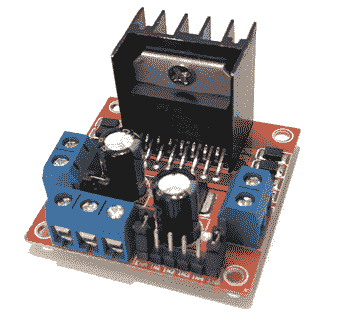
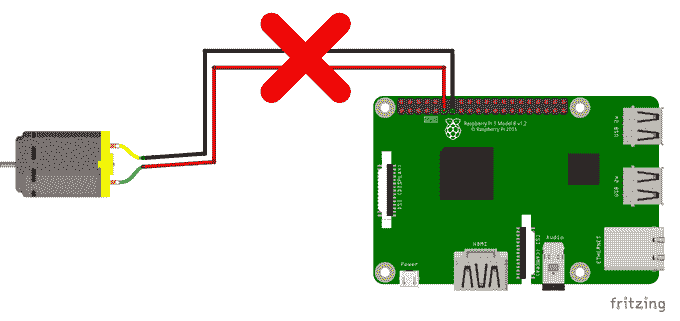
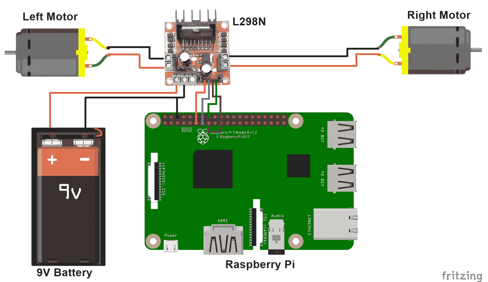
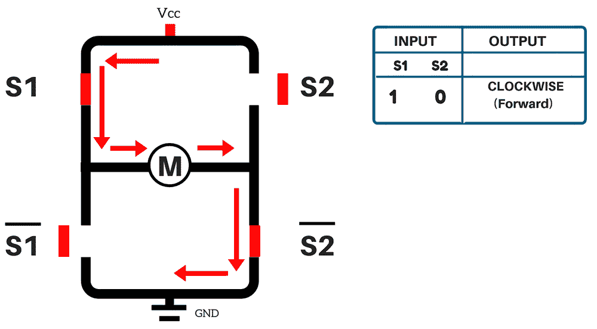
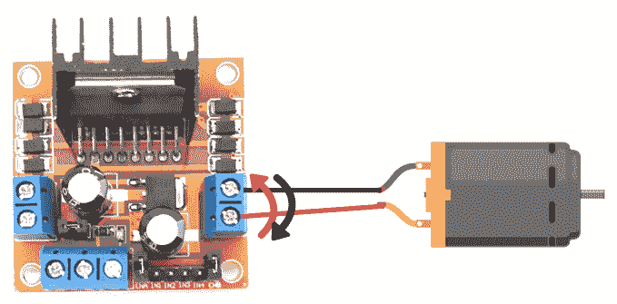
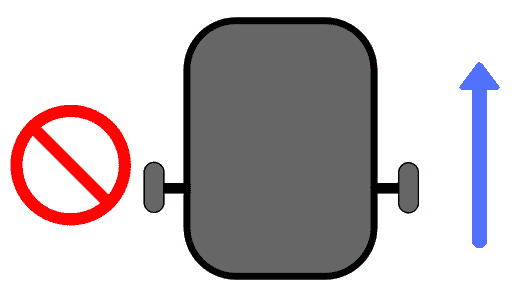

# 对机器人进行编程

在编写了几个 C 程序并在 Raspberry Pi 上测试了它们的输出之后，现在是时候创建我们自己的汽车机器人并使其向前，向后，向左和向右移动了。

在本章中，我们将介绍以下主题:

*   选择好的机器人底盘
*   构建和连接机器人
*   使用 H 桥
*   移动机器人

# 技术要求

本章的主要硬件要求如下:

*   机器人底盘 (机器人底盘中包含的零件在*构造和连接机器人*部分中进行了说明)
*   两台直流电机
*   L298N 电机驱动器
*   母对母连接线

本章的代码文件可以从[https://github.com/PacktPublishing/ 动手机器人编程与 Cpp/tree/master/Chapter03](https://github.com/PacktPublishing/Hands-On-Robotics-Programming-with-Cpp/tree/master/Chapter03)下载。

# 选择机器人底盘

在我们开始构建机器人之前，选择一个好的机器人底盘是最重要的活动之一。机器人的底盘就像人类的骨骼。我们的骨骼由骨骼组成，这些骨骼为我们的器官提供适当的支持。以同样的方式，好的机箱将为电子组件提供适当的支撑并将它们固定在一起。

您可以从亚马逊和 eBay 等电子商务网站购买机器人底盘，也可以直接从处理机器人设备的供应商那里购买。亚马逊快速搜索`robot chassis`将为您提供机器人底盘不同变体的列表。如果您以前没有构造过机器人，那么从所有这些选项中进行选择可能是一项艰巨的任务。在选择机器人底盘时，请记住以下提示:

*   确保机器人底盘由两个板 (一个**上板**和一个**下板**) 组成，以便您可以将电子元件放置在两个板之间以及**上板**，如下图所示:


*   选择仅支持两个直流电动机的机器人底盘，如上图所示。还提供支持四个直流电动机的机器人底盘，但是您需要额外的电动机驱动器来驱动四轮机器人。
*   最后，选择一个机器人底盘，该底盘具有直流电动机 (两个单元)，车轮 (两个单元) 和一个脚轮作为完整套件的一部分，这样您就不必单独购买这些组件。

前面照片中显示的机器人底盘是我将用于创建我的汽车机器人的底盘，因为它由两个板组成，并包括必要的组件 (直流电机，车轮，脚轮，螺钉和垫片) 作为完整套件的一部分。

# 构建和连接机器人

正确构造机器人是最重要的步骤之一。正确构造的机器人将平稳移动，没有任何障碍。在构建机器人之前，让我们看一下您将需要的组件的完整列表。

构建机器人所需的零件包括以下内容:

*   机器人底盘，必须包括以下组件:
    *   上板和下板
    *   两种 BO 直流电动机 (BO 是一种一般颜色为黄色的直流电动机)
    *   **两个**轮子
    *   **一个**脚轮
    *   垫片
    *   用于连接不同零件的螺钉
*   **一把**螺丝刀
*   **一个**L298N 电机驱动器
*   **七八**连接线
*   **一个**电池快照器
*   **一个**9v 电池

由于这些机器人底盘是由小型公司创建的，并且在国际上没有标准的机器人底盘，因此我在该项目中使用的机器人底盘将与您所在国家/地区的机器人底盘有所不同。

While purchasing a robot chassis online, please check the user reviews for the product.

# 构建机器人

当在单个机器人底盘套件中包括诸如上下板，直流电动机，车轮，脚轮和垫片之类的组件时，构造机器人变得更加容易。如果单独购买这些组件，则有可能某些组件无法正确安装，从而使机器人的整个组装不稳定。虽然我使用的底盘可能与您使用的底盘不同，但大多数两轮机器人的结构非常相似。

You can check the robot construction in the `Chapter03` folder of the GitHub repository.

# 将电机驱动器连接到覆盆子 Pi

构建机器人后，是时候将 Raspberry Pi 连接到电机驱动器了，这样我们就可以对机器人进行编程并向不同方向移动。但是，在执行此操作之前，让我们看一下什么是电动机驱动器。

# 什么是马达驱动器？

电机驱动器是由电机驱动器**集成电路** (**IC**) 组成的分线板。电动机驱动器基本上与电流放大器相同，其主要目的是采用低电流信号并转换为高电流信号以运行电动机。L298N 电机驱动器如下图所示:



我们需要电机驱动器的主要原因是，诸如电机之类的组件无法直接连接到 Raspberry Pi，因为它们无法从 Raspberry Pi 获得足够的电流，如下图所示:



这就是为什么我们先将电动机连接到电动机驱动器，并用电池为电动机供电的原因，如下图所示:


# 接线连接

L298N 电机驱动器由**四个**输入引脚、**四个**输出插座 (每个电机两个插座) 和**两个**电源插座组成。Raspberry Pi 引脚连接到电机驱动器的输入引脚。直流电机线连接到电机驱动器的输出插座，电池卡扣机连接到电源插座。L298N 电机驱动器的四个输入引脚分别标记为**IN1**，**IN2**，**IN3**和**IN4**。输出套接字标为**OUT1**、**OUT2**、**OUT3**和**OUT4**。下图显示了 Raspberry Pi，电机驱动器和电机的接线:



如上图所示，wiringPi 引脚编号**0**，**2**，**3**和**4**连接到电机驱动器的输入插座，如下所示:

*   wiringPi no**0**连接到**IN1**
*   wiringPi no**2**连接到**IN2**
*   wiringPi no**3**与**IN3**连接
*   wiringPi no**4**连接到**IN4**
*   左电机电线连接到**OUT1**和**OUT2**插座
*   右电机电线连接到**OUT3**和**OUT4**插座
*   电池卡扣机的红线连接到电机驱动器的**VCC**插座，黑线连接到接地插座
*   Raspberry Pi 的接地引脚连接到接地插座

# 使用 H 桥

L298N 电机驱动器 IC 可以一次控制两个电机。它由双 H 桥电路组成。这意味着它由两个电路组成，如下图所示，每个电机一个:


H 桥电路由四个开关**S1**、**S2**、、组成。这些开关将根据我们提供给 L298N IC 的输入打开和关闭。

现在，由于我们有两个电动机，因此我们可以为 L298N IC 提供四种可能的输入组合，如下所示:

*   高 (1,1)
*   高低 (1,0)

*   低高 (0,1)
*   低低 (0,0)

我们将向**S1**和**S2**开关提供高 (1) 和低 (0) 信号，如下所示:

1.  首先，当*S1 = 1*和*S2 = 0*时，**S1**开关将闭合，**S2**开关将保持打开。，或，将为 0，因此开关将打开。，或，将为 1，因此开关将关闭。现在，由于**S1**和开关闭合，电流将从**Vcc**流到**S1**，然后流到电动机，然后流到，并在 GND 处结束。电机将沿顺时针方向旋转，如下图所示:



2.  当*S1 = 0*和*S2 = 1*时，**S1**开关将打开，**S2**开关将关闭，将关闭，将会打开。现在，由于**S2**和开关闭合，电流将从**Vcc**流到**S2**，然后流到电机，然后流到，并在**GND**结束。电机将沿逆时针方向旋转，如下图所示:


3.  当*S1 = 0*和*S2 = 0*时，**S1**开关将打开，**S2**开关将打开，开关将关闭，并且开关将关闭。现在，由于**S1**和**S2**开关均断开，因此没有电流流向电动机的路径。在这种情况下，电动机将停止，如下图所示:


4.  当*S1 = 1*和*S2 = 1*时，**S1**和**S2**开关将关闭，而和开关将打开。由于**S1**和**S2**开关均闭合，这将造成短路情况，并且电流不会流过电机。在这种情况下，电动机将停止，与前一种情况一样:


如前所述，由于 L298N IC 由两个 H 桥组成，因此当我们提供高和低信号时，在另一个 H 桥中将发生相同的过程。第二个 H 桥将控制另一个电机。

# 移动机器人

现在我们已经了解了 H 桥电路，我们将编写一个名为`Forward.cpp`的程序来向前移动我们的机器人。之后，我们将编写一个程序来向后，向左和向右移动机器人，然后停止。您可以从 GitHub 存储库的`Chapter03`下载`Forward.cpp`程序。

机器人前进的程序如下:

```cpp
#include <stdio.h>
#include <wiringPi.h>

int main(void)
{
wiringPiSetup();
pinMode(0,OUTPUT); 
pinMode(2,OUTPUT); 
pinMode(3,OUTPUT);
pinMode(4,OUTPUT); 

 for(int i=0; i<1;i++)
 {
digitalWrite(0,HIGH); //PIN O & 2 will move the Left Motor
digitalWrite(2,LOW);
digitalWrite(3,HIGH); //PIN 3 & 4 will move the Right Motor
digitalWrite(4,LOW);
delay(3000);
 }
return 0;
 }
```

让我们看看这个程序是如何工作的:

1.  首先，我们将 wiringPi 引脚 (数字 0、1、2 和 3) 设置为输出引脚。
2.  接下来，通过以下两行，左马达向前移动:

```cpp
digitalWrite(0,HIGH);
digitalWrite(2,LOW);
```

3.  然后，接下来的两行使右马达向前移动:

```cpp
digitalWrite(3,HIGH);
digitalWrite(4,LOW);
```

4.  之后，`delay`命令表示电机将向前移动三秒钟。由于我们目前处于`for`环路内，电机将保持连续旋转。
5.  完成代码后，编译程序以检查是否有任何错误。
6.  接下来，将 9v 电池连接到电池快照器并上传程序。但是，在执行此操作之前，请确保抬起机器人的轮子。这是因为，当机器人开始移动时，您可能会获得以下三个输出之一:
    *   两个马达都向前移动。如果你得到这个输出，这意味着一旦你把它放在地面上，你的机器人就会向前移动。
    *   一个马达向前移动，另一个马达向后移动。如果获得此输出，则在电动机驱动器上交换向后移动的电动机的电线。例如，如果右电机向后移动，则将**M3-OUT**导线插入**M4-OUT**插座，将**M4-OUT**导线插入**M3-OUT**插座，如下图所示:




或者，您也可以互换 RPi 上的销钉以向前移动机器人; 将销钉 0 代替销钉 2，将销钉 2 代替销钉 0 用于左马达。同样，将销钉 3 代替销钉 4，将销钉 4 代替销钉 3，用于右电机。

7.  单击上传按钮，然后检查最终输出。由于该程序处于`for`循环中，因此电动机将保持连续运行。测试输出后，将电池与电池 snapper 断开连接，以关闭通过电动机驱动器提供给电动机的电源，以阻止电动机移动。

# 向后移动机器人

要向后移动机器人，我们只需将`HIGH`信号与`LOW`信号互换，反之亦然。这样移动机器人的完整程序写在`RobotMovement.cpp`文件里面，可以从 GitHub 仓库的`Chapter03`下载:

```cpp
digitalWrite(0,LOW);           //PIN O & 2 will move the Left Motor
digitalWrite(2,HIGH);
digitalWrite(3,LOW);          //PIN 3 & 4 will move the Right Motor
digitalWrite(4,HIGH);
delay(3000);
```

前两行将使左电机向后移动，而以下两行将使右电机向后移动。最后一行表示机器人将移动三秒钟。

# 停止机器人

要阻止机器人移动，您可以向引脚提供`HIGH`信号或`LOW`信号。在使机器人向后移动的代码中，添加以下命令以停止电动机三秒钟:

```cpp
digitalWrite(0,HIGH);           //PIN O & 2 will STOP the Left Motor
digitalWrite(2,HIGH);
digitalWrite(3,HIGH);          //PIN 3 & 4 will STOP the Right Motor
digitalWrite(4,HIGH);
delay(3000);
```

# 不同类型的转弯

机器人可以进行两种转弯:

*   轴向转弯
*   径向转弯

The code for taking axial and radial turns is added in the `RobotMovement.cpp` program.

# 轴向转弯

在轴向转弯时，机器人的一个轮子向后移动，而机器人的另一个轮子向前移动。机器人可以在不从其原始位置移动的情况下在现场转动。如果转弯时存在空间限制，例如机器人在迷宫中移动，则通常进行轴向转弯。机器人可以进行轴向左转弯或轴向右转弯。

# 轴向左转弯

在轴向左转弯中，机器人的左电动机向后移动，而右电动机向前移动，因此机器人左转，如下图所示:


如果您了解 H 桥的工作原理，则可以猜测进行轴向转弯的代码。如果没有，代码如下:

```cpp
digitalWrite(0,LOW);
digitalWrite(2,HIGH);
digitalWrite(3,HIGH);
digitalWrite(4,LOW);
delay(500);
```

You will need to play around with the delay value a little bit to make sure that the robot is turning properly in the left direction. If the delay value is high, the robot will turn more than 90°, whereas if it is low, the robot will turn less than 90°. 

# 轴向右转

在轴向左转弯中，机器人的左电动机向前移动，而右电动机向后移动，从而进行右转弯，如下图所示:


轴向右转的代码如下:

```cpp
digitalWrite(0,HIGH);
digitalWrite(2,LOW);
digitalWrite(3,LOW);
digitalWrite(4,HIGH);
delay(500);
```

# 径向转弯

在径向转弯时，机器人的一个电动机停止，另一个电动机向前移动。停止的轮子充当圆的中心，移动的轮子充当圆周。电机之间的距离代表一个半径，这就是为什么这个转弯被称为径向转弯。机器人可以进行径向左转或径向右转。

# 径向左转

在径向左转弯中，左电动机停止，右电动机向前移动，因此机器人左转，如下图所示:



径向左转弯的代码如下:

```cpp
digitalWrite(0,HIGH);
digitalWrite(2,HIGH);
digitalWrite(3,HIGH);
digitalWrite(4,LOW);
delay(1000);
```

# 径向右转弯

在径向右转中，左电机向前移动，右电机停止，因此机器人右转，如下图所示:


采取径向右转的代码如下:

```cpp
digitalWrite(0,HIGH);
digitalWrite(2,LOW);
digitalWrite(3,HIGH);
digitalWrite(4,HIGH);
delay(1000);
```

# 摘要

在本章中，我们研究了选择机器人底盘的某些标准。之后，我们构造了汽车，将电动机驱动器连接到 Raspberry Pi，并了解了 H 桥电路的工作原理。最后，我们编写了程序来使机器人向前，向后，向左和向右移动。

在下一章中，在了解了本章中移动机器人的基本原理之后，我们将首先编写一个使用超声波传感器测量距离的程序。接下来，我们将使用这些距离值来避开障碍物，也就是说，如果机器人非常靠近墙壁，那么超声波传感器将感应到它，并命令机器人转弯，从而避开障碍物。

# 问题

1.  我们用哪个马达驱动器来控制机器人？

2.  一个 L298N 电机驱动器 IC 由哪个桥组成？

3.  向前进方向移动机器人的 C 程序是什么？

4.  *S1 = 0* (低) 和*S2 = 1* (高)，将机器人朝哪个方向移动？

5.  径向左转弯的代码是什么？

6.  轴向右转的代码是什么？