# 使用笔记本电脑控制机器人

用电脑控制机器人是一件令人着迷的事情。计算机成为遥控器，机器人根据键盘提供的命令移动。在本章中，我们将介绍两种使用笔记本电脑无线控制机器人的技术。

我们将介绍以下主题:

*   安装`ncurses`库
*   使用`ncurses`控制发光二极管和蜂鸣器
*   使用笔记本电脑键盘控制漫游者 (RPi 机器人)
*   安装和设置 QT5
*   用图形用户界面按钮控制发光二极管
*   使用带有 QT5 的笔记本电脑控制流动站

# 技术要求

该项目需要的主要硬件组件如下:

*   两个发光二极管
*   一个蜂鸣器
*   一种 RPi 机器人

本章的代码文件可以从[https://github.com/PacktPublishing/ 使用 Cpp/tree/master/Chapter05](https://github.com/PacktPublishing/Hands-On-Robotics-Programming-with-Cpp/tree/master/Chapter05)[手动机器人编程下载。](https://github.com/PacktPublishing/Hands-On-Robotics-Programming-with-Cpp/tree/master/Chapter05)

# 安装 ncurses 库

**New curses** (**ncurses**) 是一个编程库，允许开发人员创建基于文本的用户界面。它通常用于创建基于 GUI 的应用程序或软件。`ncurses`库的一个关键特点是我们可以用它来获取键盘按键的输入，并控制输出端的硬件设备。我们将使用`ncurses`库来编写程序来检测密钥以相应地控制我们的机器人。例如，如果我们按下向上箭头，我们希望我们的机器人向前移动。如果我们按左箭头，我们希望我们的机器人左转。

要安装`ncurses`库，我们首先必须打开命令窗口。要安装`ncurses`，请键入以下命令，然后按*Enter*:

```cpp
sudo apt-get install libncurses5-dev libncursesw5-dev 
```

接下来，将询问您是否要安装库。键入*Y* (表示是)，然后按*Enter*。在 RPi 中下载并安装`ncurses`库大约需要三到五分钟。

Make sure that your RPi is near the Wi-Fi router, so that the library files can download quickly.

# ncurses 函数

安装`ncurses`库后，让我们探索一些重要的功能，这些功能是该库的一部分:

*   `initscr()`: `initscr()`函数初始化屏幕。它设置内存，并清除命令窗口屏幕。
*   `refresh()`: 刷新功能刷新屏幕。
*   `getch()`: 此功能将检测用户的触摸，并返回该特定键的 ASCII 编号。然后将 ASCII 数存储在整数变量中，该整数变量随后用于比较目的。
*   `printw()`: 该函数用于在命令窗口内打印字符串值。

*   `keypad()`: 如果键盘功能设置为 true，我们还可以从功能键以及箭头键中获取用户的输入。
*   `break`: 如果程序运行在循环中，该函数用于退出程序。
*   `endwin()`: `endwin()`函数释放内存，并结束`ncurses`。

整个`ncurses`程序必须在`initscr()`和`endwin()`函数之间编写:

```cpp
#include <ncurses.h>
...
int main()
{
...
initscr();
...
...
endwin();
return 0;
}
```

# 用 ncurses 编写一个世界程序

现在让我们编写一个简单的`ncurses`程序来打印`Hello World`。我把这个节目命名为`HelloWorld.cpp`。可以从 GitHub 存储库的`Chapter05`文件夹下载`HelloWorld.cpp`程序:

```cpp
#include <ncurses.h>
#include <stdio.h>

int main()
{
initscr(); //initializes and clear the screen
int keypressed = getch(); 
if(keypressed == 'h' || keypressed == 'H')
{
printw("Hello World"); //will print Hello World message
}
getch();
refresh(); 

endwin(); // frees up memory and ends ncurses
return 0;
}
```

使用`ncurses`库编译和运行 C 程序的程序与其他程序不同。首先，我们需要了解程序。之后，我们将学习如何编译和运行它。

在上面的代码片段中，我们首先声明`ncurses`库和`wiringPi`库。接下来，我们执行以下步骤:

1.  在`main`函数内部，我们声明`initscr()`函数来初始化并清除屏幕。
2.  接下来，当用户按下某个键时，将调用`getch`函数，并且该键的 ASCII 编号将存储在`keypressed`变量中，该变量为`int`类型。
3.  之后，使用`for`循环，我们检查按下的键是`'h'`还是 (`||`) `'H'`。确保将字母 H 放在单引号中。当我们把字母放在单引号中，我们得到该字符的 ASCII 号。例如，`'h'`返回 ASCII 号**104**，而`'H'`返回 ASCII 号**72**。代替`'h'`或`'H'`，还可以写*h*和*H*按键的 ASCII 数，分别为 104 和 72。这将看起来如下: `if(keypressed == 72 || keypressed == 104)`。数字不应在引号内。
4.  然后，如果按`'h'`或`'H'`键，将在命令窗口内打印`Hello World`:


5.  如果要将`Hello World`打印在下一行，可以简单地将`\n`放在`Hello World`文本之前。这将看起来如下: `printw("\nHello World")`。
6.  之后，当您按下某个键时，将调用`if`条件下的`getch()`函数，并且程序将终止。

# 编译和运行程序

要编译和运行`HelloWorld.cpp`程序，请打开终端窗口。在终端窗口内，键入`ls`并按*Enter 键。*您现在将看到 RPi 中存在的所有文件夹名称的列表:


`HelloWorld.cpp`存储在`Cprograms`文件夹内。要打开`Cprograms`文件夹，请键入`cd` (更改目录)，然后单击文件夹名称，然后按*Enter:*

```cpp
cd Cprograms
```

上一个命令的输出可以如下所示:

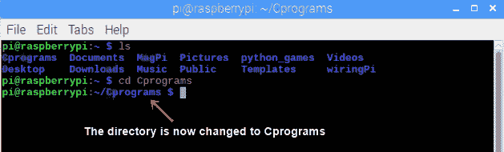

接下来，要查看`Cprograms`文件夹的内容，我们将再次键入`ls`**:**

 **

在`Cprograms`文件夹内，有一个`Data`文件夹和几个`.cpp`程序。我们感兴趣的程序是`HelloWorld.cpp`程序，因为我们想要编译和构建这个程序。为此，请键入以下命令，然后按*Enter:*

```cpp
gcc -o HelloWorld -lncurses HelloWorld.cpp 
```

以下屏幕截图显示编译成功完成:


对于编译任何使用`ncurses`库的代码，代码如下:

```cpp
gcc -o Programname -lncurses Programname.cpp
```

之后，键入`./HelloWorld`并按*Enter*以运行代码:


按下*Enter 后，*将清除整个终端窗口:

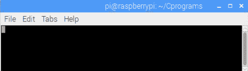

接下来，按*h*或*H*键，将在终端窗口中打印`Hello World`文本。要退出终端窗口，请按任意键:


现在，我们已经创建了一个简单的`HelloWorld`程序，并测试了`ncurses`库在终端窗口内的工作，让我们编写一个程序来控制 led 和蜂鸣器。

# 使用 ncurses 控制发光二极管和蜂鸣器

在编译和测试您的第一个`ncurses`程序之后，让我们编写一个程序来通过提供键盘输入来控制硬件，例如 led 和蜂鸣器。

# 接线连接

对于这个特定的示例，我们将需要两个 led 和一个蜂鸣器。Led 和蜂鸣器到 RPi 的接线连接如下:


我们可以从连接图中看到以下内容:

*   第一 LED 的正极 (阳极) 引脚连接到 wiringPi 引脚编号 15，而负极 (阴极) 引脚连接到物理引脚编号 6 (接地引脚)。
*   第二 LED 的正极引脚连接到 wiringPi 引脚编号 4，而负极引脚连接到物理引脚编号 14 (接地引脚)。
*   蜂鸣器的一个引脚连接到 wiringPi 引脚编号 27，另一个引脚连接到物理引脚编号 34 (接地引脚)。

# 编写 LEDBuzzer.cpp 程序

我们程序的名称是`LEDBuzzer.cpp`。可以从 GitHub 存储库的`Chapter05`文件夹下载`LEDBuzzer.cpp`程序。`LEDBuzzer`程序如下:

```cpp
#include <ncurses.h>
#include <wiringPi.h>
#include <stdio.h>
int main()
{
 wiringPiSetup();

 pinMode(15,OUTPUT); //LED 1 pin
 pinMode(4, OUTPUT); //LED 2 pin
 pinMode(27,OUTPUT); //Buzzer pin

for(;;){

initscr();

int keypressed = getch();

if(keypressed=='L' || keypressed=='l')
{
 digitalWrite(15,HIGH);
 delay(1000);
 digitalWrite(15,LOW);
 delay(1000);
}

if(keypressed== 69 || keypressed=='e')       // 69 is ASCII number for E.
{
 digitalWrite(4,HIGH);
 delay(1000);
 digitalWrite(4,LOW);
 delay(1000);
}

if(keypressed=='D' || keypressed=='d')
{
 digitalWrite(15,HIGH);
 delay(1000);
 digitalWrite(15,LOW);
 delay(1000);
 digitalWrite(4,HIGH);
 delay(1000);
 digitalWrite(4,LOW);
 delay(1000);
}

if(keypressed=='B' || keypressed== 98)        //98 is ASCII number for b
{
 digitalWrite(27,HIGH);
 delay(1000);
 digitalWrite(27,LOW);
 delay(1000);
 digitalWrite(27,HIGH);
 delay(1000);
 digitalWrite(27,LOW);
 delay(1000);
}

if(keypressed=='x' || keypressed =='X')
{
break; 
}

refresh();
}
endwin(); // 
return 0; 
}
```

编写完程序后，让我们看一下它的工作原理:

1.  在上面的程序中，我们首先声明`ncurses`和`wiringPi`库以及`stdio`C 库
2.  接下来，将引脚编号`15`，`4`和`7`声明为输出引脚

3.  现在，当按下*L*或*l*键时，发光二极管 1 将分别转动`HIGH`和`LOW`一秒
4.  同样，当按下*E*或*e*键时，发光二极管 2 将分别转动`HIGH`和`LOW`一秒
5.  如果按下*D*或*d*键，发光二极管 1 将分别转动`HIGH`和`LOW`一秒，然后发光二极管 2 将分别转动`HIGH`和`LOW`一秒
6.  如果按下*b*或*B*键，蜂鸣器将发出两次蜂鸣声
7.  最后，如果按*x*或*X*键，C 程序将终止

在编译代码时，还必须包含`wiringPi`库的名称，即`lwiringPi`。最终编译命令如下所示:

```cpp
gcc -o LEDBuzzer -lncurses -lwiringPi LEDBuzzer.cpp
```


编译代码后，键入`./LEDBuzzer`**来运行它:**

 **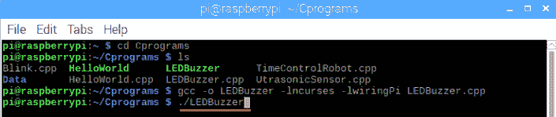

接下来，按*L*、*E*、*D*和*B*键，led 和蜂鸣器将相应地打开和关闭。

# 使用笔记本电脑键盘控制流动站

在控制了 led 和蜂鸣器之后，让我们编写一个程序来控制笔记本电脑上的流动站 (机器人):

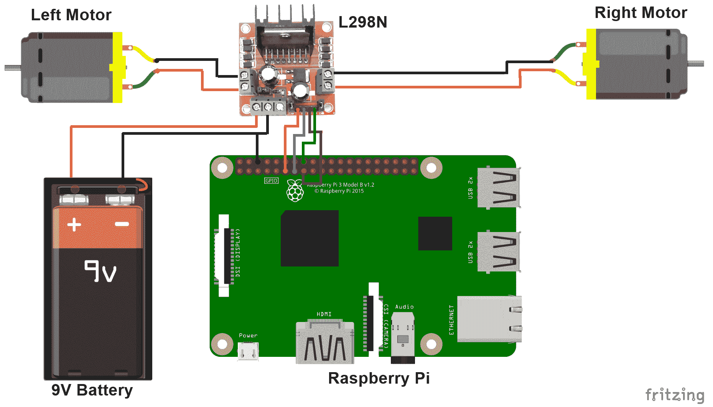

我保持了与在《第三章》中相同的接线连接，*对机器人进行编程*:

*   wiringPi 引脚编号 0 和 2 连接到**IN1**和**IN2**引脚
*   wiringPi 引脚编号 3 和 4 连接到**IN3**和**IN4**引脚
*   左电机插针连接到电机驱动器的**OUT1**和**OUT2**插针
*   右电机插针连接到电机驱动器的**OUT3**和**OUT4**插针
*   Raspberry Pi 的引脚 6 连接到电机驱动器的接地插座

# 建立笔记本电脑控制的流动站程序

如果您已经了解了前两个程序，那么到现在为止，您可能已经找到了我们笔记本电脑控制的流动站的代码。在本程序中，我们将使用上，下，左和右箭头键以及*A*，*S*，*X*，*W*和*D*键。为了识别来自箭头键的输入，我们需要在程序中包含`keypad()`函数。可以从`GitHub`存储库的`Chapter05`文件夹下载`Laptop_Controlled_Rover.cpp`程序:

```cpp

int main()
{
...
for(;;)
{
initscr(); 
keypad(stdscr,TRUE);
refresh(); 
int keypressed = getch(); 
if(keypressed==KEY_UP || keypressed == 'W' || keypressed == 'w') 
//KEY_UP command is for UP arrow key
{
printw("FORWARD");
digitalWrite(0,HIGH);
digitalWrite(2,LOW);
digitalWrite(3,HIGH);
digitalWrite(4,LOW);
}
if(keypressed==KEY_DOWN || keypressed == 'X' || keypressed == 'x')
//KEY_DOWN is for DOWN arrow key
{
printw("BACKWARD")
digitalWrite(0,LOW);
digitalWrite(2,HIGH);
digitalWrite(3,LOW);
digitalWrite(4,HIGH);
}

if(keypressed==KEY_LEFT || keypressed == 'A' || keypressed == 'a')
{
//KEY_LEFT is for LEFT arrow key
printw("LEFT TURN");
digitalWrite(0,LOW);
digitalWrite(2,HIGH);
digitalWrite(3,HIGH);
digitalWrite(4,LOW);
}

if(keypressed==KEY_RIGHT || keypressed == 'D' || keypressed == 'd')
{
//KEY_RIGHT is for right arrow keys
printw("RIGHT TURN");
digitalWrite(0,HIGH);
digitalWrite(2,LOW);
digitalWrite(3,LOW);
digitalWrite(4,HIGH);
}

if(keypressed=='S' || keypressed=='s')
{
printw("STOP");
digitalWrite(0,HIGH);
digitalWrite(2,HIGH);
digitalWrite(3,HIGH);
digitalWrite(4,HIGH);
}

if(keypressed=='E' || keypressed=='e')
{
break; 
}
}
endwin(); 
return 0; 
}
```

前面的程序可以解释如下:

1.  在上面的程序中，如果按向上箭头键，则将被第一个`if`条件中的`KEY_UP`代码识别。如果条件是`TRUE`，则机器人会向前移动，终端中会打印`FORWARD`字样。同样，如果您按下*W*或*w*键，机器人也会向前移动。
2.  如果按下向下箭头键 (`KEY_DOWN`) 或*X*或*x*键，机器人将向后移动，并且将在终端中打印`BACKWARD`字样。
3.  如果您按下左箭头键 (`KEY_LEFT`) 或*A*或*a*键，机器人将向左转，终端中会打印出`LEFT TURN`字样。
4.  如果按下向右箭头键 (`KEY_RIGHT`) 或*D*或*d*键，机器人将向右转，终端中会打印出`RIGHT TURN`字样。

5.  最后，如果您按下*S*或*s*键，机器人将停止，并且将在终端中打印`STOP`字样。
6.  要终止代码，我们可以按*E*或*e*键。由于我们没有提供任何时间延迟，机器人将无限期地保持移动，除非您使用*S*或*s*键停止机器人。

测试代码时，将 Raspberry Pi 连接到移动电源，这样您的机器人就可以完全无线，并且可以自由移动。

# 追踪正方形路径

在将机器人向不同方向移动之后，让我们使漫游者追踪一条方形路径。为此，我们的机器人将按照以下方式移动: 前进-> 右转-> 前进-> 停止:


在`LaptopControlRover`程序中，我们将创建另一个`if`条件。在这个`if`条件下，我们将编写一个程序来使机器人跟踪一个正方形路径。`if`条件如下:

```cpp
if(keypressed == 'r' || keypressed == 'R')
{
forward(); //first forward movement
delay(2000);
rightturn(); //first left turn
delay(500); //delay needs to be such that the robot takes a perfect 90º right turn

forward(); //second forward movement
delay(2000);
rightturn(); //second right turn
delay(500);

forward(); //third forward movement
delay(2000);
rightturn(); //third and last left turn
delay(500);

forward(); //fourth and last forward movement
delay(2000);
stop(); //stop condition
}
```

为了追踪方形路径，机器人将向前移动四次。它将右转三次，最后，它将停止。在`main`函数之外，我们将需要创建`forward()`、`rightturn()`和`stop()`函数，这样，我们就可以简单地调用必要的函数，而不是在主函数内部多次编写`digitalWrite`代码。

| **前进条件** | **右转** | **停止** |
| 

```cpp
void forward()
{
digitalWrite(0,HIGH);
 digitalWrite(2,LOW);
 digitalWrite(3,HIGH);
 digitalWrite(4,LOW);
}
```

] | 

```cpp
void rightturn()
{
digitalWrite(0,HIGH); 
 digitalWrite(2,LOW); 
 digitalWrite(3,LOW); 
 digitalWrite(4,HIGH);
}
```

] | 

```cpp
void stop()
{
digitalWrite(0,HIGH); 
 digitalWrite(2,HIGH); 
 digitalWrite(3,HIGH); 
 digitalWrite(4,HIGH);
}
```

] |

这是我们如何控制机器人使用笔记本电脑，在键盘按键的帮助下。接下来，让我们看一下第二种技术，其中我们将使用 qt5 创建 GUI 按钮。当按下这些按钮时，机器人会向不同的方向移动。

# 安装和设置 QT5

QT 是一般用于嵌入式图形用户界面的跨平台应用程序框架。QT 的最新版本是 5，因此也被简称为 qt5。要在我们的 RPi 中安装 QT5 软件，请打开终端窗口并键入以下命令:

```cpp
sudo apt-get install qt5-default
```

上述命令的输出显示在以下屏幕截图中:


此命令将下载在后端运行的必要的`qt5`文件。接下来，要下载和安装 QT5 IDE，请输入以下命令:

```cpp
sudo apt-get install qtcreator
```

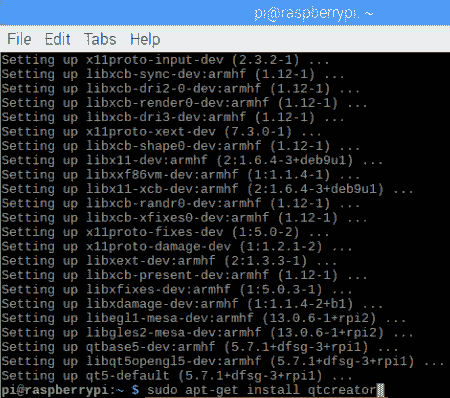

根据您的互联网速度，QT5 IDE 的安装大约需要 10 到 15 分钟。如果在安装 QT5 时遇到任何问题，请尝试更新和升级 RPi。为此，请在终端窗口中键入以下命令:

```cpp
sudo apt-get update
sudo apt-get upgrade -y
```

# 设置 QT5

在 QT5 内部编写任何程序之前，我们首先需要对其进行设置，以便它可以运行 C 程序。要打开 QT5，请单击树莓图标，转到编程，然后选择 Qt 创建者:


QT5 在 RPi 中的运行速度稍慢，因此 IDE 打开需要一些时间。点击工具，然后选择选项:

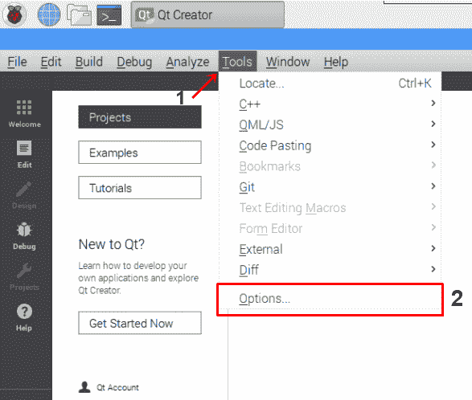

在 “选项...” 中，单击 “设备”，并确保将 “类型” 设置为 “桌面”。名称应为`Local PC`，指的是 RPi:


之后，单击 “构建和运行” 选项。接下来，选择 “套件” 选项卡，然后单击 “桌面 (默认)” 选项:

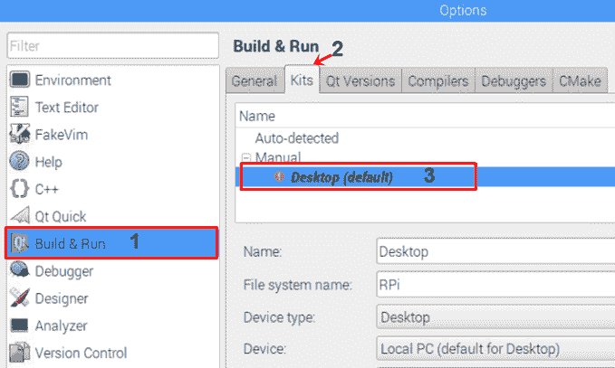

选择 “构建和运行” 选项后，我们必须进行一些修改:


让我们一步一步地看看修改:

1.  保持名称为`Desktop`。
2.  将文件系统的名称设置为`RPi`。
3.  在设备类型中，选择桌面选项。

4.  默认情况下，系统根 (系统根) 将设置为`/home/pi`，这意味着，当我们创建一个新的 QT5 应用程序时，它将在`pi`文件夹内创建。现在，我们将在`pi`文件夹中创建一个名为`QTPrograms`的新文件夹，而不是在`pi`文件夹中创建我们的 QT 项目。要更改文件夹目录，请单击浏览按钮。之后，单击文件夹选项。调用此文件夹`QTPrograms`或您想要的任何其他名称。选择`QTPrograms`文件夹，然后选择选择按钮:

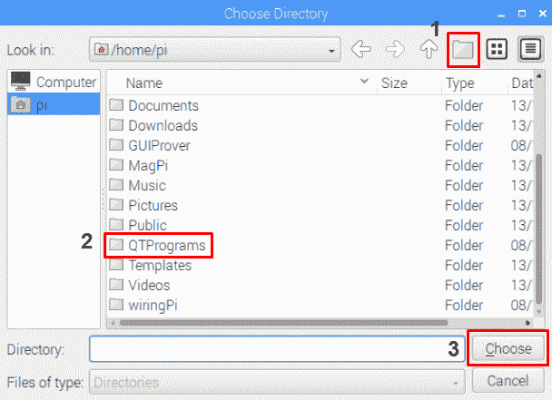

5.  接下来，我们必须将编译器设置为 GCC。为此，请单击编译器选项卡。在其中，单击添加下拉按钮。转到 GCC 并选择 C**选项:**

 **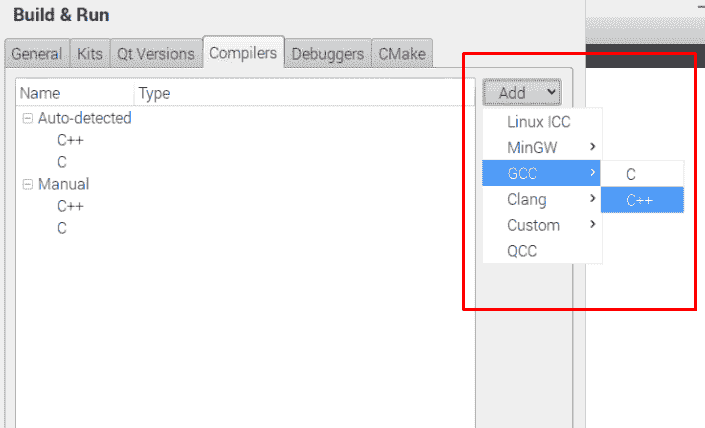

您现在将看到 C 选项下面的 GCC 编译选项:


之后，单击 “应用” 按钮以应用更改，然后单击 “确定” 按钮。接下来，再次单击工具并打开选项。在 “构建和运行” 选项中，选择 “套件” 选项卡，然后再次选择 “桌面” 选项。这次，在 C 选项旁边，您将看到一个下拉选项。点击这个，然后选择 GCC 编译器:

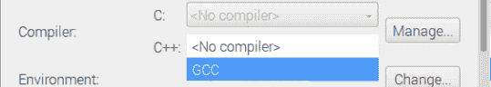

6.  接下来，检查调试器选项。它应该设置为系统 GDB at /usr/bin/gdb。
7.  最后，检查 QT5 版本。目前，我正在使用最新版本的 QT，即 5.7.1。当您遇到本章时，最新版本可能已经更新。

进行这些更改后，按 Apply，然后确定。设置 QT5 后，让我们编写第一个程序，使用 GUI 按钮打开和关闭 LED。

# 用图形用户界面按钮控制发光二极管

在本节中，我们将创建一个简单的 QT5 程序，在该程序中，我们将使用 GUI 按钮打开和关闭 led。对于此项目，您将需要两个 led:

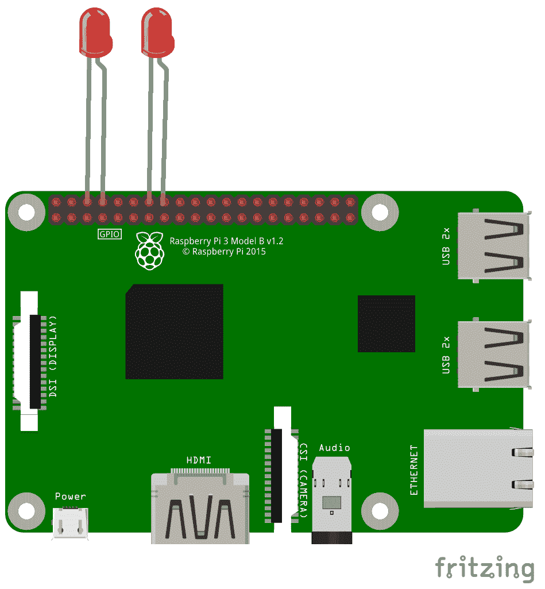

Led 的接线与`LEDBuzzer`项目中的接线完全相同:

*   第一个 LED 的阳极 (正) 引脚连接到 wiringPi 引脚编号 0，阴极 (负) 引脚连接到物理引脚编号 9 (接地引脚)
*   第二 LED 的阳极引脚连接到 wiringPi 引脚编号 2，阴极引脚连接到物理引脚编号 14 (接地引脚)

# 创建 QT 项目

用于打开和关闭 led 的 QT5 项目称为`LedOnOff`。您可以从 GitHub 存储库的`Chapter05`文件夹下载此项目。下载`LedOnOff`项目文件夹后，打开`LedOnOff.pro`文件，查看 QT5 IDE 内的项目。

请按照以下步骤在 QT5 IDE 中创建项目:

1.  单击文件选项，然后单击新文件或项目...:

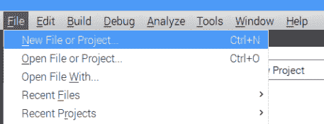

2.  接下来，选择 QT Widgets 应用程序选项，然后单击选择按钮:

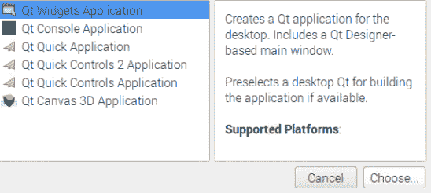

3.  之后，给你的项目起个名字。我把我的项目命名为`LEDOnOff`。之后，将目录更改为`QTPrograms`，以便在此文件夹中创建项目，然后单击下一步:

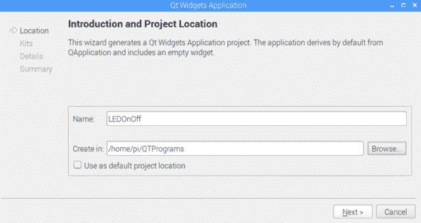

4.  保持选中桌面选项，然后单击下一步:

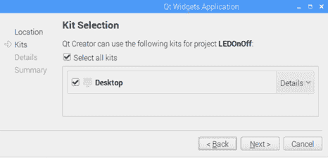

5.  您现在应该看到某些文件名，这是这个项目的一部分。保持名称的状态，然后单击下一步:


6.  最后，您将看到一个摘要窗口，该窗口将向您显示将创建的所有文件的摘要。我们不必在此窗口中进行任何更改，因此单击 Finish 即可创建项目:


在 IDE 的左侧，您将看到设计、C 和头文件。首先，我们将打开`LEDOnOff.pro`文件并添加`wiringPi`库的路径。在此文件的底部，添加以下代码:

```cpp
LIBS += -L/usr/local/lib -lwiringPi
```


接下来，打开`mainwindow.ui`文件，该文件位于`Forms`文件夹内。`mainwindow.ui`文件是设计器文件，我们将在其中设计我们的 GUI 按钮:

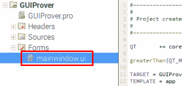

`mainwindow.ui`文件将在设计选项卡中打开。在 “设计” 选项卡的左侧是 “小部件” 框，其中包含诸如按钮，列表视图和布局之类的小部件。中间是设计区域，我们将在其中拖动 UI 组件。在右下角，将显示所选 UI 组件的属性:


接下来，要创建 GUI 按钮，请在设计区域内拖动按钮小部件。双击按钮，然后将文本更改为`ON`。之后，在选择按钮的情况下，将 objectName (在属性窗口内) 更改为`on`:

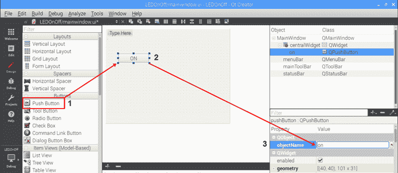

在这之后，再添加两个按钮。将一个按钮的名称设置为`OFF`，将**对象名称**设置为`off`。将另一个按钮的名称设置为`ON / OFF`，将**对象名称**设置为`onoff`:

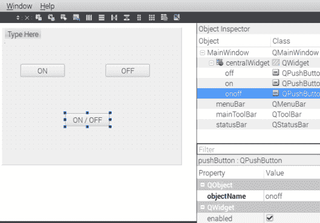

我们可以使用两种不同类型的按钮功能来打开和关闭 LED:

*   `clicked()`: 单击按钮后，将立即执行`clicked`按钮功能。
*   `pressed()`和`released()`: 只要按住或按住按钮，`pressed`按钮功能就会持续执行。当我们使用`pressed`函数时，我们也必须使用`released()`函数。释放的函数包含指示释放按钮时应该发生的代码。

我们将把`clicked()`功能链接到和**关**按钮，并把`pressed()`和`released()`功能链接到**开/关**按钮。接下来，要将`clicked()`功能链接到上的**按钮，右键单击**上的**按钮，选择转到插槽...选项，然后选择`clicked()`函数。之后，按 OK:**


现在，一旦选择`clicked()`函数，将在`mainwindow.cpp`文件 (该文件位于`Sources`文件夹内) 创建一个名为`on_on_clicked()` (`on_buttonsobjectname_clicked`) 的单击函数。在此功能内，我们将编写程序以打开 LED。但是，在此之前，我们需要在`mainwindow.h`文件中声明`wiringPi`库和引脚。此文件位于`Headers`文件夹内:

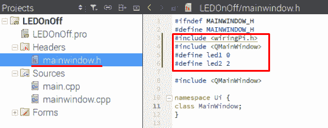

我们还需要声明`QMainWindow`库，它将创建一个包含我们的按钮的窗口。接下来，我将`led1`引脚设置为`0`引脚，将`led2`引脚设置为`2`引脚。之后，再次打开`mainwindow.cpp`文件。然后，我们将执行以下操作:

1.  首先，我们将声明`wiringPiSetup();`函数
2.  接下来，我们将`led1`和`led2`设置为`OUTPUT`引脚
3.  最后，在`on_on_clicked()`功能内，将`led1`和`led2`引脚设置为`HIGH`:

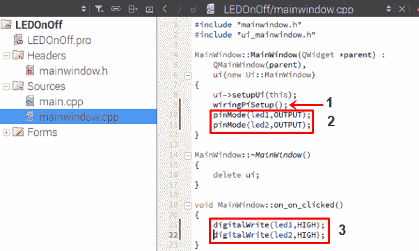

接下来，要关闭 led，请再次打开`mainwindow.ui`文件，右键单击关闭按钮，选择转到插槽...，然后再次选择`clicked()`功能。在`mainwindow.cpp`文件内部，将创建一个名为`on_off_clicked`的新功能。在此功能内，我们将编写程序以关闭 led。

要编程开/关按钮，右键单击它，选择转到插槽...，这次，选择`pressed()`功能。将在`mainwindow.ui`文件中创建一个新的函数名称`on_onoff_pressed()`。接下来，右键单击**开/关**按钮，选择转到插槽...，然后选择`released()`功能。现在将创建一个名为`on _onoff_released()`的新功能。

在`on_onoff_pressed()`功能内，我们将编写一个程序来打开 led。在`on_onoff_released()`功能内，我们将编写关闭 led 的程序:

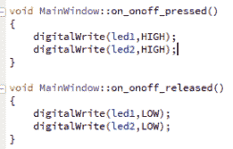

在运行代码之前，请单击 “文件”，然后单击 “全部保存”。接下来，要构建并运行代码，请单击 “构建”，然后单击 “运行” 选项。主窗口大约需要 30 到 40 秒才能出现，并且在主窗口中，您将看到 GUI 按钮，如下所示:


现在，当您单击 ON 按钮时，led 将点亮。单击关闭按钮时，led 将关闭。最后，当您按住**开/关**按钮时，led 将打开，直到您放开为止，然后它们将关闭。

# 处理错误

在控制台中，您可能会看到一些小错误。如果主窗口处于打开状态，则可以忽略以下错误:


打开 Qt Creator IDE 时，GCC 编译器可能会继续重置。因此，在运行项目后，您将收到以下错误:

```cpp
Error while building/deploying project LEDOnOff (kit: Desktop)
 When executing step "qmake"
```

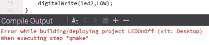

如果出现此错误，请转到 “工具”，然后转到 “选项”，然后将 C 编译器设置为 GCC，如*设置 QT5*部分的*步骤 5*所示。

# 使用带有 QT5 的笔记本电脑控制流动站

现在我们可以控制 led 了，让我们看看如何使用 qt5 控制流动站。在 Qt Creator IDE 中，创建一个新项目并将其命名为`QTRover`。您可以从本章的 GitHub 存储库中下载`QTRover`项目文件夹。现在，我们可以使用`clicked()`函数以及`pressed()`和`released()`函数创建这个`QTRover`项目。为此，我们有以下选项:

1.  如果仅使用`clicked()`函数创建此项目，则需要创建五个按钮: 前进，后退，向左，向右和停止。我们每次都需要按下停止按钮来停止机器人。
2.  如果我们只使用`pressed()`和`released()`函数创建这个项目，我们只需要创建四个按钮: 向前、向后、向左和向右。在这种情况下，我们不需要停止按钮，因为当按钮被释放时，流动站会停止。
3.  另外，我们也可以使用`clicked()`，`pressed()`和`released()`功能的组合，其中前进，后退和停止按钮将链接到`clicked()`功能，左右按钮将链接到`pressed()`和`released()`功能。

在这个项目中，我们将选择第三个选项，即`clicked()`、`pressed()`和`released()`函数的组合。在创建这个项目之前，我们将关闭`LEDOnOff`项目，因为如果`LEDOnOff`和`QTRover`项目都保持打开状态，那么如果您在一个项目中进行 UI 更改，则代码可能会在另一个项目中更改，从而影响您的两个项目文件。要关闭`LEDOnOff`项目，请右键单击它，然后选择关闭项目 “LEDOnOff” 选项。

接下来，在`QTRover.pro`文件中添加`wiringPi`库路径:

```cpp
LIBS += -L/usr/local/lib -lwiringPi
```

之后，打开`mainwindow.ui`文件并创建五个按钮。给它们贴上标签`FORWARD`、`BACKWARD`、`LEFT`、`RIGHT`和`STOP`:


设置按钮对象的名称，如下所示:

*   将`FORWARD`按钮对象名称设置为转发
*   将`BACKWARD`按钮对象名称设置为向后
*   将`LEFT`按钮对象名称设置为左侧
*   将`RIGHT`按钮对象名称设置在右侧
*   将`STOP`按钮对象名称设置为 stop

之后，右键单击前进，后退和停止按钮，然后将`clicked()`功能添加到这三个按钮。同样，右键单击左右按钮，并在这些按钮上添加`pressed()`和`released()`功能。

接下来，打开`mainwindow.h`文件并声明`wiringPi`和`QMainWindow`库。另外，声明四个`wiringPi`pin 号。在我的情况下，我使用的 pin 号是`0`、`2`、`3`和`4`:


在`mainwindow.cpp`文件中，我们将具有三个`on_click`函数来向前移动 (`on_forward_clicked`)，向后移动 (`on_backward_clicked`) 和停止 (`on_stop_clicked`)。

对于左 (`on_left_pressed`和`on_left_released`) 和右 (`on_right_pressed`和`on_right_released`) 按钮，我们还有两个`on_pressed`和`on_released`功能。

以下步骤描述了向不同方向移动机器人所需的步骤:

1.  在`on_forward_clicked()`函数内部，我们将编写程序以向前移动机器人:

```cpp
digitalWrite(leftmotor1, HIGH);
digitalWrite(leftmotor2, LOW);
digitalWrite(rightmotor1, HIGH);
digitalWrite(rightmotor2, LOW);
```

2.  接下来，在`on_backward_clicked()`函数里面，我们将编写程序向后移动机器人:

```cpp
digitalWrite(leftmotor1, HIGH);
digitalWrite(leftmotor2, LOW);
digitalWrite(rightmotor1, HIGH);
digitalWrite(rightmotor2, LOW);
```

3.  之后，在`on_left_pressed()`功能内部，我们将编写程序以进行轴向左转弯或径向左转弯:

```cpp
digitalWrite(leftmotor1, LOW);
digitalWrite(leftmotor2, HIGH);
digitalWrite(rightmotor1, HIGH);
digitalWrite(rightmotor2, LOW);
```

4.  然后，在`on_right_pressed()`函数内部，我们将编写程序以使轴向右转或径向右转:

```cpp
digitalWrite(leftmotor1, HIGH);
digitalWrite(leftmotor2, LOW);
digitalWrite(rightmotor1, LOW);
digitalWrite(rightmotor2, HIGH);
```

5.  在`on_stop_clicked()`函数里面，我们将编写停止机器人的程序:

```cpp
digitalWrite(leftmotor1, HIGH);
digitalWrite(leftmotor2, HIGH);
digitalWrite(rightmotor1, HIGH);
digitalWrite(rightmotor2, HIGH);
```

完成代码后，保存所有文件。之后，运行程序并测试最终输出。运行代码后，您将看到带有向前，向后，向左，向右和停止按钮的主窗口。按下每个图形用户界面按钮，使机器人向所需方向移动。

# 摘要

在本章中，我们研究了使用笔记本电脑控制机器人的两种不同技术。在第一种技术中，我们使用`ncurses`库从键盘输入以相应地移动机器人。在第二种技术中，我们使用 QT Creator IDE 创建 GUI 按钮，然后使用这些按钮向不同方向移动机器人。

在下一章中，我们将在 Raspberry Pi 上安装 OpenCV 软件。之后，我们将使用 Raspberry Pi 相机录制图片和视频。

# 问题

1.  `ncurses`程序应该写在哪两个函数之间？

2.  `initscr()`函数的目的是什么？

3.  如何在终端窗口内编译`ncurses`代码？

4.  我们在 QT Creator 中使用了哪个 C++ 编译器？

5.  只要按下按钮，您将使用哪种按钮功能或功能来向前移动机器人？******