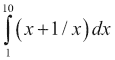
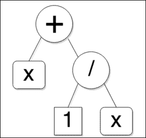

# 第七章高级和编译时编程

许多标准库算法将称为**Function Objects**(函数指针、函数器等)的可调用实体作为参数。 它们在容器的各个元素上调用这些函数对象来计算一些值或执行一些操作。 因此，算法的运行时逻辑的一部分被封装在函数或函数器中，并作为参数提供给算法。 函数还可以返回函数对象，而不是数据值。 返回的函数对象可以应用于一组参数，并且又可以返回值或另一个函数对象。 这就产生了更高阶的变换。 这种涉及传递和返回函数的编程风格称为**高阶编程**。

C++ 模板使我们能够编写类型泛型代码。 使用模板，可以在编译时执行分支和递归逻辑，并有条件地包含、排除和从更简单的构建块生成代码。 这种编程风格称为**编译时编程**或**模板元编程**。

在本章的第一部分中，我们将学习如何使用 Boost Phoenix 库和 C++ 11 工具(如 BIND 和 lambda)在 C++ 中进行高阶编程。 在本章的下一部分中，我们将学习在编译时执行的 C++ 模板元编程技术，以帮助生成更高效、更具表现力的代码。 在本章的最后部分，我们将通过结合使用高阶编程技术和元编程来研究在 C++ 中创建的特定于领域的语言。 本章的主题分为以下几节：

*   使用 Boost 的高阶编程
*   使用 Boost 进行编译时编程
*   特定于领域的嵌入式语言

在本章中，我们将探索另一种编程范式，它不同于面向对象编程和过程化编程，并且大量借鉴了函数式编程。 我们还将开发通用编程技术，最终帮助我们实现更高效的模板库。

# 带 Boost 的高阶编程

考虑具有三个字符串字段的类型`Book`：ISBN、Title 和 Author(出于我们的目的，假设只有一个 Author)。 下面是我们可以选择如何定义此类型：

```cpp
 1 struct Book
 2 {
 3   Book(const std::string& id,
 4        const std::string& name,
 5        const std::string& auth)
 6         : isbn(id), title(name), author(auth)
 7   {}
 8
 9   std::string isbn;
10   std::string title;
11   std::string author;
12 };
13
14 bool operator< (const Book& lhs, const Book& rhs)
12 {  return lhs.isbn < rhs.isbn;  }
```

它是一个具有三个字段的`struct`和一个初始化这三个字段的构造函数。 `isbn`字段唯一标识图书，因此使用重载的`operator<`(第 14 行)定义`Book`对象的排序。

现在假设我们在`std::vector`中有一个这些`Book`对象的列表，我们想要对这些书籍进行排序。 多亏了重载的`operator<`，我们可以使用标准库`sort`算法轻松地对它们进行排序：

```cpp
 1 #include <vector>
 2 #include <string>
 3 #include <algorithm>
 4 #include <iostream>
 5
 6 // include the definition of struct Book
 7 
 8 int main()
 9 {
10   std::vector<Book> books;
11   books.emplace_back("908..511..123", "Little Prince",
12                      "Antoine St. Exupery");
13   books.emplace_back("392..301..109", "Nineteen Eighty Four",
14                      "George Orwell");
15   books.emplace_back("872..610..176", "To Kill a Mocking Bird",
16                      "Harper Lee");
17   books.emplace_back("392..301..109", "Animal Farm",
18                      "George Orwell");
19
20   std::sort(books.begin(), books.end());
21 }
```

在前面的代码中，我们将四个`Book`对象放入向量`books`。 我们通过调用`emplace_back`方法(第 11-18 行)而不是`push_back`来实现这一点。 `emplace_back`方法(在 C++ 11 中引入)接受存储类型(`Book`)的构造函数参数，并在向量的布局中构造一个对象，而不是在预先构造的对象中复制或移动。 然后，我们使用`std::sort`对向量进行排序，它最终使用`Book`对象的`operator<`。 如果没有这个重载运算符，`std::sort`将无法编译。

这些都很好，但是如果您想要按 ISBN 的降序对图书进行排序呢？ 或者，您可以改为按作者对书籍进行分类。 此外，对于同一作者的两本书，您可能希望进一步按书名对它们进行排序。 在下一节中，我们将看到以这种方式对它们进行排序的方法。

## 函数对象

是`std::sort`算法的三参数重载，它将用于比较两个元素的函数对象作为第三个参数。 如果最终排序中第一个参数出现在第二个参数之前，则此函数对象应返回 TRUE，否则返回 FALSE。 因此，即使没有重载`operator<`，也可以告诉`std::sort`如何比较两个元素并对向量进行排序。 下面是我们如何使用排序函数进行排序：

**清单 7.1：将函数传递给算法**

```cpp
 1 bool byDescendingISBN(const Book& lhs, const Book& rhs)
 2 {  return lhs.isbn > rhs.isbn; }
 3 
 4 ...
 5 std::vector<Book> books;
 6 ...
 7 std::sort(books.begin(), books.end(), byDescendingISBN);
```

函数`byDescendingISBN`接受对两本书的常量引用，如果第一本书(`lhs`)的 ISBN 在词法上大于第二本书(`rhs`)，则返回 TRUE，否则返回 FALSE。 与`std::sort`算法期望作为其第三个参数的函数对象兼容的函数签名。 为了按降序对`books`向量进行排序，我们将一个指向此函数的指针传递给`std::sort`(第 7 行)。

函数指针绝不是您可以传递的唯一可调用实体。 *函数*是重载函数调用运算符成员(`operator()`)的类型。 通过对一组参数应用或调用函数器的实例，可以调用重载的`operator()`成员。 在下面的示例中，我们定义了一个函数来按作者姓名排序图书，如果与作者姓名一致，则按标题排序：

**清单 7.2：定义函数器并将其传递给算法**

```cpp
 1 ...
 2 struct CompareBooks
 3 {
 4   bool operator()(const Book& b1, const Book& b2) const {
 5     return (b1.author < b2.author)
 6            || (b1.author == b2.author 
 7                && b1.title < b2.title);
 8   }
 9 };
10
11 ...
12 std::vector<Book> books;
13 ...
14 std::sort(books.begin(), books.end(), CompareBooks());
```

我们定义了一个名为`CompareBooks`的函数器，它有一个重载的`operator()`，它接受两个`Book`对象进行比较(第 4 行)。 如果第一本书的作者的姓名在词典上小于第二本书的作者的名字，则返回 TRUE。 如果两本书的作者相同，则如果第一本书的标题在词典顺序上小于第二本书的标题，则返回 TRUE。 要使用此函数器作为排序标准，我们传递`CompareBooks`的临时实例作为`std::sort`算法的第三个参数(第 14 行)。 像`CompareBooks`这样将一个或多个参数映射到布尔真值的函数称为**谓词**。

### 提示

**术语注释**

我们使用术语**函数对象**来表示所有可以传递和存储以供应用稍后使用的可调用实体。 其中包括函数指针和函数器以及其他类型的可调用实体，如未命名函数或**lambdas**，我们将在本章中对其进行探讨。

函数**只是定义重载函数调用操作符的类或结构。**

 **接受一个或多个参数并将它们映射到布尔真值的函数对象通常称为**谓词**。

函数对象的**数量**是它接受的参数数量。 没有参数的函数具有 0 性质或者是**空**，具有一个参数的函数具有 1 性质或者是**一元**，具有两个参数的函数具有 2 性质或者是**二进制**，依此类推。

**纯函数**是一个返回值完全取决于传递给它的参数值并且没有副作用的函数。 修改函数非本地对象的状态、执行 I/O 或以其他方式修改执行环境-所有这些都属于副作用。

当您希望函数器在调用之间保留某些状态时，函数器特别有用。 例如，假设您有一个未排序的姓名列表，您只想创建一个以逗号分隔的所有姓名列表，该列表以特定字母开头。 这里有一种方法可以做到这一点：

**清单 7.3：状态为**的函数器

```cpp
 1 #include <vector>
 2 #include <string>
 3 #include <iostream>
 4 #include <algorithm>
 5
 6 struct ConcatIfStartsWith {
 7   ConcatIfStartsWith(char c) : startCh(c) {}
 8
 9   void operator()(const std::string& name) {
10     if (name.size() > 0 && name.at(0) == startCh) {
11       csNames += name + ", ";
12     }
13   }
14
15   std::string getConcat() const {
16     return csNames;
17   }
18
19   void reset() { csNames = ""; }
20
21 private:
22   char startCh;
23   std::string csNames;
24 };
25
26 int main() {
27   std::vector<std::string> names{"Meredith", "Guinnevere", 
28       "Mabel", "Myrtle", "Germaine", "Gwynneth", "Mirabelle"};
29
30   const auto& fe = std::for_each(names.begin(), names.end(), 
31                            ConcatIfStartsWith('G'));
32   std::cout << fe.getConcat() << '\n';
33 }
```

我们定义一个名为`ConcatIfStartsWith`(第 6 行)的函数器，它存储一些状态，即要匹配的起始字符(`startCh`)和包含逗号分隔的名称列表(`csNames`)的字符串。 当对某个名称调用函数器时，它会检查它是否以指定的字符开头，如果是，则将其连接到`csNames`(第 10-11 行)。 我们使用`std::for_each`算法对名称向量中的每个名称应用`ConcatIfStartsWith`函数(第 30-31 行)，查找以字母 G 开头的名称。我们传递的函数是一个临时函数(第 31 行)，但我们需要引用它才能访问存储在其中的连接字符串。 `std::for_each`算法实际上返回对传递的函数器的引用，然后我们使用该函数器来获得连接的字符串。 以下是输出，列出了以 G 开头的名称：

```cpp
Guinnevere, Germaine, Gwynneth, 
```

这说明了关于函数器的一个重要问题；当您想要在连续调用函数之间保持状态时，函数器特别有用。 如果您需要在代码中的多个位置使用它们，它们也非常有用。 通过直观地命名它们，可以在使用时明确它们的用途：

```cpp
   const auto& fe = std::for_each(names.begin(), names.end(), 
                                  ConcatIfStartsWith('G'));
```

但有时，函数器需要做的事情很琐碎(例如，检查一个数字是偶数还是奇数)。 通常，我们不需要它来维护两次调用之间的任何状态。 我们甚至可能不需要在多个地方使用它。 有时，我们要寻找的功能可能已经以某种形式存在，可能是作为对象的成员函数。 在这种情况下，编写一个新的函数器似乎有点矫枉过正。 C++ 11 引入了 lambdas 或未命名函数来精确地解决这种情况。

### lambdas-未命名的函数文字

字符串`"hello"`是有效的 C++ 表达式。 它有一个定义良好的类型(`const char[6]`)，可以赋给`const char*`类型的变量，并传递给接受`const char*`类型参数的函数。 同样，还有像`3.1415`或`64000U`这样的数值文字，像`true`和`false`这样的布尔文字，等等。 C++ 11 引入了**lambda 表达式**，用于生成在调用站点定义的匿名函数。 通常，简称为**lambdas**(出自 Alonzo Church 的λ演算)，它们由一个不绑定到函数名的函数体组成，用于在程序的词法作用域中的任何点生成函数定义，您希望在该点传递函数对象。 让我们首先通过一个例子来了解这是如何实现的。

我们有一个整数列表，我们希望使用`std::find_if`算法找到列表中的第一个奇数。 传递给`std::find_if`的谓词是使用 lambda 定义的。

[#T0Listing7.4:UsingLambdas@T1]

```cpp
 1 #include <vector>
 2 #include <algorithm>
 3 #include <cassert>
 4 
 5 int main() {
 6   std::vector<int> vec{2, 4, 6, 8, 9, 1};
 7 
 8   auto it = std::find_if(vec.begin(), vec.end(),
 9                         [](const int& num) -> bool 
10                         {  return num % 2 != 0; }
11                         );
12 
13   assert(it != vec.end() && *it == 9);
14 }
```

到的 lambda 计算一个数字是奇数还是偶数是作为第三个参数传递给`std::find_if`的代码块(第 9-10 行)。 让我们孤立地看一下 lambda，以理解其语法。 首先，考虑该函数的作用；给定一个整数，如果是奇数，则返回 TRUE，否则返回 FALSE。 因此，我们有一个将`int`映射到`bool`的未命名函数。 用 lambda-land 写这段文字的方法如下：

```cpp
[](const int& num) -> bool
```

我们引入带有一对空的方括号的未命名函数，并通过编写一个类似于常规函数的参数列表，后跟一个箭头和返回类型来描述映射。 接下来，我们编写函数体，就像您对普通函数所做的那样：

```cpp
{  return num % 2 != 0;  }
```

这对方括号，通常称为**λ介绍者**，不一定是空的，我们很快就会看到。 这种语法还可能有其他几种变体，但是您可以仅使用这一点语法来定义 lambda。 在简单的情况下，lambdas 的返回类型规范是可选的，在这种情况下，编译器可以很容易地从函数体推导出返回类型。 因此，我们可以在没有返回类型的情况下重写前面示例中的 lambda，因为函数体非常简单：

```cpp
[](const int& num) { return num % 2 != 0; }
```

#### Lambda 捕获

我们在前一个示例中定义的 lambda是一个没有任何状态的纯函数。 事实上，lambda 如何存储调用之间持续存在的状态？ 实际上，lambdas 可以访问周围作用域中的局部变量(除了全局变量)。 要启用这种访问，我们可以在 lambda 导入器中指定**Capture 子句**，以列出 lambda 可以访问周围作用域中的哪些变量以及*如何访问*。 考虑以下示例，在该示例中，我们从名称向量中筛选出长度超过用户指定长度的名称，并返回一个仅包含较短名称的向量：

**清单 7.5：带捕获的 lambdas**

```cpp
 1 #include <vector>
 2 #include <string>
 3 #include <algorithm>
 4 #include <iterator>
 5 typedef std::vector<std::string> NameVec;
 6
 7 NameVec getNamesShorterThan(const NameVec& names,
 8                             size_t maxSize) {
 9   NameVec shortNames;
10   std::copy_if(names.begin(), names.end(),
11                std::back_inserter(shortNames),
12                [maxSize](const std::string& name) {
13                   return name.size() <= maxSize;
14                }
15                );
16   return shortNames;
17 }
```

函数`getNamesShorterThan`有两个参数：一个称为`names`的向量和一个变量`maxSize`，该变量限制要过滤的字符串的大小。 它使用标准库中的`std::copy_if`算法，将短于`maxSize`的名称从`names`向量复制到名为`shortNames`的第二个向量中。 我们使用 lambda 表达式(第 12-14 行)生成`std::copy_if`的谓词。 您可以看到，我们从方括号内周围的词法作用域中命名了`maxSize`变量(第 12 行)，并在 lambda 的主体内访问它以比较传递的字符串的大小(第 13 行)。 这允许只读访问 lambda 内的`maxSize`变量。 如果我们想要潜在地访问周围作用域中的任何变量，而不是特定的变量，我们可以编写在方括号中带有等号的 lambda；这将*隐式地捕获*周围作用域中使用的任何变量：

```cpp
[=](const std::string& name) {
   return name.size() <= maxSize;
}
```

您可能希望修改周围作用域中变量的本地副本，而不影响其在周围作用域中的值。 要使您的 lambda 能够做到这一点，必须将其声明为可变的：

```cpp
[=](const std::string& name) mutable -> bool {
 maxSize *= 2;
   return name.size() <= maxSize;
}
```

关键字`mutable`位于参数列表之后，但如果指定了返回类型，则会出现在返回类型之前。 这不会影响周围范围内的`maxSize`的值。

您还可以在 lambda 中修改周围作用域中的变量。 要做到这一点，您必须通过引用捕获变量，方法是在方括号中的变量名称前加上一个“与”符号。

下面是使用 lambda 重写的清单 6.3：

**清单 7.6：lambda**中的引用捕获

```cpp
 1 #include <vector>
 2 #include <string>
 3 #include <algorithm>
 4 #include <iostream>
 5
 6 int main() {
 7   std::string concat;
 8   char startCh = 'M';
 9   std::vector<std::string> names{"Meredith", "Guinnevere", "Mabel"
10                  , "Myrtle", "Germaine", "Gwynneth", "Mirabelle"};
11 
12   std::for_each(names.begin(), names.end(), 
13                [&concat, startCh](const std::string& name) {
14                  if (name.size() > 0 && name[0] == startCh) {
15                    concat += name + ", ";
16                  }
17                });
18   std::cout << concat << '\n';
19 }
```

在前面的示例中，我们连接了向量`names`中以特定字符开头的所有名称。 起始字符从变量`startCh`中提取。 连接的字符串存储在变量`concat`中。 我们在向量的元素上调用`std::for_each`，并传递一个 lambda，它显式地从周围的作用域捕获`concat`作为引用(带有前导和号)和`startCh`作为只读值(第 13 行)。 因此，它可以追加到`concat`(第 15 行)。 此代码打印以下输出：

```cpp
Meredith, Mabel, Myrtle, Mirabelle
```

在 C++ 标准的最新修订版(称为 C++ 14)中，lambdas 变得更漂亮了一些。 您可以编写一个*泛型 lambda*，它的参数类型是根据上下文推导出来的。 例如，在 C++ 14 中，您可以编写上一个示例中对`std::for_each`的调用，如下所示：

```cpp
  std::for_each(names.begin(), names.end(), 
               [&concat, startCh](const auto& name) {
                 if (name.size() > 0 && name[0] == startCh) {
                   concat += name + ", ";
                 }
               });
```

Lambda 的参数类型写为`const auto&`，编译器根据迭代序列中的元素类型将其推断为`const std::string&`。

### 委托和闭包

让我们假设您正在编写一个高级 C++ API，用于读取消息队列上的传入消息。 API 的客户端必须注册它感兴趣的消息类型，并传递回调-当您感兴趣的消息到达时将调用的函数对象。 您的 API 可以是`Queue`类的成员。 以下是一个可能的 API 签名：

```cpp
class Queue
{
public:
  ...
 template <typename CallbackType>
 int listen(MsgType msgtype, CallbackType cb);
  ...
};
```

`listen`成员模板有两个参数：消息类型`msgtype`，它标识感兴趣的消息，以及当新消息到达时将调用的回调函数对象`cb`。 由于我们希望客户端能够传递函数指针、指向成员函数的指针、函数器以及回调的 lambdas，因此我们将`listen`设置为回调类型的参数化成员模板。 当然，回调应该有特定的签名。 让我们假设它应该与以下函数的签名兼容：

```cpp
void msgRead(Message msg);
```

这里，`Message`是从队列读取的消息类型。 `listen`成员模板有点过于宽松，因为它可以用不符合前面签名的函数对象实例化。 对于签名不兼容的回调，编译错误发生在`listen`内部调用回调的位置，而不是传递不一致回调的位置。 这会使调试编译器错误变得更加困难。

Boost.Function 库及其 C++ 11 化身`std::function`提供了专门为解决此类问题而定制的函数对象包装。 我们可以将函数`msgRead`的类型写为`void (Message)`。 数量为 N 的函数类型的一般语法如下：

```cpp
return-type(param1-type, param2-type, ..., paramN-type)
```

与前面的**函数类型**相对应的更熟悉的**函数指针类型**将是：

```cpp
return-type (*)(param1-type, param2-type, ..., paramN-type)
```

因此，函数`int foo(double, const char*)`的类型为：

```cpp
int(double, const char*);
```

指向的指针类型为：

```cpp
int (*)(double, const char*);
```

使用具有适当函数类型的`std::function`，我们可以声明`listen`，以便它只接受符合正确签名的函数对象：

```cpp
#include <boost/function.hpp>

class Queue
{
public:
  ...
 int listen(MsgType msgtype, boost::function<void(Message)> cb);
  ...
};
```

回调现在被声明为`boost::function<void(Message)>`类型。 现在可以使用指向全局函数、函数器甚至 lambda 的指针调用`listen`，并且只有在函数对象具有一致签名时才会编译。 如果我们使用的是 C++ 11 编译器，我们可以使用`std::function`代替 `boost::function`。 在 C++ 11 之前的编译器上，`boost::function`支持多达 10 个参数的签名，而`std::function`没有任何限制，因为它使用 C++ 11*可变模板*。 有关`boost::function`的更多功能及其与`std::function`的区别(这些都是次要的)，您可以参考在线文档。

将非静态成员函数作为回调传递需要稍微多做一些工作，因为必须在其类的实例上调用非静态成员。 考虑具有成员`handleMessage`的以下类`MessageHandler`：

```cpp
class MessageHandler
{
public:
  ...
  void handleMessage(Message msg);
};
```

`handleMessage`成员函数被隐式传递一个指向作为其第一个参数调用的`MessageHandler`对象的指针；因此其有效签名为：

```cpp
void(MessageHandler*, Message);
```

当我们希望将此作为回调传递给`Queue::listen`时，我们可能已经知道要调用哪个对象`handleMessage`，如果我们能以某种方式将该对象实例也附加到调用中以进行侦听，那就太好了。 有几种方法可以做到这一点。

第一种方法涉及到将对`handleMessage`的调用包装在 lambda 中并将其传递给`listen`。 以下代码片段说明了这一点：

**清单 7.7：使用闭包的成员函数回调**

```cpp
 1 MessageHandler *handler = new MessageHandler(...);
 2 Queue q(...);
 3 ...
 4 q.listen(msgType, [handler](Message msg)
 5                   {  handler->handleMessage(msg);  }
 6                   );
```

这里，`listen`的第二个参数是使用 lambda 表达式生成的，该表达式还捕获来自周围作用域的指向`handler`对象的指针。 在本例中，`handler`是调用作用域中的一个局部变量，但是 lambda 捕获它并将它绑定到它生成的函数对象中。 此函数对象不会立即在其上调用，但会延迟到队列上接收到感兴趣的消息，当它将调用转发到`handler`对象指针上的`handleMessage`方法时。

`handler`指针是在调用作用域中创建的，但在另一个作用域中可以通过 lambda 捕获间接访问。 这称为**动态作用域**，这种绑定到创建它们的词法作用域中的变量的函数称为**闭包**。 当然，处理程序指针在调用`handleMessage`时仍必须指向有效的`MessageHandler`对象，而不仅仅是在创建 lambda 时。

通常，这样的 lambdas 会从成员函数内部生成，就像`MessageHandler`类的成员函数一样，并且会捕获`this`指针，并进行一些语法简化：

**清单 7.8：在 lambdas**中捕获此指针

```cpp
 1 class MessageHandler
 2 {
 3 public:
 4   ...
 5   void listenOnQueue(Queue& q, MessageType msgType) {
 6     q.listen(msgType, [this](Message msg) 
 7                       { handleMsg(msg); } );
 8   }
 9 
10   void handleMsg(Message msg) { ... }
11 };
```

在前面的示例中，我们使用捕获`this`指针的 lambda 表达式创建闭包(第 6 行)。 在 lambda 中对`handleMsg`的调用会自动绑定到`this`指针，就像在成员函数中一样。 回调，特别是在绑定到特定对象时，如前所述，有时称为**委托**。

`boost::function`/`std::function`包装器提供了一种有效的类型检查方式，可以将函数对象作为回调或委托进行传递和返回。 它们有时被称为多态函数包装器，因为它们完全从调用方抽象出底层可调用实体(函数指针、函数器等)的类型。 不过，大多数实现都是动态分配内存的，因此您应该仔细评估它们对运行时性能的影响。

### 部分功能应用

给定标准库函数`pow`：

```cpp
double pow(double base, double power);
```

考虑代码行`x = pow(2, 3)`的影响。 当遇到此行时，函数`pow`会立即用两个参数(值 2 和 3)调用。函数`pow`计算 2 的值为 3，并返回值 8.0，然后将该值赋给`x`。

现在，假设你有一个数字列表，你想把它们的立方体放到另一个列表中。 标准库算法`std::transform`非常适合这一点。 我们只需要找到合适的函数器来将数字提升到它们的立方幂即可。 以下函数接受单个数值参数，并使用`pow`函数将其求幂：

```cpp
#include <cmath>

struct RaiseTo {
  RaiseTo(double power) : power_(power) {}

  double operator()(double base) const {
    return pow(base, power_);
  }

  double power_;
};
```

我们还可以使用 lambda 表达式来生成函数对象，如上一节中的清单 7.7 和 7.8 所示。 将`RaiseTo`与`std::transform`算法配合使用时，以下代码可完成此工作：

```cpp
std::vector<double> nums, raisedToThree;
...
std::transform(nums.begin(), nums.end(), 
               std::back_inserter(raisedToThree),
               RaiseTo(3));
```

`RaiseTo`中的核心计算由`pow`函数完成。 `RaiseTo`函数提供了一种通过构造函数参数和与`std::transform`期望的调用签名兼容的调用签名来修复功率的方法。

想象一下，如果您可以在没有函数器或 lambdas 的情况下在 C++ 中做到这一点。 如果使用下面的*假想的*语法，您可以做同样的事情吗？

```cpp
std::transform(nums.begin(), nums.end(), 
               std::back_inserter(raisedToThree),
               pow(_, 3));
```

这就好比您正在传递`pow`函数，其两个参数中的一个固定为 3，并要求`transform`算法填充空白；提供要增加到的数字。 表达式`pow(_, 3)`的计算结果应该是一个函数对象，接受一个参数而不是 2 个参数。我们基本上使用`RaiseTo`函数实现了这一点，但是 Boost 绑定库及其 C++ 11 化身`std::bind`帮助我们用更少的语法实现了这一点。 形式上，我们刚才所做的称为**部分函数应用**。

要使用`bind`为`pow`创建部分应用的函数对象，您需要编写：

```cpp
boost::bind(pow, _1, 3)
```

前面的表达式使用标准库函数`pow`生成一个未命名的函数器，该函数器接受单个参数并返回其值的 3 次方。 与我们想象中的语法的相似之处应该是显而易见的。 要立方的值作为生成的函数器的唯一参数传递，并映射到特殊占位符`_1`。

**清单 7.9：使用 Boost 绑定**

```cpp
 1 #include <boost/bind.hpp>
 2 
 3 std::vector<double> nums, raisedToThree;
 4 std::transform(nums.begin(), nums.end(),
 5                std::back_inserter(raisedToThree),
 6                boost::bind(pow, _1, 3));
```

如果生成的函数器接受更多参数，则可以根据它们在参数列表中的位置将它们映射到占位符`_2`、`_3`等。 通常，第 n 个参数映射到占位符*_n*。 默认情况下，Boost Bind 最多支持 9 个位置占位符(`_1`到`_9`)；`std::bind`可能支持更多(不同的编译器不同)，但您需要使用以下指令之一从`std::placeholders`命名空间访问它们：

```cpp
using std::placeholders::_1;
using std::placeholders::_2;
// etc. OR
using namespace std::placeholders;
```

您可以通过重新排序函数的参数来调整函数，而无需更改函数的性质，以实现新的功能。 例如，给定函数`std::less`，如果其第一个参数小于第二个参数，则返回`true`，我们可以生成一个函数，如果其第一个参数大于第二个参数，则通过交换参数返回 TRUE。 以下表达式将生成以下内容：

```cpp
boost::bind(std::less<int>(), _2, _1)
```

这里，`std::less<int>`接受两个参数，我们生成一个包装器函数对象，该对象也接受两个参数，但在将它们传递给`std::less`之前交换它们的位置。 我们可以直接就地调用生成的函数器，如下所示：

```cpp
boost::bind(std::less<int>(), _2, _1)(1, 10)
```

我们可以断言 1 不大于 10，但实际上小于：

```cpp
assert( std::less<int>()(1, 10) );
assert( !boost::bind(std::less<int>(), _2, _1)(1, 10) );
```

Boost 绑定对于生成委托也很有用，清单 7.7 和 7.8 说明了生成委托的其他方法。 下面是使用`boost::bind`重写的清单 7.8：

**清单 7.10：使用 Boost 绑定**生成委托

```cpp
 1 class MessageHandler
 2 {
 3 public:
 4   ...
 5   void listenOnQueue(Queue& q, MessageType msgType) {
 6     q.listen(msgType, boost::bind(&MessageHandler::handleMsg,
 7                                   this, _1));
 8   }
 9 
10   void handleMsg(Message msg) { ... }
11 };
```

我们必须将成员函数绑定到对象实例。 我们通过将`this`绑定到`MessageHandler::handleMsg`的第一个参数(第 6-7 行)来实现这一点。 此技术通常用于调用集合中每个对象的成员函数。 此外，`boost::bind`/`std::bind`智能地处理对象、指针、智能指针等，因此您不需要编写不同的绑定器，具体取决于它是对象、指针还是智能指针的副本。 在下面的示例中，我们取一个由`std::string`组成的向量，使用`size`成员函数计算它们的长度，然后将它们放入一个长度向量中：

**清单 7.11：使用 Boost 绑定**生成委托

```cpp
 1 #include <functional>
 2 ...
 3 std::vector<std::string> names{"Groucho", "Chico", "Harpo"};
 4 std::vector<std::string::size_type> lengths;
 5 using namespace std::placeholders;
 67 std::transform(names.begin(), names.end(), 
 8                std::back_inserter(lengths),
 9                std::bind(&std::string::size, _1));
```

长度是通过调用每个`std::string`对象上的`size`成员函数来计算的。 表达式`std::bind(&std::string::size, _1)`生成一个未命名的函数器，该函数器调用传递给它的`string`对象上的`size`成员。

即使`names`是指向`std::string`对象的指针的向量或智能指针，绑定表达式(第 9 行)也不需要更改。 `bind`函数按值接受其参数。 因此，在前面的示例中，每个字符串都被复制到生成的函数器中-这是潜在性能问题的根源。

另一个名为`boost::mem_fn`的函数模板及其对应的标准库`std::mem_fn`使调用对象上的成员函数和生成委托更加容易。 `mem­_fn`函数模板在指向类成员的指针周围创建包装器。 对于类`X`中的数量为`N`的成员函数`f`，`mem_fn(&X::f)`生成一个数量为`N+1`的函数，其第一个参数必须是指向调用成员函数的对象的引用、指针或智能指针。

我们可以编写清单 7.11 以改用`mem_fn`：

```cpp
 1 #include <boost/mem_fn.hpp> // <functional> for std
 2
...
 7 std::transform(names.begin(), names.end(), 
 8                std::back_inserter(lengths),
 9                boost::mem_fn(&std::string::size));
```

因为`std::string::size`是空值的，所以由`boost::mem_fn`生成的函数是一元的，并且可以很容易地与`transform`一起使用，而不需要额外的绑定。 节省的原因是不必编写`_1`占位符，因此语法噪音更小。

当我们使用`bind`生成函数对象时，它不会立即检查参数的类型和数量是否与要绑定到的函数的签名匹配。 只有在调用生成的函数对象时，编译器才会检测到参数类型和大小不匹配：

```cpp
1 std::string str;
2 auto f = boost::bind(&std::string::size, 5); // binds to literal 5
3 auto g = boost::bind(&std::string::size, _1, 20); // binds two args
```

例如，即使您不能对数字文字 5(第 2 行)调用`std::string`的`size`成员函数，上述代码也可以编译。 `size`成员函数也不接受额外的数字参数(第 3 行)。 但是，一旦您尝试调用这些生成的函数对象，就会因为类型和大小不匹配而出现错误：

```cpp
4 f(); // error: operand has type int, expected std::string
5 g(str); // error: std::string::size does not take two arguments
```

重载的绑定成员函数需要更多的语法工作。 使用`bind`生成中等复杂度的函数是嵌套绑定中的一项练习，这通常会产生不可维护的代码。 一般而言，随着 C++ 11 lambda 的出现及其在 C++ 14 中的进一步改进，lambdas 而不是 bind 应该是生成未命名函数器的首选机制。 只有当`bind`使您的代码比 lambda 更具表现力时，才使用`bind`。

# 使用 Boost 进行编译时编程

模板允许我们编写独立于特定类型的操作数的 C++ 代码，因此可以不改变地使用一大类类型。 我们可以创建**函数模板**和**类模板**(或结构模板)，它们接受类型参数、非类型参数(如常量整数)以及模板参数。 实例化类模板的*专门化*时，不会实例化未直接或间接调用的成员函数。

不过，C++ 模板的强大功能超出了编写泛型代码的能力。 C++ 模板是一个强大的计算子系统，我们可以使用它来反思 C++ 类型，收集它们的属性，并编写在编译时执行的复杂的递归和分支逻辑。 使用这些功能，可以为实现定义针对其操作的每种类型进行高度优化的通用接口。

## 使用模板的基本编译时控制流

在本部分中，我们简要介绍使用模板生成的分支和递归逻辑。

### 分支

考虑函数模板`boost::lexical_cast`，该函数模板在[第 2 章](02.html "Chapter 2. The First Brush with Boost's Utilities")，*使用 Boost 的实用程序*的第一个刷子中介绍。 要将`string`转换为`double`，我们将编写如下代码：

```cpp
std::string strPi = "3.141595259";
double pi = boost::lexical_cast<double>(strPi);
```

`lexical_cast`的主模板是这样声明的：

```cpp
template <typename Target, typename Source>Target lexical_cast(const Source&);
```

`lexical_cast`的默认实现(称为**主模板**)通过类似于`ostringstream`的接口将源对象写入内存缓冲区，并通过类似于`istringstream`的另一个接口从内存缓冲区中读取源对象。 此转换可能会导致一些性能开销，但具有表现力语法。 现在让我们假设，对于一个特别性能密集型的应用，您想要提高这些字符串到双精度转换的性能，但不想用其他一些函数调用替换`lexical_cast`。 你会怎么做？ 我们可以创建`lexical_cast`函数模板的**显式专用化**，以便在编译时基于转换中涉及的类型执行分支。 由于我们希望覆盖`string`到`double`转换的默认实现，因此我们将如何编写专门化：

**清单 7.12：函数模板的显式专门化**

```cpp
 1 namespace boost {
 2 template <>
 3 double lexical_cast<double, std::string>(
 4                          const std::string& str)
 5 {
 6   const char *numstr = str.c_str();
 7   char *end = nullptr;
 8   double ret = strtod(numstr, &end);
 9   
10   if (end && *end != '\0') {
11     throw boost::bad_lexical_cast();
12   }
13
14   return ret;
15 }
16 } // boost
```

带有空参数列表(`template<>`)的`template`关键字表示这是特定类型参数的专门化(第 2 行)。 模板标识符**`lexical_cast <double, std::string>`列出了专门化生效的特定类型(第 3 行)。 由于此专门化可用，每当编译器看到如下代码时都会调用它：**

```cpp
std::string strPi = "3.14159259";
double pi = boost::lexical_cast<double>(strPi);
```

请注意，可以*重载函数模板*(不仅仅是函数)。 例如：

```cpp
template<typename T> void foo(T);     // 1
template<typename T> void foo(T*);    // 2
template<typename T> T foo(T, T);     // 3
void foo(int);                        // 4
template<> void foo<double>(double);  // 5

int x;
foo(&x);   // calls 2
foo(4, 5); // calls 3
foo(10);   // calls 4
foo(10.0); // calls 5
```

在前面的示例中，`foo`是重载(2 和 3)的函数模板(1)。 函数`foo`本身是重载的(4)。 函数模板`foo`(1)也是专门化的(5)。 当编译器遇到对`foo`的调用时，它首先查找匹配的非模板重载，如果不匹配，则查找最专门的模板重载。 在没有匹配的专用重载的情况下，这将简单地解析到主模板。 因此，对`foo(&x)`的调用解析为`template<typename T> void foo(T*)`。 如果不存在这样的过载，它将解析为`template<typename T> void foo(T)`。

也可以为类模板创建专门化。 除了显式专门化(为一组固定的类型和非类型参数专门化类模板)外，我们还可以创建**部分专门化类模板**，专门化类型系列或类别的类模板：

```cpp
template <typename T, typename U>
class Bar { /* default implementation */ };

template <typename T>
class Bar<T*, T> { /* implementation for pointers */ };
```

在前面的示例中，主模板`Bar`采用两个类型参数。 我们为这些情况创建了`Bar`的部分专门化，其中这两个参数中的第一个参数是指针类型，第二个参数是第一个参数的指针类型。 因此，实例化`Bar<int, float>`或`Bar<double, double*>`将实例化主模板，但`Bar<float*, float>`、`Bar<Foo*, Foo>`等将实例化部分专门化的模板。 请注意，不能部分指定函数。

### 递归

使用模板的递归最好用一个在编译时计算阶乘的例子来说明。 只要值在编译时是已知的，类模板(以及函数模板)就可以接受整数参数。

**清单 7.13：使用模板的编译时递归**

```cpp
 1 #include <iostream>
 2
 3 template <unsigned int N>
 4 struct Factorial
 5 {
 6   enum {value = N * Factorial<N-1>::value};
 7 };
 8
 9 template <>
10 struct Factorial<0>
11 {
12   enum {value = 1};  // 0! == 1
13 };
14
15 int main()
16 {
17   std::cout << Factorial<8>::value << '\n';  // prints 40320
18 }
```

用于计算阶乘的主模板定义了编译时常数枚举`value`。 `Factorial<N>`中的`value`枚举包含`N`的阶乘的值。 这是通过实例化`N-1`的`Factorial`模板并将其嵌套的`value`枚举与`N`相乘来递归计算的。 停止条件由`Factorial`对 0 的专门化提供。 这些计算在编译时进行，因为`Factorial`模板使用连续较小的参数进行实例化，直到`Factorial<0>`停止进一步实例化。 因此，在编译时完全计算值`40320`，并将其烘焙到构建的二进制文件中。 例如，我们可以编写以下代码，它将在堆栈上编译并生成一个由 40320 个整数组成的数组：

```cpp
int arr[Factorial<8>::value];  // an array of 40320 ints
```

## 助推型性状

Boost 类型特征库提供了一组模板，用于在编译时查询类型的属性并生成派生类型。 它们在泛型代码(即使用参数化类型的代码)中非常有用，用于根据类型参数的属性选择最佳实现等目的。

请考虑以下模板：

```cpp
 1 #include <iostream>
 2
 3 template <typename T>
 4 struct IsPointer {
 5   enum { value = 0 };
 6 };
 7
 8 template <typename T>
 9 struct IsPointer <T*> {
10   enum { value = 1 };
11 };
12
13 int main() {
14   std::cout << IsPointer<int>::value << '\n';
15   std::cout << IsPointer<int*>::value << '\n';
16 }
```

`IsPointer`模板有一个名为`value`的嵌套枚举。 在主模板中将其设置为 0。 我们还为指针类型的参数定义了`IsPointer`的部分专门化，并将嵌套的`value`设置为 1。这个类模板有什么用处？ 对于任何类型`T`，当且仅当`T`是指针类型时，`IsPointer<T>::value`为 1，否则为 0。 `IsPointer`模板将其类型参数映射到编译时常数值 0 或 1，该值可用于编译时的进一步分支决策。

Boost Type Characterns 库中充满了这样的模板(包括`boost::is_pointer`)，这些模板可以收集有关类型的信息，还可以在编译时生成新类型。 它们可用于为手头的类型选择或生成最佳代码。 Boost Type 特征在 2007 年被 C++ TR1 版本接受，从 C++ 11 开始，标准库中有一个类型特征库。

每种类型特性都在其自己的头中定义，因此您可以只包含您需要的那些类型特性。 例如，`boost::is_pointer`将在`boost/type_traits/is_pointer.hpp`中定义。 对应的`std::is_pointer`(在 C++ 11 中引入)在标准标头`type_traits`中定义，没有单独的标准标头。 每个类型特征都有一个称为`type`的嵌入类型，此外，它还可以有一个 bool 类型的成员`value`。 下面是一个使用几个类型特征的示例。

**清单 7.14：使用类型特征**

```cpp
 1 #include <boost/type_traits/is_pointer.hpp>
 2 #include <boost/type_traits/is_array.hpp>
 3 #include <boost/type_traits/rank.hpp>
 4 #include <boost/type_traits/extent.hpp>
 5 #include <boost/type_traits/is_pod.hpp>
 6 #include <string>
 7 #include <iostream>
 8 #include <cassert>
 8
 9 struct MyStruct {
10   int n;
11   float f;
12   const char *s;
13 };
14
15 int main()
16 {
17 // check pointers
18   typedef int* intptr;
19   std::cout << "intptr is "
20             << (boost::is_pointer<intptr>::value ?"" :"not ") 
21             << "pointer type\n";
22 // introspect arrays
23   int arr[10], arr2[10][15];
24   if (boost::is_array<decltype(arr)>::value) {
25     assert(boost::rank<decltype(arr)>::value == 1);
26     assert(boost::rank<decltype(arr2)>::value == 2);
27     assert(boost::extent<decltype(arr)>::value == 10);
28     assert(boost::extent<decltype(arr2)>::value == 10);
29     assert((boost::extent<decltype(arr2), 1>::value) == 15);
30     std::cout << "arr is an array\n";
31   }
32
33 // POD vs non-POD types
34   std::cout << "MyStruct is " 
35             << (boost::is_pod<MyStruct>::value ?"" : "not ")
36             << "pod type." << '\n';
37   std::cout << "std::string is " 
38             << (boost::is_pod<std::string>::value ?"" : "not ")
40             << "pod type." << '\n';
41 }
```

在本例中，我们使用许多类型特征来查询有关类型的信息。 我们将类型`intptr`定义为整数指针(第 18 行)。 将`boost::is_pointer`应用于`intptr`产生 TRUE(第 20 行)。

这里使用的`decltype`说明符是在 C++ 11 中引入的。它生成它应用到的表达式或实体的类型。 因此，`decltype(arr)`(第 24 行)产生声明的 ARR 类型，包括任何`const`或`volatile`限定符。 它是计算表达式类型的有用方法。 我们将`boost::is_array`特征应用于数组类型，这显然会产生 TRUE(第 24 行)。 要找出数组的维数或秩，我们使用特征`boost::rank`(第 25 和 26 行)。 `arr[10]`的排名是 1(第 25 行)，但是`arr2[10][15]`的排名是 2(第 26 行)。 `boost::extent`特性用于查找数组的秩的范围。 它必须传递数组的类型和秩。 如果排名未通过，则默认为 0 并返回一维数组的范围(第 27 行)或多维数组的第零维(第 28 行)。 否则，应该显式指定排名(第 29 行)。

`boost::is_pod`特征返回类型是否为普通旧数据类型。 对于没有任何构造函数或析构函数(如`MyStruct`(第 34 行))的简单结构，它返回 true；对于显然不是 POD 类型的`std::string`，它返回 false(第 38 行)。

正如前面提到的，这些特征中还嵌入了一种称为`type`的类型。 这被定义为`boost::true_type`或`boost::false_type`，具体取决于特征返回 TRUE 还是 FALSE。 现在考虑一下，我们正在编写一个通用算法，将任意对象的数组复制到堆上的数组中。 对于 POD 类型，整个数组的浅表复制或`memcpy`就足够了，而对于非 POD 类型，我们需要执行逐个元素的复制。

**清单 7.15：利用类型特征**

```cpp
 1 #include <boost/type_traits/is_pod.hpp>
 2 #include <cstring>
 3 #include <iostream>
 4 #include <string>
 5 
 6 struct MyStruct {
 7   int n; float f;
 8   const char *s;
 9 };
10
11 template <typename T, size_t N>
12 T* fastCopy(T(&arr)[N], boost::true_type podType)
13 {
14   std::cerr << "fastCopy for POD\n";
15   T *cpyarr = new T[N];
16   memcpy(cpyarr, arr, N*sizeof(T));
17
18   return cpyarr;
19 }
20
21 template <typename T, size_t N>
22 T* fastCopy(T(&arr)[N], boost::false_type nonPodType)
23 {
24   std::cerr << "fastCopy for non-POD\n";
25   T *cpyarr = new T[N];
26   std::copy(&arr[0], &arr[N], &cpyarr[0]);
27
28   return cpyarr;
29 }
30
31 template <typename T, size_t N>
32 T* fastCopy(T(&arr)[N])
33 {
34   return fastCopy(arr, typename boost::is_pod<T>::type());
35 }
36
37 int main()
38 {
39   MyStruct podarr[10] = {};
40   std::string strarr[10];
41
42   auto* cpyarr = fastCopy(podarr);
43   auto* cpyarr2 = fastCopy(strarr);
44   delete []cpyarr;
45   delete []cpyarr2;
46 }
```

`fastCopy`函数模板在堆上创建数组的副本(第 31-35 行)。 我们创建了它的两个重载：一个用于复制 POD 类型(第 11-12 行)，另一个用于复制非 POD 类型(第 21-22 行)，方法是在第一种情况下添加类型为`boost::true_type`的第二个参数，在第二种情况下添加类型为`boost::false_type`的第二个参数。 我们创建两个数组：一个是 POD 类型`MyStruct`，另一个是非 POD 类型`std::string`(第 42-43 行)。 我们对这两个调用`fastCopy`，它们都被解析为一个参数重载(第 32 行)。 这会将调用转发给`fastCopy`的两个参数重载，将`boost::is_pod<T>::type`的一个实例作为第二个参数传递(第 34 行)。 这会自动将调用路由到正确的重载，具体取决于存储的类型`T`是否为 POD 类型。

在这本书的范围内，有很多很多我们无法涵盖的类型特征。 您可以使用类型特征来检查一个类型是否为另一个类型的基类(`boost::is_base`)、一个类型是否可复制构造(`boost::is_copy_constructible`)、是否具有特定运算符(例如，`boost::has_pre_increment`)、是否与另一个类型相同(`boost::is_same`)等等。 在线文档是挖掘特性并查看哪些特性适合手头工作的好地方。

### SFINAE 和 ENABLE_IF/DISABLE_IF

每次编译器遇到与函数模板同名的函数调用时，它都会创建匹配模板和非模板重载的重载解析集。 编译器根据需要推导模板参数，以确定哪些函数模板重载(及其专门化)符合条件，并且在该过程中实例化符合条件的模板重载。 如果在模板的实参列表或函数参数列表中替换推导出的类型实参导致错误，则不会导致编译中止。 相反，编译器会从其重载解析集中删除候选项。 这称为**替换失败不是错误**或**SFINAE**。 只有在过程结束时，重载解决方案集为空(没有候选者)或有多个同样好的候选者(模糊性)时，编译器才会标记错误。

通过使用涉及编译时类型计算的几个聪明技巧，可以利用 SFINAE 有条件地包含模板或将它们排除在重载解析集中。 最简洁的语法是由 Boost.Utility 库中的`boost::enable_if`/`boost::disable_if`模板提供的。

让我们编写一个函数模板，将一个元素数组复制到另一个数组中。 主模板签名如下：

```cpp
template <typename T, size_t N>
void copy(T (&lhs)[N], T (&rhs)[N]);
```

因此，您传递了两个存储相同类型元素的大小相同的数组，并且第二个参数的元素将按正确的顺序复制到第一个数组中。 我们还假设数组永远不会重叠；这将使实现变得简单。 不用说，这不是可以进行这种任务的最普遍的环境，但我们稍后会放宽其中一些限制。 以下是该模板的通用实现：

```cpp
 1 template <typename T, size_t N>
 2 void copy(T (&lhs)[N], T (&rhs)[N])
 3 {
 4   for (size_t i = 0; i < N; ++ i) {
 5     lhs[i] = rhs[i];
 6   }
 7 }
```

这里的第一个优化机会是当 T 是 POD 类型并且按位复制足够好并且可能更快的时候。 我们将为 POD-TYPE 创建一个特殊的实现，并仅在处理 POD-TYPE 数组时使用 SFINAE 来选择此实现。 在处理非 POD 类型数组时，我们的技术应该从重载集中排除此重载。 下面是 POD 类型的特殊实现：

```cpp
 1 // optimized for POD-type
 2 template <typename T, size_t N>
 3 void copy(T (&lhs)[N], T (&rhs)[N])
 4 {
 5   memcpy(lhs, rhs, N*sizeof(T));
 6 }
```

如果您注意到，这两个实现具有相同的签名，显然不能共存。 这就是`boost::enable_if`模板的用武之地。 `boost::enable_if`模板有两个参数：一个类型`T`和第二个类型`E`，缺省类型为`void`。 `enable_if`定义了一个名为`type`的嵌入式类型，仅当`T`具有名为`type`的嵌入式类型且`T::type`为`boost::true_type`时，该类型才类型定义为`E`。 否则，不定义嵌入类型。 使用`enable_if`，我们修改优化实现：

**清单 7.16：使用 ENABLE_IF**

```cpp
#include <boost/utility/enable_if.hpp>
#include <boost/type_traits/is_pod.hpp>

// optimized for POD-type
template <typename T, size_t N>
typename boost::enable_if<boost::is_pod<T>>::type
copy(T (&lhs)[N], T (&rhs)[N])
{
  memcpy(lhs, rhs, N*sizeof(T));
}
```

关键字`typename`是必需的，因为否则编译器无法知道表达式`boost::enable_if<boost::is_pod<T>>::type`是命名类型还是命名成员。

如果我们现在实例化一个非 POD 类型的数组，它将解析为默认实现：

```cpp
std::string s[10], s1[10];
copy(s1, s);  // invokes the generic template
```

调用`copy`会导致编译器实例化两个模板，但`boost::is_pod<std::string>::type`为`boost::false_type`。 现在`enable_if<false_type>`没有针对 POD 数组优化的`copy`版本的返回类型规范所要求的嵌套类型。 因此，出现替换失败，此重载将从重载解析集中移除，并调用第一个或通用实现。 现在考虑以下情况，其中我们尝试复制 POD-TYPE 数组(`double`)：

```cpp
double d[10], d1[10];
copy(d1, d);
```

在当前情况下，POD 优化版本将不再遇到替换失败，但默认实现也将与此调用的签名兼容。 因此，会有歧义，这会导致编译器错误。 要解决这个问题，我们必须确保泛型实现这次不会重载。 这是在泛型实现的返回类型中使用`boost::disable_if`(实际上是`boost::enable_if`求反)来完成的。

**清单 7.17：使用 DISABLE_IF**

```cpp
 1 template <typename T, size_t N>
 2 typename boost::disable_if<boost::is_pod<T>>::type
 3 copy(T (&lhs)[N], T (&rhs)[N])
 4 {
 5   for (size_t i = 0; i < N; ++ i) {
 6     lhs[i] = rhs[i];
 7   }
 8 }
```

当`T`是POD 型时，`is_pod<T>::type`是`boost::true_type`。 `boost::disable_if<true_type>`没有嵌套的`type`，因此泛型实现出现替换失败。 通过这种方式，我们构建了两个在编译时正确解析的互斥实现。

我们还可以使用`boost::enable_if_c<>`模板，它接受布尔参数而不是类型。 `boost::enable_if_c<true>`具有嵌入的`type`，而`boost::enable_if_c<false>`没有。 有了这些，清单 7.17 中的返回类型将如下所示：

```cpp
typename boost::disable_if_c<boost::is_pod<T>::value>::type
```

从 C++ 11 开始，标准库只有`std::enable_if`，它的行为类似于`boost::enable_if_c`，接受布尔参数而不是类型。 它可以从标准标题`type_traits`中获得。

## Boost 元编程库(MPL)

**Boost 元编程库**，简称**MPL**，是一个用于模板元编程的通用库。 它在 Boost 代码库中无处不在，而且大多数库都使用 MPL 的一些元编程工具。 一些库，如 Phoenix、BiMap、MultiIndex 和 Variant 都非常频繁地使用它。 通过有条件地选择特定的模板实现，它被大量用于类型操作和优化。 本节简要概述了涉及 MPL 的一些概念和技术。

### 元功能

MPL 库的核心是a**元函数**。 从形式上讲，元函数要么是一个只有类型参数的类模板，要么是一个类，它公开一个称为`type`的嵌入类型。 实际上，类型参数(如果有的话)类似于函数的参数，而在编译时根据参数计算的嵌入式`type`类似于函数的返回值。

Boost 类型特征库提供的类型特征是一类元函数。 考虑`boost::add_pointer`类型特性：

```cpp
template <typename T>
struct add_pointer;
```

类型`add_pointer<int>::type`为`int*`。 `add_pointer`模板是一个一元元函数，具有单个类型参数和一个称为`type`的嵌入式类型。

有时，类型计算的有效结果是数值-在点`boost::is_pointer<T>`(布尔真值)或`boost::rank<T>`(正整数)的情况下。 在这种情况下，嵌入的`type`将有一个名为`value`的包含此结果的静态成员，也可以作为名为`value`的非类型成员直接从元函数访问。 因此，`boost::is_pointer<T>::type::value`和`boost::is_pointer<T>::value`都是有效的，后者更简洁。

### 使用 MPL 元函数

MPL 与 Boost Type 特征结合使用使得很多元编程工作变得容易。 为此，MPL 提供了许多元功能来将现有的元功能组合在一起。

与类型特征类似，MPL 工具被划分为独立的、高度细粒度的头文件。 所有元函数都在`boost::mpl`命名空间中。 我们可以使用 MPL 库将未命名的元函数组合成复合元函数。 这与运行时的 lambdas 和 bind 没有什么不同。 以下代码段使用`boost::mpl::or_`元函数检查类型是数组还是指针：

**清单 7.18：使用 MPL 元函数**

```cpp
 1 #include <boost/mpl/or.hpp>
 2 #include <boost/type_traits.hpp>
 34 if (boost::mpl::or_<
 5                     boost::is_pointer<int*>,
 6                     boost::is_array<int*>
 7                    >::value) {
 8   std::cout << "int* is a pointer or array type\n";
 9 }
10
11 if (boost::mpl::or_<
12                     boost::is_pointer<int[]>,
13                     boost::is_array<int[]>
14                    >::value) {
15   std::cout << "int* is a pointer or array type\n";
16 }
```

`boost::mpl::or_`元函数检查其参数元函数是否有任何计算结果为 TRUE。 通过使用称为**元函数转发**的技术，我们可以创建自己的可重用元函数来打包前面的逻辑：

**清单 7.19：创建您自己的元函数**

```cpp
 1 #include <boost/mpl/or.hpp>
 2 #include <boost/type_traits.hpp>
 3
 4 template <typename T>
 5 struct is_pointer_or_array
 6       : boost::mpl::or_<boost::is_pointer<T>, 
 7                         boost::is_array<T>>
 8 {};
```

我们使用`boost::mpl::or_`组合现有的类型特征元函数，并从组成的实体继承，如前面的清单(第 6 行)所示。 我们现在可以像使用任何类型特征一样使用`is_pointer_or_array`。

有时，我们需要将数值参数(显然是非类型的)传递给元函数。 例如，要比较一个类型 T 的大小是否小于另一个类型 U 的大小，我们最终需要比较两个数字大小。 让我们写下下面的特征来比较两种类型的大小：

```cpp
template <typename T, typename U> struct is_smaller;
```

当且仅当`sizeof(T)`小于`sizeof(U)`时，`is_smaller<T, U>::value`为真，否则为假。

**清单 7.20：使用集成包装器和其他元函数**

```cpp
 1 #include <boost/mpl/and.hpp>
 2 #include <boost/mpl/int.hpp>
 3 #include <boost/mpl/integral_c.hpp>
 4 #include <boost/mpl/less.hpp>
 5 #include <iostream>
 6 namespace mpl = boost::mpl;
 7
 8 template <typename L, typename R>
 9 struct is_smaller : mpl::less<
10                     mpl::integral_c<size_t, sizeof(L)>
11                    , mpl::integral_c<size_t, sizeof(R)>>
12 {};
13
14 int main()
15 {
16   if (is_smaller<short, int>::value) {
17     std::cout << "short is smaller than int\n";
18   } else { ... }
19 }
```

MPL 提供元函数`boost::mpl::integral_c`来包装指定类型(`size_t`、`short`等)的整数值。 我们用它来包装这两种型号的尺寸。 元函数`boost::mpl::less`比较两个大小，仅当第一个参数在数值上小于第二个参数时，其嵌套的`value`才设置为 true。 我们可以像使用其他特性一样使用它。

现在我们将尝试写一些稍微不那么琐碎的东西。 我们想要编写一个函数来赋值数组。 下面是函数模板签名：

```cpp
template <typename T, size_t M,
          typename S, size_t N>
void arrayAssign(T(&lhs)[M], S(&rhs)[N]);
```

类型`T(&)[M]`是对类型为`T`的`M`元素数组的引用；对于`S (&)[N]`也是如此。 我们希望将第二个参数`rhs`赋给第一个参数`lhs`。

您可以将`S[]`类型的数组赋给`T[]`类型的数组，只要`S`和`T`是相同的类型，或者允许从`S`转换为`T`并且不会导致信息丢失。 此外，`M`不得小于`N`。 我们将定义一个特性`is_array_assignable`来捕获这些约束。 因此，仅当满足上述约束时，`is_array_assignable<T(&)[M], S(&)[N]>::value`才为真。

首先，我们需要定义三个助手元函数：`is_floating_assignable`、`is_integer_assignable`和`is_non_pod_assignable`。 `is_floating_assignable<T, S>`元函数检查是否可以将类型为`S`的数值赋给浮点类型`T`。 `is_integer_assignable<T, S>`元函数检查`T`和`S`是否都是整数，`T`和`S`的赋值不会导致任何潜在的损失或缩小。 因此，有符号整数不能赋给无符号整数，无符号整数只能赋给更大的有符号整数类型，依此类推。 `is_non_pod_assignable<T, S>`特征检查`S`和`T`中至少一个是否是非 POD 类型，以及是否存在从`S`到`T`赋值运算符。

然后，我们将使用这些元函数和其他元函数定义`is_array_assignable`。

**清单 7.21：使用 MPL**定义有用的类型特征

```cpp
 1 #include <boost/type_traits.hpp>
 2 #include <type_traits>
 3 #include <boost/mpl/and.hpp>
 4 #include <boost/mpl/or.hpp>
 5 #include <boost/mpl/not.hpp>
 6 #include <boost/mpl/greater.hpp>
 7 #include <boost/mpl/greater_equal.hpp>
 8 #include <boost/mpl/equal.hpp>
 9 #include <boost/mpl/if.hpp>
10 #include <boost/mpl/integral_c.hpp>
11 #include <boost/utility/enable_if.hpp>
12 #include <iostream>
13
14 namespace mpl = boost::mpl;
15
16 template <typename T, typename S>
17 struct is_larger
18    : mpl::greater<mpl::integral_c<size_t, sizeof(T)>
19                 , mpl::integral_c<size_t, sizeof(S)>>
20 {};
21 template <typename T, typename S>
22 struct is_smaller_equal
23   : mpl::not_<is_larger<T, S>>
24 {};
25
26 template <typename T, typename S>
27 struct is_floating_assignable
28    : mpl::and_<
29        boost::is_floating_point<T>
30      , boost::is_arithmetic<S>
31      , is_smaller_equal<S, T>
32      >
33 {};
34
35 template <typename T, typename S>
36 struct is_integer_assignable
37    : mpl::and_<
38        boost::is_integral<T>
39      , boost::is_integral<S>
40      , is_smaller_equal<S, T>
41      , mpl::if_<boost::is_signed<S>
42               , boost::is_signed<T>
43               , mpl::or_<boost::is_unsigned<T>
44                        , mpl::and_<boost::is_signed<T>
45                                  , is_larger<T, S>>
46                         >
47               >
48      >
49 {};
50
51 template <typename T, typename S>
52 struct is_non_pod_assignable
53    : mpl::and_<
54                mpl::not_<mpl::and_<boost::is_pod<T>
55                                  , boost::is_pod<S>>
56                         >
57              , std::is_assignable<T, S>
58               >
59 {};
60
61 template <typename T, typename U>
62 struct is_array_assignable
63    : boost::false_type
64 {};
65
66 template <typename T, size_t M, typename S, size_t N>
67 struct is_array_assignable<T (&)[M], S (&)[N]>
68    : mpl::and_<
69           mpl::or_<
70               boost::is_same<T, S>
71             , is_floating_assignable<T, S>
72             , is_integer_assignable<T, S>
73             , is_non_pod_assignable<T, S>
74              >
75         , mpl::greater_equal<mpl::integral_c<size_t, M>
76                            , mpl::integral_c<size_t, N>>
77         >
78 {};
79
80
81 template <typename T, size_t M, typename S, size_t N>
82 typename boost::enable_if<is_array_assignable<T(&)[M], 
83                                               S(&)[N]>>::type
84 assignArray(T (&target)[M], S (&source)[N])
85 { /* actual copying implementation */ }
```

`is_array_assignable`元函数的主模板总是返回 FALSE(第 61-64 行)。 `is_array_assignable`的部分专业化(第 66-78 行)是实现的核心。 它使用`mpl::or_`元函数检查是否满足以下条件之一：

*   源类型和目标类型相同(第 70 行)
*   目标类型是浮点类型，源类型是数值类型，并且可以在不缩小范围的情况下进行赋值(第 71 行)
*   目标类型是整型(有符号或无符号)，源类型是整型，不需要缩小范围就可以进行赋值(第 72 行)
*   源类型和目标类型中至少有一个是非 POD 类型，并且可以从源类型转换为目标类型(第 73 行)

`mpl::or_`元函数类似于 C++ 的逻辑或运算符，如果任何一个传递的条件为真，则其静态成员`value`被设置为 true。 除了此复合条件为真外，还必须满足以下条件：

目标数组中的元素数应至少与源数组中的元素数相同。

我们使用`mpl::greater_equal`元函数来比较这两个值`M`和`N`。 因为元函数需要接受类型参数，所以我们使用`boost::mpl::integral_c`包装器生成对应于`M`和`N`的类型参数(第 75-76 行)。 我们使用`mpl::and_`元函数计算条件 1-4 及其与条件 5 的逻辑与的逻辑或(第 61 行)。

当`is_array_assignable` 返回 FALSE 时，我们使用`boost::enable_if`来利用 SFINAE 禁用`assignArray`。

现在让我们来看一下`is_integer_assignable`的实现。 它检查目标类型和源类型是否都是整型的(第 38-39 行)，以及源类型是否不大于目标类型(第 40 行)。 此外，我们使用`boost::mpl::if_`元函数，它接受三个元函数；如果第一个元函数的计算结果为`true`，则返回第二个元函数，否则返回第三个元函数。 使用`mpl::if_`，我们表示源类型和目标类型的约束(第 41-47 行)。 如果源类型是带符号整数(第 41 行)，那么目标类型也必须是带符号整数(第 42 行)。 但如果源类型是无符号整数，则目标类型必须是无符号整数(第 43 行)或大于源类型的有符号整数(第 44-45 行)。 其余的特征是使用 Boost MPL 库工具类似地定义的。

元编程不仅仅是用于选择最佳实现或在编译时捕获违规的工具。 它实际上帮助创建了像`boost::tuple`或`boost::variant`这样的表现库，涉及重要的类型操作。 我们只介绍了 Boost MPL 库中的几个基本抽象，以帮助您轻松地进行模板元编程。 如果您已经完成了本章中的示例，那么您自己进一步探索 MPL 应该没有问题。

# 领域特定的嵌入式语言

在本章的最后第三部分中，我们主要介绍高阶和编译时编程在领域特定的嵌入式语言中的应用。

## 懒惰评估

在 C++ 中，当我们看到以下代码时：

```cpp
z = x + y();
```

我们知道，当控件到达语句`z = x + y()`之后，会立即计算`z`的值。 事实上，计算和的操作涉及计算表达式`x`和`y()`本身。 这里，`y`可能是一个函数或函数器实例，因此对`y()`的调用将反过来触发更多求值。 不管`z`是否用于以后的任何事情，它的值仍然会被计算出来。 这是许多编程语言遵循的**热切求值**模型。 实际情况稍微复杂一些，因为编译器可以对计算进行重新排序和优化，但程序员对该过程几乎没有控制。

如果我们可以推迟对这些表达式及其任何子表达式的求值，直到我们不得不使用结果会怎么样？ 这是在许多函数式编程语言(如 Haskell)中看到的**延迟求值**模型。 如果我们可以构造延迟求值的任意语言表达式，那么这样的表达式就可以像函数器一样传递，并在必要时求值。 设想一个名为`integrate`的函数，它计算给定边界值的任意函数的定积分：

```cpp
double integrate(std::function<double(double)> func,
                 double low, double high);
```

想象一下，通过调用以下代码可以计算整数：

```cpp
double result = integrate(x + 1/x, 1, 10);
```

关键是不要急于计算表达式`x + 1/x`，而是将其作为惰性表达式传递给`integrate`函数。 现在，C++ 没有任何内置机制来使用正则变量创建像这样的惰性表达式。 但是我们可以很容易地编写一个 lambda 来完成我们的工作：

```cpp
result = integrate([](double) { return x + 1/x; }, 1, 10);
```

虽然这会带来一些语法上的干扰，但在许多应用中，lambda 和 bind 就是不能随着复杂性进行扩展。 在本节中，我们将简要学习**表达式模板**，更广泛地说，**特定于领域的嵌入式语言**(**DSEL**)，它们是在 C++ 中构造延迟计算函数对象的方法，可以在不牺牲表达式语法的情况下完成工作。

## 表达式模板

那么，我们如何用域的语言来表示函数*f(X)=x+1/x*，而不是在 C++ 的范围内通过语法折衷来表示函数*f(X)=x+1/x*呢？ 要创建泛型解决方案，我们必须能够支持各种代数表达式。 让我们从最基本的函数开始-一个常量函数，如*f(X)=5*。 无论*x*的值如何，此函数应始终返回 5。

以下函数器可用于此目的：

**清单 7.22a：表达式模板迷你库-惰性文字**

```cpp
 1 #include <iostream>2
 3 struct Constant {
 4   Constant(double val = 0.0) : val_(val) {}
 5   double operator()(double) const { return val_; }
 67   const double val_;
 8 };
 9
10 Constant c5(5);
11 std::cout << c5(1.0) << '\n';  // prints 5
```

`operator()`返回存储的`val_`并忽略其未命名的参数。 现在，让我们看看如何使用类似的函数器来表示像*f(X)=x*这样的函数：

**清单 7.22b：表达式模板迷你库-惰性变量**

```cpp
 1 struct Variable {
 2   double operator()(double x) { return x; }
 3 };
 4
 5 Variable x;
 6 std::cout << x(8) << '\n';  // prints 8
 7 std::cout << x(10) << '\n'; // prints 10
```

现在我们有了一个函数器，它可以生成传递给它的任何值；*f(X)=x*所做的就是这样。 但是我们如何表达像*x+1/x*这样的表达式呢？ 表示单个变量的任意函数的函数式的一般形式应如下所示：

```cpp
struct Expr {
  ...
  double operator()(double x) {
    return (value computed using x);
  }
};
```

`Constant`和`Variable`都符合此形式。 但考虑一个更复杂的表达式，如*f(X)=x+1/x*。 我们可以将其分解为由二元运算+作用的两个子表达式*x*和*1/x*。 表达式*1/x*可以进一步分解为由二元运算 I 作用的两个子表达式*1*和*x*。

这可以用一个**抽象语法树**(**AST**)来表示，如下所示：



树中的非叶子节点表示操作。 二元运算节点有两个子级：左操作数是左子级，右操作数是右子级。 AST 在根处有一个运算(*+*)，并且有两个子表达式作为两个子表达式。 左边的子表达式是*x*，而右边的子表达式是*1/x*。 此*1/x*在子树中进一步解构，操作(*/*)位于根，*1*作为左子节点，*x*作为右子节点。 注意，像*1*和*x*这样的值只出现在叶级别，对应于我们定义的`Constant`和`Variable`类。 所有非叶节点代表运算符。

我们可以将复杂表达式建模为由两个带运算符的子表达式组成的表达式：

**清单 7.22c：表达式模板迷你库-复杂表达式**

```cpp
 1 template <typename E1, typename E2, typename OpType>
 2 struct ComplexExpression {
 3   ComplexExpression(E1 left, E2 right) : left_(left), 
 4             right_(right) 
 5   {}
 6
 7   double operator()(double x) { 
 8     return OpType()(left_(x), right_(x));
 9   }
10
11   E1 left_; E2 right_;
12 };
```

当调用`ComplexExpression`函数时，也就是说，当它计算其左子表达式和右子表达式，然后对它们应用运算符(第 7 行)时，这反过来会触发对左子表达式和右子表达式的求值。 如果它们本身是`ComplexExpression`，则它们会触发进一步的求值，向下遍历树，深度优先。 这是明确的**惰性评估**。

现在，为了容易地生成复杂的表达式函数器，我们需要重载算术运算符来组合子表达式类型`Constant`、`Variable`、`ComplexExpression<>`或原始算术类型。 为了更好地做到这一点，我们为所有类型的表达式创建了一个称为`Expr`的抽象。 我们还修改了`ComplexExpression`的定义以使用`Expr`。

**清单 7.22d：表达式模板迷你库-泛型表达式**

```cpp
 1 template <typename E, typename Enable = void>
 2 struct Expr {
 3   Expr(E e) : expr_(e) {}
 4  
 5   double operator()(double x) { return expr_(x); }
 6 
 7 private: 
 8   E expr_;
 9 };
10
11 template <typename E1, typename E2, typename Op>
12 struct ComplexExpression
13 {
14   ComplexExpression(Expr<E1> left, Expr<E2> right) : 
15                    left_(left), right_(right) {}
16
17   double operator()(double d) {
18     return Op()(left_(d), right_(d));
19   }
20
21 private:
22   Expr<E1> left_;
23   Expr<E2> right_;
24 };
```

我们将传递用`Expr`包装的所有类型的表达式的，例如，`Expr<Constant>`、`Expr<ComplexExpression>`等等。 如果您不确定为什么需要第二个模板参数`Enable`，请稍后等待答案。 在此之前，我们将定义任意两个`Expr`之间的算术运算符，从`operator+`开始：

**清单 7.22e：表达式模板迷你库-重载操作符**

```cpp
 1 #include <functional>
 2 
 3 template <typename E1, typename E2>
 4 Expr<ComplexExpression<E1, E2, std::plus<double>>> 
 5           operator+ (E1 left, E2 right)
 6 {
 7   typedef ComplexExpression <E1, E2,
 8                                 std::plus<double>> ExprType;
 9   return ExprType(Expr<E1>(left), Expr<E2>(right));
10 }
```

任何二元运算都会产生一个`ComplexExpression`。 因为我们将传递抽象为`Expr`的所有内容，所以我们从算术运算符返回`Expr<ComplexExpression<…>>`。 在同一行上编写`operator-`、`operator*`或`operator/`很容易。 我们可以在前面的实现中将`std::plus`替换为`std::minus`、`std::multiples`或`std::divides`。

只有一个细节需要处理了。 使用上述代码，我们可以编写以下形式的表达式：

```cpp
Variable x;
Constant c1(1);
integrate(x + c1/x, 1, 10);
```

但是我们不能用数字文字写*x+1/x*。 为此，我们必须自动将数字文字转换为`Constant`。 为此，我们将创建`Expr`的部分专门化，并使用`boost::enable_if`为数值类型启用它。 这就是`Expr`模板的`Enable`参数派上用场的地方。 对于主模板，它缺省为`void`，但它帮助我们编写了包装算术类型文字的部分专门化。

**清单 7.22f：表达式模板迷你库-小窍门**

```cpp
 1 #include <boost/utility/enable_if.hpp>
 2 #include <boost/type_traits/is_arithmetic.hpp>
 34 template <typename E>
 5 struct Expr<E, typename boost::enable_if< 
 6                               boost::is_arithmetic<E>>::type> 
 7 {
 8   Expr(E& e) : expr_(Constant(e)) {}
 9
10   double operator()(double x) { return expr_(x); }
11
12   Constant expr_;
13 };
```

仅当`E`是算术类型(`int`、`double`、`long`等)时，才调用此部分专门化。 这将算术值存储为`Constant`。 通过这种更改，我们可以在表达式中使用数字文字，只要表达式中只有一个`Variable`，文字就会通过清单 7.22f 中的部分专门化被包装在一个`Constant`中。 我们现在可以仅使用自然代数表达式生成函数器：

**清单 7.22g：表达式模板迷你库-使用表达式**

```cpp
Variable x;
std::cout << (x + 1/x)(10) << '\n'; 
std::cout << ((x*x - x + 4)/(2*x))(10) << '\n';
```

我们可以在这个不到一百行代码的非常基本的*表达式模板*库中添加更多改进。 但它已经允许我们使用非常简单的语法生成单变量的任意代数函数。 这是一个*领域特定语言*的示例。 另外，具体地说，因为我们使用有效的 C++ 语法来完成所有这些工作，而不是定义新的语法，所以它专门称为**领域特定嵌入式语言**(**dsel**)，或者有时称为**嵌入式领域特定语言**(**eDSL**)。 我们现在来看一下 Boost Phoenix，这是一个精致的懒惰表达式库。

## ==同步，由 Elderman 更正==@ELDER_MAN

Boost Phoenix 3 是一个用 C++ 实现函数式编程构造的库。 它定义了一个包含大量函数器和运算符的精细且非常易读的 dsel，可用于生成相当复杂的 lambdas。 它为构建惰性表达式提供了一个全面的库，也是一个很好的表达式模板可以实现的示例。 本节将非常简短地介绍如何将 Phoenix 表达式用作 lambdas，我们还将看到一些结合使用 Phoenix 和 Boost spirity Parser框架的示例。 它是一个太广泛的库，不可能在一个章节中涵盖，更不用说它的一个小节了，但是这篇介绍仍然应该提供足够的顺风来掌握凤凰卫视，得益于优秀的在线文档。

Phoenix 表达式由**参与者**组成，它们是惰性函数的抽象。 参与者用于生成未命名的函数或 lambda。 它们通过将一些参数绑定到值并保留其他参数不指定来支持部分函数应用。 可以组合它们以生成更复杂的函数器。 从这个意义上说，Phoenix 是一个 lambda 语言库。

参与者根据功能进行分类，并通过一组头文件公开。 最基本的参与者是`val`，它表示一个惰性的不可变值(与我们的表达式模板示例中的`Constant`函数没有什么不同)。 `ref`参与者用于创建惰性可变变量引用，`cref`参与者生成惰性不可变引用。 有一整套定义惰性运算符的参与者，包括算术(`+`、`-`)、比较(`<`、`==`、`>`)、逻辑(`&&`、`||`)、按位运算符(`|`、`^`、`&`)和其他类型的运算符。 仅使用，我们就可以构造代数表达式，就像我们在下面的示例中所做的那样：

**清单 7.23：使用 Phoenix**的惰性代数表达式

```cpp
 1 #include <boost/phoenix/core.hpp>
 2 #include <boost/phoenix/operator.hpp>
 3 #include <iostream>
 4
 5 int main() {
 6   namespace phx = boost::phoenix;
 7   double eX;
 8   auto x = phx::ref(eX);
 9
10   eX = 10.0;
11   std::cout << (x + 1/x)() << '\n';              // prints 10.1
12   std::cout << ((x*x -x + 4) / (2*x))() << '\n'; // prints 4.7
13 }
```

使用`boost::phoenix::ref`，我们生成一个参与者，用于延迟计算变量`eX`(**e**对应于**EIGHER**)，并将其缓存在变量`x`中。 表达式`x + 1/x`和`x*x – x + 4`生成匿名函数器，就像清单 7.22 中的表达式模板一样，不同之处在于`x`已经绑定到变量`eX`。 据说参与者`x`通过它的存在感染表达式中的数字文字**；文字被包装在`boost::phoenix::val`中。 表达式中使用的运算符`+`、`-`、`*`和`/`是 Phoenix 的惰性运算符(就像我们在清单 7.22e 中为表达式模板定义的运算符一样)，并生成匿名函数器。**

用 Phoenix 书写简单的 lambdas 有时会非常简洁。 看看我们如何使用`std::for_each`和 Phoenix 的 lazy`operator<<`打印向量中的每个元素：

**清单 7.24：使用 Phoenix 的更简单的 lambdas**

```cpp
 1 #include <boost/phoenix/core.hpp>
 2 #include <boost/phoenix/operator.hpp>
 3 #include <vector>
 4 #include <string>
 5 #include <iostream>
 6 #include <algorithm>
 7
 8 int main() {
 9   using boost::phoenix::arg_names::arg1;
10   std::vector<std::string> vec{"Lambda", "Iota", 
11                                "Sigma", "Alpha"};
12   std::for_each(vec.begin(), vec.end(), 
13                 std::cout << arg1 << '\n');
14 }
```

表达式`std::cout << arg1`实际上是一个生成函数器的 lambda。 参与者`arg1`(`boost::phoenix::arg_names::arg1`)代表函数器的第一个参数，并延迟求值。 表达式`std::cout << arg1`中出现`arg1`会调用 LAZY`operator<<`并感染整个表达式，从而生成一个未命名的函数，该函数将其参数打印到标准输出。 通常，您可以使用`arg1`到`argN`来引用由 Phoenix 生成的 N 元函数器的惰性参数。 默认情况下，最多支持十个参数参与者(`arg1`到`arg10`)。 它们类似于`boost::bind`的`_1`、`_2`等。 您还可以使用`boost::phoenix::placeholders::_1`、`_2`等。

凤凰卫视的演员并不局限于涉及操作员的表情。 我们可以通过分支和循环构造生成懒惰地计算整个代码块的参与者。 假设我们有一个关于乐队阵容中人员姓名的矢量，我们想要打印一个人是歌手还是乐器演奏家：

**清单 7.25：Phoenix**的惰性控制结构

```cpp
 1 #include <boost/phoenix/core.hpp>
 2 #include <boost/phoenix/statement/if.hpp>
 3 #include <boost/phoenix/operator.hpp>
 4 #include <algorithm>
 5 #include <vector>
 6 #include <iostream>
 7 
 8 int main() {
 9   namespace phx = boost::phoenix;
10   using namespace phx;
11   using phx::arg_names::arg1;
12
13   std::vector<std::string> names{"Daltrey", "Townshend", 
14                                  "Entwistle", "Moon"};
15   std::for_each(names.begin(), names.end(),   
16             if_(arg1 == "Daltrey") [
17               std::cout << arg1 << ", vocalist" << '\n'
18             ].else_[
19               std::cout << arg1 << ", instrumentalist" << '\n'
20             ]
21             );
22 }
```

我们希望遍历*The Who*的四个传奇成员的姓氏向量，并列出他们的角色。 对于(罗杰)达尔特里来说，这个角色将是一个歌手，而对于其他人来说，则是一个乐器演奏家。 我们使用`std::for_each`来迭代名称列表。 我们将一个一元函数器传递给它，该函数器是使用 Phoenix 的语句参与者(具体地说是`boost::phoenix::if_`)生成的。

语法足够直观，可以查看和理解正在发生的事情。 `if_`和`else_`块中的实际语句放在方括号中，而不是大括号(不能重载)中，并延迟求值。 如果有多个语句，则需要用逗号分隔。 请注意，`else_`是用前面表达式(第 18 行)上的圆点调用的成员调用。 据说`arg1`的存在会*感染*语句，也就是说，它会调用 LAZY`operator<<`，并使文字字符串自动换行到`boost::phoenix::val`中(第 16、17、19 行)。 运行此代码将打印以下内容：

```cpp
Daltrey, vocalist
Townshend, instrumentalist
Entwistle, instrumentalist
Moon, instrumentalist
```

凤凰的力量应该已经很明显了。 它使用标准 C++ 运算符重载和函数器定义了一种富于表现力的子语言，这些函数器可以根据需要轻松地生成未命名的函数或 lambdas，并开始模仿宿主语言本身。 凤凰城图书馆还有更多内容。 它充满了对 STL 容器成员函数和 STL 算法进行懒惰求值的参与者。 为了更好地理解这一点，我们来看一个例子：

**清单 7.26：STL 算法和容器成员函数的参与者**

```cpp
 1 #include <vector>
 2 #include <string>
 3 #include <iostream>
 4 #include <boost/phoenix/core.hpp>
 5 #include <boost/phoenix/stl/algorithm.hpp>
 6 #include <boost/phoenix/stl/container.hpp>
 7 #include <cassert>
 8
 9 int main() {
10   namespace phx = boost::phoenix;
11   using phx::arg_names::arg1;
12   std::vector<std::string> greets{ "Hello", "Hola", "Hujambo", 
13                                    "Hallo" };
14   auto finder = phx::find(greets, arg1);
15   auto it = finder("Hujambo");
16
17   assert (phx::end(greets)() != it);
18   std::cout << *it << '\n';
19   assert (++ it != greets.end());
20   std::cout << *it << '\n';
21 }
```

我们有一个包含不同语言(英语、西班牙语、斯瓦希里语和德语)问候语的向量，我们希望搜索特定的问候语。 我们想用菲尼克斯懒惰地做到这一点。 Phoenix 为生成大多数 STL 算法的懒惰版本提供了参与者。 我们使用通过标题`boost/phoenix/stl/algorithm.hpp`获得的`std::find`算法的惰性形式(第 5 行)，并调用`boost::phoenix::find`参与者来生成一个名为`finder`的一元函数器(第 14 行)。 `finder`函数将在`greets`中查找的字符串作为其唯一参数。 调用`boost::phoenix::find(greets, arg1)`接受两个参数并生成一个一元函数器。 第一个参数是对向量`greets`的引用，该向量自动包装在一个`cref`参与者中，并存储起来以备以后进行惰性计算。 `find`的第二个参数是 Phoenix 占位符`arg1`。

当使用要查找的字符串作为其唯一参数来调用`finder`时，它会计算`arg1`参与者以获得此字符串参数。 它还评估先前存储的`cref`参与者，以获得对`greets`的引用。 然后，它对`greets`向量调用`std::find`，查找传递的字符串，该字符串返回一个迭代器。 我们查找字符串`Hujambo`，它是向量中的当前值(第 15 行)。

要检查返回的迭代器是否有效，需要将其与`greets.end()`进行比较。 为了说明可以做到这一点，我们使用标题`boost/phoenix/stl/algorithm.hpp`中提供的`boost::phoenix::end`参与者生成了`end`成员函数调用的延迟版本。 调用`boost::phoenix::end(greets)`生成一个函数器，我们通过在后面加上圆括号将其称为就地函数。 我们将结果与`finder`返回的迭代器进行比较(第 17 行)。 我们打印由`find`返回的迭代器以及其后的元素指向的问候语(第 18-20 行)：

```cpp
Hujambo
Hallo
```

凤凰城的演员是多面性的。 您可以在支持通过`std::find`进行搜索的任何类型的容器上应用`boost::phoenix::find`，并且可以查找底层容器可以存储的任何类型的对象。

在凤凰卫视的最后一个例子中，我们看看如何定义我们自己的演员，这样才能与凤凰卫视的其他演员相适应。 我们有一个名字矢量，我们使用`std::for_each`和使用 Phoenix 生成的函数器打印每个条目中的第一个名字。 我们通过查找字符串中的第一个空格字符并提取到这一点的前缀来从名称字符串中提取名字。 我们可以使用`find`参与者来定位空格，但是要提取前缀，我们需要一种懒惰的方式来调用`std::string`的`substr`成员。 凤凰城目前没有`substr`演员，所以我们需要推出自己的演员：

**清单 7.27：用户定义的参与者和 STL 参与者**

```cpp
 1 #include <vector>
 2 #include <string>
 3 #include <iostream>
 4 #include <algorithm>
 5 #include <boost/phoenix/core.hpp>
 6 #include <boost/phoenix/function.hpp>
 7 #include <boost/phoenix/operator.hpp>
 8 #include <boost/phoenix/stl/container.hpp>
 9 #include <boost/phoenix/stl/algorithm.hpp>
10
11 struct substr_impl {
12   template<typename C, typename F1, typename F2>
13   struct result  {
14     typedef C type;
15   };
16
17   template<typename C, typename F1, typename F2>
18   C operator()(const C& c, const F1& offset, 
19               const F2& length) const
20   {  return c.substr(offset, length); }
21 };
22
23 int main() {
24   namespace phx = boost::phoenix;
25   using phx::arg_names::arg1;
26
27   std::vector<std::string> names{"Pete Townshend", 
28             "Roger Daltrey", "Keith Moon", "John Entwistle"};
29   phx::function<substr_impl> const substr = substr_impl();
30
31   std::for_each(names.begin(), names.end(), std::cout <<
32                substr(arg1, 0, phx::find(arg1, ' ')
33                                - phx::begin(arg1))
34                 << '\n');
35 }
```

我们编写`substr_impl`函数，它有一个成员模板`operator()`(第 17 行)和一个称为`result`的元函数(第 12 行)。 `operator()`是用于使`substr_impl`多态的模板。 具有名为`substr`的成员函数的任何类型`C`都可以被该单个实现覆盖(第 17-20 行)，该成员函数接受类型`F1`和`F2`(可以是也可以不是是不同类型的两个参数)。 在`result`元函数中嵌入的`type`是包装函数(`substr`)的返回类型。 实际的`substr`参与者是类型`boost::phoenix::function<substr_impl>`的实例(第 29 行)。 我们使用刚刚定义的`substr`参与者生成一个一元函数器，并将其传递给`std::for_each`算法(第 32-33 行)。 因为我们希望从`names`向量中的每个字符串中提取名字，所以第一个参数是`arg1`(传递给函数器的名称)，第二个偏移量参数是 0，而第三个长度参数是字符串中第一个空格字符的偏移量。 第三个参数懒惰地计算为表达式`boost::phoenix::find(arg1, ' ') – boost::phoenix::begin(arg1)`。 `find(arg1, ' ')`是一个参与者，它使用我们在清单 7.26 中使用的来自 Phoenix 的通用 find 参与者查找传递给它的字符串中的第一个空格。 `begin(arg1)`是一个参与者，它返回其参数(在本例中为字符串)的开始迭代器。 它们之间的差值返回名字的长度。

## Boost SPIRIT 解析器框架

Boost spirity是一种非常流行的 dsel，用于生成词法分析器和解析器，它使用了 Boost Phoenix。 编写定制的词法分析器和解析器过去严重依赖于专门的工具，如 lex/flex、yacc/bison 和 ANTLR，这些工具从**Extended Backus-Naur form**(EBNF)中的语言中立规范生成 C 或 C++ 代码。 SPIRIT 不再需要在语言之外创建这样的规范，也不需要从这样的规范转换工具。 它用 C++ 定义了一个具有直观语法的声明性 dsel，并且只使用 C++ 编译器来生成解析器。 SPIRIT 大量使用模板元编程，导致编译时间较慢，但生成的解析器在运行时是高效的。

SPIRIT 是一个丰富的框架，包括 SPIRIT LEX(词法分析器)、SPIRIT QI(解析器)和 SPIRIT KARMA(通用语言)。 您可以单独使用它们，也可以协同使用它们来构建功能强大的数据转换引擎。

在这本书中，我们只看“气”。 它主要用于根据数据应该遵循的指定的*语法*解析*文本数据*，目标如下：

*   验证输入是否符合语法
*   将一致性输入分解为有意义的语义组件

例如，我们可以解析一些输入文本以验证它是否是有效的时间戳，如果是，则提取时间戳的组成部分，如年、月、日、小时、分钟等。 为此，我们需要定义时间戳的语法，并且需要定义要采取的操作，因为我们根据数据的语义成分来解析数据。 让我们看一个具体的例子。

### 用精气

SPIRIT提供了**预定义的解析器**，可以使用 SPIRIT 定义的**解析器操作符**来组合这些解析器，以定义满足我们需要的解析器。 定义后，我们可以将解析器或其组件存储为可以与其他规则组合的**规则**。 或者，我们可以直接将其与输入一起传递给QI**解析 API**，比如`parse`或`phrase_parse`进行解析。

#### 预定义的解析器

QI提供了个预定义解析器，可用于解析基本数据片段。 解析器在命名空间`boost::spirit::qi`下可用或有别名。 以下是这些解析器的清单及其用途：

<colgroup><col style="text-align: left"> <col style="text-align: left"> <col style="text-align: left"></colgroup> 
| 

输入类

 | 

解析器

 | 

意图 / 意志 / 决断 / 决心

 |
| --- | --- | --- |
| 整数 | `int_`，`uint_`，`short_`，`ushort_`，`long_`，`ulong_`，`long_long`，`ulong_long` | 解析有符号整数和无符号整数 |
| 实数 | `float_`，`double_`，`long_double` | 用小数点解析实数 |
| 布尔代数学（或逻辑）体系的 | `bool_`，`true_`，`false_` | 解析字符串`true`和`false`中的一个或两个 |
| 角色 / 字母 / 符号 / 性格 | `char_`，`alpha`，`lower`，`upper`，`digit`，`xdigit`，`alnum`，`space`，`blank`，`punct`，`cntrl`，`graph`，`print` | 解析不同类别的字符，如字母、数字、十六进制数字、标点符号等。 |
| 弦 | `String` | 解析特定字符串 |

上表中列出的解析器是预定义对象，而不是类型。 每个解析器都有对应的通用解析器模板。 例如，模板`boost::spirit::qi::int_parser`可用于定义带符号整数的自定义解析器。 还有许多其他模板，包括`boost::spirit::qi::uint_parser`、`boost::spirit::qi::bool_parser`等。

#### 解析接口

QI 提供了两个函数模板`parse`和`phrase_parse`，用于解析文本输入。 每个函数都带有一对迭代器，用于定义输入范围和一个解析器表达式。 此外，`phrase_parse`接受第二个解析器表达式，该表达式用于匹配和跳过空格。 下面的简短示例向您展示了使用 SPIRIT 的本质：

**清单 7.28：一个简单的 SPIRE 示例**

```cpp
 1 #include <boost/spirit/include/qi.hpp>
 2 #include <cassert>
 3 namespace qi = boost::spirit::qi;
 4
 5 int main()
 6 {
 7   std::string str = "Hello, world!";
 8
 9   auto iter = str.begin();
10   bool success = qi::parse(iter, str.end(), qi::alpha);
11                            
12   assert(!success);
13   assert(iter - str.begin() == 1);
14 }
```

为了访问 SPIRIT QI 函数、类型和对象，我们包括头文件`boost/spirit/include/qi.hpp`。 我们的输入是字符串`Hello, world!`，并且使用预定义的解析器`alpha`，我们希望强制第一个字符是拉丁字母表中的字母，而不是数字或标点符号。 为此，我们使用`parse`函数，向其传递定义输入的一对迭代器和`alpha`解析器(第 10 行)。 如果解析器成功解析输入，则函数`parse`返回`true`，否则返回 False。 范围开始处的迭代器递增以指向输入中第一个未解析的字符。 因为`Hello, world!`的第一个字符是 H，所以`alpha`解析器成功地解析了它，将`iter`加 1(第 13 行)，`parse`返回`true`(第 12 行)。 请注意，第一个迭代器作为非常数引用传递给`parse`，并通过解析递增；这就是我们传递`str.begin()`的副本的原因。

#### 解析器运算符和表达式

SPIRIT 定义了许多称为**解析器运算符**的重载运算符，这些运算符可用于从更简单的解析器(包括预定义的解析器)组成复杂的解析器表达式。 下表总结了其中一些运算符：

<colgroup><col style="text-align: left"> <col style="text-align: left"> <col style="text-align: left"> <col style="text-align: left"></colgroup> 
| 

操作员 / 经营者 / 运算符号 / 接线员

 | 

类型 / 品种 / 象征 / 印刷文字

 | 

意图 / 意志 / 决断 / 决心

 | 

例证 / 范例 / 榜样 / 例子

 |
| --- | --- | --- | --- |
| >>(序列运算符) | 二进制，中缀 | 两个解析器串行解析两个令牌 | `string("Hello") >> string("world")`匹配`Helloworld`。 |
| &#124;(析取运算符) | 二进制，中缀 | 这两个解析器中的任何一个都可以解析令牌，但不能同时解析这两个解析器 | `string("Hello") &#124; string("world")`匹配`Hello`或`world`，但不匹配`Helloworld`。 |
| *(Kleene 运算符) | 一元，前缀 | 解析空字符串或一个或多个匹配的令牌 | `*string("Hello")`匹配空字符串`Hello`、`HelloHello,`，依此类推。 |
| +(加号运算符) | 一元，前缀 | 解析一个或多个匹配的令牌 | `+string("Hello")`匹配`Hello`、`HelloHello,`等，但不匹配空字符串。 |
| ~(求反运算符) | 一元，前缀 | 解析与解析器不匹配的令牌 | `~xdigit`将解析任何不是十六进制数字的字符。 |
| -(可选操作符) | 一元，前缀 | 解析空字符串或单个匹配的令牌 | `-string("Hello")`匹配`Hello`或空字符串。 |
| -(差运算符) | 二进制，中缀 | *P1-P2*解析 P1 可以解析而 P2 不能解析的任何令牌 | `uint_ - ushort_`匹配同时不是`unsigned short`的任何`unsigned int`。 在具有 2 字节`short`的系统上匹配 65540，但不匹配 65530。 |
| %(列表运算符) | 二进制，中缀 | *P1%D*将输入拆分成与 P1 匹配的标记，分隔符与 D 匹配 | `+alnum % +(space&#124;punct)`使用空格和标点符号作为分隔符，将输入文本字符串拆分为字母数字字符串。 |
| &#124;&#124;(顺序或运算符) | 二进制，中缀 | *P1&#124;&#124;P2*相当于*P1&#124;(P1>>P2)* | `string("Hello") &#124;&#124; string("world")`匹配`Hello`或`Helloworld`，但不匹配`world`。 |

请注意，有一元`operator-`和二元`operator-`，前者是可选运算符，后者是差运算符。

`boost::spirit::qi::parse`函数模板在解析时不跳过任何字符空格。 有时，在解析时，忽略标记之间的空格比较方便，而`boost::spirit::qi::phrase_parse`可以做到这一点。 例如，当我们使用`boost::spirit::qi::parse`而不是`Hello, world!`时，解析器`string("Hello") >> string("world")`将解析`Helloworld`。 但是如果我们使用`phrase_parse`并忽略空格和标点符号，那么它也可以解析`Hello, world!`。

**清单 7.29：Using Phrase_parse**

```cpp
 1 #include <boost/spirit/include/qi.hpp>
 2 #include <cassert>
 3 namespace qi = boost::spirit::qi;
 4
 5 int main()
 6 {
 7   std::string str = "Hello, world!";
 8
 9   auto iter = str.begin();
10   bool success = qi::parse(iter, str.end(),
11                   qi::string("Hello") >> qi::string("world"));
12
13   assert(!success);
14
15   iter = str.begin();
16   success = qi::phrase_parse(iter, str.end(),
17                   qi::string("Hello") >> qi::string("world"),
18                   +(qi::space|qi::punct));
19
20   assert(success);
21   assert(iter - str.begin() == str.size());
22 }
```

注意，我们将`+(space|punct)`作为第四个参数传递给`phrase_parse`，它告诉它忽略哪些字符；空格和标点符号。

#### 解析指令

解析指令是可以用来以某种方式改变解析器行为的修饰符。 例如，我们可以使用`no_case`指令执行不区分大小写的解析，如以下代码片段所示：

```cpp
1   std::string str = "Hello, WORLD!";
2   iter = str.begin();
3   success = qi::phrase_parse(iter, str.end(),
4                   qi::string("Hello") >> 
5                     qi::no_case[qi::string("world")],
6                   +(qi::space|qi::punct));
7   assert(success);
```

`skip`指令可用于跳过输入部分的空格：

```cpp
 1   std::string str = "Hello world";
 2   auto iter = str.begin();
 3   bool success = qi::parse(iter, str.end(),
 4                   qi::skip(qi::space)[qi::string("Hello") >> 
 5                                        qi::string("world")]);
 6   assert( success); 
```

指令`qi::skip(qi::space)[parser]`忽略空格，即使我们调用的是`parse`而不是`phrase_parse`。 它可以选择性地应用于解析器的子表达式。

#### 语义动作

在使用 SPIRIT 时，通常情况下，不仅仅是验证一段文本是否符合特定的语法；我们希望提取标记，并可能在某种计算中使用它们，或者将它们存储起来。 当解析器实例成功解析文本时，我们可以将一些操作关联到要运行的解析器实例，并且该操作可以使用解析结果执行必要的计算。 此类操作是使用方括号括起来的函数对象定义的，该函数对象位于与其关联的解析器后面。

**清单 7.30：定义与解析器关联的操作**

```cpp
 1 #include <boost/spirit/include/qi.hpp>
 2 #include <iostream>
 3 namespace qi = boost::spirit::qi;
 4
 5 void print(unsigned int n) {
 6   std::cout << n << '\n';
 7 }
 8
 9 int main() {
10   std::string str = "10 20 30 40 50 60";
11
12   auto iter = str.begin();
13   bool success = qi::phrase_parse(iter, str.end(),
14                                   +qi::uint_[print],
15                                   qi::space);
16   assert(success);
17   assert(iter == str.end());
18 }
```

在前面的示例中，我们使用`uint_`解析器(第 14 行)解析由空格分隔的无符号整数列表(第 10 行)。 我们定义了一个函数`print`(第 5 行)来打印无符号整数，并将其作为操作与`uint_`解析器相关联(第 14 行)。 对于每个分析的无符号整数，前面的代码通过调用指定的操作将其打印在新行上。 也可以使用函数器指定操作，包括由 Boost Bind 和 Boost Phoenix 生成的函数器。

每个解析器(从原语到最复杂的解析器)都有一个关联的*属性*，该属性设置为成功解析的结果，也就是将其应用于转换为适当类型的输入时与之匹配的文本。 对于像`uint_`这样的简单解析器，此属性的类型为`unsigned int`。 对于复杂的解析器，这可以是其组成解析器的有序属性元组。 当调用与解析器相关联的操作时，将向其传递解析器属性的值。

表达式`+qi::uint_[print]`将打印函数与`uint_`解析器相关联。 相反，如果我们希望将操作与复合解析器`+qi::uint_`相关联，则需要使用具有不同签名的函数-该函数具有类型为`std::vector<unsigned int>`的参数，该参数将包含所有解析的数字：

```cpp
 1 #include <vector>
 2
 3 void printv(std::vector<unsigned int> vn) 
 4 {
 5   for (const int& n: vn) {
 6     std::cout << n << '\n';
 7   }
 8 }
 9
10 int main() {
11   std::string str = "10 20 30 40 50 60";
12
13   auto iter = str.begin();
14   bool success = qi::phrase_parse(iter, str.end(),
15                                  (+qi::uint_)[printv],
16                                  qi::space);
17 }
```

我们也可以使用Boost 绑定表达式和 Phoenix 角色来生成动作。 因此，我们可以编写`+qi::uint_[boost::bind(print, ::_1)]`来对每个解析的数字调用`print`。 占位符`::_1`到`::_9`由全局名称空间中的 Boost 绑定库定义。 勇气号提供了可用于各种动作的凤凰演员。 下面的代码片段显示了将解析的数字添加到向量中的方法：

```cpp
 1 #include <boost/spirit/include/qi.hpp>
 2 #include <boost/spirit/include/phoenix_core.hpp>
 3 #include <boost/spirit/include/phoenix_operator.hpp>
 4 #include <boost/spirit/include/phoenix_stl.hpp> 
 5 
 6 int main() {
 7   using boost::phoenix::push_back;
 8 
 9   std::string str = "10 20 30 40 50 60";
10   std::vector<unsigned int> vec;
11   auto iter = str.begin();
12   bool status = qi::phrase_parse(iter, str.end(),
13                 +qi::uint_[push_back(boost::phoenix::ref(vec), 
14                                         qi::_1)],
15                  qi::space);
16 }
```

动作表达式`push_back(boost::phoenix::ref(vec), qi::_1)`使用`boost::phoenix::push_back`参与者将每个解析的数字(由占位符`qi::_1`表示)附加到向量`vec`。

有`parse`和`phrase_parse`函数模板的重载，它们接受一个属性参数，您可以在其中直接存储解析器解析的数据。 因此，我们可以将`unsigned int`的`vector`作为属性参数传递，同时解析无符号整数列表：

```cpp
std::vector<unsigned int> result;
bool success = qi::phrase_parse(iter, str.end(),
 +qi::uint_, result,
                                qi::space);
for (int n: result) {std::cout << n << '\n';
}
```

#### 规则

到目前为止，我们已经使用内联表达式生成了个解析器。 在处理更复杂的解析器时，缓存组件并重用它们很有用。 为此，我们使用`boost::spirit::qi::rule`模板。 规则模板最多接受四个参数，其中第一个参数(即输入的迭代器类型)是必需的。 因此，我们可以缓存解析`std::string`对象中的空格的解析器，如下所示：

```cpp
qi::rule<std::string::iterator> space_rule = qi::space; 
```

请注意，如上所述定义的`space_rule`是遵循与`qi::space`相同语法的解析器。

通常，我们对使用解析器解析的值感兴趣。 要定义包含此类解析器的规则，我们需要指定用于获取解析值的方法的签名。 例如，`boost::spirit::qi::double_`解析器的属性是`double`类型。 因此，我们考虑不带参数并返回`double`作为要使用的适当签名`double()`的函数。 此签名作为第二个模板参数传递给规则：

```cpp
qi::rule<std::string::iterator, double()> double_rule = 
                                                  qi::double_;
```

如果规则打算跳过空格，我们将用于标识要跳过的字符的解析器类型指定为`rule`的第三个模板参数。 因此，要定义由空格分隔的`double`列表的解析器，我们可以对`qi::space_type`使用以下规则，指定空格解析器的类型：

```cpp
qi::rule<std::string::iterator, std::vector<double>(), 
                qi::space_type> doubles_p = +qi::double_;
```

当根据解析器的组合定义规则时，规则解析的值是从各个组件解析器解析的值合成的。 这称为规则的**合成属性**。 规则模板的签名参数应与合成属性的类型兼容。 例如，解析器`+qi::double_`返回一个双精度序列，因此，合成属性的类型为`std::vector<std::double>`：

```cpp
qi::rule<std::string::iterator, std::vector<double>(), 
                                 qi::space_type> doubles_p;
doubles_p %= +qi::double_;
```

请注意，我们使用`operator %=`在单独的行上将解析器分配给规则。 如果我们没有使用`%=`运算符，而是使用普通赋值运算符，那么使用`+qi::double_`成功解析的结果将不会传播到`doubles_p`的合成属性。 多亏了`%=`运算符，我们可以将语义动作与`doubles_p`关联起来，将其合成值作为`std::vector<double>`进行访问，如下例所示：

```cpp
std::string nums = "0.207879576 0.577215 2.7182818 3.14159259";
std::vector<double> result;
qi::phrase_parse(iter1, iter2,
 doubles_p[boost::phoenix::ref(result) == qi::_1],
                qi::space);
```

#### 解析时间戳

考虑 YYYY-MM-DD HH：MM：SS.ff 格式的时间戳，其中日期部分是必需的，时间部分是可选的。 此外，时间的秒和小数秒部分也是可选的。 我们需要定义一个合适的解析器表达式。

我们需要的第一件事是定义定长无符号整数的解析器。 对于此目的，`boost::spirit::qi::int_parser`模板非常方便。 使用`int_parser`的模板参数，我们指定要使用的基整数类型、数字系统的基数或基数，以及允许的最小和最大位数。 因此，对于 4 位年份，我们可以使用解析器类型`int_parser<unsigned short, 10, 4, 4>`，最小和最大宽度都是 4，因为我们需要固定长度的整数。 以下是使用`int_parser`构建的规则：

```cpp
#include <boost/spirit/include/qi.hpp>

namespace qi = boost::spirit::qi;

qi::int_parser<unsigned short, 10, 4, 4> year_p;
qi::int_parser<unsigned short, 10, 2, 2> month_p, day_p, hour_p, 
                                          min_p, sec_p;
qi::rule<std::string::iterator> date_p = 
   year_p >> qi::char_('-') >> month_p >> qi::char_('-') >> day_p;

qi::rule<std::string::iterator> seconds_p = 
            sec_p >> -(qi::char_('.') >> qi::ushort_);

qi::rule<std::string::iterator> time_p = 
   hour_p >> qi::char_(':') >> min_p 
             >> -(qi::char_(':') >> seconds_p);

qi::rule<std::string::iterator> timestamp_p = date_p >> -
                                        (qi::space >> time_p);
```

当然，我们需要定义动作来捕获时间戳的组件。 为简单起见，我们将操作与组件解析器相关联。 我们将定义一个类型来表示时间戳，并将操作与解析器相关联，以设置该类型实例的属性。

**清单 7.31：简单的日期和时间解析器**

```cpp
1 #include <boost/spirit/include/qi.hpp>
 2 #include <boost/bind.hpp>
 3 #include <cassert>
 4 namespace qi = boost::spirit::qi;
 5
 6 struct timestamp_t
 7 {
 8   void setYear(short val) { year = val; }
 9   unsigned short getYear() { return year; }
10   // Other getters / setters
11
12 private:
13   unsigned short year, month, day,
14            hours, minutes, seconds, fractions;
15 };
16
17 timestamp_t parseTimeStamp(std::string input)
18 {
19   timestamp_t ts;
20
21   qi::int_parser<unsigned short, 10, 4, 4> year_p;
22   qi::int_parser<unsigned short, 10, 2, 2> month_p, day_p, 
23                                       hour_p, min_p, sec_p;
24   qi::rule<std::string::iterator> date_p =
25    year_p [boost::bind(&timestamp_t::setYear, &ts, ::_1)]
26    >> qi::char_('-')
27    >> month_p [boost::bind(&timestamp_t::setMonth, &ts, ::_1)]
28    >> qi::char_('-')
29    >> day_p [boost::bind(&timestamp_t::setDay, &ts, ::_1)];
30
31   qi::rule<std::string::iterator> seconds_p =
32       sec_p [boost::bind(&timestamp_t::setSeconds, &ts, ::_1)]
33         >> -(qi::char_('.')
34         >> qi::ushort_
35         [boost::bind(&timestamp_t::setFractions, &ts, ::_1)]);
36
37   qi::rule<std::string::iterator> time_p =
38    hour_p  [boost::bind(&timestamp_t::setHours, &ts, ::_1)]
39    >> qi::char_(':')
40    >> min_p [boost::bind(&timestamp_t::setMinutes, &ts, ::_1)]
41     >> -(qi::char_(':') >> seconds_p);
42
43   qi::rule<std::string::iterator> timestamp_p = date_p >> -
44                                        (qi::space >> time_p);
45   auto iterator = input.begin();
46   bool success = qi::phrase_parse(iterator, input.end(),
47                                   timestamp_p, qi::space);
48   assert(success);
49
50   return ts;
51 }
```

`timestamp_t`类型(第 6 行)表示一个时间戳，它的每个字段都有 getter 和 setter。 为了简明起见，我们省略了大部分的 getter 和 setter。 我们为时间戳的各个字段定义与解析器相关的操作，使用`boost::bind`设置`timestamp_t`实例的适当属性(第 25、27、29、32、35、38、40 行)。

# 自测题

对于多项选择题，请选择适用的所有选项：

1.  Which of the following overloads/specializations does the call `foo(1.0, std::string("Hello"))` resolve to?

    A.°T0_

    B.`foo(double, std::string&);`

    C. 089

    D.有模棱两可的地方

2.  What is the interface that a metafunction must satisfy?

    A.必须有静态`value`字段

    B.它必须具有名为`type`的嵌入式类型

    C.它必须有一个静态的`type`字段

    D.它必须具有名为`result`的嵌入式类型

3.  What does the following statement do: `boost::mpl::or_<boost::is_floating_point<T>, boost::is_signed<T>>`?

    A.检查类型 T 是否为有符号类型和浮点型

    B.生成检查(A)的元函数

    C.检查类型 T 是有符号类型还是浮点类型

    D.生成检查(B)的元函数

4.  We have a template declared as: `template <typename T, typename Enable = void> class Bar` and does not use the `Enable` parameter in any way. How do you declare a partial specialization of Bar that would be instantiated only when T is a non-POD type?

    A.°T0_

    B.`template <T> class Bar<T, boost::enable_if<is_non_pod<T>>::type>`

    C. 089

    D.`template <T> class Bar<T, boost::disable_if<is_pod<T>>::type>`

5.  Which of the following is true of C++ lambda expressions and Boost Phoenix actors?

    A.Lambda 表情没有名字，凤凰演员不是

    B.Phoenix 角色是多态的，而多态的 lambda 表达式仅在 C++ 14 中可用

    C.凤凰演员可以部分应用，而 lambda 表达式不能

    D.Lambda 表达式可以用作闭包，但 Phoenix 演员不能

# 摘要

本章是我们探索 Boost 库的一个插曲。 有两个关键的基本主题：更具表现力的代码和更快的代码。 我们了解了高阶编程如何使用函数器和运算符重载来帮助我们实现更具表现力的语法。 我们了解了模板元编程技术如何允许我们编写在编译时执行的代码，并为手头的任务选择最优的实现。

我们在一章中涵盖了不同数量的材料，并介绍了一种可能对你们中的一些人来说是新的编程范例。 我们用不同的函数模式解决了一些问题，并看到了 C++ 函数器、模板和运算符重载的强大功能。 如果您正在阅读大多数 Boost 库的实现，或者试图编写高效、可表达和可扩展的快速通用库，理解本章的主题将会立即对您有所帮助。

还有许多我们在本章和本书中没有涵盖的内容，包括许多，但最基本的细节是 Boost spirity，一个 dsel 构建工具包，Boost Proto；一个基于表达式模板的快速正则表达式库，Boost Xpress；以及一个更高级的元组库，Boost Fusion。 希望本章能为您提供足够的先机，让您进一步探讨这些问题。 从下一章开始，我们将介绍用于日期和时间计算的 Boost 库，我们将重点介绍 Boost 中的系统编程库。

# 发文：2013 年 2 月 10 日星期日下午 12：00

*   *C++ 常识*，*Stephen C.Dewhurst*，*Addison Wesley Professional*
*   *现代 C++ 设计*，*Andrei Alexandrescu*，*Addison Wesley Professional*
*   *C++ 模板元编程*，*David Abrahams 和 Aleksey Gurtovoy*，*Addison Wesley Professional*
*   PROTO：[http://web.archive.org/web/20120906070131/http://cpp-next.com/archive/2011/01/expressive-c-expression-optimization/](http://web.archive.org/web/20120906070131/http://cpp-next.com/archive/2011/01/expressive-c-expression-optimization/)
*   Boost Xpress FTW：[http://ericniebler.com/2010/09/27/boost-xpressive-ftw/](http://ericniebler.com/2010/09/27/boost-xpressive-ftw/)
*   Fusion：[www.boost.org/libs/fusion](http://www.boost.org/libs/fusion)****