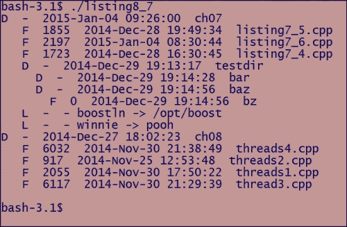
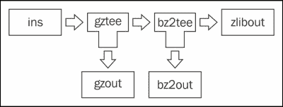

# 第 9 章.管理文件、目录和 IOStream

针对真实系统的编程需要与操作系统的各个子系统交互以利用它们的服务。 从本章开始，我们将介绍各种 Boost 库，它们提供对操作系统子系统的编程访问。

在本章中，我们将介绍用于执行输入和输出以及与文件系统交互的 Boost 库。 我们将在本章的以下部分介绍这些库：

*   使用 Boost 文件系统管理文件和目录
*   使用 Boost IOStreams 的可扩展 I/O

使用本章介绍的库和技术，您将能够编写可移植的 C++ 程序，这些程序可以与文件系统交互，并使用标准接口执行各种 I/O。 我们在本章中不讨论网络 I/O，而是专门用[第 10 章](10.html "Chapter 10. Concurrency with Boost")，*与 Boost*进行并发。

# 使用 Boost 文件系统管理文件和目录

使用Boost 库编写的软件可以在多个操作系统上运行，包括 Linux、Microsoft Windows、Mac OS 和各种其他 BSD 变体。 这些操作系统访问文件和目录路径的方式可能在几个方面有所不同；例如，MS Windows 使用反斜杠作为目录分隔符，而所有 Unix 变体(包括 Linux、BSD 和 Mac)都使用正斜杠。 非英语操作系统可能使用其他字符作为目录分隔符，有时可能支持多个目录分隔符。 Boost Filessystem 库隐藏了这些特定于平台的特性，并允许您编写更具可移植性的代码。 使用 Boost 文件系统库中的函数和类型，您可以编写与操作系统无关的代码，以在应用程序需要运行的文件系统上执行常见操作，如复制、重命名和删除文件、遍历目录、创建目录和链接等。

## 操纵路径

文件系统路径使用类型为`boost::filesystem::path`的对象表示。 给定一个类型为`boost::filesystem::path`的对象，我们可以从中收集有用的信息，并从中派生出其他`path`个对象。 `path`对象允许我们对真实的文件系统路径进行建模并从中派生信息，但它不必表示系统中真正存在的路径。

### 打印路径

让我们看一下我们的第一个使用 Boost Filessystem 打印进程的当前工作目录的示例：

**清单 9.1：使用 Boost Filessystem**的第一个示例

```cpp
 1 #include <boost/filesystem.hpp>
 2 #include <iostream>
 3
 4 namespace fs = boost::filesystem;
 5
 6 int main() {
 7   // Get the current working directory
 8   fs::path cwd = fs::current_path();
 9
10   // Print the path to stdout
11   std::cout << "generic: " << cwd.generic_string() << '\n';
12   std::cout << "native: " << cwd.string() << '\n';
13   std::cout << "quoted: " << cwd << '\n';
14 
15   std::cout << "Components: \n";
16   for (const auto& dir : cwd) {
17     std::cout <<'[' <<dir.string() << ']'; // each part
18   }
19   std::cout << '\n';
20 }
```

在本例中，程序通过调用`current_path`(第 8 行)来确定其当前工作目录，该函数是`boost::filesystem`命名空间中的命名空间级别函数。 它返回`boost::filesystem::path`类型的对象，表示当前工作目录的路径。 `boost::filesystem`中的大多数函数作用于`boost::filesystem::path`对象，而不是字符串。

我们通过调用`path`的`generic_string`成员函数(第 11 行)、调用`string`成员函数(第 12 行)以及将路径对象`cwd`流式传输到输出流(第 13 行)来打印路径。 `generic_string`成员以 Boost Filesytem 支持的**通用格式**返回路径，并以正斜杠作为分隔符。 `string`成员函数返回**原生格式**的路径，这是一种实现定义的格式，具体取决于操作系统。 在 Windows 上，本机格式使用反斜杠作为路径分隔符，而在 UNIX 上，通用格式和本机格式之间没有区别。 Boost Filessystem 在 Windows 上将正斜杠和反斜杠识别为路径分隔符。

流式传输`path`对象也会以本机格式写入路径，但还会在路径两边加上双引号。 在路径两边加上嵌入空格的双引号可以方便地将结果用作命令的参数。 如果路径中嵌入了双引号字符(`"`)，则这些字符将使用与号(`&`)进行转义。

在 Windows 上，完整路径存储为宽字符(`wchar_t`)字符串，因此`generic_string`或`string`在执行转换后将路径作为`std::string`*返回。 根据路径中的特定 Unicode 字符，可能不会有意义地将路径转换为单字节字符串。 在这样的系统上，只有调用`generic_wstring`或`wstring`成员函数才是安全的，它们以泛型或本机格式将路径返回为`std::wstring`。*

我们打印路径中的每个目录组件，在 C++ 11 中使用基于范围的 for 循环迭代它们(第 15 行)。 如果基于范围的 for 循环不可用，我们应该使用`path`中的`begin`和`end`成员函数来迭代路径元素。 在我的 Windows 系统中，该程序打印以下内容：

```cpp
generic: E:/DATA/Packt/Boost/Draft/Book/Chapter07/examples
native:E:\DATA\Packt\Boost\Draft\Book\Chapter07\examples
quoted: "E:\DATA\Packt\Boost\Draft\Book\Chapter07\examples"
Components:
[E:][/][DATA][Packt] [Boost][Draft][Book][Chapter07][examples]
```

在我的 Ubuntu 机器上，这是我得到的输出：

```cpp
generic: /home/amukher1/devel/c++/book/ch07
native: /home/amukher1/devel/c++/book/ch07
quoted: "/home/amukher1/devel/c++/book/ch07"
Components:
[/][home][amukher1] [devel][c++ ][book][ch07]
```

该程序以通用和本机格式打印其当前工作目录。 您可以看到，在 Ubuntu 上(通常在任何 Unix 上)，这两者之间没有区别。

在 Windows 上，路径的第一个组件是驱动器号，通常称为**根名称**。 后跟/(根文件夹)和路径中的每个子目录。 在 Unix 上，没有根名称(通常是这样)，因此清单以/(根目录)开头，后跟路径中的每个子目录。

类型为`path`的`cwd`对象是可流传输的(第 19 行)，打印到标准输出时会以本机格式打印，并用引号括起来。

### 备注

**使用 Boost 文件系统编译和链接示例**

Boost Filessystem 不是仅限标头的库。 Boost 文件系统共享库作为 Boost 操作系统软件包的一部分进行安装，或者按照[第 1 章](01.html "Chapter 1. Introducing Boost")，*Boost*简介中所述从源代码构建。

**在 Linux**上

如果您使用本机软件包管理器安装了 Boost 库，则可以使用以下命令构建您的程序。 请注意，库名称位于系统布局中。

```cpp
$ g++ <source>.c -o <executable> -lboost_filesystem -lboost_system

```

如果您按照[章](01.html "Chapter 1. Introducing Boost")，*Boost*简介中所示从源代码构建 Boost，并将其安装在`/opt/boost`下，则可以使用以下命令编译和链接源代码：

```cpp
$ g++ <source>.cpp -c -I/opt/boost/include
$ g++ <source>.o -o <executable> -L/opt/boost/lib -lboost_filesystem-mt -lboost_system-mt -Wl,-rpath,/opt/boost/lib

```

由于我们在标记布局中使用名称构建库，因此我们将链接到 Boost Filessystem 和 Boost System 的适当命名版本。 `-Wl,-rpath,/opt/boost/lib`部分将 Boost 共享库的路径嵌入到生成的可执行文件中，以便运行时链接器知道从哪里挑选要运行的可执行文件的共享库。

Windows 上的

 **在 Windows 的 Visual Studio 2012 或更高版本下，您可以启用自动链接，而无需明确指定要链接的库。 为此，您需要在**项目属性**对话框(在 IDE 中使用*Alt*+*F7*调出)中编辑**配置属性**设置：

1.在**VC++ 目录**下，将`<boost-install-path>\include`追加到**包含目录**属性。

2.在**VC++ 目录**下，将`<boost-install-path>\lib`追加到**库目录**属性。

3.在**调试**下，将**Environment**属性设置为`PATH=%PATH%;<boost-install-path>\lib`。

4.在**C/C++ >预处理器**下，定义以下预处理器符号：

`BOOST_ALL_DYN_LINK`

`BOOST_AUTO_LINK_TAGGED`(仅当使用标记布局构建时)

5.通过在 Visual Studio IDE 中点击*F7*来生成，并通过从 IDE 中点击*Ctrl*+*F5*来运行您的程序。

### 构建路径

您可以使用其中一个`path`构造函数或以某种方式组合现有路径来构造`boost::filesystem::path`的实例。 字符串和字符串文字可以隐式转换为`path`对象。 您可以构造相对路径和绝对路径、将相对路径转换为绝对路径、附加或剥离路径中的元素以及“规格化”路径，如清单 9.2 所示：

**清单 9.2a：构造空路径对象**

```cpp
 1 #define BOOST_FILESYSTEM_NO_DEPRECATED
 2 #include <boost/filesystem.hpp>
 3 #include <iostream>
 4 #include <cassert>
 5 namespace fs = boost::filesystem;
 6 
 7 int main() {
 8   fs::path p1; // empty path
 9   assert(p1.empty());  // does not fire
10   p1 = "/opt/boost";   // assign an absolute path
11   assert(!p1.empty());
12   p1.clear();
13   assert(p1.empty());
14 }
```

默认构造的路径对象表示空路径，如上例所示。 您可以将路径字符串分配给空的`path`对象(第 10 行)，它将不再为空(第 11 行)。 在调用路径上的`clear`成员函数时(第 12 行)，它再次变为空(第 13 行)。 多年来，Boost Filessystem 库的某些部分已被弃用，取而代之的是更好的替代部分。 我们定义宏`BOOST_FILESYSTEM_NO_DEPRECATED`(第 1 行)以确保此类不推荐使用的成员函数和类型不可访问。

**清单 9.2b：构造相对路径**

```cpp
15 void make_relative_paths() {
16   fs::path p2(".."); // relative path
17   p2 /= "..";
18   std::cout << "Relative path: " << p2.string() << '\n';
19
20   std::cout << "Absolute path: "
21      << fs::absolute(p2, "E:\\DATA\\photos").string() << '\n';
22   std::cout << "Absolute path wrt CWD: "
23             << fs::absolute(p2).string() << '\n';
24
25   std::cout << fs::canonical(p2).string() << '\n';
26 }
27
```

我们使用`..`(双点)构建相对路径，这是相对于大多数文件系统上的任何目录引用父目录的常见方式(第 16 行)。 然后，我们使用`operator/=`将额外的`..`path 元素附加到相对路径(第 17 行)。 然后，我们以其本机格式打印相对路径(第 18 行)，并使用此相对路径创建绝对路径。

函数的作用是：在给定相对路径的情况下构造绝对路径。 您可以向它传递一个绝对路径，必须将相对路径附加到该绝对路径才能构造新的绝对路径(第 21 行)。 请注意，我们传递了 Windows 绝对路径，并确保转义反斜杠。 如果省略`absolute`的第二个参数，它将使用进程的当前工作目录作为基本路径，从相对路径构造绝对路径(第 23 行)。

文件路径(如`/opt/boost/lib/../include`)可以*规格化*为等效形式`/opt/boost/include`。 函数`boost::filesystem::canonical`从给定路径(第 25 行)生成**规格化绝对路径**，但要求该路径存在。 否则，它将引发需要处理的异常。 它还读取并跟踪路径中的任何符号链接。 上面的代码在我的 Windows 框上打印以下输出：

```cpp
Relative path: ..\..
Absolute path: E:\DATA\photos\..\..
Absolute path wrt CWD: E:\DATA\Packt\Boost\Draft\Book\Chapter07\examples\..\..
Canonical: E:/DATA\Packt\Boost\Draft\Book
```

请注意，规范路径的输出具有折叠的双点。

**清单 9.2c：处理错误**

```cpp
28 void handle_canonical_errors() {
29   fs::path p3 = "E:\\DATA"; // absolute path
30   auto p4 = p3 / "boost" / "boost_1_56";  // append elements
31   std::cout << p4.string() << '\n';
32   std::cout.put('\n');
33
34   boost::system::error_code ec;
35   auto p5 = p4 / ".." / "boost_1_100";  // append elements
36   auto p6 = canonical(p5, ec);
37
38   if (ec.value() == 0) {
39     std::cout << "Normalized: " << p6.string() << '\n';
40   } else {
41     std::cout << "Error (file=" << p5.string()
42           << ") (code=" << ec.value() << "): "
43           << ec.message() << '\n';
44   }
45 }
```

此示例说明了当向`canonical`传递不存在的路径时，`canonical`是如何出错的。 我们为 Windows 上的绝对路径`E:\DATA`创建路径对象`p3`(第 29 行)。 然后，我们通过使用重载的`path`对象的`operator/`将连续的路径元素(`boost`和`boost_1_56`)附加到`p3`来创建第二个 Path 对象`p4`(第 30 行)。 这构建了一条等价于`E:\DATA\boost\boost_1_56`的路径。

接下来，我们将相对路径`../boost_1_100`附加到`p4`(第 35 行)，它构造了一个等价于`E:\DATA\boost\boost_1_56\..\boost_1_100`的路径。 此路径在我的系统上不存在，因此当我在此路径上调用`canonical`时，它会出错。 请注意，我们将类型为`boost::system::error_code`的对象作为第二个参数传递给`canonical`，以捕获任何错误。 我们使用`error_code`的`value`成员函数检查返回的非零错误代码(第 38 行)。 如果发生错误，我们还可以使用 Message`member`函数检索系统定义的描述性错误消息(第 43 行)。 或者，我们可以调用`canonical`的另一个重载，它不将`error_code`引用作为参数，而是在传递的路径不存在时抛出异常。 抛出和非抛出重载是 Boost 的 Filessystem 库和其他系统编程库中的函数中常见的模式。

### 将路径分解为组件

在上一节中，我们了解了如何通过调用`parent_path`成员函数来获取路径的父目录。 事实上，在`boost::filesystem::path`中有一整套成员函数来提取路径中的组件。 让我们首先来看一看路径及其组件。

我们将首先了解使用 UNIX 系统中的以下路径的路径组件的 Boost 文件系统术语：

`/opt/boost/include/boost/filesystem/path.hpp`

前导`/`称为**根目录**。 最后一个组件`path.hpp`称为**文件名**，即使路径表示的是目录而不是常规文件。 去除文件名(`/opt/boost/include/boost/filesystem`)的路径称为**父路径**。 前导斜杠(`opt/boost/include/boost/filesystem/path.hpp`)后面的部分称为**相对路径**。

在前面的示例中，`.hpp`是文件名的**扩展名**(包括句点或点)，`path`是文件名的**词干**。 如果文件名有多个嵌入点(例如，`libboost_filesystem-mt.so.1.56.0`)，则扩展名被视为从最后一个(最右侧)点开始。

现在考虑以下 Windows 路径：

`E:\DATA\boost\include\boost\filesystem\path.hpp`

组件`E:`称为**根名称**。 `E:`后面的前导反斜杠称为**根目录**。 根名称与根目录(`E:\`)的连接称为**根路径**。 下面是一个简短的函数，它使用`boost::filesystem::path`的成员函数打印路径的这些不同组成部分：

**清单 9.3：将路径拆分成组件**

```cpp
 1 #include <boost/filesystem.hpp>
 2 #include <iostream>
 3 #include <cassert>
 4 namespace fs = boost::filesystem;
 5
 6 void printPathParts(const fs::path& p1)
 7 {
 8 std::cout << "For path: " << p1.string() << '\n';
 9
10   if (p1.is_relative()) {
11     std::cout << "\tPath is relative\n";
12   } else {
13     assert(p1.is_absolute());
14     std::cout << "\tPath is absolute\n";
15   }
16
17   if (p1.has_root_name())
18     std::cout << "Root name: "
19               << p1.root_name().string() << '\n';
20
21   if (p1.has_root_directory())
22     std::cout << "Root directory: "
23               << p1.root_directory().string() << '\n';
24
25   if (p1.has_root_path())
26     std::cout << "Root path: "
27               << p1.root_path().string() << '\n';
28
29   if (p1.has_parent_path())
30     std::cout << "Parent path: "
31               << p1.parent_path().string() << '\n';
32
33   if (p1.has_relative_path())
34     std::cout << "Relative path: "
35               << p1.relative_path().string() << '\n';
36
37   if (p1.has_filename())
38     std::cout << "File name: "
39               << p1.filename().string() << '\n';
40
41   if (p1.has_extension())
42     std::cout << "Extension: "
43               << p1.extension().string() << '\n';
44
45   if (p1.has_stem())
46     std::cout << "Stem: " << p1.stem().string() << '\n';
47
48   std::cout << '\n';
49 }
50
51 int main()
52 {
53   printPathParts ("");                    // no components
54   printPathParts ("E:\\DATA\\books.txt"); // all components
55   printPathParts ("/root/favs.txt");      // no root name
56   printPathParts ("\\DATA\\books.txt");   // Windows, relative
57   printPathParts ("boost");              // no rootdir, no extn
58   printPathParts (".boost");              // no stem, only extn
59   printPathParts ("..");                  // no extension
60   printPathParts (".");                   // no extension
61   printPathParts ("/opt/boost/");         // file name == .
62 }
```

在前面的示例中，函数`printPathParts`(第 6 行)打印尽可能多的路径组件。 要访问路径组件，它使用`path`的相应成员函数。 为了检查组件是否可用，它使用`path`的`has_`成员函数之一。 它还使用`path`的`is_relative`和`is_absolute`成员函数检查路径是相对路径还是绝对路径(第 10、13 行)。

我们使用不同的相对路径和绝对路径调用`printPathParts`。 结果可能因操作系统而异。 例如，在 Windows 上，调用`has_root_name`(第 17 行)将返回除 Windows 路径`E:\DATA\books.txt`(第 54 行)以外的所有路径的`false`，该路径被视为绝对路径。 在此路径上调用`root_name`将返回`E:`。 然而，在 UNIX 上，反斜杠不会被识别为分隔符，并被视为路径组件的一部分，因此`E:\DATA\books.txt`将被解释为具有文件名`E:\DATA\books.txt`、词干`E:\DATA\books`和扩展名`.txt`的相对路径。 这一点，再加上 Windows 上将正斜杠识别为路径分隔符的事实，这是一个很好的理由，永远不要像我们在这里所做的那样在路径文字中使用反斜杠。

### 备注

为了获得最大的可移植性，请始终在路径文字中使用正斜杠，或者使用重载的`operator/`和`operator/=`生成路径。

我们还可以比较两条路径，看看它们是否**相等**和**等价**。 可以使用重载的`operator==`比较两个路径是否相等，该重载函数仅在两个路径可分解为相同组件时才返回`true`。 请注意，这意味着路径`/opt`和`/opt/`不相等；在前者中，文件名分量是`opt`，而在后者中，它是`.`(点)。 如果两个不相等的路径表示相同的底层文件系统条目，则它们仍然是等价的。 例如，`/opt/boost`和`/opt/cmake/../boost/`是等价的，尽管它们不是相等的路径。 要计算等价性，我们可以使用`boost::filesystem::equivalent`函数，如果两个路径引用文件系统中的相同条目，则返回`true`：

```cpp
boost::filesystem::path p1("/opt/boost"), p2("/opt/cmake");
if (boost::filesystem::equivalent(p1, p2 / ".." / "boost") {
  std::cout << "The two paths are equivalent\n";
}
```

与`boost::filesystem::canonical`一样，`equivalent`函数实际上还会检查路径是否存在，如果其中一个路径不存在，则抛出异常。 还有一个重载不抛出，但设置了一个`boost::system::error_code`out 参数。

可以将`path`对象视为路径元素的序列容器，并且可以使用`path`公开的迭代器接口迭代这些元素。 这样就可以轻松地将几种标准算法应用于`path`对象。 要遍历每个路径元素，我们可以使用以下代码片段：

```cpp
boost::filesystem::path p1("/opt/boost/include/boost/thread.hpp");
for (const auto& pathElem: p1) {
  std::cout <<pathElem.string() <<"  ";
}
```

这将打印由一对空格分隔的组件：

`/ optboost include boost thread.hpp`

`boost::filesystem::path`的`begin`和`end`成员函数返回类型为`boost::filesystem::path::iterator`的随机访问迭代器，您可以通过有趣的方式将其与标准库算法一起使用。 例如，要查找路径中的组件数量，可以使用：

```cpp
size_t count = std::distance(p1.begin(), p1.end());

```

现在，考虑两条路径：`/opt/boost/include/boost/filesystem/path.hpp`和`/opt/boost/include/boost/thread/detail/thread.hpp`。 我们现在将编写一个函数来计算这两个路径所在的公共子目录：

**清单 9.4：查找公共前缀路径**

```cpp
 1 #include <boost/filesystem.hpp>
 2 #include <iostream>
 3 namespace fs = boost::filesystem;
 4
 5 fs::path commonPrefix(const fs::path& first,
 6                       const fs::path& second) {
 7   auto prefix =
 8     [](const fs::path& p1, const fs::path& p2) {
 9       auto result =
10         std::mismatch(p1.begin(), p1.end(), p2.begin());
11       fs::path ret;
12       std::for_each(p2.begin(), result.second,
13               [&ret](const fs::path& p) {
14               ret /= p;
15               });
16       return ret;
17     };
18
19   size_t n1 = std::distance(first.begin(), first.end());
20   size_t n2 = std::distance(second.begin(), second.end());
21 
22   return (n1 < n2) ? prefix(first, second)
23                    : prefix(second, first);
24 }
```

在两条路径上正确调用`commonPrefix`函数将返回`/opt/boost/include/boost`。 要使此函数正常工作，我们应该传递不包含或`..`组件的路径，这是一个更完整的实现可以处理的事情。 要计算前缀，我们首先使用 lambda 表达式定义一个名为`prefix`的嵌套函数(第 7-17 行)，该函数执行实际计算。 我们计算两个路径的元素计数(第 19、20 行)，并将较短的路径作为第一个参数传递给`prefix`函数，将较长的路径作为第二个参数传递给`prefix`函数(第 22-23 行)。 在`prefix`函数中，我们在两条路径上使用`std::mismatch`算法来计算它们不匹配的第一个分量(第 10 行)。 然后，我们将公共前缀构造为直到第一个不匹配的路径，并返回它(第 12-15 行)。

## 遍历目录

Boost Filessystem提供了两个迭代器类`directory_iterator`和`recursive_directory_iterator`，这使得遍历目录变得相当简单。 两者都符合**输入迭代器**的概念，并为前向遍历提供了`operator++ `。 在这里的第一个示例中，我们看到`directory_iterator`正在运行：

**清单 9.5：迭代目录**

```cpp
 1 #include <boost/filesystem.hpp>
 2 #include <iostream>
 3 #include <algorithm>
 4 namespace fs = boost::filesystem;
 5
 6 void traverse(const fs::path& dirpath) {
 7   if (!exists(dirpath) || !is_directory(dirpath)) {
 8     return;
 9   }
10
11   fs::directory_iterator dirit(dirpath), end;
12
13   std::for_each(dirit, end, [](const fs::directory_entry& entry) {
14           std::cout <<entry.path().string() << '\n';
15         });
16 }
17
18 int main(int argc, char *argv[1]) {
19   if (argc > 1) {
20     traverse(argv[1]);
21   }
22 }
```

`traverse`函数接受类型为`boost::filesystem::path`的参数`dirpath`，表示要遍历的目录。 使用名称空间级别的函数`exists`和`is_directory`(第 7 行)，该函数在继续之前检查`dirpath`是否确实存在并且是一个目录。

为了执行迭代，我们为路径创建了`boost::filesystem::directory_iterator`的实例`dirit`，并创建了名为`end`的第二个默认构造的`directory_iterator`实例(第 11 行)。 默认构造的`directory_iterator`充当序列结束标记。 取消引用类型为`directory_iterator`的有效迭代器将返回类型为`boost::filesystem::directory_entry`的对象。 迭代器范围[`dirit`，`end`)表示的序列是目录中的条目列表。 为了遍历它们，我们使用熟悉的`std::for_each`标准算法。 我们使用 lambda 来定义要对每个条目执行的操作，即只需将其打印到标准输出(第 13-14 行)。

虽然我们可以围绕`boost::directory_iterator`编写递归逻辑以递归地遍历目录树，但`boost::recursive_directory_iterator`提供了一个更简单的替代方案。 我们可以用清单 9.5 中的`boost::recursive_directory_iterator`替换`boost::directory_iterator`，它仍然可以工作，执行深度优先的目录树遍历。 但是`recursive_directory_iterator`界面提供了额外的功能，比如跳过下降到特定目录和跟踪下降的深度。 手写循环可以更好地充分利用这些功能，如下例所示：

**清单 9.6：递归迭代目录**

```cpp
 1 void traverseRecursive(const fs::path& path)
 2 {
 3   if (!exists(path) || !is_directory(path)) {
 4     return;
 5   }
 6
 7   try {
 8     fs::recursive_directory_iterator it(path), end;
 9
10     while (it != end) {
11       printFileProperties(*it, it.level());
12
13       if (!is_symlink(it->path())
14           && is_directory(it->path())
15           && it->path().filename() == "foo") {
16           it.no_push();
17       }
18       boost::system::error_code ec;
19       it.increment(ec);
21       if (ec) {
22         std::cerr << "Skipping entry: "
23                   << ec.message() << '\n';
24       }
25     }
26   } catch (std::exception& e) {
27     std::cout << "Exception caught: " << e.what() << '\n';
28   }
29 }
```

我们创建a`recursive_directory_iterator`并使用路径对其进行初始化(第 8 行)，就像我们对清单 9.5 中的`directory_iterator`所做的那样。 如果路径不存在或无法被程序读取，`recursive_directory_iterator`构造函数可能会抛出异常。 为了捕捉此类异常，我们将代码放在`try-catch`块中。

我们使用 WHILE 循环遍历条目(第 10 行)，并通过调用`increment`成员函数推进迭代器(第 19 行)。 当`increment`成员函数遇到目录时，它会尝试以深度优先的顺序进入该目录。 这有时会因为系统问题而失败，例如当程序没有足够的权限查看目录时。 在这种情况下，我们希望继续到下一个可用条目，而不是中止迭代。 出于这个原因，我们没有在迭代器上使用`operator++ `，因为它在遇到错误时会抛出异常，处理这一问题会使代码更加复杂。 `increment`函数接受`boost::system::error_code`参数，在出错的情况下，它设置`error_code`*，*将迭代器前进到下一个条目。 在这种情况下，我们可以使用`error_code`的`message`成员函数获得与错误相关的系统定义的错误消息。

### 备注

**boost：：filesystem：：recursive_directory_iterator**的行为

在 Boost 版本 1.56 之前，当`operator++ `和`increment`成员函数遇到错误时，它们只会抛出异常或设置`error_code`，而不会推进迭代器。 这使得编写跳过错误的正确循环变得更加复杂。 从 Boost 1.56 开始，这些函数还将迭代器前进到下一个条目，使循环代码变得简单得多。

我们通过调用虚拟函数`printFileProperties`(第 11 行)来处理每个条目，该函数接受两个参数-取消引用`recursive_directory_iterator`实例的结果，以及通过调用迭代器的`level`成员函数获得的遍历深度。 对于第一级目录，`level`函数返回 0，每增加一个下降级别，其返回值就递增 1。 例如，`printFileProperties`函数可以使用它缩进子目录中的条目。 我们将在下一节实现`printFileProperties`函数。

为了给示例增加维度，我们决定不向下进入名为`foo`的目录。 为此，我们检查名为`foo`的目录(第 13-15 行)，并调用`recursive_directory_iterator`上的`no_push`成员函数以防止向下进入目录(第 16 行)。 同样，我们可以随时调用迭代器上的`pop`成员函数，以便在目录树中上一层，而不必在当前层完成迭代。

在支持符号链接的系统上，如果`recursive_directory_iterator`遇到指向目录的符号链接，它不会跟随该链接向下进入该目录。 如果我们希望覆盖此行为，则应该将枚举类型`boost::filesystem::symlink_option`的第二个参数传递给`recursive_directory_iterator`构造函数。 `symlink_option`枚举提供值`none`(或`no_recurse`)(默认值)和`recurse`(表示应跟随符号链接向下进入目录)。

## 查询文件系统条目

Boost Filessystem提供了一组函数来对文件和目录执行有用的操作。 其中大多数是`boost::filesystem`名称空间中的函数。 使用这些函数，我们可以检查文件是否存在、其大小(以字节为单位)、上次修改时间、文件类型、是否为空等等。 我们使用这一系列函数来编写上一节中使用的`printFileProperties`函数：

**清单 9.7：查询文件系统条目**

```cpp
 1 #include <boost/filesystem.hpp>
 2 #include <iostream>
 3 #include <boost/date_time.hpp>
 4 namespace fs = boost::filesystem;
 5 namespace pxtm = boost::posix_time;
 6
 7 void printFileProperties(const fs::directory_entry& entry,
 8                          int indent = 0) {
 9   const fs::path& path= entry.path();
10   fs::file_status stat = entry.symlink_status();
11   std::cout << std::string(2*indent, '');
12
13   try {
14     if (is_symlink(path)) {
15       auto origin = read_symlink(path);
16       std::cout <<" L " << " -  - "
17                 << path.filename().string() << " -> "
18                 << origin.string();
19     } else if (is_regular_file(path)) {
20       std::cout << " F " << " "
21          << file_size(path) << " " << " "
22          << pxtm::from_time_t(last_write_time(path))
23          << " " << path.filename().string();
24     } else if (is_directory(path)) {
25       std::cout << " D " << " – " << " "
26 << pxtm::from_time_t(last_write_time(path))
27 << " " << path.filename().string();
28     } else {
29       switch (stat.type()) {
30       case fs::character_file:
31         std::cout << " C ";
32         break;
33       case fs::block_file:
34         std::cout << " B ";
35         break;
36       case fs::fifo_file:
37         std::cout << " P ";
38         break;
39       case fs::socket_file:
40         std::cout << " S ";
41         break;
42       default:
43         std::cout << " - ";
44         break;
45       }
46       std::cout << pxtm::from_time_t(last_write_time(path))
47                 << " ";
48       std::cout << path.filename().string();
49     }
50     std::cout << '\n';
51   } catch (std::exception& e) {
52     std::cerr << "Exception caught: " <<e.what() << '\n';
53   }
54 }
```

`printFileProperties`用于打印给定文件的简短摘要，包括类型、大小、上次修改时间、名称等属性，对于符号链接，则为目标文件。 此函数的第一个参数的类型为`directory_entry`，这是取消引用`directory_iterator`或`recursive_directory_iterator`的结果。 第二个参数是遍历深度。 我们通过调用`directory_entry`的`path`成员函数(第 9 行)获得由`directory_entry`对象引用的文件的路径。 我们通过调用`directory_entry`的`symlink_status`成员函数(第 10 行)获得对`file_status`对象的引用。 `file_status`对象包含有关文件系统条目的其他详细信息，我们在示例中使用它来打印特殊文件的状态。 `symlink_status`函数作用于所有类型的文件，而不仅仅是符号链接，而且它返回符号链接本身的状态，而不跟踪到目标。 如果每次查询符号链接时都需要目标的状态，请使用`status`成员函数而不是`symlink_status`。 `status`和`symlink_status`成员函数比同名的全局函数更快，因为它们会缓存文件统计信息，而不是在每次调用时都查询文件系统。

我们先确定每个条目的类型，然后再打印适合该类型的信息。 为此，我们使用便利函数`is_symlink`、`is_regular_file`和`is_directory`(第 14、19、24 行)。 在 Linux 等 POSIX 系统上，还有其他类型的文件，如块和字符设备、FIFO 和 Unix 域套接字。 要识别这样的文件，我们使用前面获得的`file_status`对象(第 10 行)。 我们在`file_status`对象上调用`type`成员函数来确定特殊文件的确切类型(第 29 行)。 请注意，我们首先检查文件是否为符号链接，然后执行其他测试。 这是因为根据目标文件的类型，对于符号链接，`is_regular_file`或`is_directory`也可能返回 TRUE。

此函数以以下格式打印每个条目：

```cpp
file_type  sizetime  name -> target
```

文件类型由单个字母表示(`D`：目录，`F`：常规文件，`L`：符号链接，`C`：字符设备，`B`：块设备，`P`：FIFO，`S`：Unix 域套接字)。 大小以字节为单位打印，最后修改时间打印为长整数，文件名打印时没有完整路径。 仅对于符号链接，在名称后面追加一个后跟目标路径的尾随箭头。 当文件大小或上次写入时间不可用时，会为缺少的字段显示连字符(`-`)。 对于每个下降级别，条目都会缩进一对额外的空格(第 11 行)。

以下是在我的 Linux 系统上运行此函数的示例输出：



您还可以在 Linux 的`/dev`目录上运行此命令，以查看设备文件是如何列出的。

要获得符号链接指向的目标文件，我们调用`read_symlink`函数(第 15 行)。 要获取文件大小(以字节为单位)，我们调用`file_size`函数(第 21 行)；要获取文件的最后修改时间，我们调用`last_write_time`函数(第 22、26 和 46 行)。 函数的作用是：返回上次修改文件的**Unix 时间**。 我们通过调用`boost::posix_time::from_time_t`函数将此数字时间戳转换为可打印的日期时间字符串(参见[第 7 章](07.html "Chapter 7. Higher Order and Compile-time Programming")、*高阶和编译时编程*)来打印此时间戳的有意义的表示。

为了构建此程序，您还必须链接 Boost DateTime 库，如下所示：

```cpp
$ g++ listing8_7.cpp -o listing8_7 -std=c++ 11 -lboost_filesystem -lboost_date_time

```

有几个这样的函数可用于查询文件系统中的对象以获取不同类型的信息-例如，查找指向文件的硬链接的数量。 我们可以查询`file_status`对象(第 10 行)以获得文件权限。 注意，我们没有用名称空间限定这些名称空间级别的函数；它们是根据它们的参数类型(`boost::filesystem::path`)使用参数相关查找正确解析的。

## 执行文件操作

除了查询文件系统条目以获取信息之外，我们还可以使用 Boost Filessystem 库对文件执行创建目录和链接、复制和移动文件等操作。

### 创建目录

使用函数`boost::filesystem::create_directory`创建目录很容易。 您向它传递一个路径，如果该路径不存在，它将在该路径下创建一个目录；如果该目录已经存在，它将不执行任何操作。 如果路径存在但不是目录，`create_directory`将抛出异常。 还有一个非抛出版本，它接受在出错时设置的`boost::system::error_code`引用。 如果这些函数创建目录，则返回`true`；如果不创建，则返回`false`：

**清单 9.8：创建目录**

```cpp
 1 #include <boost/filesystem.hpp>
 2 #include <iostream>
 3 #include <cassert>	
 4 namespace fs = boost::filesystem;
 5
 6 int main() {
 7   fs::path p1 = "notpresent/dirtest";
 8   boost::system::error_code ec;
 9   if (!is_directory(p1.parent_path()) || exists(p1)) {
10     assert( !create_directory(p1, ec) );
11
12     if (is_directory(p1)) assert(!ec.value());
13     else assert(ec.value());
14   }
15
16   try {
17     if (create_directories(p1)) {
18       assert( !create_directory(p1) );
19     }
20   } catch (std::exception& e) {
21     std::cout << "Exception caught: " << e.what() << '\n';
22   }
23 }
```

在此示例中，如果当前目录中没有名为`notpresent`的目录，或者如果存在`notpresent/dirtest`，则在相对于当前目录的路径`notpresent/dirtest`上调用`create_directory`失败(第 10 行)。 这是因为`create_directory`期望传递的路径的父目录存在，并且它不会创建已经存在的路径。 如果我们没有传递错误代码参数，这个对`create_directory`的调用将抛出一个需要处理的异常。 如果`notpresent/dirtest`已经存在并且是一个目录，则`create_directory`失败，但不设置错误代码(第 12 行)。

函数`boost::filesystem::create_directories`创建所有需要的路径组件，类似于 Unix 系统上的`mkdir –p`。 除非存在权限问题或路径已经存在，否则对它的调用(第 17 行)会成功。 它会创建目录，包括路径沿线缺少的任何目录。 对`create_directory`和`create_directories`的调用是幂等的；如果目标目录存在，则不会返回错误或抛出异常，但函数会返回`false`，因为没有创建新目录。

### 创建符号链接

符号链接，有时称为软链接，是文件系统中的条目，充当其他文件的别名。 它们既可以指文件也可以指目录，通常用于为文件和目录提供替代的简化名称和路径。 符号链接在 UNIX 系统上已经存在很长一段时间了，自 Windows2000 以来一直以某种形式在 Windows 上可用。 我们可以使用函数`boost::filesystem::create_symlink`创建符号链接。 要创建指向目录的符号链接，建议使用函数`boost::filesystem::create_directory_symlink`以获得更好的可移植性。

**清单 9.9：创建符号链接**

```cpp
 1 #include <boost/filesystem.hpp>
 2 namespace fs = boost::filesystem;
 3
 4 void makeSymLink(const fs::path& target, const fs::path& link) {
 5   boost::system::error_code ec;
 6 
 7   if (is_directory(target)) {
 8     create_directory_symlink(target, link);
 9   } else {
10     create_symlink(target, link);
11   }
12 }
```

这显示了创建到给定路径的符号链接的函数`makeSymLink`。 函数的第一个参数是链接必须别名的目标路径，第二个参数是链接本身的路径。 这个参数顺序让人想起 UNIX`ln`命令。 如果目标是目录，则此函数调用`create_directory_symlink`(第 8 行)，而对于所有其他情况，它调用`create_symlink`(第 10 行)。 请注意，在创建符号链接时不需要存在目标路径，在这种情况下将创建悬空符号链接。 调用这些函数与 POSIX 系统上的命令`ln –s target link`具有相同的效果。 在 Windows 上，通过在`target`是目录时运行命令`mklink /D link target`，或者在`target`不是目录时运行命令`mklink link target`，可以获得相同的效果。 如果`create_directory_symlink`或`create_symlink`抛出异常，则函数`makeSymLink`将抛出。

### 复制文件

复制文件是 Boost Filessystem 帮助完成的另一项常见琐事。 `boost::filesystem::copy_file`函数将常规文件从源复制到目标，如果目标上已存在该文件，则该函数将失败。 使用适当的覆盖，可以改写目标位置的文件。 `boost::filesystem::copy_symlink`获取源符号链接，并在目标位置创建第二个符号链接，该链接为与源相同的文件设置别名。 您不能将目录作为目标传递给这两个函数中的任何一个。 还有一个`boost::copy_directory`函数，它似乎并不像它的名字所暗示的那样。 它创建目录并将源目录的属性复制到目标目录。 因此，我们将推出自己的递归目录复制实用程序函数：

**清单 9.10：递归复制目录**

```cpp
 1 void copyDirectory(const fs::path& src, const fs::path& target) {
 2   if (!is_directory(src)
 3     || (exists(target) && !is_directory(target))
 4     || !is_directory(absolute(target).parent_path())
 5     || commonPrefix(src, target) == src) {
 6     throw std::runtime_error("Preconditions not satisfied");
 7   }
 8
 9   boost::system::error_code ec;
10   fs::path effectiveTarget = target;
11   if (exists(target)) {
12     effectiveTarget /= src.filename();
13   }
14   create_directory(effectiveTarget);
15
16   fs::directory_iterator iter(src), end;
17   while (iter != end) {
18     auto status = iter->symlink_status();
19     auto currentTarget = effectiveTarget/
20                               iter->path().filename();
21
22     if (status.type() == fs::regular_file) {
23       copy_file(*iter, currentTarget,
24                     fs::copy_option::overwrite_if_exists);
25     } else if (status.type() == fs::symlink_file) {
26       copy_symlink(*iter, currentTarget);
27     } else if (status.type() == fs::directory_file) {
28       copyDirectory(*iter, effectiveTarget);
29     } // else do nothing
30     ++ iter;
31   }
32 }
```

清单 9.10 定义了`copyDirectory`函数，该函数递归地将源目录复制到目标目录。 它执行基本验证，如果不满足必需的初始条件，则抛出异常(第 6 行)。 如果满足以下任一条件，则违反必要的前提条件：

1.  源路径不是目录(第 2 行)
2.  目标路径存在，但不是目录(第 3 行)
3.  目标路径的父级不是目录(第 4 行)
4.  目标路径是源路径的子目录(第 5 行)

为了检测违规 4，我们重用清单 9.4 中定义的`commonPrefix`函数。 如果目标路径已经存在，则在其下创建一个与源目录同名的子目录来保存复制的内容(第 11-12 行，第 14 行)。 否则，将创建目标目录并将内容复制到其中。

除此之外，我们使用`directory_iterator`而不是`recursive_directory_iterator`递归地迭代源目录(第 17 行)。 我们使用`copy_file`复制常规文件，传递`copy_option::overwrite_if_exists`选项以确保已经存在的目标文件被覆盖(第 23-24 行)。 我们使用`copy_symlink`复制符号链接(第 26 行)。 每次遇到子目录时，我们都会递归地调用`copyDirectory`(第 28 行)。 如果`copyDirectory`调用的 Boost Filessystem 函数抛出异常，它将终止复制。

### 移动和删除文件

您可以使用`boost::filesystem::rename`函数移动或重命名文件和目录，该函数将旧路径和新路径作为参数。 双参数重载在失败时引发异常，而三参数重载设置错误代码：

```cpp
void rename(const path& old_path, const path& new_path);
void rename(const path& old_path, const path& new_path,
            error_code& ec);
```

如果`new_path`不存在，则在父目录存在的情况下创建它；否则，重命名调用失败。 如果`old_path`不是目录，那么`new_path`(如果存在)也不能是目录。 如果`old_path`是目录，则`new_path`(如果存在)必须是空目录，否则函数将失败。 当一个目录移动到另一个空目录时，源目录的内容被复制到目标空目录内，然后源目录被删除。 重命名符号链接对链接起作用，而不是对它们引用的文件起作用。

您可以通过调用`boost::filesystem::remove`并向其传递文件系统条目的路径来删除文件和空目录。 要递归删除非空目录，必须调用`boost::filesystem::remove_all`。

```cpp
bool remove(const path& p);
bool remove(const path& p, error_code& ec);
uintmax_t remove_all(const path& p);
uintmax_t remove_all(const path& p, error_code& ec);
```

如果路径命名的文件不存在，则`remove`函数返回 FALSE。 这会删除符号链接，而不会影响它们的别名文件。 函数的作用是：返回它删除的条目总数。 出错时，`remove`和`remove_all`的单参数重载抛出异常，而双参数重载设置传递给它的错误代码引用，而不抛出异常。

### 路径感知 fstream

此外，头文件`boost/filesystem/fstream.hpp`提供了使用`boost::filesystem::path`对象的标准文件流类的版本。 当您编写使用`boost::filesystem`并且还需要读写文件的代码时，它们非常方便。

### 备注

基于 Boost 文件系统库的 C++ 技术规范最近已被 ISO 批准。 这为它包含在 C++ 标准库的未来修订版中铺平了道路。

# 带 Boost IOStreams 的可扩展 I/O

标准库 IOStreams 工具旨在为各种设备上的各种操作提供一个框架，但它并不是最容易扩展的框架。 Boost IOStreams库为该框架提供了一个更简单的接口，用于将 I/O 功能扩展到较新的设备，并提供了一些非常有用的类来解决读写数据时的常见需求。

## Boost IOStreams 的体系结构

标准库 IOStreams 框架提供了两个基本抽象：**Streams**和**Streams Buffers**。 流为应用程序提供了一个统一接口，用于读取或写入底层设备上的字符序列。 流缓冲区为实际设备提供较低级别的抽象，流利用并进一步对其进行抽象。

Boost IOStreams 框架提供了`boost::iostreams::stream`和`boost::iostreams::stream_buffer`模板，它们是流和流缓冲区抽象的通用实现。 这两个模板通过另一组概念实现其功能，具体描述如下：

*   **源**是可以从中读取字符序列的对象的抽象。
*   **接收器**是可以写入字符序列的对象的抽象。
*   **设备**是信源、信宿或两者兼而有之。
*   **输入过滤器**修改从源读取的字符序列，而**输出过滤器**在将字符序列写入接收器之前修改该序列。
*   **滤波器**是输入滤波器或输出滤波器。 可以编写既可用作输入过滤器又可用作输出过滤器的过滤器；这称为**两用过滤器**。

要在设备上执行 I/O，我们将零个或多个筛选器加上设备的序列与`boost::iostreams::stream`的实例或`boost::iostreams::stream_buffer`的实例相关联。 过滤器序列称为**链**，末端带有装置的过滤器序列称为**完整链**。

下图是输入输出操作的统一视图，说明了流对象和底层设备之间的 I/O 路径：


Boost IOStreams 体系结构

输入从设备读取，并通过可选的筛选器堆栈到达流缓冲区，从那里可以通过流访问输入。 输出通过流缓冲器从流中写入，并在到达设备之前通过一堆过滤器。 过滤器(如果有的话)作用于从设备读取的数据，以将转换后的序列呈现给流的读取器。 它们还作用于要写入设备的数据，并在写入之前对其进行转换。 上图旨在可视化这些交互，但有点不准确；在代码中，筛选器不能同时充当输入筛选器和输出筛选器。

Boost IOStreams 库附带了几个内置的 Device 和 Filter 类，创建我们自己的类也很容易。 在接下来的几节中，我们将通过代码示例说明如何使用 Boost IOStreams 库的不同组件。

## 使用设备

设备提供接口，用于向底层介质读写字符。 它抽象出真正的介质，如磁盘、内存或网络连接。 在本书中，我们将重点介绍如何使用作为 Boost IOStreams 库一部分提供的个现成设备。 编写我们自己的设备类的方法超出了本书的范围，但是一旦您熟悉了我们在本章中介绍的内容，就应该很容易从在线文档中找到它们。

### 文件 I/O 设备

Boost定义了许多用于在文件上执行 I/O 的设备，我们首先看到的是一个抽象特定于平台的文件描述符的设备。 每个平台都使用一些本地句柄来打开文件，这与标准 C++ 使用`fstream`表示打开文件的方式不同。例如，这些句柄可以是 POSIX 系统上的整数文件描述符和 Windows 上的句柄。 Boost IOStreams 库提供了`boost::iostreams::file_descriptor_source`、`boost::iostreams::file_descriptor_sink`和`boost::iostreams::file_descriptor`设备，它们将 POSIX 文件描述符和 Windows 文件句柄适配到设备中进行输入和输出。 在下面的示例中，我们使用一个`file_descriptor_source`对象通过 STREAM 接口从 POSIX 系统上的文件中读取连续的行。 如果您希望对使用处理文件描述符的系统调用打开的文件使用流接口进行 I/O，这将非常有用。

**清单 9.11：使用 FILE_DESCRIPTOR 设备**

```cpp
 1 #include <boost/iostreams/stream.hpp>
 2 #include <boost/iostreams/device/file_descriptor.hpp>
 3 #include <iostream>
 4 #include <string>
 5 #include <cassert>
 6 #include <sys/types.h>
 7 #include <fcntl.h>
 8 namespace io = boost::iostreams;
 9
10 int main(int argc, char *argv[]) {
11   if (argc < 2) {
12     return 0;
13   }
14
15   int fdr = open(argv[1], O_RDONLY);
16   if (fdr >= 0) {
17     io::file_descriptor_source fdDevice(fdr,
18                    io::file_descriptor_flags::close_handle);
19     io::stream<io::file_descriptor_source> in(fdDevice);
20     assert(fdDevice.is_open());
21
22     std::string line;
23     while (std::getline(in, line))
24     std::cout << line << '\n';
25   }
26 }
```

使用这个程序，我们打开命令行上命名的第一个文件，并读取其中的连续行。 我们首先使用 Unix 系统调用`open`(第 15 行)打开文件，其中包括 Unix 头文件`sys/types.h`和`fcntl.h`(第 6-7 行)。 如果文件被成功打开(由`open`返回的文件描述符的正值表示)，则我们创建`file_descriptor_source`的实例，向其传递打开的文件描述符和标志`close_handle`，以指示在设备被销毁时应该适当地关闭描述符(第 17-18 行)。

如果我们不希望设备管理描述符的生存期，那么我们必须改为传递标志`never_close_handle`。 然后，我们创建`boost::iostreams::stream<file_descriptor_source>`的一个实例(第 19 行)，将 Device 对象传递给它，并使用`std::getline`函数从它读取连续的行，就像我们使用任何`std::istream` 实例一样(第 23 行)。 请注意，我们使用`is_open`成员函数断言设备已打开以供读取(第 19 行)。 此代码旨在在 Unix 和类 Unix 系统上编译。 在 Windows 上，Visual Studio C 运行时库提供了兼容的接口，这样您也可以通过包含一个额外的头文件`io.h`来编译并在 Windows 上运行它。

### 备注

Boost IOStreams 库中的类型和函数被分成一组相当独立的头文件，没有一个头文件(包括它)可以为您提供所有符号。 设备头在`boost/iostreams/device`目录下，过滤器头在`boost/iostreams/filter`目录下。 其余接口在`boost/iostreams`下可用。

要构建此程序，我们必须将其与`libboost_iostreams`库链接。 我在 Ubuntu 机器上使用以下命令行通过本机包管理器使用安装在默认路径下的 Boost 库构建程序：

```cpp
$ g++ listing8_11.cpp -o listing8_11 -std=c++ 11 -lboost_iostreams

```

我们可能还想构建我们的程序，以使用我们在[章](01.html "Chapter 1. Introducing Boost")，*介绍 Boost*中从源代码构建的 Boost 库。 为此，我使用以下命令行在我的 Ubuntu 机器上构建该程序，指定包含路径和库路径，以及要链接到的`libboost_iostreams-mt`库：

```cpp
$ g++ listing8_11.cpp -o listing8_11-I /opt/boost/include -std=c++ 11 -L /opt/boost/lib -lboost_iostreams-mt -Wl,-rpath,/opt/boost/lib

```

要通过文件描述符写入文件，我们需要使用`file_descriptor_sink`对象。 我们还可以使用`file_descriptor`对象来读取和写入同一设备。 还有其他允许写入文件的设备-`file_source`、`file_sink`和`file`设备允许您读写命名文件。 `mapped_file_source`、`mapped_file_sink`和`mapped_file`设备允许您通过内存映射读写文件。

### 用于读取和写入存储器的设备

标准库`std::stringstream`系列类通常用于读取格式化数据和将格式化数据写入内存。 如果您想要从任何给定的连续内存区域(如数组或字节缓冲区)进行读写，Boost IOStreams 库中的`array`系列设备(`array_source`、`array_sink`和`array`)将派上用场：

**清单 9.12：使用阵列设备**

```cpp
 1 #include <boost/iostreams/device/array.hpp>
 2 #include <boost/iostreams/stream.hpp>
 3 #include <boost/iostreams/copy.hpp>
 4 #include <iostream>
 5 #include <vector>
 6 namespace io = boost::iostreams;
 7
 8 int main() {
 9   char out_array[256];
10   io::array_sink sink(out_array, out_array + sizeof(out_array));
11   io::stream<io::array_sink> out(sink);
12   out << "Size of out_array is " << sizeof(out_array)
13       << '\n' << std::ends << std::flush;
14
15   std::vector<char> vchars(out_array,
16                           out_array + strlen(out_array));
17   io::array_source src(vchars.data(),vchars.size());
18   io::stream<io::array_source> in(src);
19
20   io::copy(in, std::cout);
21 }
```

本例遵循与清单 9.11 相同的模式，但是我们使用两个设备，一个接收器和一个源，而不是一个。 在每种情况下，我们都执行以下操作：

*   我们创建一个适当初始化的设备
*   我们创建一个流对象并将设备与其关联
*   我们在流上执行输入或输出

我们首先定义一个`array_sink`设备，该设备用于写入连续的内存区域。 内存区域作为一对指针传递给设备构造函数，该指针指向`char`数组的第一个元素和最后一个元素之后的一个元素(第 10 行)。 我们将该设备与流对象`out`相关联(第 11 行)，然后使用插入操作符(`<<`)将一些内容写入流。 请注意，此内容可以是任何可流式传输的类型，而不仅仅是文本。 使用操纵器`std::ends`(第 13 行)，我们确保数组在文本之后有一个终止空字符。 使用`std::flush`操纵器，在对`out_array`调用`strlen`之前，我们确保此内容没有保存在设备缓冲区中，而是找到了到达接收器设备的后备数组`out_array`的方式(第 16 行)。

接下来，我们创建名为`vchars`的`chars`的`vector`，并使用`out_array`的内容进行初始化(第 15-16 行)。 然后，我们定义一个由该`vector`支持的`array_source`设备，向构造函数传递指向`vchars`的第一个元素和`vchars`中的字符数的迭代器(第 17 行)。 最后，我们构造与设备相关联的输入流(第 18 行)，然后使用`boost::iostreams::copy`函数模板将字符从输入流复制到标准输出(第 20 行)。 运行上述代码时，通过`array_sink`设备将以下行写入`out_array`：

```cpp
The size of out_array is 256
```

然后，它读取该短语中的每个单词，并将其打印到标准输出的新行上。

除`array`设备外，`back_insert_device`设备还可用于将几个标准容器改装为水槽。 `back_insert_device`和`array_sink`的不同之处在于，`array_sink`需要一个固定的内存缓冲区来操作，而`back_insert_device`可以使用具有`insert`成员函数的任何标准容器作为其后备存储。 这允许`back_insert_device`的底层存储区域根据输入大小的需要而增长。 我们使用`back_insert_device`代替`array_sink`重写清单 9.12：

**清单 9.13：使用 BACK_INSERT_DEVICE**

```cpp
 1 #include <boost/iostreams/device/array.hpp>
 2 #include <boost/iostreams/device/back_inserter.hpp>
 3 #include <boost/iostreams/stream.hpp>
 4 #include <boost/iostreams/copy.hpp>
 5 #include <iostream>
 6 #include <vector>
 7 namespace io = boost::iostreams;
 8
 9 int main() {
10   typedef std::vector<char> charvec;
11   charvec output;
12   io::back_insert_device<charvec> sink(output);
13   io::stream<io::back_insert_device<charvec>> out(sink);
14   out << "Size of outputis "<< output.size() << std::flush;
15
16   std::vector<char> vchars(output.begin(),
17                            output.begin() + output.size());
18   io::array_source src(vchars.data(),vchars.size());
19   io::stream<io::array_source> in(src);
20
21   io::copy(in, std::cout);
22 }
```

在这里，我们写入作为`vector<char>`的`out_vec`(第 11 行)，并使用`back_insert_device`接收器(第 12 行)执行此操作。 我们将`out_vec`的大小写入流，但这可能不会打印此时已写入设备的字符总数，因为设备可能会在将输出刷新到向量之前缓冲一些输出。 由于我们打算将此数据复制到另一个向量进行读取(第 16-17 行)，因此我们确保使用`std::flush`操作器将所有数据写入`out_vec`(第 14 行)。

还有其他有趣的设备，比如允许将字符序列写入两个不同设备的`tee_device`适配器，这让人想起 Unix`tee`命令。 现在我们来看看如何编写自己的设备。

## 使用过滤器

Filters对写入接收器或从源读取的字符流执行操作，或者在写入和读取之前对其进行转换，或者只是观察流的某些属性。 转换可以执行多种操作，如标记关键字、翻译文本、执行正则表达式替换以及执行压缩或解压缩。 观察者过滤器可以计算行数和字数，或者计算消息摘要等。

常规流和流缓冲区不支持过滤器，我们需要使用**过滤流**和**过滤流缓冲区**来使用过滤器。 在称为**链**的数据结构中，过滤流和流缓冲器维护一个过滤器堆栈，其中源或宿位于顶部，最外面的过滤器位于底部。

现在，我们将查看作为 Boost IOStreams 库的一部分附带的几个实用程序筛选器。 编写我们自己的过滤器超出了本书的范围，但是优秀的在线文档详细介绍了这个主题。

### 基本过滤器

在第一个使用筛选器的示例中，我们使用`boost::iostreams::counter`筛选器来保留从文件读取的文本中的字符和行数：

**清单 9.14：使用计数器过滤器**

```cpp
 1 #include <boost/iostreams/device/file.hpp>
 2 #include <boost/iostreams/filtering_stream.hpp>
 3 #include <boost/iostreams/filter/counter.hpp>
 4 #include <boost/iostreams/copy.hpp>
 5 #include <iostream>
 6 #include <vector>
 7 namespace io = boost::iostreams;
 8
 9 int main(int argc, char *argv[]) {
10   if (argc <= 1) {
11     return 0;
12   }
13
14   io::file_source infile(argv[1]);
15   io::counter counter;
16   io::filtering_istream fis;
17   fis.push(counter);
18   assert(!fis.is_complete());
19   fis.push(infile);
20   assert(fis.is_complete());
21
22   io::copy(fis, std::cout);
23
24   io::counter *ctr = fis.component<io::counter>(0);
25   std::cout << "Chars: " << ctr->characters() << '\n'
26             << "Lines: " << ctr->lines() << '\n';
27 }
```

我们创建了一个`boost::iostream::file_source`设备，用于读取命令行(第 14 行)中命名的文件的内容。 我们创建了一个`counter`过滤器，用于计算读取的行数和字符数(第 15 行)。 我们创建对象`filtering_istream`(第 16 行)，然后按下过滤器(第 17 行)和设备(第 19 行)。 在设备被推送之前，我们可以断言过滤流是不完整的(第 18 行)，一旦设备被推送(第 20 行)，它就完成了。 我们将从过滤输入流读取的内容复制到标准输出(第 22 行)，然后访问字符和行数。

要访问计数，我们需要引用位于过滤流内部链中的`counter`过滤器对象。 为此，我们调用`filtering_istream`的`component`成员模板函数，传入我们想要的筛选器的索引和筛选器的类型。 这将返回指向`counter`Filter 对象的指针(第 24 行)，我们通过调用适当的成员函数来检索读取的字符数和行数(第 25-26 行)。

在下一个示例中，我们使用`boost::iostreams::grep_filter`过滤掉空行。 与不修改输入流的计数器筛选器不同，它通过删除空行来转换输出流。

**清单 9.15：使用 grep_filter**

```cpp
 1 #include <boost/iostreams/device/file.hpp>
 2 #include <boost/iostreams/filtering_stream.hpp>
 3 #include <boost/iostreams/filter/grep.hpp>
 4 #include <boost/iostreams/copy.hpp>
 5 #include <boost/regex.hpp>
 6 #include <iostream>
 7 namespace io = boost::iostreams;
 8
 9 int main(int argc, char *argv[]) {
10   if (argc <= 1) {
11     return 0;
12   }
13
14   io::file_source infile(argv[1]);
15   io::filtering_istream fis;
16   io::grep_filter grep(boost::regex("^\\s*$"),
17       boost::regex_constants::match_default, io::grep::invert);
18   fis.push(grep);
19   fis.push(infile);
20
21   io::copy(fis, std::cout);
22 }
```

本例与清单 9.14 相同，只是我们使用了不同的过滤器`boost::iostreams::grep_filter`来过滤掉空行。 我们创建`grep_filter`对象的一个实例，将三个参数传递给它的构造函数。 第一个参数是正则表达式`^\s*$`，它匹配空行-包含零个或多个空格字符的行(第 16 行)。 请注意，反斜杠在代码中是转义的。 第二个参数是常量`match_default`，表示我们使用 Perl 正则表达式语法(第 17 行)。 第三个参数`boost::iostreams::grep::invert`告诉过滤器只过滤掉那些与正则表达式匹配的行(第 17 行)。 默认行为是只筛选出那些与正则表达式不匹配的行。

要在 Unix 上构建此程序，还必须链接 Boost Regex 库：

```cpp
$ g++ listing8_15.cpp -o listing8_15 -std=c++ 11 -lboost_iostreams-lboost_regex

```

在没有 Boost 本机软件包且 Boost 安装在自定义位置的系统上，使用以下更详细的命令行：

```cpp
$ g++ listing8_15.cpp -o listing8_15-I /opt/boost/include -std=c++ 11 -L /opt/boost/lib -lboost_iostreams-mt-lboost_regex-mt -Wl,-rpath,/opt/boost/lib

```

在 Windows 上，使用 Visual Studio 并启用针对 DLL 的自动链接，不需要显式指定 Regex 或 IOStream DLL。

### 用于压缩和解压缩的过滤器

Boost IOStreams库附带了三种不同的数据压缩和解压缩过滤器，分别用于 gzip、zlib 和 bzip2 格式。 Gzip 和 zlib 格式实现了**Deflate 算法**的不同变体用于压缩，而 bzip2 格式使用更节省空间的**Burrow-Wheeler 算法**。 由于这些是外部库，如果我们使用这些压缩格式，则必须构建它们并将其链接到我们的可执行文件。 如果您已经按照[第 1 章](01.html "Chapter 1. Introducing Boost")*Boost*简介中概述的详细步骤构建了支持 zlib 和 bzip2 的 Boost 库，那么 zlib 和 bzip2 共享库应该已经与 Boost IoStreams 共享库一起构建了。

在下面的示例中，我们压缩一个在命令行上命名的文件，并将其写入磁盘。 然后，我们将其读回、解压缩，并将其写入标准输出。

**清单 9.16：使用 gzip 压缩器和解压缩器**

```cpp
 1 #include <boost/iostreams/device/file.hpp>
 2 #include <boost/iostreams/filtering_stream.hpp>
 3 #include <boost/iostreams/stream.hpp>
 4 #include <boost/iostreams/filter/gzip.hpp>
 5 #include <boost/iostreams/copy.hpp>
 6 #include <iostream>
 7 namespace io = boost::iostreams;
 8
 9 int main(int argc, char *argv[]) {
10   if (argc <= 1) {
11     return 0;
12   }
13   // compress
14   io::file_source infile(argv[1]);
15   io::filtering_istream fis;
16   io::gzip_compressor gzip;
17   fis.push(gzip);
18   fis.push(infile);
19
20   io::file_sink outfile(argv[1] + std::string(".gz"));
21   io::stream<io::file_sink> os(outfile);
22   io::copy(fis, os);
23
24   // decompress
25   io::file_source infile2(argv[1] + std::string(".gz"));
26   fis.reset();
27   io::gzip_decompressor gunzip;
28   fis.push(gunzip);
29   fis.push(infile2);
30   io::copy(fis, std::cout);
31 }
```

前面的代码首先使用`boost::iostreams::gzip_compressor`过滤器(第 16 行)在读取文件时对其进行解压缩(第 17 行)。 然后，它使用`boost::iostreams::copy` 将此内容写入到原始文件名后附加了`.gz`扩展名的文件(第 20-22 行)。 对`boost::iostreams::copy`的调用还会刷新和关闭传递给它的输出和输入流。 因此，在调用`copy`返回后立即从文件回读是安全的。 要读回这个压缩文件，我们使用前面带有`boost::iostreams::gzip_decompressor`的`boost::iostreams::file_source`设备(第 27-28 行)，并将解压缩输出写入标准输出(第 30 行)。 我们重用`filtering_istream`对象来读取原始文件，并再次用于读取压缩文件。 在筛选流上调用`reset`成员函数将关闭并删除与流关联的筛选器链和设备(第 26 行)，因此我们可以关联新的筛选器链和设备(第 27-28 行)。

可以通过向压缩器或解压缩器筛选器的构造函数提供附加参数来覆盖多个默认值，但基本结构不会更改。 通过将标题从`gzip.hpp`更改为`bzip2.hpp`(第 4 行)，并将前面代码中的`gzip_compressor`和`gzip_decompressor`替换为`bzip2_compressor`和`bzip2_decompressor`，我们可以测试 bzip2 格式的代码；zlib 格式也是如此。 理想情况下，应该适当更改扩展名(bzip2 的.bz2 和 zlib 的.zlib)。 在大多数 Unix 系统上，通过使用 gzip 和 bzip2 工具独立地解压缩生成的压缩文件来测试它们是值得的。 用于 zlib 归档的命令行工具似乎很少，标准化程度也较低。 在我的 Ubuntu 系统上，`qpdf`程序附带了一个名为`zlib-flate`的原始 zlib 压缩/解压缩实用程序，它可以压缩成 zlib 格式或从 zlib 格式解压。

构建该程序的步骤与构建清单 9.15 的步骤相同。 即使您改用`zlib_compressor`或`bzip2_compressor`过滤器，只要在链接过程中使用选项`-Wl,-rpath,/opt/boost/lib`，并且路径`/opt/boost/lib`包含 zlib 和 bzip2 的共享库，链接器(以及稍后的运行时链接器)将自动选取必要的共享库。

### 合成滤镜

过滤流可以对管道中的字符序列应用多个过滤器。 在过滤流上使用`push`方法，我们从最外面的过滤器开始形成管道，以所需的顺序插入过滤器，最后以设备结束。

这意味着，要过滤输出流，首先推入最先应用的过滤器，然后向前推入每个后续过滤器，最后推入接收器。 例如，为了在写入接收器之前过滤掉一些行并进行压缩，推入的顺序如下所示：

```cpp
filtering_ostream fos;
fos.push(grep);
fos.push(gzip);
fos.push(sink);
```

对于过滤输入流，您推入过滤器，从最后应用的过滤器开始，向后推入前面的每个过滤器，最后是源。 例如，为了读取文件，将其解压缩，然后执行行计数，推入序列将如下所示：

```cpp
filtering_istream fis;
fis.push(counter);
fis.push(gunzip);
fis.push(source);
```

#### 流水线

事实证明少量的操作符重载可以使其更具表现力。 我们可以使用管道运算符(`operator|`)以以下替代表示法编写前面的链：

```cpp
filtering_ostream fos;
fos.push(grep | gzip | sink);

filtering_istream fis;
fis.push(counter | gunzip | source);
```

前面的代码片段显然更具表现力，代码行数更少。 从左到右，过滤器按推入流的顺序排列在一起，设备在最后。 不是所有的筛选器都可以这样组合，但 Boost IOStreams 库中的许多现成的筛选器可以这样组合；更明确地说，筛选器必须符合**管道概念**才能以这种方式组合。 下面是一个完整的程序示例，该程序读取文件中的文本，删除空行，然后使用 bzip2 对其进行压缩：

**清单 9.17：管道过滤器**

```cpp
 1 #include <boost/iostreams/device/file.hpp>
 2 #include <boost/iostreams/filtering_stream.hpp>
 3 #include <boost/iostreams/stream.hpp>
 4 #include <boost/iostreams/filter/bzip2.hpp>
 5 #include <boost/iostreams/filter/grep.hpp>
 6 #include <boost/iostreams/copy.hpp>
 7 #include <boost/regex.hpp>
 8 #include <iostream>
 9 namespace io = boost::iostreams;
10
11 int main(int argc, char *argv[]) {
12   if (argc <= 1) { return 0; }
13
14   io::file_source infile(argv[1]);
15   io::bzip2_compressor bzip2;
16   io::grep_filter grep(boost::regex("^\\s*$"),
17         boost::regex_constants::match_default,
18         io::grep::invert);
19   io::filtering_istream fis;
20   fis.push(bzip2 | grep | infile);
21   io::file_sink outfile(argv[1] + std::string(".bz2"));
22   io::stream<io::file_sink> os(outfile);
23
24   io::copy(fis, os);
25 }
```

前面的示例将一个用于过滤空行的 grep 过滤器(第 16-18 行)和一个 bzip2 压缩器(第 15 行)与一个使用管道的文件源设备(第 20 行)串在一起。 代码的其余部分应该熟悉清单 9.15 和 9.16。

#### 使用 TEE 对数据流进行分支

虽然将筛选器链与多个筛选器一起使用，但有时捕获两个筛选器之间流动的数据很有用，特别是对于调试。 `boost::iostreams:: tee_filter`是类似于 Unix`tee`命令的输出筛选器，它位于两个筛选器之间，并提取在两个筛选器之间流动的数据流的副本。 实际上，当您想要在不同的处理中间阶段捕获数据时，可以使用`tee_filter`：


您还可以多路传输两个接收器设备以创建**TEE 设备**，以便将一些内容写入 TEE 设备，从而将其写入两个底层设备。 `boost::iostream::tee_device`类模板组合两个水槽来创建这样的 T 形三通设备。 通过嵌套 TEE 设备或流水线 TEE 过滤器，我们可以生成几个可以不同处理的并行流。 `boost::iostreams::tee`函数模板可以生成 TEE 过滤器和 TEE 流。 它有两个重载-一个接受接收器并生成`tee_filter`的单参数重载，以及一个接受两个接收器并返回`tee_device`的双参数重载。 下面的示例显示如何使用非常少的代码将文件压缩为三种不同的压缩格式(gzip、zlib 和 bzip2)：

**清单 9.18：使用 tees**分支输出流

```cpp
 1 #include <boost/iostreams/device/file.hpp>
 2 #include <boost/iostreams/filtering_stream.hpp>
 3 #include <boost/iostreams/stream.hpp>
 4 #include <boost/iostreams/filter/gzip.hpp>
 5 #include <boost/iostreams/filter/bzip2.hpp>
 6 #include <boost/iostreams/filter/zlib.hpp>
 7 #include <boost/iostreams/copy.hpp>
 8 #include <boost/iostreams/tee.hpp>
 9 namespace io = boost::iostreams;
10
11 int main(int argc, char *argv[]) {
12   if (argc <= 1) { return 0; }
13
14   io::file_source infile(argv[1]);  // input
15   io::stream<io::file_source> ins(infile);
16
17   io::gzip_compressor gzip;
18   io::file_sink gzfile(argv[1] + std::string(".gz"));
19   io::filtering_ostream gzout;     // gz output
20   gzout.push(gzip | gzfile);
21   auto gztee = tee(gzout);
22
23   io::bzip2_compressor bzip2;
24   io::file_sink bz2file(argv[1] + std::string(".bz2"));
25   io::filtering_ostream bz2out;     // bz2 output
26   bz2out.push(bzip2 | bz2file);
27   auto bz2tee = tee(bz2out);
28
29   io::zlib_compressor zlib;
30   io::file_sink zlibfile(argv[1] + std::string(".zlib"));
31
32   io::filtering_ostream zlibout;
33   zlibout.push(gztee | bz2tee | zlib | zlibfile);
34
35   io::copy(ins, zlibout);
36 }
```

我们为 gzip、bzip2 和 zlib 设置了三个压缩过滤器(第 17、23 和 29 行)。 对于每个输出文件，我们需要一个`filtering_ostream`。 我们为 gzip 压缩输出创建`gzout`流(第 20 行)，为 bzip2 压缩输出创建`bz2out`流(第 26 行)。 我们在这两个流(第 21 和 27 行)周围创建 T 形过滤器。 最后，我们在 zlibfile 接收器前面将过滤器 gztee、bz2tee 和 zlib 串在一起，并将此链推入 zlib 文件的 zlibout`filtering_ostream`中(第 33 行)。 从输入流`ins`复制到输出流`zlibout`会在管道中生成三个压缩的输出文件，如下图所示：



请注意，对 tee 的调用不是名称空间限定的，但由于参数相关的查找而得到正确解析(请参阅[第 2 章](02.html "Chapter 2. The First Brush with Boost's Utilities")，*The First Brush with Boost‘s Utilities*)。

Boost IOStreams 库为编写和使用设备和过滤器提供了非常丰富的框架。 本章仅介绍此库的基本用法，并且有一大堆筛选器、设备和适配器可以组合成用于 I/O 的有用模式。

# 自测题

对于多项选择题，请选择适用的所有选项：

1.  What is unique to the `canonical` and `equivalent` functions for manipulating paths?

    A.参数不能命名实际路径。

    B.两者都是命名空间级函数。

    C.参数必须指定实际路径。

2.  What is the problem with the following code snippet assuming the path is of type `boost::filesystem::path`?

    ```cpp
    if (is_regular_file(path)) { /* … */ }
    else if (is_directory(path)) { /* … */ }
    else if (is_symlink(path)) { /* … */ }
    ```

    A.必须有静态`value`字段。

    B.它必须具有名为`type`的嵌入式类型。

    C.必须有静态`type`字段。

    D.它必须具有名为`result`的嵌入式类型。

3.  Given this code snippet:

    ```cpp
    boost::filesystem::path p1("/opt/boost/include/boost/thread.hpp");
    size_t n = std::distance(p1.begin(), p1.end());
    ```

    N 的值是多少？

    A.5，路径中组件的总数。

    B.6，路径中组件的总数。

    C.10，斜杠数和分量数之和。

    D.目录组件的总数。

4.  You want to read a text file, remove all blank lines using a `grep_filter`, replace specific keywords using the `regex_filter`, and count the characters and lines in the result. Which of the following pipelines will you use?

    A.°T0_

    B.`grep_filter | regex_filter | counter | file_source`

    C. 089

    D.`file_source | counter | grep_filter | regex_filter`

5.  True or false: A tee filter cannot be used with an input stream.

    答：没错。

    ==参考==

# 摘要

在本章中，我们介绍了 Boost Filessystem 库，用于读取文件元数据和文件和目录的状态，并对其执行操作。 我们还介绍了用于执行具有丰富语义的类型安全 I/O 的高级 Boost IOStreams 框架。

处理文件和执行 I/O 是几乎任何有用的软件都需要执行的基本系统编程任务，我们在本章中介绍的 Boost 库通过一组可移植界面简化了这些任务。 在下一章中，我们将把注意力转向另一个系统编程主题--并发和多线程。**