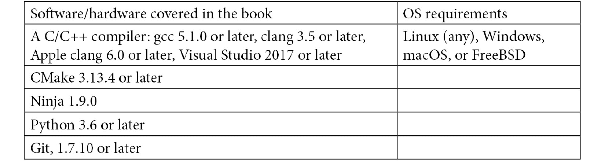

# 前言

构建编译器是一项复杂而有趣的任务。 LLVM 项目为您的编译器提供了可重用的组件。 LLVM 核心库实现了世界级的优化代码生成器，该生成器为所有流行的 CPU 体系结构翻译与源语言无关的机器码的中间表示形式。 许多编程语言的编译器已经利用了 LLVM 技术。

这本书教你如何实现你自己的编译器，以及如何使用 LLVM 来实现它。 您将了解编译器前端如何将源代码转换为抽象语法树，以及如何从它生成**中间表示**(**IR**)。 向编译器添加优化管道后，您可以将 IR 编译为执行机器码。

LLVM 框架可以通过几种方式进行扩展，您将学习如何向 LLVM 添加新的 PASS、新的机器指令，甚至是一个全新的后端。 此外，还介绍了高级主题，如针对不同 CPU 架构进行编译，以及使用您自己的插件和检查器扩展 clang 和 clang 静态分析器。 这本书遵循一种实用的方法，并有大量的示例源代码，这使得您可以很容易地应用在您自己的项目中获得的知识。

# 这本书是给谁看的

本书面向刚接触 LLVM 并对学习 LLVM 框架感兴趣的编译器开发人员、爱好者和工程师。 对于希望使用基于编译器的工具进行代码分析和改进的 C++ 软件工程师，以及希望获得更多 LLVM 基本知识的 LLVM 库的临时用户，它也很有用。 要更有效地理解本书中涵盖的概念，必须具备 C++ 编程的中级经验。

# 这本书涵盖了哪些内容

[*第 1 章*](01.html#_idTextAnchor015)，*安装 LLVM*解释了如何设置和使用您的开发环境。 在本章结束时，您将编译 LLVM 库并了解如何定制构建过程。

[*第 2 章*](02.html#_idTextAnchor032)，*巡视 LLVM 源代码*，向您介绍各种 LLVM 项目，并讨论所有项目共享的通用目录布局。 您将使用 LLVM 核心库创建您的第一个项目，还将为不同的 CPU 架构编译它。

[*第 3 章*](03.html#_idTextAnchor048)，*编译器的结构*概述了编译器的组件。 在本章结束时，您将实现第一个生成 LLVM IR 的编译器。

[*第 4 章*](04.html#_idTextAnchor066)，*将源文件转换为抽象语法树*，详细介绍如何实现编译器的前端。 您将为一种小型编程语言创建自己的前端，最后构建一个抽象语法树。

[*第 5 章*](05.html#_idTextAnchor079)，*IR 生成基础*介绍如何从抽象语法树生成 LLVM IR。 在本章结束时，您将实现示例语言的编译器，从而发出汇编文本或目标代码文件。

[*第 6 章*](06.html#_idTextAnchor102)，*高级语言构造的 IR 生成*说明了如何将高级编程语言中常见的源语言功能转换为 LLVM IR。 您将了解聚合数据类型的转换、实现类继承和虚函数的各种选项，以及如何遵守系统的应用二进制接口。

[*第 7 章*](07.html#_idTextAnchor111)，*高级 IR 生成*向您展示了如何在源语言中为异常处理语句生成 LLVM IR。 您还将学习如何为基于类型的别名分析添加元数据，以及如何向生成的 LLVM IR 添加调试信息，并将扩展编译器生成的元数据。

[*第 8 章*](08.html#_idTextAnchor126)，*优化 IR*解释了 LLVM 路径管理器。 您将实现自己的 PASS，既可以作为 LLVM 的一部分，也可以作为插件实现，您还将学习如何将新的 PASS 添加到优化 PASS 管道中。

[*第 9 章*](09.html#_idTextAnchor140)，*指令选择*显示了 LLVM 如何降低机器指令的 IR。 您将了解如何在 LLVM 中定义指令，并将向 LLVM 添加一条新的机器指令，以便指令选择将新指令考虑在内。

[*第 10 章*](10.html#_idTextAnchor153)，*JIT 编译*，讨论如何使用 LLVM 实现**实时**(**JIT**)编译器。 在本章结束时，您将以两种不同的方式为 LLVM IR 实现自己的 JIT 编译器。

[*第 11 章*](11.html#_idTextAnchor163)，*使用 LLVM 工具进行调试*探索了 LLVM 的各种库和组件的详细信息，这有助于您识别应用中的 bug。 您将使用消毒器来识别缓冲区溢出和其他错误。 使用 libFuzzer 库，您将使用随机数据作为输入来测试函数，而 XRay 将帮助您找到性能瓶颈。 您将使用 clang 静态分析器在源代码级别识别 bug，并且您将了解到可以将您自己的检查器添加到分析器中。 您还将学习如何使用自己的插件扩展 clang。

[*第 12 章*](12.html#_idTextAnchor177)，*创建您自己的后端*解释了如何向 LLVM 添加新的后端。 您将实现所有必要的类，在本章结束时，您将把 LLVM IR 编译为另一个 CPU 架构。

# 充分利用这本书

*您需要一台运行 Linux、Windows、MacOS 或 FreeBSD 并安装了操作系统开发工具链的计算机。 所需工具请参见表。 所有工具都应该位于 shell 的搜索路径中。*



要查看[*第 9 章*](09.html#_idTextAnchor140)、*指令选择*中的 DAG 可视化，必须安装来自[https://graphviz.org/](https://graphviz.org/)的 Graphviz 软件。 默认情况下，生成的图像为 PDF 格式，您需要 PDF 查看器才能显示它。

要使用 LLVM 工具创建[*第 11 章*](11.html#_idTextAnchor163)，*调试中的火焰图，需要从[https://github.com/brendangregg/FlameGraph](https://github.com/brendangregg/FlameGraph)安装脚本。 要运行该脚本，您还需要安装最新版本的 Perl，并且要查看图表，您需要一个能够显示 SVG 文件的 Web 浏览器，这是所有现代浏览器都能做的。 要在同一章中查看 Chrome 轨迹查看器可视化，您需要安装 Chrome 浏览器。*

**如果您使用的是本书的数字版本，我们建议您自己键入代码或通过 GitHub 存储库(下一节提供的链接)访问代码。 这样做可以帮助您避免与复制和粘贴代码相关的任何潜在错误。**

# 下载示例代码文件

您可以从 gihub[https://github.com/PacktPublishing/Learn-LLVM-12](https://github.com/PacktPublishing/Learn-LLVM-12)下载本书的示例代码文件。 如果代码有更新，它将在现有的 GitHub 存储库中进行更新。

我们还在[https://github.com/PacktPublishing/](https://github.com/PacktPublishing/)上提供了丰富的图书和视频目录中的其他代码包。 看看他们！

# 行动中的代码

本书的行动代码视频可在[https://bit.ly/3nllhED](https://bit.ly/3nllhED)上查看

# 下载彩色图片

我们还提供了一个 PDF 文件，其中包含本书中使用的屏幕截图/图表的彩色图像。 您可以在此处下载：[https://static.packt-cdn.com/downloads/9781839213502_ColorImages.pdf](_ColorImages.pdf)。

# 使用的惯例

本书中使用了许多文本约定。

`Code in text`：指示文本中的代码字、数据库表名、文件夹名、文件名、文件扩展名、路径名、虚拟 URL、用户输入和 Twitter 句柄。 下面是一个示例：“您可以在代码中观察到，正在定义一个量子电路操作和一个名为`numOnes`的变量。”

代码块设置如下：

```cpp
#include "llvm/IR/IRPrintingPasses.h"
#include "llvm/IR/LegacyPassManager.h"
#include "llvm/Support/ToolOutputFile.h"
```

当我们希望您注意代码块的特定部分时，相关行或项将以粗体显示：

```cpp
  switch (Kind) {
// Many more cases
  case m88k:           return "m88k";
  }
```

**粗体**：表示您在屏幕上看到的新术语、重要单词或单词。 例如，菜单或对话框中的单词显示在文本中，如下所示。 下面是一个示例：“从**管理**面板中选择**系统信息**。”

提示或重要说明

看起来就像这样。

# 保持联系

欢迎读者的反馈。

**一般反馈**：如果您对本书的任何方面有疑问，请在邮件主题中提及书名，并向我们发送电子邮件至[customercare@Packtpub.com](mailto:customercare@packtpub.com)。

**勘误表**：虽然我们已经竭尽全力确保内容的准确性，但错误还是会发生。 如果您在这本书中发现了错误，请向我们报告，我们将不胜感激。 请访问[www.Packtpub.com/support/errata](http://www.packtpub.com/support/errata)，选择您的图书，单击勘误表提交表链接，然后输入详细信息。

**盗版**：如果您在互联网上遇到任何形式的非法复制我们的作品，请您提供地址或网站名称，我们将不胜感激。 请通过[Copyright@Packt.com](mailto:copyright@packt.com)联系我们，并提供该材料的链接。

**如果您有兴趣成为一名作者**：如果有一个您擅长的主题，并且您有兴趣撰写或投稿一本书，请访问[Auths.Packtpub.com](http://authors.packtpub.com)。

# 评论

请留下评论。 一旦你阅读并使用了这本书，为什么不在你购买它的网站上留下评论呢？ 这样，潜在读者就可以看到并使用您不偏不倚的意见来做出购买决定，我们 Packt 可以了解您对我们产品的看法，我们的作者也可以看到您对他们的书的反馈。 谢谢!

有关 Packt 的更多信息，请访问[Packt.com](http://packt.com)。