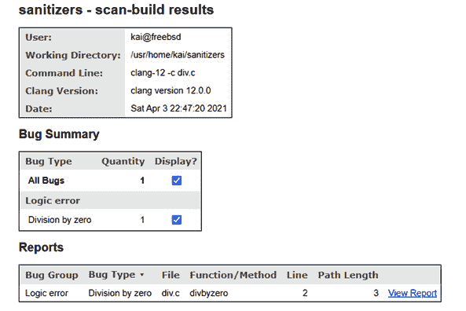
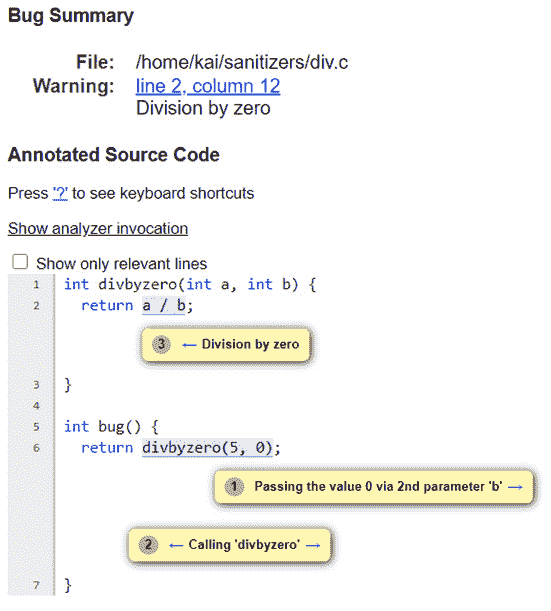

# *第 11 章*：使用 LLVM 工具调试

LLVM 附带了一组工具，可以帮助您识别应用程序中的某些错误。 所有这些工具都使用 LLVM 和**Clang**库。

在本章中，您将学习如何使用**杀菌器**检测应用程序，如何使用最常见的杀菌器来识别各种错误，以及如何为您的应用程序实现模糊测试。 这将帮助您识别单元测试中通常不会发现的错误。 您还将了解如何识别应用程序中的性能瓶颈，如何运行**静态分析器**来识别编译器通常不会发现的问题，以及如何创建您自己的基于 Clang 的工具以使用新功能扩展 Clang。

本章将介绍以下主题：

*   使用消毒器检测应用程序
*   使用**libFuzzer**查找错误
*   使用**XRay**进行性能评测
*   使用**Clang Static Analyzer**检查信号源
*   创建您自己的基于 Clang 的工具

在本章结束时，您将了解如何使用各种 LLVM 和 Clang 工具来识别应用程序中的一大类错误。 您还将获得使用新功能扩展 Clang 的知识，例如，执行命名约定或添加新的源代码分析。

# 技术要求

要在*Performance Profiling with Xray*一节中创建**火焰图**，您需要从[https://github.com/brendangregg/FlameGraph](https://github.com/brendangregg/FlameGraph)安装脚本。 有些系统(如**Fedora**和**FreeBSD**)为这些脚本提供了一个包，您也可以使用它。

要在同一节中查看**Chrome 可视化**，您需要安装**Chrome**浏览器。 您可以从[https://www.google.com/chrome/](https://www.google.com/chrome/)下载浏览器，或使用系统的软件包管理器安装 Chrome 浏览器。 本章的代码文件位于[https://github.com/PacktPublishing/Learn-LLVM-12/tree/master/Chapter11](https://github.com/PacktPublishing/Learn-LLVM-12/tree/master/Chapter11)

您可以在[https://bit.ly/3nllhED](https://bit.ly/3nllhED)上找到动作视频中的代码。

# 使用杀菌器检测应用程序

LLVM附带几个**消毒剂**。 这些是向该仪器传递**中间表示**(**IR**)，以检查应用程序的某些错误行为。 通常，它们需要库支持，这是`compiler-rt`项目的一部分。 可以在 Clang 中启用消毒剂，这使得它们使用起来非常舒适。 在以下部分中，我们将了解可用的消毒器，即`address`、`memory`和`thread`。 我们先来看看`address`消毒剂。

## 使用地址杀毒程序检测内存访问问题

您使用`address`杀菌器检测应用程序中的几个内存访问错误。 这包括常见错误，例如在释放内存后使用动态分配的内存，或者在分配的内存边界之外写入动态分配的内存。

启用后，`address`杀毒程序会用自己的版本替换对`malloc()`和`free()`函数的调用，并使用检查保护检测所有内存访问。 当然，这会增加应用程序的开销，并且您将只在应用程序的测试阶段使用`address`杀菌器。 如果您对实现细节感兴趣，那么您可以在`llvm/lib/Transforms/Instrumentation/AddressSanitzer.cpp`文件中找到 PASS 的来源以及在[https://github.com/google/sanitizers/wiki/AddressSanitizerAlgorithm](https://github.com/google/sanitizers/wiki/AddressSanitizerAlgorithm)中使用的算法的描述。

让我们运行一个简短的示例来演示`address`杀菌器的功能。 下面的示例应用程序`outofbounds.c`分配`12`字节的内存，但初始化`14`字节：

```cpp
#include <stdlib.h>
#include <string.h>
int main(int argc, char *argv[]) {
  char *p = malloc(12);
  memset(p, 0, 14);
  return (int)*p;
}
```

您可以编译并运行此应用程序，而不会注意到任何问题。 这是这类错误的典型情况。 即使在较大的应用程序中，这种错误也可能在很长一段时间内不被注意到。 但是，如果您使用`-fsanitize=address`选项启用`address`杀毒程序，则应用程序会在检测到错误后停止。

使用`–g`选项启用调试符号也很有用，因为它有助于识别错误在源代码中的位置。 以下代码是如何在启用`address`杀毒程序和调试符号的情况下编译源文件的示例：

```cpp
$ clang -fsanitize=address -g outofbounds.c -o outofbounds
```

现在，您在运行应用程序时会收到一份冗长的错误报告：

```cpp
$ ./outofbounds
=================================================================
==1067==ERROR: AddressSanitizer: heap-buffer-overflow on address 0x60200000001c at pc 0x00000023a6ef bp 0x7fffffffeb10 sp 0x7fffffffe2d8
WRITE of size 14 at 0x60200000001c thread T0
    #0 0x23a6ee in __asan_memset /usr/src/contrib/llvm-project/compiler-rt/lib/asan/asan_interceptors_memintrinsics.cpp:26:3
    #1 0x2b2a03 in main /home/kai/sanitizers/outofbounds.c:6:3
    #2 0x23331f in _start /usr/src/lib/csu/amd64/crt1.c:76:7
```

该报告还包含有关内存内容的详细信息。 重要的信息是错误的类型-**堆缓冲区溢出**，在这种情况下-以及有问题的源代码行。 要找到源代码行，可以查看位置*#1*处的堆栈跟踪，这是`address`杀毒程序截取应用程序执行之前的最后一个位置。 它显示了`outofbounds.c`文件中的*第 6 行*，这是包含对`memset()`的调用的行-实际上，这正是缓冲区溢出发生的确切位置。

如果将`outofbounds.c`文件中包含`memset(p, 0, 14);`的行替换为以下代码，则会在释放内存后引入对内存的访问。 您需要将源文件存储在`useafterfree.c`文件中：

```cpp
  memset(p, 0, 12);
  free(p);
```

同样，如果编译并运行它，则会检测到内存释放后指针的使用：

```cpp
$ clang -fsanitize=address -g useafterfree.c -o useafterfree
$ ./useafterfree
=================================================================
==1118==ERROR: AddressSanitizer: heap-use-after-free on address 0x602000000010 at pc 0x0000002b2a5c bp 0x7fffffffeb00 sp 0x7fffffffeaf8
READ of size 1 at 0x602000000010 thread T0
    #0 0x2b2a5b in main /home/kai/sanitizers/useafterfree.c:8:15
    #1 0x23331f in _start /usr/src/lib/csu/amd64/crt1.c:76:7
```

这一次，报告指向*行 8*，其中包含对`p`指针的取消引用。

在**x86_64 Linux**和**MacOS**上，您还可以启用泄漏检测器。 如果在运行应用程序之前将`ASAN_OPTIONS`环境变量设置为值`detect_leaks=1`，那么还会得到关于内存泄漏的报告。 在命令行中，您可以执行以下操作：

```cpp
$ ASAN_OPTIONS=detect_leaks=1 ./useafterfree
```

`address`消毒器非常有用，因为它捕获了一类本来很难检测到的错误。 `memory`杀菌器执行类似的任务，我们将在下一节中介绍它。

## 使用内存消毒器查找未初始化的内存访问

使用未初始化内存是另一类很难找到的错误。 在**C**和**C++**中，通用内存分配例程不使用默认值初始化内存缓冲区。 堆栈上的自动变量也是如此。

出现错误的机会很多，`memory`消毒器可以帮助找到错误。 如果您对实现细节感兴趣，可以在`llvm/lib/Transforms/Instrumentation/MemorySanitizer.cpp`文件中找到`memory`杀菌器通道的源代码。 文件顶部的注释解释了实现背后的想法。

让我们运行一个小示例，并将以下源代码另存为`memory.c`文件。 您应该注意到，`x`变量未初始化，但用作`return`值：

```cpp
int main(int argc, char *argv[]) {
  int x;
  return x;
}
```

没有消毒剂，应用程序会运行得很好。 但是，如果您使用`-fsanitize=memory`选项，您将得到错误报告：

```cpp
$ clang -fsanitize=memory -g memory.c -o memory
$ ./memory
==1206==WARNING: MemorySanitizer: use-of-uninitialized-value
    #0 0x10a8f49 in main /home/kai/sanitizers/memory.c:3:3
    #1 0x1053481 in _start /usr/src/lib/csu/amd64/crt1.c:76:7
SUMMARY: MemorySanitizer: use-of-uninitialized-value /home/kai/sanitizers/memory.c:3:3 in main
Exiting
```

与杀毒程序`address`类似，`memory`杀毒程序在发现第一个错误时停止应用程序。

在下一节中，我们将了解如何使用`thread`杀菌器来检测多线程应用程序中的数据竞争。

## 用线程消毒器指出数据竞争

为了利用现代 CPU 的能力，应用程序现在使用多线程。 这是一种强大的技术，但它也引入了新的错误来源。 多线程应用程序中一个非常常见的问题是对全局数据的访问不受保护，例如，使用**互斥锁**或**信号量**。 这被称为**数据竞赛**。 `thread`杀毒程序可以检测基于**Pthread**的应用程序和使用 LLVM**libc++**实现的应用程序中的数据竞争。 您可以在`llvm/lib/Transforms/Instrumentation/ThreadSanitize.cpp`文件中找到实现。

为了演示`thread`杀菌器的功能，我们将创建一个非常简单的生产者/消费者风格的应用程序。 生产者线程递增全局变量，而消费者线程递减同一变量。 对全局变量的访问不受保护，因此这显然是一场数据竞赛。 您需要在`thread.c`文件中保存以下源代码：

```cpp
#include <pthread.h>
int data = 0;
void *producer(void *x) {
  for (int i = 0; i < 10000; ++ i) ++ data;
  return x;
}
void *consumer(void *x) {
  for (int i = 0; i < 10000; ++ i) --data;
  return x;
}
int main() {
  pthread_t t1, t2;
  pthread_create(&t1, NULL, producer, NULL);
  pthread_create(&t2, NULL, consumer, NULL);
  pthread_join(t1, NULL);
  pthread_join(t2, NULL);
  return data;
}
```

从前面的代码开始，`data`变量在两个线程之间共享。 这里，它是`int`类型，以使示例变得简单。 大多数情况下，会使用诸如`std::vector`类或类似的数据结构。 这两个线程运行`producer()`和`consumer()`函数。

`producer()`函数仅使`data`变量递增，而`consumer()`函数使其递减。 没有实施访问保护，因此这构成了一场数据竞赛。 `main()`函数用`pthread_create()`函数启动两个线程，用`pthread_join()`函数等待线程结束，然后返回`data`变量的当前值。

如果编译并运行此应用程序，则不会注意到任何错误；也就是说，返回值始终为 0。 如果执行的循环数增加 100 倍，则会出现错误，在这种情况下，返回值不等于等于 0。 然后，您将看到其他值出现。

您可以使用`thread`消毒器来识别数据竞争。 要在启用`thread`杀毒程序的情况下进行编译，您需要将`-fsanitize=thread`选项传递给 Clang。 使用`–g`选项添加调试符号会在报告中显示行号，这会有很大帮助。 请注意，您还需要链接`pthread`库：

```cpp
$ clang -fsanitize=thread -g thread.c -o thread -lpthread
$ ./thread
==================
WARNING: ThreadSanitizer: data race (pid=1474)
  Write of size 4 at 0x000000cdf8f8 by thread T2:
    #0 consumer /home/kai/sanitizers/thread.c:11:35 (thread+0x2b0fb2)
  Previous write of size 4 at 0x000000cdf8f8 by thread T1:
    #0 producer /home/kai/sanitizers/thread.c:6:35 (thread+0x2b0f22)
  Location is global 'data' of size 4 at 0x000000cdf8f8 (thread+0x000000cdf8f8)
  Thread T2 (tid=100437, running) created by main thread at:
    #0 pthread_create /usr/src/contrib/llvm-project/compiler-rt/lib/tsan/rtl/tsan_interceptors_posix.cpp:962:3 (thread+0x271703)
    #1 main /home/kai/sanitizers/thread.c:18:3 (thread+0x2b1040)
  Thread T1 (tid=100436, finished) created by main thread at:
    #0 pthread_create /usr/src/contrib/llvm-project/compiler-rt/lib/tsan/rtl/tsan_interceptors_posix.cpp:962:3 (thread+0x271703)
    #1 main /home/kai/sanitizers/thread.c:17:3 (thread+0x2b1021)
SUMMARY: ThreadSanitizer: data race /home/kai/sanitizers/thread.c:11:35 in consumer
==================
ThreadSanitizer: reported 1 warnings
```

报告将我们指向源文件的*行 6*和*11*，其中访问全局变量。 它还显示了名为*t1*和*t2*的两个线程访问了该变量，以及分别调用`pthread_create()`函数的文件号和行号。

在本节中，我们学习了如何使用三种消毒剂来识别应用程序中的常见问题。 `address`杀菌器帮助我们识别常见的内存访问错误，例如越界访问或释放后使用内存。 使用`memory`清理程序，我们可以发现对未初始化内存的访问，而`thread`清理程序可以帮助我们识别数据竞争。

在下一节中，我们尝试通过对随机数据运行我们的应用程序来触发消毒器，这称为**模糊测试**。

# 使用 libFuzzer 查找错误

要测试您的应用程序，您需要编写**个单元测试**。 这是确保软件正常运行的好方法。 然而，由于可能输入的指数数，您可能会遗漏某些奇怪的输入，也可能会遗漏一些错误。

**模糊测试**可以提供帮助。 其想法是向您的应用程序呈现随机生成的数据，或者基于有效输入但具有随机更改的数据。 这是一次又一次的操作，因此您的应用程序会使用大量输入进行测试。 这是一种非常强大的测试方法。 事实上，在网络浏览器和其他软件中，通过模糊测试已经发现了数百个错误。

LLVM 附带自己的模糊测试库。 最初是 LLVM core库的一部分，**libFuzzer**实现最终移到了`compiler-rt`。 该库旨在测试小而快速的函数。

让我们举一个小例子。 您需要提供`LLVMFuzzerTestOneInput()`函数。 此函数由**模糊器驱动程序**调用，并为您提供一些输入。 下面的函数计算输入中连续的 ASCII 数字，然后我们将随机输入提供给它。 您需要将示例保存在`fuzzer.c`文件中：

```cpp
#include <stdint.h>
#include <stdlib.h>
int count(const uint8_t *Data, size_t Size) {
  int cnt = 0;
  if (Size)
    while (Data[cnt] >= '0' && Data[cnt] <= '9') ++ cnt;
  return cnt;
}
int LLVMFuzzerTestOneInput(const uint8_t *Data, size_t 
                           Size) {
  count(Data, Size);
  return 0;
}
```

从前面的代码开始，`count()`函数计算`Data`变量指向的内存中的位数。 仅检查数据的大小以确定是否有可用的字节。 在`while`循环中，不检查大小。

与普通的**C 字符串**一起使用时，不会出现错误，因为 C 字符串总是以`0`字节结尾。 `LLVMFuzzerTestOneInput()`函数是所谓的**模糊目标**，它是 libFuzzer 调用的函数。 它调用我们想要测试的函数并返回`0`，这是当前唯一允许的值。

要使用 libFuzzer 编译文件，需要添加`-fsanitize=fuzzer`选项。 建议还启用`address`消毒器和调试符号的生成。 使用以下命令编译该文件：

```cpp
$ clang -fsanitize=fuzzer,address -g fuzzer.c -o fuzzer
```

当您运行测试时，会发出一份冗长的报告。 该报告包含比堆栈跟踪更多的信息，因此让我们更仔细地了解一下：

1.  第一行告诉您用于初始化随机数生成器的种子。 您可以使用`–seed=`选项重复此执行：

    ```cpp
    INFO: Seed: 1297394926
    ```

2.  默认情况下，libFuzzer 将输入限制为最多 4096 个字节。 您可以使用`–max_len=`选项更改默认值：

    ```cpp
    INFO: -max_len is not provided; libFuzzer will not generate inputs larger than 4096 bytes
    ```

3.  现在，我们在不提供样本输入的情况下运行测试。 所有样本输入的集合称为语料库，对于这次运行它是空的：

    ```cpp
    INFO: A corpus is not provided, starting from an empty corpus
    ```

4.  下面将介绍有关生成的测试数据的一些信息。 它显示尝试了`28`个输入，找到了`6`个输入，总长度为`19`个字节，它们一起覆盖了`6`个覆盖点或基本块：

    ```cpp
    #28     NEW    cov: 6 ft: 9 corp: 6/19b lim: 4 exec/s: 0 rss: 29Mb L: 4/4 MS: 4 CopyPart-PersAutoDict-CopyPart-ChangeByte- DE: "1\x00"-
    ```

5.  在此之后，检测到缓冲区溢出，它遵循来自`address`杀菌器的信息。 最后，报告将告诉您导致缓冲区溢出的输入的保存位置：

    ```cpp
    artifact_prefix='./'; Test unit written to ./crash-17ba0791499db908433b80f37c5fbc89b870084b
    ```

使用保存的输入，您可以再次使用崩溃的输入执行测试用例：

```cpp
$ ./fuzzer crash-17ba0791499db908433b80f37c5fbc89b870084b
```

这显然对识别问题有很大帮助。 只是，使用随机数据通常不是很有帮助。 如果您试图模糊测试`tinylang`词法分析器或解析器，那么纯随机数据会导致输入立即被拒绝，因为找不到有效的令牌。

在这种情况下，提供一小部分有效输入(称为语料库)更为有用。 然后，语料库的文件被随机变异并用作输入。 您可以认为输入基本上是有效的，只有几个位被翻转。 这也适用于其他输入，这些输入必须具有特定的格式。 例如，对于处理**JPEG**和**PNG**文件的库，您将提供一些小的**JPEG**和**PNG**文件作为语料库。

您可以将语料库文件保存在一个或多个目录中，并且可以在`printf`命令的帮助下为您的模糊测试创建一个简单的语料库：

```cpp
$ mkdir corpus
$ printf "012345\0" >corpus/12345.txt
$ printf "987\0" >corpus/987.txt
```

运行测试时，您将在命令行上提供目录：

```cpp
$ ./fuzzer corpus/
```

然后，语料库被用作生成随机输入的基础，正如报告所述：

```cpp
INFO: seed corpus: files: 2 min: 4b max: 7b total: 11b rss: 29Mb
```

如果您正在测试一个可以处理记号或其他魔术值的函数，比如编程语言，那么可以通过提供带有记号的字典来加快测试过程。 对于编程语言，词典将包含该语言中使用的所有关键字和特殊符号。 字典定义遵循简单的键值样式。 例如，要在字典中定义`if`关键字，可以添加以下内容：

```cpp
kw1="if"
```

但是，密钥是可选的，可以省略。 然后，您可以在命令行中使用`–dict=`选项指定字典文件。 在下一节中，我们将了解 libFuzzer 实现的限制和替代方案。

## 限制和替代方案

LibFuzzer实现速度很快，但对测试目标有很多限制。 这些建议如下：

*   被测函数必须将输入作为内存中的数组接受。 一些库函数需要指向数据的文件路径，并且不能使用 libFuzzer 进行测试。
*   不应调用`exit()`函数。
*   全球状态不应改变。
*   不应使用硬件随机数生成器。

从前面提到的限制来看，前两个限制是将 libFuzzer 实现为库的含义。 后两个限制是为了避免评估算法中的混乱。 如果没有满足其中一个限制，那么对 fuzz 目标的两个相同调用可能会产生不同的结果。

用于模糊测试的最著名的替代工具是**AFL**，可在[https://github.com/google/AFL](https://github.com/google/AFL)找到。 AFL 需要一个插入指令的二进制文件(提供了一个用于指令插入的 LLVM 插件)，并要求应用程序将输入作为命令行上的文件路径。 AFL 和 libFuzzer 可以共享相同的语料库和相同的词典文件。 因此，可以同时使用这两种工具测试应用程序。 在 libFuzzer 不适用的情况下，AFL 可能是一个很好的选择。

影响libFuzzer 工作方式的方法还有很多。 您可以在[https://llvm.org/docs/LibFuzzer.html](https://llvm.org/docs/LibFuzzer.html)阅读参考页面以了解更多详细信息。

在下一节中，我们将讨论应用程序可能遇到的另一个完全不同的问题；我们将尝试确定性能瓶颈。

# 使用 XRay 进行性能评测

如果您的应用程序似乎运行缓慢，那么您可能想知道代码中所有的时间都花在哪里了。 在这种情况下，使用**XRay**检测代码会对您有所帮助。 基本上，在每个函数进入和退出时，都会插入一个对运行时库的特殊调用。 这允许统计函数被调用的频率，以及在函数中花费了多少时间。 您可以在`llvm/lib/XRay/`目录中找到检测过程的实现。 运行时部分是`compiler-rt`的一部分。

在下面的示例源代码中，通过调用`usleep()`函数来模拟实际工作。 `func1()`函数休眠 10µs。`func2()`函数调用`func1()`或休眠 100µs，具体取决于`n`参数是奇数还是偶数。 在`main()`函数中，这两个函数都在循环内调用。 这已经足够获得有趣的信息了。 您需要将以下源代码保存在`xraydemo.c`文件中：

```cpp
#include <unistd.h>
void func1() { usleep(10); }
void func2(int n) {
  if (n % 2) func1();
  else usleep(100);
}
int main(int argc, char *argv[]) {
  for (int i = 0; i < 100; i++) { func1(); func2(i); }
  return 0;
}
```

要在编译期间启用 X 射线检测，您需要指定`-fxray-instrument`选项。 指令少于 200 条的函数不会被检测。 这是由开发人员定义的任意阈值，在我们的示例中，不会插入函数。 阈值可以使用`-fxray-instruction-threshold=`选项指定。 或者，我们可以添加一个函数属性来控制是否应该检测一个函数。 对于示例，添加以下原型将导致始终检测函数：

```cpp
void func1() __attribute__((xray_always_instrument));
```

同样，通过使用`xray_never_instrument`属性，您可以关闭函数的插装。

现在，我们将使用命令行选项并编译`xraydemo.c`文件，如下所示：

```cpp
$ clang -fxray-instrument -fxray-instruction-threshold=1 -g\
  xraydemo.c -o xraydemo
```

在生成的二进制文件中，检测在默认情况下是关闭的。 如果运行二进制文件，您将注意到与未检测的二进制文件没有区别。 `XRAY_OPTIONS`环境变量用于控制运行时数据的记录。 要启用数据收集，请按如下方式运行应用程序：

```cpp
$ XRAY_OPTIONS= "patch_premain=true xray_mode=xray-basic "\
  ./xraydemo
```

`xray_mode=xray-basic`选项告诉运行时我们要使用基本模式。 在此模式下，将收集所有运行时数据，这可能会产生巨大的日志文件。 当给出`patch_premain=true`选项时，在`main()`函数之前运行的函数也会被检测。

运行此命令后，您会在存储收集的数据的目录中看到一个新文件。 您需要使用`llvm-xray`工具从该文件中提取可读信息。

`llvm-xray`工具支持各种子命令。 您可以使用`account`子命令来提取一些基本统计信息。 例如，要获得调用次数最多的 10 个函数，可以添加`-top=10`选项来限制输出，并添加`-sort=count`选项来指定函数调用计数作为排序标准。 您可以使用`-sortorder=`选项影响排序顺序。 运行以下命令以获取统计信息：

```cpp
$ llvm-xray account xray-log.xraydemo.xVsWiE -sort=count\
  -sortorder=dsc -instr_map ./xraydemo
Functions with latencies: 3
   funcid      count        sum  function
        1        150   0.166002  demo.c:4:0: func1
        2        100   0.543103  demo.c:9:0: func2
        3          1   0.655643  demo.c:17:0: main
```

您可以看到调用最频繁的`func1()`函数，以及在此函数中花费的累计时间。 该示例只有三个函数，因此`–top=`选项在这里没有明显的效果，但对于实际应用程序，它非常有用。

根据收集的数据，可以重建运行时发生的所有堆栈帧。 您可以使用`stack`子命令查看前 10 个堆栈。 为简洁起见，减少了此处显示的输出：

```cpp
$ llvm-xray stack xray-log.xraydemo.xVsWiE -instr_map\
  ./xraydemo
Unique Stacks: 3
Top 10 Stacks by leaf sum:
Sum: 1325516912
lvl   function              count              sum
#0    main                      1       1777862705
#1    func2                    50       1325516912
Top 10 Stacks by leaf count:
Count: 100
lvl   function              count              sum
#0    main                      1       1777862705
#1    func1                   100        303596276
```

**堆栈帧**是如何调用函数的序列。 `func2()`函数由`main()`函数调用，这是累积时间最长的堆栈帧。 深度取决于调用了多少个函数，堆栈帧通常很大。

此子命令还可用于从堆栈帧创建**火焰图**。 使用火焰图，您可以很容易地识别哪些函数具有较大的累积运行时。 输出是包含计数和运行时信息的堆栈帧。 使用`flamegraph.pl`脚本将数据转换为可在浏览器中查看的**可缩放矢量图形**(**SVG**)文件。

使用以下命令，您可以指示`llvm-xray`使用`–all-stacks`选项输出所有堆栈帧。 使用`–stack-format=flame`选项，输出将采用`flamegraph.pl`脚本预期的格式。 使用`–aggregation-type`选项，您可以选择是按总时间还是按调用次数聚合堆栈帧。 `llvm-xray`的输出通过管道传输到`flamegraph.pl`脚本，生成的输出保存在`flame.svg`文件中：

```cpp
$ llvm-xray stack xray-log.xraydemo.xVsWiE -all-stacks\
  -stack-format=flame --aggregation-type=time\
  -instr_map ./xraydemo | flamegraph.pl >flame.svg
```

在浏览器中打开生成的`flame.svg`文件。 该图如下所示：


图 11.1-由 llvm-xray 生成的火焰图

乍一看，火焰图可能会让人感到困惑，因为*x*轴没有通常意义上的流逝时间。 相反，函数只是按名称排序。 颜色的选择是为了具有良好的对比度，没有其他意义。 从上面的图表中，您可以很容易地确定调用层次结构和在函数中花费的时间。

只有在将鼠标光标移到表示堆栈帧的矩形上后，才会显示有关该堆栈帧的信息。 在框架上单击鼠标，可以放大此堆栈帧。 如果你想找出值得优化的功能，火焰图是很有帮助的。 要了解更多关于火焰图表的信息，请访问火焰图表发明者布兰登·格雷格的网站，[http://www.brendangregg.com/flamegraphs.html](http://www.brendangregg.com/flamegraphs.html)。

您可以使用`convert`子命令将数据转换为`.yaml`格式或**Chrome 跟踪查看器可视化**所使用的格式。 后者是从数据创建图形的另一种很好的方法。 要将数据保存在`xray.evt`文件中，请运行以下命令：

```cpp
$ llvm-xray convert -output-format=trace_event\
  -output=xray.evt -symbolize –sort\
  -instr_map=./xraydemo xray-log.xraydemo.xVsWiE
```

如果不指定`–symbolize`选项，则结果图形中不会显示任何函数名称。

完成后，打开Chrome 浏览器并键入`chrome:///tracing`。 然后，单击**加载**按钮加载`xray.evt`文件。 您将看到以下可视化数据：


图 11.2-由 llvm-xray 生成的 Chrome 跟踪查看器可视化

在此视图中，堆栈帧按函数调用发生的时间排序。 有关可视化的进一步解释，请阅读位于[https://www.chromium.org/developers/how-tos/trace-event-profiling-tool](https://www.chromium.org/developers/how-tos/trace-event-profiling-tool)的教程。

给小费 / 翻倒 / 倾覆

`llvm-xray`工具具有更多功能。 您可以在 LLVM 网站[https://llvm.org/docs/XRay.html](https://llvm.org/docs/XRay.html)和[https://llvm.org/docs/XRayExample.html](https://llvm.org/docs/XRayExample.html)上看到相关信息。

在本节中，我们学习了如何使用 XRay 检测应用程序，如何收集运行时信息，以及如何可视化这些数据。 我们可以利用这些知识来发现应用程序中的性能瓶颈。

识别应用程序中错误的另一种方法是分析源代码，这是使用静态分析器完成的。

# 使用 Clang Static Analyzer 检查信号源

**Clang Static Analyzer**是一个对 C、C++ 和**Objective C**源代码执行额外检查的工具。 静态分析器执行的检查比编译器执行的检查更彻底。 它们在时间和所需资源方面也更加昂贵。 静态分析器有一组检查器，用于检查某些错误。

该工具对源代码执行符号解释，查看通过应用程序的所有代码路径，并从中派生对应用程序中使用的值的约束。 **符号解释**是编译器中使用的一种常用技术，例如，用于识别常量值。 在静态分析器的上下文中，检查器应用于派生的值。

例如，如果除法的除数为 0，则静态分析器会对此发出警告。 我们可以通过存储在`div.c`文件中的以下示例来验证这一点：

```cpp
int divbyzero(int a, int b) { return a / b; }
int bug() { return divbyzero(5, 0); }
```

在本例中，静态分析器将警告被`0`除。 但是，在编译时，使用`clang -Wall -c div.c`命令的文件不会显示任何警告。

从命令行调用静态分析器有两种方式。 较早的工具是**Scan-Build**，它包含在 LLVM 中的，可用于简单场景。 较新的工具是**CodeChecker**，可从[https://github.com/Ericsson/codechecker/](https://github.com/Ericsson/codechecker/)获得。 对于检查单个文件，`scan-build`工具是更简单的解决方案。 您只需将`compile`命令传递给该工具，其他所有操作都会自动完成：

```cpp
$ scan-build clang -c div.c
scan-build: Using '/usr/local/llvm12/bin/clang-12' for static analysis
div.c:2:12: warning: Division by zero [core.DivideZero]
  return a / b;
         ~~^~~
1 warning generated.
scan-build: Analysis run complete.
scan-build: 1 bug found.
scan-build: Run 'scan-view /tmp/scan-build-2021-03-01-023401-8721-1' to examine bug reports.
```

屏幕上的输出已经告诉您发现了问题，即触发了名为`core.DivideZero`的检查器。 但这还不是全部。 您将在`/tmp`目录的上述子目录中找到 HTML 格式的完整报告。 您可以使用`scan-view`命令查看报告，也可以在浏览器中打开子目录中的`index.html`文件。

报告的第一页显示了发现的错误的摘要：



图 11.3-摘要页

对于每个发现的错误，摘要页显示错误类型、源中的位置以及分析器找到错误之前的路径长度。 提供了指向该错误的详细报告的链接。

以下屏幕截图显示了错误的详细报告：



图 11.4-详细报告

有了详细的报告，您可以通过跟踪编号气泡来验证错误。 在我们的简单示例中，它分三个步骤展示了将`0`作为参数值传递如何导致除以零错误。

确实需要通过人来验证。 如果派生的约束对于某个检查器来说不够精确，那么就有可能出现误报，也就是说，对于非常精细的代码会报告错误。 根据报告，您可以识别误报。

您并不局限于该工具提供的棋盘格。 您还可以添加新的跳棋。 下一节将介绍如何做到这一点。

## 向 Clang Static Analyzer 添加新的检查器

要向Clang Static Analyzer 添加新的检查器，请创建`Checker`类的新子类。 静态分析器尝试通过代码的所有可能路径。 分析器引擎在某些点生成事件，例如，在函数调用之前或之后。 如果需要处理这些事件，您的类必须为它们提供回调。 `Checker`类和事件的注册在`clang/include/clang/StaticAnalyzer/Core/Checker.h`头文件中提供。

通常，检验员需要跟踪一些符号。 但是检查器无法管理状态，因为它不知道分析器引擎当前尝试的代码路径。 因此，跟踪的状态必须向引擎注册，并且只能使用`ProgramStateRef`实例进行更改。

许多库提供必须成对使用的函数。 例如，C 标准库提供了`malloc()`和`free()`函数。 `malloc()`函数分配的内存必须由`free()`函数恰好释放一次。 不调用`free()`函数或多次调用它是编程错误。 这种编码模式还有更多的实例，静态分析器为其中一些实例提供了检查器。

**iconv**库提供了将文本从一种编码转换为另一种编码的功能，例如，从拉丁文-1 编码到 UTF-16 编码。 要执行转换，实现需要分配内存。 为了透明地管理内部资源，`iconv`库提供了必须成对使用的`iconv_open()`和`iconv_close()`函数。 您可以实现一个检查器来检查这一点。

要检测错误，检查器需要跟踪从`iconv_open()`函数返回的描述符。 分析器引擎返回`iconv_open()`函数返回值的`SymbolRef`实例。 我们将此符号与一个状态相关联，以反映是否调用了`iconv_close()`。 对于状态，我们创建了`IconvState`类，它封装了一个`bool`值。

新的`IconvChecker`类需要处理四个事件：

*   `PostCall`，其中发生在函数调用之后。 调用`iconv_open()`函数后，我们检索返回值的符号，并记住它处于打开状态。
*   `PreCall`，它发生在函数调用之前。 在调用`iconv_close()`函数之前，我们检查描述符的符号是否处于打开状态。 如果不是，则已经为描述符调用了`iconv_close()`函数，并且我们检测到对该函数的双重调用。
*   `DeadSymbols`，它在清理未使用的符号时发生。 我们检查描述符的未使用符号是否仍处于打开状态。 如果是，则我们检测到缺少对`iconv_close()`的调用，这是资源泄漏。
*   `PointerEscape`，当分析器无法再跟踪符号时调用。 在本例中，我们从状态中删除了符号，因为我们不能再推断描述符是否关闭。

新的检查器在 Clang 项目内部实现。 让我们首先将新的检查器添加到所有检查器的集合中，即`clang/include/clang/StaticAnalyzer/Checkers/Checkers.td`文件。 每个检查器都与包相关联。 我们的新检查器正在开发中，因此它属于`alpha`包。 Iconv API 是 POSIX 标准化的 API，因此它也属于`unix`包。 找到`Checkers.td`文件中的`UnixAlpha`部分，并添加以下代码以注册新的`IconvChecker`：

```cpp
def IconvChecker : Checker<"Iconv">,
  HelpText<"Check handling of iconv functions">,
  Documentation<NotDocumented>;
```

这会将新检查器添加到已知的**检查器**集合中，设置命令行选项的帮助文本，并声明没有此检查器的文档。

接下来，我们在`clang/lib/StaticAnalyzer/Checkers/IconvChecker.cpp`文件中实现检查器：

1.  对于实现，我们需要包括几个头文件。 注册检查器需要`BuiltinCheckerRegistration.h`文件。 `Checker.h`文件提供了`Checker`类的声明和事件的回调。 `CallEvent.h`文件声明用于调用事件的类，`CheckerContext.h`文件是声明`CheckerContext`类所必需的，该类是提供对分析器状态的访问的中心类：

    ```cpp
    #include "clang/StaticAnalyzer/Checkers/
    BuiltinCheckerRegistration.h"
    #include "clang/StaticAnalyzer/Core/Checker.h"
    #include "clang/StaticAnalyzer/Core/
    PathSensitive/CallEvent.h"
    #include "clang/StaticAnalyzer/Core/PathSensitive/
    CheckerContext.h"
    ```

2.  为了避免键入名称空间名称，我们使用`clang`和`ento`名称空间：

    ```cpp
    using namespace clang;
    using namespace ento;
    ```

3.  我们将一个状态与代表一个图标描述符的每个符号相关联。 状态可以是打开的，也可以是关闭的，我们使用`bool`类型的变量，值为`true`表示打开状态。 状态值封装在`IconvState`结构中。 此结构与`FoldingSet`数据结构一起使用，该数据结构是过滤重复条目的散列集。 为了与该数据结构实现一起使用，这里添加了`Profile()`方法，该方法设置该结构的唯一位。 我们将该结构放入匿名命名空间，以避免污染全局命名空间：

    ```cpp
    namespace {
    struct IconvState {
      const bool IsOpen;
    public:
      IconvState(bool IsOpen) : IsOpen(IsOpen) {}
      bool isOpen() const { return IsOpen; }
      bool operator==(const IconvState &O) const {
        return IsOpen == O.IsOpen;
      }
      void Profile(llvm::FoldingSetNodeID &ID) const {
        ID.AddInteger(IsOpen);
      }
    };
    }
    ```

4.  `IconvState`结构表示图标描述符的状态，由`SymbolRef`类的符号表示。 这最好使用映射来完成，映射将符号作为关键字，州作为值。 如前所述，检查器不能保持状态。 相反，状态必须注册到全局程序状态，这是通过`REGISTER_MAP_WITH_PROGRAMSTATE`宏完成的。 此宏引入`IconvStateMap`名称，我们稍后将使用该名称访问映射：

    ```cpp
    REGISTER_MAP_WITH_PROGRAMSTATE(IconvStateMap, SymbolRef,
                                   IconvState)
    ```

5.  我们还在匿名命名空间中实现了`IconvChecker`类。 请求的`PostCall`、`PreCall`、`DeadSymbols`和`PointerEscape`事件是`Checker`基类的模板参数：

    ```cpp
    namespace {
    class IconvChecker
        : public Checker<check::PostCall, check::PreCall,
                         check::DeadSymbols,
                         check::PointerEscape> {
    ```

6.  `IconvChecker`类只有`CallDescription`类型的字段，用于标识程序中的`iconv_open()`、`iconv()`和`iconv_close()`函数调用：

    ```cpp
      CallDescription IconvOpenFn, IconvFn, IconvCloseFn;
    ```

7.  `report()`方法生成错误报告。 该方法的重要参数是符号数组、错误类型和错误描述。 在该方法中，将为每个符号创建一个错误报告，并将该符号标记为该错误的有趣符号。 如果源范围作为参数提供，则也会将其添加到报告中。 最后，发出报告：

    ```cpp
      void
      report(ArrayRef<SymbolRef> Syms, const BugType &Bug,
             StringRef Desc, CheckerContext &C,
             ExplodedNode *ErrNode,
             Optional<SourceRange> Range = None) const {
        for (SymbolRef Sym : Syms) {
          auto R = std::make_unique
                  <PathSensitiveBugReport>(
              Bug, Desc, ErrNode);
          R->markInteresting(Sym);
          if (Range)
            R->addRange(*Range);
          C.emitReport(std::move(R));
        }
      }
    ```

8.  `IconvChecker`类的构造函数仅使用函数名

    ```cpp
    public:
      IconvChecker()
          : IconvOpenFn("iconv_open"), IconvFn("iconv"),
            IconvCloseFn("iconv_close", 1) {}
    ```

    初始化`CallDescription`字段
9.  `checkPostCall()`方法在分析器执行函数调用后调用。 如果执行的函数不是全局 C 函数，也没有命名为`iconv_open`，则无需执行任何操作：

    ```cpp
      void checkPostCall(const CallEvent &Call,
                         CheckerContext &C) const {
        if (!Call.isGlobalCFunction() ||
            !Call.isCalled(IconvOpenFn))
          return;
    ```

10.  否则，我们会尝试以符号形式获取函数的返回值。 要在全局编程状态下存储处于打开状态的符号，我们需要从`CheckerContext`实例获取一个`ProgramStateRef`实例。 状态是不可变的，因此将符号添加到状态会产生一个新状态。 通过调用`addTransition()`方法通知分析器引擎新状态：

    ```cpp
        if (SymbolRef Handle =
                Call.getReturnValue().getAsSymbol()) {
          ProgramStateRef State = C.getState();
          State = State->set<IconvStateMap>(
              Handle, IconvState(true));
          C.addTransition(State);
        }
      }
    ```

11.  同样，在分析器执行函数之前调用`checkPreCall()`方法。 我们只对名为`iconv_close`的全局 C 函数感兴趣：

    ```cpp
      void checkPreCall(const CallEvent &Call,
                        CheckerContext &C) const {
        if (!Call.isGlobalCFunction() ||
            !Call.isCalled(IconvCloseFn))
          return;
    ```

12.  如果函数的第一个参数的符号(即 iconv 描述符)是已知的，则我们从程序状态

    ```cpp
        if (SymbolRef Handle =
                Call.getArgSVal(0).getAsSymbol()) {
          ProgramStateRef State = C.getState();
          if (const IconvState *St =
                  State->get<IconvStateMap>(Handle)) {
    ```

    检索符号的状态
13.  如果状态表示关闭状态，则我们检测到双重关闭错误，并为其生成错误报告。 如果已经为此路径生成错误报告，则对`generateErrorNode()`的调用可以返回`nullptr`值，因此我们必须检查此情况：

    ```cpp
            if (!St->isOpen()) {
              if (ExplodedNode *N = C.generateErrorNode()) {
                BugType DoubleCloseBugType(
                    this, "Double iconv_close",
                    "iconv API Error");
                report({Handle}, DoubleCloseBugType,
                       "Closing a previous closed iconv "
                       "descriptor",
                       C, N, Call.getSourceRange());
              }
              return;
            }
          }
    ```

14.  否则，我们将符号的状态设置为 Closed：

    ```cpp
          State = State->set<IconvStateMap>(
              Handle, IconvState(false));
          C.addTransition(State);
        }
      }
    ```

15.  调用`checkDeadSymbols()`方法来清除未使用的符号。 我们循环跟踪所有个符号，并询问`SymbolReaper`实例当前符号是否无效：

    ```cpp
      void checkDeadSymbols(SymbolReaper &SymReaper,
                            CheckerContext &C) const {
        ProgramStateRef State = C.getState();
        SmallVector<SymbolRef, 8> LeakedSyms;
        for (auto SymbolState :
             State->get<IconvStateMap>()) {
          SymbolRef Sym = SymbolState.first;
          IconvState &St = SymbolState.second;
          if (SymReaper.isDead(Sym)) {
    ```

16.  如果符号是死的，那么我们需要检查状态。 如果状态仍然是打开的，则这是一个潜在的资源泄漏。 有一个例外：`iconv_open()`在出现错误时返回`-1`。 如果分析器位于处理此错误的代码路径中，则假定资源泄漏是错误的，因为函数调用失败。 我们尝试从`ConstraintManager`实例获取符号的值，如果此值为`-1`，则不会将该符号视为资源泄漏。 我们向`SmallVector`实例添加一个泄漏的符号，以便稍后生成错误报告。 最后，我们从程序状态中删除死符号：

    ```cpp
            if (St.isOpen()) {
              bool IsLeaked = true;
              if (const llvm::APSInt *Val =
                      State->getConstraintManager()
                          .getSymVal(State, Sym))
                IsLeaked = Val->getExtValue() != -1;
              if (IsLeaked)
                LeakedSyms.push_back(Sym);
            }
            State = State->remove<IconvStateMap>(Sym);
          }
        }
    ```

17.  在循环之后，我们调用`generateNonFatalErrorNode()`方法。 此方法转换到新的程序状态，如果此路径还没有错误节点，则返回错误节点。 `LeakedSyms`容器保存泄漏符号的列表(可能为空)，我们调用`report()`方法生成错误报告：

    ```cpp
        if (ExplodedNode *N =
                C.generateNonFatalErrorNode(State)) {
          BugType LeakBugType(this, "Resource Leak",
                              "iconv API Error", true);
          report(LeakedSyms, LeakBugType,
                 "Opened iconv descriptor not closed", C,
                 N);
        }
      }
    ```

18.  当分析器检测到无法跟踪其参数的函数调用时，调用`checkPointerEscape()`函数。 在这种情况下，我们必须假设我们不知道 iconv 描述符是否会在函数内部关闭。 唯一的例外是调用`iconv()`函数，该函数执行转换，并且已知不会调用`iconv_close()`函数。 这个完成了`IconvChecker`类的实现：

    ```cpp
      ProgramStateRef
      checkPointerEscape(ProgramStateRef State,
                         const InvalidatedSymbols &Escaped,
                         const CallEvent *Call,
                         PointerEscapeKind Kind) const {
        if (Kind == PSK_DirectEscapeOnCall &&
            Call->isCalled(IconvFn))
          return State;
        for (SymbolRef Sym : Escaped)
          State = State->remove<IconvStateMap>(Sym);
        return State;
      }
    };
    }
    ```

19.  最后，需要在`CheckerManager`实例中注册新的检查器。 `shouldRegisterIconvChecker()`方法返回`true`表示默认情况下应该注册`IconvChecker`，`registerIconvChecker()`方法执行注册。 这两个方法都是通过从`Checkers.td`文件生成的代码调用的：

    ```cpp
    void ento::registerIconvChecker(CheckerManager &Mgr) {
      Mgr.registerChecker<IconvChecker>();
    }
    bool ento::shouldRegisterIconvChecker(
        const CheckerManager &Mgr) {
      return true;
    }
    ```

这就完成了新检查器的实现。 您只需将文件名添加到`clang/lib/StaticAnalyzer/Checkers/CmakeLists.txt`文件的源文件名列表中：

```cpp
add_clang_library(clangStaticAnalyzerCheckers
…
 IconvChecker.cpp
…)
```

要编译新检查器，请切换到构建目录并运行`ninja`命令：

```cpp
$ ninja 
```

您可以使用保存在`conv.c`文件中的以下源代码测试新的检查器，该文件有两次调用`iconv_close()`函数：

```cpp
#include <iconv.h>
void doconv() {
  iconv_t id = iconv_open("Latin1", "UTF-16");
  iconv_close(id);
  iconv_close(id);
}
```

您了解了如何使用自己的检查器扩展 Clang Static Analyzer。 您可以使用这些知识来创建新的通用检查器并将它们贡献给社区，或者您可以创建专门为您的需要而构建的检查器，以提高您的产品质量。

静态分析器是利用 Clang 基础设施构建的，下一节将向您介绍如何构建自己的插件来扩展 Clang。

# 创建您自己的基于 Clang 的工具

静态分析器是一个令人印象深刻的例子，展示了您可以使用 Clang 基础设施做些什么。 还可以使用插件扩展 Clang，这样您就可以向 Clang 添加自己的功能。 该技术非常类似于向 LLVM 添加 PASS 插件。

让我们用一个简单的插件来探索它的功能。 LLVM 编码标准要求函数名称以小写字母开头。 然而，编码标准随着时间的推移而发展，在许多情况下，函数以大写字母开头。 警告违反命名规则的插件可以帮助解决这个问题，所以让我们试一试。

因为您希望在**抽象语法树**(**AST**)上运行用户定义的操作，所以需要定义`PluginASTAction`类的子类。 如果您使用 Clang 库编写您自己的工具，那么您可以为您的操作定义`ASTFrontendAction`类的子类。 `PluginASTAction`类是`ASTFrontendAction`类的子类，具有解析命令行选项的附加功能。

您需要的另一个类是`ASTConsumer`类的子类。 AST 使用者是一个类，您可以使用它在 AST 上运行操作，而不考虑 AST 的来源。 我们的第一个插件不需要更多。 您可以在`NamingPlugin.cpp`文件中创建实现，如下所示：

1.  首先包含所需的头文件。 除了前面提到的`ASTConsumer`类，您还需要编译器的实例和插件注册表：

    ```cpp
    #include "clang/AST/ASTConsumer.h"
    #include "clang/Frontend/CompilerInstance.h"
    #include "clang/Frontend/FrontendPluginRegistry.h"
    ```

2.  使用`clang`命名空间并将您的实现放入匿名命名空间以避免名称冲突：

    ```cpp
    using namespace clang;
    namespace {
    ```

3.  接下来，定义`ASTConsumer`类的子类。 稍后，如果检测到违反命名规则，您将希望发出警告。 为此，您需要引用`DiagnosticsEngine`实例。
4.  您需要在类中存储一个`CompilerInstance`实例，然后可以请求一个`DiagnosticsEngine`实例：

    ```cpp
    class NamingASTConsumer : public ASTConsumer {
      CompilerInstance &CI;
    public:
      NamingASTConsumer(CompilerInstance &CI) : CI(CI) {}
    ```

5.  `ASTConsumer`实例有几个入口方法。 `HandleTopLevelDecl()`方法符合我们的目的。 顶层的每个声明都会调用该方法。 这不仅仅包括函数，例如变量。 因此，您将使用 LLVM RTTI`dyn_cast<>()`函数来确定声明是否为函数声明。 `HandleTopLevelDecl()`方法有一个声明组作为参数，它可以包含多个声明。 这需要在声明上进行循环。 下面的代码向我们展示了`HandleTopLevelDecl()`方法：

    ```cpp
      bool HandleTopLevelDecl(DeclGroupRef DG) override {
        for (DeclGroupRef::iterator I = DG.begin(),
                                    E = DG.end();
             I != E; ++ I) {
          const Decl *D = *I;
          if (const FunctionDecl *FD =
                  dyn_cast<FunctionDecl>(D)) {
    ```

6.  After having found a function declaration, you'll need to retrieve the name of the function. You'll also need to make sure that the name is not empty:

    ```cpp
            std::string Name =
                FD->getNameInfo().getName().getAsString();
            assert(Name.length() > 0 &&
                   "Unexpected empty identifier");
    ```

    如果函数名称不是以小写字母开头，那么您将发现违反了命名规则：

    ```cpp
            char &First = Name.at(0);
            if (!(First >= 'a' && First <= 'z')) {
    ```

7.  要发出警告，您需要一个`DiagnosticsEngine`实例。 此外，您还需要一个消息 ID。在 Clang 中，消息 ID 被定义为枚举。 因为您的插件不是 Clang 的一部分，所以您需要创建一个自定义 ID，然后使用它发出警告：

    ```cpp
              DiagnosticsEngine &Diag = 
                  CI.getDiagnostics();
              unsigned ID = Diag.getCustomDiagID(
                  DiagnosticsEngine::Warning,
                  "Function name should start with "
                  "lowercase letter");
              Diag.Report(FD->getLocation(), ID);
    ```

8.  除了关闭所有左大括号外，您还需要从此函数返回`true`，以指示处理可以继续：

    ```cpp
            }
          }
        }
        return true;
      }
    };
    ```

9.  Next, you need to create the `PluginASTAction` subclass, which implements the interface called by Clang:

    ```cpp
    class PluginNamingAction : public PluginASTAction {
    public:
    ```

    您必须实现的第一个方法是`CreateASTConsumer()`方法，它返回`NamingASTConsumer`类的一个实例。 此方法由 Clang 调用，传递的`CompilerInstance`实例允许您访问编译器的所有重要类。 下面的代码演示了这一点：

    ```cpp
      std::unique_ptr<ASTConsumer>
      CreateASTConsumer(CompilerInstance &CI,
                        StringRef file) override {
        return std::make_unique<NamingASTConsumer>(CI);
      }
    ```

10.  插件还可以访问命令行选项。 您的插件没有命令行参数，您只需返回`true`表示成功：

    ```cpp
      bool ParseArgs(const CompilerInstance &CI,
                     const std::vector<std::string> &args)                                                override {
        return true;
      }
    ```

11.  插件的操作类型描述了操作被调用的时间。 默认值为`Cmdline`，这意味着插件必须在命令行上命名才能被调用。 您需要覆盖该方法并将值更改为`AddAfterMainAction`，这将自动运行操作：

    ```cpp
      PluginASTAction::ActionType getActionType() override {
        return AddAfterMainAction;
      }
    ```

12.  您的`PluginNamingAction`类的实现已经完成；只缺少类和匿名命名空间的右大括号。 将它们添加到代码中，如下所示：

    ```cpp
    };
    }
    ```

13.  最后，您需要注册插件。 第一个参数是插件的名称，第二个参数是帮助文本：

    ```cpp
    static FrontendPluginRegistry::Add<PluginNamingAction>
        X("naming-plugin", "naming plugin");
    ```

这就完成了插件的实现。 要编译插件，请在`CMakeLists.txt`文件中创建构建描述。 该插件位于 Clang 源代码树之外，因此您需要设置一个完整的项目。 您可以按照以下步骤执行此操作：

1.  首先定义所需的**CMake**版本和项目名称：

    ```cpp
    cmake_minimum_required(VERSION 3.13.4)
    project(naminglugin)
    ```

2.  接下来，包括LLVM 文件。 如果 CMake 不能自动找到文件，则必须设置`LLVM_DIR`变量以指向包含 CMake 文件的 LLVM 目录：

    ```cpp
    find_package(LLVM REQUIRED CONFIG)
    ```

3.  将带有 CMake 文件的 LLVM 目录附加到搜索路径，并包含一些必需的模块：

    ```cpp
    list(APPEND CMAKE_MODULE_PATH ${LLVM_DIR})
    include(ChooseMSVCCRT)
    include(AddLLVM)
    include(HandleLLVMOptions)
    ```

4.  然后，加载 Clang 的 CMake 定义。 如果 CMake 不能自动找到文件，则必须设置`Clang_DIR`变量以指向包含 CMake 文件的 Clang 目录：

    ```cpp
    find_package(Clang REQUIRED)
    ```

5.  接下来，定义头文件和库文件的位置，以及要使用的定义：

    ```cpp
    include_directories("${LLVM_INCLUDE_DIR}"
                        "${CLANG_INCLUDE_DIRS}")
    add_definitions("${LLVM_DEFINITIONS}")
    link_directories("${LLVM_LIBRARY_DIR}")
    ```

6.  The previous definitions set up the build environment. Insert the following command, defining the name of your plugin, the source file(s) of the plugin, and that it is a Clang plugin:

    ```cpp
    add_llvm_library(NamingPlugin MODULE NamingPlugin.cpp
                     PLUGIN_TOOL clang)
    ```

    在**Windows**上，插件支持与**Unix**平台不同，必须链接所需的 LLVM 和 Clang 库。 以下代码确保了这一点：

    ```cpp
    if(LLVM_ENABLE_PLUGINS AND (WIN32 OR CYGWIN))
      set(LLVM_LINK_COMPONENTS Support)
      clang_target_link_libraries(NamingPlugin PRIVATE
        clangAST clangBasic clangFrontend clangLex)
    endif()
    ```

7.  将这两个文件保存在`NamingPlugin`目录中。 创建与`NamingPlugin`目录相同级别的`build-naming-plugin`目录，并使用以下命令构建插件：

    ```cpp
    $ mkdir build-naming-plugin
    $ cd build-naming-plugin
    $ cmake –G Ninja ../NamingPlugin
    $ ninja
    ```

这些步骤在`build`目录中创建`NamingPlugin.so`共享库。

要测试该插件，请将以下源代码另存为`naming.c`文件。 `Func1`函数名称违反命名规则，但不违反`main`名称：

```cpp
int Func1() { return 0; }
int main() { return Func1(); }
```

要调用插件，需要指定`–fplugin=`选项：

```cpp
$ clang -fplugin=./NamingPlugin.so  naming.c
naming.c:1:5: warning: Function name should start with lowercase letter
int Func1() { return 0; }
    ^
1 warning generated.
```

这种调用要求您覆盖`PluginASTAction`类的`getActionType()`方法，并且返回一个不同于`Cmdline`默认值的值。

如果您没有这样做，例如，因为您希望对插件操作的调用有更多的控制，那么您可以从编译器命令行运行插件：

```cpp
$ clang -cc1 -load ./NamingPlugin.so -plugin naming-plugin\
  naming.c
```

恭喜您，您已经构建了您的第一个 Clang 插件！

这种方法的缺点是它有一定的局限性。 `ASTConsumer`类有不同的入口方法，但它们都是粗粒度的。 这可以通过使用`RecursiveASTVisitor`类来解决。 这个类遍历所有 AST 节点，您可以覆盖您感兴趣的`VisitXXX()`方法。 您可以通过以下步骤重写插件以使用访问者：

1.  您需要额外的`include`来定义`RecursiveASTVisitor`类。 插入如下：

    ```cpp
    #include "clang/AST/RecursiveASTVisitor.h"
    ```

2.  然后，将访问器定义为匿名命名空间中的第一个类。 您将只存储对 AST 上下文的引用，这将使您能够访问 AST 操作的所有重要方法，包括发出警告所需的`DiagnosticsEngine`实例：

    ```cpp
    class NamingVisitor
        : public RecursiveASTVisitor<NamingVisitor> {
    private:
      ASTContext &ASTCtx;
    public:
      explicit NamingVisitor(CompilerInstance &CI)
          : ASTCtx(CI.getASTContext()) {}
    ```

3.  在遍历过程中，只要发现函数声明，就会调用`VisitFunctionDecl()`方法。 将`HandleTopLevelDecl()`函数内部的内部循环体复制到此处：

    ```cpp
      virtual bool VisitFunctionDecl(FunctionDecl *FD) {
        std::string Name =
            FD->getNameInfo().getName().getAsString();
        assert(Name.length() > 0 &&
               "Unexpected empty identifier");
        char &First = Name.at(0);
        if (!(First >= 'a' && First <= 'z')) {
          DiagnosticsEngine &Diag = 
              ASTCtx.getDiagnostics();
          unsigned ID = Diag.getCustomDiagID(
              DiagnosticsEngine::Warning,
              "Function name should start with "
              "lowercase letter");
          Diag.Report(FD->getLocation(), ID);
        }
        return true;
      }
    };
    ```

4.  这就完成了访问器实现。 在您的`NamingASTConsumer`类中，您现在将只存储一个访问者实例：

    ```cpp
      std::unique_ptr<NamingVisitor> Visitor;
    public:
      NamingASTConsumer(CompilerInstance &CI)
          : Visitor(std::make_unique<NamingVisitor>(CI)) {}
    ```

5.  您将删除`HandleTopLevelDecl()`方法，因为该功能现在位于访问者类中，因此您需要改写`HandleTranslationUnit()`方法。 此类为每个翻译单元调用一次，您将在此处开始 AST 遍历：

    ```cpp
      void
      HandleTranslationUnit(ASTContext &ASTCtx) override {
        Visitor->TraverseDecl(
            ASTCtx.getTranslationUnitDecl());
      }
    ```

这个新实现具有完全相同的功能。 优点是它更容易扩展。 例如，如果要检查变量声明，则实现`VisitVarDecl()`方法。 或者，如果您想使用语句，那么可以实现`VisitStmt()`方法。 基本上，C、C++ 和 Objective C 语言的每个实体都有一个访问器方法。

访问 AST 允许您构建执行复杂任务的插件。 强制实施命名约定(如本节所述)是对 Clang 的有用补充。 另一个可以作为插件实现的有用的附加功能是计算软件度量，例如**圈复杂度**。 您还可以添加或替换 AST 节点，例如，允许您添加运行时检测。 添加插件允许您以所需的方式扩展 Clang。

# 摘要

在本章中，您学习了如何使用各种消毒剂。 您使用`address`清理程序检测到指针错误，使用`memory`清理程序检测到未初始化的内存访问，并使用`thread`清理程序检测到数据争用。 应用程序错误通常由格式错误的输入触发，您实现了模糊测试来使用随机数据测试您的应用程序。

您使用 XRay 检测了应用程序以确定性能瓶颈，还了解了可视化数据的各种方法。 在本章中，您还使用了 Clang Static Analyzer 通过解释源代码来查找可能的错误，并学习了如何构建自己的 Clang 插件。

这些技能将帮助您提高构建的应用程序的质量。 在应用程序用户抱怨之前发现运行时错误当然是有好处的。 应用本章中学到的知识，您不仅可以找到广泛的常见错误，还可以使用新功能扩展 Clang。

在下一章中，您将学习如何向 LLVM 添加新的后端。