# 第 2.com 章 Windows 8 应用商店应用的 C++

C++ 于 1985 年由 Bjarne Stroustrup 首次发布，他是 C++ 的创建者和最初的实现者。 它最初被命名为“带类的 C 语言”，扩展了 C 语言以包含真正的面向对象特性。 它于 1998 年以“官方”形式出版，并开始获得真正的吸引力。 1998 年，该语言的 ISO 标准出现，后来在 2003 年进行了轻微修订。

几年过去了，直到 2011 年，标准委员会最终确定了一个新的 C++ 标准(这个过程持续了几年)，一直没有新的标准。 从 1998 年到 2011 年，在没有任何官方规定的情况下，C++ 变得不如以前流行，主要是因为出现了新的语言和平台，主要是 Java(在各种 Java 平台上)和 C#(在.NET 平台上)。 传统上用 C++ 编写的数据驱动应用程序过去(现在仍然是)用 Java(在非 Microsoft 世界中)和 C#(在很小程度上还包括其他基于.NET 的语言，如 Microsoft 世界中的 Visual Basic)编写的。 C++ 仍然是一种拥有众多追随者的语言，但缺乏进步已经显示出 C++ 生态系统的裂痕。

这 13 年的差距并不是在 C++ 方面没有进展，但它是在图书馆领域，而不是语言领域。 最显著的贡献是 Boost 库([http://www.boost.org](http://www.boost.org))，它贡献了大量高质量的库，扩展了标准 C++ 库；虽然 Boost 不是官方标准，但它已经成为 C++ 社区的事实标准。 事实上，Boost 的一些部分已经达到了新的 C++ 11 标准。

### 备注

C++ 委员会已经决定加快制定未来标准的进程，并计划在 2014 年(以及 2017 年晚些时候)制定新标准；时间会证明一切。

# 欢迎使用 C++ 11

C++ 11标准开发了几年，最初被称为“C++ 0x”，其中“x”希望是个位数，最晚在 2009 年进入标准决赛，但事情并没有这样发展，该标准在 2011 年 9 月最终定稿。

### 备注

如果需要，可以将“x”替换为“b”(相当于 11 的十六进制)，并且仍然保持一位数。

C++ 11 有许多新的特性、一些核心语言和一些新的标准库。 在计算机时代，13 年几乎是永恒的，这就是为什么语言中增加了这么多；事实上，在编写本文时，还没有实现整个 C++ 11 标准的编译器(无论是 Microsoft 还是非 Microsoft)。 Visual Studio2010 实现了几个功能，Visual Studio2012 实现了一些更多功能(并增强了现有功能)；编译器实现所有 C++ 11 功能可能需要一段时间。

### 备注

有关 VS2012 和 VS2010 中支持的 C++ 11 特性的完整列表，请参阅 Visual C++ 团队的这篇博客文章：[http://blogs.msdn.com/b/vcblog/archive/2011/09/12/10209291.aspx](http://blogs.msdn.com/b/vcblog/archive/2011/09/12/10209291.aspx)。 预计在相对频繁的更新中将提供更多功能。

## C++ 11 中的新功能

我们将看看一些新的 C++ 11 语言和库功能，这些功能使使用 C++ 进行开发变得更容易，而不一定与 Windows 8 应用商店应用相关。

### 帖子主题：Re：Колибри

`nullptr`是一个新关键字，它将著名的值`NULL`替换为一个无处指向的指针。 这似乎不是一个主要特性，但这使得`NULL`的任何`#define`都没有必要，也解决了一些不一致的问题。 请考虑以下重载函数：

```cpp
void f1(int x) {
  cout << "f1(int)" << endl;
}

void f1(const char* s) {
  cout << "f1(const char*)" << endl;
}
```

调用`f1(NULL)`将调用哪个函数？ 答案(可能令人惊讶)是`f1(int)`。 原因是因为 Microsoft 编译器将`NULL`定义为一个简单的零，编译器将其解释为整数而不是指针；这意味着编译器的重载解析选择`f1(int)`，而不是`f1(const char*)`。 `nullptr`解决了这个问题；调用`f1(nullptr)`会调用正确的函数(接受实际指针)。 从纯粹主义的观点来看，很难想象有哪种语言中指针是最重要的，没有专门的关键字来指示什么都不是。 这主要是出于与 C 语言兼容的原因；现在这个问题终于解决了。

在 C++/CX(我们将在本章后面讨论)中，`nullptr`用于表示对 Nothing 的引用。

### _

`auto`关键字从 C 语言开始就有了，它是一个冗余的关键字，意思是“自动变量”，意思是基于堆栈的变量。 下面的 C 声明是合法的，但没有添加任何实际价值：

```cpp
auto int x = 10;
```

在 C++ 11 中，`auto`用于告诉编译器根据变量的初始化表达式自动推断变量的类型。 以下是一些声明：

```cpp
int x = 5;
string name = "Pavel";
vector<int> v;
v.push_back(10);
v.push_back(20);
for(vector<int>::const_iterator it = v.begin(); it != v.end(); 
   ++ it)
  cout << *it << endl;
```

这看起来很普通。 让我们将其替换为`auto`关键字：

```cpp
auto x = 5;
auto name = "Pavel";
vector<int> v;
v.push_back(10);
v.push_back(20);
for(auto it = v.begin(); it != v.end(); ++ it)
  cout << *it << endl;
```

运行这些代码会产生相同的结果(在迭代`vector`时显示`10`和`20`)。

使用`auto`将`x`初始化为`5`并不比指定实际类型(`int`)好多少；实际上，它不太清楚(顺便说一句，`5`是`int`，而`5.0`是`double`，依此类推)。 `auto`的真正强大之处在于复杂类型，如前面的迭代器示例。 编译器根据初始化表达式推断正确的类型。 这里没有运行时好处，它只是编译时推断。 但是，它(通常)使代码更具可读性，更不容易出错。 变量类型不是某种空指针，它与显式指定的类型完全相同。 如果`x`是`int`，则它将永远是`int`。 程序员不必过多考虑正确的类型，我们知道它是迭代器(在前面的示例中)，为什么我们要关心确切的类型呢？ 即使我们关心，为什么还要编写完整的类型(它可能包含进一步扩大类型表达式的模板参数)，因为编译器已经知道确切的类型了？`auto`可以简化事情，正如我们稍后将看到的，在处理重要的 WinRT 类型时。

字符串初始化怎么办？ 在非`auto`的情况下，我们显式使用了`std::string`。 那么`auto`案呢？ 原来`name`的类型是`const char*`，而不是`std::string`。 这里的要点是，有时我们需要小心，我们可能必须指定确切的类型，以防止不需要的编译器推断。

### 备注

当然，像`auto x;`这样的指定不会编译，因为`x`可以是任何类型--必须有一个初始化表达式。 类似地，指定类似`auto x = nullptr;`的内容也无法编译；同样，因为`x`可以是任何指针类型(甚至可以是具有适当转换构造函数的非指针类型)。

### ©T0\\lambdas

Lambda 函数，或简称 lambdas，是创建匿名函数的一种方式，在需要的地方内联指定。 让我们来看一个例子。 假设我们希望使用`transform`算法获取容器中的一些项，并基于某个转换函数生成新项。 以下是`transform`的一个原型：

```cpp
template<class InIt, class OutIt, class Fn1> 
OutIt transform(InIt First, InIt Last, OutIt Dest, Fn1 Func);
```

`transform`模板函数接受要在开始迭代器和结束迭代器指定的每个项目上调用的转换函数作为其最后一个参数。

指定该函数的一种方法是设置全局(或类静态)函数，如以下代码片段所示：

```cpp
double f1(int n) {
  return ::sqrt(n);
}

void LambdaDemo() {
  vector<int> v;
  for(int i = 0; i < 5; i++)
    v.push_back(i + 1);
  for each (int i in v)
    cout << i << endl;

  vector<double> v2(5);

  ::transform(begin(v), end(v), begin(v2), f1);

  cout << endl;
  for each (double d in v2)
    cout << d << endl;
```

`f1`作为要转换的最后一个参数传递，使`v2`包含`v`中相应数字的平方根。

这是提供函数的“C 方式”--通过函数指针。 它的缺点之一是函数不能维护状态。 在 C++ 中，我们可以使用函数对象，称为“Functor”-伪装成函数的对象：

```cpp
class SqrtFunctor {
public:
  double operator()(int n) {
    return ::sqrt(n);
  }
};
```

以及使用它的代码：

```cpp
::transform(begin(v), end(v), begin(v2), SqrtFunctor());
```

在这个简单的例子中没有维护任何状态，但是由于函数调用操作符的重载，所以它可以工作；`transform`不在乎，只要它是可以调用的。

这仍然不理想-在这两种情况下我们都会丢失代码的局部性-因为调用的函数在其他地方。 Lambdas 通过准确地将代码嵌入到需要的位置来解决这个问题：

```cpp
::transform(begin(v), end(v), begin(v2), [](int n) {
  return ::sqrt(n);
});
```

Lambda 函数语法乍一看可能很奇怪。 该语法包含以下成分：

*   方括号中的变量捕获列表(在本例中为空)
*   函数的参数(正如其用法所预期的)是`int`，因为这是`transform`所期望的，给定指向`int`类型集合的输入迭代器
*   实际函数体
*   使用一些新的 C++ 11 语法的可选(有时不是很多)返回类型说明符：

    ```cpp
    ::transform(begin(v), end(v), begin(v2), [](int n) -> double {
      return ::sqrt(n);
    });
    ```

### 备注

`std::begin`和`std::end`函数是 C++ 11 的新增功能，提供了与容器的`begin`和`end`成员函数相当的更方便的功能。 正如我们稍后将看到的，这些也适用于 WinRT 集合。

使用 lambdas 有两个好处：

*   代码局部性保持不变。
*   通过在 lambda 中“捕获”外部作用域变量的可能性。 如果它是一个单独的函数，则很难“传输”外部作用域变量的值。

可以通过值或引用来捕获变量。 以下是几个例子：

*   `[=]`按值捕获所有外部作用域变量
*   `[x, y]`按值捕获`x`和`y`
*   `[&]`通过引用捕获所有外部作用域变量
*   `[x, &y]`通过值捕获`x`，通过引用捕获`y`
*   如果不捕获，lambda 函数体只能使用提供的参数和自己声明的变量

我们将广泛使用 lambdas，特别是在处理异步操作时，正如我们将在本章后面看到的那样。

### 智能指针

智能指针不是语言特性，而是新标准库的一部分。 它们最先由 Boost 引入，提供对动态分配对象的自动管理。 请考虑以下简单的对象分配：

```cpp
Car* pCar = new Car;
```

这是一个非常典型的动态配置。 问题是，嗯，它必须在某个时候被解除分配。 考虑到以下几点，这似乎很简单：

```cpp
pCar->Drive(); // use the car
delete pCar;
```

即使这些看似简单的代码也有问题；如果对`Car::Drive`的调用抛出异常怎么办？ 在这种情况下，对删除的调用将被跳过，我们自己就会出现内存泄漏。

解决办法？ 用自动分配的对象包装指针，构造函数和析构函数对该对象执行了正确的操作：

```cpp
class CarPtr {
public:
  CarPtr(Car* pCar) : _pCar(pCar) { }
  Car* operator->() const { return _pCar; }
  ~CarPtr() { delete _pCar; }

private:
  Car* _pCar;
};
```

这称为**资源获取是初始化**(**RAII**)。 `operator->`确保访问`Car`实例是透明的，使智能指针足够智能，不会干扰汽车的正常操作：

```cpp
CarPtr spCar(pCar);
spCar->Drive();
```

析构函数负责销毁对象。 如果抛出异常，则无论如何都会调用析构函数(除了灾难性的电源故障等)，确保在搜索`catch`处理程序之前销毁`Car`实例。

`CarPtr`类是一个非常简单的智能指针，但有时可能仍然有用。 C++ 11 以`std::unique_ptr<T>`类的形式实现了这种思想，其中`T`是要管理其指针的类型。 在我们的例子中，我们可以这样编写`Car`客户端代码(为此我们需要编写`#include <memory>`)：

```cpp
unique_ptr<Car> spCar2(new Car);
spCar2->Drive();
```

### 备注

`unique_ptr<>`的实际定义比这里显示的简单`CarPtr`复杂得多。 例如，具有不同`Car`对象指针的赋值操作符怎么办？ 分配给`nullptr`怎么样？ 为什么析构函数要调用`delete`--也许对象是以其他方式分配的？ 这些细节和其他细节由`unique_ptr<>`正确处理。

`unique_ptr<>`很简单，但是对于需要传递的对象呢？ 销毁`unique_ptr`的析构函数中的对象还为时过早。 为此，我们需要引用计数，以便当一个对象被传递给某个函数(或者更有趣的是，另一个线程)时，计数器应该递增。 当调用智能指针的析构函数时，它应该递减计数器，并且只有当计数器达到零时，它才应该实际销毁对象。 这正是另一个新的智能指针类`shared_ptr<T>`的角色。 下面是一个带有`Car`对象的示例：

```cpp
void UseCar(shared_ptr<Car> car) {
  // ref count: 2
  car->Drive();
}

void CreateCar() {
  shared_ptr<Car> spCar3(new Car); // ref count: 1
  UseCar(spCar3);	// ref count: 2
  // back to ref count of 1
  spCar3->Drive();
}
```

`shared_ptr<>`的优点是它可以在任何类型上工作，该类型不需要有任何特殊属性。 `shared_ptr<>`分配与提供的对象相关联的额外引用计数。

初始化`shared_ptr<>`的首选方式是使用`std::make_shared<>`模板函数，该函数接受传递给实际类型的构造函数的参数。 它创建对象实例(例如`Car`)以及引用计数器，所有这些都在一个块中，因此提高了效率。 在`Car`示例中，如下所示：

```cpp
shared_ptr<Car> spCar3 = make_shared<Car>();
spCar3->Drive();
```

### 提示

重要的是不要将智能指针(如`shared_ptr<>`)与普通指针混合在一起，否则对象可能会被销毁，而指向它的常规指针仍被其他代码片段使用。

引用计数的一个注意事项是循环引用的问题。 例如，如果某些代码创建对象 A，而对象 A 在其构造函数中创建对象 B 并将自身传递给 B，则 B 将智能指针保留回 A，并且在某个时刻客户端释放其 A 智能指针，则该循环将使 A 和 B 永远处于活动状态：


原来的客户端甚至不知道发生了内存泄漏。 这是需要注意的事情，正如我们稍后将看到的，同样的问题也存在于 WinRT 对象中，这些对象也被引用计数。

避免该问题的一种方法是使用 C++ 11 中的另一个智能指针类`std::weak_ptr<>`。 顾名思义，它持有对对象的弱引用，这意味着它不会阻止对象自毁。 这将是 B 在上图中保持对 A 的引用的方式。 如果是这样的话，我们如何才能在需要的情况下访问实际的对象呢？ 或者，更准确地说，我们如何知道它实际上仍然存在？ 下面是做这件事的方法：

```cpp
shared_ptr<Car> spCar3 = make_shared<Car>();
spCar3->Drive();

weak_ptr<Car> spCar4(spCar3);

auto car = spCar4.lock();
if(car)
  car->Drive();
else
  cout << "Car gone" << endl;
```

函数`weak_ptr<>::lock`向相关对象返回`shared_ptr<>`。 如果没有对象，则内部指针将为空。 如果存在对象，则其引用计数会递增，即使释放了原始的`shared_ptr<>`，也可以保护它不会过早销毁。 在`spCar4`初始化后添加以下行将在显示屏上显示**CAR GONE**：

```cpp
spCar3 = nullptr;
```

### 备注

还有另一种方法可以打破这种循环。 A 可以实现必须由客户端显式调用的特定方法(例如`Dispose`)。 在该方法中，A 将释放指向 B 的指针，从而打破循环。 这里的问题有点类似于手动使用`new`/`delete`-需要在正确的时间调用函数。 如果调用太早，将使对象不可用；通常首选`weak_ptr<>`。

在今天的 C++ 中，推荐的方法是始终使用智能指针，而不使用原始指针。 使用`new`和`delete`运算符被认为是令人头疼的维护问题，这可能会因为过早销毁对象而导致内存泄漏或损坏。 智能指针的传递成本很低，即使在出现异常的情况下也能保证正确的行为。

## 结论

无论是在语言中还是在标准库中，C++ 11 都有很多新特性。 我们已经看到了一些有用的方法，但当然还有其他方法，比如提供了一种方法来避免代价高昂的复制操作的`rvalue`引用(实际上，在容器类中使用了`std::vector<>`)，一个新的`enum class`声明解决了传统枚举的外部作用域问题，等等。

### 备注

要全面了解 C++ 11 的新特性，请使用网络资源，如微软的 Channel9([http://channel9.msdn.com](http://channel9.msdn.com))、Visual C++ 团队的博客([http://blogs.msdn.com/b/vcblog/](http://blogs.msdn.com/b/vcblog/))和维基百科([http://en.wikipedia.org/wiki/C%2B%2B11](http://en.wikipedia.org/wiki/C%2B%2B11))。 此外，C++ 11 标准的几乎最终草案可以在[http://www.open-std.org/jtc1/sc22/wg21/docs/papers/2012/n3337.pdf](http://www.open-std.org/jtc1/sc22/wg21/docs/papers/2012/n3337.pdf)中找到。

# COM 和 WinRT

COM 技术是微软在 1993 年左右创建的。 它最初被命名为 OLE 2.0，因为它用于实现 Microsoft Office 套件中的**对象链接和嵌入**(**OLE**)功能。 例如，此功能允许在 Word 文档中嵌入(或链接)Excel 表格。 OLE 的第一个版本(称为 OLE 1.0)是由名为**动态数据交换**(**DDE**)的东西实现的，这是 Windows 的一项基于消息传递的长期功能。 Microsoft 意识到 OLE 只是更通用技术的一种可能用途，因此将 OLE 2.0 重命名为 COM。

COM 包含许多细节，但基于很少的原则：

*   客户端程序针对接口，从不针对具体对象
*   组件是动态加载的，而不是静态加载的

什么是接口？ 在面向对象的术语中，接口是对一组相关操作进行分组的抽象。 这种抽象没有实现，但是各种类型可以以某种适当的方式实现接口。 客户端可以使用不同的实现，因为它仅依赖于接口(作为契约)，而不依赖于可能间接提供的任何特定实现，例如，由某个工厂组件提供。

COM 接口更精确。 它指定由接口的实现者提供并由客户端使用的特定二进制布局。 由于预先知道布局，因此提出的合同不仅合乎逻辑，而且是二元合同。 这导致了在使用 COM 时混合使用语言或技术的可能性。 COM 类可以用(比方说)C++ 编写，但由 Visual Basic 或 C#使用，前提是这些语言(在本例中是.NET 平台)知道相关接口的二进制布局。

COM接口的布局是虚拟表(也称为 V 表)，这是在 C++ 中实现虚拟函数的最常见机制，使 C++ 成为开发 COM 组件和 COM 客户端的自然选择。 下面是 C++ 中一个简单接口的定义，它是一个纯抽象类：

```cpp
class ICar {
public:
  virtual void Drive() = 0;
  virtual void Start() = 0;
  virtual void Refuel(double amount) = 0;
};
```

### 备注

按照惯例，COM 中的接口名称以大写“i”开头，然后是 Pascal 大小写的名称(例如`IAnimal`、`ILibrary`、`IObjectBuilder`)。

下面是该接口的一个简单(内联)实现：

```cpp
class Porche : public ICar {
public:
  Porche() : _running(false), _fuel(50), _speed(0) { }

  void Start() {
    if(_running)
      throw new std::exception(
   "car is already running");
    _running = true;
  }

  void Drive() {
    if(!_running)
      throw new std::exception("car is not running");
    _speed += 10;
  }

  void Refuel(double amount) {
    if((_fuel += amount) > 60)
      _fuel = 60;
  }

private:
  bool _running;
  double _fuel;
  double _speed;
};
```

我们可以使用任何`ICar`接口指针，而无需了解任何有关实际实现的信息：

```cpp
void UseCar(ICar* pCar) {
  pCar->Start();
  pCar->Drive();
  pCar->Drive();
  pCar->Refuel(30);
}
```

使用 Visual Studio 调试器查看内存中的`Porche`类的实例，我们会发现：

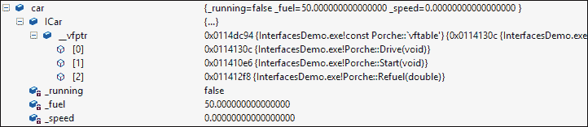

实例中的第一个字段是指向 v 表(`vptr`)的指针。 该 v 表保存指向特定`ICar`实现`Porche`上的实际实现的函数的指针。 在 v-table 指针之后，我们可以看到实现声明的成员变量。 但是使用接口指针，无法知道存在哪些成员变量(如果有)；这是一个不应该与客户端相关的实现细节。

让我们定义另一个接口：

```cpp
class ICarrier {
public:
  virtual int PlaceObject(double weight) = 0;
  virtual void RemoveObject(int objectID) = 0;
};
```

`Porche`类既要实现`ICarrier`，也要实现`ICar`。 以下是修订后的定义：

```cpp
class Porche : public ICar, public ICarrier {
```

我们将添加一些字段来管理挂载在汽车上的对象：

```cpp
double _totalWeight;
static int _runningID;
std::map<int, double> _objects; 
```

并实现来自`ICarrier`的两个方法(函数)：

```cpp
int PlaceObject(double weight) {
  if(_totalWeight + weight > 200)
    throw std::exception("too heavy");
  _totalWeight += weight;
  _objects.insert(std::make_pair(++ _runningID, weight));
  return _runningID;
}

void RemoveObject(int objectID) {
  auto obj = _objects.find(objectID);
  if(obj == _objects.end())
    throw new std::exception("object not found");
  _totalWeight -= obj->second;
  _objects.erase(obj);
}
```

此时，确切的实现本身并不重要，重要的是对象在内存中的布局：


`Porche`实例的前两个成员是指向`ICar`和`ICarrier`(按顺序)的 v 表指针，每个指针都指向函数指针的虚拟表。 只有在那时，才会放置实例成员变量。 下面的图表可能会更清楚地说明这一点：

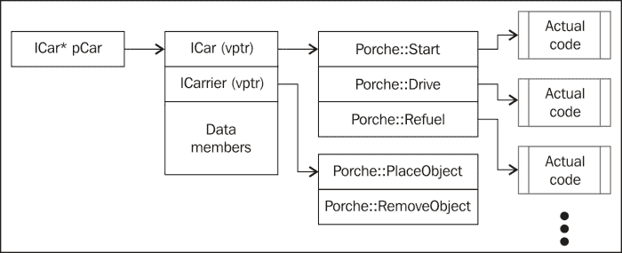

现在，假设一个客户端持有一个`ICar*`接口，并希望查看`ICarrier`是否由对象实现。 执行 C 样式的情况(或`reinterpret_cast<>`)只会使相同的指针值认为它指向另一个 v 表，但事实并非如此。 在本例中，调用`ICarrier::PlaceObject`实际上会调用`ICar::Start`，因为这是该 v 表中的第一个函数；并且函数是通过偏移量调用的。

我们需要的是使用`dynamic_cast<>`运算符动态查询是否支持另一个接口：

```cpp
cout << "pCar: " << pCar << endl;
ICarrier* pCarrier = dynamic_cast<ICarrier*>(pCar);
if(pCarrier) {
  // supported
  cout << "Placing object..." << endl;
  int id = pCarrier->PlaceObject(20);
  cout << "pCarrier: " << pCarrier << endl;
}
```

如果成功，`dynamic_cast`调整指向正确 v 表的指针。 在`Porche`的情况下，`pCarrier`的值应大于`pCar`指针大小(32 位进程中为 4 字节，64 位进程中为 8 字节)。 我们可以通过打印它们的值来验证这一点：


偏移量为 4，因为此代码编译为 32 位。

`dynamic_cast<>`的问题在于它是特定于 C++ 的。 其他语言会做什么来获得对象上的另一个接口？ 解决方案是将该功能考虑到每个界面中。 再加上引用计数，这就产生了 COM 世界中最基本的接口`IUnknown`。

## IUNKNOWN 接口

`IUnknown`接口是每个 COM 接口的基本接口。 它封装了两个功能：查询可能支持的其他接口和管理对象的引用计数。 它的定义如下：

```cpp
class IUnknown {
public:
  virtual HRESULT __stdcall QueryInterface(const IID& iid, 
      void **ppvObject) = 0;
  virtual ULONG __stdcall AddRef() = 0;
  virtual ULONG __stdcall Release() = 0;
};
```

`QueryInterface`允许根据接口 ID 获取另一个受支持的接口，该接口 ID 是一个**全局唯一标识符**(**GUID**)-一个 128 位的数字，由统计上保证唯一性的算法生成。 返回值`HRESULT`是 COM(和 WinRT)中的标准返回类型。 对于`QueryInterface`，`S_OK (0)`表示一切正常，请求的接口存在(并通过`ppvObject`参数间接返回)或`E_NOINTERFACE`，表示不支持此类接口。

### 备注

所有 COM/WinRT 接口方法都使用标准调用约定(`__stdcall`)，即被调用方负责清除调用堆栈上的参数(而不是调用方)。 这在 32 位世界中很重要，它有几个调用约定。 由于 COM 旨在用于跨技术访问，因此这是约定的一部分(在 x64 中只存在一个调用约定，因此这并不重要)。

`AddRef`递增对象的内部引用计数，`Release`递减它，如果计数达到零，则销毁对象。

### 备注

请记住，这只是一个接口，其他实现也是可能的。 例如，对于始终希望保留在内存中的对象(如单例)，`AddRef`和`Release`可能不执行任何操作。 然而，大多数对象都是按照描述的方式实现的。

任何 COM 接口都必须派生自`IUnknown`；这意味着每个 v 表至少有三个条目对应于`QueryInterface`、`AddRef`和`Release`(按该顺序)。

## IInspectable 接口

可以将 WinRT视为更好的 COM。 `IUnknown`接口的缺点之一是没有标准的方法来要求对象返回其支持的接口列表。 WinRT 定义了一个新的标准接口`IInspectable`(当然是从`IUnknown`派生的)，它提供此功能：

```cpp
class IInspectable : public IUnknown {
public:
  virtual HRESULT __stdcall GetIids(ULONG *iidCount, 
      IID **iids) = 0;
  virtual HRESULT __stdcall GetRuntimeClassName(
      HSTRING *className) = 0;
  virtual HRESULT __stdcall GetTrustLevel(
      TrustLevel *trustLevel) = 0;
};
```

最有趣的方法是`GetIids`，它返回对象支持的所有接口。 这是运行在 WinRT 之上的 JavaScript 引擎使用的，因为在 JavaScript 中缺少静态类型，但它通常对 C++ 客户端没有用处。

所有这一切的最终结果如下：

*   每个 WinRT 接口必须继承自`IInspectable`。 这意味着每个 v 表始终至少有六个条目对应于方法`QueryInterface`、`AddRef`、`Release`、`GetIids`、`GetRuntimeClassName`和`GetTrustLevel`(按该顺序)。
*   WinRT 类型至少实现`IInspectable`，但几乎总是实现至少另一个接口；否则，此对象将非常乏味。

下面的经典关系图描述了 WinRT 对象：

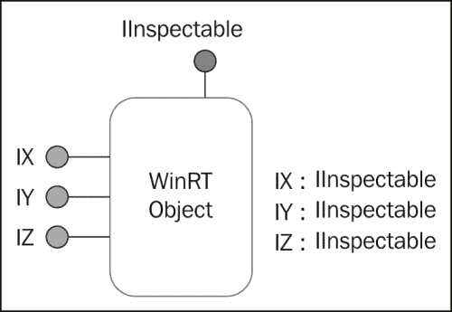

## 创建 WinRT 对象

正如我们已经看到的，COM/WinRT 客户端使用接口调用对象上的操作。 然而，到目前为止，有一件事是弄不清楚的，那就是那个物体是如何形成的？ 创建过程必须足够通用(而不是 C++ 特定的)，这样其他技术/语言才能使用它。

我们将构建一个简单的示例，创建驻留在`Windows::Globalization`名称空间中的 WinRT`Calendar`类的实例，并调用其中的一些方法。 为了消除所有可能的噪音，我们将在一个简单的 Win32 控制台应用程序(而不是 Windows 8 应用商店应用程序)中执行此操作，以便我们可以专注于细节。

### 备注

最后一句话还意味着 WinRT 类型(至少大部分)可以从桌面应用程序和商店应用程序访问和使用。 这开启了有趣的可能性。

我们需要使用一些新的 API，这些 API 是 Windows 运行时基础架构的一部分。 这些 API 以字母“Ro”(Runtime Object 的缩写)开头。 为此，我们需要一个特定的`#include`并链接到适当的库：

```cpp
#include <roapi.h>

#pragma comment(lib, "runtimeobject.lib")
```

现在，我们可以开始实现我们的主要功能了。 首先要做的是在当前线程上初始化 WinRT。 这是使用`RoInitialize`函数实现的：

```cpp
::RoInitialize(RO_INIT_MULTITHREADED);
```

`RoInitialize`需要指定线程的单元模型。 这可以是由`RO_INIT_SINGLETHREADED`表示的**单线程单元**(**STA**)或由`RO_INIT_MULTITHREADED`表示的**多线程单元**(**MTA**)。 公寓的概念将在稍后讨论，对于当前的讨论并不重要。

### 备注

`RoInitialize`在概念上类似于经典的 com`CoInitialize`(`Ex`)函数。 WinRT 公寓与经典的 COM 公寓大同小异。 事实上，由于 WinRT 是建立在 COM 基础之上的，所以大多数事情的工作方式都非常相似。 对象创建机制非常相似，但细节上有一些变化，我们很快就会看到。

要创建实际对象并取回接口指针，必须调用`RoActivateInstance`API 函数。 此函数的原型如下：

```cpp
HRESULT WINAPI RoActivateInstance(
  _In_   HSTRING activatableClassId,
  _Out_  IInspectable **instance
);
```

需要的第一个参数是类的全名，表示为`HSTRING`。 `HSTRING`是标准的 WinRT 字符串类型，表示 Unicode(UTF-16)字符的不可变数组。 有几个 WinRT API 可用于创建和操作`HSTRING`。 稍后我们将看到，C++/CX 提供了`Platform::String`类来包装`HSTRING`以便于使用。

`RoActivateInstance`的第二个参数是通过`IInspectable`接口指针表示的结果实例(回想一下，所有 WinRT 对象都必须支持此接口)。

### 备注

感兴趣的读者可能想知道为什么要创建新的字符串类型。 当然，微软领域已经有很多这样的代码：`std::string`/`wstring`(C++)、`CString`(atl/mfc)和`BSTR`(Com)。 `BSTR`似乎是最有可能的候选者，因为它不是特定于 C++ 的。 新的`HSTRING`是不可变的，这意味着它一旦创建就不能更改。 任何明显的修改都会创建一个新的`HSTRING`。 此属性使`HSTRING`线程更安全，更容易投射到其他平台，如.NET，其中`System.String`类也是不可变的，因此不存在不匹配。

要使用与`HSTRING`相关的 API，我们需要将`#include`添加到`<winstring.h>`。 现在，我们可以继续为`Calendar`类创建`HSTRING`：

```cpp
HSTRING hClassName;
wstring className(L"Windows.Globalization.Calendar");
HRESULT hr = ::WindowsCreateString(className.c_str(),
   className.size(), &hClassName);
```

`HSTRING`是用`WindowsCreateString`WinRT API 创建的，传递字符串文字及其长度(这里是在`std::wstring`的帮助下获取的)。 注意，类名包括它的完整名称空间，其中点(`.`)是分隔符(而不是 C++ 作用域解析操作符`::`)。

现在，我们可以调用`RoActivateInstance`(我在这些代码片段中省略了任何错误检查，这样我们就可以专注于要点)，并为 Calendar 返回一个接口。 因为这是`IInspectable`，所以不是很有趣。 我们需要为 Calendar 提供一个更具体的接口，也就是说，我们需要调用`QueryInterface`来获得一个更有趣的接口来使用。

`RoActivateInstance`做什么？ 该实例实际上是如何创建的？ 它在哪里实施？

该过程与经典的 COM 创建机制非常相似。 `RoActivateInstance`在`HKEY_LOCAL_MACHINE\Software\Microsoft\WindowsRuntime\ActiavatableClassId`处咨询注册表，并查找名为**Windows.Globalization.Calendar**的项。 以下是**RegEdit.exe**的屏幕截图：


### 备注

屏幕截图显示了 64 位密钥。 对于 32 位进程，密钥在`HKLM\Software\Wow6432Node\Windows\WindowsRuntime\ActivatableClassId`下。 这对进程是透明的，因为默认情况下，Registry API 会根据进程“Bitness”转到正确的位置。

类**名称**键中存在多个值。 最有趣的是：

*   **DllPath**-指示实现 DLL 所在的位置。 这个 DLL 被加载到调用进程地址空间中，我们稍后会看到这一点。
*   **CLSID**-类名的对应的 GUID。 这不像在经典 COM 中那样重要，因为 WinRT 实现是由完整的类名而不是 CLSID 标识的，这从`RoActivateInstance`的第一个参数中可以明显看出。
*   **ActivationType**-指示该类是在进程内激活(DLL，值为 0)还是在进程外激活(EXE，值为 1)。

在本讨论的其余部分中，我们将假定使用进程内类。 `RoActivateInstance`调用另一个函数`RoGetActivationFactory`，该函数执行定位注册表项并将 DLL 加载到进程地址空间的实际工作。 然后，它从名为`DllGetActivationFactory`的 DLL 调用一个导出的全局函数(DLL 必须导出这样的函数，否则创建过程将失败)，并传入完整的类名、请求的工厂接口 ID 和输出接口指针作为结果：

```cpp
HRESULT RoGetActivationFactory(
  _In_   HSTRING activatableClassId,
  _In_   REFIID iid,
  _Out_  void **factory
);
```

DLL 中的全局函数负责返回能够创建实际实例的类工厂。 类工厂通常使用单个方法(超出`IInspectable`)实现`IActivationFactory`接口：

```cpp
HRESULT ActivateInstance(IInspectable **instance);
```

返回类工厂是`RoGetActivationFactory`的工作。 然后`RoActivateInstance`接管，并调用`IActivationFactory::ActivateInstance`来创建实际实例，这是`RoActivateInstance`的结果。

### 备注

熟悉经典 COM 的读者可能会认识到其中的相似之处：`RoActivateInstance`代替经典的`CoCreateInstance`；`RoGetActivationFactory`代替`CoGetClassObject`；`DllGetActivationFactory`代替`DllGetClassObject`；最后，`IActivationFactory`代替`IClassFactory`。 不过，总体来说，这些步骤实际上是相同的。

下图总结了 WinRT 类型的创建过程：

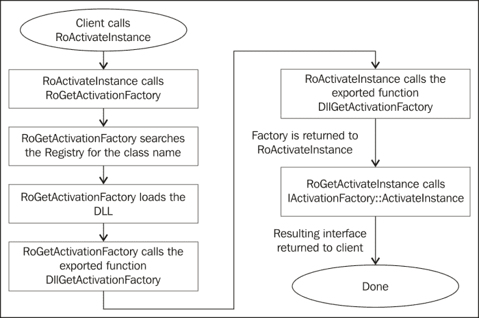

### 备注

此序列中使用的注册表项与创建 WinRT 对象的桌面应用程序相关。 商店应用程序激活使用的密钥不同，但一般顺序是相同的。

如果一切正常，我们就有一个指向 Calendar 实例的`IInspectable`接口指针。 但我们感兴趣的是一个更具体的界面，它可以提供 Calendar 的真正功能。

结果是，相关接口的定义在一个头文件中，该文件以放置 Calendar 的命名空间命名：

```cpp
#include <windows.globalization.h>
```

有问题的接口在`ABI::Windows::Globalization`命名空间中命名为`ICalendar`。 我们将添加一个`using`名称空间以便于访问：

```cpp
using namespace ABI::Windows::Globalization;
```

**应用程序二进制接口**(**ABI**)是一个根名称空间，我们将在后面的部分中讨论。

因为我们需要一个`ICalendar`，所以我们必须为此`QueryInterface`：

```cpp
ICalendar* pCalendar;
hr = pInst->QueryInterface(__uuidof(ICalendar), 
   (void**)&pCalendar);
```

假设`pInst`是对象(例如`IInspectable`)上的某个接口。 如果该接口确实受支持，我们将返回一个成功的`HRESULT`(`S_OK`)和一个可以使用的接口指针。 `__uuidof`运算符返回相关接口的**接口 ID**(**IID**)；这是可能的，因为声明的接口附加了`__declspec(uuid)`属性。

现在，我们可以以任何我们认为合适的方式使用该界面。 以下是获取当前时间并将其显示到控制台的一些行：

```cpp
pCalendar->SetToNow();
INT32 hour, minute, second;
pCalendar->get_Hour(&hour);
pCalendar->get_Minute(&minute);
pCalendar->get_Second(&second);

cout << "Time: " << setfill('0') << setw(2) << hour << ":" <<
   setw(2) << minute << ":" << setw(2) << second << endl;
```

此时，`Calendar`实例上的引用计数应为`2`。 要正确清理，我们需要对任何获取的接口指针调用`IUnknown::Release`(创建时，引用计数为`1`，在`QueryInterface`之后变为`2`)；此外，由于我们创建了一个`HSTRING`，销毁它是个好主意；最后，我们将在当前线程上取消初始化 WinRT：

```cpp
pCalendar->Release();
pInst->Release();
::WindowsDeleteString(hClassName);
```

完整的代码可以在`WinRTAccess1`项目中找到，这是本章可下载代码的一部分。

# WinRT 元数据

前面的示例使用`<windows.globalization.h>`头文件来发现`ICalendar`接口的声明，包括它的 IID。 然而，由于 COM/WinRT 应该提供语言/平台之间的互操作性，那么非 C++ 语言如何能够使用该头文件呢？

答案是其他语言不能使用该头文件；它特定于 C/C++。 我们需要的是一种“通用的头文件”，它基于定义良好的结构，因此可以在任何平台上使用。 这就是元数据文件的角色。

元数据文件的格式(扩展名为`.winmd`)基于为.NET 创建的元数据格式。这非常方便，因为该格式非常丰富，也为 WinRT 元数据提供了所有必要的成分。

### 备注

在传统 COM 中，此元数据存储在类型库中。 类型库格式没有.NET 元数据格式丰富，因此没有用于 WinRT。

WinRT 元数据文件驻留在`%System32%\WinMetadata`文件夹中，可以根据名称空间方便地排列它们(实际上，这是一项要求)。 这是我机器上的文件：

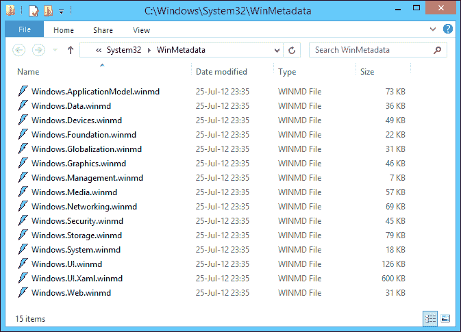

要查看元数据文件，我们可以使用任何能够显示.NET 元数据的(相对较新的)工具，，比如 Visual Studio2012 工具中的 IL 反汇编程序(`ILDasm.exe`)，或者反射器([http://www.reflector.net/](http://www.reflector.net/))。 在`ILDasm.exe`中打开`Windows.Globalization.winmd`会显示以下内容：


我们可以看到元数据文件中定义的所有类和接口。 展开`ICalendar`接口节点将显示其成员：

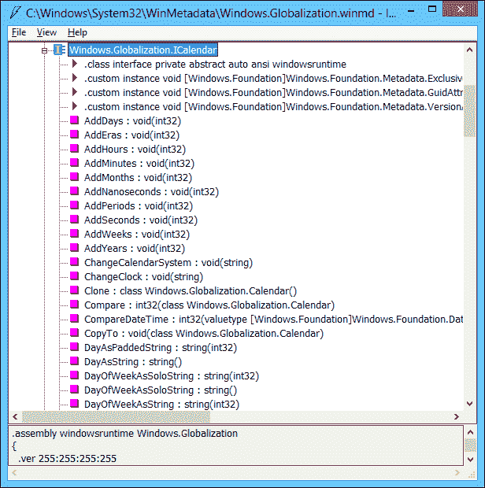

双击一个方法不会显示它的实现，因为它不是真正的.NET；那里没有代码，只是它的元数据格式。

那么`Calendar`类呢？ 展开它的节点可以看到它实现了`ICalendar`。 这使使用元数据的任何人(人和工具)都有信心`QueryInterface`获得成功的结果：

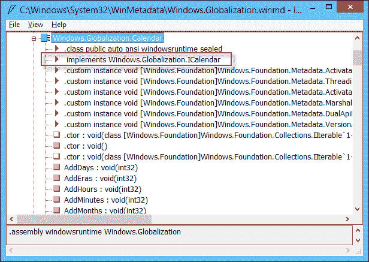

这些元数据文件是构建 WinRT 组件的结果。 这样，任何理解元数据格式的平台都可以使用该组件公开的类/接口。 我们将在本章后面看到一个示例。

# Windows 运行时库

Calendar Usage示例可以工作，但是所需的代码非常冗长。 **Windows Runtime Library**(**WRL**)是一组帮助器类和函数，可以更轻松地作为客户端和服务器(组件创建者)使用 WinRT 类型。 WRL 使用标准的 C++(没有非标准的扩展)，使程序非常接近实际。 让我们看看如何通过使用 WRL 来简化 Calendar 示例。

首先，我们需要包括 WRL 标头；有一个主标头和一个帮助器，带有一些方便的包装器：

```cpp
#include <wrl.h>
#include <wrl/wrappers/corewrappers.h>
```

接下来，我们将添加一些`using`语句来缩短代码：

```cpp
using namespace Windows::Foundation;
using namespace Microsoft::WRL;
using namespace Microsoft::WRL::Wrappers;
```

在`main()`中，我们首先需要初始化 WinRT。 一个简单的包装器在其构造函数中调用`RoInitialize`，在其析构函数中调用`RoUninitialize`：

```cpp
RoInitializeWrapper init(RO_INIT_MULTITHREADED);
```

要创建和管理`HSTRING`，我们可以使用助手类`HString`：

```cpp
HString hClassName;
hClassName.Set(RuntimeClass_Windows_Globalization_Calendar);
```

长标识符是`<windows.globalization.h>`中定义的完整 Calendar 类名，因此我们不必提供实际的字符串。 `HString`有一个返回底层`HSTRING`的`Get()`成员函数；它的析构函数销毁`HSTRING`。

### 备注

使用引用现有字符串的`HSTRING`实际上可以简化(并加快)前面的代码，从而防止实际的字符串分配和复制。 这是通过内部调用`WindowsCreateStringReference`的`HString::MakeReference`静态函数完成的。 它有效地消除了销毁`HSTRING`的需要，因为从一开始就没有分配任何东西。 此字符串引用也称为“快速传递”。

通过调用内部调用`RoActivateInstance`并查询所请求接口的`Windows::Foundation::ActivateInstance`模板函数，可以简化`Calendar`实例的创建：

```cpp
ComPtr<ICalendar> spCalendar;
HRESULT hr = ActivateInstance(hClassName.Get(), &spCalendar);
```

`ComPtr<T>`是 WRL 用于 WinRT 接口的智能指针。 它在析构函数中正确调用`Release`，并提供必要的运算符(如`->`)，以便在访问底层接口指针时足够不可见。 代码的其余部分基本相同，尽管不需要清理，因为析构函数做的是正确的事情：

```cpp
spCalendar->SetToNow();
INT32 hour, minute, second;
spCalendar->get_Hour(&hour);
spCalendar->get_Minute(&minute);
spCalendar->get_Second(&second);

cout << "Time: " << setfill('0') << setw(2) << hour << ":" << 
   setw(2) << minute << ":" << setw(2) << second << endl;
```

WRL 还提供了类，这些类通过实现样板代码(如`IInspectable`、激活工厂等)来帮助实现 WinRT 组件。 我们通常使用 C++/CX 来创建组件，但如果需要低级控制或不需要语言扩展，则可以使用 WRL。

### 备注

Visual Studio 2012 没有默认安装的项目模板来使用 WRL 创建 WinRT 组件；但是，这样的模板是由 Microsoft 创建的，可以在调用**Tools**|**Extensions and Updates**菜单项时通过联机搜索获得。 这为创建 WinRT DLL 组件提供了一个不错的起点。 所涉及的步骤与使用 ATL 在**接口定义语言**(**IDL**)文件中定义接口和成员并实现所需功能所用的步骤有点类似。

# C++/CX

WRL 简化了使用和访问 WinRT 对象，但在创建和使用对象时，它仍然是摆脱普通 C++ 体验的一种方式。 调用`new`运算符要比使用`Windows::Foundation::ActivateInstance`和使用`ComPtr<T>`智能指针容易得多。

为此，Microsoft 为 C++ 语言创建了一组扩展，称为 C++/CX，它们有助于弥合这一差距，因此使用 WinRT 对象几乎与使用非 WinRT 对象一样简单。

以下各节讨论一些更常见的扩展。 我们将在整本书中讨论更多扩展。 首先，我们将介绍如何创建对象，然后，我们将研究各种成员以及如何访问它们，最后，我们将考虑使用 C++/CX 创建新的 WinRT 类型的基础知识。

## 创建和管理对象

WinRT 对象在 C++/CX 中由关键字`ref new`实例化。 这将创建一个引用计数对象(WinRT 对象)，并使用`^`(HAT)表示法返回该对象的句柄。 下面是创建`Calendar`对象的示例：

```cpp
using namespace Windows::Globalization;
Calendar^ cal = ref new Calendar;
```

`cal`中的返回值是 WinRT 对象。 有一件事可能令人费解，那就是我们得到的是一个`Calendar`对象，而不是一个接口；但是 COM/WinRT 客户端只能使用接口；我们以前使用的`ICalendar`在哪里？

C++/CX 提供了一个方便的层，允许使用对象引用而不是接口引用。 但是，接口`ICalendar`仍然存在，实际上它被定义为`Calendar`类的默认接口(编译器知道这一点)，但是直接使用该类似乎更自然。 我们可以通过添加方法调用并在向`ICalendar`添加特定强制转换并将其与原始调用进行比较之后查看生成的代码来验证这一点：

```cpp
Calendar^ cal = ref new Calendar;
cal->SetToNow();

ICalendar^ ical = cal;
ical->SetToNow();
```

以下是为这些调用生成的代码：

```cpp
  cal->SetToNow();
00A420D0  mov         eax,dword ptr [cal] 
00A420D3  push        eax 
00A420D4  call        Windows::Globalization::ICalendar::SetToNow (0A37266h) 
00A420D9  add         esp,4  

  ICalendar^ ical = cal;
00A420DC  mov         eax,dword ptr [cal]  
00A420DF  push        eax  
00A420E0  call        __abi_winrt_ptr_ctor (0A33094h)  
00A420E5  add         esp,4  
00A420E8  mov         dword ptr [ical],eax  
00A420EB  mov         byte ptr [ebp-4],0Ah  
  ical->SetToNow();
00A420EF  mov         eax,dword ptr [ical] 
00A420F2  push        eax 
00A420F3  call        Windows::Globalization::ICalendar::SetToNow (0A37266h) 

```

突出显示的部分相同，证明实际调用通过接口。

### 备注

熟悉 C++/CLI(.NET 的 C++ 扩展)的读者可能会认出“hat”(^)和其他一些类似的关键字。 这只是从 C++/CLI 借用的语法，但与.NET 无关。所有 WinRT 内容都是纯本机代码，无论它是否使用 C++/CX 访问。

当 HAT 变量超出作用域时，会按预期自动调用`IUnknown::Release`。 还可以对 WinRT 类型使用堆栈语义，如下所示：

```cpp
Calendar c1;
c1.SetToNow();
```

该对象仍然以通常的方式动态分配。 但当变量超出作用域时，它肯定会被清除。 这意味着它不能传递给其他方法。

## 访问成员

获得对 WinRT 对象(或接口)的引用后，可以使用箭头(`->`)操作符访问成员，就像常规指针一样。 但是，请注意，HAT 不是正常意义上的指针；例如，任何指针算法都是不可能的。 应该将 HAT 变量视为对 WinRT 对象的不透明引用。

通过引用访问成员与通过直接(或类似于 WRL 的)接口指针访问对象并不完全相同。 主要区别在于错误处理。 所有接口成员都必须返回`HRESULT`；通过 HAT 引用调用会隐藏`HRESULT`，而是在失败时抛出异常(从`Platform::Exception`派生)。 这通常是我们想要的，这样我们就可以使用标准语言工具`try`/`catch`来处理错误，而不必检查每个调用的`HRESULT`。

如果方法有返回值，则会出现另一个不同之处。 实际的接口方法必须返回一个`HRESULT`，因此添加了一个输出参数(必须是一个指针)，在其中存储成功的结果。 因为 HAT 引用隐藏了`HRESULT`，所以它们使返回类型成为方法调用的实际返回值，这非常方便。 以下是使用`ICalendar::Compare`方法将此日历的日期/时间与另一个日历的日期/时间进行比较的示例。使用 WRL 创建第二个日历并进行比较，如下所示：

```cpp
ComPtr<ICalendar> spCal2;
ActivateInstance(hClassName.Get(), &spCal2);
spCal2->SetToNow();
spCal2->AddMinutes(5);

int result;
hr = spCalendar->Compare(spCal2.Get(), &result);
```

结果是通过将目标变量作为最后一个参数传递给`Compare`调用来获得的。 以下是等效的 C++/CX 版本：

```cpp
auto cal2 = ref new Calendar;
cal2->SetToNow();
cal2->AddMinutes(5);
int result = cal->Compare(cal2);
```

找不到`HRESULT`，实际结果直接从方法调用返回。 如果发生错误，则会抛出`Platform::Exception`(或派生函数)。

### 备注

那么静态方法或属性呢？ 这些都存在，并且可以通过熟悉的`ClassName::MemberName`语法访问。 好奇的读者可能想知道这些是如何实现的，因为 COM 没有静态成员的概念，所有东西都必须通过接口指针访问，这意味着必须存在一个实例。 选择的解决方案是在激活工厂(类工厂)上实现静态成员，因为它通常是单例的，有效地提供相同的净结果。

### 方法和属性

WinRT 正在努力实现面向对象，至少在成员方面是这样。 方法是成员函数，在 C++ 中按预期调用。 这是前面显示的`ICalendar::SetToNow()`、`ICalendar::AddMinutes()`和`ICalendar::Compare()`、的情况。

WinRT还定义了属性的概念，这些属性实际上是变相的方法。 属性可以有 getter 和/或 setter。 由于 C++ 没有属性的概念，因此这些属性被建模为以`get_`或`put_`开头的方法，而 C++/CX 为方便起见提供了对属性的类似字段的访问。

下面是一个使用在`ICalendar`上定义的`Hour`属性的示例。 首先，WRL 版本：

```cpp
// read current hour
INT32 hour;
spCalendar->get_Hour(&hour);
// set a new hour
spCalendar->put_Hour(23);
```

接下来是 C++/CX 版本：

```cpp
int hour = cal->Hour;  // get
cal->Hour = 23;    // set
```

属性的存在可以在元数据文件中看到，在本例中为`Windows.Globalization.winmd`。 查看`Calendar`类(或`ICalendar`接口)，红色三角形表示属性。 双击其中任何一个都会显示以下内容：


如果需要的话，可以(使用 C++/CX)访问实际的方法或属性，而不需要将失败的`HRESULT`映射到异常的抽象层(这更快，相当于 WRL 生成的代码)。 这是通过调用前缀为`__abi_`的成员来实现的，如下面的代码片段所示：

```cpp
cal->__abi_SetToNow();
int r;
cal->__abi_Compare(cal2, &r);
cal->__abi_set_Hour(22);
```

所有这些成员都返回`HRESULT`，因为这些是通过接口指针的实际调用。 奇怪的是，属性设置器的前缀必须是`set_`，而不是`put_`。 此方案还提供了调用`IInspectable`方法(如`GetIids`)的方法，否则无法通过 HAT 引用访问这些方法。

### 备注

目前，这些调用没有`Intellisense`，因此编辑器中将显示红色曲线条。 不过，代码可以按预期进行编译和运行。

### 代表

委托相当于函数指针的 WinRT。 委托是一种可以指向方法的字段。 与函数指针相反，委托可以根据需要指向静态方法或实例方法。 委托具有接受方法或 lambda 函数的内置构造函数。

### 备注

之所以使用术语“委托”，是因为它与.NET 世界中的同一概念相似，在.NET 世界中，委托的作用与它们在 WinRT 中的作用大致相同。

下面是一个带有`IAsyncOperation<T>`接口的示例，我们将在讨论异步操作时对其进行讨论。 给定一个`IAsyncOperation<T>`(`T`是期望从操作返回的类型)，它的`Completed`属性是类型`AsyncOperationCompletedHandler<T>`，这是一个委托类型。 我们可以将`Completed`属性连接到当前实例的成员函数，如下所示：

```cpp
IAsyncOperation<String^>^ operation = ...;
operation->Completed = ref new
   AsyncOperationCompletedHandler<String^>(this, &App::MyHandler);
```

其中`App::MyHandler`的原型如下：

```cpp
void MyHandler(IAsyncOperation<String^>^ operation, 
   AsyncStatus status);
```

为什么是这个原型？ 这正是委托定义的东西：必须遵循某个原型，否则编译器会抱怨。

作为命名方法的替代方法，我们可以将委托绑定到 lambda 函数，这在许多情况下更方便。 下面是与前面的代码等效的 lambda：

```cpp
operation->Completed = ref new AsyncOperationCompletedHandler<String^>(
   [](IAsyncOperation<String^>^ operation, AsyncStatus status) {
    // do something...
  });
```

示例没有捕获任何变量。 这里的关键点是 lambda 的参数与命名方法的参数完全相同。

代表到底是什么？ 它是一个 WinRT 类，与任何其他类一样，它有一个特殊的构造函数，允许绑定到一个方法(名为或 lambda)和一个`Invoke`方法，该方法实际执行委托。 在 C++/CX 中，调用可以由函数调用操作符`()`执行，就像任何函数一样。 假设前面的声明，我们可以通过以下方式之一调用`Completed`委托：

```cpp
operation->Completed->Invoke(operation, AsyncStatus::Completed);
operation->Completed(operation, AsyncStatus::Completed);
```

这两条线是相等的。

### 备注

从技术上讲，前面的代码在语法上是正确的，但是我们自己永远不会调用异步操作完成。 操作的所有者将执行调用(我们将在本章后面介绍异步操作)。

### 事件

委托通常不会像在`IAsyncOperation<T>::Completed`属性中那样声明为属性。 这有两个原因：

*   任何人都可以将`nullptr`放在该属性(或某个其他委托)中，丢弃之前可能已设置的任何委托实例
*   任何人都可以调用委托，这很奇怪，因为只有声明类知道何时应该调用委托

我们想要的是一种使用委托连接到感兴趣的方法的方法，但这样做是安全的，不允许任意代码直接更改委托或调用它。

这就是事件的用武之地。 事件看起来像一个委托，但实际上它有两个方法，一个用于注册事件的处理程序，另一个用于撤销处理程序。 在 C++/CX 中，`+=`和`-=`操作符处理事件，因此客户端可以注册通知，但永远不能使用赋值操作符来取消或替换委托的值，因为它不会以这种方式公开。

下面是一个使用`Application::Suspending`事件的示例，该事件向相关方表明应用程序即将挂起，这是保存状态的好时机(我们将在[第 7 章](07.html "Chapter 7. Applications, Tiles, Tasks, and Notifications")、*应用程序、磁贴、任务和通知*中讨论应用程序生命周期)：

```cpp
this->Suspending += ref new SuspendingEventHandler(
   this, &App::OnSuspending);
```

请注意，`SuspendingEventHandler`是委托类型，这意味着方法`OnSuspending`必须按照该委托定义的某种方式进行原型化。

在幕后，事件只是一对适当实现的方法(Visual Studio IntelliSense 用闪电般的图标显示事件)。 下面是通过元数据描述的`Application::Suspending`事件(也显示了其他事件)，如`ILDasm.exe`所示：


绿色倒三角形表示事件成员本身，而`add_Suspending`和`remove_Suspending`是使用`+=`和`-=`C++/CX 运算符时调用的实际方法。

## 定义类型和成员

可以使用 WRL 定义 WinRT 类型(通过在 IDL 文件中定义接口、实现所有样板代码，如`IUnknown`和`IInspectable`实现、激活工厂、DLL 全局函数等)。 这提供了一种非常细粒度的方法来创建组件，并且在本质上类似于使用**活动模板库**(**ATL**)创作 COM 组件的方式。

使用 C++/CX 创作可重用 WinRT 组件比使用 WRL 容易得多。 在本节中，我们将构建一个简单的组件，并将其与 C++ 和 C#客户端一起使用(JavaScript 客户端也同样有效，并将其作为练习留给感兴趣的读者)。

### WinRT 组件项目

Visual Studio 2012包含一个项目模板，用于创建WinRT 组件，然后任何符合 WinRT 的平台(或其他 WinRT 组件)都可以使用该组件。 我们将创建一个类型为**Windows Runtime Component**的新项目，名为`Calculations`：

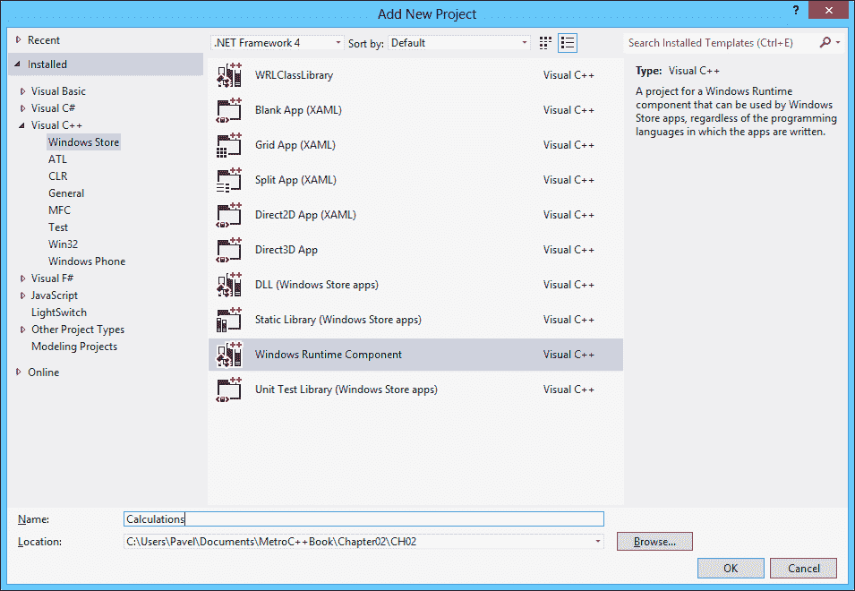

向导将添加`Class1`类。 我们可以删除它并添加一个新的 C++ 类，或者重命名文件和类名。 我们将创建一个名为`Calculator`的 WinRT 类，该类在头文件中使用以下代码定义：

```cpp
namespace Calculations {
  public ref class Calculator sealed {
  public:
     Calculator(void);

  };
}
```

WinRT 类必须在命名空间内由`ref class`关键字定义。 它还必须声明为`public`，以便可以在组件 DLL 之外使用。 该类还必须标记为`sealed`，这意味着它不能从继承；或者，它可以从非密封类继承，非密封类目前是由驻留在`Windows::UI::Xaml`命名空间中的 WinRT 库提供的类。 关于 WinRT 继承的详细讨论超出了本节的范围。

现在，是时候给课堂上一些有用的内容了。

### 添加属性和方法

`Calculator`类的思想是作为累加计算器。 它应该保存当前结果(默认情况下从零开始)，并在执行新的数学运算时修改结果。 在任何时候，都可以得到它当前的结果。

方法是作为常规成员函数添加的，包括构造函数。 让我们添加一个构造函数和几个操作(在类的`public`部分内)：

```cpp
// ctor
Calculator(double initial);
Calculator();

// operations
void Add(double value);
void Subtract(double value);
void Multiply(double value);
void Divide(double value);

void Reset(double value);
void Reset();
```

我们需要一个只读属性来传达当前结果。 下面是如何定义它的：

```cpp
property double Result {
  double get();
}
```

`property`关键字是定义属性的 C++/CX 扩展，后跟属性的类型和名称。 在大括号内，可以声明`get()`和`set()`方法(`set`必须接受具有正确类型的值)。 缺少`set()`方法表明这是一个只读属性-将创建`get_Result`方法，但不会创建`put_Result`方法。

### 备注

通过在属性名后面加一个分号(根本没有大括号)，可以添加一个由私有字段支持的简单读/写属性。

接下来，我们添加保持适当状态所需的任何个成员；在这个简单的例子中，它就是当前的结果：

```cpp
private:
  double _result;
```

在 cpp 文件中，我们需要实现所有这些成员，以避免**个未解析的外部链接器**个错误：

```cpp
#include "Calculator.h"

using namespace Calculations;

Calculator::Calculator(double initial) : _result(initial) {
}

Calculator::Calculator() : _result(0) {
}

void Calculator::Add(double value) {
  _result += value;
}

void Calculator::Subtract(double value) {
  _result -= value;
}

void Calculator::Multiply(double value) {
  _result *= value;
}

void Calculator::Divide(double value) {
  _result /= value;
}

void Calculator::Reset() {
  _result = 0.0;
}

void Calculator::Reset(double value) {
  _result = value;
}

double Calculator::Result::get() {
  return _result;
}
```

该代码中没有特殊之处，可能除了用于实现`Result`属性的语法之外。

由于这是一个WinRT 组件，因此将在构建过程中创建一个元数据(`.winmd`)文件；该文件将用于使用该组件。 使用`ILDasm.exe`打开它会显示刚刚编写的代码的结果：


这里有几个有趣的观点。 因为我们已经编写了 WinRT 类，所以它必须实现接口，因为 WinRT/COM 客户端只能使用接口。 在`Calendar`示例中，接口被命名为`ICalendar`(这是它的默认接口)，但是在这里我们没有指定任何这样的接口。 编译器自动创建了这样一个接口，并将其命名为`__ICalculatorPublicNonVirtuals`。 这是定义所有方法和属性的实际接口。 特殊的名称暗示这些方法通常只能从对`Calculator`对象的引用中调用；在任何情况下，接口名称都不重要。

### 备注

显然，`Calendar`类不是用 C++/CX 创建的，因为它的默认接口名为`ICalendar`。 事实上，它是使用 WRL 创建的，WRL 允许完全控制组件创作的各个方面，包括接口名称；WRL 用于构建所有 Microsoft 提供的 WinRT 类型。

另一个有趣的问题与重载的构造函数有关。 由于提供了一个非默认构造函数，默认创建接口`IActivationFactory`是不够的，因此编译器使用接受双精度值的`CreateInstance`方法创建了第二个接口`ICalculatorFactory`。 这是使 C++/CX 易于使用的另一个特性-因为负担在编译器身上。

### 添加事件

为了使更有趣，让我们添加一个在试图除以零时触发的事件。 首先，我们需要声明一个适合该事件的委托，或者使用 WinRT 中已定义的委托之一。

出于演示的目的，我们将定义一个自己的委托来展示如何使用 C++/CX 完成它。 我们将以下声明添加到`Calculations`命名空间声明内的`Calculator`定义的正上方：

```cpp
ref class Calculator;

public delegate void DivideByZeroHandler(Calculator^ sender);
```

向前声明是必要的，因为编译器还没有偶然发现`Calculator`类。

委托指示它可以绑定到接受`Calculator`实例的任何方法。 我们应该如何处理这个代表声明？ 我们将添加一个客户端可以注册的事件。 下面的声明被添加到类的`public`部分中：

```cpp
event DivideByZeroHandler^ DivideByZero;
```

这将以尽可能简单的方式声明事件-编译器相应地实现了`add_DivideByZero`和`remove_DivideByZero`方法。

现在，我们需要更新`Divide`方法的实现，以便在传入的值为零的情况下触发事件：

```cpp
void Calculator::Divide(double value) {
  if(value == 0.0)
    DivideByZero(this);
  else
    _result /= value;
}
```

调用事件将调用该事件的所有注册观察器(客户端)，并将其本身作为参数传递(该参数可能对客户端有用，也可能对客户端无用)。

## 使用 WinRT 组件

现在是使用我们刚刚创建的`Calculator`类的时候了。 我们将构建两个客户端，一个 C++ 客户端和一个 C#客户端，只是为了显示不同之处。

### 构建 C++ 客户端

我们将在同一解决方案中创建一个空白 C++ Store 应用程序项目，并用 XAML 构建一个简单的用户界面来测试计算器的功能。 用户界面细节对于本章的讨论并不重要；完整的代码可以在`CalcClient1`项目中找到，该项目可以在本章的可下载代码中找到。 用户界面如下所示：


要获得`Calculator`的定义，我们需要添加对元数据文件的引用。 通过右键单击项目节点并选择**References…，可以访问。** 。 在显示的对话框中，我们选择**计算**项目：

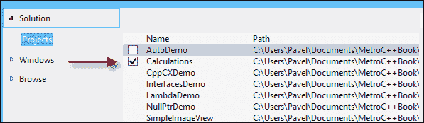

既然定义已经可用，我们就可以使用它们了。 在`MainPage.xaml.h`中，我们添加了对`Calculator`对象的引用，以便它在页面的生命周期内存在：

```cpp
private:
  Calculations::Calculator^ _calculator;
```

在`MainPage`构造函数中，我们需要实际创建实例并可选地连接到`DivideByZero`事件(我们这样做了)：

```cpp
_calculator = ref new Calculator;
_calculator->DivideByZero += ref new DivideByZeroHandler([this](Calculator^ sender) {
  _error->Text = "Cannot divide by zero";
});
```

`_error`是 UI 中的`TextBlock`元素，它显示最后一个错误(如果有)。 还添加了`Calculations`的`using namespace`，以便可以编译前面的代码。

单击**Calculate**按钮时，我们需要根据托管可用操作的列表框中当前选择的索引执行实际操作：

```cpp
_error->Text = "";
wstringstream ss(_value->Text->Data());
double value;
ss >> value;
switch(_operationList->SelectedIndex) {
case 0:
	_calculator->Add(value); break;
case 1:
	_calculator->Subtract(value); break;
case 2:
	_calculator->Multiply(value); break;
case 3:
	_calculator->Divide(value); break;
}
// update result
_result->Text = _calculator->Result.ToString();
```

为了编译此代码，为`std`添加了`using``namespace`语句，为`<sstream>`添加了`#include`语句。

就这样。 我们已经使用了 WinRT 组件。 从技术上讲，没有简单的方法可以知道那是用什么语言写的。 唯一重要的是它是一个 WinRT 组件。

### 构建 C#客户端

让我们看看它是如何与另一个客户端-用 C#编写的 Store 应用程序一起工作的。 首先，我们将创建一个空白的 C#Store 应用程序(名为`CalcClient2`)，并将 XAML 原样从 C++ 客户端项目复制到 C#项目。

接下来，我们需要添加对`winmd`文件的引用。 右键单击项目节点，然后选择**Add Reference…。** 或右键单击**References**节点并选择**Add Reference…。** 。 出现一个类似的对话框，允许选择`Calculations`项目(如果是不同的解决方案，也可以浏览文件系统查找该文件)。

使用`Calculator`所需的实际代码类似于 C++ 情况，具有 C#(和.NET)的语法和语义。 在`MainPage.xaml.cs`中，我们创建一个`Calculator`对象并注册`DivideByZero`事件(使用 C#lambda 表达式)：

```cpp
Calculator _calculator;

public MainPage() {
  this.InitializeComponent();
  _calculator = new Calculator();
  _calculator.DivideByZero += calc => {
    _error.Text = "Cannot divide by zero";
  };
}
```

### 备注

在 C#中，无需指定确切的类型即可编写 lambda 表达式(如前面的代码片段所示)；编译器自己推断类型(因为委托类型是已知的)。 可以(并且合法)像`_calculator.DivideByZero += (Calculator calc) => { … };`那样显式编写该类型。

在文件顶部添加了`using``Calculations`语句。 该按钮的单击事件处理程序非常简单明了：

```cpp
_error.Text = String.Empty;
double value = double.Parse(_value.Text);
switch (_operationList.SelectedIndex) {
  case 0:
    _calculator.Add(value); break;
  case 1:
    _calculator.Subtract(value); break;
  case 2:
    _calculator.Multiply(value); break;
  case 3:
    _calculator.Divide(value); break;
}
// update result
_result.Text = _calculator.Result.ToString();
```

请注意，访问计算器的 C#代码与 C++ 版本的非常相似。

# 应用程序二进制接口

上一节中创建的`Calculator`WinRT类留下了一些问题。 假设将以下方法添加到类的公共部分：

```cpp
std::wstring GetResultAsString();
```

编译器将拒绝编译此方法。 原因与`std::wstring`的使用有关。 它是 C++ 类型-如何将其映射到 C#或 JavaScript？ 不能。公共成员只能使用 WinRT 类型。 内部 C++ 实现和面向公众的类型之间存在边界。 定义有问题的方法的正确方法是：

```cpp
Platform::String^ GetResultAsString();
```

`Platform::String`是`HSTRING`WinRT 上的 C++/CX 包装器，它在那个世界中被投影为`System.String`到 C#和 JavaScript`string`。

WinRT 类中的私有成员可以是任何类型，而且通常是本机 C++ 类型(如`wstring`、`vector<>`和任何其他可能从旧代码迁移而来的类型)。

简单类型(如`int`和`double`)在 C++ 和 WinRT 之间自动映射。 **应用程序二进制接口**(**ABI**)是 WinRT 类型(可在组件外部使用)和特定于该语言/技术的本机类型(不仅对 C++，而且对 C#也是如此)之间的边界。

# 异步操作

Windows8 商店应用程序承诺“快速、流畅”。 这个表达有几种含义，其中一些与用户体验和用户界面设计(这里我们不会关心)有关，另一些与应用程序响应有关。

从 Windows 操作系统的第一个版本开始，用户界面就是由应用程序中的单个线程处理的。 从技术上讲，一个线程可以创建任意数量的窗口，并且该线程成为这些窗口的所有者，并且是唯一可以处理针对这些窗口的消息的线程(通过消息队列)。 如果该线程变得非常繁忙，并且处理消息的速度不够快，则 UI 的响应速度会变慢；在极端情况下，如果线程停滞几秒钟或更长时间(无论是什么原因)，UI 将完全没有响应。 这种情况是相当熟悉的，也是非常不受欢迎的。 下图说明了 UI 处理中涉及的实体：

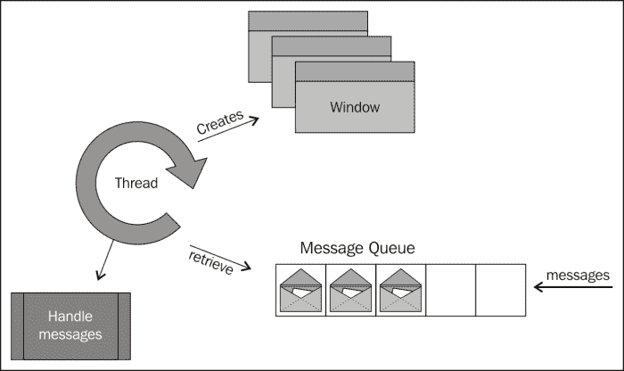

响应的关键是尽快释放 UI 线程，并且决不会阻塞它超过几毫秒。 在桌面应用程序的世界中，没有什么可以阻止开发人员调用一些长时间运行的操作(或一些长时间的 I/O 操作)，从而阻止线程返回其发送消息的活动，冻结用户界面。

在 WinRT 中，微软做出了一个有意识的决定，如果一个操作的时间可能超过 50 毫秒，那么它应该是异步的，而不是同步的。 最终结果是许多方法是异步执行的，这可能会使代码变得复杂。 异步表示操作开始，但调用几乎立即返回。 操作完成后，会调用一些回调，以便应用程序可以采取进一步的步骤。 不过，在两者之间，UI 线程没有做任何特殊的事情，因此可以像往常一样发送消息，从而保持 UI 的响应性。 同步调用和异步调用的区别如下图所示：

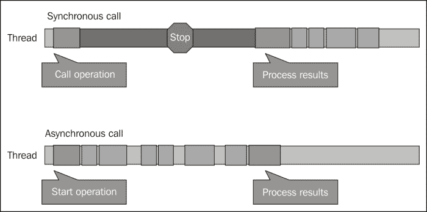

异步操作虽然是可取的，但从定义上来说要复杂得多。 代码不再是连续的。 WinRT 定义了一些表示正在进行的操作的接口。 这些接口从启动操作的各种异步方法返回，并允许客户端在操作完成时进行注册。

让我们看看异步操作的示例以及如何处理它们。 我们将创建一个简单的图像查看器应用程序，允许用户浏览并显示图像(完整的源代码位于本章下载的`SimpleImageView`项目中)。 用户界面目前并不重要，它由一个启动用户选择过程的按钮和一个可以显示图像的`Image`元素组成。 单击按钮时，我们希望为用户提供一种选择图像文件的方法，然后将文件转换为`Image`元素可以显示的内容。

用于选择文件的 WinRT 类是`Windows::Storage::Pickers::FileOpenPicker`。 我们将创建一个实例并设置一些属性：

```cpp
auto picker = ref new FileOpenPicker;
picker->FileTypeFilter->Append(".jpg");
picker->FileTypeFilter->Append(".png");
picker->ViewMode = PickerViewMode::Thumbnail;
```

### 备注

熟悉桌面应用程序世界的读者可能想知道常见的打开文件对话框在哪里，它可以通过 Win32API 或其他包装器获得。 由于几个原因，该对话框不能在商店应用程序中使用。 首先是美感；与 Windows8 应用商店应用程序试图传达的现代用户界面相比，对话框很难看。 其次，对话框有标题栏和其他类似的铬元素，因此不适合新世界。 第三(最重要的)，`FileOpenPicker`不仅仅是从文件系统中选择文件。 它实际上与 File Open Picker 契约一起工作，(例如)通过摄像头(如果附加了一个)来实现，所以我们实际上可以拍摄一张照片，然后选择它；对于其他来源也是如此，比如 SkyDrive、Facebook 等等。 常见的打开文件对话框没有这样的功能。

现在，是显示选取器并允许用户选择某些内容的时候了。 查看`FileOpenPicker`API，我们发现了`PickSingleFileAsync`方法。 `Async`后缀是 WinRT API 中用来指示启动异步操作的方法的约定。 选择一个文件的结果应该是`Windows::Storage::StorageFile`的一个实例，但是它返回一个`IAsyncOperation<StorageFile^>`，这是一个表示长时间运行的操作的对象。

解决此问题的一种方法是将`Completed`属性(委托)设置为将在操作完成时调用的处理程序方法(这可以是 lambda 函数)。 当调用该函数时，我们可以调用`IAsyncOperation<T>::GetResults()`来获得实际的`StorageFile`对象：

```cpp
auto fileOperation = picker->PickSingleFileAsync();
fileOperation->Completed = ref new 
   AsyncOperationCompletedHandler<StorageFile^>(
[this](IAsyncOperation<StorageFile^>^ op, AsyncStatus status) {
  auto file = op->GetResults();
  });
```

不幸的是，这并不是事情的结束。 一旦文件可用，我们需要打开它，将其数据转换为 WinRT 流接口，然后将其提供给可呈现为`Image`元素的`BitmapImage`对象。

事实证明，打开`StorageFile`也是一个异步操作(请记住，该文件可以来自任何地方，例如 SkyDrive 或网络共享)。 在获得文件后，我们重复相同的序列：

```cpp
using namespace Windows::UI::Core;
auto openOperation = file->OpenReadAsync();
openOperation->Completed = ref new AsyncOperationCompletedHandler<IRandomAccessStreamWithContentType^>(
  [this](IAsyncOperation<IRandomAccessStreamWithContentType^>^
    op, AsyncStatus status) {
    auto bmp = ref new BitmapImage;
    bmp->SetSource(op->GetResults());
    _image->Source = bmp;
});
```

`_image`是应该使用其`Source`属性显示结果图像的`Image`元素。

这几乎行得通。 “几乎”这一部分有点微妙。 前一个 lambda 由与发起调用的线程不同的线程调用。 UI 线程启动了它，但它在后台线程上返回。 从后台线程访问 UI 元素(如`Image`元素)会引发异常。 我们怎么才能解决这个问题呢？

对于 UI，我们可以使用绑定到特定线程的`Dispatcher`对象，并要求它在 UI 线程上执行一些代码(通常指定为 lambda)：

```cpp
Dispatcher->RunAsync(CoreDispatcherPriority::Normal, 
   ref new DispatchedHandler([op, this]() {
    auto bmp = ref new BitmapImage;
    bmp->SetSource(op->GetResults());
    _image->Source = bmp;
  }));
```

`Dispatcher`是`this`(或任何 UI 元素)的属性，它在可能的情况下发布要由 UI 线程执行的操作(通常几乎是立即的，假设 UI 线程没有被阻塞，这是我们非常努力避免的)。

整个过程并不容易，将`Dispatcher`添加到混合中会使事情进一步复杂化。 幸运的是，有一种处理异步操作的更简单的方法-使用`task<T>`类。

## 将任务用于异步操作

`task<T>`类驻留在并发命名空间中，需要`#include`到`<ppltasks.h>`。 这个类是 C++ 11 的新增类，通常与并行编程有关，但在这里它用于调用异步操作的特殊用途。

`task<T>`类表示其结果为`T`类型的操作。 它处理`Completed`属性注册的令人毛骨悚然的细节，调用`GetResults`，并使用`Dispatcher`自动维护线程亲和性，以防操作从 UI 线程调用(从技术上讲，是从单线程单元调用)。 所有这些都有很好的组合，以防我们需要按顺序调用几个异步操作(对于手头的情况也是如此)。 以下是完整的代码：

```cpp
auto fileTask = create_task(picker->PickSingleFileAsync());
fileTask.then([](StorageFile^ file) {
  return create_task(file->OpenReadAsync());
}).then([this](IRandomAccessStreamWithContentType^ stm) {
  auto bmp = ref new BitmapImage;
  bmp->SetSource(stm);
  _image->Source = bmp;
});
```

使用`create_task<T>`函数可以方便地创建具有正确`T`的`task<T>`；`create_task<T>`允许使用`auto`关键字。 另一种等效的替代方案是：

```cpp
task<StorageFile^> fileTask(picker->PickSingleFileAsync());
```

THEN 实例方法需要一个函数(有时称为 Continue，通常是 lambda)，该函数应该在异步操作完成时执行。 它无需调用`IAsyncOperation<T>::GetResults()`即可提供结果。

注意构图。 在`StorageFile`可用之后，将创建另一个任务并从 lambda 返回。 这将启动另一个异步操作，该操作将由下一个`then`调用解析。

最后，如果操作发起者在 STA 中运行(UI 线程就是这种情况)，则延续在与操作发起者相同的线程上运行。

### 备注

这种单元感知仅适用于返回`IAsyncAction<T>`或`IAsyncOperation<T>`(及其派生函数)的操作。

## 取消异步操作

根据定义，异步操作可能是长时间运行的，因此公开取消操作的能力(如果可能)是个好主意。 `IAsync*`系列接口有一个我们可以调用的`Cancel`方法(例如，从某个**Cancel**按钮的 Click 事件处理程序)，但是很难将`IAsync*`对象公开给外部代码。

幸运的是，`task<>`类提供了一个优雅的解决方案。 任务构造函数(或`create_task`辅助函数)的第二个参数是`cancellation_token`对象。 此令牌是使用其`get_token()`实例方法从`cancellation_token_source`对象获取的。 `cancellation_token_source`表示可取消的操作。 外部调用者可以使用其`cancel()`方法“通知”由`cancellation_token_source`分发的所有`cancellation_token`对象(通常只有一个)，从而使任务调用`IAsync*::Cancel`方法。 下图说明了该过程：

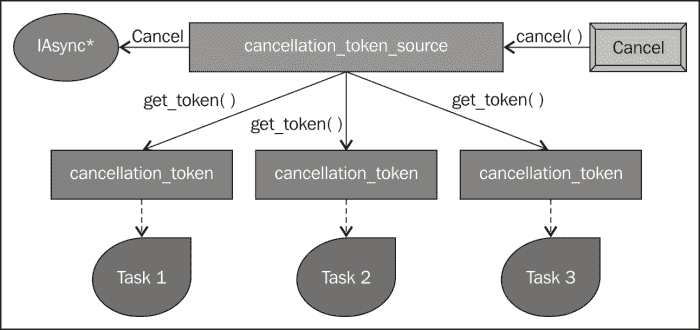

最终结果是，如果操作被取消，则会抛出`task_canceled`异常。 它沿着`then`链传播(如果未处理)，以便在最后一个`then`上方便地捕获它-事实上，最好添加一个仅执行取消(和错误)处理的最后一个`then`：

```cpp
then([](task<void> t) {
  try {
    t.get();
  }
  catch(task_canceled) {
    // task cancelled
  }
  catch(Exception^ ex) {
    // some error occurred
  }
});
```

`task<>::get()`方法抛出异常。 请注意，`task_canceled`不是从`Platform::Exception`派生的，因此需要单独的`catch`子句才能捕获。

### 备注

有些操作只是返回一个`nullptr`对象来指示取消。 这就是`FileOpenPicker`示例的情况。 如果返回的`StorageFile`对象为`nullptr`，则表示用户在选择文件时选择了**取消**按钮。

## 错误处理

在异步操作中，可能会抛出异常。 处理这些问题的一种方法是将`try`/`catch`块添加到适当的延续中。 一种更方便的方法是处理最后一个`then`延续中的所有错误，方法与取消大致相同。

# 使用现有库

WinRT 是一个新的库，我们希望使用它来访问此新应用商店应用模式中的 Windows 8 功能。 那么现有的 C++ 库又如何呢？比如**标准模板库**(**STL**)、**活动模板库**(**ATL**)、**Microsoft 基础类**(**MFC**)或其他一些定制库？ 原始的 Win32API 怎么样？ 在接下来的几节中，我们将介绍常用的 Microsoft 库及其在 Windows 8 应用商店应用中的使用。

## STL

STL 是标准 C++ 库的部分(有时被认为是它的同义词)，并且在 Windows 8 应用商店应用中完全受支持。 事实上，一些 WinRT 类型的包装器知道 STL，这使得它更容易互操作。

## MFC

MFC 库创建于20 多年前，目的是在 Windows API(创建时为 Win16)上提供 C++ 层，主要用于更容易地创建用户界面。

Windows8 应用商店应用程序提供自己的用户界面，与 Windows`User32.dll`API(MFC 包装的)相去甚远，这使得 MFC 在新世界中过时且无法使用。 现有代码必须迁移到使用 XAML、用户控件、控件模板或任何适合相关应用程序的内容。

## ATL

创建 ATL 是为了帮助构建 COM 服务器和客户端，从而减轻实现通用功能(如`IUnknown`、类工厂、组件注册等)的负担。 从技术上讲，它可以在 Windows 应用商店应用中使用，但实际上没有意义。 本章前面讨论的 WRL 涵盖了该级别的任何内容。

## Win32 API

Win32API(或 Windows API)是一组庞大的主要是 C 样式的函数和一些 COM 组件，它们过去是，现在仍然是用户模式下 Windows 操作系统的低级 API。

现在，每个文档中的函数都包含一个“应用于”子句，声明该 API 是否可用于桌面应用程序、商店应用程序或两者。 为什么某些功能在 Windows 应用商店应用中不可用？ 以下是几个原因：

*   某些功能与 Windows 应用商店不适合的用户界面相关。 例如，`MessageBox`和`CreateWindowEx`。
*   有些函数在 WinRT API 中具有等效项(通常更高级)。 例如`CreateFile`(尽管有一个新的`CreateFile2`API 也可以与 Store 应用程序一起使用)、`CreateThread`和`QueueUserWorkItem`。
*   有些功能在其他方面是不合适的，比如违反了安全约束。 例如`CreateProcess`和`EnumWindows`。

使用禁止的API 无法编译；这是因为 Windows API 标头已更改为基于两个常量`WINAPI_PARTITION_APP`(适用于 Store 应用程序)和`WINAPI_PARTITION_DESKTOP`(适用于桌面应用程序)有条件地编译。

从理论上讲，重新定义禁用函数并调用它是可能的。 下面是一个适用于`MessageBox`函数的示例：

```cpp
extern "C" BOOL WINAPI MessageBoxW(HWND hParent, LPCTSTR msg,
   LPCTSTR title, DWORD flags);

#pragma comment(lib, "user32.lib")
```

这种情况下需要链接到适当的库，因为默认情况下没有链接到`user32.dll`。

虽然这是可行的，并且如果调用此函数会出现一个消息框，但不要执行此操作。 原因很简单：Windows 8 应用商店认证过程将不会通过任何使用禁用 API 的应用程序。

### 备注

有关允许的 Windows API 函数的更多信息，请参见[http://msdn.microsoft.com/en-us/library/windows/apps/br205757](http://msdn.microsoft.com/en-us/library/windows/apps/br205757)。

## CRT

**C 运行时**(**CRT**)库包含大量函数，这些函数最初是作为 C 语言的支持库创建的。 其中许多功能在应用商店应用程序中不可用；通常有 Win32 或 WinRT 等效项。 有关不支持的功能的综合列表，请参阅[http://msdn.microsoft.com/EN-US/library/jj606124.aspx](http://msdn.microsoft.com/EN-US/library/jj606124.aspx)。

## DirectX

DirectX是一组低级的、基于 COM 的 API，最初创建于 20 多年前，目的是在利用硬件功能(如显卡)的同时访问 PC 的多媒体功能(图形、音频、输入等)。 DirectX 已经使用多年，主要用于游戏行业。

Windows 8 安装了 DirectX 11.1，为创建高性能游戏和应用程序奠定了基础。 它完全支持 Store 应用程序，甚至可以与基于 XAML 的 UI 共存。

## 发帖主题：Re：Колибри0.7.0

C++**加速的大规模并行性**(**AMP**)是一个相对较新的库，它有一个崇高的目标：能够使用主流编程语言(C++)在 CPU 和非 CPU 设备上执行代码。 目前，唯一支持的其他设备是**图形处理单元**(**GPU**)。

现代 GPU 具有很强的并行性，但最初它们有自己的语言来编写可能与图形本身无关的任意算法。 C++ AMP 是一种尝试使用 C++，但仍然可以运行 GPU(以及未来的其他设备)。

Windows 8 应用商店应用完全支持 C++ AMP(并且需要支持 DirectX 11 的卡)。

# Windows 运行时类库

WinRT 提供了一个全面的类库，按层次名称空间排列；从字符串和集合，到控件，到设备，到网络，再到图形；API 涵盖了很多方面。 进入 Windows 应用商店应用程序之旅的一部分是了解支持的各种 API 和功能。 这种知识是随着时间的推移而演变的。 在本书中，我们将讨论相当数量的 WinRTAPI，但肯定不是全部。

在接下来的几节中，我们将讨论一些经常与 Store 应用程序一起使用的核心类型，以及它们如何专门(如果有的话)映射到 C++。

## 字符串

WinRT 定义了它自己的字符串类型，`HSTRING`。 我们已经见过它几次了。 由于`HSTRING`只是不可变字符串的不透明句柄，Windows 提供了一些用于管理`HSTRING`的函数，如`WindowsCreateString`、`WindowsConcatString`、`WindowsSubString`、`WIndowsGetStringLen`、`WindowsReplaceString`等。 使用这些 API 并不困难，但非常繁琐。

幸运的是，`HSTRING`由引用计数类`Platform::String`包装，它在幕后为适当的 API 提供必要的调用。 它可以在给定原始 Unicode 字符指针(`wchar_t*`)的情况下构造，并且具有返回原始指针的`Data()`方法。 这意味着`Platform::String`与`std::wstring`的互操作相当容易。 以下是几个使用字符串示例：

```cpp
auto s1 = ref new String(L"Hello");
std::wstring s2(L"Second");
auto s3 = ref new String(s2.c_str());
int compare = wcscmp(L"xyz", s1->Data());
for(auto i = begin(s3); i != end(s3); ++ i)
  DoSomethingWithChar(*i);
```

请注意使用`Platform::begin`和`Platform::end`实现的类似迭代器的行为。 一般来说，在编写组件时，最好对所有字符串操作使用`std::wstring`，因为`wstring`有一个丰富的函数集。 仅在 ABI 边界使用`Platform::String`；`Platform::String`内置的功能很少。

## 集合

标准C++ 定义了几种容器类型，如`std::vector<T>`、`std::list<T>`、`std::map<K, V>`等。 然而，这些类型不能跨越 ABI 边界-它们是特定于 C++ 的。

WinRT 定义了自己的集合接口，这些接口必须跨 ABI 边界使用。 下面是包含这些接口的类图：


`IIterable<T>`只有一个方法：`First`，它返回一个`IIterator<T>`，即 WinRT 迭代器接口。 它定义了方法`MoveNext`和`GetMany`以及两个属性：`Current`返回迭代器所指向的当前对象，`HasCurrent`表示是否还有其他要迭代的项。

`IVector<T>`表示可通过索引访问的一系列项目。 这是 ABI 中常用的类型。 C++ 支持库为名为`Platform::Collections::Vector<T>`的`IVector<T>`提供了常用实现。 它可以用作 WinRT 类中的底层私有类型，因为在需要时它可以转换为`IVector<T>`。 但是，请注意，对于重型操作，STL`std::vector<T>`效率更高。 如果在某个时刻需要`Vector<T>`，它有许多构造函数，其中一些接受`std::vector<T>`。

`IVectorView<T>`表示矢量的只读视图。 它可以通过调用`GetView`方法从`IVector<T>`获得。 `VectorView<T>`是一个 C++ 私有实现，如果需要，可以由`IVector<T>`的自定义实现使用。

`IObservableVector<T>`继承自`IVector<T>`并添加单个事件`VectorChanged`。 这对于在`IObservableVector<T>`中添加、删除或替换项目时需要通知的客户端可能很有用。

`IMap*`系列接口管理键/值对，并且可以跨 ABI 边界传输。 `Platform::Collections::Map<K,V>`提供了一个可转换到此接口的实现，类似于`std::map<K,V>`的平衡二叉树(包括通过第三个模板参数更改排序算法的能力)。 `IMapView<K,V>`是`IMap<K,V>`的只读视图。

### 备注

ABI 最有用的集合类型是`IVector<T>`。 如果您可以接受`Vector<T>`作为底层实现，那么就这样做。 否则，保持`std::vector<T>`并仅在跨越 ABI 边界时转换为`IVector<T>`。

## 例外情况

COM/WinRT在出现异常时不起作用。 原因可能很明显，例外是特定于语言或平台的。 它们不能是各种平台遵守的二进制标准的一部分。 相反，COM 使用`HRESULT`，这只是一个 32 位数字，用于指示方法调用的成功或失败。

然而，C++(以及大多数其他现代语言，如 C#)支持异常的概念。 通过捕获异常来处理错误要比每次调用后检查`HRESULT`容易得多，也更易于维护(C 风格的编程)。 这就是通过 C++/CX 引用计数对象(HAT)进行的调用将失败的`HRESULT`转换为异常对象的原因，该异常对象派生自`Platform::Exception`，可以用通常的方式捕获。

反过来也是如此；当在 C++/CX 中实现组件时，代码可能抛出从`Platform::Exception`派生的异常；该异常不能跨越 ABI；相反，它被转换为等效的`HRESULT`，这是可以跨越 ABI 的东西。 另一方面，它可能会再次转换为该客户端平台的异常对象，如 C++ 异常或.NET 异常。

从`Platform::Exception`派生的异常类型列表是预定义的，不能扩展，因为每个类型都直接映射到`HRESULT`。 这意味着不可能添加新的异常类型，因为当跨越 ABI 时，C++/CX 不知道将异常转换为哪个`HRESULT`。 对于自定义异常，`Platform::COMException`可以与一些自定义`HRESULT`一起使用。 异常类型及其`HRESULT`等效项的完整表格如下所示：

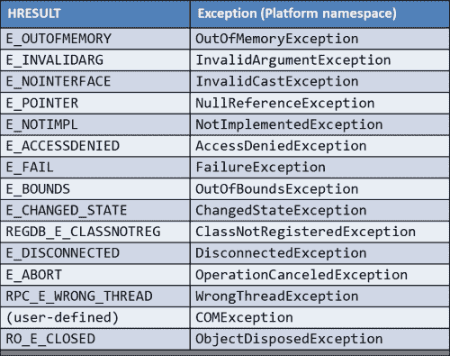

表中的大多数异常类型都是不言而喻的。 我们将在本书后面讨论其中一些例外情况。

### 备注

抛出不是从`Platform::Exception`继承的对象将被转换为`E_FAIL``HRESULT`。

所有异常类型都有一个具有基础`HRESULT`值的`HResult`属性和一个`Message`属性，该属性是异常的文本描述(由 WinRT 提供，不能更改)。

# 摘要

本章从一些可能对 WinRT 开发有用的 C++ 11 新特性开始。 我们讨论了 COM、它的概念和思想，以及如何将它们转换成 WinRT。 WRL 提供了在没有语言扩展的情况下访问 WinRT 对象的帮助器。 C++/CX 提供的语言扩展使得使用 WinRT 和创作 WinRT 组件变得更加容易。

WinRT 有一些我们需要学习和习惯的模式和习惯用法，例如使用异步操作、字符串、集合和错误处理的方法。

本章的内容并不详尽，但它应该会给我们足够的力量和理解来开始编写真正的应用程序。 在本书后面的部分中，我们将介绍一些其他的 C++/CX 功能和其他与 WinRT 相关的特性。

在下一章中，我们将深入探讨构建应用程序，从 XAML 开始，以及 WinRT 中通常构建用户界面的方式。