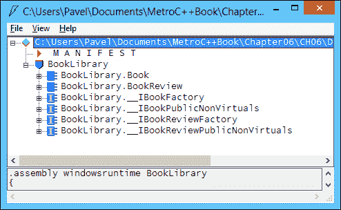
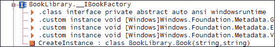
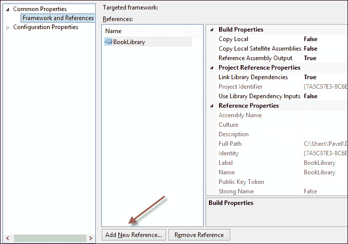
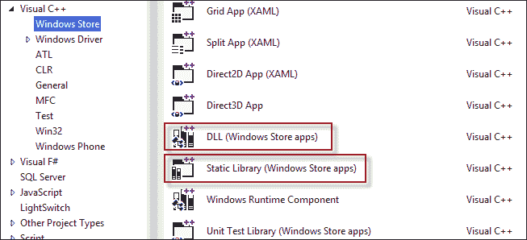
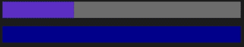
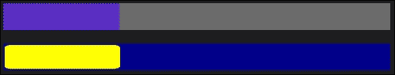
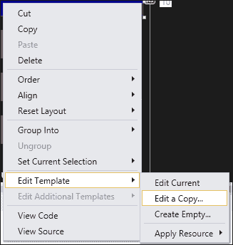
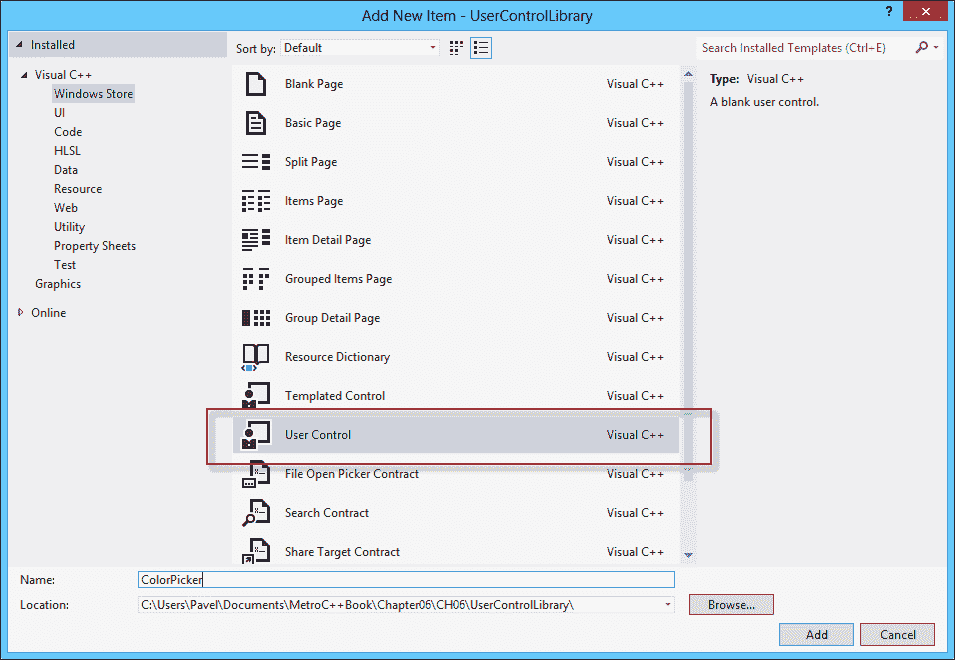
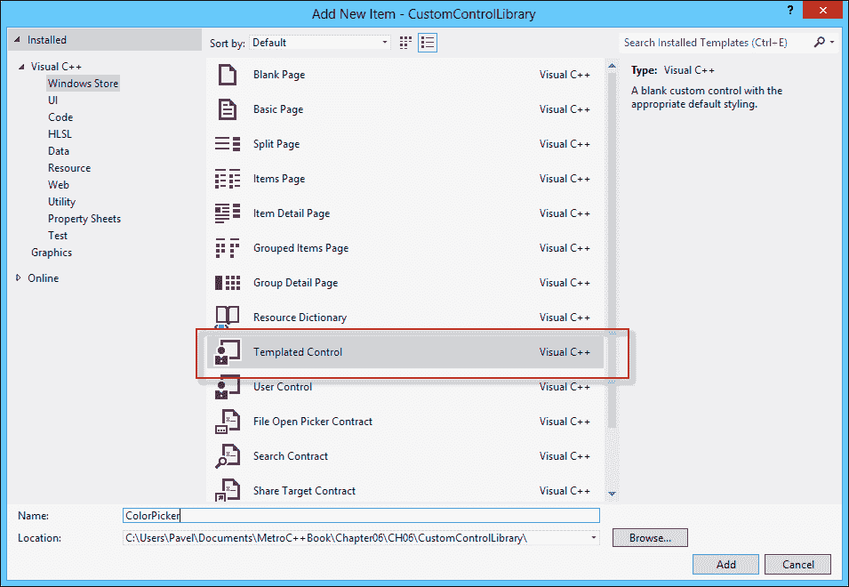

# 第六章组件、模板和自定义元素

在前面的章节中，我们通过了解布局和元素携手创建灵活的 UI 的方式，介绍了构建用户界面的基本原理。 数据绑定提供了向控件写入数据和从控件读取数据的分离方式。

在本章中，我们将探索使用控件模板以一种基本而强大的方式自定义控件的方法。 当控件的功能是必需的，但其外观不是必需的时，这很有用。 在其他情况下，内置控件可能没有所需的行为；在这些情况下，可以根据应用程序的特定需要创建自定义控件和用户控件。 但首先我们应该考虑使用 C++ 构建的组件的更一般概念，以及如何在 C++ 和非 C++ 项目中使用这些组件。

# Windows 运行时组件

正如我们在[第 2 章](02.html "Chapter 2. COM and C++ for Windows 8 Store Apps")、*COM 和 C++ for Windows8 Store Apps*中看到的，Windows 运行时基于实现 COM 接口的COM 类。 也写入元数据(`winmd`文件)的任何此类类都可以从 DLL 导出，因此可以由任何其他符合 WinRT 的语言或环境使用；当前支持的语言或环境包括 C++、.NET 语言(C#和 VB)和 JavaScript。

此类组件只能在其公共接口中使用 WinRT 类型。 对于 C++，这意味着基于 STL 的类只能在 WinRT 类的非公共区域中使用。 当传入公共方法或属性时，必须将它们转换为 WinRT 类型。

一个典型的场景是现有的 C++ 类型，可能是在过去某个时候编写的，需要在 WinRT 中用于数据绑定目的，或者至少向当前项目之外的 WinRT 客户端公开。 让我们看看如何实现这一过渡。

## 将 C++ 转换为 WinRT

让我们举一个具体的例子，然后讨论更广泛的问题。 假设我们有以下标准 C++ 类：

```cpp
#include <string>
#include <vector>

class book_review {
public:
  book_review(const std::wstring& name, 
  const std::wstring& content,
    int rating);

  int rating() const { return _rating; }
  void set_rating(int rating) { _rating = rating; }
  const std::wstring& name() const { return _name; }
  const std::wstring& content() const { return _content; }

private:
  std::wstring _name;
  std::wstring _content;
  int _rating;
};

class book {
public:
  book(const std::wstring& name, const std::wstring& author);
  void add_review(const book_review& review);
  size_t reviews_count() const { return _reviews.size(); }
  const book_review& get_review(size_t index) const { 
    return _reviews[index]; 
  }
  const std::wstring& name() const { return _name; }
  const std::wstring& author() const { return _author; }

private:
  std::wstring _name;
  std::wstring _author;
  std::vector<book_review> _reviews;
};
```

简单地说，定义了一个`book`类，它有一个名称、一个作者和一个评论集合(`book_review`类)。 每个考核由名称、考核内容和数字评分组成。

这些类是用标准 C++ 编写的，对 WinRT(或 C++/CX)一无所知。

按照目前的情况，它们只能在 C++ 项目内部使用。 它们不能导出到其他 WinRT 环境(例如，.NET)，即使在 C++ 项目中，它们也不能从数据绑定等功能中受益，因为它们无论如何都不是 WinRT 类。

这些(和类似的)类需要包装在 WinRT 类中。 使用 C++，这可以通过两种方式完成。 第一种是使用 WRL；好处是使用了标准的 C++(而不是特定于 Microsoft 的扩展)，但是这个好处有点减弱了，因为 WinRT 无论如何都是特定于 Microsoft 的(至少在撰写本文时是这样)。 第二个可能的好处是可以更好地控制生成的 WinRT 类型。 虽然这听起来可能很吸引人，但它也很难做到，而且对于大多数情况来说都是没有必要的，所以大多数情况下我们都会采用更简单的方法，即利用 C++/CX。

### 备注

有时需要使用 WRL 创建 WinRT 组件。 例如，当单个类需要实现 WinRT 接口和本机 COM 接口时。 例如，媒体编码器或解码器必须是 COM/WinRT 类，这些类不仅必须实现`Windows::Media::IMediaExtension`接口，还必须实现 Media Foundation 非 WinRT 接口`IMFTransform`。 西铁是实现这一目标的唯一途径。

为了包装与图书相关的类，我们将创建一个 Windows Runtime 组件项目(我们将其命名为`BookLibrary`)。 然后，我们将添加一个 C++/CX WinRT 类来包装`book`和`book_review`。 让我们从`book_review`包装器开始：

```cpp
[Windows::UI::Xaml::Data::BindableAttribute]
public ref class BookReview sealed {
public:
  BookReview(Platform::String^ name, Platform::String^ content,
    int rating);

  property Platform::String^ Name { Platform::String^ get(); }
  property Platform::String^ Content { Platform::String^ get(); }
  property int Rating {
    int get() { return _review.rating(); }
    void set(int rating) { _review.set_rating(rating); }
  }
private:
  book_review _review;
};
```

需要注意的几件事：

*   将`Bindable`属性应用于类，以便为数据绑定工作生成适当的代码。
*   All the public stuff is WinRT only. The `book_review` wrapped instance is in the private section of the class. Any attempt to make it public would cause a compilation error. The error states, "**a non-value type cannot have any public data members**"; that's the first issue—since WinRT is based on COM, and COM is based on interfaces, which are defined by virtual tables, they can only contain methods (functions) and not data members.

    如果数据成员将转换为返回非 WinRT 类型的方法，编译器将发出不同的错误“**(MethodName)：公共成员的签名包含本机类型‘book_Review’**”。 最终结果是只有 WinRT 类型可以在公共成员中使用。

*   Standard C++ has no concept of properties. Data members are sometimes wrapped by getters and/or setters. These should be turned into WinRT properties, as was done with `Name`, `Content`, and `Rating` in the preceding code.

    WinRT 编码约定对类名和成员名使用 Pascal 大小写，因此可能需要稍微更改以反映这一点(例如，将`book_review`中的`name`更改为`BookReview`中的`Name`，依此类推)。

*   `BookReview`类中缺少的一件事是`INotifyPropertyChanged`的实现，如[第 5 章](05.html "Chapter 5. Data Binding")，*数据绑定*中所述。 这是必需的，因为在构造`BookReview`之后可以更改`Rating`属性。 为了更容易关注基本原理，省略了实现，但应该在实际场景中实现。

头文件不实现构造函数以及属性`Name`和`Content`。 下面是构造函数(在相应的 cpp 文件中实现)：

```cpp
BookReview::BookReview(String^ name, 
String^ content, int rating) : 
  _review(name->Data(), content->Data(), rating) { }
```

构造函数(与任何其他方法一样)必须接受 WinRT 类型，对所需的任何字符串使用`Platform::String^`。 这用于通过使用`Data`方法初始化包装的`book_review`实例(它需要标准的`std::wstring`)。

`Name`和`Content`属性是只读的，但必须返回 WinRT 类型-在本例中为 a`Platform::String^`(您可能还记得，它包装了 WinRT`HSTRING`)：

```cpp
String^ BookReview::Name::get() {
  return ref new String(_review.name().c_str());
}

String^ BookReview::Content::get() {
  return ref new String(_review.content().c_str());
}
```

实现很简单，这一次是在另一个方向，通过使用接受`const wchar_t*`的`Platform::String`构造函数。

接下来，我们需要看一下为`book`类创建的包装器。 这有点复杂，因为一本书包含`std::vector`个`book_review`个对象；`std::vector`不是 WinRT 类型，因此必须使用代表集合的另一个类型投影：

```cpp
[Windows::UI::Xaml::Data::BindableAttribute]
public ref class Book sealed {
public:
  Book(Platform::String^ name, Platform::String^ author);
  void AddReview(BookReview^ review);

  property Platform::String^ Name {
    Platform::String^ get() { 
      return ref new Platform::String(_book.name().c_str()); 
    }
  }

  property Platform::String^ Author {
    Platform::String^ get() { 
      return ref new Platform::String(_book.author().c_str()); 
    }
  }

  property Windows::Foundation::Collections::
    IVectorView<BookReview^>^ Reviews {
      Windows::Foundation::Collections::
      IVectorView<BookReview^>^ get();
    }

private:
  book _book;
  Windows::Foundation::Collections::
    IVectorView<BookReview^>^ _reviews;
};
```

`Name`和`Author`属性很简单，并且是内联实现的。 构造函数初始化这些参数，并且它们在对象的整个生命周期内保持只读状态。

原始的`book`类有一个`std::vector<book_review>`实例。 在 WinRT 中，像 Vector 这样的集合应该被投影为`Windows::Foundation::Collections::IVector<BookReview>`或`IVectorView<BookReview>`(在同一名称空间中，后者是前者的只读视图)。

### 备注

名称空间前缀可能有点混乱。 为什么`IVector<T>`在`Windows::Foundation::Collections`中，而`Vector<T>`在`Platform::Collections`中？ 规则很简单。 WinRT 类型进入`Windows::*`命名空间，而特定的 C++ 实现进入`Platform::*`命名空间。 一般来说，`Platform::*`类型不能在 WinRT 类型中导出，因为它们大多是特定于 C++ 的 WinRT 接口实现。 值得注意的例外是`Platform::String`和`Platform::Object`，它们分别被理解为`HSTRING`和`IInspectable`指针的替代，因此用于公共方法和属性中。

`Book`类将`Reviews`只读属性提供为`IVectorView<BookReview^>^`。 它可以返回实现此接口的任何对象。 `Platform::Collections::Vector<T>`提供了`IVector<T>`的实现。 `IVector<T>`提供`GetView`方法，返回`IVectorView<T>`：

```cpp
IVectorView<BookReview^>^ Book::Reviews::get() {
  if(_reviews == nullptr) {
    auto reviews = ref new Vector<BookReview^>();
    for(size_t i = 0; i < _book.reviews_count(); i++) {
      auto review = _book.get_review(i);
      reviews->Append(
        ref new BookReview(
          ref new String(review.name().c_str()), 
          ref new String(review.content().c_str()), 
      review.rating()));
    }
    _reviews = reviews->GetView();
  }
  return _reviews;
}
```

如果没有添加新的评论，或者从未调用属性(由`_reviews`中的`nullptr`表示)，则属性实现尝试通过缓存`IVectorView<BookReview>`结果进行优化。 否则，将创建`Vector<BookReview>`，并使用`IVector<BookReview>::Append`添加`BookReview`对象。

最后一个要实现的有趣方法是`AddReview`：

```cpp
void Book::AddReview(BookReview^ review) {
  book_review br(review->Name->Data(), 
  review->Content->Data(), review->Rating);
  _book.add_review(br);
  _reviews = nullptr;
}
```

将`_reviews`数据成员设置为`nullptr`，以强制将来调用`Reviews`属性以重新生成返回的集合。

### 提示

在使用集合(如`std::vector`及其 WinRT 包装器(如`Vector<T>`))时，请尝试尽可能多地使用`std::vector`。 仅在从 WinRT 类导出时使用`Vector<T>`。 在本机 C++ 类型上进行所有集合操作，因为它们的开销比 WinRT 类型少(因为基于 WinRT 接口的性质)。

## 穿越 ABI

**应用程序二进制接口**(**ABI**)是标准 C++ 和 WinRT 之间的边界。 任何没有实现为 WinRT 类的 C++ 类都不能跨越 ABI。 前面使用的类型`std::wstring`和`std::vector<>`是跨越 ABI 时需要投影的类型的完美示例。 编译器不允许在`public ref class`声明的公共部分中使用非 WinRT 类型。 有关将本机 C++ 类型映射到 WinRT 类型的进一步讨论，请参阅[第 2 章](02.html "Chapter 2. COM and C++ for Windows 8 Store Apps")、*COM 和 C++ for Windows 8 Store Apps*。

## 使用 Windows 运行时组件

一旦构建了 Windows Runtime组件，就会创建一个元数据文件(`.winmd`)，指示从库中导出哪些类型、接口、枚举等。 例如，我们的`BookLibrary`组件 DLL 生成`BookLibrary.winmd`。 在`ILDASM`中打开它会显示以下内容：



这清楚地显示了导出的类型`Book`和`BookReview`。 奇怪的接口名称代表了编译器提供的内部 WinRT 实现-WinRT 完全是关于接口的。 如果有任何非默认构造函数，则存在`*Factory`接口。 例如，打开`__IBookFactory`会显示以下内容：



请注意`CreateInstance`方法，它模仿`Book`的单个构造函数。 该接口由创建`Book`实例的激活工厂实现(对于任何`public ref class`，在幕后由 C++/cx 实现)。

`__IBookPublicNonVirtuals`接口是由`Book`类实现的接口：


在任何符合 WinRT 的环境中都可以使用生成的 DLL。 在 C++ 项目中，需要添加对`winmd`文件的引用。 为此，在解决方案资源管理器中右键单击项目节点，然后选择**References…。** 。 然后在**公共属性**或**框架和引用**节点中选择**添加新引用**(或从项目属性转到相同位置)：



添加引用后(通过选择`BookLibrary`项目，或在一般情况下浏览`winmd`文件)，所有导出的类型都可以立即使用，就像任何其他 WinRT 类型一样。 下面是一个创建`Book`的示例，其中包含一些评论：

```cpp
using namespace BookLibrary;

auto book = ref new Book("Windows Internals", "Mark Russinovich");
book->AddReview(
    ref new BookReview("John Doe", 
    "Great book! Lots of pages!", 4));
book->AddReview(
    ref new BookReview("Mickey Mouse", 
      "Why two parts? This makes my ears spin!", 3));
book->AddReview(
    ref new BookReview("Clark Kent", 
    "Big book. Finally something to stretch the muscles!", 5));
```

从其他环境(如.NET)使用`BookLibrary`DLL 也可以类似地完成，如[第 2 章](02.html "Chapter 2. COM and C++ for Windows 8 Store Apps")、*COM 和 C++ for Windows8 Store Apps*中所述。 每个环境都根据元数据(`winmd`)文件执行所需的任何投影。

### 备注

用 C++ 创建的 WinRT 组件是唯一保证不涉及.NET CLR 的组件。 由 C#创建的组件将始终需要 CLR，即使从 C++ 客户端使用也是如此。

## 其他 C++ 库项目

查看 Visual Studio 2012 中的个可用的项目类型，可以看到创建可复用库的另外两个选项：



概述的项目创建了一个经典的 DLL 或静态库，但默认情况下不会生成`winmd`文件。 这些组件只能由其他 C++ Store 项目(WinRT 组件或其他启用 Store 的库)使用。 与常规的、经典的 C++ DLL 或静态库有什么不同？ 首先，任何禁用的 Win32API 的使用都会导致编译器错误。 其次，除非执行特定的步骤，例如添加对`platform.winmd`和`windows.winmd`文件的引用，否则这些项目不能使用 C++/CX。

# 自定义控件模板

在[章](04.html "Chapter 4. Layout, Elements, and Controls")，*布局、元素和控件*中，我们讨论了 WinRT 提供的各种元素和控件。 可以使用以下级别(从简单到复杂)自定义元素和控件的外观。 当然，并非所有元素/控件都支持所有级别：

*   更改属性值；到目前为止，最简单的自定义都是通过更改属性来实现的。 常见的例子有与字体相关的属性(`FontSize`、`FontFamily`等)、`Foreground`和`Background`等。
*   对于内容控件(从`ContentControl`派生的控件)，可以根据需要将`Content`属性设置为任何元素。 例如，这可以使`Button`显示图像、文本和任何其他所需的内容，同时仍然保持预期的按钮行为。
*   数据模板可以用于支持它的属性，以便以丰富和有意义的方式显示数据对象。 `ContentControl::Content`支持这一点，因为它的类型为`Platform::Object^`，这意味着它可以接受任何内容。 如果这是不是`UIElement`的派生类型，则如果提供了`DataTemplate`(在本例中通过`ContentControl::ContentTemplate`属性)，则使用`DataTemplate`。 这也被所有通过`ItemTemplate`属性的`ItemsControl`派生函数使用。
*   从`ItemsControl`派生的类型具有`ItemContainerStyle`和`ItemsPanel`属性，这些属性可以进一步自定义数据的表示方式。

尽管前面的列表令人印象深刻，但有时这些定制是不够的。 例如，`Button`总是矩形的；虽然它可以包含任何内容(它是`ContentControl`)，但它永远不能是椭圆形。 有些东西只是“烘焙”到控件的外观中。 这就是控件模板的用武之地。

元素和控件之间的根本区别在于是否存在定义控件显示方式的`Control::Template`属性。 元素没有此属性。 例如，`Ellipse`是一个椭圆，它看起来不能像其他任何东西，因为这会违反它的定义。 因此，`Ellipse`是一个元素，而不是一个控件。

控件(从`Control`派生)可以更改其`Template`属性并具有不同的外观(但保留功能)。 事实上，所有控件都有 WinRT 提供的默认模板(否则，控件将没有“外观”)。

## 建立控制模板

控制模板的类型为`ControlTemplate`。 它非常类似于`DataTemplate`(都是从`FrameworkTemplate`派生的)，并且可以包含组成控件外观的单个`UIElement`(通常是`Panel`)。

例如，我们将为`ProgressBar`控件构建一个备用控件模板。 我们将从简单的步骤开始，并在进行过程中添加功能。

控件模板通常创建为资源，因此可以更容易地重用。 这里是第一个简单的尝试：

```cpp
<ControlTemplate TargetType="ProgressBar" x:Key="progTemp1">
  <Grid>
    <Rectangle Fill="DarkBlue" />
    <Rectangle RadiusX="10" RadiusY="4" HorizontalAlignment="Left" 
    Fill="Yellow" Margin="2" />
  </Grid>
</ControlTemplate>
```

要使用该模板，我们只需将其设置为`Template`属性：

```cpp
<ProgressBar Value="30" Height="40" Margin="10" 
  Template="{StaticResource progTemp1}" />
```

这里的想法是创建一个深蓝色矩形，其上的另一个矩形(圆角)将显示当前进度。 但是，结果并不理想(顶部`ProgressBar`使用默认模板)：



`ProgressBar`似乎没有显示任何进展(`Value="30"`应该显示 30%已填满`ProgressBar`，因为缺省的`Maximum`是`100`，就像顶部的`ProgressBar`一样)。 为什么会这样呢？ 我们刚刚创建了一个`Rectangle`，它的默认值`Width`为`0`。 解决此问题的一种方法是将第二个`Rectangle`的`Width`属性绑定到`ProgressBar`的`Value`属性。 有一种方法可以做到这一点：

```cpp
Width="{TemplateBinding Value}"
```

`TemplateBinding`是绑定到正在模板化的控件的标记扩展。 这是必要的，因为我们不能将`Source`或`ElementName`与常规的`Binding`一起使用。 结果如下：


这当然更好，但与顶部的参考`ProgressBar`相比，进度指示器似乎很小。 原因很简单，`Value`被认为是`Width`，但它确实应该与整个`ProgressBar`的宽度成正比。 我们可以通过使用值转换器来解决这个问题，但还有一个更好的方法。

`ProgressBar`已经具备了将某些元素的`Width`属性设置为所需比例值的智能。 我们只需要告诉它应该是哪种元素。 原来这个元素必须有一个特定的名称，在本例中是`ProgressBarIndicator`。 我们需要做的就是将相关元素(第二个元素`Rectangle`)的`x:Name`属性设置为此值：

```cpp
<Rectangle RadiusX="10" RadiusY="4" x:Name="ProgressBarIndicator" 
  HorizontalAlignment="Left" Fill="Yellow" Margin="2" />
```

结果如下：



现在它看起来完全正确了。 这个特别的名字是从哪里来的？ 秘诀在于查看控件的默认模板，查找特殊命名的部件。 所有默认控件模板都可以在文件`C:\Program Files (x86)\Windows Kits\8.0\Include\WinRT\Xaml\Design\Generic.xaml`中找到(在 32 位 Windows 系统上，该目录以`C:\Program Files`开头)。 控件模板是控件默认样式的一部分。

查看`ProgressBar`控件模板，大多数元素的命名都没有意义，例如，`e1`、`e2`等等-`ProgressBarIndicator`很突出。

### 备注

在 WPF 和 Silverlight 中，放在控件上的`TemplatePart`属性指示控件查找哪些命名部件以及它们的类型。 尽管 WinRT 定义了`TemplatePart`属性，但它似乎没有在当前版本的 WinRT 中使用，因此我们只能做一些“猜测”。

### 使用控件的属性

模板现在可以正常工作(至少看起来是这样)。 使用我们的新模板时，更改属性(如`Foreground`或`Background`)不起作用。 这是因为模板没有以任何方式使用它们。 有时，这正是我们想要的，但典型的模板希望提供自定义其自身外观的方法；一种方法是利用控件上的现有属性。 这一点已经用`TemplateBinding`到`Value`属性进行了简要演示，但这里有一个更有趣的模板，它使用了`ProgressBar`中的几个属性：

```cpp
<ControlTemplate TargetType="ProgressBar" x:Key="progTemp2">
  <Grid>
    <Rectangle Fill="{TemplateBinding Background}" />
    <Rectangle RadiusX="10" RadiusY="4" 
    x:Name="ProgressBarIndicator" 
    HorizontalAlignment="Left" Fill=
    "{TemplateBinding Foreground}" 
    Margin="2"/>
    <TextBlock HorizontalAlignment="Center" Foreground="White" 
      VerticalAlignment="Center" >
      <Run Text="{Binding Value, RelativeSource=
      {RelativeSource TemplatedParent}}" />
      <Span>%</Span>
    </TextBlock>
  </Grid>
</ControlTemplate>
```

在前面的代码片段中，有几件有趣的事情需要注意。 `TemplateBinding`标记扩展用于绑定到模板化控件的属性(`Background`和`Foreground`)；`TemplateBinding`仅适用于单向绑定(源到目标，反之亦然)。 对于双向绑定属性，必须使用较长的语法，即，将`RelativeSource`属性设置为另一个标记扩展名为`RelativeSource`(不应与`Binding::RelativeSource`属性名混淆)的`Binding`表达式，该表达式接受`Mode`(也作为构造函数参数)，可以是`Self`(目标和源是同一个对象，在这里没有用处)或`TemplatedParent`，这意味着要模板化的控件，这正是我们想要的。

### 备注

`TemplateBinding`这里应该也行得通，因为我们只对单向绑定感兴趣。 但是，由于`Value`可以双向绑定，所以`TemplateBinding`失败。 这似乎是当前 WinRT 实现中的一个错误。

下面是使用此模板的`ProgressBar`：

```cpp
<ProgressBar Value="30" Height="40" Margin="10" FontSize="20" 
  Template="{StaticResource progTemp2}"  
  Background="Brown">
  <ProgressBar.Foreground>
    <LinearGradientBrush EndPoint="0,1">
      <GradientStop Offset="0" Color="DarkBlue" />
      <GradientStop Offset="1" Color="LightBlue" />
    </LinearGradientBrush>
  </ProgressBar.Foreground>
</ProgressBar>
```

这是结果：


### 处理状态更改

A`ProgressBar`通常显示操作的进度。 但是，有时应用程序不知道操作的进度-它只知道操作正在进行。 `ProgressBar`可以通过将其`IsIndeterminate`属性设置为`true`来指示这一点。 以下是标准`ProgressBar`在此模式下的显示方式：


实际上很难捕捉到这一点的静态图像，因为`ProgressBar`显示了一个由小圆圈组成的有趣的非线性动画。

在使用我们模板的`ProgressBar`上将`IsIndeterminate`设置为`true`不会影响`ProgressBar`的显示方式。 那是因为我们的控制没有考虑到这个属性。

我们怎么才能解决这个问题呢？ 一种方法是向控件模板添加默认隐藏的内容，但如果`IsIndeterminate`变为`true`，则会显示一些内容，并指示`ProgressBar`处于该特殊模式(例如，使用值转换器)。 虽然这在技术上是可行的，但通常不是这样做的。 其中一个原因是，仅使用绑定和值转换器可能很难监视某些状态更改-例如，如果鼠标光标悬停在控件上(与`ProgressBar`无关，但与许多其他控件相关)，则一个属性可能是不够的。 我们该如何开始制作一部动画呢？

所有这些状态改变和反应都是通过称为`VisualStateManager`的辅助对象来处理的。 控制状态之间的转换；这些状态及其转换可以由`VisualStateManager`捕获。 对于每个更改，可以提供一组`Storyboard`对象；这些`Storyboard`对象在一般情况下表示动画，或在特定情况下表示简单的状态更改。

下面是一个扩展模板，它处理`IsIndeterminate`属性的效果：

```cpp
<ControlTemplate TargetType="ProgressBar" x:Key="progTemp4">
  <Grid>
    <VisualStateManager.VisualStateGroups>
      <VisualStateGroup x:Name="CommonStates">
        <VisualState x:Name="Indeterminate">
          <Storyboard>
            <DoubleAnimation Storyboard.TargetProperty="Opacity" 
            Storyboard.TargetName="IndetRect" To="1" 
              Duration="0:0:1" 
            AutoReverse="True" RepeatBehavior="Forever"/>
          </Storyboard>
        </VisualState>
        <VisualState x:Name="Determinate">
        </VisualState>
      </VisualStateGroup>
    </VisualStateManager.VisualStateGroups>
    <Rectangle Fill="{TemplateBinding Background}" />
      <Rectangle RadiusX="10" RadiusY="4" 
      x:Name="ProgressBarIndicator" HorizontalAlignment="Left" 
      Fill="{TemplateBinding Foreground}" Margin="2"/>
      <Rectangle x:Name="IndetRect" Opacity="0">
      <Rectangle.Fill>
        <LinearGradientBrush EndPoint=
        ".1,.3" SpreadMethod="Repeat">
          <GradientStop Offset="0" Color="Yellow" />
          <GradientStop Offset="1" Color="Red" />
        </LinearGradientBrush>
      </Rectangle.Fill>
    </Rectangle>
  </Grid>
</ControlTemplate>
```

`VisualStateManager`有一个有趣的属性，它是一个附加属性`VisualStateGroups`。 对于每个组，始终有一个状态处于活动状态；这意味着一个控件可以同时处于多个状态。 例如，按钮可以处于按下状态和键盘聚焦状态。 必须在包含控件模板的顶级`Panel`上设置`VisualStateGroups`属性(在本例中为 a`Grid`)。

每个`VisualStateGroup`由`VisualState`个对象组成，这些对象指示要为每个状态执行什么操作(要运行哪些动画)。 状态名称必须是正确的名称，因为控件根据其内部逻辑更改为这些状态。 我们怎么知道有哪些州组存在，每个州组中有哪些州？ 这是通过查看默认控件模板来完成的。 这可以通过查看上述文件来完成，但也可以通过在 Visual Studio2012 中右击控件，然后选择**编辑模板**|**编辑副本…来实现。** ：



在控件模板中，创建了名为`IndetRect`的第三个矩形，初始不透明度为零，使不可见。 当`ProgressBar`进入`Indeterminate`状态时，使用`DoubleAnimation`类(设置`double`类型的属性动画)执行动画，该类在一秒内将该矩形的不透明度更改为`1`(完全显示)(`Duration`属性)，并使用自动反转(`AutoReverse="true"`)和永远设置动画(`RepeatBehavior="Forever"`)。 结果如下：


而且不透明度是动画的，在这个矩形里淡入淡出。

### 备注

完整的动画封面超出了本书的范围，但这应该会让你对它有一个感觉。 `Storyboard`表示播放动画对象的时间线，在本例中为`DoubleAnimation`对象，但还有许多其他对象。

这种状态实际上是如何改变的？ 该控件使用自己的逻辑调用静态`VisualStateManager::GoToState`方法，在特定组中设置新状态。 对于控件模板的作者来说，这并不重要；唯一重要的是根据预期的状态更改设置所需的动画。

### 备注

`VisualStateManager`还允许指定发生状态更改时发生的实际转换。 这与实际状态本身形成了鲜明对比。 这意味着在移动到特定状态时，过渡可以是临时的，但状态本身可能具有不同的动画。 有关详细信息，请参阅 MSDN 文档，从`VisualStateGroup::Transitions`属性和`VisualTransition`类开始。

### 使用附加属性进行自定义

到目前为止创建的`ProgressBar`模板使用了使用`TemplateBinding`标记扩展在`ProgressBar`本身上设置的属性，或者是使用`RelativeSource`标记扩展指定了`Source`并将`TemplatedParent`作为其`Mode`的常规`Binding`。 添加只对我们的模板有意义的属性怎么样？ 例如，在前面的模板定义中，`ProgressBar`显示其值的文本字符串。 如果我们希望允许模板用户隐藏文本或更改其颜色，该怎么办？

创建`ProgressBar`时并没有考虑到所有这些。 为什么会这样呢？ 它是使用某些定制级别所需的属性创建的；这对于默认的`ProgressBar`模板是可以接受的。

解决此问题的一种方法是创建一个从`ProgressBar`派生的新类，并添加所需的属性。 虽然这是可行的(我们将在下一节讨论自定义控件)，但这有点不雅致-我们不需要来自`ProgressBar`的任何新功能，而是需要一些属性来调整它的模板。

更好的解决方案是使用附加属性，这些属性定义在一个类上，但可以由任何其他类使用(不过，它必须派生自`DependencyObject`)。 从技术上讲，我们可以在 WinRT 中的其他地方查找适当的附加属性，但最好创建一个定义这些附加属性的新类，并在`ProgressBar`模板中使用它们。

#### 定义附加属性

附加属性是通过调用静态`DependencyProperty::RegisterAttached`方法注册的依赖属性(我们将在下一节详细讨论)。 这将设置一个静态字段，用于管理所有使用该属性的对象的属性。 注册伴随着两个静态方法，这两个方法实际设置和获取对象的附加属性值。 下面是定义单个附加属性`ShowText`的类`ProgressBarProperties`的声明：

```cpp
public ref class ProgressBarProperties sealed {
public:
  static bool GetShowText(DependencyObject^ obj) {
    return (bool)obj->GetValue(ShowTextProperty);
  }

  static void SetShowText(DependencyObject^ obj, bool value) {
    obj->SetValue(ShowTextProperty, value);
  }

  static property DependencyProperty^ ShowTextProperty { 
    DependencyProperty^ get() { return _showTextProperty; }
  }

private:
  static DependencyProperty^ _showTextProperty;
};
```

必须初始化静态字段，这是在 cpp 文件中完成的：

```cpp
DependencyProperty^ ProgressBarProperties::_showTextProperty = 
  DependencyProperty::RegisterAttached(L"ShowText", 
  TypeName(bool::typeid), 
  TypeName(ProgressBarProperties::typeid), 
  ref new PropertyMetadata(false));
```

`RegisterAttached`方法接受属性名称、其类型(作为`TypeName`结构)、其所有者的类型以及可以接受属性默认值的`PropertyMetadata`实例(如果未在实际对象上设置，则查询该属性)。 在下一节中可以找到对`PropertyMetadata`的更详细的解释，其中描述了依赖属性；目前，我们将重点介绍控件模板中附加属性的用法。

`ProgressBar`模板内的`TextBlock`可以使用附加的属性，如下所示：

```cpp
<TextBlock HorizontalAlignment="Center" Foreground="White" 
  VerticalAlignment="Center" 
 Visibility="{Binding (local:ProgressBarProperties.ShowText), 
 RelativeSource={RelativeSource TemplatedParent}, 
 Converter={StaticResource bool2vis}}">
  <Run Text="{Binding Value, RelativeSource=
    {RelativeSource TemplatedParent}}" />
  <Span>%</Span>
</TextBlock>
```

属性路径两边的括号是必需的，否则 XAML 解析器无法正确理解表达式，从而导致运行时绑定失败。 所使用的转换器用于将`Boolean`转换为`Visibility`枚举，如[第 5 章](05.html "Chapter 5. Data Binding")，*数据绑定*中所示。

显然，定义和注册附加属性很简单，但却很繁琐。 一种解决方案是定义宏来自动执行此样板代码。 本章的可下载源代码包含一些宏，用于定义和注册依赖项和附加属性，这些属性应该更易于使用(在名为`DPHelper.h`的文件中)。 下面是使用前述宏定义的另一个附加属性的示例。 首先，在`ProgressBarProperties`类内部：

```cpp
DECLARE_AP(TextForeground, Windows::UI::Xaml::Media::Brush^);
```

在实现文件中(初始化静态字段)：

```cpp
DEFINE_AP(TextForeground, Brush, ProgressBarProperties, nullptr);
```

此属性可在`TextBlock`上的模板内使用，如下所示：

```cpp
Foreground="{TemplateBinding 
  local:ProgressBarProperties.TextForeground}"
```

# 自定义元素

控件模板提供了一种强大而完整的方式来更改控件的外观。 但这只是表面上的-控件仍然以相同的方式运行。 如果需要新功能，模板是不够的，应该创建一个新类。 这就是定制元素的用武之地。

在 WinRT 中，有几种创作自定义元素的方法，我们来看看两个最常用的控件--用户控件和自定义控件。 然后，我们将简要讨论如何创建自定义面板和自定义形状。

## 用户控件

用户控件通常用于将相关元素和控件分组在一起，以便重用。 从该控件公开适当的属性和事件，从而提供对其功能的轻松访问。 此外，Visual Studio 还支持用户控件 UI 设计，就像它对常规页面所做的那样。

用户控件派生自`UserControl`类。 UI 设计实际上是控件的`Content`属性，就像`ContentControl`一样。 它们通常放在自己的 Windows 运行时组件项目中，这样就可以使用 C++ 或其他语言在任何 WinRT 项目中使用它们。

### 创建颜色选择器用户控件

作为用户控件的示例，我们将创建一个颜色选择器控件，它允许通过操作红色、绿色和蓝色分量(RGB)的三个滑块来选择纯色。 首先，在创建 Windows 运行时组件项目后，我们可以向该项目添加类型为**User Control**的新项：



将打开一个设计图面，其中创建了一对常用的文件`ColorPicker.h`和`ColorPicker.cpp`。

我们要做的第一件事是定义属性，这些属性可以方便地访问用户控件的功能。 大多数情况下，这些属性不是包装某些私有字段的简单属性，而是依赖属性。

### 依赖属性

包装字段的简单属性(可能在 setter 中进行了一些验证)缺少使用 UI 框架时所需的某些特性。 具体地说，WinRT 依赖属性具有以下特征：

*   属性值更改时的更改通知。
*   各种提供程序都可以尝试设置属性的值，但一次只有一个这样的提供程序获胜。 不过，所有值都会保留。 如果获胜的提供商离开，则该属性的值将设置为该行中的下一个获胜者。
*   沿可视化树向下继承属性值(对于某些预定义的属性集)。
*   如果属性值从未更改过其缺省值，则不会为该属性值分配内存

这些功能为 WinRT 的一些强大功能(如数据绑定、样式和动画)提供了基础。

从表面上看，这些属性与任何其他属性(getter 和 setter)一样。 但不涉及私人领域。 相反，静态字段管理使用该属性的所有实例的属性值。

### 定义依赖属性

下面是定义依赖属性的方法(必须在派生自`DependencyObject`的类中完成，对于`UserControl`通常是)。 私有静态字段管理该属性，该属性公开为只读属性。 Setter 和 getter 可以方便地访问在`DependencyObject`基类中实现的实际`set`和`get`方法。 下面的代码演示如何创建名为`SelectedColor`的类型`Windows::UI::Color`的依赖属性，该属性由`ColorPicker`用户控件公开：

```cpp
public ref class ColorPicker sealed {
public:
//…
  property Windows::UI::Color SelectedColor {
    Windows::UI::Color get() {
   	   return (Windows::UI::Color)GetValue(SelectedColorProperty); 
    }
    void set(Windows::UI::Color value) {
      SetValue(SelectedColorProperty, value); }
  }

  property DependencyProperty^ SelectedColorProperty { 
    DependencyProperty^ get() { return _selectedColorProperty; }
  }

private:
  static DependencyProperty^ _selectedColorProperty;
};
```

需要注意的几件事：

*   `GetValue`和`SetValue`属性继承自`DependencyObject`。
*   静态属性的名称应该以`Property`作为后缀。
*   向属性的`get()`或`set()`部分添加更多代码从来都不是一个好主意，因为有时不会使用这些代码，可以直接调用`GetValue`和`SetValue`方法；例如，这是由 XAML 解析器完成的。

缺少的部分是静态字段的初始化，通常在`.cpp`文件中完成：

```cpp
DependencyProperty^ ColorPicker::_selectedColorProperty = 
  DependencyProperty::Register(
  "SelectedColor", TypeName(Color::typeid), 
  TypeName(ColorPicker::typeid),
  ref new PropertyMetadata(Colors::Black, 
  ref new PropertyChangedCallback(
  &ColorPicker::OnSelectedColorChanged)));
```

通过调用静态`DependencyProperty::Register`方法、传递属性名、其类型(作为`TypeName`结构)、包含类型和`PropertyMetadata`对象来注册**依赖属性**(**DP**)，该对象可以接受属性的默认值(在本例中为`Colors::Black`)以及在属性更改时调用的可选回调。 这在`ColorPicker`情况下会很有用。

此代码可以重复多次，每个 DP 重复一次。 这显然需要一些帮助器宏。 下面是使用宏在`ColorPicker`上定义的其他三个属性。 首先，在头文件中：

```cpp
DECLARE_DP(Red, int);
DECLARE_DP(Green, int);
DECLARE_DP(Blue, int);
```

和`.cpp`文件：

```cpp
DEFINE_DP_EX(Red, int, ColorPicker, 0, OnRGBChanged);
DEFINE_DP_EX(Green, int, ColorPicker, 0, OnRGBChanged);
DEFINE_DP_EX(Blue, int, ColorPicker, 0, OnRGBChanged);
```

这比冗长的版本短得多(也不容易出错)。 这些宏可以在`DPHelper.h`文件中找到，该文件随本章的可下载源代码一起提供。

接下来要做的是实现更改通知方法(如果它们存在)。 在这种情况下，`Red`、`Green`和`Blue`应该反映`SelectedColor`属性颜色分量，反之亦然。 首先，如果`Red`、`Green`或`Blue`发生更改，请使用以下代码片段：

```cpp
void ColorPicker::OnRGBChanged(DependencyObject^ obj, 
  DependencyPropertyChangedEventArgs^ e) {
  ((ColorPicker^)obj)->OnRGBChangedInternal(e);
}

void ColorPicker::OnRGBChangedInternal(
  DependencyPropertyChangedEventArgs^ e) {
  auto color = SelectedColor;
  auto value = safe_cast<int>(e->NewValue);
  if(e->Property == RedProperty)
    color.R = value;
  else if(e->Property == GreenProperty)
    color.G = value;
  else
    color.B = value;
  SelectedColor = color;
}
```

因为注册的处理程序必须是静态的，所以更容易将实际工作委托给实例方法(前面代码中的`OnRGBChangedInternal`)。 代码根据更改后的 RGB 属性更新`SelectedColor`属性。

另一个方向的实现与此相同：

```cpp
void ColorPicker::OnSelectedColorChanged(DependencyObject^ obj, 
DependencyPropertyChangedEventArgs^ e) {
  ((ColorPicker^)obj)->OnSelectedColorChangedInternal(
  safe_cast<Color>(e->NewValue));
}

void ColorPicker::OnSelectedColorChangedInternal(Color newColor) {
  Red = newColor.R;
  Green = newColor.G;
  Blue = newColor.B;
}
```

### 备注

前面的代码片段似乎创建了一个无限循环--如果`Red`更改，`SelectedColor`也会更改，而`SelectedColor`会再次更改`Red`，依此类推。 幸运的是，这是由依赖属性机制自动处理的，如果属性值实际更改，该机制将调用回调；设置为相同的值不会调用回调。

### 构建 UI

下一步是使用常规 XAML 创建用户控件的实际 UI。 绑定表达式可用于绑定到控件公开的属性(因为这些属性是 DP，它们为绑定提供自动更改通知)。 下面是`ColorPicker`的 UI，其中的滑块绑定到`Red`、`Green`和`Blue`属性，还有一个`Rectangle`绑定到控件的`SelectedColor`属性(省略了默认的 XAML 命名空间)：

```cpp
<UserControl
  x:Class="UserControlLibrary.ColorPicker"
  x:Name="uc">
  <UserControl.Resources>
  </UserControl.Resources>
  <Grid>
    <Grid.RowDefinitions>
      <RowDefinition Height="Auto" />
      <RowDefinition Height="Auto" />
      <RowDefinition Height="Auto" />
    </Grid.RowDefinitions>
    <Grid.ColumnDefinitions>
      <ColumnDefinition />
      <ColumnDefinition Width="150" />
    </Grid.ColumnDefinitions>
    <Slider Maximum="255" Margin="4" TickFrequency="20" 
      Value="{Binding Red, ElementName=uc, Mode=TwoWay}"/>
      <Slider Maximum="255" Margin="4" TickFrequency="20" 
      Value="{Binding Green, ElementName=uc, Mode=TwoWay}" 
      Grid.Row="1"/>
    <Slider Maximum="255" Margin="4" TickFrequency="20" 
      Value="{Binding Blue, ElementName=uc, Mode=TwoWay}" 
      Grid.Row="2"/>
    <Rectangle Grid.Column="1" Grid.RowSpan="3" Margin="10" 
      Stroke="Black" StrokeThickness="1">
      <Rectangle.Fill>
        <SolidColorBrush Color="{Binding SelectedColor, 
        ElementName=uc}" />
      </Rectangle.Fill>
    </Rectangle>
  </Grid>
</UserControl>
```

### 添加事件

可以将事件添加到用户控件，以通知感兴趣的各方感兴趣的事件。 下面是在控件的头文件中添加的事件：

```cpp
event EventHandler<Windows::UI::Color>^ SelectedColorChanged;
```

该事件使用`EventHandler<T>`委托，该委托要求客户端提供接受`Platform::Object^`和`T`(在本例中为`Color`)的方法。 我们将在`SelectedColor`属性更改时引发事件：

```cpp
void ColorPicker::OnSelectedColorChangedInternal(Color newColor) {
  Red = newColor.R;
  Green = newColor.G;
  Blue = newColor.B;

 SelectedColorChanged(this, newColor);
}
```

### 使用拾色器

现在我们可以在另一个项目中使用`ColorPicker`，方法是以通常的方式添加一个引用并添加一个 XML 名称空间映射。 然后，只需像使用其他控件一样使用该控件。 下面是一个例子：

```cpp
<StackPanel VerticalAlignment="Center">
  <Border Margin="10" Padding="6" Width="500" BorderBrush="White" 
    BorderThickness="2" >
  <controls:ColorPicker SelectedColorChanged="OnColorChanged" />
  </Border>
  <TextBlock FontSize="30" HorizontalAlignment="Center">
    <Span>Color: #</Span>
    <Run x:Name="_color" />
  </TextBlock>
</StackPanel>
```

该控件被放置在边框内，其`SelectedColorChanged`事件的处理方式如下：

```cpp
void MainPage::OnColorChanged(Object^ sender, Color color) {
  wstringstream ss;
  ss.fill(L'0');
  ss << hex << uppercase << setw(2) << color.R << setw(2) << 
  color.G << setw(2) << color.B;
  _color->Text = ref new String(ss.str().c_str());
}
```

这会更改控件底部的`TextBlock`。 它是这样看待运行时的：


## 自定义控件

用户控件非常适合于封装一段易于重用的 UI 功能。 它们的潜在缺点是缺乏深入的定制。 假设在`ColorPicker`示例中，我们希望将滑块垂直放置而不是水平放置，或者希望将滑块放置为椭圆而不是矩形。 虽然可以添加允许某些自定义的属性，但我们不可能预料到所有事情。

解决方案是使用默认控件模板创建自定义控件，该模板可以根据需要完全更改，同时仍保留原始功能。 这正是常规 WinRT 控件的构建方式。

### 创建 ColorPicker 自定义控件

自定义(也称为模板化)控件从`Control`类派生。 Visual Studio 模板化控件模板是一个很好的起点：



结果是一对文件`ColorPicker.h`和`ColorPicker.cpp`，是一个名为`Generic.xaml`的 XAML 文件，它保存了包含默认模板的`ColorPicker`的默认样式，如下所示：

```cpp
<Style TargetType="local:ColorPicker">
  <Setter Property="Template">
    <Setter.Value>
      <ControlTemplate TargetType="local:ColorPicker">
        <Border
          Background="{TemplateBinding Background}"
          BorderBrush="{TemplateBinding BorderBrush}"
          BorderThickness="{TemplateBinding BorderThickness}">
        </Border>
      </ControlTemplate>
    </Setter.Value>
  </Setter>
</Style>
```

### 备注

所有自定义控件样式必须驻留在同一`Generic.xaml`文件中。 它的名字和起源在于 WPF，它支持不同 Windows UI 主题的不同样式。 这与 WinRT 无关，但约定仍然存在。

实际上，在创作多个自定义控件时，使用相同的文件充其量是不方便的。 可以通过使用`ResourceDictionary::MergedDictionaries`属性将其他 XAML 文件包含到`Generic.xaml`中来解决此问题。

默认的模板看起来与为用户控件创建的默认 UI 非常相似，但有一个重要的区别：没有数据绑定表达式。 原因是，如果存在绑定，自定义模板将不得不复制这些绑定来维护功能，这给自定义模板作者带来了不合理的负担；另一种选择是在代码中进行绑定。 以下是`ColorPicker`默认模板的修订标记：

```cpp
<ControlTemplate TargetType="local:ColorPicker">
  <Border
    Background="{TemplateBinding Background}"
    BorderBrush="{TemplateBinding BorderBrush}"
    BorderThickness="{TemplateBinding BorderThickness}">
    <Grid>
      <Grid.RowDefinitions>
        <RowDefinition Height="Auto" />
        <RowDefinition Height="Auto" />
        <RowDefinition Height="Auto" />
      </Grid.RowDefinitions>
      <Grid.ColumnDefinitions>
        <ColumnDefinition />
        <ColumnDefinition Width="150" />
      </Grid.ColumnDefinitions>
      <Slider Maximum="255" Margin="4" TickFrequency="20" 
      x:Name="PART_Red"/>
      <Slider Maximum="255" Margin="4" TickFrequency="20" 
      x:Name="PART_Green" Grid.Row="1"/>
      <Slider Maximum="255" Margin="4" TickFrequency="20" 
      x:Name="PART_Blue" Grid.Row="2"/>
      <Rectangle Grid.Column="1" Grid.RowSpan="3" Margin="10" 
      Stroke="Black" StrokeThickness="1">
        <Rectangle.Fill>
          <SolidColorBrush x:Name="PART_Color" />
        </Rectangle.Fill>
      </Rectangle>
    </Grid>
  </Border>
</ControlTemplate>
```

模板的个有趣部分被指定了名称。 这些名称将由控件查找并绑定到代码中。 这些是本章开头讨论的命名部分。

### 代码中的绑定

在自定义控件中定义依赖项属性和事件与定义用户控件完全相同。

将模板应用于控件时，将调用虚拟`Control::OnApplyTemplate`方法。 这是控件查找其命名部分并使用绑定或事件处理程序(视情况而定)连接到它们的最佳机会。

要绑定这三个滑块，请按如下方式创建辅助方法：

```cpp
void ColorPicker::BindSlider(String^ name, String^ propertyName) {
  auto slider = (RangeBase^)GetTemplateChild(name);
  if(slider != nullptr) {
    auto binding = ref new Binding;
    binding->Source = this;
    binding->Path = ref new PropertyPath(propertyName);
    binding->Mode = BindingMode::TwoWay;
    BindingOperations::SetBinding(slider, 
    RangeBase::ValueProperty, binding);
  }
}
```

该方法使用`GetTemplateChild()`来获取命名元素。 如果该元素不存在，则返回`nullptr`。 典型的控件只是继续前进，不会引发异常。

### 备注

请注意，代码强制转换为`RangeBase`而不是`Slider`。 这是可能的，因为所需的属性是在`RangeBase`上定义的`Value`。 这意味着它可以不是`Slider`，只要它派生自`RangeBase`(例如。 `ScrollBar`或`ProgressBar`)。

接下来，在代码中创建绑定，方法是实例化`Binding`对象，设置源对象(`Source`和`Path`属性)、绑定模式(`Mode`属性)和转换器(如果需要，使用`Converter`属性)，最后使用目标对象、目标 DP 和绑定实例调用`BindingOperations::SetBinding`。

完整的`OnApplyTemplate`如下所示：

```cpp
void ColorPicker::OnApplyTemplate() {
  BindSlider("PART_Red", "Red");
  BindSlider("PART_Green", "Green");
  BindSlider("PART_Blue", "Blue");
  auto color = (SolidColorBrush^)GetTemplateChild("PART_Color");
  if(color != nullptr) {
    auto binding = ref new Binding;
    binding->Source = this;
    binding->Path = ref new PropertyPath(L"SelectedColor");
    BindingOperations::SetBinding(color, 
    SolidColorBrush::ColorProperty, binding);
  }
}
```

绑定三个潜在滑块(实际上是从`RangeBase`派生的控件)，然后绑定`SolidColorBrush`(如果存在)。 这意味着它可以是`Rectangle`的`Fill`、`Ellipse`或`Border`的`BorderBrush`--只要它是`SolidColorBrush`。

使用自定义控件与使用用户控件相同。 但是，可以用`ProgressBar`替换控件模板(就像本章开始时所做的那样)，以创建一个看起来不同但功能相同的`ColorPicker`，所有这些都不需要任何代码-只有 XAML。

# 自定义面板

WinRT 提供从`Panel`派生的标准面板。 可以创建以独特方式排列其子项的新面板，例如放射状面板，其子项沿椭圆的圆周排列。

布局过程是一个两步过程--测量和安排。 这是由`Panel`的方法精确建模的，以覆盖用于此目的的两个方法`MeasureOverride`和`ArrangeOverride`。

`MeasureOverride`询问面板(或任何覆盖它的元素)它所需的大小。 对于面板，主要关注的是其子元素的要求。 面板应该为每个子元素调用`UIElement::Measure`，使其自己的`MeasureOverride`被调用(如果该子元素是一个面板，或者其本身就像一个面板，则可能会继续执行此操作)。

小组需要根据孩子的要求和想要采用的布局逻辑来决定所需的大小。 发送到`MeasureOverride`的参数是该面板的容器提供的可用大小。 这可以是一维或两维的无限大小(例如，`ScrollViewer`表示它在可以滚动的方向上有无限大的空间)。 返回一个有限大小很重要；否则 WinRT 无法知道要为面板留出多少空间，并抛出异常。

`ArrangeOverride`是一个更有趣的方法，它实际上实现了一个特殊的布局逻辑，面板就是为这个布局逻辑创建的。 该面板对强制将该元素放置在特定矩形内的每个元素调用`UIElement::Arrange`。

### 备注

此过程与在 WPF 或 Silverlight 中完成的方式几乎相同；许多这样的示例都在 Web 上，并且可以毫不费力地转换为 WinRT。

# 自定义绘制元素

自定义绘制元素可以在 WinRT 中通过从`Windows::UI::Xaml::Path`类派生来创建，`Windows::UI::Xaml::Path`类是`Shape`的一种。 `Path`基于`Geometry`-二维布局的数学抽象，它可以是`PathGeometry`，其本身可以从各种`PathSegment`对象构建。 这些图形超出了本书的范围，但是，同样，它们与 Silverlight 中存在的图形相似，因此有很多关于它们的信息。

### 备注

WinRT 目前不支持 WPF 的`OnRender`方法，该方法使用`DrawingContext`来进行各种类型的自由样式绘图。 希望这将在未来的版本中得到支持。

许多新控件都是 WinRT XAML 工具包的一部分，可以在微软的 CodePlex 站点[http://winrtxamltoolkit.codeplex.com/](http://winrtxamltoolkit.codeplex.com/)上免费获得。 该工具包的问题在于它是作为.NET 类库编写的，因此只能由.NET 项目使用。

# 摘要

组件是模块重用的中坚力量。 True WinRT 组件仅使用 WinRT 类型，因此可以导出到任何与 WinRT 兼容的环境，如 C++/CX、.NET 和 JavaScript。

控件模板提供了仅用 XAML 即可完成的最终控件自定义机制，只需很少的代码或不需要代码(如果使用值转换器，则可能需要代码)。 如果控件的外观需要更改，模板是合适的，但是它的功能应该保持不变，这也是需要的。

当需要任何内置控件不提供的新功能时，将使用自定义控件和用户控件。 通过从`UserControl`和`Control`派生，可以添加依赖属性和事件以创建新的可重用控件。

用户控件和自定义控件应该打包在这样的 WinRT 组件中，以便于 C++ 和其他项目重用。

在下一章中，我们将了解 Windows 应用商店应用的一些特殊功能，例如动态磁贴和推送通知。 这些(和其他)功能可以让你的应用商店应用变得独特和吸引人。