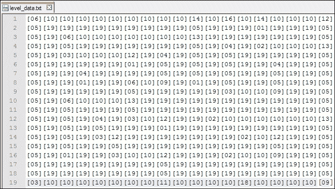
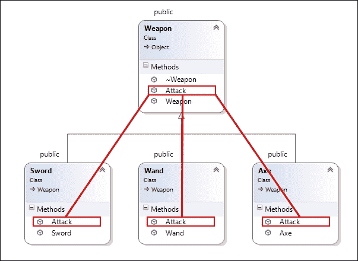
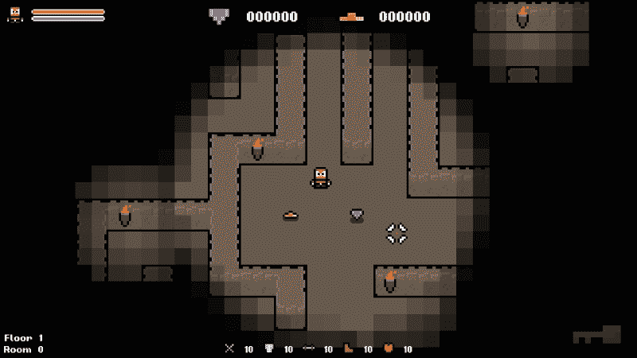

# 第二章。项目设置和细分

在我们开始为自己实现程序生成之前，我们将快速浏览本书提供的游戏模板。展望未来，重点将放在我们创建的程序系统上，而不是底层模板和引擎。鉴于此，在开始之前熟悉模板和引擎将是有益的。

我们还将看一下**简单快速多媒体库** (**SFML**)，我们将使用的框架。

在本章中，我们将介绍以下主题:

*   选择一个**集成开发环境** (**IDE**)
*   提供的游戏模板的细分
*   SFML 概述
*   多态性
*   项目设置和首次编译
*   对象管道

# 选择 IDE

在我们做任何事情之前，您将需要一个可靠的 IDE。你可能已经有了一个你喜欢用的。如果你有，没关系。但是，如果您不这样做，这里是我最喜欢的两个摘要。

## 微软 Visual Studio

Microsoft Visual Studio是 Microsoft 的行业标准 IDE。它支持多种语言，并提供多种测试和兼容性工具。它还与许多 Microsoft 服务捆绑在一起，使其成为 Windows pc 上开发的首选。使用 Microsoft Visual Studio 的优缺点如下:

【T0 �� Pros: 【T1 ��

*   它有许多免费版本可用
*   Microsoft Visual Studio 支持多种语言
*   它得到了微软的广泛支持
*   它具有高度可定制的环境，具有可停靠的窗口
*   它具有智能代码完成功能
*   它与许多 Microsoft 功能集成在一起

**缺点:**

*   它的完整的版本非常昂贵
*   它的免费版本是有限的
*   仅适用于视窗电脑

### 提示

Microsoft Visual Studio和各种其他 Microsoft 技术可在学生学习期间免费获得。要了解更多信息，请访问[https://www.dreamspark.com/Student/](https://www.dreamspark.com/Student/) 。

## 代码:: 块

代码::Blocks IDE是一个免费的、开源的、跨平台的 IDE，用于 C、C 和 Fortran 编程语言的开发。它是围绕插件体系结构构建的，这意味着它可以通过安装各种附加组件来高度定制，以创建最适合您需求的 IDE。

【T0 �� Pros: 【T1 ��

*   它是免费提供的
*   它适用于所有操作系统
*   通过安装附加组件，它是高度可定制的
*   它支持多个容器
*   它具有智能代码完成功能

**缺点:**

*   与 Microsoft Visual Studio 提供的功能相比，它具有较少的功能和工具

这两个 ide 都具有所需的功能，这些功能将使我们能够在 C 中创建游戏。因此，这一切都归结为个人喜好。我将建议 Visual Studio，这是我将在本书中使用的 Visual Studio。

## 其他 ide

Visual Studio和 Code::Blocks 只是可用的许多 ide 的两个示例。如果您不喜欢任何一个，以下是一些备用的跨平台 ide。所有这些都能够开发 C 代码:

*   NetBeans (Windows、Mac OS X 和 Linux)
*   Eclipse (Windows、Mac OS X 和 Linux)
*   代码精简版 (Windows、Mac OS X 和 Linux)

## 构建系统

使用 IDE 的一种替代方法是通过构建系统进行编译。这些系统将构建过程与您正在使用的 IDE 或代码编辑器分离，从而使您可以更好地控制该过程。构建系统允许您自动化构建过程的各个方面。它可能是简单的东西，例如增加内部编号，或者高级的东西，例如自动单元测试。

有许多可用的构建系统，包括以下内容:

*   制作
*   C 制造
*   MSBuild
*   Gradle

我们不会在书中介绍这些系统的设置或使用。因此，请前往每个系统各自的站点以获取文档和使用说明。

### 提示

有关构建系统及其提供的好处的更多信息，请访问[http://www.cs.virginia.edu/~ dww4s/articles/build_systems.html # mae](http://www.cs.virginia.edu/~dww4s/articles/build_systems.html#make)。

# 分解游戏模板

最好的学习方法是通过练习。例子很棒，但是没有什么比陷入困境并从事真正的游戏更重要的了。提供的游戏模板将使我们能够实现我们将在真实游戏中学习的系统，而不是将它们作为孤立练习的集合。

熟悉此模板不仅有助于使本书中的代码示例更加清晰，而且还可以使每章末尾的练习更加轻松。一旦我们完成了它，它还将允许您使用您正在学习的内容在项目中实现您自己的系统。

## 下载模板

在开始之前，请下载游戏模板，以便在运行某些关键点时获得可用的源代码。该模板可在 Packt 官方发布网站上下载，网址为[http://www.packtpub.com/support](http://www.packtpub.com/support)。

我们将很快设置它，但是现在，让我们快速看看它的一些关键功能。

## 类图

项目下载中包含的是我们解决方案的完整类图的图像。如果您对模板的结构有任何疑问，请参阅图表。

类图是一种查看软件完整结构的好方法。随着您的游戏越来越大，随着继承结构的扩大，它将不可避免地变得更加复杂。如果您有可用的工具，那么定期查看类图并保持其结构之上是一个好主意。它将帮助你确定你的结构需要在哪里工作，哪里不需要。

### 提示

在 Microsoft Visual Studio 中创建图表仅限于专业版或更高版本。但是，有各种免费工具可用，例如 Doxygen在[http://www.stack.nl/~dimitri/doxygen/index.html](http://www.stack.nl/~dimitri/doxygen/index.html)和 ArgoUML在[http://argouml.tigris.org/](http://argouml.tigris.org/) ，它们从源代码创建 UML 图。

## 对象层次结构

模板中的所有对象都遵循一个设置的继承层次结构。在所有类的基础上是`Object`类。这提供了一个`sprite`、一个`position`、一个`Update()`虚函数和一个`Draw()`虚函数。

所有类都从这个基类扩展，通过重写这些虚函数来实现自己的行为。在我们的`main`游戏类中，我们为主要的基类创建容器，将所有物品和敌人分组为单个集合，我们可以轻松迭代:

```cpp
std::vector<std::unique_ptr<Item>> m_items;
std::vector<std::unique_ptr<Enemy>> m_enemies;
```

基类指针的向量使我们能够利用多态性，并将从同一父类继承的所有类存储在单个数据结构中。如果你不熟悉多态性，不要担心。在本章结束时，我们将看一下多态性和对象管道，以将对象添加到游戏中。

### 提示

我们使用的是原始指针上的`std::unique_ptr`C 11 智能指针。有关智能指针及其优势的更多信息，请访问[https://msdn.microsoft.com/en-us/library/hh279674.aspx](https://msdn.microsoft.com/en-us/library/hh279674.aspx)。

## 级别数据

提供的游戏模板是一个`roguelike`模板。鉴于此，该级别被描述为网格。在这种情况下表示网格的最佳方法是使用 2D 数组，为了存储我们需要的所有信息，我们将使用名为`Tile`的自定义数据类型，如下所示:

```cpp
/**
 * A struct that defines the data values our tiles need.
 */ 
struct Tile {
TILE type;         // The type of tile this is.

int columnIndex;   // The column index of the tile.

int rowIndex;      // The row index of the tile.

sf::Sprite sprite; // The tile sprite.

int H;             // Heuristic / movement cost to goal.

int G;             // Movement cost. (Total of entire path)

int F;             // Estimated cost for full path. (G + H)

Tile* parentNode;  // Node to reach this node.
};
```

这个`struct`允许我们拥有一个`Tile`类型的单个 2D 数组，它可以存储每个图块需要的所有信息。这种方法在创建这种类型的游戏时非常普遍。数组在`Level`类中找到，该类在游戏开始时实例化。它封装了与该级别有关的所有数据。

目前，级别数据存储在一个简单的文本文件中，该文件在运行时通过对定义所有图块类型的枚举器执行简单查找来解析。在本章末尾，我们将研究一个示例。

下面的屏幕截图显示了级别数据的保存方式:



## 碰撞

碰撞基于您当前站立的图块的`ID`。每次玩家开始移动时，都会计算成功移动后他们将处于的位置。然后，该位置用于计算放置它们的网格`tile`。然后，该图块用于确定应执行的操作; 该操作可能涉及执行阻塞运动，拾取物品或造成损坏。

### 注意

这种类型的碰撞可能会导致子弹通过纸张的问题，但是考虑到游戏的速度，这在我们的案例中不是问题。如果您不知道此问题是什么，请在线查找; 它可能会在以后的项目中吸引您!

## 输入

输入通过自定义静态`Input`类处理。它的工作原理与 SFML 提供的`Input`类非常相似，但是它将许多可能的输入组合到一个调用中。例如，当检查是否按下左键时，它会检查*A*键、左箭头键、左*D* -Pad、模拟棒。如果要使用标准`Input`类来完成此操作，则必须分别检查所有四个。`Input`类提供了简化这一点。

密钥代码的公共`enum`在`input.h`中定义，并包含以下用于轮询输入的值:

```cpp
/**
 * An enum denoting all possible input keys.
 */
enum class KEY
{
  KEY_LEFT,
  KEY_RIGHT,
  KEY_UP,
  KEY_DOWN,
  KEY_ATTACK,
  KEY_ESC
};
```

为了检查输入，我们简单地静态调用`Inputs IsKeyPressed(KEY keycode)`，传递上述有效密钥代码之一。

# 简单快速的多媒体库 (SFML)

虽然您将具有 C 的经验，但您可能没有任何 SFML 经验。很好，这本书没有假设，所以现在让我们简要浏览一下

## 定义 SFML

**SFML**，简称为**简单快速的多媒体库**，是一个提供对多个系统组件的便捷访问的软件开发库。它是用 C 编写的，并被拆分为以下简洁的模块:

*   系统
*   窗户
*   图形
*   音频
*   网络

有了这个体系结构，你可以很容易地选择和选择你想如何使用 SFML，从一个简单的窗口管理器使用 OpenGL，到一个完整的多媒体库，能够制作完整的视频游戏和多媒体软件。

## 为什么我们要使用 SFML

SFML既是免费的，也是开源的，并且有一个充满活力的社区。通过活跃的论坛和官方网站上精选的精彩教程，为那些希望学习的人提供了大量资源。使用 SFML 的另一个令人信服的理由是，它是用 C 编写的，并且具有许多其他语言的绑定，这意味着您可以使用任何您喜欢的语言编写几乎代码。您希望使用的语言可能有一个绑定!

SFML 最吸引人的唯一功能是它是一个多平台库。用 SFML 编写的应用程序可以在大多数常见的操作系统 (包括 Windows，Linux 和 Mac OS X) 上进行编译和运行，而在撰写本书时，Android 和 iOS 版本即将上市。

### 提示

为了使您的应用程序跨各种平台交叉兼容，请记住，您还必须确保您的本机代码或使用的其他库 (如果有) 也是交叉兼容的。

## 学习 SFML

在本书的过程中，我们将看看 SFML 的特性和功能，我们将使用这些特性和功能来实现我们的程序系统，但仅此而已。我们不会深入研究图书馆，因为那需要整本书。幸运的是，Packt Publishing出版了一些很棒的书。

*   SFML 游戏开发在[https://www.packtpub.com/游戏开发/sfml 游戏开发](https://www.packtpub.com/game-development/sfml-game-development)
*   SFML 要点[https://www.packtpub.com/游戏开发/sfml 要点](https://www.packtpub.com/game-development/sfml-essentials)
*   SFML 蓝图[https://www.packtpub.com/游戏开发/sfml 蓝图](https://www.packtpub.com/game-development/sfml-blueprints)

如果您想了解有关 SFML 的更多信息，那么这些书是一个很好的起点。在官方 SFML网站上还有一些很棒的教程以及活跃的论坛。有关更多信息，请访问[http:// www.sfml-dev.org/learn.php](http://www.sfml-dev.org/learn.php)。

## 替代品

虽然 SFML 是跨平台游戏开发的一个很好的选择，但它并不是唯一的选择。有许多很棒的图书馆可用，每个图书馆都有自己的方法和风格。因此，尽管我们将在该项目中使用 SFML，但建议您为下一个项目选购。你可能会碰到你最喜欢的新图书馆。

以下是一些建议，供将来参考:

*   SDL2在[https://www.libsdl.org/download-2.0.php](https://www.libsdl.org/download-2.0.php)
*   快板在[http://liballeg.org/](http://liballeg.org/)
*   一元游戏在[http://www.monogame.net/downloads/](http://www.monogame.net/downloads/)

# 多态性

在开始使用游戏模板之前，我们将看一下多态性。这是面向对象编程的一个重要功能，我们将在我们将创建的许多过程系统中利用它。因此，重要的是，你不仅要对它是什么有一个深刻的理解，还要对用来实现它的技术和潜在的陷阱有一个深刻的理解。

### 提示

如果您已经对多态性有了很强的理解，请随意跳过本节或前往[https://msdn.microsoft.com/en-us/library/z165t2xk(v = vs.90)](https://msdn.microsoft.com/en-us/library/z165t2xk(v=vs.90)) 进行更深入的主题讨论。

多态性是通过单独实现的公共接口访问不同对象的能力。这是一个非常正式的定义。因此，让我们将其分解为用于实现它的各个技术和功能。值得注意的是，虽然多态性是游戏行业的标准方法，但它仍然是其他编程流派的选择。

## 继承

遗传可能是实现多态性的关键因素。继承是通过继承其变量和函数来扩展现有的类，然后添加您自己的

让我们来看看一个典型的游戏例子。让我们假设我们有三种不同武器的游戏: 一把剑，一根魔杖和一把斧头。这些类将共享一些常见的变量，例如攻击强度，耐用性和攻击速度。创建三个单独的类并将此信息添加到每个类将是浪费，因此我们将创建一个包含所有共享信息的父类。然后，孩子们将继承这些价值观，并以他们想要的方式使用它们。

继承创造了一种 “是” 的关系。这意味着由于斧头是从武器继承而来的，因此斧头是一种武器。这种在父类中创建公共接口并通过子类以独特的方式实现它的概念是实现多态性的关键。

### 注意

通过接口，我的意思是父类传递给其子级的函数和变量的集合。

下图以简单的类图的形式说明此场景:



单个武器中的突出显示的`Attack()`功能均继承自**武器**类中定义的单个`Attack()`功能。

### 提示

为了保持适当的封装和范围，重要的是要为我们的变量和函数提供正确的可见性修饰符。如果您不确定，或者可以快速提醒一下，请前往[https://msdn.microsoft.com/en-us/library/kktasw36.aspx](https://msdn.microsoft.com/en-us/library/kktasw36.aspx)。

## 虚拟函数

继续通用武器示例，我们现在有一个父类，它提供了许多所有子类都将继承的函数和变量。为了能够表示我们自己不同于父类的行为，我们需要能够覆盖父函数。这是通过使用虚拟功能来实现的。

虚函数是可以通过实现类来覆盖的函数。为了做到这一点，父类必须将函数标记为虚拟。这是通过简单地将虚拟关键字前缀为这样的函数声明来完成的:

```cpp
Virtual void Attack();
```

在子类中，如果两个函数的签名相同，我们可以通过提供自己的定义来覆盖该函数。此覆盖是自动完成的，但是，C 11 引入了`override`关键字来专门表示函数将覆盖父函数的位置。override 关键字是可选的，但它被认为是好的做法，建议这样做。它的用途如下:

```cpp
Void Attack() override;
```

C ++ 11 也引入了`final`关键字。此关键字用于指定派生类中不能重写的虚函数。它也可以应用于不能继承的类。您可以使用 final 关键字如下:

```cpp
Void Attack() final;
```

在这种情况下，不能通过继承类来覆盖`Attack()`函数。

## 纯虚函数

我们刚刚覆盖的虚拟函数允许一个函数被继承类覆盖。重写是可选的，因为如果在子类中找不到父类，则父类将提供默认实现。

但是，纯虚拟函数不提供默认实现。因此，它必须通过继承类来实现。此外，如果一个类包含一个纯虚函数，它就会变得抽象。这意味着它不能被实例化，只有继承类，前提是它们提供了纯虚函数的实现，可以是如果一个类从抽象类继承，并且不提供纯虚函数的实现，那么这个类也会变成抽象的。

用于声明纯虚函数的语法如下:

```cpp
Virtual void Attack() = 0;
```

在`Weapon`父类的示例中，该类由`Sword`，`Axe`和`Wand`继承，将`Weapon`设为抽象类是有意义的。我们永远不会实例化`Weapon`对象; 它的唯一目的是为其子对象提供一个通用接口。由于每个子类都需要有一个`Attack()`函数，因此在`Weapon`中使`Attack()`函数纯虚拟是有意义的，因为我们知道每个孩子都会实现它。

## 指针和对象切片

多态性难题的最后一部分是指针的使用。考虑以下两行代码:

```cpp
Weapon myWeapon = Sword();
Std::unique_ptr<Weapon> myWeapon = std::make_unique<Sword>();
```

在第一行中，我们没有使用指针; 在第二个中，我们是。这是一个看似很小的差异，但它产生了截然不同的结果。为了正确地证明这一点，我们将看一个小程序，它定义了许多武器。

### 提示

如果`Weapon`类包含一个纯虚函数，则不会编译前面代码的第一行，因为它将是抽象的并且不能实例化。

您可以从 Packt 发布网站下载此程序的代码。它将在`Examples`文件夹中，项目名称为`polymorphism_example`:

```cpp
#include <iostream>

// We're using namespace std here to avoid having to fully qualify everything with std::
using namespace std;

int main()
{

  // Here we define a base Weapon struct.
  // It provides a single data type, and a method to return it.
  struct Weapon
  {
    string itemType = "Generic Weapon";

    virtual string GetItemType()
    {
      return itemType;
    }
  };

  // Here we inherit from the generic Weapon struct to make a specific Sword struct.
  // We override the GetItemType() function to change the itemType variable before returning it.
  struct Sword : public Weapon
  {
    string GetItemType() override
    {
      itemType = "Sword";
      return itemType;
    }
  };

  Weapon myWeapon = Sword();

  // output the type of item that weapon is then wait.
  cout << myWeapon.GetItemType().c_str() << endl;
  std::cin.get();

  return 0;
}
```

在这个代码中，我们创建了一个基本结构`Weapon`。然后，我们从它继承到创建一个名为`Sword`的特定实现。基`Weapon`结构定义了`GetItemType()`函数，`Sword`重写它来更改，然后返回项目类型。这是遗传和多态性的一个非常简单的例子，但是我们需要知道一些重要的事情，否则可能会绊倒我们。

按照当前的代码，以以下方式实例化`Weapon`对象:

```cpp
Weapon myWeapon = Sword()
```

让我们运行代码，看看我们得到了什么:


即使我们给分配了`Sword`对象，它也是`Weapon`对象。这里发生了什么？问题是，`myWeapon`被赋予了一种固定类型的武器。当我们尝试为它分配一个`Sword`对象时，它会被传递给`Weapon`的`copy`构造函数并被切片，只剩下一个`Weapon`对象。结果，当我们调用`GetItemType()`函数时，我们调用`Weapon`中的函数。

### 提示

要更深入地解释对象切片，请前往[http://www.bogotobogo.com/cplusplus/slicing.php](http://www.bogotobogo.com/cplusplus/slicing.php)。

为了避免这种情况并充分利用多态性，我们需要使用指针。让我们对代码进行以下更改:

```cpp
  // Create our weapon object.
  //Weapon myWeapon = Sword();
 std::unique_ptr<Weapon> myWeapon = std::make_unique<Sword>();

```

### 提示

智能指针 (例如`unique_ptr`) 需要`include <memory>`。因此，不要忘记将其添加到文件顶部。

由于我们现在已经将`myWeapon`更改为指针，因此我们还需要更改以下内容:

```cpp
// Output the type of item that weapon is then wait.
//cout << myWeapon.GetItemType().c_str() << endl;
cout << myWeapon->GetItemType().c_str() << endl;

```

在使用指针时，我们需要使用`->`运算符来访问其变量和函数。现在，让我们重新运行代码，看看输出是什么:


这次，我们按预期调用了`Sword`结构中的重写函数，它归结为我们定义`myWeapon`的方式。

由于`myWeapon`是现在是指向`Weapon`对象的指针，因此我们避免对象切片。由于`Sword`源自`Weapon`，指向内存中的`Sword`不是问题。它们共享一个公共接口，因此我们实现了这种压倒一切的行为。回到最初的定义，多态是通过单独实现的通用接口访问不同对象的能力。

# roguelike 模板设置

本书提供了一个模板，专门为本书创建的`roguelike`游戏。它旨在接收我们将要介绍的工作，在本书的最后，您将拥有一个功能齐全的 roguelike 游戏，该游戏可以实现您将学到的所有知识。现在我们已经了解了对多态性的理解，让我们开始模板设置。第一步是下载和链接 SFML。

### 提示

如所提供的，该项目与 SMFL 32 位 windows 库链接。这应该适合大多数系统。如果这与您的系统兼容，则可以跳过以下步骤。

## 下载 SFML

SFML 有多种不同的预编译包。例如，撰写本书时的最新版本仅 Windows 可用 12 个软件包，因此为系统下载正确的软件包非常重要。以下步骤将帮助您下载和设置 SFML:

1.  访问 http:// www.sfml-dev.org/download.php 找到 SFML 下载页面。除非您特别需要针对 64 位计算机，否则请选择 32 位库。32 位程序在 64 位计算机上可以正常工作。
2.  接下来，您需要为编译器选择合适的包。如果您使用的是 Microsoft Visual Studio，则只需要选择与您的版本匹配的年份，并且如果您使用的是 Code::Blocks 或任何其他 IDE，选择您正在使用的**GNU 编译器集合** (**GCC**) 的版本。
3.  确定了系统的正确版本后，请下载它并将`.zip`文件的内容提取到要保存 SFML 的位置。此位置与您的项目无关; 他们不需要共享目录。

### 提示

如果您愿意或需要，您可以自行构建 SFML 来创建一个自定义包。有关如何执行此操作的说明，请访问[https://github.com/SFML/SFML](https://github.com/SFML/SFML)。

## 链接 SFML

链接SFML 有两种方式: **静态**和**动态**库。静态库是编译到可执行文件中的库。这意味着您的可执行文件更大，但是您不必担心在运行时获取库。动态库不会链接到可执行文件，这会导致较小的可执行文件，但会创建依赖项。

### 提示

有关和`dynamic`库之间的差异的更多信息，请访问[http://www.learncpp.com/cpp-tutorial/a1-static-and-dynamic-libraries/](http://www.learncpp.com/cpp-tutorial/a1-static-and-dynamic-libraries/) 。

我们将动态链接，这意味着要运行游戏，您将需要`.dll`文件。

为此，首先将游戏需要的`DLL`文件从 SFML 源复制到项目的可执行位置。将所有文件从`<sfml-install-path/bin>`复制到`<project-location/Debug>`。

接下来，我们必须告诉编译器 SFML 头在哪里，链接器 out 库在哪里。头是`.hpp`文件，库是`.lib`文件。根据您使用的 IDE，此步骤略有不同。

在 Microsoft VisualStudio 中，将以下内容添加到项目的属性中:

*   SFML 标头 (`<sfml-install-path>/include`) 到**C/C** | **常规** | **附加包含目录**的路径
*   SFML 库 (`<sfml-install-path>/lib`) 到**链接器** | **常规** | **附加库目录**的路径

在 Code::Blocks 中，将以下内容添加到项目的**构建选项**和**搜索目录**选项卡中:

*   SFML 头 (`<sfml-install-path>/include`) 到搜索目录的路径
*   SFML 库 (`<sfml-install-path>/lib`) 到`Linker`搜索目录的路径

### 提示

这些路径在`Debug`和`Release`配置中是相同的。因此，它们可以为项目全局设置。

最后一步是将我们的项目链接到正在使用的 SFML 库。SFML 由五个模块组成，但我们不会全部使用它们。我们使用的是`System`、`Windows`、`Graphics`和`Audio`。因此，我们只需要链接到这些库。与上一步不同，项目配置很重要。`Debug`和`Release`配置有单独的库。因此，您需要确保链接正确的链接。

在`Debug`配置中，我们需要添加以下库:

*   `sfml-system-d.lib`]
*   `sfml-window-d.lib`]
*   `sfml-graphics-d.lib`]
*   `sfml-audio-d.lib`]

现在，对**Release**配置做同样的操作。但是，从每个中删除`–d`。例如，我们在**调试**配置中添加`sfml-system-d.lib`，在**版本**配置中添加`sfml-system.lib`。

要将它们添加到 Microsoft Visual Studio 中，必须通过导航到**链接器** | **输入** | **附加依赖项**将它们添加到项目的属性中。

要将这些添加到代码:: 块中，必须将它们添加到项目的构建选项中的**链接器设置**选项卡下的**链接库**列表中。

### 提示

如果您对此设置有任何疑问，请访问[http:// www.sfml-dev.org/learn.php](http://www.sfml-dev.org/learn.php)以获取完整的细分以及图像。

## 运行项目

现在 SFML 已链接到我们的项目，我们应该准备好执行第一次构建。下面的截图显示了我们目前空的 roguelike 游戏:


由于项目当前，我们有一个可运行的应用程序，它会在固定房间中产生一个玩家。第一个任务涉及添加一个项目。

## 添加项目

我们创建的所有项目都需要从基`Item`类继承，因为所有游戏项目都存储在`std::unique_ptr<Item>`类型的单个向量中。有了这个数据结构，我们可以利用多态性，并将所有项目子类存储在一个结构中; 通过这个，我们可以更新和绘制每个项目。

要添加到此向量，只需通过唯一指针实例化一个新项目即可。然后，使用`.push_back()`方法将其添加到向量中。由于我们使用的是唯一指针，所以我们必须使用`std::move()`来做到这一点。

### 提示

如果您不清楚为什么我们必须在此处使用`std::move`，请在 Internet 上查找唯一的指针。

在`Game::PopulateLevel` 函数中，让我们添加一个宝石项，如下所示:

```cpp
// Create a gem object.
std::unique_ptr<Gem> gem = std::make_unique<Gem>();

// Set the gem position.
gem->SetPosition(sf::Vector2f(m_screenCenter.x + 50.f, m_screenCenter.y));

// Add the gem to our collection of all objects.
m_items.push_back(std::move(gem));

```

我们要做的就是通过一个唯一的指针创建一个新对象，给它一个位置，然后使用`std::move`函数将其添加到级别中所有项目的列表中。放松!

## 更新和绘制

一旦将一项添加到所有对象的向量中，它将自动更新:

```cpp
// Update all items.
UpdateItems(playerPosition);
```

此函数迭代所有项，检查它们是否已被收集; 如果不是这样，则更新它们。每个对象的`Update()`函数都有一个名为`timeDelta`的参数。这是一个包含自上次更新以来已经过去的时间的浮动。它用于主外部游戏循环，以将游戏逻辑固定在 60 fps。

### 提示

要了解更多关于主游戏循环的信息，请访问[http://gafferongames.com/游戏物理/修复你的时间步/](http://gafferongames.com/game-physics/fix-your-timestep/)，这是一篇关于这个主题的很棒的文章。

项目以类似的方式绘制; 它们的容器只是在`Game::Draw`函数中迭代。这个循环如下:

```cpp
// Have all objects draw themselves. 
for (const auto& item : m_items) 
{ 
    item->Draw(m_window, timeDelta); 
}
```

`m_window`变量是指向渲染窗口的指针。因此，我们将其传递给每个对象，以便它可以使用它来绘制自己。

现在，如果您运行游戏，您将看到房间中的宝石和黄金，如下面的屏幕截图所示:



# 练习

为了帮助你测试你对本章内容的了解，这里有一些你应该做的练习。对于本书的其余部分来说，它们不是必须的，但是对它们进行研究将帮助您评估所涵盖材料的优势和劣势。

1.  为您的游戏创建一个名称，并更改主窗口的文本以反映此更改。
2.  Consider the following code:

    ```cpp
    class A
    {
    public:
        int x;
    protected:
        int y;
    private:
        int z;
    };

    class B : protected A
    {

    };
    ```

    `class B`中`x`、`y`、`z`的可见性是多少？

3.  向级别添加更多项目。

# 总结

在本章中，我们进行了必要的准备工作，以便开始对游戏进行编码并创建程序系统。我们研究了我们将使用的软件和库，以及我们将扩展的游戏模板。我们还参加了多态速成课程以及我们将用来实现它的技术。

我们现在准备开始创建我们自己的程序系统。我们刚刚介绍的基础工作并不令人兴奋，但对于理解我们在前进时将要介绍的工作至关重要。在下一章中，我们将使用有关 C 数据类型的随机数生成的知识来生成随机项目，并为玩家提供随机统计信息。