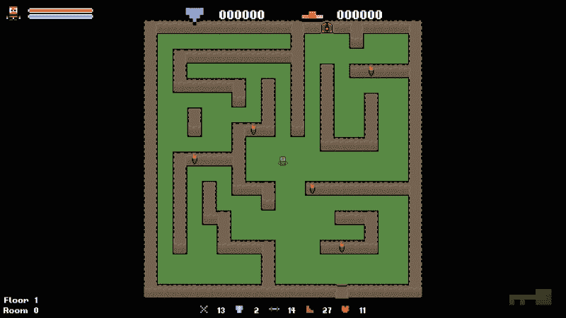
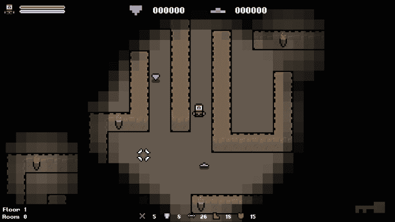
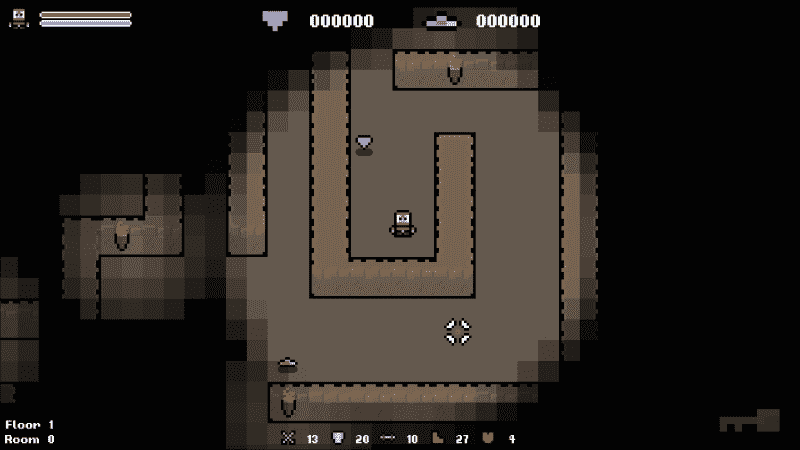
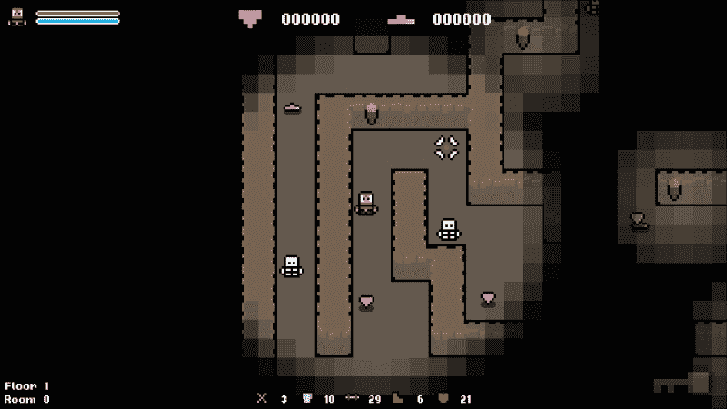

# 四、使用程序填充游戏环境

现在我们已经很舒服地使用具有核心 C 数据类型的**随机数生成器** (**RNG**)，让我们来看看如何创建高度随机化的环境。这将包括物品、敌人等的随机生成和定位。在本书结尾之前，我们还将在本章中讨论随机地图的生成。

生成对象的方式将在很大程度上取决于您的级别数据的基础结构。对于大多数 2D 游戏，您将能够采取与本章演示的方法相似 (甚至不相同) 的方法。然而，3D 游戏需要更多的工作，因为有一个额外的维度需要处理，但原则仍然有效。

在本章中，我们将介绍以下主题:

*   程序填充环境的障碍
*   定义生成区域
*   随机选择一个游戏`tile`
*   在随机位置产卵项目
*   在程序上生成对环境的更改

# 潜在障碍

随机生成游戏环境并不像 5 月 1 日看起来那么简单。这不仅仅是在一个级别的范围内生成一个随机数的情况。尽管这在技术上可能有效，但那里没有控制，因此产生的环境将有许多缺陷。物体可能重叠，位于无法到达的地方，或者排列顺序不佳。为了生成有意义且可播放的关卡，需要进行更多的控制。

## 保持在一个级别的范围内

我敢肯定在某个时候，我们都玩过一个游戏，其中一个项目超出了我们的能力范围。令人讨厌的是，光亮的新物品遥不可及，但是当在地图周围随机生成对象时，很容易发生这种情况。因此，重要的是要建立精确的边界，在该边界内可以生成对象。

可以想象，此任务的复杂性将与您的环境的复杂性相匹配。值得庆幸的是，我们的水平被描述为一个简单的 2D 数组。因此，计算边界相当容易。

## 避免物体重叠

即使你完美地定义了你的水平界限，你仍然不是家，也不是干的。环境一般不是空的，多是布满了风景和其他游戏对象。重要的是，在选择随机生成坐标时要考虑到这些对象，以免在其中生成对象，再次将项目推到玩家无法触及的地方。

同样，我们不必为此担心太多，因为我们将拥有没有风景的简单关卡。

## 创建有意义的关卡

毕竟说了并做了，水平必须有意义。即使我们避免产生玩家无法企及的物品，并且不会彼此重叠，但如果它们都在一个较远的角落产生，那也不好。

我们需要创建合适的参数，我们的 RNG 在其中运行，因此我们保持对结果的适当控制水平。这是程序生成游戏的主要陷阱之一。一次又一次，你会看到一个没有多大意义的水平，因为算法产生了一个奇怪的结果。

# 水平瓷砖

在我们开始使用`level`网格之前，我们需要知道它是如何设置的!我们的`level`被描述为自定义类型`Tile`的 2D 数组，在`Level.h`中定义的`struct`:

```cpp
// A struct that defines the data values our tiles need.
struct Tile
{
TILE type;          // The type of tile this is.
int columnIndex;    // The column index of the tile.
int rowIndex;       // The row index of the tile.
sf::Sprite sprite;  // The tile sprite.
int H;              // Heuristic / movement cost to goal.
int G;              // Movement cost. (Total of entire path)
int F;              // Estimated cost for full path. (G + H)
Tile* parentNode;   // Node to reach this node.
};
```

在这一点上，不要担心最后的四个值; 我们将在稍后到达路径查找部分时使用它们!现在，我们只需要知道每个`tile`结构都存储其类型，在 2D 数组中的位置以及其精灵。所有可能的`tile`类型都在`Util.h`中的枚举器中定义，如下所示:

```cpp
// All possible tiles.
enum class TILE {
  WALL_SINGLE,
  WALL_TOP_END,
  WALL_SIDE_RIGHT_END,
  WALL_BOTTOM_LEFT,
  WALL_BOTTOM_END,
  WALL_SIDE,
  WALL_TOP_LEFT,
  WALL_SIDE_LEFT_T,
  WALL_SIDE_LEFT_END,
  WALL_BOTTOM_RIGHT,
  WALL_TOP,
  WALL_BOTTOM_T,
  WALL_TOP_RIGHT,
  WALL_SIDE_RIGHT_T,
  WALL_TOP_T,
  WALL_INTERSECTION,
  WALL_DOOR_LOCKED,
  WALL_DOOR_UNLOCKED,
  WALL_ENTRANCE,
  FLOOR,
  FLOOR_ALT,
  EMPTY,
  COUNT
};
```

这为每个`tile`类型提供了一个字符串常量。因此，我们可以用这些值来代替，而不是使用模糊的数字。有了这个排序，让我们开始吧。

# 定义生成区域

现在我们知道前方有哪些障碍，以及关卡数据是如何存储的，让我们看看如何在`roguelike`对象的随机位置产生项目。

## 计算水平边界

第一个步骤是计算水平边界。由于我们正在制作一个 2D`roguelike`对象，以 2D 数组描述，因此我们需要确定适合在其上生成项目的图块。如果这是针对 3D 游戏完成的，则还必须考虑第三轴。尽管我们可以找到地图的左上角并计算到右下角的距离，但这几乎肯定会引起问题。

我们之前提到，重要的是在有效级别区域内生成项目。如果我们采用这种简单的方法，就会冒着在墙壁上产卵的风险。下面的伪代码显示了如何实现这一点:

```cpp
  for (int i = 0; i < GRID_WIDTH; ++ i)
  {
    for (int j = 0; j < GRID_HEIGHT; ++ j)
    {
      m_grid[i][j].markAsSpawnable();
    }
  }
```

下面的屏幕截图显示了如果我们在游戏中使用这种简单的方法，则生成区域:


正如我们所看到的，创建的生成区域超过了可播放的级别区域，尽管它在技术上处于级别范围内。

## 检查底层博弈网格

在我们的案例中，最简单的方法是通过检查底层游戏网格。由于水平网格中的每个地砖都有一个唯一的瓷砖类型，表示它是什么样的瓷砖，我们可以在水平网格上迭代，并且仅将具有有效类型的瓷砖标记为可能的生成位置。以前的伪代码已通过以下方式进行了修改和更新，以进行此检查:

```cpp
for (int i = 0; i < GRID_WIDTH; ++ i)
{
    for (int j = 0; j < GRID_HEIGHT; ++ j)
    {
        if (m_grid[i][j].type == TILE::FLOOR || m_grid[i][j].type == TILE::FLOOR_ALT)
        { 
            m_grid[i][j].markAsSpawnable();
        }
    }
}
```

如果我们像这样运行检查，我们将最终得到以下可能的生成区域:



如您所见，这是一个更好的生成项目的区域。下一步是在此区域内选择一个点作为产卵位置。

# 选择合适的游戏磁贴

现在，为了找到合适的图块，我们将生成随机生成坐标。我们知道所有具有`TILE::FLOOR`或`TILE::FLOOR_ALT`类型的瓷砖都是地砖。因此，我们可以随机选择一个图块，并推断出它是否适合项目的产生。

为了避免自己进行这些检查，项目提供了`Level::IsFloor`函数。这是不言自明的; 您可以通过它一个瓷砖或一个的索引，如果它是地砖，它将返回 true。从现在开始，我们将使用它来检查图块是否对生成项目有效。

## 随机选择一个磁贴

我们将研究的第一个函数是从基础网格中选择一个值。在我们的案例中，级别数据以 2D 数组描述。因此，我们只需要生成一个随机列和一个行索引。

### 提示

请记住，这个范围是行数和列数-1，因为所有索引都从 0 开始。如果我们有一个包含 10 行和列的网格，那么它们的编号为 0 到 9，总数为 10。

下面是一些伪代码，用于为具有 10 行和 10 列的 2D 数组生成随机索引:

```cpp
// Generate random indices.
int randomColumn = std::rand() % 10;
int randomRow = std::rand() % 10;

// Get the tile of the random tile.
Tile* tile = m_level.GetTile(randomColumn, randomRow);
```

要从级别获取`Tile`对象，我们只需要调用`Level::GetTile`函数并传递随机生成的索引即可。

## 检查瓷砖是否合适

要检查a`tile`是否有效，我们可以使用前面看过的`Level::IsFloor`函数。下面的伪代码将实现这一点:

```cpp
// Get the type of the random tile.
Tile* tile = m_level.GetTile(1, 1);

// Check if the tile is a floor tile.
if (m_level.IsFloor(*tile))
{
  // tile is valid
}
```

## 转换为绝对位置

现在，我们可以在游戏网格中选择有效的`tile`，我们需要将该位置转换为绝对屏幕位置。要将索引转换为相对于网格的位置，我们只需将它们乘以游戏中图块的宽度即可。在我们的例子中，瓷砖的大小为 50 平方像素。例如，如果我们在网格中的位置`[1][6]`，相对于网格的位置将是 50*300。

现在我们只需要将网格的位置添加到这些值，使它们相对于我们的窗口绝对协调。将网格位置转换为绝对位置的做法将派上用场。因此，让我们将行为封装在自己的函数中。

在`Level.h`中，添加以下代码:

```cpp
/**
 * Returns the position of a tile on the screen.
 */
sf::Vector2f GetActualTileLocation(int columnIndex, int rowIndex);
```

在`Level.cpp`中，添加以下函数的定义:

```cpp
sf::Vector2f Level::GetActualTileLocation(int columnIndex, int rowIndex)
{
    sf::Vector2f location;

    location.x = m_origin.x + (columnIndex * TILE_SIZE) + (TILE_SIZE / 2);
    location.y = m_origin.y + (rowIndex * TILE_SIZE) + (TILE_SIZE / 2);

    return location;
}
```

# 在随机位置生成项目

现在，让我们把所有的绑在一起，在地图中随机生成项目。以下是我们将采取的步骤的快速概述:

1.  从**级别**数据中选择一个随机`tile`。
2.  检查此图块是否为`floor`图块。如果没有，请转到步骤 1。
3.  将图块位置转换为绝对位置，并将其提供给项目。

第一步是在**级别**数据中选择一个随机图块。在本章的前面，我们介绍了如何实现这一目标:

```cpp
// Declare the variables we need.
int columnIndex(0), rowIndex(0);
Tile tileType;

// Generate a random index for the row and column.
columnIndex = std::rand() % GRID_WIDTH;
rowIndex = std::rand() % GRID_HEIGHT;

// Get the tile type.
tileType = m_level.GetTileType(columnIndex, rowIndex);
```

我们现在需要检查随机选择的图块是否适合项目的生成。我们知道我们可以通过检查图块的类型来做到这一点，但是我们需要将其合并到某种循环中，这样如果随机选择的图块不合适，它会再试一次。为此，我们将在`while`语句中包装随机图块选择代码，如下所示:

```cpp
// Declare the variables we need.
int columnIndex(0), rowIndex(0);

// Loop until we select a floor tile.
while (!m_level.IsFloor(columnIndex, rowIndex))
{
    // Generate a random index for the row and column.
    columnIndex = std::rand() % GRID_WIDTH;
    rowIndex = std::rand() % GRID_HEIGHT;
}
```

### 提示

值得注意的是，这里有一个 while 循环并不适合所有游戏类型。在我们的游戏中，与无法产生物品的区域相比，可以产生物品的区域更多。因此，可以很容易地找到有效的位置。如果不是这种情况，并且缺少合适的产卵位置，那么 while 循环可能会无限期地阻止游戏，因为它会循环以找到该区域。非常谨慎地使用`while`语句。

这个代码现在循环，直到它找到一个合适的，但仍然是随机的，我们可以在其中生成项目。这是非常有用的，很可能会被重复使用多次。因此，我们将为代码 `Level::GetRandomSpawnLocation` 创建一个专用函数，如下所示:

```cpp
/**
 * Returns a valid spawn location from the currently loaded level
 */
sf::Vector2f GetRandomSpawnLocation();
```

现在，在新函数的正文中添加以下代码:

```cpp
// Returns a valid spawn location from the currently loaded level.
sf::Vector2f Level::GetRandomSpawnLocation()
{
    // Declare the variables we need.
    int rowIndex(0), columnIndex(0);

    // Loop until we select a floor tile.
    while (!m_level.IsFloor(columnIndex, rowIndex))
    {
        // Generate a random index for the row and column.
        columnIndex = std::rand() % GRID_WIDTH;
        rowIndex = std::rand() % GRID_HEIGHT;
    }

    // Convert the tile position to absolute position.
    sf::Vector2f tileLocation(m_level.GetActualTileLocation(columnIndex, rowIndex));

    // Create a random offset.
    tileLocation.x += std::rand() % 21 - 10;
    tileLocation.y += std::rand() % 21 - 10;

    return tileLocation;
}
```

请注意，在函数的末尾，我们添加了一个`return`语句。当找到合适的`tile`时，我们使用前面添加的函数获取绝对位置，然后返回值。我们还在物品的坐标上添加了一个随机偏移量，这样它们就不会全部固定在它们所在的`tile`的死点上。

现在，我们有一个函数，该函数将返回关卡中合适的生成位置的绝对坐标。确实非常方便!最后一步是将此函数合并到`Game::PopulateLevel`生成函数中。

目前，我们已经手动设置了项目的位置。要使用新函数，只需将固定值替换为调用`Level::GetRandomSpawnLocation()`函数的结果:

```cpp
    item->SetPosition(sf::Vector2f(m_screenCenter.x, m_screenCenter.y));
    item->SetPosition(m_level.GetRandomSpawnLocation());
    m_items.push_back(std::move(item));
}
```

现在，每次我们创建一个项目时，它的位置都会随机生成。如果我们现在运行游戏，我们将看到物品随机散布在关卡中，但仅在有效且玩家可以到达的瓷砖上散布:



## 扩大产卵系统

在最后一章中，我们介绍了枚举器的使用; 我们将在这里充分利用它。我们将把`spawn`项代码分解成自己的专用函数。这将使我们更好地控制如何填充级别。我们还将扩展此系统，以包括所有物品和敌人!

## 使用枚举符表示对象类型

构建此系统的第一步是查看项目。在`Util.h`中，所有项目类型都在以下枚举器中描述:

```cpp
// Spawnable items.
enum class ITEM {
  HEART,
  GEM,
  GOLD,
  POTION,
  KEY,
  COUNT
};
```

在决定需要产生哪些项目时，我们将从这些枚举器值中选择随机值。

## 可选参数

我们将在这个系统中使用的另一种技术是使用可选参数。默认情况下，该函数将在随机位置生成一个项目，但是我们有时可能希望使用设置的位置覆盖此行为。这是通过使用可选参数来实现的。

考虑以下函数声明:

```cpp
void TestFunction(OBJECT object, sf::Vector2f position);
```

从这个声明创建的`TestFunction()`函数需要需要传递的 spawn 坐标。我们可以传递一个等于`{0.f, 0.f}`的`sf::Vector`值，然后忽略这些值，但这有点混乱。

可选参数是那些在函数声明中被赋予默认值的参数。如果函数调用中没有提供这些参数，则使用默认值。让我们重写这个相同的函数声明，这次通过以下方式使用可选参数:

```cpp
void TestFunction(OBJECT object, sf::Vector2f position = { -1.f, -1.f } );
```

### 提示

另一种方法是创建两个不同的功能。一个函数采用参数，而另一个则不采用; 您可以给它们不同的名称以突出显示差异。

现在，`position`变量的默认值为`{-1.f, -1.f}`。因此，如果在函数调用中没有传递任何值，则将使用这些默认值。这是我们需要从生成函数中获得的行为。因此，考虑到这一点，让我们声明一个名为`Game::SpawnItem`的新函数，如下所示:

```cpp
/**
 * Spawns a given item in the level.
 */
void SpawnItem(ITEM itemType, sf::Vector2f position = { -1.f, -1.f });
```

设置了默认值后，我们现在需要确定是否应该使用它们。为了检查这一点，我们可以只计算`position`变量的*x*和*y*值。如果*x*和*y*保持在`-1.f`，那么我们知道用户没有覆盖它们，并且想要随机生成一个值。但是，如果*x*和*y*不是`-1.f`，那么它们已经被覆盖了，我们应该使用它们。

### 提示

我使用`-1.f`作为我的默认参数，因为它是一个无效的生成坐标。默认参数应允许您轻松确定它们是否已被覆盖。

以下几行代码将随机选择一个生成位置:

```cpp
// Choose a random, unused spawn location if not overridden.
sf::Vector2f spawnLocation;
if ((position.x >= 0.f) || (position.y >= 0.f))
{
    spawnLocation = position;
}
else
{
    spawnLocation = m_level.GetRandomSpawnLocation();
}
```

由于`position`变量是可选的，因此以下两个函数调用现在都有效:

```cpp
SpawnITem(GOLD);
SpawnITem(GOLD, 100.f, 100.f);
```

## 完整的生成函数

现在，让我们将所有这些放在一起并创建`SpawnItem()`函数，如下所示:

```cpp
// Spawns a given object type at a random location within the map. Has the option to explicitly set a spawn location.
void Game::SpawnItem(ITEM itemType, sf::Vector2f position)
{
    std::unique_ptr<Item> item;

    int objectIndex = 0;

    // Choose a random, unused spawn location.
    sf::Vector2f spawnLocation;

    if ((position.x >= 0.f) || (position.y >= 0.f))
    {
        spawnLocation = position;
    }
    else
    {
        spawnLocation = m_level.GetRandomSpawnLocation();
    }

    // Check which type of object is being spawned.
    switch (itemType)
    {
        case ITEM::POTION:
            item = std::make_unique<Potion>();
        break;

        case ITEM::GEM:
            item = std::make_unique<Gem>();
        break;

        case ITEM::GOLD:
            item = std::make_unique<Gold>();
        break;

        case ITEM::KEY:
            item = std::make_unique<Key>();
        break;

        case ITEM::HEART:
            item = std::make_unique<Heart>();
        break;
    }

    // Set the item position.
    item->SetPosition(spawnLocation);

    // Add the item to the list of all items.
    m_items.push_back(std::move(item));
}
```

要测试新功能，我们可以通过以下方式更新`Game::PopulateLevel`功能:

```cpp
if (canSpawn)
{
  int itemIndex = std::rand() % 2;
 SpawnItem(static_cast<ITEM>(itemIndex));
  std::unique_ptr<Item> item;

  switch (itemIndex)
  {
  case 0:
    item = std::make_unique<Gold>();
    break;

  case 1:
    item = std::make_unique<Gem>();
    break;
  }

  item->SetPosition(sf::Vector2f(m_screenCenter.x, m_screenCenter.y));
  item->SetPosition(m_level.GetRandomSpawnLocation());
  m_items.push_back(std::move(item));
}
```

对于一个看起来很小的变化来说，这似乎是一项不影响游戏玩法的工作，但这是一项重要的工作。软件的构建方式应使其易于维护和扩展。现在这个系统已经到位，我们可以通过一个函数调用来生成一个项目。当场!

游戏的快速运行确认代码按预期运行，并且我们朝着完全程序填充的环境迈出了一大步，如下面的屏幕截图所示:



## 更新生成代码

现在功能已经启动并运行，让我们稍微重构一下`Game::PopulatelLevel`功能。在`Game.h`中，让我们声明以下静态`const`:

```cpp
static int const MAX_ITEM_SPAWN_COUNT = 50;
```

我们可以使用这个常量，而不是硬编码`for`循环的极限。这样做的目的是从代码中删除所有硬编码的值。如果我们在这里硬编码一个值，而不是使用`const`，每次我们想要更改该值时，我们都必须手动进行更改。这既耗时又容易出错。使用`const`，我们可以简单地更改其值，这将影响使用它的每个实例。

我们现在也可以整理一些变量，因为我们对函数正在做的事情很满意，如下所示:

```cpp
// Populate the level with items.
void Game::PopulateLevel()
{
    // Spawn items.
    for (int i = 0; i < MAX_ITEM_SPAWN_COUNT; i++)
    {
        if (std::rand() % 2)
        {
            SpawnItem(static_cast<ITEM>(std::rand() % 2));
        }
    }
}
```

有了这个整理，我们现在可以扩展这种方法来产生敌人到关卡!

## 随机产生敌人

现在我们可以在游戏中产生物品，让我们采用这个相同的系统，并使用它在敌人中产生!我们将从定义一个`Game::SpawnEnemy`函数开始，如下所示:

```cpp
/**
 * Spawns a given enemy in the level.
 */
void SpawnEnemy(ENEMY enemyType, sf::Vector2f position = { -1.f, -1.f });
```

另外，声明另一个静态`const`来限制我们可以生成的最大敌人数量:

```cpp
  static int const MAX_ENEMY_SPAWN_COUNT = 20;
```

声明了这个，我们现在可以添加函数的定义。这将与`Game::SpawnItem`函数非常相似，只是我们将创建在以下枚举器中定义的敌人，而不是通过项目枚举器中的值进行切换:

```cpp
// Enemy types.
enum class ENEMY {
  SLIME,
  HUMANOID,
  COUNT
};
```

让我们添加这个定义:

```cpp
// Spawns a given number of enemies in the level.
void Game::SpawnEnemy(ENEMY enemyType, sf::Vector2f position)
{
    // Spawn location of enemy.
    sf::Vector2f spawnLocation;

    // Choose a random, unused spawn location.
    if ((position.x >= 0.f) || (position.y >= 0.f))
    {
        spawnLocation = position;
    }
    else
    {
        spawnLocation = m_level.GetRandomSpawnLocation();
    }

    // Create the enemy.
    std::unique_ptr<Enemy> enemy;

    switch (enemyType)
    {
        case ENEMY::SLIME:
            enemy = std::make_unique<Slime>();
        break;
        case ENEMY::HUMANOID:
            enemy = std::make_unique<Humanoid>();
        break;
    }

    // Set spawn location.
    enemy->SetPosition(spawnLocation);

    // Add to list of all enemies.
    m_enemies.push_back(std::move(enemy));
}
```

现在，要调用这个函数，我们需要跳回`Game::Populate`级别函数，并添加另一个循环，以类似于我们创建项目的方式创建敌人:

```cpp
// Populate the level with items.
void Game::PopulateLevel()
{
    // Spawn items.
    for (int i = 0; i < MAX_ITEM_SPAWN_COUNT; i++)
    {
        if (std::rand() % 2)
        {
            SpawnItem(static_cast<ITEM>(std::rand() % 2));
        }
    }

    // Spawn enemies.
    for (int i = 0; i < MAX_ENEMY_SPAWN_COUNT; i++)
    {
        if (std::rand() % 2)
        {
            SpawnEnemy(static_cast<ENEMY>(std::rand() % static_cast<int>(ENEMY::COUNT)));
        }
    }
}
```

有了这个在的地方，物品和敌人将在关卡中随机产生。这个系统非常灵活和容易。要添加另一个项目或敌人，我们只需要将其添加到相关的枚举器中，并添加相应的`switch`语句即可。这是在生成程序性内容和系统时需要的一种灵活的方法。

让我们运行游戏，看看人口稠密的水平:



# Spawning random tiles

这里将简要介绍环境特征的生成，因为在本书的结尾处有一整章专门用于程序生成游戏地图。这是我们的最终目标。因此，首先，我们将生成一些表面的环境特征，这些特征将为以后的随机级别生成做好准备。

在游戏中添加新的`tile`将大大增加关卡的多样性。程序生成的问题之一是环境可能会感觉太不自然和通用。因此，这将有助于避免这种情况。

让我们在`Game.h`中添加以下声明:

```cpp
/**
 * Spawns a given number of a certain tile at random locations in the level.
 */
void SpawnRandomTiles(TILE tileType, int count);
```

我们在这个函数中有两个参数。一个允许我们指定我们想要生成的`tile`索引，第二个允许我们指定多少。我们本可以跳过一个函数的创建，只是硬编码了`Game::PopulateLevel`函数中的行为，这本来可以工作，但不能用于其他任何东西。

但是，通过我们的方法，我们可以轻松地重用代码，指定需要使用的`tile`以及我们希望生成的图块的数量。如果我们使用 RNG 来确定这些值，我们将在系统中获得更多的过程生成和随机性。在编写过程系统时，请始终牢记这一点，并尽可能避免使用硬编码的值。始终创建选项，即使它们最终没有被使用。

## 添加新的游戏磁贴

下一步是在 level 对象中添加新的`tile`资产，而`Level::AddTile()`函数就是这样做的。在`Game::Initialize`中，我们将调用此函数并添加一个新的`tile`，如下所示:

```cpp
// Add the new tile type to level.
m_level.AddTile("../resources/tiles/spr_tile_floor_alt.png", TILE::FLOOR_ALT);
```

该函数采用两个参数，即`path`到`resource`和`ID`应该具有的参数值。在这种情况下，我们使用的是`TILE::FLOOR_ALT`值。

## 选择随机图块

如果我们要在关卡中随机生成瓷砖，我们需要首先在游戏网格中选择一个随机的地砖。幸运的是，我们已经编写了执行此操作的代码; 它在`Level::GetRandomSpawnLocation()`函数中。因此，我们可以使用代码并将其添加到新的函数中。我们还为需要创建的图块数量创建了一个参数。因此，我们将在`for`循环中结束所有内容，以重复正确的次数。

让我们给函数一个定义，如下所示:

```cpp
// Spawns a given number of a given tile randomly in the level.
void Game::SpawnRandomTiles(TILE tileType, int count)
{
    // Declare the variables we need.
    int rowIndex(0), columnIndex(0), tileIndex(0);

    // Loop the number of tiles we need.
    for (int i = 0; i < count; i++)
    {
        // Declare the variables we need.
        int columnIndex(0), rowIndex(0);

        // Loop until we select a floor tile.
        while (!m_level.IsFloor(columnIndex, rowIndex))
        {
            // Generate a random index for the row and column.
            columnIndex = std::rand() % GRID_WIDTH;
            rowIndex = std::rand() % GRID_HEIGHT;
        }

        // Now we change the selected tile.
        m_level.SetTile(columnIndex, rowIndex, tileType);
    }
}
```

找到有效的`floor`图块的`tile`后，我们可以将其类型更新为参数中传递的类型。

## 实现 SpawnRandomTiles 函数

最后一步是调用`Game::SpawnRandomTiles`。这个功能依赖于已经到位的水平网格。因此，我们将在`Game::Initialize`函数的末尾调用它，如下所示:

```cpp
// Change a selection of random tiles to the cracked tile sprite.
SpawnRandomTiles(TILE::FLOOR_ALT, 15);
```

### 提示

我在这里对参数进行了硬编码，但是为了使其更加随机，您可以生成可以在其位置使用的随机数。我把这个作为本章的练习之一!

剩下的就是现在运行游戏，并在下面的屏幕截图中查看我们的工作。我们可以看到，在地板曾经是单个瓷砖的地方，现在有随机分布的破碎瓷砖，我们可以控制精灵和它们的数量，这要归功于我们设计功能的方式:


# 练习

为了帮助你测试你对本章内容的了解，这里有一些你应该做的练习。对于本书的其余部分来说，它们不是必不可少的，但是对它们进行研究将帮助您了解所涵盖材料中的优势和劣势:

1.  在游戏中添加新项目。然后，将其连接到生成系统，以便可以与现有物品一起随机生成。
2.  将您自己的`tile`添加到游戏中。将其连接到生成代码并更改基础级别网格，以使玩家无法通过它。
3.  Check whether the number of tiles that we created when calling `Game::SpawnRandomTiles()` are hard-coded:

    ```cpp
    // change a selection of random tiles to the cracked tile sprite
    this->SpawnRandomTiles(tileIndex, 15);
    ```

    在运行时使用 RNG 生成计数。

4.  现在我们有了我们的游戏::SpawnItem 功能，更新我们的敌人物品掉落来使用它。
5.  由于我们现在有一个计算实际瓷砖位置的功能，更新我们的火炬生成代码，这样我们就不会自己进行位置计算。

# 总结

在本章中，我们实现了 RNG，以程序地在级别中生成合适的生成位置，并将此行为封装在其自己的功能中。然后，我们使用它在随机位置在地图周围产生物品和敌人。

在下一章中，我们将研究创建独特的随机游戏对象。某些项目将在运行时过程中生成，这意味着将有几乎无限数量的可能组合。我们在前几章中介绍了实现这一目标的技能和技术，所以是时候把它结合起来，建立我们自己的程序系统了!