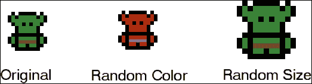
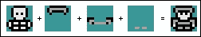
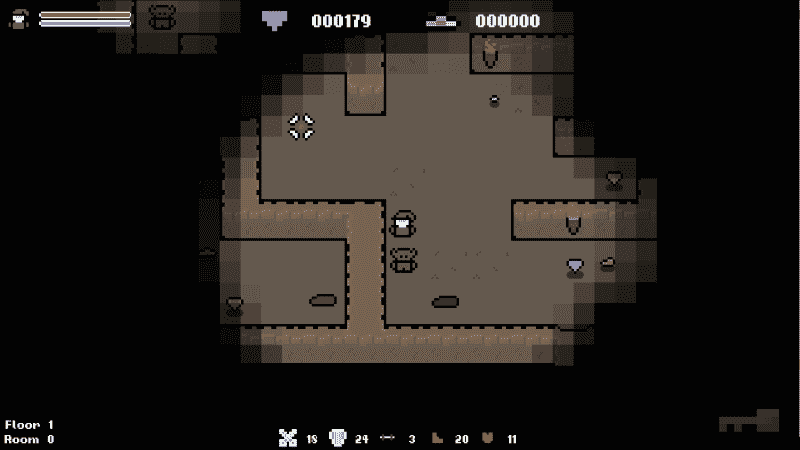
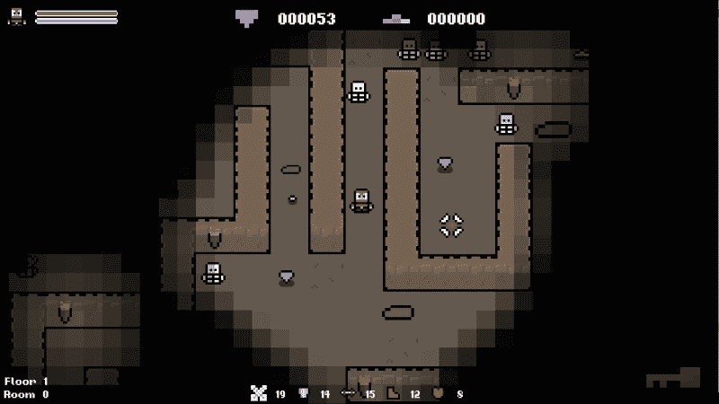
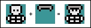
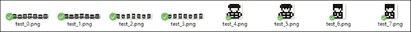
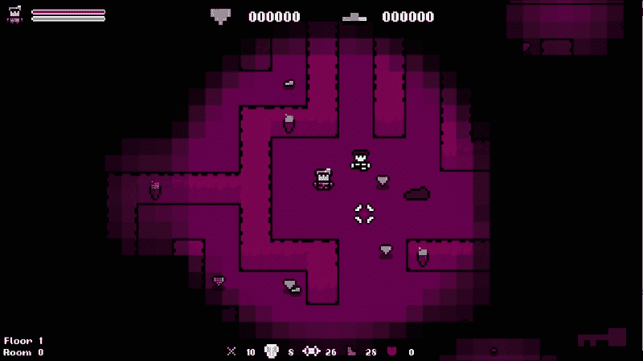

# 六、使用程序产生艺术

游戏的艺术是其定义特征之一。通常，这是首先吸引我们的东西，也是使我们着迷的动力之一。伟大的美学大有帮助。鉴于此，我们希望确保这是一个尽可能丰富，多样和身临其境的领域。

然而，艺术在经济上是昂贵的，生产起来也是费时的。不仅如此，在硬件层面也很昂贵!游戏纹理可以达到 4k 大小，创建一千个 4k 纹理并将其存储在传统游戏媒体上绝非易事。值得庆幸的是，在创作艺术时，可以采用多种程序生成技术来帮助解决其中的一些问题。

在本章中，我们将介绍以下主题:

*   程序生成如何与 art 一起使用
*   程序化产生的艺术的利弊
*   使用 SFML 精灵修改器
*   保存修改后的精灵
*   以编程方式创建精灵

# 程序生成如何与 art 结合使用

游戏艺术是程序生成的一个很好的候选人。无论是在开发人员投资还是在硬件级别上，手动创建都非常昂贵，并且可以通过编程方式进行操作。然而，像一切一样，它也有一系列的好处和缺点。所以，让我们在开始之前先看看它们。

## 使用精灵效果和修饰符

也许程序生成可以与游戏艺术一起使用的最简单的方法是通过使用内置功能来操纵现有的精灵和模型。例如，大多数游戏引擎和框架将提供一些功能来编辑图形，例如颜色，alpha 和缩放修饰符。

将这些函数与**随机数生成器** (**RNG**) 相结合，是开始制作随机化游戏艺术的一种简单快捷的方法。例如，**简单快速的多媒体库** (**SFML**) 提供了改变精灵颜色和大小的功能。即使我们只是使用这些功能，我们也可以在运行时生成各种不同的纹理。这显示在下面的屏幕截图中:



## 组合多个纹理

从对现有纹理进行简单修改的步骤是将多个纹理组合以创建新纹理。加入一些 RNG，你可以用很少的努力创建大量的精灵。我们将在本章中使用此技术给敌人随机装甲!

我们将从一个基地敌人精灵开始，随机选择一些装甲，并将其绘制在原始图像的顶部，以创建一个随机精灵!稍后会对此进行更多介绍，但现在，它将是这样的:



## 从头开始创建纹理

创建过程纹理最复杂的方法是使用算法从头开始创建它们。可以使用诸如 Perlin 噪声之类的算法来创建自然外观的纹理基础，然后可以使用诸如图像乘法之类的技术来创建各种过程纹理。

例如，可以将基础 Perlin 噪声纹理，白噪声纹理和平面颜色组合起来以创建过程纹理，如下所示:


通过这种方法，生成前两个纹理的算法的变化将导致不同的最终纹理。可以使用此技术为游戏创建无尽的独特纹理，而不会产生存储问题。

### 提示

这种程序性形象创作超出了本书的范围。如果您想进一步研究这一点，请阅读纹理合成和 Perlin 噪声等算法。

## 创建复杂的动画

计算能力的增长也催生了程序动画。传统上，动画游戏资产 (例如角色) 将由动画师在 3D 动画包中进行动画处理。然后，该动画例程将在运行时由游戏引擎加载，并应用于给定的模型以使其移动。

随着计算机现在能够执行前所未有的更多计算，程序动画变得越来越流行。现在很多游戏中都使用了布娃娃的身体，这是程序动画的一个很好的例子。代替播放设定的动画例程，使用有关身体的信息 (例如其重量，速度和刚度) 来计算身体应该处于什么位置，以创建逼真的动态运动。

# 程序化产生的艺术的好处

游戏艺术的程序生成为我们作为开发人员和玩游戏的人带来了一系列好处。从它的多功能性，到具有成本效益和节省时间，让我们来看看其中的一些好处。

## �� T0 】 Versatility

程序化生成游戏艺术的主要好处是**多功能性**。游戏艺术的制作成本很高，因此对可以为给定项目创建的内容施加了限制。让一位艺术家为我们的游戏创建数千种纹理会很好，但这是不可行的。相反，我们可以创建少量资源，采用程序技术将这些资源转化为成千上万个可能的纹理，并为游戏带来多样性和多样性。

## 生产便宜

在前面一点上进行扩展，因为我们不必付钱给艺术家来手动创建所有这些纹理，所以程序生成可以节省我们的时间和金钱。在我们将在本章进行的示例中，我们将为敌人提供随机装甲。会有三种盔甲，每一种有三层，敌人拥有哪种盔甲的组合也会是随机的。可能的组合数量巨大，让艺术家手动创建它们会很昂贵。

## 它需要很少的存储空间

继续为敌人提供装甲的示例，即使我们可以让艺术家手动制作所有精灵，它们将如何存储？虽然这对于在线游戏来说不是一个问题，因为通常对游戏和下载大小没有限制，但在传统媒体 (如磁盘) 上发布的游戏必须明智地利用空间。在这方面，纹理是一种昂贵的资源。因此，创建少量资源并以编程方式从中创建纹理可以缓解这些问题。

# 程序化艺术的弊端

有了，善与恶，程序化产生的艺术也不例外。虽然它很灵活，节省空间，但它确实有一些缺点。

## 缺乏控制

第一个缺点是与应用无关的，并且是整个程序生成的缺点; 随之而来的失控。如果你在程序上创作艺术，你就会失去一个熟练的艺术家所能给予的触感。由于内容是确定性过程的结果，而不是创造性过程，因此内容可能缺乏个性并感到非常僵化。一个好的程序算法可以在一定程度上减轻这种情况，但是很难生成像才华横溢的艺术家那样自然的感觉和外观的内容。

## 重复性

程序化产生艺术的另一个潜在问题是，事物可能会显得非常重复和不自然。内容将通过算法产生，输出的变化是所用术语差异的结果。鉴于此，每个算法都有可以产生的内容谱。如果算法的操作范围太小，纹理将被重复，并且可能会感到不自然和重复使用，尽管程序生成被用来减轻这种情况!这一切都取决于算法的质量和使用方式。

## 性能重

在程序上创建艺术通常涉及大量的阅读和复制纹理，这通常是昂贵的操作，尤其是当您使用高分辨率纹理时。使用敌人装甲示例作为用例，如果我们要手动创建精灵，我们只需要加载纹理，这是一个单一的操作。如果我们通过程序创建一个精灵，我们必须加载每个组件，编辑它们，然后重新渲染它们以创建新的纹理。

# 使用 SFML 精灵修改器

现在，我们已经确定了程序化艺术的一些优点和缺点，开始吧!我们将研究的第一种天真的方法是简单地使用`sprite`修饰符，如`color`和`alpha`来改变现有的精灵。使用此方法，我们将使用 SFML 提供的内置 sprite 修饰符。大多数引擎和框架将具有与这些类似的的功能，如果没有，您可以自己制作!

## 颜色在 SFML 中是如何工作的

让我们从程序上生成精灵的最简单方法开始，在运行时为它生成独特的颜色。SFML 中的颜色只是一组四个`uint8`值，每个颜色通道一个，alpha 一个:

```cpp
sf::Color::Color  (
Uint8   red,
Uint8   green,
Uint8   blue,
Uint8   alpha = 255
)
```

SFML 中的每个`sf::Sprite`都有一个`sf::Color`成员变量。这个颜色值与纹理中像素的颜色值相乘，得出最终的颜色。下图演示了这一点:


在上面的图像中，我们可以在最左侧看到原始图像。另外，当精灵设置了各种颜色时，我们可以看到生成的图像。

### 提示

为了获得最佳效果，最好从单色灰色基础纹理开始，以便颜色调制达到正确的颜色。

`sf::Color`类型还有一个*alpha*值，用于确定对象的不透明度。alpha 通道越低，物体越透明。使用此值，您可以更改对象的不透明程度，如下面的屏幕截图所示:


通过对 SFML 如何处理颜色的理解，让我们通过为史莱姆角色生成一个随机的精灵来将其付诸实践，务实地设置其颜色和 alpha。

### 提示

要了解更多关于 SFML 如何处理颜色的信息，请阅读在[http://www.www.learn.Php](http://www.sfml-dev.org/learn.php)上找到的 SFML 文档 sfml-dev.org。有关更深入的信息，请访问 SFML 使用的图形 API 中的 OpenGL 文档。

## 创建随机颜色的精灵

在 SFML 中，sprite 对象有一个名为`setColor()`的成员函数。该函数取一个`sf::Color`对象，并将其设置为绘制时要与精灵纹理相乘的值。我们知道`sf::Color`基本上只有四个`uint8`值，每个值的范围为 0 到 255。鉴于此，要生成随机颜色，我们可以为这些颜色通道生成随机值，也可以随机选择 SFML 的内置预定义颜色之一。

史莱姆敌人是一个很好的候选人，因为它在许多颜色上看起来都很棒，而基础雪碧是暗灰色。用这种精灵乘以一种颜色会很好地工作。当我们设置史莱姆精灵时，我们会使用这两种方法给它一个随机的颜色。让我们从选择预定义的颜色开始。

### 随机选择预设颜色

SFML 带有以下预定义的颜色:

```cpp
sf::Color black       = sf::Color::Black;
sf::Color white       = sf::Color::White;
sf::Color red         = sf::Color::Red;
sf::Color green       = sf::Color::Green;
sf::Color blue        = sf::Color::Blue;
sf::Color yellow      = sf::Color::Yellow;
sf::Color magenta     = sf::Color::Magenta;
sf::Color cyan        = sf::Color::Cyan;
sf::Color transparent = sf::Color::Transparent;
```

这些是在`Color.hpp`中定义的，涵盖了最受欢迎的颜色。第一个问题是我们需要某种随机选择的方法。为此，我们可以创建一个匹配颜色值的枚举器，生成一个随机索引，然后使用它将枚举器值与匹配的预定义颜色进行匹配。当我们查看代码时，这将变得更加清晰。

首先，我们将在`Util.h`文件中添加以下枚举器定义:

```cpp
// Colors provided by SFML.
enum class COLOR {
  BLACK,
  WHITE,
  RED,
  GREEN,
  BLUE,
  YELLOW,
  MAGENTA,
  CYAN,
  TRANSPARENT,
  COUNT
};
```

对于每个预定义的颜色，我们都在`enum`中添加了一个相应的值，确保它以`COUNT`结尾。有了这个定义，我们只需要计算一个 0 到`COLOR::COUNT`之间的数字，然后在`switch`语句中使用它。这是我们已经使用过几次的方法，因此我们应该熟悉它。

跳到史莱姆敌人的构造函数，我们将从生成一个随机索引开始:

```cpp
int colorIndex = std::rand() % static_cast<int>(COLOR::COUNT);
```

现在，我们将简单地切换`colorIndex`值并设置相应的颜色:

```cpp
switch (colorIndex)
{
case static_cast<int>(COLOR::BLACK):
  m_sprite.setColor(sf::Color::Black);
  break;

case static_cast<int>(COLOR::BLUE):
  m_sprite.setColor(sf::Color::Blue);
  break;
```

对于我们定义的枚举器的每个值，应该继续。现在，你会看到，每一个在游戏中产生的史莱姆敌人都有不同的预定义颜色:



### 随机生成颜色

第二个选项，它给了我们更多的控制，是随机生成我们自己的颜色。这种方法为我们提供了更广泛的可能性，并为我们提供了对 alpha 通道的访问; 但是，我们失去了一些控制。当从预定义的颜色中进行选择时，我们知道我们总是会得到一种令人愉悦的颜色，这是我们在为每个频道生成自己的值时无法保证的。不管这些，让我们看看我们将如何做。

我们知道`sf:color`有四个通道 (r，g，b 和 a)，每个值在 0 到 255 之间。为了生成随机颜色，我们需要为 r，g 和 b 通道生成值; a 用于 alpha 通道，它将允许我们改变精灵的不透明度。

首先，我们将定义变量并为 r，g 和 b 通道生成一个随机值，如下所示:

```cpp
int r, g, b, a;

r = std::rand() % 256;
g = std::rand() % 256;
b = std::rand() % 256;
```

对于 alpha 通道，我们希望数字生成更加精确。0 的 alpha 值太低了; 我们几乎看不到精灵。因此，我们将生成 100 到 255 范围内的数字，如下所示:

```cpp
a = std::rand() % 156 + 100;
```

现在我们有了这些值，我们需要创建一个`sf::color`对象，在`color`构造函数中传递`r`，`g`，`b`和`a`值:

```cpp
sf::Color color(r, g, b, a);
```

最后一步是调用`sf::sprite::setColor()`，传递新的颜色。完整的代码如下，应该驻留在史莱姆敌人的构造函数中:

```cpp
// Choose the random sprite color and set it.
int r, g, b, a;

r = std::rand() % 256;
g = std::rand() % 256;
b = std::rand() % 256;
a = std::rand() % 156 + 100;
sf::Color color(r, g, b, 255);

m_sprite.setColor(color);
```

现在，如果我们运行游戏，我们应该得到三个非常不同的颜色的史莱姆，每个都有不同程度的不透明度，如下面的屏幕截图所示:


## 创建随机大小的精灵

我们要玩的最终精灵修改器是比例。使用`sf::Sprite::setScale()`函数，我们可以设置精灵的水平和垂直比例。默认比例为 1，因此，如果我们使用 2 的值进行缩放，则精灵的大小将是原来的两倍。同样，如果我们设定一个 0.5 的规模，它将是一半大。鉴于此，我们需要生成仅在 1 的任一侧的浮点数。1.5 的 0.5 范围应该会给我们足够的大小差异!

所以，我们需要生成一个 float，但是`std::rand()`函数只会生成一个整数值。别担心!有一个简单的技巧，我们可以用它来获得一个浮子!我们只需要生成一个介于 5 和 15 之间的数字，然后将其除以 10 即可得到浮点值:

```cpp
float scale;
scale = (std::rand() % 11 + 5) / 10.f;
```

现在生成了随机比例值，我们现在只需要调用我`sf::sprite::setScale()`函数，并使用`scale`变量作为比例值。完整代码如下:

```cpp
// Generate a random scale between 0.5 and 1.5 and set it.
float scale;
scale = (std::rand() % 11 + 5) / 10.f;

m_sprite.setScale(sf::Vector2f(scale, scale));
```

在运行游戏时，您现在将看到史莱姆敌人具有不同的颜色，并且它们的大小也有所不同:



# 保存修改后的精灵

在我们的游戏中，每次运行游戏时，我们都会生成新的精灵。我们希望每次运行都是唯一的，所以一旦我们生成了一个精灵并使用了它，我们就可以放手了。然而，有时候，你可能想要保持一个精灵。例如，您可能想要创建一个随机的 NPC，并在整个游戏中保持相同的角色。

到目前为止，我们用来创建图像的两种数据类型是`sf::Sprite`和`sf::Texture`。这些类让我们通过一组预定义的成员函数与图像进行交互。它非常适合标准绘图和简单的图像处理，但是我们无法访问原始图像信息。这就是`sf::Image`发挥作用的地方!

## 将纹理传递到图像中

`Sf::Image`是一个用于加载、操作和保存图像的类。与其他数据类型不同，`sf::Image`为我们提供了原始图像数据，使我们能够与图像中的每个像素进行交互。我们稍后会使用更多的这个功能，但是现在，我们对`sf::Image::saveToFile`功能感兴趣。

使用此功能，我们可以将图像保存在文件中; 我们只需要将纹理转换为该图像即可。幸运的是，有一个功能可以做到这一点!`sf::Texture`类有一个名为`copyToImage`的函数，该函数将原始图像数据从纹理复制到图像中。因此，我们应该能够将纹理复制到图像中并保存它，对吗？好吧，让我们试试。

在`Slime::Slime`中，让我们在修改精灵后添加以下调试代码:

```cpp
// Save the sprite to file.
sf::Image img = m_sprite.getTexture()->copyToImage();
img.saveToFile("../resources/test.png");
```

如果您查看我们创建的文件并将其与原始图像进行比较，您会看到一些奇怪的东西:


我们对精灵所做的修改不会编辑纹理。相反，每次我们绘制对象时都会进行修改。当我们像这样输出纹理时，我们只需输出我们放入的相同精灵!为了保存通过精灵修改所做的更改，我们还需要使用`sf::RenderTexture`类。

## 绘制到 RenderTexture 类

由于 sprite 修改不会应用于纹理，因此我们需要以某种方式捕获 sprite，一旦渲染了它。同样，SFML 以其`sf::RenderTexture`类来拯救。此类允许我们渲染成与屏幕相对的纹理，从而解决了未对纹理进行修改的问题。

首先，我们需要创建一个`sf::RenderTexture`对象。为此，我们需要知道我们将要绘制的区域的大小，这里需要记住一些事情。我们正在更改对象的大小。所以，如果我们只是得到纹理的大小，它要么太大，要么太小。相反，我们需要获取纹理的大小，并将其乘以我们应用于精灵的相同比例值。

让我们编写一些代码来使事情变得更清晰。我们将从创建`sf::RenderTarget`对象开始，如下所示:

```cpp
// Create a RenderTarget.
sf::RenderTexture texture;

int textureWidth(m_sprite.getTexture()->getSize().x);
int textureHeight(m_sprite.getTexture()->getSize().y);
texture.create(textureWidth * scale, textureHeight * scale);
```

如您所见，我们将获得纹理的大小，并将其乘以我们修改精灵的相同比例。

最后，我们将对象绘制到 render 视图，如下所示:

```cpp
// Draw the sprite to our RenderTexture.
texture.draw(m_sprite);
```

## 将图像保存到文件中

从这一点开始，代码与我们的第一次尝试相同，只是稍作修改。因为精灵是动画的，所以我们更改它的原点和`textureRect`属性以将其切成小节，以便为角色设置动画。这需要恢复才能看到整个纹理。另外，当我们调用`sf::Texture::copyToImage`时，精灵会垂直翻转。在保存文件之前，我们需要将其翻转回去。

下面是用于保存修改后的粘液纹理的完整代码示例:

```cpp
// Create a RenderTarget.
sf::RenderTexture texture;

int textureWidth(m_sprite.getTexture()->getSize().x);
int textureHeight(m_sprite.getTexture()->getSize().y);
texture.create(textureWidth * scale, textureHeight * scale);

// Revert changes the animation made.
m_sprite.setOrigin(sf::Vector2f(0.f, 0.f));
m_sprite.setTextureRect(sf::IntRect(0, 0, textureWidth, textureHeight));

// Draw the sprite to our RenderTexture.
texture.draw(m_sprite);

// Copy the texture to an image and flip it.
sf::Image img = texture.getTexture().copyToImage();
img.flipVertically();

// Save the sprite to file.
img.saveToFile("../resources/test.png");
```

### 提示

完成后，不要忘记删除此代码，因为保存文件很昂贵，并且会弄乱动画!

现在，如果您运行游戏并查看文件，您将看到我们所做的修改:


# 在程序上创造敌人的精灵

具有渲染到`sf::RenderTexture`并存储结果的能力打开了一个充满可能性的世界。其中之一是结合多个精灵来创建新的，更通用的精灵。我们可以多次绘制一个`sf::RenderTexture`类，并且精灵会重叠。这是一种非常有用的技术，可以用来在没有所有工作的情况下生成大量的精灵变体。这显示在下面的屏幕截图中:


使用这种方法，我们将为敌人制造随机装甲。我们将有三件盔甲; 头、躯干和腿。对于每一个，我们还将有三种变体: 青铜，银和金。仅此一项就给了我们大量可能的组合。然后，让我们考虑每个角色都需要这个，我们有两个，每个角色有八个精灵。那是大量的纹理。手动创建所有这些完全是不可能的。

## 将精灵分解成组件

我们将创建的装甲精灵将被放置在默认敌人动画的顶部。这里要考虑的最重要的事情是，它们的大小和位置在彼此重叠时会排成一行。

创建`sf::RenderTexture`类时，我们定义一个大小。然后，所有吸引到它的东西都将相对于该区域的左上角定位。如果我们的精灵有不同的大小，当我们开始绘图时，它们会错位。以下示例的背景变暗了，以便我们可以看到这一点。在第一个例子中，精灵已经被裁剪，我们可以看到，这使得它们在彼此放置时错位:


在第二个示例中，精灵具有相同的大小，并且都相对于要绘制它们的精灵定位。因此，他们会很好地排队:



我们将为每个敌人创建装甲，因此对于每个敌人动画，我们需要创建一个匹配的装甲精灵。这样做是为了节省时间，您会注意到这些精灵只有灰色版本。为了节省更多时间，我们将使用精灵修饰符更改颜色。

以下是骨骼行走精灵带上的装甲覆盖精灵的示例:


## 绘制设置

在我们编写任何关于生成装甲的代码之前，我们需要改变`Humanoid`类处理其纹理的方式。由于我们将创建的纹理对于类的每个实例都是唯一的，并且只会使用一次，所以没有用它们填充**纹理**管理器。相反，我们将创建一个自己的纹理数组，并覆盖默认绘制行为以使用新的纹理!

我们将从在`Humanoid.h`中定义一个纹理数组开始，如下所示:

```cpp
  /**
   * An array of modified textures.
   */
  sf::Texture m_textures[static_cast<int>(ANIMATION_STATE::COUNT)];
```

现在，在`Humanoid`构造函数中，我们需要用默认的敌人纹理填充这个数组。这是因为我们将覆盖默认的绘制行为，以使用修改后的精灵数组而不是默认的精灵。仅在生成装甲时才创建修改的精灵。因此，我们需要确保我们有默认的精灵可以回退。我们将用默认精灵填充数组，然后如果我们生成装甲，则覆盖它们。

在`Humanoid::Humanoid`中添加以下代码。然后，我们的准备工作完成，我们可以开始:

```cpp
// Copy textures.
for (int i = 0; i < static_cast<int>(ANIMATION_STATE::COUNT); ++ i)
{
  m_textures[i] = TextureManager::GetTexture(m_textureIDs[i]);
}
```

## 随机选择雪碧组件

我们有三种可能的盔甲，我们的敌人可以拥有: 头，躯干和腿，我们希望我们的敌人有这些类型的混合。所以，让我们给他们每个人五分之一的机会在敌人身上产生。这意味着装备更多的敌人不太可能产卵，这正是我们想要的; 一个完全装备齐全的骨架应该是一个罕见的产卵!

### 提示

不要忘记游戏机制的平衡。在创建程序系统时，很容易专注于技术，让天平退居二线。在设计系统时，请始终牢记这一点。您可以访问[http://www.paranoidproductions.com/](http://www.paranoidproductions.com/) ，其中包含有关此主题的大量重要信息。

让我们开始为所有这些行为创建一个函数。盔甲被设计成适合妖精和骷髅精灵。因此，我们可以将其放置在`Humanoid`类中，并为这两个变体生成装甲!

让我们声明`Humanoid::GenerateArmor`函数，如下所示:

```cpp
private:
 /**
  * Generates random armor for the humanoid.
  */
void GenerateArmor();
```

我们需要做的第一件事是创建我们将绘制的`sf::RenderTexture`对象。我们将为每个精灵使用两个纹理: 一个用于装甲，一个用于最终图像。我们将首先绘制盔甲，然后将其绘制在默认的敌人精灵上，以创建最终的纹理。

让我们给新功能一个主体并设置对象:

```cpp
// Randomly generates armor.
void Humanoid::GenerateArmor()
{
    // Create arrays of textures.
    const int textureCount = static_cast<int>(ANIMATION_STATE::COUNT);
    sf::RenderTexture armorTextures[textureCount];
    sf::RenderTexture finalTextures[textureCount];
    sf::Image renderImage;
    // Setup all render textures.
    for (int i = 0; i < static_cast<int>(ANIMATION_STATE::COUNT); ++ i)
    {
        sf::Vector2u textureSize = m_textures[i].getSize();
        armorTextures[i].create(textureSize.x, textureSize.y);
        finalTextures[i].create(textureSize.x, textureSize.y);
    }
```

我们现在可以添加代码来选择敌人将拥有的装甲。我们说我们会给每个项目一个 20% 的产卵机会。因此，我们需要生成一个从 0 到 4 (含) 的数字。有 20% 的可能性，这将是 0 的结果。因此，我们可以使用它来确定是否应该生成该盔甲:

```cpp
// Create variables to determine what armor be created.
int hasHelmet(0), hasTorso(0), hasLegs(0);

hasHelmet = std::rand() % 5;
hasTorso = std::rand() % 5;
hasLegs = std::rand() % 5;

// Spawn helmet.
if (hasHelmet == 0)
{
}

// spawn torso.
if (hasTorso == 0)
{
}

// spawn legs.
if (hasLegs == 0)
{
}
```

现在，我们随机选择我们的敌人将拥有的装甲碎片，如果有的话，我们可以将注意力转向通过编辑精灵来创建不同的装甲层。要实现这一点，需要大量的代码。因此，从这一点开始，我们将只关注头盔选项。

## 加载默认装甲纹理

首先，我们需要加载默认的装甲纹理。每个敌人都有八个可能的动画状态，这意味着我们将需要加载所有八个头盔对应物。我们将以类似于我们在构造函数中加载默认精灵的方式来执行此操作，创建纹理数组并使用动画状态的枚举器作为索引，如下所示:

```cpp
// Spawn helmet.
if (hasHelmet == 0)
{
  // Load the default helmet textures.
  int defaultHelmetTextureIDs[static_cast<int>(ANIMATION_STATE::COUNT)];

  defaultHelmetTextureIDs[static_cast<int>(ANIMATION_STATE::WALK_UP)] = TextureManager::AddTexture("../resources/armor/helmet/spr_helmet_walk_front.png");
  defaultHelmetTextureIDs[static_cast<int>(ANIMATION_STATE::WALK_DOWN)] = TextureManager::AddTexture("../resources/armor/helmet/spr_helmet_walk_front.png");
  defaultHelmetTextureIDs[static_cast<int>(ANIMATION_STATE::WALK_RIGHT)] = TextureManager::AddTexture("../resources/armor/helmet/spr_helmet_walk_side.png");
  defaultHelmetTextureIDs[static_cast<int>(ANIMATION_STATE::WALK_LEFT)] = TextureManager::AddTexture("../resources/armor/helmet/spr_helmet_walk_side.png");
  defaultHelmetTextureIDs[static_cast<int>(ANIMATION_STATE::IDLE_UP)] = TextureManager::AddTexture("../resources/armor/helmet/spr_helmet_idle_front.png");
  defaultHelmetTextureIDs[static_cast<int>(ANIMATION_STATE::IDLE_DOWN)] = TextureManager::AddTexture("../resources/armor/helmet/spr_helmet_idle_front.png");
  defaultHelmetTextureIDs[static_cast<int>(ANIMATION_STATE::IDLE_RIGHT)] = TextureManager::AddTexture("../resources/armor/helmet/spr_helmet_idle_side.png");
  defaultHelmetTextureIDs[static_cast<int>(ANIMATION_STATE::IDLE_LEFT)] = TextureManager::AddTexture("../resources/armor/helmet/spr_helmet_idle_side.png");
```

有了默认的精灵加载，我们现在可以选择它们属于哪个装甲层，因此，我们需要向它们应用什么颜色。

## 选择装甲层

有每种类型将有三层装甲，分别是金、银和青铜。所以，我们需要决定使用哪一层。我们可以采取天真的方法，从 0 和 2 生成一个数字，但这并不理想。每个层都有相同的产卵机会，即 444。

让我们对如何选择装甲层变得更加精明，使银比青铜更稀有，而金仍然更稀有。要做到这一点，我们仍然会使用`std::rand()`函数，但是我们会更聪明地使用结果。首先，我们需要决定每次产卵的可能性。假设我们希望其中 50% 是青铜，35% 是银，15% 是金。

这些百分比看起来不错，并且很适合使用，因为它们完全 100。为了复制他们的机会，我们需要生成一个从 1 到 100 的数字，我们可以用它来获得所需的百分比:

*   有一个 50% 的机会，我们将生成 1 和 50 之间的数字，因为它代表了总可能范围的一半 (50/100)
*   有一个 35% 的机会，我们将生成一个数字的范围为 51 到 85，因为这个范围包括 35 个值的可能的 100 (35/100)
*   最后，有一个 15% 的机会，我们将生成一个数字的范围为 86 到 100，因为这个范围包括 15 个值的可能的 100 (15/100)

让我们将以下代码添加到我们的函数中，从之前的代码继续加载默认纹理:

```cpp
// Generate random number to determine tier.
sf::Color tierColor;
int tierValue = std::rand() % 100 + 1;

// Select which tier armor should be created.
if (tierValue < 51)
{
    tierColor = sf::Color(110, 55, 28, 255); // Bronze.
}
else if (tierValue < 86)
{
    tierColor = sf::Color(209, 208, 201, 255); // Silver.
}
else
{
    tierColor = sf::Color(229, 192, 21, 255); // Gold.
}
```

### 注意

我们使用的是`std::rand() % 100 + 1`，而不是`std::rand() % 100`。虽然它们都在技术上做同样的事情，但第一个生成从 1 到 100 的数字，而第二个生成从 0 到 99 的数字。第一个让我们的工作变得更简单。

我们创建一个简单的`if`语句，它定义了我们之前确定的每个范围。但是，当我们进入`if`黄金声明时，就没有必要了，因为我们已经定义了其他范围。因此，我们现在知道剩下的任何东西都在 86 到 100 的范围内。因此，我们可以简单地使用`else`语句，为我们节省了评估。

在这个阶段，我们随机选择了一个头盔，加载了默认的精灵，并选择了一个层。

## 渲染装甲纹理

下一步是编辑装甲纹理，并在默认的敌人纹理上过度使用它们。目前，我们每种装甲类型只有一个灰色精灵。我们需要使用本章前面学到的精灵修改技巧来创建青铜和黄金版本。我们可以保持灰色如银色!

执行此操作所需的管道如下:

*   加载默认头盔纹理
*   使用我们之前设置的`tierColor`变量编辑颜色
*   在`armorTextures`数组中绘制修改后的装甲纹理

我们需要对敌人拥有的每一个动画都这样做。因此，我们将在`for`循环中封装 `armorTextures`数组，遍历`ANIMATION_STATE`枚举器的每个值，如下所示:

```cpp
// Render helmet to armor texture.
for (int i = 0; i < static_cast<int>(ANIMATION_STATE::COUNT); ++ i)
{
  // Load the default helmet texture and set its color.
  sf::Sprite tempSprite;
  tempSprite.setTexture(TextureManager::GetTexture(defaultHelmetTextureIDs[i]));
  tempSprite.setColor(tierColor);

  // Flip the texture vertically.
  sf::Vector2u size = armorTextures[i].getTexture().getSize();
  tempSprite.setTextureRect(sf::IntRect(0, size.y, size.x, -size.y));

  // Draw the texture.
  armorTextures[i].draw(tempSprite);
}}
```

`armorTextures`数组现在包含所有头盔精灵，并且它们的颜色已设置为随机层值。现在，我们需要对躯干和腿部做完全相同的事情，再次绘制相同的`armorTextures`阵列，以便我们可以建立装甲纹理。这将作为本章末尾的练习留给您。现在，让我们看看如何将它们组合在一起以创建最终的纹理。

## 渲染最终纹理

现在创建了装甲纹理，我们需要将它们渲染在默认的敌人纹理之上，以创建最终图像。我们在构造函数中创建了所有默认纹理的副本，所以我们需要做的就是在它们上面绘制我们新创建的装甲纹理，并将其保存为最终纹理。要记住的一件事是，`sf::Texture::copyToImage`函数垂直翻转图像。因此，在保存最终版本之前，我们需要将其翻转回去。

让我们添加最后一点代码。这个代码需要在所有的装甲都已经生成之后，所以将是最后的代码块在`Humanoid::GenerateArmor`函数:

```cpp
// Create the final render texture.
for (int i = 0; i < static_cast<int>(ANIMATION_STATE::COUNT); ++ i)
{
    sf::Sprite baseSprite, armorSprite;

    // Draw the default texture.
    baseSprite.setTexture(m_textures[i]);
    finalTextures[i].draw(baseSprite);

    // Draw armor on top.
    armorSprite.setTexture(armorTextures[i].getTexture());
    finalTextures[i].draw(armorSprite);

    // Flip the texture vertically.
    sf::Image img = finalTextures[i].getTexture().copyToImage();
    img.flipVertically();

    // Store the resulting texture.
    m_textures[i].loadFromImage(img);
}
```

随着这个函数现在完成，剩下的就是在我们的构造函数的末尾对它进行调用:

```cpp
    . . .
    // Copy textures.
    for (int i = 0; i < static_cast<int>(ANIMATION_STATE::COUNT); ++ i)
    {
        m_textures[i] = TextureManager::GetTexture(m_textureIDs[i]);
    }

    // Generate armor.
    GenerateArmor();
}
```

## 覆盖默认的绘制行为

我们对象的动画代码位于基类`Object`中。当纹理需要更新时，它会转到`m_textureIDs`变量并从`TextureManager`类中获取正确的纹理。由于我们已经创建了自己的纹理并将其存储在新的`m_textures`数组中，因此我们需要覆盖此默认行为以提供自己的纹理。

首先，我们需要通过在`Humanoid.h`中添加以下声明来覆盖更新函数:

```cpp
/**
* Overrides the update event of enemy.
* @param timeDelta The time that has elapsed since the last update.
*/
void Update(float timeDelta) override;
```

我们仍然需要调用父级的实现，因为这就是动画逻辑所在。但是，一旦完成，我们就需要跳入并在绘制之前提供自己的纹理。幸运的是，这很容易做到:

```cpp
// Overrides the update event of enemy.
void Humanoid::Update(float timeDelta)
{
    // Call parent functionality.
    Enemy::Update(timeDelta);

    // Update the texture with our custom textures.
    m_sprite.setTexture(m_textures[m_currentTextureIndex]);
}
```

## 调试和测试

在我们运行游戏之前，让我们添加一点调试代码来查看我们的工作。以前，我们介绍了如何将纹理保存到图像文件。所以，让我们在这里用它来保存我们将创建的所有程序精灵。

让我们使用以下代码更新创建最终纹理的循环:

```cpp
// Save the texture to disk.
if ((hasHelmet == 0) || (hasTorso == 0) || (hasLegs == 0))
{
  std::stringstream stream;
  stream << "../resources/test_" << i << ".png";
  img.saveToFile(stream.str());
}
```

如果生成一块护甲，此代码所做的就是将纹理保存到资源文件夹中。如果您运行游戏几次，请记住，每个骨架调用此代码的机会 20%，并进入`resources`文件夹，您将看到以下精灵:



这些是程序精灵!就我而言，这是一个骨架，带有随机层的随机装甲，我们不必绘制。我们绘制了组成部分，进行了一些程序化编辑，并以编程方式将它们组合在一起!

好吧，毕竟，是时候测试代码了。如果一切都很好，当你运行游戏时，你应该会看到一些戴着头盔的骷髅和妖精!请记住，每个敌人只有一个头盔的 20% 变化。如果你不走运，你可能需要运行几次游戏才能看到它:


在前进之前，您可以删除我们刚刚添加的用于保存精灵的调试代码。这纯粹是为了调试。本章末尾的练习之一是完成代码并为躯干和腿部装甲选项添加相同的行为，但请继续进行。实验!

# 编辑游戏磁贴

我们将要研究的最后的系统将为本书后面的内容奠定基础。我们将创建一个系统，使地下城的每一层都有一个独特的环境，在游戏磁贴上实现我们所知道的雪碧修改。

游戏的目标是通过尽可能多的楼层，获得尽可能高的分数。在[第九章](09.html "Chapter 9. Procedural Dungeon Generation")，*程序化地下城生成*中，我们将研究如何程序化生成地下城，每隔五层，我们将更改主题。让我们创建将在本书后面使用的函数来完成此操作。

解决此问题的最佳方法是在`Level`对象中添加一个函数，该函数设置所有图块精灵的颜色。这将是一个公共功能，因为我们将从主游戏类中调用它。

让我们从定义`Level`头中的`sf::color`函数开始，如下所示:

```cpp
public:
  /**
   * Sets the overlay color of the level tiles.
   * @param tileColor The new tile overlay color
   */
  void SetColor(sf::Color tileColor);
```

这个函数的定义非常简单。它简单地迭代网格中的所有精灵，将它们的颜色设置为传递的参数:

```cpp
// Sets the overlay color of the level tiles.
void Level::SetColor(sf::Color tileColor)
{
  for (int i = 0; i < GRID_WIDTH; ++ i)
  {
    for (int j = 0; j < GRID_HEIGHT; ++ j)
    {
      m_grid[i][j].sprite.setColor(tileColor);
    }
  }
}
```

有了这个，我们就完成了。这就是全部!我们将在本章后面使用这个函数，但让我们在这里测试一下。我们在`Game.cpp`中初始化`Level`对象，所以一旦我们加载了纹理，我们就可以调用`Level::SetColor`函数并设置级别的主题。

让我们用以下测试代码更新`Game::Initialize`函数:

```cpp
// Set the color of the tiles
m_level.SetColor(sf::Color::Magenta);
```

有了这个，我们可以看到什么水平会是什么样子，一旦我们实现功能正确以后。让我们运行游戏，看看会发生什么:



现在的`Level`瓷砖有一种环境色彩适用于构成环境的所有精灵，使我们能够为我们的水平创造独特的外观和感觉。就像我之前提到的，我们将在稍后以编程方式生成随机级别时使用此系统。现在，我们可以删除调试代码，并在知道系统已准备就绪的情况下坐下来!

# 练习

为了帮助你测试你对本章内容的了解，这里有一些你应该练习的练习。对于本书的其余部分来说，它们不是必须的，但是通过它们可以帮助您评估所涵盖材料中的优势和劣势:

1.  给地精敌人一个稍微随机的颜色和比例每次产生。
2.  通过完成躯干和腿部装甲的条件，完成代码以程序方式为人形动物生成装甲。
3.  尝试以更简洁的方式生成装甲。我们使用两个纹理; 也许有一种方法可以只使用一个。看看是否可以改善功能。

# 总结

在本章中，我们学习了如何从程序上生成游戏艺术。我们采取了一种天真的方法开始，简单地使用带有内置精灵修饰符的 RNG，然后继续通过算法生成我们自己的图像。生成程序艺术是一个巨大的话题，你可以写一本关于这个主题的书。希望这一章能很好地向你介绍这个话题。

在下一章中，我们将介绍 art 的表亲 audio。随着我们的艺术现在程序生成，我们将使用类似的技术来创造声音的差异。我们还将使用 SFML 的音频功能来创建专门的 3D 声音，从而为级别带来更多深度。