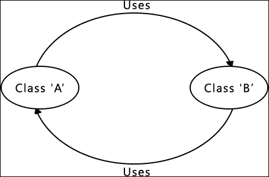

# 第 10 章。基于组件的体系结构

程序游戏系统本质上具有令人难以置信的通用性。因此，它们实现的框架和基础架构需要共享相同的属性。基于组件的系统 (例如 Unity 游戏引擎) 擅长于此，并且通常比传统的基于继承的系统提供更多的多功能性。

在构建大型动态系统 (例如游戏引擎) 时，基于传统继承的方法会出现问题。继承结构变得混乱，对象变得更大，因为它们需要做更多的事情。结果，行为变得不那么封装。基于组件的方法解决了这些问题，所以为了完成我们的工作，我们将稍微扩展一下，看看什么是基于组件的系统，为什么它与程序生成并驾齐走，以及我们如何改进现有的引擎以从中受益。

在本章中，我们将介绍以下主题:

*   传统继承方法存在的问题
*   基于组件的方法的利弊
*   理解基于组件的体系结构
*   实现基于组件的系统

### 提示

如果您对 Unity 引擎不熟悉，请前往[https:// unity3d.com/](https://unity3d.com/)并查看。它是业界领先的游戏引擎之一，并使用基于组件的方法。最棒的是它是完全免费的!

# 理解基于组件的体系结构

基于组件的体系结构，也称为基于组件的设计和模块化编程，是一种软件设计方法，旨在将行为分解为简洁，可重用的组件。我们已经在一定程度上使用面向对象的设计来做到这一点，但是基于组件的体系结构将其进一步发展。例如，如果对象 (例如 sprite 或 3D 模型) 需要某种行为，则它将通过对象将拥有的组件来定义，而不是从`base`类继承的。

## 传统的基于继承的方法存在的问题

在我们进入基于组件的方法的优点和缺点之前，让我们看一下传统的基于继承的方法带来的问题。我们将致力于解决这些问题。

### 卷积继承结构

假设我们有一个 简单的 `player` 对象，它需要一个 3D 模型并受我们的游戏物理影响。让我们看一下创建此对象可能需要的继承结构:


从这个图中可以看到，即使是这个简单的场景也可能导致复杂的继承结构。如果您现在用整个游戏引擎替换这个简单的示例，您可以想象继承结构将是多么复杂和难以管理。

这是传统的基于继承的设计的重大失败; 随着系统的变大，对象变得更加复杂，并纠缠在继承树中。当我们试图创建一个程序系统时，这种复杂性对我们没有帮助。我们想要一个尽可能灵活的系统。

### 循环依赖关系

复杂的继承结构可能会出现的另一个问题是循环依赖关系。这就是类`A`依赖于类`B`的地方，而类又依赖于类`A`，依此类推。下图应该可以更清楚地说明这一点:



虽然可以通过适当的程序结构来避免循环依赖，但随着系统的变大，它变得越来越难。随着继承树的增长，依赖关系也会增长，它可能会在系统内引起实际问题。通过删除复杂的继承，我们也消除了混乱依赖的风险。

## 基于组件的体系结构的优势

作为开发人员，我们总是在权衡取舍。必须了解一种方法的优缺点，以便我们可以就其是否属于解决方案做出明智的决定。由于我们已经发现了基于继承的方法的一些缺陷，并旨在通过基于组件的方法来解决它们，所以让我们熟悉一下它的一些优点和缺点。

### 避免复杂的继承结构

我们较早地确定了一个假设的游戏情况，并研究了典型的基于继承的方法可能是什么样子。如果我们采用基于组件的方法，让我们看一下相同的示例:


很明显，这个解决方案比基于继承的等效方案简单和整洁得多。它不是从父母那里获得它的行为，从而创建一个依赖链，而是分成简洁的组件，可以简单地附加到一个对象上。

### 代码被分解成高度可重用的块

基于组件的体系结构的另一个好处是，一旦将代码封装在组件中，代码就具有很高的重用价值。封装后，只需附加组件即可轻松将行为赋予对象。这不仅可以避免重复的代码，而且可以通过组合多个组件来轻松构建复杂的对象。这就是它适合程序生成的地方。我们可以用这些可重复使用的组件将像乐高这样的对象程序化地组合在一起。

### 高度可维护和可扩展

由于代码是可重用的，它也使它非常容易维护。如果一组对象都从单个来源获得它们的行为，那么只需要一次编辑，它就会影响到它们。

基于组件的系统也更易于扩展。由于我们的组件是简洁的单个模块，并且没有复杂的依赖关系，因此我们可以随意添加它们。如果我们想要新的行为，我们不必担心诸如*之类的问题它会去哪里？*，*它将取决于什么？*、*它将继承什么？*，等等。我们只需构建新组件，并在需要的地方使用它。

## 基于组件的体系结构的缺点

现在是时候看看争论的对立面了。尽管基于组件的设计确实带来了一系列巨大的好处，但您需要考虑一些事情。

### 代码可能会变得太碎片化

在某种程度上，这是基于组件的设计的目标: 将代码分解为可管理的块。但这可能太过分了。如果对象和功能分解得太远，那么我们最终会将代码库分散到数百个微小的组件中，使其变得一团糟。永远记住这一点。是的，我们确实想将我们的代码分解为可管理和可重用的组件; 只是不要为此疯狂!

### 不必要的开销

在前面一点上展开，如果代码被分解成太多的小组件，那么我们将看到无用开销的增加。如果一个项目包含许多组件，我们经常会发现自己在其中投入和投入以执行任务。虽然添加组件可能使代码更易于管理和维护，但在使用时也会带来开销。

### 使用复杂

组件的最终缺点只是它们的使用，因为它可能比传统的对象模型更复杂。我们必须遍历它们所属的组件，而不是直接访问成员函数。如果我们在一个对象中有 20 个组件，那么我们必须记住变量在哪里以及我们需要使用哪个组件。虽然这不是火箭科学，但它肯定比拥有一个直接拥有所有行为和数据的对象更复杂。

## 概述

希望现在已经清楚了基于组件的设计如何比传统的基于继承的方法更有助于程序设计。程序生成完全是关于灵活性的，当系统发展到一定规模时，基于继承的系统可能很难提供这种灵活性。通过允许我们将代码分解为可重用的对象，基于组件的设计使代码保持了灵活性，并且没有依赖关系，因此我们可以将组件移动到所需的任何位置。

# 设计组件系统

基于组件的系统可以通过多种方式实现。所以，在我们编写任何代码之前，让我们看看一些可能性。目标是将可重用行为分解为简洁的组件，并能够轻松地从现有对象中添加和删除它们。所有对象都共享一个名为 object 的公共基类，因此我们将添加工具以向该类添加组件并将其从该类中删除。然后，我们可以确保它将被传播到项目中的所有后续类。

有许多方法可以实现基于组件的方法，并且没有唯一的正确答案。例如，我们可以创建一个函数来单独添加或删除每个组件。下面是一个例子:

```cpp
bool	AttachSpriteComponent(SpriteComponent spriteCompontent);
bool	AttachInputComponent(InputComponent inputComponent);
```

虽然这将使事情变得简单，但我们将在类中有很多重复的代码。此外，每次我们添加一个组件时，我们都必须创建两个匹配的功能: 一个用于获取组件，另一个用于设置它。那有点麻烦!

另一种方法涉及简单地将组件值公开。因此，我们可以通过它们所属的对象直接访问它们，而不是通过函数与组件进行交互:

```cpp
Object object;
object.spriteComponent = SpriteComponent();
```

尽管这是一个有吸引力的选择，因为它会使我们的生活变得简单一千倍，但像这样公开变量几乎从来都不是一个好主意。必须公开变量以使代码正常工作通常表明系统体系结构存在缺陷。如果您发现是这种情况，则应该对问题的原因进行排序。

如果我们看看现有的基于组件的游戏引擎，如 Unity，我们可以看到他们是如何解决这个问题的。下面的代码演示了如何从 Unity 中的对象获取组件。这直接取自 Unity 文档:

```cpp
// Disable the spring on the HingeJoint component.
HingeJoint hinge = GetComponent<HingeJoint>();
hinge.useSpring = false;
```

我们可以看到定义了一个名为`GetComponent`的函数，并提供了一个类型来返回相应的组件。我们可以使用枚举来创建一个类似的系统来表示类型，允许用户通过参数指定组件类型，然后在`switch`语句中使用该参数返回正确的变量。假设我们创建了一个`AttachComponent`函数，使用以下声明将组件添加到对象中:

```cpp
void AttachComponent(COMPONENT_TYPE type, Component component);
```

在函数定义中，我们有这样的东西:

```cpp
void Object::AttachComponent(COMPONENT_TYPE type, Component component)
{
    switch (type)
    {
        case SOME_TYPE:
            m_someTypeVariable = component;
        break;
. . .
```

如果用户传递了匹配的类型和组件，这将工作正常，但没有什么可以保证这一点。例如，用户可以指定一个移动组件，但实际上传递了一个音频组件，这将是不好的!我们实际上会通过使用模板来解决这个问题!

# C 模板

C 模板允许我们定义与泛型类型一起工作的函数和类。这允许函数或类接受任何类型，并且只需要写一次。这就是我们想要的。我们想为组件定义一个单一的 get/set 函数，我们将对其进行模板，使其具有通用性和灵活性。

让我们看一下模板的实际示例，以更好地了解它们的实际工作方式。

## 使用模板

让我们假设我们需要一个函数来添加两个数字，并且我们希望支持一系列类型。为此，我们可以为要支持的每种类型声明一个函数，如下所示:

```cpp
int Add(int value1, int value2)
{
	return value1 + value2;
}

double Add(double value1, double value2)
{
    return value1, value2;
}
```

看看这两个函数，唯一不同的是它们的返回和参数类型。如果我们能说 “别担心类型，我过会儿给你”，只有一个功能，那会有多好？输入模板!

## 模板声明

C 模板允许我们定义具有泛型类型的函数，并在稍后调用函数时指定类型。这是一个非常有用的功能，它可以创建灵活且可重用的代码，而不是具有几乎相同的多个函数定义。如果使用模板，则前面的示例只需要一个功能:

```cpp
template<typename T>
T Add(T value1, T value2)
{
    T value;
    Value = value1 + value2;
    return value;
}
```

### 注意

模板参数可以使用**typename**或**class**关键字。这两个关键字都是完全可以互换的，并且做同样的事情。但是，它们可以用作指示参数类型的提示。如果参数是类，则使用**类**，并将**typename**与所有其他类型 (int，char * 等) 一起使用。

以下语法用于声明模板:

```cpp
template<template-parameters> function-declaration;
```

在声明中，我们创建了一个名为`T`的模板参数。这给了我们一个模糊的数据类型，可以在函数声明中使用，直到稍后调用模板时设置实际类型为止。通用的`T`类型可以像普通类型一样使用: 指定返回类型、创建变量和设置参数类型。

### 提示

模板参数的名称可以是您喜欢的任何名称，尽管它最常见的是**类型**或**T**。

模板也可以定义多个类型。例如，假设一个函数需要采用两种不同的数据类型。我们可以使用以下模板:

```cpp
template<typename T1, typename T2>
bool AreEqual(T1 value1, T2 value2)
{
    return value1==value2;
}
```

最后，模板也可以与普通数据类型一起使用，并且它们不必含糊不清:

```cpp
template<typename T, int I>
T IntegerMultiply(T value1)
{
    return value1 / value2;
}
```

## 使用模板

定义了模板，让我们看看如何使用它们。我们给出了模版模棱两可的类型，所以调用它们的一种方法是明确地告诉模板我们想要使用什么类型。这是通过在函数/类调用之后在<>括号中传递一个类型来完成的:

```cpp
float floatValue = Add<float>(1.f, 2.f);
bool isEqual = AreEqual<double, int>(5.0, 5);
int intValue = IntegerMultiply<float, 2>(1.f);
```

前两个很简单; 我们为每个模板参数分配了一个类型。然而，最后一个略有不同。由于第二种类型是固定的，因此无需在尖括号中指定它。相反，我们可以像普通参数一样使用它，传递我们想要使用的值。这使我们在括号中只有一个参数: 泛型类型值。

需要注意的一点是，模板参数的值是在编译时确定的。这意味着对于模板的每个不同实例化，都会创建一个唯一的函数。在最后一个示例中，将**int**的值作为模板函数传递，这意味着创建了一个经过硬编码以乘以值 2 的函数。

假设我们叫了两次`IntegerMultiple`:

```cpp
int intValue = IntegerMultiply<float, 2>(1.f);
int intValue = IntegerMultiply<float, 10>(1.f);
```

即使我们调用了相同的模板，编译器也会创建两个不同版本的`IntegerMultiply`。一个版本总是乘以 2，另一个版本总是乘以 10。因此，第二个模板的参数 (整数) 必须是常量表达式。以下代码将导致编译错误:

```cpp
int a = 10;
int intValue = IntegerMultiply<float, a>(1.f);
```

当编译器可以解析类型时，也可以调用这些函数，而无需在尖括号中明确表示类型。要做到这一点，就不必对类型产生歧义。例如，以下调用就可以了:

```cpp
float floatValue = Add(1.f, 2.f);
bool isEqual = AreEqual(5.0, 5);
```

在这些调用中，模板中的每个歧义类型都被赋予单一类型。因此，编译器可以自动推断出**T**的类型。但是，请考虑传递不同参数的场景:

```cpp
float floatValue = Add(1.f, 2);
```

**T**现在有两个可能的值，这意味着编译器无法推导出类型，将导致错误。

## 模板专业化

现在，我们已经了解了模板的工作原理，让我们来看看模板专业化。我们已经知道，我们可以定义一个具有泛型类型的模板，并在稍后调用函数时定义它们。这很好，如果所有可能的实现共享相同的行为，但如果我们想要不同的行为取决于类型？

假设我们要使用字符串类型的`Add`函数。我们想用两个词来传递，但是在这种情况下，我们想在它们之间放一个空格。默认模板功能不便于执行此操作，因此我们必须针对此情况进行专门操作。为了特化模板，我们只需创建一个声明，我们用固定的类型替换不明确的类型，在我们的情况下是`std::string`:

```cpp
template<>
std::string Add<std::string>(std::string value1, std::string  value2)
{
    std::string result;
    result = value1 + " " + value2;
    return result;
}
```

现在，当调用`template`函数并指定`std::string`类型时，它将使用此定义，而不是通用定义。这样，我们仍然可以使用模板，但可以为某些类型提供特定的实现。非常方便。

### 提示

如果您想了解更多关于 C 模板的信息，请访问[http://www.cplusplus.com/doc/tutorial/templates/](http://www.cplusplus.com/doc/tutorial/templates/) 。这是一个很棒的网站，它有一些关于这个主题的很棒的信息。

# Ingt0lggt function overloading

有点类似于模板，函数重载是我们可以使代码和类更通用的另一种方式。在本书的过程中，我们已经使用了重载函数，但是它们是随代码库一起提供的。所以，让我们快速看看它们。

当我们定义函数时，我们设置固定的参数类型。下面是一个例子:

```cpp
void DoStuff(T parameter);
```

使用此定义，我们只能传递`T`类型的参数。如果我们想选择参数呢？如果我们希望能够传递类型为`T`或`Y`的参数怎么办。好吧，我们可以重新定义函数，设置相同的返回类型和名称，但具有唯一的参数:

```cpp
void DoStuff(T parameter);
void DoStuff(Y parameter);
```

我们现在有两个参数不同的函数声明。当我们调用`DoStuff`时，我们将拥有传递哪个参数的选项。此外，通过函数重载，每个声明都有自己的主体，就像模板专业化一样。虽然表面上相似，但函数重载和模板专业化以不同的方式工作，尽管这超出了本书的范围。目前，我们所需要的只是对它们的基本了解，我们就可以开始了!

### 提示

与模板一样，有关函数重载的进一步阅读，请访问[http://www.cplusplus.com/doc/tutorial/ functions2/](http://www.cplusplus.com/doc/tutorial/functions2/) 。

# 创建基本组件

有了的理论，让我们将其实现到我们的项目中。到目前为止，本章的压倒性信息一直是使用组件来避免混乱的继承，但是我们仍然需要*一些*继承，因为我们需要使用多态性!

每个对象将能够容纳一系列组件，因此我们将它们存储在单个`generic`容器中。为了做到这一点，我们需要利用多态性，确保所有组件都从公共基类继承。这个基类是我们现在要实现的。

让我们在项目中添加一个新类，并将其称为`Component`。我们将由您来实现`.cpp`:

```cpp
#ifndef COMPONENT_H
#define COMPONENT_H

class Component
{
public:

    /**
    * Default Constructor.
    */
    Component();

    /**
    * Create a virtual function so the class is polymorphic.
    */
    virtual void Update(float timeDelta) {};
};
#endif
```

请注意，我们在这里添加了一个`virtual update`函数，因为一个类必须至少有一个`virtual`函数才能是多态的。通过创建`Component`基类，我们现在可以将函数添加到`get`和`set`组件中，它们将驻留在基`Object`类中，以便它们可用于所有对象。

# 组件函数

如果我们认为关于我们想要的行为，我们需要能够给对象一个任何给定类型的组件。我们还需要能够稍后获取相同的组件。我们将调用这些函数`AttachComponent`和`GetComponent`。

在本章的前面，我们确定了如何使用模板创建具有泛型类型的函数，并在需要时给它们提供实际值。我们将使用模板和多态来创建这两个函数。

## 连接组件

我们要编写的第一个函数将用于将给定类型的组件附加到`Object`类。由于我们已经确定要将所有组件存储在一个通用容器中，因此此函数将是一个相对简单的模板。我们唯一需要注意的是，我们不应该添加相同的组件两次!

让我们从定义容器开始，因为这是我们将存储对象的地方。由于我们需要利用多态性，因此我们无法存储实际对象。因此，我们将使用共享指针，以便我们可以轻松地传递它们。

首先在`Object.h`中定义通用容器。不要忘记`#include`我们的新组件类，以便对象可以看到它:

```cpp
private:
/**
 * A collection of all components the object has attached.
 */
std::vector<std::shared_ptr<Component>> m_components;
```

现在是时候使用实际的`AttachComponent`方法了。我们可以采取一种天真的方法，只需将新组件附加到`generic`容器中。这里的问题是，我们可以添加相同组件类型的倍数，这不是我们想要的。在将组件添加到集合中之前，我们将首先检查相同类型的组件是否已经存在，为此，我们将使用`std::dynamic_pointer_cast`函数。

此函数允许我们在指针之间强制转换，如果失败，则返回空指针。它非常方便，当与模板结合使用时，我们可以创建一个将接受任何组件类型的单个函数，创建一个，检查是否已经存在同一类型之一，如果存在，它将覆盖它。我们将在标题中内联定义这个模板函数。让我们在`Object.h`中添加以下代码:

```cpp
/**
 * Attaches a component to the object.
 */
template <typename T>
std::shared_ptr<T> AttachComponent()
{
    // First we'll create the component.
    std::shared_ptr<T> newComponent = std::make_shared<T>();

    // Check that we don't already have a component of this type.
    for (std::shared_ptr<Component>& exisitingComponent : m_components)
    {
        if (std::dynamic_pointer_cast<T>(exisitingComponent))
        {
            // If we do replace it.
            exisitingComponent = newComponent;
            return newComponent;
        }
    }

    // The component is the first of its type so add it.
    m_components.push_back(newComponent);

    // Return the new component.
    return newComponent;
};
```

使用模板，我们可以使用通用的`T`类型进行操作，该类型允许我们执行强制转换以检查类型是否匹配。如果它们确实匹配，我们将用新组件覆盖旧组件; 如果没有，我们只需将其添加到我们的集合中。完成后，我们还会返回新组件，以防用户立即想要它。

这就是它的全部，使用这样的模板的美妙之处在于系统的可扩展性。如果我们添加 1,000 组件并不重要; 此功能将能够将它们附加到任何对象。

## 重新调谐组件

我们需要创建的下一个模板是用于返回给定组件的函数。再次，让我们考虑一下在哪里需要通用类型。函数将需要返回组件类型，因此需要通用，并且我们还需要找到正确的组件类型。因此，我们将像以前的函数一样在指针强制转换中使用泛型类型。

让我们在`Object`的标题中定义这个模板:

```cpp
/**
* Gets a component from the object.
*/
template <typename T>
std::shared_ptr<T> GetComponent()
{
    // Check that we don't already have a component of this type.
    for (std::shared_ptr<Component> exisitingComponent : m_components)
    {
        if (std::dynamic_pointer_cast<T>(exisitingComponent))
        {
            return std::dynamic_pointer_cast<T>(exisitingComponent);
        }
    }

    return nullptr;
};
```

这样，我们就可以将任何组件添加到任何对象并返回正确的类型。最好的部分是两个简单的功能提供了所有这些功能!模板多棒啊!

如果你想在我们继续之前测试这段代码，你可以这样做。在`Game::Initialize`函数的末尾，添加以下几行:

```cpp
m_player.AttachComponent<Component>();
m_player.AttachComponent<Component>();

std::shared_ptr<Component> component = m_player.GetComponent<Component>();
```

如果你使用**断点**和查看运行时的值，你会看到这段代码做了以下事情:

*   它向通用容器添加了一个新的`Component`对象
*   它尝试添加第二个`Component`对象; 因此它会覆盖当前的
*   它意识到我们想要类型为`Component`的组件; 所以它返回它

# 创建变换组件

借助连接和返回组件的能力，让我们构建并添加我们的第一个组件。我们先从一个简单的开始。当前，默认情况下，所有对象都具有由`Object`基类提供的位置。让我们将此行为分解为自己的组件。

## 封装转换行为

由于我们正在将基于继承的方法转换为基于组件的方法，因此第一项任务是将转换行为从`Object`类中取出。目前，它由一个`single`位置变量和一个对`get`和`set`值的函数组成。

让我们创建一个名为`TransformComponent`的新类，并将此行为移动到其中，如下所示:

```cpp
#ifndef TRANSFORMCOMPONENT_H
#define TRANSFORMCOMPONENT_H

#include "Component.h"

class TransformComponent : public Component
{
public:
    TransformComponent();
    void SetPosition(sf::Vector2f position);
    sf::Vector2f&  GetPosition();

private:
    sf::Vector2f  m_position;
};
#endif
```

我们还将从`Object.cpp`文件中获取函数定义，并将它们放在`TransformComponent.cpp`中，如下所示:

```cpp
#include "PCH.h"
#include "TransformComponent.h"

TransformComponent::TransformComponent() :
m_position({ 0.f, 0.f })
{
}

void TransformComponent::SetPosition(sf::Vector2f position)
{
    m_position = position;
}

sf::Vector2f& TransformComponent::GetPosition()
{
    return m_position;
}
```

现在，我们有一个组件可以为对象提供位置。我们需要做的最后一件事是在`Object`类中包含此组件的标头，以便所有扩展类都可以看到它。让我们在`Object.h`中添加以下代码:

```cpp
. . .

#ifndef OBJECT_H
#define OBJECT_H

#include "Component.h"
#include "TransformComponent.h"

class Object
{
public:

. . .
```

是时候将此组件添加到对象了!这是一项很大的任务，它将留给您在自己的时间内完成，但是为了演示它是如何完成的，我们将快速将组件添加到`player`类中。

## 向播放器添加变换组件

由于我们把两个函数放在基础`Object`类中附加和获取组件，我们可以直接从播放器内部调用`AttachComponent`。我们将在构造函数中执行此操作，因为在进入任何逻辑之前，我们需要设置组件。让我们前往`Player::Player`，并在其中添加以下代码:

```cpp
// Add a transform component.
AttachComponent<TransformComponent>();
```

仅此而已!`player`现在有了我们添加到 transform 组件中的所有数据和功能，当我们想要使用它时，我们可以简单地浏览这个新组件。您可能还记得，我们将开销确定为基于组件的设计的潜在缺点之一。我们现在可以看到将行为移动到组件中是如何引入开销的。

## 使用变换组件

这个难题的最后部分将是我们如何使用新组件。以前，如果我们想获得玩家的位置，我们所要做的就是使用以下代码:

```cpp
// Get the position.
sf::Vector2f playerPos = m_position;

// Set the position.
m_position = sf::Vector2f(100.f, 100.f);
```

由于这些值现在属于`transform`组件，因此我们需要稍微更改一下并通过`component`来访问这些值，如下所示:

```cpp
// Get the transform component.
auto transformComponent = GetComponent<TransformComponent>();

// Get the position.
sf::Vector2f position = transformComponent->GetPosition();

// Set the position.
transformComponent->SetPosition(sf::Vector2f(100.f, 100.f));
```

由于这些函数是公共的，我们可以在任何地方调用它们。例如，如果我们在游戏类中，并且想要玩家对象的位置，我们会做这样的事情:

```cpp
sf::Vector2f position = m_player.GetComponent<TransformComponent>()->GetPosition();
```

## 更新游戏代码

有了体系结构，并了解了`transform`组件是如何工作的，是时候更新游戏代码来利用新组件了。这将需要进行一些更改。因此，我们不会在本章中遍历它们。它留给您的任务!

每个具有位置的对象都需要添加`transform`组件，并且现在需要通过该组件访问使用这些位置变量的位置。如果在任何时候你被卡住了，请参考前面的代码示例。如果您确实在项目中运行并自己进行这些更改，请确保在完成后运行该项目，以确保所有内容仍在平稳运行:


尽管事情看起来可能是一样的，但我们知道底层系统现在更加灵活、可维护和可销售。让我们创建更多组件!

# 创建 sprite component

我们要制作的下一个组件是`SpriteComponent`。这将提供具有`static`或`animated`精灵的`object`。这是一种通常通过许多对象重用的行为，因此是将其移动到组件中的绝佳选择。

## 封装精灵行为

目前，所有的动画相关的行为都是从基`Object`类继承的。下面的代码由所有与精灵和动画相关的函数和变量组成，我们将从`Object`中提取到自己的类中:

```cpp
public:
    virtual void Draw(sf::RenderWindow &window, float timeDelta);
    bool SetSprite(sf::Texture& texture, bool isSmooth, int frames = 1, int frameSpeed = 0);
    sf::Sprite& GetSprite();
    int GetFrameCount() const;
    bool IsAnimated();
    void SetAnimated(bool isAnimated);

protected:

    sf::Sprite m_sprite;

private:

    void NextFrame();

private:

    int m_animationSpeed;
    bool m_isAnimated;
    int m_frameCount;
    int m_currentFrame;
    int m_frameWidth;
    int m_frameHeight;
```

目前，我们创建的每个对象都有这些变量和函数，但不一定需要它们，这是一种浪费。使用我们的`component`，我们可以给对象此行为，而不必担心继承。

让我们首先在项目中创建一个新类，并将其称为`SpriteComponent`，以确保它扩展了 base`Component`类。

### 提示

保持一个干净的项目很重要。创建文件夹并将您的类组织成逻辑组!

现在，我们可以添加我们从`Object`中拉出的所有函数和变量:

```cpp
#ifndef SPRITECOMPONENT_H
#define SPRITECOMPONENT_H

#include <SFML/Graphics.hpp>
#include "Component.h"

class SpriteComponent : public Component
{
public:
    SpriteComponent();

    virtual void Draw(sf::RenderWindow &window, float timeDelta);
    bool SetSprite(sf::Texture& texture, bool isSmooth, int frames = 1, int frameSpeed = 0);
    sf::Sprite& GetSprite();
    int GetFrameCount() const;
    bool IsAnimated();
    void SetAnimated(bool isAnimated);

private:

    void NextFrame();

private:
sf::Sprite m_sprite;
    int m_animationSpeed;
    bool m_isAnimated;
    int m_frameCount;
    int m_currentFrame;
    int m_frameWidth;
    int m_frameHeight;
};
#endif
```

我们在这里对我们使用的`public`/`protected`/`private`修饰符做了一些细微的改动。以前，由于事物是基于继承的，许多函数和变量都被赋予了`protected`关键字，将它们暴露给子类。由于我们正在远离继承，所有这些现在都已移至`private`。

我们现在只需要初始化构造函数的 initializer 列表中的变量，并在`SpriteComponenet.cpp`中添加函数的定义。同样，这些可以从`Object`类中提取并转移过来。另外，不要忘记将类包含在`Object.h`中:

```cpp
. . .

#ifndef OBJECT_H
#define OBJECT_H

#include "Component.h"
#include "TransformComponent.h"
#include "SpriteComponent.h"

class Object
{
public:

. . .
```

有了类 complete 和包含标头，我们现在可以实现组件了!

## 在 player 类中添加一个 sprite 组件

让我们继续使用 player 类进行演示，给这个类一个`sprite`组件。我们早些时候决定，最好的地方是在构造函数内。因此，在创建`transform`组件之后，让我们在`Player::Player`中添加以下代码:

```cpp
    . . .

    // Add a transform component.
    AttachComponent<TransformComponent>();

 // Add a sprite component.
 AttachComponent<SpriteComponent>();
}
```

## 更新后的绘图管道

现在，我们的`objects`能够接收`sprite`组件的，我们需要更新绘图管道，以便可以使用它们。目前，我们循环浏览主游戏循环中的所有对象，依次绘制每个对象。但是，对象本身现在不负责绘制，`sprite`组件是 (如果它有一个，那就是)。在`main draw`循环中，我们不需要遍历所有对象并直接调用它们的`Draw` 函数，而是需要检查它们是否附加了 sprite 组件，如果有，则调用该组件的`Draw`函数。如果找不到组件，则`GetComponent`函数返回`nullprt`，以便于检查:

```cpp
. . .

// Draw all objects.
for (const auto& item : m_items)
{
    //item->Draw(m_window, timeDelta);

 auto spriteComponent = item->GetComponent<SpriteComponent>();

 if (spriteComponent)
 {
 spriteComponent->Draw(m_window, timeDelta);
    }
}

. . .
```

随着绘图管道的更新，让我们快速看看如何使用`component`。

## 更新游戏代码

又来了大工作!在使用精灵的每种情况下，我们都需要更新代码以通过`sprite`组件。与最后一个组件一样，这给代码带来了许多更改，因此您需要在自己的时间内完成另一项任务。

本章末尾还建议您尝试将此组件分为多种类型: 一种用于`static`精灵，另一种用于`animated`精灵。这将使代码更加封装和高效，因为当前该组件即使不需要也提供动画。

如果您确实做到了这一点，希望没有任何事情发生，并且您仍然能够毫无问题地进行编译。如果一切顺利，我们将看不到任何新事物，但这是一件好事!


# 创建音频组件

我们要创建的最后组件是`audio`组件。现在，这是我们从头开始创建的第一个组件。但是，我们在前两个组件上的经验应该使这一个易于实现。

## 定义音频组件的行为

这与我们过去的组件略有不同。而不是封装现有的行为，我们需要定义它。我们将创建一个简单的`audio`组件，我们将拥有的唯一行为是能够发挥单一的音效。为此，我们将需要一个变量来保存声音对象，一个用于设置声音缓冲区的功能以及一个用于播放声音的功能。

在将用于设置声音缓冲区的函数中，我们将利用函数重载。如果我们考虑如何使用这个函数，我们可能希望将已经创建的声音缓冲区传递到组件中，或者在使用它之前将路径传递给一个并创建它。我们在本章前面介绍了函数重载，这是它使用的教科书案例。我们定义相同的函数名和返回类型，但参数类型变化。

让我们将这个新的`AudioComponent`类添加到项目中，如下所示:

```cpp
#ifndef AUDIOCOMPONENT_H
#define AUDIOCOMPONENT_H

#include "SFML/Audio.hpp"
#include "Component.h"

class AudioComponent
{
public:
    AudioComponent();

    void Play();
    bool SetSoundBuffer(sf::SoundBuffer& buffer);
    bool SetSoundBuffer(std::string filePath);

private:
    sf::Sound m_sound;
};
#endif
```

同样，我们将把它作为练习来完成这个类并提供函数的定义。随着类的完成，我们不要忘记，我们必须将类包含在`Object.h`文件中，以便所有对象都可以看到和使用它:

```cpp
. . .

#ifndef OBJECT_H
#define OBJECT_H

#include "Component.h"
#include "TransformComponent.h"
#include "SpriteComponent.h"
#include "AudioComponent.h"

class Object

. . .
```

## 向播放器类添加音频组件

最后一步是实际上将我们的组件连接到对象。我们之前已经介绍过这样做，它只是在`AttachComponent`函数中添加一个调用，指定`AudioComponent`作为类型的情况。为了在播放器上演示这一点，让我们添加一个音频组件以及 sprite 和 transform 组件:

```cpp
    . . .

    // Add a transform component.
    AttachComponent<TransformComponent>();

    // Add a sprite component.
    AttachComponent<SpriteComponent>();

    // Add an audio component.
    AttachComponent<AudioComponent>();
}
```

## 使用音频组件

使用`audio`组件非常简单。我们给它一个声音缓冲区，它要么是预先构造的，要么是需要加载的文件的路径，然后调用`AudioComponent::Play`函数。让我们给玩家自己的攻击声音，而不是在`main`游戏类中举行。给播放器`audio`组件后，让我们设置它将使用的声音:

```cpp
    . . .

    // Add an audio component.
    AttachComponent<AudioComponent>();

    // Set the player's attack sound.
    GetComponent<AudioComponent>()->SetSoundBuffer("../resources/sounds/snd_player_hit.wav");
}
```

在`main`类中，我们检测到与播放器的碰撞，现在我们通过这个组件直接播放声音:

```cpp
. . .

// Check for collision with player.
if (enemyTile == playerTile)
{
    if (m_player.CanTakeDamage())
    {
        m_player.Damage(10);
        //PlaySound(m_playerHitSound);
        m_player.GetComponent<AudioComponent>()->Play();
    }
}

. . .
```

您可以看到将此行为添加到对象中有多容易，并且将其添加到我们想要的对象中并没有太多的工作!如果我们想进行更改，我们只需要更改`component`类，它会影响所有子类。太棒了!

# 练习

为了帮助你测试你对本章内容的了解，这里有一些你应该做的练习。对于本书的其余部分来说，它们不是必须的，但是对它们进行研究将帮助您评估所涵盖材料中的优势和劣势:

1.  将游戏输入从固定的`static`类移动到组件。
2.  将`SpriteComponent`拆分为两个单独的组件; 一个提供静态精灵，另一个提供动画精灵。
3.  创建一个`component`，它封装了某种行为，并在你的游戏中使用它。

# 总结

在本章中，我们很好地研究了基于组件的体系结构，包括它在创建过程系统时带来的主要好处，以及如何通过使用模板来实现。本章概述的方法只是许多可能的实现之一，因此我鼓励您尝试使用不同的方法。它的即插即用性质使其非常灵活，这是我们在创建程序系统时寻找的一个重要特征。

在下一章中，我们将回顾一下该项目以及本书结尾时所涉及的主题。对于我们使用的程序生成的每个领域，如果您希望更深入地探讨该主题，我们还将确定一些起点。