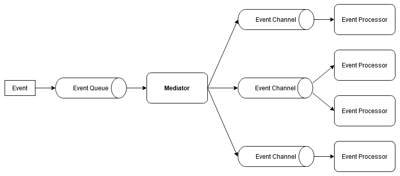
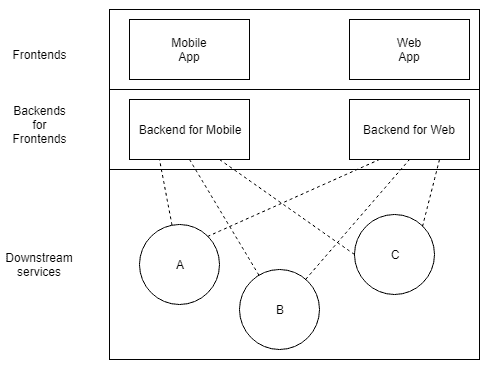

Architectural Styles

本章介绍了不同的建筑方法或风格。每个部分将讨论设计软件的不同方法及其优缺点，并描述何时以及如何应用它来获得好处。我们将从比较有状态和无状态体系结构开始本章。接下来，我们将从整体系统，到各种面向服务的设计，一直到微服务。然后，我们将通过描述基于事件的系统，分层系统以及最后的模块化设计，从不同的角度开始研究建筑风格。

完成本章后，您将熟悉以下主题:

*   决定有状态和无状态方法
*   理解巨石-为什么应该避免它们，并认识到例外
*   了解服务和微服务
*   探索基于事件的体系结构
*   理解分层架构
*   基于学习模块的体系结构

# 技术要求

您将需要知道什么是软件服务，并且能够读取 C 11 中的代码。

本章的代码可以在下面的 GitHub 页面上找到: [https://github.com/PacktPublishing/ Software-Architecture-w 同-Cpp/tree/master/Chapter02](https://github.com/PacktPublishing/Software-Architecture-with-Cpp/tree/master/Chapter02)。

# 决定有状态和无状态方法

有状态和无状态是两种相反的软件编写方式，各有优劣。

顾名思义，有状态软件的行为取决于其内部状态。让我们以一个 web 服务为例。如果它记住其状态，则服务的使用者可以在每个请求中发送更少的数据，因为服务会记住这些请求的上下文。但是，节省请求大小和带宽在 web 服务方面具有隐藏的成本。如果用户同时发送许多请求，则该服务现在必须同步其工作。由于多个请求可能会同时更改状态，因此不同步可能会导致数据竞争。

但是，如果服务是无状态的，那么每个请求都需要包含成功处理它所需的所有数据。这意味着请求将变得更大，占用更多的带宽，但另一方面，它将允许更好的性能和服务的扩展。如果您熟悉函数式编程，您可能会发现无状态服务很直观。处理每个请求可以理解为对纯函数的调用。实际上，无状态编程提供的许多优点都源于其函数式编程的根源。可变状态是并发代码的敌人。函数式编程依赖于不可变的值，即使这意味着制作副本而不是修改现有对象。由于这一点，每个线程可以独立工作，没有数据竞争是可能的。

由于没有比赛条件，因此也不需要锁，这可以极大地提高性能。没有锁也意味着您将不再需要处理死锁。拥有纯函数意味着您的代码也将更容易调试，因为您没有任何副作用。反过来，没有副作用对编译器也有帮助，因为在没有副作用的情况下优化代码是一项容易得多的任务，并且可以更积极地执行。以功能性方式编写代码的另一个好处是，您编写的源代码往往更简洁，更富有表现力，尤其是与严重依赖于**四人帮** (**GoF**) 设计模式的代码相比。

这并不一定意味着如果带宽不是问题，您应该始终使用无状态。这些决定可以在许多级别上做出，从单个类或函数到整个应用程序。

以上课为例。如果你正在建模，比如说，一个`Consultant`，这个类包含顾问的姓名、联系人数据、小时费率、当前和过去的项目等字段是有意义的。有状态是很自然的。现在，想象一下，你需要计算他们工作得到的报酬。你应该创建一个`PaymentCalculator`类吗？你应该添加一个成员还是一个自由函数来计算这个？如果使用类方法，应该传递`Consultant`作为构造函数参数还是方法参数？班级应该有津贴之类的属性吗？

添加一个成员函数来计算工资将打破**单一责任原则** (**SRP)** ，因为现在班级将有两个责任: 计算工资和存储顾问的数据 (状态)。这意味着为此目的引入一个自由函数或一个单独的类应该比具有这样的混合类更可取。

这样的班级首先应该有一个状态吗？让我们讨论一下我们的`PaymentCalculator`类的不同方法。

一种方法是公开计算所需的属性:

```cpp
class PaymentCalculator;
{
 public:
  double calculate() const;

  void setHours(double hours);
  void setHourlyRate(double rate);
  void setTaxPercentage(double tax);
 private:
  double hours_;
  double netHourlyRate_;
  double taxPercentage_;
};
```

这种方法有两个缺点。首先是它不是线程安全的; 这样的`PaymentCalculator`类的单个实例不能在没有锁的多个线程中使用。第二个是，一旦我们的计算变得更加复杂，这个类可能会开始从我们的`Consultant`类中复制更多的字段。

为了消除重复，我们可以重做我们的类来存储一个`Consultant`实例，如下:

```cpp
class PaymentCalculator {
 public:
  double calculate() const;

  void setConsultant(const Consultant &c);
  void setTaxPercentage(double tax);

 private:
  gsl::not_null<const Consultant *> consultant_;
  double taxPercentage_;
};
```

请注意，由于我们无法轻松地重新绑定引用，因此我们使用了**指南支持库** (**GSL**) 中的帮助器类来将可重新绑定的指针存储在包装器中，从而自动确保我们不会存储 null 值。

这种方法仍然有不线程安全的缺点。我们能做得更好吗？事实证明，我们可以通过使其无状态来使类线程安全:

```cpp
class PaymentCalculator {
 public:
  static double calculate(const Consultant &c, double taxPercentage);
};
```

如果没有要管理的状态，那么您是否决定创建自由函数 (可能在不同的名称空间中) 或将它们分组为类的静态函数并不重要，就像我们在前面的代码片段中所做的那样。就类而言，区分值 (实体) 类型和操作类型很有用，因为混合它们会导致 SRP 违规。

## 无状态和有状态服务

我们为类讨论的相同原理可以映射到更高级别的概念，例如微服务。

有状态服务是什么样的？让我们以 FTP 为例。如果它不是匿名的，它要求用户传递用户名和密码来创建会话。服务器存储此数据以识别用户仍处于连接状态，因此它不断存储状态。每次用户更改工作目录时，状态都会更新。用户所做的每个更改都反映为状态的更改，即使它们断开连接也是如此。有状态服务意味着根据状态，您可以为两个看起来相同的`GET`请求返回不同的结果。如果服务器失去状态，您的请求甚至可以正确停止处理。

有状态服务也可能存在会话不完整或未完成事务以及增加复杂性的问题。您应该将会话开放多长时间？如何验证客户端是否已崩溃或断开连接？我们应该什么时候回滚所做的任何更改？虽然你可以想出这些问题的答案，但通常更容易依靠你的服务的消费者以动态的、 “智能” 的方式与之通信。由于他们将自己维护某种状态，因此拥有同时维护状态的服务不仅是不必要的，而且通常是浪费的。

无状态服务，就像本书后面描述的其他服务一样，采取相反的方法。每个请求必须包含成功处理所需的所有数据，因此两个相同的幂等请求 (例如`GET`) 将导致相同的回复。这是假设存储在服务器上的数据没有变化，但数据不一定与状态相同。重要的是每个请求都是独立的。

无国籍状态是现代互联网服务的基础。HTTP 协议是无状态的，而许多服务 api (例如 Twitter) 也是无状态的。Twitter 的 API 所依赖的 REST 被设计为功能无状态。这个缩写背后的整个概念，**表示状态转移** (**REST**)，带有这样的概念，即处理请求所需的所有状态都必须在其中转移。如果不是这种情况，则不能说您有 RESTful 服务。但是，由于实际需要，该规则有一些例外。

如果您要建立在线商店，则可能希望存储与客户有关的信息，例如他们的订单历史记录和送货地址。客户侧的客户端可能会存储身份验证 cookie，而服务器可能会在数据库中存储一些用户数据。cookie 取代了我们管理会话的需求，因为它将在有状态服务中完成。

由于以下几个原因，将会话保持在服务器端是一种糟糕的服务方法: 它们增加了很多可以避免的复杂性，它们使错误更难复制，最重要的是，它们无法扩展。如果您想将负载分配到另一台服务器，则很可能无法使用负载复制会话并在服务器之间进行同步。所有会话信息都应保留在客户端。

这意味着，如果你希望有一个有状态的架构，你需要有一个很好的理由。以 FTP 协议为例。它必须在客户端和服务器端复制更改。用户仅对单个特定服务器进行身份验证，以便执行单个陈述的数据传输。将其与 Dropbox 等服务进行比较，在该服务中，数据通常在用户之间共享，并且文件访问通过 API 抽象掉，以了解为什么无状态模型更适合这种情况。

# 理解巨石-为什么应该避免它们，并认识到例外

您可以开发应用程序的最简单的体系结构风格是一个整体。这就是为什么许多项目开始使用这种风格。单片应用程序只是一个大块，这意味着应用程序的功能上可区分的部分，例如处理 I/O，数据处理和用户界面，都是交织在一起的，而不是在单独的架构组件中。这种架构风格的另一个值得注意的例子是 linux 内核。请注意，内核是单片的并不能阻止它是模块化的。

与多组件应用程序相比，部署这种整体应用程序可能更容易，因为只需要部署一件事。它也可以更容易地测试，因为端到端测试只需要您启动一个组件。集成也更容易，因为除了扩展解决方案外，您还可以在负载均衡器后面添加更多实例。有了所有这些优点，为什么有人会害怕这种建筑风格？事实证明，尽管有这些优点，但也有许多缺点。

从理论上讲，提供的可扩展性听起来不错，但是如果您的应用程序具有不同资源需求的模块，该怎么办？只需要从应用程序中扩展一个模块怎么样？缺乏模块化是整体系统的固有特性，是与此体系结构相关的许多缺陷的根源。

更重要的是，您开发一个整体应用程序的时间越长，维护它的问题就越多。保持这种应用程序的内部松散耦合是一个挑战，因为它很容易在其模块之间添加另一个依赖关系。随着这样的应用程序的增长，它变得越来越难以理解，因此开发过程很可能会随着时间的推移而变慢，因为增加了复杂性。在开发单片时，也很难维护**设计驱动的开发** (**DDD**) 有界上下文。

拥有一个大的应用程序在部署和执行方面也有缺点。启动此类应用程序所需的时间要比启动更多，更小的服务所需的时间长得多。而且，无论您在应用程序中进行了什么更改，您都可能不喜欢它迫使您立即重新部署整个应用程序。现在，想象一下，您的一个开发人员在应用程序中引入了资源泄漏。如果泄漏代码一遍又一遍地执行，它不仅会降低应用程序功能的单个方面，还会降低应用程序的其余部分。

如果您喜欢在项目中使用前沿技术，那么整体风格也不会带来任何好消息。由于您现在需要一次迁移整个应用程序，因此很难更新任何库或框架。

前面的解释表明，单片体系结构仅适用于简单且小型的应用程序。但是，还有一种情况，实际上使用它可能是一个好主意。如果您关心性能，那么与微服务相比，拥有一个整体有时可以帮助您从应用程序中挤出更多的延迟或吞吐量。进程间通信总是会产生一些开销，这是单片应用程序不需要支付的。如果您对测量感兴趣，请参阅本章的*进一步阅读*部分中列出的论文。

# 了解服务和微服务

由于单片体系结构的缺点，出现了其他方法。一个常见的想法是将您的解决方案拆分为多个相互通信的服务。然后，您可以在不同的团队之间划分开发，每个团队都负责单独的服务。与整体架构风格不同，每个团队的工作边界都很明确。

**面向服务的体系结构**，简称**SOA**，是指将业务功能模块化，并作为单独的服务呈现给消费者应用程序使用。每个服务都应该有一个自描述接口，并隐藏任何实现细节，如内部架构、技术或使用的编程语言。这允许多个团队开发他们喜欢的服务，这意味着在引擎盖下，每个团队都可以使用最适合他们需求的服务。如果您有两个开发人员团队，一个精通 C #，一个精通 C #，他们可以开发两个可以轻松相互通信的服务。

SOA 的倡导者提出了一份宣言，优先考虑以下内容:

*   业务价值超过技术战略
*   战略目标超过项目特定收益
*   自定义集成的内在互操作性
*   特定目的实现上的共享服务
*   灵活性超过优化
*   追求初始完美的进化细化

即使此宣言不会将您绑定到特定的技术堆栈，实现或服务类型，但两种最常见的服务类型是 SOAP 和 REST。除了这些之外，最近还有第三个越来越受欢迎的: 基于 gRPC 的。您可以在有关面向服务的体系结构和微服务的章节中找到有关这些内容的更多信息。

## 微服务

顾名思义，微服务是一种软件开发模式，其中应用程序被拆分为使用轻量级协议进行通信的松散耦合服务的集合。微服务模式类似于 UNIX 哲学，指出程序应该只有一个目的。根据 UNIX 哲学，通过将此类程序组成 UNIX 管道来解决高级问题。同样，基于微服务的系统由许多微服务和支持服务组成。

让我们先概述一下这种建筑风格的利弊。

### 微服务的利弊

微服务体系结构中的服务规模较小，这意味着它们的开发、部署和理解速度更快。由于服务是相互独立构建的，因此可以大大减少编译其新版本所需的时间。由于这一点，在处理这种建筑风格时，更容易采用快速原型和开发。反过来，这可以减少提前期，这意味着可以更快地引入和评估业务需求。

基于微服务的方法的其他一些好处包括:

*   模块化，这是这种建筑风格所固有的。

*   更好的可测试性。
*   更换系统部分 (如单一服务、数据库、消息代理或云提供商) 时的灵活性。
*   与遗留系统的集成: 无需迁移整个应用程序，只需迁移需要当前开发的部分即可。
*   支持分布式开发: 独立的开发团队可以并行处理多个微服务。
*   可伸缩性: 微服务可以独立于其他服务进行扩展。

另一方面，以下是微服务的一些缺点:

*   他们需要成熟的 DevOps 方法和对 CI/CD 自动化的依赖。
*   它们更难调试，需要更好的监控和分布式跟踪。
*   额外的开销 (就辅助服务而言) 可能会超过较小应用程序的好处。

现在让我们讨论以这种架构风格编写的服务的特征是什么。

### 微服务的特点

由于微服务样式是相当新的，因此没有针对微服务的单一定义。根据 Martin Fowler 的说法，微服务有几个基本特征，我们接下来将对其进行描述:

*   每个服务都应该是一个独立的可替换和可升级的组件。这与更容易部署和服务之间的松散耦合有关，而不是组件是单片应用程序中的库。在后一种情况下，当您替换一个库时，通常必须重新部署整个应用程序。
*   每项服务都应由一个跨职能团队开发，专注于特定的业务能力。听说过康威定律吗？

*"Any organization that designs a system (defined broadly) will produce a design whose structure is a copy of the organization's communication structure."* *– Melvyn Conway, 1967*

如果你没有跨职能团队，你最终会得到软件孤岛。随之而来的缺乏沟通将使您不断克服障碍以成功交付。

*   每项服务都应该是一个产品，在整个生命周期中由开发团队拥有。这与项目心态形成鲜明对比，在项目心态中，您开发软件并将其传递给某人进行维护。
*   服务应该有智能端点，并使用转储管道，而不是相反。这与传统服务相反，传统服务通常依赖于**企业服务总线** (**ESB**) 的逻辑，后者通常管理消息的路由并根据业务规则对其进行转换。在微服务中，您可以通过在服务中存储逻辑来实现凝聚力，并避免与消息传递组件耦合。使用 “哑” 消息队列，如 ZeroMQ，可以帮助实现这一目标。
*   服务应该以分散的方式管理。整料通常使用一个特定的技术堆栈编写。当它们被分成微服务时，每个人都可以选择最适合自己特定需求的东西。管理和确保每个微服务 24/7 运行是由负责此特定服务的团队而不是中央部门完成的。亚马逊、Netflix 和 Facebook 等公司遵循这种方法，并观察到让开发人员对生产中服务的完美执行负责有助于确保高质量。
*   服务应该以分散的方式管理其数据。每个微服务可以选择最符合其需求的数据库，而不是为所有这些数据库提供一个数据库。拥有分散的数据可能会导致处理更新的一些挑战，但允许更好的扩展。这就是为什么微服务通常以无事务方式进行协调并提供最终一致性的原因。
*   服务使用的基础结构应该自动管理。要以高效的方式处理数十个微服务，您需要进行持续的集成和持续的交付，否则，部署您的服务将是地狱。所有测试的自动化运行将为您节省大量时间和麻烦。最重要的是实施持续部署将缩短反馈循环，并允许您的客户更快地使用您的新功能。
*   微服务应该为它们所依赖的其他服务的失败做好准备。在具有如此多活动部件的分布式部署环境中，其中一些部件不时中断是正常的。您的服务应该能够优雅地处理此类故障。诸如断路器或舱壁 (在本书后面描述) 之类的模式可以帮助实现这一目标。为了使您的架构具有弹性，能够有效地恢复失败的服务，甚至提前知道它们将崩溃，这一点也至关重要。实时监控延迟、吞吐量和资源使用情况至关重要。了解 Netflix 的 Simian Army 工具包，因为它对于创建弹性架构非常宝贵。
*   基于微服务的体系结构应该准备好不断发展。您应该设计微服务以及它们之间的合作，以便于更换单个微服务，有时甚至是它们的组。正确设计服务是很棘手的，特别是因为曾经在一个更大的模块的代码中的一些复杂性现在可以作为服务之间的复杂通信方案出现，在那里更难管理-所谓的意大利面条集成。这意味着与传统服务或整体方法相比，架构师的经验和技能起着更重要的作用。

最重要的是，以下是许多 (但不是全部) 微服务共享的其他特征:

*   使用通过网络协议通信的单独进程
*   使用与技术无关的协议 (例如 HTTP 和 JSON)
*   保持服务规模较小，运行时开销较低

现在，您应该对基于微服务的系统的特性有了很好的了解，所以让我们看看这种方法与其他架构风格相比如何。

### 微服务和其他建筑风格

微服务可以单独用作体系结构模式。但是，它们通常与其他体系结构选择结合在一起，例如云原生计算，无服务器应用程序，并且大多数情况下都与轻量级应用程序容器结合在一起。

面向服务的体系结构带来了松散的耦合和高凝聚力。当正确应用时，微服务也可以做到这一点。但是，这可能有些具有挑战性，因为它需要良好的直觉才能将系统划分为通常大量的微服务。

微服务和它们更大的表亲之间有更多的相似之处，因为它们也可以具有基于 SOAP、REST 或 gRPC 的消息传递，并使用诸如消息队列之类的技术来驱动事件。它们还具有众所周知的模式来帮助实现所需的质量属性，例如容错 (例如，通过隔离有故障的组件)，但是为了拥有高效的体系结构，您必须决定对元素的方法，例如 API 网关，服务注册表，负载平衡，容错，监视，配置管理，当然还有要使用的技术栈。

### 扩展微服务

微服务对单片应用程序的扩展不同。在整块中，整个功能由单个过程处理。扩展应用程序意味着在不同的机器上复制此过程。这种缩放没有考虑到哪些功能被大量使用，哪些不需要额外的资源。

使用微服务，每个功能元素都作为一个单独的服务来处理，这意味着一个单独的过程。为了扩展基于微服务的应用程序，只能将需要更多资源的部分复制到不同的机器上。这种方法使更好地使用可用资源变得更加容易。

### 过渡到微服务

大多数公司都有某种现有的单片代码，他们不想立即使用微服务重写，但仍然希望过渡到这种架构。在这种情况下，可以通过添加越来越多与 monolith 交互的服务来逐步调整微服务。您可以创建新的功能作为微服务，或者只是切掉整体的某些部分并从中创建微服务。

有关微服务的更多详细信息，包括如何从头开始构建自己的服务，请参见[第 13 章](13.html)，*设计微服务*。

# 探索基于事件的体系结构

基于事件的系统是那些其体系结构围绕处理事件展开的系统。有些组件会生成事件，事件传播的通道以及对事件做出反应的侦听器，也可能触发新事件。这是一种促进异步和松散耦合的样式，这使其成为提高性能和可伸缩性的好方法，以及易于部署的解决方案。

有了这些优势，也有一些挑战需要解决。其中之一是创建这种类型的系统的复杂性。必须使所有队列容错，以便在处理过程中不会丢失任何事件。以分布式方式处理事务本身也是一个挑战。使用相关 ID 模式跟踪进程之间的事件，以及监控技术，可以节省您的调试时间和挠头时间。

基于事件的系统的示例包括流处理器和数据集成，以及旨在实现低延迟或高可扩展性的系统。

现在让我们讨论这种系统中使用的常见拓扑。

## 常见的基于事件的拓扑

事件驱动体系结构的两个主要拓扑是基于代理和基于中介的。这些拓扑在事件流经系统的方式上有所不同。

在处理需要多个可以独立执行的任务或步骤的事件时，最好使用中介拓扑。最初产生的所有事件都落在调解员的事件队列中。调解人知道为了处理事件需要做什么，但不是执行逻辑本身，而是通过每个处理器的事件通道将事件发送到适当的事件处理器。

如果这让你想起业务流程是如何流动的，那么你就有了很好的直觉。您可以在**业务流程管理** (**BPM**) 或**业务流程执行语言** (**BPEL**) 中实现此拓扑。但是，您也可以使用 Apache Camel，Mule ESB 等技术来实现它:



Figure 2.1 – The mediator topology

另一方面，代理是一个轻量级组件，它包含所有队列，并且不协调事件的处理。它可能要求收件人订阅特定类型的事件，然后简单地转发所有对他们感兴趣的事件。许多消息队列依赖于代理，例如，ZeroMQ，它是用 C 编写的，旨在零浪费和低延迟:


Figure 2.2 – The broker topology

既然您已经了解了基于事件的系统中使用的两种常见拓扑，那么让我们来了解一种以事件为核心的强大体系结构模式。

## 事件来源

您可以将事件视为包含要处理的通知服务的其他数据的通知。然而，还有另一种思考方式: 改变状态。想想这将是多么容易调试的问题，你的应用程序逻辑，如果你能够知道的状态，它是在什么时候发生的 bug 和什么变化是要求它。这是事件采购的一个好处。本质上，它通过简单地记录系统发生的所有事件的顺序来捕获系统发生的所有变化。

通常，您会发现服务不再需要将其状态保留在数据库中，因为将事件存储在系统中的其他位置就足够了。即使这样做，也可以异步完成。您从事件采购中获得的另一个好处是免费的完整审计日志:


Figure 2.3 – Event sourcing architecture. Providing a unified view of the application state can allow for consuming it and creating periodic snapshots for faster recovery

由于减少了对数据同步的需求，事件源系统通常提供低延迟，这使得它们非常适合交易系统和活动跟踪器等。

现在让我们来了解另一种流行的建筑风格。

# 理解分层架构

如果您的架构开始看起来像意大利面条，或者您只是想阻止它，则将组件分层结构化可能会有所帮助。还记得模型-视图-控制器吗？或者可能是类似的模式，如模型-视图模型或实体-控制-边界？这些都是分层体系结构的典型示例 (如果层在物理上彼此分离，也称为 N 层体系结构)。您可以在层中构造代码，可以创建微服务层，或者将此模式应用于您认为它可以带来好处的其他领域。分层提供了抽象和关注点的分离，这是引入它的主要原因。但是，它还可以帮助降低复杂性，同时提高解决方案的模块化，可重用性和可维护性。

一个真实的例子是自动驾驶汽车，其中可以使用层来分层决策: 最低层将处理汽车的传感器，然后另一层将处理消耗传感器数据的单个特征，最重要的是，可能会有另一个功能来确保所有功能都会导致安全行为。在汽车的另一种型号中更换传感器时，只需要更换最低层。

分层体系结构通常很容易实现，因为大多数开发人员已经知道层的概念-他们只需要开发几个层并按下图堆叠它们:


Figure 2.4 – An example of a 3-tiered architecture using a textual interface in the presentation layer

创建有效的分层体系结构的挑战在于指定层之间稳定，定义明确的接口。通常，您可以在一层之上有几层。例如，如果您有一个用于域逻辑的层，则它可以是表示层的基础和用于向其他服务提供 api 的层。

这并不意味着分层总是一件好事。对于微服务，分层出现的主要场景有两种。第一种是当您想要将一组服务与另一组服务分开时。例如，您可以有一个快速变化的层来与您的业务合作伙伴互动，内容经常变化，还有另一个面向业务功能的层。后者并没有以如此快的速度进行更改，而是使用了稳定的技术。将这两者分开是有意义的。还有一种观点认为，不太稳定的组件应该依赖于更稳定的组件，所以很容易看出，这里可以有两层，面向客户的一层取决于业务能力。

另一种情况是创建图层以反映组织的通信结构 (您好，康威定律)。这可能会减少团队之间的沟通，这可能会导致创新的减少，因为现在团队不会那么了解彼此的内部或想法。

现在让我们讨论通常与微服务一起使用的分层体系结构的另一个示例-前端的后端。

## 前端的后端

看到许多前端依赖相同的后端并不少见。假设您有一个移动应用程序和一个 web 应用程序，两者都使用相同的后端。一开始可能是一个不错的设计选择。但是，一旦这两个应用程序的需求和使用场景出现分歧，您的后端将需要越来越多的更改，仅服务于前端之一。这可能导致后端必须支持竞争需求，例如两种单独的方式来更新数据存储或提供数据的不同方案。同时，前端开始需要更多带宽才能与后端正确通信，这也导致移动应用程序中更多的电池使用量。此时，您应该考虑为每个前端引入一个单独的后端。

这样，您可以将面向用户的应用程序视为具有两层的单个实体: 前端和后端。后端可以依赖于由下游服务组成的另一层。参考下图:



Figure 2.5 – The Backends for Frontends pattern

前端 (**BFFs**) 使用**后端的缺点是某些代码必须重复。只要这加快了发展，从长远来看不是负担，就可以了。但这也意味着您应该关注在下游服务中聚合重复逻辑的可能性。有时，引入服务只是为了聚合类似的调用可以帮助解决重复问题。通常，如果您有许多前端，则有些仍然可以共享后端，而不会导致其具有竞争要求。例如，如果您要为 iOS 和 Android 创建移动应用程序，则可以考虑为这些应用程序重用相同的后端，并为 web 和/或桌面应用程序使用单独的后端。**

# 基于学习模块的体系结构

In this section, by modules, we mean software components that can be loaded and unloaded in runtime. For C++20's modules, refer to [Chapter 5](05.html), *Leveraging C++ Language Features.*

如果您曾经需要以尽可能少的停机时间运行组件，但由于任何原因无法应用通常的容错模式，例如服务的冗余副本，那么使此组件基于模块可以节省您的一天。或者，您可能只是被模块化系统的愿景所吸引，该系统具有所有模块的版本控制，所有可用服务的轻松查找以及基于模块的系统可能导致的解耦，可测试性和增强团队合作。这就是为什么为 Java 创建了**开放服务网关计划** (**OSGi**) 模块并在多个框架中移植到 C 的原因。使用模块的架构示例包括诸如 Eclipse、**软件定义网络** (**SDN**) 项目 (如 OpenDaylight) 或家庭自动化软件 (如 OpenHAB)。

OSGi 还允许模块之间的自动依赖关系管理，控制它们的初始化和卸载，以及控制它们的发现。由于它是面向服务的，您可以将使用 OSGi 服务视为类似于在一个 “容器” 中具有微小 (微型？) 服务的东西。这就是为什么其中一个 C 实现被命名为 C 微服务的原因。要查看它们的实际情况，请参阅*进一步阅读*部分中的*入门*指南。

C Micro Services 框架采用的一个有趣的概念是一种处理单身人士的新方法。`GetInstance()`静态函数将返回从捆绑上下文获得的服务引用，而不是仅仅传递一个静态实例对象。因此，有效地，单例对象将被您可以配置的服务所取代。它还可以将您从静态去初始化惨败中拯救出来，在静态去初始化惨败中，相互依赖的多个单例必须按特定顺序卸载。

# 摘要

在本章中，我们讨论了您可以在野外遇到并应用于软件的各种建筑风格。我们讨论了单体架构，经历了面向服务的架构，转移到微服务，并讨论了它们提供外部接口和相互交互的各种方式。您学习了如何编写 RESTful 服务，以及如何创建弹性且易于维护的微服务架构。

我们还展示了如何创建简单的客户端来消费同样简单的服务。稍后，我们讨论了其他各种架构方法: 事件驱动的方法，基于运行时模块的方法，并展示了可以发现分层的位置以及原因。您现在知道如何实现事件采购并识别何时使用 bff。此外，您现在知道建筑风格如何帮助您实现几个质量属性，以及这会带来什么挑战。

在下一章中，您将学习如何知道在给定系统中哪些属性很重要。

# 问题

1.RESTful 服务的特点是什么？
2.您可以使用什么工具包来帮助您创建弹性分布式体系结构？
3.您应该为您的微服务使用集中存储吗？为什么/为什么不呢？
4.什么时候应该编写有状态服务而不是无状态服务？
5.经纪人与调解人有何不同？
6.N 层和 N 层体系结构有什么区别？
7.您应该如何用基于微服务的体系结构替换整体？

# 进一步阅读

*   Flygarr，R.和 Holmqvist，A。(2017)。*基于单片和微服务的系统之间的性能特征 (论文*)。检索自[http://urn.kb.se/resolve？urn=urn:nbn:se: bth-14888](http://urn.kb.se/resolve?urn=urn:nbn:se:bth-14888)
*   恩格伦，罗伯特。(2008)。*面向服务的计算框架，具有 C 和 C web 服务组件*。ACM Trans。互联网技术。8\. 10.1145/1361186.1361188
*   福勒，马丁。*微服务-这个新架构术语*的定义。检索自[https://martinfowler.com/articles/microservices.html#MicroservicesAndSoa](https://martinfowler.com/articles/microservices.html#MicroservicesAndSoa)
*   *入门-C 微服务文档*。检索自[http://docs.cppmicroservices.org/en/stable/doc/src/ 开始 _ 开始。html](http://docs.cppmicroservices.org/en/stable/doc/src/getting_started.html)