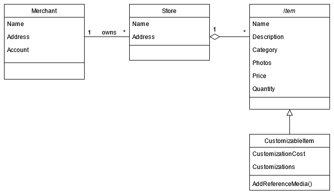
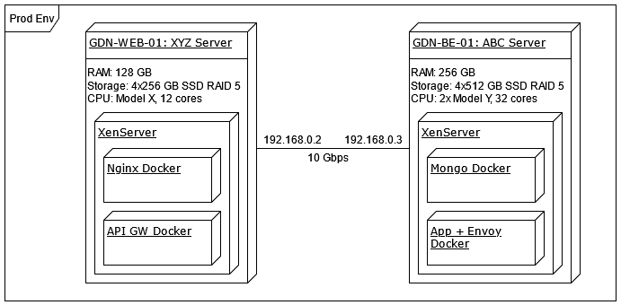
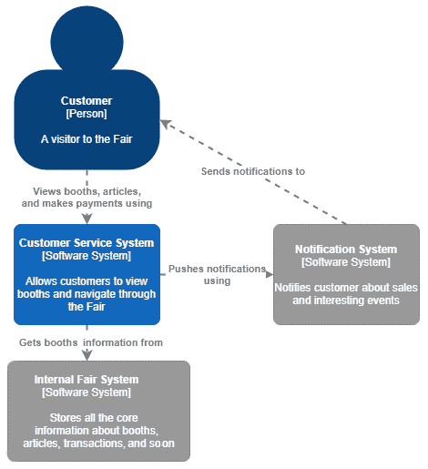

Functional and Nonfunctional Requirements

作为一名架构师，重要的是要认识到哪些需求对架构很重要，以及为什么。本章将教您解决方案的各种需求-功能性和非功能性。功能需求是那些告诉你你的解决方案应该做什么的需求。另一方面，非功能性的是那些告诉你你的解决方案应该是*。*

在本章中，我们将介绍以下主题:

*   了解需求类型
*   认识到建筑上的重要要求
*   从各种来源收集需求
*   记录要求
*   记录架构
*   选择正确的视图来记录
*   生成文档

在本章结束时，您将学习如何识别和分类这两种类型的需求，以及如何创建以清晰的方式描述它们的文档。

# 来自来源的技术要求文档，您必须有

要复制我们从来源生成文档的步骤，您必须安装 cmac、Doxygen、Sphinx、m2r2 和 Breathe。我们正在使用 ReadTheDocs Sphinx 主题，因此也请安装它。随意使用上述工具的最新版本。

您可以在[https://github.com/PacktPublishing/ Software-Architecture-w 及其 Cpp/tree/master/Chapter03](https://github.com/PacktPublishing/Software-Architecture-with-Cpp/tree/master/Chapter03)找到相关代码。

# 了解需求类型

在创建软件系统的同时，你应该不断地问自己，你所做的是否是你的客户所需要的。很多时候，他们甚至不知道什么要求最能满足他们的需求。成功的架构师的角色是发现产品的要求并确保它们得到满足。您需要考虑三种不同类型的需求: 功能需求、质量属性和约束。让我们看看这些。

## 功能要求

第一组是功能需求。这些定义了你的系统应该做什么，或者它应该提供什么功能。

Remember that functionality does not always influence architecture, so you'll have to keep an eye on which of those requirements will actually dictate what your solution will look like.

通常，如果功能需求具有必须满足的某些质量，则它可能在体系结构上变得重要。考虑一下多米尼加博览会的商人和游客的应用程序，这是在格但斯克市举行的一年一度的音乐，各种艺术和商店活动。it 的功能需求的一些示例如下:

*   *作为店主，我想过滤包含特定产品的订单。*
*   *单击 “订阅” 按钮将客户添加到所选商家的已通知观察者列表中。*

第一个要求告诉我们，我们必须有一个组件来跟踪订单和具有搜索功能的产品。根据 UI 的确切显示方式以及应用程序的规模，我们可以在应用程序中添加一个简单的页面，或者它可能需要 Lucene 或 Elasticsearch 等功能。这意味着我们可以看到一个**架构上重要的需求** (**ASR**)，它可以影响我们的架构。

第二个例子更加简单; 现在我们知道我们需要一个订阅和发送通知的服务。这绝对是一个具有建筑意义的功能要求。现在我们来看看一些也可以是 ASRs 的**非功能性需求** (**NFRs**)。

顺便说一句，第一个要求实际上是作为用户故事给出的。用户故事以以下格式给出要求: “*作为<角色>，我可以/想要<能力>，以便<受益>*。”这是一种常用的需求表达方式，可以帮助利益相关者和开发人员找到共同点，更好地沟通。

## 非功能性需求

非功能性需求不是关注您的系统应该具有什么功能，而是关注系统应该如何以及在何种条件下执行所述功能。该组由两个主要子组组成: **质量属性** (**QAs**) 和**约束**。

### 质量属性

**质量****属性** (**QAs**) 是解决方案的特征，例如性能，可维护性和用户友好性。您的软件可以具有数十种 (如果不是数百种) 不同的质量。试着只关注重要的那些，而不是列出你在选择你的软件应该拥有的那些时想到的所有东西。质量属性要求的示例包括以下内容:

*   系统将在 500 毫秒以下响应正常负载下的所有请求的 99.9% (不要忘记指定通常负载是或将是什么)。
*   网站不会存储支付过程中使用的客户信用卡数据 (保密的一个例子)。
*   更新系统时，如果更新任何组件失败，系统将被回滚到更新之前的状态 (生存能力)。
*   作为 Windows、macOS 和 Android 的用户，我希望能够使用所有这些系统 (便携性; 尝试了解是否需要支持桌面、移动和/或网络等平台)。

虽然在积压中捕获功能需求非常简单，但关于质量属性需求，我们不能说同样的话。幸运的是，有几种方法可以解决这个问题:

*   其中一些可以用 done 的定义或**接受标准**表示您的任务、故事和发布。
*   其他人可以直接表示为用户故事，如前面的最后一个示例所示。
*   您还可以将它们作为设计和代码审查的一部分进行检查，并为其中一些创建自动化测试。

### 约束

约束是您在交付项目时必须遵循的不可协商的决策。这些可以是设计决策，技术决策，甚至是政治决策 (关于人员或组织事务)。另外两个常见的约束条件是**时间**和**预算**。约束的示例如下:

*   *团队将永远不会超过四个开发人员，一个 QA 工程师和一个系统管理员。*
*   由于我们公司在所有现有产品中都使用 Oracle DB，因此新产品也必须使用它，这样我们才能充分利用我们的专业知识。

非功能性需求总是会影响您的架构。不要过度指定它们，因为在产品开发过程中，有*误报*将是一个持续的负担。同样重要的是不要对它们进行详细说明，因为这可能会在以后错过的销售机会或不符合监管机构的要求时出现。

在下一节中，您将学习如何在这两个极端之间取得平衡，并专注于那些在您的特定情况下真正重要的需求。

# 认识到建筑上的重要要求

在设计软件系统时，通常要处理几十个或几百个各种需求。为了理解它们并提出一个好的设计，你需要知道它们中的哪些是重要的，哪些是可以实施的，而不管你的设计决定是什么，甚至是被驳回。你应该学会如何识别最重要的，这样你就可以首先关注它们，并在尽可能短的时间内实现最大的价值。

You should prioritize requirements using two metrics: the business value and the impact on architecture. Those that will be high on both scales are most important and should be dealt with as a matter of priority. If you come up with too many such requirements, you should revisit your prioritization scheme. If it doesn't help, it might be that the system just isn't achievable.

Asr 是那些对系统架构有可衡量影响的 asr。它们既可以是功能性的，也可以是非功能性的。您如何识别哪些实际上很重要？如果没有特定要求允许您创建其他架构，则您正在查看 ASR。延迟发现此类需求通常会花费您的时间和金钱，因为您需要重新设计系统的某些部分 (如果不是整个解决方案)。你只能希望它不会让你失去其他资源和声誉。

It's a common mistake to start by applying concrete technologies to your architecture from the very beginning of your architectural work. We strongly suggest that you first gather all the requirements, focus on the ones significant for the architecture, and only then decide what technologies and technology stacks to build your project on.

既然识别 ASRs 非常重要，让我们来谈谈一些可以帮助你的模式。

## 建筑意义指标

如果您需要与任何外部系统集成，这很可能会影响您的架构。让我们来看看需求是 ASR 的一些常见指标:

*   **需要创建一个软件组件来处理它**: 示例包括发送电子邮件、推送通知、与公司的 SAP 服务器交换数据或使用特定的数据存储。
*   **对系统有重大影响**: 核心功能通常定义您的系统应该是什么样子。跨领域的问题，例如授权，可审计性或具有交易行为，是其他很好的例子。
*   **很难实现**: 具有低延迟是一个很好的例子: 除非你在开发的早期就想到它，否则要实现它可能是一场漫长的战斗，特别是如果你突然意识到当你在你的热门道路上时，你真的负担不起垃圾收集。
*   **在满足某些架构时强制权衡**: 如果成本太高，也许您的设计决策甚至需要折衷一些要求，以支持其他更重要的要求。这是一个很好的做法，在某个地方记录这样的决定，并注意到你在这里处理 asr。如果任何需求以任何方式限制了您或限制了产品，那么这对于体系结构非常重要。如果你想想出给出许多权衡的最佳架构，那么一定要阅读关于**架构权衡分析方法** (**ATAM**)，您可以在*进一步阅读*部分的链接之一下阅读。

约束和应用程序将运行的环境也会影响您的体系结构。嵌入式应用程序需要以与云中运行的应用程序不同的方式进行设计，由经验不足的开发人员开发的应用程序可能应该使用简单安全的框架，而不是使用具有陡峭学习曲线或开发自己的框架。

## 识别 asr 的障碍及其处理方法

与直觉相反，许多建筑上重要的要求很难乍一看。这是由两个因素引起的: 它们可能很难定义，即使描述了它们，也可以模糊地完成。您的客户可能还不清楚他们需要什么，但您仍然应该主动提出问题，以避免任何假设。如果您的系统要发送通知，则必须知道这些通知是实时的还是每日电子邮件是否足够，因为前者可能需要您创建发布者-订户架构。

在大多数情况下，您需要做出一些假设，因为并非所有事情都是预先知道的。如果你发现一个挑战你假设的要求，它可能是一个 ASR。如果您假设您可以在上午 3 点和上午 4 点之间维护您的服务，并且您意识到来自不同时区的客户仍然需要使用它，这将挑战您的假设，并可能改变产品的架构。

更重要的是，人们通常倾向于在项目的早期阶段模糊地对待质量属性，尤其是经验不足或技术含量较低的个人。另一方面，这是解决此类 asr 的最佳时机，因为在系统中实现它们的成本最低。

但是，值得注意的是，许多人在指定需求时，喜欢使用模糊的短语，而无需实际考虑。如果您正在设计类似于 Uber 的服务，则可以使用以下示例: *当收到 driverearchrequest 时，系统必须快速回复 AvailableDrivers 消息*，或者*系统必须 24/7*可用。

在提问时，通常会发现 99.9% 每月的可用性非常好，而*快速*实际上是几秒钟。这样的短语总是需要澄清，知道它们背后的基本原理通常是有价值的。也许这只是某人的主观意见，没有任何数据或业务需求的支持。另外，请注意，在请求和响应情况下，质量属性隐藏在另一个需求中，从而使其更难捕获。

最后，对于一个系统而言，在体系结构上具有重要意义的需求不一定对另一个系统具有相同的重要性，即使这些系统具有相似的目的。一旦系统发展并开始与越来越多的其他系统进行通信，随着时间的推移，有些系统将变得更加重要。一旦产品需求发生变化，其他产品可能会变得重要。这就是为什么没有灵丹妙药来告诉你哪些要求是 ASRs，哪些不是。

掌握了所有有关如何将重要要求与其余要求区分开的知识，您就知道要寻找什么。现在让我们说几句关于*在哪里看*。

# 从各种来源收集需求

现在您已经知道要关注哪些需求，让我们讨论一些用于收集这些需求的技术。

## 了解上下文

在挖掘需求时，您应该考虑到更广泛的背景。您必须确定哪些潜在问题可能会对您的产品产生负面影响。这些风险通常来自外部。让我们重新审视一下类似 Uber 的服务场景。您的服务的一个示例风险可能是立法的潜在变化: 您应该意识到，某些国家/地区可能会尝试更改法律以将您从其市场中删除。Uber 减轻这些风险的方法是让本地合作伙伴应对区域限制。

抛开未来的风险不谈，你还必须意识到当前的问题，比如公司缺乏主题专家，或者市场竞争激烈。这是你可以做的:

*   注意并注意正在做出的任何假设。最好有一个专门的文档来跟踪这些文档。
*   如果可能的话，提出问题来澄清或消除你的假设。
*   您需要考虑项目内部的依赖关系，因为它们会影响开发进度。其他有用的领域是塑造公司日常行为的业务规则，因为您的产品可能需要遵守并可能增强这些规则。
*   此外，如果有足够的与用户或业务相关的数据，您应该尝试挖掘这些数据，以获得洞察力，并找到有用的模式，帮助制定关于未来产品及其架构的决策。如果您已经有一些用户，但无法挖掘数据，那么观察他们的行为通常很有用。

理想情况下，您可以在他们使用当前部署的系统执行日常任务时记录他们。这样，您不仅可以自动化他们的部分工作，还可以将他们的工作流程完全更改为更高效的工作流程。但是，请记住，用户不喜欢改变自己的习惯，因此最好在可能的情况下逐步引入更改。

## 了解现有文档

现有文档可能是一个很好的信息来源，即使它们也可能有问题。您应该保留一些时间，至少熟悉与您的工作相关的所有现有文档。很可能其中隐藏了一些要求。另一方面，请记住，文档永远都不是完美的; 很可能它会缺乏一些重要的信息。你也应该为它过时做好准备。当涉及到建筑时，从来没有一个真理的来源，所以除了阅读文档，你应该与相关人员进行大量的讨论。尽管如此，阅读文档可能是为此类讨论做准备的好方法。

## 了解你的利益相关者

要成为一名成功的架构师，你必须学会直接或间接地与商务人士沟通。无论他们是来自你的公司还是客户，你都应该了解他们的业务背景。例如，您必须知道以下内容:

*   是什么推动了这项业务？
*   公司有什么目标？
*   您的产品将有助于实现哪些具体目标？

一旦你意识到这一点，与来自管理层或高管的许多人建立共同点，以及收集关于你的软件的更具体要求，就会容易得多。例如，如果公司关心其用户的隐私，则它可能需要存储尽可能少的关于其用户的数据，并使用仅存储在用户设备上的密钥对其进行加密。通常，如果这样的要求来自公司文化，那么对于某些员工来说，甚至无法表达出来就太明显了。了解业务背景可以帮助您提出适当的问题，并为公司提供帮助。

话虽如此，请记住，您的利益相关者可以并且将拥有不一定直接反映在公司目标中的需求。他们可以对提供的功能或软件应实现的指标有自己的想法。也许一位经理向他的员工保证有机会学习新技术或使用特定技术。如果这个项目对他们的职业生涯很重要，他们可以成为一个强大的盟友，甚至可以说服别人你的决定。

另一个重要的利益相关者群体是负责部署软件的人员。他们可以有自己的需求分组，称为过渡需求。这些示例包括用户和数据库迁移，基础架构转换或数据转换，因此请不要忘记与他们联系以收集这些内容。

## 从利益相关者那里收集需求

此时，您应该有一个利益相关者列表，包括他们的角色和联系信息。现在是时候利用它了: 一定要腾出时间与每个利益相关者讨论他们需要从系统中获得什么以及他们如何设想它。你可以举行 1:1 会议或小组会议等面试。在与你的利益相关者交谈时，帮助他们做出明智的决定 -- 展示他们对最终产品的回答的潜在结果。

利益相关者通常会说他们的所有要求都同样重要。尝试说服他们根据他们为业务带来的价值来优先考虑他们的要求。当然，会有一些关键任务要求，但最有可能的是，如果其他一堆项目不能交付，项目就不会失败，更不用说任何会落在你的需求愿望清单上的好东西了。

除了面试，你还可以为他们组织研讨会，这可能像头脑风暴会议一样工作。在这样的研讨会中，一旦建立了共同点，并且每个人都知道为什么要参加这样的冒险活动，您就可以开始要求每个人提供他们能想到的尽可能多的使用方案。一旦建立了这些，你就可以继续合并类似的故事，然后你应该优先考虑，最后，完善所有的故事。研讨会不仅涉及功能需求; 每个使用场景也可以分配质量属性。精炼后，所有的质量属性都应该是可测量的。最后要注意的是: 你不需要把所有的利益相关者都带到这样的事件中，因为他们有时可能需要一天以上的时间，这取决于系统的大小。

既然您知道如何使用各种技术和资源来挖掘需求，那么让我们讨论一下如何将您的发现倒入精心制作的文档中。

# 记录要求

一旦你完成了前面描述的步骤，就该把你收集的所有需求放在一起，并在一个文档中完善它们了。文档采用哪种形式以及如何管理都无关紧要。重要的是，您有一个文档，该文档将所有利益相关者放在同一页面上，以了解产品的需求以及每个需求带来的价值。

需求是由所有利益相关者产生和消费的，其中广泛的需求将需要阅读您的文档。这意味着你应该写它，这样它就可以为从客户、销售人员和营销人员，通过设计师和项目经理，到软件架构师、开发人员和测试人员的各种技术技能的人带来价值。

有时，准备两个版本的文档是有意义的，一个是为最接近项目业务端的人员准备的，另一个是更技术性的，是为开发团队准备的。但是，通常，仅编写一个文档以使每个人都能理解就足够了，其中包含部分 (有时是单个段落) 或整个章节，以涵盖更多的技术细节。

现在让我们来看看哪些部分可以进入你的需求文档。

## 记录上下文

需求文档应该成为参与您项目的人们的切入点之一: 它应该概述您产品的目的、谁将使用它以及如何使用它。在设计和开发之前，产品团队成员应阅读它，以清楚地了解他们将实际从事的工作。

上下文部分应该概述系统-为什么要构建它，它试图实现什么业务目标，以及它将提供什么关键功能。

您可以描述一些典型的用户角色，例如*John the CTO*或*Ann the driver*，以使读者有更好的机会将系统的用户视为实际的人，并了解他们的期望。

在了解上下文部分的*中描述的所有内容也应总结为上下文部分，或者有时甚至在文档中给出单独的部分。背景和范围部分应提供大多数非项目利益相关者所需的所有信息。它们应该简明扼要。*

对于您可能要研究并稍后决定的任何未解决的问题，情况也是如此。对于您做出的每个决定，最好注意以下几点:

*   决定本身是什么
*   是谁做的，什么时候做的
*   背后有什么理由

既然您知道如何记录项目的上下文，那么让我们也学习如何正确描述其范围。

## 记录范围

本节应该定义项目范围内的内容，以及超出范围的内容。您应该为为什么以特定方式定义范围提供一个基本原理，尤其是在编写不会切入的内容时。

本节还应涵盖高级功能和非功能需求，但详细信息应进入文档的后续部分。如果您熟悉敏捷实践，请在此处描述 epics 和更大的用户故事。

如果您或您的利益相关者对范围有任何假设，则应在此处提及。如果范围由于任何问题或风险而可能发生变化，则您还应该写一些关于它的文字，并且对于您必须进行的任何权衡也同样如此。

## 记录功能需求

每个要求都应该是精确的和可测试的。考虑以下示例: “该系统将为驱动程序提供排名系统。”您将如何针对它进行测试？最好为排名系统创建一个部分，并在那里指定对它的精确要求。

考虑另一个示例: 如果有免费驾驶员靠近骑手，则应将传入的乘车请求通知他们。如果有多个司机可用怎么办？我们仍然可以描述为*接近*的最大距离是多少？

此要求既不精确，又缺少业务逻辑的一部分。我们只能希望没有免费驱动程序的情况被另一个要求所涵盖。

2009 年，劳斯莱斯开发了其**简单的需求语法方法** (**耳朵**)，以帮助应对这一点。在耳朵里，有五种基本类型的需求，它们应该以不同的方式编写，并为不同的目的服务。它们可以在以后组合以创建更复杂的需求。这些基本内容如下:

*   **泛在需求**: “该`$SYSTEM`应`$REQUIREMENT`，” 例如，该应用程序将在 C 中开发。
*   **事件驱动**: “当`$TRIGGER $OPTIONAL\_PRECONDITION`时，`$SYSTEM`应`$REQUIREMENT`，” 例如，“当订单到达时，网关将产生一个 NewOrderEvent。
*   **不需要的行为**: “如果`$CONDITION`，则`$SYSTEM`应`$REQUIREMENT`”，例如，如果请求的处理时间超过 1 秒，该工具将显示进度条。
*   **状态驱动**: “当`$STATE`时，`$SYSTEM`应`$REQUIREMENT`，” 例如，当骑行发生时，应用程序将显示一张地图，以帮助驾驶员导航到目的地。
*   **可选功能**: “其中`$FEATURE`，`$SYSTEM`应`$REQUIREMENT`，” 例如，在 A/C 存在的情况下，应用程序将让用户通过移动应用程序设置温度。

一个更复杂的需求的例子是: 当使用双服务器设置时，如果备份服务器在 5 秒钟内没有听到主服务器的消息，它应该尝试将自己注册为新的主服务器。

你不需要用耳朵，但如果你与模棱两可、模糊、过于复杂、不可检验、遗漏或其他措辞不佳的要求作斗争，它会有所帮助。无论您选择哪种方式或措辞，请务必使用简洁的模型，该模型基于通用语法并使用预定义的关键字。为您列出的每个需求分配一个识别器也是一种很好的做法，因此您将有一个简单的方法来引用它们。

当涉及到更详细的需求格式时，它应该具有以下字段:

*   **ID 或 Index**: 便于识别特定需求。
*   **标题**: 您可以在这里使用 EARS 模板。
*   **详细说明**: 您可以在此处放置您发现的任何相关信息，例如，用户故事。
*   **所有者**: 此要求为谁服务。这可以是产品所有者、销售团队、法律、IT 等等。
*   **优先级**: 很不言自明。
*   **通过**交付: 如果任何关键日期都需要此要求，您可以在此处注明。

现在我们知道了如何记录功能需求，让我们讨论一下如何记录非功能需求。

## 记录非功能性需求

每个质量属性 (例如性能或可伸缩性) 都应在文档中具有自己的部分，并列出特定的可测试要求。大多数 qa 都是可测量的，因此拥有特定的指标可以为解决未来的问题带来好处。你也可以有一个单独的部分，关于你的项目有约束。

关于措辞，您可以使用相同的 EARS 模板来记录您的 NFRs。或者，您也可以使用在本章上下文中定义的角色将它们指定为用户故事。

## 管理文档的版本历史

您可以采用以下两种方法之一: 在文档内部创建版本日志或使用外部版本控制工具。两者都有其优点和缺点，但我们建议采用后一种方法。就像您为代码使用版本控制系统一样，您可以将其用于文档。我们并不是说您必须使用存储在 Git repo 中的 Markdown 文档，但这是一种完全有效的方法，只要您还生成了一个 **业务人员可读的** 版本，无论是网页还是 pdf 文件。或者，您可以只使用在线工具，如 redminewiki 或 Confluence 页面，它们允许您发表有意义的评论，描述您发布的每次编辑中更改的内容，并查看版本之间的差异。

如果您决定采用修订日志方法，通常是一个包含以下字段的表:

*   **修订版**: 一个数字，用于标识文档的哪个迭代中引入了更改。如果您愿意，您还可以添加标签进行特殊修订，例如*初稿*。
*   **由**更新: 谁进行了更改。
*   **由**审查: 谁审查了变更。
*   **更改说明**: 此修订版本的*提交消息*。它说明了发生了什么变化。

## 记录敏捷项目中的需求

许多敏捷的支持者会声称，记录所有需求只是浪费时间，因为它们可能会改变。但是，一个好的方法是将它们与积压工作中的项目类似地对待: 在即将到来的冲刺中开发的项目应该比您希望以后实现的项目更详细地定义。就像你不会在必要之前把你的史诗分成故事和故事分成任务一样，你可以摆脱仅仅粗略描述的、不那么细粒度的要求，直到你确定你需要它们的实现。

Note who or what was the source of a given requirement so that you'll know how who can provide you with necessary input for refining it in the future.

让我们以我们的多米尼加博览会为例。比方说，在下一个 sprint 中，我们将构建商店页面供访问者查看，在之后的 sprint 中，我们将添加一个订阅机制。我们的要求可能如下:

| **ID** | **优先级** | **说明** | **利益相关者** |
| DF-42 | P1 | 商店的页面必须显示商店的库存，并带有每个商品的照片和价格。 | 乔什，里克 |
| DF-43 | P2 | 商店的页面必须带有商店位置的地图。 | 乔希，坎迪斯 |
| DF-44 | P2 | 顾客必须能够订阅商店。 | 史蒂文 |

如您所见，前两个项目与我们接下来要做的功能有关。因此，对它们进行了更详细的描述。谁知道呢，也许在下一个冲刺之前，关于订阅的要求会被取消，所以考虑它的每一个细节是没有意义的。

另一方面，在某些情况下，仍然需要您拥有完整的需求列表。如果您需要与外部监管机构或内部团队 (例如审计，法律或合规性) 打交道，他们很可能仍然需要您提供精心编写的物理文档。有时，只需将包含从积压工作中提取的工作项的文档交给他们即可。最好与此类利益相关者进行交流，就像与其他利益相关者一样: 收集他们的期望，以了解满足他们需求的最低可行文档。

记录需求的重要之处在于您与提出特定需求的各方之间要有了解。如何实现这一目标？准备好草稿后，您应该向他们展示文档并收集反馈。这样，您就会知道什么是模棱两可的，不清楚的或缺少的。即使需要几次迭代，它也将帮助您与利益相关者建立共同点，因此您将对自己正在构建正确的事物充满信心。

## 其他部分

有一个链接和资源部分是一个好主意，在该部分中您可以指向诸如问题跟踪器板，工件，CI，源存储库以及其他任何方便的内容。建筑、营销和其他类型的文档也可以在这里列出。

如果需要，您还可以包含词汇表。

您现在知道如何记录您的要求和相关信息。现在让我们说几句关于记录设计的系统的话。

# 记录架构

正如你应该记录你的需求一样，你也应该记录新兴的架构。当然，这不仅仅是为了拥有文档: 它应该通过使他们更好地了解他们和最终产品的需求来帮助参与项目的每个人提高工作效率。并不是你会制作的所有图表对每个人都有用，但是你应该从他们未来读者的角度来创建它们。

有大量的框架来记录你的愿景，其中许多框架服务于特定的领域、项目类型或架构范围。例如，如果您对记录企业体系结构感兴趣，那么您可能会对 TOGAF 感兴趣。这是开放组架构框架的缩写。它依赖于四个领域，即以下领域:

*   业务架构 (战略、组织、关键流程和治理)
*   数据体系结构 (逻辑和物理数据管理)
*   应用程序体系结构 (单个系统的蓝图)
*   技术架构 (硬件、软件和网络基础设施)

如果你在整个公司甚至更广泛的公司范围内记录你的软件，这样的分组是有用的。其他类似规模的框架包括由英国国防部 (**MODAF**) 和**美国等效的** (**DoDAF**) 开发的框架。

如果您没有记录企业架构，特别是如果您刚刚开始您的架构自开发路径，您可能会对其他框架更感兴趣，例如 4 1 和 C4 模型。

## 理解 4 1 模型

4 1 视图模型由 Philippe Kruchten 1995 年创建。然后，作者声称它旨在 “基于使用多个并发视图来描述软件密集型系统的体系结构”。它的名字来自它所组成的视图。

这种模式广为人知，因为它已经在市场上销售了很长时间，并发挥了作用。它非常适合更大的项目，虽然它也可以用于中小型项目，但对于他们的需求来说，它也可能变得过于复杂 (特别是如果他们是以敏捷的方式编写的)。如果是这种情况，则应尝试下一节中介绍的 C4 模型。

4 1 模型的缺点是它使用一组固定的视图，而实用的文档架构方法是根据项目的具体情况选择视图 (稍后会详细介绍)。

另一方面，一个不错的好处是视图如何链接在一起，尤其是在场景方面。同时，每个利益相关者都可以轻松地获得与他们相关的模型部分。这给我们带来了模型的外观:


Figure 3.1 – An overview of the 4+1 model

上图中的参与者是对其相应视图最感兴趣的参与者。所有视图都可以使用不同类型的**统一建模语言** (**UML**) 图来表示。现在让我们讨论每个视图:

*   **逻辑视图**显示了如何向用户提供功能。它显示了系统的组件 (对象) 以及它们之间的交互方式。最常见的是，它由类图和状态图组成。如果您有成千上万个类，或者只是想更好地显示它们之间的相互作用，则还应该具有通信或序列图，它们都是我们下一个视图的一部分:



Figure 3.2 – Class diagrams can be used to show what types we plan to have, along with their relations

*   **流程视图**围绕系统的运行时行为展开。它显示了过程，它们之间的通信以及与外部系统的交互。它由活动和交互图表示。此视图解决了许多 nfr，包括并发、性能、可用性和可伸缩性:


Figure 3.3 – Activity diagrams are graphical representations of workflows and processes

*   **开发视图**用于分解为子系统，围绕软件组织。重用，工具约束，分层，模块化，打包，执行环境-此视图可以通过显示系统的构建块分解来表示它们。它通过使用组件和包图来做到这一点:


Figure 3.4 – Package diagrams can show the parts of a system from a higher perspective, as well as dependencies or relations between specific components

*   **物理视图**用于使用部署图将软件映射到硬件。针对系统工程师，它可以涵盖与硬件有关的 nfr 的子集，例如通信:



Figure 3.5 – Deployment diagrams demonstrate the hardware on which each software component will run. It can also be used to pass on information regarding the network

*   **场景**将所有其他视图粘合在一起。用用例图表示，这些对所有利益相关者都很有用。这个视图显示了系统是否做了它应该做的事情，并且它是一致的。当所有其他视图都完成时，场景视图可以是多余的。但是，如果没有使用方案，所有其他视图都是不可能的。此视图从高层显示系统，而其他视图进入细节:


Figure 3.6 – Use case diagrams show how specific actors interact with the system and how the interactions relate to each other

这些观点中的每一个都是相互关联的，通常它们必须共存以显示全部情况。让我们考虑表达并发。不能仅使用逻辑视图来完成，因为将它们映射到任务和流程更具表现力; 我们需要流程视图。另一方面，进程将被映射到物理节点 (通常是分布式节点)。这意味着我们需要在三个视图中有效地记录它，每个视图都与特定的利益相关者群体相关。视图之间的其他联系包括:

*   在分析和设计中使用逻辑视图和过程视图来概念化产品。
*   开发和部署结合描述了软件的打包方式以及何时部署每个软件包。
*   逻辑视图和开发视图显示了功能如何反映在源代码中。
*   流程和部署视图旨在共同描述 nfr。

现在您已经熟悉了 4 1 模型，让我们讨论另一个简单但非常有效的模型: C4 模型。我们希望使用它会是一个爆炸 (双关语)。

## 了解 C4 模型

C4 模型非常适合中小型项目。它很容易应用，因为它非常简单，并且不依赖于任何预定义的表示法。如果你想开始使用它，你可以试试 Tobias Shochguertel 的 c4-draw.io 插件 ([https://github.com/tobiashochguertel/ c4-draw.io](https://github.com/tobiashochguertel/c4-draw.io))，免费在线绘图工具-draw.io ([https://www.draw.io/T3)。](https://www.draw.io/)

在 C4 模型中，主要有四种类型的图，分别为:

*   上下文
*   容器
*   组件
*   代码

就像使用地图放大和缩小一样，您可以使用这四种类型来显示特定代码区域的更多细节，或者 “缩小” 来显示更多关于特定模块甚至整个系统的交互和环境。

系统上下文是查看体系结构的一个很好的起点，因为它显示了整个系统，被其用户和与之交互的其他系统所包围。您可以在此处查看示例 C4 上下文图:



Figure 3.7 – A C4 context diagram

如您所见，它显示了 “大局”，因此它不应该专注于特定的技术或协议。相反，将其视为也可以显示给非技术利益相关者的图表。只要看一下图表，就应该清楚地知道，有一个参与者 (对客户的人形描述) 与我们解决方案的一个组件，即客户服务系统进行交互。另一方面，该系统与另外两个系统交互，每个交互都与箭头一起描述。

我们描述的上下文图用于提供系统的概述，但细节很少。现在让我们逐一查看其他图:

*   **容器图**: 这是为了展示系统内部的概览。如果您的系统使用数据库，提供服务或仅由某些应用程序组成，则此图将显示它。它还可以显示容器的主要技术选择。请注意，容器并不意味着 Docker 容器; 尽管每个容器都是可单独运行和可部署的单元，但此图类型与部署方案无关。容器视图适用于技术人员，但不仅限于开发团队。建筑师以及运营和支持也是目标受众。
*   **组件图**: 如果您想要更多关于特定容器的详细信息，这就是组件图发挥作用的地方。它显示了所选容器内的组件如何相互交互，以及如何与容器外的元素和参与者交互。通过查看此图，您可以了解每个组件的职责以及使用的技术。组件图的目标受众主要集中在特定容器上，由开发团队和架构师组成。
*   **代码图**: 我们终于来了代码图，当你放大到特定的组件时，代码图就会出现。这个视图主要由 UML 图组成，包括类、实体关系和其他，理想情况下应该由独立工具和 ide 从源代码中自动创建。您绝对不应该为系统中的每个组件制作这样的图表; 相反，专注于使它们成为最重要的组件，以使它们能够实际告诉读者您想告诉的内容。这意味着在这样的图中更少可以更多，所以你应该从代码图中省略不必要的元素。在许多系统中，尤其是较小的系统中，省略了此类图。目标受众与组件图的情况相同。

你可能会发现 C4 模型缺少一些具体的观点。例如，如果您想知道如何演示您的系统应该如何部署，您可能有兴趣了解到，除了主图之外，还有一些补充图。其中之一是部署图，您可以在接下来看到。它显示了系统中的容器如何映射到基础架构中的节点。一般来说，它是 UML 的部署图的一个更简单的版本:


Figure 3.8 – A C4 deployment diagram

说到关于 C4 模型的 UML 图，你可能还想知道为什么它在展示系统的用例上投入这么少的精力。如果是这种情况，那么您应该考虑使用 UML 的用例图来补充前面的模型，或者考虑引入一些序列图。

在记录架构时，记录什么和分享什么知识比遵循一组特定的硬规则更重要。选择最适合您需求的工具。

## 敏捷项目中的文档化架构

在敏捷环境中，您的文档架构方法应该类似于文档需求的方法。首先，请考虑谁将阅读您准备的材料，以确保您以正确的方式描述正确的事情。您的文档不需要是冗长的 word 文档。当有人描述架构时，您可以使用演示文稿，wiki 页面，单个图表，甚至是来自会议的录音。

重要的是收集关于记录的体系结构的反馈。同样，与文档化的要求一样，重要的是与您的利益相关者一起重申文档，以了解在哪里改进它们。即使这看起来像是在浪费时间，但如果操作得当，它应该可以为您节省一些交付产品的时间。足够好的文档应该有助于新来者更快地开始提高生产力，并指导更多熟悉的利益相关者。如果你只是在一些会议上讨论架构，一个季度后，没有人会记得你为什么做出你所做的决定，以及它们是否会在不断变化的敏捷环境中保持有效。

在创建文档时，重复很重要，因为很可能会对一两个重要细节产生误解。其他时候，你或你的利益相关者将获得更多的知识，并决定改变事情。在文件被认为成熟并完成之前，请准备至少浏览几次。通常，通过即时消息、电话或面对面的一些对话将帮助你更快地完成它，并解决可能出现的任何后续行动，所以更喜欢那些电子邮件或其他异步通信方式。

# 选择正确的视图来记录

架构太复杂了，无法用单个大图来描述。想象你是一座建筑的建筑师。要设计整个产品，您需要针对不同方面的单独图表: 一个用于管道，另一个用于电力和其他电缆，等等。这些图表中的每一个都将显示项目的不同视图。软件架构也是如此: 您需要从不同的角度展示软件，针对不同的利益相关者。

此外，如果你正在建造一个智能房子，你很可能会画一些你想要放置的设备的计划。尽管并非所有项目都需要这样的视图，但由于它在您的项目中起着作用，因此可能值得添加它。同样的方法也适用于体系结构: 如果您发现对文档有价值的不同视图，则应该这样做。那么，你怎么知道哪些观点可能有价值呢？您可以尝试执行以下步骤:

1.  从 4 1 模型或 C4 模型的视图开始。
2.  询问您的利益相关者对他们进行记录并考虑修改您的视图集至关重要。
3.  选择可以帮助您评估架构是否满足其目标以及所有 asr 是否满足的视图。阅读下一节中每个视图的第一段，以检查它们是否适合您的需求。

如果您仍然不确定要记录哪些视图，这里有一组提示:

Try to just pick the most important views, because when there are too many of them, the architecture will become too hard to follow. A good set of views should not only showcase the architecture but also expose the technical risks to the project.

在选择应该在文档中描述的视图时，您应该考虑一些事项。我们将在这里简短地描述它们，但是如果您有兴趣，则应该在*进一步阅读*部分中提到的*Rozanski 和 Woods*书。

## 功能视图

如果你的软件是作为一个更大的系统的一部分来开发的，尤其是那些不日常交流的团队，你应该包括一个功能视图 (如 4 1 模型)。

记录架构的一个重要且经常被忽视的方面是您提供的接口的定义，尽管它是要描述的最重要的事情之一。无论是您的两个组件之间的接口还是外部世界的入口点，您都应该花时间清楚地记录下来，描述对象和调用的语义，以及使用示例 (有时可以重用为测试)。

在文档中包含功能视图的另一个好处是，它阐明了系统组件之间的职责。开发系统的每个团队都应该了解边界在哪里，以及谁负责开发哪些功能。所有需求都应明确映射到组件，以消除差距和重复的工作。

An important thing to note here is to avoid overloading your functional view. If it gets messy, no one will want to read it. If you're starting to describe infrastructure on it, consider adding a deployment view. If you end up having a *God object* in your models, try to rethink the design and split it into smaller, more cohesive pieces.

关于功能视图的最后一个重要注意事项: 尝试将包含的每个图保持在一个抽象级别上。另一方面，不要通过选择过于抽象的层次来使其过于模糊; 确保感兴趣的各方正确定义和理解每个元素。

## 信息视图

如果您的系统在信息、处理流程、管理流程或存储方面有不直接的需求，那么包括这种视图可能是一个好主意。

以最重要的、数据丰富的实体，展示它们如何在系统中流动，谁拥有它们，以及生产者和消费者是谁。标记某些数据保持 “新鲜” 多长时间以及何时可以安全地丢弃这些数据可能很有用，它到达系统某些点的预期延迟是什么，或者如果您的系统在分布式环境中工作，如何处理标识符。如果您的系统管理事务，则此过程以及任何回滚过程也应该对您的利益相关者一目了然。转换，发送和保存数据的技术对于其中一些技术也很重要。如果您在金融领域运营或必须处理个人数据，则很可能必须遵守某些规定，因此请描述您的系统计划如何解决此问题。

您的数据的结构可以使用 UML 类模型进行图示。记住要清楚你的数据的格式，特别是如果它在两个不同的系统之间流动。NASA 失去了价值 1.25 亿美元的火星气候轨道器，这是它与洛克希德·马丁公司共同开发的，因为他们在不知不觉中使用了不同的单位，因此请注意系统之间的数据不一致。

您的数据的处理流程可以使用 UML 的活动模型，并且为了显示信息的生命周期，可以使用状态图。

## 并发视图

如果运行许多并发执行单元是产品的重要方面，请考虑添加并发视图。它可以显示您可能遇到的问题和瓶颈 (除非听起来太详细)。包含它的其他充分理由是对进程间通信的依赖，具有非直接的任务结构，并发状态管理，同步或任务故障处理逻辑。

对这个视图使用你想要的任何符号，只要它能捕获执行单位和它们的通信。如有必要，将优先级分配给您的进程和线程，然后分析任何潜在问题，例如死锁或争用。您可以使用状态图来显示重要执行单元 (等待查询、执行查询、分发结果等) 的可能状态及其转换。

如果您不确定是否需要将并发引入系统，那么一个很好的经验法则是*不要*。如果你必须，争取一个简单的设计。调试并发问题从来都不容易，而且总是很长，因此，如果可能的话，请尝试优化您首先拥有的内容，而不仅仅是在手头的问题上投入更多的线程。

如果通过查看您的图表，您担心资源争用，请尝试用更多的锁替换大对象上的锁，但更细粒度，请使用轻量级同步 (有时原子就足够了)，引入乐观锁定，或者减少共享的内容 (在线程中创建一些数据的额外副本并处理它可能比共享对唯一副本的访问更快)。

## 发展观

如果您正在构建一个包含大量模块的大型系统，并且您需要构建代码，具有系统范围的设计约束，或者如果您想在系统的各个部分之间共享一些共同的方面，那么从开发的角度展示解决方案应该会让您受益，以及软件开发人员和测试人员。

开发视图的包图可以方便地显示系统中不同模块的位置、它们的依赖关系以及其他相关模块 (例如，驻留在同一软件层中)。它不需要是 UML 图-甚至框和线也可以。如果你计划一个模块是可替换的，这种图可以告诉你其他软件包会受到什么影响。

增加系统重用的策略 (例如为组件创建自己的运行时框架) 或增加系统一致性的策略 (例如身份验证、日志记录、国际化或其他类型处理的通用方法) 都是开发视图的一部分。如果您看到系统的任何公共部分，请记录下来，以确保所有开发人员也看到它们。

代码组织、构建和配置管理的通用方法也应该进入文档的这一部分。如果所有这些听起来都需要记录很多，那么请专注于最重要的部分，并简要介绍其余部分 (如果有的话)。

## 部署和操作视图

如果您有非标准或复杂的部署环境，例如有关硬件、第三方软件或网络需求的特定需求，请考虑在针对系统管理员、开发人员和测试人员的单独部署部分中对其进行记录。

如有必要，涵盖以下内容:

*   所需的内存量
*   CPU 线程数 (有或没有超线程)
*   关于 NUMA 节点的钉扎和亲和力
*   专业网络设备要求，例如标记包以黑盒方式测量延迟和吞吐量的交换机
*   网络拓扑
*   所需的估计带宽
*   您的应用程序的存储要求
*   您计划使用的任何第三方软件

一旦有了需求，就可以将它们映射到特定的硬件，并将它们放入运行时平台模型中。如果您希望进行正式建模，则可以使用带有定型的 UML 部署图。这应该显示您的处理节点和客户端节点、在线和离线存储、网络链接、专用硬件 (如防火墙或 FPGA 或 ASIC 设备) 以及功能元素和它们将运行的节点之间的映射。

如果您有不直接的网络需求，则可以添加另一个图表，显示网络节点及其之间的连接。

如果您依赖于特定的技术 (包括特定版本的软件)，最好列出它们，看看您使用的软件之间是否存在任何兼容性问题。有时，3 分之 2 方组件将需要相同的依赖关系，但在不同的版本。

如果你脑子里有一个特定的安装和升级计划，写几句话可能是个好主意。诸如 A/B 测试，蓝绿色部署或您的解决方案将依赖的任何特定容器魔术之类的事情应该对所有相关人员都清楚。如果需要，还应涵盖数据迁移计划，包括迁移需要多长时间以及何时计划。

任何关于配置管理、性能监控、操作监控和控制的计划，以及备份策略，都可能是值得描述的事情。您可能需要创建几个组，确定每个组的依赖关系，并为每个这样的组定义方法。如果您可以考虑可能发生的任何可能的错误，请制定一个计划来检测并从中恢复。

支持团队的一些注意事项也可以进入本节: 哪个利益相关者团体需要什么支持，您计划发生哪些类别的事件，如何升级，以及每个级别的支持将负责什么。

最好尽早与运营人员互动，并专门为他们创建图表，以保持他们的参与。

现在，我们已经讨论了如何手动创建有关您的系统及其要求的文档，让我们切换到以自动化方式记录您的 api。

# 生成文档

作为工程师，我们不喜欢体力劳动。这就是为什么，如果某些东西可以自动化并节省我们的工作，它很可能会。通过所有这些努力来创建足够好的文档，有可能使至少部分工作自动化实际上是幸福的。

## 生成需求文档

如果您要从头开始创建项目，那么很难凭空生成文档。但是，如果您在适当的工具中只有需求，则有时可以生成文档。例如，如果您使用的是 JIRA，则起点是仅从问题导航器视图中导出所有项目。您可以使用任何您喜欢的过滤器，并获得仅针对这些项目的打印输出。如果你不喜欢默认的字段集，或者只是觉得这不是你要找的，你可以试试 JIRA 的一个需求管理插件。它们允许的不仅仅是导出需求; 例如，**R4J** (**Jira**要求) 允许您创建整个需求层次结构，跟踪它们，管理更改并在整个项目中传播它们，对任何需求更改进行影响分析，当然，还可以使用用户定义的模板进行导出。许多这样的工具也将帮助您创建符合您需求的测试套件，但我们看到的没有一个是免费的。

## 从代码生成图表

如果您想了解您的代码结构，而无需对源代码进行初步深入研究，您可能会对从代码生成图表的工具感兴趣。

一种这样的工具是 CppDepend。它使您能够在源的不同部分之间创建各种依赖关系图。更重要的是，它允许您根据各种参数查询和过滤代码。无论您是想掌握代码的结构，发现不同软件组件之间的依赖关系以及它们之间的耦合紧密程度，还是想快速找到技术债务最多的部分，您可能会对这个工具感兴趣。它是专有的，但提供了一个功能齐全的试验。

一些图表工具允许您从类图创建代码，从代码创建类图。Enterprise Architect 使您能够采用类和接口图，并以多种语言生成代码。C 是其中之一，并且允许直接从源代码生成 UML 类图。另一个可以做到这一点的工具是视觉范例。

## 从代码生成 (API) 文档

为了帮助其他人浏览您现有的代码并使用您提供的 api，一个好主意是提供从代码中的注释生成的文档。没有比它描述的功能和数据类型旁边的文档更好的地方了，这有助于保持它们的同步。

Doxygen 是编写此类文档的事实上的标准工具。它的积极之处在于它的速度很快 (特别是对于大型项目和 HTML 文档生成)，生成器具有一些内置的正确性检查 (例如，对于函数中部分记录的参数-一个很好的标记来检查文档是否仍然是最新的)，并且它允许类和文件层次结构的导航。它的缺点包括无法进行全文搜索，不理想的 PDF 生成以及某些可能会发现麻烦的界面。

幸运的是，可以通过使用另一种流行的文档工具来纠正可用性缺陷。如果你读过任何 Python 文档，你可能偶然发现了狮身人面像。它具有外观新颖且可用的界面，并使用 reStructuredText 作为标记语言。好消息是，这两者之间有一个桥梁，因此您可以使用从 Doxygen 生成的 XML 并在 Sphinx 中使用它。这个桥接软件叫做呼吸。

现在让我们看看如何在项目中设置它。假设我们将我们的源保存在`src`中，公共头保存在`include,`中，文档保存在`doc`中。首先，让我们创建一个`CMakeLists.txt`文件:

```cpp
cmake_minimum_required(VERSION 3.10)

project("Breathe Demo" VERSION 0.0.1 LANGUAGES CXX)

list(APPEND CMAKE_MODULE_PATH "${CMAKE_CURRENT_LIST_DIR}/cmake")
add_subdirectory(src)
add_subdirectory(doc)
```

我们已经对项目支持的 c 制造版本设置了要求，指定了它的名称、版本和使用的语言 (在我们的例子中，它只是 C)，并在 c 制造查找包含文件的路径中添加了`cmake`目录。

在`cmake`子目录中，我们将创建一个文件`FindSphinx.cmake`，我们将按照名称使用它，因为 Sphinx 还没有提供一个文件:

```cpp
find_program(
  SPHINX_EXECUTABLE
  NAMES sphinx-build
  DOC "Path to sphinx-build executable")

# handle REQUIRED and QUIET arguments, set SPHINX_FOUND variable
include(FindPackageHandleStandardArgs)
find_package_handle_standard_args(
  Sphinx "Unable to locate sphinx-build executable" SPHINX_EXECUTABLE)
```

现在，ccaw 将寻找我们的 Sphinx 构建工具，如果找到，将设置适当的 ccaw 变量以将 Sphinx 包标记为已找到。接下来，让我们创建我们的源来生成文档。让我们有一个`include/breathe_demo/demo.h`文件:

```cpp
#pragma once

// the @file annotation is needed for Doxygen to document the free
// functions in this file
/**
 * @file
 * @brief The main entry points of our demo
 */

/**
 * A unit of performable work
 */
struct Payload {
  /**
   * The actual amount of work to perform
   */
  int amount;
};

/**
   @brief Performs really important work
   @param payload the descriptor of work to be performed
 */
void perform_work(struct Payload payload);
```

注意注释语法。Doxygen 在解析我们的头文件时会识别它，以便它知道要在生成的文档中放入什么。

现在，让我们为我们的头添加一个相应的`src/demo.cpp`实现:

```cpp
#include "breathe_demo/demo.h"

#include <chrono>
#include <thread>

void perform_work(Payload payload) {
  std::this_thread::sleep_for(std::chrono::seconds(payload.amount));
}
```

这里没有 Doxygen 的评论。我们更喜欢在头文件中记录我们的类型和函数，因为它们是我们库的接口。源文件只是实现，它们不会向接口添加任何新内容。

除了前面的文件，我们还需要一个简单的`src`文件:

```cpp
add_library(BreatheDemo demo.cpp)
target_include_directories(BreatheDemo PUBLIC   
  ${PROJECT_SOURCE_DIR}/include)
target_compile_features(BreatheDemo PUBLIC cxx_std_11)
```

在这里，我们为目标指定源文件，带有头文件的目录以及要编译的所需 C 标准。

现在，让我们转到`doc`文件夹，那里发生了魔法; 首先，它的`CMakeLists.txt`文件，首先检查 Doxygen 是否可用，如果可以，则省略生成:

```cpp
find_package(Doxygen)
if (NOT DOXYGEN_FOUND)
  return()
endif()
```

如果未安装 Doxygen，我们将跳过文档生成。还要注意`return()`调用，它将退出当前的 c 制造列表文件，这是一个并不广为人知的，但仍然有用的技巧。

接下来，假设找到了 Doxygen，我们需要设置一些变量来引导生成。我们只想要呼吸的 XML 输出，所以让我们设置以下变量:

```cpp
set(DOXYGEN_GENERATE_HTML NO)
set(DOXYGEN_GENERATE_XML YES)
```

要强制相对路径，请使用`set(DOXYGEN_STRIP_FROM_PATH ${PROJECT_SOURCE_DIR}/include)`。如果您有任何要隐藏的实现细节，则可以使用`set(DOXYGEN_EXCLUDE_PATTERNS "*/detail/*")`执行此操作。好的，既然我们已经设置了所有变量，现在让我们生成:

```cpp
# Note: Use doxygen_add_docs(doxygen-doc ALL ...) if you want your 
# documentation to be created by default each time you build. Without the # keyword you need to explicitly invoke building of the 'doc' target.
doxygen_add_docs(doxygen-doc ${PROJECT_SOURCE_DIR}/include COMMENT
                 "Generating API documentation with Doxygen")
```

在这里，我们调用专门为使用 Doxygen 而编写的 cmeg 函数。我们定义了一个目标，`doxygen-doc`，我们需要显式调用它来按需生成我们的文档，就像注释说的那样。

现在我们需要创建一个呼吸目标来消耗我们从多西根得到的东西。为此，我们可以使用我们的`FindSphinx`模块:

```cpp
find_package(Sphinx REQUIRED)
configure_file(${CMAKE_CURRENT_SOURCE_DIR}/conf.py.in
               ${CMAKE_CURRENT_BINARY_DIR}/conf.py @ONLY)
add_custom_target(
  sphinx-doc ALL
  COMMAND ${SPHINX_EXECUTABLE} -b html -c ${CMAKE_CURRENT_BINARY_DIR}
          ${CMAKE_CURRENT_SOURCE_DIR} ${CMAKE_CURRENT_BINARY_DIR}
  WORKING_DIRECTORY ${CMAKE_CURRENT_BINARY_DIR}
  COMMENT "Generating API documentation with Sphinx"
  VERBATIM)
```

首先，我们调用我们的模块。然后，我们用项目中的变量填写一个 Python 配置文件，供 Sphinx 使用。我们创建一个`sphinx-doc`目标，它将生成 HTML 文件作为其输出，并在这样做时在构建的输出中打印一行。

最后，让我们在每次生成 Sphinx docs 时强制 c 使得调用 Doxygen: `add_dependencies(sphinx-doc doxygen-doc)`。

如果您希望有更多的文档目标，那么引入一些 c 许函数来为您处理与文档相关的目标可能会很有用。

现在让我们看看我们的`conf.py.in`文件里面有什么，用来操纵我们的猫科动物工具。让我们创建它，让它指向狮身人面像呼吸:

```cpp
extensions = [ "breathe", "m2r2" ]
breathe_projects = { "BreatheDemo": "@CMAKE_CURRENT_BINARY_DIR@/xml" }
breathe_default_project = "BreatheDemo"

project = "Breathe Demo"
author = "Breathe Demo Authors"
copyright = "2021, Breathe Demo Authors"
version = "@PROJECT_VERSION@"
release = "@PROJECT_VERSION@

html_theme = 'sphinx_rtd_theme'
```

从上面的清单中可以看到，我们设置了 Sphinx 要使用的扩展，记录的项目名称以及其他一些相关变量。注`@NOTATION@`，c 让用相应的 c 让变量的值填写输出文件。最后，我们告诉 Sphinx 使用我们的 ReadTheDocs 主题 (`sphinx_rtd_theme`)。

难题的最后一部分是 reStructuredText 文件，它定义了在文档中包含的内容。首先，让我们创建一个`index.rst`文件，其中包含一个目录和几个链接:

```cpp
Breathe Demo
============

Welcome to the Breathe Demo documentation!

.. toctree::
 :maxdepth: 2
 :caption: Contents:

Introduction <self>
 readme
 api_reference
```

第一个链接指向此页面，因此我们可以从其他链接返回到该页面。我们将显示`Introduction`作为标签。其他名称指向扩展名为`.rst`的其他文件。由于我们包含了 M2R2 Sphinx 扩展名，因此我们可以在文档中包含我们的`README.md`文件，这可以为您节省一些重复。`readme.rst`文件的内容简单来说就是`.. mdinclude:: ../README.md`。现在是最后一部分: 合并 Doxygen 的输出。这仅使用以下命令在`api_reference.rst`文件中完成:

```cpp
API Reference
=============

.. doxygenindex::

```

因此，我们只是根据自己的喜好命名了参考页面，并指定应在此处列出由 Doxygen 生成的文档，仅此而已!只需建立`sphinx-doc`目标，你会得到一个页面看起来像这样:


Figure 3.9 – The main page of our documentation, consolidating both the generated and manually written parts

当我们查看 API 文档页面时，它应该是这样的:


Figure 3.10 – The automatically generated API documentation

如您所见，文档是为我们的`Payload`类型及其每个成员以及免费的`perform_work`函数 (包括其每个参数) 自动生成的，并根据定义它们的文件进行分组。整洁!

# 摘要

在本章中，您将了解有关需求和文档的所有要点。您学会了如何成功收集需求以及如何识别最重要的需求。现在，您可以准备精益且有用的文档，以面向视图的方式仅显示重要内容。您可以区分不同类型和样式的图表，并使用最适合您需求的图表。最后但并非最不重要的一点是，您现在可以自动生成美学文档。

在下一章中，您将学习有用的体系结构设计模式，这些模式将帮助您满足系统的要求。我们将讨论各种模式，以及如何应用它们来提供许多重要的质量属性，无论是在分布式系统中的单组件规模上。

# 问题

1.  什么是质量属性？
2.  收集需求时应该使用什么来源？
3.  您如何判断需求在架构上是否重要？
4.  开发视图文档什么时候有用？
5.  如何自动检查代码的 API 文档是否过期？
6.  您如何在图上指出给定的过程是由系统的不同组件处理的？

# 进一步阅读

1.  *使用 ATAM 评估软件体系结构，*JC Olamendy，博客文章: [https://johnolamendy.wordpress.com/2011/08/12/Evaluate-the-Software-Architecture-using-atam/](https://johnolamendy.wordpress.com/2011/08/12/evaluate-the-software-architecture-using-atam/)
2.  **耳朵**: *需求语法的简单方法*，英特尔公司 John Terzakis，ICCGI 会议的会议演讲: [https://www.iaria.org/会议 2013/filesICCGI13/ICCGI_2013_Tutorial_Terzakis.pdf](https://www.iaria.org/conferences2013/filesICCGI13/ICCGI_2013_Tutorial_Terzakis.pdf)
3.  Eoin Woods 和 Nick Rozanski，*软件系统架构: 使用观点和观点与利益相关者合作*