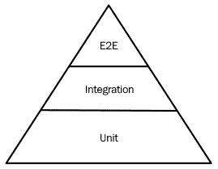

Writing Testable Code

测试代码的能力是任何软件产品中最重要的质量。如果没有适当的测试，重构代码或改进代码的任何其他部分 (例如其安全性，可伸缩性或性能) 的成本过高。在本章中，我们将学习如何设计和管理自动化测试，以及在必要时如何正确使用假货和嘲讽。

本章将介绍以下主题:

*   你为什么要测试代码？
*   引入测试框架
*   了解嘲笑和假货
*   测试驱动类设计
*   自动化测试以实现持续集成/持续部署

# 技术要求

本章的示例代码可在[https://github.com/PacktPublishing/ Software-Architecture-w 连同-Cpp/tree/master/Chapter08](https://github.com/PacktPublishing/Software-Architecture-with-Cpp/tree/master/Chapter08)找到。

我们将在本章的示例中使用的软件如下:

*   GTest 1.10
*   Catch2 2.10
*   CppUnit 1.14
*   Doctest 2.3
*   服务器规格 2.41
*   Testinfra 3.2
*   高斯 0.3
*   C 让 3.15
*   Autoconf
*   Automake
*   Libtool

# 你为什么要测试代码？

软件工程和软件体系结构是一个非常复杂的问题，处理不确定性的自然方法是确保自己免受潜在风险的影响。我们一直在做人寿保险、健康保险和汽车保险。然而，当谈到软件开发时，我们往往会忘记所有的安全预防措施，只希望有一个乐观的结果。

知道事情不仅可能会发生，而且会出现的问题，令人难以置信的是，测试软件的话题仍然是一个有争议的话题。无论是缺乏技能还是缺乏预算，仍然有一些项目甚至缺乏一些最基本的测试。当客户决定更改要求时，简单的更正可能会导致无休止的返工和交火。

第一次返工时，没有实施适当的测试所节省的时间就会丢失。如果你认为这种返工不会很快发生，你很可能是非常错误的。在我们现在生活的敏捷环境中，返工是我们日常生活的一部分。我们对世界和客户变化的了解意味着需求会发生变化，并随之对我们的代码进行更改。

因此，测试的主要目的是保护您在项目后期的宝贵时间。当然，当你必须实施各种测试而不是只关注功能时，这是早期的投资，但这是你不会后悔的投资。就像保险单一样，当事情按计划进行时，测试会从你的预算中花费一点，但是当事情变坏时，你会得到丰厚的赔付。

## 测试金字塔

在设计或实现软件系统时，您可能会遇到不同类型的测试。每个类的目的都略有不同。它们可以分类如下:

*   单元测试: 代码
*   集成测试: 设计
*   系统测试: 要求
*   验收测试 (**端到端**或**E2E** ): 客户端需要

这种区别是任意的，您可能经常会看到金字塔的其他层，如下所示:

*   单元测试
*   服务测试
*   UI 测试 (**端到端**或**E2E**)

在这里，单元测试指的是与前面示例相同的层。服务测试是指集成测试和系统测试的组合。另一方面，UI 测试指的是验收测试。下图显示了测试金字塔:



Figure 8.1 – Testing pyramid

值得注意的是，单元测试不仅是构建最便宜的，而且它们执行得非常快，并且通常可以并行运行。这意味着它们构成了一个伟大的连续集成门控机制。不仅如此，它们还经常提供有关系统运行状况的最佳反馈。更高级别的测试不仅更难正确编写，而且可能不太可靠。这可能导致测试结果闪烁，每几个测试运行中就有一个失败。如果更高级别的测试中的故障与单元测试级别的任何故障不相关，则问题可能出在测试本身上，而不是在被测系统中。

我们不想说更高级别的测试完全没有用，你应该只专注于编写单元测试。事实并非如此。金字塔有它的形状，因为应该有一个由单元测试覆盖的实心底座。但是，在此基础上，您还应该以适当的比例进行所有更高级别的测试。毕竟，不难想象一个所有单元测试都通过的系统，但是系统本身并没有为客户提供任何价值。一个极端的例子是一个完美的后端，没有任何用户界面 (无论是图形还是 API 形式)。当然，它通过了所有的单元测试，但这不是借口!

正如你可能想象的那样，测试金字塔的反面被称为冰锥，它是一种反模式。违反测试金字塔通常会导致脆弱的代码和难以追踪的错误。这使得调试更加昂贵，并且在测试开发中也不会带来节省。

## 非功能性测试

我们已经介绍过的是所谓的功能测试。他们的目的是检查被测系统是否满足功能要求。但是，除了我们可能要控制的功能性需求之外，还有其他类型的需求。其中一些如下:

*   **性能**: 您的应用可能会根据功能方面的要求而运行，但由于性能较弱，最终用户仍然无法使用。我们将在[第 11 章](11.html)，*中更加注重提高性能。*
*   **耐力**: 即使您的系统能够真正表现出色，也并不意味着它可以在持续的高工作量中幸存下来。当它这样做的时候，它能在部件的一些故障中幸存下来吗？当我们接受每个软件都是脆弱的并且可能在任何给定时刻崩溃的想法时，我们开始设计可以抵抗故障的系统。这是 Erlang 生态系统所接受的概念，但是概念本身并不仅限于该环境。在[第 13 章](13.html)，*设计微服务，*和[第 15 章](15.html)，*云原生设计*，我们将更多地提及设计容错系统和混沌工程的作用。
*   **安全性**: 如今，没有必要重复安全性至关重要。但是由于它仍然没有得到问题所要求的所有严肃处理，我们会让你再这样说一遍。连接到网络的每个系统都可能 (而且很可能会) 被破坏。在开发过程中尽早执行安全测试会带来与其他类型测试相同的好处: 您可以在解决问题过于昂贵之前捕获它们。
*   **可用性**: 虽然糟糕的性能可能会阻止最终用户使用您的产品，但糟糕的可用性可能会阻止他们甚至访问该产品。虽然由于性能过载可能会出现可用性问题，但也有其他原因导致可用性丢失。
*   **完整性**: 客户的数据不仅应该不受外部攻击者的攻击。由于软件故障，它也应该是安全的。防止比特腐烂、快照和备份是防止完整性丢失的方法。通过将当前版本与以前记录的快照进行比较，可以确保差异是否仅由所采取的操作引起，或者是否由错误引起。
*   **可用性**: 即使是一个勾选了所有前面的框的产品，如果它有一个笨重的界面和不直观的交互，对用户来说可能仍然是不满意的。可用性测试大多是手动进行的。每次用户界面或系统工作流程发生变化时，执行可用性评估非常重要。

## 回归测试

回归测试通常是端到端测试，应该可以防止您两次犯同样的错误。当您 (或您的 QA 团队或客户) 发现生产系统中的错误时，仅应用修补程序并忘记所有错误是不够的。

您需要做的一件事是编写一个回归测试，该测试应防止相同的错误再次进入生产系统。好的回归测试甚至可以防止同样的*类*的错误进入生产。毕竟，一旦你知道自己做错了什么，你就可以想象其他方法来搞砸事情。你可以做的另一件事是执行根本原因分析。

## 根本原因分析

根本原因分析是一个过程，它可以帮助您发现问题的原始根源，而不仅仅是其表现形式。进行根本原因分析最常见的方法是使用丰田公司出名的*5 Whys*方法。此方法包括剥离问题表现的所有表层，以发现隐藏在下面的根本原因。你通过在每一层询问 “为什么” 来做到这一点，直到你找到你正在寻找的根本原因。

让我们看一下这种方法的实际应用示例。

问题是: 我们没有收到一些交易的付款:

1.  *为什么？*系统没有向客户发送相应的电子邮件。

2.  *为什么？*电子邮件发送系统不支持客户姓名中的特殊字符。

3.  *为什么？*电子邮件发送系统测试不正确。

4.  *为什么？由于需要开发新功能，因此没有时间进行适当的测试。*

5.  *为什么？*我们对特征的时间估计不正确。

在此示例中，时间估计的问题可能是在生产系统中发现错误的根本原因。但它也可能是另一层剥离。这个框架给了你一个启发式的方法，应该在大部分时间里工作，但是如果你不能完全确定你得到的是你正在寻找的东西，你可以继续剥离额外的层，直到你找到导致所有麻烦的原因。

鉴于许多错误是由完全相同且通常可重复的根本原因导致的，找到根本原因是非常有益的，因为您可以保护自己在未来的几个不同级别上避免犯同样的错误*。当它应用于软件测试和问题解决时，这是深度防御的原则。*

 *## 进一步改进的基础

测试你的代码可以保护你避免出现意外错误。但这也打开了不同的可能性。当你的代码被测试用例覆盖时，你不必害怕重构。重构是将完成其工作的代码转换为功能相似的代码的过程，只是它具有更好的内部组织。您可能想知道为什么需要更改代码的组织。这有几个原因。

首先，您的代码可能不再可读，这意味着每次修改都需要花费太多时间。其次，修复您将要修复的错误将使其他一些功能表现不正确，因为随着时间的推移，代码收集了太多的解决方法和特殊情况。这两个原因都可以概括为生产率的提高。从长远来看，它们将使维护成本降低。

但是除了生产力之外，您可能还希望提高性能。这可能意味着运行时性能 (应用在生产中的行为方式) 或编译时性能 (这基本上是生产力提高的另一种形式)。

您可以通过用更高效的算法替换当前的次优算法或通过更改正在重构的模块使用的数据结构来重构运行时性能。

编译时性能的重构通常包括将部分代码移动到不同的编译单元，重新组织标头或减少依赖性。

不管你的最终目标是什么，重构通常都是一项有风险的业务。你拿的东西基本上是正确的，最终可能会得到更好的版本或更差的版本。你怎么知道哪个箱子是你的？在这里，测试进行了救援。

如果当前的功能集已被彻底覆盖，并且您想修复最近发现的错误，那么您所需要做的就是添加另一个届时将失败的测试用例。当你的整个测试套件再次开始通过意味着你的重构努力是成功的。

最坏的情况是，您必须中止重构过程，以防您无法在指定的时间范围内满足所有测试用例。如果您想提高性能，您将执行类似的过程，但您将专注于性能测试，而不是单元测试 (或端到端测试)。

随着最近帮助重构的自动化工具 (例如 ReSharper C: [https://www.jetbrains.com/resharper-cpp/features/ReSharper C:](https://www.jetbrains.com/resharper-cpp/features/) ) 和代码维护的兴起，您甚至可以将编码的一部分仅外包给外部软件服务。诸如 Renovate ([https://renovatebot.com/](https://renovatebot.com/) ) 、Dependabot ([https://dependabot.com](https://dependabot.com)) 和 Greenkeeper ([https://greenkeeper.io/](https://greenkeeper.io/) ) 等服务可能很快就会支持 C 依赖。具有可靠的测试覆盖范围将使您可以使用它们，而不必担心在依赖项更新期间破坏应用。

由于在安全漏洞方面保持您的依赖关系是您应该始终考虑的事情，因此此类服务可以显着减轻负担。因此，测试不仅可以保护您不犯错误，而且可以减少引入新功能所需的工作量。它还可以帮助您改善代码库并保持其稳定和安全!

现在我们了解了测试的必要性，我们想开始编写自己的测试。可以在没有任何外部依赖关系的情况下编写测试。但是，我们只想专注于测试逻辑。我们对管理测试结果和报告的细节不感兴趣。因此，我们将选择一个测试框架来为我们处理这项繁琐的工作。在下一节中，我们将介绍一些最流行的测试框架。

# 引入测试框架

至于框架，目前事实上的标准是谷歌的 GTest。与对应的 GMock 一起，它们构成了一整套工具，使您可以遵循 C++ 中测试的最佳实践。

GTest/GMock 二重奏的其他流行替代品是 Catch2、CppUnit 和 Doctest。CppUnit 已经使用了很长时间，但是它缺少最近的版本，这意味着我们不建议将其用于新项目。Catch2 和 Doctest 都支持现代 C 标准-特别是 C 14，C 17 和 C 20。

为了比较这些测试框架，我们将使用我们想要测试的相同代码库。以此为基础，我们将在每个框架中实施测试。

## GTest 示例

以下是我们用 GTest 编写的客户库的示例测试:

```cpp
#include "customer/customer.h"

#include <gtest/gtest.h>

TEST(basic_responses, given_name_when_prepare_responses_then_greets_friendly) {
  auto name = "Bob";
  auto code_and_string = responder{}.prepare_response(name);
  ASSERT_EQ(code_and_string.first, web::http::status_codes::OK);
  ASSERT_EQ(code_and_string.second, web::json::value("Hello, Bob!"));
}
```

在测试过程中通常完成的大多数任务都已抽象出来。我们主要专注于提供我们想要测试的动作 (`prepare_response`) 和期望的行为 (两个`ASSERT_EQ`行)。

## Catch2 示例

以下是我们用 Catch2 编写的客户库的示例测试:

```cpp
#include "customer/customer.h"

#define CATCH_CONFIG_MAIN // This tells Catch to provide a main() - only do
                           // this in one cpp file
#include "catch2/catch.hpp"

TEST_CASE("Basic responses",
          "Given Name When Prepare Responses Then Greets Friendly") {
  auto name = "Bob";
  auto code_and_string = responder{}.prepare_response(name);
  REQUIRE(code_and_string.first == web::http::status_codes::OK);
  REQUIRE(code_and_string.second == web::json::value("Hello, Bob!"));
}
```

它看起来和前一个非常相似。有些关键字不同 (`TEST`和`TEST_CASE`)，检查结果的方法略有不同 (`REQUIRE(a == b)`而不是`ASSERT_EQ(a,b)`)。无论如何，两者都非常紧凑且可读。

## CppUnit 示例

这是我们用 CppUnit 编写的客户库的示例测试。我们将把它分成几个片段。

以下代码块为我们准备使用 CppUnit 库中的构造:

```cpp
#include <cppunit/BriefTestProgressListener.h>
#include <cppunit/CompilerOutputter.h>
#include <cppunit/TestCase.h>
#include <cppunit/TestFixture.h>
#include <cppunit/TestResult.h>
#include <cppunit/TestResultCollector.h>
#include <cppunit/TestRunner.h>
#include <cppunit/XmlOutputter.h>
#include <cppunit/extensions/HelperMacros.h>
#include <cppunit/extensions/TestFactoryRegistry.h>
#include <cppunit/ui/text/TextTestRunner.h>

#include "customer/customer.h"

using namespace CppUnit;
using namespace std;
```

接下来，我们必须定义测试类并实现将执行我们的测试用例的方法。之后，我们必须注册这个类，这样我们就可以在我们的测试运行器中使用它:

```cpp
class TestBasicResponses : public CppUnit::TestFixture {
  CPPUNIT_TEST_SUITE(TestBasicResponses);
  CPPUNIT_TEST(testBob);
  CPPUNIT_TEST_SUITE_END();

 protected:
  void testBob();
};

void TestBasicResponses::testBob() {
  auto name = "Bob";
  auto code_and_string = responder{}.prepare_response(name);
  CPPUNIT_ASSERT(code_and_string.first == web::http::status_codes::OK);
  CPPUNIT_ASSERT(code_and_string.second == web::json::value("Hello, Bob!"));
}

CPPUNIT_TEST_SUITE_REGISTRATION(TestBasicResponses);
```

最后，我们必须提供我们的测试运行器的行为:

```cpp
int main() {
  CPPUNIT_NS::TestResult testresult;

  CPPUNIT_NS::TestResultCollector collectedresults;
  testresult.addListener(&collectedresults);

  CPPUNIT_NS::BriefTestProgressListener progress;
  testresult.addListener(&progress);

  CPPUNIT_NS::TestRunner testrunner;
  testrunner.addTest(CPPUNIT_NS::TestFactoryRegistry::getRegistry().makeTest());
  testrunner.run(testresult);

  CPPUNIT_NS::CompilerOutputter compileroutputter(&collectedresults, std::cerr);
  compileroutputter.write();

  ofstream xmlFileOut("cppTestBasicResponsesResults.xml");
  XmlOutputter xmlOut(&collectedresults, xmlFileOut);
  xmlOut.write();

  return collectedresults.wasSuccessful() ? 0 : 1;
}
```

与前两个例子相比，这里有很多样板。然而，测试本身看起来与前面的例子非常相似。

## Doctest 示例

以下是我们用 Doctest 编写的客户库的示例测试:

```cpp
#include "customer/customer.h"

#define DOCTEST_CONFIG_IMPLEMENT_WITH_MAIN
#include <doctest/doctest.h>

TEST_CASE("Basic responses") {
  auto name = "Bob";
  auto code_and_string = responder{}.prepare_response(name);
  REQUIRE(code_and_string.first == web::http::status_codes::OK);
  REQUIRE(code_and_string.second == web::json::value("Hello, Bob!"));
}
```

再一次，它很干净，很容易理解。Doctest 的主要卖点是，与其他类似功能的替代方案相比，它在编译时和运行时都是最快的。

## 测试编译时代码

模板元编程允许我们编写在编译时执行的 C 代码，而不是通常的执行时间。在 C++ 11 中添加的`constexpr`关键字允许我们使用更多的编译时代码，而 C++ 20 中的`consteval`关键字旨在让我们更好地控制代码的评估方式。

编译时编程的问题之一是没有简单的方法来测试它。虽然执行时间代码的单元测试框架非常丰富 (正如我们刚刚看到的)，但是关于编译时编程的资源并不多。部分原因可能源于编译时编程仍然被认为是复杂的，并且仅针对专家。

然而，仅仅因为某件事不容易并不意味着它是不可能的。就像执行时间测试依赖于运行时检查断言一样，您可以使用`static_assert`检查编译时代码的正确行为，这在 C 11 中与`constexpr`一起介绍。

以下是使用`static_assert`的简单例子:

```cpp
#include <string_view>

constexpr int generate_lucky_number(std::string_view name) {
  if (name == "Bob") {
    number = number * 7 + static_cast<int>(letter);
  }
  return number;
}

static_assert(generate_lucky_number("Bob") == 808);
```

由于我们可以在编译期间计算此处测试的每个值，因此我们可以有效地将编译器用作测试框架。

# 了解嘲笑和假货

只要您正在测试与外界互动不多的功能，事情就很容易。当您正在测试的单元与第三方组件 (如数据库、HTTP 连接和特定文件) 接口时，问题就开始了。

一方面，您想查看代码在各种情况下的表现。另一方面，您不想等待数据库启动，也绝对不想有几个包含不同版本数据的数据库，这样您就可以检查所有必要的条件。

我们如何处理此类案件？这个想法不是执行触发所有这些副作用的实际代码，而是使用测试双打。测试双打是模仿实际 API 的代码中的构造，除了它们不执行模仿的函数或对象的操作。

最常见的测试双打是模拟，假货和存根。许多人倾向于把一个误认为另一个，因为他们是相似的，尽管不一样。

## 不同的测试双打

模拟是测试双打，可以注册所有收到的电话，但仅此而已。它们不返回任何值，也不以任何方式更改状态。当我们有一个应该调用我们的代码的第三方框架时，它们是有用的。通过使用模拟，我们可以观察到所有调用，从而能够验证框架的行为是否符合预期。

存根在实现时有点复杂。它们返回值，但这些值是预定义的。`StubRandom.randomInteger()`方法总是返回相同的值 (例如`3`)，这似乎令人惊讶，但是当我们测试返回值的类型或它确实返回值的事实时，它可能是一个足够的存根实现。确切的值可能没那么重要。

最后，假货是具有有效实现的对象，其行为大多类似于实际的生产实现。主要区别在于假货可能会采用各种快捷方式，例如避免调用生产数据库或文件系统。

在实现**命令查询分离** (**CQS**) 设计模式时，通常会希望使用存根和模拟命令进行双重查询。

## 测试双打的其他用途

假货也可以在测试之外有限度地使用。在内存中处理数据而无需诉诸数据库访问，对于原型设计或遇到性能瓶颈时也非常有用。

## 写作测试加倍

要编写测试双打，我们通常使用外部库，就像我们对单元测试一样。一些最流行的解决方案如下:

*   GoogleMock (又称 gMock)，现在是 GoogleTest 库的一部分: [https://github.com/google/googletest](https://github.com/google/googletest)。
*   Trompeloeil 专注于 C 14，它与许多测试库很好地集成在一起，例如 Catch2，doctest 和 GTest: [https://github.com/rollbear/trompeloeil](https://github.com/rollbear/trompeloeil)。

以下各节中的代码将向您展示如何同时使用 GoogleMock 和 Trompeloeil。

### 谷歌模拟示例

由于 GoogleMock 是 GoogleTest 的一部分，我们将把它们一起呈现:

```cpp
#include "merchants/reviews.h"

#include <gmock/gmock.h>

#include <merchants/visited_merchant_history.h>

#include "fake_customer_review_store.h"

namespace {

class mock_visited_merchant : public i_visited_merchant {
 public:
  explicit mock_visited_merchant(fake_customer_review_store &store,
                                 merchant_id_t id)
      : review_store_{store},
        review_{store.get_review_for_merchant(id).value()} {
    ON_CALL(*this, post_rating).WillByDefault([this](stars s) {
      review_.rating = s;
      review_store_.post_review(review_);
    });
    ON_CALL(*this, get_rating).WillByDefault([this] { return review_.rating; });
  }

  MOCK_METHOD(stars, get_rating, (), (override));
  MOCK_METHOD(void, post_rating, (stars s), (override));

 private:
  fake_customer_review_store &review_store_;
  review review_;
};

} // namespace

class history_with_one_rated_merchant : public ::testing::Test {
 public:
  static constexpr std::size_t CUSTOMER_ID = 7777;
  static constexpr std::size_t MERCHANT_ID = 1234;
  static constexpr const char *REVIEW_TEXT = "Very nice!";
  static constexpr stars RATING = stars{5.f};

 protected:
  void SetUp() final {
    fake_review_store_.post_review(
        {CUSTOMER_ID, MERCHANT_ID, REVIEW_TEXT, RATING});

    // nice mock will not warn on "uninteresting" call to get_rating
    auto mocked_merchant =
        std::make_unique<::testing::NiceMock<mock_visited_merchant>>(
            fake_review_store_, MERCHANT_ID);

    merchant_index_ = history_.add(std::move(mocked_merchant));
  }

  fake_customer_review_store fake_review_store_{CUSTOMER_ID};
  history_of_visited_merchants history_{};
  std::size_t merchant_index_{};
};

TEST_F(history_with_one_rated_merchant,
       when_user_changes_rating_then_the_review_is_updated_in_store) {
  const auto &mocked_merchant = dynamic_cast<const mock_visited_merchant &>(
      history_.get_merchant(merchant_index_));
  EXPECT_CALL(mocked_merchant, post_rating);

  constexpr auto new_rating = stars{4};
  static_assert(RATING != new_rating);
  history_.rate(merchant_index_, stars{new_rating});
}

TEST_F(history_with_one_rated_merchant,
       when_user_selects_same_rating_then_the_review_is_not_updated_in_store) {
  const auto &mocked_merchant = dynamic_cast<const mock_visited_merchant &>(
      history_.get_merchant(merchant_index_));
  EXPECT_CALL(mocked_merchant, post_rating).Times(0);

  history_.rate(merchant_index_, stars{RATING});
}
```

GTest 是编写本书时最流行的 C++ 测试框架。它与 GMock 的集成意味着 GMock 可能已经在您的项目中可用。这种组合使用起来很直观，功能齐全，所以如果你已经投资于 GTest，就没有理由寻找替代品。

### Trompeloeil 示例

为了将此示例与上一个示例进行对比，这次，我们将 Trompeloeil 用于测试双打，并将 Catch2 用作测试框架:

```cpp
#include "merchants/reviews.h"

#include "fake_customer_review_store.h"

// order is important
#define CATCH_CONFIG_MAIN
#include <catch2/catch.hpp>
#include <catch2/trompeloeil.hpp>

#include <memory>

#include <merchants/visited_merchant_history.h>

using trompeloeil::_;

class mock_visited_merchant : public i_visited_merchant {
 public:
  MAKE_MOCK0(get_rating, stars(), override);
  MAKE_MOCK1(post_rating, void(stars s), override);
};

SCENARIO("merchant history keeps store up to date", "[mobile app]") {
  GIVEN("a history with one rated merchant") {
    static constexpr std::size_t CUSTOMER_ID = 7777;
    static constexpr std::size_t MERCHANT_ID = 1234;
    static constexpr const char *REVIEW_TEXT = "Very nice!";
    static constexpr stars RATING = stars{5.f};

    auto fake_review_store_ = fake_customer_review_store{CUSTOMER_ID};
    fake_review_store_.post_review(
        {CUSTOMER_ID, MERCHANT_ID, REVIEW_TEXT, RATING});

    auto history_ = history_of_visited_merchants{};
    const auto merchant_index_ =
        history_.add(std::make_unique<mock_visited_merchant>());

    auto &mocked_merchant = const_cast<mock_visited_merchant &>(
        dynamic_cast<const mock_visited_merchant &>(
            history_.get_merchant(merchant_index_)));

    auto review_ = review{CUSTOMER_ID, MERCHANT_ID, REVIEW_TEXT, RATING};
    ALLOW_CALL(mocked_merchant, post_rating(_))
        .LR_SIDE_EFFECT(review_.rating = _1;
                        fake_review_store_.post_review(review_););
    ALLOW_CALL(mocked_merchant, get_rating()).LR_RETURN(review_.rating);

    WHEN("a user changes rating") {
      constexpr auto new_rating = stars{4};
      static_assert(RATING != new_rating);

      THEN("the review is updated in store") {
        REQUIRE_CALL(mocked_merchant, post_rating(_));
        history_.rate(merchant_index_, stars{new_rating});
      }
    }

    WHEN("a user selects same rating") {
      THEN("the review is not updated in store") {
        FORBID_CALL(mocked_merchant, post_rating(_));
        history_.rate(merchant_index_, stars{RATING});
      }
    }
  }
}
```

Catch2 的一大特点是，它可以很容易地编写行为驱动的开发风格的测试，比如这里展示的测试。如果您更喜欢这种样式，那么带有 Trompeloeil 的 Catch2 将是一个不错的选择，因为它们可以很好地集成在一起。

# 测试驱动类设计

仅仅区分不同类型的测试并学习特定的测试框架 (或几种) 是不够的。当你开始测试你的实际代码时，你很快就会注意到并不是所有的类都可以很容易地被测试。有时，您可能会觉得需要访问私有属性或方法。如果您想保持良好建筑的原则，请抵制这种冲动!相反，请考虑通过类型的公共 API 测试可用的业务需求，或者重构类型，以便您可以测试另一单元代码。

## 当测试和类设计发生冲突时

您可能面临的问题不是测试框架不足。通常，你遇到的是设计不当的类。即使您的类可能表现正确，并且看起来可能是正确的，除非它们允许进行测试，但它们的设计不正确。

然而，这是个好消息。这意味着您可以在不方便之前修复问题。当您开始基于类层次结构构建时，类设计可能会困扰您。在测试实施过程中修复设计只会减少可能的技术债务。

## 防御性编程

与名称可能暗示的不同，防御性编程不是安全功能。它的名字来自捍卫你的类和函数被使用违背他们的初衷。它与测试没有直接关系，但它是一个很好的设计模式，因为它提高了代码的质量，使你的项目面向未来。

防御性编程从静态类型开始。如果创建一个将自定义类型作为参数处理的函数，则必须确保没有人会使用某些意外值调用它。用户将必须有意识地检查功能的期望并相应地准备输入。

在 C 中，当我们编写模板代码时，我们还可以利用类型安全功能。当我们为客户的评论创建容器时，我们可以接受任何类型的列表并从中复制。为了获得更好的错误和精心设计的检查，我们可以编写以下内容:

```cpp
class CustomerReviewStore : public i_customer_review_store {
 public:
  CustomerReviewStore() = default;
  explicit CustomerReviewStore(const std::ranges::range auto &initial_reviews) {
    static_assert(is_range_of_reviews_v<decltype(initial_reviews)>,
                  "Must pass in a collection of reviews");
    std::ranges::copy(begin(initial_reviews), end(initial_reviews),
                      begin(reviews_));
  }
 // ...
 private:
  std::vector<review> reviews_;
};
```

`explicit`关键字保护我们免受不需要的隐式强制转换。通过指定我们的输入参数满足`range`概念，我们确保我们只使用有效的容器进行编译。由于使用了概念，我们可以从针对无效使用的防御中获得更清晰的错误消息。在我们的代码中使用`static_assert`也是一个很好的防御措施，因为它允许我们在需要时提供一个很好的错误消息。我们的`is_range_of_reviews`检查可以按以下方式实施:

```cpp
template <typename T>
constexpr bool is_range_of_reviews_v =
    std::is_same_v<std::ranges::range_value_t<T>, review>;
```

这样，我们确保我们得到的范围实际上包含我们想要的类型的评论。

静态类型不会阻止无效的运行时值传递给函数。这就是为什么防御性编程的下一种形式是检查先决条件。这样，一旦出现问题的第一个迹象，您的代码就会失败，这总是比返回传播到系统其他部分的无效值更好。在 C++ 中有合同之前，我们可以使用我们在前几章中提到的 GSL 库来检查我们代码的前置条件和后置条件:

```cpp
void post_review(review review) final {
  Expects(review.merchant);
  Expects(review.customer);
  Ensures(!reviews_.empty());

  reviews_.push_back(std::move(review));
}
```

在这里，通过使用`Expects`宏，我们正在检查我们的传入评论是否实际上具有 merchant 和 reviewer 集的 id。除了没有这样做的情况之外，我们还为自己辩护，以免在使用`Ensures`后条件宏时向存储添加评论失败。

当谈到运行时检查时，首先想到的是检查一个或多个属性是否不是`nullptr`。防范这个问题的最好方法是将可空资源 (那些可以将`nullptr`作为值的资源) 与非可空资源区分开来。有一个很棒的工具，你可以使用这个，并且可以在标准库从 C 17: `std::optional`。如果可以，请在您设计的所有 api 中使用它。

## 无聊的副歌 -- 先写你的测试

这已经说过很多次了，然而很多人倾向于 “忘记” 这条规则。当你实际编写测试时，你必须做的第一件事就是减少创建难以测试的类的风险。您从 API 使用开始，需要弯曲实现以最好地服务于 API。这样，您通常最终得到的 api 既易于使用又易于测试。当你在实现**测试驱动开发** (**TDD**) 或在代码之前编写测试时，你最终也会实现依赖注入，这意味着你的类可以更松散地耦合。

相反，这样做 (先编写你的类，然后再添加单元测试) 可能意味着你需要更容易编写但更难测试的代码。当测试变得越来越困难时，您可能会感到跳过它的诱惑。

# 自动化测试以实现持续集成/持续部署

在下一章，我们将重点介绍**持续集成**和**持续部署** (**CI**/**CD**)。为了使 CI/CD 管道正常工作，您需要进行一组测试，以在错误进入生产之前捕获它们。由您和您的团队来确保所有业务需求都正确表示为测试。

测试在几个层面上都很有用。通过行为驱动开发，我们在上一节中提到过，业务需求构成了自动化测试的基础。但是您正在构建的系统并不仅仅是由业务需求组成的。您要确保所有第三方集成都按预期工作。您希望确保您的所有子组件 (例如微服务) 实际上可以相互接口。最后，您要确保正在构建的函数和类没有您可能想到的任何错误。

您可以自动化的每个测试都是 CI/CD 管道的候选项。他们每个人在这个管道中也有自己的位置。例如，端到端测试在部署后作为验收测试最有意义。另一方面，单元测试在编译后直接执行时最有意义。毕竟，我们的目标是在发现与规范可能存在分歧时立即断开电路。

每次运行 CI/CD 管道时，您不必运行所有自动化的测试。如果每个管道的运行时间相对较短，则更好。理想情况下，它应该在提交后的几分钟内完成。那么，如果我们想保持最小的运行时间，我们如何确保一切都经过适当的测试？

一个答案是为不同的目的准备不同的测试套件。例如，您可以对功能分支的提交进行最少的测试。每天都有许多提交到特色分支机构，这意味着它们只会被短暂测试，答案将很快可用。然后，将功能分支合并到共享开发分支需要一组稍大的测试用例。这样，我们确保没有破坏其他团队成员将使用的任何东西。最后，将运行更广泛的案例集，以合并到生产分支。毕竟，即使测试需要很长时间，我们也希望对生产分支进行彻底的测试。

另一个答案是将精简的测试用例集用于 CI/CD 目的，并具有额外的连续测试过程。此过程定期运行，并对特定环境的当前状态进行深入检查。测试可以进行到安全测试和性能测试，因此可以评估要推广的环境的资格。

当我们选择一个环境并承认这个环境具有成为一个更成熟的环境的所有素质时，就会发生晋升。例如，该开发环境可以成为下一个临时环境，或者该临时环境可以成为下一个生产环境。如果此促销自动发生，那么提供自动回滚也是一种很好的做法，以防细微的差异 (例如在域名或流量方面) 使刚推广的环境不再通过测试。

这也提出了另一个重要的实践: 始终在生产环境上运行测试。当然，这样的测试必须是侵入性最小的，但它们应该告诉你，你的系统在任何给定的时间都表现正确。

## 测试基础设施

如果要将配置管理、基础架构即代码或不可变部署的概念纳入应用的软件体系结构，则还应考虑对基础架构本身进行测试。您可以使用几种工具来执行此操作，包括 Serverspec，Testinfra，Goss 和 Terratest，它们是一些更受欢迎的工具。

这些工具的范围略有不同，如下所述:

*   Serverspec 和 Testinfra 更专注于测试通过配置管理配置的服务器的实际状态，例如 Salt，Ansible，Puppet 和 Chef。它们分别用 Ruby 和 Python 编写，并插入语言的测试引擎。这意味着用于 Serverspec 的 RSPec 和用于 Testinfra 的 Pytest。
*   高斯在范围和形式上都有些不同。除了测试服务器之外，您还可以使用 Goss 使用 dgoss 包装器测试项目中使用的容器。至于它的形式，它不使用您在 Serverspec 或 Testinfra 中看到的命令式代码。相反，类似于 Ansible 或 Salt，它使用 YAML 文件来描述我们要检查的所需状态。如果您已经在使用声明性的配置管理方法 (如前面提到的 Ansible 或 Salt)，Goss 可能更直观，因此更适合测试。
*   最后，Terratest 是一个工具，它允许您测试基础架构的输出，作为代码工具，如 Packer 和 Terraform (因此得名)。就像 Serverspec 和 Testinfra 使用他们的语言测试引擎为服务器编写测试一样，Terratest 利用 Go 的测试包来编写适当的测试用例。

让我们看看如何使用这些工具来验证部署是否按计划进行 (至少从基础架构的角度来看)。

## 使用 Serverspec 进行测试

以下是针对 Serverspec 的测试示例，该测试检查特定版本和 Let's Encrypt 配置文件中的 Git 的可用性:

```cpp
# We want to have git 1:2.1.4 installed if we're running Debian
describe package('git'), :if => os[:family] == 'debian' do
  it { should be_installed.with_version('1:2.1.4') }
end
# We want the file /etc/letsencrypt/config/example.com.conf to:
describe file('/etc/letsencrypt/config/example.com.conf') do
  it { should be_file } # be a regular file
  it { should be_owned_by 'letsencrypt' } # owned by the letsencrypt user
  it { should be_mode 600 } # access mode 0600
  it { should contain('example.com') } # contain the text example.com 
                                       # in the content
end
```

Ruby DSL 语法即使那些不使用 Ruby daily 的人也应该可读。您可能需要习惯编写代码。

## 使用 Testinfra 进行测试

以下是测试 Testinfra 的示例，该测试检查特定版本和 Let's Encrypt 配置文件中的 Git 可用性:

```cpp
# We want Git installed on our host
def test_git_is_installed(host):
    git = host.package("git")
    # we test if the package is installed
    assert git.is_installed
    # and if it matches version 1:2.1.4 (using Debian versioning)
    assert git.version.startswith("1:2.1.4")
# We want the file /etc/letsencrypt/config/example.com.conf to:
def test_letsencrypt_file(host):
    le = host.file("/etc/letsencrypt/config/example.com.conf")
    assert le.user == "letsencrypt" # be owned by the letsencrypt user
    assert le.mode == 0o600 # access mode 0600
    assert le.contains("example.com") # contain the text example.com in the contents
```

Testinfra 使用普通的 Python 语法。它应该是可读的，但是就像 Serverspec 一样，您可能需要一些培训才能自信地在其中编写测试。

## 用高斯测试

以下是 Goss 的 YAML 文件的示例，该文件检查了特定版本和 Let's Encrypt 配置文件中的 Git 的可用性:

```cpp
# We want Git installed on our host
package:
  git:
    installed: true # we test if the package is installed
  versions:
  - 1:2.1.4 # and if it matches version 1:2.1.4 (using Debian versioning)
file:
  # We want the file /etc/letsencrypt/config/example.com.conf to:
  /etc/letsencrypt/config/example.com.conf:
    exists: true
  filetype: file # be a regular file
  owner: letsencrypt # be owned by the letsencrypt user
  mode: "0600" # access mode 0600
  contains:
  - "example.com" # contain the text example.com in the contents
```

YAML 的语法可能需要最少的准备来读取和编写它。但是，如果您的项目已经使用了 Ruby 或 Python，那么在编写更复杂的测试时，您可能希望坚持使用 Serverspec 或 Testinfra。

# 摘要

本章着重于测试软件不同部分的体系结构和技术方面。我们查看了测试金字塔，以了解不同类型的测试如何对软件项目的整体运行状况和稳定性做出贡献。由于测试既可以是功能性的，也可以是非功能性的，因此我们看到了这两种类型的一些示例。

从本章中要记住的最重要的事情之一是，测试不是结束阶段。我们想要它们不是因为它们带来了直接的价值，而是因为我们可以用它们来检查已知的回归，在重构时，或者当我们改变系统现有部分的行为时。当我们想要执行根本原因分析时，测试也可以证明是有用的，因为它们可以快速验证不同的假设。

建立了理论要求之后，我们展示了可以用来编写测试双打的不同测试框架和库的示例。尽管先编写测试并在以后执行测试需要一些实践，但它具有重要的好处。这种好处是更好的班级设计。

最后，为了强调现代体系结构不仅仅是软件代码，我们还研究了一些用于测试基础架构和部署的工具。在下一章中，我们将了解持续集成和持续部署如何为您要构建的应用带来更好的服务质量和健壮性。

# 问题

1.  测试金字塔的基层是什么？
2.  有哪些非功能性测试？
3.  根本原因分析的著名方法叫什么？
4.  是否可以在 C 中测试编译时代码？
5.  在编写具有外部依赖关系的代码的单元测试时，应该使用什么？
6.  单元测试在持续集成/持续部署中的作用是什么？
7.  有哪些工具可以让您测试基础架构代码？
8.  在单元测试中访问类的私有属性和方法是一个好主意吗？

# 进一步阅读

测试 C 代码: [https://www.packtpub.com/应用-开发/现代-c-编程-食谱](https://www.packtpub.com/application-development/modern-c-programming-cookbook)

测试双打: [https://martinfowler.com/articles/mocksArentStubs.html](https://martinfowler.com/articles/mocksArentStubs.html)

持续集成/持续部署: [https://www.packtpub.com/虚拟化和云/手持续集成和交付](https://www.packtpub.com/virtualization-and-cloud/hands-continuous-integration-and-delivery)和[https://www.packtpub.com/虚拟化和云/云原生持续集成和交付](https://www.packtpub.com/virtualization-and-cloud/cloud-native-continuous-integration-and-delivery)*