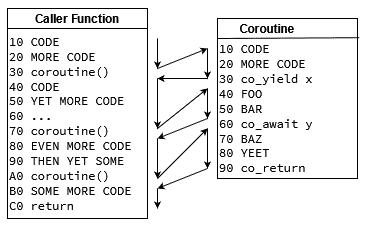

Performance

选择 C 作为项目的关键编程语言的最常见原因之一是由于性能要求。在性能方面，C 在竞争中具有明显的优势，但是要达到最佳效果需要了解相关问题。本章主要介绍提高 C++ 软件的性能。我们将首先向您展示衡量性能的工具。我们将向您展示一些提高单线程计算速度的技术。然后我们将讨论如何利用并行计算。最后，我们将展示如何使用 C 20 的协程进行非抢先式多任务处理。

本章将介绍以下主题:

*   测量性能
*   帮助编译器生成性能代码
*   并行化计算
*   使用协程序

首先，让我们指定运行本章中的示例所需的内容。

# 技术要求

要复制本章中的示例，您应该安装以下内容:

*   C 让 3.15
*   支持 C 20 的范围和协程的编译器，例如 GCC 10

本章的源代码片段可以在[https://github.com/PacktPublishing/ Software-Architecture-w 同-Cpp/tree/master/Chapter11](https://github.com/PacktPublishing/Software-Architecture-with-Cpp/tree/master/Chapter11)找到。

# 测量性能

为了有效地提高代码的性能，您必须从衡量代码的性能开始。如果不知道实际的瓶颈在哪里，你最终会优化错误的地方，浪费时间，并对你的努力几乎没有收获感到惊讶和沮丧。在本节中，我们将展示如何使用基准测试正确地衡量性能，如何成功地描述代码，以及如何深入了解分布式系统中的性能。

## 执行准确和有意义的测量

对于精确和可重复的测量，您可能还希望将机器置于性能模式，而不是通常的默认省电模式。如果系统需要低延迟，则可能需要在基准测试的两台计算机以及生产环境中永久禁用省电。很多时候，这可能意味着进入 BIOS 并正确配置服务器。请注意，如果您使用公共云提供商，这可能是不可能的。如果您在计算机上具有 root/admin 权限，则操作系统通常也可以控制某些设置。例如，您可以通过运行以下操作来强制您的 CPU 在 Linux 系统上以其最大频率运行:

```cpp
sudo cpupower frequency-set --governor performance
```

此外，为了获得有意义的结果，您可能需要在与您的生产环境尽可能相似的系统上执行测量。除了配置之外，RAM 的不同速度，CPU 缓存的数量以及 CPU 的微体系结构等方面也可能会扭曲结果并得出错误的结论。硬盘驱动器设置，甚至使用的网络拓扑和硬件也是如此。您构建的软件也起着至关重要的作用: 从使用的固件到操作系统和内核，一直到软件堆栈到您的依赖关系。最好有一个与您的生产环境相同的第二个环境，并使用相同的工具和脚本进行管理。

现在我们有了一个可靠的测量环境，让我们看看我们可以实际测量什么。

## 利用不同类型的测量工具

有几种方法可以衡量绩效，每种方法都侧重于不同的范围。让我们一个接一个地浏览一下。

基准测试可用于在预制测试中确定系统速度的时间。通常，它们会导致完成时间或其他性能指标，例如每秒处理的订单。有几种类型的基准测试:

*   **微基准测试，**可用于测量小代码片段的执行情况。我们将在下一节中介绍它们。
*   **模拟，**是用人工数据在更大范围内的合成测试。如果您无法访问目标数据或目标硬件，它们可能会很有用。例如，当您计划检查您正在使用的硬件的性能，但它还不存在时，或者当您计划处理传入的流量，但只能假设流量的外观时。
*   **重播，**这可以是一种非常准确的测量现实工作负载下的性能的方法。这个想法是记录进入生产系统的所有请求或工作负载，通常带有时间戳。然后，可以将此类转储 “重播” 到基准系统中，并尊重它们之间的时间差，以检查其性能。这样的基准测试可以很好的了解代码或环境的潜在变化如何影响系统的延迟和吞吐量。
*   **行业标准**，这是一个很好的方法来了解我们的产品与竞争对手相比的表现。此类基准测试的示例包括用于 cpu 的 SuperPi、用于图形卡的 3D 标记以及用于人工智能处理器的 ResNet-50。

除了基准测试之外，另一种在衡量性能方面非常宝贵的工具是分析器。Profiler 不仅可以为您提供整体性能指标，还可以让您检查代码正在执行的操作并寻找瓶颈。它们对于捕捉让你的系统变慢的意想不到的事情很有用。我们将在本章后面更详细地介绍它们。

掌握系统性能的最后一种方法是跟踪。跟踪本质上是一种在执行过程中记录系统行为的方法。通过监视请求需要多长时间才能完成各种处理步骤 (例如由不同类型的微服务处理)，您可以深入了解系统的哪些部分需要提高其性能，或者系统如何处理不同类型的请求: 不同的类型或被接受或拒绝的类型。我们将在本章后面介绍跟踪 -- 就在分析之后。

现在让我们就微基准说几句话。

## 使用微基准

微基准测试用于衡量 “微” 代码片段的执行速度。如果您想知道如何实现给定的功能，或者不同的第三方库处理同一任务的速度有多快，那么它们就是这项工作的完美工具。虽然它们不能代表现实的环境，但它们非常适合进行这样的小实验。

让我们展示如何使用最常用的框架之一在 C: Google 基准中创建微基准测试来运行这样的实验。

### 设置谷歌基准

让我们首先通过使用 Conan 将库引入到我们的代码中。将以下内容放在您的`conanfile.txt`中:

```cpp
[requires]
benchmark/1.5.2

[generators]
CMakeDeps
```

我们将使用 CMakeDeps 生成器，因为它是柯南 2.0 中推荐的 CMake 生成器。它依赖于 c 制造的`find_package`功能来使用我们的野蛮依赖管理器安装的软件包。要在其发布版本中安装依赖项，请运行以下操作:

```cpp
cd <build_directory>
conan install <source_directory> --build=missing -s build_type=Release
```

如果您使用的是自定义柯南配置文件，请记住也将其添加到此处。

从您的`CMakeLists.txt`文件中使用它也非常简单，如下所示:

```cpp
list(APPEND CMAKE_PREFIX_PATH "${CMAKE_BINARY_DIR}")
find_package(benchmark REQUIRED)
```

首先，我们将构建目录添加到`CMAKE_PREFIX_PATH`，以便 cma 会可以找到 Conan 生成的配置和/或目标文件。接下来，我们只是使用它们来找到我们的依赖关系。

当我们要创建几个微基准测试时，我们可以使用 c 让函数来帮助我们定义它们:

```cpp
function(add_benchmark NAME SOURCE)
  add_executable(${NAME} ${SOURCE})
  target_compile_features(${NAME} PRIVATE cxx_std_20)
  target_link_libraries(${NAME} PRIVATE benchmark::benchmark)
endfunction()
```

该函数将能够创建单翻译单元微基准，每个都使用 C 20 并链接到 Google 基准库。现在让我们用它来创建我们的第一个微基准可执行文件:

```cpp
add_benchmark(microbenchmark_1 microbenchmarking/main_1.cpp)
```

现在，我们准备在源文件中放入一些代码。

### 编写您的第一个微基准

我们将尝试基准测试在使用排序的向量中的平分完成查找所需的速度与线性进行比较。让我们从将创建排序向量的代码开始:

```cpp
using namespace std::ranges;

template <typename T>
auto make_sorted_vector(std::size_t size) {
  auto sorted = std::vector<T>{};
  sorted.reserve(size);

  auto sorted_view = views::iota(T{0}) | views::take(size);
  std::ranges::copy(sorted_view, std::back_inserter(sorted));
  return sorted;
}
```

我们的向量将包含从 0 到大小-1 的所有数字的大小元素。现在让我们指定我们正在寻找的元素和容器大小:

```cpp
constexpr auto MAX_HAYSTACK_SIZE = std::size_t{10'000'000};
constexpr auto NEEDLE = 2137;
```

如您所见，我们将对大海捞针需要多长时间进行基准测试。简单的线性搜索可以实现如下:

```cpp
void linear_search_in_sorted_vector(benchmark::State &state) {
  auto haystack = make_sorted_vector<int>(MAX_HAYSTACK_SIZE);
  for (auto _ : state) {
    benchmark::DoNotOptimize(find(haystack, NEEDLE));
  }
}
```

在这里，我们可以看到 Google 基准测试的首次使用。每个微基准都应接受`State`作为参数。此特殊类型执行以下操作:

*   包含有关执行的迭代和在测量计算上花费的时间的信息
*   如果需要，计算处理的字节
*   可以返回其他状态信息，如需要进一步运行 (通过`KeepRunning()`成员函数)
*   可用于暂停和恢复迭代的时序 (分别通过`PauseTiming()`和`ResumeTiming()`成员函数)

我们的循环中的代码将被测量，根据需要进行尽可能多的迭代，基于运行这个特定基准的总允许时间。我们干草堆的创造是在循环之外的，不会被衡量。

在循环内部，有一个名为`DoNotOptimize`的水槽助手。它的目的是确保编译器不会摆脱我们的计算，因为它可以证明它们在此范围之外无关紧要。在我们的情况下，它将标记必要的`std::find`的结果，所以找到针的实际代码没有被优化掉。使用诸如 objdump 之类的工具或诸如 Godbolt 和 QuickBench 之类的网站，您可以查看是否要运行的代码未优化。QuickBench 具有在云中运行基准测试并在线共享其结果的额外优势。

回到我们手头的任务，我们有一个用于线性搜索的微基准，所以现在让我们在另一个微基准中进行二进制搜索:

```cpp
void binary_search_in_sorted_vector(benchmark::State &state) {
  auto haystack = make_sorted_vector<int>(MAX_HAYSTACK_SIZE);
  for (auto _ : state) {
    benchmark::DoNotOptimize(lower_bound(haystack, NEEDLE));
  }
}
```

我们的新基准非常相似。它仅在所使用的功能上有所不同: `lower_bound`将执行二进制搜索。请注意，与我们的基本示例类似，我们甚至不检查迭代器返回的是否指向向量中的有效元素，或者指向其末尾。在`lower_bound`的情况下，我们可以检查迭代器下的元素是否实际上是我们要寻找的元素。

现在我们有了微基准函数，让我们通过添加以下内容来创建它们的实际基准:

```cpp
BENCHMARK(binary_search_in_sorted_vector);
BENCHMARK(linear_search_in_sorted_vector);
```

如果您可以使用默认基准设置，那么您就需要通过这些设置。作为最后一步，让我们添加一个`main()`函数:

```cpp
BENCHMARK_MAIN();
```

就这么简单!或者，您可以将我们的程序与`benchmark_main`链接。使用 Google Benchmark 的`main()`功能的优点是为我们提供了一些默认选项。如果您编译我们的基准测试并将其作为参数传递`--help`运行，您将看到以下内容:

```cpp
benchmark [--benchmark_list_tests={true|false}]
          [--benchmark_filter=<regex>]
          [--benchmark_min_time=<min_time>]
          [--benchmark_repetitions=<num_repetitions>]
          [--benchmark_report_aggregates_only={true|false}]
          [--benchmark_display_aggregates_only={true|false}]
          [--benchmark_format=<console|json|csv>]
          [--benchmark_out=<filename>]
          [--benchmark_out_format=<json|console|csv>]
          [--benchmark_color={auto|true|false}]
          [--benchmark_counters_tabular={true|false}]
          [--v=<verbosity>]
```

这是一套很好的功能。例如，在设计实验时，可以使用`benchmark_format`开关获得 CSV 输出，以便更容易在图表上绘制。

现在，让我们通过运行不带命令行参数的编译可执行文件来查看我们的基准测试。运行`./microbenchmark_1`的可能输出如下:

```cpp
2021-02-28T16:19:28+01:00
Running ./microbenchmark_1
Run on (8 X 2601 MHz CPU s)
Load Average: 0.52, 0.58, 0.59
-------------------------------------------------------------------------
Benchmark                               Time             CPU   Iterations
-------------------------------------------------------------------------
linear_search_in_sorted_vector        984 ns          984 ns       746667
binary_search_in_sorted_vector       18.9 ns         18.6 ns     34461538
```

从运行环境的一些数据 (基准测试的时间、可执行名称、服务器的 cpu 和当前负载) 开始，我们得到我们定义的每个基准测试的结果。对于每个基准，我们得到每次迭代的平均壁时间，每次迭代的平均 CPU 时间以及基准线束为我们运行的迭代次数。默认情况下，单次迭代时间越长，它将经历的迭代次数越少。运行更多的迭代可确保您获得更稳定的结果。

### 将任意参数传递给微基准

如果我们要测试更多的方法来处理我们手头的问题，我们可以寻找一种方法来重用基准代码，并将其传递给用于执行查找的函数。Google 基准测试有一个我们可以使用的功能。框架实际上允许我们通过将它们作为附加参数添加到函数签名中来传递我们想要的任何参数到基准测试。

让我们看看这个功能如何为我们的基准测试统一签名:

```cpp
void search_in_sorted_vector(benchmark::State &state, auto finder) {
  auto haystack = make_sorted_vector<int>(MAX_HAYSTACK_SIZE);
  for (auto _ : state) {
    benchmark::DoNotOptimize(finder(haystack, NEEDLE));
  }
}
```

您可以注意到该函数的新的`finder`参数，该参数用于我们以前称为`find`或`lower_bound`的位置。现在，我们可以使用与上次不同的宏制作两个微基准:

```cpp
BENCHMARK_CAPTURE(search_in_sorted_vector, binary, lower_bound);
BENCHMARK_CAPTURE(search_in_sorted_vector, linear, find);
```

`BENCHMARK_CAPTURE`宏接受函数、名称后缀和任意数量的参数。如果我们想要更多，我们可以把它们传到这里。我们的基准函数可以是常规函数或模板-两者都受支持。现在让我们看看运行代码时会得到什么:

```cpp
-------------------------------------------------------------------------
Benchmark                               Time             CPU   Iterations
-------------------------------------------------------------------------
search_in_sorted_vector/binary       19.0 ns         18.5 ns     28000000
search_in_sorted_vector/linear        959 ns          952 ns       640000
```

如您所见，传递给函数的参数不是名称的一部分，但函数名称和我们的后缀是

现在让我们看看如何进一步定制我们的基准。

### 将数值参数传递给微基准

在设计像我们这样的实验时，一个常见的需求是对不同大小的参数进行检查。可以通过多种方式在 Google 基准测试中解决此类需求。最简单的方法是在`BENCHMARK`宏返回的对象上添加一个对`Args()`的调用。这样，我们可以传递一组值，以便在给定的微基准中使用。要使用传递的值，我们需要更改我们的基准函数，如下所示:

```cpp
void search_in_sorted_vector(benchmark::State &state, auto finder) {
  const auto haystack = make_sorted_vector<int>(state.range(0));
  const auto needle = 2137;
  for (auto _ : state) {
    benchmark::DoNotOptimize(finder(haystack, needle));
  }
}
```

对`state.range(0)`的调用将读取传递的第 0 个参数。可以支持任意数字。在我们的例子中，它被用来参数化干草堆的大小。如果我们想传递一系列值集呢？这样，我们可以看到改变大小如何更容易地影响性能。我们可以在基准上调用`Range`，而不是调用`Args`:

```cpp
constexpr auto MIN_HAYSTACK_SIZE = std::size_t{1'000};
constexpr auto MAX_HAYSTACK_SIZE = std::size_t{10'000'000};

BENCHMARK_CAPTURE(search_in_sorted_vector, binary, lower_bound)
    ->RangeMultiplier(10)
    ->Range(MIN_HAYSTACK_SIZE, MAX_HAYSTACK_SIZE);
BENCHMARK_CAPTURE(search_in_sorted_vector, linear, find)
    ->RangeMultiplier(10)
    ->Range(MIN_HAYSTACK_SIZE, MAX_HAYSTACK_SIZE);
```

我们使用预定义的最小值和最大值指定范围边界。然后，我们告诉基准线束通过乘以 10 而不是默认值来创建范围。当我们运行这样的基准测试时，我们可以得到以下结果:

```cpp
-------------------------------------------------------------------------
Benchmark                                 Time        CPU     Iterations
-------------------------------------------------------------------------
search_in_sorted_vector/binary/1000      0.2 ns    19.9 ns     34461538
search_in_sorted_vector/binary/10000     24.8 ns   24.9 ns     26352941
search_in_sorted_vector/binary/100000    26.1 ns   26.1 ns     26352941
search_in_sorted_vector/binary/1000000   29.6 ns   29.5 ns     24888889
search_in_sorted_vector/binary/10000000  25.9 ns   25.7 ns     24888889
search_in_sorted_vector/linear/1000      482 ns     474 ns      1120000
search_in_sorted_vector/linear/10000     997 ns    1001 ns       640000
search_in_sorted_vector/linear/100000    1005 ns   1001 ns       640000
search_in_sorted_vector/linear/1000000   1013 ns   1004 ns       746667
search_in_sorted_vector/linear/10000000  990 ns    1004 ns       746667
```

在分析这些结果时，您可能想知道为什么线性搜索没有向我们显示线性增长。那是因为我们寻找可以在恒定位置发现的针的恒定值。如果干草堆包含我们的针，则无论干草堆大小如何，我们都需要相同数量的操作来找到它，因此执行时间停止增长 (但仍可能受到较小的波动)。

为什么不也玩针的位置呢？

#### 以编程方式生成传递的参数

在简单的功能中，生成干草堆尺寸和针头位置可能是最简单的。Google 基准测试允许这样的场景，所以让我们展示一下它们在实践中的工作原理。

让我们首先重写我们的基准函数，以使用在每次迭代中传递的两个参数:

```cpp
void search_in_sorted_vector(benchmark::State &state, auto finder) {
  const auto needle = state.range(0);
  const auto haystack = make_sorted_vector<int>(state.range(1));
  for (auto _ : state) {
    benchmark::DoNotOptimize(finder(haystack, needle));
  }
}
```

如您所见，`state.range(0)`将标记我们的针头位置，而`state.range(1)`将是干草堆大小。这意味着我们每次都需要传递两个值。让我们创建一个生成它们的函数:

```cpp
void generate_sizes(benchmark::internal::Benchmark *b) {
  for (long haystack = MIN_HAYSTACK_SIZE; haystack <= MAX_HAYSTACK_SIZE;
       haystack *= 100) {
    for (auto needle :
         {haystack / 8, haystack / 2, haystack - 1, haystack + 1}) {
      b->Args({needle, haystack});
    }
  }
}
```

我们不是使用`Range`和`RangeMultiplier`，而是编写一个循环来生成干草堆大小，这次每次增加 100。说到针头，我们在大海捞针的比例位置使用三个位置，而在大海捞针之外使用一个位置。我们在每次循环迭代中调用`Args`，传递两个生成的值。

现在，让我们将生成器函数应用于我们定义的基准:

```cpp
BENCHMARK_CAPTURE(search_in_sorted_vector, binary, lower_bound)->Apply(generate_sizes);
BENCHMARK_CAPTURE(search_in_sorted_vector, linear, find)->Apply(generate_sizes);
```

使用这样的函数可以很容易地将相同的生成器传递给许多基准测试。这些基准的可能结果如下:

```cpp
-------------------------------------------------------------------------
Benchmark                                        Time     CPU  Iterations
-------------------------------------------------------------------------
search_in_sorted_vector/binary/125/1000       20.0 ns  20.1 ns   37333333
search_in_sorted_vector/binary/500/1000       19.3 ns  19.0 ns   34461538
search_in_sorted_vector/binary/999/1000       20.1 ns  19.9 ns   34461538
search_in_sorted_vector/binary/1001/1000      18.1 ns  18.0 ns   40727273
search_in_sorted_vector/binary/12500/100000   35.0 ns  34.5 ns   20363636
search_in_sorted_vector/binary/50000/100000   28.9 ns  28.9 ns   24888889
search_in_sorted_vector/binary/99999/100000   31.0 ns  31.1 ns   23578947
search_in_sorted_vector/binary/100001/100000  29.1 ns  29.2 ns   23578947
// et cetera
```

现在我们有一个非常明确的实验来执行搜索。作为练习，在自己的机器上运行实验以查看完整的结果，并尝试从结果中得出一些结论。

### 选择微基准和优化的内容

进行这样的实验可能具有教育意义，甚至会上瘾。但是，请记住，微基准测试不应该是项目中唯一的性能测试类型。正如唐纳德·克努斯 (Donald Knuth) 所说:

*我们应该忘记小效率，说 97% 的时间: 过早的优化是万恶的根源*

这意味着您应该仅对重要的代码进行微基准测试，尤其是热路径上的代码。更大的基准测试以及跟踪和分析，可以用来查看何时何地进行优化，而不是过早地猜测和优化。首先，了解你的软件是如何执行的。

NOTE: There's one more point we want to make regarding the quote above. It doesn't mean you should allow premature *pessimization*. Poor choice of data structures or algorithms, or even small inefficiencies that spread all your code, can sometimes influence the overall performance of your system. For instance, performing unnecessary dynamic allocations, although it might not look that bad at first, can lead to heap fragmentation over time and cause you serious trouble if your app should run for long periods of time. Overuse of node-based containers can lead to more cache misses too. Long story short, if it's not a big effort to write efficient code instead of less efficient code, go for it.

现在，让我们了解如果您的项目具有需要随着时间的推移保持良好性能的位置，该怎么办。

### 使用基准创建性能测试

类似于对代码的正确性进行精确测试的单元测试和对代码的正确性进行大规模测试的功能测试，您可以使用微基准测试和更大的基准测试来测试代码的性能。

如果您对某些代码路径的执行时间有严格的约束，那么进行确保满足限制的测试会非常有用。即使您没有这样的特定约束，您也可能会对监视性能如何在代码更改之间发生变化感兴趣。如果更改后您的代码运行速度比以前慢了某个阈值，则测试可能被标记为失败。

尽管也是一种有用的工具，但请记住，此类测试容易产生沸腾的青蛙效应: 随着时间的流逝，性能会逐渐降低，因此请务必偶尔监视执行时间。在将性能测试引入您的 CI 时，请确保始终在同一环境中运行它们，以获得稳定的结果。

现在让我们讨论一下性能棚中的下一类工具。

## Profiling

虽然基准和跟踪可以为您提供给定范围的概述和特定数字，但分析器可以帮助您分析这些数字的来源。如果您需要深入了解自己的绩效并提高绩效，它们是必不可少的工具。

### 选择要使用的探查器类型

有两种类型的分析器可用: 仪器分析器和采样分析器。最著名的仪器轮廓仪之一是 Valgrind 套件的一部分 Callgrind。Instrumentation 剖析器有很多开销，因为它们需要对代码进行检测，以查看您调用的函数以及每个函数需要多少。这样，它们产生的结果甚至包含最小的函数，但是执行时间可能会因这种开销而扭曲。它还具有不总是捕获**输入/输出** (**I/O**) 缓慢和抖动的缺点。他们减慢了执行速度，所以虽然他们可以告诉你调用一个特定函数的频率，但他们不会告诉你速度是否慢是因为等待磁盘读取完成。

由于仪表轮廓仪的缺陷，通常最好使用采样轮廓仪。值得一提的是在 Linux 系统上进行分析的开源性能和英特尔专有工具 VTune (免费用于开源项目)。尽管由于采样的性质，它们有时可能会错过关键事件，但它们通常应该为您提供更好的代码花费时间的视图。

如果您决定使用 perf，您应该知道，您可以通过调用`perf stat`来使用它，它可以快速概述 CPU 缓存使用情况等统计信息，或者`perf record -g`和`perf report -g`来捕获和分析结果。

如果你想对 perf 有一个坚实的概述，请观看钱德勒·卡鲁斯的视频，该视频展示了该工具的可能性以及如何使用它，或者看看它的教程。两者都链接在*进一步阅读*部分中。

### 准备探查器并处理结果

在分析结果时，您可能经常希望执行一些准备、清理和处理。例如，如果您的代码主要花费时间旋转，则可能需要将其过滤掉。在启动探查器之前，请确保编译或下载尽可能多的调试符号，包括代码，依赖项，甚至 OS 库和内核。此外，禁用帧指针优化也很重要。在 GCC 和 Clang 上，您可以通过传递`-fno-omit-frame-pointer`标志来做到这一点。它不会对性能产生太大影响，但会为您提供有关代码执行的更多数据。当涉及到结果的后处理时，当使用 perf 时，从结果创建火焰图通常是一个好主意。布伦丹·格雷格 (Brendan Gregg) 在*进一步阅读*部分中的工具非常适合此。火焰图是一种简单而有效的工具，可以查看执行需要花费太多时间的地方，因为图上每个项目的宽度与资源使用情况相对应。您可以具有用于 CPU 使用率的 flame 图，以及用于诸如内存使用率，分配和页错误之类的资源，或者用于代码未执行时所花费的时间，例如在系统调用期间保持阻塞，在互斥，I/O 操作等。还有一些方法可以对生成的火焰图执行 diffs。

### 分析结果

请记住，并非所有性能问题都会显示在此类图表上，并且并非所有性能问题都可以使用 profiler 找到。虽然有了一些经验，您将能够看到您可以从设置线程的亲和力或更改在特定 NUMA 节点上执行的线程中受益，但看到您忘记禁用省电功能或将受益于启用或禁用超线程可能并不总是那么明显。有关您正在运行的硬件的信息也很有用。有时你可能会看到你的 CPU 的 SIMD 寄存器被使用，但代码仍然不能全速运行: 你可能使用 SSE 指令而不是 AVX 指令，AVX 而不是 AVX2，或 AVX2 而不是 avx512。当您分析结果时，知道您的 CPU 能够运行哪些特定指令可能是黄金。

解决性能问题也需要一点经验。另一方面，有时经验会导致你错误的假设。例如，在许多情况下，使用动态多态性会损害您的性能; 在某些情况下，它不会减慢您的代码。在得出结论之前，对代码进行分析并获得有关编译器可以优化代码的各种方式以及这些技术的局限性的知识可能是值得的。具体谈到虚拟化，当您不希望其他类型分别继承和覆盖它们时，将您的虚拟成员函数类标记为最终类通常是有益的。在很多情况下，这往往会帮助编译器。

如果编译器 “看到” 对象是什么类型，他们也可以优化得更好: 如果你在作用域中创建一个类型并调用它的虚拟成员函数，编译器应该能够推断出应该调用哪个函数。GCC 倾向于比其他编译器更好地去虚拟化。有关这方面的更多信息，您可以参考 Arthur o'dwyer 的博客文章从*进一步阅读*部分。

与本节中介绍的其他类型的工具一样，请不要仅依赖于您的探查器。分析结果的改进并不能保证您的系统变得更快。外观更好的个人资料仍然无法告诉您整个故事。一个组件的更好的性能并不一定意味着整个系统的性能得到提高。这是我们最后一种工具可以使用的地方。

## 追踪

我们将在本节中讨论的最后一种技术是针对分布式系统的。当查看通常部署在云中的整个系统时，在一个盒子上对软件进行分析不会告诉您整个故事。在这样的范围内，最好的选择是跟踪流经系统的请求和响应。

跟踪是一种记录代码执行情况的方法。当请求 (有时是它的响应) 必须流经系统的许多部分时，通常会使用它。通常，此类消息会沿着路线进行跟踪，并在有趣的执行点添加时间戳。

### 相关 IDs

时间戳的一个常见补充是相关 id。基本上，它们是分配给每个跟踪消息的唯一标识符。它们的目的是在处理相同的传入请求期间，有时还会关联由系统的不同组件 (例如不同的微服务) 产生的日志，有时还会关联其引起的事件。这样的 id 应该与消息一起传递，无论它走到哪里，例如，通过附加到它的 HTTP 头。即使原始请求消失了，您也可以将其相关 ID 添加到生成的每个响应中。

通过使用相关 id，您可以跟踪给定请求的消息如何在系统中传播，以及系统的不同部分处理它需要多长时间。通常，您会希望在此过程中收集其他数据，例如用于执行计算的线程，给定请求产生的响应的类型和计数，或经过的计算机名称。

Jaeger 和 Zipkin 等工具 (或其他 OpenTracing 替代方案) 可以帮助您快速向系统添加跟踪支持。

现在，让我们解决一个不同的主题，并就代码生成说几句话。

# 帮助编译器生成性能代码

有很多东西可以帮助你的编译器为你生成高效的代码。有些人归结为正确地操纵它，其他人则需要以编译器友好的方式编写代码。

了解您在关键路径上需要做什么并有效地进行设计也很重要。例如，尽量避免在那里虚拟调度 (除非你能证明它正在被去虚拟化)，并尽量不要在上面分配新的内存。通常，巧妙设计代码以避免锁定 (或至少使用无锁算法) 是有帮助的。一般来说，所有可能使您的表现恶化的东西都应该保持在您的热门道路之外。让您的指令和数据缓存都变得很热确实会有所回报。甚至提示编译器应该执行哪个分支的属性 (例如`[[likely]]`和`[[unlikely]]`) 有时也会发生很大变化。

## 优化整个程序

增加许多 C 项目性能的一个有趣方法是启用**链路时间优化** (**lto**)。在编译期间，您的编译器不知道代码将如何与其他目标文件或库链接。只有在这一点上，才会出现许多优化的机会: 链接时，您的工具可以看到程序各部分如何相互作用的更大图景。通过启用 lo，您有时可以以很少的成本获得性能的显着提高。在 c 制造项目中，您可以通过设置全局`CMAKE_INTERPROCEDURAL_OPTIMIZATION`标志或在目标上设置`INTERPROCEDURAL_OPTIMIZATION`属性来启用 LTO。

使用 lo 的一个缺点是它使构建过程更长。有时会更长。为了减轻开发人员的成本，您可能只希望对经过性能测试或打算发布的构建启用此优化。

## 基于实际使用模式的优化

优化代码的另一个有趣方法是使用**配置文件引导的优化** (**PGO**)。这个优化实际上是两步走的。在第一步中，您需要使用其他标志来编译代码，这些标志会导致可执行文件在运行时收集特殊的分析信息。然后，您应该在预期的生产负载下执行它。完成后，您可以使用收集的数据第二次编译可执行文件，这一次传递不同的标志，指示编译器使用收集的数据生成更适合您的配置文件的代码。这样，您将最终得到一个二进制文件，该二进制文件已准备好并根据您的特定工作负载进行了调整。

## 编写缓存友好代码

这两种类型的优化都可以使用，但是在高性能系统上工作时，还有一件更重要的事情需要记住: 缓存友好。使用平面数据结构而不是基于节点的数据结构意味着您需要在运行时执行更少的指针追逐，这有助于您的性能。使用内存中连续的数据，无论您是向前还是向后读取，都意味着 CPU 的内存预取器可以在使用之前加载它，这通常会产生巨大的差异。基于节点的数据结构和提到的指针追逐会导致随机的存储器访问模式，这些模式会 “混淆” 预取器，并使其无法预取正确的数据。

如果您想查看一些性能结果，请参考*进一步阅读*部分中链接的*C 容器基准*。它比较了`std::vector`、`std::list`、`std::deque`和`plf::colony`的各种使用场景。如果你不知道最后一个，它是一个有趣的 “袋” 型容器，具有很好的快速插入和删除大数据。

从关联容器中进行选择时，您通常希望使用 “扁平” 实现，而不是基于节点的实现。这意味着您可能需要尝试使用`tsl::hopscotch_map`或 Abseil 的`flat_hash_map`和`flat_hash_set`之类的方法，而不是使用`std::unordered_map`和`std::unordered_set`。

诸如将较冷的指令 (例如异常处理代码) 放在非内联函数中的技术可以帮助提高指令缓存的热度。这样，用于处理罕见情况的冗长代码将不会加载到指令缓存中，从而为应该存在的更多代码留出了空间，这也可以提高您的性能。

## 在设计代码时考虑数据

如果您想帮助您的缓存，另一种可能有用的技术是面向数据的设计。通常，它是一个好主意，在内存中存储更经常使用的成员彼此接近。较冷的数据通常可以放在另一个结构中，只需通过 ID 或指针与较热的数据连接即可。

有时，使用数组的对象可以产生更好的性能，而不是更常见的对象数组。不要以面向对象的方式编写代码，而是将对象的数据成员拆分为几个数组，每个数组包含多个对象的数据。换句话说，取以下代码:

```cpp
struct Widget {
    Foo foo;
    Bar bar;
    Baz baz;
};

auto widgets = std::vector<Widget>{};
```

并考虑将其替换为以下内容:

```cpp
struct Widgets {
    std::vector<Foo> foos;
    std::vector<Bar> bars;
    std::vector<Baz> bazs;
};
```

这样，当针对某些对象处理一组特定的数据点时，缓存热度会提高，性能也会提高。如果你不知道这是否会从你的代码中产生更多的性能，衡量

有时甚至重新排序你的类型的成员可以给你更好的性能。您应该考虑数据成员类型的对齐方式。如果性能很重要，通常对它们进行排序是一个好主意，这样编译器就不需要在成员之间插入太多填充。因此，您的数据类型的大小可以更小，因此许多这样的对象可以适合一个缓存行。考虑以下示例 (假设我们正在为 x86_64 体系结构编译):

```cpp
struct TwoSizesAndTwoChars {
    std::size_t first_size;
    char first_char;
    std::size_t second_size;
    char second_char;
};
static_assert(sizeof(TwoSizesAndTwoChars) == 32);
```

尽管每个大小为 8 个字节，每个字符只有 1 个字节，但我们最终总共有 32 个字节!这是因为`second_size`必须从 8 字节对齐的地址开始，所以在`first_char`之后，我们得到 7 个字节的填充。`second_char`也是如此，因为类型需要相对于其最大的数据类型成员对齐。

我们能做得更好吗？让我们尝试切换成员的顺序:

```cpp
struct TwoSizesAndTwoChars {
    std::size_t first_size;
    std::size_t second_size;
    char first_char;
    char second_char;
};
static_assert(sizeof(TwoSizesAndTwoChars) == 24);
```

通过简单地将最大的成员放在首位，我们能够将结构的大小削减 8 个字节，这是其大小的 25%。对于这样一个微不足道的变化来说还不错。如果你的目标是将许多这样的结构打包在一个连续的内存块中并迭代它们，你可以看到该代码片段的性能大幅提升。

现在让我们谈谈另一种提高绩效的方法。

# 并行化计算

在本节中，我们将讨论几种不同的并行计算方法。我们将从线程和进程之间的比较开始，之后我们将向您展示 C 标准中可用的工具，最后但同样重要的是，我们将对 OpenMP 和 MPI 框架说几句话。

在我们开始之前，让我们说几句话，如何估计并行代码可能带来的最大收益。有两条法律可以帮助我们。第一个是阿姆达尔定律。它指出，如果我们想通过向程序投掷更多核来加快程序的速度，那么我们的代码中必须保持顺序 (不能并行化) 的部分将限制我们的可伸缩性。例如，如果您的 90% 代码是可并行的，那么即使使用无限核心，您仍然只能获得 10 倍的加速。即使我们将执行该 90% 的时间减少到零，代码的 10% 也将始终保持不变。

第二定律是古斯塔夫森定律。它指出，每个足够大的任务都可以有效地并行化。这意味着通过增加问题的大小，我们可以获得更好的并行化 (假设我们有免费的计算资源可以使用)。换句话说，有时最好添加更多的功能以在同一时间范围内运行，而不是试图减少现有代码的执行时间。如果您可以通过将内核加倍来将任务的时间缩短一半，那么在某些时候，一次又一次地将它们加倍将使您的收益递减，因此它们的处理能力可以更好地用于其他地方。

## 理解线程和进程之间的区别

为了有效地并行化计算，您还需要了解何时使用进程来执行计算以及何时线程是该作业的更好工具。长话短说，如果你唯一的目标是实际并行化工作，那么最好从增加额外的线程开始，直到它们不会带来额外的好处。在这一点上，在网络中的其他计算机上添加更多进程，每个计算机也具有多个线程。

为什么？因为进程比线程更重量级。与创建和在线程之间切换相比，生成进程并在它们之间切换需要更长的时间。每个进程都需要自己的内存空间，而同一进程内的线程则共享它们的内存。而且，进程间通信比仅在线程之间传递变量要慢。使用线程比使用进程更容易，因此开发也会更快。

但是，流程也可以在单个应用的范围内使用。它们非常适合隔离可以独立运行和崩溃的组件，而不会关闭整个应用。拥有单独的内存也意味着一个进程无法窥探另一个进程的内存，当您需要运行可能被证明是恶意的第三方代码时，这很好。这两个原因是为什么它们在网络浏览器和其他应用中使用。除此之外，还可以使用不同的操作系统权限或权限运行不同的进程，而这是多个线程无法实现的。

现在让我们讨论一种在单机范围内并行化工作的简单方法。

## 使用标准并行算法

如果您执行的计算可以并行化，则有两种方法可以利用它来发挥自己的优势。一种方法是用并行算法替换对标准库算法的常规调用。如果您不熟悉并行算法，它们是在 C 17 中添加的，本质上是相同的算法，但是您可以将它们中的每一个传递一个执行策略。有三种执行策略:

*   `std::execution::seq`: 以非并行化的方式简单执行算法的排序策略。这个我们太清楚了。
*   `std::execution::par`: 表示执行*可能*并行化的并行策略，通常在后台使用线程池。
*   `std::execution::par_unseq`: 表示执行*可以*被并行化和矢量化的并行策略。
*   `std::execution::unseq`: 家庭中增加一个 C 20。此策略表明执行可以矢量化，但不能并行化。

如果前面的策略对您来说还不够，则标准库实现可能会提供其他策略。未来可能的添加可能包括 CUDA，SyCL，OpenCL 甚至人工智能处理器。

现在让我们看看正在运行的并行算法。例如，要以并行方式对向量进行排序，可以编写以下内容:

```cpp
std::sort(std::execution::par, v.begin(), v.end());
```

简单易行。尽管在许多情况下这将产生更好的性能，但在某些情况下，您最好以传统方式执行算法。为什么？因为在更多线程上调度工作需要额外的工作和同步。此外，根据应用的体系结构，它可能会影响其他已经存在的线程的性能并刷新其核心的数据缓存。一如既往，先测量。

## 使用 OpenMP 和 MPI 进行并行化计算

使用标准并行算法的另一种选择是利用 OpenMP 的实用程序。它们是一种简单的方法，只需添加几行代码即可并行多种类型的计算。如果你想在集群中分发你的代码，你可能想看看 MPI 能为你做些什么。这两个也可以连接在一起。

使用 OpenMP，您可以使用各种语用来轻松地并行化代码。例如，您可以在`for`循环之前编写`#pragma openmp parallel for`，以使用并行线程执行它。该库可以做更多的事情，例如在 gpu 和其他加速器上执行计算。

将 MPI 集成到您的项目中要比仅添加适当的 pragma 困难。在这里，您需要在代码库中使用 MPI API 在进程之间发送或接收数据 (使用调用，如`MPI_Send`和`MPI_Recv`)，或者执行各种收集和减少操作 (调用`MPI_Bcast`和`MPI_Reduce`，以及这个家族中的其他函数)。可以使用称为通信器的对象点对点或所有群集进行通信。

根据您的算法实现，MPI 节点都可以执行相同的代码，也可以在需要时有所不同。节点将根据其等级知道它应该如何表现: 计算开始时分配的唯一数字。说到这里，要使用 MPI 启动进程，您应该通过包装器运行它，就像这样:

```cpp
$ mpirun --hostfile my_hostfile -np 4 my_command --with some ./args
```

这将一个接一个地从所述文件中读取主机，连接到每个主机，并在每个主机上运行四个实例`my_command`，并传递了 args。

MPI 的实现有很多种。其中最引人注目的是 OpenMPI (不要将其与 OpenMP 混淆)。在一些有用的功能中，它提供了容错能力。毕竟，节点下降并不少见。

我们想在本节中提到的最后一个工具是 GNU Parallel，如果您想通过生成并行进程来轻松跨越执行工作的进程，您可能会发现它很有用。它既可以在一台机器上使用，也可以在计算集群上使用。

说到执行代码的不同方法，现在让我们从 C 20 中讨论一个更大的话题: 协程序。

# 使用协程序

协程序是可以暂停其执行并在以后恢复的函数。它们允许以与编写同步代码非常相似的方式编写异步代码。与使用`std::async`编写异步代码相比，这允许编写更简洁的代码，更易于理解和维护。不用再写回调了，也不用用承诺和期货来处理`std::async`的冗长。

除此之外，它们还可以经常为您提供更好的性能。基于代码的切换线程和等待通常有更多的开销。即使与调用函数的开销相比，协程序也可以非常便宜地恢复和挂起，这意味着它们可以产生更好的延迟和吞吐量。此外，他们的设计目标之一是高度可扩展，甚至可扩展到数十亿个并发协程序。



Figure 11.1 – Calling and executing coroutines is different from using regular functions as they can be suspended and resumed

C 协程是无堆栈的，这意味着它们的状态不存储在调用线程的堆栈上。这给了他们一个有趣的属性: 几个不同的线程可以拾取协程的执行。换句话说，即使它看起来像协程函数体将被顺序执行，它的一部分可以在不同的线程中执行。这使得可以将部分函数留在专用线程上执行。例如，I/O 操作可以在专用 I/O 线程中完成。

要检查函数是否为 C 协程序，您需要在其主体中查找以下关键字之一:

*   `co_await`，暂停协程序。
*   `co_yield`用于将值返回给调用方并挂起协程。类似于 Python 在生成器中使用的`yield`关键字。允许懒惰地生成值。
*   `co_return`，返回一个值并完成协程序的执行。它相当于`return`关键字的协程序。

每当函数体具有这些关键字之一时，该函数就会自动成为协程。尽管这意味着它是一个实现细节，但还有一个提示可以使用: coroutine 返回类型必须满足某些要求，我们将在稍后讨论。

协程是 C 世界的一流公民。这意味着您可以获取它们的地址，将它们用作函数参数，从函数返回它们，并将它们存储在对象中。

在 C 中，您甚至可以在 C 20 之前编写协程序。这要归功于 Boost.Coroutine2 或 Bloomberg 的 Quantum 等图书馆。后者甚至被用来实现 CoroKafka -- 一个使用协程序高效处理 Kafka 流的库。随着标准 C 协程序的出现，新的库开始出现。现在，我们将向你们展示其中一个。

## 区分 cppcro 实用程序

很难从头开始编写基于协程序的代码。C 20 仅提供了编写协程序的基本实用程序，因此我们需要在编写自己的协程序时使用一组原语。刘易斯·贝克创建的 cppcro 库是 C++ 最常用的协音框架之一。在本节中，我们将展示该库，并演示在编写基于协程序的代码时如何使用它。

让我们从库为我们提供的协程序类型的概述开始:

*   `task<>`: 用于以后要执行的调度工作-当它的`co_awaited`为时开始执行。
*   `shared_task<>`: 多个协程可以等待的任务。可以复制它，以便多个协程引用相同的结果。本身不提供任何线程安全性。
*   `generator`: 懒散地同步地产生 Ts 序列。它实际上是一个`std::range`: 它有一个`begin()`返回一个迭代器，一个`end()`返回一个哨兵。
*   `recursive_generator`: 类似于`generator<T>`，但可以产生 T 或`recursive_generator<T>`。有一些额外的开销。
*   `async_generator`: 类似于`generator<T>`，但值可能是异步产生的。这意味着，与发电机相反，异步发电机可以在其体内使用`co_await`。

您应该将这些类型用作协程的返回类型。通常，在您的生成器 (协程返回前面的生成器类型之一) 中，您希望使用`co_yield`返回值 (类似于在 Python 生成器中)。然而，在你的任务中，通常，你会想要安排与`co_await`的工作。

该库实际上提供了比前面的协程类型更多的编程抽象。它还提供以下类型:

*   **Awaitables**您可以在其上`co_await`的类型，例如协程序风格的事件和同步原语: 互斥、闩锁、障碍等。
*   **取消相关实用程序**，本质上允许您取消协程序的执行。
*   **调度程序**-允许您通过它们调度工作的对象，例如`static_thread_pool`，或用于调度特定线程上的工作的对象。
*   **I/O 和网络实用程序**，允许您读取和写入文件和 IP 套接字。
*   **元函数和概念**，如`awaitable_traits`、`Awaitable`和`Awaiter`。

除了上述实用程序外，cppccoro 还为我们提供了使用其他类和指导执行的功能-实用程序，例如:

*   `sync_wait`: 阻塞，直到传递的 awaitable 完成。
*   `when_all, when_all_ready`: 当所有传递的 awaitable 完成时，返回一个完成的 awaitable。两者之间的区别在于处理子等待项的故障。`when_all_ready`即使在失败的情况下也会完成，调用者可以检查每个结果，而`when_all`将重新抛出一个异常，如果任何子等待对象抛出一个 (这是不可能知道的，虽然)。它还将取消任何不完整的任务。
*   `fmap`: 类似于函数式编程，将函数应用于可等待的。您可以将其视为将一种类型的任务转换为另一种类型的任务。例如，您可以通过调用`fmap(serialize, my_coroutine())`来序列化协程序返回的类型。
*   `resume_on`: 指示协程在某些工作完成后使用哪个调度程序继续执行。这使您能够在某些执行上下文中执行某些工作，例如在专用 I/O 线程上运行与 I/O 相关的任务。请注意，这意味着单个 C 函数 (协程) 可以在单独的线程上执行其部分。可以用类似于`std::ranges`的计算 “管道”。
*   `schedule_on`: 指示协程使用哪个调度程序开始一些工作。常用作`auto foo = co_await schedule_on(scheduler, do_work());`。

在我们开始一起使用这些实用程序之前，让我们再说几句关于 awaitables 的话。

## 在等待者和协音的引擎盖下寻找

除了 cppcro 之外，标准库还提供了两个更琐碎的等待数据: `suspend_never`和`suspend_always`。通过查看它们，我们可以看到如何在需要时实现自己的 awaitables:

```cpp
struct suspend_never {
    constexpr bool await_ready() const noexcept { return true; }
    constexpr void await_suspend(coroutine_handle<>) const noexcept {}
    constexpr void await_resume() const noexcept {}
};

struct suspend_always {
    constexpr bool await_ready() const noexcept { return false; }
    constexpr void await_suspend(coroutine_handle<>) const noexcept {}
    constexpr void await_resume() const noexcept {}
};
```

键入`co_await`时，您告诉编译器首先调用 awaiter 的`await_ready()`。如果它通过返回 true 表示等待程序已准备就绪，则将调用`await_resume()`。`await_resume()`的返回类型应该是等待器实际生产的类型。如果等待程序尚未准备好，则程序将改为执行`await_suspend()`。完成后，我们有三种情况:

*   `await_suspend`返回`void`: 执行后会一直暂停。
*   `await_suspend`返回`bool`: 根据返回的值，执行将暂停或不暂停。
*   `await_suspend`返回`std::coroutine_handle<PromiseType>`: 将恢复另一个协程序。

引擎盖下的协程序还有很多事情要做。即使协程序不使用`return`关键字，编译器也会在引擎盖下生成代码以使其编译并工作。当使用诸如`co_yield`之类的关键字时，它会将它们重写为对助手类型的适当成员函数的调用。例如，对`co_yield x`的调用等同于`co_await``promise.yield_value(x)`。如果您想详细了解正在发生的事情并编写自己的协程序类型，请参阅*进一步阅读*部分中的*您的第一篇协程序*文章。

好吧，现在让我们利用所有这些知识来编写我们自己的协程序。我们将创建一个简单的应用，模仿做有意义的工作。它将使用线程池来填充一些数字的向量。

我们的 c 制造目标如下:

```cpp
add_executable(coroutines_1 coroutines/main_1.cpp)
target_link_libraries(coroutines_1 PRIVATE cppcoro fmt::fmt Threads::Threads)
target_compile_features(coroutines_1 PRIVATE cxx_std_20)
```

我们将链接到 cppcoro 图书馆。在我们的案例中，我们使用的是 Andreas Buhr 的 cppcoro 的分叉，因为它是 Lewis Baker 的存储库维护良好的分叉，并且支持 c 制造。

我们还将链接到优秀的`{fmt}`库以进行文本格式设置。如果您的标准库提供 C++ 20 的字符串格式，您可以使用它来代替。

最后但并非最不重要的一点是，我们将需要一个线程库-毕竟，我们希望在一个池中使用多个线程。

让我们用一些常量和一个`main`函数开始我们的实现:

```cpp
inline constexpr auto WORK_ITEMS = 5;

int main() {
  auto thread_pool = cppcoro::static_thread_pool{3};
```

我们希望使用三个池线程生产五个项目。Cppcro 的线程池是安排工作的一种巧妙方法。默认情况下，它创建的线程与您的计算机具有硬件线程的线程一样多。继续前进，我们需要指定我们的工作:

```cpp
  fmt::print("Thread {}: preparing work\n", std::this_thread::get_id());
  auto work = do_routine_work(thread_pool);

  fmt::print("Thread {}: starting work\n", std::this_thread::get_id());
  const auto ints = cppcoro::sync_wait(work);
```

我们将在我们的代码中撒上日志消息，这样你就可以更好地看到在哪个线程中发生了什么。这将有助于我们更好地理解协程序是如何工作的。我们通过调用名为`do_routine_work`的协程序来创建工作。它返回我们使用`sync_wait`阻塞函数运行的协程序。协程在实际等待之前不会开始执行。这意味着我们的实际工作将在这个函数调用内部开始。

一旦我们有了我们的结果，让我们记录他们:

```cpp
  fmt::print("Thread {}: work done. Produced ints are: ",
             std::this_thread::get_id());
  for (auto i : ints) {
    fmt::print("{}, ", i);
  }
  fmt::print("\n");
```

这里没有巫毒魔法。让我们定义我们的`do_routine_work`协程序:

```cpp
cppcoro::task<std::vector<int>>
do_routine_work(cppcoro::static_thread_pool &thread_pool) {

  auto mutex = cppcoro::async_mutex{};
  auto ints = std::vector<int>{};
  ints.reserve(WORK_ITEMS);
```

它返回一个任务，它会产生一些整数。因为我们要使用线程池，所以让我们使用 cppcro 的`async_mutex`来同步线程。现在让我们开始使用池:

```cpp
  fmt::print("Thread {}: passing execution to the pool\n",
             std::this_thread::get_id());

  co_await thread_pool.schedule();
```

您可能会感到惊讶的是，`schedule()`调用没有传递任何可调用的执行。在协程的情况下，我们实际上是让我们的当前线程挂起协程并开始执行它的调用者。这意味着它现在将等待协程序完成 (在`sync_wait`调用中的某个地方)。

同时，来自我们池的线程将恢复协程-只需继续执行其主体即可。这是我们为此准备的:

```cpp
  fmt::print("Thread {}: running first pooled job\n",
             std::this_thread::get_id());

  std::vector<cppcoro::task<>> tasks;
  for (int i = 0; i < WORK_ITEMS; ++ i) {
    tasks.emplace_back(
        cppcoro::schedule_on(thread_pool, fill_number(i, ints, mutex)));
  }
  co_await cppcoro::when_all_ready(std::move(tasks));
  co_return ints;
```

我们创建要执行的任务向量。每个任务在互斥体下的`ints`中填充一个数字。`schedule_on`调用使用我们池中的另一个线程运行填充协程。最后，我们等待所有结果。此时，我们的任务开始执行。最后，由于我们的协图是一项任务，我们使用`co_return`。

Don't forget to `co_return` the produced value. If we removed the `co_return ints;` line from our example, we would simply return a default constructed vector. The program would run, happily print the empty vector, and exit with code 0.

我们的最后一步是实现协程序，它将产生一个数字:

```cpp
cppcoro::task<> fill_number(int i, std::vector<int> &ints,
                            cppcoro::async_mutex &mutex) {
  fmt::print("Thread {}: producing {}\n", std::this_thread::get_id(), i);
  std::this_thread::sleep_for(
      std::chrono::milliseconds((WORK_ITEMS - i) * 200));
```

这是一个不返回任何值的任务。相反，它会将其添加到我们的向量中。它的艰苦工作实际上将通过打瞌睡数毫秒来完成。唤醒后，协程将继续进行更有成效的努力:

```cpp
  {
    auto lock = co_await mutex.scoped_lock_async();
    ints.emplace_back(i);
  }
```

它会锁定互斥体。在我们的例子中，它只是一个`await`。当互斥锁被锁定时，它将向我们的向量添加一个数字-与调用它的数字相同。

NOTE: Remember to `co_await`. If you forget and your awaitable allows that (perhaps because its okay to not consume each awaitable), then you might skip some essential computations. In our example, this could mean not locking a mutex.

让我们现在完成协程序的实现:

```cpp
  fmt::print("Thread {}: produced {}\n", std::this_thread::get_id(), i);
  co_return;
```

只是一个简单的`status print`和一个`co_return`来标记协程序为完成。一旦返回，协程框架就可以被破坏，从而释放了它所占用的内存。

就这样。现在让我们运行我们的代码，看看会发生什么:

```cpp
Thread 140471890347840: preparing work
Thread 140471890347840: starting work
Thread 140471890347840: passing execution to the pool
Thread 140471890282240: running first pooled job
Thread 140471890282240: producing 4
Thread 140471881828096: producing 1
Thread 140471873373952: producing 0
Thread 140471890282240: produced 4
Thread 140471890282240: producing 3
Thread 140471890282240: produced 3
Thread 140471890282240: producing 2
Thread 140471881828096: produced 1
Thread 140471873373952: produced 0
Thread 140471890282240: produced 2
Thread 140471890347840: work done. Produced ints are: 4, 3, 1, 0, 2, 
```

我们的主线被用来启动游泳池上的工作，然后等待结果的到来。然后，我们池中的三个线程产生了数字。计划的最后一个任务实际上是第一个运行的任务，产生了数字 4。这是因为它一直在继续执行`do_routine_work`: 首先，它调度池上的所有其他任务，然后在调用`when_all_ready`时开始执行第一个任务。后来，执行继续，第一个空闲线程将执行计划在池上的下一个任务，直到填充了整个向量。最后，执行返回到我们的主线程。

我们的简短例子到此结束。有了它，我们结束了本章的最后一节。现在让我们总结一下我们学到的东西。

# 摘要

在本章中，我们了解了哪些类型的工具可以帮助我们使用代码实现更好的性能。我们学会了如何进行实验，编写性能测试，以及寻找性能瓶颈。您现在可以使用 Google Benchmark 编写微基准测试。此外，我们还讨论了如何对代码进行分析，以及如何 (以及为什么) 实现系统的分布式跟踪。我们还讨论了使用标准库实用程序和外部解决方案并行化您的计算。最后但同样重要的是，我们向您介绍了协船。您现在知道 C 20 带给协程序表的内容，以及在 cppccoro 库中可以找到的内容。你还学会了如何编写自己的协程序。

本章最重要的教训是: 当涉及到性能时，先衡量，后优化。这将帮助你最大限度地发挥工作的影响。

这就是性能 -- 我们想在书中讨论的最后一个质量属性。在下一章中，我们将开始进入服务和云的世界。我们将从讨论面向服务的体系结构开始。

# 问题

1.  我们可以从本章的微基准测试的性能结果中学到什么？
2.  我们如何遍历多维数组对性能很重要吗？为什么/为什么不呢？
3.  在我们的协程示例中，为什么我们不能在`do_routine_work`函数中创建线程池？
4.  我们如何重做我们的协程序示例，使其使用生成器而不仅仅是任务？

# 进一步阅读

*   C 编译器什么时候可以去虚拟化调用？，博客文章，Arthur O'Dwyer，[https://quuxplusone.github.io/blog/ 2021/02/15/去虚拟化/](https://quuxplusone.github.io/blog/2021/02/15/devirtualization/)
*   CppCon 2015: Chandler Carruth “调优 C: 基准，cpu 和编译器!哦，我的!”，YouTube 视频，[https://www.youtube.com/watch？v= nXaxk27zwlk](https://www.youtube.com/watch?v=nXaxk27zwlk)
*   Tutorial, Perf Wiki, 【T0 �� https://perf.wiki.kernel.org/index.php/Tutorial 【T1 ��
*   中央处理器火焰图，布兰登·格雷格，[http://www.brendangregg.com/FlameGraphs/cpuflamegraphs.html](http://www.brendangregg.com/FlameGraphs/cpuflamegraphs.html)
*   C Containers Benchmark, blog post, Baptiste Wicht, ingt0ggggt0ggt0gtb0gt0gtb0gtb0ggtb0tb0ditbsb0ditb0gwichtb0tb0gtb0tb0btb0b0btb0ditb0dgsbnditbnbyb0b0b0bnditb0b0byditbyditb
*   你的第一个协程序，博客文章，Dawid Pilarski，[https://blog.panicsoftware.com/你的第一个协程序](https://blog.panicsoftware.com/your-first-coroutine)