# 一、UE4 开发工具

在本章中，我们将概述 UE4 游戏开发入门的基本方法，以及我们用于创建制作游戏代码的基本工具。这将包括以下食谱:

*   安装 Visual Studio
*   在 Visual Studio 中创建和构建您的第一个 C 项目
*   在 Visual Studio 中更改代码字体和颜色
*   扩展-更改 Visual Studio 中的颜色主题
*   在 Visual Studio 中格式化代码 (自动完成设置)
*   Visual Studio 中的快捷键
*   Visual Studio 中鼠标的扩展用法
*   UE4-安装
*   UE4-第一个项目
*   UE4-创建您的第一级
*   UE4-使用`UE_LOG`进行日志记录
*   UE4-从`FStrings`和其他变量制作`FString`
*   GitHub 上的项目管理-获取源代码管理
*   GitHub 上的项目管理-使用问题跟踪器
*   VisualStudio.com 上的项目管理-管理项目中的任务
*   VisualStudio.com 上的项目管理 -- 构建用户故事和任务

# 简介

创建游戏是一项复杂的任务，需要结合**资产**和**代码**。要创建资产和代码，我们需要一些非常先进的工具，包括*艺术工具*、*声音工具*、*级别编辑工具*和*代码编辑工具*。在本章中，我们将讨论为资产创建和编码找到合适的工具。资产包括任何视觉艺术品 (2D 精灵，3D 模型)，音频 (音乐和声音效果) 和游戏级别。代码是指示计算机如何将这些资产捆绑在一起以创建游戏世界和关卡，以及如何使该游戏世界 “玩” 的文本 (通常是 C)。每个任务都有几十个非常好的工具; 我们将探索每一个，并提出一些建议。游戏编辑工具，特别是，是大量的程序，需要强大的 CPU 和大量的内存，以及非常好的，理想的 gpu，以获得良好的性能。

保护你的资产和工作也是必要的做法。我们将探索并描述源代码管理，这是您如何在远程服务器上备份您的工作。还包括对*虚幻引擎 4 编程*的介绍，以及探索基本日志功能和库使用。完成任务还需要进行重要的计划，因此我们将使用任务计划器软件包来完成任务。

# 安装 Visual Studio

Visual Studio是编辑 UE4 游戏的 C 代码时的代码编辑必不可少的软件包。

## 准备就绪

我们要建立一个 C 编码环境来构建我们的 UE4 应用。我们将下载 Visual Studio 2015，安装它，并将其设置为 UE4 C 编码。

## 怎么做...

1.  Begin by visiting [https://www.visualstudio.com/en-us/products/visual-studio-community-vs.aspx](https://www.visualstudio.com/en-us/products/visual-studio-community-vs.aspx). Click on **Download Community 2015**. This downloads the ~200 KB loader/installer.

    

    ### 提示

    您可以在[https://www.visualstudio.com/en-us/products/compare-visual-studio-2015-products-vs.aspx](https://www.visualstudio.com/en-us/products/compare-visual-studio-2015-products-vs.aspx)比较 Visual Studio 的版本。在本书中，Visual Studio 的社区版本完全适合 UE4 开发目的。

2.  Launch the installer, and select the components of Visual Studio 2015 that you want to add to your PC. Keep in mind that the more features you select, the larger your installation will be.

    

    上面的屏幕截图显示了推荐的最小安装，其中 Visual C 2015 的**通用工具**、Windows 的**Git**和 Visual Studio 的**GitHub 扩展**均已选中。我们将在本章后面的章节中使用**Git for Windows**功能。

3.  选择要添加到 Visual Studio 中的工具后，单击**Next**按钮。安装程序工具将下载所需的组件，并继续安装。安装应花费 20-40 分钟，具体取决于您的选项选择和连接速度。
4.  After you download and install Visual Studio 2015, launch it. You will be presented with a **Sign in** dialog box.

    

您可以使用您的 Microsoft 帐户 (用于登录 Windows 10 的帐户) **登录**，或者**注册**新帐户。登录或注册后，您将能够登录 Visual Studio 本身。登录桌面代码编辑程序似乎很奇怪，但是您的登录将用于向存储库提交源代码管理。首次登录 Visual Studio 时，您可以为 Visualstudio.com 上托管的源代码存储库选择 (仅一次) 唯一的 URL。

## 它是如何工作的...

Visual Studio 是一款出色的编辑器，您将在其中进行出色的时间编码。在下一个食谱中，我们将讨论如何创建和编译自己的代码。

# 在 Visual Studio 中创建和构建您的第一个 C 项目

为了从 Visual Studio 编译和运行代码，必须在项目中完成。

## 准备就绪

在此配方中，我们将确定如何从 Visual Studio 创建实际的可执行运行程序。我们将通过在 Visual Studio 中创建一个项目来托管、组织和编译代码来做到这一点。

## 怎么做...

在 Visual Studio 中，每组代码都包含在一个叫做**项目**的东西中。项目是由代码和资产组成的可构建的集团，它们可以产生可执行文件 (`.exe`可运行) 或库 (`.lib`或`.dll`)。一组项目可以被收集到一个叫做**解决方案**的东西中。让我们首先为控制台应用构建一个 Visual Studio 解决方案和项目，然后构建一个 UE4 示例项目和解决方案。

1.  打开 Visual Studio，然后转到**文件** | **新** | **项目...**
2.  You will see a dialog as follows:

    

    在左侧窗格中选择**Win32**。在右侧窗格中，点击**Win32 控制台应用**。在下面的框中命名您的项目，然后点击**确定**。

3.  In the next dialog box, we specify the properties of our console application. Read the first dialog box and simply click **Next**. Then, in the **Application Settings** dialog, choose the **Console Application** bullet, then under **Additional options**, choose **Empty project**. You can leave **Security Development Lifecycle (SDL) checks** unchecked.

    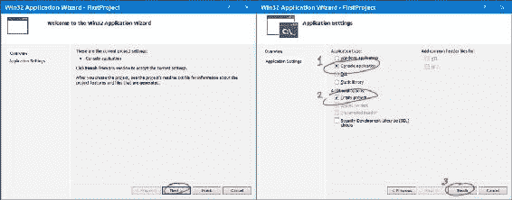

4.  Once the application wizard completes, you will have created your first project. Both a Solution and a Project are created. To see these, you need **Solution Explorer**. To ensure that **Solution Explorer** is showing, go to **View** | **Solution Explorer** (or press *Ctrl* + *Alt* + *L*). **Solution Explorer** is a window that usually appears docked on the left-hand side or right-hand side of the main editor window as shown in the following screenshot:

    

    **解决方案资源管理器**也显示项目的所有文件。使用**解决方案资源管理器**，我们还将在编辑器中添加一个代码文件。右键单击您的项目`FirstProject`，然后选择**添加** | **新项目…**

    

5.  In the next dialog, simply select **C++ File (.cpp)**, and give the file any name you'd like. I called mine `Main.cpp`.

    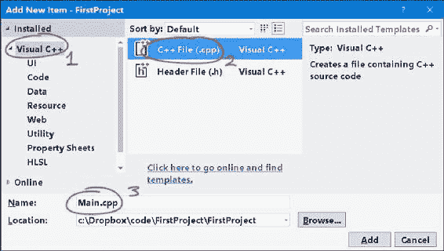

6.  一旦您添加了该文件，它将出现在您的`FirstProject`源文件过滤器下的**解决方案资源管理器**中。随着项目的增长，越来越多的文件将被添加到项目中。您可以使用以下文本编译和运行第一个 C 程序:

    ```cpp
    #include<stdio.h>

    int main()
    {
      puts("Welcome to Visual Studio 2015 Community Edition!");
    }
    ```

7.  按*Ctrl**Shift**B*构建项目，然后按*Ctrl**F5*运行项目。
8.  Your executable will be created, and you will see a small black window with the results of your program's run:

    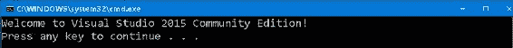

## 它是如何工作的...

构建可执行文件涉及将您的 C 代码从文本语言转换为二进制文件。运行文件会运行您的游戏程序，该程序只是在`{`和`}`之间的`main()`函数中出现的代码文本。

## 还有更多...

构建配置是构建的**样式**，我们应该在这里讨论它们。您至少应该了解两个重要的构建配置: **Debug**和**Release**。所选的构建配置位于编辑器的顶部，位于默认位置的工具栏正下方。


根据您选择的配置，将使用不同的编译器选项。**调试**配置通常在构建中包含大量调试信息，并关闭优化以加快编译速度。**Release**构建通常会进行优化 (无论是针对大小还是针对速度)，需要更长的时间来构建，并导致更小或更快的可执行文件。在**调试**模式下，与调试器一起执行的行为通常比**发行版**模式更好。

# 在 Visual Studio 中更改代码字体和颜色

自定义Visual Studio中的字体和颜色不仅非常灵活，如果您的显示器分辨率很高或很低，您还会发现它非常必要。

## 准备就绪

Visual Studio 是一个高度可定制的代码编辑工具。您可能会发现默认字体对于屏幕来说太小了。您可能想要更改代码的字体大小和颜色。或者您可能想要完全自定义关键字的颜色和文本背景颜色。我们将在本节中向您展示如何使用的**字体和颜色**对话框允许您完全自定义代码编辑器的字体和颜色的各个方面。

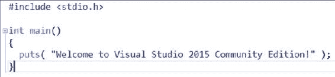

## 怎么做...

1.  From within Visual Studio, go to **Tools** | **Options…**

    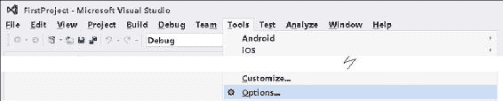

2.  Select **Environment** | **Fonts and Colors** from the dialog that appears. It will look like the following screenshot:

    

3.  Play around with the font and font size of **Text Editor/Plain Text**. Click **OK** on the dialog, and see the results in the code-text editor.

    

**文本编辑器/纯文本**描述了常规代码编辑器中所有代码文本所使用的字体和大小。如果更改字体的大小，则输入到编码窗口中的任何文本 (对于所有语言，包括 C，C，C # 和其他语言) 的大小都会更改。

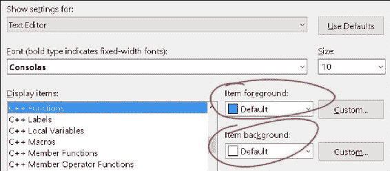

颜色 (前景和背景) 是完全可定制的每个项目。对于**文本编辑器/关键字**设置 (影响所有语言)，或者对于 C 特定项目，如**文本编辑器/C 函数**，试试这个。单击**确定**，您将看到代码编辑器中反映的项目的更改颜色。

您可能还需要配置**输出窗口**的字体大小-选择**显示设置** = >**输出窗口**，如以下屏幕截图所示:


**输出窗口**是编辑器底部的小窗口，显示构建结果和编译器错误。

### 提示

您不能保存 (导出) 或引入 (导入) 对**字体和颜色**对话框的更改。但是您可以使用称为*Visual Studio 主题编辑器扩展的东西，*了解更多信息请参考*扩展-更改 Visual Studio*中的颜色主题以导出和导入自定义的颜色主题。

因此，您可能希望避免从此对话框更改字体颜色。但是，对于任何设置 (在撰写本文时)，您必须使用此对话框更改字体和字体大小。

## 它是如何工作的...

**字体和颜色**对话框只会更改文本编辑器以及其他窗口 (如输出窗口) 中代码的外观。它对于使您的编码环境更加舒适非常有用。

## 还有更多...

自定义设置后，您会发现您可能希望保存自定义的**字体和颜色**设置供其他人使用，或者将其放入另一台机器上的 Visual Studio 安装中。不幸的是，默认情况下，您将无法保存自定义的**字体和颜色**设置。您将需要一个叫做 Visual Studio 主题编辑器扩展的东西来做到这一点。我们将在下一个食谱中探索这一点。

## 另见

*   *扩展-在 Visual Studio*中更改颜色主题部分介绍了如何导入和导出颜色主题

# 扩展-在 Visual Studio 中更改颜色主题

默认情况下，您无法保存您在**字体和颜色**对话框中对字体颜色和背景设置所做的更改。要解决此问题，Visual Studio 2015 有一个名为**主题**的功能。如果您转到**工具** | **选项** | **环境** | **通用**，您可以将主题更改为三个预装股票主题之一 (**轻**，**蓝色**和**深色**)。

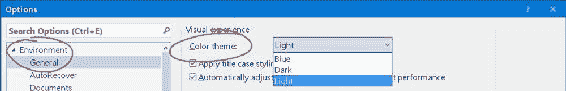

不同的主题完全改变了 Visual Studio 的外观-从标题栏的颜色到文本编辑器窗口的背景颜色。

您也可以完全自定义 Visual Studio 的主题，但您需要一个扩展才能做到这一点。扩展是可以安装到 Visual Studio 中修改其行为的小程序。

默认情况下，如果没有扩展名，您的自定义颜色设置将无法保存或重新加载到另一个 Visual Studio 安装中。通过扩展，您还可以保存自己的颜色主题以与他人共享。您还可以将其他人或自己制作的颜色设置加载到 Visual Studio 的新副本中。

## 怎么做...

1.  转到**工具** | **扩展和更新…**
2.  From the dialog that appears, choose **Online** in the panel on the left-hand side. Start typing `Theme Editor` into the search box at the right. The **Visual Studio 2015 Color Theme Editor** dialog will pop up in your search results.

    

3.  Click the small **Download** button in the top right-hand corner of the entry. Click through the installation dialog prompts, allowing the plugin to install. After installation, Visual Studio will prompt you to restart.

    ### 提示

    或者，访问[https://visualstudiogallery.msdn.microsoft.com/](https://visualstudiogallery.msdn.microsoft.com/6f4b51b6-5c6b-4a81-9cb5-f2daa560430b)并通过双击浏览器中的`.vsix`下载/安装扩展。

4.  Click **Restart Now** to ensure the plugin is loaded.

    

5.  After restarting, go to **Tools** | **Customize Colors** to open the **Color Themes** editor page.

    

6.  From the **Color Themes** dialog that appears, click on the little palette-shaped icon on the upper-right corner of the theme that you want to use as your base or starting theme (I've clicked on the palette for the **Light** theme here, as you can see in the following screenshot).

    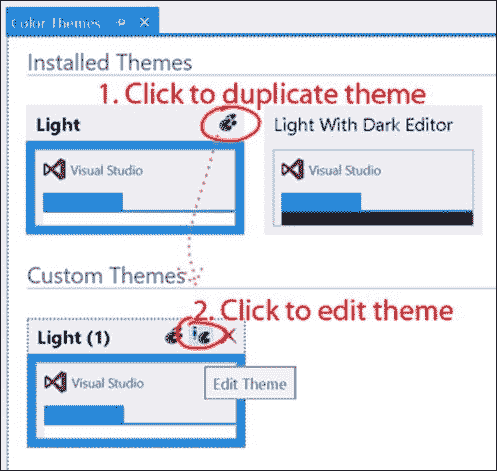

7.  主题的副本将出现在**颜色主题**窗口下部的**自定义主题**部分中。点击**编辑主题**修改主题。当您编辑主题时，您可以更改从字体文本颜色到 C 关键字颜色的所有内容。
8.  The main area you are interested in is the C++ Text Editor section. To gain access to all the C++ Text Editor options, be sure to select the **Show All Elements** option at the top of the Theme Editor window, as shown in the following screenshot:

    

    ### 注意

    请务必在主题编辑器窗口中选择**显示所有元素**选项，以显示特定于 C 的文本编辑器设置。否则，您将只能进行 Chrome/GUI 类型的修改。

9.  请注意，虽然您感兴趣的大多数设置将在**文本编辑器** | **C/C**下，但有些设置将没有那个**C**副标题。例如，编辑器窗口内的主/纯文本 (适用于所有语言) 设置在**文本编辑器** | **纯文本**下 (不带**C**副标题)。
10.  从**工具** | **选项** | **环境** | **通用**中选择要使用的主题。您创建的任何新主题都将自动显示在下拉菜单中。

## 它是如何工作的...

一旦我们加载了插件，它就很好地集成到 Visual Studio 中。导出和上传您的主题以与他人共享也很容易。

将主题添加到您的 Visual Studio 将其作为扩展安装在**工具** | **扩展和更新…** 中，要删除主题，只需**卸载**其扩展。


# 在 Visual Studio 中格式化代码 (自动完成设置)

使用 Visual Studio 编写代码格式化是一种乐趣。在本食谱中，我们将讨论如何控制 Visual Studio 布置代码文本的方式。

## 准备就绪

代码必须正确格式化。您和您的共同程序员将能够更好地理解，**grok**，并保持代码的错误，如果它的格式一致。这就是为什么 Visual Studio 在编辑器中包含许多自动格式化工具的原因。

## 怎么做...

1.  Go to **Tools** | **Options** | **Text Editor** | **C/C++**. This dialog displays a window that allows you to toggle **Automatic brace completion**.

    

    **自动支撑完成**是这样的功能，当您键入`{`时，会自动为您键入相应的`}`。如果你不喜欢文本编辑器意外地为你插入字符，这个功能可能会让你感到不喜欢。

    您通常希望打开**自动列表成员**，因为一旦开始键入，它就会显示一个漂亮的对话框，其中包含列出的数据成员的完整名称。这使得它很容易记住变量名称，所以你不必记住它们:

    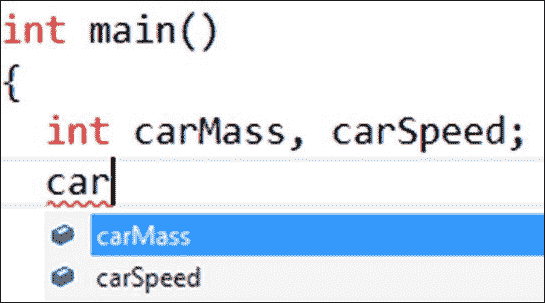

    ### 提示

    如果您随时在代码编辑器内按*Ctrl*空格键，则会弹出自动列表。

2.  Some more autocomplete behavior options are located under **Text Editor** | **C/C++** | **Formatting**:

    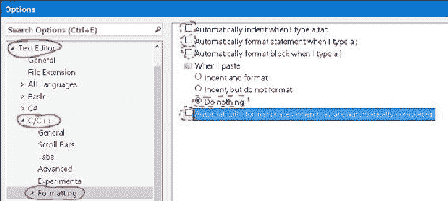

**自动格式化部分**: 突出显示一段文字，选择**编辑** | **高级** | **格式选择** (*Ctrl**K，ctrl**F*)。

## 它是如何工作的...

默认的自动完成和自动格式化行为可能会让您感到不满。您需要与您的团队讨论如何格式化代码 (空格或选项卡缩进，缩进大小等)，然后相应地配置 Visual Studio 设置。

# Visual Studio 中的快捷键

快捷键在编码时，确实节省了您的时间。副手知道快捷键总是好的。

## 准备就绪

有许多快捷键可以使编码和项目导航更快，并且对您来说更高效。在本食谱中，我们描述了如何使用一些通用快捷键，这些快捷键将真正提高您的编码速度。

## 怎么做...

下面是一些非常有用的键盘快捷键供您尝试:

1.  Click on one page of the code, then click somewhere else, at least 10 lines of code away. Now press *Ctrl* + *-* [navigate backwards]. Navigation through different pages of source code (the last place you were at, and the place you are at now) is done by pressing *Ctrl* + *-* and *Ctrl* + *Shift* + *-* respectively.

    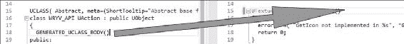

    ### 提示

    使用*Ctrl**-*在文本编辑器中扭曲。光标将跳回它所在的最后一个位置，该位置距离超过 10 行代码，即使最后一个位置位于单独的文件中。

    例如，你在一个地方编辑代码，你想回到你刚刚去过的地方 (或者回到你来自的代码中的那一部分)。只需按*Ctrl**-*，这将使您回到代码中的位置。要向前弯曲到您按下*Ctrl**-*之前的位置，请按*Ctrl**Shift**-*。要向后弯曲，以前的位置应该在 10 行以上，或者在不同的文件中。这些对应于工具栏中的前进和后退菜单按钮:

    

    ### 提示

    工具栏中的后退和前进导航按钮，分别对应*Ctrl**-*和*Ctrl**Shift**-*快捷方式。

2.  按*Ctrl**W*突出显示单个单词。
3.  按下并按住*Ctrl**Shift*右箭头 (或左箭头) (不是*Shift*右箭头)，只是移动到光标的右侧和左侧，选择整个单词。
4.  按*Ctrl**C*复制文本，*Ctrl**X*剪切文本，*Ctrl**V*粘贴文本。
5.  **Clipboard ring**: The clipboard ring is a kind of a reference to the fact that Visual Studio maintains a stack of the last copy operations. By pressing *Ctrl* + *C*, you push the text that you are copying into an effective stack. Pressing *Ctrl* + *C* a second time on different text pushes that text into the **Clipboard Stack**. For example, in the following diagram, we pressed *Ctrl* + *C* on the word **cyclic** first, then *Ctrl* + *C* on the word **paste** afterwards.

    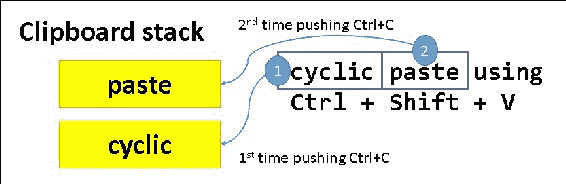

    如您所知，按*Ctrl**V*粘贴堆栈中的顶部项目。按*Ctrl**Shift**V*访问该会话中复制的所有项目的很长历史记录，即堆栈中顶部项目下方的项目。用尽项目列表后，该列表将返回到堆栈中的顶部项目。这是一个奇怪的功能，但你可能会发现它偶尔有用。

6.  *Ctrl* + *M*, *Ctrl* + *M* collapses a code section.

    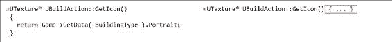

## 它是如何工作的...

键盘快捷键允许您通过减少在编码会话中必须执行的鼠标到达次数来加快代码编辑器中的工作。

# Visual Studio 中鼠标的扩展用法

鼠标是一个非常方便的选择文本的工具。在本节中，我们将重点介绍如何以高级方式使用鼠标快速编辑代码文本。

## 怎么做...

1.  Hold down the *Ctrl* key while clicking to select an entire word.

    

2.  Hold down the *Alt* key to select a box of text (*Alt* + Left Click + Drag).

    

然后，您可以剪切、复制或覆盖盒形文本区域。

## 它是如何工作的...

单凭鼠标点击可以是乏味的，但是在*Ctrl**Alt*的帮助下，它变得相当酷。尝试*Alt*左键单击拖动以选择一行文本，然后键入。您键入的字符将在行中重复。

# UE4-安装

正确安装和配置 UE4 需要遵循多个步骤。在此食谱中，我们将逐步介绍发动机的正确安装和设置。

## 准备就绪

UE4 占用相当多 GB 的空间，因此您应该至少有 20 GB 左右的空闲空间，以便在目标驱动器上进行安装。

## 怎么做...

1.  访问 unrealengine.com 并下载。如果需要，请注册一个帐户。
2.  通过双击`EpicGamesLauncherInstaller-x.x.x-xxx.msi`安装程序来运行 Epic Games Launcher 程序的安装程序。将其安装在默认位置。
3.  安装 Epic Games Launcher 程序后，请双击桌面上或开始菜单中的图标将其打开。
4.  Browse the start page and take a look around. Eventually, you will need to install an engine. Click on the large orange **Install Engine** button on the top-left side from the **UE4** tab, as shown in the following image:

    

5.  A pop-up dialog will show the components that can be installed. Select the components you'd like to install. The recommendation is to begin by installing the first three components (**Core Components**, **Starter Content**, and **Templates and Feature Packs**). You can leave out the **Editor symbols for debugging** component if you will not be using it.

    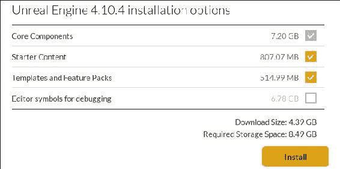

6.  安装引擎后，**安装引擎**按钮将变为**启动引擎**按钮。

## 它是如何工作的...

Epic Games Launcher 是您需要启动引擎本身的程序。它在**库**选项卡中保留所有项目和库的副本。

## 还有更多...

尝试在**库** | **Vault**部分下载一些免费的库包。为此，单击左侧的**库**项，然后向下滚动，直到在**My Projects**下方看到**Vault**。

# UE4-第一个项目

在 UE4 中设置项目需要多个步骤。正确选择选项很重要，这样您就可以拥有自己喜欢的设置，因此在构建第一个项目时请仔细遵循此配方。

您在 UE4 中创建的每个项目至少占用 1 GB 左右的空间，因此您应该决定是要在同一目标驱动器上还是在外部或单独的 HDD 上创建的项目。

## 怎么做...

1.  从Epic Games 启动器中，单击**启动虚幻引擎 4.11.2**按钮。一旦进入引擎，就会出现创建新项目或加载现有项目的选项。
2.  选择**新建项目**选项卡。
3.  决定是使用 C 编写项目代码，还是专门使用蓝图。
    1.  如果仅使用蓝图，请从**蓝图**选项卡中选择要使用的模板。
    2.  如果除了蓝图之外还使用 C 来构建您的项目，请根据**C**选项卡选择项目模板来构建您的项目。
    3.  如果你不确定你的代码基于什么模板，基本代码是任何 C 项目的一个很好的起点 (或者对于一个蓝图独占的项目来说是空白)。
4.  Take a look at the three icons that appear beneath the template listing. There are three options here to configure:
    1.  您可以选择针对桌面或移动应用。
    2.  您可以选择更改质量设置 (带有魔术的植物的图片)。但你可能不需要改变这些。无论如何，质量设置都是在**引擎** | **引擎可扩展性设置**下可重新配置的。
    3.  最后一个选项是项目中是否包含**入门内容**。您可以在项目中使用**入门内容**包。它有一些优秀的材质和纹理。

    ### 提示

    如果您不喜欢**入门内容**软件包，请尝试 UE4 市场中的软件包。那里有一些优秀的免费内容，包括**GameTextures Material Pack**。

5.  选择要保存项目的驱动器和文件夹。请记住，每个项目的大小大约为 1 GB，并且目标驱动器上至少需要那么多的空间。
6.  命名您的项目。最好将其命名为独特且特定于您计划创建的内容。
7.  Hit **Create**. Both the UE4 Editor and Visual Studio 2015 windows should pop up, enabling you to edit your project.

    ### 提示

    将来，请记住，您可以通过以下两种方法之一打开 Visual Studio 2015 解决方案:

    *   通过您的本地文件资源管理器。导航到项目存储位置的根目录，然后双击`ProjectName.sln`文件。
    *   从 UE4 中，单击**文件** | **打开 Visual Studio**。

# UE4-创建您的第一级

在UE4 中创建级别很容易，而且周围都有一个很好的用户界面。在本食谱中，我们将概述编辑器的基本用法，并描述一旦启动第一个项目，如何构建第一个级别。

## 准备就绪

完成之前的食谱，*UE4-第一个项目*。一旦您构建了一个项目，我们就可以继续创建一个关卡。

## 怎么做…

1.  启动新项目时设置的默认级别将包含一些默认的几何图形和风景。然而，你不需要从这些初学者开始。如果您不想从它构建，您可以删除它，或者创建一个新的级别。
2.  To create a new level, click **File** | **New Level…** and select to create a level with a background sky (**Default**), or without a background sky (**Empty Level**).

    ### 提示

    如果您选择创建一个没有背景天空的关卡，请记住，您必须在其中添加一个**光**，才能有效地查看添加到它的几何图形。

3.  如果您在项目的创建 (或其他内容) 上加载了**入门内容**，则可以使用**内容浏览器**将内容拉入您的级别。只需将您的内容实例从**内容浏览器**拖放到关卡中，保存并启动它们。
4.  Add some geometry to your level using the **Modes** panel (**Window** | **Modes**). Be sure to click on the picture of a light bulb and cube to access the placeable geometry. You can also add lights via the **Modes** tab by clicking on the **Lights** subtab on the left-hand side of the **Modes** tab.

    

### 注意

**模式**面板包含两个有用的项目的水平构造: 一些样本几何添加 (立方体和球体等) 以及一个充满灯的面板。尝试这些并尝试开始布置您的水平。

# UE4-使用 UE_LOG 进行日志记录

日志记录对于输出内部游戏数据非常重要。使用日志工具可以将信息打印到 UE4 编辑器中的一个方便的小**输出日志**窗口中。

## 准备就绪

编码时，我们有时可能希望将一些调试信息发送到 UE 日志窗口。这可以使用`UE_LOG`宏。日志消息是一种非常重要且方便的方法，可以在开发程序时跟踪程序中的信息。

## 怎么做...

1.  在您的代码中，使用以下形式输入一行代码:

    ```cpp
    UE_LOG(LogTemp, Warning, TEXT("Some warning message") );

    ```

2.  Turn on the **Output Log** inside the UE4 editor to see your log messages printed in that window as your program is running.

    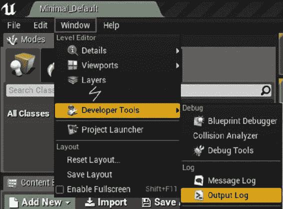

## 它是如何工作的...

`UE_LOG`宏至少接受三个参数:

*   日志类别 (我们这里用`LogTemp`表示临时日志中的日志消息)
*   日志级别 (我们在这里使用警告来表示以黄色警告文本打印的日志消息)
*   日志消息本身的实际文本的字符串

不要忘记日志消息文本周围的`TEXT()`宏!当编译器设置为在 Unicode on 下运行时，它将封闭的文本提升为 Unicode (它在 L 之前)。

`UE_LOG`也接受可变数量的参数，就像 C 编程语言中的`printf()`一样。

```cpp
int intVar = 5;
float floatVar = 3.7f;
FString fstringVar = "an fstring variable";
UE_LOG(LogTemp, Warning, TEXT("Text, %d %f %s"), intVar, floatVar, *fstringVar );

```

当使用`UE_LOG`到**取消引用**到常规 C 样式`TCHAR`指针时，在`FString`变量之前会有一个星号。

### 提示

`TCHAR`通常定义为变量类型`where`，如果编译中使用 Unicode，则`TCHAR`解析为`wchar_t`。如果 Unicode 关闭 (未定义编译器开关`_UNICODE`)，则`TCHAR`解析为简单的 char。

在您不再需要来源的日志消息后，请不要忘记清除它们!

# UE4-从 FStrings 和其他变量制作 FString

在UE4 中编码时，通常希望从变量构造一个字符串。使用`FString::Printf`或`FString::Format`函数非常容易。

## 准备就绪

为此，您应该有一个现有的项目，您可以在其中输入一些 UE4 C 代码。可以通过**打印**将变量放入字符串中。打印成字符串可能是违反直觉的，但是您不能只是将变量连接在一起，并希望它们会自动转换为字符串，例如在某些语言中，例如 JavaScript。

## 怎么做…

1.  Using `FString::Printf()`:
    1.  考虑您想要打印到字符串中的变量。
    2.  打开并查看`printf`格式说明符的参考页，例如[http://en.cppreference.com/w/cpp/io/c/fprintf](http://en.cppreference.com/w/cpp/io/c/fprintf)。
    3.  尝试如下代码:

        ```cpp
        FString name = "Tim";
        int32 mana = 450;
        FString string = FString::Printf( TEXT( "Name = %s Mana = %d" ), *name, mana );
        ```

    请注意前面的代码块如何像传统的`printf`函数那样精确地使用格式说明符。在前面的示例中，我们使用`%s`在格式化的字符串中放置一个字符串，而`%d`在格式化的字符串中放置一个整数。不同类型的变量存在不同的格式说明符，您应该在 cppreference.com 等网站上查找它们。

2.  Using `FString::Format()`. Write code in the following form:

    ```cpp
    FString name = "Tim";
    int32 mana = 450;
    TArray< FStringFormatArg > args;
    args.Add( FStringFormatArg( name ) );
    args.Add( FStringFormatArg( mana ) );
    FString string = FString::Format( TEXT( "Name = {0} Mana = {1}" ), args );
    UE_LOG( LogTemp, Warning, TEXT( "Your string: %s" ), *string );
    ```

    使用`FString::Format()`，我们不使用正确的格式说明符，而是使用简单整数和`FStringFormatArg`的`TArray`。`FstringFormatArg`帮助`FString::Format()`推导出要放入字符串的变量类型。

# GitHub 上的项目管理-获取您的源代码管理

在开发项目时，为项目做的一件非常重要的事情是在工作时生成时间轴历史记录。为此，您需要定期备份源代码。这样做的一个很好的工具是 Git。Git 允许您将更改 (提交) 寄存到远程服务器上的在线存储库中，以便在该远程服务器上记录并保留代码的开发历史记录。如果您的本地副本以某种方式损坏，则可以始终从在线备份中恢复。此时间轴-您的代码库的开发历史称为**源代码控制**。

## 准备就绪

有一些免费服务提供在线源备份。存储数据的一些免费替代方案包括:

*   **Visualstudio.com**: 您的存储库的有限/私有共享
*   **github.com**: 无限公开共享您的存储库

Visualstudio.com 是非常适合当你想免费为你的项目提供一些隐私时，而当你想免费与许多用户共享你的项目时，GitHub 是非常棒的。Visualstudio.com 还提供了一些非常好的工作板和计划功能，我们将在本文后面使用这些功能 (GitHub 还提供了一个竞争性的问题跟踪器，我们将在稍后讨论)。

您选择的网站主要取决于您计划如何共享代码。在本文中，我们将使用 GitHub 进行源代码存储，因为我们需要与大量用户 (您!) 共享我们的代码。

## 怎么做...

1.  在[https://github.com](https://github.com)注册 GitHub 帐户。使用**团队资源管理器**菜单 (**视图** | **团队资源管理器**) 登录到您的 GitHub 帐户。
2.  打开**团队资源管理器**后，您可以使用**团队资源管理器**窗口中出现的按钮登录到您的 GitHub 帐户。
3.  登录后，您应该获得**克隆**和**创建**存储库的功能。这些选项将出现在**团队资源管理器**中的 GitHub 菜单的正下方。
4.  From here, we want to create our first repository. Hit the **Create** button, and name your repository in the window that comes up.

    ### 提示

    创建项目时，请注意从`.gitignore`选项菜单中选择**VisualStudio**选项。这将导致 Git 忽略您不希望包含在存储库中的特定于 Visual Studio 的文件，例如构建和发布目录。

5.  现在你有一个存储库!存储库在 GitHub 上初始化。我们只需要在里面放一些代码。
6.  打开 Epic Games 启动器，并创建一个项目以放入存储库中。
7.  Open the C++ project in Visual Studio 2015, and right-click on Solution. Select **Add Solution to Source Control** from the context menu that appears. The dialog that appears will ask whether you want to use **Git** or **TFVC**.

    ### 提示

    如果您使用**Git**进行源代码管理，则可以在 github.com 或 Visualstudio.com 上托管。

8.  在项目中添加 Git 源代码控制后，再次查看**Team Explorer**。在该窗口中，您应该输入一条简短的消息，然后单击**提交**按钮。

## 它是如何工作的...

Git 存储库对于随着项目的发展备份代码和项目文件的副本非常重要。Git 中有许多命令可以浏览项目历史记录 (尝试使用 Git GUI 工具)，查看自上次提交 (`git diff`) 以来所做的更改，或者在 Git 历史记录 (`git checkout commit-hash-id`) 中前后移动。

# GitHub 上的项目管理-使用问题跟踪器

跟踪项目的进度，功能和错误非常重要。GitHub 问题跟踪器将使您能够执行此操作。

## 准备就绪

跟踪项目计划的功能和运行问题的非常重要。GitHub 的问题跟踪器可用于创建您想添加到项目中的功能列表，作为以及将来需要修复的错误。

## 怎么做...

1.  To add an issue to your Issue Tracker, first select the repository that you'd like to edit by going to the front page of GitHub and selecting the **Repositories** tab:

    

2.  From your repository's homepage, select the **Issues** tab under your repository. To add an issue to track, click the **New Issue** button in the lower-right corner of the screen, as seen in the following screenshot:

    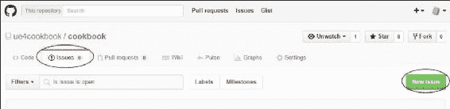

3.  When adding your issue, it is good practice to detail it as much as possible. Including screenshots and diagrams in the features or bugs you post is highly recommended, as it documents the issue much better, and parks important information and a good description into your **Issue Tracker**. Dragging and dropping images into the text editor window automatically uploads a copy of the image to GitHub's own cloud server, and the image will appear inline in the issue, as shown in the following screenshot:

    

4.  The box into which you enter the description of your bug or feature supports **Markdown**. Markdown is a simplified HTML-like markup language that lets you quickly write HTML-like syntax with ease. Examples of some markdown syntax are as follows:

    ```cpp
    # headings
    ## sub-headings
    ### sub-sub-headings
    _italics_, __bold__, ___bold-italics___
    [hyperlinks](http://towebsites.com/)

    code (indented by 4 spaces), preceded by a blank line

    * bulleted
    * lists
      - sub bullets
        - sub sub bullets

    >quotations
    ```

    ### 提示

    如果您想了解更多关于Markdown 语法的信息，请查看[https://daringfireball.net/projects/markdown/syntax](https://daringfireball.net/projects/markdown/syntax)。

5.  You can further mark the issue as either a bug, enhancement (feature), or any other label you like. Customizing labels is possible via the **Issues** | **Labels** link:

    

6.  From there, you can edit, change the color of, or delete your labels. I deleted all the stock labels, and replaced the word **enhancement** with `feature`, as seen in the following two screenshots:

    

    

7.  一旦你完全定制了你的标签，你的 GitHub**问题跟踪器**就更容易导航了。通过使用适当的标签标记来确定问题的优先级。

## 它是如何工作的...

GitHub 的问题跟踪器是一个奇妙的方式来跟踪错误和功能在你的项目。使用它不仅可以组织您的工作流程，还可以保持对项目所做工作的出色历史记录。

## 另见

*   您还应该查看 Wiki 功能，该功能允许您记录源代码

# VisualStudio.com 上的项目管理-管理项目中的任务

项目的高级管理通常使用计划工具来完成。GitHub 的**问题跟踪器**可能满足您的需求，但如果您正在寻找更多，微软的 Visual Studio Team Services 为**Scrum**和**看板**风格的任务编程分配 (功能、bug 等) 提供了规划工具。

使用此工具是组织任务的好方法，以确保事情按时完成，并习惯工业标准的工作流程。当您在安装过程中注册 Visual Studio 的社区版时，您的帐户包括免费使用这些工具。

## 怎么做...

在本节中，我们将介绍如何使用 Visualstudio.com 上的**工作板**功能来计划一些简单的任务。

1.  To create your own project Workboard, go to your account at Visualstudio.com. Log in, and then select the **Overview** tab. Under **Recent projects & teams title**, select the **New** link.

    

2.  Add a **Project name** and **Description** to your project. After you've named your project (I've named mine `Workboards`), click on **Create project**. You will wait a second or two for project creation to complete, then hit the **Navigate to project** button in the next dialog.

    

3.  The next screen that is shown allows you to navigate to the **Workboards** area. Click on **Manage Work**.

    

4.  The **Manage Work** screen is a Kanban styled (read: prioritized) task queue of things to do in your project. You can hit the **New item** button to add new items to your list of things to do.

    

### 提示

一旦您将某些内容添加到待办事项列表中，它就被称为积压工作的一部分。在看板中，你总是落后!如果你是一名经理，你永远不会想要一个空的积压。

## 它是如何工作的…

董事会积压中的每个项目都称为**用户故事**。用户故事是一个敏捷软件开发术语，每个用户故事都应该描述特定最终用户的需求。例如，在前面的用户故事中，需要具有可视化图形，而用户故事描述必须创建图形 (精灵) 才能满足此用户要求。

用户故事通常会有特定的格式:

### 注意

作为<someone>，我想要<this>，所以<advantage>。</advantage></this></someone>

例如:

### 注意

作为<player of="" the="" game="">，我想<reorganize items="">，这样我就可以<set hotkeys="" to="" slots="" that="" i="" desire="">。</set></reorganize></player>

在工作板上，你会有一堆用户故事。我之前已经放置了一些用户故事，因此我们可以使用它们。

一旦您的董事会充满了用户故事，它们都将位于新的垂直列中。当您开始对特定用户故事进行工作或取得进展时，可以将其从**New**水平拖动到**Active**，最后到**解决了**，**在用户故事完成后关闭**。

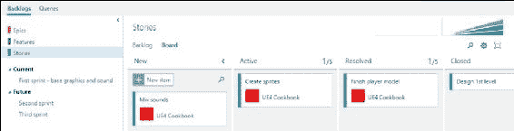

# VisualStudio.com 上的项目管理 -- 构建用户故事和任务

从Scrum 的角度来看，用户故事是需要完成的任务的分组。一组用户故事可以被收集到一个**特征**中，一组特征可以被聚集到一起，被称为**史诗**中。VisualStudio.com 很好地组织用户故事的创建，这样就很容易构建和计划任何特定任务 (用户故事) 的完成。在本食谱中，我们将描述如何组装和组合用户故事。

## 准备就绪

VisualStudio.com 的项目管理套件中输入的每个项目都应始终是有人希望在软件中使用的功能。用户故事创建是一种有趣，简单且令人兴奋的方式，可以将分组在一起，并将成堆的任务作为要完成的工作交给程序员。立即登录到您的 VisualStudio.com 帐户，编辑您的一个项目，然后开始使用此功能。

## 怎么做…

1.  From the VisualStudio.com **Team Services** landing page, navigate to the project into which you want to enter some new work to be done. All of your Projects can be found if you click on **Browse** under the **Recent projects & teams** heading.

    

2.  选择要使用的项目，然后单击**导航**。
3.  Visualstudio.com 内的任务发生在超级任务的三类之一内:
    *   用户故事
    *   特征
    *   Epics

        ### 提示

        用户故事、功能和史诗只是工作的组织单位。史诗包含许多特征。一个功能包含许多用户故事，而一个用户故事包含许多任务。

        默认情况下，没有显示**Epics**。您可以通过转到 “设置” (屏幕右侧的齿轮图标) 来显示**Epics**。然后导航到**一般** | **积压**。在显示**的部分下，仅查看您的团队管理的积压**，选择以显示所有三种积压版本: **Epics**，**Features**和**故事**。

4.  在您可以将第一个任务 (用户故事) 输入到**积压工作**之前，现在有四个导航步骤要执行:
    1.  从顶部的菜单栏中，选择**工作**。
    2.  然后，在**工作**页面上出现的子菜单中，选择**积压**。
    3.  在出现的侧边栏上，单击**故事**。
    4.  From the panel on the right-hand side, select **Board**.

        

        ### 提示

        Backlog 是我们尚未完成的一组用户故事和任务。您可能会想，“全新的任务真的积压了吗？”没错!你已经落后了!Scrum 术语的含义似乎暗示着 “工作泛滥”。

5.  在右侧的面板中，单击**新项目**，然后填写新的**用户故事**项目的文本。
6.  点击**用户故事**卡的文本，填写**受让人**字段，**迭代**是它的一部分，**描述**，**标签**，以及您要浏览的**详细信息**选项卡的任何其他字段。
7.  接下来，我们将总体的**用户故事**分解为一系列可实现的任务。将鼠标悬停在新的**用户故事**项目上，直到出现省略号 (三个点……)。单击省略号，然后选择**添加任务**。
8.  在一系列任务中列出完成**用户故事**的详细信息。
9.  将每个任务分配给:
    *   受让人
    *   An Iteration

        ### 提示

        简单地说，一次迭代实际上只是一个时间段。在每次迭代结束时，您应该完成一个可交付的，可测试的软件。迭代是指生产另一个版本的惊人软件 (用于测试和可能的发布) 的时间段。

10.  继续在项目开发要完成的功能和要修复的错误时，向项目添加任务。

## 它是如何工作的…

史诗包含一个的特征。功能包含许多用户故事，用户故事包含许多任务和测试。


所有这些项目都可以分配给用户 (实际人员) 和迭代 (时间段)，以分配责任和调度任务。分配这些任务后，该任务应出现在**查询**选项卡中。

### 提示

本书的序言中提到了下载代码捆绑包的详细步骤。请看看。

这本书的代码包也托管在 GitHub 上，地址为[https://github.com/PacktPublishing/ Unreal-Engine-4-Scripting-with-CPlusPlus-Cookbook](https://github.com/PacktPublishing/Unreal-Engine-4-Scripting-with-CPlusPlus-Cookbook)。我们还从我们丰富的书籍和视频目录中提供了其他代码包，可在[https://github.com/PacktPublishing/](https://github.com/PacktPublishing/) 获得。看看他们!