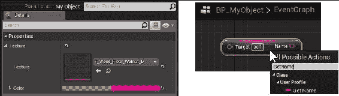
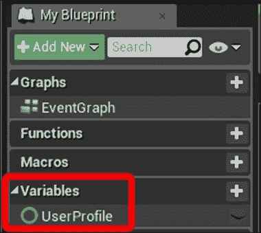
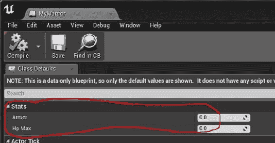
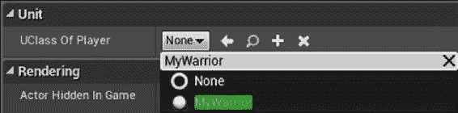
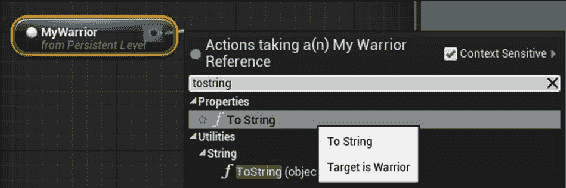

# 第二章。创建类

本章主要介绍如何创建与 UE4 蓝图编辑器很好地集成的 C 类和结构。这些类是常规 C 类的毕业版本，称为`UCLASS`。

### 提示

`UCLASS`只是一个 C 类，上面有很多 UE4 宏装饰。宏生成额外的 C 头代码，使其能够与 UE4 编辑器本身集成。

使用`UCLASS`是伟大的实践。如果配置正确，`UCLASS`宏可能会使您的`UCLASS`蓝色可打印。使您的`UCLASS`可 Blueprintable 的优点是，它可以使您的自定义 C 对象具有蓝图可视可编辑属性 (`UPROPERTY`)，并具有方便的 UI 小部件，例如文本字段，滑块和模型选择框。您还可以具有从蓝图图中可调用的函数 (`UFUNCTION`)。以下屏幕截图显示了这两种情况:



在左侧，两个`UPROPERTY`装饰的类成员 (一个`UTexture`参考和一个`FColor`) 出现在 C 类的蓝图中进行编辑。在右侧，标记为`BlueprintCallable``UFUNCTION`的 C 函数`GetName`显示为可从蓝图图中调用的。

### 注意

由`UCLASS`宏生成的代码将位于`ClassName.generated.h`文件中，这将是您的`UCLASS`头文件`ClassName.h`中需要的最后`#include`。

以下是我们将在本章中介绍的主题:

*   制作`UCLASS`-源自`UObject`
*   创建一个用户可编辑的`UPROPERTY`
*   从蓝图中访问`UPROPERTY`
*   将`UCLASS`指定为`UPROPERTY`的类型
*   从您的自定义`UCLASS`创建蓝图
*   实例化`UObject`-派生类 (`ConstructObject <>`和`NewObject <>`)
*   破坏`UObject`-派生类
*   创建`USTRUCT`
*   创建`UENUM()`
*   创建`UFUNCTION`

### 提示

您会注意到，我们在这个类中创建的示例对象，即使当 Blueprintable 时，也不会被放置在级别中。这是因为为了被放置在级别中，你的 C 类必须从`Actor`基类派生，或者在它下面。有关详细信息，请参阅[第 4 章](04.html#1KEEU1-c0ca69a0411046888a488e5085138121 "Chapter 4\. Actors and Components")，*演员和组件*。

# 简介

通常，一旦你知道模式，UE4 代码就非常容易编写和管理。我们编写的代码从另一个`UCLASS`派生，或者创建一个`UPROPERTY`或`UFUNCTION,`是非常一致的。本章提供了常见 UE4 编码任务的配方，这些任务围绕基本的`UCLASS`派生、属性和引用声明、构造、销毁和一般功能展开。

# 从 UObject 制作一个 UCLASS-派生

使用 C 编码时，您可以拥有自己的代码，该代码可以编译并作为本机 C 代码运行，并通过适当的调用`new`和`delete`来创建和销毁您的自定义对象。本机 C 代码在 UE4 项目中是完全可以接受的，因为你的`new`和`delete`调用是正确配对的，这样你的 C 代码中就不会出现泄漏。

但是，您也可以通过将自定义 C 对象声明为`UCLASS`来声明自定义 C 类，其行为类似于 UE4 类。`UCLASS`使用 UE4 的智能指针和内存管理例程根据智能指针规则进行分配和解除分配，可以由 UE4 编辑器加载和读取，并且可以可选地从蓝图访问。

### 提示

请注意，当您使用`UCLASS`宏时，您的`UCLASS`对象的创建和销毁必须由 UE4 完全管理: 您必须使用`ConstructObject`创建对象的实例 (而不是 C native 关键字`new`)，并调用`UObject::ConditionalBeginDestroy()`销毁对象 (不是 C 原生关键字`delete`)。如何创建和销毁您的`UObject`-派生类在*实例化 UObject 派生类 (ConstructObject<>和 NewObject<>)* 和*销毁 UObject 派生类*这后面的部分章。

## 准备就绪

在本食谱中，我们将概述如何编写一个 C 类，该 C 类使用`UCLASS`宏来启用托管内存分配和释放，以及允许从 UE4 编辑器和蓝图访问。您需要一个 UE4 项目，您可以在其中添加新代码以使用此配方。

## 怎么做...

要创建自己的`UObject`派生类，请按照以下步骤操作:

1.  从您正在运行的项目中，选择**文件** | **在 UE4 编辑器中添加 C 类**。
2.  In the **Add C++ Class** dialog that appears, go to the upper-right side of the window, and tick the **Show All Classes** checkbox:

    

3.  通过选择从`Object`父类派生来创建`UCLASS`。`UObject`是 UE4 层次结构的根。您必须勾选此对话框右上角的**显示所有类**复选框，以使`Object`类出现在列表视图中。
4.  Select `Object` (top of the hierarchy) as the parent class to inherit from, and then click on **Next**.

    ### 提示

    请注意，尽管`Object`将在对话框中写入，但在您的 C 代码中，您将从中派生的 C 类实际上是`UObject`，带有前导大写`U`。这是 UE4 的命名常规:

    从`UObject` (在`Actor`以外的分支上) 派生的`UCLASS`必须以前导`U`命名。

    源自`Actor`的`UCLASS`必须用前导`A`命名 ([第四章](04.html#1KEEU1-c0ca69a0411046888a488e5085138121 "Chapter 4\. Actors and Components")，*演员和组件*)。

    从无派生的 C 类 (不是`UCLASS`) 没有命名约定，但可以使用前导`F` (例如`FAssetData`) 命名，如果首选的话。

    `UObject`的直接导数不会是水平可放置的，即使它们包含视觉表示元素，如`UStaticMeshes`。如果要将对象放置在 UE4 级别中，则必须至少从继承层次结构中的`Actor`类或其下方派生。请参阅[第 4 章](04.html#1KEEU1-c0ca69a0411046888a488e5085138121 "Chapter 4\. Actors and Components")，*actor and Components*，了解如何从`Actor`类派生一个水平可放置的对象。

    本章的示例代码不会在级别中放置，但是您可以在 UE4 编辑器中基于我们在本章中编写的 C 类创建和使用蓝图。

5.  命名您的新的`Object`派生的东西适合您正在创建的对象类型。我叫我的`UserProfile`。这在 UE4 生成的 C 文件中的类的命名中显示为`UUserObject`，以确保遵循 UE4 约定 (C`UCLASS`前面有一个前导`U`)。
6.  转到 Visual Studio，并确保您的类文件具有以下形式:

    ```cpp
    #pragma once

    #include "Object.h" // For deriving from UObject
    #include "UserProfile.generated.h" // Generated code

    // UCLASS macro options sets this C++ class to be 
    // Blueprintable within the UE4 Editor
    UCLASS( Blueprintable )
    class CHAPTER2_API UUserProfile : public UObject
    {
      GENERATED_BODY()
    };
    ```

7.  编译并运行您的项目。现在，您可以在 Visual Studio 和 UE4 编辑器中使用自定义的`UCLASS`对象。有关如何使用它的更多详细信息，请参阅以下食谱。

## 它是如何工作的…

UE4 为您的自定义`UCLASS`生成并管理大量代码。此代码是由于使用了 UE4 宏 (例如`UPROPERTY`，`UFUNCTION`和`UCLASS`宏本身) 而生成的。生成的代码放入`UserProfile.generated.h`。您必须将`#include`文件和`UCLASSNAME.h`文件一起编译才能成功。如果不包含`UCLASSNAME.generated.h`文件，编译将失败。`UCLASSNAME.generated.h`文件必须作为最后一个`#include`包含在`UCLASSNAME.h`中的`#include`列表中:

<colgroup class="calibre17"><col class="calibre18"> <col class="calibre18"></colgroup> 
| 

右

 | 

错了

 |
| --- | --- |
| 

```cpp
#pragma once

#include "Object.h"
#include "Texture.h"
// CORRECT: .generated.h last file
#include "UserProfile.generated.h"
```

 | 

```cpp
#pragma once

#include "Object.h"
#include "UserProfile.generated.h" 
// WRONG: NO INCLUDES AFTER
// .GENERATED.H FILE
#include "Texture.h"
```

 |

当包含列表中未包含`UCLASSNAME.generated.h`文件时，发生错误如下:

```cpp
>> #include found after .generated.h file - the .generated.h file should always be the last #include in a header
```

## 还有更多…

这里有一堆我们要讨论的关键字，它们修改了 a`UCLASS`的行为方式。A`UCLASS`可以标记如下:

*   `Blueprintable`: This means that you want to be able to construct a Blueprint from the **Class Viewer** inside the UE4 Editor (when you right-click, **Create Blueprint Class…** becomes available). Without the `Blueprintable` keyword, the **Create Blueprint Class…** option will not be available for your `UCLASS`, even if you can find it from within the **Class Viewer** and right-click on it:

    

*   仅当您在您的`UCLASS`宏定义中指定`Blueprintable`时，**Create Blueprint Class…** 选项才可用。如果未指定`Blueprintable`，则结果`UCLASS`将不为`Blueprintable`。
*   `BlueprintType`: Using this keyword implies that the `UCLASS` is usable as a variable from another Blueprint. You can create Blueprint variables from the **Variables** group in the left-hand panel of any Blueprint's **EventGraph**. If `NotBlueprintType` is specified, then you cannot use this Blueprint variable type as a variable in a Blueprints diagram. Right-clicking the `UCLASS` name in the **Class Viewer** will not show **Create Blueprint Class…** in its context menu:

    

指定了`BlueprintType`的任何`UCLASS`都可以作为变量添加到蓝图类图的变量列表中。

您可能不确定是否将您的 C 类声明为`UCLASS`。这真的取决于你。如果您喜欢智能指针，您可能会发现`UCLASS`不仅使代码更加安全，而且使整个代码库更加连贯和一致。

## 另见

*   要向蓝图图添加其他可编程的`UPROPERTY`，请参见下面的*创建用户可编辑的 UPROPERTY*部分。有关使用适当的智能指针引用您的`UCLASS`实例的详细信息，请参阅[第 3 章](#190861-c0ca69a0411046888a488e5085138121 "Chapter 3\. Memory Management and Smart Pointers")、*内存管理和智能指针*。

# 创建用户可编辑的 UPROPERTY

您声明的每个`UCLASS`都可以在其中声明任意数量的`UPROPERTY`。每个`UPROPERTY`可以是可视可编辑的字段，也可以是`UCLASS`的一些可访问数据成员的蓝图。

我们可以为每个`UPROPERTY`添加一些限定符，这些限定符会从 UE4 编辑器中更改其行为方式，例如`EditAnywhere` (可以更改`UPROPERTY`的屏幕)，和`BlueprintReadWrite` (指定蓝图除了允许 C 代码之外，还可以随时读取和写入变量)。

## 准备就绪

要使用这个配方，你应该有一个 C 项目，你可以在其中添加 C 代码。此外，您应该已经完成了前面的食谱*，从 UObject*制作一个 UCLASS-deriving。

## 怎么做...

1.  将成员添加到您的`UCLASS`声明中，如下所示:

    ```cpp
    UCLASS( Blueprintable )
    class CHAPTER2_API UUserProfile : public UObject
    {
      GENERATED_BODY()
      public:
      UPROPERTY(EditAnywhere, BlueprintReadWrite, Category = Stats)
      float Armor;
      UPROPERTY(EditAnywhere, BlueprintReadWrite, Category = Stats)
      float HpMax;
    };
    ```

2.  创建您的`UObject`类派生的蓝图，并通过从对象浏览器双击在 UE4 编辑器中打开蓝图。
3.  You can now specify values in Blueprints for the default values of these new `UPROPERTY` fields:

    

4.  通过将 Blueprint 类的几个实例拖放到您的级别中，并在放置的对象上编辑值 (通过双击它们) 来指定每个实例的值。

## 它是如何工作的…

传递给`UPROPERTY()`宏的参数指定了关于变量的几个重要信息。在上面的示例中，我们指定了以下内容:

*   `EditAnywhere`: 这个意味着可以直接从蓝图中编辑`UPROPERTY()`宏，也可以在游戏级别中放置的`UClass`对象的每个实例上编辑。将此与以下内容进行对比:
    *   `EditDefaultsOnly`: 蓝图的值是可编辑的，但不能按实例编辑
    *   `EditInstanceOnly`: 这将允许在`UClass`对象的游戏级实例中编辑`UPROPERTY()`宏，而不是在基本蓝图本身上编辑`UPROPERTY()`宏
*   `BlueprintReadWrite`: 此表示该属性从蓝图图中既可读又可写。`UPROPERTY()`带`BlueprintReadWrite`必须是公众成员，否则编译失败。将此与以下内容进行对比:
    *   `BlueprintReadOnly`: 属性必须从 C 设置，不能从蓝图更改
*   `Category`: 您应该始终为您的`UPROPERTY()`指定一个`Category`。`Category`确定`UPROPERTY()`将在属性编辑器下显示的子菜单。在`Category=Stats`下指定的所有`UPROPERTY()`都将出现在蓝图编辑器中的同一`Stats`区域中。

## 另见

*   完整的`UPROPERTY`清单位于[https://docs.unrealengine.com/latest/INT/Programming/UnrealArchitecture/Reference/Properties/Specifiers/index.html](https://docs.unrealengine.com/latest/INT/Programming/UnrealArchitecture/Reference/Properties/Specifiers/index.html)。浏览一下。

# 从蓝图访问 UPROPERTY

从蓝图访问a`UPROPERTY`相当简单。成员必须在要从蓝图图访问的成员变量上公开为`UPROPERTY`。您必须将宏声明中的`UPROPERTY`限定为`BlueprintReadOnly`或`BlueprintReadWrite`，以指定是否希望变量从蓝图中是可读的 (仅)，甚至从蓝图中是可写的。

您还可以使用特殊值`BlueprintDefaultsOnly`来指示您只希望默认值 (在游戏开始之前) 可以从蓝图编辑器进行编辑。`BlueprintDefaultsOnly`表示在运行时无法从蓝图编辑数据成员。

## 怎么做...

1.  Create some `UObject`-derivative class, specifying both `Blueprintable` and `BlueprintType`, such as the following:

    ```cpp
    UCLASS( Blueprintable, BlueprintType )
    class CHAPTER2_API UUserProfile : public UObject
    {
      GENERATED_BODY()
      public:
      UPROPERTY(EditAnywhere, BlueprintReadWrite, Category = Stats)
      FString Name;
    };
    ```

    需要在`UCLASS`宏中的`BlueprintType`声明才能将`UCLASS`用作蓝图图中的类型。

2.  在 UE4 编辑器中，从 C 类派生一个蓝图类，如*所示，从您的自定义 UCLASS*创建蓝图。
3.  通过将实例从**内容浏览器**拖入主游戏世界区域，在 UE4 编辑器中创建您的蓝图派生类的实例。除非您为它指定了模型网格，否则它应该在游戏世界中显示为圆形白色球体。
4.  In a Blueprints diagram which allows function calls (such as the **Level Blueprint**, accessible via **Blueprints** | **Open Level Blueprint**), try printing the **Name** property of your Warrior instance, as seen in the following screenshot:

    

    ### 提示

    浏览蓝图图很容易。右键单击并拖动以平移蓝图图; *Alt*右键拖动以缩放。

## 它是如何工作的…

`UPROPERTY`是 UE4 类的自动写`Get`/`Set`方法。但是，它们不得在`UCLASS`内声明为`private`变量。如果他们没有声明为`public`或`protected`成员，你会得到一个编译器错误的形式:

```cpp
>> BlueprintReadWrite should not be used on private members
```

# 将 UCLASS 指定为 UPROPERTY 的类型

所以，你已经构建了一些定制的`UCLASS`打算在 ue4 中使用。但是你如何实例化它们呢？UE4 中的对象是引用计数和内存管理的，因此您不应该直接使用 C 关键字`new`分配它们。相反，您必须使用一个名为`ConstructObject`的函数来实例化您的`UObject`导数。`ConstructObject`不只是取你正在创建的对象的 C 类，它还需要 C 类的蓝图类派生 (一个`UClass*`参考)。`UClass*`引用只是指向蓝图的指针。

我们如何从 C 代码实例化特定蓝图的实例？C 代码不知道也不应该知道具体的`UCLASS`名称，因为这些名称是在 UE4 编辑器中创建和编辑的，您只能在编译后访问。我们需要一种方法，以某种方式将蓝图类名交还给 C 代码实例化。

我们这样做的方法是让 UE4 程序员从一个简单的下拉菜单中选择 C 代码要使用的`UClass`，该菜单列出了 UE4 编辑器中所有可用的蓝图 (源自特定的 C 类)。要做到这一点，我们只需提供一个用户可编辑的`UPROPERTY`与一个`TSubclassOf<C++ ClassName>`类型的变量。或者，您可以使用`FStringClassReference`来实现相同的目标。

这个使得在 C 代码中选择`UCLASS`就像选择要使用的纹理一样。`UCLASS`应该被视为 C 代码的资源，并且它们的名称永远不应该被硬编码到代码库中。

## 准备就绪

在 UE4 代码中，您通常需要在项目中引用不同的`UCLASS`。例如，假设您需要知道播放器对象的`UCLASS`，以便您可以在其上的代码中使用`SpawnObject`。从 C 代码中指定`UCLASS`非常尴尬，因为 C 代码根本不应该知道在蓝图编辑器中创建的派生`UCLASS`的具体实例。正如我们不想将特定的资产名称烘焙到 C 代码中一样，我们也不想将派生蓝图类名称硬编码到 C 代码中。

因此，我们使用 C 变量 (例如，`UClassOfPlayer`)，并从 UE4 编辑器中的 “蓝图” 对话框中选择该变量。您可以使用`TSubclassOf`成员或`FStringClassReference`成员执行此操作，如下面的屏幕截图所示:



## 怎么做...

1.  导航到要添加`UCLASS`引用成员的 C 类。例如，用播放器的`UCLASS`装饰一个类导数是相当容易的。
2.  在`UCLASS`内部，使用以下形式的代码声明`UPROPERTY`，该代码允许在层次结构中选择从`UObject`派生的`UClass` (蓝图类):

    ```cpp
    UCLASS()
    class CHAPTER2_API UUserProfile : public UObject
    {
      UPROPERTY(EditAnywhere, BlueprintReadWrite, Category = Unit)
      TSubclassOf<UObject> UClassOfPlayer; // Displays any UClasses
      // deriving from UObject in a dropdown menu in Blueprints

      // Displays string names of UCLASSes that derive from
      // the GameMode C++ base class
      UPROPERTY( EditAnywhere, meta=(MetaClass="GameMode"), Category = Unit )
      FStringClassReference UClassGameMode;
    };
    ```

3.  蓝图C 类，然后打开该蓝图。单击`UClassOfPlayer`菜单旁边的下拉菜单。
4.  从列出的`UClass`的下拉菜单中选择合适的`UClassOfPlayer`成员。

## 它是如何工作的…

### TSubclassOf

在编辑任何具有`TSubclassOf< >`成员的蓝图时，`TSubclassOf< >`成员将允许您使用 UE4 编辑器中的下拉菜单指定`UClass`名称。

### FStringClassReference

`MetaClass`标签指的是你期望`UClassName`从中派生的基 C 类。这将下拉菜单的内容限制为仅从该 C 类派生的蓝图。如果您希望显示项目中的所有蓝图，则可以不使用`MetaClass`标签。

# 从您的自定义 UCLASS 创建蓝图

蓝图只是为您的 C 对象导出蓝图类的过程。从 UE4 对象创建蓝图派生的类允许您在编辑器中直观地编辑自定义`UPROPERTY`。这样可以避免将任何资源硬编码到您的 C 代码中。此外，为了使您的 C 类可以在级别内放置，必须首先对其进行蓝图打印。但这只有在蓝图基础的 C 类是`Actor`类导数的情况下才有可能。

### 注意

有一种方法可以使用`FStringAssetReferences`和`StaticLoadObject`加载资源 (例如纹理)。但是，通常不鼓励这些加载资源的途径 (通过将路径字符串硬编码到 C 代码中)。在`UPROPERTY()`中提供可编辑的值，并从适当的具体类型的资产引用中加载是一种更好的做法。

## 准备就绪

为了遵循这个方法，您需要有一个构造的`UCLASS`，您想从中派生一个蓝图类 (请参阅*制作一个 UCLASS-从 UObject*派生的章节)。您的还必须在`UCLASS`宏中将您的`UCLASS`标记为`Blueprintable`，以便在发动机内部进行蓝图打印。

### 提示

任何在`UCLASS`宏声明中带有 meta 关键字`Blueprintable`的`UObject`派生类都将是`Blueprintable`。

## 怎么做…

1.  要规划您的`UserProfile`类，首先确保`UCLASS`在`UCLASS`宏中具有`Blueprintable`标签。这应该看起来如下:

    ```cpp
    UCLASS( Blueprintable )
    class CHAPTER2_API UUserProfile : public UObject
    ```

2.  编译并运行您的代码。
3.  Find the `UserProfile` C++ class in the **Class Viewer** (**Window** | **Developer Tools** | **Class Viewer**). Since the previously created `UCLASS` does not derive from `Actor`, to find your custom `UCLASS`, you must turn off **Filters** | **Actors Only** in the **Class Viewer** (which is checked by default):

    

    关闭**仅演员**复选标记，以显示**类查看器**中的所有类。如果你不这样做，那么你的自定义 C 类可能不会显示!

    ### 提示

    请记住，您可以使用**类查看器**内的小搜索框通过开始键入`UserProfile`类来轻松找到:

    

4.  在**类查看器**中找到您的`UserProfile`类，右键单击它，然后通过选择**创建蓝图…** 从中创建蓝图
5.  命名你的蓝图。有些人更喜欢在蓝图类名称前加上`BP_`。您可以选择遵循此惯例，也可以选择不遵循此惯例，请确保保持一致。
6.  双击您的新蓝图，因为它出现在**内容浏览器**中，然后查看它。您将能够为您创建的每个`UserProfile`蓝图实例编辑**名称**和**电子邮件**字段。

## 它是如何工作的…

您创建的任何在其`UCLASS`宏中具有`Blueprintable`标记的 C 类都可以在 UE4 编辑器中进行蓝图打印。蓝图允许您在 ue4 的 visual GUI 界面中自定义 C 类上的属性。

# 实例化 UObject 派生类 (ConstructObject<>和 NewObject<>)

在 C 中创建类实例传统上是使用关键字`new`完成的。但是，UE4 实际上是在内部创建其类的实例，并且要求您调用特殊的工厂函数来生成要实例化的任何`UCLASS`的副本。您生成 UE4 蓝图类的实例，而不是仅生成 C 类的实例。当您创建`UObject`派生类时，您将需要使用特殊的 UE4 引擎函数实例化它们。

工厂方法允许 UE4 对对象进行一些内存管理，控制对象在删除时会发生什么。此方法允许 UE4 跟踪对一个对象的所有引用，以便在对象销毁时，可以轻松地取消对该对象的所有引用。这样可以确保程序中不存在引用无效内存的悬空指针。

## 准备就绪

实例化`UObject`-不是`AActor`类导数的派生类不使用`UWorld::SpawnActor< >`。相反，我们必须使用名为`ConstructObject< >`或`NewObject< >`的特殊全局函数。请注意，您不应该使用裸 C 关键字`new`来分配 UE4`UObject`类导数的新实例。

您将需要至少两条信息来正确实例化您的`UCLASS`实例:

*   对要实例化的类类型 (蓝图类) 的 C 类型`UClass`引用
*   蓝图类从中派生的原始 C 基类

## 怎么做...

1.  在全局可访问的对象 (如您的`GameMode`对象) 中，添加一个`TSubclassOf< YourC++ ClassName > UPROPERTY()`来指定并为您的 C 代码提供`UCLASS`名称。例如，我们在我们的`GameMode`对象中添加以下两行:

    ```cpp
    UPROPERTY( EditAnywhere, BlueprintReadWrite, Category = UClassNames )
    TSubclassOf<UUserProfile> UPBlueprintClassName;
    ```

2.  进入 UE4 编辑器，然后从下拉菜单中选择您的`UClass`名称，以便您可以看到它的作用。保存，然后退出编辑器。
3.  在您的 C 代码中，找到要实例化`UCLASS`实例的部分。
4.  使用`ConstructObject< >`实例化对象，公式如下:

    ```cpp
    ObjectType* object = ConstructObject< ObjectType >( UClassReference );
    ```

例如，使用我们在最后一个食谱中指定的对象，我们将获得如下代码:

```cpp
// Get the GameMode object, which has a reference to 
// the UClass name that we should instantiate:
AChapter2GameMode *gm = Cast<AChapter2GameMode>( GetWorld()->GetAuthGameMode() );
if( gm )
{
  UUserProfile* object = ConstructObject<UUserProfile>( gm->UPBlueprintClassName );
}
```

### 提示

如果您愿意，也可以使用`NewObject`功能，如下所示:

```cpp
UProfile* object = NewObject<UProfile>( GetTransientPackage(), uclassReference );
```

## 它是如何工作的…

使用`ConstructObject`或`NewObject`实例化一个`UObject`类很简单。`NewObject`和`ConstructObject`做几乎相同的事情: 实例化蓝图类类型的对象，并返回正确类型的 C 指针。

不幸的是，`NewObject`有一个讨厌的第一个参数，它要求你在每次调用中传递`GetTransientPackage()`。`ConstructObject`每次调用都不需要这个参数。此外，`ConstructObject`为您提供了更多的施工选择。

在构造你的 UE4`UObject`导数时不要用关键词`new`!它将无法正确管理内存。

## 还有更多…

OOP 世界称之为工厂`NewObject`和`ConstructObject`。您要求工厂为您制作对象-您不会自己构建它。使用工厂模式使引擎能够在创建对象时轻松跟踪它们。

# 破坏 UObject 派生类

删除任何`UObject`导数在 ue4 中是简单的。当您准备删除您的`UObject`派生类时，我们将简单地在其上调用一个函数 (`ConditionalBeginDestroy()`) 来开始拆卸。我们不会在`UObject`导数上使用本机 C`delete`命令。我们在下面的配方中展示这一点。

## 准备就绪

您需要在任何未使用的`UObject`派生类上调用`ConditionalBeginDestroy()`，以便将它们从内存中删除。不要在`UObject`派生类上调用`delete`来回收系统内存。您必须改用内部引擎提供的内存管理功能。接下来显示了这样做的方法。

## 怎么做...

1.  在您的对象实例上调用`objectInstance->ConditionalBeginDestroy()`。
2.  将您对客户端代码中的`objectInstance`的所有引用都设为 Null，并且在调用了`ConditionalBeginDestroy()`之后不要再次使用`objectInstance`。

## 它是如何工作的…

`ConditionalBeginDestroy()`功能通过移除所有内部引擎链接来开始销毁过程。就发动机而言，这标志着破坏的对象。然后在一段时间后通过破坏其内部属性来破坏对象，然后实际破坏对象。

在对象上调用`ConditionalBeginDestroy()`之后，您的 (客户端) 代码必须考虑该对象已被销毁，并且必须不再使用它。

实际的内存恢复比在对象上调用`ConditionalBeginDestroy()`晚了一段时间。有一个垃圾收集例程，它以固定的时间间隔完成清除游戏程序不再引用的对象的内存。垃圾回收器调用之间的时间间隔在`C:\Program Files (x86)\Epic Games\4.11\Engine\Config \BaseEngine.ini`中列出，默认为每 60 秒一次收集:

```cpp
gc.TimeBetweenPurgingPendingKillObjects=60
```

### 提示

如果调用了几次`ConditionalBeginDestroy()`后内存似乎很低，则可以通过调用`GetWorld()->ForceGarbageCollection(true)`触发内存清理，强制进行内部内存清理。

通常，你不需要担心垃圾回收或间隔，除非你急需清除内存。不要太频繁地调用垃圾收集例程，因为这可能会导致游戏中不必要的滞后。

# 创建一个 USTRUCT

您可能想要在 UE4 中构造一个包含多个成员的蓝图可编辑属性。我们将在本章中创建的`FColoredTexture`结构将允许您将纹理及其颜色组合在同一结构内，以包含和规范在任何其他`UObject`衍生产品中，`Blueprintable`类:


`FColoredTexture`结构确实具有蓝图内的视觉外观，如上图所示。

这是为了您的其他`UCLASS``UPROPERTIES()`的良好组织和方便。您可能希望在游戏中使用关键字`struct`构造一个 C 结构。

## 准备就绪

`UObject`是所有 UE4 类对象的基类，而`FStruct`只是任何普通的旧 C 风格结构。在引擎中使用自动内存管理功能的所有对象都必须从此类派生。

### 提示

如果您从 c 语言中召回，则 C 类和 C 结构之间的唯一区别是 C 类具有默认的`private`成员，而结构默认为`public`成员。在像 C # 这样的语言中，情况并非如此。在 C # 中，结构是值类型的，而类是引用类型的。

## 怎么做...

我们将在 C 代码中创建一个结构`FColoredTexture`，以包含纹理和调制颜色:

1.  在您的项目文件夹中创建一个文件`ColoredTexture.h` (而不是`FColoredTexture`)。
2.  `ColoredTexture.h`包含以下代码:

    ```cpp
    #pragma once

    #include "Chapter2.h"
    #include "ColoredTexture.generated.h"

    USTRUCT()
    struct CHAPTER2_API FColoredTexture
    {
      GENERATED_USTRUCT_BODY()
      public:
      UPROPERTY( EditAnywhere, BlueprintReadWrite, Category = HUD )
      UTexture* Texture;
      UPROPERTY( EditAnywhere, BlueprintReadWrite, Category = HUD )
      FLinearColor Color;
    };
    ```

3.  在一些 Blueprintable`UCLASS()`中使用`ColoredTexture.h`作为`UPROPERTY()`，使用像这样的`UPROPERTY()`声明:

    ```cpp
    UPROPERTY( EditAnywhere, BlueprintReadWrite, Category = HUD )
    FColoredTexture* Texture;
    ```

## 它是如何工作的...

为`FColoredTexture`指定的`UPROPERTY()`在另一个类中作为`UPROPERTY()`字段包含时，将在编辑器中显示为可编辑字段，如步骤 3 所示。

## 还有更多…

使结构成为`USTRUCT()`而不是简单的旧 C 结构的主要原因是将与 UE4 引擎功能接口。对于不要求引擎直接使用它们的快速小结构，您可以使用普通 C 代码 (不创建`USTRUCT()`对象)。

# 创建 UENUM()

C`enum`在典型的 C 代码中是非常有用的。UE4 具有称为`UENUM()`的自定义枚举类型，它允许您创建一个`enum`，该列表将显示在您正在编辑的蓝图内的下拉菜单中。

## 怎么做...

1.  转到将使用您正在指定的`UENUM()`的头文件，或创建一个文件`EnumName.h`。
2.  使用格式代码:

    ```cpp
    UENUM()
    enum Status
    {
      Stopped     UMETA(DisplayName = "Stopped"),
      Moving      UMETA(DisplayName = "Moving"),
      Attacking   UMETA(DisplayName = "Attacking"),
    };
    ```

3.  在`UCLASS()`中使用您的`UENUM()`，如下所示:

    ```cpp
    UPROPERTY(EditAnywhere, BlueprintReadWrite, Category = Status)
    TEnumAsByte<Status> status;

    ```

## 它是如何工作的…

`UENUM()`在 “代码编辑器” 中很好地显示为 “蓝图编辑器” 中的下拉菜单，您只能从中选择几个值之一。

# 创建 UFUNCTION

`UFUNCTION()`很有用，因为它们是可以从 C 客户端代码和蓝图图调用的 C 函数。任何 C 函数都可以标记为`UFUNCTION()`。

## 怎么做...

1.  使用要暴露给蓝图的成员函数构造`UClass`。用`UFUNCTION( BlueprintCallable, Category=SomeCategory)`装饰该成员函数，使其可以从蓝图中调用。对于示例，下面再次是`Warrior`类:

    ```cpp
    // Warrior.h
    class WRYV_API AWarrior : public AActor
    {
      GENERATED_BODY()
      public:
      UPROPERTY(EditAnywhere, BlueprintReadWrite, Category = Properties)
      FString Name;
      UFUNCTION(BlueprintCallable, Category = Properties)
      FString ToString();
    };

    // Warrior.cpp
    FString UProfile::ToString()
    {
      return FString::Printf( "An instance of UProfile: %s", *Name );
    }
    ```

2.  通过将实例拖到游戏世界上，创建您的`Warrior`类的实例。
3.  From Blueprints, call the `ToString()` function on that `Warrior` instance by clicking on your `Warrior` instance. Then, in a Blueprints diagram, type in `ToString()`. It should look like in the following screenshot:

    

### 提示

为了在实例上调用函数，当您开始键入蓝图图中的自动完成菜单时，必须在**World Outliner**中选择该实例，如下面的屏幕截图所示:


## 它是如何工作的…

`UFUNCTION()`实际上是 C 函数，但是带有额外的元数据，使它们可以被蓝图访问。

# 第三章。内存管理和智能指针

在本章中，我们将介绍以下主题:

*   非托管内存-使用`malloc()`/`free()`
*   非托管内存-使用`new`/`delete`
*   托管内存-使用`NewObject< >`和`ConstructObject< >`
*   托管内存-释放内存
*   托管内存-跟踪对象的智能指针 (`TSharedPtr`，`TWeakPtr`，`TAutoPtr`)
*   使用`TScopedPointer`跟踪对象
*   虚幻的垃圾回收系统和`UPROPERTY()`
*   强制垃圾收集
*   断点和遍历代码
*   查找错误并使用调用堆栈
*   使用探查器识别热点