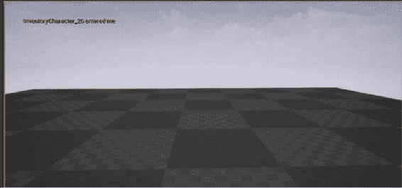
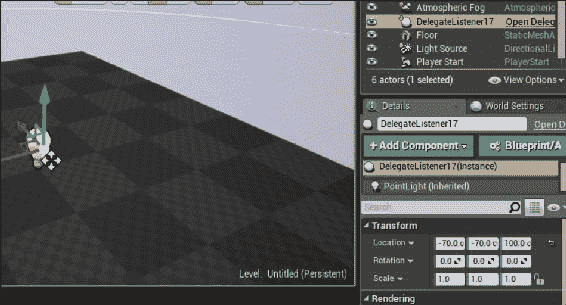
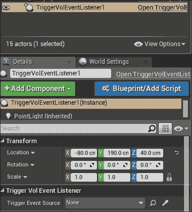
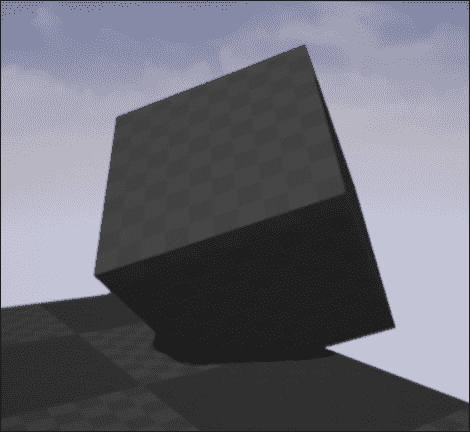

# 五、处理事件和委托

虚幻使用事件以有效的方式通知类有关游戏世界中发生的事情。事件和委托对于确保可以以最小化类耦合的方式发出这些通知非常有用，并且允许任意类订阅以进行通知。

我们将在本章介绍以下食谱:

*   处理通过虚拟函数实现的事件
*   创建绑定到 UFUNCTION 的委托
*   取消注册委托
*   创建接受输入参数的委托
*   通过委托绑定传递有效负载数据
*   创建多播委托
*   创建自定义事件
*   创建一天中的时间处理程序
*   为第一人称射击游戏创建重生拾音器

# 处理通过虚拟函数实现的事件

Unreal 提供的一些`Actor`和`Component`类包括虚函数形式的事件处理程序。这个配方将向您展示如何通过覆盖所讨论的虚拟函数来定制这些处理程序。

## 怎么做...

1.  在编辑器中创建一个空的`Actor`。称之为`MyTriggerVolume`。
2.  在类头中添加以下代码:

    ```cpp
    UPROPERTY()
    UBoxComponent* TriggerZone;

    UFUNCTION()
    virtual void NotifyActorBeginOverlap(AActor* OtherActor) override;
    UFUNCTION()
    virtual void NotifyActorEndOverlap(AActor* OtherActor) override;
    ```

3.  将上述函数的实现添加到 cpp 文件中:

    ```cpp
    void AMyTriggerVolume::NotifyActorBeginOverlap(AActor* OtherActor)
    {
      GEngine->AddOnScreenDebugMessage(-1, 1, FColor::Red, FString::Printf(TEXT("%s entered me"),*(OtherActor->GetName())));
    }

    void AMyTriggerVolume::NotifyActorEndOverlap(AActor* OtherActor)
    {
      GEngine->AddOnScreenDebugMessage(-1, 1, FColor::Red, FString::Printf(TEXT("%s left me"), *(OtherActor->GetName())));
    }
    ```

4.  Compile your project, and place an instance of `MyTriggerActor` into the level. Verify that overlap/touch events are handled by walking into the volume, and seeing the output printed to the screen:

    

## 它是如何工作的...

1.  像一样，我们首先声明一个`UPROPERTY`来保存对我们的组件子对象的引用。然后我们创建两个`UFUNCTION`声明。这些标记为`virtual`和`override`，以便编译器理解我们要替换父实现，并且可以依次替换我们的函数实现。
2.  在函数的实现中，我们使用`FString::printf`从一些预设文本中创建一个`FString`，并替换一些数据参数。
3.  请注意，`FString``OtherActor->GetName()`返回，并在传递到`FString::Format`之前使用`*`运算符取消引用。不这样做会导致错误。
4.  然后将此`FString`传递给全局引擎函数`AddOnScreenDebugMessage`。
5.  `-1`的第一个参数告诉引擎允许重复字符串，第二个参数是消息应该显示的时间长度 (以秒为单位)，第三个参数是颜色，第四个参数是实际打印本身的字符串。
6.  现在，当我们的 actor 的一个组件与其他内容重叠时，它的`UpdateOverlaps`函数将调用`NotifyActorBeginOverlap`，而虚拟函数调度将调用我们的自定义实现。

# 创建绑定到 UFUNCTION 的委托

委托允许我们在不知道分配了哪个函数的情况下调用函数。它们是原始函数指针的更安全版本。此配方向您展示了如何将关联到委托，以便在执行委托时调用它。

## 准备就绪

确保您已遵循先前的配方以创建`TriggerVolume`类。

## 怎么做...

1.  在我们的`GameMode`标头中，在类声明之前，使用以下宏声明委托:

    ```cpp
    DECLARE_DELEGATE(FStandardDelegateSignature)
    UCLASS()
    class UE4COOKBOOK_API AUE4CookbookGameMode : public AGameMode
    ```

2.  将新成员添加到我们的游戏模式:

    ```cpp
    FStandardDelegateSignature MyStandardDelegate;
    ```

3.  创建一个名为`DelegateListener`的新的`Actor`类。在该类的声明中添加以下内容:

    ```cpp
    UFUNCTION()
    void EnableLight();

    UPROPERTY()
    UPointLightComponent* PointLight;
    ```

4.  在类实现中，将其添加到构造函数中:

    ```cpp
    PointLight = CreateDefaultSubobject<UPointLightComponent>("PointLight");
    RootComponent = PointLight;
    PointLight->SetVisibility(false);
    ```

5.  在`DelegateListener.cpp`文件中，在您的项目的`include`文件和`DelegateListener`头包含之间添加`#include "UE4CookbookGameMode.h"`。在`DelegateListener::BeginPlay`实现中，添加以下内容:

    ```cpp
    Super::BeginPlay();
    if (TheWorld != nullptr)
    {
      AGameMode* GameMode = UGameplayStatics::GetGameMode(TheWorld);
      AUE4CookbookGameMode * MyGameMode = Cast<AUE4CookbookGameMode>(GameMode);
      if (MyGameMode != nullptr)
      {
        MyGameMode->MyStandardDelegate.BindUObject(this, &ADelegateListener::EnableLight);
      }
    }
    ```

6.  最后，实施`EnableLight`:

    ```cpp
    void ADelegateListener::EnableLight()
    {
      PointLight->SetVisibility(true);
    }
    ```

7.  在我们的 TriggerVolume 的`NotifyActorBeginOverlap`函数中放入以下代码:

    ```cpp
    UWorld* TheWorld = GetWorld();
    if (TheWorld != nullptr)
    {
      AGameMode* GameMode = UGameplayStatics::GetGameMode(TheWorld);
      AUE4CookbookGameMode * MyGameMode = Cast<AUE4CookbookGameMode>(GameMode);
      MyGameMode->MyStandardDelegate.ExecuteIfBound();
    }
    ```

8.  请务必将`#include "UE4CookbookGameMode.h"`也添加到您的 CPP 文件中，以便编译器在使用它之前了解该类。
9.  Compile your game. Make sure that your game mode is set in the current level (refer to the *Instantiating an Actor using SpawnActor* recipe in [Chapter 4](04.html#1KEEU1-c0ca69a0411046888a488e5085138121 "Chapter 4\. Actors and Components"), *Actors and Components* if you don't know how), and drag a copy of your TriggerVolume out into the level. Also, drag a copy of `DelegateListener` out into the level, and place it about 100 units above a flat surface:

    

10.  When you hit **Play**, and walk into the area covered by the Trigger volume, you should see the `PointLight` component, which we added to `DelegateListener`, turn on:

    

## 它是如何工作的...

1.  在我们的`GameMode`头中，我们声明一种不采用任何参数的委托类型，称为`FTriggerHitSignature`。
2.  然后，我们创建委托的实例作为我们的`GameMode`类的成员。
3.  我们在`DelegateListener`内部添加了一个`PointLight`组件，以便我们可以直观地表示正在执行的委托。
4.  在构造函数中，我们初始化我们的`PointLight`，然后禁用它。
5.  我们覆盖`BeginPlay`。我们首先调用父类的实现`BeginPlay()`。然后我们得到游戏世界，使用`GetGameMode()`检索`GameMode`类。
6.  将生成的`AGameMode*`投射到我们的`GameMode`类的指针需要使用`Cast`模板函数。
7.  然后，我们可以访问`GameMode`的委托实例成员，并将我们的`EnableLight`函数绑定到委托，因此在执行委托时将调用它。
8.  在这种情况下，我们绑定到`UFUNCTION` ()，所以我们使用`BindUObject`。如果我们想绑定到一个普通的 C 类函数，我们会使用`BindRaw`。如果要绑定到静态函数，我们将使用`BindStatic()`。
9.  当`TriggerVolume`与播放器重叠时，它会检索`GameMode`，然后在委托上调用`ExecuteIfBound`。
10.  `ExecuteIfBound`检查是否有一个绑定到委托的函数，然后为我们调用它。
11.  当委托对象调用时，`EnableLight`函数启用`PointLight`组件。

## 另见

*   下一节，*取消注册委托，*向您展示了如何在调用委托之前销毁`Listener`的情况下安全地取消注册委托绑定

# 取消注册委托

有时，删除委托绑定是必要的。这就像将函数指针设置为`nullptr`，使其不再引用已被删除的对象。

## 准备就绪

您需要遵循以前的食谱，以便有一个要取消注册的委托。

## 怎么做...

1.  在`DelegateListener`中，添加以下重写函数声明:

    ```cpp
    UFUNCTION()
    virtual void EndPlay(constEEndPlayReason::Type EndPlayReason) override;
    ```

2.  实现这样的功能:

    ```cpp
    void ADelegateListener::EndPlay(constEEndPlayReason::Type EndPlayReason)
    {
      Super::EndPlay(EndPlayReason);
      UWorld* TheWorld = GetWorld();
      if (TheWorld != nullptr)
      {
        AGameMode* GameMode = UGameplayStatics::GetGameMode(TheWorld);
        AUE4CookbookGameMode * MyGameMode = Cast<AUE4CookbookGameMode>(GameMode);
        if (MyGameMode != nullptr)
        {
          MyGameMode->MyStandardDelegate.Unbind();
        }
      }
    }
    ```

## 它是如何工作的...

1.  此食谱结合了本章迄今为止的两种食谱。我们覆盖`EndPlay`，这是一个实现为一个虚拟函数的事件，这样我们就可以在我们的`DelegateListener`离开 play 时执行代码。
2.  在该重写的实现中，我们在委托上调用`Unbind()`方法，该方法将成员函数与`DelegateListener`实例解除链接。
3.  如果不这样做，委托就像指针一样悬挂，当`DelegateListener`离开游戏时，它处于无效状态。

# 创建接受输入参数的委托

到目前为止，我们使用的委托还没有使用任何输入参数。此配方向您展示了如何更改委托的签名，以便它接受一些输入。

## 准备就绪

请确保您已遵循本章开头的配方，该配方向您展示了如何创建`TriggerVolume`以及此配方所需的其他基础结构。

## 怎么做...

1.  将新的委托声明添加到`GameMode`:

    ```cpp
    DECLARE_DELEGATE_OneParam(FParamDelegateSignature, FLinearColor)
    ```

2.  将新成员添加到`GameMode`:

    ```cpp
    FParamDelegateSignatureMyParameterDelegate;
    ```

3.  创建一个名为`ParamDelegateListener`的新的`Actor`类。在声明中添加以下内容:

    ```cpp
    UFUNCTION()
    void SetLightColor(FLinearColorLightColor);
    UPROPERTY()
    UPointLightComponent* PointLight;
    ```

4.  在类实现中，将其添加到构造函数中:

    ```cpp
    PointLight = CreateDefaultSubobject<UPointLightComponent>("PointLight");
    RootComponent = PointLight;
    ```

5.  在`ParamDelegateListener.cpp`文件中，在您的项目的`include`文件和`ParamDelegateListener`头包含之间添加`#include "UE4CookbookGameMode.h"`。在`ParamDelegateListener::BeginPlay`实现中，添加以下内容:

    ```cpp
    Super::BeginPlay();
    UWorld* TheWorld = GetWorld();
    if (TheWorld != nullptr)
    {
      AGameMode* GameMode = UGameplayStatics::GetGameMode(TheWorld);
      AUE4CookbookGameMode * MyGameMode = Cast<AUE4CookbookGameMode>(GameMode);
      if (MyGameMode != nullptr)
      {
        MyGameMode->MyParameterDelegate.BindUObject(this, &AParamDelegateListener::SetLightColor);
      }
    }
    ```

6.  最后，实施`SetLightColor`:

    ```cpp
    void AParamDelegateListener::SetLightColor(FLinearColorLightColor)
    {
      PointLight->SetLightColor(LightColor);
    }
    ```

7.  在我们的`TriggerVolume`内部，在`NotifyActorBeginOverlap`中，在调用后添加以下行到`MyStandardDelegate.ExecuteIfBound`:

    ```cpp
    MyGameMode->MyParameterDelegate.ExecuteIfBound(FLinearColor(1, 0, 0, 1));
    ```

## 它是如何工作的...

1.  我们新的委托签名使用稍微不同的宏进行声明。注意`DECLARE_DELEGATE_OneParam`末尾的`_OneParam`后缀。如您所料，我们还需要指定参数的类型。
2.  就像我们创建一个没有参数的委托一样，我们需要创建一个委托的实例作为我们的`GameMode`类的成员。
3.  我们现在创建一个新类型的`DelegateListener`，它期望将一个参数传递到它绑定到委托的函数中。
4.  当我们调用委托的`ExecuteIfBound()`方法时，我们现在需要传入将要插入到函数参数中的值。
5.  在我们绑定的函数中，我们使用参数来设置光的颜色。
6.  这意味着`TriggerVolume`不需要了解任何关于`ParamDelegateListener`的信息就可以调用它上的函数。委托使我们能够最大程度地减少两个类之间的耦合。

## 另见

*   *取消注册委托*配方向您展示了如何在调用委托之前监听器被破坏的情况下安全地取消注册委托绑定

# 通过委托绑定传递有效负载数据

只有最小的更改，参数可以在创建时传递给委托。此配方向您展示了如何指定始终作为参数传递给委托调用的数据。创建绑定时会计算数据，并且不会从该点开始更改。

## 准备就绪

确保你遵循了之前的食谱。我们将扩展先前配方的功能，以将其他创建时间参数传递给我们的绑定委托函数。

## 怎么做...

1.  在您的`AParamDelegateListener::BeginPlay`函数中，将对`BindUObject`的调用更改为以下内容:

    ```cpp
    MyGameMode->MyParameterDelegate.BindUObject(this, &AParamDelegateListener::SetLightColor, false);
    ```

2.  将`SetLightColor`的声明改为:

    ```cpp
    void SetLightColor(FLinearColorLightColor, bool EnableLight);
    ```

3.  修改`SetLightColor`的实现如下:

    ```cpp
    void AParamDelegateListener::SetLightColor(FLinearColorLightColor, bool EnableLight)
    {
      PointLight->SetLightColor(LightColor);
      PointLight->SetVisibility(EnableLight);
    }
    ```

4.  编译并运行您的项目。验证当您走进`TriggerVolume`时，由于绑定函数时传入的 false payload 参数，灯会关闭。

## 它是如何工作的...

1.  当我们将函数绑定到委托时，我们会指定一些额外的数据 (在本例中，值为`false`的布尔值)。您可以以这种方式传递多达四个 “payload” 变量。在您使用的`DECLARE_DELEGATE_*`宏中声明的任何参数之后，它们将应用于您的函数。
2.  我们更改委托的函数签名，以便它可以接受额外的参数。
3.  在函数内部，我们使用额外的参数来打开或关闭灯，具体取决于编译时的值是真还是假。
4.  我们不需要把调用改成`ExecuteIfBound` -- 委托系统自动应用委托参数，通过`ExecuteIfBound`传入，先然后，它将应用任何有效负载参数，这些参数始终在调用`BindUObject`中的函数引用之后指定。

## 另见

*   配方*取消注册委托*向您展示了如何在调用委托之前监听器被破坏的情况下安全地取消注册委托绑定

# 创建多播委托

到目前为止，本章中使用的标准委托本质上是一个函数指针-它们允许您在一个特定的对象实例上调用一个特定的函数。组播委托是函数指针的集合，每个可能在不同的对象上，当委托是**广播**时，所有这些都将被调用。

## 准备就绪

此配方假设您已遵循本章中的初始配方，因为它向您展示了如何创建用于广播多播委托的`TriggerVolume`。

## 怎么做...

1.  在`GameMode`头添加新的委托声明:

    ```cpp
    DECLARE_MULTICAST_DELEGATE(FMulticastDelegateSignature)
    ```

2.  创建一个名为`MulticastDelegateListener`的新的`Actor`类。在声明中添加以下内容:

    ```cpp
    UFUNCTION()
    void ToggleLight();
    UFUNCTION()
    virtual void EndPlay(constEEndPlayReason::Type EndPlayReason) override;

    UPROPERTY()
    UPointLightComponent* PointLight;

    FDelegateHandleMyDelegateHandle;
    ```

3.  在类实现中，将其添加到构造函数中:

    ```cpp
    PointLight = CreateDefaultSubobject<UPointLightComponent>("PointLight");
    RootComponent = PointLight;
    ```

4.  在`MulticastDelegateListener.cpp`文件中，在您的项目的`include`文件和`MulticastDelegateListener`头包含之间添加`#include "UE4CookbookGameMode.h"`。在`MulticastDelegateListener::BeginPlay`实现中，添加以下内容:

    ```cpp
    Super::BeginPlay();
    UWorld* TheWorld = GetWorld();
    if (TheWorld != nullptr)
    {
      AGameMode* GameMode = UGameplayStatics::GetGameMode(TheWorld);
      AUE4CookbookGameMode * MyGameMode = Cast<AUE4CookbookGameMode>(GameMode);
      if (MyGameMode != nullptr)
      {
        MyDelegateHandle  = MyGameMode->MyMulticastDelegate.AddUObject(this, &AMulticastDelegateListener::ToggleLight);
      }
    }
    ```

5.  实施`ToggleLight`:

    ```cpp
    void AMulticastDelegateListener::ToggleLight()
    {
      PointLight->ToggleVisibility();
    }
    ```

6.  实现我们的`EndPlay`重写函数:

    ```cpp
    void AMulticastDelegateListener::EndPlay(constEEndPlayReason::Type EndPlayReason)
    {
      Super::EndPlay(EndPlayReason);
      UWorld* TheWorld = GetWorld();
      if (TheWorld != nullptr)
      {
        AGameMode* GameMode = UGameplayStatics::GetGameMode(TheWorld);
        AUE4CookbookGameMode * MyGameMode = Cast<AUE4CookbookGameMode>(GameMode);
        if (MyGameMode != nullptr)
        {
          MyGameMode->MyMulticastDelegate.Remove(MyDelegateHandle);
        }
      }
    }
    ```

7.  将以下行添加到`TriggerVolume::NotifyActorBeginOverlap()`:

    ```cpp
    MyGameMode->MyMulticastDelegate.Broadcast();
    ```

8.  编译并加载您的项目。将您的关卡中的`GameMode`设置为我们的食谱游戏模式，然后将`MulticastDelegateListener`的四个或五个实例拖入场景。
9.  进入`TriggerVolume`查看所有`MulticastDelegateListener`切换其光线的可见性。

## 它是如何工作的...

1.  如您所料，委托类型需要明确声明为多播委托，而不是标准的单绑定委托。
2.  我们新的`Listener`类与我们原来的`DelegateListener`非常相似。主要区别在于，我们需要在`FDelegateHandle`中存储对委托实例的引用。
3.  当 actor 被销毁时，我们通过使用存储的`FDelegateHandle`作为参数来安全地将自己从绑定到委托的函数列表中删除。
4.  `Broadcast()`函数相当于`ExecuteIfBound()`的组播。与标准委托不同，不需要检查委托是否事先绑定，或者与`ExecuteIfBound`这样的调用绑定。`Broadcast()`无论绑定了多少个函数，或者即使没有一个函数，都可以安全运行。
5.  当我们在场景中有多个多播监听器实例时，它们各自使用在`GameMode`中实现的多播委托进行注册。
6.  然后，当`TriggerVolume`与播放器重叠时，它会广播委托，并通知每个侦听器，使他们切换其关联点灯的可见性。
7.  多播委托可以采用与标准委托完全相同的方式来使用参数。

# 创建自定义事件

自定义委托非常有用，但是它们的局限性之一是它们可以由其他第三方类进行外部广播，也就是说，它们的执行/广播方法可以公开访问。

有时，您可能需要一个可由其他类外部分配的委托，但只能由包含它们的类广播。这是事件的主要目的。

## 准备就绪

确保您已遵循本章中的初始配方，以便具有`MyTriggerVolume`和`CookBookGameMode`实现。

## 怎么做...

1.  将以下事件声明宏添加到您的`MyTriggerVolume`类的标头中:

    ```cpp
    DECLARE_EVENT(AMyTriggerVolume, FPlayerEntered)
    ```

2.  将声明的事件签名的实例添加到类:

    ```cpp
    FPlayerEnteredOnPlayerEntered;
    ```

3.  在`AMyTriggerVolume::NotifyActorBeginOverlap`中，添加这个:

    ```cpp
    OnPlayerEntered.Broadcast();
    ```

4.  创建一个新的`Actor`类，称为`TriggerVolEventListener`。
5.  在其声明中添加以下类成员:

    ```cpp
    UPROPERTY()
    UPointLightComponent* PointLight;

    UPROPERTY(EditAnywhere)
    AMyTriggerVolume* TriggerEventSource;
    UFUNCTION()
    void OnTriggerEvent();
    ```

6.  在类构造函数中初始化`PointLight`:

    ```cpp
    PointLight = CreateDefaultSubobject<UPointLightComponent>("PointLight");
    RootComponent = PointLight;
    ```

7.  在`BeginPlay`内，添加以下内容:

    ```cpp
    if (TriggerEventSource != nullptr)
    {
      TriggerEventSource->OnPlayerEntered.AddUObject(this, &ATriggerVolEventListener::OnTriggerEvent);
    }
    ```

8.  最后，实施`OnTriggerEvent()`:

    ```cpp
    void ATriggerVolEventListener::OnTriggerEvent()
    {
      PointLight->SetLightColor(FLinearColor(0, 1, 0, 1));
    }
    ```

9.  编译你的项目，并启动编辑器。创建一个游戏模式设置为我们的`UE4CookbookGameMode`的关卡，然后将`ATriggerVolEventListener`和`AMyTriggerVolume`的实例拖入关卡。
10.  Select `TriggerVolEventListener`, and you'll see `TriggerVolEventListener` listed as a category in the **Details** panel, with the property **Trigger Event Source**:

    

11.  Use the drop-down menu to select your instance of `AMyTriggerVolume` so that the Listener knows which event to bind to:

    

12.  玩你的游戏，并进入触发卷的效果区域。验证您的`EventListener`的颜色是否变为绿色。

## 它是如何工作的...

1.  与所有其他类型的委托一样，事件需要它们自己特殊的宏功能。
2.  第一个参数是事件将实现到的类。这将是唯一能够调用`Broadcast()`的类，所以确保它是正确的。
3.  第二个参数是我们新的事件函数签名的类型名称。
4.  我们将这种类型的实例添加到我们的类中。虚幻文档建议`On<x>`作为命名约定。
5.  当某些内容与我们的`TriggerVolume`重叠时，我们会在自己的事件实例上调用广播。
6.  在新类中，我们创建点灯作为被触发事件的视觉表示。
7.  我们还创建了一个指向`TriggerVolume`的指针，以收听来自的事件。我们将`UPROPERTY`标记为`EditAnywhere`，因为这允许我们在编辑器中设置它，而不必使用`GetAllActorsOfClass`或其他方式以编程方式获取引用。
8.  最后是当某物进入`TriggerVolume`时的事件处理程序。
9.  我们像往常一样在构造函数中创建和初始化我们的点灯。
10.  当游戏开始时，监听器检查我们的`TriggerVolume`引用是否有效，然后将我们的`OnTriggerEvent`函数绑定到`TriggerVolume`事件。
11.  在`OnTriggerEvent`内部，我们将光的颜色更改为绿色。
12.  当某物进入`TriggerVolume`时，它会导致`TriggerVolume`在自己的事件上呼叫广播。然后，我们的`TriggerVolEventListener`调用了它的绑定方法，改变了我们的光的颜色。

# 创建一天中的时间处理程序

这个食谱向您展示如何使用以前的食谱中介绍的概念来创建一个演员，告知其他演员游戏中的时间流逝。

## 怎么做...

1.  创建一个名为`TimeOfDayHandler`的新的`Actor`类。
2.  在标头中添加多播委托声明:

    ```cpp
    DECLARE_MULTICAST_DELEGATE_TwoParams(FOnTimeChangedSignature, int32, int32)
    ```

3.  将我们委托的实例添加到类声明中:

    ```cpp
    FOnTimeChangedSignatureOnTimeChanged;
    ```

4.  向类添加以下属性:

    ```cpp
    UPROPERTY()
    int32 TimeScale;

    UPROPERTY()
    int32 Hours;
    UPROPERTY()
    int32 Minutes;

    UPROPERTY()
    float ElapsedSeconds;
    ```

5.  将这些属性的初始化添加到构造函数中:

    ```cpp
    TimeScale = 60;
    Hours = 0;
    Minutes = 0;
    ElapsedSeconds = 0;
    ```

6.  在`Tick`内部，添加以下代码:

    ```cpp
    ElapsedSeconds += (DeltaTime * TimeScale);
    if (ElapsedSeconds> 60)
    {
      ElapsedSeconds -= 60;
      Minutes++ ;
      if (Minutes > 60)
      {
        Minutes -= 60;
        Hours++ ;
      }

      OnTimeChanged.Broadcast(Hours, Minutes);
    }
    ```

7.  创建一个名为`Clock`的新的`Actor`类。
8.  将以下属性添加到类标题中:

    ```cpp
    UPROPERTY()
    USceneComponent* RootSceneComponent;

    UPROPERTY()
    UStaticMeshComponent* ClockFace;
    UPROPERTY()
    USceneComponent* HourHandle;
    UPROPERTY()
    UStaticMeshComponent* HourHand;
    UPROPERTY()
    USceneComponent* MinuteHandle;
    UPROPERTY()
    UStaticMeshComponent* MinuteHand;

    UFUNCTION()
    void TimeChanged(int32 Hours, int32 Minutes);
    FDelegateHandleMyDelegateHandle;
    ```

9.  初始化和转换构造函数中的组件:

    ```cpp
    RootSceneComponent = CreateDefaultSubobject<USceneComponent>("RootSceneComponent");
    ClockFace = CreateDefaultSubobject<UStaticMeshComponent>("ClockFace");
    HourHand = CreateDefaultSubobject<UStaticMeshComponent>("HourHand");
    MinuteHand = CreateDefaultSubobject<UStaticMeshComponent>("MinuteHand");
    HourHandle = CreateDefaultSubobject<USceneComponent>("HourHandle");
    MinuteHandle = CreateDefaultSubobject<USceneComponent>("MinuteHandle");
    auto MeshAsset = ConstructorHelpers::FObjectFinder<UStaticMesh>(TEXT("StaticMesh'/Engine/BasicShapes/Cylinder.Cylinder'"));
    if (MeshAsset.Object != nullptr)
    {
      ClockFace->SetStaticMesh(MeshAsset.Object);
      HourHand->SetStaticMesh(MeshAsset.Object);
      MinuteHand->SetStaticMesh(MeshAsset.Object);
    }
    RootComponent = RootSceneComponent;
    HourHand->AttachTo(HourHandle);
    MinuteHand->AttachTo(MinuteHandle);
    HourHandle->AttachTo(RootSceneComponent);
    MinuteHandle->AttachTo(RootSceneComponent);
    ClockFace->AttachTo(RootSceneComponent);
    ClockFace->SetRelativeTransform(FTransform(FRotator(90, 0, 0), FVector(10, 0, 0), FVector(2, 2, 0.1)));
    HourHand->SetRelativeTransform(FTransform(FRotator(0, 0, 0), FVector(0, 0, 25), FVector(0.1, 0.1, 0.5)));
    MinuteHand->SetRelativeTransform(FTransform(FRotator(0, 0, 0), FVector(0, 0, 50), FVector(0.1, 0.1, 1)));
    ```

10.  将下面的添加到`BeginPlay`:

    ```cpp
    TArray<AActor*>TimeOfDayHandlers;
    UGameplayStatics::GetAllActorsOfClass(GetWorld(), ATimeOfDayHandler::StaticClass(), TimeOfDayHandlers);
    if (TimeOfDayHandlers.Num() != 0)
    {
      auto TimeOfDayHandler = Cast<ATimeOfDayHandler>(TimeOfDayHandlers[0]);
      MyDelegateHandle = TimeOfDayHandler->OnTimeChanged.AddUObject(this, &AClock::TimeChanged);
    }
    ```

11.  最后，将`TimeChanged`实现为您的事件处理程序。

    ```cpp
    void AClock::TimeChanged(int32 Hours, int32 Minutes)
    {
      HourHandle->SetRelativeRotation(FRotator( 0, 0,30 * Hours));
      MinuteHandle->SetRelativeRotation(FRotator(0,0,6 * Minutes));
    }
    ```

12.  Place an instance of `TimeOfDayHandler` and the `AClock` into your level, and play to see that the hands on the clock are rotating:

    

## 它是如何工作的...

1.  `TimeOfDayHandler`包含一个包含两个参数的委托，因此使用宏的`TwoParams`变体。
2.  我们的类包含用于存储小时、分钟和秒的变量，以及`TimeScale`，它是用于加快测试时间的加速因子。
3.  在处理程序的`Tick`函数中，我们根据自最后一帧以来经过的时间累积经过的秒数。
4.  我们检查过去的秒数是否超过 60。如果是这样，我们减去 60，然后递增`Minutes`。
5.  同样，对于`Minutes`-如果它们超过 60，我们减去 60，然后递增`Hours`。
6.  如果更新了`Minutes`和`Hours`，我们就会广播我们的委托，让任何订阅了委托的对象知道时间已经改变。
7.  `Clock`演员使用一系列场景组件和静态网格来构建类似于钟面的网格层次结构。
8.  在`Clock`构造函数中，我们将层次结构中的组件作为父级，并设置它们的初始比例和旋转。
9.  在`BeginPlay`中，时钟使用`GetAllActorsOfClass()`来获取 level 中的所有`time of day`处理程序。
10.  如果级别中至少有一个`TimeOfDayHandler`，则`Clock`访问第一个，并订阅其`TimeChanged`事件。
11.  当`TimeChanged`事件触发时，时钟会根据当前时间的小时和分钟旋转时针和分针。

# 为第一人称射击游戏创建重生拾音器

此配方向您展示了如何创建一个可放置的拾音器，该拾音器将在一定时间后重生，适合作为 FPS 的弹药或其他拾音器。

## 怎么做...

1.  创建一个名为`Pickup`的新的`Actor`类。
2.  在`Pickup.h`中声明以下委托类型:

    ```cpp
    DECLARE_DELEGATE(FPickedupEventSignature)
    ```

3.  在类头中添加以下属性:

    ```cpp
    virtual void NotifyActorBeginOverlap(AActor* OtherActor) override;
    UPROPERTY()
    UStaticMeshComponent* MyMesh;

    UPROPERTY()
    URotatingMovementComponent* RotatingComponent;

    FPickedupEventSignatureOnPickedUp;
    ```

4.  在构造函数中添加以下代码:

    ```cpp
    MyMesh = CreateDefaultSubobject<UStaticMeshComponent>("MyMesh");
    RotatingComponent = CreateDefaultSubobject<URotatingMovementComponent>("RotatingComponent");
    RootComponent = MyMesh;
    auto MeshAsset = ConstructorHelpers::FObjectFinder<UStaticMesh>(TEXT("StaticMesh'/Engine/BasicShapes/Cube.Cube'"));
    if (MeshAsset.Object != nullptr)
    {
      MyMesh->SetStaticMesh(MeshAsset.Object);
    }
    MyMesh->SetCollisionProfileName(TEXT("OverlapAllDynamic"));
    RotatingComponent->RotationRate = FRotator(10, 0, 10);
    ```

5.  实施重写的`NotifyActorBeginOverlap`:

    ```cpp
    void APickup::NotifyActorBeginOverlap(AActor* OtherActor)
    {
      OnPickedUp.ExecuteIfBound();
    }
    ```

6.  创建第二个`Actor`类，称为`PickupSpawner`。
7.  在类头中添加以下内容:

    ```cpp
    UPROPERTY()
    USceneComponent* SpawnLocation;

    UFUNCTION()
    void PickupCollected();
    UFUNCTION()
    void SpawnPickup();
    UPROPERTY()
    APickup* CurrentPickup;
    FTimerHandleMyTimer;
    ```

8.  将`Pickup.h`添加到`PickupSpawner`实现文件中的包含中。
9.  在构造函数中初始化我们的根组件:

    ```cpp
    SpawnLocation = CreateDefaultSubobject<USceneComponent>("SpawnLocation");
    ```

10.  当游戏开始于`BeginPlay`中的`SpawnPickup`功能时生成拾音器:

    ```cpp
    SpawnPickup();
    ```

11.  实施`PickupCollected`:

    ```cpp
    void APickupSpawner::PickupCollected()
    {
      GetWorld()->GetTimerManager().SetTimer(MyTimer, this, &APickupSpawner::SpawnPickup, 10, false);
      CurrentPickup->OnPickedUp.Unbind();
      CurrentPickup->Destroy();
    }
    ```

12.  为`SpawnPickup`创建以下代码:

    ```cpp
    void APickupSpawner::SpawnPickup()
    {
      UWorld* MyWorld = GetWorld();
      if (MyWorld != nullptr){
        CurrentPickup = MyWorld->SpawnActor<APickup>(APickup::StaticClass(), GetTransform());
        CurrentPickup->OnPickedUp.BindUObject(this, &APickupSpawner::PickupCollected);
      }
    }
    ```

13.  Compile and launch the editor, then drag an instance of `PickupSpawner` out into the level. Walk into the pickup represented by the spinning cube, and verify that it spawns again 10 seconds later:

    

## 它是如何工作的...

1.  像往常一样，我们需要在我们的`Pickup`中创建一个委托，我们的产卵者可以订阅该委托，以便它知道玩家何时收集皮卡。
2.  `Pickup`还包含一个静态网格作为视觉表示，以及一个`RotatingMovementComponent`，这样网格将以吸引玩家注意力的方式旋转。
3.  在`Pickup`构造函数中，我们加载引擎的内置网格之一作为我们的视觉表示。
4.  我们指定网格将与其他对象重叠，然后在*X*和*Z*轴中将网格的旋转速率设置为每秒 10 个单位。
5.  当玩家与`Pickup`重叠时，它会从第一步开始触发其`PickedUp`委托。
6.  `PickupSpawner`有一个场景组件来指定在哪里生成拾取演员。它具有这样做的功能，以及对当前生成的`Pickup`的`UPROPERTY`标记的引用。
7.  在`PickupSpawner`构造函数中，我们一如既往地初始化我们的组件。
8.  游戏开始时，产卵器运行其`SpawnPickup`功能。
9.  这个函数生成我们的`Pickup`的一个实例，然后将`APickupSpawner::PickupCollected`绑定到新实例上的`OnPickedUp`函数。它还存储对该当前实例的引用。
10.  当玩家与 `Pickup` 重叠后运行`PickupCollected`时，将创建一个计时器以在 10 秒后重新生成拾音器。
11.  删除与收集的拾取器的现有委托绑定，然后将拾取器销毁。
12.  10 秒后，计时器触发，再次运行`SpawnActor`，这将创建一个新的`Pickup`。