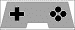
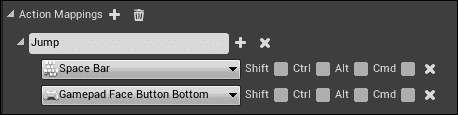
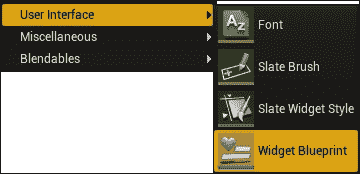
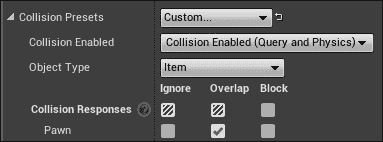
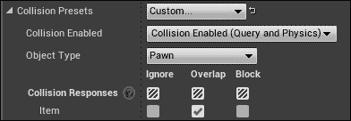
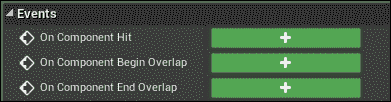

# 第六章。输入和碰撞

本章涵盖了围绕游戏控制输入 (键盘，鼠标和游戏手柄) 以及与障碍物碰撞的食谱。

本章将介绍以下食谱:

*   Axis Mappings-FPS 字符的键盘、鼠标和游戏手柄方向输入
*   轴映射-归一化输入
*   动作映射-FPS 字符的一键响应
*   从 C 添加轴和动作映射
*   鼠标 UI 输入处理
*   UMG 键盘 UI 快捷键
*   碰撞-使用忽略让对象彼此通过
*   碰撞-使用重叠拾取物体
*   使用块防止碰撞互穿

# 简介

良好的输入控制在你的游戏中是极其重要的。提供所有键盘，鼠标，尤其是游戏手柄输入将使您的游戏对用户而言更加可口。

### 提示

您可以在 Windows PC 上使用 Xbox 360 和 PlayStation 控制器-它们具有 USB 输入。检查您当地的电子商店的 USB 游戏控制器，以找到一些好的。您也可以将无线控制器与连接到 PC 的游戏控制器无线接收器适配器一起使用。

# 轴映射-FPS 字符的键盘、鼠标和游戏手柄方向输入

输入映射有两种类型: **轴映射**和**动作映射**。轴映射是您长时间按住以获得其效果的输入 (例如，按住*W*键以向前移动播放器)，而动作映射是一次性输入 (如按下游戏手柄上的*一个*键使玩家跳转)。在本食谱中，我们将介绍如何设置键盘，鼠标和游戏手柄轴映射的输入控件以移动 FPS 字符。

## 准备就绪

你必须有一个 UE4 项目，里面有一个主要角色玩家，还有一个地面平面要继续走，准备这个食谱。

## 怎么做...

1.  创建一个 C 类，`Warrior`，派生自`Character`:

    ```cpp
    UCLASS()
    class CH6_API AWarrior : public ACharacter
    {
      GENERATED_BODY()
    };
    ```

2.  启动 UE4，并根据您的`Warrior`类导出蓝图`BP_Warrior`。
3.  为您的`GameMode`类创建并选择新的蓝图，如下所示:
    1.  转到**设置** | **项目设置** | **映射&模式**。
    2.  单击默认的**GameMode**下拉菜单旁边的**图标，这将创建`GameMode`类的新蓝图，以及您选择的名称 (例如`BP_GameMode`)。**
    ***   双击您创建的新的`BP_GameMode`蓝图类以对其进行编辑。**
***   打开您的`BP_GameMode`蓝图，并选择您的 Blueprinted`BP_Warrior`类作为默认`Pawn`类。*   要设置键盘的输入驱动播放器，请打开**设置** | **项目设置** | **输入**。在以下步骤中，我们将完成驱动玩家在游戏中前进的过程:
    1.  Click on the **+** icon beside the **Axis Mappings** heading.

        ### 提示

        **轴映射**支持连续 (按钮保持) 输入，而**动作映射**支持一次性事件。

    2.  为轴映射命名。第一个示例将显示如何向前移动玩家，因此将其命名为**forward**。
    3.  在**Forward**下方，选择一个要分配给这个轴映射的键盘键，如*W*。
    4.  单击**前进**旁边的**图标上的，选择一个游戏控制器输入，以映射玩家前进 (如游戏手柄左拇指向上)。**
    ***   完整的**轴映射**后，左，右与键盘，游戏手柄，和 (可选) 鼠标输入绑定每个。*****   从您的 C 代码中，重写`AWarrior`类的`SetupPlayerInputComponent`函数，如下所示:

    ```cpp
    void AWarrior::SetupPlayerInputComponent(UInputComponent* Input)
    {
      check(Input);
      Input->BindAxis( "Forward", this, &AWarrior::Forward );
    }
    ```

    *   在你的`AWarrior`类中提供一个`Forward`函数，如下所示:

    ```cpp
    void AWarrior::Forward( float amount )
    {
      if( Controller && amount )
      {
        // Moves the player forward by an amount in forward direction
        AddMovementInput(GetActorForwardVector(), amount );
      }
    }
    ```

    *   编写并完成其余输入方向的函数，`AWarrior::Back`、`AWarrior::Left`和`AWarrior::Right`。****

 ****## 它是如何工作的…

UE4 引擎允许直接将输入事件连接到 C 函数调用。 输入事件调用的函数是某些类的成员函数。在前面的示例中，我们将按下*W*键和按住游戏手柄的左拇指向上路由到`AWarrior::Forward`C 函数。调用`AWarrior::Forward`上的实例是路由控制器输入的实例。由在`GameMode`类中设置为玩家头像的对象控制。

## 另见

*   您可以在 UE4 编辑器中输入`Forward`输入轴绑定，而实际上可以将其从 C 中编码。我们将在后面的食谱中详细描述这一点，*添加来自 C*的轴和动作映射。

# 轴映射-归一化输入

如果你已经注意到，1.0 的输入右和 1.0 前进实际上将总计 2.0 个单位的速度。这意味着对角线移动的速度比纯粹向前、向后、向左或向右移动的速度更快。我们真正应该做的是切断任何导致速度超过 1.0 单位的输入值，同时保持指示的输入方向。我们可以通过存储先前的输入值并重写`::Tick()`函数来实现这一点。

## 准备就绪

打开一个项目，并建立一个`Character`派生类 (让我们称之为我们的`Warrior`)。

## 怎么做…

1.  重写`AWarrior::SetupPlayerInputComponent( UInputComponent* Input )`函数如下:

    ```cpp
    void AWarrior::SetupPlayerInputComponent( UInputComponent* Input )
    {
      Input->BindAxis( "Forward", this, &AWarrior::Forward );
      Input->BindAxis( "Back", this, &AWarrior::Back );
      Input->BindAxis( "Right", this, &AWarrior::Right );
      Input->BindAxis( "Left", this, &AWarrior::Left );
    }
    ```

2.  编写对应的`::Forward`、`::Back`、`::Right`和`::Left`函数如下:

    ```cpp
    void AWarrior::Forward( float amount ) {
      // We use a += of the amount added so that
      // when the other function modifying .Y
      // (::Back()) affects lastInput, it won't
      // overwrite with 0's
      lastInput.Y += amount;
    }
    void AWarrior::Back( float amount ) {
      lastInput.Y += -amount;
    }
    void AWarrior::Right( float amount ) {
      lastInput.X += amount;
    }
    void AWarrior::Left( float amount ) {
      lastInput.X += -amount;
    }
    ```

3.  在`AWarrior::Tick()`函数中，在归一化输入向量中的任何超大后修改输入值:

    ```cpp
    void AWarrior::Tick( float DeltaTime ) {
      Super::Tick( DeltaTime );
      if( Controller )
      {
        float len = lastInput.Size();
        if( len > 1.f )
          lastInput /= len;
        AddMovementInput(
        GetActorForwardVector(), lastInput.Y );
        AddMovementInput(GetActorRightVector(), lastInput.X);
        // Zero off last input values
        lastInput = FVector2D( 0.f, 0.f );
      }
    }
    ```

## 它是如何工作的...

当输入向量超过 1.0 的幅度时，我们将其归一化。这将最大输入速度限制为 1.0 个单位 (而不是例如，当全速和全速被按下时的 2.0 个单位)。

# 动作映射-FPS 字符的一个按钮响应

动作映射用于处理单按钮按下 (不是按下的按钮)。对于应该按住的按钮，请务必改用轴映射。

## 准备就绪

准备一个 UE4 项目，其中包含您需要完成的操作，例如`Jump`或`ShootGun`。

## 怎么做...

1.  打开**设置** | **项目设置** | **输入**。
2.  Go to the **Action Mappings** heading, and click on the **+** icon beside it.
    1.  开始输入应该映射到按钮推送的操作。例如，为第一个操作键入`Jump`。
    2.  选择要执行该操作的键，例如**空格键**。
    3.  如果您希望通过另一个按键触发相同的操作，请单击您的**动作映射**名称旁边的**，然后选择另一个键来触发该操作。**
    ***   如果您希望按住**Shift**、**Ctrl**、**Alt**或**Cmd**键进行操作，请务必在键选择框右侧的复选框中注明。** **]** 
***   要将您的操作链接到 C 代码函数，您需要覆盖`SetupPlayerInputComponent(UInputControl* control )`函数。在该函数中输入以下代码:

    ```cpp
    voidAWarrior::SetupPlayerInputComponent(UInputComponent* Input)
    {
      check(Input );
      // Connect the Jump action to the C++ Jump function
      Input->BindAction("Jump", IE_Pressed, this, &AWarrior::Jump );
    }
    ```** 

 **## 它是如何工作的…

**动作映射**是单键推送事件，触发 C 代码以响应它们运行。您可以在 UE4 编辑器中定义任意数量的操作，但是请确保将**操作映射**绑定到 C 中的实际键推送。

## 另见

*   您可以列出要从 C 代码映射的操作。请参见下面的配方，在*中添加轴和来自 C*的动作映射。

# 从 C 添加轴和动作映射

**轴映射**和**动作映射**可以通过 UE4 编辑器添加到您的游戏中，但我们也可以从 C 代码直接添加。由于无论如何，连接到 C 函数是从 C 代码，您可能会发现在 C 中定义轴和动作映射也很方便。

## 准备就绪

你需要一个 UE4 项目，你想添加一些轴和动作映射。如果要通过 C 代码添加，可以删除**设置** | **项目设置** | **输入**中列出的现有轴和动作映射。要添加自定义轴和动作映射，您需要了解两个 C 函数: `UPlayerInput::AddAxisMapping`和`UPlayerInput:: AddActionMapping`。这些是在`UPlayerInput`对象上可用的成员函数。`UPlayerInput`对象位于`PlayerController`对象内部，可通过以下代码访问:

```cpp
GetWorld()->GetFirstPlayerController()->PlayerInput
```

如果您不想单独访问播放器控制器，您也可以使用`UPlayerInput`的两个静态成员函数来创建轴和动作映射:

```cpp
UPlayerInput::AddEngineDefinedAxisMapping()
UPlayerInput::AddEngineDefinedActionMapping()
```

## 怎么做...

1.  要以开头，我们需要定义我们的`FInputAxisKeyMapping`或`FInputActionKeyMapping`对象，取决于您是挂接轴键映射 (用于按住输入的按钮) 还是动作键映射 (用于一次性事件-按下一次输入的按钮)。
    1.  对于 Axis 键映射，我们定义一个`FInputAxisKeyMapping`对象，如下所示:

        ```cpp
        FInputAxisKeyMapping backKey( "Back", EKeys::S, 1.f );
        ```

    2.  这将包括操作的字符串名称，要按下的键 (使用 EKeys`enum`)，以及是否*Shift*，*Ctrl*，*Alt*，或者应该举行*cmd* (Mac) 来触发事件。
    3.  对于动作键映射，定义`FInputActionKeyMapping`，如下所示:

        ```cpp
        FInputActionKeyMapping jump("Jump", EKeys::SpaceBar, 0, 0, 0, 0);
        ```

    4.  这将包括操作的字符串名称，要按下的键以及是否*Shift*，*Ctrl*，*Alt*，或者应该举行*cmd* (Mac) 来触发事件。
2.  In your player `Pawn` class `SetupPlayerInputComponent` function, register your axis and action key mappings to the following:
    1.  连接到特定控制器的`PlayerInput`对象:

        ```cpp
        GetWorld()->GetFirstPlayerController()->PlayerInput->AddAxisMapping( backKey ); // specific to a controller
        ```

    2.  或者，您可以直接注册到`UPlayerInput`对象的静态成员函数:

        ```cpp
        UPlayerInput::AddEngineDefinedActionMapping(jump );
        ```

    ### 提示

    确保您使用的是轴与动作映射的正确函数!

3.  使用 C 代码注册你的动作和轴到 C 函数的映射，就像前面两个配方中所示的那样，例如:

    ```cpp
    Input->BindAxis("Back", this, &AWarrior::Back);
    Input->BindAction("Jump", IE_Pressed, this, &AWarrior::Jump );
    ```

## 它是如何工作的…

action和轴映射注册功能允许您直接从 C 代码设置输入映射。C 编码的输入映射与在**设置** | **项目设置** | **输入**对话框中输入的映射基本相同。

# 鼠标 UI 输入处理

当使用**虚幻运动图形 (UMG)** 工具包时，您会发现鼠标事件非常容易处理。我们可以注册 C 函数，以便在鼠标单击或与 UMG 组件进行其他类型的交互后运行。

通常，事件注册将通过蓝图; 但是在这个食谱中，我们将概述如何编写和连接 C 函数到 UMG 事件。

## 准备就绪

在 UE4 项目中创建一个 UMG 画布。从那里，我们将为`OnClicked`、`OnPressed`和`OnReleased`事件注册事件处理程序。

## 怎么做...

1.  Right-click in your **Content Browser** (or click on **Add New**), and select **User Interface** | **Widget Blueprint**, as shown in the following screenshot. This will add an editable widget blueprint to your project.

    

2.  双击您的**小部件蓝图**进行编辑。
3.  通过从左侧的调色板中拖动按钮，将添加到界面。
4.  向下滚动按钮的**详细信息**面板，直到找到**事件**小节。
5.  Click on the **+** icon beside any event that you'd like to handle.

    

6.  将蓝图中显示的事件连接到宏中具有`BlueprintCallable`标记的任何 C`UFUNCTION()`。例如，在你的`GameMode`类导数中，你可以包括一个函数，如:

    ```cpp
    UFUNCTION(BlueprintCallable, Category = UIFuncs)
    void ButtonClicked()
    {
      UE_LOG(LogTemp, Warning, TEXT( "UI Button Clicked" ) );
    }
    ```

7.  在您选择的事件下，通过在蓝图图中路由到它来触发函数调用。
8.  通过调用**Create Widget**构建和显示您的 UI，然后在`GameMode` (或任何此类主对象) 的**Begin Play**函数中的**添加到视口**。

## 它是如何工作的…

您的widget Blueprint 的按钮事件可以通过上述方法轻松连接到 Blueprints 事件或 C 函数。

# UMG keyboard UI shortcut keys

每个用户界面都需要与之关联的快捷键。要将这些编程到 UMG 界面中，您可以简单地将某些组合键连接到动作映射。当动作触发时，只需调用与 UI 按钮本身触发的相同的蓝图功能。

## 准备就绪

您应该已经创建了 UMG 接口，如前面的配方所示。

## 怎么做...

1.  在**设置** | **项目设置** | **输入**中，为您的热键事件定义一个新的动作映射，例如`HotKey_UIButton_Spell`。
2.  在蓝图或 C 代码中，将事件连接到 UI 的函数调用。

## 它是如何工作的…

将带有短路的动作映射连接到 UI 调用的功能，将使您可以在游戏程序中很好地实现热键。

# 碰撞-使用忽略让对象彼此通过

碰撞设置相当容易掌握。碰撞的交叉点有三个类:

*   `Ignore`: 在没有任何通知的情况下相互通过的碰撞。
*   `Overlap`: 触发`OnBeginOverlap`和`OnEndOverlap`事件的碰撞。允许具有重叠设置的对象相互渗透。
*   `Block`: 碰撞，防止所有的互穿，并防止物体相互重叠。

对象被分类为许多对象类型之一。特定蓝图组件的**碰撞**设置允许您将对象归类为您选择的**对象类型**，并指定对象如何与所有其他类型的其他对象碰撞。这在蓝图编辑器的**详细信息** | **碰撞**部分中采用表格格式。

例如，下面的屏幕截图显示了角色的`CapsuleComponent`的**碰撞**设置:


## 准备就绪

您应该有一个 UE4 项目，其中包含一些要为其编程交点的对象。

## 怎么做...

1.  打开您希望其他对象简单地通过和忽略的对象的蓝图编辑器。在**组件**列表下，选择要为其编程设置的组件。
2.  选择组件后，请参阅**详细信息**选项卡 (通常在右侧)。在**碰撞预设**下，选择**无碰撞**或**自定义…** 预设。
    1.  如果选择**NoCollision**预设，则可以将其保留为该预设，并且所有冲突都将被忽略。
    2.  如果选择**自定义…** 预设，则选择以下任一项:
        1.  **启用碰撞**下拉菜单下的**无碰撞**。
        2.  在**启用冲突**下选择一个冲突模式，涉及查询，并确保为您希望它忽略的每个**对象类型**选中**忽略**复选框。

## 它是如何工作的…

忽略的碰撞不会触发任何事件或阻止标记为此类的对象之间的相互渗透。

# 碰撞-使用重叠拾取物体

物品拾取是一个非常重要的事情，要干净地下来。在本食谱中，我们将概述如何使用演员组件原语上的**重叠**事件使项目拾取工作。

## 准备就绪

前面的食谱*碰撞: 使用忽略*让对象彼此通过，描述了碰撞的基础知识。在开始这个食谱之前，你应该阅读它作为背景。我们在这里要做的是创建一个**新的对象通道...**识别`Item`类对象，以便它们可以被编程为仅与玩家化身的碰撞体积重叠。

## 怎么做...

1.  Start by creating a unique collision Channel for the `Item` object's collision primitive. Under **Project Settings** | **Collision**, create a new Object Channel by going to **New Object Channel…**

    

2.  将新对象通道命名为`Item`。
3.  取你的`Item`演员，选择它上面用来与玩家头像相交的原始组件。将该原语的**对象类型**设为`Item`类**对象类型**。
4.  Check the **Overlap** checkbox against the `Pawn` class **Object Type** as shown in the following screenshot:

    

5.  Ensure that the **Generate Overlap Events** checkbox is checked.

    

6.  Take the player actor who will pick up the items, and select the component on him that feels for the items. Usually, this will be his `CapsuleComponent`. Check **Overlap** with the `Item` object.

    

7.  现在玩家与物品重叠，物品与玩家棋子重叠。我们确实必须以两种方式发出信号重叠 (`Item`重叠`Pawn`和 Pa`w`n 重叠`Item`) 才能正常工作。确保也检查`Pawn`相交组件的**生成重叠事件**。
8.  接下来，我们必须使用蓝图或 C 代码为物品或玩家的拾音量完成`OnComponentBeginOverlap`事件。
    1.  If you prefer Blueprints, in the **Events** section of the **Details** pane of the Coin's intersectable Component, click on the **+** icon beside the **On Component Begin Overlap** event.

        

    2.  使用出现在你的`Actor`蓝图图中的`OnComponentBeginOverlap`事件来连线蓝图代码，以便在与玩家的胶囊体积发生重叠时运行。
    3.  If you prefer C++, you can write and attach a C++ function to the `CapsuleComponent`. Write a member function in your player's avatar class with a signature as follows:

        ```cpp
        UFUNCTION(BlueprintNativeEvent, Category = Collision)
        void OnOverlapsBegin( UPrimitiveComponent* Comp, AActor* OtherActor,
        UPrimitiveComponent* OtherComp, int32 OtherBodyIndex,
        bool bFromSweep, const FHitResult& SweepResult );
        ```

        ### 提示

        **在 UE 4.13 中，onoverlappsbegin 函数的签名已更改为:**

        ```cpp
        OnOverlapsBegin( UPrimitiveComponent* Comp, AActor* OtherActor,UPrimitiveComponent* OtherComp, int32 OtherBodyIndex, bool bFromSweep, const FHitREsult& SweepResult );
        ```

    4.  在您的`.cpp`文件中完成函数的实现，确保函数名称以`_Implementation`结尾:

        ```cpp
        void AWarrior::OnOverlapsBegin_Implementation( AActor*
        OtherActor, UPrimitiveComponent* OtherComp,
        int32 OtherBodyIndex,
        bool bFromSweep, const FHitResult& SweepResult )
        {
          UE_LOG(LogTemp, Warning, TEXT( "Overlaps began" ) );
        }
        ```

    5.  然后，提供一个`PostInitializeComponents()`覆盖，将具有重叠的`OnOverlapsBegin()`功能连接到您的头像类中的胶囊，如下所示:

        ```cpp
        void AWarrior::PostInitializeComponents()
        {
          Super::PostInitializeComponents();
          if(RootComponent )
          {
            // Attach contact function to all bounding components.
            GetCapsuleComponent()->OnComponentBeginOverlap.AddDynamic( this, &AWarrior::OnOverlapsBegin );
            GetCapsuleComponent()->OnComponentEndOverlap.AddDynamic( this, &AWarrior::OnOverlapsEnd );
          }
        }
        ```

## 它是如何工作的…

引擎引发的**重叠**事件允许代码在两个 UE4`Actor`组件重叠时运行，而不会阻止对象的相互渗透。

# 使用块防止碰撞互穿

阻塞意味着将防止`Actor`组件在发动机中相互穿透，并且在发现碰撞后，两个原始形状之间的任何碰撞都将被解决，并且不会重叠。

## 准备就绪

从 UE4 项目开始，该项目具有一些对象，这些对象具有附加的碰撞基元 (`SphereComponents`，`CapsuleComponents`或`BoxComponents`)。

## 怎么做...

1.  打开要阻止另一个演员的蓝图。例如，我们希望玩家演员阻止其他玩家演员实例。
2.  Mark primitives inside the actor that you do not want interpenetrating with other components as Blocking those components in the **Details** pane.

    

## 它是如何工作的…

当对象**彼此阻塞**时，将不允许它们相互渗透。任何相互渗透都将被自动解析，并且对象将被彼此推开。

## 还有更多…

当两个对象相互撞击时，您可以覆盖`OnComponentHit`函数来运行代码。这与`OnComponentBeginOverlap`事件不同。******